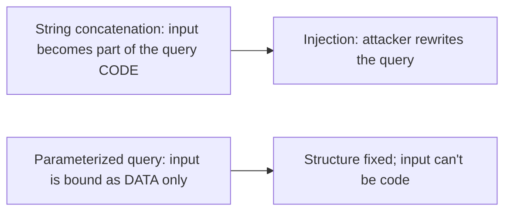
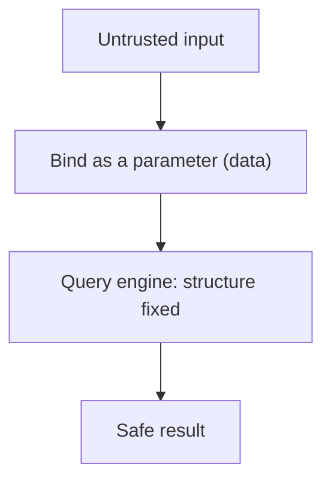
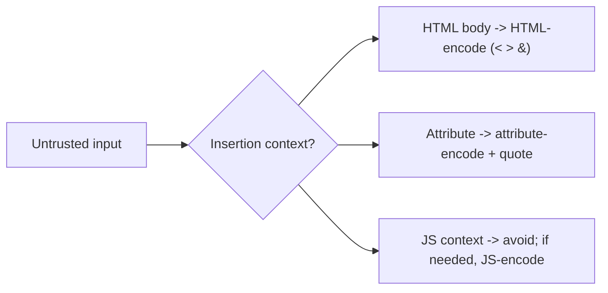
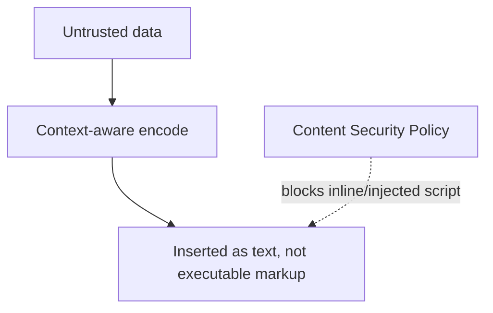

# Web Application Security - Complete Professional Guide

> **Category:** 09_security_and_privacy · **Language:** English

---

### Injection, XSS, broken auth, and the browser trust model
**Original guide written from first principles, current to 2026**

> **Original reference book (English).** This is an **independent, originally written** guide. It is not an extract, summary, or paraphrase of any third-party book; it teaches web application security from first principles with original examples. Canonical books are listed under **References** as pointers only. Each chapter follows the TO-BRAIN editorial standard (see `FILE_CONVENTIONS.md`).
>
> **Scope notice:** web apps are exposed to anyone with a browser, so their security depends on never trusting input and understanding the browser's trust model. This guide covers the most common vulnerability classes and their defenses, current to 2026 (OWASP Top 10).

---

## How to read this guide

| Level | Profile | Parts |
|-------|---------|-------|
| 1 — Beginner | New to web security | Part I |
| 2 — Intermediate | Hardening apps | Part II |

**Target audience:** web developers and security engineers building or assessing web applications.

**Structure of each chapter:** Introduction · Business context · Theoretical concepts · Architecture · Diagrams (Mermaid) · Real examples · Step by step · Complete examples · Exercises · Challenges · Checklist · Best practices · Anti-patterns · Troubleshooting · References.

> **Note on prerequisites.** Assumes web basics (HTTP, HTML, SQL) and the threat-modeling guide.

---

## Table of Contents

**Part I – Never trust input**
1. Injection (SQL and beyond)
2. Cross-site scripting (XSS) and the browser model

**Part II – Identity**
3. Broken authentication and access control

> **Status of this guide:** phased delivery. **Ready:** Part I (Ch. 1–2). **In progress:** Part II.

---

## Part I – Never trust input

Almost every web vulnerability traces to one root cause: **trusting input that crosses a trust boundary**. Data from a user (or any external source) can be hostile. The defenses — validation, parameterization, output encoding — all enforce "treat external input as untrusted." Master that principle and most of the OWASP Top 10 follows.

---

## Chapter 1 — Injection

### 1.1 Introduction

**Injection** happens when untrusted input is interpreted as **code or commands** instead of data — classically SQL injection, but also OS command, LDAP, and others. The fix is the same everywhere: **separate code from data** so input can never change the structure of a query/command. For SQL, that means **parameterized queries** (prepared statements), never string concatenation.

### 1.2 Business context

Injection remains one of the most damaging web vulnerabilities — it can dump or destroy an entire database, bypass authentication, or run commands on a server. A single concatenated query is enough. The defense (parameterization) is cheap and universal, so injection is largely a solved problem *if* developers apply it consistently. The business cost of getting it wrong (breach, data loss, regulatory fines) is enormous; the cost to prevent it is near zero.

### 1.3 Theoretical concepts: separate code from data



In a parameterized query the SQL structure is fixed and sent separately from the parameter **values**; the database never parses user input as SQL. This makes injection structurally impossible for that query. The same principle (use safe APIs that separate code and data) applies to every injection type.

### 1.4 Architecture: input as data, always



### 1.5 Real example

**Scenario.** A login looks up a user by email.

**Problem.** Concatenating the email into SQL lets an attacker inject `' OR '1'='1` to bypass auth or dump data.

**Solution.** A parameterized query binds the email as data.

**Implementation.**

```java
// VULNERABLE: input concatenated into SQL code
String q = "SELECT * FROM users WHERE email = '" + email + "'";   // injectable

// SAFE: parameterized — email is bound as DATA, never parsed as SQL
PreparedStatement ps = conn.prepareStatement(
    "SELECT * FROM users WHERE email = ?");
ps.setString(1, email);    // structure fixed; ' OR '1'='1 is just a literal string
```

**Result.** The malicious input is treated as a literal email value, not SQL — the injection attack does nothing. Auth bypass and data dumping via this query become impossible.

**Future improvements.** Use an ORM/query builder that parameterizes by default; add input validation as defense in depth.

### 1.6 Exercises

1. What is the root cause of injection?
2. Why do parameterized queries prevent SQL injection?
3. Name two non-SQL injection types.

### 1.7 Challenges

- **Challenge.** Find a query built by string concatenation in code you know. Convert it to a parameterized query and explain why it's now safe.

### 1.8 Checklist

- [ ] I never concatenate untrusted input into queries/commands.
- [ ] I use parameterized queries / safe APIs.
- [ ] Input is treated as data, not code.
- [ ] Validation backs up parameterization.

### 1.9 Best practices

- Always parameterize; use safe, code/data-separating APIs.
- Apply least-privilege DB accounts (limit blast radius).
- Validate input as defense in depth.

### 1.10 Anti-patterns

- Building queries/commands by string concatenation.
- Relying only on input filtering (blacklists) to stop injection.
- Running the app DB user as an admin.

### 1.11 Troubleshooting

| Symptom | Likely cause | Action |
|---------|--------------|--------|
| Injectable queries | String-built SQL | Parameterize all queries |
| Filter bypassed | Blacklist approach | Use parameterization, not filtering |
| Huge breach blast radius | Over-privileged DB user | Least-privilege DB accounts |

### 1.12 References

- D. Stuttard, M. Pinto, *The Web Application Hacker's Handbook*, 2nd ed. (Wiley, 2011) — ISBN 978-1118026472.
- OWASP, "Top 10" and "Injection Prevention Cheat Sheet": https://owasp.org.

---

## Chapter 2 — Cross-site scripting (XSS)

### 2.1 Introduction

**Cross-site scripting (XSS)** is injection into the **browser**: untrusted input is rendered into a page as HTML/JavaScript and executes in the victim's browser, in the site's security context. It lets attackers steal sessions, perform actions as the user, or deface pages. The defense is **context-aware output encoding** — encode data for the place it's inserted — plus a Content Security Policy.

### 2.2 Business context

XSS is pervasive and dangerous because it runs with the victim's authenticated session — it can hijack accounts, exfiltrate data, or spread worms. It stems from the same root as SQL injection (untrusted input treated as code), here on the client side. Understanding the **browser trust model** — why a script from your page can act as the user — is essential to defending it. The cost of an XSS breach (account takeover at scale) is severe; the defenses are well understood.

### 2.3 Theoretical concepts: encode for context



The browser's **same-origin** model trusts scripts running on your page — so injected script is trusted too. Prevent injection by **encoding output for its context** (HTML, attribute, URL, JavaScript), so input renders as inert text, not markup/code. Prefer frameworks that auto-encode (React, Angular) and avoid `innerHTML`/`dangerouslySetInnerHTML` with untrusted data. Add a **Content Security Policy** as defense in depth.

### 2.4 Architecture: untrusted data rendered inert



### 2.5 Real example

**Scenario.** A page displays a user-supplied display name.

**Problem.** Rendering it raw lets `<script>steal()</script>` execute in every viewer's browser.

**Solution.** HTML-encode the value (or use a framework that auto-encodes).

**Implementation.**

```js
// VULNERABLE: raw insertion -> script executes
el.innerHTML = "Hello, " + userName;          // XSS if userName = "<script>...</script>"

// SAFE: insert as text (browser renders it inert)
el.textContent = "Hello, " + userName;        // <script> shown as literal text
// In frameworks: {userName} in JSX/templates auto-encodes by default.
```

**Result.** The malicious script is displayed as harmless text rather than executed — XSS is neutralized. Account-hijacking via this field becomes impossible.

**Future improvements.** Add a strict Content Security Policy; audit for any `innerHTML`/`dangerouslySetInnerHTML` use with untrusted data.

### 2.6 Exercises

1. Why does injected script run with the victim's privileges?
2. What is context-aware output encoding?
3. How does a Content Security Policy help?

### 2.7 Challenges

- **Challenge.** Find a place rendering user data via `innerHTML` (or equivalent). Switch to a safe, auto-encoding method and verify a `<script>` payload no longer executes.

### 2.8 Checklist

- [ ] Untrusted output is context-encoded.
- [ ] I avoid `innerHTML`/`dangerouslySetInnerHTML` with untrusted data.
- [ ] I use auto-encoding frameworks/templates.
- [ ] A Content Security Policy is in place.

### 2.9 Best practices

- Encode output for its exact context.
- Prefer frameworks that auto-encode by default.
- Deploy a strict CSP as defense in depth.

### 2.10 Anti-patterns

- Inserting untrusted data as raw HTML.
- Relying on input sanitization alone for XSS.
- No CSP.

### 2.11 Troubleshooting

| Symptom | Likely cause | Action |
|---------|--------------|--------|
| Script executes from user input | Raw HTML insertion | Context-encode; use textContent/auto-encoding |
| XSS despite filtering | Input-only defense | Encode on output; add CSP |
| Injected inline scripts run | No CSP | Add a strict Content Security Policy |

### 2.12 References

- M. Zalewski, *The Tangled Web* (No Starch Press, 2011) — ISBN 978-1593273880.
- OWASP, "XSS Prevention Cheat Sheet" & "Top 10": https://owasp.org.

---

> **End of Part I.** You can now defend against the two most common web vulnerability classes by enforcing one principle — never trust input across a boundary: stop injection by separating code from data (parameterized queries and safe APIs), and stop XSS with context-aware output encoding plus a Content Security Policy, understanding that the browser trusts scripts running in your page's origin. **Part II — Identity** (Chapter 3) covers broken authentication (session management, credential handling) and broken access control (the most common modern web risk) — ensuring users can only do and see what they're authorized to.

<!--APPEND-PART-II-->
