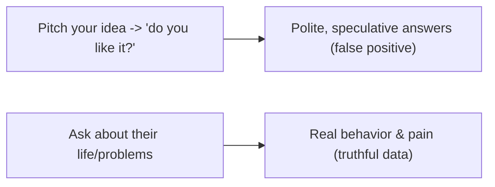
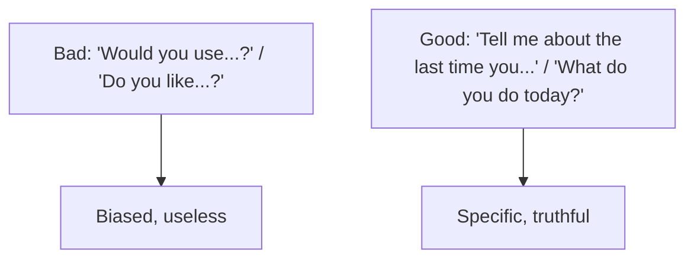
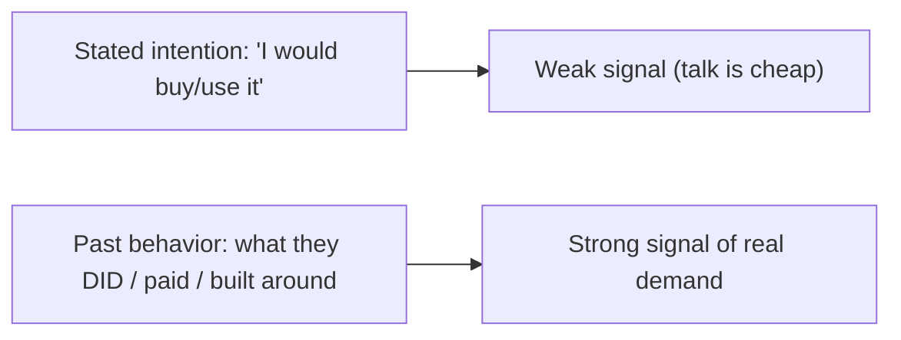
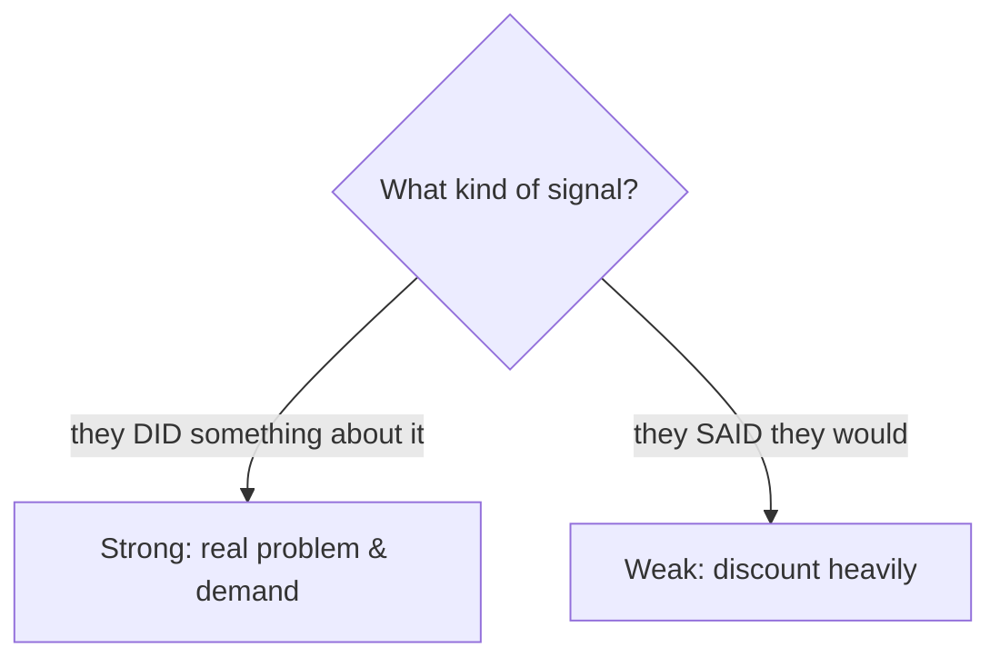
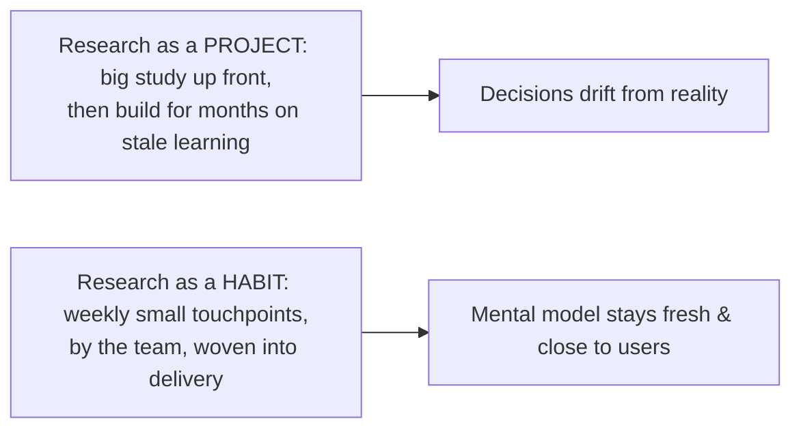
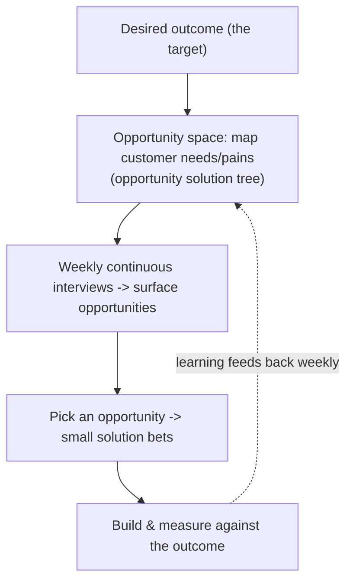

# Customer Discovery and Research - Complete Professional Guide

> **Category:** 11_management_product_process · **Language:** English

---

### Talking to users without biasing them, and continuous discovery
**Original guide written from first principles, current to 2026**

> **Original reference book (English).** This is an **independent, originally written** guide. It is not an extract, summary, or paraphrase of any third-party book; it teaches customer discovery from first principles with original examples. Canonical books are listed under **References** as pointers only. Each chapter follows the TO-BRAIN editorial standard (see `FILE_CONVENTIONS.md`).
>
> **Scope notice:** the cheapest way to avoid building the wrong thing is to learn from users *before* and *during* building. This guide covers unbiased customer conversations and continuous discovery, current to 2026.

---

## How to read this guide

| Level | Profile | Parts |
|-------|---------|-------|
| 1 — Beginner | New to user research | Part I |
| 2 — Intermediate | Building a discovery habit | Part II |

**Target audience:** product managers, designers, founders, and engineers who want evidence before building.

**Structure of each chapter:** Introduction · Business context · Theoretical concepts · Architecture · Diagrams (Mermaid) · Real examples · Step by step · Complete examples · Exercises · Challenges · Checklist · Best practices · Anti-patterns · Troubleshooting · References.

> **Note on prerequisites.** Assumes the product-management guide.

---

## Table of Contents

**Part I – Talking to users**
1. Ask about their life, not your idea
2. Past behavior over future intentions

**Part II – Habit**
3. Continuous discovery, not one-off research

> **Status of this guide:** complete for its declared scope. **Ready:** Parts I–II (Ch. 1–3).

---

## Part I – Talking to users

Most "customer research" is worthless because it's biased: people are polite, they speculate, and leading questions get the answers you fished for. The skill is conducting conversations that yield **truthful, useful** data — by asking about the user's actual life and behavior rather than pitching your idea and asking if they like it.

---

## Chapter 1 — Ask about their life, not your idea

### 1.1 Introduction

The cardinal rule of customer conversations: **talk about their life and problems, not your idea**. The moment you pitch ("would you use an app that…?"), people become polite and speculative, and the data goes bad. Instead, ask about what they actually do, the problems they actually have, and what they've actually tried. You learn the truth by not mentioning your solution.

### 1.2 Business context

Founders and teams routinely "validate" ideas by asking friends and prospects if they like the concept — and get false encouragement that leads to building something nobody buys. Learning to run unbiased conversations means the feedback you get is real, so you avoid the catastrophic cost of building the wrong product. Good discovery conversations are nearly free and prevent the single most expensive mistake in product: building something unwanted.

### 1.3 Theoretical concepts: avoid the pitch and the bias



Three traps to avoid: **compliments** (people are nice — ignore them), **fluff** (hypotheticals and generics about the future — worthless), and **ideas/feature requests** (don't take them at face value; dig for the underlying problem). Good questions are about the **past and specifics**: "Tell me about the last time you did X."

### 1.4 Architecture: questions that surface truth



### 1.5 Real example

**Scenario.** A founder wants to validate a meal-planning app idea.

**Problem.** Asking "would you use a meal-planning app?" gets polite yeses — false validation.

**Solution.** Ask about their actual life: how they currently plan meals, the last time it went wrong, what they've tried.

**Implementation (the conversation).**

```text
Bad:  "Would you use an app that plans your meals?"   -> "Sure, sounds great!" (worthless)
Good: "Walk me through how you decided dinner yesterday."
      "When did meal planning last stress you out? What did you do?"
      "What have you tried to fix it? Why didn't it stick?"
-> reveals real behavior, pain, and prior (failed) solutions — actionable truth
```

**Result.** Instead of a polite false-positive, the founder learns whether a real, painful problem exists and what's been tried — the basis for a real decision to build or not.

**Future improvements.** Look for evidence of the problem mattering (have they spent money/time/effort on it?) — talk is cheap, behavior isn't.

### 1.6 Exercises

1. Why does pitching your idea bias the conversation?
2. Name the three conversation traps to avoid.
3. Rewrite "would you use X?" as a good question.

### 1.7 Challenges

- **Challenge.** Plan a user conversation about a problem you think exists — without mentioning your solution. Write five questions about their past behavior.

### 1.8 Checklist

- [ ] I ask about their life/problems, not my idea.
- [ ] I ignore compliments and hypotheticals.
- [ ] I dig past feature requests to the real problem.
- [ ] My questions target specific past behavior.

### 1.9 Best practices

- Never pitch during discovery; ask about their world.
- Ask about specific past events, not future intentions.
- Treat compliments as noise; seek facts and behavior.

### 1.10 Anti-patterns

- "Do you like my idea?" validation.
- Taking compliments/feature requests at face value.
- Hypothetical "would you" questions.

### 1.11 Troubleshooting

| Symptom | Likely cause | Action |
|---------|--------------|--------|
| Everyone "loves" the idea | Pitching / leading questions | Ask about their life, not your idea |
| Vague, hypothetical answers | "Would you" questions | Ask about specific past behavior |
| Built it, nobody wants it | False validation | Run unbiased discovery before building |

### 1.12 References

- R. Fitzpatrick, *The Mom Test* (2013) — Ch. 1, "The Mom Test" (talk about their life, not your idea), and Ch. 2, "Avoiding Bad Data" (compliments, fluff, ideas). ISBN 978-1492180746.
- E. Hall, *Just Enough Research*, 2nd ed. (A Book Apart, 2019) — Ch. 2, "The Basics," and Ch. 5, "User Research" (interviewing users). ISBN 978-1937557102.

---

## Chapter 2 — Past behavior over future intentions

### 2.1 Introduction

People are terrible at predicting their own future behavior but reliable at reporting what they actually did. So discovery weights **past behavior** over **stated intentions**. "Would you pay for this?" is nearly worthless; "what do you currently pay for to solve this?" is gold. Evidence of real effort, money, or workarounds spent on a problem is the strongest signal that it's worth solving.

### 2.2 Business context

Stated intentions ("I'd definitely buy that") routinely fail to predict actual purchases, leading teams to build for demand that evaporates. Grounding decisions in evidence of past behavior — what people already do, pay for, and work around — gives a far more reliable signal of real demand. This prevents the expensive trap of building for enthusiastic words that don't translate into actions, focusing investment on problems people demonstrably care about.

### 2.3 Theoretical concepts: behavior is signal, talk is cheap



Look for **commitment and evidence**: have they spent money, time, or effort on this problem already? Built a workaround? A user who hacked together a spreadsheet to cope is far stronger evidence than ten who say "great idea." Seek the problem people are already *paying to solve* (in money or effort) — that's where real demand is.

### 2.4 Architecture: weigh evidence, not enthusiasm



### 2.5 Real example

**Scenario.** Validating demand for a paid analytics tool.

**Problem.** Survey says "80% would pay" — but surveys of intention mislead.

**Solution.** Look for behavioral evidence: do they currently pay for or hack together analytics? Will they pre-commit (a deposit, a pilot)?

**Implementation (behavior-based signals).**

```text
Weak:   "Would you pay $50/mo for this?" -> 80% yes (discount heavily)
Strong: "What do you use today, and what does it cost you?" -> they pay for X / built a spreadsheet
        "Would you join a paid pilot starting next week?" -> actual commitment (or not)
-> real demand shows in current spend/effort and willingness to commit now
```

**Result.** The team distinguishes enthusiastic words from real demand by looking at what users already do and whether they'll commit — avoiding building for intentions that wouldn't convert.

**Future improvements.** Use small commitment tests (pre-orders, paid pilots, landing-page signups with a deposit) as the strongest pre-build signal.

### 2.6 Exercises

1. Why weight past behavior over stated intentions?
2. What kinds of evidence indicate real demand?
3. Why is "would you pay?" weak?

### 2.7 Challenges

- **Challenge.** For a problem you want to solve, find evidence people already spend money or effort on it (existing tools, workarounds). Is the evidence there?

### 2.8 Checklist

- [ ] I weight behavior over stated intentions.
- [ ] I look for existing spend/effort/workarounds.
- [ ] I seek real commitment, not enthusiasm.
- [ ] I discount "would you" answers.

### 2.9 Best practices

- Ask what people currently do and pay for.
- Seek evidence of real effort spent on the problem.
- Use small commitment tests as strong signals.

### 2.10 Anti-patterns

- Trusting intention surveys as demand.
- Mistaking enthusiasm for evidence.
- Skipping behavioral evidence before building.

### 2.11 Troubleshooting

| Symptom | Likely cause | Action |
|---------|--------------|--------|
| "Validated" demand didn't convert | Relied on stated intentions | Seek behavioral evidence/commitment |
| Can't tell real demand | Only have enthusiasm | Look at current spend/effort |
| Pre-build over-optimism | No commitment test | Run a small commitment test |

### 2.12 References

- R. Fitzpatrick, *The Mom Test* (2013) — Ch. 5, "Commitment and Advancement" (past behavior and real commitment over hypotheticals). ISBN 978-1492180746.
- T. Torres, *Continuous Discovery Habits* (Product Talk, 2021) — Ch. 5, "Continuous Interviewing" (regular cadence; behavior-based signals). ISBN 978-1736633304.

---

> **End of Part I.** You can now run discovery that yields truth: talk about the user's life and problems (never pitch your idea), avoid compliments/fluff/face-value feature requests, and weight **past behavior and evidence of real effort** over stated future intentions — seeking the problems people already pay (in money or effort) to solve. **Part II — Habit** (Chapter 3) covers continuous discovery: making small, regular contact with users a weekly habit woven into delivery, rather than a one-off research project, so you keep learning as you build.

## Part II – Habit

Knowing *how* to talk to users (Part I) is wasted if you only do it once, at the start, as a "research phase." Markets, users, and your own understanding drift continuously, so the learning has to be continuous too. The shift is from research as a **project** (a big study, then back to building) to research as a **habit** — small, regular contact with customers woven into the rhythm of delivery, owned by the team building the product.

---

## Chapter 3 — Continuous discovery, not one-off research

### 3.1 Introduction

**Continuous discovery** means, at minimum, **weekly touchpoints with customers**, by the **team building the product**, conducting **small research activities**, in pursuit of a **desired outcome**. Each part matters: weekly (not quarterly), by the team itself (not outsourced to a research department), small (a single interview, not a six-week study), and tied to an outcome (you're learning toward a specific goal, not gathering facts in general). Discovery and delivery run in parallel, continuously, not in separate phases.

### 3.2 Business context

One-off research goes stale the moment building starts: decisions made months ago on old learning quietly become wrong, and the team has no cheap way to course-correct. Worse, when research is a separate team's job, the people making product decisions never build the customer empathy that drives good judgment. A continuous habit keeps the team's mental model fresh and close to reality, so the hundreds of small decisions made every week are informed by recent contact with real users — dramatically lowering the risk of drifting into building the wrong thing.

### 3.3 Theoretical concepts: a habit, not a phase



The unit of work is the **small, regular activity**: a single customer interview each week beats a giant study twice a year. The **product trio** (product, design, engineering) does the discovery *together* so the learning lands directly with the people who decide and build — empathy can't be handed off in a report. And every activity is anchored to a **desired outcome**, so discovery is steering toward a goal, not collecting trivia.

### 3.4 Architecture: discovery in parallel with delivery



### 3.5 Real example

**Scenario.** A team did three weeks of intensive user research at project kickoff, then went heads-down building for six months.

**Problem.** By month four, several early assumptions are clearly wrong, but there's no mechanism to learn that — the "research phase" is over, and the team is committed to a stale plan. They discover the mistakes only at launch.

**Solution.** Replace the research phase with a continuous habit: the trio runs **one customer interview every week**, anchored to the quarter's outcome, mapping what they hear onto the opportunity space and feeding it straight into what they build next.

**Implementation (from phase to habit).**

```text
Before: [3-week research phase] -> [6 months building on frozen learning] -> launch -> surprises
After:  weekly cadence, every week, all quarter:
        - automate recruiting so an interview is always scheduled (no per-study setup)
        - the trio interviews 1 customer -> surface opportunities (pains/needs), not validate a pitch
        - update the opportunity solution tree; pick the next opportunity to address
        - small solution bet -> measure against the outcome -> learning feeds next week
=> the plan self-corrects continuously instead of failing all at once at launch
```

**Result.** The team catches wrong assumptions in week 4, not at launch, because contact with customers never stopped. Discovery and delivery run together; the roadmap bends toward what's actually true. Empathy lives with the trio, not in an archived report.

**Future improvements.** Automate interview recruiting so a conversation is always on the calendar, and use an opportunity solution tree to keep weekly learning connected to the target outcome rather than scattering.

### 3.6 Exercises

1. State the four parts of the definition of continuous discovery.
2. Why should the team building the product do the discovery itself?
3. Contrast research as a project with research as a habit.

### 3.7 Challenges

- **Challenge.** Set up a weekly customer touchpoint for your team for the next month: automate recruiting so one interview is always booked, and tie what you learn to a single outcome. After four weeks, what changed in your decisions?

### 3.8 Checklist

- [ ] The team has at least weekly contact with customers.
- [ ] Discovery is done by the product trio, not outsourced.
- [ ] Activities are small and continuous, not big and occasional.
- [ ] Every activity is anchored to a desired outcome.

### 3.9 Best practices

- Keep a weekly interviewing cadence; automate recruiting so it never lapses.
- Have product, design, and engineering do discovery together.
- Anchor discovery to an outcome and map findings to the opportunity space.

### 3.10 Anti-patterns

- A one-off "research phase" followed by months of building on stale learning.
- Outsourcing discovery to a separate team (empathy can't be handed off).
- "Research" with no connection to a target outcome.

### 3.11 Troubleshooting

| Symptom | Likely cause | Action |
|---------|--------------|--------|
| Assumptions found wrong only at launch | Research was a one-off phase | Adopt a weekly continuous-discovery cadence |
| Team lacks customer empathy | Discovery outsourced | Have the trio interview customers directly |
| Discovery feels unfocused | Not tied to an outcome | Anchor activities to a desired outcome / opportunity tree |

### 3.12 References

- T. Torres, *Continuous Discovery Habits* (Product Talk, 2021) — Ch. 1, "The What and Why of Continuous Discovery" (the weekly-touchpoint definition and the product trio). ISBN 978-1736633304.
- T. Torres, *Continuous Discovery Habits* (Product Talk, 2021) — Ch. 5, "Continuous Interviewing" (cadence, automated recruiting), and Ch. 6, "Mapping the Opportunity Space" (the opportunity solution tree).

---

> **End of Part II.** You can now run discovery as a continuous habit rather than a one-off study: at least **weekly touchpoints with customers**, conducted by the **product trio**, in **small** activities anchored to a **desired outcome**, with discovery and delivery running in parallel so the plan self-corrects as you build. Combined with Part I's unbiased conversation skills (ask about their life; weight past behavior), you have a complete, low-cost defense against building the wrong thing.
