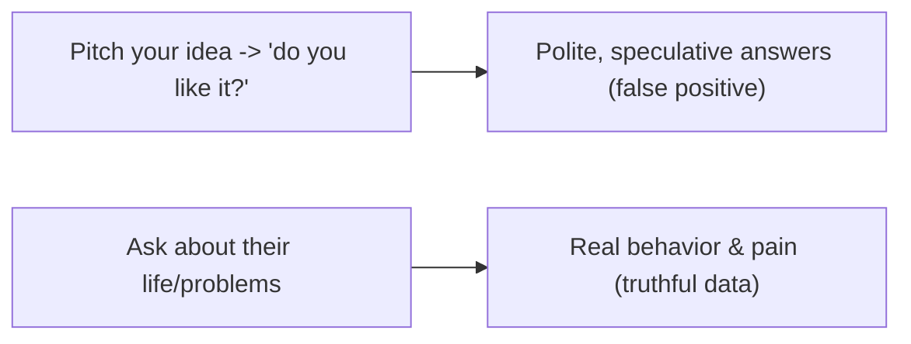
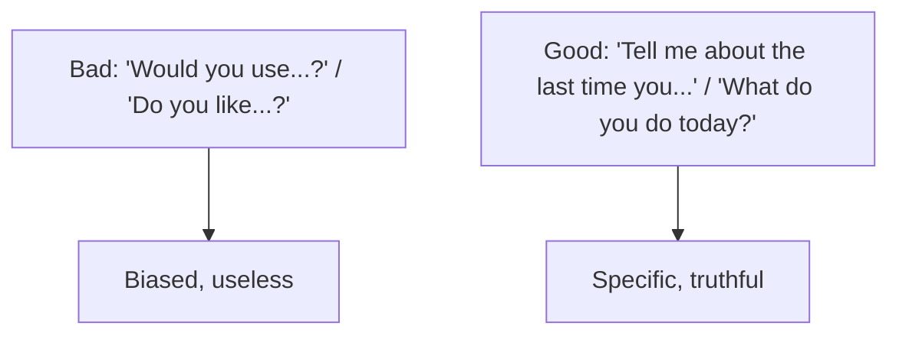
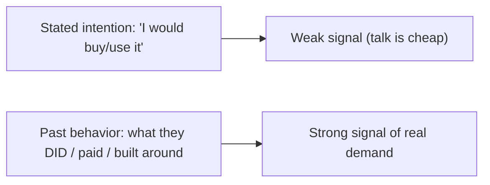
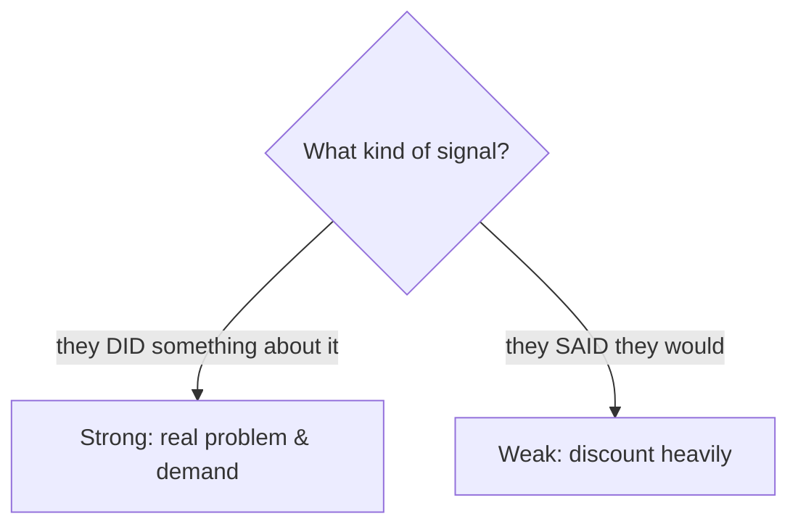

# Customer Discovery and Research - Complete Professional Guide

> **Category:** 11_management_product_process · **Language:** English

---

### Talking to users without biasing them, and continuous discovery
**Original guide written from first principles, current to 2026**

> **Original reference book (English).** This is an **independent, originally written** guide. It is not an extract, summary, or paraphrase of any third-party book; it teaches customer discovery from first principles with original examples. Canonical books are listed under **References** as pointers only. Each chapter follows the TO-BRAIN editorial standard (see `FILE_CONVENTIONS.md`).
>
> **Scope notice:** the cheapest way to avoid building the wrong thing is to learn from users *before* and *during* building. This guide covers unbiased customer conversations and continuous discovery, current to 2026.

---

## How to read this guide

| Level | Profile | Parts |
|-------|---------|-------|
| 1 — Beginner | New to user research | Part I |
| 2 — Intermediate | Building a discovery habit | Part II |

**Target audience:** product managers, designers, founders, and engineers who want evidence before building.

**Structure of each chapter:** Introduction · Business context · Theoretical concepts · Architecture · Diagrams (Mermaid) · Real examples · Step by step · Complete examples · Exercises · Challenges · Checklist · Best practices · Anti-patterns · Troubleshooting · References.

> **Note on prerequisites.** Assumes the product-management guide.

---

## Table of Contents

**Part I – Talking to users**
1. Ask about their life, not your idea
2. Past behavior over future intentions

**Part II – Habit**
3. Continuous discovery, not one-off research

> **Status of this guide:** phased delivery. **Ready:** Part I (Ch. 1–2). **In progress:** Part II.

---

## Part I – Talking to users

Most "customer research" is worthless because it's biased: people are polite, they speculate, and leading questions get the answers you fished for. The skill is conducting conversations that yield **truthful, useful** data — by asking about the user's actual life and behavior rather than pitching your idea and asking if they like it.

---

## Chapter 1 — Ask about their life, not your idea

### 1.1 Introduction

The cardinal rule of customer conversations: **talk about their life and problems, not your idea**. The moment you pitch ("would you use an app that…?"), people become polite and speculative, and the data goes bad. Instead, ask about what they actually do, the problems they actually have, and what they've actually tried. You learn the truth by not mentioning your solution.

### 1.2 Business context

Founders and teams routinely "validate" ideas by asking friends and prospects if they like the concept — and get false encouragement that leads to building something nobody buys. Learning to run unbiased conversations means the feedback you get is real, so you avoid the catastrophic cost of building the wrong product. Good discovery conversations are nearly free and prevent the single most expensive mistake in product: building something unwanted.

### 1.3 Theoretical concepts: avoid the pitch and the bias



Three traps to avoid: **compliments** (people are nice — ignore them), **fluff** (hypotheticals and generics about the future — worthless), and **ideas/feature requests** (don't take them at face value; dig for the underlying problem). Good questions are about the **past and specifics**: "Tell me about the last time you did X."

### 1.4 Architecture: questions that surface truth



### 1.5 Real example

**Scenario.** A founder wants to validate a meal-planning app idea.

**Problem.** Asking "would you use a meal-planning app?" gets polite yeses — false validation.

**Solution.** Ask about their actual life: how they currently plan meals, the last time it went wrong, what they've tried.

**Implementation (the conversation).**

```text
Bad:  "Would you use an app that plans your meals?"   -> "Sure, sounds great!" (worthless)
Good: "Walk me through how you decided dinner yesterday."
      "When did meal planning last stress you out? What did you do?"
      "What have you tried to fix it? Why didn't it stick?"
-> reveals real behavior, pain, and prior (failed) solutions — actionable truth
```

**Result.** Instead of a polite false-positive, the founder learns whether a real, painful problem exists and what's been tried — the basis for a real decision to build or not.

**Future improvements.** Look for evidence of the problem mattering (have they spent money/time/effort on it?) — talk is cheap, behavior isn't.

### 1.6 Exercises

1. Why does pitching your idea bias the conversation?
2. Name the three conversation traps to avoid.
3. Rewrite "would you use X?" as a good question.

### 1.7 Challenges

- **Challenge.** Plan a user conversation about a problem you think exists — without mentioning your solution. Write five questions about their past behavior.

### 1.8 Checklist

- [ ] I ask about their life/problems, not my idea.
- [ ] I ignore compliments and hypotheticals.
- [ ] I dig past feature requests to the real problem.
- [ ] My questions target specific past behavior.

### 1.9 Best practices

- Never pitch during discovery; ask about their world.
- Ask about specific past events, not future intentions.
- Treat compliments as noise; seek facts and behavior.

### 1.10 Anti-patterns

- "Do you like my idea?" validation.
- Taking compliments/feature requests at face value.
- Hypothetical "would you" questions.

### 1.11 Troubleshooting

| Symptom | Likely cause | Action |
|---------|--------------|--------|
| Everyone "loves" the idea | Pitching / leading questions | Ask about their life, not your idea |
| Vague, hypothetical answers | "Would you" questions | Ask about specific past behavior |
| Built it, nobody wants it | False validation | Run unbiased discovery before building |

### 1.12 References

- R. Fitzpatrick, *The Mom Test* (2013) — ISBN 978-1492180746.
- E. Hall, *Just Enough Research*, 2nd ed. (A Book Apart, 2019) — ISBN 978-1937557102.

---

## Chapter 2 — Past behavior over future intentions

### 2.1 Introduction

People are terrible at predicting their own future behavior but reliable at reporting what they actually did. So discovery weights **past behavior** over **stated intentions**. "Would you pay for this?" is nearly worthless; "what do you currently pay for to solve this?" is gold. Evidence of real effort, money, or workarounds spent on a problem is the strongest signal that it's worth solving.

### 2.2 Business context

Stated intentions ("I'd definitely buy that") routinely fail to predict actual purchases, leading teams to build for demand that evaporates. Grounding decisions in evidence of past behavior — what people already do, pay for, and work around — gives a far more reliable signal of real demand. This prevents the expensive trap of building for enthusiastic words that don't translate into actions, focusing investment on problems people demonstrably care about.

### 2.3 Theoretical concepts: behavior is signal, talk is cheap



Look for **commitment and evidence**: have they spent money, time, or effort on this problem already? Built a workaround? A user who hacked together a spreadsheet to cope is far stronger evidence than ten who say "great idea." Seek the problem people are already *paying to solve* (in money or effort) — that's where real demand is.

### 2.4 Architecture: weigh evidence, not enthusiasm



### 2.5 Real example

**Scenario.** Validating demand for a paid analytics tool.

**Problem.** Survey says "80% would pay" — but surveys of intention mislead.

**Solution.** Look for behavioral evidence: do they currently pay for or hack together analytics? Will they pre-commit (a deposit, a pilot)?

**Implementation (behavior-based signals).**

```text
Weak:   "Would you pay $50/mo for this?" -> 80% yes (discount heavily)
Strong: "What do you use today, and what does it cost you?" -> they pay for X / built a spreadsheet
        "Would you join a paid pilot starting next week?" -> actual commitment (or not)
-> real demand shows in current spend/effort and willingness to commit now
```

**Result.** The team distinguishes enthusiastic words from real demand by looking at what users already do and whether they'll commit — avoiding building for intentions that wouldn't convert.

**Future improvements.** Use small commitment tests (pre-orders, paid pilots, landing-page signups with a deposit) as the strongest pre-build signal.

### 2.6 Exercises

1. Why weight past behavior over stated intentions?
2. What kinds of evidence indicate real demand?
3. Why is "would you pay?" weak?

### 2.7 Challenges

- **Challenge.** For a problem you want to solve, find evidence people already spend money or effort on it (existing tools, workarounds). Is the evidence there?

### 2.8 Checklist

- [ ] I weight behavior over stated intentions.
- [ ] I look for existing spend/effort/workarounds.
- [ ] I seek real commitment, not enthusiasm.
- [ ] I discount "would you" answers.

### 2.9 Best practices

- Ask what people currently do and pay for.
- Seek evidence of real effort spent on the problem.
- Use small commitment tests as strong signals.

### 2.10 Anti-patterns

- Trusting intention surveys as demand.
- Mistaking enthusiasm for evidence.
- Skipping behavioral evidence before building.

### 2.11 Troubleshooting

| Symptom | Likely cause | Action |
|---------|--------------|--------|
| "Validated" demand didn't convert | Relied on stated intentions | Seek behavioral evidence/commitment |
| Can't tell real demand | Only have enthusiasm | Look at current spend/effort |
| Pre-build over-optimism | No commitment test | Run a small commitment test |

### 2.12 References

- R. Fitzpatrick, *The Mom Test* (2013) — ISBN 978-1492180746.
- T. Torres, *Continuous Discovery Habits* (Product Talk, 2021) — ISBN 978-1736633304.

---

> **End of Part I.** You can now run discovery that yields truth: talk about the user's life and problems (never pitch your idea), avoid compliments/fluff/face-value feature requests, and weight **past behavior and evidence of real effort** over stated future intentions — seeking the problems people already pay (in money or effort) to solve. **Part II — Habit** (Chapter 3) covers continuous discovery: making small, regular contact with users a weekly habit woven into delivery, rather than a one-off research project, so you keep learning as you build.

<!--APPEND-PART-II-->
