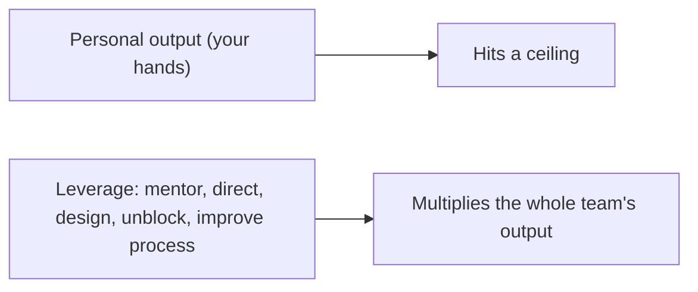
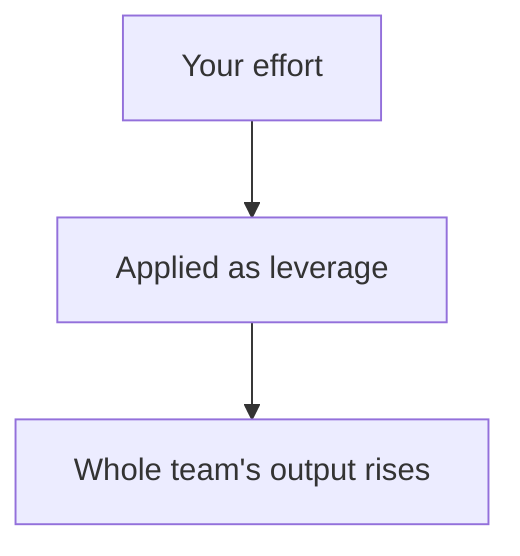
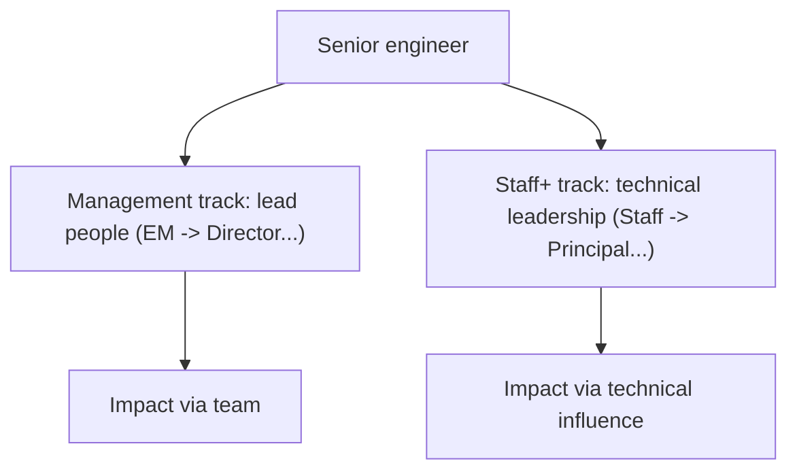
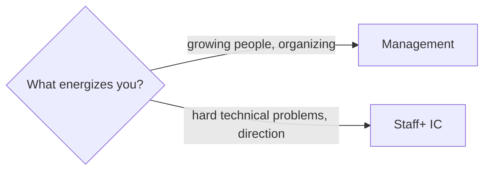
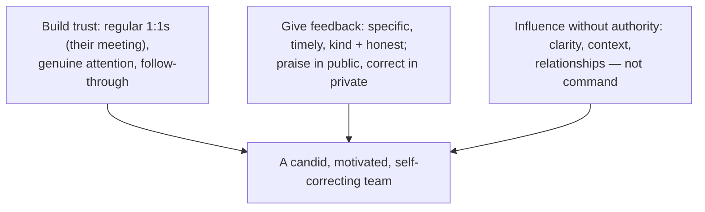
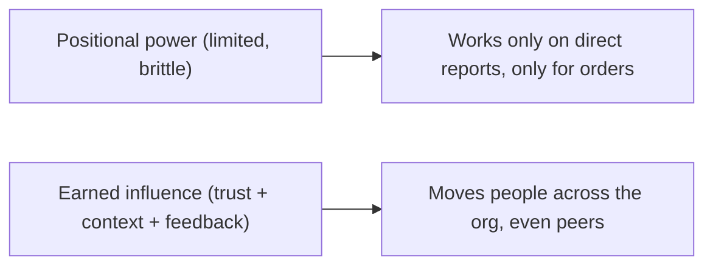

# Engineering Management and Career Growth - Complete Professional Guide

> **Category:** 11_management_product_process · **Language:** English

---

### The IC and management tracks, leadership, and scaling your impact
**Original guide written from first principles, current to 2026**

> **Original reference book (English).** This is an **independent, originally written** guide. It is not an extract, summary, or paraphrase of any third-party book; it teaches engineering leadership from first principles with original examples. Canonical books are listed under **References** as pointers only. Each chapter follows the TO-BRAIN editorial standard (see `FILE_CONVENTIONS.md`).
>
> **Scope notice:** as engineers grow, impact comes less from personal coding and more from leverage — through people (management) or technical influence (staff+). This guide covers both tracks and the leadership skills they share, current to 2026.

---

## How to read this guide

| Level | Profile | Parts |
|-------|---------|-------|
| 1 — Beginner | Senior engineer growing | Part I |
| 2 — Intermediate | New leader/manager | Part II |

**Target audience:** senior engineers, tech leads, and new managers navigating career growth.

**Structure of each chapter:** Introduction · Business context · Theoretical concepts · Architecture · Diagrams (Mermaid) · Real examples · Step by step · Complete examples · Exercises · Challenges · Checklist · Best practices · Anti-patterns · Troubleshooting · References.

> **Note on prerequisites.** Assumes several years of engineering experience.

---

## Table of Contents

**Part I – Two tracks**
1. Scaling impact: from doing to leverage
2. The management track and the staff+ track

**Part II – Leading**
3. The fundamentals of leading people

> **Status of this guide:** complete for its declared scope. **Ready:** Parts I–II (Ch. 1–3).

---

## Part I – Two tracks

Early careers reward how much **you** produce. Senior careers reward how much you make **others and the system** produce — leverage. This shift splits into two tracks: **management** (impact through leading people) and **staff+ IC** (impact through technical leadership). Both are senior; both are about multiplying impact beyond your own hands.

---

## Chapter 1 — Scaling impact: from doing to leverage

### 1.1 Introduction

The fundamental career transition for senior engineers is from **doing the work** to **creating leverage** — making the team and system more effective than your hands alone could. Leverage comes from mentoring, setting technical direction, removing obstacles, designing systems others build on, and improving how the team works. Your value stops being measured in code you wrote and starts being measured in outcomes you enabled.

### 1.2 Business context

Organizations need senior people to multiply the effectiveness of everyone else, not just be slightly faster coders. An engineer who only optimizes personal output hits a ceiling; one who creates leverage (better designs, unblocked teammates, raised standards) has impact far exceeding their individual capacity. Recognizing and rewarding this is how companies scale engineering quality — and recognizing it in yourself is how you keep growing past senior.

### 1.3 Theoretical concepts: leverage > personal output



Leverage activities: **mentoring** (raise others' level), **technical direction** (good decisions others build on), **unblocking** (remove obstacles for many), **designing foundations** (systems/patterns others reuse), and **improving process** (make the team faster). A small investment here returns far more than the same time spent coding alone.

### 1.4 Architecture: from one to many



### 1.5 Real example

**Scenario.** A staff engineer spends all their time coding features fast.

**Problem.** They're productive but their impact is capped at one person's output, and juniors keep making the same avoidable mistakes.

**Solution.** Reallocate time to leverage: a reusable pattern/library, a design review habit, mentoring — multiplying the team.

**Implementation (shift to leverage).**

```text
Before: 100% personal coding -> impact = 1 strong engineer
After:  build a reusable foundation others build on (leverage)
        run design reviews that prevent recurring mistakes (leverage)
        mentor two juniors to mid-level (leverage)
=> the team's total output and quality rise far beyond one person's coding
```

**Result.** The engineer's impact multiplies through the team — better foundations, fewer repeated mistakes, stronger colleagues — far exceeding what their individual coding could produce.

**Future improvements.** Choose the track (management vs staff+) that best fits how you want to create leverage (Chapter 2).

### 1.6 Exercises

1. What's the senior-career shift in how impact is measured?
2. Name three leverage activities.
3. Why does personal output alone hit a ceiling?

### 1.7 Challenges

- **Challenge.** List how you spend your week. What fraction is personal output vs leverage? Move one recurring task into a leverage activity (a doc, a pattern, mentoring).

### 1.8 Checklist

- [ ] I measure impact by what I enable, not just what I build.
- [ ] I invest in mentoring and direction.
- [ ] I build foundations others reuse.
- [ ] I unblock and improve how the team works.

### 1.9 Best practices

- Spend senior time on high-leverage activities.
- Multiply others through mentoring and foundations.
- Track impact as team outcomes, not personal commits.

### 1.10 Anti-patterns

- Senior engineers who only optimize personal output.
- Hoarding work instead of enabling others.
- Measuring seniority by lines of code.

### 1.11 Troubleshooting

| Symptom | Likely cause | Action |
|---------|--------------|--------|
| Growth stalled at senior | Only personal output | Shift to leverage activities |
| Team repeats mistakes | No mentoring/direction | Invest in raising others |
| You're a bottleneck | Hoarding work | Build foundations; delegate |

### 1.12 References

- W. Larson, *Staff Engineer* (2021) — Overview, "What do Staff engineers actually do?" (impact through leverage beyond personal output). ISBN 978-1736417911.
- The StaffEng community on technical leadership: https://staffeng.com.

---

## Chapter 2 — The management and staff+ tracks

### 2.1 Introduction

Senior growth forks into two tracks of equal seniority. The **management** track creates impact by **leading people**: hiring, growing, and coordinating a team. The **staff+ IC** track creates impact through **technical leadership**: setting direction, solving the hardest problems, and raising engineering quality across teams — without managing people. Choosing well means matching the track to what energizes you.

### 2.2 Business context

A common, costly mistake is forcing strong engineers into management as the *only* path to seniority — losing a great engineer and gaining a reluctant manager. Healthy organizations offer parallel ladders so people can grow on the track that fits. Understanding the tracks helps individuals choose well and helps companies retain both great engineers and great managers — both of which they critically need.

### 2.3 Theoretical concepts: two ladders



Both are senior and well-compensated; they differ in **how** you create leverage. Management: through people (coaching, organizing, hiring). Staff+: through technical influence (architecture, hard problems, cross-team standards, mentoring on craft). Some skills overlap (communication, influence, judgment); the day-to-day differs greatly.

### 2.4 Architecture: pick by energy and strength



### 2.5 Real example

**Scenario.** A strong senior engineer is offered a management role as "the next step."

**Problem.** They love deep technical work and dislike the idea of meetings and people-admin, but feel management is the only way up.

**Solution.** Recognize the staff+ track exists; pursue technical leadership (architecture, cross-team impact) instead of management.

**Implementation (choose the fitting track).**

```text
Management fit:  enjoys 1:1s, hiring, unblocking people, org work
Staff+ fit:      enjoys hard technical problems, setting direction, mentoring craft
This engineer -> staff+ track: lead architecture, solve the hardest problems,
                 raise standards across teams — grows in seniority without managing
```

**Result.** The engineer grows in seniority and impact on the track that fits, instead of becoming an unhappy, ineffective manager. The company keeps a great engineer *and* the role they thrive in.

**Future improvements.** Whichever track, develop the shared leadership fundamentals (communication, influence) covered in Part II.

### 2.6 Exercises

1. Contrast the management and staff+ tracks.
2. Why is forcing everyone into management harmful?
3. What's the question to ask when choosing a track?

### 2.7 Challenges

- **Challenge.** Honestly assess which track energizes you (people leadership vs technical leadership). What would your next 12 months look like on that track?

### 2.8 Checklist

- [ ] I know both tracks are senior and valid.
- [ ] I understand how each creates leverage.
- [ ] I've considered which fits my strengths/energy.
- [ ] I won't take management just because it's "the only way up."

### 2.9 Best practices

- Choose the track that matches what energizes you.
- Develop shared leadership skills on either track.
- Advocate for parallel ladders if your org lacks them.

### 2.10 Anti-patterns

- Management as the only path to seniority.
- Taking a track for status, not fit.
- Treating staff+ as "less than" management.

### 2.11 Troubleshooting

| Symptom | Likely cause | Action |
|---------|--------------|--------|
| Great engineer, unhappy manager | Forced into management | Move to/return to staff+ track |
| Career stalled, no fit | Wrong track for strengths | Switch to the energizing track |
| No senior IC path | Org lacks parallel ladder | Advocate for a staff+ ladder |

### 2.12 References

- C. Fournier, *The Manager's Path* (O'Reilly, 2017) — Ch. 3, "Tech Lead" (leading without managing), and Ch. 4, "Managing People." ISBN 978-1491973899.
- W. Larson, *Staff Engineer* (2021) — Overview, "Staff engineer archetypes" (Tech Lead, Architect, Solver, Right Hand), ISBN 978-1736417911; *An Elegant Puzzle* (Stripe Press, 2019) — Ch. 6, "Careers" (parallel ladders / leveling), ISBN 978-1732265189.

---

> **End of Part I.** You can now navigate senior engineering growth: shift from personal output to **leverage** (multiplying the team through mentoring, direction, foundations, and process), and choose between the two equally-senior tracks — **management** (impact through leading people) and **staff+ IC** (impact through technical leadership) — by what genuinely energizes you. **Part II — Leading** (Chapter 3) covers the leadership fundamentals shared by both tracks: communication, building trust, giving feedback, and influencing without authority.

## Part II – Leading

Both tracks from Part I — management and staff+ — create impact through *other people*, and so both rest on the same human fundamentals. Technical skill gets you to senior; the ability to build trust, give feedback, and influence without authority is what makes leverage real. This part covers the leadership basics that a new manager must master and a staff engineer relies on every day.

---

## Chapter 3 — The fundamentals of leading people

### 3.1 Introduction

Leading people rests on a small set of fundamentals: **building trust** through regular, genuine attention (the 1:1 is the core tool, the report's meeting, not a status report); **giving feedback** that is specific, timely, and kind enough to be heard yet honest enough to matter; and **influencing without authority** — getting outcomes through clarity, context, and relationships rather than command. These are learnable skills, not innate traits, and they apply whether you manage a team or lead through technical influence.

### 3.2 Business context

The most common failure of new leaders is treating the people part as overhead — running 1:1s as status updates, dodging hard feedback until it explodes at review time, and trying to drive change by authority they don't really have. The cost is high: low trust, surprised and disengaged people, and an inability to move anything that isn't a direct order. Leaders who master the fundamentals build teams that are candid, motivated, and self-correcting — which is the entire point of moving from doing the work to leading it.

### 3.3 Theoretical concepts: trust, feedback, influence



The **1:1** is the foundation of trust: held regularly, owned by the report, used to listen and remove obstacles rather than to extract status. **Feedback** works when it's frequent and small (not hoarded for review season), concrete (a specific behavior and its effect), and delivered with enough care to be heard. **Influence without authority** is the leader's real currency: most of what you want to happen sits outside your direct control, so you get it through shared context, trust, and persuasion — not org-chart power.

### 3.4 Architecture: from positional power to earned influence



### 3.5 Real example

**Scenario.** A strong engineer is newly promoted to manage their former teammates.

**Problem.** They keep operating as a senior IC: 1:1s become status meetings, they avoid telling an underperformer the hard truth, and they try to drive a process change by simply mandating it — which the team quietly ignores.

**Solution.** Apply the fundamentals: make 1:1s the report's space, give specific feedback early and often, and drive change through context and trust rather than decree.

**Implementation (lead, don't just manage tasks).**

```text
Before: 1:1 = "what did you ship?"; hard feedback deferred to review; change by mandate
After:
  - 1:1s: their agenda, mostly listening; surface and remove blockers; invest in the relationship
  - feedback: small + specific + timely ("in standup you cut Ana off — let people finish")
              praise in public, correct in private
  - change: explain the WHY and the context; enlist the team; influence > command
=> trust rises, problems surface early, the change actually sticks
```

**Result.** The team becomes candid and motivated; the underperformer gets a real, early chance to improve instead of a review-day ambush; the process change is adopted because the team understood and chose it. The new manager is leading people, not just tracking tasks.

**Future improvements.** Protect 1:1s as the last meetings to cancel, and build a regular feedback habit so it never accumulates into a painful surprise.

### 3.6 Exercises

1. What is a 1:1 *for*, and whose meeting is it?
2. Give three properties of feedback that actually lands.
3. Why is influence without authority the leader's real currency?

### 3.7 Challenges

- **Challenge.** Audit your last month of 1:1s: were they status reports or the report's space? Pick one piece of overdue feedback and deliver it this week — specific, timely, kind, and honest.

### 3.8 Checklist

- [ ] 1:1s are regular and owned by the report.
- [ ] Feedback is specific, timely, and frequent (not saved for reviews).
- [ ] Praise is public; correction is private.
- [ ] Change is driven by context and trust, not by decree.

### 3.9 Best practices

- Hold regular 1:1s and treat them as the report's meeting.
- Give small, specific, timely feedback continuously.
- Lead change through shared context and earned influence.

### 3.10 Anti-patterns

- 1:1s used as status updates.
- Hoarding hard feedback until performance reviews.
- Relying on positional authority to drive change.

### 3.11 Troubleshooting

| Symptom | Likely cause | Action |
|---------|--------------|--------|
| Low trust; problems surface late | 1:1s are status meetings | Make 1:1s the report's space; listen, unblock |
| Review-time feedback shocks people | Feedback hoarded | Give small, specific feedback continuously |
| Mandated change is ignored | Leading by authority | Lead via context, relationships, influence |

### 3.12 References

- C. Fournier, *The Manager's Path* (O'Reilly, 2017) — Ch. 4, "Managing People" (1:1s, building trust, feedback), and Ch. 1, "Management 101." ISBN 978-1491973899.
- W. Larson, *An Elegant Puzzle* (Stripe Press, 2019) — Ch. 4, §4.3, "Your philosophy of management" (people over process). ISBN 978-1732265189.

---

> **End of Part II.** You can now lead through people on either track: build **trust** with regular, report-owned 1:1s; give **feedback** that is specific, timely, and both kind and honest; and create change through **earned influence** rather than positional authority. Combined with Part I's shift from personal output to leverage and the choice between the management and staff+ tracks, these fundamentals are what turn senior technical skill into real organizational impact.
