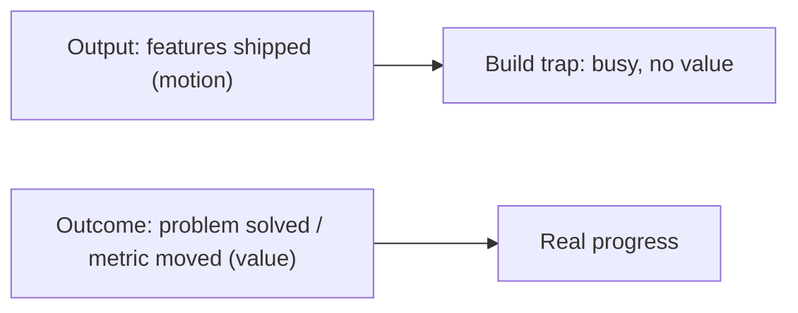
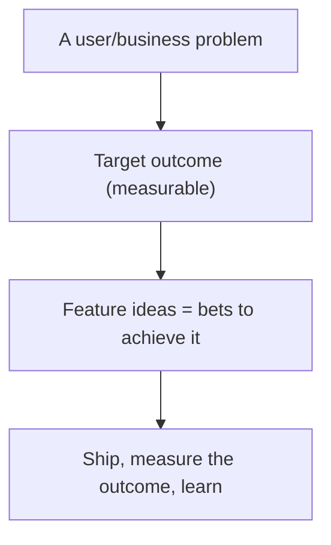
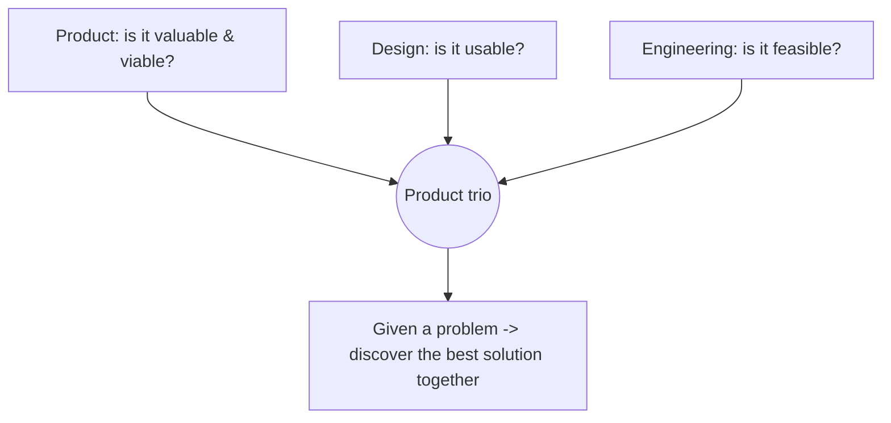
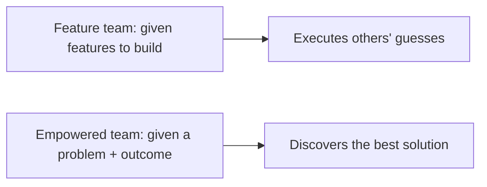
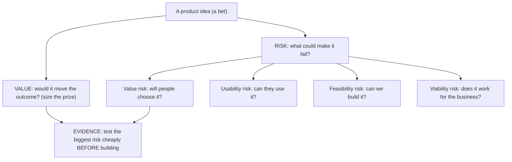
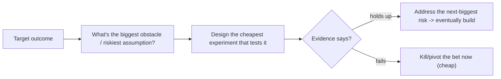

# Product Management Fundamentals - Complete Professional Guide

> **Category:** 11_management_product_process · **Language:** English

---

### Outcomes over output, and escaping the build trap
**Original guide written from first principles, current to 2026**

> **Original reference book (English).** This is an **independent, originally written** guide. It is not an extract, summary, or paraphrase of any third-party book; it teaches product management from first principles with original examples. Canonical books are listed under **References** as pointers only. Each chapter follows the TO-BRAIN editorial standard (see `FILE_CONVENTIONS.md`).
>
> **Scope notice:** product management is about building the **right** thing, not just building things. This guide covers outcomes vs output, the build trap, and outcome-driven product work, current to 2026.

---

## How to read this guide

| Level | Profile | Parts |
|-------|---------|-------|
| 1 — Beginner | New to product | Part I |
| 2 — Intermediate | Driving outcomes | Part II |

**Target audience:** product managers, founders, and engineers who influence what gets built.

**Structure of each chapter:** Introduction · Business context · Theoretical concepts · Architecture · Diagrams (Mermaid) · Real examples · Step by step · Complete examples · Exercises · Challenges · Checklist · Best practices · Anti-patterns · Troubleshooting · References.

> **Note on prerequisites.** None.

---

## Table of Contents

**Part I – The core shift**
1. Outcomes over output: escaping the build trap
2. The product trio and empowered teams

**Part II – Deciding what to build**
3. Prioritizing by value, risk, and evidence

> **Status of this guide:** complete for its declared scope. **Ready:** Parts I–II (Ch. 1–3).

---

## Part I – The core shift

The central failure of product organizations is measuring success by **output** (features shipped) instead of **outcomes** (problems solved, value created). A team can ship constantly and produce nothing of value. Good product management relentlessly orients work around outcomes — and that single shift changes how teams are run, measured, and motivated.

---

## Chapter 1 — Outcomes over output

### 1.1 Introduction

The **build trap** is when an organization measures progress by features shipped rather than value delivered — staying busy building things nobody needs. Escaping it means shifting from **output** (we shipped X features) to **outcomes** (we improved retention / solved this user problem). Outcomes tie work to value; output just measures motion.

### 1.2 Business context

Output-focused organizations confuse activity with progress: roadmaps full of features, teams maxed out, yet the business metrics don't move. This wastes enormous effort on things that don't matter. Shifting to outcomes focuses limited resources on what actually creates value, so the same team produces far more impact. For a business, escaping the build trap is the difference between a busy product org and a *successful* one.

### 1.3 Theoretical concepts: measure value, not motion



Define success as a **change in user/business behavior** (an outcome), not a deliverable. Set outcome-based goals ("increase activation by X"), give teams the **problem** to solve rather than a feature to build, and judge by whether the outcome moved. Features are *bets* on achieving outcomes, not the goal itself.

### 1.4 Architecture: problem → outcome → bets



### 1.5 Real example

**Scenario.** A team's roadmap is a list of features to ship this quarter.

**Problem.** They ship all of them; the business metrics (retention, activation) don't move — classic build trap.

**Solution.** Reframe the roadmap around an outcome; treat features as bets to test against it.

**Implementation (output → outcome).**

```text
Before (output): roadmap = [feature A, B, C, D]  -> shipped all, metrics flat
After (outcome): goal = "increase new-user activation from 40% to 55%"
                 -> generate/test bets toward THAT; keep what moves it, drop what doesn't
                 -> measure activation, not "features shipped"
```

**Result.** Work is aimed at a measurable outcome; features that don't move it are dropped, and effort concentrates on what does. The team produces value, not just velocity.

**Future improvements.** Pair this with discovery (see the customer-discovery guide) to choose bets backed by evidence.

### 1.6 Exercises

1. Define the build trap.
2. Contrast output and outcome with an example of each.
3. Why are features "bets," not goals?

### 1.7 Challenges

- **Challenge.** Take your current roadmap. Rewrite one item as an outcome (a measurable change) instead of a feature. What would you build — or not — to achieve it?

### 1.8 Checklist

- [ ] Success is defined as outcomes, not output.
- [ ] Teams are given problems, not just features.
- [ ] Features are treated as bets toward outcomes.
- [ ] Progress is judged by whether the outcome moved.

### 1.9 Best practices

- Set measurable outcome goals.
- Frame roadmaps around problems/outcomes.
- Kill features that don't move the outcome.

### 1.10 Anti-patterns

- Feature-factory roadmaps measured by shipping.
- Confusing being busy with making progress.
- Judging teams by output velocity.

### 1.11 Troubleshooting

| Symptom | Likely cause | Action |
|---------|--------------|--------|
| Shipping lots, metrics flat | Build trap (output focus) | Reframe around outcomes |
| Roadmap is a feature list | Output thinking | Express as problems/outcomes |
| Features don't help users | No outcome validation | Measure outcomes; drop what fails |

### 1.12 References

- M. Perri, *Escaping the Build Trap* (O'Reilly, 2018) — Ch. 1, "The Build Trap" (output vs outcome), and Ch. 2, "The Value Exchange System." ISBN 978-1491973790.
- M. Cagan, *Inspired*, 2nd ed. (Wiley, 2017) — Ch. 12, "Product Discovery" (value as the first risk). ISBN 978-1119387503.

---

## Chapter 2 — The product trio and empowered teams

### 2.1 Introduction

Strong product organizations rely on **empowered, cross-functional teams** built around a collaborating **product trio**: **product** (value/viability), **design** (usability/experience), and **engineering** (feasibility), working together continuously. The team is given a **problem to solve** and the autonomy to find the best solution — not a backlog of pre-decided features to implement.

### 2.2 Business context

When teams are "feature teams" handed a roadmap to build, they can't apply their insight to find better solutions — they just execute someone else's (often wrong) guesses. Empowered teams, given outcomes and trusted to discover solutions, consistently produce better products because the people closest to the problem and the technology shape the answer. This is a key differentiator between product companies that innovate and those that stagnate.

### 2.3 Theoretical concepts: trio + autonomy



The trio covers the four big risks: **value** (will people use/buy it?), **usability** (can they use it?), **feasibility** (can we build it?), and **business viability** (does it work for our business?). They collaborate from the start (not hand-offs), and the team owns the *outcome*, deciding *how* to achieve it.

### 2.4 Architecture: empowered vs feature team



### 2.5 Real example

**Scenario.** Leadership hands a team a detailed feature spec to build.

**Problem.** The team can't question whether it solves the real problem; they build it, and it underperforms — their expertise was wasted.

**Solution.** Give the team the problem and target outcome; let the trio discover and validate a solution.

**Implementation (empower the team).**

```text
Before: "Build feature X exactly as specced" -> team executes, no ownership of outcome
After:  "Reduce checkout abandonment (problem); target -10%"
        -> trio discovers options, tests with users, picks what works, owns the result
```

**Result.** The team applies its insight to find a solution that actually moves the metric, instead of executing a guess. Ownership of the outcome drives better products.

**Future improvements.** Support empowerment with a discovery practice and good outcome metrics so autonomy is grounded in evidence.

### 2.6 Exercises

1. Who is in the product trio and what does each cover?
2. What four risks must a product address?
3. Contrast an empowered team and a feature team.

### 2.7 Challenges

- **Challenge.** Is your team given problems or features? If features, propose how a problem/outcome framing would change one piece of work.

### 2.8 Checklist

- [ ] Teams are cross-functional with a product trio.
- [ ] The trio collaborates continuously (no hand-offs).
- [ ] Teams are given problems/outcomes, not just features.
- [ ] All four product risks are considered.

### 2.9 Best practices

- Form empowered, cross-functional teams.
- Have product, design, and engineering collaborate from the start.
- Give teams outcomes and the autonomy to solve them.

### 2.10 Anti-patterns

- Feature teams executing pre-decided roadmaps.
- Hand-offs instead of trio collaboration.
- Ignoring one of the four risks until late.

### 2.11 Troubleshooting

| Symptom | Likely cause | Action |
|---------|--------------|--------|
| Teams build but don't innovate | Feature-team model | Empower with problems/outcomes |
| Late usability/feasibility surprises | No trio collaboration | Collaborate across all risks early |
| Wasted team expertise | No autonomy | Give ownership of the outcome |

### 2.12 References

- M. Cagan, *Inspired*, 2nd ed. (Wiley, 2017) — Ch. 1, "Key Roles and Responsibilities," and Ch. 4–5, "Product Management vs. Design / Engineering" (the product trio). ISBN 978-1119387503.
- M. Cagan, C. Jones, *Empowered* (Wiley, 2020) — on empowered product teams. ISBN 978-1119691297.

---

> **End of Part I.** You can now apply the core of product management: measure success by **outcomes** (value created) rather than **output** (features shipped) to escape the build trap, and run **empowered, cross-functional teams** with a collaborating product trio given problems and outcomes — not pre-decided features — to solve. **Part II — Deciding what to build** (Chapter 3) covers prioritization by value, risk, and evidence, so the bets a team makes toward an outcome are chosen deliberately rather than by loudest opinion.

## Part II – Deciding what to build

Part I established the *goal* (outcomes, not output) and the *who* (empowered trios). Part II is the *how* of choosing among the endless ideas competing for a team's time. Empowerment without a way to decide degenerates into building whatever the loudest stakeholder wants. The discipline is to prioritize by **value, risk, and evidence** — favoring the bets that promise the most outcome, attacking the biggest risks first, and demanding evidence rather than opinion.

---

## Chapter 3 — Prioritizing by value, risk, and evidence

### 3.1 Introduction

A roadmap is a portfolio of **bets**, and good product work prioritizes them deliberately on three axes: **value** (how much would this move the target outcome?), **risk** (what's most likely to make this fail — and can we test that cheaply, now?), and **evidence** (what do we actually *know*, versus assume?). The core move is to **tackle the biggest risk first with the cheapest possible test**, replacing opinion with evidence before committing real build effort — rather than building the easy parts first and discovering the fatal flaw last.

### 3.2 Business context

Most prioritization is theater: features ranked by who argued hardest, or by what's quickest to build, with the riskiest assumption left untested until launch. That wastes a quarter discovering at the end what a one-week experiment could have shown at the start. Prioritizing by value-weighted, risk-first, evidence-backed bets concentrates investment where it pays and kills bad ideas while they're cheap to kill. For the business, this is the difference between a discovery practice that de-risks investment and a feature factory that gambles a quarter at a time.

### 3.3 Theoretical concepts: value, the four risks, and evidence



Cagan frames every product idea against **four risks** — value, usability, feasibility, and business viability — and the job of discovery is to address them *before* expensive delivery. Prioritization then means: estimate the **value** (the prize), identify which **risk** is most likely to sink the bet, and design the **cheapest evidence** that resolves it. Perri's **Product Kata** turns this into a loop: pick the outcome, find the biggest obstacle (riskiest assumption), run a small experiment, learn, repeat. You buy down risk with evidence, cheaply, before committing.

### 3.4 Architecture: attack the biggest risk first, cheaply



### 3.5 Real example

**Scenario.** A team has a quarter to add a feature they believe will lift retention; leadership wants it built and shipped.

**Problem.** The biggest risk is **value risk** — *will users actually adopt it?* — but the team's instinct is to build the easy, certain parts (UI, plumbing) first and leave the "will anyone use it" question for launch. If the answer is no, the whole quarter is wasted.

**Solution.** Prioritize by risk and evidence: identify value risk as the biggest assumption and test it in week one with a cheap experiment, before building the real thing.

**Implementation (risk-first, evidence-based).**

```text
Outcome: lift 90-day retention
Bets ranked NOT by ease but by value x risk:
  biggest risk = VALUE risk ("will users adopt this at all?")
Cheapest test FIRST (week 1, before real build):
  - fake-door / prototype to a slice of users -> measure real intent to use
  - if adoption signal is strong  -> proceed; next address feasibility/usability
  - if adoption signal is weak     -> kill or pivot NOW (saved ~a quarter)
Only after evidence clears the biggest risk does full delivery get prioritized.
```

**Result.** The team spends a week, not a quarter, to learn whether the bet's core assumption holds. Evidence — not the loudest opinion or the easiest task — drives what gets built. Bad bets die cheap; good bets enter delivery already de-risked.

**Future improvements.** Make the Product Kata loop routine: for each outcome, always name the single biggest obstacle and the cheapest experiment that resolves it, before any committed build.

### 3.6 Exercises

1. Name the four product risks.
2. Why test the biggest risk first, rather than building the easy parts first?
3. What are the three axes for prioritizing a bet in this chapter?

### 3.7 Challenges

- **Challenge.** Take a feature your team plans to build. Which of the four risks is most likely to make it fail? Design the cheapest experiment that would test that risk this week — before building it.

### 3.8 Checklist

- [ ] Each bet is sized by its likely effect on the target outcome (value).
- [ ] The biggest risk among the four is identified for each bet.
- [ ] The riskiest assumption is tested with the cheapest evidence first.
- [ ] Build commitment follows evidence, not opinion or ease.

### 3.9 Best practices

- Prioritize by value × risk, not by ease or stakeholder volume.
- Address value, usability, feasibility, and viability risks in discovery, before delivery.
- Run small experiments (Product Kata) to buy down the biggest risk cheaply.

### 3.10 Anti-patterns

- Prioritizing by who argues hardest, or by what's quickest to build.
- Building the easy parts first; leaving the fatal risk untested until launch.
- Treating a roadmap as commitments rather than bets to be validated.

### 3.11 Troubleshooting

| Symptom | Likely cause | Action |
|---------|--------------|--------|
| Shipped feature, nobody adopts it | Value risk untested before build | Test adoption cheaply first (fake door/prototype) |
| Roadmap set by loudest voice | No value/risk prioritization | Rank bets by value × risk; demand evidence |
| Big build, late fatal surprise | Easy-parts-first sequencing | Attack the biggest risk first with cheap evidence |

### 3.12 References

- M. Cagan, *Inspired*, 2nd ed. (Wiley, 2017) — Ch. 12, "Product Discovery" (the four risks: value, usability, feasibility, viability), and Ch. 11, "Assessing Product Opportunities" (opportunity assessment). ISBN 978-1119387503.
- M. Perri, *Escaping the Build Trap* (O'Reilly, 2018) — Ch. 19, "The Product Kata" (experiment-driven, evidence-based prioritization), and Ch. 2, "The Value Exchange System." ISBN 978-1491973790.

---

> **End of Part II.** You can now decide *what to build* deliberately: treat the roadmap as a portfolio of **bets**, size each by **value** (effect on the outcome), identify the biggest of the **four risks** (value, usability, feasibility, viability), and resolve the riskiest assumption with the **cheapest evidence first** — killing bad bets while they're cheap and entering delivery already de-risked. With Part I's outcome focus and empowered trios, this completes the core loop of outcome-driven product management.
