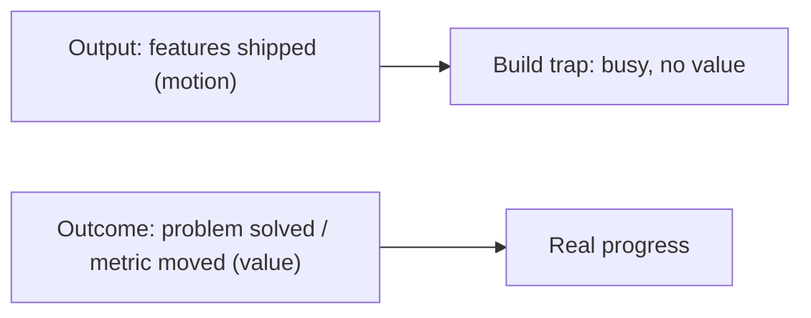
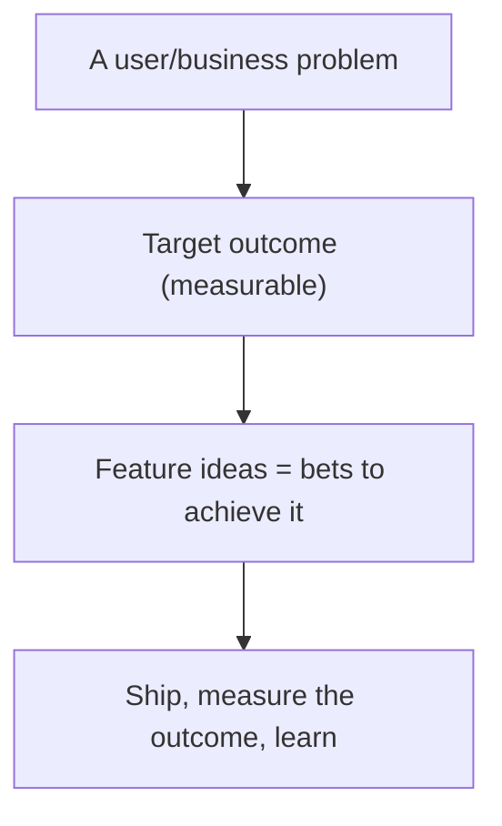
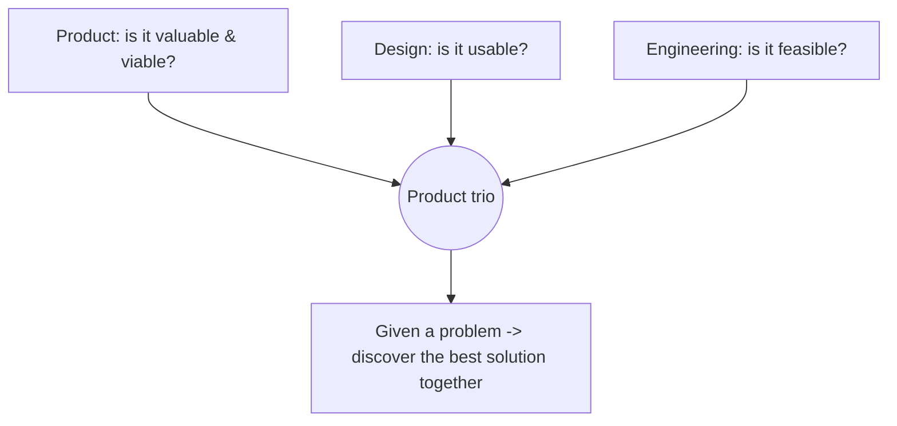
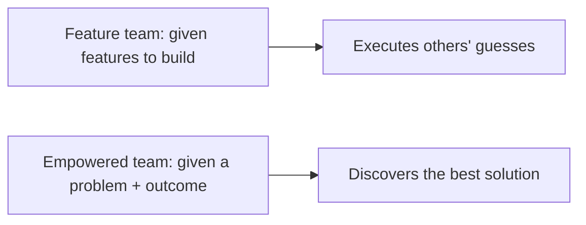

# Product Management Fundamentals - Complete Professional Guide

> **Category:** 11_management_product_process · **Language:** English

---

### Outcomes over output, and escaping the build trap
**Original guide written from first principles, current to 2026**

> **Original reference book (English).** This is an **independent, originally written** guide. It is not an extract, summary, or paraphrase of any third-party book; it teaches product management from first principles with original examples. Canonical books are listed under **References** as pointers only. Each chapter follows the TO-BRAIN editorial standard (see `FILE_CONVENTIONS.md`).
>
> **Scope notice:** product management is about building the **right** thing, not just building things. This guide covers outcomes vs output, the build trap, and outcome-driven product work, current to 2026.

---

## How to read this guide

| Level | Profile | Parts |
|-------|---------|-------|
| 1 — Beginner | New to product | Part I |
| 2 — Intermediate | Driving outcomes | Part II |

**Target audience:** product managers, founders, and engineers who influence what gets built.

**Structure of each chapter:** Introduction · Business context · Theoretical concepts · Architecture · Diagrams (Mermaid) · Real examples · Step by step · Complete examples · Exercises · Challenges · Checklist · Best practices · Anti-patterns · Troubleshooting · References.

> **Note on prerequisites.** None.

---

## Table of Contents

**Part I – The core shift**
1. Outcomes over output: escaping the build trap
2. The product trio and empowered teams

**Part II – Deciding what to build**
3. Prioritizing by value, risk, and evidence

> **Status of this guide:** phased delivery. **Ready:** Part I (Ch. 1–2). **In progress:** Part II.

---

## Part I – The core shift

The central failure of product organizations is measuring success by **output** (features shipped) instead of **outcomes** (problems solved, value created). A team can ship constantly and produce nothing of value. Good product management relentlessly orients work around outcomes — and that single shift changes how teams are run, measured, and motivated.

---

## Chapter 1 — Outcomes over output

### 1.1 Introduction

The **build trap** is when an organization measures progress by features shipped rather than value delivered — staying busy building things nobody needs. Escaping it means shifting from **output** (we shipped X features) to **outcomes** (we improved retention / solved this user problem). Outcomes tie work to value; output just measures motion.

### 1.2 Business context

Output-focused organizations confuse activity with progress: roadmaps full of features, teams maxed out, yet the business metrics don't move. This wastes enormous effort on things that don't matter. Shifting to outcomes focuses limited resources on what actually creates value, so the same team produces far more impact. For a business, escaping the build trap is the difference between a busy product org and a *successful* one.

### 1.3 Theoretical concepts: measure value, not motion



Define success as a **change in user/business behavior** (an outcome), not a deliverable. Set outcome-based goals ("increase activation by X"), give teams the **problem** to solve rather than a feature to build, and judge by whether the outcome moved. Features are *bets* on achieving outcomes, not the goal itself.

### 1.4 Architecture: problem → outcome → bets



### 1.5 Real example

**Scenario.** A team's roadmap is a list of features to ship this quarter.

**Problem.** They ship all of them; the business metrics (retention, activation) don't move — classic build trap.

**Solution.** Reframe the roadmap around an outcome; treat features as bets to test against it.

**Implementation (output → outcome).**

```text
Before (output): roadmap = [feature A, B, C, D]  -> shipped all, metrics flat
After (outcome): goal = "increase new-user activation from 40% to 55%"
                 -> generate/test bets toward THAT; keep what moves it, drop what doesn't
                 -> measure activation, not "features shipped"
```

**Result.** Work is aimed at a measurable outcome; features that don't move it are dropped, and effort concentrates on what does. The team produces value, not just velocity.

**Future improvements.** Pair this with discovery (see the customer-discovery guide) to choose bets backed by evidence.

### 1.6 Exercises

1. Define the build trap.
2. Contrast output and outcome with an example of each.
3. Why are features "bets," not goals?

### 1.7 Challenges

- **Challenge.** Take your current roadmap. Rewrite one item as an outcome (a measurable change) instead of a feature. What would you build — or not — to achieve it?

### 1.8 Checklist

- [ ] Success is defined as outcomes, not output.
- [ ] Teams are given problems, not just features.
- [ ] Features are treated as bets toward outcomes.
- [ ] Progress is judged by whether the outcome moved.

### 1.9 Best practices

- Set measurable outcome goals.
- Frame roadmaps around problems/outcomes.
- Kill features that don't move the outcome.

### 1.10 Anti-patterns

- Feature-factory roadmaps measured by shipping.
- Confusing being busy with making progress.
- Judging teams by output velocity.

### 1.11 Troubleshooting

| Symptom | Likely cause | Action |
|---------|--------------|--------|
| Shipping lots, metrics flat | Build trap (output focus) | Reframe around outcomes |
| Roadmap is a feature list | Output thinking | Express as problems/outcomes |
| Features don't help users | No outcome validation | Measure outcomes; drop what fails |

### 1.12 References

- M. Perri, *Escaping the Build Trap* (O'Reilly, 2018) — ISBN 978-1491973790.
- M. Cagan, *Inspired*, 2nd ed. (Wiley, 2017) — ISBN 978-1119387503.

---

## Chapter 2 — The product trio and empowered teams

### 2.1 Introduction

Strong product organizations rely on **empowered, cross-functional teams** built around a collaborating **product trio**: **product** (value/viability), **design** (usability/experience), and **engineering** (feasibility), working together continuously. The team is given a **problem to solve** and the autonomy to find the best solution — not a backlog of pre-decided features to implement.

### 2.2 Business context

When teams are "feature teams" handed a roadmap to build, they can't apply their insight to find better solutions — they just execute someone else's (often wrong) guesses. Empowered teams, given outcomes and trusted to discover solutions, consistently produce better products because the people closest to the problem and the technology shape the answer. This is a key differentiator between product companies that innovate and those that stagnate.

### 2.3 Theoretical concepts: trio + autonomy



The trio covers the four big risks: **value** (will people use/buy it?), **usability** (can they use it?), **feasibility** (can we build it?), and **business viability** (does it work for our business?). They collaborate from the start (not hand-offs), and the team owns the *outcome*, deciding *how* to achieve it.

### 2.4 Architecture: empowered vs feature team



### 2.5 Real example

**Scenario.** Leadership hands a team a detailed feature spec to build.

**Problem.** The team can't question whether it solves the real problem; they build it, and it underperforms — their expertise was wasted.

**Solution.** Give the team the problem and target outcome; let the trio discover and validate a solution.

**Implementation (empower the team).**

```text
Before: "Build feature X exactly as specced" -> team executes, no ownership of outcome
After:  "Reduce checkout abandonment (problem); target -10%"
        -> trio discovers options, tests with users, picks what works, owns the result
```

**Result.** The team applies its insight to find a solution that actually moves the metric, instead of executing a guess. Ownership of the outcome drives better products.

**Future improvements.** Support empowerment with a discovery practice and good outcome metrics so autonomy is grounded in evidence.

### 2.6 Exercises

1. Who is in the product trio and what does each cover?
2. What four risks must a product address?
3. Contrast an empowered team and a feature team.

### 2.7 Challenges

- **Challenge.** Is your team given problems or features? If features, propose how a problem/outcome framing would change one piece of work.

### 2.8 Checklist

- [ ] Teams are cross-functional with a product trio.
- [ ] The trio collaborates continuously (no hand-offs).
- [ ] Teams are given problems/outcomes, not just features.
- [ ] All four product risks are considered.

### 2.9 Best practices

- Form empowered, cross-functional teams.
- Have product, design, and engineering collaborate from the start.
- Give teams outcomes and the autonomy to solve them.

### 2.10 Anti-patterns

- Feature teams executing pre-decided roadmaps.
- Hand-offs instead of trio collaboration.
- Ignoring one of the four risks until late.

### 2.11 Troubleshooting

| Symptom | Likely cause | Action |
|---------|--------------|--------|
| Teams build but don't innovate | Feature-team model | Empower with problems/outcomes |
| Late usability/feasibility surprises | No trio collaboration | Collaborate across all risks early |
| Wasted team expertise | No autonomy | Give ownership of the outcome |

### 2.12 References

- M. Cagan, *Inspired*, 2nd ed. (Wiley, 2017) — ISBN 978-1119387503.
- M. Cagan, C. Jones, *Empowered* (Wiley, 2020) — ISBN 978-1119691297.

---

> **End of Part I.** You can now apply the core of product management: measure success by **outcomes** (value created) rather than **output** (features shipped) to escape the build trap, and run **empowered, cross-functional teams** with a collaborating product trio given problems and outcomes — not pre-decided features — to solve. **Part II — Deciding what to build** (Chapter 3) covers prioritization by value, risk, and evidence, so the bets a team makes toward an outcome are chosen deliberately rather than by loudest opinion.

<!--APPEND-PART-II-->
