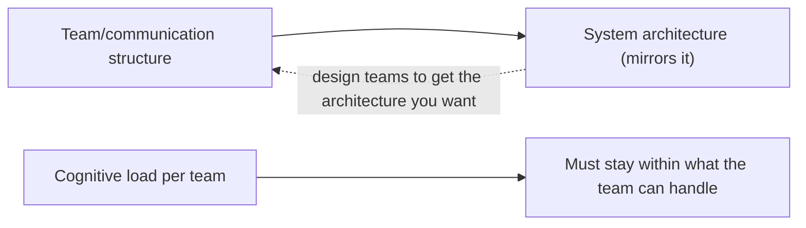
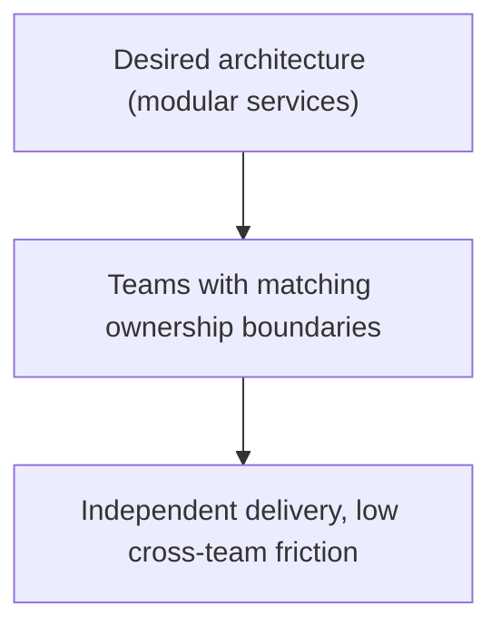
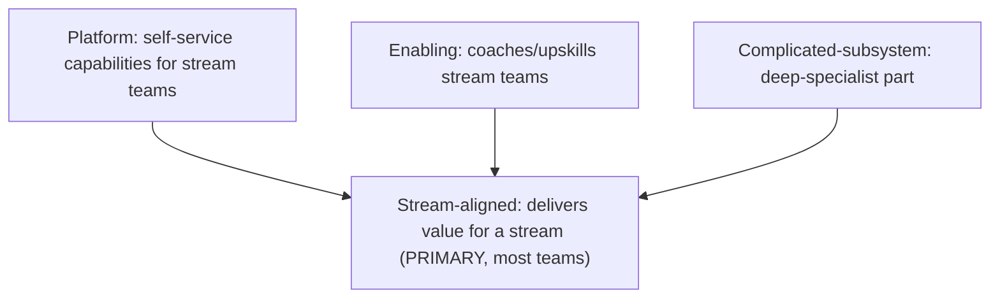
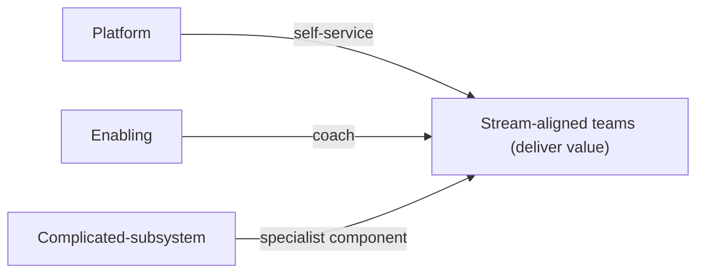

# Team Topologies and Organization Design - Complete Professional Guide

> **Category:** 11_management_product_process · **Language:** English

---

### Team types, interaction modes, and Conway's Law
**Original guide written from first principles, current to 2026**

> **Original reference book (English).** This is an **independent, originally written** guide. It is not an extract, summary, or paraphrase of any third-party book; it teaches organization design from first principles with original examples. Canonical books are listed under **References** as pointers only. Each chapter follows the TO-BRAIN editorial standard (see `FILE_CONVENTIONS.md`).
>
> **Scope notice:** how you organize teams shapes the software they build (and vice versa). This guide covers team types, interaction modes, cognitive load, and Conway's Law as levers for fast, sustainable delivery, current to 2026.

---

## How to read this guide

| Level | Profile | Parts |
|-------|---------|-------|
| 1 — Beginner | New to org design | Part I |
| 2 — Intermediate | Structuring teams | Part II |

**Target audience:** engineering leaders, architects, and anyone shaping how teams are organized.

**Structure of each chapter:** Introduction · Business context · Theoretical concepts · Architecture · Diagrams (Mermaid) · Real examples · Step by step · Complete examples · Exercises · Challenges · Checklist · Best practices · Anti-patterns · Troubleshooting · References.

> **Note on prerequisites.** Assumes the DevOps and architecture guides.

---

## Table of Contents

**Part I – Structure shapes software**
1. Conway's Law and cognitive load
2. The four team types

**Part II – Interaction**
3. The three interaction modes

> **Status of this guide:** phased delivery. **Ready:** Part I (Ch. 1–2). **In progress:** Part II.

---

## Part I – Structure shapes software

Organizations ship their **org chart**: the way you split teams ends up reflected in the architecture of the software (Conway's Law). So team structure is an architectural decision. The goal is **fast flow** — teams that can deliver value with minimal dependencies and hand-offs — which requires managing each team's cognitive load and choosing the right team shapes.

---

## Chapter 1 — Conway's Law and cognitive load

### 1.1 Introduction

**Conway's Law:** a system's design mirrors the communication structure of the organization that built it. If three teams build a compiler, you get a three-pass compiler. This means you can **design the architecture you want by designing the teams** (the "Inverse Conway Maneuver"). The constraint on team scope is **cognitive load** — a team can only effectively own so much complexity.

### 1.2 Business context

Ignoring Conway's Law produces architectures that fight the org (constant cross-team dependencies, slow delivery). Overloading teams with too much cognitive load causes burnout, errors, and slow delivery. Deliberately aligning team boundaries with desired architecture, and limiting each team's load to what it can handle, is what enables fast, sustainable flow. For a business, this is the difference between teams that ship independently and an org gridlocked by dependencies.

### 1.3 Theoretical concepts: org = architecture; bound the load



To get a modular architecture, create teams with clear, modular ownership. **Cognitive load** (the total mental burden of everything a team must understand — domain, tech, tools) must be bounded: a team owning too many disparate things does all of them poorly. Limit a team's scope to a **single, comprehensible domain**.

### 1.4 Architecture: align boundaries, limit load



### 1.5 Real example

**Scenario.** A company wants independent, modular services but has teams split by technical layer (a frontend team, a backend team, a DBA team).

**Problem.** By Conway's Law, layer-split teams produce a tightly-coupled layered monolith with cross-team dependencies for every feature.

**Solution.** Re-org into cross-functional teams owning whole services/domains (Inverse Conway Maneuver) so the architecture can be modular.

**Implementation (the re-org).**

```text
Before: frontend team | backend team | DBA team   (layer split -> coupled layers)
After:  Orders team   | Payments team | Catalog team (each owns its whole service:
        UI + API + data)  -> independent, modular services that mirror the teams
Cognitive load: each team owns ONE domain, bounded and comprehensible.
```

**Result.** Team boundaries now match the desired modular architecture; teams deliver features independently without cross-layer dependencies, and each owns a bounded domain. Structure produced the architecture.

**Future improvements.** Watch each team's cognitive load as the domain grows; split a team/domain before it overloads.

### 1.6 Exercises

1. State Conway's Law and the Inverse Conway Maneuver.
2. What is cognitive load and why bound it?
3. Why do layer-split teams produce coupled architectures?

### 1.7 Challenges

- **Challenge.** Look at your org's team boundaries. Do they match the architecture you want? Identify one team split that's producing unwanted coupling.

### 1.8 Checklist

- [ ] I treat team structure as an architectural decision.
- [ ] Team boundaries align with desired system boundaries.
- [ ] Each team's cognitive load is bounded.
- [ ] Teams own a single, comprehensible domain.

### 1.9 Best practices

- Design teams to produce the architecture you want.
- Limit each team's cognitive load to one clear domain.
- Prefer cross-functional, domain-owning teams.

### 1.10 Anti-patterns

- Layer-split teams expecting modular services.
- Overloaded teams owning too many disparate things.
- Ignoring the org→architecture mirror.

### 1.11 Troubleshooting

| Symptom | Likely cause | Action |
|---------|--------------|--------|
| Constant cross-team dependencies | Boundaries fight architecture | Re-align teams to domains |
| Team burnt out / slow | Cognitive overload | Reduce scope; split domain |
| Coupled architecture | Conway's Law ignored | Apply Inverse Conway Maneuver |

### 1.12 References

- M. Skelton, M. Pais, *Team Topologies* (IT Revolution, 2019) — ISBN 978-1942788812.
- M. Conway, "How Do Committees Invent?" (1968), origin of Conway's Law.

---

## Chapter 2 — The four team types

### 2.1 Introduction

Team Topologies proposes just **four fundamental team types**, and says most organizations need only these. A **stream-aligned** team delivers value for a business stream (the default, primary team). Three supporting types help stream-aligned teams go fast: **platform** (provides self-service infrastructure), **enabling** (coaches/upskills), and **complicated-subsystem** (owns a part needing deep specialist expertise).

### 2.2 Business context

Most org-design confusion comes from a sprawl of ad-hoc team types with unclear purposes, creating overhead and hand-offs. Limiting to four well-defined types with clear purposes reduces that confusion and keeps the focus on **stream-aligned teams delivering value**, with the others existing only to reduce those teams' cognitive load. This clarity speeds delivery and makes the org understandable — everyone knows why each team exists.

### 2.3 Theoretical concepts: one primary, three supporting



- **Stream-aligned** — owns a slice of the business end to end; the team type that delivers value. Most teams should be this.
- **Platform** — provides paved-road, self-service capabilities so stream teams don't reinvent infrastructure (reduces their cognitive load).
- **Enabling** — temporarily helps stream teams adopt new skills/practices, then steps back.
- **Complicated-subsystem** — owns a component requiring rare deep expertise (e.g. a video codec, a risk engine), so stream teams don't all need that expertise.

### 2.4 Architecture: supporting teams serve stream teams



### 2.5 Real example

**Scenario.** Every stream team is building its own CI/CD, monitoring, and infra setup — duplicating effort and carrying high cognitive load.

**Problem.** No platform team; each stream team reinvents undifferentiated infrastructure, slowing feature work.

**Solution.** Create a **platform** team providing self-service CI/CD, observability, and environments as a paved road; stream teams consume it.

**Implementation (introduce a platform team).**

```text
Platform team provides (self-service): CI/CD pipelines, monitoring, environments
Stream teams: consume the paved road -> focus on their domain/features
Result: stream teams' cognitive load drops; less duplication; faster delivery
```

**Result.** Stream teams stop reinventing infrastructure and focus on value; the platform team reduces everyone's cognitive load via self-service. The four-type structure clarifies who does what.

**Future improvements.** Treat the platform as a product with the stream teams as customers (measure adoption/satisfaction).

### 2.6 Exercises

1. Name the four team types and the primary one.
2. What is the purpose of the three supporting types?
3. Why should most teams be stream-aligned?

### 2.7 Challenges

- **Challenge.** Classify your org's teams into the four types. Are there too many non-stream-aligned teams? Is anything missing (e.g. a platform team)?

### 2.8 Checklist

- [ ] Most teams are stream-aligned (deliver value).
- [ ] A platform team provides self-service capabilities.
- [ ] Enabling teams upskill, then step back.
- [ ] Deep-specialist parts are complicated-subsystem teams.

### 2.9 Best practices

- Default teams to stream-aligned; justify other types.
- Run platforms as products that reduce cognitive load.
- Use enabling teams temporarily, not permanently.

### 2.10 Anti-patterns

- A sprawl of ad-hoc team types with unclear purpose.
- Permanent "enabling" teams that become gatekeepers.
- Every stream team rebuilding infrastructure (no platform).

### 2.11 Troubleshooting

| Symptom | Likely cause | Action |
|---------|--------------|--------|
| Duplicated infra effort | No platform team | Create a self-service platform team |
| Confusing team landscape | Too many ad-hoc types | Consolidate to the four types |
| Specialists spread thin | No complicated-subsystem team | Concentrate deep expertise in one team |

### 2.12 References

- M. Skelton, M. Pais, *Team Topologies* (IT Revolution, 2019) — ISBN 978-1942788812.
- teamtopologies.com: https://teamtopologies.com.

---

> **End of Part I.** You can now use team structure as a design lever: apply Conway's Law (the org mirrors the architecture, so design teams to get the architecture you want) while bounding each team's cognitive load, and organize around the four team types — stream-aligned teams delivering value, supported by platform, enabling, and complicated-subsystem teams. **Part II — Interaction** (Chapter 3) covers the three interaction modes (collaboration, X-as-a-service, facilitating) that define how teams should work together to minimize friction.

<!--APPEND-PART-II-->
