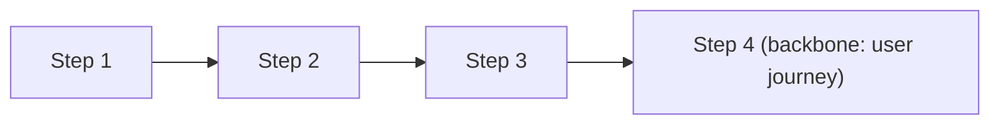
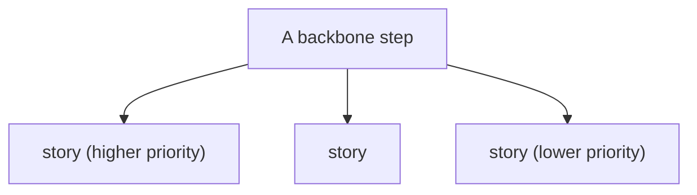
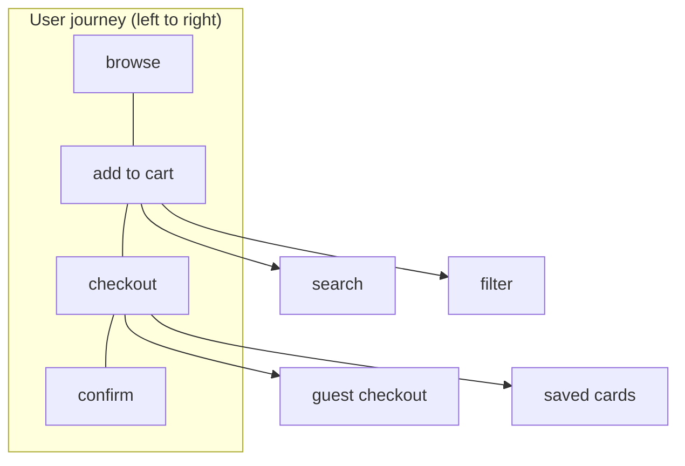
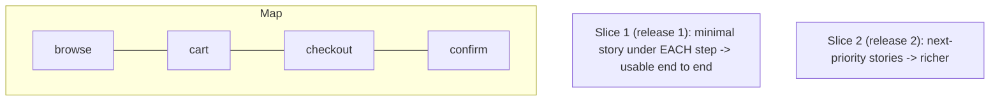
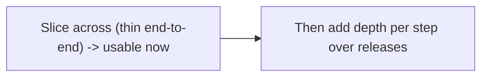

# User Story Mapping and Planning - Complete Professional Guide

> **Category:** 11_management_product_process · **Language:** English

---

### Mapping the user journey to slice and plan releases
**Original guide written from first principles, current to 2026**

> **Original reference book (English).** This is an **independent, originally written** guide. It is not an extract, summary, or paraphrase of any third-party book; it teaches story mapping and planning from first principles with original examples. Canonical books are listed under **References** as pointers only. Each chapter follows the TO-BRAIN editorial standard (see `FILE_CONVENTIONS.md`).
>
> **Scope notice:** a flat backlog hides the big picture and leads to building features in the wrong order. Story mapping arranges work along the user's journey so you can slice valuable releases. This guide covers story mapping and release planning, current to 2026.

---

## How to read this guide

| Level | Profile | Parts |
|-------|---------|-------|
| 1 — Beginner | New to story mapping | Part I |
| 2 — Intermediate | Planning releases | Part II |

**Target audience:** product managers, teams, and anyone planning what to build and in what order.

**Structure of each chapter:** Introduction · Business context · Theoretical concepts · Architecture · Diagrams (Mermaid) · Real examples · Step by step · Complete examples · Exercises · Challenges · Checklist · Best practices · Anti-patterns · Troubleshooting · References.

> **Note on prerequisites.** Assumes basic agile/backlog concepts.

---

## Table of Contents

**Part I – The map**
1. Why a flat backlog fails; the story map
2. Slicing releases across the map

**Part II – Planning**
3. Planning around uncertainty and outcomes

> **Status of this guide:** phased delivery. **Ready:** Part I (Ch. 1–2). **In progress:** Part II.

---

## Part I – The map

A **flat, prioritized backlog** is a poor planning tool: it's a one-dimensional list that loses the shape of the user's journey, so teams build disconnected features and can't see what makes a coherent, usable release. **Story mapping** restores the big picture by laying work out in two dimensions — along the user's journey, and by priority — so you can plan releases that actually work end to end.

---

## Chapter 1 — Why a flat backlog fails

### 1.1 Introduction

A **story map** arranges user stories in two dimensions: horizontally along the **user's journey** (the sequence of activities to accomplish a goal) and vertically by **priority/detail** within each step. The top row (the "backbone") tells the end-to-end story; below each step hang the detailed stories. This shows the whole experience at a glance — something a flat list can never do.

### 1.2 Business context

Flat backlogs cause teams to build features that don't add up to a usable product, and to lose sight of the user's overall goal amid a list of tickets. A story map keeps the **whole journey** visible, so the team builds coherent slices that users can actually complete, and stakeholders can see and discuss the product as an experience, not a ticket list. This shared visual alignment prevents the disjointed, half-usable releases that flat backlogs produce.

### 1.3 Theoretical concepts: two dimensions





The **backbone** (top, horizontal) is the user's activities in order — the narrative flow. Under each, **stories** are stacked by priority (most essential on top). Reading left-to-right tells the whole story; reading top-to-bottom in a column shows depth of a step. This structure is what makes coherent slicing possible (Chapter 2).

### 1.4 Architecture: backbone + details



### 1.5 Real example

**Scenario.** A team plans an e-commerce MVP from a flat backlog of 60 tickets.

**Problem.** The prioritized list has lots of "add to cart" detail but nothing for "checkout" near the top — building it top-down would yield a cart you can't buy from. The flat list hid this gap.

**Solution.** Lay the stories on a map along the journey (browse → cart → checkout → confirm); the gap is obvious.

**Implementation (the map reveals the gap).**

```text
Backbone: Browse | Add to cart | Checkout | Confirm
Flat backlog top items: lots of cart features, zero checkout
-> Map shows: a deep "cart" column, an EMPTY "checkout" column
-> Insight: you'd ship a product users can't actually buy from
-> Fix: ensure each backbone step has at least its essential story in the slice
```

**Result.** The map exposes that a "high-priority" flat list would produce an unusable product (no checkout); the team rebalances so every journey step is covered. Coherence restored.

**Future improvements.** Use the map to plan the thinnest end-to-end slice (Chapter 2) rather than going deep on one step.

### 1.6 Exercises

1. What are the two dimensions of a story map?
2. What is the "backbone"?
3. Why does a flat backlog hide usability gaps?

### 1.7 Challenges

- **Challenge.** Take a backlog you have. Lay the items along the user journey (backbone) with details below. Does any journey step have a gap a flat list hid?

### 1.8 Checklist

- [ ] Work is mapped along the user's journey.
- [ ] A backbone shows the end-to-end story.
- [ ] Stories are stacked by priority under each step.
- [ ] The whole experience is visible at a glance.

### 1.9 Best practices

- Build a backbone of user activities first.
- Hang detailed stories under each step by priority.
- Use the map for shared stakeholder alignment.

### 1.10 Anti-patterns

- Planning from a flat, one-dimensional backlog.
- Building one step deeply while others are empty.
- Losing the user journey amid tickets.

### 1.11 Troubleshooting

| Symptom | Likely cause | Action |
|---------|--------------|--------|
| Released product isn't usable end to end | Flat-backlog planning | Map along the journey; cover each step |
| Stakeholders misaligned | No shared big picture | Use a story map as the shared artifact |
| Disjointed features | Lost user journey | Anchor work to the backbone |

### 1.12 References

- J. Patton, *User Story Mapping* (O'Reilly, 2014) — ISBN 978-1491904909.
- jpattonassociates.com: https://www.jpattonassociates.com/story-mapping/.

---

## Chapter 2 — Slicing releases across the map

### 2.1 Introduction

The payoff of a story map is **slicing**: drawing horizontal lines across the map to define releases, each a **thin slice through the whole journey** rather than a complete single step. The first slice is the smallest set of stories — one per backbone step — that lets a user complete the journey end to end. You build *across*, not *down*.

### 2.2 Business context

Building one feature fully before starting the next delays a usable product and risks over-investing in a step nobody validated. Slicing thinly across the whole journey delivers a working (if minimal) end-to-end experience fast — usable, demoable, and learnable from — then deepens. This reduces risk and time-to-value: you learn whether the whole flow works before polishing any one part. It's the planning expression of "build the thinnest end-to-end slice first."

### 2.3 Theoretical concepts: slice horizontally



Each release is a **horizontal slice** taking the top-priority story from each backbone step, so users can complete the whole journey. Later slices add depth. This contrasts with **vertical** building (finishing one step completely first), which yields an unusable partial product for longer.

### 2.4 Architecture: across, then down



### 2.5 Real example

**Scenario.** Planning the first release of the e-commerce MVP from the map.

**Problem.** The team wants to build a rich cart first, delaying anything buyable.

**Solution.** Slice across: the simplest browse + add-to-cart + checkout + confirm, so users can actually buy in release 1; enrich later.

**Implementation (the first slice).**

```text
Release 1 (thin slice across the backbone):
  browse: list products  | cart: add one item | checkout: pay (one method) | confirm: receipt
  -> a user can complete a purchase end to end (minimal but usable)
Release 2 (more depth): search/filter, saved cards, guest checkout, etc.
```

**Result.** Release 1 is a usable, end-to-end purchasable product (thin but complete), shipped fast and ready to learn from — instead of a rich cart with no way to buy. Depth comes in later slices.

**Future improvements.** Validate the end-to-end flow with real users before investing in depth (tie to the discovery guide).

### 2.6 Exercises

1. What does it mean to "slice" a story map?
2. Why slice across rather than build down?
3. What's in the first slice?

### 2.7 Challenges

- **Challenge.** From a story map, draw the first release line: one essential story per backbone step. Is the result usable end to end? Trim further if you can.

### 2.8 Checklist

- [ ] Releases are horizontal slices across the journey.
- [ ] The first slice is usable end to end.
- [ ] I build across before adding depth.
- [ ] Each step has at least its essential story per slice.

### 2.9 Best practices

- Make the first release the thinnest end-to-end slice.
- Add depth in later slices, not all up front.
- Validate the whole flow before deepening any step.

### 2.10 Anti-patterns

- Building one step fully before others (vertical).
- A "release" missing a journey step (unusable).
- Over-investing in depth before end-to-end validation.

### 2.11 Troubleshooting

| Symptom | Likely cause | Action |
|---------|--------------|--------|
| No usable product for ages | Building down, not across | Slice thin end-to-end first |
| Release can't be used end to end | Missing a journey step | Include each step in the slice |
| Polished step, dead product | Over-depth too early | Validate the flow, then deepen |

### 2.12 References

- J. Patton, *User Story Mapping* (O'Reilly, 2014) — ISBN 978-1491904909.
- S. Berkun, *Making Things Happen* (O'Reilly, 2008) — ISBN 978-0596517717.

---

> **End of Part I.** You can now plan with a story map instead of a flat backlog: arrange work in two dimensions — a backbone of the user's journey with detailed stories stacked by priority below — so the whole experience is visible, and slice **horizontally** so each release is a thin end-to-end path a user can complete, adding depth in later slices. **Part II — Planning** (Chapter 3) covers planning around uncertainty: estimating ranges not points, planning to learn, and keeping plans tied to outcomes rather than fixed feature lists.

<!--APPEND-PART-II-->
