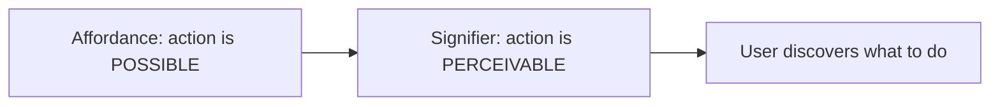
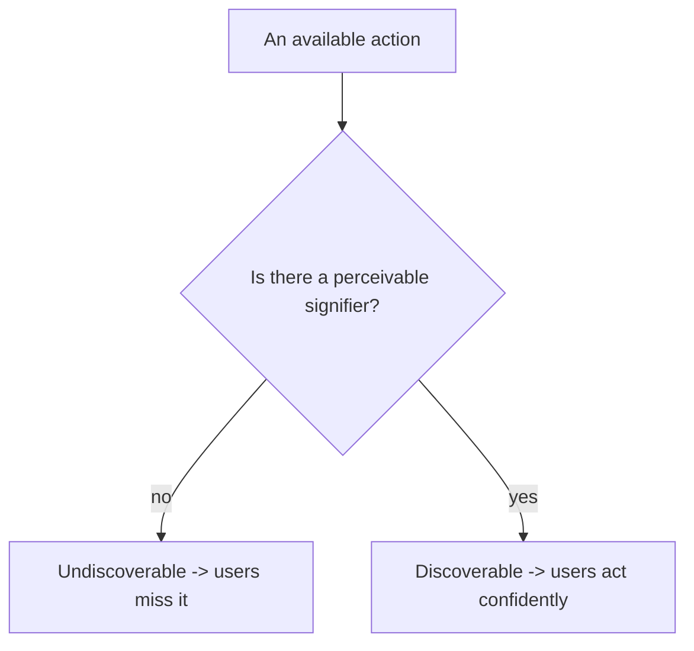
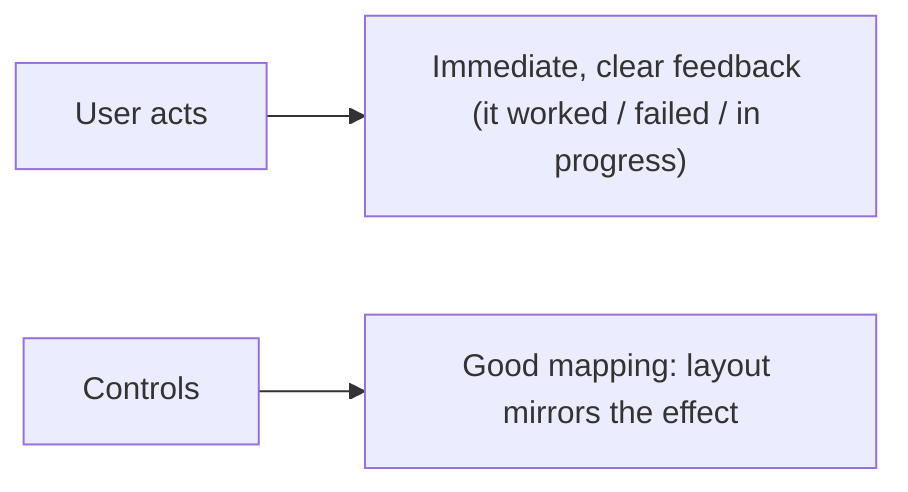
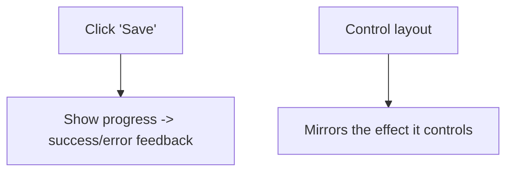

# Usable Design Principles - Complete Professional Guide

> **Category:** 12_design_ux · **Language:** English

---

### Affordances, signifiers, feedback, and mental models
**Original guide written from first principles, current to 2026**

> **Original reference book (English).** This is an **independent, originally written** guide. It is not an extract, summary, or paraphrase of any third-party book; it teaches usable design from first principles with original examples. Canonical books are listed under **References** as pointers only. Each chapter follows the TO-BRAIN editorial standard (see `FILE_CONVENTIONS.md`).
>
> **Scope notice:** good design makes things understandable and usable by making how they work visible. This guide covers the foundational concepts — affordances, signifiers, feedback, mapping, and mental models — that apply to any interface, current to 2026.

---

## How to read this guide

| Level | Profile | Parts |
|-------|---------|-------|
| 1 — Beginner | New to design thinking | Part I |
| 2 — Intermediate | Designing interactions | Part II |

**Target audience:** designers, developers, and product people building anything people interact with.

**Structure of each chapter:** Introduction · Business context · Theoretical concepts · Architecture · Diagrams (Mermaid) · Real examples · Step by step · Complete examples · Exercises · Challenges · Checklist · Best practices · Anti-patterns · Troubleshooting · References.

> **Note on prerequisites.** None.

---

## Table of Contents

**Part I – Making things understandable**
1. Affordances and signifiers
2. Feedback and mapping

**Part II – The user's mind**
3. Mental models and error-tolerant design

> **Status of this guide:** phased delivery. **Ready:** Part I (Ch. 1–2). **In progress:** Part II.

---

## Part I – Making things understandable

When something is hard to use, it's usually the **design's fault, not the user's**. Good design communicates how a thing works through its form — you can tell what to do just by looking. The core concepts (affordances, signifiers, feedback, mapping) are the vocabulary for designing that self-evidence, whether for a door, an app, or an API.

---

## Chapter 1 — Affordances and signifiers

### 1.1 Introduction

An **affordance** is a relationship between an object and a user — what actions are *possible* (a chair affords sitting; a button affords pushing). A **signifier** is a *signal* that communicates where and how to act (the visual cue that a button is pressable). Affordances make action possible; signifiers make it **discoverable**. Confusing the two leads to interfaces where the right action exists but no one can find it.

### 1.2 Business context

Users who can't discover how to use a product abandon it — and on the web, a competitor is a click away. Clear signifiers reduce confusion, support calls, and abandonment, directly improving conversion and satisfaction. Designing affordances and signifiers well is cheaper than the support and lost-user costs of an "intuitive to us, baffling to them" interface. Discoverability is a measurable business lever.

### 1.3 Theoretical concepts: possible vs perceivable



A control can afford an action (it works) but lack a signifier (no one knows it's there) — e.g. a swipe gesture with no visual hint. Good design provides **perceivable signifiers** for every important action: buttons that look pressable, links that look clickable, hints for gestures. Don't rely on hidden affordances users must guess.

### 1.4 Architecture: signal every action



### 1.5 Real example

**Scenario.** An app supports a useful swipe-to-archive gesture on list items.

**Problem.** The gesture (affordance) exists but has no signifier — users never discover it.

**Solution.** Add a perceivable signifier (a visible hint/icon, or a partially revealed action) so the gesture is discoverable.

**Implementation (add the signifier).**

```text
Before: swipe-to-archive works, but nothing on screen suggests it -> unused
After:  show a faint trailing "Archive" affordance on the row / a one-time hint
        -> users see the action is possible and how to trigger it
```

**Result.** The capability is now discoverable and used, instead of being a hidden feature only power users find by accident. The action existed; the signifier unlocked it.

**Future improvements.** Provide a visible alternative (a menu action) so the feature isn't gesture-only — affordances shouldn't be hidden behind one undiscoverable interaction.

### 1.6 Exercises

1. Distinguish an affordance from a signifier.
2. Why can an action exist but be undiscoverable?
3. Give an example of a hidden affordance and how you'd signify it.

### 1.7 Challenges

- **Challenge.** Find a feature in your product users miss. Is its affordance signified? Add a perceivable signifier and see if discovery improves.

### 1.8 Checklist

- [ ] Every important action has a perceivable signifier.
- [ ] I don't rely on hidden gestures/affordances alone.
- [ ] Clickable/actionable things look that way.
- [ ] Discoverability is designed, not assumed.

### 1.9 Best practices

- Signify every important action visibly.
- Provide discoverable alternatives to gestures.
- Make controls look like what they do.

### 1.10 Anti-patterns

- Hidden gestures with no hint (mystery-meat interaction).
- Controls that don't look interactive.
- Relying on users to "just know."

### 1.11 Troubleshooting

| Symptom | Likely cause | Action |
|---------|--------------|--------|
| Feature unused | Affordance not signified | Add a perceivable signifier |
| Users don't click a control | Weak signifier | Make it look actionable |
| Gesture-only feature missed | No alternative/hint | Provide a visible alternative |

### 1.12 References

- D. Norman, *The Design of Everyday Things*, revised ed. (Basic Books, 2013) — ISBN 978-0465050659.
- NN/g, "Affordances and Signifiers": https://www.nngroup.com/articles/.

---

## Chapter 2 — Feedback and mapping

### 2.1 Introduction

**Feedback** is communicating the result of an action — telling the user something happened and what. **Mapping** is the relationship between controls and their effects; **good mapping** makes the relationship obvious (a control laid out like the thing it controls). Together they close the loop: the user acts (signifier), the system responds (feedback), and the controls make sense (mapping).

### 2.2 Business context

Without feedback, users don't know if their action worked — they click again (double-submits), give up, or distrust the system. Without good mapping, they trigger the wrong thing. Both cause errors, frustration, and support load. Immediate, clear feedback and intuitive mapping make interfaces feel responsive and trustworthy, reducing mistakes and increasing confidence — which shows up as fewer errors, fewer support tickets, and higher satisfaction.

### 2.3 Theoretical concepts: close the loop, match controls to effects



Feedback must be **immediate** and **informative** (not just "something happened" but what — success, error, progress). Mapping is strongest when **spatial/natural**: controls arranged like what they affect (stove knobs matching burner positions; volume up = up). Poor mapping forces users to memorize arbitrary relationships.

### 2.4 Architecture: action → feedback; control → effect



### 2.5 Real example

**Scenario.** A form's Save button does its work but gives no feedback.

**Problem.** Users can't tell if it saved — they click repeatedly (causing duplicates) or assume failure.

**Solution.** Immediate feedback: disable the button + show a spinner during save, then a clear success/error message.

**Implementation (close the loop).**

```text
On Save click:
  - immediately: disable button, show "Saving..." spinner (feedback: in progress)
  - on success:  "Saved" confirmation (feedback: done)
  - on error:    clear message + how to fix (feedback: failed, actionable)
-> no uncertainty, no double-submits
```

**Result.** Users always know the state of their action; duplicate submits and confusion disappear. The loop is closed with immediate, informative feedback.

**Future improvements.** Ensure control layout maps naturally to effects elsewhere in the UI (good mapping) to reduce wrong-action errors too.

### 2.6 Exercises

1. Why must feedback be immediate and informative?
2. What is "good mapping"? Give an example.
3. What goes wrong with no feedback on an action?

### 2.7 Challenges

- **Challenge.** Find an action in your app with weak feedback. Add immediate, informative feedback (progress + result). Did confusion/double-submits drop?

### 2.8 Checklist

- [ ] Every action gives immediate, clear feedback.
- [ ] Feedback says what happened (success/error/progress).
- [ ] Controls map naturally to their effects.
- [ ] Users are never left uncertain.

### 2.9 Best practices

- Give immediate, informative feedback for every action.
- Use natural/spatial mapping for controls.
- Prevent double-submits with in-progress feedback.

### 2.10 Anti-patterns

- Silent actions (no feedback).
- Arbitrary control-to-effect mappings.
- Generic "something happened" messages.

### 2.11 Troubleshooting

| Symptom | Likely cause | Action |
|---------|--------------|--------|
| Double-submits / repeated clicks | No in-progress feedback | Disable + show progress on action |
| Users trigger wrong control | Poor mapping | Lay controls out to mirror effects |
| Confusion after acting | No/unclear feedback | Add immediate, specific feedback |

### 2.12 References

- D. Norman, *The Design of Everyday Things*, revised ed. (Basic Books, 2013) — ISBN 978-0465050659.
- J. Nielsen, "Visibility of System Status" (heuristic): https://www.nngroup.com/articles/ten-usability-heuristics/.

---

> **End of Part I.** You can now design for understandability: provide perceivable **signifiers** for the actions your interface **affords** so they're discoverable, give immediate, informative **feedback** that closes the action loop, and use natural **mapping** so controls relate obviously to their effects. **Part II — The user's mind** (Chapter 3) covers mental models (designing so the system matches users' expectations) and error-tolerant design (preventing errors and making them easy to recover from — blaming the design, not the user).

<!--APPEND-PART-II-->
