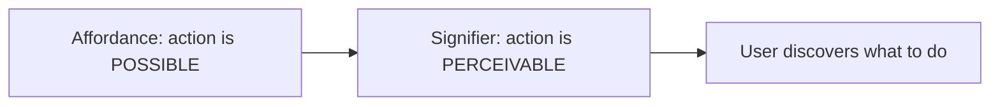
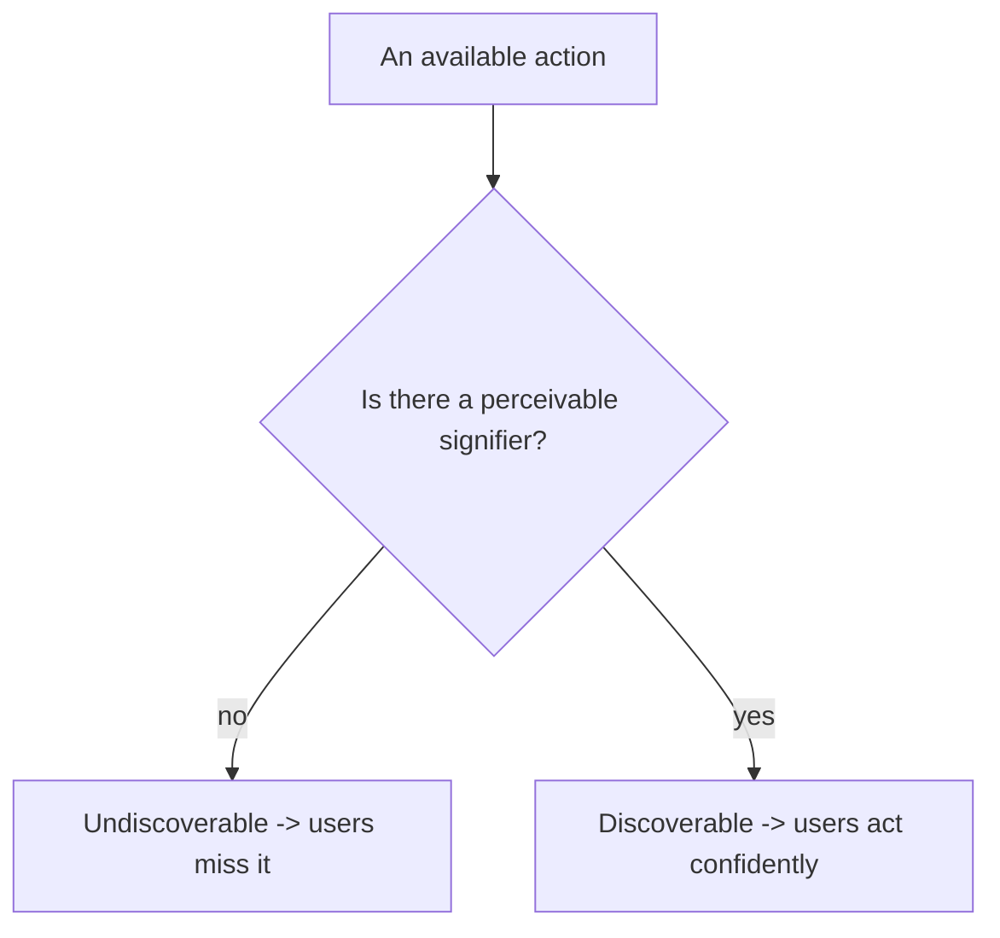
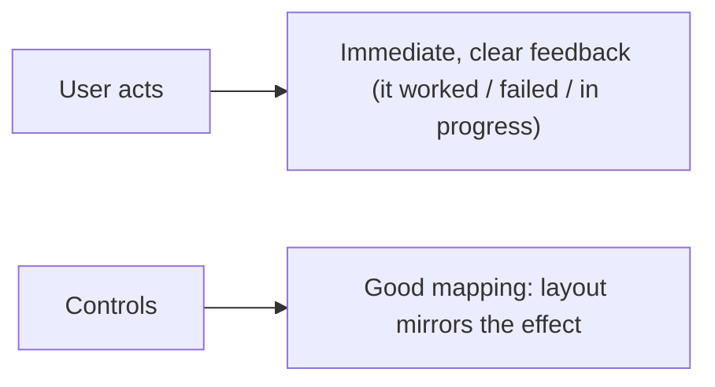
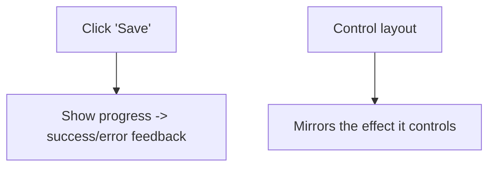
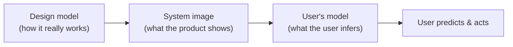
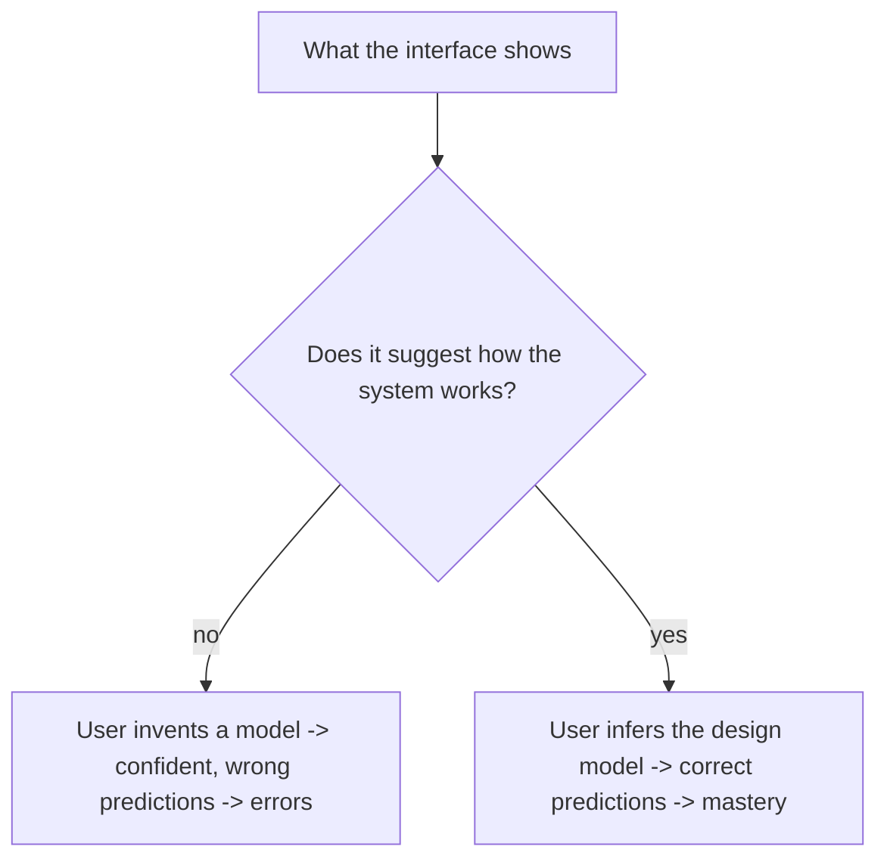
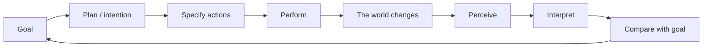
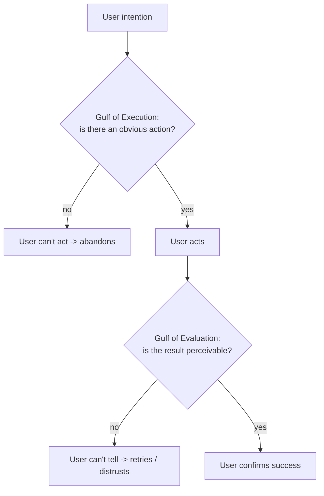

# Usable Design Principles - Complete Professional Guide

> **Category:** 12_design_ux · **Language:** English

---

### Affordances, signifiers, feedback, and mental models
**Original guide written from first principles, current to 2026**

> **Original reference book (English).** This is an **independent, originally written** guide. It is not an extract, summary, or paraphrase of any third-party book; it teaches usable design from first principles with original examples. Canonical books are listed under **References** as pointers only. Each chapter follows the TO-BRAIN editorial standard (see `FILE_CONVENTIONS.md`).
>
> **Scope notice:** good design makes things understandable and usable by making how they work visible. This guide covers the foundational concepts — affordances, signifiers, feedback, mapping, and mental models — that apply to any interface, current to 2026.

---

## How to read this guide

| Level | Profile | Parts |
|-------|---------|-------|
| 1 — Beginner | New to design thinking | Part I |
| 2 — Intermediate | Designing interactions | Part II |

**Target audience:** designers, developers, and product people building anything people interact with.

**Structure of each chapter:** Introduction · Business context · Theoretical concepts · Architecture · Diagrams (Mermaid) · Real examples · Step by step · Complete examples · Exercises · Challenges · Checklist · Best practices · Anti-patterns · Troubleshooting · References.

> **Note on prerequisites.** None.

---

## Table of Contents

**Part I – Making things understandable**
1. Affordances and signifiers
2. Feedback and mapping

**Part II – The user's mind**
3. Mental models and conceptual models

**Part III – How people act**
4. The seven stages of action and the two gulfs

> **Status of this guide:** phased delivery. **Ready:** Parts I–III (Ch. 1–4). **In progress:** Part IV onward (knowledge and constraints, human error, and the design process).

---

## Part I – Making things understandable

When something is hard to use, it's usually the **design's fault, not the user's**. Good design communicates how a thing works through its form — you can tell what to do just by looking. The core concepts (affordances, signifiers, feedback, mapping) are the vocabulary for designing that self-evidence, whether for a door, an app, or an API.

---

## Chapter 1 — Affordances and signifiers

### 1.1 Introduction

An **affordance** is a relationship between an object and a user — what actions are *possible* (a chair affords sitting; a button affords pushing). A **signifier** is a *signal* that communicates where and how to act (the visual cue that a button is pressable). Affordances make action possible; signifiers make it **discoverable**. Confusing the two leads to interfaces where the right action exists but no one can find it.

### 1.2 Business context

Users who can't discover how to use a product abandon it — and on the web, a competitor is a click away. Clear signifiers reduce confusion, support calls, and abandonment, directly improving conversion and satisfaction. Designing affordances and signifiers well is cheaper than the support and lost-user costs of an "intuitive to us, baffling to them" interface. Discoverability is a measurable business lever.

### 1.3 Theoretical concepts: possible vs perceivable



A control can afford an action (it works) but lack a signifier (no one knows it's there) — e.g. a swipe gesture with no visual hint. Good design provides **perceivable signifiers** for every important action: buttons that look pressable, links that look clickable, hints for gestures. Don't rely on hidden affordances users must guess.

### 1.4 Architecture: signal every action



### 1.5 Real example

**Scenario.** An app supports a useful swipe-to-archive gesture on list items.

**Problem.** The gesture (affordance) exists but has no signifier — users never discover it.

**Solution.** Add a perceivable signifier (a visible hint/icon, or a partially revealed action) so the gesture is discoverable.

**Implementation (add the signifier).**

```text
Before: swipe-to-archive works, but nothing on screen suggests it -> unused
After:  show a faint trailing "Archive" affordance on the row / a one-time hint
        -> users see the action is possible and how to trigger it
```

**Result.** The capability is now discoverable and used, instead of being a hidden feature only power users find by accident. The action existed; the signifier unlocked it.

**Future improvements.** Provide a visible alternative (a menu action) so the feature isn't gesture-only — affordances shouldn't be hidden behind one undiscoverable interaction.

### 1.6 Exercises

1. Distinguish an affordance from a signifier.
2. Why can an action exist but be undiscoverable?
3. Give an example of a hidden affordance and how you'd signify it.

### 1.7 Challenges

- **Challenge.** Find a feature in your product users miss. Is its affordance signified? Add a perceivable signifier and see if discovery improves.

### 1.8 Checklist

- [ ] Every important action has a perceivable signifier.
- [ ] I don't rely on hidden gestures/affordances alone.
- [ ] Clickable/actionable things look that way.
- [ ] Discoverability is designed, not assumed.

### 1.9 Best practices

- Signify every important action visibly.
- Provide discoverable alternatives to gestures.
- Make controls look like what they do.

### 1.10 Anti-patterns

- Hidden gestures with no hint (mystery-meat interaction).
- Controls that don't look interactive.
- Relying on users to "just know."

### 1.11 Troubleshooting

| Symptom | Likely cause | Action |
|---------|--------------|--------|
| Feature unused | Affordance not signified | Add a perceivable signifier |
| Users don't click a control | Weak signifier | Make it look actionable |
| Gesture-only feature missed | No alternative/hint | Provide a visible alternative |

### 1.12 References

- D. Norman, *The Design of Everyday Things*, revised ed. (Basic Books, 2013) — ISBN 978-0465050659.
- NN/g, "Affordances and Signifiers": https://www.nngroup.com/articles/.

---

## Chapter 2 — Feedback and mapping

### 2.1 Introduction

**Feedback** is communicating the result of an action — telling the user something happened and what. **Mapping** is the relationship between controls and their effects; **good mapping** makes the relationship obvious (a control laid out like the thing it controls). Together they close the loop: the user acts (signifier), the system responds (feedback), and the controls make sense (mapping).

### 2.2 Business context

Without feedback, users don't know if their action worked — they click again (double-submits), give up, or distrust the system. Without good mapping, they trigger the wrong thing. Both cause errors, frustration, and support load. Immediate, clear feedback and intuitive mapping make interfaces feel responsive and trustworthy, reducing mistakes and increasing confidence — which shows up as fewer errors, fewer support tickets, and higher satisfaction.

### 2.3 Theoretical concepts: close the loop, match controls to effects



Feedback must be **immediate** and **informative** (not just "something happened" but what — success, error, progress). Mapping is strongest when **spatial/natural**: controls arranged like what they affect (stove knobs matching burner positions; volume up = up). Poor mapping forces users to memorize arbitrary relationships.

### 2.4 Architecture: action → feedback; control → effect



### 2.5 Real example

**Scenario.** A form's Save button does its work but gives no feedback.

**Problem.** Users can't tell if it saved — they click repeatedly (causing duplicates) or assume failure.

**Solution.** Immediate feedback: disable the button + show a spinner during save, then a clear success/error message.

**Implementation (close the loop).**

```text
On Save click:
  - immediately: disable button, show "Saving..." spinner (feedback: in progress)
  - on success:  "Saved" confirmation (feedback: done)
  - on error:    clear message + how to fix (feedback: failed, actionable)
-> no uncertainty, no double-submits
```

**Result.** Users always know the state of their action; duplicate submits and confusion disappear. The loop is closed with immediate, informative feedback.

**Future improvements.** Ensure control layout maps naturally to effects elsewhere in the UI (good mapping) to reduce wrong-action errors too.

### 2.6 Exercises

1. Why must feedback be immediate and informative?
2. What is "good mapping"? Give an example.
3. What goes wrong with no feedback on an action?

### 2.7 Challenges

- **Challenge.** Find an action in your app with weak feedback. Add immediate, informative feedback (progress + result). Did confusion/double-submits drop?

### 2.8 Checklist

- [ ] Every action gives immediate, clear feedback.
- [ ] Feedback says what happened (success/error/progress).
- [ ] Controls map naturally to their effects.
- [ ] Users are never left uncertain.

### 2.9 Best practices

- Give immediate, informative feedback for every action.
- Use natural/spatial mapping for controls.
- Prevent double-submits with in-progress feedback.

### 2.10 Anti-patterns

- Silent actions (no feedback).
- Arbitrary control-to-effect mappings.
- Generic "something happened" messages.

### 2.11 Troubleshooting

| Symptom | Likely cause | Action |
|---------|--------------|--------|
| Double-submits / repeated clicks | No in-progress feedback | Disable + show progress on action |
| Users trigger wrong control | Poor mapping | Lay controls out to mirror effects |
| Confusion after acting | No/unclear feedback | Add immediate, specific feedback |

### 2.12 References

- D. Norman, *The Design of Everyday Things*, revised ed. (Basic Books, 2013) — ISBN 978-0465050659.
- J. Nielsen, "Visibility of System Status" (heuristic): https://www.nngroup.com/articles/ten-usability-heuristics/.

---

> **End of Part I.** You can now design for understandability: provide perceivable **signifiers** for the actions your interface **affords** so they're discoverable, give immediate, informative **feedback** that closes the action loop, and use natural **mapping** so controls relate obviously to their effects. **Part II — The user's mind** (Chapter 3) covers the **mental and conceptual models** people build of a system — and how the design either matches them or fights them. (Error-tolerant design — preventing errors and making them recoverable, blaming the design rather than the user — gets its own treatment later, in **Part V**.)

---

## Part II – The user's mind

People don't operate the system you built; they operate the system they *think* you built. Every user constructs a **mental model** — a private story of how the thing works — and acts on that story. When the story is right, the interface feels obvious; when it's wrong, even a "powerful" product feels broken. The designer's leverage is indirect: you can't install a model in someone's head, but you can shape the **system image** — everything the product shows and says — so the model people infer is the one that lets them succeed.

---

## Chapter 3 — Mental models and conceptual models

### 3.1 Introduction

A **conceptual model** is a simplified explanation of how something works — enough to predict what it will do, not a complete or technically accurate account. Three models matter and must be distinguished. The **design model** is the conceptual model held by the designer — how the system *actually* works. The **user's model** (the mental model) is the conceptual model the user builds from experience. Crucially, the designer and the user never talk directly: the only thing that connects them is the **system image** — the visible structure, controls, labels, behavior, documentation, everything the product presents. If the system image doesn't clearly communicate the design model, the user builds a *wrong* model — and a wrong model produces confident mistakes. Good design is, in large part, building a system image that hands the user the right model for free.

### 3.2 Business context

A correct mental model is the difference between a product people master and one they abandon. When the system image teaches the right model, users predict behavior, recover from surprises, and need little support; when it teaches a wrong (or no) model, they hesitate, distrust the system, fabricate superstitions ("always do X twice or it won't save"), and flood support with "why did it do that?" tickets. Mental-model failures are expensive precisely because they're invisible in a feature list — the feature works, yet adoption stalls because no one can form a story that makes it usable. Investing in a coherent, communicated model is cheaper than the churn and support cost of a product that is powerful but unexplainable.

### 3.3 Theoretical concepts: three models, one channel



The designer's model reaches the user *only* through the system image — never directly. So the design question is not "do I understand my system?" but "does what I show let the user reconstruct a model that works?" Models are allowed to be **incomplete and even technically wrong** as long as they're *predictive*: a thermostat user who believes "higher setting = heats faster" holds a false model that still mostly works for setting a temperature — until it causes the error of cranking it to maximum. The fix is a system image that suggests the correct model (the room heats at a fixed rate toward the target), not a physics lecture.

### 3.4 Architecture: does the image teach the model?



### 3.5 Real example

**Scenario.** A note-taking app syncs to the cloud in the background. There is no visible model of *when* a note is safe.

**Problem.** Users build the wrong mental model — "it saved when I closed it" — or no model at all, so they distrust sync, manually copy notes elsewhere, and lose edits made offline because they assumed an immediate save.

**Solution.** Make the model visible through the system image: show sync state explicitly ("Saving… / Saved / Offline — will sync when connected") so the user's model matches reality.

**Implementation (communicate the model).**

```text
Before: silent background sync -> user guesses the rules -> wrong model, lost trust
After:  per-note status: "Saved 2s ago", "Offline — changes kept locally, will sync",
        a one-line explainer on first use ("Notes save locally instantly, then sync")
        -> user infers the real model: local-first, sync-when-online
```

**Result.** Users stop inventing superstitions and manual backups; they correctly predict that offline edits are safe and will sync later. The behavior didn't change — the *communicated model* did.

**Future improvements.** Surface conflict resolution in the same model ("edited on two devices — keep both?") so the user's model extends gracefully to the hard cases instead of breaking on them.

### 3.6 Exercises

1. Distinguish the design model, the user's model, and the system image.
2. Why can a *technically wrong* mental model still be useful — and when does it bite?
3. The designer "talks" to the user through only one channel. Which one, and what follows from that?

### 3.7 Challenges

- **Challenge.** Pick a feature users misunderstand. Write the model they *currently* infer and the model you *want* them to have. Change the system image (labels, states, defaults, a one-line explainer) to close the gap — then check whether the misunderstanding drops.

### 3.8 Checklist

- [ ] The system image clearly suggests how the system works.
- [ ] The model I want users to hold is written down — and visible in the UI, not just in my head.
- [ ] Hidden state that affects predictions (sync, modes, background work) is made visible.
- [ ] I've checked the *wrong* models users might infer and designed against them.

### 3.9 Best practices

- Decide the conceptual model you want users to hold, then engineer the system image to teach it.
- Make invisible state visible — users can only model what they can perceive.
- Prefer a simple, predictive model over a complete, accurate one.

### 3.10 Anti-patterns

- Hidden behavior that forces users to guess the rules (and guess wrong).
- Assuming "obvious to me" equals "communicated" — the design model never reaches users directly.
- Inconsistent behavior that makes a coherent model impossible to form.

### 3.11 Troubleshooting

| Symptom | Likely cause | Action |
|---------|--------------|--------|
| Users invent superstitions/workarounds | No communicated model — they guessed | Make the model visible in the system image |
| "Why did it do that?" surprises | User's model diverges from the design model | Align the image (states, labels) to the real behavior |
| Same input, unpredictable result to users | Inconsistent behavior blocks model-building | Make behavior consistent, then signal it |

### 3.12 References

- D. Norman, *The Design of Everyday Things*, revised ed. (Basic Books, 2013) — ISBN 978-0465050659. See Chapter 1 ("The Psychopathology of Everyday Things"), the section on conceptual models, the design model / user's model / system image, and the *Gulfs* introduced there.
- NN/g, "Mental Models": https://www.nngroup.com/articles/mental-models/.

---

## Part III – How people act

A mental model explains what users *believe*; this part explains what they *do*. Every interaction, from flipping a switch to filing taxes, runs through the same loop: form a goal, figure out how to act, act, then check whether it worked. Norman names the seven steps of that loop and the two places designs most often fail it — the gap between intention and action, and the gap between result and understanding. Naming these gaps turns "the user is confused" into a diagnosis you can fix.

---

## Chapter 4 — The seven stages of action and the two gulfs

### 4.1 Introduction

Norman breaks any action into **seven stages**: one for the **goal**, three on the *doing* (execution) side, and three on the *checking* (evaluation) side. Execution: form an **intention/plan**, **specify** the action sequence, **perform** it. Evaluation: **perceive** the state of the world, **interpret** it, **compare** it against the goal. Two gaps decide whether the loop succeeds. The **Gulf of Execution** is the gap between the user's intention and the actions the system actually allows — *"I know what I want; how do I do it here?"* The **Gulf of Evaluation** is the gap between the system's state and the user's ability to perceive and understand it — *"Something happened; did it do what I wanted?"* The designer's whole job, in this frame, is to **bridge both gulfs**.

### 4.2 Business context

Most "the user couldn't figure it out" failures are really an unbridged gulf, and each gulf has a distinct cost. A wide Gulf of Execution shows up as drop-off and "I couldn't find how to…" — users abandon a task because the system offers no obvious action that matches their intention. A wide Gulf of Evaluation shows up as repeated actions, mistrust, and "did that work?" support tickets — users can't read the result, so they retry, give up, or call. Diagnosing which gulf is wide tells you *where* to spend: make actions discoverable (execution) versus make state perceivable (evaluation). It turns a vague usability complaint into a targeted, measurable fix.

### 4.3 Theoretical concepts: the action loop and where it breaks



The seven stages are an **approximate model, not a literal sequence** — people skip stages, run them out of order, and loop tightly. Its value is diagnostic: when an interaction fails, you can ask *which stage broke*. Couldn't the user find a control matching their intention? That's a **specify/execution** failure. Did they act but couldn't tell if it worked? That's a **perceive/interpret/evaluation** failure. The two gulfs are simply the execution side and the evaluation side viewed as gaps to be bridged.

### 4.4 Architecture: bridge both gulfs



### 4.5 Real example

**Scenario.** A user wants to export a report as PDF from a dashboard.

**Problem.** *Execution gulf:* export is buried behind a non-obvious icon, so the user's intention ("get a PDF") has no visible matching action. *Evaluation gulf:* when they finally trigger it, the file generates in the background with no indication — they can't tell it worked, so they click again and get duplicate exports.

**Solution.** Bridge both: surface an explicit **"Export ▸ PDF"** action where the intention arises (execution), and show **progress then a clear result** ("Preparing PDF… / Downloaded report.pdf") (evaluation).

**Implementation (bridge execution, then evaluation).**

```text
Execution gulf -> add a labelled "Export" control next to the report,
                  with "PDF" as a visible option (intention maps to an action)
Evaluation gulf -> on click: "Preparing PDF…" -> "Downloaded report.pdf"
                  (and disable re-click while running) -> result is perceivable
```

**Result.** Users complete the export on the first try and know it succeeded — drop-off and duplicate-export tickets both fall. The fix targeted the two specific gulfs instead of redesigning blindly.

**Future improvements.** Instrument the loop: measure where users stall (no action taken = execution gulf; repeated triggers = evaluation gulf) so the next fix is aimed by data, not guesswork.

### 4.6 Exercises

1. List the seven stages of action and group them into the execution side and the evaluation side.
2. Define the Gulf of Execution and the Gulf of Evaluation in one sentence each.
3. A user clicks a button repeatedly because "nothing happened." Which gulf is wide, and which stage broke?

### 4.7 Challenges

- **Challenge.** Take one task in your product. Walk it through all seven stages and mark where a user could get stuck. Classify each stuck point as an execution-gulf or evaluation-gulf problem, then fix the widest one.

### 4.8 Checklist

- [ ] For each user goal, there is an obvious action that matches the intention (execution bridged).
- [ ] After every action, the resulting state is perceivable and interpretable (evaluation bridged).
- [ ] I can name which stage breaks when a task fails.
- [ ] Progress and outcome are shown, so users never have to guess whether an action worked.

### 4.9 Best practices

- Design from the user's goal backward through the seven stages, not from the feature forward.
- Bridge the Gulf of Execution: make the right action visible and matched to the intention.
- Bridge the Gulf of Evaluation: make state and outcomes perceivable and easy to interpret.

### 4.10 Anti-patterns

- Hiding the action that fulfills a common intention (wide execution gulf).
- Acting silently, leaving users to infer the result (wide evaluation gulf).
- "Powerful but unusable": every feature present, none of them reachable through a user's actual goal.

### 4.11 Troubleshooting

| Symptom | Likely cause | Action |
|---------|--------------|--------|
| Users abandon a task early | Wide Gulf of Execution — no obvious matching action | Surface a labelled action mapped to the intention |
| Repeated clicks / duplicate results | Wide Gulf of Evaluation — result not perceivable | Show progress + a clear outcome; block re-trigger |
| "I didn't know it could do that" | Capability not reachable from the user's goal | Place the action where the goal arises |

### 4.12 References

- D. Norman, *The Design of Everyday Things*, revised ed. (Basic Books, 2013) — ISBN 978-0465050659. See Chapter 2 ("The Psychology of Everyday Actions"): the seven stages of action and the Gulf of Execution / Gulf of Evaluation.
- NN/g, "The Gulf of Evaluation and the Gulf of Execution": https://www.nngroup.com/articles/two-ux-gulfs/.

<!--APPEND-PART-II-->
