# Hermes Agent - Complete Professional Guide

> **Category:** 13_automation_and_integration · **Language:** English

---

### Autonomous Agents, Persistent Memory, Continuous Learning, and Enterprise Architecture
**Edition updated for Hermes Agent v0.16 — "Surface Release" (June 2026)**

> **Reference book (English).** A guide to **Hermes Agent**, by **Nous Research** — the self-improving AI agent with a learning loop, persistent memory, agent-created Skills, MCP, and a messaging gateway that lives on 20+ platforms. Based primarily on the official documentation (https://hermes-agent.nousresearch.com/docs/), the repository (https://github.com/NousResearch/hermes-agent, MIT license), and the official release notes.
>
> **Version notice:** Hermes Agent is a **0.x** project, young and fast-moving (near-weekly releases). This edition reflects the **v0.16 (June 2026)** line. Relevant changes between versions appear in **"What's New in This Version"** sections with six lenses: *what changed · architecture impact · impact for developers · impact for enterprises · migration · recommended best practices*.

---

## How to read this book

Progressive evolution through five maturity levels:

| Level | Profile | Parts |
|-------|---------|-------|
| 1 — Beginner | First contact with autonomous agents | Part I |
| 2 — Intermediate | Architecture, installation, models | Parts II–IV |
| 3 — Advanced | Memory, Skills, MCP, multi-agents | Parts V–VIII |
| 4 — Specialist | Integrations, automation, agent engineering | Parts IX–XI |
| 5 — Enterprise | Security, observability, production, projects | Parts XII–XV |

**Target audience:** Java and full-stack developers, software architects, AI/ML engineers, platform engineers, DevOps/MLOps professionals, tech leads, CTOs, AI researchers, and automation consultants.

**Structure of each chapter:** Introduction · Objectives · Business context · Theoretical foundations · Architecture · Internal flows · Diagrams (Mermaid, sequence, component) · Complete examples · Source code · Configuration · Real-world use cases · Exercises · Challenges · Checklist · Best practices · Anti-patterns · Troubleshooting · Official references.

**Example format:** Scenario · Problem · Solution · Architecture · Implementation · Tests · Result · Future improvements.

> **Terminology note.** Hermes Agent is a **terminal-native** tool written in **Python**. The "source code" examples use Python (the project's language), YAML (configuration), and shell. Since part of the audience comes from Java, we draw parallels with Java/JVM concepts wherever useful.

---

## Table of Contents

**Part I – Introduction to Hermes Agent**
1. What is Hermes Agent · 2. History and evolution of the project · 3. The philosophy of Nous Research · 4. The concept of self-evolving agents · 5. How Hermes differs from ChatGPT, Claude, Gemini, OpenHands, AutoGPT, and Manus

**Part II – Internal Architecture**
6. General Architecture · 7. Internal Components · 8. Agent Lifecycle · 9. Memory System · 10. Learning System · 11. Skills System · 12. Planning System · 13. Execution System

**Part III – Installation and Environments**
14. Local Installation · 15. Linux · 16. Windows · 17. macOS · 18. Docker · 19. Kubernetes · 20. VPS · 21. Cloud Providers

**Part IV – Models and Providers**
22. Nous Portal · 23. OpenAI · 24. Anthropic · 25. Gemini · 26. OpenRouter · 27. Hugging Face · 28. Local Models · 29. Ollama · 30. LM Studio

**Part V – Persistent Memory**
31. Core Concepts · 32. Memory Structure · 33. Knowledge Retrieval · 34. Context Engineering · 35. Long-Term Memory · 36. User Modeling · 37. Continuous Learning

**Part VI – Skills**
38. What Skills Are · 39. Skills Architecture · 40. Creating Skills · 41. Automatic Updating · 42. Skill Evolution · 43. Reuse · 44. Corporate Skills Library · 45. Skills Governance

**Part VII – MCP and Tools**
46. Introduction to MCP · 47. MCP Architecture · 48. Tool Integration · 49. Building MCP Servers · 50. Tool Calling · 51. Browser Automation · 52. Web Search · 53. Custom Tools

**Part VIII – Subagents and Multi-Agents**
54. Subagents · 55. Multi-Agent Architecture · 56. Agent Coordination · 57. Task Delegation · 58. Specialized Agents · 59. Swarms · 60. Distributed Agent Systems

**Part IX – Integrations**
61. Telegram · 62. Discord · 63. Slack · 64. WhatsApp · 65. Signal · 66. Email · 67. REST APIs · 68. GraphQL · 69. Databases · 70. Corporate Systems

**Part X – Intelligent Automation**
71. Scheduling · 72. Intelligent Workflows · 73. Autonomous Agents · 74. Asynchronous Processing · 75. Background Jobs · 76. Automated Reports · 77. Enterprise Assistants

**Part XI – Agent Engineering**
78. Agent Engineering · 79. Prompt Engineering for Agents · 80. Context Engineering · 81. Memory Engineering · 82. Tool Engineering · 83. Workflow Engineering · 84. AgentOps

**Part XII – Security**
85. Platform Security · 86. Access Control · 87. Credential Management · 88. Environment Isolation · 89. Sandboxing · 90. Compliance · 91. Auditing

**Part XIII – Observability**
92. Logging · 93. Tracing · 94. Monitoring · 95. Metrics · 96. Performance · 97. Costs · 98. Troubleshooting

**Part XIV – Enterprise**
99. Enterprise Architecture · 100. Scalability · 101. High Availability · 102. Multi-Tenant · 103. Governance · 104. Production Operations · 105. Technology Roadmap

**Part XV – Real Projects**
P1. Intelligent Corporate Assistant · P2. Multi-Agent Support Center · P3. Automated Research Platform · P4. AI-Assisted Software Engineering · P5. Enterprise Agent Platform · P6. Autonomous Agent-Based Organization

> **Status of this edition:** phased delivery (each part keeps the same depth standard). **Ready:** Part I (Ch. 1–5). **In progress:** Parts II–XV.

---

## Part I – Introduction to Hermes Agent

Part I builds the mental model needed for everything else. Hermes Agent is not "yet another LLM wrapper": it is a different category of software — an **autonomous, terminal-native agent that gets more capable the longer it runs**. Understanding why, where it came from, and how it differs from competitors is a prerequisite for using its advanced capabilities well (memory, Skills, MCP, multi-agents).

---

## Chapter 1 — What is Hermes Agent

### 1.1 Introduction

**Hermes Agent** is an **autonomous, terminal-native, self-improving** AI agent created by **Nous Research** — the same lab behind the Hermes, Nomos, and Psyche models. Its central thesis, stated in the official documentation, is blunt: *"the only agent with a built-in learning loop."* In practice, it creates Skills from experience, refines those Skills during use, "nudges" itself to persist knowledge, and builds an increasingly deep model of who the user is, **across multiple sessions**.

Unlike a copilot tethered to an IDE or a chatbot wrapping a single API, Hermes is an autonomous process that **runs wherever you put it** — a $5 VPS, a GPU cluster, or serverless infrastructure (Daytona, Modal) that hibernates when idle and costs nearly nothing. You talk to it from Telegram while it works on a cloud VM you never SSH into yourself.

### 1.2 Chapter objectives

By the end, you will be able to: (1) precisely define what Hermes Agent is and is **not**; (2) enumerate its pillars (learning loop, persistent memory, Skills, messaging gateway, execution backends); (3) understand why it is terminal-native and provider-agnostic; (4) recognize where it adds enterprise value.

### 1.3 Business context

The "AI assistant" market suffers from three limitations that block serious enterprise use: **amnesia** (each session starts from scratch), **stagnation** (the assistant doesn't improve with use), and **lock-in** (tied to an IDE, an app, or a provider). For a company, this means constant rework of context, no capitalization of knowledge, and vendor lock-in.

Hermes targets exactly these three points: memory that **persists and is curated**; Skills that **accumulate and evolve** (organizational knowledge becomes a reusable asset); and an architecture that is **provider- and platform-agnostic** (Nous Portal, OpenRouter, OpenAI, Anthropic, Google, or any OpenAI-compatible endpoint; CLI, 20+ messengers, IDEs via ACP, API server). For the CTO, the read is: an agent that **turns usage into accumulated capability**, under your infrastructure and cost control.

### 1.4 Theoretical foundations

Hermes materializes the pattern **agent = LLM + tools + control loop + persistent state**. Four foundations:

- **Agentic loop:** the `AIAgent` core receives the input, builds the prompt, calls the LLM, executes tool calls, observes the result, and repeats until done — the classic *think → act → observe* cycle.
- **Memory of two natures:** *declarative* (facts about the world and the user, in `MEMORY.md`/`USER.md` + SQLite with FTS5) and *procedural* (how to do things, in Skills). This fact-vs-procedure distinction is what enables self-learning.
- **Learning loop:** every N tasks (by default, ~15), the agent evaluates its performance, extracts patterns, and creates/refines Skills. This is what makes it self-improving.
- **Loose coupling:** MCP, plugins, memory providers, and execution backends are optional and pluggable via registries, not hard dependencies. This is an explicit design principle of the project.

> **Java parallel.** Think of `AIAgent` as a central orchestrator (like Spring's `ApplicationContext`) that injects capabilities (tools, providers, memory) via registries; each tool self-registers on import, reminiscent of component scanning.

### 1.5 Architecture (introductory view)

At the highest level, there are **entry points** (CLI, messaging Gateway, ACP for IDEs, API Server, Python library, Batch Runner) that converge on the same `AIAgent` core, which orchestrates prompt, provider, tools, and persistence.

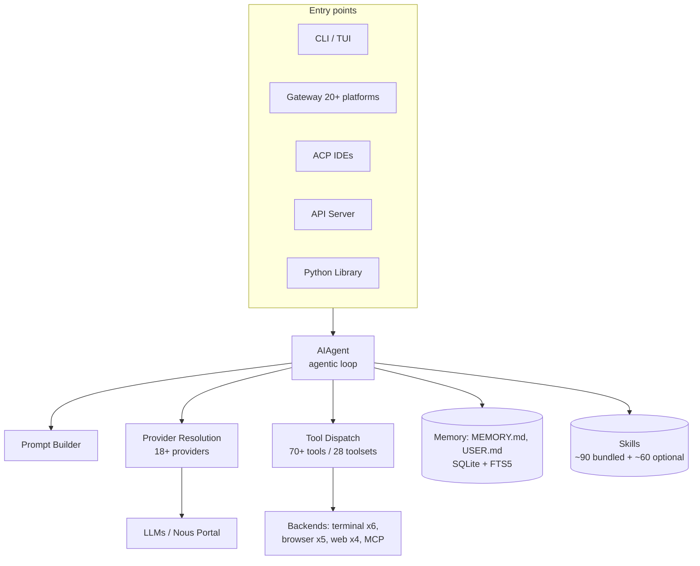
```mermaid
flowchart TB
    subgraph entries["Entry points"]
        cli[CLI / TUI]
        gw[Gateway 20+ platforms]
        acp[ACP IDEs]
        api[API Server]
        lib[Python Library]
    end
    entries --> agent[AIAgent<br/>agentic loop]
    agent --> prompt[Prompt Builder]
    agent --> prov[Provider Resolution<br/>18+ providers]
    agent --> tools[Tool Dispatch<br/>70+ tools / 28 toolsets]
    agent --> mem[(Memory: MEMORY.md, USER.md<br/>SQLite + FTS5)]
    agent --> skills[(Skills<br/>~90 bundled + ~60 optional)]
    tools --> back[Backends: terminal x6,<br/>browser x5, web x4, MCP]
    prov --> llm[LLMs / Nous Portal]
```

### 1.6 Internal flows (CLI session)

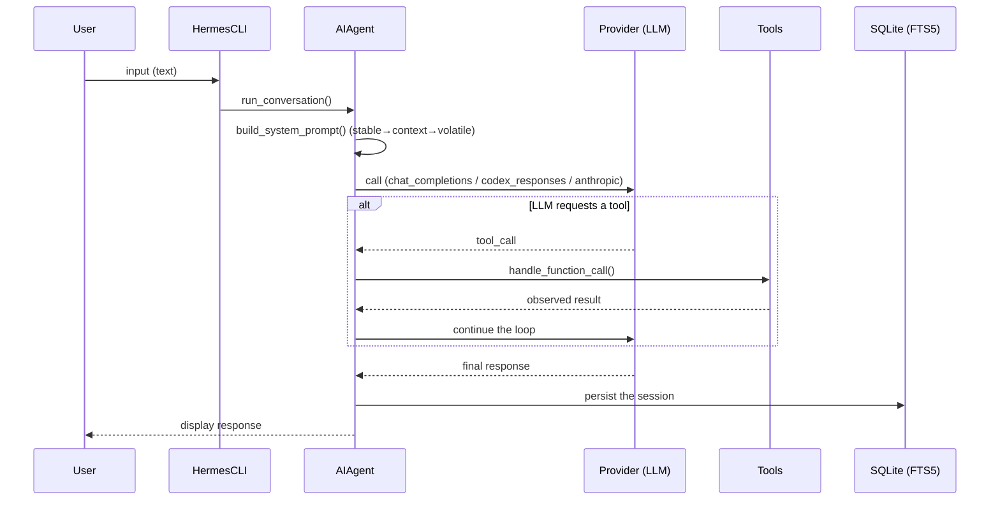
```mermaid
sequenceDiagram
    participant U as User
    participant C as HermesCLI
    participant A as AIAgent
    participant P as Provider (LLM)
    participant T as Tools
    participant DB as SQLite (FTS5)
    U->>C: input (text)
    C->>A: run_conversation()
    A->>A: build_system_prompt() (stable→context→volatile)
    A->>P: call (chat_completions / codex_responses / anthropic)
    alt LLM requests a tool
        P-->>A: tool_call
        A->>T: handle_function_call()
        T-->>A: observed result
        A->>P: continue the loop
    end
    P-->>A: final response
    A->>DB: persist the session
    A-->>U: display response
```

### 1.7 Component diagram (core)

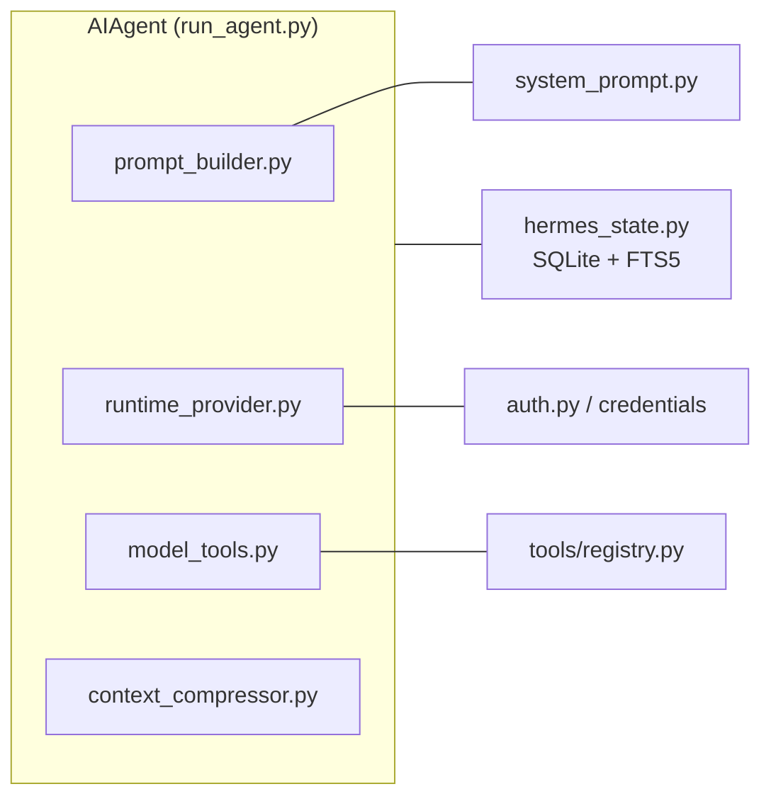
```mermaid
flowchart LR
    subgraph core["AIAgent (run_agent.py)"]
        pb[prompt_builder.py]
        rp[runtime_provider.py]
        mt[model_tools.py]
        cc[context_compressor.py]
    end
    pb --- sp[system_prompt.py]
    mt --- reg[tools/registry.py]
    rp --- auth[auth.py / credentials]
    core --- state[hermes_state.py<br/>SQLite + FTS5]
```

### 1.8 Complete example

**Scenario.** A developer wants an assistant that runs on a VPS and, over time, learns the team's conventions.

**Problem.** Common tools forget everything between sessions and don't accumulate team knowledge.

**Solution.** Install Hermes on the VPS, connect to Nous Portal, and use it via CLI; let it record preferences in memory and create Skills.

**Architecture.** CLI → AIAgent → Nous Portal (model + Tool Gateway) → local memory/Skills on the VPS.

**Implementation (installation and setup):**

```bash
# Linux / macOS / WSL2 / Termux
curl -fsSL https://hermes-agent.nousresearch.com/install.sh | bash

# One OAuth covers a model + the 4 Tool Gateway tools
# (web search, image generation, TTS, browser)
hermes setup --portal

# Start the conversation
hermes
```

**Configuration (`~/.hermes/config.yaml`, excerpt):**

```yaml
provider: nous-portal
model: hermes-4-70b
memory:
  enabled: true        # MEMORY.md + USER.md + SQLite/FTS5
skills:
  enabled: true        # learning and Skill creation
```

**Tests.** Verify the installation and configuration:

```bash
hermes --version          # should indicate v0.16.x (June 2026 line)
hermes doctor             # environment and provider diagnostics
```

**Result.** A persistent agent on the VPS, accessible via CLI (and later via Telegram through the gateway), that remembers preferences and accumulates team Skills.

**Future improvements.** Connect the messaging gateway (Part IX), add an external memory provider such as Honcho (Part V), and expose the agent to the team with authorization (Part XII).

### 1.9 Real-world use cases

An engineering assistant that learns the codebase; a research bot that delivers daily briefings on Telegram; an automated Pull Request reviewer; a scheduled-task (cron) operator that generates reports; a multi-platform corporate automation desk. The official documentation includes ready-made guides (Daily Briefing Bot, GitHub PR Review Agent, Team Telegram Assistant).

### 1.10 Exercises

1. List the five Hermes entry points and say which you would use for a team bot.
2. Explain the difference between **declarative** and **procedural** memory in Hermes.
3. Define, in your own words, what the learning loop is.

### 1.11 Challenges

- **Challenge 1.** Install Hermes locally (or on a VPS), run `hermes setup --portal`, and have your first conversation.
- **Challenge 2.** Argue, to a manager, why "memory that persists + Skills that evolve" is a competitive differentiator over a traditional chatbot.

### 1.12 Checklist

- [ ] I know Hermes is an autonomous terminal-native agent, not a chatbot/copilot.
- [ ] I know the four foundations (agentic loop, dual memory, learning loop, loose coupling).
- [ ] I understand it is provider- and platform-agnostic.
- [ ] I installed and started the agent.

### 1.13 Best practices

- Start with **Nous Portal** (`hermes setup --portal`): one OAuth resolves model + web tools and reduces initial friction.
- Treat `MEMORY.md`/`USER.md` and Skills as **versionable team assets** from the start.
- Run the agent where it should live (VPS/serverless), not tied to your laptop.

### 1.14 Anti-patterns

- Using Hermes as an ephemeral chatbot, ignoring memory and Skills — wasting its main differentiator.
- Hardcoding keys in a versioned `config.yaml` — use the credential flow (Part XII).
- Exposing the agent in messaging without authorization/allowlist (Part XII) — risk of unauthorized access.

### 1.15 Troubleshooting

| Symptom | Likely cause | Action |
|---------|--------------|--------|
| `hermes: command not found` | PATH not updated after install | Reopen the shell or follow the Installation Guide |
| No model available | Provider not configured | Run `hermes setup --portal` or configure a provider |
| Agent "remembers" nothing | Memory disabled | Enable `memory.enabled` in the config |
| Intermittent provider errors | No fallback | Configure fallback providers (Part IV) |

### 1.16 Official references

- Documentation: https://hermes-agent.nousresearch.com/docs/
- Features overview: https://hermes-agent.nousresearch.com/docs/user-guide/features/overview
- Architecture: https://hermes-agent.nousresearch.com/docs/developer-guide/architecture
- Repository (MIT): https://github.com/NousResearch/hermes-agent
- Nous Portal: https://hermes-agent.nousresearch.com/docs/integrations/nous-portal

---

## Chapter 2 — History and evolution of the project

### 2.1 Introduction

Hermes Agent is a fast-moving **0.x** project: dozens of releases in 2026, with deep structural refactors in just a few weeks. Understanding this trajectory is indispensable for an architect, because recent version decisions (CLI rewrite, core modularization, desktop app) change **how** you install, operate, and extend the tool. This chapter traces the timeline up to **v0.16 (June 2026)** and details the recent versions' news.

### 2.2 Chapter objectives

(1) Situate Hermes within Nous Research's history; (2) understand the dual versioning scheme (`v0.x.y` + date `vYYYY.M.D`); (3) know the last six relevant releases and their impacts; (4) know how to read and apply the "What's New in This Version" sections.

### 2.3 Business context

Adopting a **pre-1.0** project requires risk awareness: APIs and formats may change between minors. The counterpoint is innovation speed — Hermes incorporated a desktop app, a modern TUI, and modularization in weeks. For enterprises, the recommendation is to **pin the version** and update in a controlled way, following the release notes.

### 2.4 Foundations: versioning

The project uses **two identifiers in parallel**: an informal semver `v0.x.y` (e.g., `v0.16.0`) and a date stamp `vYYYY.M.D` (e.g., `v2026.6.5`). Releases receive thematic names ("The Interface Release," "Velocity," "Surface"), in the manner of large open-source projects.

### 2.5 Timeline

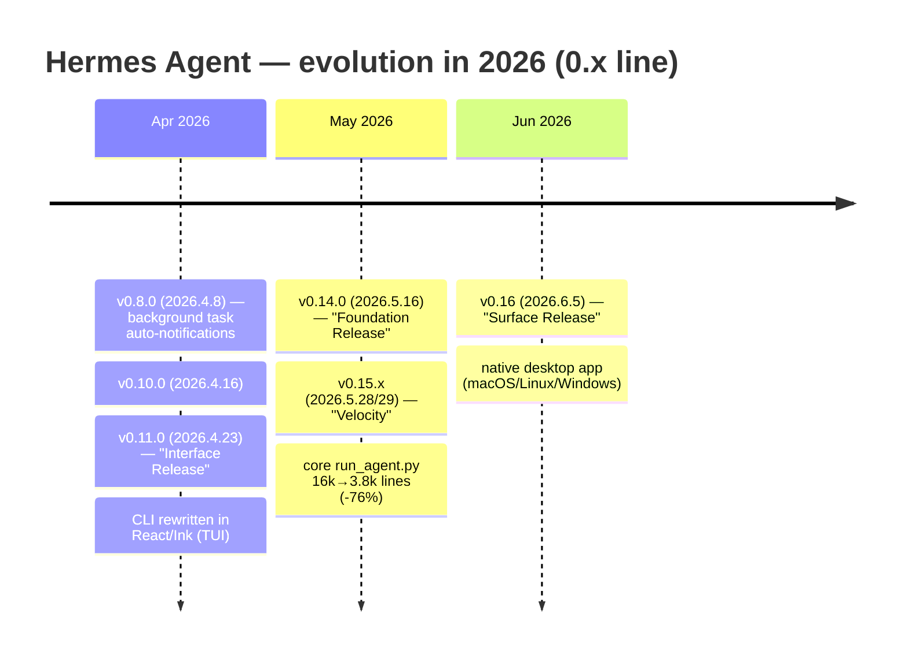
```mermaid
timeline
    title Hermes Agent — evolution in 2026 (0.x line)
    Apr 2026 : v0.8.0 (2026.4.8) — background task auto-notifications
             : v0.10.0 (2026.4.16)
             : v0.11.0 (2026.4.23) — "Interface Release": CLI rewritten in React/Ink (TUI)
    May 2026 : v0.14.0 (2026.5.16) — "Foundation Release"
             : v0.15.x (2026.5.28/29) — "Velocity": core run_agent.py 16k→3.8k lines (-76%)
    Jun 2026 : v0.16 (2026.6.5) — "Surface Release": native desktop app (macOS/Linux/Windows)
```

Nous Research context: a lab known for open models (Hermes, Nomos) and research into distributed training (Psyche). Hermes Agent is the applied materialization of that research: an agent built "by people who train models," focused on memory, learning, and trajectory generation for RL (integration with Atropos).

### 2.6 What's New — v0.11.0 "Interface Release" (Apr 23, 2026)

- **What changed:** a complete rewrite of the interactive CLI in **React/Ink**, giving rise to the modern TUI (mouse, rich overlays, non-blocking input).
- **Architecture impact:** clear separation between the agent core and the terminal presentation layer; the TUI becomes extensible.
- **Impact for developers:** new keybindings and the ability to build wrapper CLIs with custom widgets (see "Extending the CLI").
- **Impact for enterprises:** better operational ergonomics for teams using the agent in the terminal.
- **Migration:** scripts that depended on details of the old CLI may need adjustment; the command interface was preserved.
- **Best practices:** adopt the TUI; standardize shortcuts across the team.

### 2.7 What's New — v0.14.0 "Foundation Release" (May 16) and v0.15.x "Velocity" (May 28–29)

- **What changed:** foundation consolidation and a massive refactor — the `run_agent.py` monolith (16,083 lines) was reduced to **3,821 lines (-76%)**, distributed across **14 cohesive modules** in `agent/` (prompt_builder, context_compressor, memory_manager, etc.).
- **Architecture impact:** a modular core with isolated responsibilities (prompt, compression, memory, providers) — the basis for sustainable evolution.
- **Impact for developers:** a much more navigable codebase; contributing and extending became easier (hundreds of contributors in the cycle).
- **Impact for enterprises:** greater reliability and fix speed; less regression risk in a giant file.
- **Migration:** normal usage doesn't break; integrations that imported internal symbols from `run_agent.py` should migrate to the new modules.
- **Best practices:** depend on public APIs (CLI, config, the `AIAgent` Python library), not internals.

### 2.8 What's New — v0.16 "Surface Release" (Jun 5, 2026) — current version

- **What changed:** the launch of the **native desktop app** (built across ~100 PRs) with one-click install, drag-and-drop of files, and macOS/Linux/Windows support; "Hermes meets you wherever you work" (surfaces: terminal, desktop, messaging, IDE).
- **Architecture impact:** the desktop is one more *surface* over the same `AIAgent` core; it reinforces the "platform-agnostic core" principle.
- **Impact for developers:** simplified installation (desktop installer in addition to `curl`); a smoother onboarding flow.
- **Impact for enterprises:** easier distribution for non-technical users; a path toward an admin panel and assisted operation.
- **Migration:** CLI-only users need to change nothing; the desktop is optional and coexists with the command-line install.
- **Best practices:** for end users, distribute via the desktop app; for servers/automation, keep the CLI/headless.

### 2.9 Architecture: what the evolution reveals

The trajectory shows a clear intent: **a stable, modular `AIAgent` core**, surrounded by **multiple surfaces** (CLI/TUI, desktop, gateway, ACP, API) and **pluggable subsystems** (memory, Skills, MCP, backends). It is the opposite of a coupled monolith — and explains why the project can iterate so fast without breaking the core.

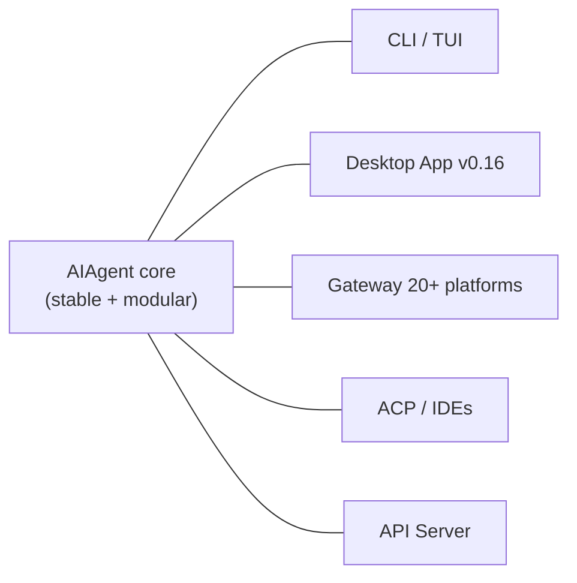
```mermaid
flowchart LR
    core["AIAgent core<br/>(stable + modular)"]
    core --- s1[CLI / TUI]
    core --- s2[Desktop App v0.16]
    core --- s3[Gateway 20+ platforms]
    core --- s4[ACP / IDEs]
    core --- s5[API Server]
```

### 2.10 Complete example

**Scenario.** A team wants to standardize the Hermes version in production and plan updates.

**Problem.** A 0.x project changes fast; updating blindly can break automations.

**Solution.** Pin the version, follow the release notes, and update in staging first.

**Implementation:**

```bash
# Check the current version and update in a controlled way
hermes --version
hermes update --check          # see what would change
# In staging, update and validate; only then in production
hermes update
```

**Tests.** After updating in staging, run the critical automation suite and `hermes doctor`.

**Result.** Predictable updates, aligned with the release notes, with no production surprises.

**Future improvements.** Integrate the version check into CI/AgentOps (Part XI) and keep an internal changelog of each upgrade's impact.

### 2.11 Real-world use cases

Teams that follow releases to adopt early features such as the TUI (v0.11), the modular core (v0.15), and the desktop (v0.16); researchers who use trajectory export to train models with Atropos.

### 2.12 Exercises

1. Explain Hermes's dual versioning scheme.
2. For each of the last three releases, cite one impact for enterprises.

### 2.13 Challenges

- **Challenge.** Write a production update runbook for Hermes on a VPS, with a staging step and rollback.

### 2.14 Checklist

- [ ] I understand it is a fast-moving 0.x project.
- [ ] I know what changed in v0.11, v0.14/0.15, and v0.16.
- [ ] I can pin a version and update in a controlled way.

### 2.15 Best practices

- **Pin** the version in production; use `latest` only in disposable environments.
- Read the release notes on every update; the pace is weekly.
- Depend on public APIs, not `run_agent.py` internals.

### 2.16 Anti-patterns

- Updating production directly without staging.
- Building integrations on top of internal symbols that moved during modularization.
- Ignoring the 0.x nature and assuming 1.x stability.

### 2.17 Troubleshooting

| Symptom | Cause | Action |
|---------|-------|--------|
| Breakage after update | Change between 0.x minors | Revert to the pinned version; read release notes |
| Internal import fails | Symbol moved during modularization | Migrate to the new module in `agent/` |
| Desktop won't install | Platform/permission | Use the official installer; check the supported OS |

### 2.18 Official references

- Releases (GitHub): https://github.com/NousResearch/hermes-agent/releases
- Changelog: https://www.hermes-ai.net/changelog/
- Updating: https://hermes-agent.nousresearch.com/docs/getting-started/updating
- Nous Research: https://nousresearch.com

---

## Chapter 3 — The philosophy of Nous Research

### 3.1 Introduction

Hermes Agent cannot be understood outside the philosophy of **Nous Research**, the lab that created it. Nous is known for a specific stance on AI: **openness, user sovereignty, alignment neutrality, and decentralization**. These convictions are not marketing — they translate into concrete technical decisions in the agent (MIT license, provider agnosticism, user-side data/memory, trajectory generation for training). This chapter connects principles to engineering.

### 3.2 Chapter objectives

(1) Understand Nous Research's values; (2) map each value to Hermes's design choices; (3) understand why this philosophy matters for enterprises (control, lock-in, privacy); (4) situate Hermes within the Nous ecosystem (Hermes/Nomos models, the Psyche network, the Atropos RL framework).

### 3.3 Business context

For a company, the philosophy behind an AI tool has practical effects: **who controls the data? is there provider lock-in? is it auditable?** Nous's bet on openness and sovereignty answers these questions in the adopter's favor: open source (auditable), self-hosted execution (data inside your perimeter), and provider agnosticism (no lock-in). In regulated sectors, this is often the factor that enables adoption.

### 3.4 Foundations: the philosophical pillars

- **Open and accelerated AI.** Nous publishes open-weight models (the **Hermes** line) and open-source tools. Hermes Agent follows suit: **MIT license**, code on GitHub, public documentation, and an open Skills format (compatible with agentskills.io).
- **User sovereignty.** The user should control their agent, their data, and their infrastructure. Hence terminal-native, self-hostable execution, with memory and Skills **on the user side** (`~/.hermes/`).
- **Neutrality and steerability.** Hermes models are known to be steerable and neutrally aligned — behavior control stays with the user (in the agent, via `SOUL.md`, personalities, and context files).
- **Decentralization.** Nous's research in distributed training (the **Psyche** network) reflects a belief in distributed, not concentrated, AI infrastructure. The agent echoes this by running "anywhere" (local, VPS, serverless) and being cloud/provider-agnostic.
- **Applied research.** "Built by people who train models": the agent generates **trajectories** (ShareGPT format) for RL (the **Atropos** framework), closing the research→product→research loop.

### 3.5 Architecture: philosophy → engineering

```mermaid
flowchart LR
    subgraph values["Nous values"]
        v1[Openness]
        v2[User sovereignty]
        v3[Neutrality/steerability]
        v4[Decentralization]
        v5[Applied research]
    end
    v1 --> d1[MIT license + public docs + open Skills]
    v2 --> d2[Self-hosted + data in ~/.hermes]
    v3 --> d3[SOUL.md + personalities + context files]
    v4 --> d4[Runs on any backend; provider-agnostic]
    v5 --> d5[Trajectories for RL (Atropos)]
```

### 3.6 Internal flows: where sovereignty shows up

All memory and Skills live locally under `~/.hermes/` (with a `HERMES_HOME` configurable per profile). No data needs to pass through a closed SaaS — the inference provider is the user's choice and can be a local endpoint.

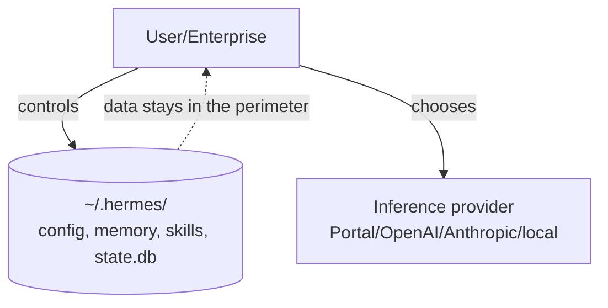
```mermaid
flowchart TB
    user[User/Enterprise] -->|controls| home[(~/.hermes/<br/>config, memory, skills, state.db)]
    user -->|chooses| prov[Inference provider<br/>Portal/OpenAI/Anthropic/local]
    home -.data stays in the perimeter.-> user
```

### 3.7 Complete example

**Scenario.** A financial institution requires that no conversation data leave its data center.

**Problem.** Closed AI SaaS route data through third-party servers — unfeasible for compliance.

**Solution.** Self-hosted Hermes pointing to a **local** model (OpenAI-compatible endpoint), with memory and Skills inside the perimeter.

**Architecture.** Hermes (on-prem) → local LLM (e.g., vLLM/Ollama) → `~/.hermes` on a controlled volume.

**Implementation (config for a local endpoint):**

```yaml
# ~/.hermes/config.yaml — local provider, data in the perimeter
provider: openai-compatible
base_url: http://llm.internal:8000/v1
model: hermes-4-70b
api_key_env: HERMES_LOCAL_KEY
memory:
  enabled: true
```

**Tests.** Confirm that no call leaves the perimeter (network inspection) and that memory persists locally.

**Result.** A fully functional agent under total data sovereignty — aligned with the Nous philosophy and compliance.

**Future improvements.** Add a fallback to a second local model and access auditing (Part XII/XIII).

### 3.8 Real-world use cases

Organizations that require on-prem for regulation; researchers who value open weights and trajectory generation; teams that reject provider lock-in and want to switch models without rewriting the automation.

### 3.9 Exercises

1. Associate each Nous philosophical pillar with a Hermes technical decision.
2. Explain why "provider agnosticism" reduces corporate risk.

### 3.10 Challenges

- **Challenge.** Build an on-prem scenario (as a diagram) that satisfies a "no data leaves the perimeter" policy, indicating provider, memory, and auditing.

### 3.11 Checklist

- [ ] I know the five Nous philosophical pillars.
- [ ] I can map philosophy → engineering in Hermes.
- [ ] I understand the impact on compliance and lock-in.

### 3.12 Best practices

- Leverage sovereignty: keep memory/Skills under team control and backup.
- Use provider agnosticism for fallback and cost optimization.
- Standardize behavior with `SOUL.md`/personalities instead of forks.

### 3.13 Anti-patterns

- Reintroducing lock-in by depending on a single provider without fallback.
- Treating memory/Skills as disposable, losing the knowledge asset.
- Ignoring the auditability that open source enables.

### 3.14 Troubleshooting

| Symptom | Cause | Action |
|---------|-------|--------|
| Compliance concern | External provider in use | Migrate to a local/on-prem endpoint |
| Inconsistent behavior | Missing `SOUL.md`/persona | Define a global personality |
| Lock-in worry | Config tied to one provider | Configure fallback providers |

### 3.15 Official references

- Nous Research: https://nousresearch.com
- Design Principles (architecture): https://hermes-agent.nousresearch.com/docs/developer-guide/architecture
- Personality & SOUL.md: https://hermes-agent.nousresearch.com/docs/user-guide/features/personality
- Trajectories/training: https://hermes-agent.nousresearch.com/docs/developer-guide/trajectory-format

---

## Chapter 4 — The concept of self-evolving agents

### 4.1 Introduction

Hermes's most cited differentiator is being **self-improving**. But what does that mean technically? It is not "the model retrains itself." It is something more pragmatic and powerful: the agent **accumulates and improves procedural knowledge (Skills) and declarative knowledge (memory) over the course of use**, via an explicit learning loop and a background maintenance process (the **Curator**). This chapter dissects that mechanism — the conceptual heart of the book.

### 4.2 Chapter objectives

(1) Define a self-evolving agent in the Hermes context; (2) understand the learning loop (task completion → pattern extraction → Skill creation/refinement → periodic nudge); (3) understand the role of the **Curator** (usage, staleness, archival, LLM review); (4) distinguish self-learning from fine-tuning.

### 4.3 Business context

An agent that improves with use transforms the **value curve** over time: instead of constant (or degrading) capability, capability **grows**. For the company, this means each executed task potentially reduces the cost of the next — operational knowledge becomes a cumulative asset, not discarded effort. It is the difference between "renting intelligence per session" and "building an intelligence asset."

### 4.4 Theoretical foundations

Hermes's self-learning operates in **three layers** that do **not** involve altering the model's weights:

1. **Curated declarative memory** — the agent records relevant facts (preferences, projects, environment) in `MEMORY.md`/`USER.md`, and indexes all sessions in SQLite/FTS5 for later retrieval. Periodic nudges remind the agent to persist what matters.
2. **Skills (procedural memory)** — upon detecting a repeatable pattern, the agent **creates a Skill** (an on-demand knowledge document with progressive disclosure) and **refines it during use**. Every ~15 tasks, it evaluates its own performance.
3. **Curation (Curator)** — background maintenance of created Skills: it tracks usage, detects staleness, archives what no longer serves, and performs LLM-driven review. It prevents the "bloat" of bad Skills.

> **Crucial distinction.** This is *context/artifact-level learning*, not fine-tuning. The LLM's weights do not change; what changes is the **body of knowledge** (memory + Skills) the agent carries and applies. That is why it works with any provider.

### 4.5 Architecture of the learning loop

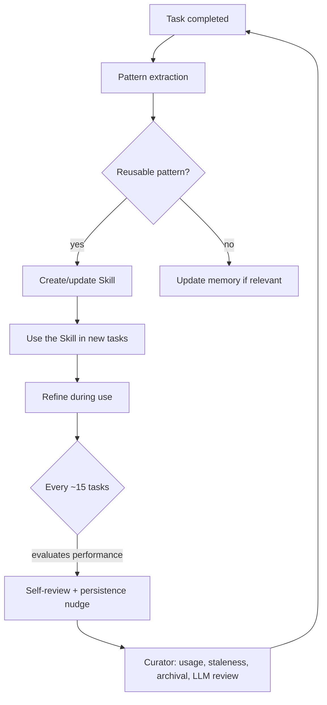
```mermaid
flowchart TD
    task[Task completed] --> extract[Pattern extraction]
    extract --> decide{Reusable pattern?}
    decide -->|yes| create[Create/update Skill]
    decide -->|no| mem[Update memory if relevant]
    create --> use[Use the Skill in new tasks]
    use --> refine[Refine during use]
    refine --> nudge{Every ~15 tasks}
    nudge -->|evaluates performance| review[Self-review + persistence nudge]
    review --> curator[Curator: usage, staleness, archival, LLM review]
    curator --> task
```

### 4.6 Internal flows: creating a Skill (sequence)

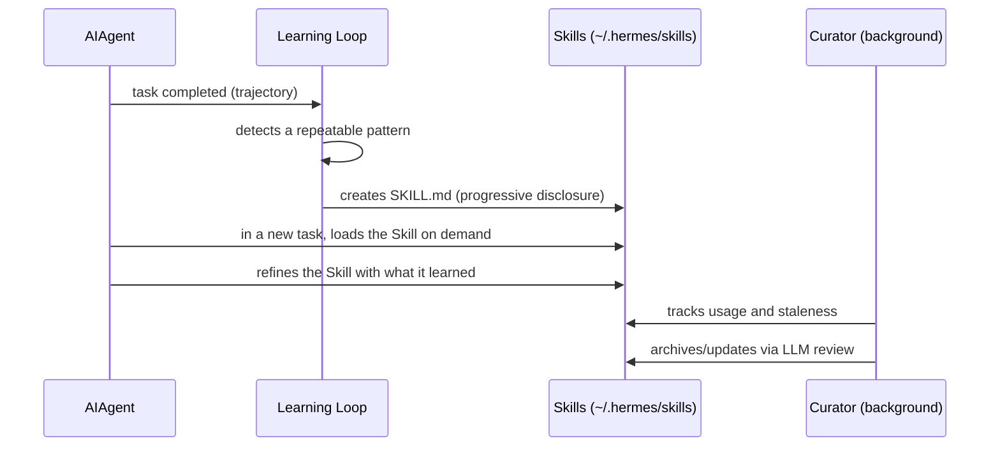
```mermaid
sequenceDiagram
    participant A as AIAgent
    participant L as Learning Loop
    participant S as Skills (~/.hermes/skills)
    participant C as Curator (background)
    A->>L: task completed (trajectory)
    L->>L: detects a repeatable pattern
    L->>S: creates SKILL.md (progressive disclosure)
    A->>S: in a new task, loads the Skill on demand
    A->>S: refines the Skill with what it learned
    C->>S: tracks usage and staleness
    C->>S: archives/updates via LLM review
```

### 4.7 Component diagram (learning subsystem)

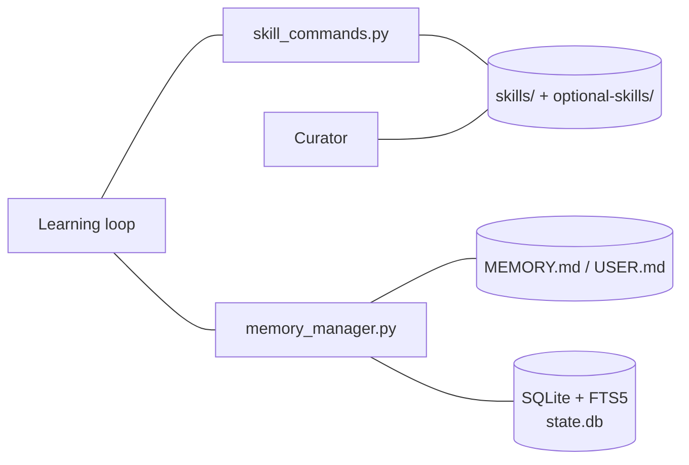
```mermaid
flowchart LR
    mm[memory_manager.py] --- md[(MEMORY.md / USER.md)]
    mm --- db[(SQLite + FTS5<br/>state.db)]
    sc[skill_commands.py] --- skills[(skills/ + optional-skills/)]
    cur[Curator] --- skills
    loop[Learning loop] --- sc
    loop --- mm
```

### 4.8 Complete example

**Scenario.** An agent repeats, across several tasks, the same deployment procedure for an internal application.

**Problem.** Without learning, it "rediscovers" the procedure each time, spending tokens and time, with the risk of variation.

**Solution.** Let the learning loop extract the pattern and materialize it as a reusable Skill.

**Architecture.** Trajectories → learning loop → `SKILL.md` in `~/.hermes/skills/deploy-internal-app/` → reuse + Curator.

**Implementation (`SKILL.md` format, with progressive disclosure):**

```markdown
---
name: deploy-internal-app
description: Deployment procedure for internal app X (build, tests, publish).
version: 1
---

## Overview
Steps to safely deploy internal app X.

## Steps
1. Run tests: `make test`
2. Build: `make build`
3. Publish: `make deploy ENV=staging` and validate before `ENV=prod`

## Details (loaded on demand)
- Rollback: `make rollback ENV=prod`
- Required variables: APP_TOKEN, REGISTRY_URL
```

**Configuration (enable Skills and Curator):**

```yaml
skills:
  enabled: true
  curator:
    enabled: true     # background maintenance (usage/staleness/review)
```

**Tests.** After a few runs, verify the Skill was created and is loaded (the `/skills` slash command), and that the Curator records usage.

**Result.** The procedure becomes reusable, self-maintained knowledge; subsequent tasks are faster and more consistent.

**Future improvements.** Publish the Skill to the corporate library (Part VI) and share it via the Skills Hub (the open agentskills.io format).

### 4.9 Real-world use cases

Accumulation of engineering procedures (deploys, runbooks); progressive user modeling (style preferences, stack); bots that get better at a recurring task (triage, reports) each week.

### 4.10 Exercises

1. Explain why Hermes's self-learning is **not** fine-tuning.
2. Describe the learning loop cycle in five steps.
3. What is the Curator's role and why is it necessary?

### 4.11 Challenges

- **Challenge.** Design a Skill (`SKILL.md`) for a repetitive procedure on your team, using progressive disclosure (overview + details on demand).

### 4.12 Checklist

- [ ] I can define "self-evolving agent" in the Hermes context.
- [ ] I understand the three layers (memory, Skills, Curator).
- [ ] I distinguish self-learning from fine-tuning.
- [ ] I know the nudge trigger (~15 tasks).

### 4.13 Best practices

- Keep the learning loop and Curator active; periodically review generated Skills.
- Version team Skills (git) and treat them as code.
- Use progressive disclosure to save tokens (detail on demand).

### 4.14 Anti-patterns

- Disabling the Curator and letting stale Skills accumulate ("skill rot").
- Creating giant, monolithic Skills (anti progressive disclosure).
- Blindly trusting generated Skills without human review in critical domains.

### 4.15 Troubleshooting

| Symptom | Cause | Action |
|---------|-------|--------|
| Skills aren't created | Skills/learning disabled | Enable `skills.enabled` |
| Many irrelevant Skills | Curator off | Enable the Curator; review/archive |
| Agent "forgets" preferences | Memory not persisted | Reinforce nudges/`MEMORY.md` |
| High token cost per Skill | No progressive disclosure | Rewrite the Skill in layers |

### 4.16 Official references

- Skills System: https://hermes-agent.nousresearch.com/docs/user-guide/features/skills
- Curator: https://hermes-agent.nousresearch.com/docs/user-guide/features/curator
- Memory: https://hermes-agent.nousresearch.com/docs/user-guide/features/memory
- Creating Skills: https://hermes-agent.nousresearch.com/docs/developer-guide/creating-skills

---

## Chapter 5 — How Hermes differs from ChatGPT, Claude, Gemini, OpenHands, AutoGPT, and Manus

### 5.1 Introduction

"Why not just use ChatGPT?" is every manager's first question. Answering it well requires separating product **categories**: *chatbots/assistants* (ChatGPT, Claude, Gemini), *engineering agents* (OpenHands), *pioneer autonomous agents* (AutoGPT), and *generalist agents* (Manus). Hermes occupies its own space — an **autonomous, terminal-native, self-improving, provider-agnostic, multi-platform agent**. This chapter compares fairly, acknowledging each one's strengths.

### 5.2 Chapter objectives

(1) Correctly classify each competitor; (2) identify the comparison axes that matter (memory, self-learning, autonomy, lock-in, platforms, control); (3) know when Hermes is the best choice — and when it is not.

### 5.3 Business context

Choosing the wrong category breeds frustration: using a chatbot for continuous automation, or an autonomous agent for a one-off question. Hermes's value appears in **continuous automation, with memory and evolution, under infrastructure control** — not in replacing a quick conversation in ChatGPT.

### 5.4 Foundations: the comparison axes

- **Persistent memory across sessions** (curated and searchable).
- **Self-learning** (created/refined Skills + Curator).
- **Execution autonomy** (running long tasks on remote backends).
- **Provider agnosticism** (no model lock-in).
- **Multi-platform** (CLI, 20+ messengers, IDE, API, desktop).
- **Control/sovereignty** (self-hosted, open source, data in the perimeter).

### 5.5 Comparison (an honest view)

| Solution | Category | Strengths | Limits for continuous automation |
|----------|----------|-----------|----------------------------------|
| **Hermes Agent** | Self-improving autonomous agent | Evolving memory + Skills, multi-platform, provider-agnostic, self-hosted, MIT | 0.x project (changes fast); technical curve (terminal) |
| **ChatGPT** | Assistant/chatbot (+ agent features) | Excellent UX, strong models, ecosystem | Limited/closed memory; provider lock-in; less sovereignty |
| **Claude** (app) | Premium assistant/chatbot | Strong reasoning, great at code and text | Not a self-hosted autonomous agent; no own learning loop |
| **Gemini** | Google multimodal assistant | Multimodality, Google integration | Closed ecosystem; lock-in; little sovereignty |
| **OpenHands** | Open-source engineering agent | Strong at code/autonomous dev tasks, open source | Coding-focused; less emphasis on curated memory/evolving Skills and messaging multi-platform |
| **AutoGPT** | Pioneer autonomous agent (open) | Pioneered the "autonomous agent" concept | Older generation; reliability/loops; less mature in curated memory/Skills |
| **Manus** | Generalist agent (product) | Good generalist autonomy, product UX | Closed/SaaS; less control of infrastructure and data |

> **A fair reading.** ChatGPT, Claude, and Gemini are, today, often superior as **conversational assistants** and in raw model quality; OpenHands is a reference as an open-source **engineering agent**; AutoGPT was seminal; Manus offers good autonomy as a **closed product**. Hermes does not try to win "at chat": it wins as a **persistent autonomous agent that learns, runs anywhere, and doesn't lock you into a provider**.

### 5.6 Architecture: what only Hermes combines

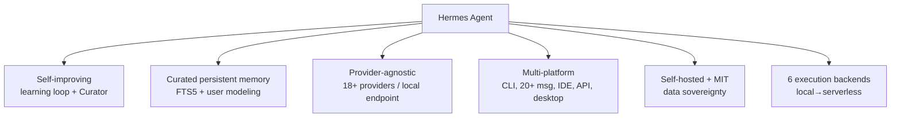
```mermaid
flowchart TB
    H[Hermes Agent] --> a[Self-improving<br/>learning loop + Curator]
    H --> b[Curated persistent memory<br/>FTS5 + user modeling]
    H --> c[Provider-agnostic<br/>18+ providers / local endpoint]
    H --> d[Multi-platform<br/>CLI, 20+ msg, IDE, API, desktop]
    H --> e[Self-hosted + MIT<br/>data sovereignty]
    H --> f[6 execution backends<br/>local→serverless]
```

The thesis is not that each item is exclusive, but that **the combination of the six** in an open-source, terminal-native product is Hermes's niche.

### 5.7 Internal flows: when to choose what (decision)

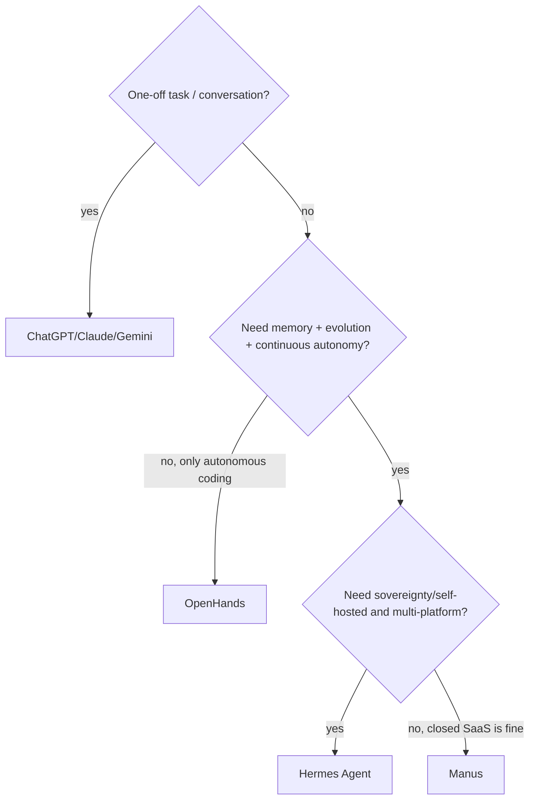
```mermaid
flowchart TD
    q1{One-off task / conversation?} -->|yes| chat[ChatGPT/Claude/Gemini]
    q1 -->|no| q2{Need memory + evolution + continuous autonomy?}
    q2 -->|no, only autonomous coding| oh[OpenHands]
    q2 -->|yes| q3{Need sovereignty/self-hosted and multi-platform?}
    q3 -->|yes| hermes[Hermes Agent]
    q3 -->|no, closed SaaS is fine| manus[Manus]
```

### 5.8 Complete example

**Scenario.** A company wants a "digital colleague" that lives in the team's Telegram, remembers decisions, executes tasks on a server, and improves over time, without sending data to a closed SaaS.

**Problem.** ChatGPT/Claude/Gemini don't run self-hosted with curated memory and multi-platform; Manus is closed.

**Solution.** Hermes on the company server, gateway on Telegram, a model via Portal or its own endpoint, with local memory/Skills.

**Architecture.** Telegram → Gateway → AIAgent → chosen provider → on-prem memory/Skills.

**Implementation (summary):**

```bash
hermes setup --portal              # or configure your own endpoint
hermes gateway start --platform telegram
```

**Tests.** Validate authorization (allowlist), memory persistence across sessions, and Skill creation.

**Result.** A team agent — persistent, evolving, and under control — exactly the gap competitors don't fill together.

**Future improvements.** Multi-agents to specialize (Part VIII) and cost/usage observability (Part XIII).

### 5.9 Real-world use cases

Teams that already use ChatGPT for brainstorming and adopt Hermes for **continuous automation and organizational memory**; regulated companies that cannot use closed SaaS; squads that want to switch models freely based on cost/quality.

### 5.10 Exercises

1. Classify each competitor into its correct category.
2. Cite two situations where you should **not** use Hermes (and what to use instead).

### 5.11 Challenges

- **Challenge.** Build a decision matrix (the axes of section 5.4) scoring Hermes and two competitors for a real case at your company.

### 5.12 Checklist

- [ ] I can separate chatbot, engineering agent, and autonomous agent.
- [ ] I know the six comparison axes.
- [ ] I know when Hermes is (and is not) the best choice.

### 5.13 Best practices

- Use the right tool per category: chat for conversation, Hermes for continuous/sovereign automation.
- Combine: nothing stops you from using ChatGPT/Claude as **providers** for Hermes.
- Decide by an axis matrix, not by hype.

### 5.14 Anti-patterns

- Using Hermes as a substitute for a quick question (overkill).
- Using a closed chatbot where compliance requires sovereignty.
- Comparing "model quality" while ignoring memory/autonomy/lock-in.

### 5.15 Troubleshooting

| Symptom | Cause | Action |
|---------|-------|--------|
| "Why not just ChatGPT?" | Category confusion | Show the memory/autonomy/sovereignty axes |
| Subpar result in pure chat | Wrong expectation | Use a stronger model as provider; focus on agentic use |
| Adoption uncertainty | No matrix | Apply the decision matrix from section 5.11 |

### 5.16 Official references

- Features Overview: https://hermes-agent.nousresearch.com/docs/user-guide/features/overview
- Providers: https://hermes-agent.nousresearch.com/docs/integrations/providers
- User Stories & Use Cases: https://hermes-agent.nousresearch.com/docs/user-stories
- Repository (MIT): https://github.com/NousResearch/hermes-agent

---

> **End of Part I.** We established what Hermes Agent is, its history up to v0.16, the philosophy of Nous Research, the concept of a self-evolving agent, and its positioning against competitors. **Part II — Internal Architecture** (Chapters 6–13) opens the hood: general architecture, internal components, the agent lifecycle, and the memory, learning, Skills, planning, and execution subsystems.

## Part II – Internal Architecture

Part II opens the hood. Where Part I built the *mental model* of Hermes Agent, Part II builds the *engineering model*: the concrete files, classes, registries, and data flows that make the agent work. The thesis of this part is that Hermes is best understood as a **stable, modular `AIAgent` core surrounded by pluggable subsystems** — prompt assembly, provider resolution, the tool registry, session persistence, the memory and learning subsystems, the Skills system, planning, and execution backends. Once you internalize how these pieces connect (and how loosely they are coupled), everything downstream — installation, providers, MCP, multi-agents, security — becomes a matter of configuring and extending well-defined seams rather than fighting an opaque black box.

The chapters follow the agent's own anatomy. Chapter 6 maps the whole system. Chapter 7 zooms into the individual components and the registry pattern that binds them. Chapter 8 traces the lifecycle of a single agent run from input to persistence. Chapters 9–11 cover the three subsystems that make Hermes self-improving — memory, learning, and Skills. Chapters 12–13 close with how the agent *plans* multi-step work and *executes* it across six terminal backends.

> **Java parallel for the whole part.** If Part I positioned `AIAgent` as a Spring `ApplicationContext`, Part II is the deep dive into that container: how beans (tools) self-register, how dependencies (providers, memory, backends) are resolved at runtime, and how the request lifecycle (the agentic loop) flows through interceptors (hooks) and persistence (the SQLite session store).

---

## Chapter 6 — General Architecture

### 6.1 Introduction

The **general architecture** of Hermes Agent answers one question: *how does a single line of user input become a sequence of LLM calls, tool executions, and persisted state — regardless of whether that input arrived from a terminal, a Telegram message, an IDE, or a cron tick?* The answer is a deliberately layered design. At the top sit **entry points** (surfaces). They all funnel into one **`AIAgent`** core (`run_agent.py`). The core orchestrates four concerns — prompt assembly, provider resolution, tool dispatch, and persistence — and delegates the heavy lifting to **subsystems and backends** that are attached via registries rather than hard-wired.

This chapter is the map you will return to throughout the book. Every later chapter ("Memory System," "Browser Automation," "Gateway Internals," "Enterprise Architecture") is a zoom into one box on this map. Get the map right and the rest of the book is navigation.

### 6.2 Chapter objectives

By the end of this chapter you will be able to: (1) draw the three-layer architecture from memory — entry points, core, subsystems/backends; (2) explain the role of each of the four core concerns (prompt builder, provider resolution, tool dispatch, persistence); (3) describe the three data-flow paths (CLI session, gateway message, cron job) and how they differ; (4) recite the six design principles and connect each to a concrete file or behavior; (5) understand *why* the architecture is shaped this way (the "platform-agnostic core" principle) and what that buys an enterprise.

### 6.3 Business context

Architecture is not academic. For a CTO evaluating Hermes, the shape of the system determines **operational risk, extensibility cost, and lock-in exposure**. A coupled monolith would mean: every new platform requires touching the core; every provider change risks regressions everywhere; and the tool can only run where its one entry point allows. Hermes's layered design inverts all three: a new surface (say, an internal web console) reuses the same core with zero core changes; a new provider is a registry entry; and the same binary runs on a laptop, a $5 VPS, a Kubernetes pod, or serverless infrastructure. The business read is **one investment in the core, amortized across every surface and every environment** — which is exactly what makes Hermes viable as a long-lived enterprise platform rather than a disposable script.

### 6.4 Theoretical foundations

The architecture rests on four well-known software-engineering ideas, applied to agents:

- **Hexagonal / ports-and-adapters.** The `AIAgent` core is the hexagon. Entry points (CLI, gateway, ACP, API server, batch) are *driving adapters*; backends (terminal, browser, web, MCP) and providers are *driven adapters*. The core depends on abstractions, not concrete platforms.
- **Registry / service locator.** Tools self-register into `tools/registry.py` at import time; providers register into a `PROVIDER_REGISTRY`; plugins discover via entry points. The core asks the registry "what is available?" rather than importing a fixed list.
- **Tiered, immutable prompt assembly.** The system prompt is built once per conversation in ordered tiers (`stable` → `context` → `volatile`) and is **not mutated mid-conversation** (the "prompt stability" principle). This is what makes prefix caching and reproducibility possible.
- **Loose coupling via gating.** Optional subsystems (MCP, memory providers, RL environments) are guarded by `check_fn` gating — present and active only when configured. The absence of a subsystem is a no-op, not an error.

> **Java parallel.** Ports-and-adapters is the Hexagonal Architecture popularized in the Spring/DDD world; the tool registry is component scanning + a `BeanFactory`; tiered prompt assembly resembles building an immutable request context once and passing it down a filter chain.

### 6.5 Architecture (the canonical view)

Three layers, top to bottom: **surfaces**, **core**, **subsystems and backends**.

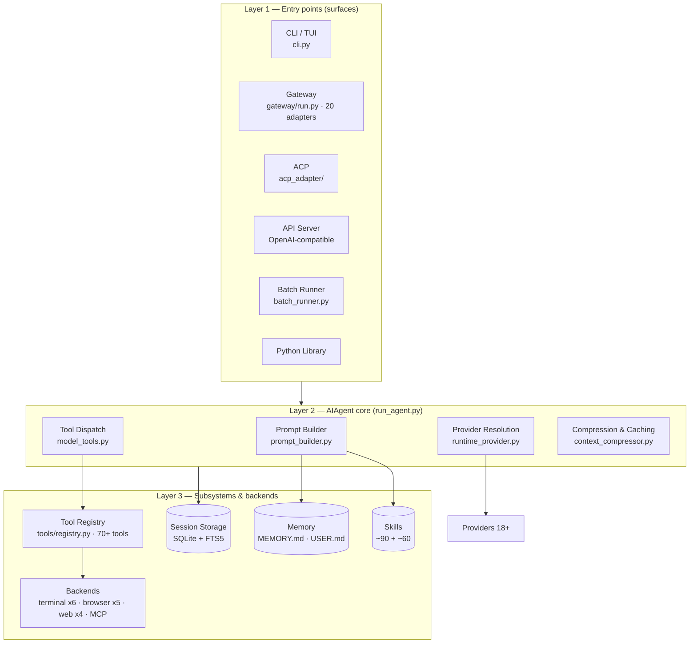
```mermaid
flowchart TB
    subgraph L1["Layer 1 — Entry points (surfaces)"]
        cli[CLI / TUI<br/>cli.py]
        gw[Gateway<br/>gateway/run.py · 20 adapters]
        acp[ACP<br/>acp_adapter/]
        api[API Server<br/>OpenAI-compatible]
        batch[Batch Runner<br/>batch_runner.py]
        lib[Python Library]
    end
    subgraph L2["Layer 2 — AIAgent core (run_agent.py)"]
        pb[Prompt Builder<br/>prompt_builder.py]
        rp[Provider Resolution<br/>runtime_provider.py]
        td[Tool Dispatch<br/>model_tools.py]
        cc[Compression & Caching<br/>context_compressor.py]
    end
    subgraph L3["Layer 3 — Subsystems & backends"]
        reg[Tool Registry<br/>tools/registry.py · 70+ tools]
        store[(Session Storage<br/>SQLite + FTS5)]
        mem[(Memory<br/>MEMORY.md · USER.md)]
        skl[(Skills<br/>~90 + ~60)]
        back[Backends<br/>terminal x6 · browser x5 · web x4 · MCP]
    end
    L1 --> L2
    pb --> mem
    pb --> skl
    rp --> prov[Providers 18+]
    td --> reg
    reg --> back
    L2 --> store
```

### 6.6 Internal flows

There are three canonical paths into the core, and they differ mainly in *how a session is established* and *where the response goes*.

**CLI session** — synchronous, interactive, one persistent session per working directory:

```
User input → HermesCLI.process_input()
  → AIAgent.run_conversation()
    → prompt_builder.build_system_prompt()
    → runtime_provider.resolve_runtime_provider()
    → API call (chat_completions / codex_responses / anthropic_messages)
    → tool_calls? → model_tools.handle_function_call() → loop
    → final response → display → save to SessionDB
```

**Gateway message** — a long-running process routes inbound platform events to per-conversation sessions:

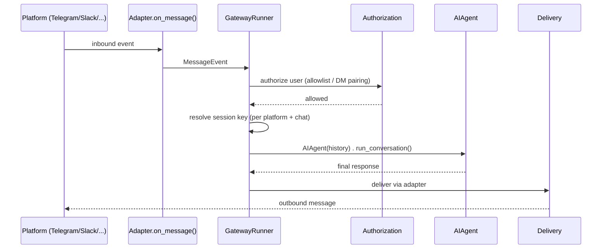
```mermaid
sequenceDiagram
    participant P as Platform (Telegram/Slack/...)
    participant A as Adapter.on_message()
    participant G as GatewayRunner
    participant Au as Authorization
    participant Ag as AIAgent
    participant D as Delivery
    P->>A: inbound event
    A->>G: MessageEvent
    G->>Au: authorize user (allowlist / DM pairing)
    Au-->>G: allowed
    G->>G: resolve session key (per platform + chat)
    G->>Ag: AIAgent(history) . run_conversation()
    Ag-->>G: final response
    G->>D: deliver via adapter
    D-->>P: outbound message
```

**Cron job** — a scheduler tick creates a *fresh* agent with no history and injects attached skills:

```
Scheduler tick → load due jobs from jobs.json
  → create fresh AIAgent (no history)
  → inject attached skills as context
  → run job prompt
  → deliver response to target platform
  → update job state and next_run
```

The crucial observation: **all three paths converge on `AIAgent.run_conversation()`**. The platform differences live in the entry point, never in the core — this is the "platform-agnostic core" principle in action.

### 6.7 Component diagram (core seams)

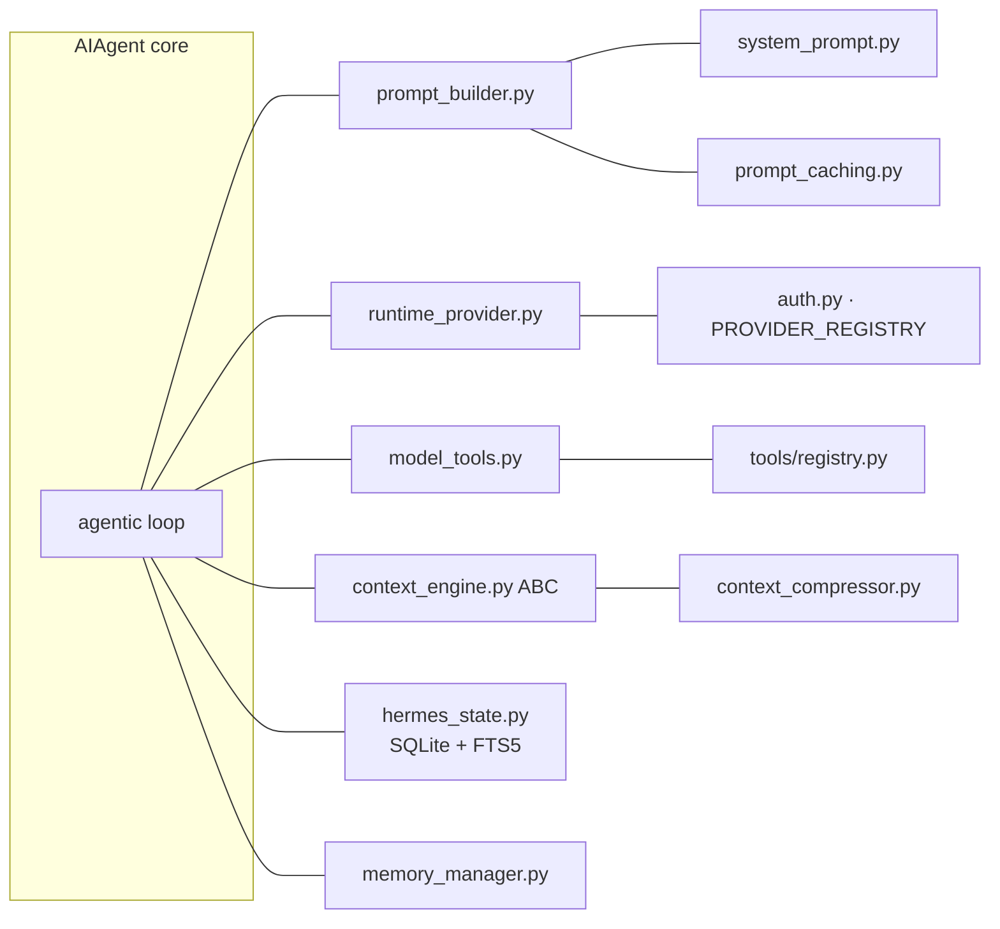
```mermaid
flowchart LR
    subgraph core["AIAgent core"]
        loop[agentic loop]
    end
    loop --- pb[prompt_builder.py]
    pb --- sp[system_prompt.py]
    pb --- pc[prompt_caching.py]
    loop --- rp[runtime_provider.py]
    rp --- auth[auth.py · PROVIDER_REGISTRY]
    loop --- mt[model_tools.py]
    mt --- reg[tools/registry.py]
    loop --- ce[context_engine.py ABC]
    ce --- ccx[context_compressor.py]
    loop --- st[hermes_state.py<br/>SQLite + FTS5]
    loop --- mm[memory_manager.py]
```

Each `---` is a **seam**: a stable boundary you can extend (add a provider, add a tool, swap the context engine, plug a memory provider) without editing the core loop.

### 6.8 Complete example

**Scenario.** A platform team wants to prove that one Hermes installation can serve three surfaces — a developer CLI, a team Telegram bot, and an internal REST endpoint — without three separate deployments or three copies of the agent logic.

**Problem.** Naively, teams stand up a chatbot for messaging, a separate script for the API, and tell developers to use a third thing locally. Three codebases, three sets of bugs, three drift trajectories.

**Solution.** Run a single Hermes profile on a host. The CLI, the gateway (Telegram + API-server adapter), and any Python caller all share the same core, the same memory, and the same Skills.

**Architecture.** `cli.py`, `gateway/run.py` (telegram + api_server platforms), and a small Python script all instantiate / reuse one `AIAgent` against one `HERMES_HOME`.

**Implementation:**

```bash
# 1. Install and point at Nous Portal (model + Tool Gateway in one OAuth)
curl -fsSL https://hermes-agent.nousresearch.com/install.sh | bash
hermes setup --portal

# 2. Configure the messaging surfaces
hermes gateway setup            # interactive: add Telegram token + allowlist
hermes gateway start --platform telegram

# 3. Same core, exposed as an OpenAI-compatible API surface
hermes gateway start --platform api_server   # serves /v1/chat/completions
```

```python
# 4. Same core, called as a Python library (the API-server surface under the hood)
from run_agent import AIAgent

agent = AIAgent()                       # reads ~/.hermes/config.yaml
reply = agent.run_conversation("Summarize today's open PRs")
print(reply)
```

**Tests.**

```bash
hermes doctor                          # verifies provider, tools, paths
hermes gateway status                  # shows running adapters + PIDs
curl -s http://localhost:8080/v1/models | jq '.data[].id'   # API surface live
```

**Result.** One installation, one memory, one Skills library, three surfaces — developers on the CLI, the team on Telegram, and other services over HTTP, all sharing accumulated knowledge.

**Future improvements.** Add ACP so the same agent appears inside VS Code (Chapter 7/Part XI), and front the API surface with authentication and rate limiting (Part XII/XIV).

### 6.9 Source code

The architecture is visible in the directory layout. The load-bearing entry points and core files:

```text
hermes-agent/
├── run_agent.py          # AIAgent — the core conversation loop
├── cli.py                # HermesCLI — interactive TUI surface
├── model_tools.py        # tool discovery, schema collection, dispatch
├── toolsets.py           # tool groupings + platform presets
├── hermes_state.py       # SQLite session/state DB with FTS5
├── hermes_constants.py   # HERMES_HOME, profile-aware paths
├── batch_runner.py       # batch trajectory generation surface
├── agent/                # prompt_builder, context_engine, context_compressor,
│                         #   prompt_caching, memory_manager, trajectory, ...
├── hermes_cli/           # main.py (subcommands), auth.py, runtime_provider.py, setup.py
├── tools/                # registry.py + one file per tool + environments/
├── gateway/              # run.py + platforms/ (20 adapters)
└── acp_adapter/          # IDE surface (VS Code / Zed / JetBrains)
```

The **file dependency chain** is what makes registration automatic:

```text
tools/registry.py        (no deps — imported by every tool file)
       ↑
tools/*.py               (each calls registry.register() at import time)
       ↑
model_tools.py           (imports registry + triggers tool discovery)
       ↑
run_agent.py, cli.py, batch_runner.py, environments/
```

Tool registration therefore happens **before any agent instance exists** — drop a file into `tools/` with a top-level `registry.register()` and it is discovered with no manual import list.

### 6.10 Configuration

The whole architecture is steered from one file plus environment variables:

```yaml
# ~/.hermes/config.yaml — the control surface for the architecture
provider: nous-portal           # which driven adapter resolves the LLM
model: hermes-4-70b
api_mode: chat_completions       # chat_completions | codex_responses | anthropic_messages (usually inferred)

memory:
  enabled: true                  # MEMORY.md + USER.md + SQLite/FTS5
skills:
  enabled: true
context_engine: default          # default = context_compressor.py (pluggable ABC)

tools:
  terminal_backend: local        # local | docker | ssh | daytona | modal | singularity

fallback_providers:              # loose coupling: try in order on failure
  - openrouter
  - openai
```

Profiles isolate everything: `hermes -p research` runs with its own `HERMES_HOME` (config, memory, sessions, gateway PID), so multiple architectures coexist on one host.

### 6.11 Real-world use cases

- **A single agent on three surfaces** (the example above): CLI for engineers, Telegram for the team, API for services.
- **Environment portability:** the same agent definition promoted from a developer laptop (`terminal_backend: local`) to a hardened CI runner (`terminal_backend: docker`) to serverless (`modal`/`daytona`) with only a config change.
- **Profile-isolated tenants:** a managed-services firm runs one client per profile on one box, each with its own memory and gateway.
- **Surface migration:** a team that started on the CLI adds the desktop app (v0.16) and the gateway later, with no rewrite, because all three are surfaces over the same core.

### 6.12 Exercises

1. Draw the three-layer architecture from memory and label each box with the file or directory that implements it.
2. Trace, in words, the path of a Telegram message from inbound event to delivered reply, naming each component it passes through.
3. Explain why a cron job creates a *fresh* `AIAgent` with no history while a CLI session reuses one.
4. List the six design principles and give one concrete consequence of each.

### 6.13 Challenges

- **Challenge 1.** Stand up one Hermes profile and expose it on two surfaces simultaneously (CLI + gateway). Confirm via `hermes gateway status` that one process serves both and that a fact you teach it on the CLI is visible to the gateway session.
- **Challenge 2.** Write a one-page architecture brief for your team explaining how adding a brand-new surface (e.g., an internal Slack-like tool) would require *zero* changes to the agent core, citing the "platform-agnostic core" principle.

### 6.14 Checklist

- [ ] I can name the three layers and the files behind each box.
- [ ] I can describe the four core concerns (prompt, provider, tools, persistence).
- [ ] I can trace the CLI, gateway, and cron data-flow paths.
- [ ] I know the six design principles and a consequence of each.
- [ ] I understand why tool registration happens at import time.

### 6.15 Best practices

- **Treat the core as a black box; extend at the seams.** Add providers, tools, memory providers, and surfaces — do not patch `run_agent.py`.
- **Use profiles to isolate concerns** (`-p <name>`) instead of running multiple half-configured installs.
- **Pick the terminal backend per environment**, not globally: `local` for dev, `docker`/`singularity` for shared or CI hosts.
- **Lean on fallback providers** to honor "loose coupling" — never let one provider outage stop the agent.

### 6.16 Anti-patterns

- **Forking the core** to add a platform instead of writing an entry point/adapter — you lose every future core improvement.
- **Importing internal symbols** from `run_agent.py` (which moved during the v0.15 modularization) instead of the public modules in `agent/`.
- **Mutating the system prompt mid-conversation**, breaking prompt stability and prefix caching.
- **One giant shared profile** for unrelated workloads, defeating profile isolation.

### 6.17 Troubleshooting

| Symptom | Likely cause | Action |
|---------|--------------|--------|
| New tool not picked up | File not in `tools/` or missing top-level `registry.register()` | Confirm location and the registration call; `hermes tools` lists discovered tools |
| Gateway and CLI seem to have different memory | Different profiles / `HERMES_HOME` | Run both with the same `-p`/`HERMES_HOME` |
| Internal import error after update | Symbol moved during modularization | Import from `agent/` modules, not `run_agent.py` |
| Response goes to the wrong chat | Session key collision in gateway | Check per-platform session routing; review `gateway/session.py` keys |
| Cron job "forgot" context | Cron runs fresh by design | Attach Skills/scripts to the job instead of expecting history |

### 6.18 Official references

- Architecture: https://hermes-agent.nousresearch.com/docs/developer-guide/architecture
- Agent Loop Internals: https://hermes-agent.nousresearch.com/docs/developer-guide/agent-loop
- Gateway Internals: https://hermes-agent.nousresearch.com/docs/developer-guide/gateway-internals
- Session Storage: https://hermes-agent.nousresearch.com/docs/developer-guide/session-storage
- Repository (MIT): https://github.com/NousResearch/hermes-agent

---

## Chapter 7 — Internal Components

### 7.1 Introduction

If Chapter 6 was the map, Chapter 7 is the **parts catalog**. The `AIAgent` core is not one big function; it is an orchestrator that wires together a small set of cohesive components, each living in its own module under `agent/`, `hermes_cli/`, and `tools/`. After the v0.15 "Velocity" refactor that cut `run_agent.py` from ~16k to ~3.8k lines, these components became *navigable* — each one has a single responsibility and a clear public surface. This chapter walks the catalog: what each component does, what it depends on, and how the registry pattern lets the agent discover capabilities at runtime.

### 7.2 Chapter objectives

(1) Enumerate the core components and their responsibilities; (2) explain the **registry pattern** (tools, providers, commands, plugins) and why self-registration matters; (3) distinguish the three **plugin types** (general plugins, memory providers, context engines) and their single-select vs multi-register semantics; (4) read the `agent/` directory and know which file to open for a given concern; (5) understand the *auxiliary client* and why side tasks (vision, summarization) use a separate LLM path.

### 7.3 Business context

Component clarity is what makes Hermes **maintainable and extensible by a team rather than a single author**. When every concern has a named home, onboarding a new engineer is "open the file for the concern you're touching," not "read 16,000 lines." For an enterprise, this lowers the cost of customization (write a plugin, register a tool) and reduces the bus-factor risk of relying on internals. The modular core is also why the project sustains near-weekly releases without breaking consumers — public seams are stable even as internals churn.

### 7.4 Theoretical foundations

- **Single Responsibility + cohesion.** Each module owns one concern: prompt assembly, compression, caching, memory orchestration, provider resolution, tool dispatch.
- **Self-registration.** Components announce themselves to a registry at import time, inverting control: the core never maintains a manual list of tools/providers.
- **Strategy via ABCs.** `ContextEngine` and `MemoryProvider` are abstract base classes; the default implementations (`context_compressor.py`, the built-in memory) can be swapped for plugins. Single-select means exactly one is active.
- **Auxiliary delegation.** Expensive or specialized side tasks (image understanding, summarization for compression) run through an `auxiliary_client` — a separate, possibly cheaper model — so the main loop stays focused.

> **Java parallel.** ABCs map to interfaces; self-registration maps to `@Component` scanning; the auxiliary client is like delegating to a secondary `RestTemplate`/bean tuned for a different downstream.

### 7.5 Architecture (component catalog)

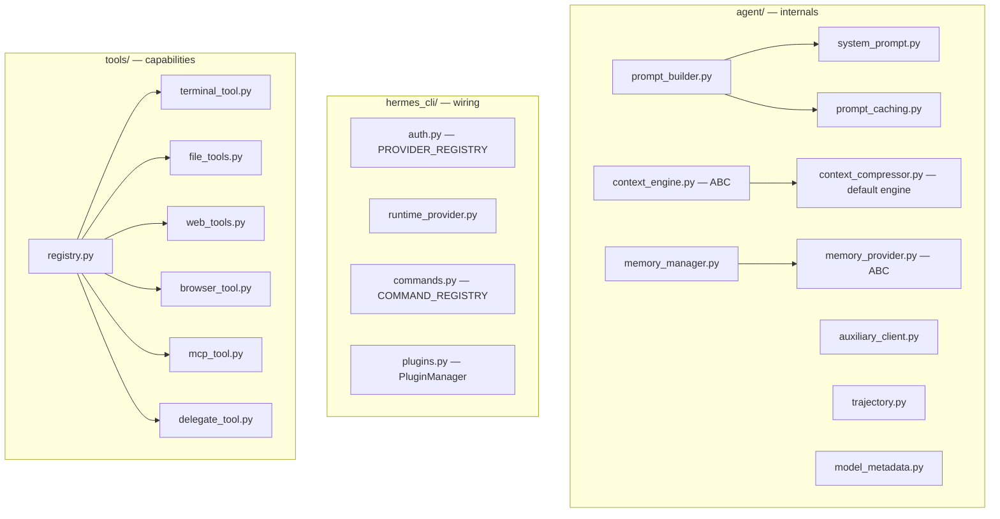
```mermaid
flowchart TB
    subgraph agentpkg["agent/ — internals"]
        pb[prompt_builder.py]
        sp[system_prompt.py]
        ce[context_engine.py — ABC]
        cc[context_compressor.py — default engine]
        pc[prompt_caching.py]
        ac[auxiliary_client.py]
        mm[memory_manager.py]
        mp[memory_provider.py — ABC]
        tr[trajectory.py]
        md[model_metadata.py]
    end
    subgraph clipkg["hermes_cli/ — wiring"]
        au[auth.py — PROVIDER_REGISTRY]
        rp[runtime_provider.py]
        cmd[commands.py — COMMAND_REGISTRY]
        pl[plugins.py — PluginManager]
    end
    subgraph toolspkg["tools/ — capabilities"]
        reg[registry.py]
        tt[terminal_tool.py]
        ft[file_tools.py]
        wt[web_tools.py]
        bt[browser_tool.py]
        mc[mcp_tool.py]
        dt[delegate_tool.py]
    end
    pb --> sp
    pb --> pc
    ce --> cc
    mm --> mp
    reg --> tt & ft & wt & bt & mc & dt
```

### 7.6 Internal flows

How a tool becomes callable, end to end:

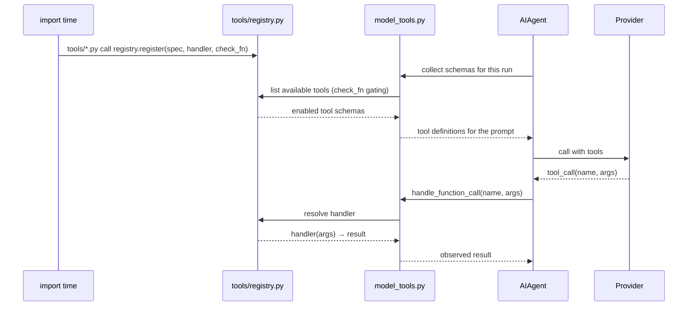
```mermaid
sequenceDiagram
    participant Imp as import time
    participant Reg as tools/registry.py
    participant MT as model_tools.py
    participant Ag as AIAgent
    participant LLM as Provider
    Imp->>Reg: tools/*.py call registry.register(spec, handler, check_fn)
    Ag->>MT: collect schemas for this run
    MT->>Reg: list available tools (check_fn gating)
    Reg-->>MT: enabled tool schemas
    MT-->>Ag: tool definitions for the prompt
    Ag->>LLM: call with tools
    LLM-->>Ag: tool_call(name, args)
    Ag->>MT: handle_function_call(name, args)
    MT->>Reg: resolve handler
    Reg-->>MT: handler(args) → result
    MT-->>Ag: observed result
```

### 7.7 Component diagram (plugin discovery)

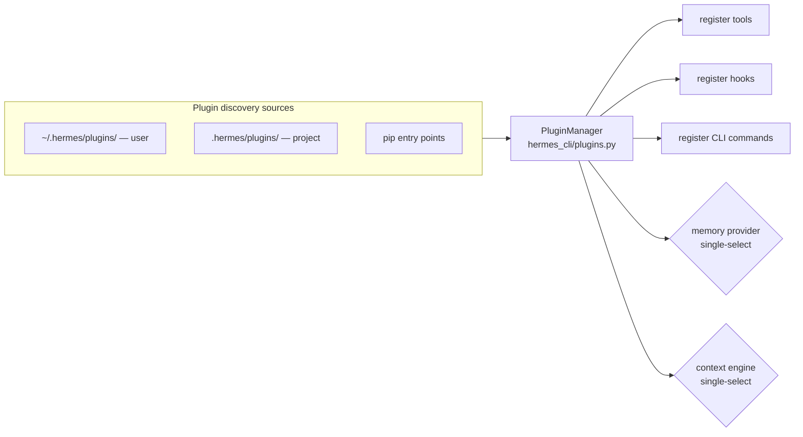
```mermaid
flowchart LR
    subgraph sources["Plugin discovery sources"]
        u[~/.hermes/plugins/ — user]
        p[.hermes/plugins/ — project]
        e[pip entry points]
    end
    sources --> pm[PluginManager<br/>hermes_cli/plugins.py]
    pm --> reg1[register tools]
    pm --> reg2[register hooks]
    pm --> reg3[register CLI commands]
    pm --> mpsel{memory provider<br/>single-select}
    pm --> cesel{context engine<br/>single-select}
```

### 7.8 Complete example

**Scenario.** A platform team needs an internal tool: "look up a service owner in our service-catalog API." They want it available to the agent everywhere (CLI, gateway, cron) without forking Hermes.

**Problem.** The capability is company-specific; it must not live in the core, must respect enablement config, and must fail gracefully when the catalog is unreachable.

**Solution.** Ship it as a **registered tool inside a plugin**. It self-registers via the registry; a `check_fn` gates it on a config flag; the handler calls the catalog.

**Architecture.** `~/.hermes/plugins/service_catalog/` → registers `lookup_service_owner` into `tools/registry.py` semantics → discovered by `model_tools.py` at runtime.

**Implementation:**

```python
# ~/.hermes/plugins/service_catalog/plugin.py
import os, requests
from tools.registry import registry

def _enabled() -> bool:
    return os.getenv("SERVICE_CATALOG_URL") is not None

def lookup_service_owner(service: str) -> dict:
    """Return the owning team and on-call for a service."""
    base = os.environ["SERVICE_CATALOG_URL"]
    r = requests.get(f"{base}/services/{service}", timeout=10)
    r.raise_for_status()
    data = r.json()
    return {"service": service, "owner": data["owner"], "oncall": data["oncall"]}

registry.register(
    name="lookup_service_owner",
    description="Look up the owning team and on-call engineer for an internal service.",
    parameters={
        "type": "object",
        "properties": {"service": {"type": "string", "description": "service name"}},
        "required": ["service"],
    },
    handler=lookup_service_owner,
    check_fn=_enabled,          # gating — only offered when configured
)
```

**Configuration:**

```yaml
# ~/.hermes/config.yaml
plugins:
  enabled: true
```

```bash
export SERVICE_CATALOG_URL="https://catalog.internal/api"
```

**Tests.**

```bash
hermes plugins list                 # shows service_catalog discovered
hermes tools | grep lookup_service_owner   # tool present when env var set
unset SERVICE_CATALOG_URL && hermes tools | grep lookup_service_owner || echo "gated off"
```

**Result.** A first-class, company-specific tool the agent can call from any surface, gated by config, with no core modification.

**Future improvements.** Add caching and a circuit breaker in the handler; publish the plugin to an internal index; add a Skill that teaches the agent *when* to use the tool (Part VI).

### 7.9 Source code

Key component files and their one-line responsibilities:

```text
agent/prompt_builder.py     # assembles ordered system-prompt tiers
agent/system_prompt.py      # identity, tool guidance, skills text
agent/context_engine.py     # ContextEngine ABC (pluggable)
agent/context_compressor.py # default engine — lossy middle-turn summarization
agent/prompt_caching.py     # Anthropic prompt cache breakpoints
agent/auxiliary_client.py   # secondary LLM for vision / summarization
agent/memory_manager.py     # memory orchestration
agent/memory_provider.py    # MemoryProvider ABC (single-select)
hermes_cli/auth.py          # PROVIDER_REGISTRY, credential resolution
hermes_cli/runtime_provider.py # (provider, model) → (api_mode, key, base_url)
hermes_cli/commands.py      # COMMAND_REGISTRY — slash commands
hermes_cli/plugins.py       # PluginManager — discovery + lifecycle
tools/registry.py           # central tool registry (self-registration)
model_tools.py              # schema collection + handle_function_call dispatch
```

### 7.10 Configuration

```yaml
# Selecting strategy components (single-select for memory & context engine)
context_engine: default          # or a plugin name, e.g. "honcho_engine"
memory:
  provider: builtin              # or one of 8 external providers (Part V)
plugins:
  enabled: true
auxiliary_model:                 # optional cheaper model for side tasks
  provider: openrouter
  model: gpt-4o-mini
```

### 7.11 Real-world use cases

- **Internal tools as plugins** (service catalog, ticketing, deploy gates) without forking.
- **Cheaper auxiliary model** for vision/summarization to cut cost on a high-volume bot.
- **Swappable context engine** to A/B a custom compression strategy against the default.
- **Slash-command extensions** registered via `COMMAND_REGISTRY` for team-specific operations.

### 7.12 Exercises

1. Match each concern (prompt, compression, caching, memory, provider, dispatch) to its module.
2. Explain the difference between a *general plugin* and a *memory provider plugin* in terms of how many can be active.
3. What is a `check_fn` and why is gating better than commenting a tool out?
4. Why does compression/vision use the auxiliary client instead of the main model?

### 7.13 Challenges

- **Challenge 1.** Build the `service_catalog` plugin from 7.8 against a mock API and prove the `check_fn` gates it on/off.
- **Challenge 2.** Configure a cheaper `auxiliary_model` and observe (via logs/costs) that summarization no longer uses your primary model.

### 7.14 Checklist

- [ ] I can locate the module for any core concern.
- [ ] I understand self-registration and `check_fn` gating.
- [ ] I know the three plugin types and their select semantics.
- [ ] I know what the auxiliary client is for.

### 7.15 Best practices

- **Register, don't import:** add capabilities through the registry/plugin API.
- **Gate every optional tool** with a meaningful `check_fn` so it disappears cleanly when unconfigured.
- **Keep handlers thin and resilient** (timeouts, error wrapping); the registry wraps errors but your I/O should fail fast.
- **Use the auxiliary model** for side tasks to protect the main loop's latency and cost.

### 7.16 Anti-patterns

- Cramming company logic into core files instead of a plugin.
- Tools without `check_fn`, leaking into prompts where their backend is unavailable.
- Selecting two memory providers / two context engines and expecting both to run (only one is active).
- Doing heavy synchronous network calls in a tool handler with no timeout.

### 7.17 Troubleshooting

| Symptom | Cause | Action |
|---------|-------|--------|
| Plugin not discovered | Wrong directory or import error | Place under `~/.hermes/plugins/`; run `hermes plugins list` |
| Tool always offered even when backend down | Missing/incorrect `check_fn` | Add gating tied to real availability |
| Two memory providers configured | Single-select violated | Pick one in `config.yaml`/`hermes plugins` |
| Vision/summarization slow & costly | No auxiliary model | Configure `auxiliary_model` |
| Slash command missing | Not registered in `COMMAND_REGISTRY` | Register via plugin command API |

### 7.18 Official references

- Architecture (subsystems): https://hermes-agent.nousresearch.com/docs/developer-guide/architecture
- Tools Runtime: https://hermes-agent.nousresearch.com/docs/developer-guide/tools-runtime
- Adding Tools: https://hermes-agent.nousresearch.com/docs/developer-guide/adding-tools
- Build a Hermes Plugin: https://hermes-agent.nousresearch.com/docs/guides/build-a-hermes-plugin
- Memory Provider Plugin: https://hermes-agent.nousresearch.com/docs/developer-guide/memory-provider-plugin

---

## Chapter 8 — Agent Lifecycle

### 8.1 Introduction

A Hermes "turn" — the unit of work between your input and the agent's final answer — has a precise **lifecycle**: assemble the prompt, resolve the provider, call the model, dispatch any tool calls, observe results, possibly loop, compress if needed, produce a final response, and persist. This chapter follows that lifecycle step by step, because understanding it is the difference between using the agent and *operating* it: knowing when caching kicks in, when compression triggers, how retries and fallback behave, and where a turn can be interrupted.

### 8.2 Chapter objectives

(1) Describe the full lifecycle of a single agent turn; (2) explain the agentic loop (think → act → observe) and its termination conditions; (3) understand retries, fallback providers, and interruption; (4) know when compression and caching occur within a turn; (5) understand how a turn is persisted and how session lineage is maintained across compressions.

### 8.3 Business context

The lifecycle is where **cost, latency, and reliability** are decided. Each loop iteration is an LLM call (cost + latency); compression trades tokens for a summarization call; caching cuts repeated-prefix cost; fallback turns a provider outage into a transparent retry. An operator who understands the lifecycle can tune all of these — set sensible loop/turn limits, enable caching, configure fallbacks — turning an unpredictable bot into a budgeted, reliable service.

### 8.4 Theoretical foundations

- **The agentic loop.** Classic *think → act → observe*: the model reasons, optionally emits a tool call, the agent executes it and feeds the result back, repeating until the model returns a final answer (or a limit is hit).
- **Termination conditions.** A turn ends when the model returns no tool call (final answer), or a max-iteration / token / time budget is reached.
- **Retry & fallback.** Transient provider errors trigger retries; persistent failure rotates to the next `fallback_providers` entry.
- **Interruptibility.** API calls and tool execution can be cancelled mid-flight by user input or signals (the "interruptible" principle).
- **Session lineage.** When compression replaces middle turns with a summary, the new session records its parent — lineage is preserved for auditability.

### 8.5 Architecture (lifecycle stages)

```mermaid
flowchart TD
    start([input received]) --> build[build_system_prompt<br/>stable→context→volatile]
    build --> cache[apply prompt caching breakpoints]
    cache --> resolve[resolve_runtime_provider]
    resolve --> call[API call]
    call --> dec{tool_call?}
    dec -->|yes| exec[handle_function_call<br/>observe result]
    exec --> budget{within limits?}
    budget -->|yes| call
    budget -->|no| finalize
    dec -->|no| finalize[final response]
    call -. error .-> retry{retry / fallback?}
    retry -->|retry| call
    retry -->|exhausted| err[surface error]
    finalize --> compress{context over threshold?}
    compress -->|yes| summ[compress middle turns]
    compress -->|no| persist
    summ --> persist[persist session + lineage]
    persist --> done([display / deliver])
```

### 8.6 Internal flows (a multi-step turn)

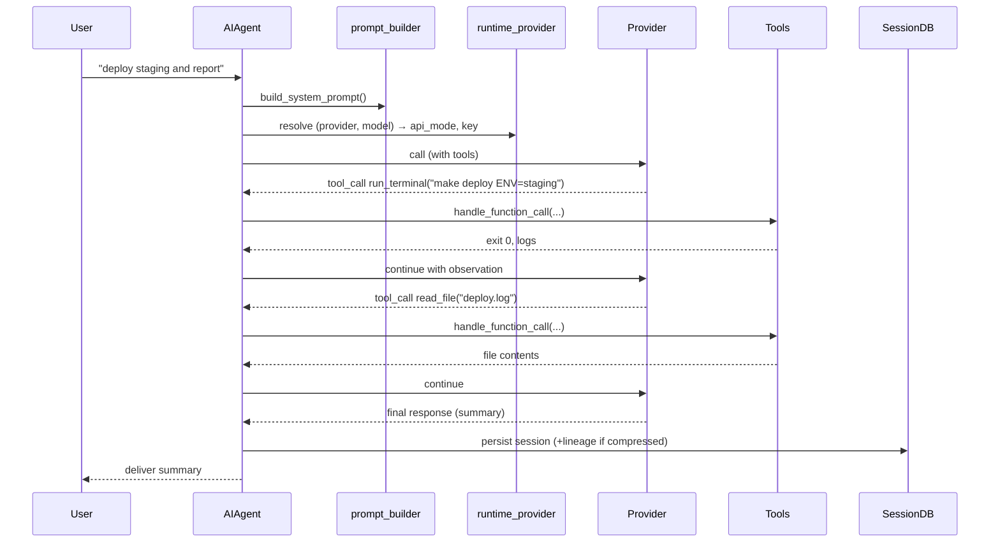
```mermaid
sequenceDiagram
    participant U as User
    participant A as AIAgent
    participant PB as prompt_builder
    participant RP as runtime_provider
    participant LLM as Provider
    participant T as Tools
    participant DB as SessionDB
    U->>A: "deploy staging and report"
    A->>PB: build_system_prompt()
    A->>RP: resolve (provider, model) → api_mode, key
    A->>LLM: call (with tools)
    LLM-->>A: tool_call run_terminal("make deploy ENV=staging")
    A->>T: handle_function_call(...)
    T-->>A: exit 0, logs
    A->>LLM: continue with observation
    LLM-->>A: tool_call read_file("deploy.log")
    A->>T: handle_function_call(...)
    T-->>A: file contents
    A->>LLM: continue
    LLM-->>A: final response (summary)
    A->>DB: persist session (+lineage if compressed)
    A-->>U: deliver summary
```

### 8.7 Component diagram (lifecycle collaborators)

```mermaid
flowchart LR
    loop[AIAgent loop] --- pb[prompt_builder]
    loop --- pc[prompt_caching]
    loop --- rp[runtime_provider]
    loop --- mt[model_tools dispatch]
    loop --- ce[context engine / compressor]
    loop --- st[hermes_state — persist + lineage]
    rp --- fb[fallback_providers]
```

### 8.8 Complete example

**Scenario.** A nightly cron job asks the agent to "check disk usage on the build host, and if any volume is above 85%, prune old artifacts and report what was freed."

**Problem.** This is inherently multi-step and conditional — exactly what a single LLM call cannot do, and exactly where loop limits, tool dispatch, and reliable persistence matter.

**Solution.** The agentic loop runs: inspect → decide → act → observe → report, with a bounded iteration budget and a provider fallback so a transient outage doesn't kill the nightly run.

**Architecture.** Cron tick → fresh `AIAgent` → loop over `run_terminal` calls → final report delivered to Slack.

**Implementation (the cron job and its limits):**

```bash
# Natural-language scheduling; the job runs as a fresh agent each night
hermes cron add \
  --name "disk-guard" \
  --schedule "every day at 02:30" \
  --deliver slack:#ops \
  --prompt "Check disk usage on the build host. For any volume above 85%, prune
            artifacts older than 14 days under /var/cache/build, then report the
            volumes affected and bytes freed. If nothing is above 85%, say so."
```

```yaml
# ~/.hermes/config.yaml — lifecycle tuning
agent:
  max_tool_iterations: 12        # bound the loop
  request_timeout_s: 120
fallback_providers:
  - openrouter
  - anthropic
prompt_caching:
  enabled: true                  # cut repeated-prefix cost across loop turns
```

**Tests.**

```bash
hermes cron run disk-guard --dry-run   # execute once now, observe the loop
hermes cron list                       # confirm schedule + next_run
```

**Result.** A bounded, observable, fault-tolerant multi-step turn: the agent loops only as many times as needed, caches the stable prefix across iterations, falls back on provider errors, and persists the run.

**Future improvements.** Add an approval gate before the prune step (Part XII), and emit metrics on iterations/tokens per run (Part XIII).

### 8.9 Source code

```python
# Illustrative shape of the loop (public library usage; internals live in run_agent.py)
from run_agent import AIAgent

agent = AIAgent()                       # reads config, resolves provider lazily
# run_conversation drives the full lifecycle: prompt → call → tool loop → persist
final = agent.run_conversation(
    "Check disk usage on the build host and prune if any volume > 85%.",
)
print(final)
# Inspect lineage / session after the turn:
#   ~/.hermes/state.db  (SQLite + FTS5) — one row per session, parent_id for lineage
```

### 8.10 Configuration

```yaml
agent:
  max_tool_iterations: 12
  request_timeout_s: 120
  retries: 2                      # transient-error retries before fallback
prompt_caching:
  enabled: true
context_compression:
  enabled: true
  trigger_ratio: 0.8             # compress when context > 80% of window
fallback_providers: [openrouter, anthropic]
```

### 8.11 Real-world use cases

- **Long autonomous tasks** (deploys, data pulls) that need a bounded loop and fallback.
- **High-volume bots** where prompt caching across loop turns is the main cost lever.
- **Auditable runs** where session lineage across compressions is required for compliance.
- **Interruptible interactive sessions** where a user can cancel a runaway loop with a keystroke.

### 8.12 Exercises

1. List the lifecycle stages from input to delivery in order.
2. State three termination conditions for the agentic loop.
3. Explain the difference between a retry and a fallback.
4. When in the lifecycle does compression run, and what does it trade?

### 8.13 Challenges

- **Challenge 1.** Configure `max_tool_iterations` low (e.g., 3) and give the agent a task that needs more steps; observe how it terminates and reports.
- **Challenge 2.** Force a provider error (bad key) and confirm fallback rotates to the next provider transparently.

### 8.14 Checklist

- [ ] I can describe the full turn lifecycle.
- [ ] I understand loop termination conditions.
- [ ] I know how retries and fallback differ.
- [ ] I know when caching and compression occur.
- [ ] I know that turns persist with session lineage.

### 8.15 Best practices

- **Always set `max_tool_iterations`** to bound cost on autonomous tasks.
- **Enable prompt caching** for any repeated-prefix workload.
- **Configure fallback providers** for reliability.
- **Keep tool handlers idempotent** where possible, since the loop may retry.

### 8.16 Anti-patterns

- Unbounded loops (no iteration limit) on autonomous jobs — runaway cost.
- Mutating the prompt mid-turn, defeating caching.
- Treating every error as fatal instead of configuring retries/fallback.
- Ignoring lineage and losing auditability after compression.

### 8.17 Troubleshooting

| Symptom | Cause | Action |
|---------|-------|--------|
| Turn ends prematurely | `max_tool_iterations` too low | Raise the limit for that workload |
| Runaway cost on a job | No iteration/token budget | Set bounds in `agent:` config |
| Provider outage stops agent | No fallback configured | Add `fallback_providers` |
| Cost not dropping on repeat prompts | Caching off or prompt mutating | Enable caching; keep prompt stable |
| Lost mid-conversation context | Compression too aggressive | Tune `trigger_ratio`; verify lineage in `state.db` |

### 8.18 Official references

- Agent Loop Internals: https://hermes-agent.nousresearch.com/docs/developer-guide/agent-loop
- Prompt Assembly: https://hermes-agent.nousresearch.com/docs/developer-guide/prompt-assembly
- Context Compression & Caching: https://hermes-agent.nousresearch.com/docs/developer-guide/context-compression-and-caching
- Provider Runtime Resolution: https://hermes-agent.nousresearch.com/docs/developer-guide/provider-runtime
- Session Storage: https://hermes-agent.nousresearch.com/docs/developer-guide/session-storage

---

## Chapter 9 — Memory System

### 9.1 Introduction

Memory is the subsystem that makes Hermes *persistent* — the antidote to the "amnesia" of ordinary chatbots. It has three concrete substrates: **`MEMORY.md`** (durable facts about the world and projects), **`USER.md`** (the model of who the user is), and a **SQLite database** at `~/.hermes/state.db` with **FTS5 full-text search** indexing every session. On top of those substrates sit a `memory_manager` orchestrator and a `MemoryProvider` ABC that lets you swap the built-in store for one of eight external providers. This chapter covers the architecture, the prompt tiers memory feeds into, and how retrieval works.

### 9.2 Chapter objectives

(1) Describe the three memory substrates and what belongs in each; (2) explain how memory feeds the prompt tiers (`stable` → `context` → `volatile`); (3) understand FTS5 retrieval over sessions; (4) know the `MemoryProvider` ABC and the eight external providers; (5) understand "nudges" — how the agent is prompted to persist what matters.

### 9.3 Business context

Persistent, curated memory turns an assistant into an **organizational asset**. Decisions, conventions, and user preferences accumulate instead of evaporating each session. For a company, this means less repeated context-setting, more consistency across interactions, and — crucially — memory that lives **inside your perimeter** (`~/.hermes/`), under your backup and governance, not in a vendor's closed store. External providers (Honcho, Mem0, etc.) are available when you want managed, shared, or semantic memory at scale.

### 9.4 Theoretical foundations

- **Declarative memory split two ways.** `MEMORY.md` = facts about the world/projects; `USER.md` = facts about the user (the "user model"). Separating them keeps retrieval targeted and the user model portable.
- **Full-text recall.** Every session is indexed in SQLite **FTS5**, so the agent can retrieve relevant past sessions by query rather than scrolling history.
- **Prompt tiers.** Memory is injected in the **`volatile`** tier (most likely to change) while identity/tools/skills are **`stable`** — preserving prompt stability and caching.
- **Provider abstraction.** A `MemoryProvider` ABC means the built-in store is one implementation among nine; external providers add semantic search, cross-device sync, or managed retention.
- **Nudges.** Periodically the agent is reminded to write durable facts to memory — explicit persistence rather than hoping the model "remembers."

### 9.5 Architecture (memory subsystem)

```mermaid
flowchart TB
    subgraph store["Memory substrates (~/.hermes/)"]
        m[MEMORY.md<br/>world/project facts]
        u[USER.md<br/>user model]
        db[(state.db<br/>SQLite + FTS5<br/>session index)]
    end
    mm[memory_manager.py] --- m
    mm --- u
    mm --- db
    mp[MemoryProvider ABC] --- mm
    ext[8 external providers<br/>Honcho · Mem0 · Hindsight · ...] -.plug.- mp
    pb[prompt_builder] -->|volatile tier| mm
```

### 9.6 Internal flows (retrieval + persistence)

```mermaid
sequenceDiagram
    participant A as AIAgent
    participant MM as memory_manager
    participant DB as SQLite/FTS5
    participant MD as MEMORY.md / USER.md
    A->>MM: build context for this turn
    MM->>MD: load durable facts + user model
    MM->>DB: FTS5 search past sessions (query)
    DB-->>MM: top relevant sessions
    MM-->>A: memory block (volatile tier)
    Note over A: ... turn runs ...
    A->>MM: nudge: persist new durable facts
    MM->>MD: append/update MEMORY.md / USER.md
    A->>DB: index this session (FTS5)
```

### 9.7 Component diagram

```mermaid
flowchart LR
    pb[prompt_builder] --- vol[volatile tier]
    vol --- mm[memory_manager]
    mm --- prov{MemoryProvider}
    prov -->|builtin| files[(MEMORY.md/USER.md + state.db)]
    prov -->|plugin| honcho[(Honcho / Mem0 / ...)]
```

### 9.8 Complete example

**Scenario.** A team wants the agent to remember, permanently, their deployment conventions and each developer's preferences — and to recall a past incident when a similar one recurs.

**Problem.** Without curated memory + searchable history, the agent re-asks conventions every session and cannot connect a new incident to last month's identical one.

**Solution.** Use `MEMORY.md` for conventions, `USER.md` for per-user preferences, and FTS5 session search to surface the prior incident.

**Architecture.** Built-in provider; conventions in `MEMORY.md`; preferences in `USER.md`; incident sessions indexed in `state.db`.

**Implementation:**

```markdown
<!-- ~/.hermes/MEMORY.md -->
# Deployment conventions
- Staging first, always: `make deploy ENV=staging`, validate, then `ENV=prod`.
- Never deploy on Fridays after 15:00.
- Rollback: `make rollback ENV=prod`.

# Incidents
- 2026-05-12: prod outage from full /var on build host; fix = prune build cache.
```

```markdown
<!-- ~/.hermes/USER.md -->
# User: Elton
- Prefers concise, bullet-point summaries.
- Stack: Python + Postgres; CI on GitHub Actions.
- Wants deploy reports posted to Slack #ops.
```

```bash
# Recall a past incident via full-text search over sessions
hermes memory search "var full build host outage"
```

**Configuration:**

```yaml
memory:
  enabled: true
  provider: builtin           # or honcho / mem0 / hindsight / ... (Part V)
  nudge: true                 # remind the agent to persist durable facts
```

**Tests.**

```bash
hermes memory show            # prints MEMORY.md + USER.md the agent sees
hermes memory search "rollback"   # FTS5 hit on conventions
```

**Result.** Conventions and preferences persist across every session and surface; a recurring incident is matched to its predecessor via FTS5.

**Future improvements.** Move to an external provider (Honcho/Mem0) for semantic search and cross-device sync (Part V); add memory governance and redaction (Part XII).

### 9.9 Source code

```python
# Library access to the memory subsystem (illustrative)
from agent.memory_manager import MemoryManager

mm = MemoryManager()                       # built-in provider by default
mm.append_fact("MEMORY.md", "No deploys on Fridays after 15:00.")
hits = mm.search_sessions("var full build host outage", limit=5)  # FTS5
for h in hits:
    print(h.session_id, h.snippet)
```

### 9.10 Configuration

```yaml
memory:
  enabled: true
  provider: builtin
  nudge: true
  files:
    world: MEMORY.md
    user: USER.md
  search:
    backend: fts5             # built-in full-text search
    max_results: 8
```

### 9.11 Real-world use cases

- **Team conventions** as durable `MEMORY.md` facts applied automatically.
- **Per-user modeling** in `USER.md` for tone, stack, and delivery preferences.
- **Incident recall** via FTS5 to connect recurring problems to past fixes.
- **Managed/semantic memory** via an external provider for large or shared deployments.

### 9.12 Exercises

1. State what belongs in `MEMORY.md` vs `USER.md`.
2. Explain why memory lives in the `volatile` prompt tier.
3. How does FTS5 change recall compared to scrolling history?
4. Name three external memory providers and one reason to use them.

### 9.13 Challenges

- **Challenge 1.** Seed `MEMORY.md`/`USER.md`, run a few sessions, then prove recall with `hermes memory search`.
- **Challenge 2.** Swap the built-in provider for an external one and compare retrieval quality.

### 9.14 Checklist

- [ ] I know the three substrates and what each stores.
- [ ] I know memory feeds the volatile tier.
- [ ] I can search sessions with FTS5.
- [ ] I know the provider ABC and external options.
- [ ] I understand nudges.

### 9.15 Best practices

- **Curate `MEMORY.md`** like documentation; keep it factual and concise.
- **Keep `USER.md` per-user** and portable; treat it as the user model.
- **Back up `~/.hermes/`** — your memory is an asset.
- **Enable nudges** so durable facts actually get written.

### 9.16 Anti-patterns

- Dumping transient chatter into `MEMORY.md` (bloats the volatile tier).
- Storing secrets in memory files (use the credential flow — Part XII).
- Relying on the model to "just remember" without persistence.
- Never backing up `~/.hermes/`.

### 9.17 Troubleshooting

| Symptom | Cause | Action |
|---------|-------|--------|
| Agent forgets a known fact | Not persisted to memory | Add to `MEMORY.md`; enable nudges |
| Search returns nothing | FTS5 index empty / disabled | Confirm `memory.enabled`; run more sessions |
| Volatile prompt too large | `MEMORY.md` bloated | Trim to durable facts; move detail to Skills |
| Secret leaked into prompt | Secret stored in memory | Remove; use credential flow |

### 9.18 Official references

- Memory: https://hermes-agent.nousresearch.com/docs/user-guide/features/memory
- Session Storage: https://hermes-agent.nousresearch.com/docs/developer-guide/session-storage
- Memory Provider Plugin: https://hermes-agent.nousresearch.com/docs/developer-guide/memory-provider-plugin
- Prompt Assembly: https://hermes-agent.nousresearch.com/docs/developer-guide/prompt-assembly

---

## Chapter 10 — Learning System

### 10.1 Introduction

The **learning system** is what makes Hermes "the only agent with a built-in learning loop." It is not fine-tuning — model weights never change. Instead, after roughly every **15 tasks**, the agent evaluates its own performance, extracts repeatable patterns, and turns them into **Skills** (procedural knowledge) while reinforcing **memory** (declarative knowledge). A background **Curator** then maintains those Skills — tracking usage, detecting staleness, archiving the dead, and running LLM review. This chapter dissects that loop as a system: triggers, inputs (trajectories), outputs (Skills + memory), and the maintenance feedback.

### 10.2 Chapter objectives

(1) Define the learning loop and its ~15-task trigger; (2) explain the inputs (trajectories) and outputs (Skills, memory); (3) describe the Curator's four jobs (usage, staleness, archival, LLM review); (4) distinguish learning from fine-tuning and from simple caching; (5) understand how the loop interacts with the memory and Skills subsystems.

### 10.3 Business context

A learning system changes the **economics of repetition**. The first time the agent does a task, it costs full effort; after the loop captures the pattern, every repeat is cheaper and more consistent. Over months, an organization accumulates a body of operational procedure (Skills) and facts (memory) that is *its own*, portable, and versionable — an asset that compounds. The Curator prevents the failure mode where this asset rots into a pile of stale, contradictory Skills.

### 10.4 Theoretical foundations

- **Context/artifact-level learning.** The agent improves by accumulating and refining *artifacts* (Skills, memory), not by gradient updates — which is why it works with any provider.
- **Trajectory as evidence.** A completed task produces a trajectory (the sequence of thoughts, tool calls, results). The loop mines trajectories for patterns.
- **Periodic reflection.** Every ~15 tasks, the agent self-evaluates and decides what to capture — batching reflection rather than reflecting every turn.
- **Curation as garbage collection.** The Curator is the GC for procedural knowledge: usage stats and staleness detection drive archival and LLM-driven review.

### 10.5 Architecture (learning loop)

```mermaid
flowchart TD
    task[Task completed] --> traj[Trajectory captured]
    traj --> trigger{~15 tasks elapsed?}
    trigger -->|no| task
    trigger -->|yes| eval[Self-evaluation]
    eval --> pat{Reusable pattern?}
    pat -->|procedural| skill[Create/refine Skill]
    pat -->|declarative| mem[Update MEMORY.md / USER.md]
    skill --> use[Use in future tasks]
    use --> cur[Curator: usage · staleness · archival · LLM review]
    cur --> task
    mem --> task
```

### 10.6 Internal flows (loop iteration)

```mermaid
sequenceDiagram
    participant A as AIAgent
    participant L as Learning Loop
    participant S as Skills (~/.hermes/skills)
    participant M as Memory
    participant C as Curator (background)
    A->>L: task N completed (trajectory)
    L->>L: counter reaches ~15 → self-evaluate
    L->>S: extract pattern → create/refine SKILL.md
    L->>M: persist durable facts learned
    Note over A,S: future tasks load the Skill on demand
    C->>S: track usage, detect staleness
    C->>S: archive unused / LLM-review for quality
```

### 10.7 Component diagram

```mermaid
flowchart LR
    loop[Learning loop] --- traj[trajectory.py]
    loop --- sc[skill_commands.py]
    sc --- skills[(skills/ + optional-skills/)]
    loop --- mm[memory_manager.py]
    cur[Curator] --- skills
```

### 10.8 Complete example

**Scenario.** Over two weeks, an agent repeatedly triages incoming bug reports: read the report, reproduce, label severity, assign a team. The procedure is stable but currently rediscovered each time.

**Problem.** Without learning, each triage spends tokens re-deriving the steps and risks inconsistent severity labeling.

**Solution.** Let the learning loop capture the triage procedure as a Skill after it recurs; the Curator keeps it current as labels evolve.

**Architecture.** Triage trajectories → loop (every ~15 tasks) → `SKILL.md` `triage-bug-report` → reused + curated.

**Implementation (the captured Skill):**

```markdown
---
name: triage-bug-report
description: Standard procedure to triage an incoming bug report.
version: 3
---

## Overview
Turn a raw bug report into a labeled, assigned ticket.

## Steps
1. Extract repro steps; attempt reproduction in a sandbox.
2. Assign severity using the matrix below.
3. Map component → owning team via lookup_service_owner.
4. Post a summary comment and assign.

## Severity matrix (loaded on demand)
- S1: data loss / outage. S2: major feature broken. S3: minor. S4: cosmetic.
```

**Configuration:**

```yaml
skills:
  enabled: true
  learning:
    enabled: true
    eval_interval_tasks: 15      # the ~15-task reflection trigger
  curator:
    enabled: true                # usage / staleness / archival / LLM review
```

**Tests.**

```bash
hermes skills list | grep triage-bug-report     # captured after recurrence
hermes skills show triage-bug-report            # inspect version + content
hermes curator status                            # usage + staleness report
```

**Result.** Triage becomes consistent and cheap; the Skill is versioned (note `version: 3`) and curated as the severity matrix evolves.

**Future improvements.** Promote the Skill to the corporate library (Part VI); add human review gates for severity changes in critical services.

### 10.9 Source code

```python
# Inspecting learning artifacts (illustrative library use)
from agent.trajectory import save_trajectory
from agent.memory_manager import MemoryManager

# A completed task's trajectory is the evidence the loop mines:
save_trajectory(session_id="abc123", path="~/.hermes/trajectories/")

# After reflection, durable facts are persisted:
MemoryManager().append_fact("MEMORY.md", "Triage S1 = data loss or outage.")
```

### 10.10 Configuration

```yaml
skills:
  enabled: true
  learning:
    enabled: true
    eval_interval_tasks: 15
  curator:
    enabled: true
    archive_after_idle_days: 30
    llm_review: true
trajectories:
  save: true                     # ShareGPT format, also usable for RL (Atropos)
```

### 10.11 Real-world use cases

- **Procedure capture** (triage, deploys, report generation) into reusable Skills.
- **Consistency enforcement** as the loop standardizes a recurring workflow.
- **Self-maintaining knowledge** via the Curator as processes change.
- **RL data generation** — trajectories exported in ShareGPT for training (Atropos).

### 10.12 Exercises

1. Explain why the learning loop is not fine-tuning.
2. What is the input to the loop, and what are its two output types?
3. List the Curator's four responsibilities.
4. Why batch reflection every ~15 tasks instead of every turn?

### 10.13 Challenges

- **Challenge 1.** Repeat a small procedure many times and confirm a Skill is captured; inspect its version after a change.
- **Challenge 2.** Disable the Curator, accumulate stale Skills, then re-enable it and observe archival.

### 10.14 Checklist

- [ ] I can define the learning loop and its trigger.
- [ ] I know its inputs and outputs.
- [ ] I know the Curator's four jobs.
- [ ] I distinguish learning from fine-tuning and caching.

### 10.15 Best practices

- **Keep learning and the Curator enabled**; review captured Skills periodically.
- **Version and git-track team Skills** so learning is auditable.
- **Use human review** for Skills touching critical or regulated procedures.
- **Export trajectories** if you intend to train models later.

### 10.16 Anti-patterns

- Disabling the Curator → "skill rot."
- Treating captured Skills as infallible in critical domains.
- Letting the loop run with no `MEMORY.md` discipline (declarative drift).
- Capturing secrets into Skills/trajectories.

### 10.17 Troubleshooting

| Symptom | Cause | Action |
|---------|-------|--------|
| No Skills captured | Learning disabled / not enough recurrence | Enable `skills.learning`; run the task repeatedly |
| Stale/contradictory Skills | Curator off | Enable Curator; run `hermes curator status` |
| Loop never triggers | `eval_interval_tasks` too high | Lower the interval |
| Secret in a captured Skill | Captured from a trajectory | Redact; use credential flow; exclude secrets |

### 10.18 Official references

- Skills System: https://hermes-agent.nousresearch.com/docs/user-guide/features/skills
- Curator: https://hermes-agent.nousresearch.com/docs/user-guide/features/curator
- Creating Skills: https://hermes-agent.nousresearch.com/docs/developer-guide/creating-skills
- Trajectory Format: https://hermes-agent.nousresearch.com/docs/developer-guide/trajectory-format

---

## Chapter 11 — Skills System

### 11.1 Introduction

**Skills** are Hermes's procedural memory: on-demand knowledge documents (`SKILL.md` with YAML frontmatter) that teach the agent *how to do* something. They use **progressive disclosure** — a short overview is always cheap to load, with details pulled in only when needed — so a large library costs little context. Hermes ships ~**90 bundled** Skills, offers ~**60 optional** ones, and is compatible with the open **agentskills.io** format and the **Skills Hub**. This chapter covers the Skills architecture: format, discovery, progressive disclosure, and the slash commands that manage them.

### 11.2 Chapter objectives

(1) Define a Skill and the `SKILL.md` format; (2) explain progressive disclosure and why it saves tokens; (3) describe Skill discovery (bundled vs optional vs user) and the `~/.hermes/skills/` layout; (4) use the Skills slash commands and Skills Hub; (5) understand agentskills.io compatibility.

### 11.3 Business context

Skills turn tacit operational know-how into a **shareable, versionable asset**. A team's deploy procedure, code-review checklist, or report format becomes a Skill that any agent on the team loads on demand — consistent, auditable, and improvable. Because the format is open (agentskills.io), Skills are portable across compatible agents and shareable via the Hub, avoiding lock-in of your procedural knowledge.

### 11.4 Theoretical foundations

- **Procedural vs declarative.** Skills (how-to) complement memory (facts). Together they are the two halves of the agent's knowledge.
- **Progressive disclosure.** Load the overview always; load details only when the task needs them — keeping the prompt small while the library is large.
- **Discovery tiers.** Bundled (always available), optional (install explicitly), user (`~/.hermes/skills/`), and Hub-installed.
- **Open format.** `SKILL.md` + YAML frontmatter, agentskills.io-compatible — portable and tool-agnostic.

### 11.5 Architecture (Skills subsystem)

```mermaid
flowchart TB
    subgraph layout["~/.hermes/skills/ and bundled"]
        b[bundled skills/ ~90]
        o[optional-skills/ ~60]
        usr[user skills/]
    end
    sc[skill_commands.py] --- layout
    hub[Skills Hub<br/>agentskills.io] -.install.- usr
    pb[prompt_builder<br/>stable tier: skill index] --> layout
    pb -.on demand.-> details[Skill details loaded only when needed]
```

### 11.6 Internal flows (progressive disclosure)

```mermaid
sequenceDiagram
    participant A as AIAgent
    participant PB as prompt_builder
    participant SK as Skills
    PB->>SK: load lightweight index (names + descriptions)
    PB-->>A: stable tier includes skill index (cheap)
    A->>A: task needs "deploy-internal-app"
    A->>SK: load full SKILL.md body
    SK-->>A: overview + steps
    A->>SK: need rollback detail
    SK-->>A: details section (on demand)
```

### 11.7 Component diagram

```mermaid
flowchart LR
    cmd[/skills slash command/] --- sc[skill_commands.py]
    sc --- store[(skills/ · optional-skills/ · user)]
    sc --- hub[skills_hub.py]
    cur[Curator] --- store
    loop[Learning loop] --- store
```

### 11.8 Complete example

**Scenario.** A team wants a reusable, progressively disclosed Skill for releasing a Python package, used across many sessions and improved over time.

**Problem.** The release steps are detailed; embedding them in every prompt is wasteful, and copy-pasting a runbook is error-prone.

**Solution.** Author a `SKILL.md` with a cheap overview and on-demand details; install it under `~/.hermes/skills/`.

**Architecture.** `~/.hermes/skills/release-python-package/SKILL.md`, discovered by `skill_commands.py`, indexed in the stable tier, details loaded on demand.

**Implementation:**

```markdown
---
name: release-python-package
description: Cut a versioned release of a Python package to PyPI.
version: 2
tags: [release, python, ci]
---

## Overview
Release `mypkg` to PyPI with a tagged version and changelog.

## Steps
1. Bump version in `pyproject.toml`.
2. Update `CHANGELOG.md`.
3. `make test && make build`.
4. `twine upload dist/*` (uses PYPI_TOKEN).
5. `git tag vX.Y.Z && git push --tags`.

## Details (loaded on demand)
- TestPyPI dry run: `twine upload -r testpypi dist/*`.
- Yank a bad release: `pip` cannot; use PyPI web UI.
- Required secrets: PYPI_TOKEN (via credential flow, never inline).
```

**Configuration:**

```yaml
skills:
  enabled: true
  progressive_disclosure: true
```

**Tests.**

```bash
hermes skills list | grep release-python-package
hermes skills show release-python-package        # overview loads; details on demand
hermes skills install <hub-id>                    # install from the Skills Hub
```

**Result.** A reusable, cheap-to-index, detail-on-demand release Skill, shareable via the Hub and improvable by the learning loop and Curator.

**Future improvements.** Publish to the corporate library with governance (Part VI); add an approval gate around `twine upload`.

### 11.9 Source code

```python
# Listing and loading Skills programmatically (illustrative)
from agent.skill_commands import SkillStore

store = SkillStore()                         # discovers bundled + optional + user
print([s.name for s in store.list()])        # lightweight index (names/descriptions)
skill = store.load("release-python-package") # full body
print(skill.overview)                         # cheap section
print(skill.section("Details"))               # on-demand section
```

### 11.10 Configuration

```yaml
skills:
  enabled: true
  progressive_disclosure: true
  paths:
    user: ~/.hermes/skills
  optional:
    install: [pdf-tools, web-research]   # opt-in optional skills
  hub:
    enabled: true                         # agentskills.io
```

### 11.11 Real-world use cases

- **Team runbooks** (deploy, release, incident) as shared Skills.
- **Domain checklists** (code review, security review) loaded on demand.
- **Hub-sourced Skills** (PDF tools, research) installed per need.
- **Self-improving procedures** captured by the learning loop (Chapter 10).

### 11.12 Exercises

1. Write the YAML frontmatter for a Skill, naming each field.
2. Explain progressive disclosure and the token cost it saves.
3. Name the discovery tiers and where user Skills live.
4. What does agentskills.io compatibility buy you?

### 11.13 Challenges

- **Challenge 1.** Author the `release-python-package` Skill with overview + on-demand details and confirm only the overview loads until needed.
- **Challenge 2.** Install a Skill from the Hub and use it in a task.

### 11.14 Checklist

- [ ] I can write a valid `SKILL.md`.
- [ ] I understand progressive disclosure.
- [ ] I know the discovery tiers and paths.
- [ ] I can use the Skills slash commands and Hub.

### 11.15 Best practices

- **Write a tight overview** and push detail into on-demand sections.
- **Version Skills** and git-track team ones.
- **Reference secrets, never embed them.**
- **Tag Skills** for discoverability and Curator hygiene.

### 11.16 Anti-patterns

- Monolithic Skills with no disclosure layering (defeats the point).
- Embedding credentials in `SKILL.md`.
- Hoarding stale Skills (let the Curator archive).
- Duplicating a Skill instead of versioning it.

### 11.17 Troubleshooting

| Symptom | Cause | Action |
|---------|-------|--------|
| Skill not found | Wrong path / not installed | Place under `~/.hermes/skills/`; `hermes skills list` |
| Prompt too large | No progressive disclosure | Split into overview + details |
| Optional skill missing | Not installed | `hermes skills install <name>` |
| Hub install fails | Hub disabled / network | Enable `skills.hub`; check connectivity |

### 11.18 Official references

- Skills System: https://hermes-agent.nousresearch.com/docs/user-guide/features/skills
- Creating Skills: https://hermes-agent.nousresearch.com/docs/developer-guide/creating-skills
- Skills Hub: https://agentskills.io
- Curator: https://hermes-agent.nousresearch.com/docs/user-guide/features/curator

---

## Chapter 12 — Planning System

### 12.1 Introduction

For multi-step work, an agent needs more than a reactive loop — it needs to **plan**: decompose a goal into steps, sequence them, track progress, and adapt. Hermes provides planning at several levels: the implicit decomposition inside the agentic loop, explicit **delegation** to subagents (`delegate_task`), a **Kanban** multi-agent board backed by SQLite, and **persistent goals** via the "Ralph loop." This chapter covers how Hermes plans and executes long-horizon tasks while staying observable and interruptible.

### 12.2 Chapter objectives

(1) Distinguish reactive looping from explicit planning; (2) understand delegation (`delegate_task`) and when to spawn a subagent; (3) describe the Kanban multi-agent board (SQLite-backed); (4) explain persistent goals / the Ralph loop for long-horizon autonomy; (5) keep plans observable and interruptible.

### 12.3 Business context

Planning is what lets an agent own a **deliverable**, not just answer a question. A research report, a migration, a multi-service deploy — these need decomposition, parallelism (subagents), and persistence (a goal that survives restarts). For an organization, structured planning means autonomous work that is *trackable* (Kanban), *bounded*, and *resumable* — the prerequisites for trusting an agent with real outcomes.

### 12.4 Theoretical foundations

- **Decomposition.** Break a goal into ordered, checkable steps (implicitly in the loop, or explicitly via a plan/Kanban).
- **Delegation.** `delegate_task` spawns a subagent with a scoped objective; results return to the parent — divide-and-conquer with isolation.
- **Shared board.** A SQLite-backed Kanban lets multiple agents pick up, work, and complete cards — coordination without a central orchestrator process.
- **Persistent goals (Ralph loop).** A goal that the agent keeps pursuing across iterations/restarts until satisfied — long-horizon autonomy.

### 12.5 Architecture (planning layers)

```mermaid
flowchart TB
    goal[Goal] --> dec[Decompose into steps]
    dec --> mode{Execution mode}
    mode -->|single agent| loop[Agentic loop runs steps]
    mode -->|parallelizable| del[delegate_task → subagents]
    mode -->|team / multi-agent| kan[(Kanban board · SQLite)]
    mode -->|long-horizon| ralph[Persistent goal · Ralph loop]
    del --> merge[Merge subagent results]
    kan --> merge
    ralph --> loop
```

### 12.6 Internal flows (delegation)

```mermaid
sequenceDiagram
    participant P as Parent AIAgent
    participant D as delegate_task
    participant S1 as Subagent A
    participant S2 as Subagent B
    P->>D: delegate("research vendor A")
    P->>D: delegate("research vendor B")
    D->>S1: scoped objective A
    D->>S2: scoped objective B
    S1-->>D: findings A
    S2-->>D: findings B
    D-->>P: merged results
    P->>P: synthesize final deliverable
```

### 12.7 Component diagram

```mermaid
flowchart LR
    loop[AIAgent loop] --- dt[delegate_tool.py]
    dt --- subs[Subagents]
    kan[(Kanban · SQLite)] --- agents[Multiple agents]
    ralph[Persistent goal] --- loop
```

### 12.8 Complete example

**Scenario.** "Produce a competitive analysis of three vendors and deliver a one-page brief." This benefits from parallel research and a final synthesis.

**Problem.** Researching three vendors serially is slow and pollutes one context with three threads of detail.

**Solution.** Delegate three scoped research subagents, then synthesize their findings in the parent.

**Architecture.** Parent agent → `delegate_task` × 3 (one per vendor) → merge → parent writes the brief.

**Implementation:**

```bash
hermes
> Research vendors Acme, Globex, and Initech as a competitive analysis.
  Delegate one research subagent per vendor, then synthesize a one-page brief
  comparing pricing, integration effort, and support.
```

```yaml
# ~/.hermes/config.yaml — planning / delegation knobs
delegation:
  enabled: true
  max_subagents: 4
  subagent_timeout_s: 300
kanban:
  enabled: false        # turn on for team multi-agent boards (Part VIII)
```

**Tests.**

```bash
hermes sessions tree        # shows parent → subagent lineage
hermes delegate status      # active subagents and their objectives
```

**Result.** Three vendors researched in parallel in isolated contexts; the parent merges and produces a clean one-page brief — faster and better-scoped than a serial run.

**Future improvements.** Move to a Kanban board for a standing research team (Part VIII); add a persistent goal so the brief auto-refreshes weekly (Part X).

### 12.9 Source code

```python
# Delegation via the library (illustrative)
from run_agent import AIAgent

parent = AIAgent()
brief = parent.run_conversation(
    "Delegate research on Acme, Globex, Initech (one subagent each), "
    "then synthesize a one-page competitive brief."
)
print(brief)
# Subagents appear as child sessions in ~/.hermes/state.db (lineage tracked).
```

### 12.10 Configuration

```yaml
delegation:
  enabled: true
  max_subagents: 4
  subagent_timeout_s: 300
kanban:
  enabled: true
  db: ~/.hermes/kanban.db
goals:
  persistent: true        # Ralph loop for long-horizon goals
```

### 12.11 Real-world use cases

- **Parallel research** with subagents merged into one deliverable.
- **Standing multi-agent teams** coordinating via a Kanban board (Part VIII).
- **Long-horizon goals** (keep a dashboard fresh; pursue a migration) via the Ralph loop.
- **Divide-and-conquer migrations** where each subagent owns a module.

### 12.12 Exercises

1. Distinguish reactive looping from explicit planning.
2. When should you `delegate_task` versus run steps in one agent?
3. What does the Kanban board provide that delegation alone does not?
4. Define a persistent goal (Ralph loop).

### 12.13 Challenges

- **Challenge 1.** Run a delegated 3-subagent research task and inspect the session tree.
- **Challenge 2.** Enable the Kanban board and have two agents complete cards from it.

### 12.14 Checklist

- [ ] I understand decomposition and the planning layers.
- [ ] I can use delegation appropriately.
- [ ] I know what the Kanban board adds.
- [ ] I understand persistent goals.

### 12.15 Best practices

- **Delegate when subtasks are independent**; keep contexts isolated.
- **Bound subagents** (count + timeout) to control cost.
- **Use Kanban for standing teams**, delegation for one-off fan-out.
- **Keep plans observable** (`sessions tree`, `delegate status`) and interruptible.

### 12.16 Anti-patterns

- Delegating tightly-coupled steps that need shared context.
- Unbounded subagent fan-out (cost explosion).
- Treating a persistent goal as fire-and-forget with no monitoring.
- Hiding plans, losing observability.

### 12.17 Troubleshooting

| Symptom | Cause | Action |
|---------|-------|--------|
| Subagents never finish | No timeout | Set `subagent_timeout_s` |
| Cost spikes on delegation | Too many subagents | Lower `max_subagents` |
| Kanban cards stuck | No agent picking them up | Ensure agents poll the board; check `kanban.db` |
| Persistent goal loops forever | No satisfaction condition | Define a clear done-criterion |

### 12.18 Official references

- Delegation / Subagents: https://hermes-agent.nousresearch.com/docs/user-guide/features/delegation
- Kanban Multi-Agent: https://hermes-agent.nousresearch.com/docs/user-guide/features/kanban
- Persistent Goals (Ralph loop): https://hermes-agent.nousresearch.com/docs/user-guide/features/persistent-goals
- Agent Loop Internals: https://hermes-agent.nousresearch.com/docs/developer-guide/agent-loop

---

## Chapter 13 — Execution System

### 13.1 Introduction

Everything the agent *does* in the world happens through the **execution system**: tools that read files, run commands, browse the web, and execute code — dispatched through the registry and run on one of **six terminal backends** (local, Docker, SSH, Daytona, Modal, Singularity). This chapter covers how execution is dispatched, how backends differ (from your laptop to serverless), how dangerous commands are gated, and how `execute_code` provides a sandbox. It is the bridge between the agent's intent and real side effects.

### 13.2 Chapter objectives

(1) Explain tool dispatch through the registry; (2) describe the six terminal backends and when to use each; (3) understand command approval / dangerous-command detection; (4) use `execute_code` and programmatic tool calling; (5) understand background process management and observability of execution.

### 13.3 Business context

Where and how the agent executes determines **blast radius and cost**. Running on your laptop is convenient but unisolated; Docker/Singularity contain the agent; SSH targets a remote host; Daytona/Modal run serverless and hibernate when idle (near-zero cost). Choosing the right backend per workload — and gating dangerous commands — is the core of safe autonomous operation. This is the control surface that lets an enterprise let an agent *act* without unacceptable risk.

### 13.4 Theoretical foundations

- **Dispatch via registry.** A tool call resolves to a handler in `tools/registry.py`; `model_tools.handle_function_call` runs it and feeds back the observation.
- **Pluggable backends.** Terminal tools target one of six backends behind a common interface — the agent logic is backend-agnostic.
- **Approval gating.** `tools/approval.py` detects dangerous commands and requires confirmation (or allowlist) before execution.
- **Sandboxed code.** `execute_code` runs code in a contained environment; programmatic tool calling lets generated code invoke tools.
- **Observable + interruptible.** Every execution is visible via callbacks and can be cancelled — and background processes are tracked in a process registry.

### 13.5 Architecture (execution)

```mermaid
flowchart TB
    llm[Provider emits tool_call] --> disp[model_tools.handle_function_call]
    disp --> reg[tools/registry.py resolve handler]
    reg --> approve{dangerous?<br/>approval.py}
    approve -->|needs approval| ask[user/allowlist gate]
    approve -->|safe| run
    ask -->|approved| run[execute on backend]
    run --> back{terminal backend}
    back --> local[local]
    back --> docker[Docker]
    back --> ssh[SSH]
    back --> dayt[Daytona]
    back --> modal[Modal]
    back --> sing[Singularity]
    run --> obs[observe result → loop]
```

### 13.6 Internal flows (gated command)

```mermaid
sequenceDiagram
    participant LLM as Provider
    participant MT as model_tools
    participant AP as approval.py
    participant BK as Backend (e.g. Docker)
    participant U as User
    LLM-->>MT: tool_call run_terminal("rm -rf build/")
    MT->>AP: classify command
    AP-->>MT: dangerous → requires approval
    MT->>U: request approval (callback)
    U-->>MT: approve
    MT->>BK: execute in container
    BK-->>MT: exit code + output
    MT-->>LLM: observed result
```

### 13.7 Component diagram

```mermaid
flowchart LR
    mt[model_tools.py] --- reg[tools/registry.py]
    reg --- tt[terminal_tool.py]
    tt --- env[tools/environments/]
    env --- l[local] & d[docker] & s[ssh] & da[daytona] & mo[modal] & si[singularity]
    reg --- ce[code_execution_tool.py]
    reg --- pr[process_registry.py]
    reg --- ap[approval.py]
```

### 13.8 Complete example

**Scenario.** A team wants the agent to run build-and-test commands for untrusted PRs, fully contained so a malicious PR cannot touch the host.

**Problem.** Running PR code on the host (local backend) is a security risk; the agent must execute inside isolation, with dangerous commands gated.

**Solution.** Use the **Docker** terminal backend with an allowlist and approval for destructive commands; the agent's side effects are confined to the container.

**Architecture.** Agent → tool dispatch → `terminal_tool` → Docker backend (ephemeral container) → results back to the loop.

**Implementation:**

```yaml
# ~/.hermes/config.yaml — contained execution
tools:
  terminal_backend: docker
  docker:
    image: hermes-ci:latest
    network: none              # no egress for untrusted PR code
    mounts:
      - "./pr-checkout:/work:ro"
approval:
  enabled: true
  allowlist:
    - "make test"
    - "make build"
  require_approval_for:
    - "rm -rf*"
    - "curl*"
```

```bash
# Run the agent against a checked-out PR, contained in Docker
hermes -p ci
> Build and test the PR in /work. Report failures with the failing test names.
```

**Tests.**

```bash
hermes doctor                       # confirms docker backend reachable
hermes tools | grep run_terminal    # terminal tool available
# Try a destructive command: it should require approval, not run silently.
```

**Result.** Untrusted PR code runs build/test inside an egress-less container; allowlisted commands run freely; destructive ones require approval — safe autonomous CI.

**Future improvements.** Switch to Modal/Daytona for serverless, hibernating CI runners (cheaper at scale); add full sandboxing and audit (Part XII/XIII).

### 13.9 Source code

```python
# Programmatic tool calling via execute_code (illustrative)
# The agent can generate code that calls tools, run in a sandbox:
result = execute_code(
    language="python",
    code="""
import json
out = run_terminal("make test")          # tool callable from sandboxed code
print(json.dumps({"exit": out.exit_code, "tail": out.stdout[-500:]}))
""",
)
# Background processes are tracked so the agent can poll/kill them:
#   tools/process_registry.py manages long-running terminal processes.
```

### 13.10 Configuration

```yaml
tools:
  terminal_backend: docker        # local | docker | ssh | daytona | modal | singularity
  ssh:
    host: build.internal
    user: ci
  modal:
    app: hermes-runners
approval:
  enabled: true
  allowlist: ["make test", "make build", "git status"]
  require_approval_for: ["rm -rf*", "curl*", "sudo*"]
code_execution:
  enabled: true
  timeout_s: 120
```

### 13.11 Real-world use cases

- **Contained CI** for untrusted PRs (Docker/Singularity, no egress).
- **Remote operations** over SSH on a build or ops host.
- **Serverless, hibernating runners** (Daytona/Modal) that cost near-zero when idle.
- **Sandboxed data tasks** via `execute_code` with programmatic tool calling.

### 13.12 Exercises

1. List the six terminal backends and one use case for each.
2. Explain how a dangerous command is detected and gated.
3. What does `execute_code` provide that `run_terminal` does not?
4. Why run untrusted code with `network: none`?

### 13.13 Challenges

- **Challenge 1.** Configure the Docker backend with an allowlist and confirm a destructive command triggers approval.
- **Challenge 2.** Switch the same workload to the Modal or Daytona backend and observe serverless execution.

### 13.14 Checklist

- [ ] I understand tool dispatch through the registry.
- [ ] I know the six backends and their trade-offs.
- [ ] I understand approval / dangerous-command gating.
- [ ] I can use `execute_code` and programmatic tool calling.

### 13.15 Best practices

- **Match backend to risk:** local for trusted dev, Docker/Singularity for untrusted, serverless for scale.
- **Gate destructive commands** with approval + allowlist.
- **Disable egress** for untrusted code.
- **Track background processes** and keep execution observable.

### 13.16 Anti-patterns

- Running untrusted code on the local backend.
- Approval disabled in production.
- Allowlisting broad wildcards that defeat gating.
- Unbounded `execute_code` with no timeout.

### 13.17 Troubleshooting

| Symptom | Cause | Action |
|---------|-------|--------|
| Backend unreachable | Misconfig / daemon down | `hermes doctor`; check Docker/SSH/serverless creds |
| Destructive command ran silently | Approval disabled | Enable `approval`; add to `require_approval_for` |
| Untrusted code reached network | Egress allowed | Set `network: none` for that backend |
| Background job orphaned | Not tracked | Use process registry; check `hermes process list` |

### 13.18 Official references

- Tools Runtime: https://hermes-agent.nousresearch.com/docs/developer-guide/tools-runtime
- Terminal Backends / Environments: https://hermes-agent.nousresearch.com/docs/user-guide/features/terminal-backends
- Command Approval & Security: https://hermes-agent.nousresearch.com/docs/user-guide/features/command-approval
- Code Execution: https://hermes-agent.nousresearch.com/docs/user-guide/features/code-execution

---

> **End of Part II.** We opened the hood: the three-layer architecture, the internal components and registries, the turn lifecycle, and the five subsystems that make Hermes self-improving and capable — memory, learning, Skills, planning, and execution. **Part III — Installation and Environments** (Chapters 14–21) gets practical: installing Hermes locally and on Linux, Windows, and macOS, then containerizing with Docker, orchestrating on Kubernetes, deploying to a VPS, and running on cloud providers.

## Part III – Installation and Environments

Part II explained *what* Hermes is internally. Part III makes it *run* — everywhere it should. The same `AIAgent` core (the "platform-agnostic core" principle from Chapter 6) deploys identically whether the target is a developer laptop, a hardened Linux server, a Windows workstation, a Mac, a Docker container, a Kubernetes cluster, a $5 VPS, or a managed cloud. The art is choosing the right environment per workload and configuring it for reliability, cost, and security.

The chapters proceed from simplest to most operationally demanding. Chapter 14 covers the universal local install and first-run setup. Chapters 15–17 dig into the three desktop/server operating systems (Linux, Windows, macOS) and their platform-specific concerns. Chapter 18 containerizes with Docker; Chapter 19 orchestrates on Kubernetes; Chapter 20 deploys a long-lived agent to a VPS; Chapter 21 surveys the major cloud providers and serverless options. Throughout, one principle recurs: **install once, configure per environment** — the agent definition (config, memory, Skills) is portable; only the surrounding infrastructure changes.

> **Operational thread.** Two commands appear in nearly every chapter: `hermes doctor` (environment diagnostics — what's missing and how to fix it) and `hermes --version` (confirming the pinned v0.16 line). Make them the first thing you run after any install or migration.

---

## Chapter 14 — Local Installation

### 14.1 Introduction

Local installation is the front door to Hermes. The official one-liner installs everything — Python (via `uv`), Node.js, ripgrep, ffmpeg, the repo, a virtual environment, and the global `hermes` command — and ends ready to chat. On macOS and Windows there is also a **Desktop installer** (v0.16's "Surface Release") that installs both the CLI and the native desktop app. This chapter covers the universal install path, what the installer does, the install layout, first-run setup (`hermes setup --portal`), and verification.

### 14.2 Chapter objectives

(1) Install Hermes via the one-liner (and know the Windows/Desktop variants); (2) understand what the installer provisions and the resulting install layout; (3) complete first-run setup with Nous Portal; (4) verify with `hermes doctor` and `hermes --version`; (5) understand profiles and `HERMES_HOME` for isolated installs.

### 14.3 Business context

A low-friction install is what makes an agent *adoptable*. The installer's "handles everything automatically" approach removes the classic onboarding tax (Python versions, native deps) that stalls pilots. For an enterprise, the relevant facts are: the data directory (`~/.hermes/`) is the asset to back up and govern; the install method is auto-detected (so updates are one command); and profiles allow many isolated agents on one machine without interference — the basis for per-team or per-tenant separation.

### 14.4 Theoretical foundations

- **Self-contained provisioning.** The installer uses `uv` to install Python 3.11 without sudo, plus Node.js v22, ripgrep, and ffmpeg — no manual dependency management.
- **Install layout determines updates.** pip vs git-installer vs root-mode vs Homebrew/Nix each place code and the `hermes` binary differently; Hermes auto-detects which and prints the right update command.
- **Profile isolation.** Each profile (`hermes -p <name>`) has its own `HERMES_HOME` (config, memory, sessions, gateway PID) — concurrent, non-interfering agents.
- **Portal-first onboarding.** One OAuth (`hermes setup --portal`) configures a model *and* the Tool Gateway (web search, image gen, TTS, cloud browser), eliminating per-tool key juggling.

### 14.5 Architecture (install layout)

```mermaid
flowchart TB
    inst[Installer] --> deps[Provision deps<br/>uv·Python3.11·Node22·ripgrep·ffmpeg]
    inst --> code[Clone repo + venv]
    inst --> bin[Global hermes command]
    inst --> home[(~/.hermes/<br/>config·MEMORY.md·USER.md·skills·state.db)]
    home --> prof{Profiles}
    prof --> def[default HERMES_HOME]
    prof --> p1[-p research → own HERMES_HOME]
```

### 14.6 Internal flows (first run)

```mermaid
sequenceDiagram
    participant U as User
    participant I as install.sh
    participant H as hermes CLI
    participant P as Nous Portal
    U->>I: curl ... | bash
    I->>I: provision deps, clone, venv, link hermes
    U->>H: hermes setup --portal
    H->>P: OAuth login
    P-->>H: token (model + Tool Gateway)
    H->>H: write ~/.hermes/config.yaml
    U->>H: hermes
    H-->>U: ready to chat
```

### 14.7 Component diagram

```mermaid
flowchart LR
    subgraph home["~/.hermes/"]
        cfg[config.yaml]
        mem[MEMORY.md / USER.md]
        skl[skills/]
        db[(state.db)]
        plg[plugins/]
    end
    bin[hermes binary] --- venv[venv / site-packages]
    bin --- home
```

### 14.8 Complete example

**Scenario.** A developer wants Hermes installed locally with Nous Portal, verified, and a second isolated profile for experiments.

**Problem.** Manual dependency setup is error-prone, and mixing experimental config with the working agent risks breaking the daily driver.

**Solution.** Use the one-liner, set up Portal, verify, then create an isolated `lab` profile.

**Architecture.** Default profile for daily use; `-p lab` with its own `HERMES_HOME` for experiments.

**Implementation:**

```bash
# 1. Install (Linux / macOS / WSL2 / Termux)
curl -fsSL https://hermes-agent.nousresearch.com/install.sh | bash
source ~/.bashrc            # or ~/.zshrc

# 2. First-run setup — one OAuth for model + Tool Gateway
hermes setup --portal

# 3. Start chatting
hermes

# 4. Isolated experiment profile (own config/memory/sessions)
hermes -p lab setup --portal
hermes -p lab
```

On native **Windows**:

```powershell
iex (irm https://hermes-agent.nousresearch.com/install.ps1)
```

To add the **Desktop app** after a CLI install:

```bash
hermes desktop
```

**Configuration (`~/.hermes/config.yaml`, written by setup):**

```yaml
provider: nous-portal
model: hermes-4-70b
tool_gateway:
  enabled: true            # web search, image gen, TTS, cloud browser
memory:
  enabled: true
skills:
  enabled: true
```

**Tests.**

```bash
hermes --version           # v0.16.x line
hermes doctor              # environment + provider diagnostics
hermes -p lab doctor       # the lab profile is independent
```

**Result.** A verified local install on Portal, plus an isolated `lab` profile that cannot disturb the daily agent.

**Future improvements.** Connect the messaging gateway (Part IX), back up `~/.hermes/`, and pin the version for reproducibility (Chapter 2).

### 14.9 Source code

```bash
# Inspect the detected install method and paths (drives the right update command)
hermes doctor | sed -n '/environment/,/method/p'
echo "$HERMES_HOME"                     # empty = default ~/.hermes
hermes config show                       # effective configuration
hermes config get provider               # single value
```

### 14.10 Configuration

```yaml
# Minimal portable agent definition (the asset you back up)
provider: nous-portal
model: hermes-4-70b
memory: { enabled: true }
skills: { enabled: true }
# Optional: pin behavior across machines
fallback_providers: [openrouter]
```

```bash
# Profile + HERMES_HOME isolation
export HERMES_HOME="/srv/hermes/teamA"   # explicit home for a service account
hermes -p teamA doctor
```

### 14.11 Real-world use cases

- **Developer laptop** with Portal for daily agentic work.
- **Isolated experiment profile** to test new Skills/providers safely.
- **Service-account install** with explicit `HERMES_HOME` on a shared host.
- **Desktop app** for non-technical users (v0.16), CLI for automation.

### 14.12 Exercises

1. Run the installer and identify, from `hermes doctor`, the detected install method.
2. Explain the difference between `~/.hermes/` and a profile's `HERMES_HOME`.
3. What does `hermes setup --portal` configure in one step?

### 14.13 Challenges

- **Challenge 1.** Install Hermes, set up Portal, and create a second isolated profile; prove the two have independent memory.
- **Challenge 2.** Back up `~/.hermes/`, simulate a fresh machine, and restore the agent (config + memory + Skills).

### 14.14 Checklist

- [ ] Hermes installed; `hermes --version` shows v0.16.x.
- [ ] `hermes doctor` is clean.
- [ ] Portal (or a provider) configured.
- [ ] I understand profiles and `HERMES_HOME`.
- [ ] `~/.hermes/` is backed up.

### 14.15 Best practices

- **Start with Portal** to remove key-juggling friction.
- **Use profiles** for isolation instead of multiple half-installs.
- **Back up `~/.hermes/`** — it is the agent's accumulated value.
- **Run `hermes doctor`** after every install/update.

### 14.16 Anti-patterns

- Manually installing Python/Node and fighting version conflicts.
- Hardcoding keys in a versioned `config.yaml`.
- Running everything in one profile, mixing experiments with production.
- Never backing up memory/Skills.

### 14.17 Troubleshooting

| Symptom | Cause | Action |
|---------|-------|--------|
| `hermes: command not found` | PATH not reloaded | `source ~/.bashrc` / check `~/.local/bin` |
| `API key not set` | No provider | `hermes model` or `hermes setup --portal` |
| Missing config after update | Migration needed | `hermes config check` then `hermes config migrate` |
| Wrong agent state | Default vs profile confusion | Check `-p`/`HERMES_HOME` |

### 14.18 Official references

- Installation: https://hermes-agent.nousresearch.com/docs/getting-started/installation
- Quickstart: https://hermes-agent.nousresearch.com/docs/getting-started/quickstart
- Nous Portal: https://hermes-agent.nousresearch.com/docs/integrations/nous-portal
- Updating & Uninstalling: https://hermes-agent.nousresearch.com/docs/getting-started/updating

---

## Chapter 15 — Linux

### 15.1 Introduction

Linux is Hermes's natural home — the platform for servers, CI runners, and long-lived agents. This chapter covers Linux-specific concerns: the per-user vs root-mode (FHS) install layouts, running Hermes as an unprivileged **systemd service**, the Playwright/Chromium dependency split for headless or non-sudo hosts, and distro differences (Debian/Ubuntu, Arch, Fedora/RHEL, openSUSE). The goal is a Hermes that survives reboots, runs as a dedicated user, and is safe on a shared box.

### 15.2 Chapter objectives

(1) Choose between per-user and root-mode installs; (2) run Hermes as a systemd service under a dedicated user; (3) handle the Playwright `--with-deps` split for non-sudo/headless installs; (4) account for distro-specific package managers; (5) verify a server install.

### 15.3 Business context

On Linux, Hermes becomes **infrastructure**: a service that runs the gateway or scheduled jobs 24/7. Running it as an unprivileged service account (least privilege), surviving reboots (systemd), and installing browser deps correctly (so automation works) are the difference between a fragile script and a production service. Root-mode FHS layout serves shared machines where one system install backs every user.

### 15.4 Theoretical foundations

- **Two layouts.** Per-user (`~/.hermes/hermes-agent/`, `~/.local/bin/hermes`) vs root-mode FHS (`/usr/local/lib/hermes-agent/`, `/usr/local/bin/hermes`, `/root/.hermes/` or `$HERMES_HOME`).
- **Least privilege.** Only Playwright's `--with-deps` truly needs root (it apt-installs Chromium shared libs); everything else runs as the service user. The installer degrades gracefully when sudo is absent.
- **Service supervision.** systemd restarts the gateway on failure/reboot and isolates it under a dedicated account.
- **Distro variance.** Debian/Ubuntu/Arch support `--with-deps`; Fedora/RHEL/openSUSE require an admin to install system libs separately.

### 15.5 Architecture (Linux service)

```mermaid
flowchart TB
    sysd[systemd] -->|manages| svc[hermes gateway service]
    svc --> user[(unprivileged 'hermes' user)]
    user --> home[(~/.hermes or $HERMES_HOME)]
    admin[admin w/ sudo] -.one-time.-> deps[playwright install-deps chromium]
    svc --> pw[Chromium in user Playwright cache]
```

### 15.6 Internal flows (non-sudo install)

```mermaid
sequenceDiagram
    participant Ad as Admin (sudo)
    participant Su as Service user
    participant I as install.sh
    Ad->>Ad: npx playwright install-deps chromium (one time)
    Su->>I: curl ... | bash
    I->>I: detect no sudo → skip --with-deps
    I->>Su: install Chromium into user Playwright cache
    Su->>Su: add ~/.local/bin to PATH
    Su->>Su: hermes doctor (clean)
```

### 15.7 Component diagram

```mermaid
flowchart LR
    unit[/etc/systemd/system/hermes.service/] --- bin[/usr/local/bin/hermes or ~/.local/bin/hermes/]
    bin --- venv[venv launcher]
    bin --- home[(HERMES_HOME)]
    home --- gw[gateway PID + sessions]
```

### 15.8 Complete example

**Scenario.** Run the Hermes messaging gateway 24/7 on an Ubuntu server as an unprivileged `hermes` user, surviving reboots.

**Problem.** A bare `hermes gateway start` dies on logout/reboot and runs as a privileged user — unacceptable for production.

**Solution.** Install browser deps once as admin, install Hermes as the `hermes` user, and supervise the gateway with systemd.

**Architecture.** `hermes` service user → systemd unit → `hermes gateway start` → `$HERMES_HOME` on a controlled volume.

**Implementation:**

```bash
# 1. As an admin (one time): system libs Chromium needs
sudo npx playwright install-deps chromium

# 2. As the service user: install Hermes
sudo useradd -m -d /srv/hermes -s /bin/bash hermes
sudo -u hermes -i
curl -fsSL https://hermes-agent.nousresearch.com/install.sh | bash
echo 'export PATH="$HOME/.local/bin:$PATH"' >> ~/.bashrc && source ~/.bashrc
hermes setup --portal
hermes gateway setup            # add Telegram token + allowlist
exit
```

```ini
# 3. /etc/systemd/system/hermes-gateway.service
[Unit]
Description=Hermes Agent Gateway
After=network-online.target
Wants=network-online.target

[Service]
User=hermes
Environment=HERMES_HOME=/srv/hermes/.hermes
ExecStart=/srv/hermes/.local/bin/hermes gateway start --platform telegram
Restart=on-failure
RestartSec=5

[Install]
WantedBy=multi-user.target
```

```bash
# 4. Enable and start
sudo systemctl daemon-reload
sudo systemctl enable --now hermes-gateway
sudo systemctl status hermes-gateway
```

**Tests.**

```bash
sudo -u hermes hermes doctor
sudo systemctl restart hermes-gateway && sudo journalctl -u hermes-gateway -n 30
hermes gateway status
```

**Result.** A reboot-surviving, least-privilege gateway service on Linux, isolated under the `hermes` account.

**Future improvements.** Add resource limits (`MemoryMax`, `CPUQuota`) to the unit, ship logs to your stack (Part XIII), and front the gateway with the allowlist/pairing security (Part XII).

### 15.9 Source code

```bash
# Headless server with no browser automation needed: skip Playwright entirely
curl -fsSL https://hermes-agent.nousresearch.com/install.sh | bash -s -- --skip-browser

# Fedora/RHEL/openSUSE: admin installs libs separately (printed by the installer)
# e.g. sudo dnf install <libs printed by installer>
```

### 15.10 Configuration

```yaml
# ~/.hermes/config.yaml for a server profile
provider: nous-portal
model: hermes-4-70b
gateway:
  platforms: [telegram]
  allowlist: ["@alice", "@bob"]
tools:
  terminal_backend: local        # or docker for isolation on shared hosts
```

### 15.11 Real-world use cases

- **24/7 gateway service** under systemd on a Linux server.
- **Headless CI agent** installed with `--skip-browser`.
- **Shared machine** with a root-mode FHS install serving all users.
- **Hardened service account** with least privilege and resource limits.

### 15.12 Exercises

1. Contrast per-user and root-mode install layouts.
2. Why does only Playwright's `--with-deps` need root?
3. Write a systemd unit that restarts the gateway on failure.

### 15.13 Challenges

- **Challenge 1.** Stand up the gateway as a systemd service under a dedicated user and prove it survives a reboot.
- **Challenge 2.** Install on a Fedora/RHEL box, handling the separate system-lib step.

### 15.14 Checklist

- [ ] Correct install layout chosen.
- [ ] Service runs under an unprivileged user.
- [ ] Playwright deps handled (or `--skip-browser`).
- [ ] systemd supervises and restarts the gateway.
- [ ] `hermes doctor` clean as the service user.

### 15.15 Best practices

- **Run as a dedicated unprivileged user** with an explicit `HERMES_HOME`.
- **Supervise with systemd** (`Restart=on-failure`, resource limits).
- **Install browser deps once as admin**; use `--skip-browser` on headless hosts.
- **Pin the version** on servers.

### 15.16 Anti-patterns

- Running the gateway as root or under your personal account.
- `nohup hermes gateway &` with no supervision.
- Ignoring the Playwright dep split, breaking browser tools silently.
- Mixing service `HERMES_HOME` with a human user's.

### 15.17 Troubleshooting

| Symptom | Cause | Action |
|---------|-------|--------|
| `ModuleNotFoundError: dotenv` | Running repo `hermes` with system Python | Use the venv launcher; fix PATH |
| Browser tools fail | Missing Chromium libs | `sudo npx playwright install-deps chromium` |
| Service dies on logout | No supervision | Use the systemd unit |
| `hermes` not on PATH for service user | Minimal PATH | Add `~/.local/bin` or symlink to `/usr/local/bin` |

### 15.18 Official references

- Installation (Linux + non-sudo): https://hermes-agent.nousresearch.com/docs/getting-started/installation
- Gateway: https://hermes-agent.nousresearch.com/docs/user-guide/messaging/
- Updating: https://hermes-agent.nousresearch.com/docs/getting-started/updating
- Contributing / Dev Setup: https://hermes-agent.nousresearch.com/docs/developer-guide/contributing

---

## Chapter 16 — Windows

### 16.1 Introduction

Hermes runs on Windows two ways: **natively** (PowerShell installer, plus the v0.16 Desktop app) and via **WSL2** (a Linux environment on Windows, which the standard `install.sh` targets). This chapter covers both, when to choose each, the Desktop installer path, and Windows-specific concerns (PATH, PowerShell execution policy, line endings, and Node/native build tools for the desktop app).

### 16.2 Chapter objectives

(1) Install Hermes natively on Windows and via WSL2; (2) choose between native and WSL2; (3) use the Desktop installer; (4) handle Windows-specific issues (PATH, execution policy, build tools); (5) verify the install.

### 16.3 Business context

Many enterprise developers are on Windows. Offering a native installer and a Desktop app (v0.16) lowers adoption friction for non-Linux teams, while WSL2 gives power users a full Linux runtime for server-like behavior. The practical decision: **Desktop/native for end users and quick local use; WSL2 for development that mirrors Linux production.**

### 16.4 Theoretical foundations

- **Two runtimes.** Native Windows (PowerShell install / Desktop) vs WSL2 (Linux kernel; uses `install.sh`).
- **Desktop = CLI + app.** The Desktop installer provisions both the command-line tool and the native app; `hermes desktop` launches the app after a CLI-only install.
- **Parity via WSL2.** WSL2 gives the same paths, systemd-like behavior, and tooling as Linux production — fewer surprises.

### 16.5 Architecture (Windows options)

```mermaid
flowchart TB
    win[Windows host] --> opt{Install path}
    opt -->|native| ps[install.ps1 / Desktop installer]
    opt -->|WSL2| wsl[Ubuntu on WSL2 → install.sh]
    ps --> cliapp[hermes CLI + Desktop app]
    wsl --> linuxlike[Linux-parity hermes]
```

### 16.6 Internal flows (native install)

```mermaid
sequenceDiagram
    participant U as User
    participant PS as PowerShell
    participant I as install.ps1
    participant H as hermes
    U->>PS: iex (irm .../install.ps1)
    PS->>I: run installer
    I->>I: provision deps + hermes command
    U->>H: hermes setup --portal
    U->>H: hermes desktop  (optional GUI)
```

### 16.7 Component diagram

```mermaid
flowchart LR
    subgraph native["Native Windows"]
        cli[hermes.exe / launcher]
        app[Desktop app]
        home[(%USERPROFILE%\.hermes)]
    end
    subgraph wsl["WSL2"]
        lcli[hermes (Linux)]
        lhome[(~/.hermes)]
    end
```

### 16.8 Complete example

**Scenario.** A Windows developer wants the native Desktop app for daily use and a WSL2 install for testing server behavior that mirrors Linux production.

**Problem.** Pure native lacks Linux parity; pure WSL2 lacks a polished GUI. They want both.

**Solution.** Install natively (Desktop) for the GUI, and install in WSL2 (Ubuntu) for parity testing.

**Architecture.** Native CLI+Desktop under `%USERPROFILE%\.hermes`; WSL2 Hermes under `~/.hermes` inside Ubuntu.

**Implementation:**

```powershell
# Native (PowerShell) — installs CLI; Desktop via the installer or:
iex (irm https://hermes-agent.nousresearch.com/install.ps1)
hermes setup --portal
hermes desktop                 # launch the native app
```

```bash
# WSL2 (inside Ubuntu) — Linux-parity install
curl -fsSL https://hermes-agent.nousresearch.com/install.sh | bash
source ~/.bashrc
hermes setup --portal
```

**Configuration (native, `%USERPROFILE%\.hermes\config.yaml`):**

```yaml
provider: nous-portal
model: hermes-4-70b
memory: { enabled: true }
skills: { enabled: true }
```

**Tests.**

```powershell
hermes --version
hermes doctor
```

```bash
# In WSL2
hermes doctor
```

**Result.** A native Desktop experience for daily work plus a WSL2 install that behaves like Linux production for testing.

**Future improvements.** Use WSL2 with Docker Desktop for the Docker terminal backend (Chapter 18); standardize the team on the Desktop app for non-developers.

### 16.9 Source code

```powershell
# If script execution is blocked, allow for the current user (then re-run installer)
Set-ExecutionPolicy -Scope CurrentUser RemoteSigned

# Verify PATH includes the hermes launcher; reopen the shell after install
$env:Path -split ';' | Select-String hermes
```

### 16.10 Configuration

```yaml
# For the desktop app, build tools may be required for native modules:
# install Node v22 (installer handles it) and a C++ toolchain (Build Tools for VS / g++ in WSL2).
provider: nous-portal
model: hermes-4-70b
tools:
  terminal_backend: local        # docker via Docker Desktop + WSL2 backend
```

### 16.11 Real-world use cases

- **Non-technical Windows users** on the Desktop app.
- **Windows developers** using WSL2 for Linux-parity dev.
- **Docker workflows** via Docker Desktop + WSL2 backend.
- **Mixed teams** standardizing on Desktop while CI runs on Linux.

### 16.12 Exercises

1. When would you choose native over WSL2, and vice versa?
2. What does the Desktop installer provision beyond the CLI?
3. How do you launch the Desktop app after a CLI-only install?

### 16.13 Challenges

- **Challenge 1.** Install natively and in WSL2; confirm both with `hermes doctor`.
- **Challenge 2.** Use the Docker backend from WSL2 via Docker Desktop.

### 16.14 Checklist

- [ ] Native and/or WSL2 install chosen deliberately.
- [ ] Execution policy / PATH issues resolved.
- [ ] Desktop app installed if needed.
- [ ] `hermes doctor` clean on the chosen runtime.

### 16.15 Best practices

- **Desktop/native for end users; WSL2 for dev parity.**
- **Use WSL2 + Docker Desktop** for the Docker terminal backend.
- **Pin the version** as on any platform.
- **Keep `%USERPROFILE%\.hermes` backed up.**

### 16.16 Anti-patterns

- Forcing server workloads onto native Windows where WSL2/Linux is better suited.
- Ignoring execution-policy errors instead of fixing them properly.
- Mixing native and WSL2 `~/.hermes` and expecting shared state.

### 16.17 Troubleshooting

| Symptom | Cause | Action |
|---------|-------|--------|
| `install.ps1` blocked | Execution policy | `Set-ExecutionPolicy -Scope CurrentUser RemoteSigned` |
| `hermes` not found | PATH not refreshed | Reopen the shell; check launcher PATH |
| Desktop build fails | Missing C++ toolchain | Install VS Build Tools (native) / `build-essential` (WSL2) |
| State not shared native↔WSL2 | Separate homes | They are independent by design |

### 16.18 Official references

- Installation (Windows native): https://hermes-agent.nousresearch.com/docs/getting-started/installation
- Desktop download: https://hermes-agent.nousresearch.com/
- Updating: https://hermes-agent.nousresearch.com/docs/getting-started/updating
- Quickstart: https://hermes-agent.nousresearch.com/docs/getting-started/quickstart

---

## Chapter 17 — macOS

### 17.1 Introduction

On macOS, Hermes installs via the same one-liner as Linux or via the **Desktop installer** (recommended on macOS for the combined CLI + app). This chapter covers macOS specifics: the Desktop vs CLI paths, Apple Silicon vs Intel, Homebrew interplay, Gatekeeper/permissions for the desktop app, and Nix on macOS for declarative setups.

### 17.2 Chapter objectives

(1) Install Hermes on macOS via Desktop and CLI; (2) handle Apple Silicon/Intel and permissions; (3) understand the Homebrew install-method detection; (4) optionally use the Nix path; (5) verify.

### 17.3 Business context

macOS is the dominant developer laptop in many companies. The Desktop installer gives a one-click experience; the CLI gives automation parity with Linux. Because install-method is auto-detected (including Homebrew), updates remain one command regardless of how it was installed — important for fleet management.

### 17.4 Theoretical foundations

- **Same `install.sh`.** macOS uses the Linux/macOS one-liner; the only prerequisite is Git (plus a C++ toolchain for the desktop app's native modules).
- **Desktop recommended.** On macOS the Desktop installer provisions CLI + app together.
- **Method detection.** Homebrew installs are detected so `hermes update` prints the brew command.
- **Nix option.** A flake and module exist for declarative macOS setups.

### 17.5 Architecture (macOS options)

```mermaid
flowchart TB
    mac[macOS] --> opt{Path}
    opt -->|recommended| dt[Desktop installer → CLI + app]
    opt -->|CLI only| sh[install.sh one-liner]
    opt -->|declarative| nix[Nix flake / module]
    dt --> home[(~/.hermes)]
    sh --> home
    nix --> home
```

### 17.6 Internal flows (Desktop install)

```mermaid
sequenceDiagram
    participant U as User
    participant D as Desktop installer
    participant H as hermes CLI
    U->>D: download + run installer
    D->>D: install CLI + app + deps
    U->>H: hermes setup --portal
    U->>U: launch Hermes Desktop (drag-and-drop files)
```

### 17.7 Component diagram

```mermaid
flowchart LR
    app[Hermes Desktop.app] --- cli[hermes CLI]
    cli --- venv[venv / site-packages]
    cli --- home[(~/.hermes)]
    brew[Homebrew?] -.detected.- upd[hermes update prints brew cmd]
```

### 17.8 Complete example

**Scenario.** A macOS (Apple Silicon) developer wants the Desktop app for daily use plus CLI parity for scripts, on Portal.

**Problem.** They want both surfaces without two separate setups or update paths.

**Solution.** Install via the Desktop installer (provisions CLI + app), set up Portal, and verify both surfaces.

**Architecture.** Desktop app + CLI sharing one `~/.hermes`.

**Implementation:**

```bash
# Option A: Desktop installer from https://hermes-agent.nousresearch.com/ (recommended)
# Option B: CLI one-liner, then add the app
curl -fsSL https://hermes-agent.nousresearch.com/install.sh | bash
source ~/.zshrc
hermes setup --portal
hermes desktop                 # install/launch the desktop app
```

**Configuration (`~/.hermes/config.yaml`):**

```yaml
provider: nous-portal
model: hermes-4-70b
memory: { enabled: true }
skills: { enabled: true }
```

**Tests.**

```bash
hermes --version
hermes doctor
hermes update --check          # prints the correct path-specific update command
```

**Result.** A unified macOS setup: Desktop for interactive use, CLI for automation, one shared agent state, one update command.

**Future improvements.** Use the Nix path for reproducible developer machines; connect the gateway for a personal Telegram assistant.

### 17.9 Source code

```bash
# Apple Silicon vs Intel is handled by the installer; verify the arch if debugging:
uname -m                       # arm64 (Apple Silicon) or x86_64 (Intel)

# If the desktop app needs native build tools:
xcode-select --install         # provides the C++ toolchain
```

### 17.10 Configuration

```nix
# Optional Nix flake input (declarative macOS setup) — see the Nix & NixOS guide
# inputs.hermes-agent.url = "github:NousResearch/hermes-agent";
```

```yaml
provider: nous-portal
model: hermes-4-70b
tools:
  terminal_backend: local
```

### 17.11 Real-world use cases

- **macOS developer** with Desktop + CLI on Portal.
- **Reproducible dev machines** via Nix.
- **Homebrew-managed fleets** with one-command updates.
- **Personal assistant** wiring the gateway to Telegram from a Mac.

### 17.12 Exercises

1. When is the Desktop installer preferred on macOS?
2. How does Hermes know to print the Homebrew update command?
3. What prerequisite does the desktop app's native build need?

### 17.13 Challenges

- **Challenge 1.** Install via Desktop, set up Portal, verify CLI + app share state.
- **Challenge 2.** Reproduce the install declaratively with Nix.

### 17.14 Checklist

- [ ] macOS install done (Desktop and/or CLI).
- [ ] Portal/provider configured.
- [ ] Permissions/build tools resolved.
- [ ] `hermes doctor` clean.

### 17.15 Best practices

- **Prefer the Desktop installer** on macOS for the combined experience.
- **Install Xcode CLT** if building native modules.
- **Use Nix** for reproducible developer environments.
- **Let install-method detection** drive updates.

### 17.16 Anti-patterns

- Hand-compiling deps instead of using the installer.
- Ignoring Gatekeeper prompts rather than granting needed permissions.
- Mixing Nix and non-Nix installs on one machine.

### 17.17 Troubleshooting

| Symptom | Cause | Action |
|---------|-------|--------|
| App won't open (Gatekeeper) | Unsigned/permission | Allow in System Settings → Privacy & Security |
| Native module build fails | No Xcode CLT | `xcode-select --install` |
| Wrong update command | Method mis-detected | `hermes doctor` shows method; reinstall via intended path |
| `hermes` not on PATH | zsh profile not sourced | `source ~/.zshrc` |

### 17.18 Official references

- Installation (macOS): https://hermes-agent.nousresearch.com/docs/getting-started/installation
- Desktop download: https://hermes-agent.nousresearch.com/
- Nix & NixOS Setup: https://hermes-agent.nousresearch.com/docs/getting-started/nix-setup
- Updating: https://hermes-agent.nousresearch.com/docs/getting-started/updating

---

## Chapter 18 — Docker

### 18.1 Introduction

Docker gives Hermes two distinct capabilities. First, you can **run the agent itself in a container** (reproducible, portable deployment). Second — and more uniquely — Hermes can use **Docker as a terminal backend**, executing the agent's commands inside ephemeral containers so its side effects are isolated from the host. This chapter covers both: containerizing the gateway, and configuring the Docker execution backend for safe autonomous work.

### 18.2 Chapter objectives

(1) Containerize the Hermes gateway with a Dockerfile and compose; (2) persist `~/.hermes/` via a volume; (3) configure the Docker *terminal backend* for isolated execution; (4) manage secrets and egress; (5) verify the containerized agent.

### 18.3 Business context

Containers give **reproducibility and isolation** — the two things production autonomy needs. Running the agent in a container makes deployment identical across hosts; using Docker as the execution backend confines what the agent can do (no host access, optional no-egress) — the safe way to let an agent run untrusted code or operate autonomously. Together they make Hermes deployable on any container platform.

### 18.4 Theoretical foundations

- **Agent-in-container.** The whole agent runs in a container; state persists via a mounted volume.
- **Container-as-backend.** The Docker terminal backend spawns ephemeral containers per execution; the agent's commands never touch the host.
- **Volume for state.** `~/.hermes/` must be a named volume so memory/Skills/sessions survive container restarts.
- **Secrets & egress.** Provider keys come via env/secret, not baked in; untrusted execution sets `network: none`.

### 18.5 Architecture (two roles)

```mermaid
flowchart TB
    subgraph host["Container host"]
        c[Hermes container<br/>gateway]
        vol[(named volume → /root/.hermes)]
        c --- vol
    end
    c -->|terminal_backend: docker| eph[Ephemeral exec containers]
    c --> prov[Provider/Portal via env secret]
```

### 18.6 Internal flows (containerized run)

```mermaid
sequenceDiagram
    participant Op as Operator
    participant DC as docker compose
    participant C as Hermes container
    participant V as Volume (~/.hermes)
    Op->>DC: docker compose up -d
    DC->>C: start gateway (HERMES_HOME=/root/.hermes)
    C->>V: load/persist memory, skills, sessions
    C->>C: serve platforms; exec in ephemeral containers
```

### 18.7 Component diagram

```mermaid
flowchart LR
    df[Dockerfile] --- img[hermes image]
    img --- comp[docker-compose.yml]
    comp --- vol[(hermes-data volume)]
    comp --- sec[secret: provider key]
    img --- sock[/var/run/docker.sock for docker backend/]
```

### 18.8 Complete example

**Scenario.** Deploy the Hermes Telegram gateway as a container, with persistent state and Docker-backed isolated execution.

**Problem.** A host install is not portable, and letting the agent run commands on the host is risky.

**Solution.** A Dockerfile + compose that runs the gateway, persists `~/.hermes` on a volume, and uses the Docker terminal backend for isolated execution.

**Architecture.** Hermes container (gateway) + named volume + Docker socket for the execution backend.

**Implementation:**

```dockerfile
# Dockerfile
FROM python:3.11-slim
RUN apt-get update && apt-get install -y git curl xz-utils build-essential ripgrep ffmpeg \
    && rm -rf /var/lib/apt/lists/*
RUN curl -fsSL https://hermes-agent.nousresearch.com/install.sh | bash
ENV PATH="/root/.local/bin:${PATH}"
ENV HERMES_HOME=/root/.hermes
ENTRYPOINT ["hermes", "gateway", "start", "--platform", "telegram"]
```

```yaml
# docker-compose.yml
services:
  hermes:
    build: .
    restart: unless-stopped
    environment:
      NOUS_PORTAL_TOKEN: ${NOUS_PORTAL_TOKEN}   # from .env / secret, not baked in
      HERMES_HOME: /root/.hermes
    volumes:
      - hermes-data:/root/.hermes
      - /var/run/docker.sock:/var/run/docker.sock   # enables docker terminal backend
volumes:
  hermes-data:
```

```yaml
# Inside the container's ~/.hermes/config.yaml — isolated execution
tools:
  terminal_backend: docker
  docker:
    image: hermes-exec:latest
    network: none
```

**Tests.**

```bash
docker compose up -d
docker compose exec hermes hermes doctor
docker compose exec hermes hermes gateway status
docker compose logs -f hermes
```

**Result.** A portable, restartable gateway with persistent state and host-isolated execution.

**Future improvements.** Move to Kubernetes for orchestration (Chapter 19); use a secrets manager; pin the image to a Hermes version.

### 18.9 Source code

```bash
# Build, run, verify
docker compose build
docker compose up -d
docker compose exec hermes hermes --version
# Persisted state survives recreation:
docker compose down && docker compose up -d
docker compose exec hermes hermes memory show   # memory intact via volume
```

### 18.10 Configuration

```yaml
# Pinning + resource limits in compose
services:
  hermes:
    image: ghcr.io/yourorg/hermes:0.16.0     # pin the version
    deploy:
      resources:
        limits: { cpus: "1.0", memory: 1g }
```

### 18.11 Real-world use cases

- **Portable gateway** deployable on any Docker host.
- **Isolated execution** for untrusted PR/code runs (Docker backend, no egress).
- **Reproducible CI agent** as a pinned image.
- **Stepping stone to Kubernetes** (Chapter 19).

### 18.12 Exercises

1. Distinguish "agent in a container" from "Docker as a terminal backend."
2. Why mount `~/.hermes` as a named volume?
3. Why mount the Docker socket, and what risk does it carry?

### 18.13 Challenges

- **Challenge 1.** Containerize the gateway with persistent state and confirm memory survives `down`/`up`.
- **Challenge 2.** Configure the Docker execution backend with `network: none` and prove untrusted code has no egress.

### 18.14 Checklist

- [ ] Gateway runs in a container.
- [ ] `~/.hermes` persists via a volume.
- [ ] Secrets injected, not baked in.
- [ ] Docker terminal backend configured (if used).
- [ ] Image pinned to a version.

### 18.15 Best practices

- **Persist state on a named volume.**
- **Inject secrets** via env/secret store.
- **Pin the image** to a Hermes version.
- **Use `network: none`** for untrusted execution.

### 18.16 Anti-patterns

- Baking provider keys into the image.
- No volume → losing memory/Skills on restart.
- Mounting the Docker socket without understanding the privilege it grants.
- Using `latest` in production.

### 18.17 Troubleshooting

| Symptom | Cause | Action |
|---------|-------|--------|
| State lost on restart | No volume | Mount a named volume to `HERMES_HOME` |
| Docker backend fails in container | No socket access | Mount `/var/run/docker.sock` (mind the risk) |
| Key not found | Secret not injected | Pass via env/secret |
| Browser tools fail | Missing Chromium libs in image | Add deps or use `--skip-browser` |

### 18.18 Official references

- Installation: https://hermes-agent.nousresearch.com/docs/getting-started/installation
- Terminal Backends: https://hermes-agent.nousresearch.com/docs/user-guide/features/terminal-backends
- Gateway: https://hermes-agent.nousresearch.com/docs/user-guide/messaging/
- Architecture: https://hermes-agent.nousresearch.com/docs/developer-guide/architecture

---

## Chapter 19 — Kubernetes

### 19.1 Introduction

Kubernetes is where Hermes becomes a **managed, resilient service**: self-healing pods, declarative config, secrets, persistent volumes, and horizontal scaling of stateless surfaces (the API server) alongside a stateful gateway. This chapter covers deploying Hermes on Kubernetes — the gateway as a `Deployment` with a `PersistentVolumeClaim` for `~/.hermes`, secrets for provider keys, and the API-server surface behind a `Service`/`Ingress`.

### 19.2 Chapter objectives

(1) Deploy the Hermes gateway on Kubernetes with persistent state; (2) manage provider keys via `Secret`; (3) expose the API-server surface via `Service`/`Ingress`; (4) understand stateful vs stateless surfaces and scaling; (5) verify and operate the deployment.

### 19.3 Business context

For enterprises already on Kubernetes, deploying Hermes there means **one operational model** — the same observability, secrets, and resilience as the rest of the platform. The gateway becomes a self-healing service; the API surface scales horizontally; state lives on a PVC under cluster backup. It is the path from "an agent on a box" to "an agent as a platform service."

### 19.4 Theoretical foundations

- **Stateful gateway, stateless API.** The gateway holds session/PID state (one replica or careful sharding); the API server surface can run stateless replicas.
- **PVC for `~/.hermes`.** Memory/Skills/sessions persist on a PersistentVolumeClaim.
- **Secrets, not env literals.** Provider keys live in `Secret` objects mounted as env.
- **Probes for resilience.** Liveness/readiness probes drive self-healing.

### 19.5 Architecture (K8s deployment)

```mermaid
flowchart TB
    subgraph ns["namespace: hermes"]
        dep[Deployment: gateway<br/>1 replica]
        pvc[(PVC → /root/.hermes)]
        sec[Secret: provider keys]
        svc[Service / Ingress → api_server]
        dep --- pvc
        dep --- sec
        dep --- svc
    end
    svc --> clients[Internal services]
```

### 19.6 Internal flows (rollout)

```mermaid
sequenceDiagram
    participant Op as Operator
    participant K as kubectl / GitOps
    participant API as K8s API
    participant Pod as Hermes pod
    Op->>K: apply manifests
    K->>API: create Deployment/PVC/Secret/Service
    API->>Pod: schedule pod, mount PVC + secret
    Pod->>Pod: hermes gateway start
    API->>Pod: readiness probe → in service
```

### 19.7 Component diagram

```mermaid
flowchart LR
    cm[ConfigMap: config.yaml] --- pod[Hermes pod]
    sec[Secret: keys] --- pod
    pvc[(PVC)] --- pod
    pod --- svc[Service]
    svc --- ing[Ingress]
```

### 19.8 Complete example

**Scenario.** Run the Hermes gateway + API surface on Kubernetes with persistent state and secret-managed keys.

**Problem.** The team standardizes on K8s and needs Hermes self-healing, with state on a PVC and keys in Secrets.

**Solution.** A `Deployment` (gateway), `PVC` (`~/.hermes`), `Secret` (keys), `ConfigMap` (config), and a `Service` for the API surface.

**Architecture.** One gateway replica with PVC + Secret + ConfigMap, exposed via Service/Ingress.

**Implementation:**

```yaml
# hermes-k8s.yaml
apiVersion: v1
kind: Secret
metadata: { name: hermes-secrets, namespace: hermes }
type: Opaque
stringData:
  NOUS_PORTAL_TOKEN: "REPLACE_ME"
---
apiVersion: v1
kind: PersistentVolumeClaim
metadata: { name: hermes-home, namespace: hermes }
spec:
  accessModes: ["ReadWriteOnce"]
  resources: { requests: { storage: 5Gi } }
---
apiVersion: apps/v1
kind: Deployment
metadata: { name: hermes-gateway, namespace: hermes }
spec:
  replicas: 1
  selector: { matchLabels: { app: hermes } }
  template:
    metadata: { labels: { app: hermes } }
    spec:
      containers:
        - name: hermes
          image: ghcr.io/yourorg/hermes:0.16.0
          args: ["gateway", "start", "--platform", "api_server"]
          env:
            - name: HERMES_HOME
              value: /root/.hermes
            - name: NOUS_PORTAL_TOKEN
              valueFrom: { secretKeyRef: { name: hermes-secrets, key: NOUS_PORTAL_TOKEN } }
          volumeMounts:
            - { name: home, mountPath: /root/.hermes }
          readinessProbe:
            httpGet: { path: /v1/models, port: 8080 }
            initialDelaySeconds: 10
          livenessProbe:
            httpGet: { path: /v1/models, port: 8080 }
            initialDelaySeconds: 20
      volumes:
        - name: home
          persistentVolumeClaim: { claimName: hermes-home }
---
apiVersion: v1
kind: Service
metadata: { name: hermes, namespace: hermes }
spec:
  selector: { app: hermes }
  ports: [ { port: 80, targetPort: 8080 } ]
```

**Tests.**

```bash
kubectl create namespace hermes
kubectl apply -f hermes-k8s.yaml
kubectl -n hermes rollout status deploy/hermes-gateway
kubectl -n hermes exec deploy/hermes-gateway -- hermes doctor
kubectl -n hermes port-forward svc/hermes 8080:80 &
curl -s localhost:8080/v1/models | jq '.data[].id'
```

**Result.** A self-healing Hermes service on Kubernetes with persistent state, secret-managed keys, and an exposed API surface.

**Future improvements.** GitOps (Argo/Flux), HPA on the stateless API surface, network policies, and observability (Part XIII).

### 19.9 Source code

```bash
# Operate the deployment
kubectl -n hermes logs deploy/hermes-gateway -f
kubectl -n hermes get pvc hermes-home
kubectl -n hermes rollout restart deploy/hermes-gateway   # state survives via PVC
```

### 19.10 Configuration

```yaml
# ConfigMap-delivered config.yaml (mounted into /root/.hermes/config.yaml)
provider: nous-portal
model: hermes-4-70b
gateway:
  platforms: [api_server]
memory: { enabled: true }
skills: { enabled: true }
```

### 19.11 Real-world use cases

- **Self-healing gateway** as a platform service.
- **Horizontally scaled API surface** behind a Service/Ingress.
- **GitOps-managed** agent infrastructure.
- **Multi-tenant** namespaces per team/profile.

### 19.12 Exercises

1. Why is the gateway stateful while the API surface can be stateless?
2. What goes on the PVC and why?
3. How are provider keys delivered securely?

### 19.13 Challenges

- **Challenge 1.** Deploy the manifests, prove state survives a `rollout restart`.
- **Challenge 2.** Add liveness/readiness probes and verify self-healing by killing the pod.

### 19.14 Checklist

- [ ] Gateway runs as a Deployment.
- [ ] `~/.hermes` on a PVC.
- [ ] Keys in a Secret.
- [ ] Probes configured.
- [ ] API surface exposed via Service.

### 19.15 Best practices

- **PVC for state; Secrets for keys; ConfigMap for config.**
- **Probes** for self-healing.
- **Pin the image**; deploy via GitOps.
- **Scale stateless surfaces**, keep the gateway singleton (or shard carefully).

### 19.16 Anti-patterns

- Multiple gateway replicas sharing one RWO PVC without coordination.
- Keys in plain env/ConfigMap.
- No probes (no self-healing).
- `latest` image tags.

### 19.17 Troubleshooting

| Symptom | Cause | Action |
|---------|-------|--------|
| Pod CrashLoopBackOff | Bad config/secret | `kubectl logs`; verify Secret/ConfigMap |
| State lost on reschedule | No PVC / RWO on a new node | Use PVC; ensure node affinity / RWX if needed |
| API 503 | Probe failing / not ready | Check readiness path/port |
| Two gateways conflict | Shared state | Single replica or proper sharding |

### 19.18 Official references

- Architecture: https://hermes-agent.nousresearch.com/docs/developer-guide/architecture
- Gateway Internals: https://hermes-agent.nousresearch.com/docs/developer-guide/gateway-internals
- API Server surface: https://hermes-agent.nousresearch.com/docs/user-guide/messaging/
- Installation: https://hermes-agent.nousresearch.com/docs/getting-started/installation

---

## Chapter 20 — VPS

### 20.1 Introduction

A small VPS (as little as $5/month) is the canonical home for a personal or team Hermes — always on, reachable from messaging platforms, cheap. This chapter covers deploying Hermes to a VPS: provisioning, securing the host, installing as a service, connecting the gateway, and keeping it updated — the practical "agent that lives somewhere" deployment from Chapter 1.

### 20.2 Chapter objectives

(1) Provision and harden a VPS for Hermes; (2) install as an unprivileged systemd service; (3) connect the messaging gateway with an allowlist; (4) operate (logs, updates, backups); (5) keep costs low.

### 20.3 Business context

A VPS is the cheapest way to get a **persistent, reachable agent** — no laptop tether, no enterprise K8s required. For individuals and small teams it is the sweet spot: a Telegram-reachable assistant that remembers and runs tasks, for the price of a coffee. The key concerns are security (it is internet-facing) and operability (it must survive reboots and update cleanly).

### 20.4 Theoretical foundations

- **Always-on + reachable.** The gateway long-running process makes the agent reachable from messaging platforms.
- **Least privilege + hardening.** Internet-facing host → unprivileged service user, SSH keys only, firewall, automatic security updates.
- **Authorization at the gateway.** Allowlists + DM pairing prevent unauthorized access (Part XII).
- **Backups.** `~/.hermes/` is the asset; back it up off-host.

### 20.5 Architecture (VPS)

```mermaid
flowchart TB
    msg[Telegram/Discord/...] --> gw[Hermes gateway<br/>on VPS, systemd]
    gw --> agent[AIAgent]
    agent --> prov[Provider/Portal]
    gw --> auth[allowlist + DM pairing]
    home[(~/.hermes)] --- gw
    home -.backup.-> off[off-host backup]
```

### 20.6 Internal flows (deploy)

```mermaid
sequenceDiagram
    participant Op as Operator
    participant V as VPS
    participant H as hermes
    Op->>V: provision, harden (ufw, ssh keys, updates)
    Op->>V: create unprivileged user
    Op->>H: install + setup --portal + gateway setup
    Op->>V: systemd unit → enable --now
    H->>H: gateway reachable; allowlist enforced
```

### 20.7 Component diagram

```mermaid
flowchart LR
    ufw[firewall] --- vps[VPS host]
    vps --- user[(unprivileged user)]
    user --- svc[systemd: hermes-gateway]
    svc --- home[(~/.hermes)]
    home --- bak[backup cron]
```

### 20.8 Complete example

**Scenario.** Deploy a personal Telegram assistant on a $5 VPS, secured and reboot-proof.

**Problem.** A laptop-bound agent is not always on; an unhardened internet host is a risk.

**Solution.** Harden the VPS, install Hermes as an unprivileged systemd service, connect Telegram with an allowlist, and back up `~/.hermes` nightly.

**Architecture.** VPS → systemd gateway service (unprivileged user) → Telegram, with allowlist + nightly backup.

**Implementation:**

```bash
# 1. Harden (as root)
adduser --disabled-password hermes
ufw default deny incoming && ufw allow OpenSSH && ufw enable
sed -i 's/^#\?PasswordAuthentication.*/PasswordAuthentication no/' /etc/ssh/sshd_config
systemctl reload ssh
apt-get install -y unattended-upgrades

# 2. Install Hermes as the unprivileged user
sudo -u hermes -i
curl -fsSL https://hermes-agent.nousresearch.com/install.sh | bash
echo 'export PATH="$HOME/.local/bin:$PATH"' >> ~/.bashrc && source ~/.bashrc
hermes setup --portal
hermes gateway setup            # Telegram token + allowlist (@you)
exit
```

```ini
# 3. /etc/systemd/system/hermes-gateway.service
[Unit]
Description=Hermes Gateway
After=network-online.target
Wants=network-online.target
[Service]
User=hermes
Environment=HERMES_HOME=/home/hermes/.hermes
ExecStart=/home/hermes/.local/bin/hermes gateway start --platform telegram
Restart=on-failure
[Install]
WantedBy=multi-user.target
```

```bash
systemctl enable --now hermes-gateway

# 4. Nightly backup of the asset
( crontab -u hermes -l 2>/dev/null; \
  echo "0 3 * * * tar czf /home/hermes/backup-\$(date +\%F).tgz -C /home/hermes .hermes" ) \
  | crontab -u hermes -
```

**Tests.**

```bash
sudo -u hermes hermes doctor
systemctl status hermes-gateway
# From Telegram (allowlisted account): send a message and get a reply.
```

**Result.** An always-on, hardened, reboot-proof personal assistant on a $5 VPS, with nightly backups.

**Future improvements.** Add Discord/Signal surfaces (Part IX), serverless execution backend to cut cost further, and monitoring (Part XIII).

### 20.9 Source code

```bash
# Controlled updates on the VPS
sudo -u hermes hermes update --check
sudo -u hermes hermes update
systemctl restart hermes-gateway
journalctl -u hermes-gateway -n 50 --no-pager
```

### 20.10 Configuration

```yaml
provider: nous-portal
model: hermes-4-70b
gateway:
  platforms: [telegram]
  allowlist: ["@you"]
  dm_pairing: true
tools:
  terminal_backend: local        # or modal/daytona to offload heavy work
```

### 20.11 Real-world use cases

- **Personal Telegram assistant** that remembers and runs tasks.
- **Team bot** on a shared cheap VPS with an allowlist.
- **Scheduled-task operator** (cron) generating reports.
- **Cost-optimized** with serverless execution backends for heavy jobs.

### 20.12 Exercises

1. List three hardening steps for an internet-facing VPS.
2. Why run the gateway as an unprivileged user?
3. What must your backup include?

### 20.13 Challenges

- **Challenge 1.** Deploy the assistant, lock it to your account via allowlist, and confirm a non-allowlisted account is rejected.
- **Challenge 2.** Restore the agent on a fresh VPS from your backup.

### 20.14 Checklist

- [ ] VPS hardened (firewall, SSH keys, auto-updates).
- [ ] Gateway runs as a systemd service (unprivileged).
- [ ] Allowlist/DM pairing enforced.
- [ ] Nightly backup of `~/.hermes`.
- [ ] Update path tested.

### 20.15 Best practices

- **Harden first** (firewall, key-only SSH, unattended upgrades).
- **Unprivileged service user** + systemd supervision.
- **Allowlist** the gateway; enable DM pairing.
- **Back up `~/.hermes`** off-host.

### 20.16 Anti-patterns

- Running the gateway as root with password SSH enabled.
- No allowlist → open agent to anyone who finds the bot.
- No backups → losing accumulated memory/Skills.
- Updating in place with no test.

### 20.17 Troubleshooting

| Symptom | Cause | Action |
|---------|-------|--------|
| Bot replies to strangers | No allowlist | Configure allowlist + DM pairing |
| Gateway down after reboot | No systemd | Use the service unit |
| Lost memory after rebuild | No backup | Restore from `~/.hermes` backup |
| High bill | Heavy local execution | Offload to serverless backend |

### 20.18 Official references

- Installation: https://hermes-agent.nousresearch.com/docs/getting-started/installation
- Messaging Platforms: https://hermes-agent.nousresearch.com/docs/user-guide/messaging/
- Command Approval / Security: https://hermes-agent.nousresearch.com/docs/user-guide/features/command-approval
- Updating: https://hermes-agent.nousresearch.com/docs/getting-started/updating

---

## Chapter 21 — Cloud Providers

### 21.1 Introduction

Beyond a single VPS, Hermes runs on the major clouds (AWS, GCP, Azure) and, distinctively, on **serverless execution backends** (Daytona, Modal) that **hibernate when idle** — so an agent that works in bursts costs almost nothing between tasks. This chapter surveys cloud deployment options: VMs, managed Kubernetes, and serverless execution, with the cost/isolation trade-offs and when to choose each.

### 21.2 Chapter objectives

(1) Map Hermes deployment options across AWS/GCP/Azure; (2) understand serverless execution backends (Daytona, Modal) and hibernation economics; (3) choose VM vs managed-K8s vs serverless per workload; (4) handle cloud secrets and IAM; (5) verify a cloud deployment.

### 21.3 Business context

Cloud choice is a **cost and isolation** decision. A VM is simplest; managed Kubernetes (EKS/GKE/AKS) gives resilience and scale; serverless execution backends give near-zero idle cost and strong isolation for bursty autonomous work. The standout economic lever is **hibernation**: with Modal/Daytona, the heavy compute exists only while a task runs — ideal for an agent that you talk to occasionally but that does real work when you do.

### 21.4 Theoretical foundations

- **Three shapes.** VM (lift-and-shift of the VPS pattern), managed K8s (Chapter 19 on a cloud), serverless execution backend (agent control plane lightweight; execution offloaded).
- **Hibernation.** Daytona/Modal spin up execution on demand and idle to ~zero — the cost model that makes always-available-but-rarely-busy agents cheap.
- **Cloud secrets + IAM.** Provider keys in the cloud secret manager; least-privilege IAM for the agent's cloud actions.
- **Provider agnosticism still applies.** The LLM provider is independent of the *hosting* cloud — no coupling.

### 21.5 Architecture (cloud options)

```mermaid
flowchart TB
    choice{Workload shape} -->|simple/always-on| vm[Cloud VM<br/>VPS pattern]
    choice -->|resilient/scale| k8s[Managed K8s<br/>EKS/GKE/AKS]
    choice -->|bursty/cheap idle| srv[Serverless exec<br/>Daytona / Modal]
    vm --> sec[Cloud Secrets + IAM]
    k8s --> sec
    srv --> sec
```

### 21.6 Internal flows (serverless execution)

```mermaid
sequenceDiagram
    participant U as User (messaging)
    participant G as Hermes control plane (light)
    participant M as Modal/Daytona
    U->>G: request a heavy task
    G->>M: spin up execution sandbox (on demand)
    M-->>G: results
    M->>M: hibernate (idle → ~$0)
    G-->>U: deliver result
```

### 21.7 Component diagram

```mermaid
flowchart LR
    cp[Hermes control plane] --- back{terminal_backend}
    back -->|modal| mo[Modal app]
    back -->|daytona| da[Daytona workspace]
    cp --- secmgr[Cloud secret manager]
    cp --- iam[IAM role]
```

### 21.8 Complete example

**Scenario.** A team wants an always-reachable agent that does occasional heavy data jobs, but refuses to pay for idle compute.

**Problem.** A big VM sits idle most of the day; K8s is overkill for one team; they want pay-per-use heavy execution.

**Solution.** Run a lightweight Hermes control plane on a small VM (or container), and offload heavy execution to **Modal** — which hibernates to near-zero when idle.

**Architecture.** Small always-on control plane (gateway) + Modal terminal backend for heavy execution.

**Implementation:**

```yaml
# ~/.hermes/config.yaml — serverless execution backend
provider: nous-portal
model: hermes-4-70b
gateway:
  platforms: [telegram]
  allowlist: ["@team"]
tools:
  terminal_backend: modal
  modal:
    app: hermes-runners
    cpu: 2
    memory_mb: 4096
```

```bash
# Control plane on a small VM (cheap, always on)
hermes setup --portal
hermes gateway start --platform telegram
# Heavy commands the agent runs are executed in Modal, which hibernates when idle.
```

**Tests.**

```bash
hermes doctor                  # confirms modal backend reachable
# Ask the agent to run a heavy job; observe Modal spins up then hibernates.
```

**Result.** An always-reachable agent with pay-per-use heavy compute that costs ~nothing between tasks.

**Future improvements.** Promote to managed K8s if scale grows; add cost observability per task (Part XIII); switch to Daytona if its workspace model fits better.

### 21.9 Source code

```bash
# Daytona alternative
# tools.terminal_backend: daytona  (workspace-based, also hibernating)
hermes config set tools.terminal_backend daytona
hermes doctor
```

### 21.10 Configuration

```yaml
# AWS/GCP/Azure secret + IAM pattern (conceptual)
provider: nous-portal           # LLM provider independent of hosting cloud
tools:
  terminal_backend: modal       # or daytona | docker | ssh | local
secrets:
  source: cloud                 # pull provider keys from the cloud secret manager
```

### 21.11 Real-world use cases

- **Bursty heavy work** with hibernating serverless execution (cheapest idle).
- **Resilient platform service** on managed K8s (EKS/GKE/AKS).
- **Simple always-on** on a single cloud VM.
- **Cloud-secret-managed keys** with least-privilege IAM.

### 21.12 Exercises

1. Compare VM, managed-K8s, and serverless execution for a bursty workload.
2. Explain hibernation and its cost impact.
3. Why is the LLM provider independent of the hosting cloud?

### 21.13 Challenges

- **Challenge 1.** Run a small control plane with a Modal or Daytona execution backend; trigger a heavy job and observe hibernation.
- **Challenge 2.** Source provider keys from a cloud secret manager instead of a local file.

### 21.14 Checklist

- [ ] Deployment shape chosen for the workload.
- [ ] Serverless backend configured (if bursty).
- [ ] Keys in a cloud secret manager.
- [ ] Least-privilege IAM.
- [ ] `hermes doctor` clean.

### 21.15 Best practices

- **Match shape to workload:** VM (simple), K8s (scale), serverless (bursty/cheap).
- **Use hibernation** to slash idle cost.
- **Cloud secrets + least-privilege IAM.**
- **Keep provider choice decoupled** from hosting.

### 21.16 Anti-patterns

- A large always-on VM for a rarely-busy agent (idle waste).
- Keys in plaintext on cloud disks.
- Over-engineering with K8s for a single small workload.
- Coupling LLM provider to the hosting cloud unnecessarily.

### 21.17 Troubleshooting

| Symptom | Cause | Action |
|---------|-------|--------|
| Serverless backend unreachable | Creds/app misconfig | `hermes doctor`; verify Modal/Daytona setup |
| High idle cost | Always-on heavy compute | Move to a hibernating backend |
| Key access denied | IAM/secret misconfig | Fix IAM role / secret reference |
| Slow first task | Cold start | Expected with hibernation; keep control plane warm |

### 21.18 Official references

- Terminal Backends (Modal/Daytona): https://hermes-agent.nousresearch.com/docs/user-guide/features/terminal-backends
- Architecture: https://hermes-agent.nousresearch.com/docs/developer-guide/architecture
- Installation: https://hermes-agent.nousresearch.com/docs/getting-started/installation
- Providers: https://hermes-agent.nousresearch.com/docs/integrations/providers

---

> **End of Part III.** Hermes now runs everywhere it should: locally and on Linux, Windows, and macOS; containerized with Docker; orchestrated on Kubernetes; deployed to a hardened VPS; and on the major clouds with hibernating serverless execution. The recurring lesson — *install once, configure per environment* — means the agent definition you built in Part II travels unchanged across all of them.

<!--APPEND-PARTE-II-->
