# Hermes Agent - Complete Professional Guide

> **Category:** 13_automation_and_integration · **Language:** English

---

# Hermes Agent — Complete Professional Guide
### Autonomous Agents, Persistent Memory, Continuous Learning, and Enterprise Architecture
**Edition updated for Hermes Agent v0.16 — "Surface Release" (June 2026)**

> **Reference book (English).** A guide to **Hermes Agent**, by **Nous Research** — the self-improving AI agent with a learning loop, persistent memory, agent-created Skills, MCP, and a messaging gateway that lives on 20+ platforms. Based primarily on the official documentation (https://hermes-agent.nousresearch.com/docs/), the repository (https://github.com/NousResearch/hermes-agent, MIT license), and the official release notes.
>
> **Version notice:** Hermes Agent is a **0.x** project, young and fast-moving (near-weekly releases). This edition reflects the **v0.16 (June 2026)** line. Relevant changes between versions appear in **"What's New in This Version"** sections with six lenses: *what changed · architecture impact · impact for developers · impact for enterprises · migration · recommended best practices*.

---

## How to read this book

Progressive evolution through five maturity levels:

| Level | Profile | Parts |
|-------|---------|-------|
| 1 — Beginner | First contact with autonomous agents | Part I |
| 2 — Intermediate | Architecture, installation, models | Parts II–IV |
| 3 — Advanced | Memory, Skills, MCP, multi-agents | Parts V–VIII |
| 4 — Specialist | Integrations, automation, agent engineering | Parts IX–XI |
| 5 — Enterprise | Security, observability, production, projects | Parts XII–XV |

**Target audience:** Java and full-stack developers, software architects, AI/ML engineers, platform engineers, DevOps/MLOps professionals, tech leads, CTOs, AI researchers, and automation consultants.

**Structure of each chapter:** Introduction · Objectives · Business context · Theoretical foundations · Architecture · Internal flows · Diagrams (Mermaid, sequence, component) · Complete examples · Source code · Configuration · Real-world use cases · Exercises · Challenges · Checklist · Best practices · Anti-patterns · Troubleshooting · Official references.

**Example format:** Scenario · Problem · Solution · Architecture · Implementation · Tests · Result · Future improvements.

> **Terminology note.** Hermes Agent is a **terminal-native** tool written in **Python**. The "source code" examples use Python (the project's language), YAML (configuration), and shell. Since part of the audience comes from Java, we draw parallels with Java/JVM concepts wherever useful.

---

## Table of Contents

**Part I – Introduction to Hermes Agent**
1. What is Hermes Agent · 2. History and evolution of the project · 3. The philosophy of Nous Research · 4. The concept of self-evolving agents · 5. How Hermes differs from ChatGPT, Claude, Gemini, OpenHands, AutoGPT, and Manus

**Part II – Internal Architecture**
6. General Architecture · 7. Internal Components · 8. Agent Lifecycle · 9. Memory System · 10. Learning System · 11. Skills System · 12. Planning System · 13. Execution System

**Part III – Installation and Environments**
14. Local Installation · 15. Linux · 16. Windows · 17. macOS · 18. Docker · 19. Kubernetes · 20. VPS · 21. Cloud Providers

**Part IV – Models and Providers**
22. Nous Portal · 23. OpenAI · 24. Anthropic · 25. Gemini · 26. OpenRouter · 27. Hugging Face · 28. Local Models · 29. Ollama · 30. LM Studio

**Part V – Persistent Memory**
31. Core Concepts · 32. Memory Structure · 33. Knowledge Retrieval · 34. Context Engineering · 35. Long-Term Memory · 36. User Modeling · 37. Continuous Learning

**Part VI – Skills**
38. What Skills Are · 39. Skills Architecture · 40. Creating Skills · 41. Automatic Updating · 42. Skill Evolution · 43. Reuse · 44. Corporate Skills Library · 45. Skills Governance

**Part VII – MCP and Tools**
46. Introduction to MCP · 47. MCP Architecture · 48. Tool Integration · 49. Building MCP Servers · 50. Tool Calling · 51. Browser Automation · 52. Web Search · 53. Custom Tools

**Part VIII – Subagents and Multi-Agents**
54. Subagents · 55. Multi-Agent Architecture · 56. Agent Coordination · 57. Task Delegation · 58. Specialized Agents · 59. Swarms · 60. Distributed Agent Systems

**Part IX – Integrations**
61. Telegram · 62. Discord · 63. Slack · 64. WhatsApp · 65. Signal · 66. Email · 67. REST APIs · 68. GraphQL · 69. Databases · 70. Corporate Systems

**Part X – Intelligent Automation**
71. Scheduling · 72. Intelligent Workflows · 73. Autonomous Agents · 74. Asynchronous Processing · 75. Background Jobs · 76. Automated Reports · 77. Enterprise Assistants

**Part XI – Agent Engineering**
78. Agent Engineering · 79. Prompt Engineering for Agents · 80. Context Engineering · 81. Memory Engineering · 82. Tool Engineering · 83. Workflow Engineering · 84. AgentOps

**Part XII – Security**
85. Platform Security · 86. Access Control · 87. Credential Management · 88. Environment Isolation · 89. Sandboxing · 90. Compliance · 91. Auditing

**Part XIII – Observability**
92. Logging · 93. Tracing · 94. Monitoring · 95. Metrics · 96. Performance · 97. Costs · 98. Troubleshooting

**Part XIV – Enterprise**
99. Enterprise Architecture · 100. Scalability · 101. High Availability · 102. Multi-Tenant · 103. Governance · 104. Production Operations · 105. Technology Roadmap

**Part XV – Real Projects**
P1. Intelligent Corporate Assistant · P2. Multi-Agent Support Center · P3. Automated Research Platform · P4. AI-Assisted Software Engineering · P5. Enterprise Agent Platform · P6. Autonomous Agent-Based Organization

> **Status of this edition:** phased delivery (each part keeps the same depth standard). **Ready:** Part I (Ch. 1–5). **In progress:** Parts II–XV.

---

# Part I – Introduction to Hermes Agent

Part I builds the mental model needed for everything else. Hermes Agent is not "yet another LLM wrapper": it is a different category of software — an **autonomous, terminal-native agent that gets more capable the longer it runs**. Understanding why, where it came from, and how it differs from competitors is a prerequisite for using its advanced capabilities well (memory, Skills, MCP, multi-agents).

---

## Chapter 1 — What is Hermes Agent

### 1.1 Introduction

**Hermes Agent** is an **autonomous, terminal-native, self-improving** AI agent created by **Nous Research** — the same lab behind the Hermes, Nomos, and Psyche models. Its central thesis, stated in the official documentation, is blunt: *"the only agent with a built-in learning loop."* In practice, it creates Skills from experience, refines those Skills during use, "nudges" itself to persist knowledge, and builds an increasingly deep model of who the user is, **across multiple sessions**.

Unlike a copilot tethered to an IDE or a chatbot wrapping a single API, Hermes is an autonomous process that **runs wherever you put it** — a $5 VPS, a GPU cluster, or serverless infrastructure (Daytona, Modal) that hibernates when idle and costs nearly nothing. You talk to it from Telegram while it works on a cloud VM you never SSH into yourself.

### 1.2 Chapter objectives

By the end, you will be able to: (1) precisely define what Hermes Agent is and is **not**; (2) enumerate its pillars (learning loop, persistent memory, Skills, messaging gateway, execution backends); (3) understand why it is terminal-native and provider-agnostic; (4) recognize where it adds enterprise value.

### 1.3 Business context

The "AI assistant" market suffers from three limitations that block serious enterprise use: **amnesia** (each session starts from scratch), **stagnation** (the assistant doesn't improve with use), and **lock-in** (tied to an IDE, an app, or a provider). For a company, this means constant rework of context, no capitalization of knowledge, and vendor lock-in.

Hermes targets exactly these three points: memory that **persists and is curated**; Skills that **accumulate and evolve** (organizational knowledge becomes a reusable asset); and an architecture that is **provider- and platform-agnostic** (Nous Portal, OpenRouter, OpenAI, Anthropic, Google, or any OpenAI-compatible endpoint; CLI, 20+ messengers, IDEs via ACP, API server). For the CTO, the read is: an agent that **turns usage into accumulated capability**, under your infrastructure and cost control.

### 1.4 Theoretical foundations

Hermes materializes the pattern **agent = LLM + tools + control loop + persistent state**. Four foundations:

- **Agentic loop:** the `AIAgent` core receives the input, builds the prompt, calls the LLM, executes tool calls, observes the result, and repeats until done — the classic *think → act → observe* cycle.
- **Memory of two natures:** *declarative* (facts about the world and the user, in `MEMORY.md`/`USER.md` + SQLite with FTS5) and *procedural* (how to do things, in Skills). This fact-vs-procedure distinction is what enables self-learning.
- **Learning loop:** every N tasks (by default, ~15), the agent evaluates its performance, extracts patterns, and creates/refines Skills. This is what makes it self-improving.
- **Loose coupling:** MCP, plugins, memory providers, and execution backends are optional and pluggable via registries, not hard dependencies. This is an explicit design principle of the project.

> **Java parallel.** Think of `AIAgent` as a central orchestrator (like Spring's `ApplicationContext`) that injects capabilities (tools, providers, memory) via registries; each tool self-registers on import, reminiscent of component scanning.

### 1.5 Architecture (introductory view)

At the highest level, there are **entry points** (CLI, messaging Gateway, ACP for IDEs, API Server, Python library, Batch Runner) that converge on the same `AIAgent` core, which orchestrates prompt, provider, tools, and persistence.

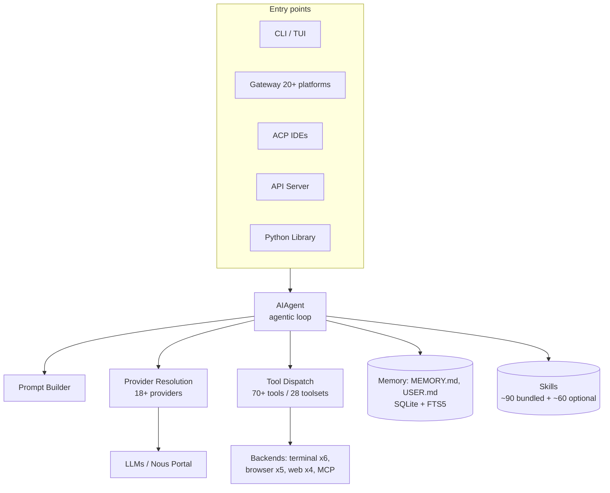

### 1.6 Internal flows (CLI session)

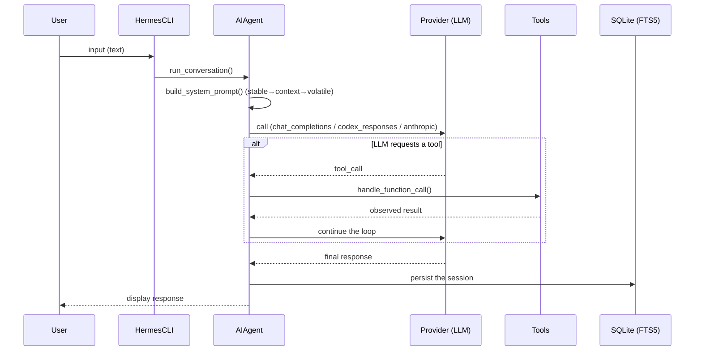

### 1.7 Component diagram (core)

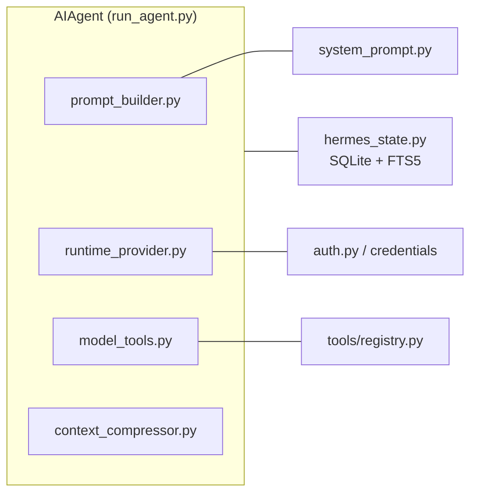

### 1.8 Complete example

**Scenario.** A developer wants an assistant that runs on a VPS and, over time, learns the team's conventions.

**Problem.** Common tools forget everything between sessions and don't accumulate team knowledge.

**Solution.** Install Hermes on the VPS, connect to Nous Portal, and use it via CLI; let it record preferences in memory and create Skills.

**Architecture.** CLI → AIAgent → Nous Portal (model + Tool Gateway) → local memory/Skills on the VPS.

**Implementation (installation and setup):**

```bash
# Linux / macOS / WSL2 / Termux
curl -fsSL https://hermes-agent.nousresearch.com/install.sh | bash

# One OAuth covers a model + the 4 Tool Gateway tools
# (web search, image generation, TTS, browser)
hermes setup --portal

# Start the conversation
hermes
```

**Configuration (`~/.hermes/config.yaml`, excerpt):**

```yaml
provider: nous-portal
model: hermes-4-70b
memory:
  enabled: true        # MEMORY.md + USER.md + SQLite/FTS5
skills:
  enabled: true        # learning and Skill creation
```

**Tests.** Verify the installation and configuration:

```bash
hermes --version          # should indicate v0.16.x (June 2026 line)
hermes doctor             # environment and provider diagnostics
```

**Result.** A persistent agent on the VPS, accessible via CLI (and later via Telegram through the gateway), that remembers preferences and accumulates team Skills.

**Future improvements.** Connect the messaging gateway (Part IX), add an external memory provider such as Honcho (Part V), and expose the agent to the team with authorization (Part XII).

### 1.9 Real-world use cases

An engineering assistant that learns the codebase; a research bot that delivers daily briefings on Telegram; an automated Pull Request reviewer; a scheduled-task (cron) operator that generates reports; a multi-platform corporate automation desk. The official documentation includes ready-made guides (Daily Briefing Bot, GitHub PR Review Agent, Team Telegram Assistant).

### 1.10 Exercises

1. List the five Hermes entry points and say which you would use for a team bot.
2. Explain the difference between **declarative** and **procedural** memory in Hermes.
3. Define, in your own words, what the learning loop is.

### 1.11 Challenges

- **Challenge 1.** Install Hermes locally (or on a VPS), run `hermes setup --portal`, and have your first conversation.
- **Challenge 2.** Argue, to a manager, why "memory that persists + Skills that evolve" is a competitive differentiator over a traditional chatbot.

### 1.12 Checklist

- [ ] I know Hermes is an autonomous terminal-native agent, not a chatbot/copilot.
- [ ] I know the four foundations (agentic loop, dual memory, learning loop, loose coupling).
- [ ] I understand it is provider- and platform-agnostic.
- [ ] I installed and started the agent.

### 1.13 Best practices

- Start with **Nous Portal** (`hermes setup --portal`): one OAuth resolves model + web tools and reduces initial friction.
- Treat `MEMORY.md`/`USER.md` and Skills as **versionable team assets** from the start.
- Run the agent where it should live (VPS/serverless), not tied to your laptop.

### 1.14 Anti-patterns

- Using Hermes as an ephemeral chatbot, ignoring memory and Skills — wasting its main differentiator.
- Hardcoding keys in a versioned `config.yaml` — use the credential flow (Part XII).
- Exposing the agent in messaging without authorization/allowlist (Part XII) — risk of unauthorized access.

### 1.15 Troubleshooting

| Symptom | Likely cause | Action |
|---------|--------------|--------|
| `hermes: command not found` | PATH not updated after install | Reopen the shell or follow the Installation Guide |
| No model available | Provider not configured | Run `hermes setup --portal` or configure a provider |
| Agent "remembers" nothing | Memory disabled | Enable `memory.enabled` in the config |
| Intermittent provider errors | No fallback | Configure fallback providers (Part IV) |

### 1.16 Official references

- Documentation: https://hermes-agent.nousresearch.com/docs/
- Features overview: https://hermes-agent.nousresearch.com/docs/user-guide/features/overview
- Architecture: https://hermes-agent.nousresearch.com/docs/developer-guide/architecture
- Repository (MIT): https://github.com/NousResearch/hermes-agent
- Nous Portal: https://hermes-agent.nousresearch.com/docs/integrations/nous-portal

---

## Chapter 2 — History and evolution of the project

### 2.1 Introduction

Hermes Agent is a fast-moving **0.x** project: dozens of releases in 2026, with deep structural refactors in just a few weeks. Understanding this trajectory is indispensable for an architect, because recent version decisions (CLI rewrite, core modularization, desktop app) change **how** you install, operate, and extend the tool. This chapter traces the timeline up to **v0.16 (June 2026)** and details the recent versions' news.

### 2.2 Chapter objectives

(1) Situate Hermes within Nous Research's history; (2) understand the dual versioning scheme (`v0.x.y` + date `vYYYY.M.D`); (3) know the last six relevant releases and their impacts; (4) know how to read and apply the "What's New in This Version" sections.

### 2.3 Business context

Adopting a **pre-1.0** project requires risk awareness: APIs and formats may change between minors. The counterpoint is innovation speed — Hermes incorporated a desktop app, a modern TUI, and modularization in weeks. For enterprises, the recommendation is to **pin the version** and update in a controlled way, following the release notes.

### 2.4 Foundations: versioning

The project uses **two identifiers in parallel**: an informal semver `v0.x.y` (e.g., `v0.16.0`) and a date stamp `vYYYY.M.D` (e.g., `v2026.6.5`). Releases receive thematic names ("The Interface Release," "Velocity," "Surface"), in the manner of large open-source projects.

### 2.5 Timeline

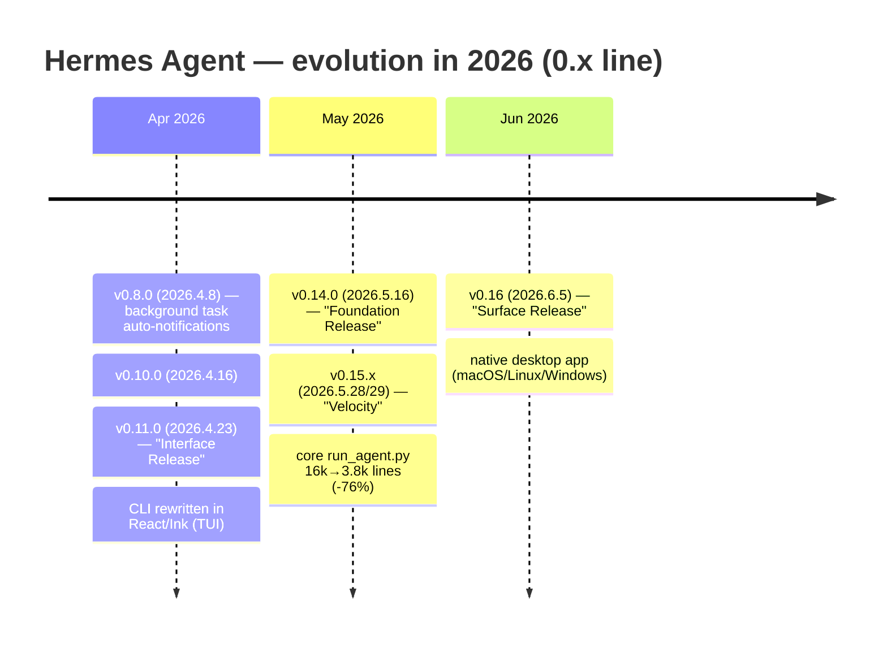

Nous Research context: a lab known for open models (Hermes, Nomos) and research into distributed training (Psyche). Hermes Agent is the applied materialization of that research: an agent built "by people who train models," focused on memory, learning, and trajectory generation for RL (integration with Atropos).

### 2.6 What's New — v0.11.0 "Interface Release" (Apr 23, 2026)

- **What changed:** a complete rewrite of the interactive CLI in **React/Ink**, giving rise to the modern TUI (mouse, rich overlays, non-blocking input).
- **Architecture impact:** clear separation between the agent core and the terminal presentation layer; the TUI becomes extensible.
- **Impact for developers:** new keybindings and the ability to build wrapper CLIs with custom widgets (see "Extending the CLI").
- **Impact for enterprises:** better operational ergonomics for teams using the agent in the terminal.
- **Migration:** scripts that depended on details of the old CLI may need adjustment; the command interface was preserved.
- **Best practices:** adopt the TUI; standardize shortcuts across the team.

### 2.7 What's New — v0.14.0 "Foundation Release" (May 16) and v0.15.x "Velocity" (May 28–29)

- **What changed:** foundation consolidation and a massive refactor — the `run_agent.py` monolith (16,083 lines) was reduced to **3,821 lines (-76%)**, distributed across **14 cohesive modules** in `agent/` (prompt_builder, context_compressor, memory_manager, etc.).
- **Architecture impact:** a modular core with isolated responsibilities (prompt, compression, memory, providers) — the basis for sustainable evolution.
- **Impact for developers:** a much more navigable codebase; contributing and extending became easier (hundreds of contributors in the cycle).
- **Impact for enterprises:** greater reliability and fix speed; less regression risk in a giant file.
- **Migration:** normal usage doesn't break; integrations that imported internal symbols from `run_agent.py` should migrate to the new modules.
- **Best practices:** depend on public APIs (CLI, config, the `AIAgent` Python library), not internals.

### 2.8 What's New — v0.16 "Surface Release" (Jun 5, 2026) — current version

- **What changed:** the launch of the **native desktop app** (built across ~100 PRs) with one-click install, drag-and-drop of files, and macOS/Linux/Windows support; "Hermes meets you wherever you work" (surfaces: terminal, desktop, messaging, IDE).
- **Architecture impact:** the desktop is one more *surface* over the same `AIAgent` core; it reinforces the "platform-agnostic core" principle.
- **Impact for developers:** simplified installation (desktop installer in addition to `curl`); a smoother onboarding flow.
- **Impact for enterprises:** easier distribution for non-technical users; a path toward an admin panel and assisted operation.
- **Migration:** CLI-only users need to change nothing; the desktop is optional and coexists with the command-line install.
- **Best practices:** for end users, distribute via the desktop app; for servers/automation, keep the CLI/headless.

### 2.9 Architecture: what the evolution reveals

The trajectory shows a clear intent: **a stable, modular `AIAgent` core**, surrounded by **multiple surfaces** (CLI/TUI, desktop, gateway, ACP, API) and **pluggable subsystems** (memory, Skills, MCP, backends). It is the opposite of a coupled monolith — and explains why the project can iterate so fast without breaking the core.

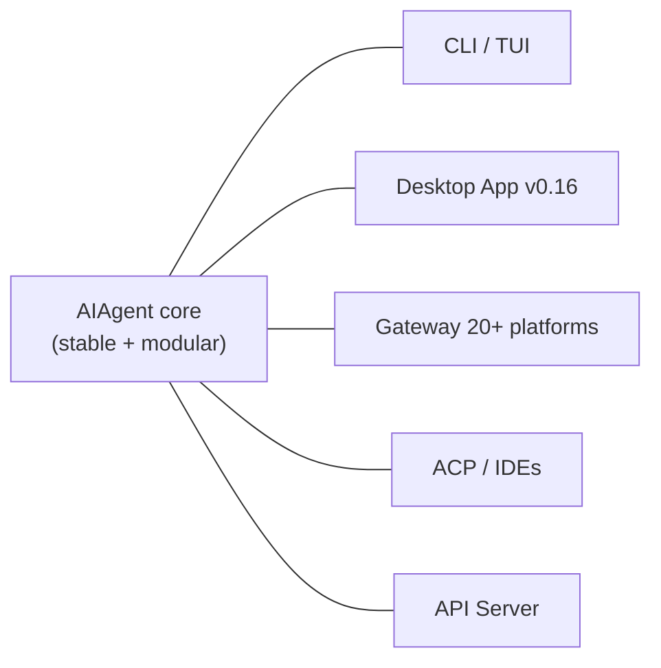

### 2.10 Complete example

**Scenario.** A team wants to standardize the Hermes version in production and plan updates.

**Problem.** A 0.x project changes fast; updating blindly can break automations.

**Solution.** Pin the version, follow the release notes, and update in staging first.

**Implementation:**

```bash
# Check the current version and update in a controlled way
hermes --version
hermes update --check          # see what would change
# In staging, update and validate; only then in production
hermes update
```

**Tests.** After updating in staging, run the critical automation suite and `hermes doctor`.

**Result.** Predictable updates, aligned with the release notes, with no production surprises.

**Future improvements.** Integrate the version check into CI/AgentOps (Part XI) and keep an internal changelog of each upgrade's impact.

### 2.11 Real-world use cases

Teams that follow releases to adopt early features such as the TUI (v0.11), the modular core (v0.15), and the desktop (v0.16); researchers who use trajectory export to train models with Atropos.

### 2.12 Exercises

1. Explain Hermes's dual versioning scheme.
2. For each of the last three releases, cite one impact for enterprises.

### 2.13 Challenges

- **Challenge.** Write a production update runbook for Hermes on a VPS, with a staging step and rollback.

### 2.14 Checklist

- [ ] I understand it is a fast-moving 0.x project.
- [ ] I know what changed in v0.11, v0.14/0.15, and v0.16.
- [ ] I can pin a version and update in a controlled way.

### 2.15 Best practices

- **Pin** the version in production; use `latest` only in disposable environments.
- Read the release notes on every update; the pace is weekly.
- Depend on public APIs, not `run_agent.py` internals.

### 2.16 Anti-patterns

- Updating production directly without staging.
- Building integrations on top of internal symbols that moved during modularization.
- Ignoring the 0.x nature and assuming 1.x stability.

### 2.17 Troubleshooting

| Symptom | Cause | Action |
|---------|-------|--------|
| Breakage after update | Change between 0.x minors | Revert to the pinned version; read release notes |
| Internal import fails | Symbol moved during modularization | Migrate to the new module in `agent/` |
| Desktop won't install | Platform/permission | Use the official installer; check the supported OS |

### 2.18 Official references

- Releases (GitHub): https://github.com/NousResearch/hermes-agent/releases
- Changelog: https://www.hermes-ai.net/changelog/
- Updating: https://hermes-agent.nousresearch.com/docs/getting-started/updating
- Nous Research: https://nousresearch.com

---

## Chapter 3 — The philosophy of Nous Research

### 3.1 Introduction

Hermes Agent cannot be understood outside the philosophy of **Nous Research**, the lab that created it. Nous is known for a specific stance on AI: **openness, user sovereignty, alignment neutrality, and decentralization**. These convictions are not marketing — they translate into concrete technical decisions in the agent (MIT license, provider agnosticism, user-side data/memory, trajectory generation for training). This chapter connects principles to engineering.

### 3.2 Chapter objectives

(1) Understand Nous Research's values; (2) map each value to Hermes's design choices; (3) understand why this philosophy matters for enterprises (control, lock-in, privacy); (4) situate Hermes within the Nous ecosystem (Hermes/Nomos models, the Psyche network, the Atropos RL framework).

### 3.3 Business context

For a company, the philosophy behind an AI tool has practical effects: **who controls the data? is there provider lock-in? is it auditable?** Nous's bet on openness and sovereignty answers these questions in the adopter's favor: open source (auditable), self-hosted execution (data inside your perimeter), and provider agnosticism (no lock-in). In regulated sectors, this is often the factor that enables adoption.

### 3.4 Foundations: the philosophical pillars

- **Open and accelerated AI.** Nous publishes open-weight models (the **Hermes** line) and open-source tools. Hermes Agent follows suit: **MIT license**, code on GitHub, public documentation, and an open Skills format (compatible with agentskills.io).
- **User sovereignty.** The user should control their agent, their data, and their infrastructure. Hence terminal-native, self-hostable execution, with memory and Skills **on the user side** (`~/.hermes/`).
- **Neutrality and steerability.** Hermes models are known to be steerable and neutrally aligned — behavior control stays with the user (in the agent, via `SOUL.md`, personalities, and context files).
- **Decentralization.** Nous's research in distributed training (the **Psyche** network) reflects a belief in distributed, not concentrated, AI infrastructure. The agent echoes this by running "anywhere" (local, VPS, serverless) and being cloud/provider-agnostic.
- **Applied research.** "Built by people who train models": the agent generates **trajectories** (ShareGPT format) for RL (the **Atropos** framework), closing the research→product→research loop.

### 3.5 Architecture: philosophy → engineering

```mermaid
flowchart LR
    subgraph values["Nous values"]
        v1[Openness]
        v2[User sovereignty]
        v3[Neutrality/steerability]
        v4[Decentralization]
        v5[Applied research]
    end
    v1 --> d1[MIT license + public docs + open Skills]
    v2 --> d2[Self-hosted + data in ~/.hermes]
    v3 --> d3[SOUL.md + personalities + context files]
    v4 --> d4[Runs on any backend; provider-agnostic]
    v5 --> d5[Trajectories for RL (Atropos)]
```

### 3.6 Internal flows: where sovereignty shows up

All memory and Skills live locally under `~/.hermes/` (with a `HERMES_HOME` configurable per profile). No data needs to pass through a closed SaaS — the inference provider is the user's choice and can be a local endpoint.

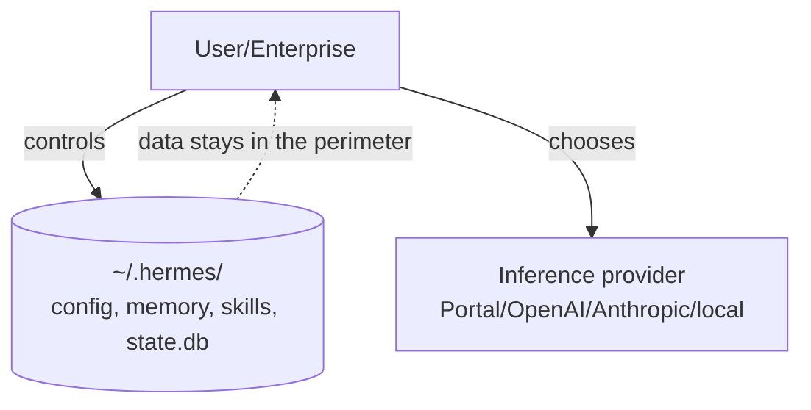

### 3.7 Complete example

**Scenario.** A financial institution requires that no conversation data leave its data center.

**Problem.** Closed AI SaaS route data through third-party servers — unfeasible for compliance.

**Solution.** Self-hosted Hermes pointing to a **local** model (OpenAI-compatible endpoint), with memory and Skills inside the perimeter.

**Architecture.** Hermes (on-prem) → local LLM (e.g., vLLM/Ollama) → `~/.hermes` on a controlled volume.

**Implementation (config for a local endpoint):**

```yaml
# ~/.hermes/config.yaml — local provider, data in the perimeter
provider: openai-compatible
base_url: http://llm.internal:8000/v1
model: hermes-4-70b
api_key_env: HERMES_LOCAL_KEY
memory:
  enabled: true
```

**Tests.** Confirm that no call leaves the perimeter (network inspection) and that memory persists locally.

**Result.** A fully functional agent under total data sovereignty — aligned with the Nous philosophy and compliance.

**Future improvements.** Add a fallback to a second local model and access auditing (Part XII/XIII).

### 3.8 Real-world use cases

Organizations that require on-prem for regulation; researchers who value open weights and trajectory generation; teams that reject provider lock-in and want to switch models without rewriting the automation.

### 3.9 Exercises

1. Associate each Nous philosophical pillar with a Hermes technical decision.
2. Explain why "provider agnosticism" reduces corporate risk.

### 3.10 Challenges

- **Challenge.** Build an on-prem scenario (as a diagram) that satisfies a "no data leaves the perimeter" policy, indicating provider, memory, and auditing.

### 3.11 Checklist

- [ ] I know the five Nous philosophical pillars.
- [ ] I can map philosophy → engineering in Hermes.
- [ ] I understand the impact on compliance and lock-in.

### 3.12 Best practices

- Leverage sovereignty: keep memory/Skills under team control and backup.
- Use provider agnosticism for fallback and cost optimization.
- Standardize behavior with `SOUL.md`/personalities instead of forks.

### 3.13 Anti-patterns

- Reintroducing lock-in by depending on a single provider without fallback.
- Treating memory/Skills as disposable, losing the knowledge asset.
- Ignoring the auditability that open source enables.

### 3.14 Troubleshooting

| Symptom | Cause | Action |
|---------|-------|--------|
| Compliance concern | External provider in use | Migrate to a local/on-prem endpoint |
| Inconsistent behavior | Missing `SOUL.md`/persona | Define a global personality |
| Lock-in worry | Config tied to one provider | Configure fallback providers |

### 3.15 Official references

- Nous Research: https://nousresearch.com
- Design Principles (architecture): https://hermes-agent.nousresearch.com/docs/developer-guide/architecture
- Personality & SOUL.md: https://hermes-agent.nousresearch.com/docs/user-guide/features/personality
- Trajectories/training: https://hermes-agent.nousresearch.com/docs/developer-guide/trajectory-format

---

## Chapter 4 — The concept of self-evolving agents

### 4.1 Introduction

Hermes's most cited differentiator is being **self-improving**. But what does that mean technically? It is not "the model retrains itself." It is something more pragmatic and powerful: the agent **accumulates and improves procedural knowledge (Skills) and declarative knowledge (memory) over the course of use**, via an explicit learning loop and a background maintenance process (the **Curator**). This chapter dissects that mechanism — the conceptual heart of the book.

### 4.2 Chapter objectives

(1) Define a self-evolving agent in the Hermes context; (2) understand the learning loop (task completion → pattern extraction → Skill creation/refinement → periodic nudge); (3) understand the role of the **Curator** (usage, staleness, archival, LLM review); (4) distinguish self-learning from fine-tuning.

### 4.3 Business context

An agent that improves with use transforms the **value curve** over time: instead of constant (or degrading) capability, capability **grows**. For the company, this means each executed task potentially reduces the cost of the next — operational knowledge becomes a cumulative asset, not discarded effort. It is the difference between "renting intelligence per session" and "building an intelligence asset."

### 4.4 Theoretical foundations

Hermes's self-learning operates in **three layers** that do **not** involve altering the model's weights:

1. **Curated declarative memory** — the agent records relevant facts (preferences, projects, environment) in `MEMORY.md`/`USER.md`, and indexes all sessions in SQLite/FTS5 for later retrieval. Periodic nudges remind the agent to persist what matters.
2. **Skills (procedural memory)** — upon detecting a repeatable pattern, the agent **creates a Skill** (an on-demand knowledge document with progressive disclosure) and **refines it during use**. Every ~15 tasks, it evaluates its own performance.
3. **Curation (Curator)** — background maintenance of created Skills: it tracks usage, detects staleness, archives what no longer serves, and performs LLM-driven review. It prevents the "bloat" of bad Skills.

> **Crucial distinction.** This is *context/artifact-level learning*, not fine-tuning. The LLM's weights do not change; what changes is the **body of knowledge** (memory + Skills) the agent carries and applies. That is why it works with any provider.

### 4.5 Architecture of the learning loop

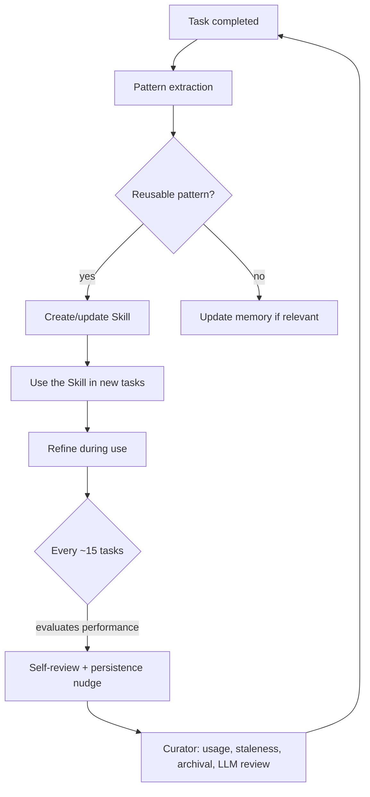

### 4.6 Internal flows: creating a Skill (sequence)

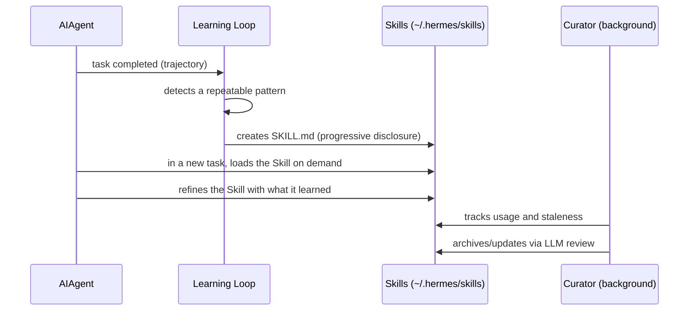

### 4.7 Component diagram (learning subsystem)

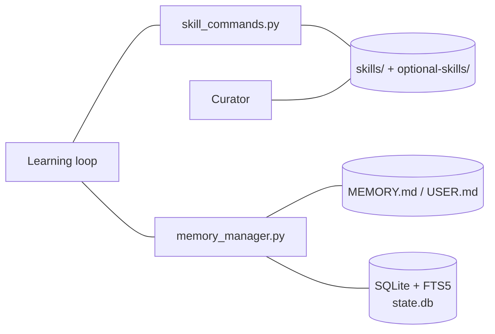

### 4.8 Complete example

**Scenario.** An agent repeats, across several tasks, the same deployment procedure for an internal application.

**Problem.** Without learning, it "rediscovers" the procedure each time, spending tokens and time, with the risk of variation.

**Solution.** Let the learning loop extract the pattern and materialize it as a reusable Skill.

**Architecture.** Trajectories → learning loop → `SKILL.md` in `~/.hermes/skills/deploy-internal-app/` → reuse + Curator.

**Implementation (`SKILL.md` format, with progressive disclosure):**

```markdown
---
name: deploy-internal-app
description: Deployment procedure for internal app X (build, tests, publish).
version: 1
---

## Overview
Steps to safely deploy internal app X.

## Steps
1. Run tests: `make test`
2. Build: `make build`
3. Publish: `make deploy ENV=staging` and validate before `ENV=prod`

## Details (loaded on demand)
- Rollback: `make rollback ENV=prod`
- Required variables: APP_TOKEN, REGISTRY_URL
```

**Configuration (enable Skills and Curator):**

```yaml
skills:
  enabled: true
  curator:
    enabled: true     # background maintenance (usage/staleness/review)
```

**Tests.** After a few runs, verify the Skill was created and is loaded (the `/skills` slash command), and that the Curator records usage.

**Result.** The procedure becomes reusable, self-maintained knowledge; subsequent tasks are faster and more consistent.

**Future improvements.** Publish the Skill to the corporate library (Part VI) and share it via the Skills Hub (the open agentskills.io format).

### 4.9 Real-world use cases

Accumulation of engineering procedures (deploys, runbooks); progressive user modeling (style preferences, stack); bots that get better at a recurring task (triage, reports) each week.

### 4.10 Exercises

1. Explain why Hermes's self-learning is **not** fine-tuning.
2. Describe the learning loop cycle in five steps.
3. What is the Curator's role and why is it necessary?

### 4.11 Challenges

- **Challenge.** Design a Skill (`SKILL.md`) for a repetitive procedure on your team, using progressive disclosure (overview + details on demand).

### 4.12 Checklist

- [ ] I can define "self-evolving agent" in the Hermes context.
- [ ] I understand the three layers (memory, Skills, Curator).
- [ ] I distinguish self-learning from fine-tuning.
- [ ] I know the nudge trigger (~15 tasks).

### 4.13 Best practices

- Keep the learning loop and Curator active; periodically review generated Skills.
- Version team Skills (git) and treat them as code.
- Use progressive disclosure to save tokens (detail on demand).

### 4.14 Anti-patterns

- Disabling the Curator and letting stale Skills accumulate ("skill rot").
- Creating giant, monolithic Skills (anti progressive disclosure).
- Blindly trusting generated Skills without human review in critical domains.

### 4.15 Troubleshooting

| Symptom | Cause | Action |
|---------|-------|--------|
| Skills aren't created | Skills/learning disabled | Enable `skills.enabled` |
| Many irrelevant Skills | Curator off | Enable the Curator; review/archive |
| Agent "forgets" preferences | Memory not persisted | Reinforce nudges/`MEMORY.md` |
| High token cost per Skill | No progressive disclosure | Rewrite the Skill in layers |

### 4.16 Official references

- Skills System: https://hermes-agent.nousresearch.com/docs/user-guide/features/skills
- Curator: https://hermes-agent.nousresearch.com/docs/user-guide/features/curator
- Memory: https://hermes-agent.nousresearch.com/docs/user-guide/features/memory
- Creating Skills: https://hermes-agent.nousresearch.com/docs/developer-guide/creating-skills

---

## Chapter 5 — How Hermes differs from ChatGPT, Claude, Gemini, OpenHands, AutoGPT, and Manus

### 5.1 Introduction

"Why not just use ChatGPT?" is every manager's first question. Answering it well requires separating product **categories**: *chatbots/assistants* (ChatGPT, Claude, Gemini), *engineering agents* (OpenHands), *pioneer autonomous agents* (AutoGPT), and *generalist agents* (Manus). Hermes occupies its own space — an **autonomous, terminal-native, self-improving, provider-agnostic, multi-platform agent**. This chapter compares fairly, acknowledging each one's strengths.

### 5.2 Chapter objectives

(1) Correctly classify each competitor; (2) identify the comparison axes that matter (memory, self-learning, autonomy, lock-in, platforms, control); (3) know when Hermes is the best choice — and when it is not.

### 5.3 Business context

Choosing the wrong category breeds frustration: using a chatbot for continuous automation, or an autonomous agent for a one-off question. Hermes's value appears in **continuous automation, with memory and evolution, under infrastructure control** — not in replacing a quick conversation in ChatGPT.

### 5.4 Foundations: the comparison axes

- **Persistent memory across sessions** (curated and searchable).
- **Self-learning** (created/refined Skills + Curator).
- **Execution autonomy** (running long tasks on remote backends).
- **Provider agnosticism** (no model lock-in).
- **Multi-platform** (CLI, 20+ messengers, IDE, API, desktop).
- **Control/sovereignty** (self-hosted, open source, data in the perimeter).

### 5.5 Comparison (an honest view)

| Solution | Category | Strengths | Limits for continuous automation |
|----------|----------|-----------|----------------------------------|
| **Hermes Agent** | Self-improving autonomous agent | Evolving memory + Skills, multi-platform, provider-agnostic, self-hosted, MIT | 0.x project (changes fast); technical curve (terminal) |
| **ChatGPT** | Assistant/chatbot (+ agent features) | Excellent UX, strong models, ecosystem | Limited/closed memory; provider lock-in; less sovereignty |
| **Claude** (app) | Premium assistant/chatbot | Strong reasoning, great at code and text | Not a self-hosted autonomous agent; no own learning loop |
| **Gemini** | Google multimodal assistant | Multimodality, Google integration | Closed ecosystem; lock-in; little sovereignty |
| **OpenHands** | Open-source engineering agent | Strong at code/autonomous dev tasks, open source | Coding-focused; less emphasis on curated memory/evolving Skills and messaging multi-platform |
| **AutoGPT** | Pioneer autonomous agent (open) | Pioneered the "autonomous agent" concept | Older generation; reliability/loops; less mature in curated memory/Skills |
| **Manus** | Generalist agent (product) | Good generalist autonomy, product UX | Closed/SaaS; less control of infrastructure and data |

> **A fair reading.** ChatGPT, Claude, and Gemini are, today, often superior as **conversational assistants** and in raw model quality; OpenHands is a reference as an open-source **engineering agent**; AutoGPT was seminal; Manus offers good autonomy as a **closed product**. Hermes does not try to win "at chat": it wins as a **persistent autonomous agent that learns, runs anywhere, and doesn't lock you into a provider**.

### 5.6 Architecture: what only Hermes combines

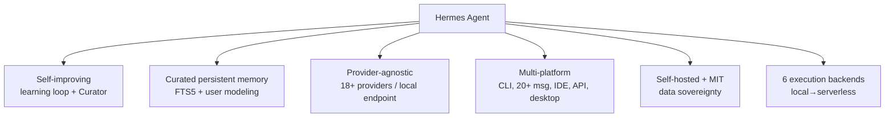

The thesis is not that each item is exclusive, but that **the combination of the six** in an open-source, terminal-native product is Hermes's niche.

### 5.7 Internal flows: when to choose what (decision)

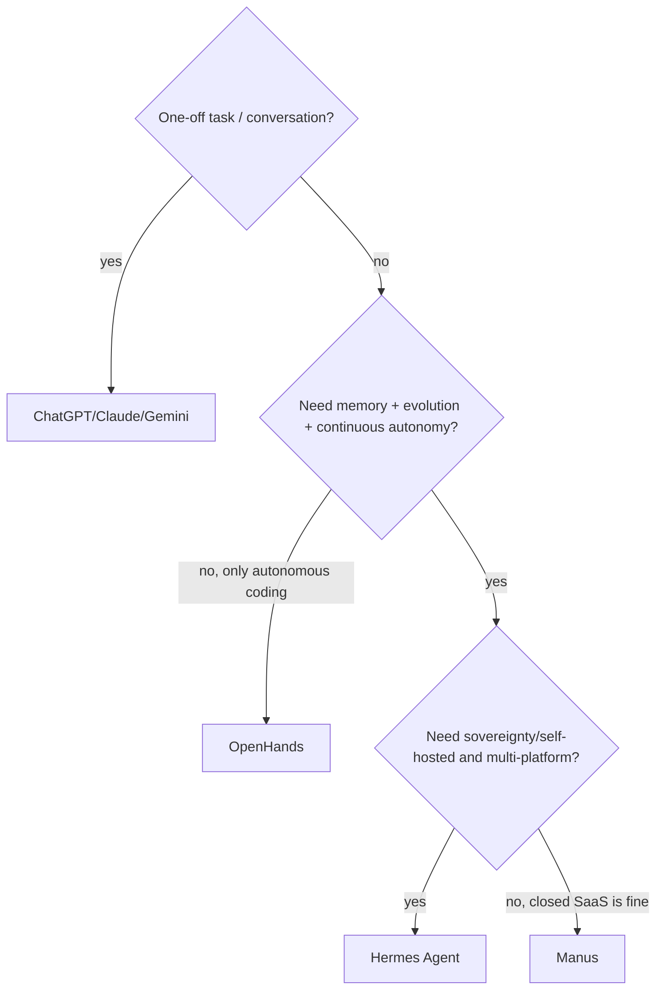

### 5.8 Complete example

**Scenario.** A company wants a "digital colleague" that lives in the team's Telegram, remembers decisions, executes tasks on a server, and improves over time, without sending data to a closed SaaS.

**Problem.** ChatGPT/Claude/Gemini don't run self-hosted with curated memory and multi-platform; Manus is closed.

**Solution.** Hermes on the company server, gateway on Telegram, a model via Portal or its own endpoint, with local memory/Skills.

**Architecture.** Telegram → Gateway → AIAgent → chosen provider → on-prem memory/Skills.

**Implementation (summary):**

```bash
hermes setup --portal              # or configure your own endpoint
hermes gateway start --platform telegram
```

**Tests.** Validate authorization (allowlist), memory persistence across sessions, and Skill creation.

**Result.** A team agent — persistent, evolving, and under control — exactly the gap competitors don't fill together.

**Future improvements.** Multi-agents to specialize (Part VIII) and cost/usage observability (Part XIII).

### 5.9 Real-world use cases

Teams that already use ChatGPT for brainstorming and adopt Hermes for **continuous automation and organizational memory**; regulated companies that cannot use closed SaaS; squads that want to switch models freely based on cost/quality.

### 5.10 Exercises

1. Classify each competitor into its correct category.
2. Cite two situations where you should **not** use Hermes (and what to use instead).

### 5.11 Challenges

- **Challenge.** Build a decision matrix (the axes of section 5.4) scoring Hermes and two competitors for a real case at your company.

### 5.12 Checklist

- [ ] I can separate chatbot, engineering agent, and autonomous agent.
- [ ] I know the six comparison axes.
- [ ] I know when Hermes is (and is not) the best choice.

### 5.13 Best practices

- Use the right tool per category: chat for conversation, Hermes for continuous/sovereign automation.
- Combine: nothing stops you from using ChatGPT/Claude as **providers** for Hermes.
- Decide by an axis matrix, not by hype.

### 5.14 Anti-patterns

- Using Hermes as a substitute for a quick question (overkill).
- Using a closed chatbot where compliance requires sovereignty.
- Comparing "model quality" while ignoring memory/autonomy/lock-in.

### 5.15 Troubleshooting

| Symptom | Cause | Action |
|---------|-------|--------|
| "Why not just ChatGPT?" | Category confusion | Show the memory/autonomy/sovereignty axes |
| Subpar result in pure chat | Wrong expectation | Use a stronger model as provider; focus on agentic use |
| Adoption uncertainty | No matrix | Apply the decision matrix from section 5.11 |

### 5.16 Official references

- Features Overview: https://hermes-agent.nousresearch.com/docs/user-guide/features/overview
- Providers: https://hermes-agent.nousresearch.com/docs/integrations/providers
- User Stories & Use Cases: https://hermes-agent.nousresearch.com/docs/user-stories
- Repository (MIT): https://github.com/NousResearch/hermes-agent

---

> **End of Part I.** We established what Hermes Agent is, its history up to v0.16, the philosophy of Nous Research, the concept of a self-evolving agent, and its positioning against competitors. **Part II — Internal Architecture** (Chapters 6–13) opens the hood: general architecture, internal components, the agent lifecycle, and the memory, learning, Skills, planning, and execution subsystems.

<!--APPEND-PARTE-II-->
