# n8n - Complete Professional Guide

> **Category:** 13_automation_and_integration · **Language:** English

---

### Workflow Automation, Enterprise Integrations, and Generative AI in Production
**Edition updated for n8n 2.x (June 2026)**

> **Reference book (English).** A definitive guide for professionals, architects, and enterprises, covering everything from beginner to enterprise level. Based primarily on the official documentation (https://docs.n8n.io), the release notes (https://docs.n8n.io/release-notes/), and the official repository (https://github.com/n8n-io/n8n).
>
> **Version notice:** the content reflects the **2.x** line, whose milestone was n8n **2.0** (beta on 2025-12-08, stable on 2025-12-15), with near-weekly patches through June 2026. Relevant changes between versions appear in **"What's New in This Version"** sections.

---

## How to read this book

The book progresses through five maturity levels:

| Level | Profile | Parts |
|-------|---------|-------|
| 1 — Beginner | First contact with n8n | Part I |
| 2 — Intermediate | Building workflows and integrations | Parts II–IV |
| 3 — Advanced | Generative AI, agents, professional development | Parts V–VI |
| 4 — Specialist | Security, observability, scalability | Part VII |
| 5 — Enterprise | End-to-end real projects | Part VIII |

**Target audience:** Java and full-stack developers, data engineers, software engineers, solutions architects, AI engineers, DevOps professionals, tech leads, CTOs, and automation consultants.

**Structure of each chapter:** Introduction · Business context · Theoretical concepts · Architecture · Diagrams (Mermaid) · Real examples · Step by step · Complete code · Complete n8n workflows · Exercises · Challenges · Checklist · Best practices · Anti-patterns · Troubleshooting · Official references.

**Example format:** Scenario · Problem · Solution · Implementation · Result · Future improvements.

---

## Table of Contents

**Part I – n8n Fundamentals**
1. What is n8n
2. History and evolution
3. Internal architecture
4. Core concepts
5. Real-world use cases

**Part II – Installation and Environments**
6. Docker · 7. Docker Compose · 8. Kubernetes · 9. AWS · 10. Azure · 11. GCP · 12. Self-Hosted · 13. Cloud

**Part III – Building Workflows**
14. Nodes · 15. Triggers · 16. Expressions · 17. Variables · 18. Data Mapping · 19. Error Handling · 20. Debugging

**Part IV – Integrations**
21. REST APIs · 22. GraphQL · 23. Webhooks · 24. Databases · 25. Kafka · 26. RabbitMQ · 27. Redis · 28. AWS Services · 29. Google Services · 30. Microsoft Services

**Part V – Generative AI and Agents**
31. OpenAI · 32. Claude · 33. Gemini · 34. MCP · 35. RAG · 36. Vectors · 37. LangChain · 38. AI Agents · 39. Multi-Agents · 40. Enterprise AI Workflows

**Part VI – Professional Development**
41. Git · 42. Versioning · 43. Environments · 44. Testing · 45. CI/CD · 46. Deployment

**Part VII – Enterprise**
47. Security · 48. SSO · 49. Governance · 50. Observability · 51. Scalability · 52. High Availability · 53. Multi-Tenant

**Part VIII – Real Projects**
P1. Financial Automation · P2. AI-Powered Support · P3. Data Pipeline · P4. Intelligent CRM · P5. Automated SaaS Platform · P6. Corporate Agent

> **Status of this edition:** phased delivery (each part keeps the same depth standard). **Ready:** Part I (Ch. 1–5). **In progress:** Parts II–VIII.

---

## Part I – n8n Fundamentals

Part I establishes the conceptual foundation for everything that follows. Even seasoned integration professionals should read it, because n8n 2.x introduced mental-model shifts (secure-by-default execution, the Publish/Save paradigm, task runners) that invalidate part of the knowledge accumulated on the 1.x line.

---

## Chapter 1 — What is n8n

### 1.1 Introduction

n8n (pronounced "n-eight-n," from *nodemation* — *node* + *automation*) is an open-source **workflow automation** platform (fair-code license, under the Sustainable Use License) that lets you connect applications, APIs, databases, and AI models through a visual node-based editor, with the option to drop down to code whenever needed.

The phrase that best defines it is the project's own: **"technical automation without limits."** Unlike pure no-code tools, n8n is deliberately *low-code/pro-code*: the visual path covers 90% of cases, but the **Code** node (JavaScript or Python), expressions, and the ability to build custom nodes in TypeScript give developers the full control that tools like Zapier and Make do not offer.

For this book's audience — developers, engineers, and architects — the core value proposition is: **you don't trade power for speed.** You gain orchestration speed while keeping programming power.

### 1.2 Business context

Every modern company is, in practice, a set of systems that need to talk to each other: CRM, ERP, payment gateways, email, databases, message queues, AI providers. Historically, integrating these systems meant writing and maintaining dozens of "glue code" microservices — expensive to build, fragile, and invisible to the business.

n8n addresses three concrete enterprise pains:

- **Integration cost:** reduces weeks of glue-code development to hours of workflow assembly, with more than 1,000 ready-made integrations.
- **Data sovereignty and cost (self-hosting):** being self-hostable, it keeps sensitive data inside the company perimeter — a decisive factor for regulated industries (finance, healthcare, government) and for LGPD/GDPR compliance. This differentiates it from closed SaaS that require routing data through third-party servers.
- **Time-to-market for AI automations:** n8n positioned itself aggressively as an **AI automation** platform, natively integrating LangChain, agents, and RAG, which drastically shortens the prototype-to-production cycle for generative AI solutions.

> **Typical scenario:** a fintech needs every transaction above R$ 50k to trigger a fraud check (external API call), a database record, a notification to the risk team on Slack, and a CRM update. In traditional code, that's four integrations with error handling and retries. In n8n, it's a single versionable, observable, and auditable workflow.

### 1.3 Theoretical concepts

n8n materializes the **Pipes and Filters** architectural pattern combined with **Event-Driven Architecture**. A workflow is a **directed acyclic graph (DAG)** of nodes, where:

- **Node:** the unit of work. It can be a *trigger* (starts execution), an action (calls an API, writes to a database), a transformation (manipulates data), or logic (conditional, loop, merge).
- **Connection:** the edge that defines the data flow from one node to the next.
- **Item:** n8n processes **lists of items**, not single values. Each node receives an array of items and returns another array. This "data flows as items" model is the single most important concept for anyone coming from imperative programming: a node runs its logic **once for each input item** (unless configured to run only once).
- **Execution:** an instance of running the workflow, with its input data, output, and state, persisted for auditing and replay.

The difference from a traditional job scheduler (cron + scripts) is that n8n treats **data, control flow, credentials, retries, observability, and versioning as first-class citizens** — not as concerns the developer re-implements in every project.

### 1.4 Architecture (introductory view)

At the highest level, n8n has four major logical blocks: the **Editor (UI)**, the **Core/Workflow Engine**, the **Nodes**, and the **Persistence** layer. As of 2.0, code execution was isolated into **Task Runners**. Chapter 3 details each one; here is the panoramic view:


### 1.5 Real example

**Scenario.** An e-commerce business wants to send a personalized welcome email whenever a new order is created in its API.

**Problem.** The team doesn't want to maintain a dedicated microservice just to listen for orders and trigger emails; it needs something versionable and observable that the product team can adjust without a deployment.

**Solution.** An n8n workflow with a webhook trigger (receives the order), a transformation node (builds the content), and an email node.

**Implementation (step by step).**

1. Add a **Webhook** node (trigger), method `POST`, path `/new-order`.
2. Add an **Edit Fields (Set)** node to build `subject` and `body` from the order data using expressions.
3. Add a **Send Email** (SMTP) node connected to the Set output.
4. Publish the workflow (*Publish*) to activate it in production.

**Code (Set node expression, `body` field):**

```javascript
// n8n expression — interpolates data from the item received by the webhook
Hi {{ $json.body.customer.name }}, we received your order #{{ $json.body.order.id }}
for {{ $json.body.order.total.toLocaleString('en-US', { style: 'currency', currency: 'USD' }) }}.
Thank you for your business!
```

**Complete n8n workflow (importable JSON):**

```json
{
  "name": "Order Welcome",
  "nodes": [
    {
      "parameters": {
        "httpMethod": "POST",
        "path": "new-order",
        "responseMode": "onReceived"
      },
      "id": "f1a2b3c4-0001-0001-0001-000000000001",
      "name": "Webhook",
      "type": "n8n-nodes-base.webhook",
      "typeVersion": 2,
      "position": [260, 300]
    },
    {
      "parameters": {
        "assignments": {
          "assignments": [
            {
              "id": "a1",
              "name": "subject",
              "type": "string",
              "value": "=Order #{{ $json.body.order.id }} confirmed"
            },
            {
              "id": "a2",
              "name": "body",
              "type": "string",
              "value": "=Hi {{ $json.body.customer.name }}, we received your order #{{ $json.body.order.id }}."
            }
          ]
        }
      },
      "id": "f1a2b3c4-0002-0002-0002-000000000002",
      "name": "Edit Fields",
      "type": "n8n-nodes-base.set",
      "typeVersion": 3.4,
      "position": [480, 300]
    },
    {
      "parameters": {
        "fromEmail": "store@company.com",
        "toEmail": "={{ $json.body.customer.email }}",
        "subject": "={{ $json.subject }}",
        "text": "={{ $json.body }}"
      },
      "id": "f1a2b3c4-0003-0003-0003-000000000003",
      "name": "Send Email",
      "type": "n8n-nodes-base.emailSend",
      "typeVersion": 2.1,
      "position": [700, 300],
      "credentials": { "smtp": { "id": "1", "name": "Company SMTP" } }
    }
  ],
  "connections": {
    "Webhook": { "main": [[{ "node": "Edit Fields", "type": "main", "index": 0 }]] },
    "Edit Fields": { "main": [[{ "node": "Send Email", "type": "main", "index": 0 }]] }
  },
  "settings": { "executionOrder": "v1" }
}
```

**Result.** Each `POST` to `/webhook/new-order` triggers a personalized email, with the execution logged (input, output, duration) and visible in the *Executions* tab.

**Future improvements.** Add error handling (Chapter 19), validate the payload with an IF node, and move SMTP credentials to an environment variable. In production, protect the webhook with authentication (Chapter 47).

### 1.6 Exercises

1. Define, in your own words, the difference between *node*, *connection*, *item*, and *execution*.
2. List three scenarios at your company where glue code could be replaced by an n8n workflow.
3. Import the JSON above into a local instance and trigger it with `curl`.

### 1.7 Challenges

- **Challenge 1.** Adapt the workflow to also send a Slack message when the order is above $1,000, using an **IF** node.
- **Challenge 2.** Explain why processing "lists of items" changes how you think about logic compared to a traditional `for` loop in Java.

### 1.8 Checklist

- [ ] I understand n8n is low-code/pro-code, not pure no-code.
- [ ] I grasp the item-oriented data model.
- [ ] I can distinguish n8n from a traditional cron+script.
- [ ] I identified the self-hosting advantage for LGPD/compliance.
- [ ] I imported and ran my first workflow.

### 1.9 Best practices

- Treat workflows as **code**: name nodes descriptively, document with sticky notes, version them (Chapters 41–42).
- Prefer native nodes over raw `HTTP Request` when the integration exists — you get pagination, retries, and authentication handled for free.
- Separate **business logic** (transformations) from **side effects** (external writes) into distinct nodes, easing testing and debugging.

### 1.10 Anti-patterns

- **Monolithic workflow:** a single workflow with 80 nodes doing everything. Prefer sub-workflows (Chapter 4).
- **Hardcoded credentials** in Code nodes or URL fields. Use the credential vault.
- **Critical logic in the Code node when a native node solves it** — it increases bug surface and hinders team maintenance.
- **Ignoring the item model**, treating the array as a single value and breaking in production with multiple items.

### 1.11 Troubleshooting

| Symptom | Likely cause | Action |
|---------|--------------|--------|
| Webhook returns 404 | Workflow not published/active (v2.0: *Save* ≠ *Publish*) | Click **Publish** |
| Node runs N times unexpectedly | Input has N items | Set to "run once" or aggregate first |
| `process.env` undefined in Code node | v2.0 blocks env in Code | Use credentials or workflow static data |
| Email not sent | SMTP credential missing/wrong | Reconfigure the credential and test |

### 1.12 Official references

- Documentation: https://docs.n8n.io
- Node and data concepts: https://docs.n8n.io/data/
- Repository: https://github.com/n8n-io/n8n
- Release notes: https://docs.n8n.io/release-notes/

---

## Chapter 2 — History and evolution

### 2.1 Introduction

Understanding n8n's trajectory is not a historical exercise: it is the key to interpreting **why** the platform made certain architectural decisions and **what to expect** from upcoming versions. This chapter walks the timeline from 2019 to June 2026, focusing on the inflection points that directly affect architects and developers — culminating in the **1.x → 2.0** transition, the most impactful in the project's history.

### 2.2 Business context

n8n was born out of frustration with closed automation SaaS (Zapier, Make) that charged per execution and required trusting data to third parties. The bet on **fair-code + self-hosting** created a market: companies that need automation but cannot (for cost or compliance reasons) outsource their data flow. This proved especially valuable during the **generative AI** wave (2023–2026), when orchestrating LLM calls with proprietary data became a corporate necessity — and doing so within the perimeter became a security requirement.

### 2.3 Timeline (concepts and milestones)

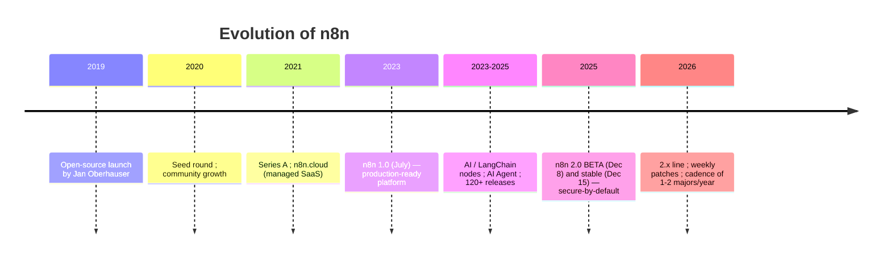

Essential milestones:

- **2019** — Jan Oberhauser publishes n8n as open source. Name: *nodemation*.
- **July 2023 — n8n 1.0:** the platform declares itself *production-ready*. It stabilizes the node API and the execution model.
- **2023–2025** — explosion of AI automation: native **LangChain** and **AI Agent** nodes, integrations with OpenAI/Anthropic/Google, vector stores. n8n repositions itself from an "integration tool" to an **"AI automation platform."**
- **December 2025 — n8n 2.0:** the first major in ~2.5 years. It is not about new features, but about **hardening**: secure-by-default execution, reliability, and performance.
- **2026** — the **2.x** line with near-weekly patches; starting with 2.0, the project adopts a cadence of **1 to 2 major versions per year**.

### 2.4 Architecture: the philosophy shift

The 1.x → 2.0 transition represents a shift in **defaults philosophy**. In 1.x, n8n prioritized maximum flexibility: the Code node accessed the entire system, environment variables, and files freely. This was powerful and dangerous. In 2.0, the principle becomes **"secure by default, permissive by choice."**

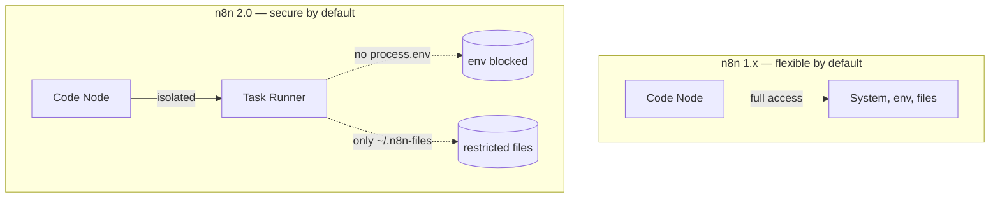

### 2.5 What's New in This Version — n8n 2.0 (the leap every professional must understand)

This section is mandatory for anyone migrating from 1.x. Each item includes the **practical impact** for architects, developers, and enterprises.

**Security (secure-by-default)**

- **Task Runners enabled by default.** Every Code node runs in an isolated environment with limited access. *Impact:* workflows that relied on broad Code node access need explicit configuration; a huge gain in security posture and resource isolation.
- **`process.env` blocked in the Code node.** *Impact:* reading secrets via env in Code stops working — use the credential vault or static data. Prevents credential leakage.
- **File access restricted to `~/.n8n-files`.** *Impact:* workflows that read/wrote outside that directory will fail; review your file pipelines.
- **Arbitrary command-execution nodes disabled by default.** *Impact:* reduces attack surface; re-enable explicitly only if essential.
- **OAuth 2.0 Token Exchange (RFC 8693)** as a second authentication mechanism. *Impact:* enables iframe embedding and delegated API access securely.

**Reliability**

- **Sub-workflows with the Wait node** now correctly return data from the **end** of the sub-workflow (previously they returned the input to the Wait node, causing subtle bugs with timeouts > 65s and webhook calls). *Impact:* fixes silently incorrect results in complex orchestrations.
- **Removal of nodes for defunct services** and legacy options. *Impact:* fewer edge cases, more predictable behavior.
- **Start node removed** — specific triggers replace it. *Impact:* old workflows based on Start need adjustment.

**Performance**

- **New SQLite pooling driver** — up to **10x** faster in benchmarks. *Impact:* self-hosted SQLite instances gain throughput without switching databases.
- **Filesystem-based binary data handling** is more predictable under load.

**Database**

- **MySQL and MariaDB are no longer supported.** *Critical impact:* migrate to **PostgreSQL** (recommended for production) or **SQLite** **before** upgrading. This is often the biggest migration blocker in enterprise environments.

**Experience (UI/UX)**

- **Publish/Save paradigm.** In 1.x, saving an active workflow instantly updated production. In 2.0, **Save** preserves your edits without touching what is live; **Publish** is the explicit action to promote the version to production. *Impact:* no more accidental production changes; aligns the flow with controlled-release practices.
- **Autosave** (introduced Jan 2026), refined canvas, and reorganized sidebar navigation.

**Migration**

- **Migration Report** (Settings → Migration Report, available since 1.121.0 for global admins) and the **Migration Tool** scan the instance and classify issues by severity (workflow-level and instance-level). *Impact:* lets you plan the migration predictably.
- **1.x support for 3 months** after 2.0, with security and bug fixes only.

> **Architect's recommendation:** treat the move to 2.0 as a project, not a `docker pull`. Run the Migration Report, resolve *critical* items (MySQL/MariaDB database, Start node, env/file access in Code) in staging, and only then promote.

### 2.6 Real example

**Scenario.** A company runs n8n 1.118 self-hosted with MySQL and several workflows using `process.env` in the Code node to read API keys.

**Problem.** It wants to upgrade to 2.x for security and performance, but fears breaking production.

**Solution.** A phased migration process guided by the Migration Report.

**Implementation.**
1. Upgrade to the latest 1.x (≥ 1.121) to enable the Migration Report.
2. In staging, run the report and list *critical* items.
3. Migrate the MySQL database → PostgreSQL (dump + import + adjust `DB_TYPE`).
4. Refactor Code nodes: replace `process.env.X` with credentials.
5. Validate file access (move to `~/.n8n-files`).
6. Upgrade to 2.x in staging, test, then promote in production.

**Result.** A more secure 2.x instance, up to 10x faster (if SQLite) or robust (PostgreSQL), with no workflow loss.

**Future improvements.** Adopt the Publish/Save paradigm in the release process and integrate the migration check into CI (Chapter 45).

### 2.7 Exercises

1. List, from your current environment, which items would be *critical* in a migration to 2.0.
2. Explain, for a non-technical manager, why "secure-by-default" justifies a major version.

### 2.8 Challenges

- **Challenge.** Write a migration runbook for 1.x → 2.x for an instance with MySQL, 200 workflows, and heavy Code node usage.

### 2.9 Checklist

- [ ] I know the 6 change groups of 2.0 (security, reliability, performance, database, UX, migration).
- [ ] I know MySQL/MariaDB were removed.
- [ ] I understand the difference between Save and Publish.
- [ ] I know where the Migration Report is.

### 2.10 Best practices

- Follow the official release notes weekly; the cadence is high.
- Pin the Docker image version (avoid `latest` in production) and update in a controlled way.
- Always test major upgrades in staging with a copy of the data.

### 2.11 Anti-patterns

- Upgrading directly from 1.x to 2.x in production without the Migration Report.
- Keeping `latest` as the image tag in production.
- Ignoring the 3-month 1.x support window and postponing the migration indefinitely.

### 2.12 Troubleshooting

| Symptom after upgrade | Cause | Action |
|-----------------------|-------|--------|
| Instance won't start | MySQL/MariaDB database | Migrate to PostgreSQL/SQLite |
| Workflows with Start broken | Start node removed | Replace with a specific trigger |
| Code node fails reading env | `process.env` blocked | Migrate to credentials |
| Change doesn't appear in production | Missing *Publish* | Click Publish |

### 2.13 Official references

- Introducing n8n 2.0: https://blog.n8n.io/introducing-n8n-2-0/
- Breaking changes 2.0: https://docs.n8n.io/2-0-breaking-changes/
- Migration Tool: https://docs.n8n.io/migration-tool-v2/
- Release notes: https://docs.n8n.io/release-notes/

---

## Chapter 3 — Internal architecture

### 3.1 Introduction

To use n8n as a toy, just drag nodes. To use it in **enterprise production** — with high availability, horizontal scale, and security — it is mandatory to understand what happens "under the hood." This chapter dissects the internal components, execution modes, and the data path, focusing on the structural changes brought by the **task runners** in 2.0.

### 3.2 Business context

The difference between an instance processing 100 executions/day and one processing 1 million is not in the workflows — it is in the **deployment topology**. Internal architecture decisions determine infrastructure cost, latency, fault resilience, and the ability to meet SLAs. An architect who doesn't master queue mode, workers, and task runners will either over-provision (waste) or under-provision (incidents) the environment.

### 3.3 Theoretical concepts: the components

n8n is a **Node.js** application (TypeScript backend) with a **Vue 3** frontend. Its logical components:

- **Editor UI:** the SPA where workflows are built; communicates with the backend via REST and WebSocket (execution-progress push).
- **REST API / Public API:** the programmatic interface for workflows, executions, credentials, and users.
- **Core / Workflow Engine:** the heart. It resolves the node graph, orders execution, propagates items between nodes, evaluates expressions, and applies retries and error handling.
- **Nodes:** packages (`n8n-nodes-base` and AI nodes in `@n8n/n8n-nodes-langchain`) that implement each integration.
- **Task Runners (2.0):** isolated processes that execute **Code node** code outside the main process — security and resource isolation.
- **Persistence:** a relational database (**PostgreSQL** recommended; **SQLite** for single-node) stores workflows, credentials (encrypted), executions, and settings.
- **Queue (queue mode):** **Redis** as a broker to distribute executions across workers.
- **Binary Data:** binary data (files) can live on the filesystem or in external storage (S3), avoiding database bloat.

### 3.4 Architecture: deployment modes

**Single mode (default).** A single main process does everything: UI, API, triggers, execution. Simple, ideal for getting started and for small loads.

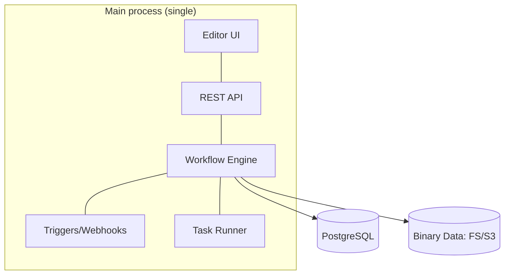

**Queue mode (horizontal scale).** The main process only receives triggers and enqueues; independent **workers** consume the queue and execute. High-volume webhooks can have dedicated processes. This is the topology for production at scale and high availability (Chapters 51–52).

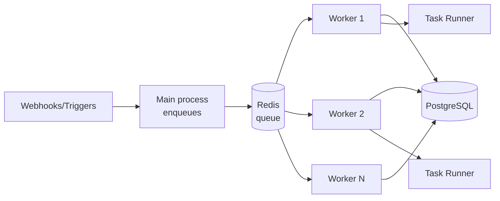

### 3.5 The data path (execution)

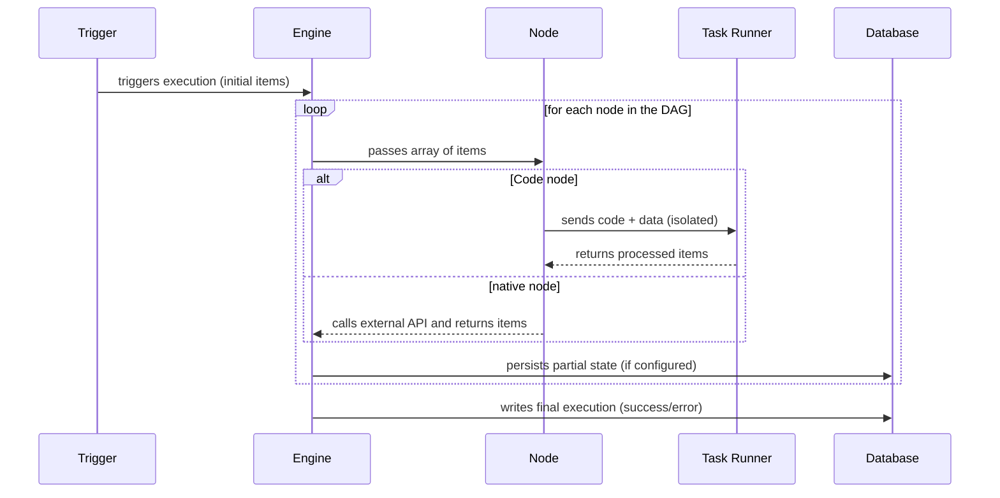

Critical points for the architect:

- **Execution persistence** (`EXECUTIONS_DATA_SAVE_*`): saving all executions is great for auditing but bloats the database. Configure pruning (`EXECUTIONS_DATA_PRUNE`, `EXECUTIONS_DATA_MAX_AGE`).
- **Concurrency:** workers have configurable concurrency (`--concurrency`); size it according to CPU and the I/O-bound nature of your workflows.
- **Task runners** can be *internal* (same host) or *external* (separate process/container) — external ones give maximum isolation, recommended for multi-tenant (Chapter 53).

### 3.6 Real example

**Scenario.** A SaaS platform with peaks of 50k webhooks/hour coming from customer integrations.

**Problem.** In single mode, the main process saturates: webhooks compete with execution, latency rises, timeouts occur.

**Solution.** Migrate to queue mode with dedicated workers and a separate webhook process.

**Implementation (environment variables):**

```bash
# Main process and workers share the database and Redis
export EXECUTIONS_MODE=queue
export QUEUE_BULL_REDIS_HOST=redis.internal
export DB_TYPE=postgresdb
export DB_POSTGRESDB_HOST=pg.internal
# External task runners (isolation)
export N8N_RUNNERS_ENABLED=true
export N8N_RUNNERS_MODE=external
# Execution pruning
export EXECUTIONS_DATA_PRUNE=true
export EXECUTIONS_DATA_MAX_AGE=336   # hours (14 days)
```

Start a worker:

```bash
n8n worker --concurrency=10
```

**Result.** Webhooks are enqueued in milliseconds; workers scale horizontally; the main process never saturates. Predictable latency under peak.

**Future improvements.** Autoscale workers on Kubernetes via HPA using a queue-depth metric (Chapter 8/51).

### 3.7 Exercises

1. Draw your application's topology in queue mode, indicating where Redis, Postgres, and workers sit.
2. Explain why binary data in S3 is preferable to storing it in the database.

### 3.8 Challenges

- **Challenge.** Calculate how many workers (with `--concurrency=10`) are needed for 50k executions/hour if each execution takes an average of 2s of wall-clock time.

### 3.9 Checklist

- [ ] I can distinguish single mode from queue mode.
- [ ] I understand the role of Redis, PostgreSQL, and workers.
- [ ] I configured execution pruning.
- [ ] I understand internal vs external task runners.

### 3.10 Best practices

- In production, use **PostgreSQL** (not SQLite) and **queue mode** early if you anticipate growth.
- Externalize binary data (S3) to keep the database lean.
- Configure pruning from day 1 — accumulated executions are the #1 cause of a giant database.
- Use external task runners to isolate untrusted code in multi-tenant scenarios.

### 3.11 Anti-patterns

- Running production on single-node SQLite with thousands of executions/day.
- Saving all executions without pruning.
- A single giant worker instead of several smaller ones (worse resilience).
- Mixing high-volume webhooks with execution in the same process.

### 3.12 Troubleshooting

| Symptom | Cause | Action |
|---------|-------|--------|
| Executions "stuck" in waiting | No worker consuming the queue | Start workers; check Redis |
| Database growing endlessly | Pruning disabled | Enable `EXECUTIONS_DATA_PRUNE` |
| High latency at webhook peak | Single mode saturated | Migrate to queue + webhook process |
| Slow/unstable Code node | Task runner under-provisioned | Adjust runner resources/mode |

### 3.13 Official references

- Scaling and queue mode: https://docs.n8n.io/hosting/scaling/queue-mode/
- Task runners: https://docs.n8n.io/hosting/configuration/task-runners/
- Environment configuration: https://docs.n8n.io/hosting/configuration/environment-variables/
- Execution pruning: https://docs.n8n.io/hosting/scaling/execution-data/

---

## Chapter 4 — Core concepts

### 4.1 Introduction

This chapter consolidates n8n's **operational vocabulary**: items, nodes, connections, pinning, expressions, credentials, sub-workflows, and node execution modes. Mastering these concepts is what separates someone who "builds little flows" from someone who **designs robust automations**. It is the reference chapter you will reopen throughout the book.

### 4.2 Business context

Costly production errors almost always stem from conceptual misunderstandings: treating an array of items as a single value, not understanding when a node runs once vs. N times, or mixing execution data with credentials. Getting the fundamentals right reduces incidents and the maintenance cost of the automation estate.

### 4.3 Theoretical concepts

**The item and the data structure.** Everything that travels between nodes is a list of items. Each item has the shape:

```json
{
  "json": { "field": "value" },
  "binary": { "file": { "data": "<base64>", "mimeType": "application/pdf" } }
}
```

- `json`: the structured data (what you manipulate 99% of the time).
- `binary`: attachments/files, referenced by key.

**Node execution mode.** A node can run **once per item** (*Run Once for Each Item*) or **once for all** (*Run Once for All Items*). Understanding this is vital: an HTTP node in "each item" makes N calls; in "all items," it makes one.

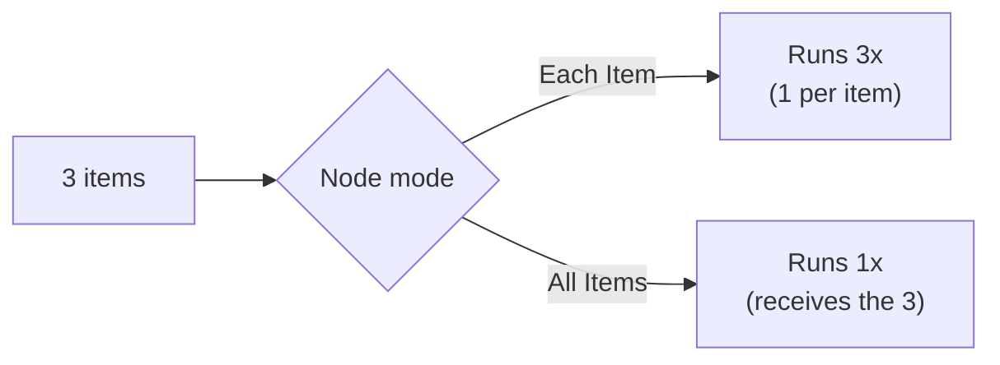

**Expressions.** `{{ ... }}` syntax (JavaScript-based) to access data dynamically. Key variables:

- `$json` — the current item's data.
- `$node["Name"].json` — another node's output.
- `$items()` — all items from a node.
- `$now`, `$today` — date/time (using Luxon).
- `$workflow`, `$execution` — workflow/execution metadata.
- `$vars` — n8n environment variables (Enterprise) / `$env` for system environment variables (when allowed).

**Credentials.** Stored **encrypted** (`N8N_ENCRYPTION_KEY` key), separate from workflows. A workflow references a credential by ID; the secret never appears in the workflow JSON. This allows sharing/versioning workflows without leaking secrets.

**Sub-workflows.** Workflows called by others (via the **Execute Sub-workflow** node). They promote reuse and modularization — the equivalent of extracting a method. In 2.0, data passing from sub-workflows with Wait was fixed (Ch. 2).

**Data pinning.** Lets you "freeze" a node's output during development, to test downstream nodes without re-triggering external calls — it speeds up debugging (Ch. 20).

### 4.4 Conceptual architecture

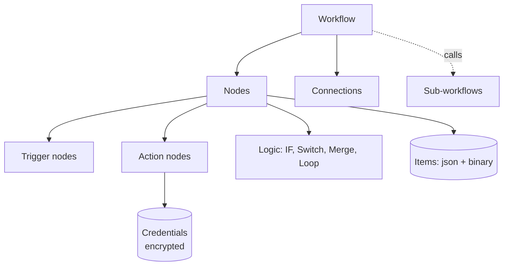

### 4.5 Real example

**Scenario.** Process a list of 100 customers and, for each one, query a credit score from an API and classify it.

**Problem.** Ensure the API call happens per customer and that classification is per item, without mixing data.

**Solution.** Use "each item" mode on the HTTP node and per-item expressions.

**Implementation (IF node, classification condition):**

```javascript
// Expression in the IF node — compares the score returned by the API
{{ $json.score >= 700 }}
```

**Code (Code node "Run Once for Each Item") to enrich the item:**

```javascript
// n8n 2.0 — Code node in "each item" mode; no process.env (use credentials)
const score = $json.score;
let band;
if (score >= 800) band = 'A';
else if (score >= 700) band = 'B';
else if (score >= 600) band = 'C';
else band = 'D';

return { json: { ...$json, band } };
```

**Result.** Each customer comes out classified A–D, in independent items, ready for routing (e.g., approve A/B, review C, decline D).

**Future improvements.** Parallelize with controlled batching to respect the API's rate limit (Ch. 19/21).

### 4.6 Exercises

1. Given a node that receives 5 items, how many times does it run in "each item" and in "all items"?
2. Write an expression that returns today's date in `dd/MM/yyyy` format.
3. Explain why credentials live outside the workflow JSON.

### 4.7 Challenges

- **Challenge.** Build a workflow that receives a list of products, fetches each one's price from an API, and returns only those priced above the average — thinking carefully about when to aggregate (all items) and when to iterate (each item).

### 4.8 Checklist

- [ ] I understand the item's `json` + `binary` structure.
- [ ] I know the difference between "each item" and "all items."
- [ ] I know the main expression variables.
- [ ] I know credentials are encrypted and referenced by ID.
- [ ] I understand sub-workflows and pinning.

### 4.9 Best practices

- Name nodes semantically ("Fetch score," not "HTTP Request1").
- Use sub-workflows for reusable logic; keep workflows single-responsibility.
- Use pinning during development to avoid consuming real APIs on every test.
- Centralize complex expressions in a commented Code node instead of scattering them.

### 4.10 Anti-patterns

- Giant, unreadable expressions embedded in many fields.
- Confusing `$json` (current item) with `$node[...]` (another node) and reading the wrong data.
- Reusing the same credential across different environments (dev/prod).
- Ignoring the node execution mode and generating unintended N calls.

### 4.11 Troubleshooting

| Symptom | Cause | Action |
|---------|-------|--------|
| Expression returns `undefined` | Wrong `$json` path | Inspect the node's input data |
| Node makes too many calls | Improper "each item" mode | Switch to "all items" or aggregate |
| Credential error when migrating a workflow | Different `N8N_ENCRYPTION_KEY` | Use the same key across environments |
| Data disappearing after a sub-workflow | Misunderstood return | Review what the sub-workflow returns |

### 4.12 Official references

- Data structure: https://docs.n8n.io/data/data-structure/
- Expressions: https://docs.n8n.io/code/expressions/
- Credentials: https://docs.n8n.io/credentials/
- Sub-workflows: https://docs.n8n.io/flow-logic/subworkflows/

---

## Chapter 5 — Real-world use cases

### 5.1 Introduction

Concept without application is trivia. This chapter presents **categories of proven enterprise use cases**, each with the typical n8n architecture, so you recognize patterns and know when n8n is (and is not) the right tool. The six complete projects in Part VIII go deeper into some of these cases.

### 5.2 Business context

n8n delivers value where there is **integration between heterogeneous systems with business logic**, especially when the team wants autonomy to evolve the automation without traditional deployments. Recognizing the "fit" avoids two costly enterprise mistakes: using n8n as a replacement for a critical transactional backend (it isn't), or continuing to write glue code where a workflow would solve it.

### 5.3 Theoretical concepts: the major categories

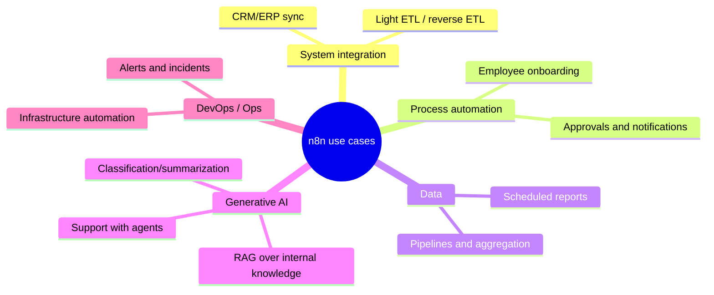

**1. Integration and synchronization (iPaaS).** Keep CRM, ERP, marketing tools, and billing in sync. Pattern: trigger on change → transformation → upsert into the destination.

**2. Business process automation (BPA).** Onboarding, approvals, handoffs between teams. Pattern: form/event → conditional routing → actions + notifications + record.

**3. Data pipelines (light ETL/ELT).** Collect, transform, and load data between sources. Pattern: scheduled trigger → extract (API/DB) → transform → load (warehouse). For massive volumes, n8n orchestrates; the heavy processing stays in dedicated tools.

**4. Generative AI and agents.** Automated support, RAG over internal documents, classification and enrichment. Pattern: trigger → context retrieval (vectors) → LLM/agent → action. It is the fastest-growing category (Part V).

**5. DevOps and operations.** Orchestrate alerts, react to incidents, automate infrastructure tasks. Pattern: monitoring webhook → enrichment → decision → action (Slack/PagerDuty/cloud API).

### 5.4 Architecture of a typical case (AI support)

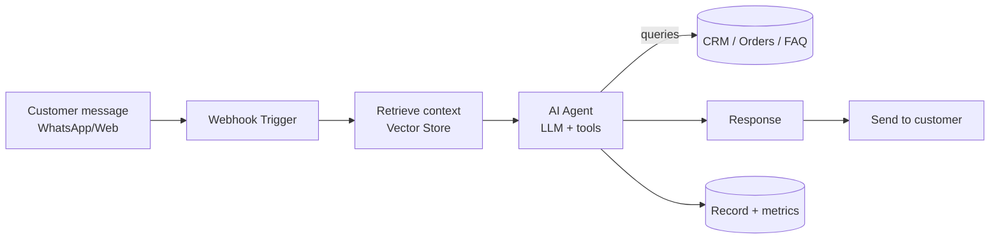

### 5.5 Real example

**Scenario.** A distributor receives orders by email as PDFs and wants to post them automatically into the ERP.

**Problem.** Manual entry is slow and error-prone; volume has grown to hundreds/day.

**Solution.** A workflow that monitors the inbox, extracts data from the PDF with AI, and posts to the ERP via API, with human review for low-confidence cases.

**Implementation (step by step).**
1. **Trigger:** IMAP/Email node reads new emails with a PDF attachment.
2. **Extraction:** AI node (OpenAI/Claude) with the PDF → structured JSON (items, quantities, values).
3. **Validation:** IF node checks `confidence >= 0.9`.
4. **High confidence:** HTTP node posts to the ERP.
5. **Low confidence:** Slack node notifies a human for review.
6. **Record:** writes the result to a database for auditing.

**Code (Code node — normalizes the AI output):**

```javascript
// Ensures the contract expected by the ERP, with safe defaults
const ai = $json.extraction ?? {};
return {
  json: {
    externalOrder: ai.number ?? null,
    items: (ai.items ?? []).map(i => ({
      sku: i.sku,
      qty: Number(i.quantity) || 0,
      price: Number(i.price) || 0
    })),
    confidence: Number(ai.confidence) || 0
  }
};
```

**Result.** ~90% of orders posted without intervention; 10% reviewed by a human; zero routine manual data entry; a complete audit trail.

**Future improvements.** Add fine-tuning/few-shot to raise confidence, and a feedback loop that reuses human corrections (Part V).

### 5.6 When NOT to use n8n

- **A latency-critical transactional backend** (e.g., a synchronous checkout engine with a millisecond SLA): use a dedicated service; n8n orchestrates around it, not in the critical path.
- **Big-data processing at TB scale**: orchestrate Spark/Flink with n8n, but don't process the volume inside it.
- **Core, complex domain logic** that deserves a testable, end-to-end typed codebase.

### 5.7 Exercises

1. Classify three automations at your company into the categories in section 5.3.
2. For the distributor example, list the risks and how to mitigate them.

### 5.8 Challenges

- **Challenge.** Design (as a Mermaid diagram) the architecture of a DevOps use case: react to a high-CPU alert by creating a ticket and scaling an instance in the cloud.

### 5.9 Checklist

- [ ] I can recognize the 5 major use-case categories.
- [ ] I identified the architectural pattern of each.
- [ ] I can articulate when n8n is NOT the right tool.
- [ ] I mapped at least one real case from my organization.

### 5.10 Best practices

- Start with a **high-value, low-risk** case to prove the platform.
- Always include an audit trail (execution/result logging) in enterprise cases.
- In AI cases, design the **human review** path for low confidence from the start.

### 5.11 Anti-patterns

- Placing n8n in the synchronous critical path of a financial transaction.
- Automating a broken process instead of fixing it first (automating chaos amplifies chaos).
- A use case with no business owner — orphaned automations rot.

### 5.12 Troubleshooting

| Symptom | Cause | Action |
|---------|-------|--------|
| Automation "no one trusts" | Lack of audit/observability | Add logs and metrics (Ch. 50) |
| Inconsistent AI results | No validation/review | Add a confidence IF + human |
| Workflow grew too large | Multiple cases in one | Split into sub-workflows per case |

### 5.13 Official references

- Use cases and templates: https://n8n.io/workflows/
- Use cases (DevOps, data): https://n8n.io/use-cases/
- AI documentation: https://docs.n8n.io/advanced-ai/

---

> **End of Part I.** The fundamentals are in place: what n8n is, its evolution up to the 2.x line, its internal architecture, the operational vocabulary, and the map of use cases. **Part II — Installation and Environments** (Chapters 6–13) starts getting hands-on with infrastructure: Docker, Docker Compose, Kubernetes, AWS, Azure, GCP, Self-Hosted, and Cloud.

## Part II – Installation and Environments

Part II turns theory into running infrastructure. The chapters move from the simplest deployment (a single Docker container) to enterprise-grade topologies (Kubernetes with autoscaling workers) and the three major clouds, closing with the strategic decision between **self-hosted** and **n8n Cloud**. Throughout, we assume **n8n 2.x** defaults: PostgreSQL (MySQL/MariaDB are gone), task runners enabled, queue mode with Redis for scale, and the Publish/Save release paradigm.

---

## Chapter 6 — Docker

### 6.1 Introduction

Docker is the **canonical** way to run n8n. The official image (`docker.n8n.io/n8nio/n8n`, mirrored on Docker Hub as `n8nio/n8n`) packages Node.js, the engine, every base node, and the AI/LangChain nodes into a reproducible artifact. For a developer, a single `docker run` produces a working instance in seconds; for an architect, the same image is the unit that flows through CI/CD into staging and production. This chapter covers the image, persistence, environment configuration, and the n8n 2.x specifics (task runners, `~/.n8n-files`) that change how you build the container.

### 6.2 Business context

Reproducibility is money. The number-one cause of "works on my machine" incidents is environment drift — a different Node version, a missing native dependency, an inconsistent timezone. A pinned Docker image eliminates that class of failure: the exact same bytes that passed QA run in production. For regulated industries, the image is also an **auditable artifact** you can scan for CVEs, sign, and store in a private registry. And because n8n is self-hostable, the Docker image is what keeps sensitive data inside the company perimeter — the differentiator versus closed SaaS.

### 6.3 Theoretical concepts

- **Image vs. container:** the image is the immutable template; the container is a running instance. n8n state (workflows, credentials, executions) must **not** live in the container layer — it lives in a volume or external database.
- **Persistence:** n8n stores everything under `/home/node/.n8n` inside the container. The encryption key (`N8N_ENCRYPTION_KEY`) lives there too; lose it and you lose access to all encrypted credentials. Persist this directory or, better, set the key explicitly via env.
- **Configuration via environment variables:** n8n is configured almost entirely through env vars (`N8N_HOST`, `WEBHOOK_URL`, `DB_TYPE`, etc.). This is the 12-factor approach.
- **The `node` user:** the image runs as the non-root `node` user (UID 1000). Volume permissions must match, or n8n cannot write its data.
- **n8n 2.x file directory:** Code-node file access is restricted to `~/.n8n-files` (i.e., `/home/node/.n8n-files`). If your workflows read/write files, mount that directory explicitly.
- **Task runners:** enabled by default in 2.x. In a single container they run *internally*; you can switch to an *external* runner container for stronger isolation (Chapter 53).

### 6.4 Architecture

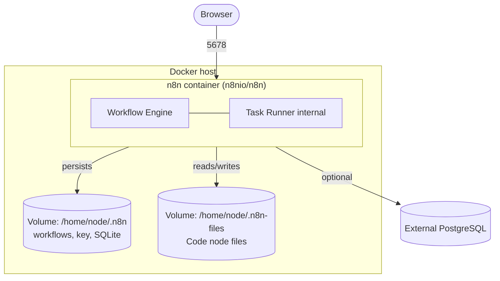

### 6.5 Real example

**Scenario.** A startup wants a single-node n8n for an internal team of five, running on a small cloud VM, with data persisted and the instance reachable at `https://automate.startup.io`.

**Problem.** A naive `docker run` loses all data on container recreation and breaks webhooks because the public URL is not configured, so external services receive `localhost` callback URLs.

**Solution.** Run the image with a named volume, an explicit encryption key, the public webhook URL, and a reverse proxy terminating TLS in front.

**Implementation (step by step).**

1. Create a named volume so data survives container recreation.
2. Pin the image tag (never `latest` in anything that matters).
3. Set `N8N_ENCRYPTION_KEY` explicitly (generate once, store in a secret manager).
4. Set `N8N_HOST`, `N8N_PROTOCOL`, and `WEBHOOK_URL` to the public URL.
5. Put a reverse proxy (Caddy/Traefik/Nginx) in front for TLS.
6. Open the editor, build a workflow, and **Publish** it.

**Result.** A persistent instance that survives restarts and upgrades, with correct webhook URLs and TLS, ready for a small team.

**Future improvements.** Move to PostgreSQL and queue mode as load grows (Chapter 7), and externalize binary data to S3.

### 6.6 Step by step (commands)

```bash
# 1. Create a persistent volume
docker volume create n8n_data

# 2. Generate an encryption key once and keep it safe
openssl rand -hex 24    # use the output as N8N_ENCRYPTION_KEY

# 3. Run n8n (pinned version)
docker run -d \
  --name n8n \
  --restart unless-stopped \
  -p 5678:5678 \
  -e N8N_ENCRYPTION_KEY="<your-generated-key>" \
  -e N8N_HOST="automate.startup.io" \
  -e N8N_PROTOCOL="https" \
  -e WEBHOOK_URL="https://automate.startup.io/" \
  -e GENERIC_TIMEZONE="America/Sao_Paulo" \
  -e N8N_RUNNERS_ENABLED=true \
  -v n8n_data:/home/node/.n8n \
  -v n8n_files:/home/node/.n8n-files \
  docker.n8n.io/n8nio/n8n:2.3.0
```

### 6.7 Complete code (custom Dockerfile)

A common enterprise need is to bake extra npm packages (for the Code node) or custom community nodes into the image:

```dockerfile
# Dockerfile — extends the official n8n 2.x image with extra modules
FROM docker.n8n.io/n8nio/n8n:2.3.0

# Switch to root only to install, then drop back to node
USER root

# Allow these modules to be required from the Code node
ENV NODE_FUNCTION_ALLOW_EXTERNAL=luxon,lodash,date-fns

# Install a community node globally (example)
RUN cd /usr/local/lib/node_modules/n8n \
    && npm install n8n-nodes-example --omit=dev

USER node
```

Build and run:

```bash
docker build -t registry.startup.io/n8n-custom:2.3.0 .
docker push registry.startup.io/n8n-custom:2.3.0
```

### 6.8 Complete n8n workflow (importable JSON)

A minimal health-check workflow you can import to validate that the container is alive and reachable:

```json
{
  "name": "Container Healthcheck",
  "nodes": [
    {
      "parameters": {
        "httpMethod": "GET",
        "path": "healthz",
        "responseMode": "lastNode"
      },
      "id": "a0000001-0000-0000-0000-000000000001",
      "name": "Webhook",
      "type": "n8n-nodes-base.webhook",
      "typeVersion": 2,
      "position": [260, 300]
    },
    {
      "parameters": {
        "assignments": {
          "assignments": [
            { "id": "h1", "name": "status", "type": "string", "value": "ok" },
            { "id": "h2", "name": "instance", "type": "string", "value": "={{ $env.HOSTNAME || 'n8n' }}" },
            { "id": "h3", "name": "time", "type": "string", "value": "={{ $now.toISO() }}" }
          ]
        }
      },
      "id": "a0000002-0000-0000-0000-000000000002",
      "name": "Build Status",
      "type": "n8n-nodes-base.set",
      "typeVersion": 3.4,
      "position": [480, 300]
    }
  ],
  "connections": {
    "Webhook": { "main": [[{ "node": "Build Status", "type": "main", "index": 0 }]] }
  },
  "settings": { "executionOrder": "v1" }
}
```

### 6.9 Exercises

1. Run n8n with Docker, persist data in a volume, recreate the container, and confirm your workflow survived.
2. Explain what happens to your credentials if you lose `N8N_ENCRYPTION_KEY`.
3. Set `WEBHOOK_URL` wrong on purpose and observe the callback URL a webhook generates.

### 6.10 Challenges

- **Challenge 1.** Build a custom image that allows `lodash` in the Code node and prove it by importing it inside a Code node.
- **Challenge 2.** Configure a reverse proxy (Caddy) in front of the container with automatic HTTPS, then re-test the healthcheck webhook over `https`.

### 6.11 Checklist

- [ ] I pinned the image version (no `latest`).
- [ ] I persist `/home/node/.n8n` in a volume or use external Postgres.
- [ ] I set `N8N_ENCRYPTION_KEY` explicitly and stored it safely.
- [ ] I configured `N8N_HOST`, `N8N_PROTOCOL`, and `WEBHOOK_URL`.
- [ ] I mounted `~/.n8n-files` if my Code nodes touch files.

### 6.12 Best practices

- Always run behind a TLS-terminating reverse proxy; never expose 5678 directly to the internet.
- Store the encryption key and all secrets in a secret manager, injected at runtime.
- Use `--restart unless-stopped` (or an orchestrator) so the container survives reboots.
- Set `GENERIC_TIMEZONE` to avoid cron/schedule surprises.

### 6.13 Anti-patterns

- Using `latest` so an unattended pull silently upgrades to a breaking version.
- Storing state inside the container layer (lost on recreation).
- Running as root or with a mismatched volume UID (permission errors).
- Letting n8n generate its own encryption key implicitly, then losing it.

### 6.14 Troubleshooting

| Symptom | Likely cause | Action |
|---------|--------------|--------|
| Data gone after `docker rm` | No volume mounted | Mount a volume on `/home/node/.n8n` |
| `EACCES` writing `.n8n` | Volume owned by wrong UID | `chown -R 1000:1000` the volume |
| Webhook URL shows `localhost` | `WEBHOOK_URL` unset | Set `WEBHOOK_URL` to the public URL |
| "Could not decrypt" credentials | Encryption key changed | Restore the original `N8N_ENCRYPTION_KEY` |
| Code node can't read a file | Outside `~/.n8n-files` (2.x) | Mount/use `/home/node/.n8n-files` |

### 6.15 Official references

- Docker installation: https://docs.n8n.io/hosting/installation/docker/
- Configuration / env vars: https://docs.n8n.io/hosting/configuration/environment-variables/
- Docker image (Docker Hub): https://hub.docker.com/r/n8nio/n8n
- Task runners: https://docs.n8n.io/hosting/configuration/task-runners/

---

## Chapter 7 — Docker Compose

### 7.1 Introduction

A real n8n deployment is rarely a single container. You need at least n8n plus **PostgreSQL**; at scale you add **Redis**, **workers**, and a dedicated **webhook** process. Docker Compose is the tool that declares this multi-container topology as code in one `docker-compose.yml`, with networks, volumes, health checks, and dependencies. This chapter builds up from a two-service stack (n8n + Postgres) to a full **queue-mode** stack, which is the reference local-and-small-prod topology for n8n 2.x.

### 7.2 Business context

Compose is the sweet spot for the majority of self-hosted n8n deployments: too complex for a single container, not big enough to justify Kubernetes. A single VM running a Compose stack comfortably serves a department or a mid-size company. It is also the **fastest path to a production-like local environment**, so developers reproduce queue-mode behavior on their laptops before it reaches Kubernetes — catching "works in single, breaks in queue" bugs early.

### 7.3 Theoretical concepts

- **Service:** each container definition (n8n, postgres, redis, worker).
- **Shared configuration:** in queue mode, the main, worker, and webhook processes must share the **same** database, Redis, and **encryption key** — otherwise workers cannot decrypt credentials.
- **`depends_on` + healthcheck:** ensures n8n starts only after Postgres is actually accepting connections, not merely "started."
- **Queue mode roles:** the **main** process handles UI/API and enqueues; **worker** processes (`n8n worker`) execute; an optional **webhook** process (`n8n webhook`) absorbs inbound webhook traffic so it does not compete with execution.
- **YAML anchors:** Compose lets you DRY shared environment blocks with `&anchor` / `*ref`, avoiding copy-paste drift across the three n8n roles.

### 7.4 Architecture

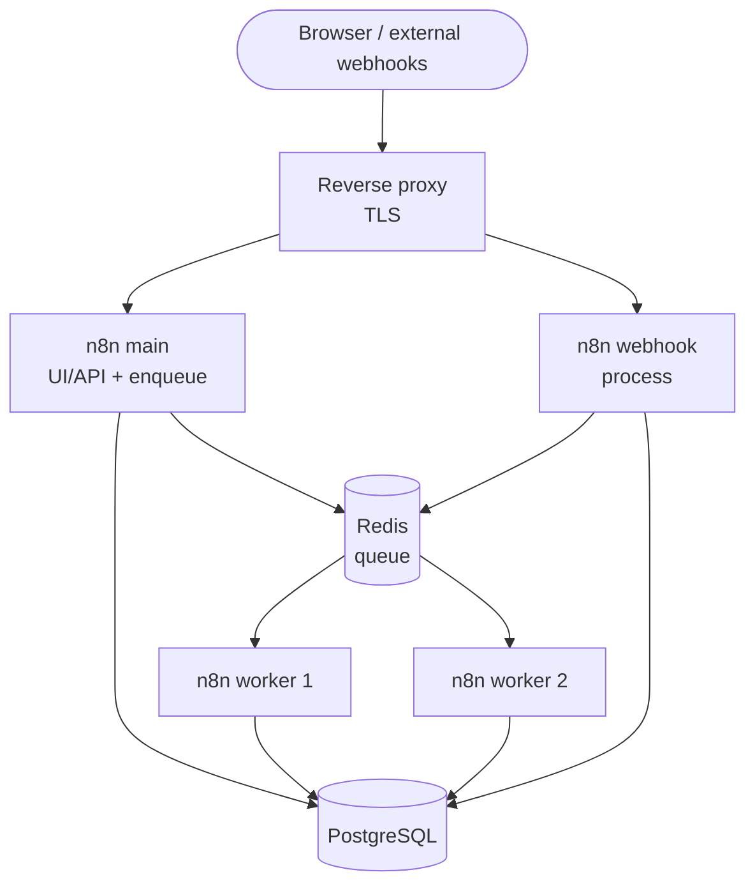

### 7.5 Real example

**Scenario.** A mid-size company runs ~30k executions/day with bursty webhook traffic from partner integrations and wants a single-VM, production-grade deployment that survives restarts and scales workers on demand.

**Problem.** A single n8n container saturates at peak: webhooks queue behind long-running executions, latency spikes, and some partner callbacks time out.

**Solution.** A Compose stack in **queue mode**: one main, one webhook process, two (scalable) workers, Postgres, and Redis — all sharing the encryption key and database.

**Implementation.** See the complete `docker-compose.yml` below. Scale workers with `docker compose up -d --scale n8n-worker=4`.

**Result.** Webhooks are enqueued in milliseconds by the dedicated webhook process; workers chew through the queue in parallel; the main process stays responsive. Adding capacity is a one-line scale command.

**Future improvements.** Move to Kubernetes with an HPA driven by Redis queue depth (Chapter 8), and externalize binary data to S3.

### 7.6 Step by step

1. Create a `.env` file with the encryption key, DB password, and public URL.
2. Define shared env with a YAML anchor.
3. Add Postgres and Redis with health checks.
4. Add the n8n main, webhook, and worker services in queue mode.
5. `docker compose up -d`.
6. Scale workers: `docker compose up -d --scale n8n-worker=4`.

### 7.7 Complete code (`.env`)

```bash
# .env — shared by all services
N8N_ENCRYPTION_KEY=replace-with-openssl-rand-hex-24
POSTGRES_PASSWORD=replace-with-strong-password
N8N_HOST=automate.company.com
WEBHOOK_URL=https://automate.company.com/
GENERIC_TIMEZONE=America/Sao_Paulo
```

### 7.8 Complete code (`docker-compose.yml`, queue mode)

```yaml
x-n8n-common: &n8n-common
  image: docker.n8n.io/n8nio/n8n:2.3.0
  restart: unless-stopped
  environment: &n8n-env
    DB_TYPE: postgresdb
    DB_POSTGRESDB_HOST: postgres
    DB_POSTGRESDB_DATABASE: n8n
    DB_POSTGRESDB_USER: n8n
    DB_POSTGRESDB_PASSWORD: ${POSTGRES_PASSWORD}
    EXECUTIONS_MODE: queue
    QUEUE_BULL_REDIS_HOST: redis
    N8N_ENCRYPTION_KEY: ${N8N_ENCRYPTION_KEY}
    N8N_RUNNERS_ENABLED: "true"
    GENERIC_TIMEZONE: ${GENERIC_TIMEZONE}
    EXECUTIONS_DATA_PRUNE: "true"
    EXECUTIONS_DATA_MAX_AGE: "336"
  depends_on:
    postgres:
      condition: service_healthy
    redis:
      condition: service_healthy

services:
  postgres:
    image: postgres:16-alpine
    restart: unless-stopped
    environment:
      POSTGRES_DB: n8n
      POSTGRES_USER: n8n
      POSTGRES_PASSWORD: ${POSTGRES_PASSWORD}
    volumes:
      - pg_data:/var/lib/postgresql/data
    healthcheck:
      test: ["CMD-SHELL", "pg_isready -U n8n -d n8n"]
      interval: 10s
      timeout: 5s
      retries: 5

  redis:
    image: redis:7-alpine
    restart: unless-stopped
    healthcheck:
      test: ["CMD", "redis-cli", "ping"]
      interval: 10s
      timeout: 5s
      retries: 5

  n8n-main:
    <<: *n8n-common
    environment:
      <<: *n8n-env
      N8N_HOST: ${N8N_HOST}
      N8N_PROTOCOL: https
      WEBHOOK_URL: ${WEBHOOK_URL}
    ports:
      - "5678:5678"
    volumes:
      - n8n_data:/home/node/.n8n

  n8n-webhook:
    <<: *n8n-common
    command: webhook
    environment:
      <<: *n8n-env
      WEBHOOK_URL: ${WEBHOOK_URL}

  n8n-worker:
    <<: *n8n-common
    command: worker --concurrency=10

volumes:
  pg_data:
  n8n_data:
```

### 7.9 Complete n8n workflow (importable JSON)

A queue-aware demo: a webhook that fans out to a batch loop, proving the worker pool processes items in parallel.

```json
{
  "name": "Queue Mode Demo",
  "nodes": [
    {
      "parameters": { "httpMethod": "POST", "path": "fanout", "responseMode": "lastNode" },
      "id": "b0000001-0000-0000-0000-000000000001",
      "name": "Webhook",
      "type": "n8n-nodes-base.webhook",
      "typeVersion": 2,
      "position": [260, 300]
    },
    {
      "parameters": {
        "fieldToSplitOut": "body.jobs",
        "options": {}
      },
      "id": "b0000002-0000-0000-0000-000000000002",
      "name": "Split Jobs",
      "type": "n8n-nodes-base.splitOut",
      "typeVersion": 1,
      "position": [480, 300]
    },
    {
      "parameters": { "amount": 1 },
      "id": "b0000003-0000-0000-0000-000000000003",
      "name": "Simulate Work",
      "type": "n8n-nodes-base.wait",
      "typeVersion": 1.1,
      "position": [700, 300]
    }
  ],
  "connections": {
    "Webhook": { "main": [[{ "node": "Split Jobs", "type": "main", "index": 0 }]] },
    "Split Jobs": { "main": [[{ "node": "Simulate Work", "type": "main", "index": 0 }]] }
  },
  "settings": { "executionOrder": "v1" }
}
```

### 7.10 Exercises

1. Bring up the queue-mode stack and confirm a webhook execution is handled by a worker (check the execution's host).
2. Scale workers to 4 and observe throughput change under load.
3. Stop Redis and explain what happens to new executions.

### 7.11 Challenges

- **Challenge 1.** Add a reverse-proxy service (Traefik) to the Compose file with automatic Let's Encrypt TLS.
- **Challenge 2.** Add a `postgres` backup sidecar that dumps the database nightly to a mounted volume.

### 7.12 Checklist

- [ ] All n8n roles share the same encryption key and database.
- [ ] Postgres and Redis have health checks and `depends_on: service_healthy`.
- [ ] `EXECUTIONS_MODE=queue` is set on every n8n service.
- [ ] Workers are scalable (`--scale n8n-worker=N`).
- [ ] Execution pruning is enabled.

### 7.13 Best practices

- Use YAML anchors to keep the shared env block DRY across main/webhook/worker.
- Keep the webhook process separate so inbound traffic never competes with execution.
- Pin Postgres and Redis versions, not just n8n.
- Externalize binary data (`N8N_DEFAULT_BINARY_DATA_MODE=filesystem` or S3) to keep the DB lean.

### 7.14 Anti-patterns

- Different encryption keys across services → workers fail to decrypt credentials.
- Forgetting `depends_on`/healthcheck → n8n boots before Postgres and crash-loops.
- Running queue mode without Redis health checks → silent job loss on Redis restart.
- One mega-worker with huge concurrency instead of several smaller workers.

### 7.15 Troubleshooting

| Symptom | Cause | Action |
|---------|-------|--------|
| Workers log "could not decrypt" | Mismatched `N8N_ENCRYPTION_KEY` | Set the same key on all services |
| n8n crash-loops on startup | Postgres not ready | Add healthcheck + `service_healthy` |
| Executions never finish | No worker running | Start/scale `n8n-worker` |
| Webhooks slow under load | No dedicated webhook process | Add the `n8n webhook` service |
| DB grows without bound | Pruning off | Set `EXECUTIONS_DATA_PRUNE=true` |

### 7.16 Official references

- Docker Compose hosting: https://docs.n8n.io/hosting/installation/server-setups/docker-compose/
- Queue mode: https://docs.n8n.io/hosting/scaling/queue-mode/
- Configuration env vars: https://docs.n8n.io/hosting/configuration/environment-variables/
- Binary data: https://docs.n8n.io/hosting/scaling/binary-data/

---

## Chapter 8 — Kubernetes

### 8.1 Introduction

Kubernetes is where n8n graduates to **elastic, self-healing, enterprise scale**. The same queue-mode topology from Chapter 7 — main, webhook, workers, Postgres, Redis — becomes a set of Deployments and StatefulSets that Kubernetes schedules, restarts, and autoscales. This chapter shows a production-shaped manifest set: a `Deployment` for the main process, a horizontally autoscalable `Deployment` for workers driven by an **HPA** (ideally on Redis queue depth via KEDA), Secrets for the encryption key, and an Ingress for TLS.

### 8.2 Business context

For organizations already running Kubernetes, putting n8n there means it inherits the platform's operational maturity: GitOps deployments, centralized secrets, observability, autoscaling, and zero-downtime rollouts. The decisive capability is **elasticity**: worker count scales with the actual queue backlog, so you pay for capacity only when there is work — critical for spiky automation workloads (end-of-month batches, campaign bursts) where over-provisioning a fixed Compose VM wastes money.

### 8.3 Theoretical concepts

- **Deployment:** stateless replica set for the main, webhook, and worker processes.
- **StatefulSet / managed DB:** Postgres and Redis as StatefulSets, or (recommended) a managed cloud database and managed Redis.
- **Secret:** the encryption key and DB credentials, mounted as env.
- **HPA / KEDA:** Horizontal Pod Autoscaler scales workers. Native HPA scales on CPU/memory; **KEDA** scales on Redis list length (the queue), which is the correct signal for n8n workers.
- **Ingress:** routes external traffic and terminates TLS (cert-manager for Let's Encrypt).
- **Probes:** `livenessProbe`/`readinessProbe` hit n8n's `/healthz` so Kubernetes restarts unhealthy pods and routes traffic only to ready ones.

### 8.4 Architecture

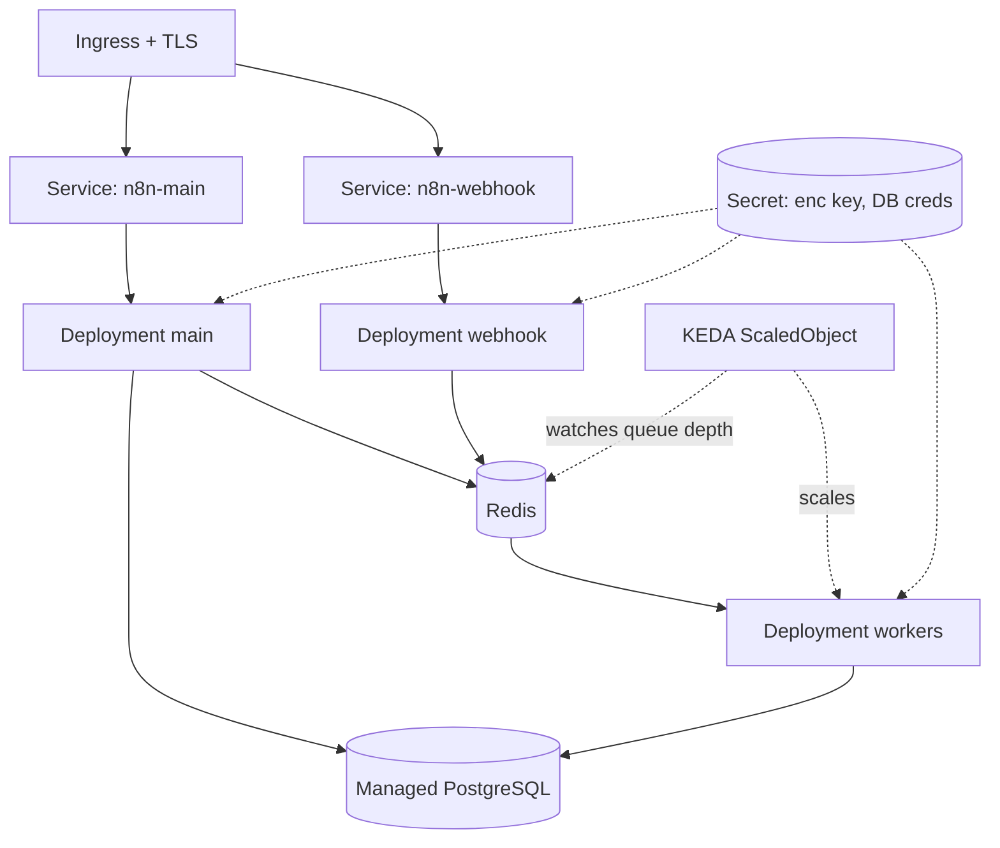

### 8.5 Real example

**Scenario.** An enterprise platform team hosts n8n for many internal squads. Load is highly variable: near-idle overnight, heavy during business hours, with month-end batch spikes.

**Problem.** A fixed worker count either wastes money off-peak or drops SLA at peak; manual scaling is reactive and error-prone.

**Solution.** Deploy in queue mode on Kubernetes with **KEDA** scaling the worker Deployment on Redis queue depth (e.g., scale up when the Bull wait list exceeds a threshold), from 2 to 20 replicas automatically.

**Implementation.** Manifests below: Secret, main Deployment + Service, worker Deployment, KEDA `ScaledObject`, and Ingress.

**Result.** Workers scale to backlog: 2 replicas overnight, 18 at month-end peak, back to 2 afterward — SLA held, cost tracking demand.

**Future improvements.** Add Prometheus + Grafana dashboards (Chapter 50) and a PodDisruptionBudget for safe node drains.

### 8.6 Step by step

1. Create a namespace and a Secret with the encryption key and DB credentials.
2. Deploy/point to managed Postgres and Redis.
3. Deploy the main process (Deployment + Service) with probes.
4. Deploy the worker Deployment (`args: ["worker"]`).
5. Install KEDA and create a `ScaledObject` watching Redis.
6. Add an Ingress with cert-manager TLS.

### 8.7 Complete code (Kubernetes manifests)

```yaml
# secret.yaml
apiVersion: v1
kind: Secret
metadata:
  name: n8n-secrets
  namespace: n8n
type: Opaque
stringData:
  N8N_ENCRYPTION_KEY: "replace-with-openssl-rand-hex-24"
  DB_POSTGRESDB_PASSWORD: "replace-with-strong-password"
---
# main-deployment.yaml
apiVersion: apps/v1
kind: Deployment
metadata:
  name: n8n-main
  namespace: n8n
spec:
  replicas: 1
  selector:
    matchLabels: { app: n8n, role: main }
  template:
    metadata:
      labels: { app: n8n, role: main }
    spec:
      containers:
        - name: n8n
          image: docker.n8n.io/n8nio/n8n:2.3.0
          ports: [{ containerPort: 5678 }]
          env:
            - { name: DB_TYPE, value: postgresdb }
            - { name: DB_POSTGRESDB_HOST, value: postgres }
            - { name: DB_POSTGRESDB_DATABASE, value: n8n }
            - { name: DB_POSTGRESDB_USER, value: n8n }
            - name: DB_POSTGRESDB_PASSWORD
              valueFrom: { secretKeyRef: { name: n8n-secrets, key: DB_POSTGRESDB_PASSWORD } }
            - name: N8N_ENCRYPTION_KEY
              valueFrom: { secretKeyRef: { name: n8n-secrets, key: N8N_ENCRYPTION_KEY } }
            - { name: EXECUTIONS_MODE, value: queue }
            - { name: QUEUE_BULL_REDIS_HOST, value: redis }
            - { name: N8N_RUNNERS_ENABLED, value: "true" }
            - { name: WEBHOOK_URL, value: "https://n8n.corp.example/" }
          readinessProbe:
            httpGet: { path: /healthz, port: 5678 }
            initialDelaySeconds: 15
          livenessProbe:
            httpGet: { path: /healthz, port: 5678 }
            initialDelaySeconds: 30
---
# main-service.yaml
apiVersion: v1
kind: Service
metadata: { name: n8n-main, namespace: n8n }
spec:
  selector: { app: n8n, role: main }
  ports: [{ port: 80, targetPort: 5678 }]
---
# worker-deployment.yaml
apiVersion: apps/v1
kind: Deployment
metadata: { name: n8n-worker, namespace: n8n }
spec:
  replicas: 2
  selector:
    matchLabels: { app: n8n, role: worker }
  template:
    metadata:
      labels: { app: n8n, role: worker }
    spec:
      containers:
        - name: n8n-worker
          image: docker.n8n.io/n8nio/n8n:2.3.0
          args: ["worker", "--concurrency=10"]
          env:
            - { name: DB_TYPE, value: postgresdb }
            - { name: DB_POSTGRESDB_HOST, value: postgres }
            - { name: DB_POSTGRESDB_DATABASE, value: n8n }
            - { name: DB_POSTGRESDB_USER, value: n8n }
            - name: DB_POSTGRESDB_PASSWORD
              valueFrom: { secretKeyRef: { name: n8n-secrets, key: DB_POSTGRESDB_PASSWORD } }
            - name: N8N_ENCRYPTION_KEY
              valueFrom: { secretKeyRef: { name: n8n-secrets, key: N8N_ENCRYPTION_KEY } }
            - { name: EXECUTIONS_MODE, value: queue }
            - { name: QUEUE_BULL_REDIS_HOST, value: redis }
            - { name: N8N_RUNNERS_ENABLED, value: "true" }
---
# keda-scaledobject.yaml
apiVersion: keda.sh/v1alpha1
kind: ScaledObject
metadata: { name: n8n-worker-scaler, namespace: n8n }
spec:
  scaleTargetRef: { name: n8n-worker }
  minReplicaCount: 2
  maxReplicaCount: 20
  triggers:
    - type: redis
      metadata:
        address: redis:6379
        listName: "bull:jobs:wait"
        listLength: "20"
```

### 8.8 Complete n8n workflow (importable JSON)

A workflow that reports execution metadata so you can confirm which worker pod handled it:

```json
{
  "name": "Worker Identity Probe",
  "nodes": [
    {
      "parameters": { "rule": { "interval": [{ "field": "minutes", "minutesInterval": 5 }] } },
      "id": "c0000001-0000-0000-0000-000000000001",
      "name": "Schedule",
      "type": "n8n-nodes-base.scheduleTrigger",
      "typeVersion": 1.2,
      "position": [260, 300]
    },
    {
      "parameters": {
        "jsCode": "return [{ json: { pod: $env.HOSTNAME || 'unknown', execId: $execution.id, at: $now.toISO() } }];"
      },
      "id": "c0000002-0000-0000-0000-000000000002",
      "name": "Report Pod",
      "type": "n8n-nodes-base.code",
      "typeVersion": 2,
      "position": [480, 300]
    }
  ],
  "connections": {
    "Schedule": { "main": [[{ "node": "Report Pod", "type": "main", "index": 0 }]] }
  },
  "settings": { "executionOrder": "v1" }
}
```

### 8.9 Exercises

1. Deploy the main process and confirm `/healthz` readiness gating works (kill the DB, watch the pod go NotReady).
2. Generate queue backlog and watch KEDA scale workers up, then down.
3. Explain why the main process should run a single replica unless you carefully partition triggers.

### 8.10 Challenges

- **Challenge 1.** Add a separate webhook Deployment and route `/webhook/*` to it via Ingress path rules.
- **Challenge 2.** Add a PodDisruptionBudget and a graceful-shutdown configuration so a node drain never drops in-flight executions.

### 8.11 Checklist

- [ ] Encryption key and DB creds come from a Secret, not plain env.
- [ ] Liveness/readiness probes hit `/healthz`.
- [ ] Workers autoscale on queue depth (KEDA), not just CPU.
- [ ] Ingress terminates TLS (cert-manager).
- [ ] Managed Postgres/Redis or properly-backed StatefulSets.

### 8.12 Best practices

- Prefer **managed** Postgres and Redis over in-cluster StatefulSets for production durability.
- Scale workers on queue depth (KEDA); CPU-based HPA lags real demand.
- Keep the main process a single replica unless you split webhook/trigger duties explicitly.
- Use GitOps (Argo CD/Flux) so manifests are versioned and auditable (Chapter 45).

### 8.13 Anti-patterns

- Multiple main replicas all registering the same schedule triggers → duplicate executions.
- Storing the encryption key in a ConfigMap or plain env.
- CPU-only autoscaling for I/O-bound workers → poor responsiveness to backlog.
- In-cluster Postgres on ephemeral storage → data loss on reschedule.

### 8.14 Troubleshooting

| Symptom | Cause | Action |
|---------|-------|--------|
| Duplicate scheduled executions | >1 main replica with triggers | Run a single main, or isolate triggers |
| Pod stuck NotReady | Probe failing (DB down) | Fix DB connectivity; check probe path |
| Workers don't scale | KEDA not watching the right list | Verify `listName`/Redis address |
| TLS errors on Ingress | cert-manager not issuing | Check Issuer/ClusterIssuer + DNS |
| "Could not decrypt" in workers | Secret key mismatch | Use one Secret across all pods |

### 8.15 Official references

- Kubernetes hosting: https://docs.n8n.io/hosting/installation/server-setups/kubernetes/
- Scaling / queue mode: https://docs.n8n.io/hosting/scaling/queue-mode/
- KEDA: https://keda.sh/docs/
- Configuration env vars: https://docs.n8n.io/hosting/configuration/environment-variables/

---

## Chapter 9 — AWS

### 9.1 Introduction

AWS is the most common landing zone for self-hosted n8n. This chapter maps the n8n queue-mode topology onto AWS managed services: **ECS Fargate** (or EKS) for the n8n processes, **RDS for PostgreSQL** for persistence, **ElastiCache for Redis** for the queue, **S3** for binary data, **Secrets Manager** for the encryption key and credentials, and an **Application Load Balancer (ALB)** for TLS and routing. The goal is a deployment that is durable, observable, and as managed as possible — you operate workflows, not databases.

### 9.2 Business context

Running on AWS managed services trades a higher per-hour cost for a dramatic reduction in operational risk and toil: automated backups, multi-AZ failover, patching, and encryption-at-rest come for free. For most enterprises this is the right trade — an engineer's time spent babysitting a self-managed Postgres on EC2 costs more than RDS. AWS also provides the compliance scaffolding (KMS, IAM, VPC isolation, CloudTrail) that regulated workloads require.

### 9.3 Theoretical concepts

- **ECS Fargate:** serverless containers — you define task definitions (main, webhook, worker) and a service per role; AWS schedules them without you managing EC2 hosts.
- **RDS PostgreSQL:** managed Postgres with multi-AZ, automated backups, and KMS encryption. n8n 2.x supports only Postgres/SQLite, so RDS is the production choice.
- **ElastiCache Redis:** managed Redis for queue mode.
- **S3 binary data:** set `N8N_DEFAULT_BINARY_DATA_MODE=s3` to keep large files out of the database.
- **Secrets Manager + IAM:** inject `N8N_ENCRYPTION_KEY` and DB credentials at task start via the task execution role — no secrets in task definitions.
- **ALB:** terminates TLS (ACM certificate), routes `/webhook/*` to the webhook service and everything else to the main service.

### 9.4 Architecture


### 9.5 Real example

**Scenario.** A SaaS company must host n8n in AWS to satisfy a customer requirement that all automation data stays in `sa-east-1`, with automated backups and the ability to scale to month-end peaks.

**Problem.** A single EC2 instance with self-managed Postgres failed an audit (no multi-AZ, manual backups) and could not absorb the month-end load.

**Solution.** Move to ECS Fargate queue mode + RDS multi-AZ + ElastiCache + S3, with worker service autoscaling on CPU and queue depth (via a CloudWatch custom metric).

**Implementation.** Task definition and service autoscaling shown below; secrets pulled from Secrets Manager.

**Result.** Audit passed (multi-AZ, KMS encryption, automated backups, CloudTrail), and workers scale 2→15 at peak. Data never leaves the region.

**Future improvements.** Add a custom CloudWatch metric publishing Bull queue depth and an Application Auto Scaling target-tracking policy on it; add AWS WAF in front of the ALB.

### 9.6 Step by step

1. Create the VPC, private subnets, and security groups.
2. Provision RDS PostgreSQL (multi-AZ) and ElastiCache Redis.
3. Store the encryption key and DB password in Secrets Manager.
4. Create an S3 bucket for binary data and grant the task role access.
5. Register ECS task definitions for main, webhook, and worker.
6. Create ECS services behind an ALB; attach autoscaling to the worker service.

### 9.7 Complete code (ECS task definition — worker, abridged)

```json
{
  "family": "n8n-worker",
  "networkMode": "awsvpc",
  "requiresCompatibilities": ["FARGATE"],
  "cpu": "1024",
  "memory": "2048",
  "executionRoleArn": "arn:aws:iam::123456789012:role/n8nTaskExecRole",
  "taskRoleArn": "arn:aws:iam::123456789012:role/n8nTaskRole",
  "containerDefinitions": [
    {
      "name": "n8n-worker",
      "image": "123456789012.dkr.ecr.sa-east-1.amazonaws.com/n8n:2.3.0",
      "command": ["worker", "--concurrency=10"],
      "environment": [
        { "name": "DB_TYPE", "value": "postgresdb" },
        { "name": "DB_POSTGRESDB_HOST", "value": "n8n.cluster-xyz.sa-east-1.rds.amazonaws.com" },
        { "name": "DB_POSTGRESDB_DATABASE", "value": "n8n" },
        { "name": "DB_POSTGRESDB_USER", "value": "n8n" },
        { "name": "EXECUTIONS_MODE", "value": "queue" },
        { "name": "QUEUE_BULL_REDIS_HOST", "value": "n8n.abc.ng.0001.sae1.cache.amazonaws.com" },
        { "name": "N8N_RUNNERS_ENABLED", "value": "true" },
        { "name": "N8N_DEFAULT_BINARY_DATA_MODE", "value": "s3" },
        { "name": "N8N_EXTERNAL_STORAGE_S3_BUCKET_NAME", "value": "n8n-binary-data" },
        { "name": "N8N_EXTERNAL_STORAGE_S3_BUCKET_REGION", "value": "sa-east-1" }
      ],
      "secrets": [
        { "name": "N8N_ENCRYPTION_KEY", "valueFrom": "arn:aws:secretsmanager:sa-east-1:123456789012:secret:n8n/enc-key" },
        { "name": "DB_POSTGRESDB_PASSWORD", "valueFrom": "arn:aws:secretsmanager:sa-east-1:123456789012:secret:n8n/db-pass" }
      ],
      "logConfiguration": {
        "logDriver": "awslogs",
        "options": {
          "awslogs-group": "/ecs/n8n-worker",
          "awslogs-region": "sa-east-1",
          "awslogs-stream-prefix": "worker"
        }
      }
    }
  ]
}
```

Application Auto Scaling (CLI sketch):

```bash
aws application-autoscaling register-scalable-target \
  --service-namespace ecs \
  --resource-id service/n8n-cluster/n8n-worker \
  --scalable-dimension ecs:service:DesiredCount \
  --min-capacity 2 --max-capacity 15
```

### 9.8 Complete n8n workflow (importable JSON)

A workflow that writes a daily backup artifact to S3 using the AWS S3 node — a common AWS-native housekeeping task:

```json
{
  "name": "Daily S3 Audit Export",
  "nodes": [
    {
      "parameters": { "rule": { "interval": [{ "field": "hours", "hoursInterval": 24 }] } },
      "id": "d0000001-0000-0000-0000-000000000001",
      "name": "Daily",
      "type": "n8n-nodes-base.scheduleTrigger",
      "typeVersion": 1.2,
      "position": [240, 300]
    },
    {
      "parameters": {
        "jsCode": "return [{ json: { generatedAt: $now.toISO(), summary: 'daily audit export' } }];"
      },
      "id": "d0000002-0000-0000-0000-000000000002",
      "name": "Build Report",
      "type": "n8n-nodes-base.code",
      "typeVersion": 2,
      "position": [460, 300]
    },
    {
      "parameters": {
        "operation": "toJson",
        "mode": "each",
        "options": {}
      },
      "id": "d0000003-0000-0000-0000-000000000003",
      "name": "To JSON File",
      "type": "n8n-nodes-base.convertToFile",
      "typeVersion": 1.1,
      "position": [680, 300]
    },
    {
      "parameters": {
        "operation": "upload",
        "bucketName": "n8n-binary-data",
        "fileName": "=audit/{{ $now.toFormat('yyyy-LL-dd') }}.json",
        "binaryPropertyName": "data"
      },
      "id": "d0000004-0000-0000-0000-000000000004",
      "name": "Upload to S3",
      "type": "n8n-nodes-base.awsS3",
      "typeVersion": 2,
      "position": [900, 300],
      "credentials": { "aws": { "id": "1", "name": "AWS account" } }
    }
  ],
  "connections": {
    "Daily": { "main": [[{ "node": "Build Report", "type": "main", "index": 0 }]] },
    "Build Report": { "main": [[{ "node": "To JSON File", "type": "main", "index": 0 }]] },
    "To JSON File": { "main": [[{ "node": "Upload to S3", "type": "main", "index": 0 }]] }
  },
  "settings": { "executionOrder": "v1" }
}
```

### 9.9 Exercises

1. Provision RDS PostgreSQL and point n8n at it; confirm multi-AZ failover does not lose workflows.
2. Configure S3 binary data mode and verify large files no longer hit the database.
3. Pull the encryption key from Secrets Manager into the ECS task and confirm it never appears in the task definition JSON.

### 9.10 Challenges

- **Challenge 1.** Publish a custom CloudWatch metric for Bull queue depth and create a target-tracking autoscaling policy on it for the worker service.
- **Challenge 2.** Put AWS WAF in front of the ALB and write a rule that rate-limits the `/webhook/*` path.

### 9.11 Checklist

- [ ] RDS PostgreSQL multi-AZ, KMS-encrypted, automated backups.
- [ ] ElastiCache Redis for queue mode.
- [ ] Encryption key + DB password from Secrets Manager (IAM-scoped).
- [ ] S3 binary data mode enabled.
- [ ] ALB terminates TLS; `/webhook/*` routed to the webhook service.

### 9.12 Best practices

- Use the task **execution role** to fetch secrets; never bake them into task definitions or images.
- Run main, webhook, and worker as separate ECS services so they scale independently.
- Put everything in private subnets; expose only the ALB.
- Enable RDS Performance Insights and CloudWatch Container Insights early.

### 9.13 Anti-patterns

- Self-managed Postgres on EC2 "to save money" — you pay in toil and risk.
- One ECS service running all roles — you lose independent scaling.
- Public RDS/ElastiCache endpoints.
- Storing binary data in RDS instead of S3 (database bloat, expensive storage).

### 9.14 Troubleshooting

| Symptom | Cause | Action |
|---------|-------|--------|
| Tasks fail to start with secret error | Task role lacks `secretsmanager:GetSecretValue` | Grant the IAM permission |
| Workers can't reach Redis | Security group blocks 6379 | Allow worker SG → ElastiCache SG |
| Binary uploads fail | Task role lacks S3 access | Grant `s3:PutObject` on the bucket |
| 503 from ALB | Health check failing on `/healthz` | Fix target group health check path |
| RDS connection exhausted | Too many workers, small instance | Add a pooler/raise `max_connections` |

### 9.15 Official references

- AWS server setup: https://docs.n8n.io/hosting/installation/server-setups/aws/
- External S3 binary storage: https://docs.n8n.io/hosting/scaling/external-secrets/
- Binary data: https://docs.n8n.io/hosting/scaling/binary-data/
- Scaling / queue mode: https://docs.n8n.io/hosting/scaling/queue-mode/

---

## Chapter 10 — Azure

### 10.1 Introduction

On Microsoft Azure, the n8n queue-mode topology maps to **Azure Container Apps** (or AKS) for the processes, **Azure Database for PostgreSQL – Flexible Server** for persistence, **Azure Cache for Redis** for the queue, **Azure Blob Storage** for binary data, **Key Vault** for secrets, and **Application Gateway** (or the Container Apps ingress) for TLS. Azure is the natural choice for enterprises already standardized on Microsoft 365, Entra ID, and Azure governance.

### 10.2 Business context

The pull toward Azure is usually organizational: companies anchored in Microsoft 365 and Entra ID (formerly Azure AD) want n8n to live where their identity, networking, and compliance controls already are. Co-locating n8n in Azure simplifies SSO (Chapter 48), private networking to internal systems, and unified billing/governance under Azure Policy and Cost Management.

### 10.3 Theoretical concepts

- **Azure Container Apps (ACA):** serverless containers with built-in autoscaling (including KEDA scalers), revisions, and ingress — an excellent fit for n8n's main/webhook/worker split.
- **PostgreSQL Flexible Server:** managed Postgres with zone-redundant HA and automated backups.
- **Azure Cache for Redis:** managed Redis for queue mode.
- **Blob Storage:** n8n can target S3-compatible external storage; Azure Blob is reached via its S3-compatible gateway or by mounting, depending on setup — most teams use Blob for backups and keep binary data on a mounted volume or a small S3-compatible layer.
- **Key Vault + Managed Identity:** inject the encryption key and DB password without storing secrets in the app config.
- **Application Gateway / ACA ingress:** TLS termination and routing.

### 10.4 Architecture


### 10.5 Real example

**Scenario.** A Microsoft-centric enterprise wants n8n integrated with Entra ID SSO and Teams notifications, deployed entirely in Azure with private networking to its on-prem ERP via ExpressRoute.

**Problem.** Their existing Linux VM running n8n had no HA, no managed backups, and could not use Managed Identity for secrets.

**Solution.** Container Apps in queue mode + PostgreSQL Flexible Server (zone-redundant) + Azure Cache for Redis, with Key Vault references via Managed Identity, behind Application Gateway with an Entra-issued certificate.

**Implementation.** Container Apps definitions reference Key Vault secrets; KEDA scales workers on Redis list length.

**Result.** HA Postgres with automated backups, secrets in Key Vault, SSO through Entra ID, and Teams alerting — all within the Azure perimeter and the ExpressRoute boundary.

**Future improvements.** Add Azure Monitor + Log Analytics dashboards and Private Endpoints for Postgres and Redis.

### 10.6 Step by step

1. Create a resource group, VNet, and subnets.
2. Provision PostgreSQL Flexible Server (zone-redundant HA) and Azure Cache for Redis with Private Endpoints.
3. Store the encryption key and DB password in Key Vault; enable Managed Identity on the Container Apps environment.
4. Create Container Apps for main, webhook, and worker referencing Key Vault secrets.
5. Configure KEDA-based scaling on the worker app (Redis trigger).
6. Front with Application Gateway (or ACA ingress) for TLS.

### 10.7 Complete code (Container App — worker, Bicep-style YAML)

```yaml
# worker container app (azure container apps)
properties:
  configuration:
    secrets:
      - name: enc-key
        keyVaultUrl: https://n8n-kv.vault.azure.net/secrets/n8n-enc-key
        identity: system
      - name: db-pass
        keyVaultUrl: https://n8n-kv.vault.azure.net/secrets/n8n-db-pass
        identity: system
  template:
    containers:
      - name: n8n-worker
        image: n8nacr.azurecr.io/n8n:2.3.0
        command: ["n8n"]
        args: ["worker", "--concurrency=10"]
        env:
          - { name: DB_TYPE, value: postgresdb }
          - { name: DB_POSTGRESDB_HOST, value: n8n-pg.postgres.database.azure.com }
          - { name: DB_POSTGRESDB_DATABASE, value: n8n }
          - { name: DB_POSTGRESDB_USER, value: n8nadmin }
          - { name: DB_POSTGRESDB_PASSWORD, secretRef: db-pass }
          - { name: N8N_ENCRYPTION_KEY, secretRef: enc-key }
          - { name: EXECUTIONS_MODE, value: queue }
          - { name: QUEUE_BULL_REDIS_HOST, value: n8n-redis.redis.cache.windows.net }
          - { name: QUEUE_BULL_REDIS_PORT, value: "6380" }
          - { name: QUEUE_BULL_REDIS_TLS, value: "true" }
          - { name: N8N_RUNNERS_ENABLED, value: "true" }
    scale:
      minReplicas: 2
      maxReplicas: 20
      rules:
        - name: redis-queue
          custom:
            type: redis
            metadata:
              address: n8n-redis.redis.cache.windows.net:6380
              listName: "bull:jobs:wait"
              listLength: "20"
              enableTLS: "true"
```

### 10.8 Complete n8n workflow (importable JSON)

A workflow that posts a deployment-health summary to Microsoft Teams via an incoming webhook — typical Azure-shop alerting:

```json
{
  "name": "Teams Health Alert",
  "nodes": [
    {
      "parameters": { "rule": { "interval": [{ "field": "minutes", "minutesInterval": 15 }] } },
      "id": "e0000001-0000-0000-0000-000000000001",
      "name": "Every 15m",
      "type": "n8n-nodes-base.scheduleTrigger",
      "typeVersion": 1.2,
      "position": [240, 300]
    },
    {
      "parameters": {
        "url": "https://n8n.corp.example/healthz",
        "options": {}
      },
      "id": "e0000002-0000-0000-0000-000000000002",
      "name": "Probe Health",
      "type": "n8n-nodes-base.httpRequest",
      "typeVersion": 4.2,
      "position": [460, 300]
    },
    {
      "parameters": {
        "method": "POST",
        "url": "https://outlook.office.com/webhook/REPLACE",
        "sendBody": true,
        "specifyBody": "json",
        "jsonBody": "={{ { \"text\": \"n8n health: \" + ($json.status || 'unknown') + \" at \" + $now.toISO() } }}",
        "options": {}
      },
      "id": "e0000003-0000-0000-0000-000000000003",
      "name": "Notify Teams",
      "type": "n8n-nodes-base.httpRequest",
      "typeVersion": 4.2,
      "position": [680, 300]
    }
  ],
  "connections": {
    "Every 15m": { "main": [[{ "node": "Probe Health", "type": "main", "index": 0 }]] },
    "Probe Health": { "main": [[{ "node": "Notify Teams", "type": "main", "index": 0 }]] }
  },
  "settings": { "executionOrder": "v1" }
}
```

### 10.9 Exercises

1. Reference a Key Vault secret from a Container App via Managed Identity and confirm the value is never in the app config.
2. Enable TLS to Azure Cache for Redis (port 6380, `QUEUE_BULL_REDIS_TLS=true`) and verify workers connect.
3. Configure zone-redundant HA on PostgreSQL Flexible Server.

### 10.10 Challenges

- **Challenge 1.** Add Private Endpoints for Postgres and Redis so no traffic traverses the public internet.
- **Challenge 2.** Wire Entra ID SSO to n8n Enterprise (preview of Chapter 48) and restrict editor access to a security group.

### 10.11 Checklist

- [ ] PostgreSQL Flexible Server with zone-redundant HA and backups.
- [ ] Azure Cache for Redis with TLS (6380).
- [ ] Secrets via Key Vault + Managed Identity.
- [ ] Workers autoscale via KEDA on Redis depth.
- [ ] TLS at App Gateway / ACA ingress.

### 10.12 Best practices

- Use Managed Identity everywhere; avoid connection strings with embedded secrets.
- Enable Redis TLS (port 6380) — Azure Cache requires it by default.
- Use Private Endpoints to keep DB/Redis off the public internet.
- Centralize logs in Log Analytics for cross-service correlation.

### 10.13 Anti-patterns

- Connecting to Azure Cache for Redis without TLS (often blocked, always insecure).
- Storing secrets in Container App plain env instead of Key Vault.
- Single-zone Postgres for a production workload.
- Public network access left enabled on managed data services.

### 10.14 Troubleshooting

| Symptom | Cause | Action |
|---------|-------|--------|
| Redis connection refused | TLS/port mismatch | Use 6380 + `QUEUE_BULL_REDIS_TLS=true` |
| Key Vault secret not resolved | Managed Identity lacks access policy | Grant `get` on secrets to the identity |
| Postgres SSL required error | Flexible Server enforces SSL | Set `DB_POSTGRESDB_SSL_*` accordingly |
| Workers idle despite backlog | KEDA scaler misconfigured | Verify Redis trigger metadata |
| Webhook URL wrong | `WEBHOOK_URL` not set to public host | Set `WEBHOOK_URL` to the App Gateway host |

### 10.15 Official references

- Azure server setup: https://docs.n8n.io/hosting/installation/server-setups/azure/
- Configuration env vars: https://docs.n8n.io/hosting/configuration/environment-variables/
- Queue mode: https://docs.n8n.io/hosting/scaling/queue-mode/
- Supported databases: https://docs.n8n.io/hosting/configuration/supported-databases-settings/

---

## Chapter 11 — GCP

### 11.1 Introduction

On Google Cloud, n8n maps to **GKE** (or Cloud Run for the main process) for compute, **Cloud SQL for PostgreSQL** for persistence, **Memorystore for Redis** for the queue, **Cloud Storage (GCS)** for binary data, **Secret Manager** for secrets, and a **Global HTTPS Load Balancer** for TLS. GKE Autopilot is particularly attractive: it runs the queue-mode topology with KEDA-style autoscaling while abstracting node management.

### 11.2 Business context

GCP appeals to data- and AI-heavy organizations: tight integration with BigQuery, Vertex AI, and Pub/Sub makes n8n a natural orchestration layer for data pipelines and generative-AI workflows that already live in Google Cloud. Keeping n8n in GKE next to BigQuery and Vertex AI minimizes egress cost and latency for the data- and AI-centric use cases that dominate Parts IV and V.

### 11.3 Theoretical concepts

- **GKE Autopilot:** managed Kubernetes where Google runs the nodes; you deploy the same manifests as Chapter 8.
- **Cloud Run (main only):** for small deployments, the main process can run on Cloud Run, but queue-mode workers fit better on GKE because they are long-running consumers.
- **Cloud SQL PostgreSQL:** managed Postgres with HA and automated backups; reached via the Cloud SQL Auth Proxy or Private IP.
- **Memorystore Redis:** managed Redis for the queue.
- **GCS:** binary data via S3-compatible interoperability or GCS-native handling.
- **Secret Manager + Workload Identity:** map a Kubernetes service account to a Google service account so pods read secrets without keys.

### 11.4 Architecture


### 11.5 Real example

**Scenario.** A data team uses BigQuery and Vertex AI and wants n8n to orchestrate nightly ELT and an AI enrichment step, hosted in GKE Autopilot in the same project.

**Problem.** Their previous Cloud Run-only deployment couldn't run long-lived queue workers and incurred cold-start latency on scheduled jobs.

**Solution.** GKE Autopilot in queue mode, Cloud SQL via Private IP, Memorystore Redis, Workload Identity for Secret Manager, fronted by a Global HTTPS LB with a Google-managed certificate.

**Implementation.** Standard Chapter 8 manifests, plus a `ServiceAccount` annotation binding to a Google service account for Secret Manager and BigQuery access.

**Result.** Nightly ELT runs on always-warm workers, AI enrichment calls Vertex AI within the project (low latency, no egress), and secrets are read via Workload Identity with no key files.

**Future improvements.** Use BigQuery as the analytics sink (Chapter 24/29) and Pub/Sub to decouple triggers.

### 11.6 Step by step

1. Create a GKE Autopilot cluster and enable Workload Identity.
2. Provision Cloud SQL PostgreSQL (HA, Private IP) and Memorystore Redis.
3. Store secrets in Secret Manager; bind a GSA to the KSA.
4. Deploy main/webhook/worker (Chapter 8 manifests).
5. Add an HPA/KEDA scaler for workers.
6. Expose via a Global HTTPS LB (Ingress + ManagedCertificate).

### 11.7 Complete code (Workload Identity + worker, abridged)

```yaml
# service account bound to a Google service account
apiVersion: v1
kind: ServiceAccount
metadata:
  name: n8n-sa
  namespace: n8n
  annotations:
    iam.gke.io/gcp-service-account: n8n-runtime@my-project.iam.gserviceaccount.com
---
apiVersion: apps/v1
kind: Deployment
metadata: { name: n8n-worker, namespace: n8n }
spec:
  replicas: 2
  selector: { matchLabels: { app: n8n, role: worker } }
  template:
    metadata: { labels: { app: n8n, role: worker } }
    spec:
      serviceAccountName: n8n-sa
      containers:
        - name: n8n-worker
          image: gcr.io/my-project/n8n:2.3.0
          args: ["worker", "--concurrency=10"]
          env:
            - { name: DB_TYPE, value: postgresdb }
            - { name: DB_POSTGRESDB_HOST, value: "10.20.0.3" }   # Cloud SQL Private IP
            - { name: DB_POSTGRESDB_DATABASE, value: n8n }
            - { name: DB_POSTGRESDB_USER, value: n8n }
            - { name: EXECUTIONS_MODE, value: queue }
            - { name: QUEUE_BULL_REDIS_HOST, value: "10.30.0.4" } # Memorystore IP
            - { name: N8N_RUNNERS_ENABLED, value: "true" }
          # DB password fetched at startup via an init step / external-secrets operator
```

### 11.8 Complete n8n workflow (importable JSON)

A nightly ELT skeleton that queries an HTTP source and loads rows to BigQuery via the Google BigQuery node:

```json
{
  "name": "Nightly ELT to BigQuery",
  "nodes": [
    {
      "parameters": { "rule": { "interval": [{ "field": "hours", "triggerAtHour": 2 }] } },
      "id": "f0000001-0000-0000-0000-000000000001",
      "name": "At 02:00",
      "type": "n8n-nodes-base.scheduleTrigger",
      "typeVersion": 1.2,
      "position": [240, 300]
    },
    {
      "parameters": {
        "url": "https://api.source.example/v1/orders?since={{ $today.minus({ days: 1 }).toISODate() }}",
        "options": {}
      },
      "id": "f0000002-0000-0000-0000-000000000002",
      "name": "Extract",
      "type": "n8n-nodes-base.httpRequest",
      "typeVersion": 4.2,
      "position": [460, 300]
    },
    {
      "parameters": {
        "operation": "insert",
        "projectId": "my-project",
        "datasetId": "raw",
        "tableId": "orders",
        "options": {}
      },
      "id": "f0000003-0000-0000-0000-000000000003",
      "name": "Load to BigQuery",
      "type": "n8n-nodes-base.googleBigQuery",
      "typeVersion": 2.1,
      "position": [680, 300],
      "credentials": { "googleApi": { "id": "1", "name": "GCP service account" } }
    }
  ],
  "connections": {
    "At 02:00": { "main": [[{ "node": "Extract", "type": "main", "index": 0 }]] },
    "Extract": { "main": [[{ "node": "Load to BigQuery", "type": "main", "index": 0 }]] }
  },
  "settings": { "executionOrder": "v1" }
}
```

### 11.9 Exercises

1. Bind a KSA to a GSA via Workload Identity and read a Secret Manager secret without a key file.
2. Connect to Cloud SQL via Private IP and confirm no public IP is exposed.
3. Load a small dataset to BigQuery from an n8n workflow.

### 11.10 Challenges

- **Challenge 1.** Add a Pub/Sub trigger path: publish order events to Pub/Sub and have n8n consume them (via HTTP push subscription to a webhook).
- **Challenge 2.** Add a Vertex AI enrichment step that classifies each order before loading to BigQuery.

### 11.11 Checklist

- [ ] GKE Autopilot with Workload Identity enabled.
- [ ] Cloud SQL PostgreSQL HA via Private IP.
- [ ] Memorystore Redis for queue mode.
- [ ] Secrets via Secret Manager (no key files in pods).
- [ ] Global HTTPS LB with managed certificate.

### 11.12 Best practices

- Use Workload Identity instead of mounting service-account key files.
- Connect to Cloud SQL via Private IP or the Auth Proxy; never the public IP.
- Co-locate n8n with BigQuery/Vertex AI in the same region to cut egress and latency.
- Use the external-secrets operator to sync Secret Manager into Kubernetes Secrets.

### 11.13 Anti-patterns

- Mounting long-lived GSA key files into pods.
- Running queue workers on Cloud Run (cold starts, no long-lived consumers).
- Public Cloud SQL IPs.
- Cross-region BigQuery/n8n placement (avoidable egress cost).

### 11.14 Troubleshooting

| Symptom | Cause | Action |
|---------|-------|--------|
| `PermissionDenied` to Secret Manager | Workload Identity binding missing | Annotate KSA + grant GSA role |
| Cloud SQL connection timeout | No Private IP / proxy | Use Private IP or Auth Proxy sidecar |
| BigQuery insert 403 | GSA lacks `bigquery.dataEditor` | Grant the role |
| LB returns 502 | Backend health check failing | Point health check at `/healthz` |
| Workers idle under load | No HPA/KEDA scaler | Add a scaler on queue depth |

### 11.15 Official references

- GCP server setup: https://docs.n8n.io/hosting/installation/server-setups/google-cloud/
- Google BigQuery node: https://docs.n8n.io/integrations/builtin/app-nodes/n8n-nodes-base.googlebigquery/
- Queue mode: https://docs.n8n.io/hosting/scaling/queue-mode/
- Configuration env vars: https://docs.n8n.io/hosting/configuration/environment-variables/

---

## Chapter 12 — Self-Hosted

### 12.1 Introduction

This chapter zooms out from any single platform to the **discipline of self-hosting n8n** well: configuration management, secrets, backups, upgrades, encryption-key custody, execution pruning, and the operational runbook. Whether you run Docker, Compose, Kubernetes, or a bare VM, the self-hosting concerns are the same — and getting them wrong is how teams lose credentials, bloat databases, or fail audits.

### 12.2 Business context

Self-hosting is *the* reason many enterprises choose n8n: data sovereignty, compliance (LGPD/GDPR/HIPAA), and cost control. But that control comes with responsibility — you own backups, upgrades, and security. The break-even versus n8n Cloud is rarely raw infrastructure cost; it is the **value of keeping data in-perimeter and avoiding per-execution pricing at scale**, weighed against the cost of operating the platform responsibly.

### 12.3 Theoretical concepts

- **Encryption key custody:** `N8N_ENCRYPTION_KEY` decrypts every credential. It must be set explicitly, stored in a secret manager, backed up, and identical across all nodes/environments that share data. Lose it → lose all credentials.
- **Backups:** back up the **database** (workflows, credentials, executions) and the encryption key. For SQLite, the file under `.n8n`; for Postgres, `pg_dump`. Test restores.
- **Execution data lifecycle:** enable pruning (`EXECUTIONS_DATA_PRUNE`, `EXECUTIONS_DATA_MAX_AGE`) and decide what to save (`EXECUTIONS_DATA_SAVE_ON_SUCCESS`, `..._ON_ERROR`).
- **Upgrades:** pin versions; read release notes; test in staging; for 2.x specifically, run the Migration Report when coming from 1.x (Chapter 2).
- **Configuration:** environment variables (12-factor), `.env` files, or a config file; secrets injected, never committed.
- **Reverse proxy + TLS:** never expose n8n directly; terminate TLS and set `WEBHOOK_URL`.

### 12.4 Architecture

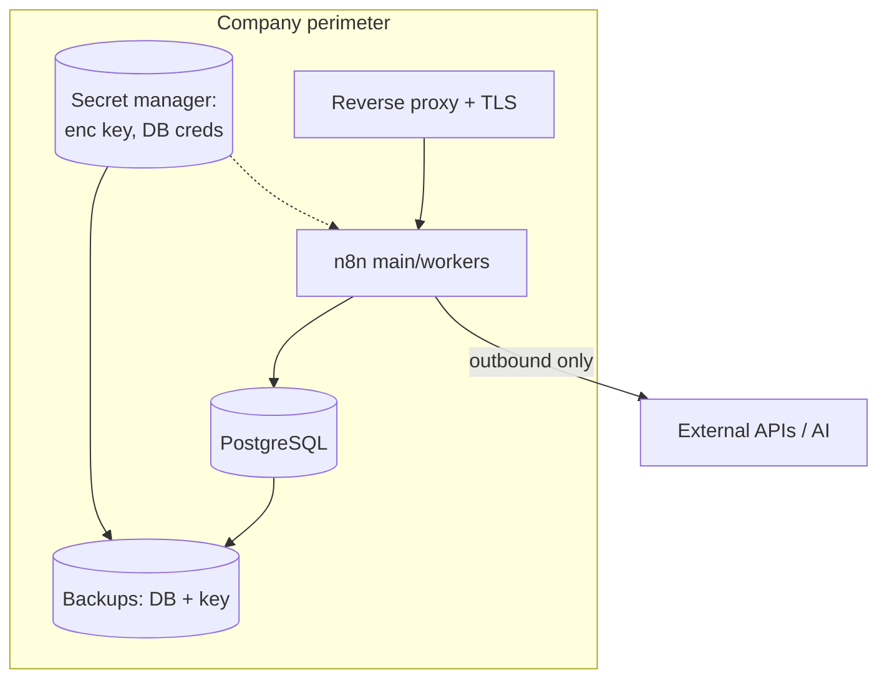

### 12.5 Real example

**Scenario.** A healthcare provider must keep all automation data on-prem for compliance and needs a defensible backup/restore and upgrade process for auditors.

**Problem.** Their initial install used SQLite with no backups, an auto-generated encryption key no one had saved, and `latest` as the image tag — an audit finding waiting to happen.

**Solution.** Migrate to PostgreSQL, set an explicit encryption key in Vault, enable nightly `pg_dump` + key backup, pin versions, and document an upgrade runbook with staging validation.

**Implementation.** Backup script and env configuration below; restores tested quarterly.

**Result.** Audit-ready: encryption key in custody and backed up, tested DB restores, pinned versions, controlled upgrades — all on-prem.

**Future improvements.** Add WORM/offsite backup storage and automate restore testing in CI.

### 12.6 Step by step

1. Choose PostgreSQL for production; set `DB_TYPE=postgresdb`.
2. Generate and store `N8N_ENCRYPTION_KEY` in a secret manager; back it up.
3. Configure execution save policy + pruning.
4. Put a reverse proxy with TLS in front; set `WEBHOOK_URL`.
5. Schedule nightly DB dumps + key backup; test restores.
6. Pin the image version; document the upgrade runbook.

### 12.7 Complete code (backup script + env)

```bash
#!/usr/bin/env bash
# n8n-backup.sh — nightly backup of Postgres + encryption key reference
set -euo pipefail

STAMP=$(date +%Y%m%d-%H%M%S)
BACKUP_DIR=/var/backups/n8n
mkdir -p "$BACKUP_DIR"

# 1. Database dump (workflows, credentials, executions)
PGPASSWORD="$DB_POSTGRESDB_PASSWORD" pg_dump \
  -h "$DB_POSTGRESDB_HOST" -U "$DB_POSTGRESDB_USER" -d n8n -Fc \
  -f "$BACKUP_DIR/n8n-$STAMP.dump"

# 2. Encryption key fingerprint (the real key lives in the secret manager)
echo "enc-key-sha256: $(printf '%s' "$N8N_ENCRYPTION_KEY" | sha256sum | cut -d' ' -f1)" \
  > "$BACKUP_DIR/keyref-$STAMP.txt"

# 3. Retention: keep 30 days
find "$BACKUP_DIR" -name 'n8n-*.dump' -mtime +30 -delete
echo "Backup complete: $BACKUP_DIR/n8n-$STAMP.dump"
```

Key environment block:

```bash
DB_TYPE=postgresdb
DB_POSTGRESDB_HOST=pg.internal
DB_POSTGRESDB_DATABASE=n8n
DB_POSTGRESDB_USER=n8n
N8N_ENCRYPTION_KEY=<from-secret-manager>
EXECUTIONS_DATA_SAVE_ON_SUCCESS=all
EXECUTIONS_DATA_SAVE_ON_ERROR=all
EXECUTIONS_DATA_PRUNE=true
EXECUTIONS_DATA_MAX_AGE=720          # 30 days in hours
N8N_PROTOCOL=https
WEBHOOK_URL=https://n8n.internal/
```

### 12.8 Complete n8n workflow (importable JSON)

A self-monitoring workflow that fails loudly if the database is unreachable, pushing an alert — a good self-hosting safety net:

```json
{
  "name": "Self-Host Watchdog",
  "nodes": [
    {
      "parameters": { "rule": { "interval": [{ "field": "minutes", "minutesInterval": 10 }] } },
      "id": "10000001-0000-0000-0000-000000000001",
      "name": "Every 10m",
      "type": "n8n-nodes-base.scheduleTrigger",
      "typeVersion": 1.2,
      "position": [240, 300]
    },
    {
      "parameters": {
        "operation": "executeQuery",
        "query": "SELECT 1 AS ok;",
        "options": {}
      },
      "id": "10000002-0000-0000-0000-000000000002",
      "name": "DB Ping",
      "type": "n8n-nodes-base.postgres",
      "typeVersion": 2.5,
      "position": [460, 300],
      "credentials": { "postgres": { "id": "1", "name": "n8n Postgres" } },
      "onError": "continueErrorOutput"
    },
    {
      "parameters": {
        "method": "POST",
        "url": "https://hooks.slack.com/services/REPLACE",
        "sendBody": true,
        "specifyBody": "json",
        "jsonBody": "={{ { \"text\": \"ALERT: n8n DB ping failed at \" + $now.toISO() } }}",
        "options": {}
      },
      "id": "10000003-0000-0000-0000-000000000003",
      "name": "Alert Slack",
      "type": "n8n-nodes-base.httpRequest",
      "typeVersion": 4.2,
      "position": [700, 420]
    }
  ],
  "connections": {
    "Every 10m": { "main": [[{ "node": "DB Ping", "type": "main", "index": 0 }]] },
    "DB Ping": { "main": [[], [{ "node": "Alert Slack", "type": "main", "index": 0 }]] }
  },
  "settings": { "executionOrder": "v1" }
}
```

### 12.9 Exercises

1. Perform a full backup and restore into a fresh instance using the same encryption key; confirm credentials decrypt.
2. Restore with the *wrong* key and observe the decryption failure (understand the blast radius).
3. Configure pruning and watch the executions table stop growing.

### 12.10 Challenges

- **Challenge 1.** Write a runbook to rotate the encryption key safely (re-encrypt credentials) without downtime.
- **Challenge 2.** Automate quarterly restore testing as a scheduled job that restores into a throwaway instance and validates a known workflow.

### 12.11 Checklist

- [ ] PostgreSQL in production; SQLite only for single-node/dev.
- [ ] Encryption key set explicitly, in a secret manager, and backed up.
- [ ] Nightly DB backups with tested restores.
- [ ] Execution save policy + pruning configured.
- [ ] Reverse proxy + TLS; `WEBHOOK_URL` set; versions pinned.

### 12.12 Best practices

- Treat the encryption key like a root CA key — custody, backup, rotation policy.
- Keep the same key across dev/staging/prod **only if** they legitimately share credentials; otherwise isolate.
- Test restores on a schedule, not just back up.
- Pin versions and read release notes before every upgrade.

### 12.13 Anti-patterns

- Auto-generated encryption key that no one saved.
- SQLite in production with high volume.
- Backing up the database but not the key (or vice versa).
- `latest` image tag; in-place production upgrades with no staging.

### 12.14 Troubleshooting

| Symptom | Cause | Action |
|---------|-------|--------|
| Credentials unreadable after restore | Wrong/missing encryption key | Restore the original key |
| Database enormous | Pruning disabled | Enable pruning; archive old executions |
| Webhooks point to localhost | `WEBHOOK_URL` unset | Set the public URL |
| Upgrade broke workflows | Skipped Migration Report (1.x→2.x) | Roll back; run the report in staging |
| Restore "works" but no executions | Only schema restored | Use `-Fc` dumps + full `pg_restore` |

### 12.15 Official references

- Hosting overview: https://docs.n8n.io/hosting/
- Configuration env vars: https://docs.n8n.io/hosting/configuration/environment-variables/
- Execution data / pruning: https://docs.n8n.io/hosting/scaling/execution-data/
- Supported databases: https://docs.n8n.io/hosting/configuration/supported-databases-settings/

---

## Chapter 13 — Cloud

### 13.1 Introduction

n8n **Cloud** is the official managed SaaS: n8n GmbH operates the infrastructure, upgrades, scaling, and backups; you build workflows. This chapter frames the **strategic decision** — Cloud vs. self-hosted — and covers what Cloud gives you (and constrains), so architects make the call on evidence rather than reflex. It closes Part II by tying the infrastructure thread back to business outcomes.

### 13.2 Business context

The Cloud-vs-self-hosted decision is one of the most consequential an automation team makes. Cloud minimizes time-to-value and operational burden — ideal for teams that want outcomes, not ops. Self-hosting wins where data sovereignty, deep network integration, custom community nodes, or per-execution economics at very high volume dominate. The mature answer is often **hybrid**: Cloud for fast-moving business automations, self-hosted for regulated or high-volume data/AI pipelines.

### 13.3 Theoretical concepts

- **Managed operations:** n8n Cloud handles upgrades (you ride the 2.x line automatically), scaling, backups, and uptime SLAs.
- **Plans and limits:** tiers bound by active workflows, executions, and features (e.g., advanced collaboration, environments, SSO on higher tiers).
- **Data residency:** Cloud offers selectable regions; verify against your compliance requirements.
- **Constraints vs. self-hosted:** custom community nodes and arbitrary OS-level access are more limited on Cloud by design (secure-by-default at the platform level).
- **Embed and enterprise:** n8n also offers **Embed** (white-label n8n inside your product) and **Enterprise** licensing (self-hosted with SSO, RBAC, environments, external secrets — Parts VI–VII).

### 13.4 Architecture (decision view)


### 13.5 Real example

**Scenario.** A scale-up runs 40 business automations (CRM sync, notifications, reporting) plus 3 regulated data/AI pipelines that must keep customer PII on-prem.

**Problem.** Self-hosting everything burdens a small team with ops for low-risk flows; putting everything on Cloud violates the PII constraint.

**Solution.** Hybrid: the 40 business automations run on n8n Cloud (zero ops, automatic upgrades); the 3 regulated pipelines run self-hosted in the company VPC. Shared standards (naming, Git export) keep both estates consistent.

**Implementation.** Cloud workspace for business flows; a self-hosted Kubernetes instance (Chapter 8) for regulated pipelines; both export workflows to Git (Chapter 41) for a single source of truth.

**Result.** Minimal ops for low-risk automation, full sovereignty for regulated data, and consistent governance across both — the best of both worlds.

**Future improvements.** Promote some self-hosted flows to Cloud once data-handling allows, and unify observability across both estates (Chapter 50).

### 13.6 Step by step (evaluating Cloud)

1. List your workflows and tag each: data-sensitivity, volume, custom-node needs.
2. Map each to Cloud or self-hosted using the decision tree.
3. For Cloud candidates, pick a plan based on active workflows/executions and required features.
4. Verify data residency region against compliance.
5. Stand up the chosen environment; export everything to Git for portability.
6. Re-evaluate quarterly as volume and requirements change.

### 13.7 Complete code (export workflows for portability)

Keeping workflows portable across Cloud and self-hosted via the CLI/API export:

```bash
# Self-hosted export (CLI) — portable backup of all workflows
n8n export:workflow --all --output=./workflows.json --pretty

# Cloud / any instance — export via the Public API
curl -s https://YOUR-INSTANCE/api/v1/workflows \
  -H "X-N8N-API-KEY: $N8N_API_KEY" \
  | jq '.data' > workflows-export.json
```

### 13.8 Complete n8n workflow (importable JSON)

A "portability probe" workflow that prints whether it is running on Cloud or self-hosted, useful when the same flow is deployed to both:

```json
{
  "name": "Environment Probe",
  "nodes": [
    {
      "parameters": { "httpMethod": "GET", "path": "whereami", "responseMode": "lastNode" },
      "id": "20000001-0000-0000-0000-000000000001",
      "name": "Webhook",
      "type": "n8n-nodes-base.webhook",
      "typeVersion": 2,
      "position": [240, 300]
    },
    {
      "parameters": {
        "jsCode": "const host = $env.N8N_HOST || 'unknown';\nconst isCloud = host.endsWith('.app.n8n.cloud');\nreturn [{ json: { host, environment: isCloud ? 'n8n Cloud' : 'self-hosted', at: $now.toISO() } }];"
      },
      "id": "20000002-0000-0000-0000-000000000002",
      "name": "Detect Env",
      "type": "n8n-nodes-base.code",
      "typeVersion": 2,
      "position": [460, 300]
    }
  ],
  "connections": {
    "Webhook": { "main": [[{ "node": "Detect Env", "type": "main", "index": 0 }]] }
  },
  "settings": { "executionOrder": "v1" }
}
```

### 13.9 Exercises

1. Build the decision matrix for your own workflow portfolio (sensitivity × volume × custom-node need).
2. Export all workflows from one instance and import them into another to prove portability.
3. List which features your use cases require and check them against Cloud plan tiers.

### 13.10 Challenges

- **Challenge 1.** Design a hybrid governance model where Cloud and self-hosted instances share one Git source of truth and one naming standard.
- **Challenge 2.** Estimate the cost crossover point where self-hosting becomes cheaper than Cloud for your execution volume.

### 13.11 Checklist

- [ ] I classified each workflow by sensitivity, volume, and node needs.
- [ ] I applied the decision tree to choose Cloud / self-hosted / hybrid.
- [ ] I verified Cloud data residency against compliance.
- [ ] I exported workflows to Git for portability.
- [ ] I scheduled a quarterly re-evaluation.

### 13.12 Best practices

- Default to Cloud for low-risk, fast-moving automations; self-host what compliance or volume demands.
- Keep workflows portable: export to Git regardless of where they run.
- Standardize naming and structure across estates so flows can migrate either direction.
- Re-evaluate the decision as volume grows — economics shift with scale.

### 13.13 Anti-patterns

- Reflexively self-hosting everything and drowning a small team in ops.
- Putting regulated PII on Cloud without checking residency/compliance.
- Locking into Cloud-only patterns that can't be exported/migrated.
- Never re-evaluating as volume crosses the cost threshold.

### 13.14 Troubleshooting

| Symptom | Cause | Action |
|---------|-------|--------|
| Need a custom community node on Cloud | Cloud node restrictions | Self-host that workflow |
| Compliance flags data location | Wrong Cloud region | Choose a compliant region or self-host |
| Cost spikes at high volume | Per-execution economics | Evaluate self-hosting break-even |
| Can't migrate a flow to self-hosted | Cloud-specific assumptions | Refactor to portable patterns |
| Inconsistent flows across estates | No shared source of truth | Centralize in Git (Chapter 41) |

### 13.15 Official references

- n8n Cloud: https://docs.n8n.io/manage-cloud/
- Cloud vs self-hosted: https://docs.n8n.io/choose-n8n/
- Embed: https://docs.n8n.io/embed/
- Pricing/plans: https://n8n.io/pricing/

---

> **End of Part II.** You can now run n8n anywhere — a single Docker container, a Compose queue-mode stack, Kubernetes with autoscaling workers, the three major clouds, a disciplined self-hosted operation, or managed Cloud — and choose between them on evidence. **Part III — Building Workflows** (Chapters 14–20) shifts from infrastructure to craft: nodes, triggers, expressions, variables, data mapping, error handling, and debugging.

## Part III – Building Workflows

Part III is the craft of n8n: how to assemble nodes into correct, maintainable, observable workflows. Where Part II gave you the runway, Part III teaches you to fly. We cover the node taxonomy, the trigger model, the expression language, the variable system, data mapping between heterogeneous shapes, robust error handling, and disciplined debugging — all aligned to n8n 2.x defaults (secure Code node, Publish/Save, items model).

---

## Chapter 14 — Nodes

### 14.1 Introduction

Nodes are the atoms of n8n. Everything you build is a graph of nodes exchanging items. This chapter establishes the **node taxonomy** — triggers, actions, transformations, and logic/flow — and the cross-cutting mechanics every node shares: input/output items, parameters, execution mode (once per item vs. once for all), credentials, and error handling. Master this and every unfamiliar node becomes legible.

### 14.2 Business context

The difference between a workflow a team can maintain and one that rots is almost always node hygiene: descriptive names, the right node for the job (native over raw HTTP), correct execution mode, and clean separation of logic from side effects. Good node design lowers incident rate and onboarding time — directly affecting the cost of running an automation estate.

### 14.3 Theoretical concepts

n8n nodes fall into four families:

- **Trigger nodes** start a workflow (Webhook, Schedule, app triggers like Gmail Trigger). A workflow has at least one.
- **Action nodes** perform side effects: call an API (HTTP Request, app nodes), write to a database (Postgres), send a message (Slack).
- **Transformation nodes** reshape data without external effects: **Edit Fields (Set)**, **Code**, **Split Out**, **Aggregate**, **Sort**, **Limit**, **Rename Keys**.
- **Logic / flow nodes** control the path: **IF**, **Switch**, **Merge**, **Loop Over Items (Split in Batches)**, **Filter**, **Wait**, **Stop and Error**.

Cross-cutting mechanics:

- **Items in/out:** every node receives an array of items and emits an array.
- **Execution mode:** *Run Once for Each Item* (N runs) vs *Run Once for All Items* (1 run). Critical for HTTP/DB nodes.
- **Parameters and expressions:** fields are static or expression-driven (`={{ ... }}`).
- **Credentials:** referenced by ID, decrypted at runtime.
- **Per-node error handling:** `onError` (`stopWorkflow`, `continueRegularOutput`, `continueErrorOutput`) and retry settings.

### 14.4 Architecture

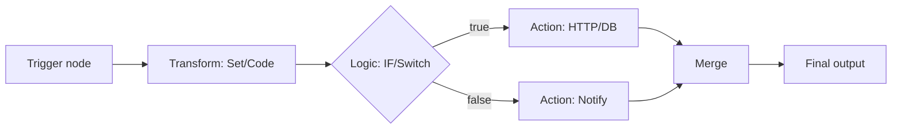

### 14.5 Real example

**Scenario.** Enrich incoming leads: for each lead, look up the company via an API, classify size, and route enterprise leads to Salesforce and the rest to a nurture list.

**Problem.** A naive build calls the API once for all items (wrong shape), mixes classification logic with the API call, and uses unnamed nodes nobody can maintain.

**Solution.** Use the right execution mode (per item for the lookup), isolate classification in a Code node, and route with a Switch — every node descriptively named.

**Implementation.** See the workflow JSON; the lookup runs per item, classification is a pure transform, and routing is explicit.

**Result.** Correct per-lead enrichment, readable graph, and clean separation that makes the classification independently testable.

**Future improvements.** Add batching + rate-limit handling on the lookup (Chapter 19) and pin sample data for fast iteration (Chapter 20).

### 14.6 Step by step

1. Add a Webhook trigger receiving the lead.
2. Add an HTTP Request node (Run Once for Each Item) for the company lookup.
3. Add a Code node that classifies company size into `band`.
4. Add a Switch routing on `band`.
5. Connect enterprise → Salesforce, others → nurture HTTP call.

### 14.7 Complete code (Code node — classification)

```javascript
// Run Once for Each Item — pure transform, no side effects, no process.env (2.x)
const employees = Number($json.company?.employees) || 0;
let band;
if (employees >= 1000) band = 'enterprise';
else if (employees >= 100) band = 'mid-market';
else band = 'smb';

return { json: { ...$json, band } };
```

### 14.8 Complete n8n workflow (importable JSON)

```json
{
  "name": "Lead Enrichment Router",
  "nodes": [
    {
      "parameters": { "httpMethod": "POST", "path": "lead", "responseMode": "onReceived" },
      "id": "30000001-0000-0000-0000-000000000001",
      "name": "Lead Webhook",
      "type": "n8n-nodes-base.webhook",
      "typeVersion": 2,
      "position": [220, 300]
    },
    {
      "parameters": {
        "url": "=https://api.clearbit.example/v1/company?domain={{ $json.body.email.split('@')[1] }}",
        "options": {}
      },
      "id": "30000002-0000-0000-0000-000000000002",
      "name": "Lookup Company",
      "type": "n8n-nodes-base.httpRequest",
      "typeVersion": 4.2,
      "position": [440, 300]
    },
    {
      "parameters": {
        "jsCode": "const employees = Number($json.company?.employees) || 0;\nlet band;\nif (employees >= 1000) band = 'enterprise';\nelse if (employees >= 100) band = 'mid-market';\nelse band = 'smb';\nreturn { json: { ...$json, band } };"
      },
      "id": "30000003-0000-0000-0000-000000000003",
      "name": "Classify Size",
      "type": "n8n-nodes-base.code",
      "typeVersion": 2,
      "position": [660, 300]
    },
    {
      "parameters": {
        "rules": {
          "values": [
            { "conditions": { "options": { "caseSensitive": true }, "conditions": [ { "leftValue": "={{ $json.band }}", "rightValue": "enterprise", "operator": { "type": "string", "operation": "equals" } } ] }, "outputKey": "enterprise" }
          ]
        },
        "options": { "fallbackOutput": "extra" }
      },
      "id": "30000004-0000-0000-0000-000000000004",
      "name": "Route by Band",
      "type": "n8n-nodes-base.switch",
      "typeVersion": 3.2,
      "position": [880, 300]
    }
  ],
  "connections": {
    "Lead Webhook": { "main": [[{ "node": "Lookup Company", "type": "main", "index": 0 }]] },
    "Lookup Company": { "main": [[{ "node": "Classify Size", "type": "main", "index": 0 }]] },
    "Classify Size": { "main": [[{ "node": "Route by Band", "type": "main", "index": 0 }]] }
  },
  "settings": { "executionOrder": "v1" }
}
```

### 14.9 Exercises

1. List, for three nodes you use often, whether they default to per-item or all-items mode.
2. Replace a raw HTTP Request with a native app node and note what you gain (pagination/auth/retries).
3. Add a Filter node that drops leads with a free-email domain.

### 14.10 Challenges

- **Challenge 1.** Convert the classification Code node into a Set/IF combination and discuss the trade-offs.
- **Challenge 2.** Add per-node retry on the lookup and an error output that sends failures to a dead-letter webhook.

### 14.11 Checklist

- [ ] Every node has a descriptive name.
- [ ] Execution mode is correct for each action node.
- [ ] Logic is separated from side effects.
- [ ] Native nodes are used where they exist.
- [ ] Error handling is defined where failure is possible.

### 14.12 Best practices

- Prefer native nodes; drop to HTTP Request only when no node exists.
- Keep transforms pure (no side effects) so they are testable and reorderable.
- Name nodes after what they do, not their type.
- Use sticky notes to document intent on the canvas.

### 14.13 Anti-patterns

- "HTTP Request1", "Code3" — unnamed nodes.
- One Code node doing fetch + transform + write (untestable god-node).
- Wrong execution mode generating N unintended calls.
- Business logic buried in many field expressions instead of one place.

### 14.14 Troubleshooting

| Symptom | Cause | Action |
|---------|-------|--------|
| Node runs N times unexpectedly | Per-item mode on an aggregate step | Switch to all-items / Aggregate first |
| Expression `undefined` | Wrong item path | Inspect input data of the node |
| Switch sends everything to fallback | Condition never matches | Verify operator/value types |
| API node ignores pagination | Used raw HTTP | Use the native node's pagination |

### 14.15 Official references

- Nodes overview: https://docs.n8n.io/integrations/builtin/
- Core nodes (Set, Code, IF, Switch): https://docs.n8n.io/integrations/builtin/core-nodes/
- Item linking: https://docs.n8n.io/data/data-mapping/
- HTTP Request node: https://docs.n8n.io/integrations/builtin/core-nodes/n8n-nodes-base.httprequest/

---

## Chapter 15 — Triggers

### 15.1 Introduction

A trigger is what starts a workflow. n8n 2.x **removed the legacy Start node**; every workflow begins with a specific trigger that defines *how* and *when* it runs. This chapter covers the trigger families — **Webhook**, **Schedule**, **app/event triggers** (polling and push), **Manual**, and special ones like the **Execute Sub-workflow Trigger** and **Error Trigger** — and the semantics that matter in production (active vs. inactive, single vs. queue mode, deduplication).

### 15.2 Business context

The trigger choice shapes latency, cost, and reliability. A polling trigger that checks every minute is simple but laggy and rate-limit-prone; a push webhook is near-real-time but needs a public URL and security. Picking the right trigger — and configuring deduplication and activation correctly — is the difference between a responsive automation and one that double-processes orders or misses events.

### 15.3 Theoretical concepts

- **Webhook trigger:** an HTTP endpoint (`/webhook/<path>`). Production endpoints are active only when the workflow is **Published**; test URLs work in the editor. Supports auth, response modes (`onReceived`, `lastNode`, `responseNode`), and binary input.
- **Schedule trigger:** cron-like, using intervals or cron expressions; respects `GENERIC_TIMEZONE`.
- **App triggers:** either **push** (the app calls n8n, e.g., Stripe/GitHub webhooks via dedicated trigger nodes) or **polling** (n8n periodically queries, e.g., Gmail/RSS), with built-in deduplication so the same item isn't reprocessed.
- **Manual trigger:** for development; not for production.
- **Execute Sub-workflow Trigger:** entry point for sub-workflows called by other workflows.
- **Error Trigger:** starts a workflow when *another* workflow fails — the backbone of centralized error handling (Chapter 19).
- **Activation:** in 2.x, **Publish** activates production triggers (registers webhooks, schedules); **Save** does not.

### 15.4 Architecture

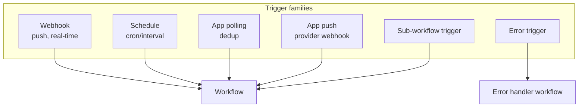

### 15.5 Real example

**Scenario.** A logistics app must react to shipment status changes from a carrier. The carrier offers both a push webhook and a polling API.

**Problem.** Polling every minute is laggy and burns rate limit; raw webhooks risk duplicates on carrier retries.

**Solution.** Use the carrier's push webhook with an idempotency check (deduplicate on event ID using workflow static data), responding 200 fast and processing asynchronously.

**Implementation.** Webhook trigger (respond immediately) → dedup Code node keyed on `eventId` → process. See JSON below.

**Result.** Near-real-time updates, no duplicate processing even when the carrier retries, and a fast 200 that keeps the carrier happy.

**Future improvements.** Add an Error Trigger workflow to catch failures and a schedule-based reconciliation sweep as a safety net.

### 15.6 Step by step

1. Add a Webhook trigger, `responseMode: onReceived` (fast 200).
2. Add a Code node that checks/records `eventId` in static data to dedup.
3. Branch: new event → process; duplicate → no-op.
4. Publish to activate the production webhook.
5. Register the production URL with the carrier.

### 15.7 Complete code (dedup with workflow static data)

```javascript
// Deduplicate carrier events by eventId using workflow static data.
const staticData = $getWorkflowStaticData('global');
staticData.seen = staticData.seen || {};

const id = $json.body.eventId;
if (staticData.seen[id]) {
  return [{ json: { duplicate: true, eventId: id } }];
}
staticData.seen[id] = $now.toMillis();

// Optional: trim memory of old IDs (keep last 10k)
const keys = Object.keys(staticData.seen);
if (keys.length > 10000) {
  keys.slice(0, keys.length - 10000).forEach(k => delete staticData.seen[k]);
}
return [{ json: { duplicate: false, ...$json.body } }];
```

### 15.8 Complete n8n workflow (importable JSON)

```json
{
  "name": "Carrier Webhook with Dedup",
  "nodes": [
    {
      "parameters": { "httpMethod": "POST", "path": "carrier-status", "responseMode": "onReceived" },
      "id": "40000001-0000-0000-0000-000000000001",
      "name": "Carrier Webhook",
      "type": "n8n-nodes-base.webhook",
      "typeVersion": 2,
      "position": [220, 300]
    },
    {
      "parameters": {
        "jsCode": "const s = $getWorkflowStaticData('global');\ns.seen = s.seen || {};\nconst id = $json.body.eventId;\nif (s.seen[id]) return [{ json: { duplicate: true, eventId: id } }];\ns.seen[id] = $now.toMillis();\nreturn [{ json: { duplicate: false, ...$json.body } }];"
      },
      "id": "40000002-0000-0000-0000-000000000002",
      "name": "Dedup",
      "type": "n8n-nodes-base.code",
      "typeVersion": 2,
      "position": [440, 300]
    },
    {
      "parameters": {
        "conditions": { "options": {}, "conditions": [ { "leftValue": "={{ $json.duplicate }}", "rightValue": false, "operator": { "type": "boolean", "operation": "equals" } } ] }
      },
      "id": "40000003-0000-0000-0000-000000000003",
      "name": "Is New?",
      "type": "n8n-nodes-base.if",
      "typeVersion": 2.2,
      "position": [660, 300]
    },
    {
      "parameters": {
        "assignments": { "assignments": [ { "id": "p1", "name": "processed", "type": "boolean", "value": true } ] }
      },
      "id": "40000004-0000-0000-0000-000000000004",
      "name": "Process Status",
      "type": "n8n-nodes-base.set",
      "typeVersion": 3.4,
      "position": [880, 220]
    }
  ],
  "connections": {
    "Carrier Webhook": { "main": [[{ "node": "Dedup", "type": "main", "index": 0 }]] },
    "Dedup": { "main": [[{ "node": "Is New?", "type": "main", "index": 0 }]] },
    "Is New?": { "main": [[{ "node": "Process Status", "type": "main", "index": 0 }], []] }
  },
  "settings": { "executionOrder": "v1" }
}
```

### 15.9 Exercises

1. Build a Schedule trigger that runs at 09:00 in your timezone and confirm `GENERIC_TIMEZONE` is respected.
2. Convert a polling app trigger to a push webhook and note the latency improvement.
3. Trigger the dedup workflow twice with the same `eventId` and confirm the second is a no-op.

### 15.10 Challenges

- **Challenge 1.** Replace static-data dedup with a Redis/DB-backed dedup so it survives restarts and works across workers in queue mode.
- **Challenge 2.** Add an Error Trigger workflow that logs any failure of this workflow to a database.

### 15.11 Checklist

- [ ] Every workflow has an appropriate trigger (no Start node — it's gone).
- [ ] Production webhooks are activated via Publish.
- [ ] Push preferred over polling where available.
- [ ] Idempotency/dedup handled for at-least-once sources.
- [ ] Schedules respect the configured timezone.

### 15.12 Best practices

- Respond fast (`onReceived`) for webhooks and process asynchronously.
- Treat external webhooks as **at-least-once**: always dedup.
- For queue mode, back dedup with a shared store (Redis/DB), not in-process static data.
- Use Error Triggers for centralized failure handling.

### 15.13 Anti-patterns

- Aggressive polling that burns rate limits and lags.
- Assuming webhooks are exactly-once (they aren't).
- Doing heavy work synchronously before responding 200 (timeouts, retries).
- Relying on workflow static data for dedup across multiple workers.

### 15.14 Troubleshooting

| Symptom | Cause | Action |
|---------|-------|--------|
| Webhook 404 in production | Not Published | Click Publish |
| Duplicate processing | No dedup on at-least-once source | Add idempotency key check |
| Schedule fires at wrong hour | Timezone misconfig | Set `GENERIC_TIMEZONE` |
| Carrier marks webhook failed | Slow synchronous response | Use `onReceived`, process async |
| Dedup fails across workers | In-process static data | Use shared Redis/DB dedup |

### 15.15 Official references

- Webhook node: https://docs.n8n.io/integrations/builtin/core-nodes/n8n-nodes-base.webhook/
- Schedule trigger: https://docs.n8n.io/integrations/builtin/core-nodes/n8n-nodes-base.scheduletrigger/
- Trigger concepts: https://docs.n8n.io/flow-logic/
- Error workflows: https://docs.n8n.io/flow-logic/error-handling/

---

## Chapter 16 — Expressions

### 16.1 Introduction

Expressions are how data flows dynamically through a workflow. Wrapped in `{{ }}` and powered by JavaScript plus n8n's helper variables and **Luxon** for dates, expressions let any field reference data from the current item, other nodes, the environment, and the execution context. This chapter is the practical reference for the expression language: syntax, the variable catalog, common patterns, and the 2.x constraints (no `process.env` in Code; `$env` availability rules).

### 16.2 Business context

Expressions are where most "small" production bugs live: a wrong path returns `undefined`, a date is formatted in the wrong timezone, a number is concatenated as a string. Fluency in expressions reduces these defects and removes the need to reach for a Code node for trivial transforms — keeping workflows readable and fast.

### 16.3 Theoretical concepts

- **Syntax:** a field becomes an expression with the `=` prefix in JSON or the `{{ }}` toggle in the UI. Inside, you write JavaScript that returns a value.
- **Core variables:**
  - `$json` — current item's data.
  - `$json.field`, `$json["a b"]` — field access.
  - `$node["Name"].json` / `$("Name").item.json` — another node's output.
  - `$items("Name")` — all items from a node.
  - `$now`, `$today` — Luxon DateTime.
  - `$workflow`, `$execution`, `$runIndex`, `$itemIndex`.
  - `$vars` — instance variables (Enterprise); `$env` — environment variables (subject to access rules).
  - `$secrets` — external secrets (Enterprise).
- **Luxon dates:** `$now.toISO()`, `$now.toFormat('yyyy-LL-dd')`, `$now.plus({ days: 7 })`, `$today.minus({ months: 1 })`.
- **Built-in data transforms:** n8n adds helper methods on strings/arrays/numbers/dates (e.g., `.toSnakeCase()`, `.first()`, `.last()`, `.sum()`) usable in expressions.
- **2.x constraints:** `process.env` is blocked in the Code node; use `$env` (where allowed) or credentials. Expressions remain sandboxed.

### 16.4 Architecture

```mermaid
flowchart LR
    field[Node field] -->|=/{{ }}| expr[Expression engine]
    expr --> ctx[(Context:<br/>$json, $node, $now,<br/>$vars, $execution)]
    ctx --> val[Resolved value]
    val --> field2[Used in node parameter]
```

### 16.5 Real example

**Scenario.** Build an invoice email that greets the customer, shows the total in BRL, lists the due date 30 days out, and includes a tracking link with the order ID.

**Problem.** The team scatters string concatenation and date math across many fields, getting timezone-wrong dates and currency formatted as plain numbers.

**Solution.** Centralize the derived fields in one Set node using clean expressions: Luxon for the due date, `toLocaleString` for currency, template strings for text.

**Implementation.** See the Set node expressions below.

**Result.** Correct, localized currency and dates; one place to read and change the derived fields; no Code node needed.

**Future improvements.** Extract repeated formatting into a sub-workflow or instance variable if reused across workflows.

### 16.6 Step by step

1. Add a Set node after the trigger.
2. Add `customerGreeting`, `totalFormatted`, `dueDate`, `trackingUrl` as expression fields.
3. Use Luxon for dates and `toLocaleString` for currency.
4. Reference these fields downstream in the email node.

### 16.7 Complete code (Set node expressions)

```javascript
// customerGreeting
=Hi {{ $json.customer.firstName }},

// totalFormatted (BRL)
={{ $json.order.total.toLocaleString('pt-BR', { style: 'currency', currency: 'BRL' }) }}

// dueDate (30 days from now, ISO date)
={{ $now.plus({ days: 30 }).toFormat('dd/LL/yyyy') }}

// trackingUrl
=https://track.example/orders/{{ $json.order.id }}
```

### 16.8 Complete n8n workflow (importable JSON)

```json
{
  "name": "Invoice Fields Builder",
  "nodes": [
    {
      "parameters": { "httpMethod": "POST", "path": "invoice", "responseMode": "lastNode" },
      "id": "50000001-0000-0000-0000-000000000001",
      "name": "Invoice In",
      "type": "n8n-nodes-base.webhook",
      "typeVersion": 2,
      "position": [220, 300]
    },
    {
      "parameters": {
        "assignments": {
          "assignments": [
            { "id": "e1", "name": "greeting", "type": "string", "value": "=Hi {{ $json.body.customer.firstName }}," },
            { "id": "e2", "name": "totalFormatted", "type": "string", "value": "={{ $json.body.order.total.toLocaleString('pt-BR', { style: 'currency', currency: 'BRL' }) }}" },
            { "id": "e3", "name": "dueDate", "type": "string", "value": "={{ $now.plus({ days: 30 }).toFormat('dd/LL/yyyy') }}" },
            { "id": "e4", "name": "trackingUrl", "type": "string", "value": "=https://track.example/orders/{{ $json.body.order.id }}" }
          ]
        }
      },
      "id": "50000002-0000-0000-0000-000000000002",
      "name": "Build Fields",
      "type": "n8n-nodes-base.set",
      "typeVersion": 3.4,
      "position": [440, 300]
    }
  ],
  "connections": {
    "Invoice In": { "main": [[{ "node": "Build Fields", "type": "main", "index": 0 }]] }
  },
  "settings": { "executionOrder": "v1" }
}
```

### 16.9 Exercises

1. Write an expression returning the first day of next month in `yyyy-LL-dd`.
2. Reference a field from a node two steps back using `$("NodeName").item.json`.
3. Format a number as a percentage with one decimal.

### 16.10 Challenges

- **Challenge 1.** Build an expression that returns "today", "yesterday", or the formatted date depending on how old a timestamp is.
- **Challenge 2.** Convert a deeply nested object into a flat key list using only an expression (no Code node).

### 16.11 Checklist

- [ ] I know the core variables (`$json`, `$node/$()`, `$now`, `$execution`, `$vars`).
- [ ] I use Luxon for all date math.
- [ ] I format currency/percent with locale methods.
- [ ] I avoid `process.env` in Code (2.x) and use `$env`/credentials.
- [ ] I centralize derived fields in one Set node.

### 16.12 Best practices

- Keep expressions short; if logic grows, move it to a documented Code node.
- Centralize derived/computed fields in one Set node per concern.
- Always do date math with Luxon and explicit formats/timezones.
- Reference nodes by stable names; renaming a node breaks `$()` references.

### 16.13 Anti-patterns

- Giant multiline expressions duplicated across fields.
- String math on dates instead of Luxon.
- Referencing `process.env` in Code (blocked in 2.x).
- Hardcoding values that should be `$vars`/credentials.

### 16.14 Troubleshooting

| Symptom | Cause | Action |
|---------|-------|--------|
| `undefined` value | Wrong path / missing field | Inspect input; use optional chaining |
| Date off by hours | Timezone not set | Use Luxon with explicit zone / `GENERIC_TIMEZONE` |
| `$()` reference errors | Node renamed | Update references to new name |
| Number rendered oddly | String concatenation | Coerce with `Number()` |
| `$env` empty | Access disabled (2.x) | Use credentials or enable env access |

### 16.15 Official references

- Expressions: https://docs.n8n.io/code/expressions/
- Built-in variables: https://docs.n8n.io/code/builtin/overview/
- Luxon / dates: https://docs.n8n.io/code/builtin/date-time/
- Data transformation functions: https://docs.n8n.io/code/builtin/data-transformation-functions/

---

## Chapter 17 — Variables

### 17.1 Introduction

"Variables" in n8n spans several distinct mechanisms that beginners conflate: **instance variables** (`$vars`, Enterprise), **environment variables** (`$env`/system env), **workflow static data** (persistent per-workflow state), **external secrets** (`$secrets`, Enterprise vault integration), and ordinary **per-execution data** carried in items. This chapter disentangles them — what each is for, its scope, lifetime, and security posture — so you store the right thing in the right place.

### 17.2 Business context

Putting a secret in the wrong place is a security incident; putting shared config in the wrong place is a maintenance nightmare. Knowing that API keys belong in **credentials/external secrets**, environment-specific URLs belong in **instance variables**, and cross-execution counters belong in **static data** prevents both leaks and brittle copy-paste configuration across workflows.

### 17.3 Theoretical concepts

| Mechanism | Scope | Lifetime | Use for | Security |
|-----------|-------|----------|---------|----------|
| Items data | Single execution | One run | Payloads, derived fields | In execution data |
| `$vars` (instance variables) | Instance-wide | Until changed | Env URLs, flags, non-secret config | Visible to editors (Enterprise) |
| `$env` / system env | Process | Process life | Host config | Not for secrets in Code (2.x blocks `process.env`) |
| Workflow static data | Single workflow | Persistent | Counters, cursors, dedup state | Stored with workflow |
| Credentials | Referenced by nodes | Until changed | API keys, passwords | Encrypted at rest |
| `$secrets` (external secrets) | Instance-wide | Synced from vault | Secrets from Vault/AWS/etc. | Pulled from external vault (Enterprise) |

- **Instance variables (`$vars`):** key-value config set in the UI/API, read in expressions as `$vars.myKey`. Ideal for per-environment URLs and feature flags.
- **Static data:** `$getWorkflowStaticData('global'|'node')` — survives executions; perfect for polling cursors and dedup (Chapter 15). Note: in queue mode it persists with the workflow but is not a substitute for a shared store across concurrent workers.
- **External secrets:** integrate HashiCorp Vault / cloud secret managers; reference as `$secrets.provider.key`.

### 17.4 Architecture

```mermaid
flowchart TB
    subgraph runtime["At execution"]
        items[(Items data<br/>per execution)]
        vars[($vars<br/>instance config)]
        static[(Static data<br/>persistent state)]
        cred[(Credentials<br/>encrypted)]
        sec[($secrets<br/>external vault)]
    end
    node[Node / Expression] --> items
    node --> vars
    node --> static
    node --> cred
    node --> sec
```

### 17.5 Real example

**Scenario.** The same workflow runs in dev and prod, calling a base API URL that differs per environment and a secret API key that must never appear in the workflow JSON, while tracking a polling cursor between runs.

**Problem.** The team hardcoded the URL (breaks on promotion) and pasted the key into a header field (leaks in exports).

**Solution.** Put the base URL in an instance variable (`$vars.apiBaseUrl`), the key in credentials/external secrets, and the cursor in workflow static data.

**Implementation.** Expressions reference `$vars.apiBaseUrl`; the HTTP node uses a credential; a Code node reads/writes the cursor in static data.

**Result.** One workflow promotes cleanly across environments, no secret in exports, and incremental polling that resumes where it left off.

**Future improvements.** Move the key to HashiCorp Vault via `$secrets` for centralized rotation.

### 17.6 Step by step

1. Define `apiBaseUrl` as an instance variable per environment.
2. Store the API key as a credential (or `$secrets`).
3. Reference `={{ $vars.apiBaseUrl }}` in the HTTP node URL.
4. Use static data for the polling cursor.
5. Promote the workflow without editing URLs or keys.

### 17.7 Complete code (Code node — cursor in static data)

```javascript
// Persistent polling cursor across executions
const s = $getWorkflowStaticData('global');
const since = s.cursor || '1970-01-01T00:00:00Z';

// Build the request marker; the HTTP node will use $json.since
const nextCursor = $now.toISO();
s.cursor = nextCursor; // advance for next run

return [{ json: { since, nextCursor, baseUrl: $vars.apiBaseUrl } }];
```

### 17.8 Complete n8n workflow (importable JSON)

```json
{
  "name": "Incremental Poller",
  "nodes": [
    {
      "parameters": { "rule": { "interval": [{ "field": "minutes", "minutesInterval": 5 }] } },
      "id": "60000001-0000-0000-0000-000000000001",
      "name": "Every 5m",
      "type": "n8n-nodes-base.scheduleTrigger",
      "typeVersion": 1.2,
      "position": [220, 300]
    },
    {
      "parameters": {
        "jsCode": "const s = $getWorkflowStaticData('global');\nconst since = s.cursor || '1970-01-01T00:00:00Z';\ns.cursor = $now.toISO();\nreturn [{ json: { since, baseUrl: $vars.apiBaseUrl } }];"
      },
      "id": "60000002-0000-0000-0000-000000000002",
      "name": "Cursor",
      "type": "n8n-nodes-base.code",
      "typeVersion": 2,
      "position": [440, 300]
    },
    {
      "parameters": {
        "url": "={{ $json.baseUrl }}/events?since={{ $json.since }}",
        "options": {}
      },
      "id": "60000003-0000-0000-0000-000000000003",
      "name": "Fetch Events",
      "type": "n8n-nodes-base.httpRequest",
      "typeVersion": 4.2,
      "position": [660, 300],
      "credentials": { "httpHeaderAuth": { "id": "1", "name": "API Key Header" } }
    }
  ],
  "connections": {
    "Every 5m": { "main": [[{ "node": "Cursor", "type": "main", "index": 0 }]] },
    "Cursor": { "main": [[{ "node": "Fetch Events", "type": "main", "index": 0 }]] }
  },
  "settings": { "executionOrder": "v1" }
}
```

### 17.9 Exercises

1. Move a hardcoded URL into an instance variable and reference it.
2. Store and advance a cursor in static data; confirm it persists across runs.
3. Identify which of your current "variables" are actually secrets and move them to credentials.

### 17.10 Challenges

- **Challenge 1.** Integrate an external secrets provider and reference `$secrets` instead of a stored credential value.
- **Challenge 2.** Make the cursor safe under queue-mode concurrency by moving it to a Redis/DB store.

### 17.11 Checklist

- [ ] Secrets are in credentials/external secrets, never in fields or static data.
- [ ] Per-environment config is in instance variables.
- [ ] Cross-execution state is in static data (single-worker) or a shared store (queue mode).
- [ ] No `process.env` reads in Code (2.x).
- [ ] Workflows promote across environments without edits.

### 17.12 Best practices

- One source of truth per concern: secrets→credentials, config→`$vars`, state→static data/shared store.
- Prefer external secrets for centralized rotation in enterprise setups.
- Keep static data small; prune old entries.
- Make workflows environment-agnostic via `$vars`.

### 17.13 Anti-patterns

- Secrets in fields, Code, or static data.
- Hardcoded per-environment URLs.
- Static data used as cross-worker shared state under concurrency.
- Treating items data as durable storage.

### 17.14 Troubleshooting

| Symptom | Cause | Action |
|---------|-------|--------|
| Config differs per env breaks promotion | Hardcoded values | Use `$vars` |
| Secret leaked in export | Stored in a field | Move to credentials/`$secrets` |
| Cursor resets each run | Used items data, not static | Use `$getWorkflowStaticData` |
| Duplicate processing in queue mode | Static data not shared | Use Redis/DB shared store |
| `$vars` undefined | Not on Enterprise / not set | Set the variable; check plan |

### 17.15 Official references

- Variables: https://docs.n8n.io/code/variables/
- Static data: https://docs.n8n.io/code/builtin/workflow-static-data/
- External secrets: https://docs.n8n.io/external-secrets/
- Credentials: https://docs.n8n.io/credentials/

---

## Chapter 18 — Data Mapping

### 18.1 Introduction

Integration is mostly **shape translation**: the source emits one structure, the destination expects another. n8n's data mapping toolkit — **Edit Fields (Set)**, **Code**, **Split Out**, **Aggregate**, **Merge**, **Rename Keys**, drag-and-drop mapping, and item linking — is how you bridge them. This chapter covers the patterns: flattening, nesting, joining two streams, fanning out arrays into items, and collapsing items back into one.

### 18.2 Business context

Most integration bugs are mapping bugs: a field renamed, a nested array not flattened, two streams merged on the wrong key. Mastery of mapping turns brittle, copy-pasted transforms into reliable, readable ones — directly reducing the defect rate of every integration you build (Part IV depends entirely on this).

### 18.3 Theoretical concepts

- **Item linking:** n8n tracks which output item came from which input item, so downstream nodes can reference earlier data (`$("Node").item`) correctly even after transformations — crucial when merging.
- **Set (Edit Fields):** declaratively map/rename/compute fields; "keep only set" vs. "include other fields."
- **Split Out:** turn an array field into one item per element (fan-out).
- **Aggregate:** collapse many items into one (gather a field into an array, or combine all data).
- **Merge:** combine two input streams — by **append**, by **position (index)**, or by **matching key (join)** (inner/outer-style combine).
- **Code for complex maps:** when declarative nodes aren't enough, a Code node returns a new item array.

### 18.4 Architecture

```mermaid
flowchart LR
    src[Source items] --> so[Split Out<br/>array→items]
    so --> set[Set<br/>rename/compute]
    set --> mrg[Merge by key]
    other[Second stream] --> mrg
    mrg --> agg[Aggregate<br/>items→one]
    agg --> dest[Destination shape]
```

### 18.5 Real example

**Scenario.** Combine an orders stream (from an API) with a customers stream (from the CRM) on `customerId`, flatten each order's line items, and produce one record per line item with customer details attached.

**Problem.** Naive concatenation loses the customer-order relationship; line items stay nested; the destination rejects the payload.

**Solution.** Merge orders + customers by matching `customerId`, then Split Out the `lines` array, then Set to flatten the final shape.

**Implementation.** Merge (combine by matching field) → Split Out `lines` → Set mapping. See JSON.

**Result.** One clean item per line item, each carrying the right customer fields — accepted by the destination on the first try.

**Future improvements.** Add a Filter to drop zero-quantity lines and an Aggregate to also produce an order-level summary stream.

### 18.6 Step by step

1. Bring in two streams: Orders and Customers.
2. Merge by matching `customerId` (combine).
3. Split Out the `lines` array into items.
4. Set to flatten: `sku`, `qty`, `price`, `customerName`, `customerTier`.
5. Send to the destination.

### 18.7 Complete code (Code node — equivalent merge+flatten)

```javascript
// Alternative to Merge+SplitOut: join orders with customers and flatten lines.
const orders = $("Orders").all().map(i => i.json);
const customers = Object.fromEntries(
  $("Customers").all().map(i => [i.json.customerId, i.json])
);

const out = [];
for (const o of orders) {
  const c = customers[o.customerId] || {};
  for (const line of (o.lines || [])) {
    out.push({
      json: {
        orderId: o.id,
        sku: line.sku,
        qty: Number(line.qty) || 0,
        price: Number(line.price) || 0,
        customerName: c.name ?? null,
        customerTier: c.tier ?? 'standard'
      }
    });
  }
}
return out;
```

### 18.8 Complete n8n workflow (importable JSON)

```json
{
  "name": "Orders x Customers Flatten",
  "nodes": [
    {
      "parameters": { "rule": { "interval": [{ "field": "hours", "hoursInterval": 1 }] } },
      "id": "70000001-0000-0000-0000-000000000001",
      "name": "Hourly",
      "type": "n8n-nodes-base.scheduleTrigger",
      "typeVersion": 1.2,
      "position": [200, 300]
    },
    {
      "parameters": { "url": "https://api.example/orders", "options": {} },
      "id": "70000002-0000-0000-0000-000000000002",
      "name": "Orders",
      "type": "n8n-nodes-base.httpRequest",
      "typeVersion": 4.2,
      "position": [420, 220]
    },
    {
      "parameters": { "url": "https://crm.example/customers", "options": {} },
      "id": "70000003-0000-0000-0000-000000000003",
      "name": "Customers",
      "type": "n8n-nodes-base.httpRequest",
      "typeVersion": 4.2,
      "position": [420, 380]
    },
    {
      "parameters": {
        "mode": "combine",
        "advanced": true,
        "joinMode": "enrichInput1",
        "mergeByFields": { "values": [ { "field1": "customerId", "field2": "customerId" } ] },
        "options": {}
      },
      "id": "70000004-0000-0000-0000-000000000004",
      "name": "Merge by Customer",
      "type": "n8n-nodes-base.merge",
      "typeVersion": 3,
      "position": [640, 300]
    },
    {
      "parameters": { "fieldToSplitOut": "lines", "options": {} },
      "id": "70000005-0000-0000-0000-000000000005",
      "name": "Split Lines",
      "type": "n8n-nodes-base.splitOut",
      "typeVersion": 1,
      "position": [860, 300]
    },
    {
      "parameters": {
        "assignments": {
          "assignments": [
            { "id": "m1", "name": "sku", "type": "string", "value": "={{ $json.sku }}" },
            { "id": "m2", "name": "qty", "type": "number", "value": "={{ Number($json.qty) }}" },
            { "id": "m3", "name": "customerTier", "type": "string", "value": "={{ $json.tier || 'standard' }}" }
          ]
        }
      },
      "id": "70000006-0000-0000-0000-000000000006",
      "name": "Flatten",
      "type": "n8n-nodes-base.set",
      "typeVersion": 3.4,
      "position": [1080, 300]
    }
  ],
  "connections": {
    "Hourly": { "main": [[{ "node": "Orders", "type": "main", "index": 0 }, { "node": "Customers", "type": "main", "index": 0 }]] },
    "Orders": { "main": [[{ "node": "Merge by Customer", "type": "main", "index": 0 }]] },
    "Customers": { "main": [[{ "node": "Merge by Customer", "type": "main", "index": 1 }]] },
    "Merge by Customer": { "main": [[{ "node": "Split Lines", "type": "main", "index": 0 }]] },
    "Split Lines": { "main": [[{ "node": "Flatten", "type": "main", "index": 0 }]] }
  },
  "settings": { "executionOrder": "v1" }
}
```

### 18.9 Exercises

1. Use Split Out to turn an array field into items, then Aggregate to put it back.
2. Merge two streams by position and by matching key; compare results.
3. Flatten a two-level-nested object into a single-level item with Set.

### 18.10 Challenges

- **Challenge 1.** Implement an outer-join behavior where unmatched orders still pass through with null customer fields.
- **Challenge 2.** Produce two outputs from one stream: per-line items and an order-level summary, using Split Out + Aggregate.

### 18.11 Checklist

- [ ] I understand item linking and how Merge uses it.
- [ ] I can fan out arrays with Split Out and collapse with Aggregate.
- [ ] I can merge by append/position/key.
- [ ] I flatten/nest with Set or Code appropriately.
- [ ] My destination shape matches the contract.

### 18.12 Best practices

- Prefer declarative nodes (Set/Split Out/Merge/Aggregate) over Code for clarity.
- Validate the destination contract before mapping; map to it explicitly.
- Keep one mapping concern per node; don't overload a single Set.
- Use Code only when the transform is genuinely complex.

### 18.13 Anti-patterns

- Merging streams by position when you meant by key.
- Leaving arrays nested when the destination expects items.
- One Code node doing all mapping (unreadable).
- Losing item linking by overwriting items in a way that breaks `$("Node").item`.

### 18.14 Troubleshooting

| Symptom | Cause | Action |
|---------|-------|--------|
| Wrong rows joined | Merge by position not key | Use combine-by-matching-field |
| Destination rejects nested array | Not flattened | Split Out the array |
| `$("Node").item` wrong | Item linking broken | Avoid rebuilding items blindly; map fields |
| Lost fields after Set | "Keep only set" enabled | Include other input fields |
| Aggregate returns nothing | Wrong field to aggregate | Verify field path |

### 18.15 Official references

- Data mapping: https://docs.n8n.io/data/data-mapping/
- Merge node: https://docs.n8n.io/integrations/builtin/core-nodes/n8n-nodes-base.merge/
- Split Out / Aggregate: https://docs.n8n.io/integrations/builtin/core-nodes/n8n-nodes-base.splitout/
- Item linking: https://docs.n8n.io/data/data-mapping/data-item-linking/

---

## Chapter 19 — Error Handling

### 19.1 Introduction

Production workflows fail: APIs time out, rate limits hit, payloads are malformed. The difference between an amateur and a production-grade workflow is **deliberate error handling** — per-node `onError` behavior, retries with backoff, error outputs, the **Error Trigger** for centralized handling, and **dead-letter** patterns for messages that can't be processed. This chapter makes failure a first-class design concern.

### 19.2 Business context

Unhandled errors cause silent data loss, duplicate side effects, and 3 a.m. pages. A well-designed error strategy turns failures into observable, recoverable events — protecting data integrity and SLAs. For regulated workloads, an auditable failure trail is often a compliance requirement, not a nicety.

### 19.3 Theoretical concepts

- **Per-node `onError`:** `stopWorkflow` (default), `continueRegularOutput` (pass the error item down the normal path), or `continueErrorOutput` (route failures to a second output). The error output enables branch-specific handling.
- **Retries:** nodes support automatic retries (`retryOnFail`, `maxTries`, `waitBetweenTries`) — essential for transient failures and rate limits.
- **Error Trigger:** a workflow that runs when *another* workflow errors, receiving the error context. Set per-workflow via Settings → Error Workflow. The backbone of centralized handling/alerting.
- **Stop and Error node:** deliberately throw with a custom message (e.g., on failed validation).
- **Dead-letter pattern:** route irrecoverable items to a durable store/queue for later inspection/replay, instead of dropping them.
- **Idempotency:** combine with dedup (Chapter 15) so retries don't double-apply side effects.

### 19.4 Architecture

```mermaid
flowchart TB
    n[Action node] -->|success| ok[Continue]
    n -->|error output| handle[Handle error]
    handle --> retry{Transient?}
    retry -->|yes| again[Retry/backoff]
    retry -->|no| dlq[(Dead-letter store)]
    wf[Any workflow] -. on failure .-> et[Error Trigger workflow]
    et --> alert[Alert + log]
    et --> dlq
```

### 19.5 Real example

**Scenario.** A payment-reconciliation workflow calls a flaky bank API. Transient 5xx and 429 rate limits are common; occasionally a record is permanently invalid.

**Problem.** Without handling, a single 429 fails the whole batch and loses progress; invalid records crash the run with no trail.

**Solution.** Enable retries with backoff on the API node, route hard failures to the error output → dead-letter table, and attach a centralized Error Trigger workflow that alerts and logs.

**Implementation.** Retry config on the HTTP node; `continueErrorOutput` → Postgres dead-letter insert; an Error Trigger workflow posts to Slack and logs the error context.

**Result.** Transient failures self-heal via retry; permanent failures are captured in a dead-letter table for replay; the team is alerted with full context — no silent loss.

**Future improvements.** Add exponential backoff with jitter via a Wait+loop, and an automated replay workflow that re-processes dead-letter rows.

### 19.6 Step by step

1. On the API node, enable `retryOnFail`, set `maxTries=3`, `waitBetweenTries` and `onError=continueErrorOutput`.
2. Route the error output to a Postgres insert (dead-letter).
3. Create an Error Trigger workflow; set it as the workflow's Error Workflow.
4. In the Error Trigger workflow, post to Slack and log the error JSON.

### 19.7 Complete code (Error Trigger handler — Code node)

```javascript
// Runs inside the Error Trigger workflow. Normalizes error context for alerting/logging.
const e = $json;   // Error Trigger provides execution + error metadata
return [{
  json: {
    workflow: e.workflow?.name ?? 'unknown',
    executionId: e.execution?.id ?? null,
    nodeName: e.execution?.lastNodeExecuted ?? null,
    message: e.execution?.error?.message ?? e.error?.message ?? 'unknown error',
    stack: e.execution?.error?.stack ?? null,
    at: $now.toISO()
  }
}];
```

### 19.8 Complete n8n workflow (importable JSON — centralized error handler)

```json
{
  "name": "Central Error Handler",
  "nodes": [
    {
      "parameters": {},
      "id": "80000001-0000-0000-0000-000000000001",
      "name": "On Error",
      "type": "n8n-nodes-base.errorTrigger",
      "typeVersion": 1,
      "position": [220, 300]
    },
    {
      "parameters": {
        "jsCode": "const e = $json;\nreturn [{ json: { workflow: e.workflow?.name, executionId: e.execution?.id, node: e.execution?.lastNodeExecuted, message: e.execution?.error?.message || 'unknown', at: $now.toISO() } }];"
      },
      "id": "80000002-0000-0000-0000-000000000002",
      "name": "Normalize",
      "type": "n8n-nodes-base.code",
      "typeVersion": 2,
      "position": [440, 300]
    },
    {
      "parameters": {
        "operation": "insert",
        "schema": { "__rl": true, "value": "public", "mode": "list" },
        "table": { "__rl": true, "value": "workflow_errors", "mode": "list" },
        "columns": { "mappingMode": "autoMapInputData", "value": {} },
        "options": {}
      },
      "id": "80000003-0000-0000-0000-000000000003",
      "name": "Log to DB",
      "type": "n8n-nodes-base.postgres",
      "typeVersion": 2.5,
      "position": [660, 220],
      "credentials": { "postgres": { "id": "1", "name": "Ops Postgres" } }
    },
    {
      "parameters": {
        "method": "POST",
        "url": "https://hooks.slack.com/services/REPLACE",
        "sendBody": true,
        "specifyBody": "json",
        "jsonBody": "={{ { \"text\": ':rotating_light: *' + $json.workflow + '* failed at node *' + $json.node + '*: ' + $json.message } }}",
        "options": {}
      },
      "id": "80000004-0000-0000-0000-000000000004",
      "name": "Alert Slack",
      "type": "n8n-nodes-base.httpRequest",
      "typeVersion": 4.2,
      "position": [660, 380]
    }
  ],
  "connections": {
    "On Error": { "main": [[{ "node": "Normalize", "type": "main", "index": 0 }]] },
    "Normalize": { "main": [[{ "node": "Log to DB", "type": "main", "index": 0 }, { "node": "Alert Slack", "type": "main", "index": 0 }]] }
  },
  "settings": { "executionOrder": "v1" }
}
```

### 19.9 Exercises

1. Configure retries on an HTTP node and force a 500 to watch it retry.
2. Route an error output to a dead-letter table.
3. Attach the Central Error Handler as the Error Workflow for a flow and trigger a failure.

### 19.10 Challenges

- **Challenge 1.** Implement exponential backoff with jitter for 429 responses using Wait + a loop, honoring `Retry-After`.
- **Challenge 2.** Build a replay workflow that reads dead-letter rows and re-processes them idempotently.

### 19.11 Checklist

- [ ] Critical nodes have retry + sensible `onError`.
- [ ] Hard failures go to a dead-letter store, not the void.
- [ ] A centralized Error Trigger workflow alerts + logs.
- [ ] Side effects are idempotent so retries are safe.
- [ ] Error context is captured for debugging/audit.

### 19.12 Best practices

- Distinguish transient (retry) from permanent (dead-letter) failures.
- Always pair retries with idempotency to avoid double side effects.
- Centralize alerting/logging in one Error Trigger workflow reused across flows.
- Honor `Retry-After` and rate-limit headers.

### 19.13 Anti-patterns

- `onError=continueRegularOutput` everywhere, silently swallowing failures.
- Retrying non-idempotent writes without dedup (double charges, duplicate records).
- No dead-letter: bad items vanish.
- Per-workflow ad-hoc alerting instead of a shared handler.

### 19.14 Troubleshooting

| Symptom | Cause | Action |
|---------|-------|--------|
| Whole batch fails on one bad item | No error output branch | Use `continueErrorOutput` |
| Duplicate side effects after retry | Non-idempotent writes | Add idempotency/dedup |
| Failures unnoticed | No Error Workflow set | Attach a central Error Trigger |
| 429 storms | No backoff | Backoff + honor `Retry-After` |
| Lost bad records | No dead-letter | Route errors to a durable store |

### 19.15 Official references

- Error handling: https://docs.n8n.io/flow-logic/error-handling/
- Error Trigger node: https://docs.n8n.io/integrations/builtin/core-nodes/n8n-nodes-base.errortrigger/
- Node error options/retries: https://docs.n8n.io/integrations/builtin/core-nodes/n8n-nodes-base.stopanderror/
- Executions: https://docs.n8n.io/workflows/executions/

---

## Chapter 20 — Debugging

### 20.1 Introduction

Debugging is where time is won or lost. n8n provides a strong toolkit: the **Executions** view (full input/output per node, including errors), **data pinning** (freeze a node's output to iterate without re-calling APIs), **manual execution** with step inspection, **re-run from a node**, and the **Code node** with logging. This chapter is a practical method for diagnosing workflow problems fast, plus the 2.x specifics (task-runner logs, secure Code node).

### 20.2 Business context

Mean-time-to-resolution on a broken automation directly affects the business it serves. A team that knows how to pin data, inspect executions, and reproduce failures resolves incidents in minutes; one that doesn't re-deploys blindly and erodes trust in the platform. Debugging skill is operational leverage.

### 20.3 Theoretical concepts

- **Executions view:** every run is persisted (subject to save settings) with per-node input/output and error details — your primary forensic tool. You can open a failed execution and inspect exactly what each node received and returned.
- **Data pinning:** pin a node's output during development so downstream nodes use frozen data — no repeated external calls, deterministic iteration. Pinned data is for editing/testing, not production.
- **Manual execution + partial runs:** run the workflow in the editor and execute from a specific node, reusing upstream data.
- **Code node logging:** `console.log` output appears in the execution logs / runner logs; use it to trace values.
- **Re-run / retry executions:** re-execute a past execution to reproduce or to recover after a fix.
- **2.x notes:** Code runs in a task runner; logs surface in runner output. `process.env` is blocked — don't debug by printing env.

### 20.4 Architecture

```mermaid
flowchart LR
    dev([Developer]) --> editor[Editor]
    editor -->|manual run| engine[Engine]
    engine --> exec[(Executions store)]
    editor -->|pin| pin[(Pinned data)]
    exec --> inspect[Per-node input/output]
    inspect --> dev
    code[Code node console.log] --> runner[Task runner logs]
    runner --> dev
```

### 20.5 Real example

**Scenario.** A workflow intermittently produces emails with `undefined` customer names. It calls a slow CRM API and a templating Set node.

**Problem.** The failure is intermittent and tied to live API responses, making it hard to reproduce by re-running (the API behaves differently each time).

**Solution.** Capture a failing execution, pin the CRM node's output from that run, and iterate on the Set node deterministically until the expression is robust to missing fields.

**Implementation.** Open the failing execution → copy the CRM output → pin it on the CRM node → fix the Set expression with optional chaining + fallback → unpin → publish.

**Result.** Root cause found (some CRM records lack `name`); expression hardened with a fallback; the intermittent bug eliminated — all without hammering the live API.

**Future improvements.** Add a Filter/validation step that flags records missing required fields, and a test that runs the workflow against pinned edge-case data in CI (Chapter 44).

### 20.6 Step by step

1. Reproduce: open the failing execution in the Executions view.
2. Inspect each node's input/output to localize where `name` becomes `undefined`.
3. Pin the upstream node's output from the failing run.
4. Iterate on the failing node with frozen data until fixed.
5. Harden the expression; unpin; publish.

### 20.7 Complete code (defensive Set/Code with logging)

```javascript
// Defensive transform with tracing; safe under missing fields.
const name = $json.customer?.name?.trim();
if (!name) {
  console.log('Missing customer name for record', $json.customer?.id ?? '(no id)');
}
return {
  json: {
    ...$json,
    greetingName: name || 'there',     // safe fallback
    needsReview: !name
  }
};
```

### 20.8 Complete n8n workflow (importable JSON — debug-friendly)

```json
{
  "name": "Debuggable Greeting",
  "nodes": [
    {
      "parameters": { "httpMethod": "POST", "path": "greet", "responseMode": "lastNode" },
      "id": "90000001-0000-0000-0000-000000000001",
      "name": "In",
      "type": "n8n-nodes-base.webhook",
      "typeVersion": 2,
      "position": [220, 300]
    },
    {
      "parameters": {
        "jsCode": "const name = $json.body?.customer?.name?.trim();\nif (!name) console.log('Missing name', $json.body?.customer?.id);\nreturn { json: { ...$json.body, greetingName: name || 'there', needsReview: !name } };"
      },
      "id": "90000002-0000-0000-0000-000000000002",
      "name": "Safe Greeting",
      "type": "n8n-nodes-base.code",
      "typeVersion": 2,
      "position": [440, 300]
    },
    {
      "parameters": {
        "conditions": { "options": {}, "conditions": [ { "leftValue": "={{ $json.needsReview }}", "rightValue": true, "operator": { "type": "boolean", "operation": "equals" } } ] }
      },
      "id": "90000003-0000-0000-0000-000000000003",
      "name": "Needs Review?",
      "type": "n8n-nodes-base.if",
      "typeVersion": 2.2,
      "position": [660, 300]
    }
  ],
  "connections": {
    "In": { "main": [[{ "node": "Safe Greeting", "type": "main", "index": 0 }]] },
    "Safe Greeting": { "main": [[{ "node": "Needs Review?", "type": "main", "index": 0 }]] }
  },
  "settings": { "executionOrder": "v1" }
}
```

### 20.9 Exercises

1. Pin a node's output and iterate on a downstream node without re-calling the API.
2. Open a failed execution and trace where a field became `undefined`.
3. Add `console.log` to a Code node and find the output in the logs.

### 20.10 Challenges

- **Challenge 1.** Build a small library of pinned edge-case payloads and run the workflow against each to prove robustness.
- **Challenge 2.** Re-run a historical failed execution after a fix and confirm it now succeeds.

### 20.11 Checklist

- [ ] I use the Executions view to inspect per-node I/O.
- [ ] I pin data to iterate without external calls.
- [ ] I write defensive expressions (optional chaining + fallbacks).
- [ ] I use `console.log` and read runner logs.
- [ ] I unpin before publishing.

### 20.12 Best practices

- Pin once, iterate many — never debug against a live, changing API.
- Make transforms defensive; treat missing fields as expected.
- Keep failing executions saved so you can reproduce.
- Flag (don't silently fix) bad data via a `needsReview` path.

### 20.13 Anti-patterns

- Re-deploying blindly without inspecting executions.
- Leaving pinned data in a published workflow (stale/fake production data).
- Swallowing `undefined` instead of flagging it.
- Disabling execution saving, then being unable to reproduce failures.

### 20.14 Troubleshooting

| Symptom | Cause | Action |
|---------|-------|--------|
| Can't reproduce intermittent bug | Live API variance | Pin the failing payload and iterate |
| Production uses fake data | Pinned data left on | Unpin before Publish |
| No execution to inspect | Saving disabled | Enable execution saving for the flow |
| `console.log` not visible | Looking in wrong place (2.x) | Check task-runner/execution logs |
| Field `undefined` downstream | Upstream missing field | Add optional chaining + fallback |

### 20.15 Official references

- Executions: https://docs.n8n.io/workflows/executions/
- Data pinning: https://docs.n8n.io/data/data-pinning/
- Debugging: https://docs.n8n.io/workflows/executions/debug/
- Code node: https://docs.n8n.io/code/code-node/

---

> **End of Part III.** You can now build workflows with intent: the right nodes and triggers, fluent expressions, the correct variable mechanism for each concern, reliable data mapping, deliberate error handling, and fast debugging. **Part IV — Integrations** (Chapters 21–30) puts these skills to work against the real world: REST and GraphQL APIs, webhooks, databases, message brokers (Kafka, RabbitMQ), Redis, and the AWS/Google/Microsoft service ecosystems.

<!--APPEND-PARTE-II-->
