# n8n - Complete Professional Guide

> **Category:** 13_automation_and_integration · **Language:** English

---

### Workflow Automation, Enterprise Integrations, and Generative AI in Production
**Edition updated for n8n 2.x (June 2026)**

> **Reference book (English).** A definitive guide for professionals, architects, and enterprises, covering everything from beginner to enterprise level. Based primarily on the official documentation (https://docs.n8n.io), the release notes (https://docs.n8n.io/release-notes/), and the official repository (https://github.com/n8n-io/n8n).
>
> **Version notice:** the content reflects the **2.x** line, whose milestone was n8n **2.0** (beta on 2025-12-08, stable on 2025-12-15), with near-weekly patches through June 2026. Relevant changes between versions appear in **"What's New in This Version"** sections.

---

## How to read this book

The book progresses through five maturity levels:

| Level | Profile | Parts |
|-------|---------|-------|
| 1 — Beginner | First contact with n8n | Part I |
| 2 — Intermediate | Building workflows and integrations | Parts II–IV |
| 3 — Advanced | Generative AI, agents, professional development | Parts V–VI |
| 4 — Specialist | Security, observability, scalability | Part VII |
| 5 — Enterprise | End-to-end real projects | Part VIII |

**Target audience:** Java and full-stack developers, data engineers, software engineers, solutions architects, AI engineers, DevOps professionals, tech leads, CTOs, and automation consultants.

**Structure of each chapter:** Introduction · Business context · Theoretical concepts · Architecture · Diagrams (Mermaid) · Real examples · Step by step · Complete code · Complete n8n workflows · Exercises · Challenges · Checklist · Best practices · Anti-patterns · Troubleshooting · Official references.

**Example format:** Scenario · Problem · Solution · Implementation · Result · Future improvements.

---

## Table of Contents

**Part I – n8n Fundamentals**
1. What is n8n
2. History and evolution
3. Internal architecture
4. Core concepts
5. Real-world use cases

**Part II – Installation and Environments**
6. Docker · 7. Docker Compose · 8. Kubernetes · 9. AWS · 10. Azure · 11. GCP · 12. Self-Hosted · 13. Cloud

**Part III – Building Workflows**
14. Nodes · 15. Triggers · 16. Expressions · 17. Variables · 18. Data Mapping · 19. Error Handling · 20. Debugging

**Part IV – Integrations**
21. REST APIs · 22. GraphQL · 23. Webhooks · 24. Databases · 25. Kafka · 26. RabbitMQ · 27. Redis · 28. AWS Services · 29. Google Services · 30. Microsoft Services

**Part V – Generative AI and Agents**
31. OpenAI · 32. Claude · 33. Gemini · 34. MCP · 35. RAG · 36. Vectors · 37. LangChain · 38. AI Agents · 39. Multi-Agents · 40. Enterprise AI Workflows

**Part VI – Professional Development**
41. Git · 42. Versioning · 43. Environments · 44. Testing · 45. CI/CD · 46. Deployment

**Part VII – Enterprise**
47. Security · 48. SSO · 49. Governance · 50. Observability · 51. Scalability · 52. High Availability · 53. Multi-Tenant

**Part VIII – Real Projects**
P1. Financial Automation · P2. AI-Powered Support · P3. Data Pipeline · P4. Intelligent CRM · P5. Automated SaaS Platform · P6. Corporate Agent

> **Status of this edition:** complete. **Ready:** Parts I–VIII (Chapters 1–53 and Projects P1–P6).

---

## Part I – n8n Fundamentals

Part I establishes the conceptual foundation for everything that follows. Even seasoned integration professionals should read it, because n8n 2.x introduced mental-model shifts (secure-by-default execution, the Publish/Save paradigm, task runners) that invalidate part of the knowledge accumulated on the 1.x line.

---

## Chapter 1 — What is n8n

### 1.1 Introduction

n8n (pronounced "n-eight-n," from *nodemation* — *node* + *automation*) is an open-source **workflow automation** platform (fair-code license, under the Sustainable Use License) that lets you connect applications, APIs, databases, and AI models through a visual node-based editor, with the option to drop down to code whenever needed.

The phrase that best defines it is the project's own: **"technical automation without limits."** Unlike pure no-code tools, n8n is deliberately *low-code/pro-code*: the visual path covers 90% of cases, but the **Code** node (JavaScript or Python), expressions, and the ability to build custom nodes in TypeScript give developers the full control that tools like Zapier and Make do not offer.

For this book's audience — developers, engineers, and architects — the core value proposition is: **you don't trade power for speed.** You gain orchestration speed while keeping programming power.

### 1.2 Business context

Every modern company is, in practice, a set of systems that need to talk to each other: CRM, ERP, payment gateways, email, databases, message queues, AI providers. Historically, integrating these systems meant writing and maintaining dozens of "glue code" microservices — expensive to build, fragile, and invisible to the business.

n8n addresses three concrete enterprise pains:

- **Integration cost:** reduces weeks of glue-code development to hours of workflow assembly, with more than 1,000 ready-made integrations.
- **Data sovereignty and cost (self-hosting):** being self-hostable, it keeps sensitive data inside the company perimeter — a decisive factor for regulated industries (finance, healthcare, government) and for LGPD/GDPR compliance. This differentiates it from closed SaaS that require routing data through third-party servers.
- **Time-to-market for AI automations:** n8n positioned itself aggressively as an **AI automation** platform, natively integrating LangChain, agents, and RAG, which drastically shortens the prototype-to-production cycle for generative AI solutions.

> **Typical scenario:** a fintech needs every transaction above R$ 50k to trigger a fraud check (external API call), a database record, a notification to the risk team on Slack, and a CRM update. In traditional code, that's four integrations with error handling and retries. In n8n, it's a single versionable, observable, and auditable workflow.

### 1.3 Theoretical concepts

n8n materializes the **Pipes and Filters** architectural pattern combined with **Event-Driven Architecture**. A workflow is a **directed acyclic graph (DAG)** of nodes, where:

- **Node:** the unit of work. It can be a *trigger* (starts execution), an action (calls an API, writes to a database), a transformation (manipulates data), or logic (conditional, loop, merge).
- **Connection:** the edge that defines the data flow from one node to the next.
- **Item:** n8n processes **lists of items**, not single values. Each node receives an array of items and returns another array. This "data flows as items" model is the single most important concept for anyone coming from imperative programming: a node runs its logic **once for each input item** (unless configured to run only once).
- **Execution:** an instance of running the workflow, with its input data, output, and state, persisted for auditing and replay.

The difference from a traditional job scheduler (cron + scripts) is that n8n treats **data, control flow, credentials, retries, observability, and versioning as first-class citizens** — not as concerns the developer re-implements in every project.

### 1.4 Architecture (introductory view)

At the highest level, n8n has four major logical blocks: the **Editor (UI)**, the **Core/Workflow Engine**, the **Nodes**, and the **Persistence** layer. As of 2.0, code execution was isolated into **Task Runners**. Chapter 3 details each one; here is the panoramic view:


### 1.5 Real example

**Scenario.** An e-commerce business wants to send a personalized welcome email whenever a new order is created in its API.

**Problem.** The team doesn't want to maintain a dedicated microservice just to listen for orders and trigger emails; it needs something versionable and observable that the product team can adjust without a deployment.

**Solution.** An n8n workflow with a webhook trigger (receives the order), a transformation node (builds the content), and an email node.

**Implementation (step by step).**

1. Add a **Webhook** node (trigger), method `POST`, path `/new-order`.
2. Add an **Edit Fields (Set)** node to build `subject` and `body` from the order data using expressions.
3. Add a **Send Email** (SMTP) node connected to the Set output.
4. Publish the workflow (*Publish*) to activate it in production.

**Code (Set node expression, `body` field):**

```javascript
// n8n expression — interpolates data from the item received by the webhook
Hi {{ $json.body.customer.name }}, we received your order #{{ $json.body.order.id }}
for {{ $json.body.order.total.toLocaleString('en-US', { style: 'currency', currency: 'USD' }) }}.
Thank you for your business!
```

**Complete n8n workflow (importable JSON):**

```json
{
  "name": "Order Welcome",
  "nodes": [
    {
      "parameters": {
        "httpMethod": "POST",
        "path": "new-order",
        "responseMode": "onReceived"
      },
      "id": "f1a2b3c4-0001-0001-0001-000000000001",
      "name": "Webhook",
      "type": "n8n-nodes-base.webhook",
      "typeVersion": 2,
      "position": [260, 300]
    },
    {
      "parameters": {
        "assignments": {
          "assignments": [
            {
              "id": "a1",
              "name": "subject",
              "type": "string",
              "value": "=Order #{{ $json.body.order.id }} confirmed"
            },
            {
              "id": "a2",
              "name": "body",
              "type": "string",
              "value": "=Hi {{ $json.body.customer.name }}, we received your order #{{ $json.body.order.id }}."
            }
          ]
        }
      },
      "id": "f1a2b3c4-0002-0002-0002-000000000002",
      "name": "Edit Fields",
      "type": "n8n-nodes-base.set",
      "typeVersion": 3.4,
      "position": [480, 300]
    },
    {
      "parameters": {
        "fromEmail": "store@company.com",
        "toEmail": "={{ $json.body.customer.email }}",
        "subject": "={{ $json.subject }}",
        "text": "={{ $json.body }}"
      },
      "id": "f1a2b3c4-0003-0003-0003-000000000003",
      "name": "Send Email",
      "type": "n8n-nodes-base.emailSend",
      "typeVersion": 2.1,
      "position": [700, 300],
      "credentials": { "smtp": { "id": "1", "name": "Company SMTP" } }
    }
  ],
  "connections": {
    "Webhook": { "main": [[{ "node": "Edit Fields", "type": "main", "index": 0 }]] },
    "Edit Fields": { "main": [[{ "node": "Send Email", "type": "main", "index": 0 }]] }
  },
  "settings": { "executionOrder": "v1" }
}
```

**Result.** Each `POST` to `/webhook/new-order` triggers a personalized email, with the execution logged (input, output, duration) and visible in the *Executions* tab.

**Future improvements.** Add error handling (Chapter 19), validate the payload with an IF node, and move SMTP credentials to an environment variable. In production, protect the webhook with authentication (Chapter 47).

### 1.6 Exercises

1. Define, in your own words, the difference between *node*, *connection*, *item*, and *execution*.
2. List three scenarios at your company where glue code could be replaced by an n8n workflow.
3. Import the JSON above into a local instance and trigger it with `curl`.

### 1.7 Challenges

- **Challenge 1.** Adapt the workflow to also send a Slack message when the order is above $1,000, using an **IF** node.
- **Challenge 2.** Explain why processing "lists of items" changes how you think about logic compared to a traditional `for` loop in Java.

### 1.8 Checklist

- [ ] I understand n8n is low-code/pro-code, not pure no-code.
- [ ] I grasp the item-oriented data model.
- [ ] I can distinguish n8n from a traditional cron+script.
- [ ] I identified the self-hosting advantage for LGPD/compliance.
- [ ] I imported and ran my first workflow.

### 1.9 Best practices

- Treat workflows as **code**: name nodes descriptively, document with sticky notes, version them (Chapters 41–42).
- Prefer native nodes over raw `HTTP Request` when the integration exists — you get pagination, retries, and authentication handled for free.
- Separate **business logic** (transformations) from **side effects** (external writes) into distinct nodes, easing testing and debugging.

### 1.10 Anti-patterns

- **Monolithic workflow:** a single workflow with 80 nodes doing everything. Prefer sub-workflows (Chapter 4).
- **Hardcoded credentials** in Code nodes or URL fields. Use the credential vault.
- **Critical logic in the Code node when a native node solves it** — it increases bug surface and hinders team maintenance.
- **Ignoring the item model**, treating the array as a single value and breaking in production with multiple items.

### 1.11 Troubleshooting

| Symptom | Likely cause | Action |
|---------|--------------|--------|
| Webhook returns 404 | Workflow not published/active (v2.0: *Save* ≠ *Publish*) | Click **Publish** |
| Node runs N times unexpectedly | Input has N items | Set to "run once" or aggregate first |
| `process.env` undefined in Code node | v2.0 blocks env in Code | Use credentials or workflow static data |
| Email not sent | SMTP credential missing/wrong | Reconfigure the credential and test |

### 1.12 Official references

- Documentation: https://docs.n8n.io
- Node and data concepts: https://docs.n8n.io/data/
- Repository: https://github.com/n8n-io/n8n
- Release notes: https://docs.n8n.io/release-notes/

---

## Chapter 2 — History and evolution

### 2.1 Introduction

Understanding n8n's trajectory is not a historical exercise: it is the key to interpreting **why** the platform made certain architectural decisions and **what to expect** from upcoming versions. This chapter walks the timeline from 2019 to June 2026, focusing on the inflection points that directly affect architects and developers — culminating in the **1.x → 2.0** transition, the most impactful in the project's history.

### 2.2 Business context

n8n was born out of frustration with closed automation SaaS (Zapier, Make) that charged per execution and required trusting data to third parties. The bet on **fair-code + self-hosting** created a market: companies that need automation but cannot (for cost or compliance reasons) outsource their data flow. This proved especially valuable during the **generative AI** wave (2023–2026), when orchestrating LLM calls with proprietary data became a corporate necessity — and doing so within the perimeter became a security requirement.

### 2.3 Timeline (concepts and milestones)

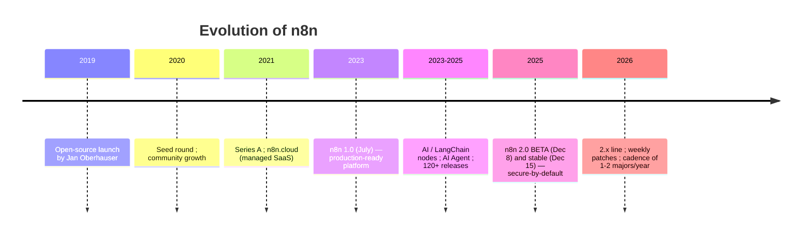

Essential milestones:

- **2019** — Jan Oberhauser publishes n8n as open source. Name: *nodemation*.
- **July 2023 — n8n 1.0:** the platform declares itself *production-ready*. It stabilizes the node API and the execution model.
- **2023–2025** — explosion of AI automation: native **LangChain** and **AI Agent** nodes, integrations with OpenAI/Anthropic/Google, vector stores. n8n repositions itself from an "integration tool" to an **"AI automation platform."**
- **December 2025 — n8n 2.0:** the first major in ~2.5 years. It is not about new features, but about **hardening**: secure-by-default execution, reliability, and performance.
- **2026** — the **2.x** line with near-weekly patches; starting with 2.0, the project adopts a cadence of **1 to 2 major versions per year**.

### 2.4 Architecture: the philosophy shift

The 1.x → 2.0 transition represents a shift in **defaults philosophy**. In 1.x, n8n prioritized maximum flexibility: the Code node accessed the entire system, environment variables, and files freely. This was powerful and dangerous. In 2.0, the principle becomes **"secure by default, permissive by choice."**

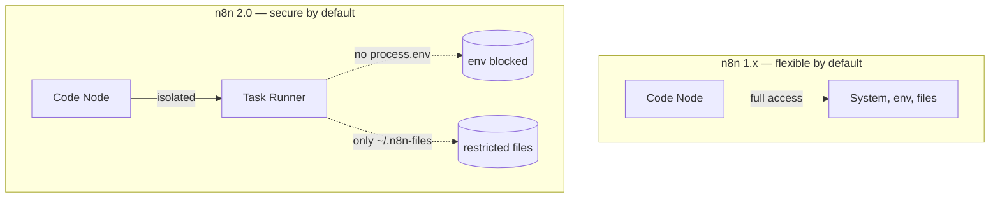

### 2.5 What's New in This Version — n8n 2.0 (the leap every professional must understand)

This section is mandatory for anyone migrating from 1.x. Each item includes the **practical impact** for architects, developers, and enterprises.

**Security (secure-by-default)**

- **Task Runners enabled by default.** Every Code node runs in an isolated environment with limited access. *Impact:* workflows that relied on broad Code node access need explicit configuration; a huge gain in security posture and resource isolation.
- **`process.env` blocked in the Code node.** *Impact:* reading secrets via env in Code stops working — use the credential vault or static data. Prevents credential leakage.
- **File access restricted to `~/.n8n-files`.** *Impact:* workflows that read/wrote outside that directory will fail; review your file pipelines.
- **Arbitrary command-execution nodes disabled by default.** *Impact:* reduces attack surface; re-enable explicitly only if essential.
- **OAuth 2.0 Token Exchange (RFC 8693)** as a second authentication mechanism. *Impact:* enables iframe embedding and delegated API access securely.

**Reliability**

- **Sub-workflows with the Wait node** now correctly return data from the **end** of the sub-workflow (previously they returned the input to the Wait node, causing subtle bugs with timeouts > 65s and webhook calls). *Impact:* fixes silently incorrect results in complex orchestrations.
- **Removal of nodes for defunct services** and legacy options. *Impact:* fewer edge cases, more predictable behavior.
- **Start node removed** — specific triggers replace it. *Impact:* old workflows based on Start need adjustment.

**Performance**

- **New SQLite pooling driver** — up to **10x** faster in benchmarks. *Impact:* self-hosted SQLite instances gain throughput without switching databases.
- **Filesystem-based binary data handling** is more predictable under load.

**Database**

- **MySQL and MariaDB are no longer supported.** *Critical impact:* migrate to **PostgreSQL** (recommended for production) or **SQLite** **before** upgrading. This is often the biggest migration blocker in enterprise environments.

**Experience (UI/UX)**

- **Publish/Save paradigm.** In 1.x, saving an active workflow instantly updated production. In 2.0, **Save** preserves your edits without touching what is live; **Publish** is the explicit action to promote the version to production. *Impact:* no more accidental production changes; aligns the flow with controlled-release practices.
- **Autosave** (introduced Jan 2026), refined canvas, and reorganized sidebar navigation.

**Migration**

- **Migration Report** (Settings → Migration Report, available since 1.121.0 for global admins) and the **Migration Tool** scan the instance and classify issues by severity (workflow-level and instance-level). *Impact:* lets you plan the migration predictably.
- **1.x support for 3 months** after 2.0, with security and bug fixes only.

> **Architect's recommendation:** treat the move to 2.0 as a project, not a `docker pull`. Run the Migration Report, resolve *critical* items (MySQL/MariaDB database, Start node, env/file access in Code) in staging, and only then promote.

### 2.6 Real example

**Scenario.** A company runs n8n 1.118 self-hosted with MySQL and several workflows using `process.env` in the Code node to read API keys.

**Problem.** It wants to upgrade to 2.x for security and performance, but fears breaking production.

**Solution.** A phased migration process guided by the Migration Report.

**Implementation.**
1. Upgrade to the latest 1.x (≥ 1.121) to enable the Migration Report.
2. In staging, run the report and list *critical* items.
3. Migrate the MySQL database → PostgreSQL (dump + import + adjust `DB_TYPE`).
4. Refactor Code nodes: replace `process.env.X` with credentials.
5. Validate file access (move to `~/.n8n-files`).
6. Upgrade to 2.x in staging, test, then promote in production.

**Result.** A more secure 2.x instance, up to 10x faster (if SQLite) or robust (PostgreSQL), with no workflow loss.

**Future improvements.** Adopt the Publish/Save paradigm in the release process and integrate the migration check into CI (Chapter 45).

### 2.7 Exercises

1. List, from your current environment, which items would be *critical* in a migration to 2.0.
2. Explain, for a non-technical manager, why "secure-by-default" justifies a major version.

### 2.8 Challenges

- **Challenge.** Write a migration runbook for 1.x → 2.x for an instance with MySQL, 200 workflows, and heavy Code node usage.

### 2.9 Checklist

- [ ] I know the 6 change groups of 2.0 (security, reliability, performance, database, UX, migration).
- [ ] I know MySQL/MariaDB were removed.
- [ ] I understand the difference between Save and Publish.
- [ ] I know where the Migration Report is.

### 2.10 Best practices

- Follow the official release notes weekly; the cadence is high.
- Pin the Docker image version (avoid `latest` in production) and update in a controlled way.
- Always test major upgrades in staging with a copy of the data.

### 2.11 Anti-patterns

- Upgrading directly from 1.x to 2.x in production without the Migration Report.
- Keeping `latest` as the image tag in production.
- Ignoring the 3-month 1.x support window and postponing the migration indefinitely.

### 2.12 Troubleshooting

| Symptom after upgrade | Cause | Action |
|-----------------------|-------|--------|
| Instance won't start | MySQL/MariaDB database | Migrate to PostgreSQL/SQLite |
| Workflows with Start broken | Start node removed | Replace with a specific trigger |
| Code node fails reading env | `process.env` blocked | Migrate to credentials |
| Change doesn't appear in production | Missing *Publish* | Click Publish |

### 2.13 Official references

- Introducing n8n 2.0: https://blog.n8n.io/introducing-n8n-2-0/
- Breaking changes 2.0: https://docs.n8n.io/2-0-breaking-changes/
- Migration Tool: https://docs.n8n.io/migration-tool-v2/
- Release notes: https://docs.n8n.io/release-notes/

---

## Chapter 3 — Internal architecture

### 3.1 Introduction

To use n8n as a toy, just drag nodes. To use it in **enterprise production** — with high availability, horizontal scale, and security — it is mandatory to understand what happens "under the hood." This chapter dissects the internal components, execution modes, and the data path, focusing on the structural changes brought by the **task runners** in 2.0.

### 3.2 Business context

The difference between an instance processing 100 executions/day and one processing 1 million is not in the workflows — it is in the **deployment topology**. Internal architecture decisions determine infrastructure cost, latency, fault resilience, and the ability to meet SLAs. An architect who doesn't master queue mode, workers, and task runners will either over-provision (waste) or under-provision (incidents) the environment.

### 3.3 Theoretical concepts: the components

n8n is a **Node.js** application (TypeScript backend) with a **Vue 3** frontend. Its logical components:

- **Editor UI:** the SPA where workflows are built; communicates with the backend via REST and WebSocket (execution-progress push).
- **REST API / Public API:** the programmatic interface for workflows, executions, credentials, and users.
- **Core / Workflow Engine:** the heart. It resolves the node graph, orders execution, propagates items between nodes, evaluates expressions, and applies retries and error handling.
- **Nodes:** packages (`n8n-nodes-base` and AI nodes in `@n8n/n8n-nodes-langchain`) that implement each integration.
- **Task Runners (2.0):** isolated processes that execute **Code node** code outside the main process — security and resource isolation.
- **Persistence:** a relational database (**PostgreSQL** recommended; **SQLite** for single-node) stores workflows, credentials (encrypted), executions, and settings.
- **Queue (queue mode):** **Redis** as a broker to distribute executions across workers.
- **Binary Data:** binary data (files) can live on the filesystem or in external storage (S3), avoiding database bloat.

### 3.4 Architecture: deployment modes

**Single mode (default).** A single main process does everything: UI, API, triggers, execution. Simple, ideal for getting started and for small loads.

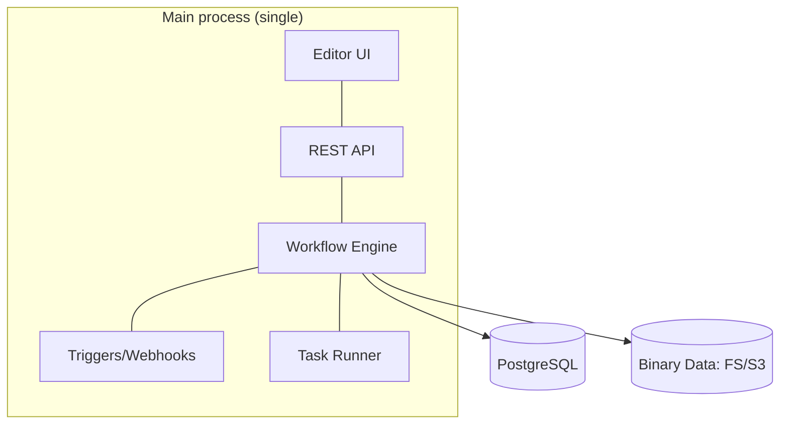

**Queue mode (horizontal scale).** The main process only receives triggers and enqueues; independent **workers** consume the queue and execute. High-volume webhooks can have dedicated processes. This is the topology for production at scale and high availability (Chapters 51–52).

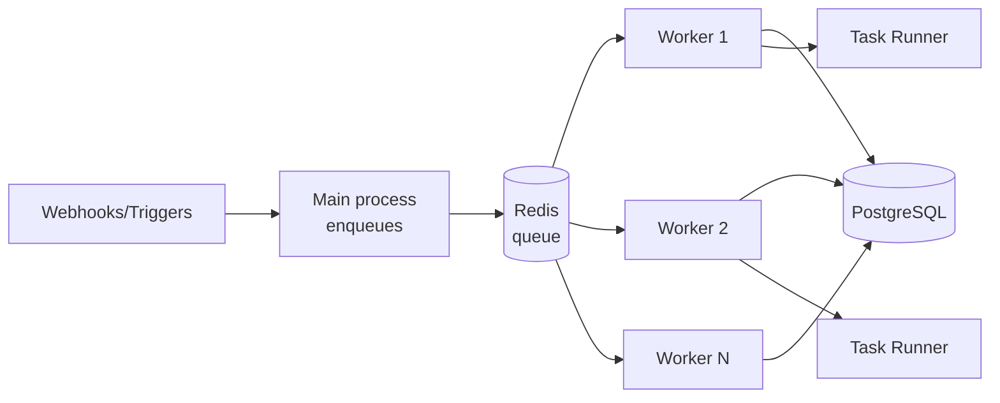

### 3.5 The data path (execution)

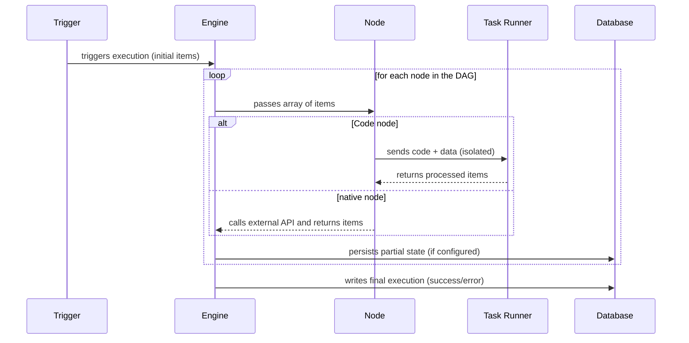

Critical points for the architect:

- **Execution persistence** (`EXECUTIONS_DATA_SAVE_*`): saving all executions is great for auditing but bloats the database. Configure pruning (`EXECUTIONS_DATA_PRUNE`, `EXECUTIONS_DATA_MAX_AGE`).
- **Concurrency:** workers have configurable concurrency (`--concurrency`); size it according to CPU and the I/O-bound nature of your workflows.
- **Task runners** can be *internal* (same host) or *external* (separate process/container) — external ones give maximum isolation, recommended for multi-tenant (Chapter 53).

### 3.6 Real example

**Scenario.** A SaaS platform with peaks of 50k webhooks/hour coming from customer integrations.

**Problem.** In single mode, the main process saturates: webhooks compete with execution, latency rises, timeouts occur.

**Solution.** Migrate to queue mode with dedicated workers and a separate webhook process.

**Implementation (environment variables):**

```bash
# Main process and workers share the database and Redis
export EXECUTIONS_MODE=queue
export QUEUE_BULL_REDIS_HOST=redis.internal
export DB_TYPE=postgresdb
export DB_POSTGRESDB_HOST=pg.internal
# External task runners (isolation)
export N8N_RUNNERS_ENABLED=true
export N8N_RUNNERS_MODE=external
# Execution pruning
export EXECUTIONS_DATA_PRUNE=true
export EXECUTIONS_DATA_MAX_AGE=336   # hours (14 days)
```

Start a worker:

```bash
n8n worker --concurrency=10
```

**Result.** Webhooks are enqueued in milliseconds; workers scale horizontally; the main process never saturates. Predictable latency under peak.

**Future improvements.** Autoscale workers on Kubernetes via HPA using a queue-depth metric (Chapter 8/51).

### 3.7 Exercises

1. Draw your application's topology in queue mode, indicating where Redis, Postgres, and workers sit.
2. Explain why binary data in S3 is preferable to storing it in the database.

### 3.8 Challenges

- **Challenge.** Calculate how many workers (with `--concurrency=10`) are needed for 50k executions/hour if each execution takes an average of 2s of wall-clock time.

### 3.9 Checklist

- [ ] I can distinguish single mode from queue mode.
- [ ] I understand the role of Redis, PostgreSQL, and workers.
- [ ] I configured execution pruning.
- [ ] I understand internal vs external task runners.

### 3.10 Best practices

- In production, use **PostgreSQL** (not SQLite) and **queue mode** early if you anticipate growth.
- Externalize binary data (S3) to keep the database lean.
- Configure pruning from day 1 — accumulated executions are the #1 cause of a giant database.
- Use external task runners to isolate untrusted code in multi-tenant scenarios.

### 3.11 Anti-patterns

- Running production on single-node SQLite with thousands of executions/day.
- Saving all executions without pruning.
- A single giant worker instead of several smaller ones (worse resilience).
- Mixing high-volume webhooks with execution in the same process.

### 3.12 Troubleshooting

| Symptom | Cause | Action |
|---------|-------|--------|
| Executions "stuck" in waiting | No worker consuming the queue | Start workers; check Redis |
| Database growing endlessly | Pruning disabled | Enable `EXECUTIONS_DATA_PRUNE` |
| High latency at webhook peak | Single mode saturated | Migrate to queue + webhook process |
| Slow/unstable Code node | Task runner under-provisioned | Adjust runner resources/mode |

### 3.13 Official references

- Scaling and queue mode: https://docs.n8n.io/hosting/scaling/queue-mode/
- Task runners: https://docs.n8n.io/hosting/configuration/task-runners/
- Environment configuration: https://docs.n8n.io/hosting/configuration/environment-variables/
- Execution pruning: https://docs.n8n.io/hosting/scaling/execution-data/

---

## Chapter 4 — Core concepts

### 4.1 Introduction

This chapter consolidates n8n's **operational vocabulary**: items, nodes, connections, pinning, expressions, credentials, sub-workflows, and node execution modes. Mastering these concepts is what separates someone who "builds little flows" from someone who **designs robust automations**. It is the reference chapter you will reopen throughout the book.

### 4.2 Business context

Costly production errors almost always stem from conceptual misunderstandings: treating an array of items as a single value, not understanding when a node runs once vs. N times, or mixing execution data with credentials. Getting the fundamentals right reduces incidents and the maintenance cost of the automation estate.

### 4.3 Theoretical concepts

**The item and the data structure.** Everything that travels between nodes is a list of items. Each item has the shape:

```json
{
  "json": { "field": "value" },
  "binary": { "file": { "data": "<base64>", "mimeType": "application/pdf" } }
}
```

- `json`: the structured data (what you manipulate 99% of the time).
- `binary`: attachments/files, referenced by key.

**Node execution mode.** A node can run **once per item** (*Run Once for Each Item*) or **once for all** (*Run Once for All Items*). Understanding this is vital: an HTTP node in "each item" makes N calls; in "all items," it makes one.

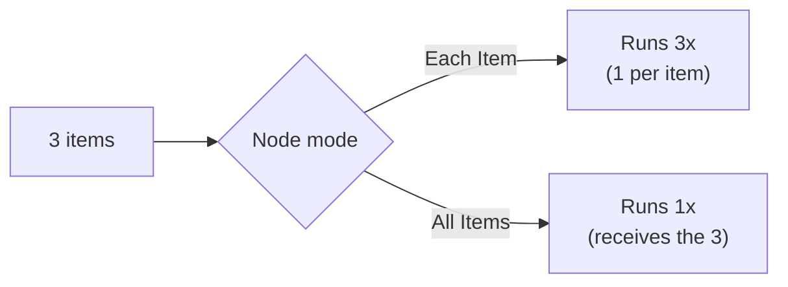

**Expressions.** `{{ ... }}` syntax (JavaScript-based) to access data dynamically. Key variables:

- `$json` — the current item's data.
- `$node["Name"].json` — another node's output.
- `$items()` — all items from a node.
- `$now`, `$today` — date/time (using Luxon).
- `$workflow`, `$execution` — workflow/execution metadata.
- `$vars` — n8n environment variables (Enterprise) / `$env` for system environment variables (when allowed).

**Credentials.** Stored **encrypted** (`N8N_ENCRYPTION_KEY` key), separate from workflows. A workflow references a credential by ID; the secret never appears in the workflow JSON. This allows sharing/versioning workflows without leaking secrets.

**Sub-workflows.** Workflows called by others (via the **Execute Sub-workflow** node). They promote reuse and modularization — the equivalent of extracting a method. In 2.0, data passing from sub-workflows with Wait was fixed (Ch. 2).

**Data pinning.** Lets you "freeze" a node's output during development, to test downstream nodes without re-triggering external calls — it speeds up debugging (Ch. 20).

### 4.4 Conceptual architecture

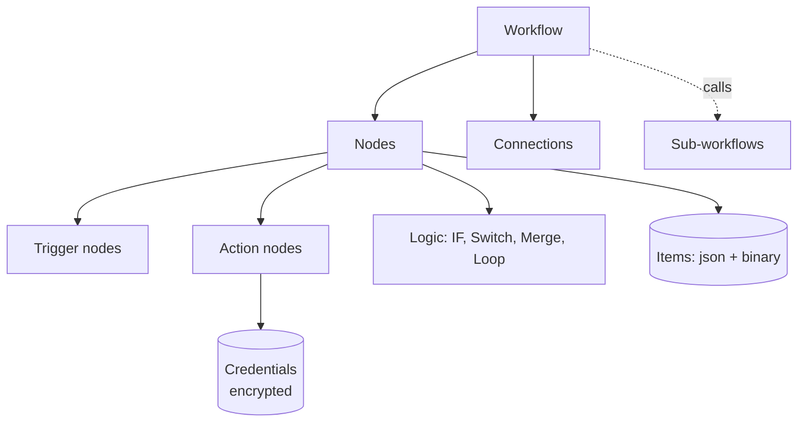

### 4.5 Real example

**Scenario.** Process a list of 100 customers and, for each one, query a credit score from an API and classify it.

**Problem.** Ensure the API call happens per customer and that classification is per item, without mixing data.

**Solution.** Use "each item" mode on the HTTP node and per-item expressions.

**Implementation (IF node, classification condition):**

```javascript
// Expression in the IF node — compares the score returned by the API
{{ $json.score >= 700 }}
```

**Code (Code node "Run Once for Each Item") to enrich the item:**

```javascript
// n8n 2.0 — Code node in "each item" mode; no process.env (use credentials)
const score = $json.score;
let band;
if (score >= 800) band = 'A';
else if (score >= 700) band = 'B';
else if (score >= 600) band = 'C';
else band = 'D';

return { json: { ...$json, band } };
```

**Result.** Each customer comes out classified A–D, in independent items, ready for routing (e.g., approve A/B, review C, decline D).

**Future improvements.** Parallelize with controlled batching to respect the API's rate limit (Ch. 19/21).

### 4.6 Exercises

1. Given a node that receives 5 items, how many times does it run in "each item" and in "all items"?
2. Write an expression that returns today's date in `dd/MM/yyyy` format.
3. Explain why credentials live outside the workflow JSON.

### 4.7 Challenges

- **Challenge.** Build a workflow that receives a list of products, fetches each one's price from an API, and returns only those priced above the average — thinking carefully about when to aggregate (all items) and when to iterate (each item).

### 4.8 Checklist

- [ ] I understand the item's `json` + `binary` structure.
- [ ] I know the difference between "each item" and "all items."
- [ ] I know the main expression variables.
- [ ] I know credentials are encrypted and referenced by ID.
- [ ] I understand sub-workflows and pinning.

### 4.9 Best practices

- Name nodes semantically ("Fetch score," not "HTTP Request1").
- Use sub-workflows for reusable logic; keep workflows single-responsibility.
- Use pinning during development to avoid consuming real APIs on every test.
- Centralize complex expressions in a commented Code node instead of scattering them.

### 4.10 Anti-patterns

- Giant, unreadable expressions embedded in many fields.
- Confusing `$json` (current item) with `$node[...]` (another node) and reading the wrong data.
- Reusing the same credential across different environments (dev/prod).
- Ignoring the node execution mode and generating unintended N calls.

### 4.11 Troubleshooting

| Symptom | Cause | Action |
|---------|-------|--------|
| Expression returns `undefined` | Wrong `$json` path | Inspect the node's input data |
| Node makes too many calls | Improper "each item" mode | Switch to "all items" or aggregate |
| Credential error when migrating a workflow | Different `N8N_ENCRYPTION_KEY` | Use the same key across environments |
| Data disappearing after a sub-workflow | Misunderstood return | Review what the sub-workflow returns |

### 4.12 Official references

- Data structure: https://docs.n8n.io/data/data-structure/
- Expressions: https://docs.n8n.io/code/expressions/
- Credentials: https://docs.n8n.io/credentials/
- Sub-workflows: https://docs.n8n.io/flow-logic/subworkflows/

---

## Chapter 5 — Real-world use cases

### 5.1 Introduction

Concept without application is trivia. This chapter presents **categories of proven enterprise use cases**, each with the typical n8n architecture, so you recognize patterns and know when n8n is (and is not) the right tool. The six complete projects in Part VIII go deeper into some of these cases.

### 5.2 Business context

n8n delivers value where there is **integration between heterogeneous systems with business logic**, especially when the team wants autonomy to evolve the automation without traditional deployments. Recognizing the "fit" avoids two costly enterprise mistakes: using n8n as a replacement for a critical transactional backend (it isn't), or continuing to write glue code where a workflow would solve it.

### 5.3 Theoretical concepts: the major categories

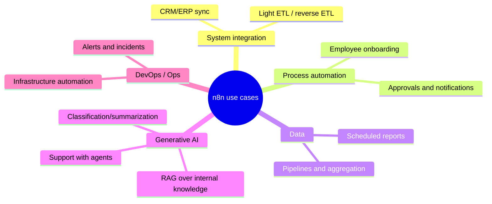

**1. Integration and synchronization (iPaaS).** Keep CRM, ERP, marketing tools, and billing in sync. Pattern: trigger on change → transformation → upsert into the destination.

**2. Business process automation (BPA).** Onboarding, approvals, handoffs between teams. Pattern: form/event → conditional routing → actions + notifications + record.

**3. Data pipelines (light ETL/ELT).** Collect, transform, and load data between sources. Pattern: scheduled trigger → extract (API/DB) → transform → load (warehouse). For massive volumes, n8n orchestrates; the heavy processing stays in dedicated tools.

**4. Generative AI and agents.** Automated support, RAG over internal documents, classification and enrichment. Pattern: trigger → context retrieval (vectors) → LLM/agent → action. It is the fastest-growing category (Part V).

**5. DevOps and operations.** Orchestrate alerts, react to incidents, automate infrastructure tasks. Pattern: monitoring webhook → enrichment → decision → action (Slack/PagerDuty/cloud API).

### 5.4 Architecture of a typical case (AI support)

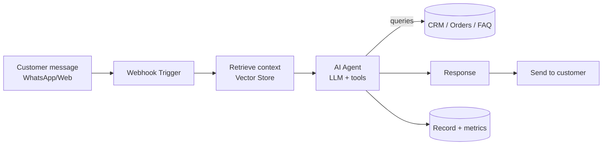

### 5.5 Real example

**Scenario.** A distributor receives orders by email as PDFs and wants to post them automatically into the ERP.

**Problem.** Manual entry is slow and error-prone; volume has grown to hundreds/day.

**Solution.** A workflow that monitors the inbox, extracts data from the PDF with AI, and posts to the ERP via API, with human review for low-confidence cases.

**Implementation (step by step).**
1. **Trigger:** IMAP/Email node reads new emails with a PDF attachment.
2. **Extraction:** AI node (OpenAI/Claude) with the PDF → structured JSON (items, quantities, values).
3. **Validation:** IF node checks `confidence >= 0.9`.
4. **High confidence:** HTTP node posts to the ERP.
5. **Low confidence:** Slack node notifies a human for review.
6. **Record:** writes the result to a database for auditing.

**Code (Code node — normalizes the AI output):**

```javascript
// Ensures the contract expected by the ERP, with safe defaults
const ai = $json.extraction ?? {};
return {
  json: {
    externalOrder: ai.number ?? null,
    items: (ai.items ?? []).map(i => ({
      sku: i.sku,
      qty: Number(i.quantity) || 0,
      price: Number(i.price) || 0
    })),
    confidence: Number(ai.confidence) || 0
  }
};
```

**Result.** ~90% of orders posted without intervention; 10% reviewed by a human; zero routine manual data entry; a complete audit trail.

**Future improvements.** Add fine-tuning/few-shot to raise confidence, and a feedback loop that reuses human corrections (Part V).

### 5.6 When NOT to use n8n

- **A latency-critical transactional backend** (e.g., a synchronous checkout engine with a millisecond SLA): use a dedicated service; n8n orchestrates around it, not in the critical path.
- **Big-data processing at TB scale**: orchestrate Spark/Flink with n8n, but don't process the volume inside it.
- **Core, complex domain logic** that deserves a testable, end-to-end typed codebase.

### 5.7 Exercises

1. Classify three automations at your company into the categories in section 5.3.
2. For the distributor example, list the risks and how to mitigate them.

### 5.8 Challenges

- **Challenge.** Design (as a Mermaid diagram) the architecture of a DevOps use case: react to a high-CPU alert by creating a ticket and scaling an instance in the cloud.

### 5.9 Checklist

- [ ] I can recognize the 5 major use-case categories.
- [ ] I identified the architectural pattern of each.
- [ ] I can articulate when n8n is NOT the right tool.
- [ ] I mapped at least one real case from my organization.

### 5.10 Best practices

- Start with a **high-value, low-risk** case to prove the platform.
- Always include an audit trail (execution/result logging) in enterprise cases.
- In AI cases, design the **human review** path for low confidence from the start.

### 5.11 Anti-patterns

- Placing n8n in the synchronous critical path of a financial transaction.
- Automating a broken process instead of fixing it first (automating chaos amplifies chaos).
- A use case with no business owner — orphaned automations rot.

### 5.12 Troubleshooting

| Symptom | Cause | Action |
|---------|-------|--------|
| Automation "no one trusts" | Lack of audit/observability | Add logs and metrics (Ch. 50) |
| Inconsistent AI results | No validation/review | Add a confidence IF + human |
| Workflow grew too large | Multiple cases in one | Split into sub-workflows per case |

### 5.13 Official references

- Use cases and templates: https://n8n.io/workflows/
- Use cases (DevOps, data): https://n8n.io/use-cases/
- AI documentation: https://docs.n8n.io/advanced-ai/

---

> **End of Part I.** The fundamentals are in place: what n8n is, its evolution up to the 2.x line, its internal architecture, the operational vocabulary, and the map of use cases. **Part II — Installation and Environments** (Chapters 6–13) starts getting hands-on with infrastructure: Docker, Docker Compose, Kubernetes, AWS, Azure, GCP, Self-Hosted, and Cloud.

## Part II – Installation and Environments

Part II turns theory into running infrastructure. The chapters move from the simplest deployment (a single Docker container) to enterprise-grade topologies (Kubernetes with autoscaling workers) and the three major clouds, closing with the strategic decision between **self-hosted** and **n8n Cloud**. Throughout, we assume **n8n 2.x** defaults: PostgreSQL (MySQL/MariaDB are gone), task runners enabled, queue mode with Redis for scale, and the Publish/Save release paradigm.

---

## Chapter 6 — Docker

### 6.1 Introduction

Docker is the **canonical** way to run n8n. The official image (`docker.n8n.io/n8nio/n8n`, mirrored on Docker Hub as `n8nio/n8n`) packages Node.js, the engine, every base node, and the AI/LangChain nodes into a reproducible artifact. For a developer, a single `docker run` produces a working instance in seconds; for an architect, the same image is the unit that flows through CI/CD into staging and production. This chapter covers the image, persistence, environment configuration, and the n8n 2.x specifics (task runners, `~/.n8n-files`) that change how you build the container.

### 6.2 Business context

Reproducibility is money. The number-one cause of "works on my machine" incidents is environment drift — a different Node version, a missing native dependency, an inconsistent timezone. A pinned Docker image eliminates that class of failure: the exact same bytes that passed QA run in production. For regulated industries, the image is also an **auditable artifact** you can scan for CVEs, sign, and store in a private registry. And because n8n is self-hostable, the Docker image is what keeps sensitive data inside the company perimeter — the differentiator versus closed SaaS.

### 6.3 Theoretical concepts

- **Image vs. container:** the image is the immutable template; the container is a running instance. n8n state (workflows, credentials, executions) must **not** live in the container layer — it lives in a volume or external database.
- **Persistence:** n8n stores everything under `/home/node/.n8n` inside the container. The encryption key (`N8N_ENCRYPTION_KEY`) lives there too; lose it and you lose access to all encrypted credentials. Persist this directory or, better, set the key explicitly via env.
- **Configuration via environment variables:** n8n is configured almost entirely through env vars (`N8N_HOST`, `WEBHOOK_URL`, `DB_TYPE`, etc.). This is the 12-factor approach.
- **The `node` user:** the image runs as the non-root `node` user (UID 1000). Volume permissions must match, or n8n cannot write its data.
- **n8n 2.x file directory:** Code-node file access is restricted to `~/.n8n-files` (i.e., `/home/node/.n8n-files`). If your workflows read/write files, mount that directory explicitly.
- **Task runners:** enabled by default in 2.x. In a single container they run *internally*; you can switch to an *external* runner container for stronger isolation (Chapter 53).

### 6.4 Architecture


### 6.5 Real example

**Scenario.** A startup wants a single-node n8n for an internal team of five, running on a small cloud VM, with data persisted and the instance reachable at `https://automate.startup.io`.

**Problem.** A naive `docker run` loses all data on container recreation and breaks webhooks because the public URL is not configured, so external services receive `localhost` callback URLs.

**Solution.** Run the image with a named volume, an explicit encryption key, the public webhook URL, and a reverse proxy terminating TLS in front.

**Implementation (step by step).**

1. Create a named volume so data survives container recreation.
2. Pin the image tag (never `latest` in anything that matters).
3. Set `N8N_ENCRYPTION_KEY` explicitly (generate once, store in a secret manager).
4. Set `N8N_HOST`, `N8N_PROTOCOL`, and `WEBHOOK_URL` to the public URL.
5. Put a reverse proxy (Caddy/Traefik/Nginx) in front for TLS.
6. Open the editor, build a workflow, and **Publish** it.

**Result.** A persistent instance that survives restarts and upgrades, with correct webhook URLs and TLS, ready for a small team.

**Future improvements.** Move to PostgreSQL and queue mode as load grows (Chapter 7), and externalize binary data to S3.

### 6.6 Step by step (commands)

```bash
# 1. Create a persistent volume
docker volume create n8n_data

# 2. Generate an encryption key once and keep it safe
openssl rand -hex 24    # use the output as N8N_ENCRYPTION_KEY

# 3. Run n8n (pinned version)
docker run -d \
  --name n8n \
  --restart unless-stopped \
  -p 5678:5678 \
  -e N8N_ENCRYPTION_KEY="<your-generated-key>" \
  -e N8N_HOST="automate.startup.io" \
  -e N8N_PROTOCOL="https" \
  -e WEBHOOK_URL="https://automate.startup.io/" \
  -e GENERIC_TIMEZONE="America/Sao_Paulo" \
  -e N8N_RUNNERS_ENABLED=true \
  -v n8n_data:/home/node/.n8n \
  -v n8n_files:/home/node/.n8n-files \
  docker.n8n.io/n8nio/n8n:2.3.0
```

### 6.7 Complete code (custom Dockerfile)

A common enterprise need is to bake extra npm packages (for the Code node) or custom community nodes into the image:

```dockerfile
# Dockerfile — extends the official n8n 2.x image with extra modules
FROM docker.n8n.io/n8nio/n8n:2.3.0

# Switch to root only to install, then drop back to node
USER root

# Allow these modules to be required from the Code node
ENV NODE_FUNCTION_ALLOW_EXTERNAL=luxon,lodash,date-fns

# Install a community node globally (example)
RUN cd /usr/local/lib/node_modules/n8n \
    && npm install n8n-nodes-example --omit=dev

USER node
```

Build and run:

```bash
docker build -t registry.startup.io/n8n-custom:2.3.0 .
docker push registry.startup.io/n8n-custom:2.3.0
```

### 6.8 Complete n8n workflow (importable JSON)

A minimal health-check workflow you can import to validate that the container is alive and reachable:

```json
{
  "name": "Container Healthcheck",
  "nodes": [
    {
      "parameters": {
        "httpMethod": "GET",
        "path": "healthz",
        "responseMode": "lastNode"
      },
      "id": "a0000001-0000-0000-0000-000000000001",
      "name": "Webhook",
      "type": "n8n-nodes-base.webhook",
      "typeVersion": 2,
      "position": [260, 300]
    },
    {
      "parameters": {
        "assignments": {
          "assignments": [
            { "id": "h1", "name": "status", "type": "string", "value": "ok" },
            { "id": "h2", "name": "instance", "type": "string", "value": "={{ $env.HOSTNAME || 'n8n' }}" },
            { "id": "h3", "name": "time", "type": "string", "value": "={{ $now.toISO() }}" }
          ]
        }
      },
      "id": "a0000002-0000-0000-0000-000000000002",
      "name": "Build Status",
      "type": "n8n-nodes-base.set",
      "typeVersion": 3.4,
      "position": [480, 300]
    }
  ],
  "connections": {
    "Webhook": { "main": [[{ "node": "Build Status", "type": "main", "index": 0 }]] }
  },
  "settings": { "executionOrder": "v1" }
}
```

### 6.9 Exercises

1. Run n8n with Docker, persist data in a volume, recreate the container, and confirm your workflow survived.
2. Explain what happens to your credentials if you lose `N8N_ENCRYPTION_KEY`.
3. Set `WEBHOOK_URL` wrong on purpose and observe the callback URL a webhook generates.

### 6.10 Challenges

- **Challenge 1.** Build a custom image that allows `lodash` in the Code node and prove it by importing it inside a Code node.
- **Challenge 2.** Configure a reverse proxy (Caddy) in front of the container with automatic HTTPS, then re-test the healthcheck webhook over `https`.

### 6.11 Checklist

- [ ] I pinned the image version (no `latest`).
- [ ] I persist `/home/node/.n8n` in a volume or use external Postgres.
- [ ] I set `N8N_ENCRYPTION_KEY` explicitly and stored it safely.
- [ ] I configured `N8N_HOST`, `N8N_PROTOCOL`, and `WEBHOOK_URL`.
- [ ] I mounted `~/.n8n-files` if my Code nodes touch files.

### 6.12 Best practices

- Always run behind a TLS-terminating reverse proxy; never expose 5678 directly to the internet.
- Store the encryption key and all secrets in a secret manager, injected at runtime.
- Use `--restart unless-stopped` (or an orchestrator) so the container survives reboots.
- Set `GENERIC_TIMEZONE` to avoid cron/schedule surprises.

### 6.13 Anti-patterns

- Using `latest` so an unattended pull silently upgrades to a breaking version.
- Storing state inside the container layer (lost on recreation).
- Running as root or with a mismatched volume UID (permission errors).
- Letting n8n generate its own encryption key implicitly, then losing it.

### 6.14 Troubleshooting

| Symptom | Likely cause | Action |
|---------|--------------|--------|
| Data gone after `docker rm` | No volume mounted | Mount a volume on `/home/node/.n8n` |
| `EACCES` writing `.n8n` | Volume owned by wrong UID | `chown -R 1000:1000` the volume |
| Webhook URL shows `localhost` | `WEBHOOK_URL` unset | Set `WEBHOOK_URL` to the public URL |
| "Could not decrypt" credentials | Encryption key changed | Restore the original `N8N_ENCRYPTION_KEY` |
| Code node can't read a file | Outside `~/.n8n-files` (2.x) | Mount/use `/home/node/.n8n-files` |

### 6.15 Official references

- Docker installation: https://docs.n8n.io/hosting/installation/docker/
- Configuration / env vars: https://docs.n8n.io/hosting/configuration/environment-variables/
- Docker image (Docker Hub): https://hub.docker.com/r/n8nio/n8n
- Task runners: https://docs.n8n.io/hosting/configuration/task-runners/

---

## Chapter 7 — Docker Compose

### 7.1 Introduction

A real n8n deployment is rarely a single container. You need at least n8n plus **PostgreSQL**; at scale you add **Redis**, **workers**, and a dedicated **webhook** process. Docker Compose is the tool that declares this multi-container topology as code in one `docker-compose.yml`, with networks, volumes, health checks, and dependencies. This chapter builds up from a two-service stack (n8n + Postgres) to a full **queue-mode** stack, which is the reference local-and-small-prod topology for n8n 2.x.

### 7.2 Business context

Compose is the sweet spot for the majority of self-hosted n8n deployments: too complex for a single container, not big enough to justify Kubernetes. A single VM running a Compose stack comfortably serves a department or a mid-size company. It is also the **fastest path to a production-like local environment**, so developers reproduce queue-mode behavior on their laptops before it reaches Kubernetes — catching "works in single, breaks in queue" bugs early.

### 7.3 Theoretical concepts

- **Service:** each container definition (n8n, postgres, redis, worker).
- **Shared configuration:** in queue mode, the main, worker, and webhook processes must share the **same** database, Redis, and **encryption key** — otherwise workers cannot decrypt credentials.
- **`depends_on` + healthcheck:** ensures n8n starts only after Postgres is actually accepting connections, not merely "started."
- **Queue mode roles:** the **main** process handles UI/API and enqueues; **worker** processes (`n8n worker`) execute; an optional **webhook** process (`n8n webhook`) absorbs inbound webhook traffic so it does not compete with execution.
- **YAML anchors:** Compose lets you DRY shared environment blocks with `&anchor` / `*ref`, avoiding copy-paste drift across the three n8n roles.

### 7.4 Architecture


### 7.5 Real example

**Scenario.** A mid-size company runs ~30k executions/day with bursty webhook traffic from partner integrations and wants a single-VM, production-grade deployment that survives restarts and scales workers on demand.

**Problem.** A single n8n container saturates at peak: webhooks queue behind long-running executions, latency spikes, and some partner callbacks time out.

**Solution.** A Compose stack in **queue mode**: one main, one webhook process, two (scalable) workers, Postgres, and Redis — all sharing the encryption key and database.

**Implementation.** See the complete `docker-compose.yml` below. Scale workers with `docker compose up -d --scale n8n-worker=4`.

**Result.** Webhooks are enqueued in milliseconds by the dedicated webhook process; workers chew through the queue in parallel; the main process stays responsive. Adding capacity is a one-line scale command.

**Future improvements.** Move to Kubernetes with an HPA driven by Redis queue depth (Chapter 8), and externalize binary data to S3.

### 7.6 Step by step

1. Create a `.env` file with the encryption key, DB password, and public URL.
2. Define shared env with a YAML anchor.
3. Add Postgres and Redis with health checks.
4. Add the n8n main, webhook, and worker services in queue mode.
5. `docker compose up -d`.
6. Scale workers: `docker compose up -d --scale n8n-worker=4`.

### 7.7 Complete code (`.env`)

```bash
# .env — shared by all services
N8N_ENCRYPTION_KEY=replace-with-openssl-rand-hex-24
POSTGRES_PASSWORD=replace-with-strong-password
N8N_HOST=automate.company.com
WEBHOOK_URL=https://automate.company.com/
GENERIC_TIMEZONE=America/Sao_Paulo
```

### 7.8 Complete code (`docker-compose.yml`, queue mode)

```yaml
x-n8n-common: &n8n-common
  image: docker.n8n.io/n8nio/n8n:2.3.0
  restart: unless-stopped
  environment: &n8n-env
    DB_TYPE: postgresdb
    DB_POSTGRESDB_HOST: postgres
    DB_POSTGRESDB_DATABASE: n8n
    DB_POSTGRESDB_USER: n8n
    DB_POSTGRESDB_PASSWORD: ${POSTGRES_PASSWORD}
    EXECUTIONS_MODE: queue
    QUEUE_BULL_REDIS_HOST: redis
    N8N_ENCRYPTION_KEY: ${N8N_ENCRYPTION_KEY}
    N8N_RUNNERS_ENABLED: "true"
    GENERIC_TIMEZONE: ${GENERIC_TIMEZONE}
    EXECUTIONS_DATA_PRUNE: "true"
    EXECUTIONS_DATA_MAX_AGE: "336"
  depends_on:
    postgres:
      condition: service_healthy
    redis:
      condition: service_healthy

services:
  postgres:
    image: postgres:16-alpine
    restart: unless-stopped
    environment:
      POSTGRES_DB: n8n
      POSTGRES_USER: n8n
      POSTGRES_PASSWORD: ${POSTGRES_PASSWORD}
    volumes:
      - pg_data:/var/lib/postgresql/data
    healthcheck:
      test: ["CMD-SHELL", "pg_isready -U n8n -d n8n"]
      interval: 10s
      timeout: 5s
      retries: 5

  redis:
    image: redis:7-alpine
    restart: unless-stopped
    healthcheck:
      test: ["CMD", "redis-cli", "ping"]
      interval: 10s
      timeout: 5s
      retries: 5

  n8n-main:
    <<: *n8n-common
    environment:
      <<: *n8n-env
      N8N_HOST: ${N8N_HOST}
      N8N_PROTOCOL: https
      WEBHOOK_URL: ${WEBHOOK_URL}
    ports:
      - "5678:5678"
    volumes:
      - n8n_data:/home/node/.n8n

  n8n-webhook:
    <<: *n8n-common
    command: webhook
    environment:
      <<: *n8n-env
      WEBHOOK_URL: ${WEBHOOK_URL}

  n8n-worker:
    <<: *n8n-common
    command: worker --concurrency=10

volumes:
  pg_data:
  n8n_data:
```

### 7.9 Complete n8n workflow (importable JSON)

A queue-aware demo: a webhook that fans out to a batch loop, proving the worker pool processes items in parallel.

```json
{
  "name": "Queue Mode Demo",
  "nodes": [
    {
      "parameters": { "httpMethod": "POST", "path": "fanout", "responseMode": "lastNode" },
      "id": "b0000001-0000-0000-0000-000000000001",
      "name": "Webhook",
      "type": "n8n-nodes-base.webhook",
      "typeVersion": 2,
      "position": [260, 300]
    },
    {
      "parameters": {
        "fieldToSplitOut": "body.jobs",
        "options": {}
      },
      "id": "b0000002-0000-0000-0000-000000000002",
      "name": "Split Jobs",
      "type": "n8n-nodes-base.splitOut",
      "typeVersion": 1,
      "position": [480, 300]
    },
    {
      "parameters": { "amount": 1 },
      "id": "b0000003-0000-0000-0000-000000000003",
      "name": "Simulate Work",
      "type": "n8n-nodes-base.wait",
      "typeVersion": 1.1,
      "position": [700, 300]
    }
  ],
  "connections": {
    "Webhook": { "main": [[{ "node": "Split Jobs", "type": "main", "index": 0 }]] },
    "Split Jobs": { "main": [[{ "node": "Simulate Work", "type": "main", "index": 0 }]] }
  },
  "settings": { "executionOrder": "v1" }
}
```

### 7.10 Exercises

1. Bring up the queue-mode stack and confirm a webhook execution is handled by a worker (check the execution's host).
2. Scale workers to 4 and observe throughput change under load.
3. Stop Redis and explain what happens to new executions.

### 7.11 Challenges

- **Challenge 1.** Add a reverse-proxy service (Traefik) to the Compose file with automatic Let's Encrypt TLS.
- **Challenge 2.** Add a `postgres` backup sidecar that dumps the database nightly to a mounted volume.

### 7.12 Checklist

- [ ] All n8n roles share the same encryption key and database.
- [ ] Postgres and Redis have health checks and `depends_on: service_healthy`.
- [ ] `EXECUTIONS_MODE=queue` is set on every n8n service.
- [ ] Workers are scalable (`--scale n8n-worker=N`).
- [ ] Execution pruning is enabled.

### 7.13 Best practices

- Use YAML anchors to keep the shared env block DRY across main/webhook/worker.
- Keep the webhook process separate so inbound traffic never competes with execution.
- Pin Postgres and Redis versions, not just n8n.
- Externalize binary data (`N8N_DEFAULT_BINARY_DATA_MODE=filesystem` or S3) to keep the DB lean.

### 7.14 Anti-patterns

- Different encryption keys across services → workers fail to decrypt credentials.
- Forgetting `depends_on`/healthcheck → n8n boots before Postgres and crash-loops.
- Running queue mode without Redis health checks → silent job loss on Redis restart.
- One mega-worker with huge concurrency instead of several smaller workers.

### 7.15 Troubleshooting

| Symptom | Cause | Action |
|---------|-------|--------|
| Workers log "could not decrypt" | Mismatched `N8N_ENCRYPTION_KEY` | Set the same key on all services |
| n8n crash-loops on startup | Postgres not ready | Add healthcheck + `service_healthy` |
| Executions never finish | No worker running | Start/scale `n8n-worker` |
| Webhooks slow under load | No dedicated webhook process | Add the `n8n webhook` service |
| DB grows without bound | Pruning off | Set `EXECUTIONS_DATA_PRUNE=true` |

### 7.16 Official references

- Docker Compose hosting: https://docs.n8n.io/hosting/installation/server-setups/docker-compose/
- Queue mode: https://docs.n8n.io/hosting/scaling/queue-mode/
- Configuration env vars: https://docs.n8n.io/hosting/configuration/environment-variables/
- Binary data: https://docs.n8n.io/hosting/scaling/binary-data/

---

## Chapter 8 — Kubernetes

### 8.1 Introduction

Kubernetes is where n8n graduates to **elastic, self-healing, enterprise scale**. The same queue-mode topology from Chapter 7 — main, webhook, workers, Postgres, Redis — becomes a set of Deployments and StatefulSets that Kubernetes schedules, restarts, and autoscales. This chapter shows a production-shaped manifest set: a `Deployment` for the main process, a horizontally autoscalable `Deployment` for workers driven by an **HPA** (ideally on Redis queue depth via KEDA), Secrets for the encryption key, and an Ingress for TLS.

### 8.2 Business context

For organizations already running Kubernetes, putting n8n there means it inherits the platform's operational maturity: GitOps deployments, centralized secrets, observability, autoscaling, and zero-downtime rollouts. The decisive capability is **elasticity**: worker count scales with the actual queue backlog, so you pay for capacity only when there is work — critical for spiky automation workloads (end-of-month batches, campaign bursts) where over-provisioning a fixed Compose VM wastes money.

### 8.3 Theoretical concepts

- **Deployment:** stateless replica set for the main, webhook, and worker processes.
- **StatefulSet / managed DB:** Postgres and Redis as StatefulSets, or (recommended) a managed cloud database and managed Redis.
- **Secret:** the encryption key and DB credentials, mounted as env.
- **HPA / KEDA:** Horizontal Pod Autoscaler scales workers. Native HPA scales on CPU/memory; **KEDA** scales on Redis list length (the queue), which is the correct signal for n8n workers.
- **Ingress:** routes external traffic and terminates TLS (cert-manager for Let's Encrypt).
- **Probes:** `livenessProbe`/`readinessProbe` hit n8n's `/healthz` so Kubernetes restarts unhealthy pods and routes traffic only to ready ones.

### 8.4 Architecture

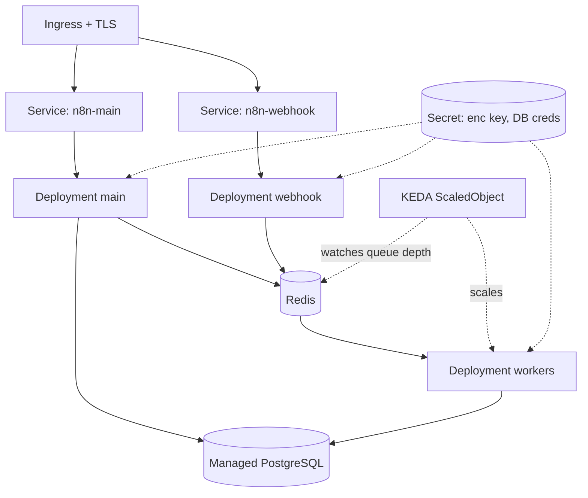

### 8.5 Real example

**Scenario.** An enterprise platform team hosts n8n for many internal squads. Load is highly variable: near-idle overnight, heavy during business hours, with month-end batch spikes.

**Problem.** A fixed worker count either wastes money off-peak or drops SLA at peak; manual scaling is reactive and error-prone.

**Solution.** Deploy in queue mode on Kubernetes with **KEDA** scaling the worker Deployment on Redis queue depth (e.g., scale up when the Bull wait list exceeds a threshold), from 2 to 20 replicas automatically.

**Implementation.** Manifests below: Secret, main Deployment + Service, worker Deployment, KEDA `ScaledObject`, and Ingress.

**Result.** Workers scale to backlog: 2 replicas overnight, 18 at month-end peak, back to 2 afterward — SLA held, cost tracking demand.

**Future improvements.** Add Prometheus + Grafana dashboards (Chapter 50) and a PodDisruptionBudget for safe node drains.

### 8.6 Step by step

1. Create a namespace and a Secret with the encryption key and DB credentials.
2. Deploy/point to managed Postgres and Redis.
3. Deploy the main process (Deployment + Service) with probes.
4. Deploy the worker Deployment (`args: ["worker"]`).
5. Install KEDA and create a `ScaledObject` watching Redis.
6. Add an Ingress with cert-manager TLS.

### 8.7 Complete code (Kubernetes manifests)

```yaml
# secret.yaml
apiVersion: v1
kind: Secret
metadata:
  name: n8n-secrets
  namespace: n8n
type: Opaque
stringData:
  N8N_ENCRYPTION_KEY: "replace-with-openssl-rand-hex-24"
  DB_POSTGRESDB_PASSWORD: "replace-with-strong-password"
---
# main-deployment.yaml
apiVersion: apps/v1
kind: Deployment
metadata:
  name: n8n-main
  namespace: n8n
spec:
  replicas: 1
  selector:
    matchLabels: { app: n8n, role: main }
  template:
    metadata:
      labels: { app: n8n, role: main }
    spec:
      containers:
        - name: n8n
          image: docker.n8n.io/n8nio/n8n:2.3.0
          ports: [{ containerPort: 5678 }]
          env:
            - { name: DB_TYPE, value: postgresdb }
            - { name: DB_POSTGRESDB_HOST, value: postgres }
            - { name: DB_POSTGRESDB_DATABASE, value: n8n }
            - { name: DB_POSTGRESDB_USER, value: n8n }
            - name: DB_POSTGRESDB_PASSWORD
              valueFrom: { secretKeyRef: { name: n8n-secrets, key: DB_POSTGRESDB_PASSWORD } }
            - name: N8N_ENCRYPTION_KEY
              valueFrom: { secretKeyRef: { name: n8n-secrets, key: N8N_ENCRYPTION_KEY } }
            - { name: EXECUTIONS_MODE, value: queue }
            - { name: QUEUE_BULL_REDIS_HOST, value: redis }
            - { name: N8N_RUNNERS_ENABLED, value: "true" }
            - { name: WEBHOOK_URL, value: "https://n8n.corp.example/" }
          readinessProbe:
            httpGet: { path: /healthz, port: 5678 }
            initialDelaySeconds: 15
          livenessProbe:
            httpGet: { path: /healthz, port: 5678 }
            initialDelaySeconds: 30
---
# main-service.yaml
apiVersion: v1
kind: Service
metadata: { name: n8n-main, namespace: n8n }
spec:
  selector: { app: n8n, role: main }
  ports: [{ port: 80, targetPort: 5678 }]
---
# worker-deployment.yaml
apiVersion: apps/v1
kind: Deployment
metadata: { name: n8n-worker, namespace: n8n }
spec:
  replicas: 2
  selector:
    matchLabels: { app: n8n, role: worker }
  template:
    metadata:
      labels: { app: n8n, role: worker }
    spec:
      containers:
        - name: n8n-worker
          image: docker.n8n.io/n8nio/n8n:2.3.0
          args: ["worker", "--concurrency=10"]
          env:
            - { name: DB_TYPE, value: postgresdb }
            - { name: DB_POSTGRESDB_HOST, value: postgres }
            - { name: DB_POSTGRESDB_DATABASE, value: n8n }
            - { name: DB_POSTGRESDB_USER, value: n8n }
            - name: DB_POSTGRESDB_PASSWORD
              valueFrom: { secretKeyRef: { name: n8n-secrets, key: DB_POSTGRESDB_PASSWORD } }
            - name: N8N_ENCRYPTION_KEY
              valueFrom: { secretKeyRef: { name: n8n-secrets, key: N8N_ENCRYPTION_KEY } }
            - { name: EXECUTIONS_MODE, value: queue }
            - { name: QUEUE_BULL_REDIS_HOST, value: redis }
            - { name: N8N_RUNNERS_ENABLED, value: "true" }
---
# keda-scaledobject.yaml
apiVersion: keda.sh/v1alpha1
kind: ScaledObject
metadata: { name: n8n-worker-scaler, namespace: n8n }
spec:
  scaleTargetRef: { name: n8n-worker }
  minReplicaCount: 2
  maxReplicaCount: 20
  triggers:
    - type: redis
      metadata:
        address: redis:6379
        listName: "bull:jobs:wait"
        listLength: "20"
```

### 8.8 Complete n8n workflow (importable JSON)

A workflow that reports execution metadata so you can confirm which worker pod handled it:

```json
{
  "name": "Worker Identity Probe",
  "nodes": [
    {
      "parameters": { "rule": { "interval": [{ "field": "minutes", "minutesInterval": 5 }] } },
      "id": "c0000001-0000-0000-0000-000000000001",
      "name": "Schedule",
      "type": "n8n-nodes-base.scheduleTrigger",
      "typeVersion": 1.2,
      "position": [260, 300]
    },
    {
      "parameters": {
        "jsCode": "return [{ json: { pod: $env.HOSTNAME || 'unknown', execId: $execution.id, at: $now.toISO() } }];"
      },
      "id": "c0000002-0000-0000-0000-000000000002",
      "name": "Report Pod",
      "type": "n8n-nodes-base.code",
      "typeVersion": 2,
      "position": [480, 300]
    }
  ],
  "connections": {
    "Schedule": { "main": [[{ "node": "Report Pod", "type": "main", "index": 0 }]] }
  },
  "settings": { "executionOrder": "v1" }
}
```

### 8.9 Exercises

1. Deploy the main process and confirm `/healthz` readiness gating works (kill the DB, watch the pod go NotReady).
2. Generate queue backlog and watch KEDA scale workers up, then down.
3. Explain why the main process should run a single replica unless you carefully partition triggers.

### 8.10 Challenges

- **Challenge 1.** Add a separate webhook Deployment and route `/webhook/*` to it via Ingress path rules.
- **Challenge 2.** Add a PodDisruptionBudget and a graceful-shutdown configuration so a node drain never drops in-flight executions.

### 8.11 Checklist

- [ ] Encryption key and DB creds come from a Secret, not plain env.
- [ ] Liveness/readiness probes hit `/healthz`.
- [ ] Workers autoscale on queue depth (KEDA), not just CPU.
- [ ] Ingress terminates TLS (cert-manager).
- [ ] Managed Postgres/Redis or properly-backed StatefulSets.

### 8.12 Best practices

- Prefer **managed** Postgres and Redis over in-cluster StatefulSets for production durability.
- Scale workers on queue depth (KEDA); CPU-based HPA lags real demand.
- Keep the main process a single replica unless you split webhook/trigger duties explicitly.
- Use GitOps (Argo CD/Flux) so manifests are versioned and auditable (Chapter 45).

### 8.13 Anti-patterns

- Multiple main replicas all registering the same schedule triggers → duplicate executions.
- Storing the encryption key in a ConfigMap or plain env.
- CPU-only autoscaling for I/O-bound workers → poor responsiveness to backlog.
- In-cluster Postgres on ephemeral storage → data loss on reschedule.

### 8.14 Troubleshooting

| Symptom | Cause | Action |
|---------|-------|--------|
| Duplicate scheduled executions | >1 main replica with triggers | Run a single main, or isolate triggers |
| Pod stuck NotReady | Probe failing (DB down) | Fix DB connectivity; check probe path |
| Workers don't scale | KEDA not watching the right list | Verify `listName`/Redis address |
| TLS errors on Ingress | cert-manager not issuing | Check Issuer/ClusterIssuer + DNS |
| "Could not decrypt" in workers | Secret key mismatch | Use one Secret across all pods |

### 8.15 Official references

- Kubernetes hosting: https://docs.n8n.io/hosting/installation/server-setups/kubernetes/
- Scaling / queue mode: https://docs.n8n.io/hosting/scaling/queue-mode/
- KEDA: https://keda.sh/docs/
- Configuration env vars: https://docs.n8n.io/hosting/configuration/environment-variables/

---

## Chapter 9 — AWS

### 9.1 Introduction

AWS is the most common landing zone for self-hosted n8n. This chapter maps the n8n queue-mode topology onto AWS managed services: **ECS Fargate** (or EKS) for the n8n processes, **RDS for PostgreSQL** for persistence, **ElastiCache for Redis** for the queue, **S3** for binary data, **Secrets Manager** for the encryption key and credentials, and an **Application Load Balancer (ALB)** for TLS and routing. The goal is a deployment that is durable, observable, and as managed as possible — you operate workflows, not databases.

### 9.2 Business context

Running on AWS managed services trades a higher per-hour cost for a dramatic reduction in operational risk and toil: automated backups, multi-AZ failover, patching, and encryption-at-rest come for free. For most enterprises this is the right trade — an engineer's time spent babysitting a self-managed Postgres on EC2 costs more than RDS. AWS also provides the compliance scaffolding (KMS, IAM, VPC isolation, CloudTrail) that regulated workloads require.

### 9.3 Theoretical concepts

- **ECS Fargate:** serverless containers — you define task definitions (main, webhook, worker) and a service per role; AWS schedules them without you managing EC2 hosts.
- **RDS PostgreSQL:** managed Postgres with multi-AZ, automated backups, and KMS encryption. n8n 2.x supports only Postgres/SQLite, so RDS is the production choice.
- **ElastiCache Redis:** managed Redis for queue mode.
- **S3 binary data:** set `N8N_DEFAULT_BINARY_DATA_MODE=s3` to keep large files out of the database.
- **Secrets Manager + IAM:** inject `N8N_ENCRYPTION_KEY` and DB credentials at task start via the task execution role — no secrets in task definitions.
- **ALB:** terminates TLS (ACM certificate), routes `/webhook/*` to the webhook service and everything else to the main service.

### 9.4 Architecture

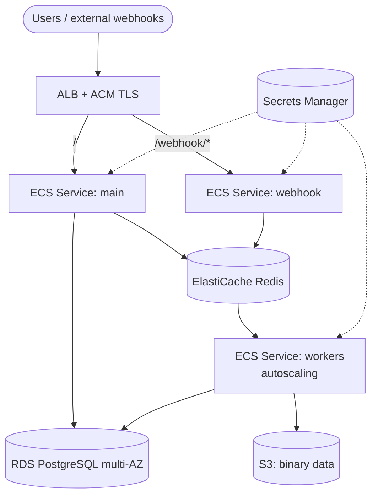

### 9.5 Real example

**Scenario.** A SaaS company must host n8n in AWS to satisfy a customer requirement that all automation data stays in `sa-east-1`, with automated backups and the ability to scale to month-end peaks.

**Problem.** A single EC2 instance with self-managed Postgres failed an audit (no multi-AZ, manual backups) and could not absorb the month-end load.

**Solution.** Move to ECS Fargate queue mode + RDS multi-AZ + ElastiCache + S3, with worker service autoscaling on CPU and queue depth (via a CloudWatch custom metric).

**Implementation.** Task definition and service autoscaling shown below; secrets pulled from Secrets Manager.

**Result.** Audit passed (multi-AZ, KMS encryption, automated backups, CloudTrail), and workers scale 2→15 at peak. Data never leaves the region.

**Future improvements.** Add a custom CloudWatch metric publishing Bull queue depth and an Application Auto Scaling target-tracking policy on it; add AWS WAF in front of the ALB.

### 9.6 Step by step

1. Create the VPC, private subnets, and security groups.
2. Provision RDS PostgreSQL (multi-AZ) and ElastiCache Redis.
3. Store the encryption key and DB password in Secrets Manager.
4. Create an S3 bucket for binary data and grant the task role access.
5. Register ECS task definitions for main, webhook, and worker.
6. Create ECS services behind an ALB; attach autoscaling to the worker service.

### 9.7 Complete code (ECS task definition — worker, abridged)

```json
{
  "family": "n8n-worker",
  "networkMode": "awsvpc",
  "requiresCompatibilities": ["FARGATE"],
  "cpu": "1024",
  "memory": "2048",
  "executionRoleArn": "arn:aws:iam::123456789012:role/n8nTaskExecRole",
  "taskRoleArn": "arn:aws:iam::123456789012:role/n8nTaskRole",
  "containerDefinitions": [
    {
      "name": "n8n-worker",
      "image": "123456789012.dkr.ecr.sa-east-1.amazonaws.com/n8n:2.3.0",
      "command": ["worker", "--concurrency=10"],
      "environment": [
        { "name": "DB_TYPE", "value": "postgresdb" },
        { "name": "DB_POSTGRESDB_HOST", "value": "n8n.cluster-xyz.sa-east-1.rds.amazonaws.com" },
        { "name": "DB_POSTGRESDB_DATABASE", "value": "n8n" },
        { "name": "DB_POSTGRESDB_USER", "value": "n8n" },
        { "name": "EXECUTIONS_MODE", "value": "queue" },
        { "name": "QUEUE_BULL_REDIS_HOST", "value": "n8n.abc.ng.0001.sae1.cache.amazonaws.com" },
        { "name": "N8N_RUNNERS_ENABLED", "value": "true" },
        { "name": "N8N_DEFAULT_BINARY_DATA_MODE", "value": "s3" },
        { "name": "N8N_EXTERNAL_STORAGE_S3_BUCKET_NAME", "value": "n8n-binary-data" },
        { "name": "N8N_EXTERNAL_STORAGE_S3_BUCKET_REGION", "value": "sa-east-1" }
      ],
      "secrets": [
        { "name": "N8N_ENCRYPTION_KEY", "valueFrom": "arn:aws:secretsmanager:sa-east-1:123456789012:secret:n8n/enc-key" },
        { "name": "DB_POSTGRESDB_PASSWORD", "valueFrom": "arn:aws:secretsmanager:sa-east-1:123456789012:secret:n8n/db-pass" }
      ],
      "logConfiguration": {
        "logDriver": "awslogs",
        "options": {
          "awslogs-group": "/ecs/n8n-worker",
          "awslogs-region": "sa-east-1",
          "awslogs-stream-prefix": "worker"
        }
      }
    }
  ]
}
```

Application Auto Scaling (CLI sketch):

```bash
aws application-autoscaling register-scalable-target \
  --service-namespace ecs \
  --resource-id service/n8n-cluster/n8n-worker \
  --scalable-dimension ecs:service:DesiredCount \
  --min-capacity 2 --max-capacity 15
```

### 9.8 Complete n8n workflow (importable JSON)

A workflow that writes a daily backup artifact to S3 using the AWS S3 node — a common AWS-native housekeeping task:

```json
{
  "name": "Daily S3 Audit Export",
  "nodes": [
    {
      "parameters": { "rule": { "interval": [{ "field": "hours", "hoursInterval": 24 }] } },
      "id": "d0000001-0000-0000-0000-000000000001",
      "name": "Daily",
      "type": "n8n-nodes-base.scheduleTrigger",
      "typeVersion": 1.2,
      "position": [240, 300]
    },
    {
      "parameters": {
        "jsCode": "return [{ json: { generatedAt: $now.toISO(), summary: 'daily audit export' } }];"
      },
      "id": "d0000002-0000-0000-0000-000000000002",
      "name": "Build Report",
      "type": "n8n-nodes-base.code",
      "typeVersion": 2,
      "position": [460, 300]
    },
    {
      "parameters": {
        "operation": "toJson",
        "mode": "each",
        "options": {}
      },
      "id": "d0000003-0000-0000-0000-000000000003",
      "name": "To JSON File",
      "type": "n8n-nodes-base.convertToFile",
      "typeVersion": 1.1,
      "position": [680, 300]
    },
    {
      "parameters": {
        "operation": "upload",
        "bucketName": "n8n-binary-data",
        "fileName": "=audit/{{ $now.toFormat('yyyy-LL-dd') }}.json",
        "binaryPropertyName": "data"
      },
      "id": "d0000004-0000-0000-0000-000000000004",
      "name": "Upload to S3",
      "type": "n8n-nodes-base.awsS3",
      "typeVersion": 2,
      "position": [900, 300],
      "credentials": { "aws": { "id": "1", "name": "AWS account" } }
    }
  ],
  "connections": {
    "Daily": { "main": [[{ "node": "Build Report", "type": "main", "index": 0 }]] },
    "Build Report": { "main": [[{ "node": "To JSON File", "type": "main", "index": 0 }]] },
    "To JSON File": { "main": [[{ "node": "Upload to S3", "type": "main", "index": 0 }]] }
  },
  "settings": { "executionOrder": "v1" }
}
```

### 9.9 Exercises

1. Provision RDS PostgreSQL and point n8n at it; confirm multi-AZ failover does not lose workflows.
2. Configure S3 binary data mode and verify large files no longer hit the database.
3. Pull the encryption key from Secrets Manager into the ECS task and confirm it never appears in the task definition JSON.

### 9.10 Challenges

- **Challenge 1.** Publish a custom CloudWatch metric for Bull queue depth and create a target-tracking autoscaling policy on it for the worker service.
- **Challenge 2.** Put AWS WAF in front of the ALB and write a rule that rate-limits the `/webhook/*` path.

### 9.11 Checklist

- [ ] RDS PostgreSQL multi-AZ, KMS-encrypted, automated backups.
- [ ] ElastiCache Redis for queue mode.
- [ ] Encryption key + DB password from Secrets Manager (IAM-scoped).
- [ ] S3 binary data mode enabled.
- [ ] ALB terminates TLS; `/webhook/*` routed to the webhook service.

### 9.12 Best practices

- Use the task **execution role** to fetch secrets; never bake them into task definitions or images.
- Run main, webhook, and worker as separate ECS services so they scale independently.
- Put everything in private subnets; expose only the ALB.
- Enable RDS Performance Insights and CloudWatch Container Insights early.

### 9.13 Anti-patterns

- Self-managed Postgres on EC2 "to save money" — you pay in toil and risk.
- One ECS service running all roles — you lose independent scaling.
- Public RDS/ElastiCache endpoints.
- Storing binary data in RDS instead of S3 (database bloat, expensive storage).

### 9.14 Troubleshooting

| Symptom | Cause | Action |
|---------|-------|--------|
| Tasks fail to start with secret error | Task role lacks `secretsmanager:GetSecretValue` | Grant the IAM permission |
| Workers can't reach Redis | Security group blocks 6379 | Allow worker SG → ElastiCache SG |
| Binary uploads fail | Task role lacks S3 access | Grant `s3:PutObject` on the bucket |
| 503 from ALB | Health check failing on `/healthz` | Fix target group health check path |
| RDS connection exhausted | Too many workers, small instance | Add a pooler/raise `max_connections` |

### 9.15 Official references

- AWS server setup: https://docs.n8n.io/hosting/installation/server-setups/aws/
- External S3 binary storage: https://docs.n8n.io/hosting/scaling/external-secrets/
- Binary data: https://docs.n8n.io/hosting/scaling/binary-data/
- Scaling / queue mode: https://docs.n8n.io/hosting/scaling/queue-mode/

---

## Chapter 10 — Azure

### 10.1 Introduction

On Microsoft Azure, the n8n queue-mode topology maps to **Azure Container Apps** (or AKS) for the processes, **Azure Database for PostgreSQL – Flexible Server** for persistence, **Azure Cache for Redis** for the queue, **Azure Blob Storage** for binary data, **Key Vault** for secrets, and **Application Gateway** (or the Container Apps ingress) for TLS. Azure is the natural choice for enterprises already standardized on Microsoft 365, Entra ID, and Azure governance.

### 10.2 Business context

The pull toward Azure is usually organizational: companies anchored in Microsoft 365 and Entra ID (formerly Azure AD) want n8n to live where their identity, networking, and compliance controls already are. Co-locating n8n in Azure simplifies SSO (Chapter 48), private networking to internal systems, and unified billing/governance under Azure Policy and Cost Management.

### 10.3 Theoretical concepts

- **Azure Container Apps (ACA):** serverless containers with built-in autoscaling (including KEDA scalers), revisions, and ingress — an excellent fit for n8n's main/webhook/worker split.
- **PostgreSQL Flexible Server:** managed Postgres with zone-redundant HA and automated backups.
- **Azure Cache for Redis:** managed Redis for queue mode.
- **Blob Storage:** n8n can target S3-compatible external storage; Azure Blob is reached via its S3-compatible gateway or by mounting, depending on setup — most teams use Blob for backups and keep binary data on a mounted volume or a small S3-compatible layer.
- **Key Vault + Managed Identity:** inject the encryption key and DB password without storing secrets in the app config.
- **Application Gateway / ACA ingress:** TLS termination and routing.

### 10.4 Architecture

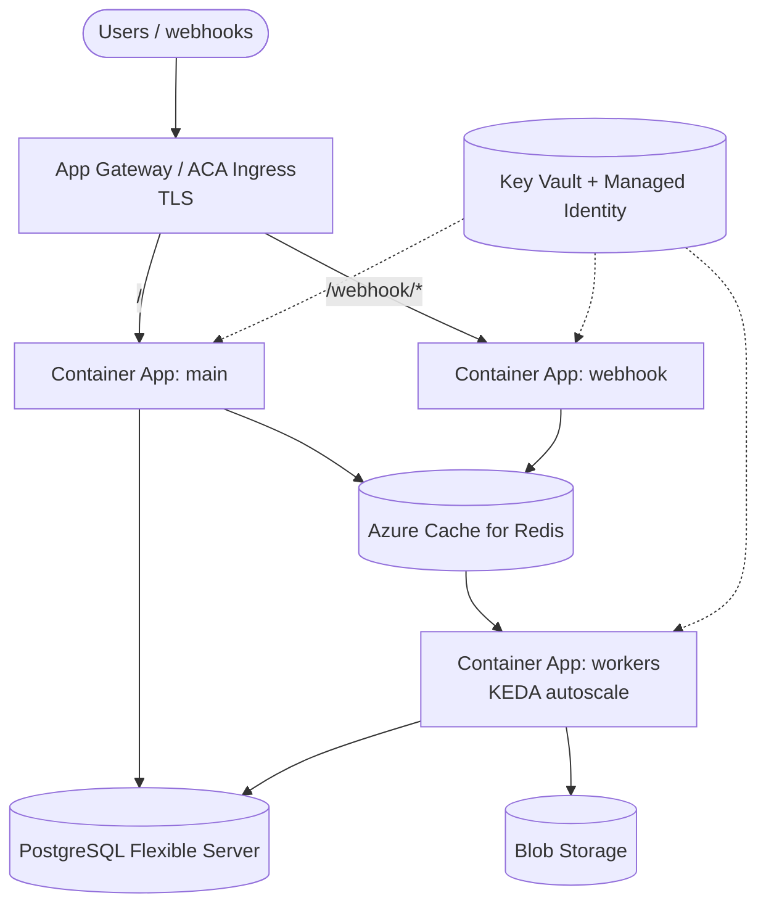

### 10.5 Real example

**Scenario.** A Microsoft-centric enterprise wants n8n integrated with Entra ID SSO and Teams notifications, deployed entirely in Azure with private networking to its on-prem ERP via ExpressRoute.

**Problem.** Their existing Linux VM running n8n had no HA, no managed backups, and could not use Managed Identity for secrets.

**Solution.** Container Apps in queue mode + PostgreSQL Flexible Server (zone-redundant) + Azure Cache for Redis, with Key Vault references via Managed Identity, behind Application Gateway with an Entra-issued certificate.

**Implementation.** Container Apps definitions reference Key Vault secrets; KEDA scales workers on Redis list length.

**Result.** HA Postgres with automated backups, secrets in Key Vault, SSO through Entra ID, and Teams alerting — all within the Azure perimeter and the ExpressRoute boundary.

**Future improvements.** Add Azure Monitor + Log Analytics dashboards and Private Endpoints for Postgres and Redis.

### 10.6 Step by step

1. Create a resource group, VNet, and subnets.
2. Provision PostgreSQL Flexible Server (zone-redundant HA) and Azure Cache for Redis with Private Endpoints.
3. Store the encryption key and DB password in Key Vault; enable Managed Identity on the Container Apps environment.
4. Create Container Apps for main, webhook, and worker referencing Key Vault secrets.
5. Configure KEDA-based scaling on the worker app (Redis trigger).
6. Front with Application Gateway (or ACA ingress) for TLS.

### 10.7 Complete code (Container App — worker, Bicep-style YAML)

```yaml
# worker container app (azure container apps)
properties:
  configuration:
    secrets:
      - name: enc-key
        keyVaultUrl: https://n8n-kv.vault.azure.net/secrets/n8n-enc-key
        identity: system
      - name: db-pass
        keyVaultUrl: https://n8n-kv.vault.azure.net/secrets/n8n-db-pass
        identity: system
  template:
    containers:
      - name: n8n-worker
        image: n8nacr.azurecr.io/n8n:2.3.0
        command: ["n8n"]
        args: ["worker", "--concurrency=10"]
        env:
          - { name: DB_TYPE, value: postgresdb }
          - { name: DB_POSTGRESDB_HOST, value: n8n-pg.postgres.database.azure.com }
          - { name: DB_POSTGRESDB_DATABASE, value: n8n }
          - { name: DB_POSTGRESDB_USER, value: n8nadmin }
          - { name: DB_POSTGRESDB_PASSWORD, secretRef: db-pass }
          - { name: N8N_ENCRYPTION_KEY, secretRef: enc-key }
          - { name: EXECUTIONS_MODE, value: queue }
          - { name: QUEUE_BULL_REDIS_HOST, value: n8n-redis.redis.cache.windows.net }
          - { name: QUEUE_BULL_REDIS_PORT, value: "6380" }
          - { name: QUEUE_BULL_REDIS_TLS, value: "true" }
          - { name: N8N_RUNNERS_ENABLED, value: "true" }
    scale:
      minReplicas: 2
      maxReplicas: 20
      rules:
        - name: redis-queue
          custom:
            type: redis
            metadata:
              address: n8n-redis.redis.cache.windows.net:6380
              listName: "bull:jobs:wait"
              listLength: "20"
              enableTLS: "true"
```

### 10.8 Complete n8n workflow (importable JSON)

A workflow that posts a deployment-health summary to Microsoft Teams via an incoming webhook — typical Azure-shop alerting:

```json
{
  "name": "Teams Health Alert",
  "nodes": [
    {
      "parameters": { "rule": { "interval": [{ "field": "minutes", "minutesInterval": 15 }] } },
      "id": "e0000001-0000-0000-0000-000000000001",
      "name": "Every 15m",
      "type": "n8n-nodes-base.scheduleTrigger",
      "typeVersion": 1.2,
      "position": [240, 300]
    },
    {
      "parameters": {
        "url": "https://n8n.corp.example/healthz",
        "options": {}
      },
      "id": "e0000002-0000-0000-0000-000000000002",
      "name": "Probe Health",
      "type": "n8n-nodes-base.httpRequest",
      "typeVersion": 4.2,
      "position": [460, 300]
    },
    {
      "parameters": {
        "method": "POST",
        "url": "https://outlook.office.com/webhook/REPLACE",
        "sendBody": true,
        "specifyBody": "json",
        "jsonBody": "={{ { \"text\": \"n8n health: \" + ($json.status || 'unknown') + \" at \" + $now.toISO() } }}",
        "options": {}
      },
      "id": "e0000003-0000-0000-0000-000000000003",
      "name": "Notify Teams",
      "type": "n8n-nodes-base.httpRequest",
      "typeVersion": 4.2,
      "position": [680, 300]
    }
  ],
  "connections": {
    "Every 15m": { "main": [[{ "node": "Probe Health", "type": "main", "index": 0 }]] },
    "Probe Health": { "main": [[{ "node": "Notify Teams", "type": "main", "index": 0 }]] }
  },
  "settings": { "executionOrder": "v1" }
}
```

### 10.9 Exercises

1. Reference a Key Vault secret from a Container App via Managed Identity and confirm the value is never in the app config.
2. Enable TLS to Azure Cache for Redis (port 6380, `QUEUE_BULL_REDIS_TLS=true`) and verify workers connect.
3. Configure zone-redundant HA on PostgreSQL Flexible Server.

### 10.10 Challenges

- **Challenge 1.** Add Private Endpoints for Postgres and Redis so no traffic traverses the public internet.
- **Challenge 2.** Wire Entra ID SSO to n8n Enterprise (preview of Chapter 48) and restrict editor access to a security group.

### 10.11 Checklist

- [ ] PostgreSQL Flexible Server with zone-redundant HA and backups.
- [ ] Azure Cache for Redis with TLS (6380).
- [ ] Secrets via Key Vault + Managed Identity.
- [ ] Workers autoscale via KEDA on Redis depth.
- [ ] TLS at App Gateway / ACA ingress.

### 10.12 Best practices

- Use Managed Identity everywhere; avoid connection strings with embedded secrets.
- Enable Redis TLS (port 6380) — Azure Cache requires it by default.
- Use Private Endpoints to keep DB/Redis off the public internet.
- Centralize logs in Log Analytics for cross-service correlation.

### 10.13 Anti-patterns

- Connecting to Azure Cache for Redis without TLS (often blocked, always insecure).
- Storing secrets in Container App plain env instead of Key Vault.
- Single-zone Postgres for a production workload.
- Public network access left enabled on managed data services.

### 10.14 Troubleshooting

| Symptom | Cause | Action |
|---------|-------|--------|
| Redis connection refused | TLS/port mismatch | Use 6380 + `QUEUE_BULL_REDIS_TLS=true` |
| Key Vault secret not resolved | Managed Identity lacks access policy | Grant `get` on secrets to the identity |
| Postgres SSL required error | Flexible Server enforces SSL | Set `DB_POSTGRESDB_SSL_*` accordingly |
| Workers idle despite backlog | KEDA scaler misconfigured | Verify Redis trigger metadata |
| Webhook URL wrong | `WEBHOOK_URL` not set to public host | Set `WEBHOOK_URL` to the App Gateway host |

### 10.15 Official references

- Azure server setup: https://docs.n8n.io/hosting/installation/server-setups/azure/
- Configuration env vars: https://docs.n8n.io/hosting/configuration/environment-variables/
- Queue mode: https://docs.n8n.io/hosting/scaling/queue-mode/
- Supported databases: https://docs.n8n.io/hosting/configuration/supported-databases-settings/

---

## Chapter 11 — GCP

### 11.1 Introduction

On Google Cloud, n8n maps to **GKE** (or Cloud Run for the main process) for compute, **Cloud SQL for PostgreSQL** for persistence, **Memorystore for Redis** for the queue, **Cloud Storage (GCS)** for binary data, **Secret Manager** for secrets, and a **Global HTTPS Load Balancer** for TLS. GKE Autopilot is particularly attractive: it runs the queue-mode topology with KEDA-style autoscaling while abstracting node management.

### 11.2 Business context

GCP appeals to data- and AI-heavy organizations: tight integration with BigQuery, Vertex AI, and Pub/Sub makes n8n a natural orchestration layer for data pipelines and generative-AI workflows that already live in Google Cloud. Keeping n8n in GKE next to BigQuery and Vertex AI minimizes egress cost and latency for the data- and AI-centric use cases that dominate Parts IV and V.

### 11.3 Theoretical concepts

- **GKE Autopilot:** managed Kubernetes where Google runs the nodes; you deploy the same manifests as Chapter 8.
- **Cloud Run (main only):** for small deployments, the main process can run on Cloud Run, but queue-mode workers fit better on GKE because they are long-running consumers.
- **Cloud SQL PostgreSQL:** managed Postgres with HA and automated backups; reached via the Cloud SQL Auth Proxy or Private IP.
- **Memorystore Redis:** managed Redis for the queue.
- **GCS:** binary data via S3-compatible interoperability or GCS-native handling.
- **Secret Manager + Workload Identity:** map a Kubernetes service account to a Google service account so pods read secrets without keys.

### 11.4 Architecture

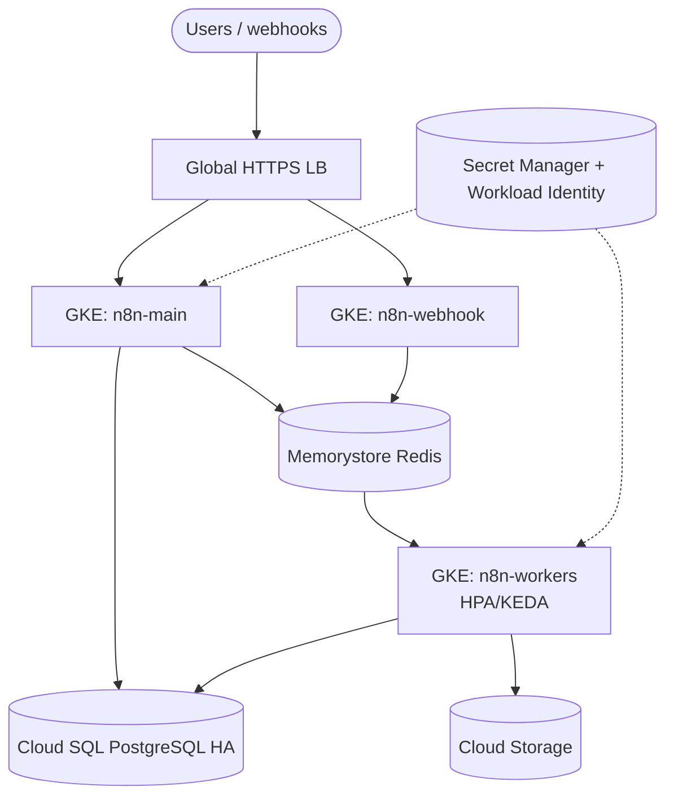

### 11.5 Real example

**Scenario.** A data team uses BigQuery and Vertex AI and wants n8n to orchestrate nightly ELT and an AI enrichment step, hosted in GKE Autopilot in the same project.

**Problem.** Their previous Cloud Run-only deployment couldn't run long-lived queue workers and incurred cold-start latency on scheduled jobs.

**Solution.** GKE Autopilot in queue mode, Cloud SQL via Private IP, Memorystore Redis, Workload Identity for Secret Manager, fronted by a Global HTTPS LB with a Google-managed certificate.

**Implementation.** Standard Chapter 8 manifests, plus a `ServiceAccount` annotation binding to a Google service account for Secret Manager and BigQuery access.

**Result.** Nightly ELT runs on always-warm workers, AI enrichment calls Vertex AI within the project (low latency, no egress), and secrets are read via Workload Identity with no key files.

**Future improvements.** Use BigQuery as the analytics sink (Chapter 24/29) and Pub/Sub to decouple triggers.

### 11.6 Step by step

1. Create a GKE Autopilot cluster and enable Workload Identity.
2. Provision Cloud SQL PostgreSQL (HA, Private IP) and Memorystore Redis.
3. Store secrets in Secret Manager; bind a GSA to the KSA.
4. Deploy main/webhook/worker (Chapter 8 manifests).
5. Add an HPA/KEDA scaler for workers.
6. Expose via a Global HTTPS LB (Ingress + ManagedCertificate).

### 11.7 Complete code (Workload Identity + worker, abridged)

```yaml
# service account bound to a Google service account
apiVersion: v1
kind: ServiceAccount
metadata:
  name: n8n-sa
  namespace: n8n
  annotations:
    iam.gke.io/gcp-service-account: n8n-runtime@my-project.iam.gserviceaccount.com
---
apiVersion: apps/v1
kind: Deployment
metadata: { name: n8n-worker, namespace: n8n }
spec:
  replicas: 2
  selector: { matchLabels: { app: n8n, role: worker } }
  template:
    metadata: { labels: { app: n8n, role: worker } }
    spec:
      serviceAccountName: n8n-sa
      containers:
        - name: n8n-worker
          image: gcr.io/my-project/n8n:2.3.0
          args: ["worker", "--concurrency=10"]
          env:
            - { name: DB_TYPE, value: postgresdb }
            - { name: DB_POSTGRESDB_HOST, value: "10.20.0.3" }   # Cloud SQL Private IP
            - { name: DB_POSTGRESDB_DATABASE, value: n8n }
            - { name: DB_POSTGRESDB_USER, value: n8n }
            - { name: EXECUTIONS_MODE, value: queue }
            - { name: QUEUE_BULL_REDIS_HOST, value: "10.30.0.4" } # Memorystore IP
            - { name: N8N_RUNNERS_ENABLED, value: "true" }
          # DB password fetched at startup via an init step / external-secrets operator
```

### 11.8 Complete n8n workflow (importable JSON)

A nightly ELT skeleton that queries an HTTP source and loads rows to BigQuery via the Google BigQuery node:

```json
{
  "name": "Nightly ELT to BigQuery",
  "nodes": [
    {
      "parameters": { "rule": { "interval": [{ "field": "hours", "triggerAtHour": 2 }] } },
      "id": "f0000001-0000-0000-0000-000000000001",
      "name": "At 02:00",
      "type": "n8n-nodes-base.scheduleTrigger",
      "typeVersion": 1.2,
      "position": [240, 300]
    },
    {
      "parameters": {
        "url": "https://api.source.example/v1/orders?since={{ $today.minus({ days: 1 }).toISODate() }}",
        "options": {}
      },
      "id": "f0000002-0000-0000-0000-000000000002",
      "name": "Extract",
      "type": "n8n-nodes-base.httpRequest",
      "typeVersion": 4.2,
      "position": [460, 300]
    },
    {
      "parameters": {
        "operation": "insert",
        "projectId": "my-project",
        "datasetId": "raw",
        "tableId": "orders",
        "options": {}
      },
      "id": "f0000003-0000-0000-0000-000000000003",
      "name": "Load to BigQuery",
      "type": "n8n-nodes-base.googleBigQuery",
      "typeVersion": 2.1,
      "position": [680, 300],
      "credentials": { "googleApi": { "id": "1", "name": "GCP service account" } }
    }
  ],
  "connections": {
    "At 02:00": { "main": [[{ "node": "Extract", "type": "main", "index": 0 }]] },
    "Extract": { "main": [[{ "node": "Load to BigQuery", "type": "main", "index": 0 }]] }
  },
  "settings": { "executionOrder": "v1" }
}
```

### 11.9 Exercises

1. Bind a KSA to a GSA via Workload Identity and read a Secret Manager secret without a key file.
2. Connect to Cloud SQL via Private IP and confirm no public IP is exposed.
3. Load a small dataset to BigQuery from an n8n workflow.

### 11.10 Challenges

- **Challenge 1.** Add a Pub/Sub trigger path: publish order events to Pub/Sub and have n8n consume them (via HTTP push subscription to a webhook).
- **Challenge 2.** Add a Vertex AI enrichment step that classifies each order before loading to BigQuery.

### 11.11 Checklist

- [ ] GKE Autopilot with Workload Identity enabled.
- [ ] Cloud SQL PostgreSQL HA via Private IP.
- [ ] Memorystore Redis for queue mode.
- [ ] Secrets via Secret Manager (no key files in pods).
- [ ] Global HTTPS LB with managed certificate.

### 11.12 Best practices

- Use Workload Identity instead of mounting service-account key files.
- Connect to Cloud SQL via Private IP or the Auth Proxy; never the public IP.
- Co-locate n8n with BigQuery/Vertex AI in the same region to cut egress and latency.
- Use the external-secrets operator to sync Secret Manager into Kubernetes Secrets.

### 11.13 Anti-patterns

- Mounting long-lived GSA key files into pods.
- Running queue workers on Cloud Run (cold starts, no long-lived consumers).
- Public Cloud SQL IPs.
- Cross-region BigQuery/n8n placement (avoidable egress cost).

### 11.14 Troubleshooting

| Symptom | Cause | Action |
|---------|-------|--------|
| `PermissionDenied` to Secret Manager | Workload Identity binding missing | Annotate KSA + grant GSA role |
| Cloud SQL connection timeout | No Private IP / proxy | Use Private IP or Auth Proxy sidecar |
| BigQuery insert 403 | GSA lacks `bigquery.dataEditor` | Grant the role |
| LB returns 502 | Backend health check failing | Point health check at `/healthz` |
| Workers idle under load | No HPA/KEDA scaler | Add a scaler on queue depth |

### 11.15 Official references

- GCP server setup: https://docs.n8n.io/hosting/installation/server-setups/google-cloud/
- Google BigQuery node: https://docs.n8n.io/integrations/builtin/app-nodes/n8n-nodes-base.googlebigquery/
- Queue mode: https://docs.n8n.io/hosting/scaling/queue-mode/
- Configuration env vars: https://docs.n8n.io/hosting/configuration/environment-variables/

---

## Chapter 12 — Self-Hosted

### 12.1 Introduction

This chapter zooms out from any single platform to the **discipline of self-hosting n8n** well: configuration management, secrets, backups, upgrades, encryption-key custody, execution pruning, and the operational runbook. Whether you run Docker, Compose, Kubernetes, or a bare VM, the self-hosting concerns are the same — and getting them wrong is how teams lose credentials, bloat databases, or fail audits.

### 12.2 Business context

Self-hosting is *the* reason many enterprises choose n8n: data sovereignty, compliance (LGPD/GDPR/HIPAA), and cost control. But that control comes with responsibility — you own backups, upgrades, and security. The break-even versus n8n Cloud is rarely raw infrastructure cost; it is the **value of keeping data in-perimeter and avoiding per-execution pricing at scale**, weighed against the cost of operating the platform responsibly.

### 12.3 Theoretical concepts

- **Encryption key custody:** `N8N_ENCRYPTION_KEY` decrypts every credential. It must be set explicitly, stored in a secret manager, backed up, and identical across all nodes/environments that share data. Lose it → lose all credentials.
- **Backups:** back up the **database** (workflows, credentials, executions) and the encryption key. For SQLite, the file under `.n8n`; for Postgres, `pg_dump`. Test restores.
- **Execution data lifecycle:** enable pruning (`EXECUTIONS_DATA_PRUNE`, `EXECUTIONS_DATA_MAX_AGE`) and decide what to save (`EXECUTIONS_DATA_SAVE_ON_SUCCESS`, `..._ON_ERROR`).
- **Upgrades:** pin versions; read release notes; test in staging; for 2.x specifically, run the Migration Report when coming from 1.x (Chapter 2).
- **Configuration:** environment variables (12-factor), `.env` files, or a config file; secrets injected, never committed.
- **Reverse proxy + TLS:** never expose n8n directly; terminate TLS and set `WEBHOOK_URL`.

### 12.4 Architecture

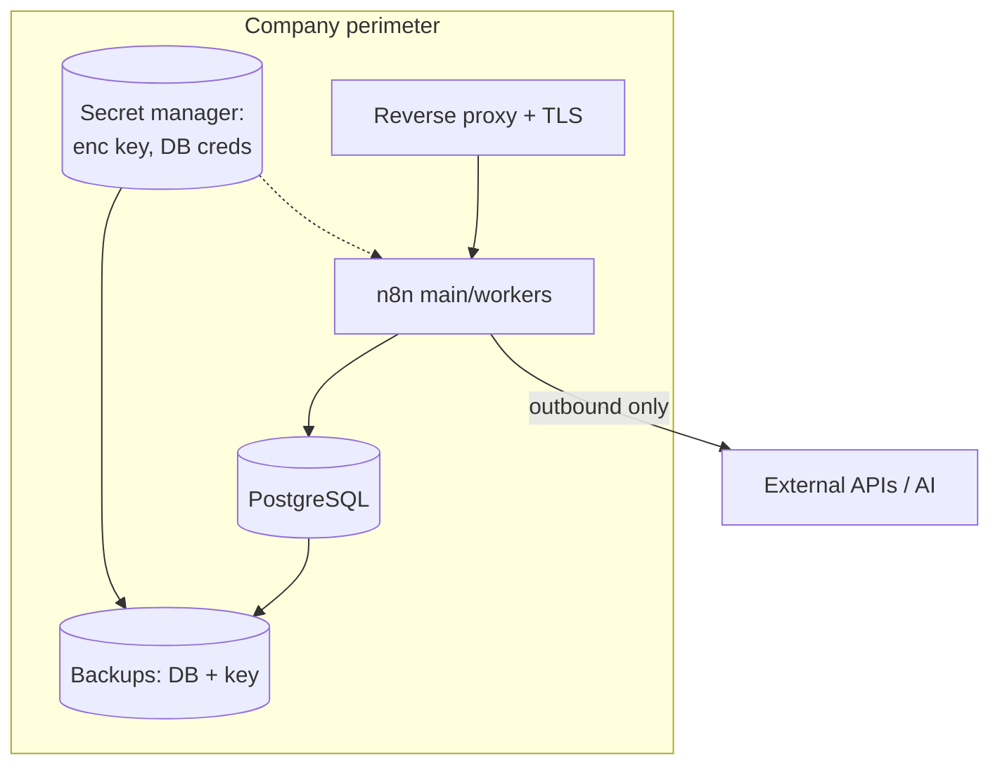

### 12.5 Real example

**Scenario.** A healthcare provider must keep all automation data on-prem for compliance and needs a defensible backup/restore and upgrade process for auditors.

**Problem.** Their initial install used SQLite with no backups, an auto-generated encryption key no one had saved, and `latest` as the image tag — an audit finding waiting to happen.

**Solution.** Migrate to PostgreSQL, set an explicit encryption key in Vault, enable nightly `pg_dump` + key backup, pin versions, and document an upgrade runbook with staging validation.

**Implementation.** Backup script and env configuration below; restores tested quarterly.

**Result.** Audit-ready: encryption key in custody and backed up, tested DB restores, pinned versions, controlled upgrades — all on-prem.

**Future improvements.** Add WORM/offsite backup storage and automate restore testing in CI.

### 12.6 Step by step

1. Choose PostgreSQL for production; set `DB_TYPE=postgresdb`.
2. Generate and store `N8N_ENCRYPTION_KEY` in a secret manager; back it up.
3. Configure execution save policy + pruning.
4. Put a reverse proxy with TLS in front; set `WEBHOOK_URL`.
5. Schedule nightly DB dumps + key backup; test restores.
6. Pin the image version; document the upgrade runbook.

### 12.7 Complete code (backup script + env)

```bash
#!/usr/bin/env bash
# n8n-backup.sh — nightly backup of Postgres + encryption key reference
set -euo pipefail

STAMP=$(date +%Y%m%d-%H%M%S)
BACKUP_DIR=/var/backups/n8n
mkdir -p "$BACKUP_DIR"

# 1. Database dump (workflows, credentials, executions)
PGPASSWORD="$DB_POSTGRESDB_PASSWORD" pg_dump \
  -h "$DB_POSTGRESDB_HOST" -U "$DB_POSTGRESDB_USER" -d n8n -Fc \
  -f "$BACKUP_DIR/n8n-$STAMP.dump"

# 2. Encryption key fingerprint (the real key lives in the secret manager)
echo "enc-key-sha256: $(printf '%s' "$N8N_ENCRYPTION_KEY" | sha256sum | cut -d' ' -f1)" \
  > "$BACKUP_DIR/keyref-$STAMP.txt"

# 3. Retention: keep 30 days
find "$BACKUP_DIR" -name 'n8n-*.dump' -mtime +30 -delete
echo "Backup complete: $BACKUP_DIR/n8n-$STAMP.dump"
```

Key environment block:

```bash
DB_TYPE=postgresdb
DB_POSTGRESDB_HOST=pg.internal
DB_POSTGRESDB_DATABASE=n8n
DB_POSTGRESDB_USER=n8n
N8N_ENCRYPTION_KEY=<from-secret-manager>
EXECUTIONS_DATA_SAVE_ON_SUCCESS=all
EXECUTIONS_DATA_SAVE_ON_ERROR=all
EXECUTIONS_DATA_PRUNE=true
EXECUTIONS_DATA_MAX_AGE=720          # 30 days in hours
N8N_PROTOCOL=https
WEBHOOK_URL=https://n8n.internal/
```

### 12.8 Complete n8n workflow (importable JSON)

A self-monitoring workflow that fails loudly if the database is unreachable, pushing an alert — a good self-hosting safety net:

```json
{
  "name": "Self-Host Watchdog",
  "nodes": [
    {
      "parameters": { "rule": { "interval": [{ "field": "minutes", "minutesInterval": 10 }] } },
      "id": "10000001-0000-0000-0000-000000000001",
      "name": "Every 10m",
      "type": "n8n-nodes-base.scheduleTrigger",
      "typeVersion": 1.2,
      "position": [240, 300]
    },
    {
      "parameters": {
        "operation": "executeQuery",
        "query": "SELECT 1 AS ok;",
        "options": {}
      },
      "id": "10000002-0000-0000-0000-000000000002",
      "name": "DB Ping",
      "type": "n8n-nodes-base.postgres",
      "typeVersion": 2.5,
      "position": [460, 300],
      "credentials": { "postgres": { "id": "1", "name": "n8n Postgres" } },
      "onError": "continueErrorOutput"
    },
    {
      "parameters": {
        "method": "POST",
        "url": "https://hooks.slack.com/services/REPLACE",
        "sendBody": true,
        "specifyBody": "json",
        "jsonBody": "={{ { \"text\": \"ALERT: n8n DB ping failed at \" + $now.toISO() } }}",
        "options": {}
      },
      "id": "10000003-0000-0000-0000-000000000003",
      "name": "Alert Slack",
      "type": "n8n-nodes-base.httpRequest",
      "typeVersion": 4.2,
      "position": [700, 420]
    }
  ],
  "connections": {
    "Every 10m": { "main": [[{ "node": "DB Ping", "type": "main", "index": 0 }]] },
    "DB Ping": { "main": [[], [{ "node": "Alert Slack", "type": "main", "index": 0 }]] }
  },
  "settings": { "executionOrder": "v1" }
}
```

### 12.9 Exercises

1. Perform a full backup and restore into a fresh instance using the same encryption key; confirm credentials decrypt.
2. Restore with the *wrong* key and observe the decryption failure (understand the blast radius).
3. Configure pruning and watch the executions table stop growing.

### 12.10 Challenges

- **Challenge 1.** Write a runbook to rotate the encryption key safely (re-encrypt credentials) without downtime.
- **Challenge 2.** Automate quarterly restore testing as a scheduled job that restores into a throwaway instance and validates a known workflow.

### 12.11 Checklist

- [ ] PostgreSQL in production; SQLite only for single-node/dev.
- [ ] Encryption key set explicitly, in a secret manager, and backed up.
- [ ] Nightly DB backups with tested restores.
- [ ] Execution save policy + pruning configured.
- [ ] Reverse proxy + TLS; `WEBHOOK_URL` set; versions pinned.

### 12.12 Best practices

- Treat the encryption key like a root CA key — custody, backup, rotation policy.
- Keep the same key across dev/staging/prod **only if** they legitimately share credentials; otherwise isolate.
- Test restores on a schedule, not just back up.
- Pin versions and read release notes before every upgrade.

### 12.13 Anti-patterns

- Auto-generated encryption key that no one saved.
- SQLite in production with high volume.
- Backing up the database but not the key (or vice versa).
- `latest` image tag; in-place production upgrades with no staging.

### 12.14 Troubleshooting

| Symptom | Cause | Action |
|---------|-------|--------|
| Credentials unreadable after restore | Wrong/missing encryption key | Restore the original key |
| Database enormous | Pruning disabled | Enable pruning; archive old executions |
| Webhooks point to localhost | `WEBHOOK_URL` unset | Set the public URL |
| Upgrade broke workflows | Skipped Migration Report (1.x→2.x) | Roll back; run the report in staging |
| Restore "works" but no executions | Only schema restored | Use `-Fc` dumps + full `pg_restore` |

### 12.15 Official references

- Hosting overview: https://docs.n8n.io/hosting/
- Configuration env vars: https://docs.n8n.io/hosting/configuration/environment-variables/
- Execution data / pruning: https://docs.n8n.io/hosting/scaling/execution-data/
- Supported databases: https://docs.n8n.io/hosting/configuration/supported-databases-settings/

---

## Chapter 13 — Cloud

### 13.1 Introduction

n8n **Cloud** is the official managed SaaS: n8n GmbH operates the infrastructure, upgrades, scaling, and backups; you build workflows. This chapter frames the **strategic decision** — Cloud vs. self-hosted — and covers what Cloud gives you (and constrains), so architects make the call on evidence rather than reflex. It closes Part II by tying the infrastructure thread back to business outcomes.

### 13.2 Business context

The Cloud-vs-self-hosted decision is one of the most consequential an automation team makes. Cloud minimizes time-to-value and operational burden — ideal for teams that want outcomes, not ops. Self-hosting wins where data sovereignty, deep network integration, custom community nodes, or per-execution economics at very high volume dominate. The mature answer is often **hybrid**: Cloud for fast-moving business automations, self-hosted for regulated or high-volume data/AI pipelines.

### 13.3 Theoretical concepts

- **Managed operations:** n8n Cloud handles upgrades (you ride the 2.x line automatically), scaling, backups, and uptime SLAs.
- **Plans and limits:** tiers bound by active workflows, executions, and features (e.g., advanced collaboration, environments, SSO on higher tiers).
- **Data residency:** Cloud offers selectable regions; verify against your compliance requirements.
- **Constraints vs. self-hosted:** custom community nodes and arbitrary OS-level access are more limited on Cloud by design (secure-by-default at the platform level).
- **Embed and enterprise:** n8n also offers **Embed** (white-label n8n inside your product) and **Enterprise** licensing (self-hosted with SSO, RBAC, environments, external secrets — Parts VI–VII).

### 13.4 Architecture (decision view)

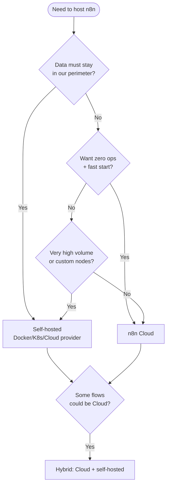

### 13.5 Real example

**Scenario.** A scale-up runs 40 business automations (CRM sync, notifications, reporting) plus 3 regulated data/AI pipelines that must keep customer PII on-prem.

**Problem.** Self-hosting everything burdens a small team with ops for low-risk flows; putting everything on Cloud violates the PII constraint.

**Solution.** Hybrid: the 40 business automations run on n8n Cloud (zero ops, automatic upgrades); the 3 regulated pipelines run self-hosted in the company VPC. Shared standards (naming, Git export) keep both estates consistent.

**Implementation.** Cloud workspace for business flows; a self-hosted Kubernetes instance (Chapter 8) for regulated pipelines; both export workflows to Git (Chapter 41) for a single source of truth.

**Result.** Minimal ops for low-risk automation, full sovereignty for regulated data, and consistent governance across both — the best of both worlds.

**Future improvements.** Promote some self-hosted flows to Cloud once data-handling allows, and unify observability across both estates (Chapter 50).

### 13.6 Step by step (evaluating Cloud)

1. List your workflows and tag each: data-sensitivity, volume, custom-node needs.
2. Map each to Cloud or self-hosted using the decision tree.
3. For Cloud candidates, pick a plan based on active workflows/executions and required features.
4. Verify data residency region against compliance.
5. Stand up the chosen environment; export everything to Git for portability.
6. Re-evaluate quarterly as volume and requirements change.

### 13.7 Complete code (export workflows for portability)

Keeping workflows portable across Cloud and self-hosted via the CLI/API export:

```bash
# Self-hosted export (CLI) — portable backup of all workflows
n8n export:workflow --all --output=./workflows.json --pretty

# Cloud / any instance — export via the Public API
curl -s https://YOUR-INSTANCE/api/v1/workflows \
  -H "X-N8N-API-KEY: $N8N_API_KEY" \
  | jq '.data' > workflows-export.json
```

### 13.8 Complete n8n workflow (importable JSON)

A "portability probe" workflow that prints whether it is running on Cloud or self-hosted, useful when the same flow is deployed to both:

```json
{
  "name": "Environment Probe",
  "nodes": [
    {
      "parameters": { "httpMethod": "GET", "path": "whereami", "responseMode": "lastNode" },
      "id": "20000001-0000-0000-0000-000000000001",
      "name": "Webhook",
      "type": "n8n-nodes-base.webhook",
      "typeVersion": 2,
      "position": [240, 300]
    },
    {
      "parameters": {
        "jsCode": "const host = $env.N8N_HOST || 'unknown';\nconst isCloud = host.endsWith('.app.n8n.cloud');\nreturn [{ json: { host, environment: isCloud ? 'n8n Cloud' : 'self-hosted', at: $now.toISO() } }];"
      },
      "id": "20000002-0000-0000-0000-000000000002",
      "name": "Detect Env",
      "type": "n8n-nodes-base.code",
      "typeVersion": 2,
      "position": [460, 300]
    }
  ],
  "connections": {
    "Webhook": { "main": [[{ "node": "Detect Env", "type": "main", "index": 0 }]] }
  },
  "settings": { "executionOrder": "v1" }
}
```

### 13.9 Exercises

1. Build the decision matrix for your own workflow portfolio (sensitivity × volume × custom-node need).
2. Export all workflows from one instance and import them into another to prove portability.
3. List which features your use cases require and check them against Cloud plan tiers.

### 13.10 Challenges

- **Challenge 1.** Design a hybrid governance model where Cloud and self-hosted instances share one Git source of truth and one naming standard.
- **Challenge 2.** Estimate the cost crossover point where self-hosting becomes cheaper than Cloud for your execution volume.

### 13.11 Checklist

- [ ] I classified each workflow by sensitivity, volume, and node needs.
- [ ] I applied the decision tree to choose Cloud / self-hosted / hybrid.
- [ ] I verified Cloud data residency against compliance.
- [ ] I exported workflows to Git for portability.
- [ ] I scheduled a quarterly re-evaluation.

### 13.12 Best practices

- Default to Cloud for low-risk, fast-moving automations; self-host what compliance or volume demands.
- Keep workflows portable: export to Git regardless of where they run.
- Standardize naming and structure across estates so flows can migrate either direction.
- Re-evaluate the decision as volume grows — economics shift with scale.

### 13.13 Anti-patterns

- Reflexively self-hosting everything and drowning a small team in ops.
- Putting regulated PII on Cloud without checking residency/compliance.
- Locking into Cloud-only patterns that can't be exported/migrated.
- Never re-evaluating as volume crosses the cost threshold.

### 13.14 Troubleshooting

| Symptom | Cause | Action |
|---------|-------|--------|
| Need a custom community node on Cloud | Cloud node restrictions | Self-host that workflow |
| Compliance flags data location | Wrong Cloud region | Choose a compliant region or self-host |
| Cost spikes at high volume | Per-execution economics | Evaluate self-hosting break-even |
| Can't migrate a flow to self-hosted | Cloud-specific assumptions | Refactor to portable patterns |
| Inconsistent flows across estates | No shared source of truth | Centralize in Git (Chapter 41) |

### 13.15 Official references

- n8n Cloud: https://docs.n8n.io/manage-cloud/
- Cloud vs self-hosted: https://docs.n8n.io/choose-n8n/
- Embed: https://docs.n8n.io/embed/
- Pricing/plans: https://n8n.io/pricing/

---

> **End of Part II.** You can now run n8n anywhere — a single Docker container, a Compose queue-mode stack, Kubernetes with autoscaling workers, the three major clouds, a disciplined self-hosted operation, or managed Cloud — and choose between them on evidence. **Part III — Building Workflows** (Chapters 14–20) shifts from infrastructure to craft: nodes, triggers, expressions, variables, data mapping, error handling, and debugging.

## Part III – Building Workflows

Part III is the craft of n8n: how to assemble nodes into correct, maintainable, observable workflows. Where Part II gave you the runway, Part III teaches you to fly. We cover the node taxonomy, the trigger model, the expression language, the variable system, data mapping between heterogeneous shapes, robust error handling, and disciplined debugging — all aligned to n8n 2.x defaults (secure Code node, Publish/Save, items model).

---

## Chapter 14 — Nodes

### 14.1 Introduction

Nodes are the atoms of n8n. Everything you build is a graph of nodes exchanging items. This chapter establishes the **node taxonomy** — triggers, actions, transformations, and logic/flow — and the cross-cutting mechanics every node shares: input/output items, parameters, execution mode (once per item vs. once for all), credentials, and error handling. Master this and every unfamiliar node becomes legible.

### 14.2 Business context

The difference between a workflow a team can maintain and one that rots is almost always node hygiene: descriptive names, the right node for the job (native over raw HTTP), correct execution mode, and clean separation of logic from side effects. Good node design lowers incident rate and onboarding time — directly affecting the cost of running an automation estate.

### 14.3 Theoretical concepts

n8n nodes fall into four families:

- **Trigger nodes** start a workflow (Webhook, Schedule, app triggers like Gmail Trigger). A workflow has at least one.
- **Action nodes** perform side effects: call an API (HTTP Request, app nodes), write to a database (Postgres), send a message (Slack).
- **Transformation nodes** reshape data without external effects: **Edit Fields (Set)**, **Code**, **Split Out**, **Aggregate**, **Sort**, **Limit**, **Rename Keys**.
- **Logic / flow nodes** control the path: **IF**, **Switch**, **Merge**, **Loop Over Items (Split in Batches)**, **Filter**, **Wait**, **Stop and Error**.

Cross-cutting mechanics:

- **Items in/out:** every node receives an array of items and emits an array.
- **Execution mode:** *Run Once for Each Item* (N runs) vs *Run Once for All Items* (1 run). Critical for HTTP/DB nodes.
- **Parameters and expressions:** fields are static or expression-driven (`={{ ... }}`).
- **Credentials:** referenced by ID, decrypted at runtime.
- **Per-node error handling:** `onError` (`stopWorkflow`, `continueRegularOutput`, `continueErrorOutput`) and retry settings.

### 14.4 Architecture

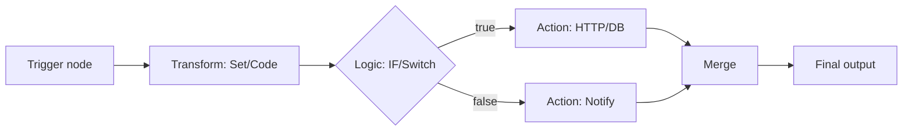

### 14.5 Real example

**Scenario.** Enrich incoming leads: for each lead, look up the company via an API, classify size, and route enterprise leads to Salesforce and the rest to a nurture list.

**Problem.** A naive build calls the API once for all items (wrong shape), mixes classification logic with the API call, and uses unnamed nodes nobody can maintain.

**Solution.** Use the right execution mode (per item for the lookup), isolate classification in a Code node, and route with a Switch — every node descriptively named.

**Implementation.** See the workflow JSON; the lookup runs per item, classification is a pure transform, and routing is explicit.

**Result.** Correct per-lead enrichment, readable graph, and clean separation that makes the classification independently testable.

**Future improvements.** Add batching + rate-limit handling on the lookup (Chapter 19) and pin sample data for fast iteration (Chapter 20).

### 14.6 Step by step

1. Add a Webhook trigger receiving the lead.
2. Add an HTTP Request node (Run Once for Each Item) for the company lookup.
3. Add a Code node that classifies company size into `band`.
4. Add a Switch routing on `band`.
5. Connect enterprise → Salesforce, others → nurture HTTP call.

### 14.7 Complete code (Code node — classification)

```javascript
// Run Once for Each Item — pure transform, no side effects, no process.env (2.x)
const employees = Number($json.company?.employees) || 0;
let band;
if (employees >= 1000) band = 'enterprise';
else if (employees >= 100) band = 'mid-market';
else band = 'smb';

return { json: { ...$json, band } };
```

### 14.8 Complete n8n workflow (importable JSON)

```json
{
  "name": "Lead Enrichment Router",
  "nodes": [
    {
      "parameters": { "httpMethod": "POST", "path": "lead", "responseMode": "onReceived" },
      "id": "30000001-0000-0000-0000-000000000001",
      "name": "Lead Webhook",
      "type": "n8n-nodes-base.webhook",
      "typeVersion": 2,
      "position": [220, 300]
    },
    {
      "parameters": {
        "url": "=https://api.clearbit.example/v1/company?domain={{ $json.body.email.split('@')[1] }}",
        "options": {}
      },
      "id": "30000002-0000-0000-0000-000000000002",
      "name": "Lookup Company",
      "type": "n8n-nodes-base.httpRequest",
      "typeVersion": 4.2,
      "position": [440, 300]
    },
    {
      "parameters": {
        "jsCode": "const employees = Number($json.company?.employees) || 0;\nlet band;\nif (employees >= 1000) band = 'enterprise';\nelse if (employees >= 100) band = 'mid-market';\nelse band = 'smb';\nreturn { json: { ...$json, band } };"
      },
      "id": "30000003-0000-0000-0000-000000000003",
      "name": "Classify Size",
      "type": "n8n-nodes-base.code",
      "typeVersion": 2,
      "position": [660, 300]
    },
    {
      "parameters": {
        "rules": {
          "values": [
            { "conditions": { "options": { "caseSensitive": true }, "conditions": [ { "leftValue": "={{ $json.band }}", "rightValue": "enterprise", "operator": { "type": "string", "operation": "equals" } } ] }, "outputKey": "enterprise" }
          ]
        },
        "options": { "fallbackOutput": "extra" }
      },
      "id": "30000004-0000-0000-0000-000000000004",
      "name": "Route by Band",
      "type": "n8n-nodes-base.switch",
      "typeVersion": 3.2,
      "position": [880, 300]
    }
  ],
  "connections": {
    "Lead Webhook": { "main": [[{ "node": "Lookup Company", "type": "main", "index": 0 }]] },
    "Lookup Company": { "main": [[{ "node": "Classify Size", "type": "main", "index": 0 }]] },
    "Classify Size": { "main": [[{ "node": "Route by Band", "type": "main", "index": 0 }]] }
  },
  "settings": { "executionOrder": "v1" }
}
```

### 14.9 Exercises

1. List, for three nodes you use often, whether they default to per-item or all-items mode.
2. Replace a raw HTTP Request with a native app node and note what you gain (pagination/auth/retries).
3. Add a Filter node that drops leads with a free-email domain.

### 14.10 Challenges

- **Challenge 1.** Convert the classification Code node into a Set/IF combination and discuss the trade-offs.
- **Challenge 2.** Add per-node retry on the lookup and an error output that sends failures to a dead-letter webhook.

### 14.11 Checklist

- [ ] Every node has a descriptive name.
- [ ] Execution mode is correct for each action node.
- [ ] Logic is separated from side effects.
- [ ] Native nodes are used where they exist.
- [ ] Error handling is defined where failure is possible.

### 14.12 Best practices

- Prefer native nodes; drop to HTTP Request only when no node exists.
- Keep transforms pure (no side effects) so they are testable and reorderable.
- Name nodes after what they do, not their type.
- Use sticky notes to document intent on the canvas.

### 14.13 Anti-patterns

- "HTTP Request1", "Code3" — unnamed nodes.
- One Code node doing fetch + transform + write (untestable god-node).
- Wrong execution mode generating N unintended calls.
- Business logic buried in many field expressions instead of one place.

### 14.14 Troubleshooting

| Symptom | Cause | Action |
|---------|-------|--------|
| Node runs N times unexpectedly | Per-item mode on an aggregate step | Switch to all-items / Aggregate first |
| Expression `undefined` | Wrong item path | Inspect input data of the node |
| Switch sends everything to fallback | Condition never matches | Verify operator/value types |
| API node ignores pagination | Used raw HTTP | Use the native node's pagination |

### 14.15 Official references

- Nodes overview: https://docs.n8n.io/integrations/builtin/
- Core nodes (Set, Code, IF, Switch): https://docs.n8n.io/integrations/builtin/core-nodes/
- Item linking: https://docs.n8n.io/data/data-mapping/
- HTTP Request node: https://docs.n8n.io/integrations/builtin/core-nodes/n8n-nodes-base.httprequest/

---

## Chapter 15 — Triggers

### 15.1 Introduction

A trigger is what starts a workflow. n8n 2.x **removed the legacy Start node**; every workflow begins with a specific trigger that defines *how* and *when* it runs. This chapter covers the trigger families — **Webhook**, **Schedule**, **app/event triggers** (polling and push), **Manual**, and special ones like the **Execute Sub-workflow Trigger** and **Error Trigger** — and the semantics that matter in production (active vs. inactive, single vs. queue mode, deduplication).

### 15.2 Business context

The trigger choice shapes latency, cost, and reliability. A polling trigger that checks every minute is simple but laggy and rate-limit-prone; a push webhook is near-real-time but needs a public URL and security. Picking the right trigger — and configuring deduplication and activation correctly — is the difference between a responsive automation and one that double-processes orders or misses events.

### 15.3 Theoretical concepts

- **Webhook trigger:** an HTTP endpoint (`/webhook/<path>`). Production endpoints are active only when the workflow is **Published**; test URLs work in the editor. Supports auth, response modes (`onReceived`, `lastNode`, `responseNode`), and binary input.
- **Schedule trigger:** cron-like, using intervals or cron expressions; respects `GENERIC_TIMEZONE`.
- **App triggers:** either **push** (the app calls n8n, e.g., Stripe/GitHub webhooks via dedicated trigger nodes) or **polling** (n8n periodically queries, e.g., Gmail/RSS), with built-in deduplication so the same item isn't reprocessed.
- **Manual trigger:** for development; not for production.
- **Execute Sub-workflow Trigger:** entry point for sub-workflows called by other workflows.
- **Error Trigger:** starts a workflow when *another* workflow fails — the backbone of centralized error handling (Chapter 19).
- **Activation:** in 2.x, **Publish** activates production triggers (registers webhooks, schedules); **Save** does not.

### 15.4 Architecture

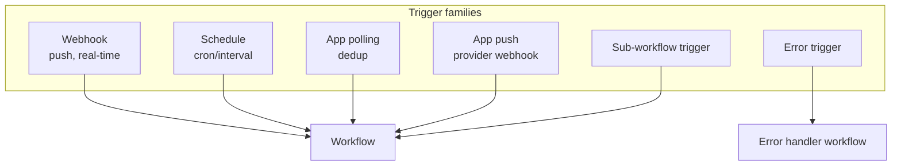

### 15.5 Real example

**Scenario.** A logistics app must react to shipment status changes from a carrier. The carrier offers both a push webhook and a polling API.

**Problem.** Polling every minute is laggy and burns rate limit; raw webhooks risk duplicates on carrier retries.

**Solution.** Use the carrier's push webhook with an idempotency check (deduplicate on event ID using workflow static data), responding 200 fast and processing asynchronously.

**Implementation.** Webhook trigger (respond immediately) → dedup Code node keyed on `eventId` → process. See JSON below.

**Result.** Near-real-time updates, no duplicate processing even when the carrier retries, and a fast 200 that keeps the carrier happy.

**Future improvements.** Add an Error Trigger workflow to catch failures and a schedule-based reconciliation sweep as a safety net.

### 15.6 Step by step

1. Add a Webhook trigger, `responseMode: onReceived` (fast 200).
2. Add a Code node that checks/records `eventId` in static data to dedup.
3. Branch: new event → process; duplicate → no-op.
4. Publish to activate the production webhook.
5. Register the production URL with the carrier.

### 15.7 Complete code (dedup with workflow static data)

```javascript
// Deduplicate carrier events by eventId using workflow static data.
const staticData = $getWorkflowStaticData('global');
staticData.seen = staticData.seen || {};

const id = $json.body.eventId;
if (staticData.seen[id]) {
  return [{ json: { duplicate: true, eventId: id } }];
}
staticData.seen[id] = $now.toMillis();

// Optional: trim memory of old IDs (keep last 10k)
const keys = Object.keys(staticData.seen);
if (keys.length > 10000) {
  keys.slice(0, keys.length - 10000).forEach(k => delete staticData.seen[k]);
}
return [{ json: { duplicate: false, ...$json.body } }];
```

### 15.8 Complete n8n workflow (importable JSON)

```json
{
  "name": "Carrier Webhook with Dedup",
  "nodes": [
    {
      "parameters": { "httpMethod": "POST", "path": "carrier-status", "responseMode": "onReceived" },
      "id": "40000001-0000-0000-0000-000000000001",
      "name": "Carrier Webhook",
      "type": "n8n-nodes-base.webhook",
      "typeVersion": 2,
      "position": [220, 300]
    },
    {
      "parameters": {
        "jsCode": "const s = $getWorkflowStaticData('global');\ns.seen = s.seen || {};\nconst id = $json.body.eventId;\nif (s.seen[id]) return [{ json: { duplicate: true, eventId: id } }];\ns.seen[id] = $now.toMillis();\nreturn [{ json: { duplicate: false, ...$json.body } }];"
      },
      "id": "40000002-0000-0000-0000-000000000002",
      "name": "Dedup",
      "type": "n8n-nodes-base.code",
      "typeVersion": 2,
      "position": [440, 300]
    },
    {
      "parameters": {
        "conditions": { "options": {}, "conditions": [ { "leftValue": "={{ $json.duplicate }}", "rightValue": false, "operator": { "type": "boolean", "operation": "equals" } } ] }
      },
      "id": "40000003-0000-0000-0000-000000000003",
      "name": "Is New?",
      "type": "n8n-nodes-base.if",
      "typeVersion": 2.2,
      "position": [660, 300]
    },
    {
      "parameters": {
        "assignments": { "assignments": [ { "id": "p1", "name": "processed", "type": "boolean", "value": true } ] }
      },
      "id": "40000004-0000-0000-0000-000000000004",
      "name": "Process Status",
      "type": "n8n-nodes-base.set",
      "typeVersion": 3.4,
      "position": [880, 220]
    }
  ],
  "connections": {
    "Carrier Webhook": { "main": [[{ "node": "Dedup", "type": "main", "index": 0 }]] },
    "Dedup": { "main": [[{ "node": "Is New?", "type": "main", "index": 0 }]] },
    "Is New?": { "main": [[{ "node": "Process Status", "type": "main", "index": 0 }], []] }
  },
  "settings": { "executionOrder": "v1" }
}
```

### 15.9 Exercises

1. Build a Schedule trigger that runs at 09:00 in your timezone and confirm `GENERIC_TIMEZONE` is respected.
2. Convert a polling app trigger to a push webhook and note the latency improvement.
3. Trigger the dedup workflow twice with the same `eventId` and confirm the second is a no-op.

### 15.10 Challenges

- **Challenge 1.** Replace static-data dedup with a Redis/DB-backed dedup so it survives restarts and works across workers in queue mode.
- **Challenge 2.** Add an Error Trigger workflow that logs any failure of this workflow to a database.

### 15.11 Checklist

- [ ] Every workflow has an appropriate trigger (no Start node — it's gone).
- [ ] Production webhooks are activated via Publish.
- [ ] Push preferred over polling where available.
- [ ] Idempotency/dedup handled for at-least-once sources.
- [ ] Schedules respect the configured timezone.

### 15.12 Best practices

- Respond fast (`onReceived`) for webhooks and process asynchronously.
- Treat external webhooks as **at-least-once**: always dedup.
- For queue mode, back dedup with a shared store (Redis/DB), not in-process static data.
- Use Error Triggers for centralized failure handling.

### 15.13 Anti-patterns

- Aggressive polling that burns rate limits and lags.
- Assuming webhooks are exactly-once (they aren't).
- Doing heavy work synchronously before responding 200 (timeouts, retries).
- Relying on workflow static data for dedup across multiple workers.

### 15.14 Troubleshooting

| Symptom | Cause | Action |
|---------|-------|--------|
| Webhook 404 in production | Not Published | Click Publish |
| Duplicate processing | No dedup on at-least-once source | Add idempotency key check |
| Schedule fires at wrong hour | Timezone misconfig | Set `GENERIC_TIMEZONE` |
| Carrier marks webhook failed | Slow synchronous response | Use `onReceived`, process async |
| Dedup fails across workers | In-process static data | Use shared Redis/DB dedup |

### 15.15 Official references

- Webhook node: https://docs.n8n.io/integrations/builtin/core-nodes/n8n-nodes-base.webhook/
- Schedule trigger: https://docs.n8n.io/integrations/builtin/core-nodes/n8n-nodes-base.scheduletrigger/
- Trigger concepts: https://docs.n8n.io/flow-logic/
- Error workflows: https://docs.n8n.io/flow-logic/error-handling/

---

## Chapter 16 — Expressions

### 16.1 Introduction

Expressions are how data flows dynamically through a workflow. Wrapped in `{{ }}` and powered by JavaScript plus n8n's helper variables and **Luxon** for dates, expressions let any field reference data from the current item, other nodes, the environment, and the execution context. This chapter is the practical reference for the expression language: syntax, the variable catalog, common patterns, and the 2.x constraints (no `process.env` in Code; `$env` availability rules).

### 16.2 Business context

Expressions are where most "small" production bugs live: a wrong path returns `undefined`, a date is formatted in the wrong timezone, a number is concatenated as a string. Fluency in expressions reduces these defects and removes the need to reach for a Code node for trivial transforms — keeping workflows readable and fast.

### 16.3 Theoretical concepts

- **Syntax:** a field becomes an expression with the `=` prefix in JSON or the `{{ }}` toggle in the UI. Inside, you write JavaScript that returns a value.
- **Core variables:**
  - `$json` — current item's data.
  - `$json.field`, `$json["a b"]` — field access.
  - `$node["Name"].json` / `$("Name").item.json` — another node's output.
  - `$items("Name")` — all items from a node.
  - `$now`, `$today` — Luxon DateTime.
  - `$workflow`, `$execution`, `$runIndex`, `$itemIndex`.
  - `$vars` — instance variables (Enterprise); `$env` — environment variables (subject to access rules).
  - `$secrets` — external secrets (Enterprise).
- **Luxon dates:** `$now.toISO()`, `$now.toFormat('yyyy-LL-dd')`, `$now.plus({ days: 7 })`, `$today.minus({ months: 1 })`.
- **Built-in data transforms:** n8n adds helper methods on strings/arrays/numbers/dates (e.g., `.toSnakeCase()`, `.first()`, `.last()`, `.sum()`) usable in expressions.
- **2.x constraints:** `process.env` is blocked in the Code node; use `$env` (where allowed) or credentials. Expressions remain sandboxed.

### 16.4 Architecture

```mermaid
flowchart LR
    field[Node field] -->|=/{{ }}| expr[Expression engine]
    expr --> ctx[(Context:<br/>$json, $node, $now,<br/>$vars, $execution)]
    ctx --> val[Resolved value]
    val --> field2[Used in node parameter]
```

### 16.5 Real example

**Scenario.** Build an invoice email that greets the customer, shows the total in BRL, lists the due date 30 days out, and includes a tracking link with the order ID.

**Problem.** The team scatters string concatenation and date math across many fields, getting timezone-wrong dates and currency formatted as plain numbers.

**Solution.** Centralize the derived fields in one Set node using clean expressions: Luxon for the due date, `toLocaleString` for currency, template strings for text.

**Implementation.** See the Set node expressions below.

**Result.** Correct, localized currency and dates; one place to read and change the derived fields; no Code node needed.

**Future improvements.** Extract repeated formatting into a sub-workflow or instance variable if reused across workflows.

### 16.6 Step by step

1. Add a Set node after the trigger.
2. Add `customerGreeting`, `totalFormatted`, `dueDate`, `trackingUrl` as expression fields.
3. Use Luxon for dates and `toLocaleString` for currency.
4. Reference these fields downstream in the email node.

### 16.7 Complete code (Set node expressions)

```javascript
// customerGreeting
=Hi {{ $json.customer.firstName }},

// totalFormatted (BRL)
={{ $json.order.total.toLocaleString('pt-BR', { style: 'currency', currency: 'BRL' }) }}

// dueDate (30 days from now, ISO date)
={{ $now.plus({ days: 30 }).toFormat('dd/LL/yyyy') }}

// trackingUrl
=https://track.example/orders/{{ $json.order.id }}
```

### 16.8 Complete n8n workflow (importable JSON)

```json
{
  "name": "Invoice Fields Builder",
  "nodes": [
    {
      "parameters": { "httpMethod": "POST", "path": "invoice", "responseMode": "lastNode" },
      "id": "50000001-0000-0000-0000-000000000001",
      "name": "Invoice In",
      "type": "n8n-nodes-base.webhook",
      "typeVersion": 2,
      "position": [220, 300]
    },
    {
      "parameters": {
        "assignments": {
          "assignments": [
            { "id": "e1", "name": "greeting", "type": "string", "value": "=Hi {{ $json.body.customer.firstName }}," },
            { "id": "e2", "name": "totalFormatted", "type": "string", "value": "={{ $json.body.order.total.toLocaleString('pt-BR', { style: 'currency', currency: 'BRL' }) }}" },
            { "id": "e3", "name": "dueDate", "type": "string", "value": "={{ $now.plus({ days: 30 }).toFormat('dd/LL/yyyy') }}" },
            { "id": "e4", "name": "trackingUrl", "type": "string", "value": "=https://track.example/orders/{{ $json.body.order.id }}" }
          ]
        }
      },
      "id": "50000002-0000-0000-0000-000000000002",
      "name": "Build Fields",
      "type": "n8n-nodes-base.set",
      "typeVersion": 3.4,
      "position": [440, 300]
    }
  ],
  "connections": {
    "Invoice In": { "main": [[{ "node": "Build Fields", "type": "main", "index": 0 }]] }
  },
  "settings": { "executionOrder": "v1" }
}
```

### 16.9 Exercises

1. Write an expression returning the first day of next month in `yyyy-LL-dd`.
2. Reference a field from a node two steps back using `$("NodeName").item.json`.
3. Format a number as a percentage with one decimal.

### 16.10 Challenges

- **Challenge 1.** Build an expression that returns "today", "yesterday", or the formatted date depending on how old a timestamp is.
- **Challenge 2.** Convert a deeply nested object into a flat key list using only an expression (no Code node).

### 16.11 Checklist

- [ ] I know the core variables (`$json`, `$node/$()`, `$now`, `$execution`, `$vars`).
- [ ] I use Luxon for all date math.
- [ ] I format currency/percent with locale methods.
- [ ] I avoid `process.env` in Code (2.x) and use `$env`/credentials.
- [ ] I centralize derived fields in one Set node.

### 16.12 Best practices

- Keep expressions short; if logic grows, move it to a documented Code node.
- Centralize derived/computed fields in one Set node per concern.
- Always do date math with Luxon and explicit formats/timezones.
- Reference nodes by stable names; renaming a node breaks `$()` references.

### 16.13 Anti-patterns

- Giant multiline expressions duplicated across fields.
- String math on dates instead of Luxon.
- Referencing `process.env` in Code (blocked in 2.x).
- Hardcoding values that should be `$vars`/credentials.

### 16.14 Troubleshooting

| Symptom | Cause | Action |
|---------|-------|--------|
| `undefined` value | Wrong path / missing field | Inspect input; use optional chaining |
| Date off by hours | Timezone not set | Use Luxon with explicit zone / `GENERIC_TIMEZONE` |
| `$()` reference errors | Node renamed | Update references to new name |
| Number rendered oddly | String concatenation | Coerce with `Number()` |
| `$env` empty | Access disabled (2.x) | Use credentials or enable env access |

### 16.15 Official references

- Expressions: https://docs.n8n.io/code/expressions/
- Built-in variables: https://docs.n8n.io/code/builtin/overview/
- Luxon / dates: https://docs.n8n.io/code/builtin/date-time/
- Data transformation functions: https://docs.n8n.io/code/builtin/data-transformation-functions/

---

## Chapter 17 — Variables

### 17.1 Introduction

"Variables" in n8n spans several distinct mechanisms that beginners conflate: **instance variables** (`$vars`, Enterprise), **environment variables** (`$env`/system env), **workflow static data** (persistent per-workflow state), **external secrets** (`$secrets`, Enterprise vault integration), and ordinary **per-execution data** carried in items. This chapter disentangles them — what each is for, its scope, lifetime, and security posture — so you store the right thing in the right place.

### 17.2 Business context

Putting a secret in the wrong place is a security incident; putting shared config in the wrong place is a maintenance nightmare. Knowing that API keys belong in **credentials/external secrets**, environment-specific URLs belong in **instance variables**, and cross-execution counters belong in **static data** prevents both leaks and brittle copy-paste configuration across workflows.

### 17.3 Theoretical concepts

| Mechanism | Scope | Lifetime | Use for | Security |
|-----------|-------|----------|---------|----------|
| Items data | Single execution | One run | Payloads, derived fields | In execution data |
| `$vars` (instance variables) | Instance-wide | Until changed | Env URLs, flags, non-secret config | Visible to editors (Enterprise) |
| `$env` / system env | Process | Process life | Host config | Not for secrets in Code (2.x blocks `process.env`) |
| Workflow static data | Single workflow | Persistent | Counters, cursors, dedup state | Stored with workflow |
| Credentials | Referenced by nodes | Until changed | API keys, passwords | Encrypted at rest |
| `$secrets` (external secrets) | Instance-wide | Synced from vault | Secrets from Vault/AWS/etc. | Pulled from external vault (Enterprise) |

- **Instance variables (`$vars`):** key-value config set in the UI/API, read in expressions as `$vars.myKey`. Ideal for per-environment URLs and feature flags.
- **Static data:** `$getWorkflowStaticData('global'|'node')` — survives executions; perfect for polling cursors and dedup (Chapter 15). Note: in queue mode it persists with the workflow but is not a substitute for a shared store across concurrent workers.
- **External secrets:** integrate HashiCorp Vault / cloud secret managers; reference as `$secrets.provider.key`.

### 17.4 Architecture

```mermaid
flowchart TB
    subgraph runtime["At execution"]
        items[(Items data<br/>per execution)]
        vars[($vars<br/>instance config)]
        static[(Static data<br/>persistent state)]
        cred[(Credentials<br/>encrypted)]
        sec[($secrets<br/>external vault)]
    end
    node[Node / Expression] --> items
    node --> vars
    node --> static
    node --> cred
    node --> sec
```

### 17.5 Real example

**Scenario.** The same workflow runs in dev and prod, calling a base API URL that differs per environment and a secret API key that must never appear in the workflow JSON, while tracking a polling cursor between runs.

**Problem.** The team hardcoded the URL (breaks on promotion) and pasted the key into a header field (leaks in exports).

**Solution.** Put the base URL in an instance variable (`$vars.apiBaseUrl`), the key in credentials/external secrets, and the cursor in workflow static data.

**Implementation.** Expressions reference `$vars.apiBaseUrl`; the HTTP node uses a credential; a Code node reads/writes the cursor in static data.

**Result.** One workflow promotes cleanly across environments, no secret in exports, and incremental polling that resumes where it left off.

**Future improvements.** Move the key to HashiCorp Vault via `$secrets` for centralized rotation.

### 17.6 Step by step

1. Define `apiBaseUrl` as an instance variable per environment.
2. Store the API key as a credential (or `$secrets`).
3. Reference `={{ $vars.apiBaseUrl }}` in the HTTP node URL.
4. Use static data for the polling cursor.
5. Promote the workflow without editing URLs or keys.

### 17.7 Complete code (Code node — cursor in static data)

```javascript
// Persistent polling cursor across executions
const s = $getWorkflowStaticData('global');
const since = s.cursor || '1970-01-01T00:00:00Z';

// Build the request marker; the HTTP node will use $json.since
const nextCursor = $now.toISO();
s.cursor = nextCursor; // advance for next run

return [{ json: { since, nextCursor, baseUrl: $vars.apiBaseUrl } }];
```

### 17.8 Complete n8n workflow (importable JSON)

```json
{
  "name": "Incremental Poller",
  "nodes": [
    {
      "parameters": { "rule": { "interval": [{ "field": "minutes", "minutesInterval": 5 }] } },
      "id": "60000001-0000-0000-0000-000000000001",
      "name": "Every 5m",
      "type": "n8n-nodes-base.scheduleTrigger",
      "typeVersion": 1.2,
      "position": [220, 300]
    },
    {
      "parameters": {
        "jsCode": "const s = $getWorkflowStaticData('global');\nconst since = s.cursor || '1970-01-01T00:00:00Z';\ns.cursor = $now.toISO();\nreturn [{ json: { since, baseUrl: $vars.apiBaseUrl } }];"
      },
      "id": "60000002-0000-0000-0000-000000000002",
      "name": "Cursor",
      "type": "n8n-nodes-base.code",
      "typeVersion": 2,
      "position": [440, 300]
    },
    {
      "parameters": {
        "url": "={{ $json.baseUrl }}/events?since={{ $json.since }}",
        "options": {}
      },
      "id": "60000003-0000-0000-0000-000000000003",
      "name": "Fetch Events",
      "type": "n8n-nodes-base.httpRequest",
      "typeVersion": 4.2,
      "position": [660, 300],
      "credentials": { "httpHeaderAuth": { "id": "1", "name": "API Key Header" } }
    }
  ],
  "connections": {
    "Every 5m": { "main": [[{ "node": "Cursor", "type": "main", "index": 0 }]] },
    "Cursor": { "main": [[{ "node": "Fetch Events", "type": "main", "index": 0 }]] }
  },
  "settings": { "executionOrder": "v1" }
}
```

### 17.9 Exercises

1. Move a hardcoded URL into an instance variable and reference it.
2. Store and advance a cursor in static data; confirm it persists across runs.
3. Identify which of your current "variables" are actually secrets and move them to credentials.

### 17.10 Challenges

- **Challenge 1.** Integrate an external secrets provider and reference `$secrets` instead of a stored credential value.
- **Challenge 2.** Make the cursor safe under queue-mode concurrency by moving it to a Redis/DB store.

### 17.11 Checklist

- [ ] Secrets are in credentials/external secrets, never in fields or static data.
- [ ] Per-environment config is in instance variables.
- [ ] Cross-execution state is in static data (single-worker) or a shared store (queue mode).
- [ ] No `process.env` reads in Code (2.x).
- [ ] Workflows promote across environments without edits.

### 17.12 Best practices

- One source of truth per concern: secrets→credentials, config→`$vars`, state→static data/shared store.
- Prefer external secrets for centralized rotation in enterprise setups.
- Keep static data small; prune old entries.
- Make workflows environment-agnostic via `$vars`.

### 17.13 Anti-patterns

- Secrets in fields, Code, or static data.
- Hardcoded per-environment URLs.
- Static data used as cross-worker shared state under concurrency.
- Treating items data as durable storage.

### 17.14 Troubleshooting

| Symptom | Cause | Action |
|---------|-------|--------|
| Config differs per env breaks promotion | Hardcoded values | Use `$vars` |
| Secret leaked in export | Stored in a field | Move to credentials/`$secrets` |
| Cursor resets each run | Used items data, not static | Use `$getWorkflowStaticData` |
| Duplicate processing in queue mode | Static data not shared | Use Redis/DB shared store |
| `$vars` undefined | Not on Enterprise / not set | Set the variable; check plan |

### 17.15 Official references

- Variables: https://docs.n8n.io/code/variables/
- Static data: https://docs.n8n.io/code/builtin/workflow-static-data/
- External secrets: https://docs.n8n.io/external-secrets/
- Credentials: https://docs.n8n.io/credentials/

---

## Chapter 18 — Data Mapping

### 18.1 Introduction

Integration is mostly **shape translation**: the source emits one structure, the destination expects another. n8n's data mapping toolkit — **Edit Fields (Set)**, **Code**, **Split Out**, **Aggregate**, **Merge**, **Rename Keys**, drag-and-drop mapping, and item linking — is how you bridge them. This chapter covers the patterns: flattening, nesting, joining two streams, fanning out arrays into items, and collapsing items back into one.

### 18.2 Business context

Most integration bugs are mapping bugs: a field renamed, a nested array not flattened, two streams merged on the wrong key. Mastery of mapping turns brittle, copy-pasted transforms into reliable, readable ones — directly reducing the defect rate of every integration you build (Part IV depends entirely on this).

### 18.3 Theoretical concepts

- **Item linking:** n8n tracks which output item came from which input item, so downstream nodes can reference earlier data (`$("Node").item`) correctly even after transformations — crucial when merging.
- **Set (Edit Fields):** declaratively map/rename/compute fields; "keep only set" vs. "include other fields."
- **Split Out:** turn an array field into one item per element (fan-out).
- **Aggregate:** collapse many items into one (gather a field into an array, or combine all data).
- **Merge:** combine two input streams — by **append**, by **position (index)**, or by **matching key (join)** (inner/outer-style combine).
- **Code for complex maps:** when declarative nodes aren't enough, a Code node returns a new item array.

### 18.4 Architecture

```mermaid
flowchart LR
    src[Source items] --> so[Split Out<br/>array→items]
    so --> set[Set<br/>rename/compute]
    set --> mrg[Merge by key]
    other[Second stream] --> mrg
    mrg --> agg[Aggregate<br/>items→one]
    agg --> dest[Destination shape]
```

### 18.5 Real example

**Scenario.** Combine an orders stream (from an API) with a customers stream (from the CRM) on `customerId`, flatten each order's line items, and produce one record per line item with customer details attached.

**Problem.** Naive concatenation loses the customer-order relationship; line items stay nested; the destination rejects the payload.

**Solution.** Merge orders + customers by matching `customerId`, then Split Out the `lines` array, then Set to flatten the final shape.

**Implementation.** Merge (combine by matching field) → Split Out `lines` → Set mapping. See JSON.

**Result.** One clean item per line item, each carrying the right customer fields — accepted by the destination on the first try.

**Future improvements.** Add a Filter to drop zero-quantity lines and an Aggregate to also produce an order-level summary stream.

### 18.6 Step by step

1. Bring in two streams: Orders and Customers.
2. Merge by matching `customerId` (combine).
3. Split Out the `lines` array into items.
4. Set to flatten: `sku`, `qty`, `price`, `customerName`, `customerTier`.
5. Send to the destination.

### 18.7 Complete code (Code node — equivalent merge+flatten)

```javascript
// Alternative to Merge+SplitOut: join orders with customers and flatten lines.
const orders = $("Orders").all().map(i => i.json);
const customers = Object.fromEntries(
  $("Customers").all().map(i => [i.json.customerId, i.json])
);

const out = [];
for (const o of orders) {
  const c = customers[o.customerId] || {};
  for (const line of (o.lines || [])) {
    out.push({
      json: {
        orderId: o.id,
        sku: line.sku,
        qty: Number(line.qty) || 0,
        price: Number(line.price) || 0,
        customerName: c.name ?? null,
        customerTier: c.tier ?? 'standard'
      }
    });
  }
}
return out;
```

### 18.8 Complete n8n workflow (importable JSON)

```json
{
  "name": "Orders x Customers Flatten",
  "nodes": [
    {
      "parameters": { "rule": { "interval": [{ "field": "hours", "hoursInterval": 1 }] } },
      "id": "70000001-0000-0000-0000-000000000001",
      "name": "Hourly",
      "type": "n8n-nodes-base.scheduleTrigger",
      "typeVersion": 1.2,
      "position": [200, 300]
    },
    {
      "parameters": { "url": "https://api.example/orders", "options": {} },
      "id": "70000002-0000-0000-0000-000000000002",
      "name": "Orders",
      "type": "n8n-nodes-base.httpRequest",
      "typeVersion": 4.2,
      "position": [420, 220]
    },
    {
      "parameters": { "url": "https://crm.example/customers", "options": {} },
      "id": "70000003-0000-0000-0000-000000000003",
      "name": "Customers",
      "type": "n8n-nodes-base.httpRequest",
      "typeVersion": 4.2,
      "position": [420, 380]
    },
    {
      "parameters": {
        "mode": "combine",
        "advanced": true,
        "joinMode": "enrichInput1",
        "mergeByFields": { "values": [ { "field1": "customerId", "field2": "customerId" } ] },
        "options": {}
      },
      "id": "70000004-0000-0000-0000-000000000004",
      "name": "Merge by Customer",
      "type": "n8n-nodes-base.merge",
      "typeVersion": 3,
      "position": [640, 300]
    },
    {
      "parameters": { "fieldToSplitOut": "lines", "options": {} },
      "id": "70000005-0000-0000-0000-000000000005",
      "name": "Split Lines",
      "type": "n8n-nodes-base.splitOut",
      "typeVersion": 1,
      "position": [860, 300]
    },
    {
      "parameters": {
        "assignments": {
          "assignments": [
            { "id": "m1", "name": "sku", "type": "string", "value": "={{ $json.sku }}" },
            { "id": "m2", "name": "qty", "type": "number", "value": "={{ Number($json.qty) }}" },
            { "id": "m3", "name": "customerTier", "type": "string", "value": "={{ $json.tier || 'standard' }}" }
          ]
        }
      },
      "id": "70000006-0000-0000-0000-000000000006",
      "name": "Flatten",
      "type": "n8n-nodes-base.set",
      "typeVersion": 3.4,
      "position": [1080, 300]
    }
  ],
  "connections": {
    "Hourly": { "main": [[{ "node": "Orders", "type": "main", "index": 0 }, { "node": "Customers", "type": "main", "index": 0 }]] },
    "Orders": { "main": [[{ "node": "Merge by Customer", "type": "main", "index": 0 }]] },
    "Customers": { "main": [[{ "node": "Merge by Customer", "type": "main", "index": 1 }]] },
    "Merge by Customer": { "main": [[{ "node": "Split Lines", "type": "main", "index": 0 }]] },
    "Split Lines": { "main": [[{ "node": "Flatten", "type": "main", "index": 0 }]] }
  },
  "settings": { "executionOrder": "v1" }
}
```

### 18.9 Exercises

1. Use Split Out to turn an array field into items, then Aggregate to put it back.
2. Merge two streams by position and by matching key; compare results.
3. Flatten a two-level-nested object into a single-level item with Set.

### 18.10 Challenges

- **Challenge 1.** Implement an outer-join behavior where unmatched orders still pass through with null customer fields.
- **Challenge 2.** Produce two outputs from one stream: per-line items and an order-level summary, using Split Out + Aggregate.

### 18.11 Checklist

- [ ] I understand item linking and how Merge uses it.
- [ ] I can fan out arrays with Split Out and collapse with Aggregate.
- [ ] I can merge by append/position/key.
- [ ] I flatten/nest with Set or Code appropriately.
- [ ] My destination shape matches the contract.

### 18.12 Best practices

- Prefer declarative nodes (Set/Split Out/Merge/Aggregate) over Code for clarity.
- Validate the destination contract before mapping; map to it explicitly.
- Keep one mapping concern per node; don't overload a single Set.
- Use Code only when the transform is genuinely complex.

### 18.13 Anti-patterns

- Merging streams by position when you meant by key.
- Leaving arrays nested when the destination expects items.
- One Code node doing all mapping (unreadable).
- Losing item linking by overwriting items in a way that breaks `$("Node").item`.

### 18.14 Troubleshooting

| Symptom | Cause | Action |
|---------|-------|--------|
| Wrong rows joined | Merge by position not key | Use combine-by-matching-field |
| Destination rejects nested array | Not flattened | Split Out the array |
| `$("Node").item` wrong | Item linking broken | Avoid rebuilding items blindly; map fields |
| Lost fields after Set | "Keep only set" enabled | Include other input fields |
| Aggregate returns nothing | Wrong field to aggregate | Verify field path |

### 18.15 Official references

- Data mapping: https://docs.n8n.io/data/data-mapping/
- Merge node: https://docs.n8n.io/integrations/builtin/core-nodes/n8n-nodes-base.merge/
- Split Out / Aggregate: https://docs.n8n.io/integrations/builtin/core-nodes/n8n-nodes-base.splitout/
- Item linking: https://docs.n8n.io/data/data-mapping/data-item-linking/

---

## Chapter 19 — Error Handling

### 19.1 Introduction

Production workflows fail: APIs time out, rate limits hit, payloads are malformed. The difference between an amateur and a production-grade workflow is **deliberate error handling** — per-node `onError` behavior, retries with backoff, error outputs, the **Error Trigger** for centralized handling, and **dead-letter** patterns for messages that can't be processed. This chapter makes failure a first-class design concern.

### 19.2 Business context

Unhandled errors cause silent data loss, duplicate side effects, and 3 a.m. pages. A well-designed error strategy turns failures into observable, recoverable events — protecting data integrity and SLAs. For regulated workloads, an auditable failure trail is often a compliance requirement, not a nicety.

### 19.3 Theoretical concepts

- **Per-node `onError`:** `stopWorkflow` (default), `continueRegularOutput` (pass the error item down the normal path), or `continueErrorOutput` (route failures to a second output). The error output enables branch-specific handling.
- **Retries:** nodes support automatic retries (`retryOnFail`, `maxTries`, `waitBetweenTries`) — essential for transient failures and rate limits.
- **Error Trigger:** a workflow that runs when *another* workflow errors, receiving the error context. Set per-workflow via Settings → Error Workflow. The backbone of centralized handling/alerting.
- **Stop and Error node:** deliberately throw with a custom message (e.g., on failed validation).
- **Dead-letter pattern:** route irrecoverable items to a durable store/queue for later inspection/replay, instead of dropping them.
- **Idempotency:** combine with dedup (Chapter 15) so retries don't double-apply side effects.

### 19.4 Architecture

```mermaid
flowchart TB
    n[Action node] -->|success| ok[Continue]
    n -->|error output| handle[Handle error]
    handle --> retry{Transient?}
    retry -->|yes| again[Retry/backoff]
    retry -->|no| dlq[(Dead-letter store)]
    wf[Any workflow] -. on failure .-> et[Error Trigger workflow]
    et --> alert[Alert + log]
    et --> dlq
```

### 19.5 Real example

**Scenario.** A payment-reconciliation workflow calls a flaky bank API. Transient 5xx and 429 rate limits are common; occasionally a record is permanently invalid.

**Problem.** Without handling, a single 429 fails the whole batch and loses progress; invalid records crash the run with no trail.

**Solution.** Enable retries with backoff on the API node, route hard failures to the error output → dead-letter table, and attach a centralized Error Trigger workflow that alerts and logs.

**Implementation.** Retry config on the HTTP node; `continueErrorOutput` → Postgres dead-letter insert; an Error Trigger workflow posts to Slack and logs the error context.

**Result.** Transient failures self-heal via retry; permanent failures are captured in a dead-letter table for replay; the team is alerted with full context — no silent loss.

**Future improvements.** Add exponential backoff with jitter via a Wait+loop, and an automated replay workflow that re-processes dead-letter rows.

### 19.6 Step by step

1. On the API node, enable `retryOnFail`, set `maxTries=3`, `waitBetweenTries` and `onError=continueErrorOutput`.
2. Route the error output to a Postgres insert (dead-letter).
3. Create an Error Trigger workflow; set it as the workflow's Error Workflow.
4. In the Error Trigger workflow, post to Slack and log the error JSON.

### 19.7 Complete code (Error Trigger handler — Code node)

```javascript
// Runs inside the Error Trigger workflow. Normalizes error context for alerting/logging.
const e = $json;   // Error Trigger provides execution + error metadata
return [{
  json: {
    workflow: e.workflow?.name ?? 'unknown',
    executionId: e.execution?.id ?? null,
    nodeName: e.execution?.lastNodeExecuted ?? null,
    message: e.execution?.error?.message ?? e.error?.message ?? 'unknown error',
    stack: e.execution?.error?.stack ?? null,
    at: $now.toISO()
  }
}];
```

### 19.8 Complete n8n workflow (importable JSON — centralized error handler)

```json
{
  "name": "Central Error Handler",
  "nodes": [
    {
      "parameters": {},
      "id": "80000001-0000-0000-0000-000000000001",
      "name": "On Error",
      "type": "n8n-nodes-base.errorTrigger",
      "typeVersion": 1,
      "position": [220, 300]
    },
    {
      "parameters": {
        "jsCode": "const e = $json;\nreturn [{ json: { workflow: e.workflow?.name, executionId: e.execution?.id, node: e.execution?.lastNodeExecuted, message: e.execution?.error?.message || 'unknown', at: $now.toISO() } }];"
      },
      "id": "80000002-0000-0000-0000-000000000002",
      "name": "Normalize",
      "type": "n8n-nodes-base.code",
      "typeVersion": 2,
      "position": [440, 300]
    },
    {
      "parameters": {
        "operation": "insert",
        "schema": { "__rl": true, "value": "public", "mode": "list" },
        "table": { "__rl": true, "value": "workflow_errors", "mode": "list" },
        "columns": { "mappingMode": "autoMapInputData", "value": {} },
        "options": {}
      },
      "id": "80000003-0000-0000-0000-000000000003",
      "name": "Log to DB",
      "type": "n8n-nodes-base.postgres",
      "typeVersion": 2.5,
      "position": [660, 220],
      "credentials": { "postgres": { "id": "1", "name": "Ops Postgres" } }
    },
    {
      "parameters": {
        "method": "POST",
        "url": "https://hooks.slack.com/services/REPLACE",
        "sendBody": true,
        "specifyBody": "json",
        "jsonBody": "={{ { \"text\": ':rotating_light: *' + $json.workflow + '* failed at node *' + $json.node + '*: ' + $json.message } }}",
        "options": {}
      },
      "id": "80000004-0000-0000-0000-000000000004",
      "name": "Alert Slack",
      "type": "n8n-nodes-base.httpRequest",
      "typeVersion": 4.2,
      "position": [660, 380]
    }
  ],
  "connections": {
    "On Error": { "main": [[{ "node": "Normalize", "type": "main", "index": 0 }]] },
    "Normalize": { "main": [[{ "node": "Log to DB", "type": "main", "index": 0 }, { "node": "Alert Slack", "type": "main", "index": 0 }]] }
  },
  "settings": { "executionOrder": "v1" }
}
```

### 19.9 Exercises

1. Configure retries on an HTTP node and force a 500 to watch it retry.
2. Route an error output to a dead-letter table.
3. Attach the Central Error Handler as the Error Workflow for a flow and trigger a failure.

### 19.10 Challenges

- **Challenge 1.** Implement exponential backoff with jitter for 429 responses using Wait + a loop, honoring `Retry-After`.
- **Challenge 2.** Build a replay workflow that reads dead-letter rows and re-processes them idempotently.

### 19.11 Checklist

- [ ] Critical nodes have retry + sensible `onError`.
- [ ] Hard failures go to a dead-letter store, not the void.
- [ ] A centralized Error Trigger workflow alerts + logs.
- [ ] Side effects are idempotent so retries are safe.
- [ ] Error context is captured for debugging/audit.

### 19.12 Best practices

- Distinguish transient (retry) from permanent (dead-letter) failures.
- Always pair retries with idempotency to avoid double side effects.
- Centralize alerting/logging in one Error Trigger workflow reused across flows.
- Honor `Retry-After` and rate-limit headers.

### 19.13 Anti-patterns

- `onError=continueRegularOutput` everywhere, silently swallowing failures.
- Retrying non-idempotent writes without dedup (double charges, duplicate records).
- No dead-letter: bad items vanish.
- Per-workflow ad-hoc alerting instead of a shared handler.

### 19.14 Troubleshooting

| Symptom | Cause | Action |
|---------|-------|--------|
| Whole batch fails on one bad item | No error output branch | Use `continueErrorOutput` |
| Duplicate side effects after retry | Non-idempotent writes | Add idempotency/dedup |
| Failures unnoticed | No Error Workflow set | Attach a central Error Trigger |
| 429 storms | No backoff | Backoff + honor `Retry-After` |
| Lost bad records | No dead-letter | Route errors to a durable store |

### 19.15 Official references

- Error handling: https://docs.n8n.io/flow-logic/error-handling/
- Error Trigger node: https://docs.n8n.io/integrations/builtin/core-nodes/n8n-nodes-base.errortrigger/
- Node error options/retries: https://docs.n8n.io/integrations/builtin/core-nodes/n8n-nodes-base.stopanderror/
- Executions: https://docs.n8n.io/workflows/executions/

---

## Chapter 20 — Debugging

### 20.1 Introduction

Debugging is where time is won or lost. n8n provides a strong toolkit: the **Executions** view (full input/output per node, including errors), **data pinning** (freeze a node's output to iterate without re-calling APIs), **manual execution** with step inspection, **re-run from a node**, and the **Code node** with logging. This chapter is a practical method for diagnosing workflow problems fast, plus the 2.x specifics (task-runner logs, secure Code node).

### 20.2 Business context

Mean-time-to-resolution on a broken automation directly affects the business it serves. A team that knows how to pin data, inspect executions, and reproduce failures resolves incidents in minutes; one that doesn't re-deploys blindly and erodes trust in the platform. Debugging skill is operational leverage.

### 20.3 Theoretical concepts

- **Executions view:** every run is persisted (subject to save settings) with per-node input/output and error details — your primary forensic tool. You can open a failed execution and inspect exactly what each node received and returned.
- **Data pinning:** pin a node's output during development so downstream nodes use frozen data — no repeated external calls, deterministic iteration. Pinned data is for editing/testing, not production.
- **Manual execution + partial runs:** run the workflow in the editor and execute from a specific node, reusing upstream data.
- **Code node logging:** `console.log` output appears in the execution logs / runner logs; use it to trace values.
- **Re-run / retry executions:** re-execute a past execution to reproduce or to recover after a fix.
- **2.x notes:** Code runs in a task runner; logs surface in runner output. `process.env` is blocked — don't debug by printing env.

### 20.4 Architecture

```mermaid
flowchart LR
    dev([Developer]) --> editor[Editor]
    editor -->|manual run| engine[Engine]
    engine --> exec[(Executions store)]
    editor -->|pin| pin[(Pinned data)]
    exec --> inspect[Per-node input/output]
    inspect --> dev
    code[Code node console.log] --> runner[Task runner logs]
    runner --> dev
```

### 20.5 Real example

**Scenario.** A workflow intermittently produces emails with `undefined` customer names. It calls a slow CRM API and a templating Set node.

**Problem.** The failure is intermittent and tied to live API responses, making it hard to reproduce by re-running (the API behaves differently each time).

**Solution.** Capture a failing execution, pin the CRM node's output from that run, and iterate on the Set node deterministically until the expression is robust to missing fields.

**Implementation.** Open the failing execution → copy the CRM output → pin it on the CRM node → fix the Set expression with optional chaining + fallback → unpin → publish.

**Result.** Root cause found (some CRM records lack `name`); expression hardened with a fallback; the intermittent bug eliminated — all without hammering the live API.

**Future improvements.** Add a Filter/validation step that flags records missing required fields, and a test that runs the workflow against pinned edge-case data in CI (Chapter 44).

### 20.6 Step by step

1. Reproduce: open the failing execution in the Executions view.
2. Inspect each node's input/output to localize where `name` becomes `undefined`.
3. Pin the upstream node's output from the failing run.
4. Iterate on the failing node with frozen data until fixed.
5. Harden the expression; unpin; publish.

### 20.7 Complete code (defensive Set/Code with logging)

```javascript
// Defensive transform with tracing; safe under missing fields.
const name = $json.customer?.name?.trim();
if (!name) {
  console.log('Missing customer name for record', $json.customer?.id ?? '(no id)');
}
return {
  json: {
    ...$json,
    greetingName: name || 'there',     // safe fallback
    needsReview: !name
  }
};
```

### 20.8 Complete n8n workflow (importable JSON — debug-friendly)

```json
{
  "name": "Debuggable Greeting",
  "nodes": [
    {
      "parameters": { "httpMethod": "POST", "path": "greet", "responseMode": "lastNode" },
      "id": "90000001-0000-0000-0000-000000000001",
      "name": "In",
      "type": "n8n-nodes-base.webhook",
      "typeVersion": 2,
      "position": [220, 300]
    },
    {
      "parameters": {
        "jsCode": "const name = $json.body?.customer?.name?.trim();\nif (!name) console.log('Missing name', $json.body?.customer?.id);\nreturn { json: { ...$json.body, greetingName: name || 'there', needsReview: !name } };"
      },
      "id": "90000002-0000-0000-0000-000000000002",
      "name": "Safe Greeting",
      "type": "n8n-nodes-base.code",
      "typeVersion": 2,
      "position": [440, 300]
    },
    {
      "parameters": {
        "conditions": { "options": {}, "conditions": [ { "leftValue": "={{ $json.needsReview }}", "rightValue": true, "operator": { "type": "boolean", "operation": "equals" } } ] }
      },
      "id": "90000003-0000-0000-0000-000000000003",
      "name": "Needs Review?",
      "type": "n8n-nodes-base.if",
      "typeVersion": 2.2,
      "position": [660, 300]
    }
  ],
  "connections": {
    "In": { "main": [[{ "node": "Safe Greeting", "type": "main", "index": 0 }]] },
    "Safe Greeting": { "main": [[{ "node": "Needs Review?", "type": "main", "index": 0 }]] }
  },
  "settings": { "executionOrder": "v1" }
}
```

### 20.9 Exercises

1. Pin a node's output and iterate on a downstream node without re-calling the API.
2. Open a failed execution and trace where a field became `undefined`.
3. Add `console.log` to a Code node and find the output in the logs.

### 20.10 Challenges

- **Challenge 1.** Build a small library of pinned edge-case payloads and run the workflow against each to prove robustness.
- **Challenge 2.** Re-run a historical failed execution after a fix and confirm it now succeeds.

### 20.11 Checklist

- [ ] I use the Executions view to inspect per-node I/O.
- [ ] I pin data to iterate without external calls.
- [ ] I write defensive expressions (optional chaining + fallbacks).
- [ ] I use `console.log` and read runner logs.
- [ ] I unpin before publishing.

### 20.12 Best practices

- Pin once, iterate many — never debug against a live, changing API.
- Make transforms defensive; treat missing fields as expected.
- Keep failing executions saved so you can reproduce.
- Flag (don't silently fix) bad data via a `needsReview` path.

### 20.13 Anti-patterns

- Re-deploying blindly without inspecting executions.
- Leaving pinned data in a published workflow (stale/fake production data).
- Swallowing `undefined` instead of flagging it.
- Disabling execution saving, then being unable to reproduce failures.

### 20.14 Troubleshooting

| Symptom | Cause | Action |
|---------|-------|--------|
| Can't reproduce intermittent bug | Live API variance | Pin the failing payload and iterate |
| Production uses fake data | Pinned data left on | Unpin before Publish |
| No execution to inspect | Saving disabled | Enable execution saving for the flow |
| `console.log` not visible | Looking in wrong place (2.x) | Check task-runner/execution logs |
| Field `undefined` downstream | Upstream missing field | Add optional chaining + fallback |

### 20.15 Official references

- Executions: https://docs.n8n.io/workflows/executions/
- Data pinning: https://docs.n8n.io/data/data-pinning/
- Debugging: https://docs.n8n.io/workflows/executions/debug/
- Code node: https://docs.n8n.io/code/code-node/

---

> **End of Part III.** You can now build workflows with intent: the right nodes and triggers, fluent expressions, the correct variable mechanism for each concern, reliable data mapping, deliberate error handling, and fast debugging. **Part IV — Integrations** (Chapters 21–30) puts these skills to work against the real world: REST and GraphQL APIs, webhooks, databases, message brokers (Kafka, RabbitMQ), Redis, and the AWS/Google/Microsoft service ecosystems.

## Part IV – Integrations

Part IV is where n8n earns its keep: connecting heterogeneous systems. We move from generic protocols (REST, GraphQL, webhooks) to data stores (databases, Redis), to event/message infrastructure (Kafka, RabbitMQ), and finally to the three hyperscaler ecosystems (AWS, Google, Microsoft). Each chapter assumes the Part III craft (items, expressions, mapping, error handling) and the Part II infrastructure (queue mode, secrets), and stays strictly within real n8n nodes and APIs.

---

## Chapter 21 — REST APIs

### 21.1 Introduction

The **HTTP Request** node is n8n's universal client: when no dedicated app node exists, it speaks any REST (or plain HTTP) API. This chapter covers it in depth — authentication, pagination, query/body building, headers, response handling, batching, and rate-limit resilience — plus when to prefer a native node over raw HTTP.

### 21.2 Business context

Most enterprise systems expose a REST API, but only a fraction have dedicated n8n nodes. The HTTP Request node is therefore the workhorse that unlocks the long tail of internal and niche APIs. Using it well (correct auth, pagination, retries) is what makes integrations reliable rather than demo-grade.

### 21.3 Theoretical concepts

- **Authentication:** the node integrates with n8n **credentials** — Header Auth, Basic, OAuth2, query-param auth — so secrets stay encrypted and out of the workflow.
- **Pagination:** built-in pagination modes (response contains next URL, cursor, or page increment) iterate automatically until exhausted, returning all items.
- **Request building:** query parameters, headers, and body (JSON/form/raw) can each be static or expression-driven.
- **Response handling:** parse JSON automatically, capture full response (headers/status) when needed, and handle non-2xx via `onError`/retry.
- **Batching & rate limits:** the node can batch requests and wait between batches; combine with retries honoring `Retry-After`.
- **Native vs raw:** prefer a dedicated node when it exists (it handles auth/pagination/errors for you); use HTTP Request for the rest.

### 21.4 Architecture

```mermaid
flowchart LR
    trg[Trigger] --> http[HTTP Request<br/>auth + pagination]
    http -->|credential| cred[(Encrypted credential)]
    http -->|paginate| api[(REST API)]
    api --> http
    http --> map[Map/transform]
    map --> dest[Destination]
    http -. on error .-> retry[Retry/backoff]
```

### 21.5 Real example

**Scenario.** Pull all customers from a paginated REST API (cursor-based, 100/page, rate-limited to 60 req/min) and upsert them into a database nightly.

**Problem.** A naive single call fetches only the first page; firing all pages at once trips the rate limit (429).

**Solution.** Use the HTTP node's cursor pagination with batching and retries honoring `Retry-After`, then upsert per item.

**Implementation.** HTTP Request with pagination (next cursor from response) + retry; Postgres upsert. See JSON.

**Result.** Every page fetched, rate limit respected, complete dataset upserted nightly with no manual paging.

**Future improvements.** Make it incremental using a stored cursor (Chapter 17) to fetch only changes.

### 21.6 Step by step

1. Create a credential (e.g., Header Auth with the API key).
2. Add HTTP Request, GET, attach the credential.
3. Enable pagination: "next cursor" from `response.body.nextCursor`, stop when empty.
4. Enable retry; set batching/interval to respect 60/min.
5. Upsert results into the database.

### 21.7 Complete code (HTTP node config — JSON excerpt)

```json
{
  "parameters": {
    "url": "https://api.example/v1/customers",
    "authentication": "genericCredentialType",
    "genericAuthType": "httpHeaderAuth",
    "sendQuery": true,
    "queryParameters": { "parameters": [ { "name": "limit", "value": "100" } ] },
    "options": {
      "pagination": {
        "pagination": {
          "paginationMode": "updateAParameterInEachRequest",
          "parameters": { "parameters": [ { "name": "cursor", "value": "={{ $response.body.nextCursor }}" } ] },
          "paginationCompleteWhen": "other",
          "completeExpression": "={{ !$response.body.nextCursor }}"
        }
      },
      "batching": { "batch": { "batchSize": 1, "batchInterval": 1100 } }
    }
  },
  "type": "n8n-nodes-base.httpRequest",
  "typeVersion": 4.2
}
```

### 21.8 Complete n8n workflow (importable JSON)

```json
{
  "name": "Paginated Customer Sync",
  "nodes": [
    {
      "parameters": { "rule": { "interval": [{ "field": "hours", "triggerAtHour": 3 }] } },
      "id": "a1000001-0000-0000-0000-000000000001",
      "name": "Nightly",
      "type": "n8n-nodes-base.scheduleTrigger",
      "typeVersion": 1.2,
      "position": [220, 300]
    },
    {
      "parameters": {
        "url": "https://api.example/v1/customers",
        "authentication": "genericCredentialType",
        "genericAuthType": "httpHeaderAuth",
        "sendQuery": true,
        "queryParameters": { "parameters": [ { "name": "limit", "value": "100" } ] },
        "options": {
          "pagination": { "pagination": {
            "paginationMode": "updateAParameterInEachRequest",
            "parameters": { "parameters": [ { "name": "cursor", "value": "={{ $response.body.nextCursor }}" } ] },
            "paginationCompleteWhen": "other",
            "completeExpression": "={{ !$response.body.nextCursor }}"
          } },
          "batching": { "batch": { "batchSize": 1, "batchInterval": 1100 } }
        }
      },
      "id": "a1000002-0000-0000-0000-000000000002",
      "name": "Fetch Customers",
      "type": "n8n-nodes-base.httpRequest",
      "typeVersion": 4.2,
      "position": [440, 300],
      "credentials": { "httpHeaderAuth": { "id": "1", "name": "API Key" } },
      "retryOnFail": true,
      "maxTries": 3,
      "waitBetweenTries": 2000
    },
    {
      "parameters": {
        "fieldToSplitOut": "data",
        "options": {}
      },
      "id": "a1000003-0000-0000-0000-000000000003",
      "name": "Split Records",
      "type": "n8n-nodes-base.splitOut",
      "typeVersion": 1,
      "position": [660, 300]
    },
    {
      "parameters": {
        "operation": "upsert",
        "schema": { "__rl": true, "value": "public", "mode": "list" },
        "table": { "__rl": true, "value": "customers", "mode": "list" },
        "columns": { "mappingMode": "autoMapInputData", "value": {}, "matchingColumns": ["id"] },
        "options": {}
      },
      "id": "a1000004-0000-0000-0000-000000000004",
      "name": "Upsert Customers",
      "type": "n8n-nodes-base.postgres",
      "typeVersion": 2.5,
      "position": [880, 300],
      "credentials": { "postgres": { "id": "2", "name": "Warehouse" } }
    }
  ],
  "connections": {
    "Nightly": { "main": [[{ "node": "Fetch Customers", "type": "main", "index": 0 }]] },
    "Fetch Customers": { "main": [[{ "node": "Split Records", "type": "main", "index": 0 }]] },
    "Split Records": { "main": [[{ "node": "Upsert Customers", "type": "main", "index": 0 }]] }
  },
  "settings": { "executionOrder": "v1" }
}
```

### 21.9 Exercises

1. Configure cursor pagination against a real paginated API and confirm all pages load.
2. Add Header Auth via a credential and verify the key never appears in the workflow.
3. Force a 429 and watch retry/backoff behavior.

### 21.10 Challenges

- **Challenge 1.** Make the sync incremental with a stored cursor so only changed records are fetched.
- **Challenge 2.** Handle a `Retry-After` header explicitly with a Wait node loop.

### 21.11 Checklist

- [ ] Auth via credentials, not inline keys.
- [ ] Pagination configured to exhaust all pages.
- [ ] Retries + rate-limit respect in place.
- [ ] Response parsed and mapped to the destination shape.
- [ ] Native node used where one exists.

### 21.12 Best practices

- Prefer dedicated app nodes; use HTTP Request for the long tail.
- Always paginate — never assume one page.
- Respect rate limits with batching + `Retry-After`.
- Keep secrets in credentials; reference via the node's auth.

### 21.13 Anti-patterns

- Hardcoding tokens in the URL/headers.
- Ignoring pagination (silent data truncation).
- No retry on transient 5xx/429.
- Using raw HTTP where a richer native node exists.

### 21.14 Troubleshooting

| Symptom | Cause | Action |
|---------|-------|--------|
| Only first page returned | Pagination off | Configure pagination mode |
| 401/403 | Wrong auth/credential | Fix credential; check scope |
| 429 storms | No rate limiting | Batch + honor `Retry-After` |
| Body rejected | Wrong content type | Set JSON/form body correctly |
| Token in export | Inline secret | Move to a credential |

### 21.15 Official references

- HTTP Request node: https://docs.n8n.io/integrations/builtin/core-nodes/n8n-nodes-base.httprequest/
- Pagination: https://docs.n8n.io/code/cookbook/http-node/pagination/
- Credentials: https://docs.n8n.io/credentials/
- Built-in app nodes: https://docs.n8n.io/integrations/builtin/app-nodes/

---

## Chapter 22 — GraphQL

### 22.1 Introduction

GraphQL APIs (GitHub, Shopify, Contentful, internal gateways) need a different request shape than REST: a single endpoint, a query/mutation document, and variables. n8n's **GraphQL** node (and the HTTP Request node) handle this. This chapter covers querying, mutations, variables, pagination via cursors (Relay connections), and error handling specific to GraphQL (200-with-errors).

### 22.2 Business context

GraphQL lets clients fetch exactly the fields they need in one round trip — efficient for enrichment and reporting. Many modern SaaS platforms expose GraphQL as their primary API. Knowing how to drive it from n8n unlocks precise, efficient integrations that REST would require multiple calls to achieve.

### 22.3 Theoretical concepts

- **Single endpoint:** all operations POST to one URL; the operation is in the request body.
- **Query vs mutation:** queries read; mutations write. Both carry **variables** passed alongside the document.
- **Relay/cursor pagination:** connections expose `edges`, `pageInfo.hasNextPage`, and `endCursor`; iterate with the cursor.
- **Error semantics:** GraphQL often returns **HTTP 200 with an `errors` array** — you must inspect the body, not just the status. This is the #1 GraphQL gotcha.
- **Auth:** typically a bearer token via credentials/Header Auth.
- **n8n GraphQL node:** lets you set endpoint, headers (credential), query, and variables; for complex cases the HTTP Request node with a JSON body works equally well.

### 22.4 Architecture

```mermaid
flowchart LR
    trg[Trigger] --> gql[GraphQL node<br/>query + variables]
    gql -->|bearer| cred[(Token credential)]
    gql --> api[(GraphQL endpoint)]
    api --> check{errors[] ?}
    check -->|yes| err[Handle GraphQL error]
    check -->|no| data[Extract data]
    data --> page{hasNextPage?}
    page -->|yes| gql
    page -->|no| out[Done]
```

### 22.5 Real example

**Scenario.** Fetch all open issues from a GitHub repository (GraphQL, cursor-paginated) and create a Slack digest.

**Problem.** REST would need many calls and over-fetch; GraphQL errors come back as 200 so naive success checks miss them.

**Solution.** Use the GraphQL node with a paginated query, loop on `pageInfo`, and explicitly check the `errors` array before proceeding.

**Implementation.** GraphQL query with variables + a Code node to detect errors and drive pagination. See JSON.

**Result.** All issues fetched in minimal round trips, GraphQL errors surfaced instead of silently swallowed, and a clean Slack digest.

**Future improvements.** Cache the `endCursor` to fetch only new issues incrementally.

### 22.6 Step by step

1. Create a bearer-token credential.
2. Add the GraphQL node; set endpoint and the paginated query with `$cursor` variable.
3. Add a Code node to check `errors` and read `pageInfo`.
4. Loop until `hasNextPage` is false.
5. Aggregate and post to Slack.

### 22.7 Complete code (GraphQL query + error check)

```graphql
query($owner:String!, $repo:String!, $cursor:String) {
  repository(owner:$owner, name:$repo) {
    issues(first:50, states:OPEN, after:$cursor) {
      pageInfo { hasNextPage endCursor }
      nodes { number title createdAt }
    }
  }
}
```

```javascript
// Code node — detect GraphQL errors (HTTP 200 can still carry errors)
if (Array.isArray($json.errors) && $json.errors.length) {
  throw new Error('GraphQL errors: ' + JSON.stringify($json.errors));
}
const conn = $json.data.repository.issues;
return [{ json: { issues: conn.nodes, hasNext: conn.pageInfo.hasNextPage, cursor: conn.pageInfo.endCursor } }];
```

### 22.8 Complete n8n workflow (importable JSON)

```json
{
  "name": "GitHub Issues Digest (GraphQL)",
  "nodes": [
    {
      "parameters": { "rule": { "interval": [{ "field": "hours", "triggerAtHour": 8 }] } },
      "id": "b1000001-0000-0000-0000-000000000001",
      "name": "Daily 08:00",
      "type": "n8n-nodes-base.scheduleTrigger",
      "typeVersion": 1.2,
      "position": [220, 300]
    },
    {
      "parameters": {
        "endpoint": "https://api.github.com/graphql",
        "authentication": "headerAuth",
        "requestFormat": "graphql",
        "query": "query($owner:String!,$repo:String!,$cursor:String){repository(owner:$owner,name:$repo){issues(first:50,states:OPEN,after:$cursor){pageInfo{hasNextPage endCursor} nodes{number title createdAt}}}}",
        "variables": "={ \"owner\": \"n8n-io\", \"repo\": \"n8n\", \"cursor\": null }"
      },
      "id": "b1000002-0000-0000-0000-000000000002",
      "name": "Query Issues",
      "type": "n8n-nodes-base.graphql",
      "typeVersion": 1.1,
      "position": [440, 300],
      "credentials": { "httpHeaderAuth": { "id": "1", "name": "GitHub Token" } }
    },
    {
      "parameters": {
        "jsCode": "if (Array.isArray($json.errors) && $json.errors.length) throw new Error('GraphQL: '+JSON.stringify($json.errors));\nconst c = $json.data.repository.issues;\nreturn c.nodes.map(n => ({ json: n }));"
      },
      "id": "b1000003-0000-0000-0000-000000000003",
      "name": "Extract Issues",
      "type": "n8n-nodes-base.code",
      "typeVersion": 2,
      "position": [660, 300]
    },
    {
      "parameters": {
        "aggregate": "aggregateAllItemData",
        "options": {}
      },
      "id": "b1000004-0000-0000-0000-000000000004",
      "name": "Aggregate",
      "type": "n8n-nodes-base.aggregate",
      "typeVersion": 1,
      "position": [880, 300]
    }
  ],
  "connections": {
    "Daily 08:00": { "main": [[{ "node": "Query Issues", "type": "main", "index": 0 }]] },
    "Query Issues": { "main": [[{ "node": "Extract Issues", "type": "main", "index": 0 }]] },
    "Extract Issues": { "main": [[{ "node": "Aggregate", "type": "main", "index": 0 }]] }
  },
  "settings": { "executionOrder": "v1" }
}
```

### 22.9 Exercises

1. Run a GraphQL query with variables and confirm only requested fields return.
2. Trigger a GraphQL error and prove your error check catches the 200-with-errors case.
3. Paginate a connection until `hasNextPage` is false.

### 22.10 Challenges

- **Challenge 1.** Convert the query into a mutation that closes stale issues, handling partial errors.
- **Challenge 2.** Make the digest incremental by persisting `endCursor`.

### 22.11 Checklist

- [ ] Operations POST to the single endpoint with variables.
- [ ] `errors` array checked even on HTTP 200.
- [ ] Cursor pagination loops to completion.
- [ ] Bearer token via credential.
- [ ] Only needed fields requested.

### 22.12 Best practices

- Always inspect the `errors` array; never trust HTTP 200 alone.
- Request minimal fields to reduce payload and cost.
- Parameterize with variables, not string interpolation, to avoid injection.
- Persist cursors for incremental fetches.

### 22.13 Anti-patterns

- Treating GraphQL 200 as success without checking `errors`.
- String-building queries with raw user input (injection risk).
- Over-fetching entire schemas.
- Re-querying everything each run instead of paginating incrementally.

### 22.14 Troubleshooting

| Symptom | Cause | Action |
|---------|-------|--------|
| "Success" but no data | Errors in 200 body | Check `errors[]` |
| 401 | Missing/invalid token | Fix bearer credential |
| Partial data | Stopped paginating | Loop on `pageInfo.hasNextPage` |
| Variable not applied | Wrong variables JSON | Validate variable names/types |
| Query rejected | Schema mismatch | Validate against the schema |

### 22.15 Official references

- GraphQL node: https://docs.n8n.io/integrations/builtin/core-nodes/n8n-nodes-base.graphql/
- HTTP Request node: https://docs.n8n.io/integrations/builtin/core-nodes/n8n-nodes-base.httprequest/
- Credentials: https://docs.n8n.io/credentials/
- Expressions: https://docs.n8n.io/code/expressions/

---

## Chapter 23 — Webhooks

### 23.1 Introduction

Webhooks are the inbound nervous system of event-driven automation: external systems push events to an n8n endpoint. This chapter goes deep on the **Webhook** node and the **Respond to Webhook** node — methods, paths, response modes, authentication, signature verification, binary uploads, and the production concerns (idempotency, fast acknowledgment, security) that separate a toy endpoint from a hardened one.

### 23.2 Business context

Webhooks turn n8n into a real-time integration hub: Stripe payments, GitHub pushes, form submissions, carrier updates all arrive as they happen. But an exposed webhook is an attack surface and a reliability hazard — unsigned, unauthenticated, or slow endpoints get abused or drop events. Hardening webhooks protects both data integrity and the business processes they trigger.

### 23.3 Theoretical concepts

- **Webhook node:** defines method, path (`/webhook/<path>` in production, test URL in the editor), and response mode.
- **Response modes:** `onReceived` (immediate 200), `lastNode` (respond with the last node's output), or `responseNode` (use a **Respond to Webhook** node for full control of status/body/headers).
- **Authentication:** Basic/Header auth on the node, or custom signature verification (HMAC) in a Code node.
- **Signature verification:** providers (Stripe, GitHub) sign payloads; verify the HMAC against the raw body before trusting it.
- **Idempotency:** treat inbound as at-least-once; dedup on an event ID (Chapter 15).
- **Binary input:** webhooks can receive file uploads into the item's `binary`.
- **Activation:** production endpoints require **Publish** (2.x).

### 23.4 Architecture

```mermaid
flowchart LR
    ext[External system] -->|POST signed| wh[Webhook node]
    wh --> verify[Verify HMAC]
    verify -->|invalid| reject[401 via Respond]
    verify -->|valid| dedup[Dedup by event id]
    dedup --> process[Process async]
    process --> respond[Respond 200]
```

### 23.5 Real example

**Scenario.** Receive Stripe `payment_intent.succeeded` events, verify the signature, dedup, record the payment, and respond fast.

**Problem.** Without signature verification, anyone can forge payment events; without a fast 200, Stripe retries and duplicates pile up.

**Solution.** Webhook node in `responseNode` mode → Code node verifies the Stripe-Signature HMAC against the raw body → dedup → respond 200 immediately, process asynchronously.

**Implementation.** HMAC verification Code node + Respond to Webhook. See JSON.

**Result.** Only authentic Stripe events are processed, duplicates are dropped, and Stripe receives a prompt 200 — no forged or repeated payments.

**Future improvements.** Move processing to a sub-workflow triggered after the 200 to fully decouple acknowledgment from work.

### 23.6 Step by step

1. Add a Webhook node, POST, `responseMode: responseNode`, capture raw body.
2. Add a Code node verifying the provider HMAC signature.
3. Dedup on the event ID.
4. Add a Respond to Webhook node returning 200 (or 401 on invalid signature).
5. Publish to activate.

### 23.7 Complete code (HMAC verification — Code node)

```javascript
// Verify a provider HMAC signature over the raw request body.
// NOTE: the signing secret comes from a credential/instance var, not process.env (2.x).
const crypto = require('crypto');
const signature = $json.headers['x-signature'] || '';
const secret = $vars.webhookSigningSecret;       // configured per environment
const raw = $json.body ? JSON.stringify($json.body) : '';

const expected = crypto.createHmac('sha256', secret).update(raw).digest('hex');
const valid = crypto.timingSafeEqual(Buffer.from(signature), Buffer.from(expected));

if (!valid) {
  return [{ json: { valid: false, status: 401 } }];
}
return [{ json: { valid: true, status: 200, event: $json.body } }];
```

### 23.8 Complete n8n workflow (importable JSON)

```json
{
  "name": "Secure Signed Webhook",
  "nodes": [
    {
      "parameters": { "httpMethod": "POST", "path": "stripe", "responseMode": "responseNode", "options": { "rawBody": true } },
      "id": "c1000001-0000-0000-0000-000000000001",
      "name": "Stripe Webhook",
      "type": "n8n-nodes-base.webhook",
      "typeVersion": 2,
      "position": [220, 300]
    },
    {
      "parameters": {
        "jsCode": "const crypto = require('crypto');\nconst sig = $json.headers['x-signature'] || '';\nconst secret = $vars.webhookSigningSecret;\nconst raw = JSON.stringify($json.body || {});\nconst expected = crypto.createHmac('sha256', secret).update(raw).digest('hex');\nlet valid = false;\ntry { valid = crypto.timingSafeEqual(Buffer.from(sig), Buffer.from(expected)); } catch(e) {}\nreturn [{ json: { valid, status: valid ? 200 : 401, event: $json.body } }];"
      },
      "id": "c1000002-0000-0000-0000-000000000002",
      "name": "Verify Signature",
      "type": "n8n-nodes-base.code",
      "typeVersion": 2,
      "position": [440, 300]
    },
    {
      "parameters": {
        "conditions": { "options": {}, "conditions": [ { "leftValue": "={{ $json.valid }}", "rightValue": true, "operator": { "type": "boolean", "operation": "equals" } } ] }
      },
      "id": "c1000003-0000-0000-0000-000000000003",
      "name": "Valid?",
      "type": "n8n-nodes-base.if",
      "typeVersion": 2.2,
      "position": [660, 300]
    },
    {
      "parameters": { "respondWith": "text", "responseCode": 200, "responseBody": "ok" },
      "id": "c1000004-0000-0000-0000-000000000004",
      "name": "Respond 200",
      "type": "n8n-nodes-base.respondToWebhook",
      "typeVersion": 1.1,
      "position": [880, 220]
    },
    {
      "parameters": { "respondWith": "text", "responseCode": 401, "responseBody": "invalid signature" },
      "id": "c1000005-0000-0000-0000-000000000005",
      "name": "Respond 401",
      "type": "n8n-nodes-base.respondToWebhook",
      "typeVersion": 1.1,
      "position": [880, 380]
    }
  ],
  "connections": {
    "Stripe Webhook": { "main": [[{ "node": "Verify Signature", "type": "main", "index": 0 }]] },
    "Verify Signature": { "main": [[{ "node": "Valid?", "type": "main", "index": 0 }]] },
    "Valid?": { "main": [[{ "node": "Respond 200", "type": "main", "index": 0 }], [{ "node": "Respond 401", "type": "main", "index": 0 }]] }
  },
  "settings": { "executionOrder": "v1" }
}
```

### 23.9 Exercises

1. Build a webhook that returns a custom JSON body and status via Respond to Webhook.
2. Add HMAC verification and reject a forged request with 401.
3. Receive a file upload and access it from the item's `binary`.

### 23.10 Challenges

- **Challenge 1.** Decouple acknowledgment from work: respond 200 immediately, then call a sub-workflow asynchronously.
- **Challenge 2.** Add per-IP rate limiting at the reverse proxy and document the trade-offs.

### 23.11 Checklist

- [ ] Production webhook activated via Publish.
- [ ] Signature/auth verified before trusting payload.
- [ ] Idempotency/dedup on event ID.
- [ ] Fast acknowledgment; heavy work async.
- [ ] Secrets in credentials/`$vars`, not inline.

### 23.12 Best practices

- Verify signatures with `timingSafeEqual` over the raw body.
- Respond fast; do work asynchronously.
- Treat all inbound as at-least-once and dedup.
- Put the webhook behind TLS and a WAF/reverse proxy.

### 23.13 Anti-patterns

- Unsigned, unauthenticated public webhooks.
- Synchronous heavy processing before responding (timeouts, retries).
- Trusting the payload without verifying the signature.
- Non-constant-time signature comparison (timing attacks).

### 23.14 Troubleshooting

| Symptom | Cause | Action |
|---------|-------|--------|
| Webhook 404 in prod | Not Published | Publish the workflow |
| Signature always invalid | Body not raw / wrong secret | Use raw body; verify secret |
| Duplicate events processed | No dedup | Dedup on event id |
| Provider marks delivery failed | Slow response | Respond fast, process async |
| Upload missing | Binary not captured | Enable binary handling on the node |

### 23.15 Official references

- Webhook node: https://docs.n8n.io/integrations/builtin/core-nodes/n8n-nodes-base.webhook/
- Respond to Webhook: https://docs.n8n.io/integrations/builtin/core-nodes/n8n-nodes-base.respondtowebhook/
- Webhook security: https://docs.n8n.io/hosting/securing/
- Flow logic: https://docs.n8n.io/flow-logic/

---

## Chapter 24 — Databases

### 24.1 Introduction

Databases are the most common integration target: read for enrichment, write to persist, upsert to sync. n8n's **Postgres** node (and the broader SQL/NoSQL ecosystem) is the workhorse here. This chapter covers querying, parameterized statements (to prevent SQL injection), inserts/upserts, transactions, bulk operations, and the patterns that keep database integrations fast and safe. (n8n 2.x supports Postgres/SQLite for its own store; this chapter is about connecting to *external* databases of various kinds.)

### 24.2 Business context

Almost every automation touches a database somewhere — to look up a customer, write an audit row, or sync records. Doing it safely (parameterized queries, upserts, transactions) and efficiently (bulk, not row-by-row) is the difference between an integration that scales and one that locks tables or, worse, opens an injection hole.

### 24.3 Theoretical concepts

- **Operations:** the Postgres node offers Select, Insert, Update, Upsert, and Execute Query (raw SQL with parameters).
- **Parameterized queries:** use query parameters (`$1, $2`) instead of string interpolation — the single most important security practice to prevent SQL injection.
- **Upsert:** insert-or-update on a matching column — the canonical sync primitive.
- **Bulk operations:** send many items in one statement/batch rather than one query per item (huge performance difference).
- **Transactions:** group statements so they commit or roll back together; for multi-statement integrity, use Execute Query with a transaction or a stored procedure.
- **Connection pooling:** the n8n DB nodes pool connections; avoid exhausting the database's `max_connections` with too many concurrent workers (Chapter 9 troubleshooting).

### 24.4 Architecture

```mermaid
flowchart LR
    src[Items] --> safe[Parameterize values]
    safe --> op{Operation}
    op -->|read| sel[Select]
    op -->|sync| ups[Upsert by key]
    op -->|audit| ins[Insert]
    ups --> db[(PostgreSQL)]
    ins --> db
    sel --> db
    db --> out[Result items]
```

### 24.5 Real example

**Scenario.** Sync a batch of product records from an API into a `products` table, upserting on `sku`, while writing an audit row per change — all safely and in bulk.

**Problem.** A row-by-row, string-interpolated approach is slow and injection-prone; partial failures leave inconsistent state.

**Solution.** Use the Postgres Upsert operation with parameterized auto-mapping (matching on `sku`), and a parameterized Execute Query for the audit insert.

**Implementation.** Postgres Upsert (matching column `sku`) + parameterized audit insert. See JSON.

**Result.** Fast, safe, idempotent sync; an audit trail per change; no injection surface.

**Future improvements.** Wrap the upsert + audit in a transaction so they commit atomically.

### 24.6 Step by step

1. Add a source (HTTP) producing product items.
2. Add a Postgres node, operation Upsert, matching column `sku`, auto-map fields.
3. Add a second Postgres node (Execute Query) for the parameterized audit insert.
4. Connect and test with sample data.

### 24.7 Complete code (parameterized SQL)

```sql
-- Parameterized audit insert (values bound, never interpolated)
INSERT INTO product_audit (sku, action, payload, changed_at)
VALUES ($1, $2, $3, now());
```

```javascript
// Code node building safe query parameters for the audit insert
return $input.all().map(item => ({
  json: {
    query: 'INSERT INTO product_audit (sku, action, payload, changed_at) VALUES ($1,$2,$3,now())',
    params: [item.json.sku, 'upsert', JSON.stringify(item.json)]
  }
}));
```

### 24.8 Complete n8n workflow (importable JSON)

```json
{
  "name": "Product Sync + Audit",
  "nodes": [
    {
      "parameters": { "url": "https://api.example/products", "options": {} },
      "id": "d1000001-0000-0000-0000-000000000001",
      "name": "Fetch Products",
      "type": "n8n-nodes-base.httpRequest",
      "typeVersion": 4.2,
      "position": [220, 300]
    },
    {
      "parameters": { "fieldToSplitOut": "data", "options": {} },
      "id": "d1000002-0000-0000-0000-000000000002",
      "name": "Split",
      "type": "n8n-nodes-base.splitOut",
      "typeVersion": 1,
      "position": [420, 300]
    },
    {
      "parameters": {
        "operation": "upsert",
        "schema": { "__rl": true, "value": "public", "mode": "list" },
        "table": { "__rl": true, "value": "products", "mode": "list" },
        "columns": { "mappingMode": "autoMapInputData", "value": {}, "matchingColumns": ["sku"] },
        "options": {}
      },
      "id": "d1000003-0000-0000-0000-000000000003",
      "name": "Upsert Product",
      "type": "n8n-nodes-base.postgres",
      "typeVersion": 2.5,
      "position": [640, 300],
      "credentials": { "postgres": { "id": "1", "name": "App DB" } }
    },
    {
      "parameters": {
        "operation": "executeQuery",
        "query": "INSERT INTO product_audit (sku, action, payload, changed_at) VALUES ($1,$2,$3,now())",
        "options": { "queryReplacement": "={{ $json.sku }},upsert,={{ JSON.stringify($json) }}" }
      },
      "id": "d1000004-0000-0000-0000-000000000004",
      "name": "Audit",
      "type": "n8n-nodes-base.postgres",
      "typeVersion": 2.5,
      "position": [860, 300],
      "credentials": { "postgres": { "id": "1", "name": "App DB" } }
    }
  ],
  "connections": {
    "Fetch Products": { "main": [[{ "node": "Split", "type": "main", "index": 0 }]] },
    "Split": { "main": [[{ "node": "Upsert Product", "type": "main", "index": 0 }]] },
    "Upsert Product": { "main": [[{ "node": "Audit", "type": "main", "index": 0 }]] }
  },
  "settings": { "executionOrder": "v1" }
}
```

### 24.9 Exercises

1. Perform an upsert keyed on a unique column and confirm idempotency.
2. Rewrite a string-interpolated query as a parameterized one and explain why.
3. Compare row-by-row inserts vs a bulk insert on timing.

### 24.10 Challenges

- **Challenge 1.** Wrap upsert + audit in a single transaction that rolls back on failure.
- **Challenge 2.** Add a NoSQL sink (e.g., MongoDB node) writing the same records and compare modeling.

### 24.11 Checklist

- [ ] All queries are parameterized.
- [ ] Sync uses Upsert on a stable key.
- [ ] Bulk over row-by-row where possible.
- [ ] Connection count sized vs DB `max_connections`.
- [ ] Multi-statement integrity uses transactions.

### 24.12 Best practices

- Never interpolate user data into SQL; always parameterize.
- Use Upsert for sync; Insert for append-only audit.
- Batch writes; avoid one-query-per-item.
- Mind worker concurrency vs DB connection limits (add a pooler if needed).

### 24.13 Anti-patterns

- String-built SQL with payload data (injection).
- Row-by-row writes at volume.
- Ignoring transactions for related writes.
- Too many concurrent workers exhausting DB connections.

### 24.14 Troubleshooting

| Symptom | Cause | Action |
|---------|-------|--------|
| SQL injection / odd errors | String interpolation | Parameterize queries |
| Duplicate rows | Insert instead of Upsert | Use Upsert with a key |
| Slow sync | Row-by-row | Bulk/batch operations |
| "too many connections" | Worker concurrency too high | Add pooler / lower concurrency |
| Partial writes on failure | No transaction | Wrap in a transaction |

### 24.15 Official references

- Postgres node: https://docs.n8n.io/integrations/builtin/app-nodes/n8n-nodes-base.postgres/
- SQL injection guidance: https://docs.n8n.io/integrations/builtin/app-nodes/n8n-nodes-base.postgres/#use-query-parameters
- MongoDB node: https://docs.n8n.io/integrations/builtin/app-nodes/n8n-nodes-base.mongodb/
- Supported databases (host store): https://docs.n8n.io/hosting/configuration/supported-databases-settings/

---

## Chapter 25 — Kafka

### 25.1 Introduction

Apache Kafka is the backbone of event streaming in many enterprises. n8n integrates via the **Kafka Trigger** (consume) and **Kafka** (produce) nodes, letting workflows participate in event-driven architectures: consuming topics to react to events and producing to topics to emit them. This chapter covers consumer groups, offsets, partitions, serialization, and the reliability concerns of bridging Kafka with n8n.

### 25.2 Business context

Kafka decouples producers from consumers at massive scale; it is the nervous system for analytics, microservice events, and CDC. n8n as a Kafka consumer/producer lets non-streaming systems and business logic plug into that backbone without writing a bespoke consumer service — accelerating event-driven integration while keeping Kafka as the durable, ordered source of truth.

### 25.3 Theoretical concepts

- **Topic & partitions:** messages live in topics split into partitions for parallelism and ordering (order is guaranteed per partition).
- **Consumer group:** n8n's Kafka Trigger joins a consumer group; the group's members share partitions, enabling horizontal scale. Use a stable `groupId`.
- **Offsets:** the position in a partition. Committing offsets marks messages as processed; n8n commits as it consumes — design for at-least-once.
- **Producer:** the Kafka node publishes messages (key, value, headers) to a topic; the key determines the partition (and thus ordering).
- **Serialization:** values are typically JSON or Avro/Schema Registry; n8n handles JSON natively, Avro via schema configuration.
- **Reliability:** at-least-once delivery means consumers must be idempotent (dedup on a message key/ID).

### 25.4 Architecture

```mermaid
flowchart LR
    prod[Producers] --> topic[(Kafka topic<br/>partitions)]
    topic --> kt[Kafka Trigger<br/>consumer group]
    kt --> process[Process event]
    process --> idem[Idempotent write]
    process --> emit[Kafka producer node]
    emit --> topic2[(Downstream topic)]
```

### 25.5 Real example

**Scenario.** Consume an `orders.created` topic, enrich each order, and produce an `orders.enriched` event for downstream systems, scaling consumers with queue mode.

**Problem.** A single consumer can't keep up at peak; at-least-once delivery risks double-processing on rebalances.

**Solution.** Run the Kafka Trigger in a consumer group across multiple n8n workers (queue mode), make enrichment idempotent (dedup on order ID), and produce the enriched event with the order ID as the message key.

**Implementation.** Kafka Trigger (group) → dedup → enrich → Kafka producer. See JSON.

**Result.** Consumers scale across partitions, duplicates are absorbed by idempotency, and downstream gets ordered enriched events keyed by order ID.

**Future improvements.** Add Schema Registry/Avro for contract enforcement and a dead-letter topic for poison messages.

### 25.6 Step by step

1. Create Kafka credentials (brokers, SASL/TLS).
2. Add a Kafka Trigger on `orders.created` with a stable `groupId`.
3. Dedup on order ID (Redis/DB for cross-worker safety).
4. Enrich the order.
5. Add a Kafka producer node to `orders.enriched`, key = order ID.

### 25.7 Complete code (idempotent enrichment — Code node)

```javascript
// At-least-once → enforce idempotency before producing downstream.
const id = $json.message?.orderId ?? $json.orderId;
const s = $getWorkflowStaticData('global');   // for single-worker; use Redis in queue mode
s.processed = s.processed || {};
if (s.processed[id]) {
  return [];   // already handled, skip
}
s.processed[id] = true;

return [{ json: { orderId: id, enriched: true, total: Number($json.total) || 0, at: $now.toISO() } }];
```

### 25.8 Complete n8n workflow (importable JSON)

```json
{
  "name": "Kafka Enrichment Bridge",
  "nodes": [
    {
      "parameters": {
        "topic": "orders.created",
        "groupId": "n8n-enricher",
        "options": { "jsonParseMessage": true }
      },
      "id": "e1000001-0000-0000-0000-000000000001",
      "name": "Consume Orders",
      "type": "n8n-nodes-base.kafkaTrigger",
      "typeVersion": 1.1,
      "position": [220, 300],
      "credentials": { "kafka": { "id": "1", "name": "Kafka Cluster" } }
    },
    {
      "parameters": {
        "jsCode": "const id = $json.message?.orderId ?? $json.orderId;\nconst s = $getWorkflowStaticData('global');\ns.processed = s.processed || {};\nif (s.processed[id]) return [];\ns.processed[id] = true;\nreturn [{ json: { orderId: id, enriched: true, total: Number($json.message?.total) || 0, at: $now.toISO() } }];"
      },
      "id": "e1000002-0000-0000-0000-000000000002",
      "name": "Enrich (idempotent)",
      "type": "n8n-nodes-base.code",
      "typeVersion": 2,
      "position": [440, 300]
    },
    {
      "parameters": {
        "topic": "orders.enriched",
        "sendInputData": false,
        "message": "={{ JSON.stringify($json) }}",
        "useKey": true,
        "key": "={{ $json.orderId }}",
        "options": {}
      },
      "id": "e1000003-0000-0000-0000-000000000003",
      "name": "Produce Enriched",
      "type": "n8n-nodes-base.kafka",
      "typeVersion": 1.1,
      "position": [660, 300],
      "credentials": { "kafka": { "id": "1", "name": "Kafka Cluster" } }
    }
  ],
  "connections": {
    "Consume Orders": { "main": [[{ "node": "Enrich (idempotent)", "type": "main", "index": 0 }]] },
    "Enrich (idempotent)": { "main": [[{ "node": "Produce Enriched", "type": "main", "index": 0 }]] }
  },
  "settings": { "executionOrder": "v1" }
}
```

### 25.9 Exercises

1. Consume a topic with a consumer group and observe partition assignment.
2. Produce a message with a key and confirm partition stability for that key.
3. Re-deliver a message and prove your idempotency check skips it.

### 25.10 Challenges

- **Challenge 1.** Replace static-data dedup with Redis so it works across multiple workers.
- **Challenge 2.** Add a dead-letter topic for messages that fail enrichment after retries.

### 25.11 Checklist

- [ ] Stable `groupId` for the consumer.
- [ ] Idempotency enforced (at-least-once).
- [ ] Producer keys set for ordering/partitioning.
- [ ] SASL/TLS configured in credentials.
- [ ] Poison messages have a dead-letter path.

### 25.12 Best practices

- Assume at-least-once; make every consumer idempotent.
- Key messages meaningfully to preserve per-entity ordering.
- Use consumer groups + queue-mode workers to scale horizontally.
- Enforce schemas (Avro/Schema Registry) for durable contracts.

### 25.13 Anti-patterns

- Assuming exactly-once delivery.
- Random/no message key (loses ordering, hot partitions).
- Cross-worker dedup via in-process state.
- No dead-letter for poison messages (consumer stuck).

### 25.14 Troubleshooting

| Symptom | Cause | Action |
|---------|-------|--------|
| Duplicate processing | At-least-once + no idempotency | Add dedup |
| Consumer rebalancing loop | Unstable groupId / slow processing | Stabilize group; speed up handler |
| Messages stuck | Poison message | Add dead-letter topic |
| Auth failure | SASL/TLS misconfig | Fix Kafka credentials |
| Out-of-order events | No/poor key | Key by entity ID |

### 25.15 Official references

- Kafka Trigger: https://docs.n8n.io/integrations/builtin/trigger-nodes/n8n-nodes-base.kafkatrigger/
- Kafka node: https://docs.n8n.io/integrations/builtin/app-nodes/n8n-nodes-base.kafka/
- Queue mode (scaling consumers): https://docs.n8n.io/hosting/scaling/queue-mode/
- Error handling: https://docs.n8n.io/flow-logic/error-handling/

---

## Chapter 26 — RabbitMQ

### 26.1 Introduction

RabbitMQ is the classic message broker for task queues and request/response messaging. n8n integrates via the **RabbitMQ Trigger** (consume) and **RabbitMQ** (publish) nodes. Where Kafka is a durable log, RabbitMQ excels at flexible routing (exchanges, queues, bindings), acknowledgments, and work distribution. This chapter covers exchanges, queues, routing keys, acknowledgments (manual ack), and reliability.

### 26.2 Business context

RabbitMQ shines for task distribution and decoupling: a producer drops work, many consumers pull it, and acknowledgments guarantee a message isn't lost if a worker dies. n8n as a RabbitMQ consumer turns workflows into scalable task workers; as a publisher, it injects work into existing AMQP-based systems — bridging business automation with established messaging infrastructure.

### 26.3 Theoretical concepts

- **Exchange → binding → queue:** producers publish to an **exchange**; bindings route by **routing key** to **queues**; consumers read queues. Exchange types: direct, topic, fanout, headers.
- **Acknowledgments:** with manual ack, a message is removed only after the consumer acks — if the consumer crashes, it is requeued (at-least-once). n8n's trigger can ack on receipt or after successful execution.
- **Prefetch/QoS:** limits unacked messages per consumer to balance load.
- **Durability:** durable queues + persistent messages survive broker restarts.
- **Dead-letter exchange (DLX):** failed/rejected messages route to a DLX for inspection/replay.
- **Idempotency:** at-least-once requires idempotent consumers.

### 26.4 Architecture

```mermaid
flowchart LR
    prod[Producer / n8n] --> ex[Exchange]
    ex -->|routing key| q1[(Queue: tasks)]
    q1 --> rt[RabbitMQ Trigger]
    rt --> work[Process + ack]
    work -->|fail| dlx[Dead-letter exchange]
    dlx --> dq[(DLQ)]
```

### 26.5 Real example

**Scenario.** Distribute document-processing tasks: a producer publishes tasks to a `documents` queue; n8n workers consume, process, and ack only on success, with failures dead-lettered.

**Problem.** If a worker crashes mid-processing, the task must not be lost; permanently failing tasks must not block the queue.

**Solution.** RabbitMQ Trigger with manual ack (ack after successful execution), a durable queue, and a dead-letter exchange for failures.

**Implementation.** RabbitMQ Trigger (ack after execution) → process → on failure route to DLX. See JSON.

**Result.** No task lost on crashes (requeued), poison tasks isolated in the DLQ, and consumers scale by adding workers.

**Future improvements.** Add prefetch tuning and a DLQ replay workflow.

### 26.6 Step by step

1. Create RabbitMQ credentials.
2. Declare a durable `documents` queue with a DLX bound to a `documents.dlq`.
3. Add a RabbitMQ Trigger consuming `documents`, ack after execution.
4. Process; on error, reject (so it routes to DLX) or let the failure requeue per policy.
5. Scale workers.

### 26.7 Complete code (process with explicit failure signal)

```javascript
// Process a document task; throw to trigger nack/DLX routing on permanent failure.
const task = $json.content ?? $json;
if (!task.documentId) {
  throw new Error('Invalid task: missing documentId');   // routed to DLX
}
// ... do work ...
return [{ json: { documentId: task.documentId, status: 'processed', at: $now.toISO() } }];
```

### 26.8 Complete n8n workflow (importable JSON)

```json
{
  "name": "RabbitMQ Document Worker",
  "nodes": [
    {
      "parameters": {
        "queue": "documents",
        "options": { "acknowledge": "executionFinishes", "jsonParseBody": true }
      },
      "id": "f1000001-0000-0000-0000-000000000001",
      "name": "Consume Tasks",
      "type": "n8n-nodes-base.rabbitmqTrigger",
      "typeVersion": 1.1,
      "position": [220, 300],
      "credentials": { "rabbitmq": { "id": "1", "name": "RabbitMQ" } }
    },
    {
      "parameters": {
        "jsCode": "const t = $json.content ?? $json;\nif (!t.documentId) throw new Error('Invalid task: missing documentId');\nreturn [{ json: { documentId: t.documentId, status: 'processed', at: $now.toISO() } }];"
      },
      "id": "f1000002-0000-0000-0000-000000000002",
      "name": "Process Document",
      "type": "n8n-nodes-base.code",
      "typeVersion": 2,
      "position": [440, 300]
    },
    {
      "parameters": {
        "queue": "documents.done",
        "sendInputData": true,
        "options": {}
      },
      "id": "f1000003-0000-0000-0000-000000000003",
      "name": "Publish Done",
      "type": "n8n-nodes-base.rabbitmq",
      "typeVersion": 1.1,
      "position": [660, 300],
      "credentials": { "rabbitmq": { "id": "1", "name": "RabbitMQ" } }
    }
  ],
  "connections": {
    "Consume Tasks": { "main": [[{ "node": "Process Document", "type": "main", "index": 0 }]] },
    "Process Document": { "main": [[{ "node": "Publish Done", "type": "main", "index": 0 }]] }
  },
  "settings": { "executionOrder": "v1" }
}
```

### 26.9 Exercises

1. Declare a durable queue with a DLX and route a failing message to it.
2. Set ack "after execution" and kill a worker mid-process to see requeue.
3. Publish to an exchange with a routing key and observe binding behavior.

### 26.10 Challenges

- **Challenge 1.** Build a DLQ replay workflow that reprocesses dead-lettered tasks idempotently.
- **Challenge 2.** Tune prefetch to balance throughput vs fairness across workers.

### 26.11 Checklist

- [ ] Durable queues + persistent messages.
- [ ] Manual ack after successful execution.
- [ ] DLX/DLQ for failures.
- [ ] Idempotent consumers (at-least-once).
- [ ] Prefetch tuned for the workload.

### 26.12 Best practices

- Ack after success, not on receipt, so crashes requeue.
- Use a DLX for poison messages; never let them block the queue.
- Make consumers idempotent.
- Use durable queues + persistent delivery for important work.

### 26.13 Anti-patterns

- Auto-ack on receipt (lost work on crash).
- No DLX (poison message blocks consumers).
- Non-durable queues for critical tasks.
- Unbounded prefetch causing uneven load.

### 26.14 Troubleshooting

| Symptom | Cause | Action |
|---------|-------|--------|
| Lost messages on crash | Auto-ack on receipt | Ack after execution |
| Queue blocked | Poison message, no DLX | Add a dead-letter exchange |
| Messages gone after restart | Non-durable queue | Make queue durable + persistent |
| One worker overloaded | Prefetch too high | Lower prefetch |
| Duplicate processing | At-least-once | Add idempotency |

### 26.15 Official references

- RabbitMQ Trigger: https://docs.n8n.io/integrations/builtin/trigger-nodes/n8n-nodes-base.rabbitmqtrigger/
- RabbitMQ node: https://docs.n8n.io/integrations/builtin/app-nodes/n8n-nodes-base.rabbitmq/
- Error handling: https://docs.n8n.io/flow-logic/error-handling/
- Queue mode: https://docs.n8n.io/hosting/scaling/queue-mode/

---

## Chapter 27 — Redis

### 27.1 Introduction

Redis is the Swiss-army knife of fast, ephemeral state. Beyond powering n8n's own queue mode, the **Redis** node lets workflows use Redis directly: caching, distributed locks, counters, rate limiting, deduplication, and pub/sub. This chapter covers the key operations and the patterns that make Redis the right tool for cross-execution and cross-worker coordination — which workflow static data cannot safely provide under concurrency.

### 27.2 Business context

Many production problems — "dedup across workers," "rate-limit a downstream API globally," "cache an expensive lookup" — require shared, fast state. Redis solves all three. Using it from n8n turns single-worker hacks (static data) into correct, concurrent-safe patterns, which is essential once you run queue mode at scale.

### 27.3 Theoretical concepts

- **Operations:** GET/SET (with TTL), INCR/DECR (atomic counters), keys, lists, sets, hashes, and pub/sub via the Redis node.
- **Caching:** SET with TTL to memoize expensive results; GET to read; saves API calls and latency.
- **Distributed dedup:** SET a key with NX (only if absent) + TTL to atomically claim an event ID across all workers.
- **Distributed rate limiting:** INCR a per-window key with TTL to enforce a global limit.
- **Distributed lock:** SET NX with TTL as a simple lock (release by deleting); for robustness use a token to avoid releasing someone else's lock.
- **Pub/Sub:** publish/subscribe for lightweight fan-out (the Redis Trigger can subscribe).

### 27.4 Architecture

```mermaid
flowchart LR
    w1[Worker 1] --> redis[(Redis)]
    w2[Worker 2] --> redis
    w3[Worker N] --> redis
    redis --> cache[Cache GET/SET TTL]
    redis --> dedup[Dedup SET NX]
    redis --> rate[Rate limit INCR+TTL]
    redis --> lock[Lock SET NX token]
```

### 27.5 Real example

**Scenario.** Many concurrent workers call a third-party API limited to 100 requests/minute globally; they also must not process the same event twice.

**Problem.** Static-data dedup and per-worker counters fail under concurrency: workers collectively blow the rate limit and double-process events.

**Solution.** Use Redis for a global per-minute counter (INCR + TTL) to gate calls, and SET NX with TTL to claim event IDs atomically across workers.

**Implementation.** Redis SET NX for dedup; Redis INCR for the rate window. See JSON.

**Result.** Exactly one worker processes each event; the global rate limit holds regardless of worker count.

**Future improvements.** Add a token-bucket Lua script for smoother rate limiting and a circuit breaker key.

### 27.6 Step by step

1. Create Redis credentials.
2. Dedup: Redis SET key `evt:<id>` with NX + TTL; if not set, it's new.
3. Rate limit: INCR `rate:<minute>`; set TTL on first increment; gate if over limit.
4. Proceed only when new and under limit.

### 27.7 Complete code (rate-limit gate — Code node calling Redis pattern)

```javascript
// Conceptual gate; in practice use Redis nodes for INCR/EXPIRE atomically.
// Pseudocode showing the logic the Redis nodes implement:
//   claimed = SET evt:<id> 1 NX EX 3600     -> dedup (true if newly claimed)
//   count   = INCR rate:<yyyymmddHHmm>       -> per-minute counter
//   if count == 1: EXPIRE rate:<...> 60
//   allowed = count <= 100
const id = $json.eventId;
const minute = $now.toFormat('yyyyLLddHHmm');
return [{ json: { id, dedupKey: `evt:${id}`, rateKey: `rate:${minute}` } }];
```

### 27.8 Complete n8n workflow (importable JSON)

```json
{
  "name": "Redis Dedup + Rate Limit",
  "nodes": [
    {
      "parameters": { "httpMethod": "POST", "path": "gated", "responseMode": "lastNode" },
      "id": "11000001-0000-0000-0000-000000000001",
      "name": "Event In",
      "type": "n8n-nodes-base.webhook",
      "typeVersion": 2,
      "position": [200, 300]
    },
    {
      "parameters": {
        "operation": "set",
        "key": "=evt:{{ $json.body.eventId }}",
        "value": "1",
        "keyType": "string",
        "expire": true,
        "ttl": 3600,
        "options": { "setIfNotExist": true }
      },
      "id": "11000002-0000-0000-0000-000000000002",
      "name": "Claim Event (NX)",
      "type": "n8n-nodes-base.redis",
      "typeVersion": 1,
      "position": [420, 300],
      "credentials": { "redis": { "id": "1", "name": "Redis" } }
    },
    {
      "parameters": {
        "operation": "incr",
        "key": "=rate:{{ $now.toFormat('yyyyLLddHHmm') }}",
        "expire": true,
        "ttl": 60
      },
      "id": "11000003-0000-0000-0000-000000000003",
      "name": "Rate Counter",
      "type": "n8n-nodes-base.redis",
      "typeVersion": 1,
      "position": [640, 300],
      "credentials": { "redis": { "id": "1", "name": "Redis" } }
    },
    {
      "parameters": {
        "conditions": { "options": {}, "conditions": [ { "leftValue": "={{ Number($json.rate) }}", "rightValue": 100, "operator": { "type": "number", "operation": "lte" } } ] }
      },
      "id": "11000004-0000-0000-0000-000000000004",
      "name": "Under Limit?",
      "type": "n8n-nodes-base.if",
      "typeVersion": 2.2,
      "position": [860, 300]
    }
  ],
  "connections": {
    "Event In": { "main": [[{ "node": "Claim Event (NX)", "type": "main", "index": 0 }]] },
    "Claim Event (NX)": { "main": [[{ "node": "Rate Counter", "type": "main", "index": 0 }]] },
    "Rate Counter": { "main": [[{ "node": "Under Limit?", "type": "main", "index": 0 }]] }
  },
  "settings": { "executionOrder": "v1" }
}
```

### 27.9 Exercises

1. Cache an expensive lookup with SET+TTL and serve subsequent calls from GET.
2. Implement cross-worker dedup with SET NX and prove a duplicate is rejected.
3. Build a per-minute rate counter with INCR+EXPIRE.

### 27.10 Challenges

- **Challenge 1.** Implement a token-bucket limiter using a Lua script for atomicity.
- **Challenge 2.** Build a distributed lock with a token and safe release, and use it to serialize a critical section.

### 27.11 Checklist

- [ ] Shared state lives in Redis, not static data, under concurrency.
- [ ] Dedup uses SET NX + TTL.
- [ ] Rate limiting uses atomic INCR + EXPIRE.
- [ ] Caches have sensible TTLs.
- [ ] Locks use tokens and TTLs.

### 27.12 Best practices

- Use Redis for any cross-worker coordination (dedup, rate, lock, cache).
- Always set TTLs to avoid unbounded growth.
- Prefer atomic operations (NX, INCR, Lua) over read-modify-write races.
- Co-locate Redis near workers for low latency.

### 27.13 Anti-patterns

- Static data for cross-worker dedup/locks (races).
- Keys without TTL (memory leak).
- Non-atomic read-modify-write for counters/locks.
- Treating Redis as a durable system of record.

### 27.14 Troubleshooting

| Symptom | Cause | Action |
|---------|-------|--------|
| Dedup fails across workers | Static data, not Redis | Use SET NX |
| Rate limit exceeded | Per-worker counters | Global INCR in Redis |
| Redis memory grows | Missing TTLs | Add EXPIRE to keys |
| Lock not released | No TTL/crash | TTL + token-based release |
| Race conditions | Non-atomic ops | Use atomic/Lua operations |

### 27.15 Official references

- Redis node: https://docs.n8n.io/integrations/builtin/app-nodes/n8n-nodes-base.redis/
- Redis Trigger: https://docs.n8n.io/integrations/builtin/trigger-nodes/n8n-nodes-base.redistrigger/
- Queue mode (Redis): https://docs.n8n.io/hosting/scaling/queue-mode/
- Concurrency: https://docs.n8n.io/hosting/scaling/concurrency-control/

---

## Chapter 28 — AWS Services

### 28.1 Introduction

n8n ships dedicated nodes for the AWS ecosystem: **S3**, **SQS**, **SNS**, **DynamoDB**, **Lambda**, **SES**, **Textract**, **Rekognition**, **Bedrock**, and more, plus the generic AWS credential that the HTTP Request node can use to sign requests to any AWS API. This chapter shows how to orchestrate AWS services from workflows — storage, queues, serverless, and AI — using IAM-scoped credentials.

### 28.2 Business context

Most enterprises already run on AWS. n8n becomes the orchestration glue that wires AWS services to business logic and external systems: drop a file in S3, fan out via SNS, queue work in SQS, invoke a Lambda, run Textract on an upload. This avoids writing bespoke Lambda glue for every cross-service flow and keeps the orchestration visible and versionable.

### 28.3 Theoretical concepts

- **AWS credential:** a single n8n AWS credential (access key/secret or assumed role) signs requests for all AWS nodes; scope it with least-privilege IAM.
- **S3:** object storage — upload/download/list; ideal for binary data offload (Chapter 9).
- **SQS:** managed queue — send/receive/delete messages; n8n can produce and (via polling) consume.
- **SNS:** pub/sub fan-out to subscribers (including SQS, Lambda, HTTP).
- **Lambda:** invoke functions synchronously/asynchronously for heavy or specialized compute.
- **AI services:** Textract (OCR), Rekognition (vision), Comprehend (NLP), and **Bedrock** (LLMs) via dedicated nodes or the AWS-signed HTTP node.
- **Least privilege:** grant only the specific actions/resources the workflow needs.

### 28.4 Architecture

```mermaid
flowchart LR
    trg[Trigger] --> s3[AWS S3 upload]
    s3 --> tex[AWS Textract]
    tex --> proc[Transform]
    proc --> sqs[AWS SQS send]
    proc --> lam[AWS Lambda invoke]
    cred[(AWS credential<br/>least-privilege IAM)] -.-> s3
    cred -.-> tex
    cred -.-> sqs
    cred -.-> lam
```

### 28.5 Real example

**Scenario.** Invoices arrive as PDFs; the flow stores them in S3, runs Textract OCR, normalizes the result, and queues a posting job in SQS for the ERP integration to consume.

**Problem.** A bespoke Lambda pipeline for this is overkill and opaque to the business; manual OCR doesn't scale.

**Solution.** An n8n workflow: S3 upload → Textract → normalize → SQS send, all with one least-privilege AWS credential.

**Implementation.** S3 + Textract + SQS nodes. See JSON.

**Result.** Invoices OCR'd and queued automatically, the pipeline visible and editable by the integration team, and IAM tightly scoped.

**Future improvements.** Add a confidence gate routing low-confidence OCR to human review (Chapter 5 pattern).

### 28.6 Step by step

1. Create an IAM user/role with S3, Textract, and SQS permissions only.
2. Add the AWS credential in n8n.
3. S3 upload the PDF; Textract analyze it.
4. Normalize the extraction.
5. SQS send the posting job.

### 28.7 Complete code (normalize Textract — Code node)

```javascript
// Reduce Textract blocks to a flat invoice contract for the ERP queue.
const blocks = $json.Blocks ?? [];
const lines = blocks.filter(b => b.BlockType === 'LINE').map(b => b.Text);
return [{
  json: {
    source: 's3',
    rawLineCount: lines.length,
    text: lines.join('\n'),
    extractedAt: $now.toISO()
  }
}];
```

### 28.8 Complete n8n workflow (importable JSON)

```json
{
  "name": "Invoice OCR to SQS",
  "nodes": [
    {
      "parameters": { "httpMethod": "POST", "path": "invoice-upload", "responseMode": "onReceived", "options": { "binaryData": true } },
      "id": "21000001-0000-0000-0000-000000000001",
      "name": "Upload In",
      "type": "n8n-nodes-base.webhook",
      "typeVersion": 2,
      "position": [200, 300]
    },
    {
      "parameters": {
        "operation": "upload",
        "bucketName": "invoices-inbox",
        "fileName": "=incoming/{{ $now.toFormat('yyyyLLdd-HHmmss') }}.pdf",
        "binaryPropertyName": "data"
      },
      "id": "21000002-0000-0000-0000-000000000002",
      "name": "Store in S3",
      "type": "n8n-nodes-base.awsS3",
      "typeVersion": 2,
      "position": [420, 300],
      "credentials": { "aws": { "id": "1", "name": "AWS least-priv" } }
    },
    {
      "parameters": {
        "jsCode": "const blocks = $json.Blocks ?? [];\nconst lines = blocks.filter(b => b.BlockType==='LINE').map(b => b.Text);\nreturn [{ json: { text: lines.join('\\n'), lineCount: lines.length, at: $now.toISO() } }];"
      },
      "id": "21000003-0000-0000-0000-000000000003",
      "name": "Normalize OCR",
      "type": "n8n-nodes-base.code",
      "typeVersion": 2,
      "position": [640, 300]
    },
    {
      "parameters": {
        "operation": "sendMessage",
        "queue": "erp-posting",
        "messageBody": "={{ JSON.stringify($json) }}",
        "options": {}
      },
      "id": "21000004-0000-0000-0000-000000000004",
      "name": "Queue for ERP",
      "type": "n8n-nodes-base.awsSqs",
      "typeVersion": 1,
      "position": [860, 300],
      "credentials": { "aws": { "id": "1", "name": "AWS least-priv" } }
    }
  ],
  "connections": {
    "Upload In": { "main": [[{ "node": "Store in S3", "type": "main", "index": 0 }]] },
    "Store in S3": { "main": [[{ "node": "Normalize OCR", "type": "main", "index": 0 }]] },
    "Normalize OCR": { "main": [[{ "node": "Queue for ERP", "type": "main", "index": 0 }]] }
  },
  "settings": { "executionOrder": "v1" }
}
```

### 28.9 Exercises

1. Upload and download an object via the S3 node.
2. Send and receive a message through SQS.
3. Invoke a Lambda synchronously and use its response downstream.

### 28.10 Challenges

- **Challenge 1.** Add a Bedrock node call to summarize the OCR text before queuing.
- **Challenge 2.** Replace one node with an AWS-signed HTTP Request to an API lacking a native node.

### 28.11 Checklist

- [ ] One least-privilege AWS credential per scope.
- [ ] Binary offloaded to S3, not the DB.
- [ ] Queues used to decouple stages.
- [ ] AI services scoped to needed actions.
- [ ] No long-lived keys where roles suffice.

### 28.12 Best practices

- Scope IAM to exact actions/resources; prefer assumed roles.
- Use S3 for binary, SQS/SNS to decouple, Lambda for heavy compute.
- Keep credentials in n8n's vault; rotate regularly.
- Co-locate n8n in the same region to cut latency/egress.

### 28.13 Anti-patterns

- A single admin AWS credential reused everywhere.
- Processing big files in-memory instead of S3.
- Synchronous Lambda for long jobs (timeouts) — use async/queue.
- Hardcoded keys outside the credential vault.

### 28.14 Troubleshooting

| Symptom | Cause | Action |
|---------|-------|--------|
| AccessDenied | IAM too narrow/wrong | Grant the specific action |
| Region errors | Wrong region in node | Set correct region |
| Lambda timeout | Long job sync-invoked | Invoke async / use a queue |
| Large file failures | In-memory handling | Offload to S3 |
| Throttling | Service rate limits | Backoff + batch |

### 28.15 Official references

- AWS nodes: https://docs.n8n.io/integrations/builtin/app-nodes/ (AWS section)
- AWS credentials: https://docs.n8n.io/integrations/builtin/credentials/aws/
- S3 node: https://docs.n8n.io/integrations/builtin/app-nodes/n8n-nodes-base.awss3/
- HTTP node (AWS signed): https://docs.n8n.io/integrations/builtin/core-nodes/n8n-nodes-base.httprequest/

---

## Chapter 29 — Google Services

### 29.1 Introduction

n8n integrates deeply with Google: **Sheets**, **Drive**, **Gmail**, **Calendar**, **BigQuery**, **Cloud Storage**, **Pub/Sub**, and **Vertex AI / Gemini**. Authentication is via **OAuth2** (user-delegated) or a **service account** (server-to-server). This chapter shows the common business-automation patterns (Sheets as a lightweight database, Gmail triggers, Drive file ops) and the data/AI patterns (BigQuery, Vertex).

### 29.2 Business context

Google Workspace is the operational fabric of countless teams: spreadsheets as databases, Gmail as an event source, Drive as document storage. n8n turning these into automation endpoints unlocks enormous low-effort value (the classic "Sheet → process → notify" flow), while BigQuery/Vertex enable serious data and AI pipelines (Chapter 11).

### 29.3 Theoretical concepts

- **OAuth2 vs service account:** OAuth2 acts as a user (good for personal Gmail/Drive); a service account acts as itself (good for server automation, BigQuery, shared resources via domain-wide delegation).
- **Sheets:** read/append/update rows; a popular lightweight datastore and human-in-the-loop UI.
- **Gmail trigger:** polling trigger for new emails (with dedup built in).
- **Drive:** upload/download/list/move files; binary handling.
- **BigQuery:** insert/query large datasets — the analytics sink for pipelines.
- **Vertex AI / Gemini:** LLM calls within Google Cloud (Part V revisits Gemini in depth).
- **Scopes:** request least-privilege OAuth scopes.

### 29.4 Architecture

```mermaid
flowchart LR
    gt[Gmail Trigger] --> parse[Parse email]
    parse --> sheet[Google Sheets append]
    parse --> drive[Drive: save attachment]
    sheet --> bq[BigQuery insert]
    cred[(Google credential<br/>OAuth2 / service account)] -.-> gt
    cred -.-> sheet
    cred -.-> drive
    cred -.-> bq
```

### 29.5 Real example

**Scenario.** Incoming support emails should be logged to a Google Sheet (for the ops team), attachments saved to Drive, and a row inserted into BigQuery for analytics.

**Problem.** Manual triage doesn't scale; the team wants a live Sheet and an analytics record without bespoke code.

**Solution.** Gmail Trigger → parse → Sheets append + Drive upload + BigQuery insert, one Google credential.

**Implementation.** Gmail Trigger + Sheets + Drive + BigQuery nodes. See JSON (abridged to Sheets path).

**Result.** Every support email is logged to a live Sheet, attachments archived in Drive, and analytics rows land in BigQuery — zero manual triage.

**Future improvements.** Add a Gemini classification step to tag urgency before logging.

### 29.6 Step by step

1. Create a Google credential (OAuth2 for Gmail; service account for BigQuery).
2. Add a Gmail Trigger for new emails.
3. Parse subject/sender/body.
4. Append a row to the Sheet; upload any attachment to Drive.
5. Insert a row into BigQuery.

### 29.7 Complete code (parse email — Code node)

```javascript
// Normalize a Gmail item into a flat log record.
const m = $json;
return [{
  json: {
    from: m.from?.value?.[0]?.address ?? m.from ?? null,
    subject: m.subject ?? '(no subject)',
    receivedAt: m.date ?? $now.toISO(),
    snippet: (m.text ?? '').slice(0, 280)
  }
}];
```

### 29.8 Complete n8n workflow (importable JSON)

```json
{
  "name": "Support Email Logger",
  "nodes": [
    {
      "parameters": { "pollTimes": { "item": [{ "mode": "everyMinute" }] }, "simple": false, "filters": {} },
      "id": "31000001-0000-0000-0000-000000000001",
      "name": "New Email",
      "type": "n8n-nodes-base.gmailTrigger",
      "typeVersion": 1.2,
      "position": [200, 300],
      "credentials": { "gmailOAuth2": { "id": "1", "name": "Support Gmail" } }
    },
    {
      "parameters": {
        "jsCode": "const m = $json;\nreturn [{ json: { from: m.from?.value?.[0]?.address ?? m.from ?? null, subject: m.subject ?? '(no subject)', receivedAt: m.date ?? $now.toISO(), snippet: (m.text ?? '').slice(0,280) } }];"
      },
      "id": "31000002-0000-0000-0000-000000000002",
      "name": "Parse",
      "type": "n8n-nodes-base.code",
      "typeVersion": 2,
      "position": [420, 300]
    },
    {
      "parameters": {
        "operation": "append",
        "documentId": { "__rl": true, "value": "SHEET_ID", "mode": "list" },
        "sheetName": { "__rl": true, "value": "Inbox", "mode": "list" },
        "columns": { "mappingMode": "autoMapInputData", "value": {} },
        "options": {}
      },
      "id": "31000003-0000-0000-0000-000000000003",
      "name": "Append to Sheet",
      "type": "n8n-nodes-base.googleSheets",
      "typeVersion": 4.5,
      "position": [640, 300],
      "credentials": { "googleSheetsOAuth2Api": { "id": "2", "name": "Ops Sheets" } }
    }
  ],
  "connections": {
    "New Email": { "main": [[{ "node": "Parse", "type": "main", "index": 0 }]] },
    "Parse": { "main": [[{ "node": "Append to Sheet", "type": "main", "index": 0 }]] }
  },
  "settings": { "executionOrder": "v1" }
}
```

### 29.9 Exercises

1. Append and then read back a row from Google Sheets.
2. Trigger on a new Gmail message and confirm dedup (no reprocessing).
3. Insert a row into BigQuery from a workflow.

### 29.10 Challenges

- **Challenge 1.** Add a Gemini classification step that tags each email's urgency before logging.
- **Challenge 2.** Use a service account with domain-wide delegation to read a shared mailbox.

### 29.11 Checklist

- [ ] Right auth model (OAuth2 vs service account) per service.
- [ ] Least-privilege scopes.
- [ ] Gmail trigger dedup working.
- [ ] Sheets used appropriately (not as a high-volume DB).
- [ ] BigQuery for analytics-scale data.

### 29.12 Best practices

- Use service accounts for server automation and shared resources; OAuth2 for personal data.
- Request minimal scopes.
- Treat Sheets as a lightweight datastore/UI, not a transactional DB.
- Send big/analytics data to BigQuery, not Sheets.

### 29.13 Anti-patterns

- Sheets as a high-volume transactional database (rate limits, locks).
- Over-broad OAuth scopes.
- Service-account keys outside the credential vault.
- Polling Gmail too aggressively (quota burn).

### 29.14 Troubleshooting

| Symptom | Cause | Action |
|---------|-------|--------|
| 403 from Google API | Missing scope/permission | Add scope; share resource |
| Sheets quota errors | Too many writes | Batch; move to BigQuery |
| Gmail reprocessing | Dedup misconfig | Use the trigger's dedup correctly |
| BigQuery insert denied | Service account lacks role | Grant `bigquery.dataEditor` |
| OAuth token expired | Refresh failure | Re-auth the credential |

### 29.15 Official references

- Google nodes: https://docs.n8n.io/integrations/builtin/app-nodes/ (Google section)
- Google credentials: https://docs.n8n.io/integrations/builtin/credentials/google/
- Google Sheets node: https://docs.n8n.io/integrations/builtin/app-nodes/n8n-nodes-base.googlesheets/
- Gmail Trigger: https://docs.n8n.io/integrations/builtin/trigger-nodes/n8n-nodes-base.gmailtrigger/

---

## Chapter 30 — Microsoft Services

### 30.1 Introduction

n8n integrates with the Microsoft 365 / Azure ecosystem: **Outlook**, **Microsoft Teams**, **SharePoint**, **OneDrive**, **Excel 365**, **Microsoft To Do**, and **Azure** services, mostly through the **Microsoft Graph API** via OAuth2 (and **Entra ID** for identity). This chapter covers the common enterprise patterns — Outlook triggers, Teams notifications, SharePoint/OneDrive file ops, Excel as data — and the auth nuances (delegated vs application permissions).

### 30.2 Business context

For Microsoft-centric enterprises, automation lives in Teams, Outlook, and SharePoint. n8n turning these into endpoints means approvals in Teams, email-driven workflows in Outlook, and document automation in SharePoint — all within the same identity and compliance boundary (Entra ID), which simplifies governance (Chapter 49) and SSO (Chapter 48).

### 30.3 Theoretical concepts

- **Microsoft Graph:** the unified API behind most M365 services; n8n's Microsoft nodes call it under the hood.
- **Delegated vs application permissions:** delegated acts as a signed-in user; application permissions act as the app itself (daemon/service scenarios) and require admin consent.
- **Outlook:** trigger on new mail; send mail; manage folders.
- **Teams:** post messages/cards to channels or chats — the canonical enterprise notification/approval surface.
- **SharePoint/OneDrive:** list/upload/download documents; binary handling.
- **Excel 365:** read/write workbook ranges via Graph (different from CSV Excel).
- **Entra ID:** the identity provider; app registrations define permissions and consent.

### 30.4 Architecture

```mermaid
flowchart LR
    ot[Outlook Trigger] --> route{Classify}
    route -->|approval| teams[Teams: post card]
    route -->|doc| sp[SharePoint: save file]
    teams --> wait[Wait for response]
    cred[(Microsoft credential<br/>OAuth2 via Entra ID)] -.-> ot
    cred -.-> teams
    cred -.-> sp
```

### 30.5 Real example

**Scenario.** When a purchase-request email arrives in a shared Outlook mailbox, post an approval card to a Teams channel; on approval, save the request document to SharePoint and notify the requester.

**Problem.** Approvals over email are slow and untracked; documents scatter across inboxes.

**Solution.** Outlook Trigger → Teams approval card → on approval, SharePoint upload + Outlook reply, all under one Entra-registered app.

**Implementation.** Outlook Trigger + Teams + SharePoint nodes. See JSON (abridged to the notification path).

**Result.** Approvals happen in Teams with a clear audit trail; approved documents land in SharePoint automatically; requesters get notified — all within the M365 boundary.

**Future improvements.** Replace the simple card with an adaptive card capturing structured approval data, and log decisions to a SharePoint list.

### 30.6 Step by step

1. Register an app in Entra ID with the needed Graph permissions; grant admin consent.
2. Create the Microsoft OAuth2 credential in n8n.
3. Add an Outlook Trigger on the shared mailbox.
4. Post an approval message/card to Teams.
5. On approval, upload to SharePoint and reply via Outlook.

### 30.7 Complete code (build Teams card payload — Code node)

```javascript
// Build a concise approval message for Teams from the Outlook item.
const m = $json;
return [{
  json: {
    text: `**Purchase request** from ${m.from?.emailAddress?.address ?? 'unknown'}\n` +
          `Subject: ${m.subject ?? '(none)'}\n` +
          `Received: ${m.receivedDateTime ?? $now.toISO()}`,
    requestId: m.id
  }
}];
```

### 30.8 Complete n8n workflow (importable JSON)

```json
{
  "name": "Purchase Approval to Teams",
  "nodes": [
    {
      "parameters": { "pollTimes": { "item": [{ "mode": "everyMinute" }] }, "filters": {}, "options": {} },
      "id": "41000001-0000-0000-0000-000000000001",
      "name": "New Outlook Mail",
      "type": "n8n-nodes-base.microsoftOutlookTrigger",
      "typeVersion": 1,
      "position": [200, 300],
      "credentials": { "microsoftOutlookOAuth2Api": { "id": "1", "name": "Shared Mailbox" } }
    },
    {
      "parameters": {
        "jsCode": "const m = $json;\nreturn [{ json: { text: '**Purchase request** from ' + (m.from?.emailAddress?.address ?? 'unknown') + '\\nSubject: ' + (m.subject ?? '(none)'), requestId: m.id } }];"
      },
      "id": "41000002-0000-0000-0000-000000000002",
      "name": "Build Card",
      "type": "n8n-nodes-base.code",
      "typeVersion": 2,
      "position": [420, 300]
    },
    {
      "parameters": {
        "resource": "channelMessage",
        "operation": "create",
        "teamId": { "__rl": true, "value": "TEAM_ID", "mode": "list" },
        "channelId": { "__rl": true, "value": "CHANNEL_ID", "mode": "list" },
        "messageType": "text",
        "message": "={{ $json.text }}"
      },
      "id": "41000003-0000-0000-0000-000000000003",
      "name": "Post to Teams",
      "type": "n8n-nodes-base.microsoftTeams",
      "typeVersion": 2,
      "position": [640, 300],
      "credentials": { "microsoftTeamsOAuth2Api": { "id": "2", "name": "Approvals Teams" } }
    }
  ],
  "connections": {
    "New Outlook Mail": { "main": [[{ "node": "Build Card", "type": "main", "index": 0 }]] },
    "Build Card": { "main": [[{ "node": "Post to Teams", "type": "main", "index": 0 }]] }
  },
  "settings": { "executionOrder": "v1" }
}
```

### 30.9 Exercises

1. Trigger on a new Outlook email and post a summary to Teams.
2. Upload and list a file in SharePoint/OneDrive.
3. Read and write a range in an Excel 365 workbook.

### 30.10 Challenges

- **Challenge 1.** Replace the text message with an adaptive card capturing structured approval input.
- **Challenge 2.** Use application permissions (admin-consented) to run the flow without a signed-in user.

### 30.11 Checklist

- [ ] Entra app registered with least-privilege Graph permissions.
- [ ] Correct delegated vs application permission model.
- [ ] Admin consent granted where needed.
- [ ] Teams used for notifications/approvals.
- [ ] Documents stored in SharePoint/OneDrive, not inboxes.

### 30.12 Best practices

- Choose delegated vs application permissions deliberately; minimize scopes.
- Centralize approvals in Teams with an audit trail.
- Store documents in SharePoint with metadata, not as email attachments.
- Keep everything under one Entra app for governance.

### 30.13 Anti-patterns

- Over-broad Graph permissions / admin-consenting everything.
- Email-only approvals with no audit trail.
- Documents scattered across personal inboxes.
- Mixing personal OAuth with service automation needs.

### 30.14 Troubleshooting

| Symptom | Cause | Action |
|---------|-------|--------|
| 403 from Graph | Missing permission/consent | Add scope + admin consent |
| Trigger sees no mail | Wrong mailbox/permission | Verify mailbox + delegated access |
| Teams post fails | Wrong team/channel ID | Re-select team/channel |
| Excel range error | Wrong workbook/sheet | Validate IDs/ranges |
| Token expired | Refresh failure | Re-auth credential |

### 30.15 Official references

- Microsoft nodes: https://docs.n8n.io/integrations/builtin/app-nodes/ (Microsoft section)
- Microsoft credentials: https://docs.n8n.io/integrations/builtin/credentials/microsoft/
- Microsoft Teams node: https://docs.n8n.io/integrations/builtin/app-nodes/n8n-nodes-base.microsoftteams/
- Microsoft Graph: https://learn.microsoft.com/graph/

---

> **End of Part IV.** You can now integrate n8n with the real world: any REST or GraphQL API, hardened webhooks, databases (safely and in bulk), event/message infrastructure (Kafka, RabbitMQ), Redis for concurrent-safe coordination, and the AWS, Google, and Microsoft ecosystems. **Part V — Generative AI and Agents** (Chapters 31–40) builds on these integrations to create AI-powered automations: OpenAI, Claude, Gemini, MCP, RAG, vectors, LangChain, single and multi-agent systems, and enterprise AI workflows.

## Part V – Generative AI and Agents

Part V is where n8n's "AI automation platform" identity comes alive. The AI nodes live in the `@n8n/n8n-nodes-langchain` package and bring chat models, embeddings, vector stores, memory, tools, and agents into the visual canvas. We cover the major LLM providers (OpenAI, Claude, Gemini), the **Model Context Protocol (MCP)**, **RAG**, **vector stores**, **LangChain** primitives, **single** and **multi-agent** orchestration, and how to assemble these into **enterprise-grade AI workflows** with guardrails, observability, and cost control. n8n 2.x's secure-by-default posture (task runners, no `process.env` in Code) applies throughout — secrets stay in credentials.

---

## Chapter 31 — OpenAI

### 31.1 Introduction

OpenAI is the most common entry point into LLM automation. n8n exposes it through the **OpenAI** node and the LangChain **OpenAI Chat Model** sub-node (which plugs into agents and chains). This chapter covers chat completions, structured output, function/tool calling, embeddings, vision, audio (transcription), and the production concerns: temperature, token budgeting, retries, and cost control.

### 31.2 Business context

OpenAI models power the highest-value, fastest-to-build AI automations: classification, extraction, summarization, drafting, and reasoning. The reason n8n + OpenAI is so productive is that the orchestration (triggers, data, side effects, error handling) is already solved — you add intelligence to an existing reliable pipeline rather than building an AI app from scratch.

### 31.3 Theoretical concepts

- **Chat completions:** messages (system/user/assistant) in, a completion out. The system prompt sets behavior; user messages carry the task/data.
- **Structured output:** request JSON conforming to a schema so downstream nodes get reliable fields (instead of parsing prose).
- **Function/tool calling:** the model can request a tool; in n8n this underpins the **AI Agent** node (Chapter 38).
- **Embeddings:** convert text to vectors for semantic search/RAG (Chapters 35–36).
- **Multimodal:** vision (image input) and audio (Whisper transcription) via the OpenAI node.
- **Parameters:** `temperature` (creativity), `max_tokens`, `top_p`; lower temperature for deterministic extraction.
- **Cost/limits:** token usage drives cost; budget prompts, cache where possible, and handle rate limits with retries.

### 31.4 Architecture

```mermaid
flowchart LR
    trg[Trigger + input] --> prompt[Build prompt/messages]
    prompt --> oai[OpenAI node<br/>chat/structured]
    oai -->|credential| cred[(OpenAI API key)]
    oai --> parse[Parse structured JSON]
    parse --> act[Downstream action]
    oai -. on 429 .-> retry[Retry/backoff]
```

### 31.5 Real example

**Scenario.** Classify inbound support tickets into category + urgency and extract the customer's intent, returning strict JSON the router can act on.

**Problem.** Free-text LLM output is hard to route; parsing prose is fragile and breaks the workflow.

**Solution.** Use the OpenAI node with a structured-output schema (category enum, urgency enum, intent string) at low temperature, then route on the typed fields.

**Implementation.** OpenAI node with JSON schema + Switch routing. See JSON.

**Result.** Reliable typed output (`category`, `urgency`, `intent`) that the Switch routes deterministically — no prose parsing.

**Future improvements.** Add few-shot examples for edge cases and a confidence field gating low-certainty tickets to human review.

### 31.6 Step by step

1. Create an OpenAI credential.
2. Add the OpenAI node (Chat), set a system prompt and the ticket as user input.
3. Enable structured output with a JSON schema (category, urgency, intent).
4. Set temperature low (e.g., 0.1) for determinism.
5. Route on the typed fields with a Switch.

### 31.7 Complete code (output JSON schema)

```json
{
  "type": "object",
  "properties": {
    "category": { "type": "string", "enum": ["billing", "technical", "account", "other"] },
    "urgency":  { "type": "string", "enum": ["low", "medium", "high", "critical"] },
    "intent":   { "type": "string" },
    "confidence": { "type": "number", "minimum": 0, "maximum": 1 }
  },
  "required": ["category", "urgency", "intent", "confidence"]
}
```

### 31.8 Complete n8n workflow (importable JSON)

```json
{
  "name": "Ticket Classifier (OpenAI)",
  "nodes": [
    {
      "parameters": { "httpMethod": "POST", "path": "ticket", "responseMode": "lastNode" },
      "id": "51000001-0000-0000-0000-000000000001",
      "name": "Ticket In",
      "type": "n8n-nodes-base.webhook",
      "typeVersion": 2,
      "position": [200, 300]
    },
    {
      "parameters": {
        "modelId": { "__rl": true, "value": "gpt-4o-mini", "mode": "list" },
        "messages": { "values": [
          { "role": "system", "content": "You classify support tickets. Respond ONLY with the requested JSON." },
          { "role": "user", "content": "={{ $json.body.message }}" }
        ] },
        "jsonOutput": true,
        "options": { "temperature": 0.1 }
      },
      "id": "51000002-0000-0000-0000-000000000002",
      "name": "Classify",
      "type": "@n8n/n8n-nodes-langchain.openAi",
      "typeVersion": 1.8,
      "position": [420, 300],
      "credentials": { "openAiApi": { "id": "1", "name": "OpenAI" } }
    },
    {
      "parameters": {
        "rules": { "values": [
          { "conditions": { "options": {}, "conditions": [ { "leftValue": "={{ $json.message.content.urgency }}", "rightValue": "critical", "operator": { "type": "string", "operation": "equals" } } ] }, "outputKey": "critical" }
        ] },
        "options": { "fallbackOutput": "extra" }
      },
      "id": "51000003-0000-0000-0000-000000000003",
      "name": "Route Urgency",
      "type": "n8n-nodes-base.switch",
      "typeVersion": 3.2,
      "position": [640, 300]
    }
  ],
  "connections": {
    "Ticket In": { "main": [[{ "node": "Classify", "type": "main", "index": 0 }]] },
    "Classify": { "main": [[{ "node": "Route Urgency", "type": "main", "index": 0 }]] }
  },
  "settings": { "executionOrder": "v1" }
}
```

### 31.9 Exercises

1. Get strict JSON output and route on a typed field.
2. Lower temperature and observe determinism on a fixed input.
3. Add an embeddings call and inspect the vector dimension.

### 31.10 Challenges

- **Challenge 1.** Add a confidence threshold that sends low-confidence tickets to human review.
- **Challenge 2.** Add vision: classify an uploaded screenshot alongside the text.

### 31.11 Checklist

- [ ] API key in a credential.
- [ ] Structured output with a schema for routable fields.
- [ ] Temperature tuned to the task.
- [ ] Token budget and cost considered.
- [ ] Rate-limit retries enabled.

### 31.12 Best practices

- Demand structured JSON for anything routed downstream.
- Use low temperature for extraction/classification, higher for drafting.
- Keep prompts in one place (system prompt); version them with the workflow.
- Budget tokens; cache repeated calls (Redis, Chapter 27).

### 31.13 Anti-patterns

- Parsing free-text prose instead of structured output.
- High temperature for deterministic tasks.
- Secrets in prompts or Code.
- No rate-limit handling (429 storms).

### 31.14 Troubleshooting

| Symptom | Cause | Action |
|---------|-------|--------|
| Output not valid JSON | Structured output off | Enable JSON/schema mode |
| Inconsistent results | Temperature too high | Lower temperature |
| 429 errors | Rate limit | Retry/backoff; reduce concurrency |
| High cost | Verbose prompts/large model | Trim prompt; use smaller model |
| Wrong routing | Reading wrong output path | Inspect `message.content` shape |

### 31.15 Official references

- OpenAI node: https://docs.n8n.io/integrations/builtin/app-nodes/n8n-nodes-langchain.openai/
- Advanced AI: https://docs.n8n.io/advanced-ai/
- Structured output: https://docs.n8n.io/advanced-ai/examples/
- Credentials: https://docs.n8n.io/integrations/builtin/credentials/openai/

---

## Chapter 32 — Claude

### 32.1 Introduction

Anthropic's **Claude** models are available in n8n through the **Anthropic Chat Model** node (a LangChain sub-node that plugs into agents and chains) and via the HTTP node for the raw Messages API. Claude is prized for long context, careful reasoning, strong instruction-following, and tool use. This chapter covers chat, system prompts, tool use, long-context document workflows, and provider-specific considerations.

### 32.2 Business context

Claude's large context window and reliable reasoning make it a strong fit for document-heavy and high-stakes workflows: analyzing long contracts, multi-step reasoning, and agentic tool use where instruction adherence matters. Offering Claude alongside OpenAI/Gemini in n8n lets teams route tasks to the best model per job and avoid single-vendor lock-in.

### 32.3 Theoretical concepts

- **Messages API:** system prompt + alternating user/assistant turns; Claude returns content blocks (text, tool_use).
- **System prompt:** a dedicated parameter that strongly shapes behavior — use it for role, constraints, and output contract.
- **Tool use:** Claude can call tools; in n8n this powers agents (Chapter 38) using the Anthropic model as the reasoning engine.
- **Long context:** large windows allow whole documents in one call — pair with chunking only when documents exceed the window.
- **Determinism:** `temperature` low for analysis; Claude tends to follow output constraints well.
- **Provider considerations:** model IDs (e.g., the Claude family), token limits, and rate limits differ from OpenAI; handle 429 similarly.

### 32.4 Architecture

```mermaid
flowchart LR
    doc[Long document] --> prompt[System + user prompt]
    prompt --> claude[Anthropic Chat Model]
    claude -->|credential| cred[(Anthropic API key)]
    claude --> blocks[Content blocks]
    blocks --> extract[Extract structured result]
    extract --> store[(Store / act)]
```

### 32.5 Real example

**Scenario.** Analyze long vendor contracts (20–40 pages) to extract key terms (parties, term length, renewal, liability cap, governing law) into structured JSON.

**Problem.** Splitting the contract into chunks loses cross-references; smaller-context models drop clauses; prose output is hard to consume.

**Solution.** Use Claude's long context to pass the whole contract, with a system prompt that fixes the output contract, returning strict JSON.

**Implementation.** Anthropic Chat Model with a strict system prompt + a parser. See JSON.

**Result.** Whole-contract analysis in one call, structured terms extracted reliably, no chunk-stitching — ready for a contracts database.

**Future improvements.** Add a verification pass (a second model) and a human review gate for high-liability contracts.

### 32.6 Step by step

1. Create an Anthropic credential.
2. Add the Anthropic Chat Model node; set the system prompt with the output contract.
3. Pass the contract text as the user message.
4. Set low temperature.
5. Parse the JSON and store it.

### 32.7 Complete code (system prompt + parse)

```text
SYSTEM PROMPT:
You are a contracts analyst. Extract the following fields and respond with ONLY valid JSON:
{ "parties": string[], "termMonths": number, "autoRenewal": boolean,
  "liabilityCapUSD": number|null, "governingLaw": string }
If a field is absent, use null (or [] for parties). Do not add commentary.
```

```javascript
// Parse Claude's text content into an object, tolerant of code fences.
const text = $json.content?.[0]?.text ?? $json.text ?? '';
const cleaned = text.replace(/```json|```/g, '').trim();
let parsed;
try { parsed = JSON.parse(cleaned); }
catch (e) { throw new Error('Claude returned non-JSON: ' + cleaned.slice(0, 200)); }
return [{ json: parsed }];
```

### 32.8 Complete n8n workflow (importable JSON)

```json
{
  "name": "Contract Term Extractor (Claude)",
  "nodes": [
    {
      "parameters": { "httpMethod": "POST", "path": "contract", "responseMode": "lastNode" },
      "id": "61000001-0000-0000-0000-000000000001",
      "name": "Contract In",
      "type": "n8n-nodes-base.webhook",
      "typeVersion": 2,
      "position": [200, 300]
    },
    {
      "parameters": {
        "model": "claude-sonnet-4-5",
        "options": { "temperature": 0.1, "maxTokensToSample": 1500 },
        "messages": { "values": [
          { "role": "user", "content": "=Extract contract terms as strict JSON.\n\n{{ $json.body.text }}" }
        ] },
        "system": "You are a contracts analyst. Respond ONLY with valid JSON: { parties: string[], termMonths: number, autoRenewal: boolean, liabilityCapUSD: number|null, governingLaw: string }."
      },
      "id": "61000002-0000-0000-0000-000000000002",
      "name": "Analyze (Claude)",
      "type": "@n8n/n8n-nodes-langchain.anthropic",
      "typeVersion": 1.3,
      "position": [420, 300],
      "credentials": { "anthropicApi": { "id": "1", "name": "Anthropic" } }
    },
    {
      "parameters": {
        "jsCode": "const text = $json.content?.[0]?.text ?? $json.text ?? '';\nconst cleaned = text.replace(/```json|```/g,'').trim();\nlet parsed; try { parsed = JSON.parse(cleaned); } catch(e){ throw new Error('Non-JSON: '+cleaned.slice(0,200)); }\nreturn [{ json: parsed }];"
      },
      "id": "61000003-0000-0000-0000-000000000003",
      "name": "Parse JSON",
      "type": "n8n-nodes-base.code",
      "typeVersion": 2,
      "position": [640, 300]
    }
  ],
  "connections": {
    "Contract In": { "main": [[{ "node": "Analyze (Claude)", "type": "main", "index": 0 }]] },
    "Analyze (Claude)": { "main": [[{ "node": "Parse JSON", "type": "main", "index": 0 }]] }
  },
  "settings": { "executionOrder": "v1" }
}
```

### 32.9 Exercises

1. Pass a long document in one call and extract structured fields.
2. Tighten the system prompt to eliminate commentary.
3. Compare Claude vs OpenAI on the same extraction.

### 32.10 Challenges

- **Challenge 1.** Add a second-pass verification model that checks the extraction against the source.
- **Challenge 2.** Use Claude as the reasoning model inside an AI Agent with tools (preview of Chapter 38).

### 32.11 Checklist

- [ ] Anthropic key in a credential.
- [ ] System prompt fixes the output contract.
- [ ] Low temperature for analysis.
- [ ] JSON parsed defensively.
- [ ] Token limits respected for long docs.

### 32.12 Best practices

- Put the output contract in the system prompt; demand JSON only.
- Exploit long context instead of over-chunking.
- Parse defensively (strip fences, try/catch).
- Route document/reasoning tasks to Claude; pick the best model per job.

### 32.13 Anti-patterns

- Over-chunking documents that fit the context window.
- Accepting prose where JSON is needed.
- Hardcoding API keys.
- Ignoring per-provider rate limits.

### 32.14 Troubleshooting

| Symptom | Cause | Action |
|---------|-------|--------|
| Non-JSON output | Weak contract / fences | Strengthen system prompt; strip fences |
| Truncated output | `max_tokens` too low | Raise max tokens |
| 429 | Rate limit | Retry/backoff |
| Lost clauses | Over-chunking | Use long context |
| Wrong content path | Block structure | Read `content[0].text` |

### 32.15 Official references

- Anthropic node: https://docs.n8n.io/integrations/builtin/cluster-nodes/sub-nodes/n8n-nodes-langchain.lmchatanthropic/
- Advanced AI: https://docs.n8n.io/advanced-ai/
- AI Agent: https://docs.n8n.io/advanced-ai/examples/introduction/
- Anthropic API: https://docs.anthropic.com/

---

## Chapter 33 — Gemini

### 33.1 Introduction

Google's **Gemini** models are available in n8n via the **Google Gemini (PaLM) Chat Model** node and through Vertex AI. Gemini brings strong multimodal capabilities (text, image, audio, video), competitive reasoning, and tight integration with the Google Cloud data stack (Chapter 11/29). This chapter covers chat, multimodal input, structured output, and the Vertex AI path for enterprise governance.

### 33.2 Business context

For Google Cloud-centric organizations, Gemini keeps AI within the same governance, billing, and data boundary as BigQuery and Workspace. Its multimodal strength suits document/image-heavy workflows (invoices, IDs, screenshots), and Vertex AI provides the enterprise controls (VPC-SC, audit, regional residency) that regulated teams need.

### 33.3 Theoretical concepts

- **Gemini API vs Vertex AI:** the public Gemini API (API key) for quick starts; **Vertex AI** (service account, IAM, regional) for enterprise governance.
- **Multimodal:** a single prompt can mix text and images (and more) — ideal for OCR-plus-reasoning.
- **Structured output:** request JSON to make outputs routable.
- **Safety settings:** configurable content filters.
- **Parameters:** `temperature`, `topK`, `topP`, `maxOutputTokens`.
- **Integration:** pairs naturally with Google Sheets/Drive/BigQuery flows (Chapter 29).

### 33.4 Architecture

```mermaid
flowchart LR
    input[Text + image] --> prompt[Multimodal prompt]
    prompt --> gem[Gemini Chat Model]
    gem -->|credential| cred[(Gemini API key / Vertex SA)]
    gem --> json[Structured output]
    json --> sink[BigQuery / Sheets / act]
```

### 33.5 Real example

**Scenario.** Extract structured data from uploaded ID documents (image) — name, document number, expiry — combining OCR and reasoning in one multimodal call, then log to BigQuery.

**Problem.** Separate OCR + LLM steps add latency and lose layout context; pure OCR misreads fields.

**Solution.** Send the image directly to Gemini with a structured-output prompt; Gemini reads and reasons in one call; log the typed result to BigQuery.

**Implementation.** Gemini multimodal node + BigQuery insert. See JSON (abridged to extraction).

**Result.** One-call multimodal extraction with typed fields, lower latency, and analytics rows in BigQuery.

**Future improvements.** Add a confidence field and a human-review path; enforce safety settings for PII handling.

### 33.6 Step by step

1. Create a Gemini (or Vertex AI service-account) credential.
2. Add the Gemini Chat Model node; attach the image binary and a structured-output prompt.
3. Set low temperature; request JSON.
4. Parse and insert into BigQuery.

### 33.7 Complete code (multimodal prompt contract)

```text
USER PROMPT (with image attached):
Read this ID document image and return ONLY JSON:
{ "fullName": string, "documentNumber": string, "expiry": "yyyy-mm-dd"|null, "confidence": number }
If unreadable, set fields to null and confidence to 0.
```

### 33.8 Complete n8n workflow (importable JSON)

```json
{
  "name": "ID Document Extractor (Gemini)",
  "nodes": [
    {
      "parameters": { "httpMethod": "POST", "path": "id-doc", "responseMode": "lastNode", "options": { "binaryData": true } },
      "id": "71000001-0000-0000-0000-000000000001",
      "name": "Doc In",
      "type": "n8n-nodes-base.webhook",
      "typeVersion": 2,
      "position": [200, 300]
    },
    {
      "parameters": {
        "modelId": { "__rl": true, "value": "models/gemini-2.0-flash", "mode": "list" },
        "messages": { "values": [
          { "content": "Read this ID image. Return ONLY JSON: { fullName, documentNumber, expiry, confidence }." }
        ] },
        "options": { "temperature": 0.1 },
        "binaryPropertyName": "data"
      },
      "id": "71000002-0000-0000-0000-000000000002",
      "name": "Extract (Gemini)",
      "type": "@n8n/n8n-nodes-langchain.googleGemini",
      "typeVersion": 1,
      "position": [420, 300],
      "credentials": { "googlePalmApi": { "id": "1", "name": "Gemini" } }
    },
    {
      "parameters": {
        "jsCode": "const t = $json.content ?? $json.text ?? '';\nconst c = String(t).replace(/```json|```/g,'').trim();\nreturn [{ json: JSON.parse(c) }];"
      },
      "id": "71000003-0000-0000-0000-000000000003",
      "name": "Parse",
      "type": "n8n-nodes-base.code",
      "typeVersion": 2,
      "position": [640, 300]
    }
  ],
  "connections": {
    "Doc In": { "main": [[{ "node": "Extract (Gemini)", "type": "main", "index": 0 }]] },
    "Extract (Gemini)": { "main": [[{ "node": "Parse", "type": "main", "index": 0 }]] }
  },
  "settings": { "executionOrder": "v1" }
}
```

### 33.9 Exercises

1. Send an image + text prompt and get structured output.
2. Switch from the Gemini API key to a Vertex AI service-account credential.
3. Adjust safety settings and observe behavior.

### 33.10 Challenges

- **Challenge 1.** Add a confidence gate and human review for low-confidence extractions.
- **Challenge 2.** Run the same extraction via Vertex AI in a specific region for residency compliance.

### 33.11 Checklist

- [ ] Credential type chosen (API key vs Vertex SA).
- [ ] Multimodal input attached correctly.
- [ ] Structured output requested.
- [ ] Safety settings configured for sensitive data.
- [ ] Region/governance considered (Vertex).

### 33.12 Best practices

- Use Vertex AI for enterprise governance and residency.
- Exploit multimodality to collapse OCR+reasoning into one call.
- Always request structured output for routable results.
- Configure safety settings for PII/regulated content.

### 33.13 Anti-patterns

- Separate OCR+LLM steps when multimodal suffices.
- Public API key for regulated workloads (use Vertex).
- Prose output for downstream automation.
- Ignoring safety settings on sensitive content.

### 33.14 Troubleshooting

| Symptom | Cause | Action |
|---------|-------|--------|
| Image ignored | Binary not attached | Set `binaryPropertyName` |
| 403 (Vertex) | SA lacks `aiplatform.user` | Grant the role |
| Blocked response | Safety filter | Adjust safety settings |
| Non-JSON output | Weak contract | Strengthen prompt; strip fences |
| Wrong region | Default region | Pin region in Vertex |

### 33.15 Official references

- Google Gemini node: https://docs.n8n.io/integrations/builtin/cluster-nodes/sub-nodes/n8n-nodes-langchain.lmchatgooglegemini/
- Advanced AI: https://docs.n8n.io/advanced-ai/
- Vertex AI: https://cloud.google.com/vertex-ai/docs
- Gemini API: https://ai.google.dev/

---

## Chapter 34 — MCP

### 34.1 Introduction

The **Model Context Protocol (MCP)** is an open standard for connecting AI models to tools and data sources through a uniform interface. n8n supports MCP from both sides: it can act as an **MCP client** (an agent calls external MCP servers as tools) and expose workflows as an **MCP server** (the **MCP Server Trigger**), letting external AI clients invoke n8n workflows as tools. This chapter explains MCP, its role in agentic systems, and both directions of integration.

### 34.2 Business context

MCP standardizes the "AI ↔ tools" boundary the way HTTP standardized client/server. For enterprises, that means tools (databases, internal APIs, n8n workflows) become reusable, governable capabilities any compliant AI client can use — reducing bespoke glue and centralizing access control. n8n as an MCP server turns your existing automations into first-class agent tools.

### 34.3 Theoretical concepts

- **MCP server:** exposes **tools** (callable functions), **resources** (data), and **prompts** to clients over a transport (stdio/HTTP/SSE).
- **MCP client:** an AI host (or n8n agent) that discovers and calls those tools.
- **n8n as client:** the **MCP Client Tool** node lets an AI Agent (Chapter 38) call external MCP servers as tools.
- **n8n as server:** the **MCP Server Trigger** publishes selected workflows/tools so external MCP clients (IDEs, assistants, other agents) can invoke them.
- **Tool schema:** each tool advertises a name, description, and input schema the model uses to decide when/how to call it.
- **Security:** authenticate the MCP endpoint; scope which tools are exposed; treat tool calls as untrusted input.

### 34.4 Architecture

```mermaid
flowchart LR
    subgraph client["n8n as MCP client"]
        agent[AI Agent] --> mcpc[MCP Client Tool]
        mcpc --> extmcp[(External MCP server)]
    end
    subgraph server["n8n as MCP server"]
        ext[External AI client] --> trig[MCP Server Trigger]
        trig --> tool1[Workflow tool A]
        trig --> tool2[Workflow tool B]
    end
```

### 34.5 Real example

**Scenario.** Expose an internal "order lookup" and "refund" capability as MCP tools so the company's AI assistant (and IDE agents) can use them safely, without direct database access.

**Problem.** Giving the assistant raw DB credentials is unsafe and ungoverned; building bespoke tool adapters for each AI client is wasteful.

**Solution.** Build the lookups/actions as n8n workflows and expose them via the MCP Server Trigger with authentication and least-privilege; any MCP client uses them uniformly.

**Implementation.** MCP Server Trigger publishing two tools backed by sub-workflows. See JSON (server side).

**Result.** AI clients get governed, audited access to order data and refunds through standardized tools — no raw credentials, one implementation reused everywhere.

**Future improvements.** Add per-tool authorization and full audit logging (Chapter 49/50).

### 34.6 Step by step

1. Build sub-workflows for each capability (lookup, refund) with validation.
2. Add an MCP Server Trigger; register the tools with clear schemas/descriptions.
3. Secure the endpoint (auth) and scope exposed tools.
4. Point an MCP client/agent at the endpoint and test tool calls.

### 34.7 Complete code (tool input validation — Code node)

```javascript
// Validate and normalize an MCP tool call before acting (treat input as untrusted).
const args = $json.arguments ?? $json;
if (!args.orderId || typeof args.orderId !== 'string') {
  throw new Error('Invalid tool input: orderId (string) is required');
}
return [{ json: { orderId: args.orderId.trim() } }];
```

### 34.8 Complete n8n workflow (importable JSON — MCP server)

```json
{
  "name": "Order Tools MCP Server",
  "nodes": [
    {
      "parameters": { "path": "order-tools", "authentication": "bearerAuth" },
      "id": "81000001-0000-0000-0000-000000000001",
      "name": "MCP Server",
      "type": "@n8n/n8n-nodes-langchain.mcpTrigger",
      "typeVersion": 1,
      "position": [220, 300],
      "credentials": { "httpBearerAuth": { "id": "1", "name": "MCP Bearer" } }
    },
    {
      "parameters": {
        "name": "lookup_order",
        "description": "Look up an order by its ID and return status and total.",
        "workflowId": { "__rl": true, "value": "WF_LOOKUP", "mode": "list" }
      },
      "id": "81000002-0000-0000-0000-000000000002",
      "name": "Tool: lookup_order",
      "type": "@n8n/n8n-nodes-langchain.toolWorkflow",
      "typeVersion": 2,
      "position": [460, 220]
    },
    {
      "parameters": {
        "name": "issue_refund",
        "description": "Issue a refund for an order. Requires orderId and amount.",
        "workflowId": { "__rl": true, "value": "WF_REFUND", "mode": "list" }
      },
      "id": "81000003-0000-0000-0000-000000000003",
      "name": "Tool: issue_refund",
      "type": "@n8n/n8n-nodes-langchain.toolWorkflow",
      "typeVersion": 2,
      "position": [460, 380]
    }
  ],
  "connections": {
    "MCP Server": { "ai_tool": [[
      { "node": "Tool: lookup_order", "type": "ai_tool", "index": 0 },
      { "node": "Tool: issue_refund", "type": "ai_tool", "index": 0 }
    ]] }
  },
  "settings": { "executionOrder": "v1" }
}
```

### 34.9 Exercises

1. Expose a single read-only workflow as an MCP tool and call it from a client.
2. Add input validation to a tool and reject a malformed call.
3. Use the MCP Client Tool node so an agent calls an external MCP server.

### 34.10 Challenges

- **Challenge 1.** Add per-tool authorization so only certain clients can call `issue_refund`.
- **Challenge 2.** Audit every tool call (who/when/args/result) to a database.

### 34.11 Checklist

- [ ] Tools have clear names, descriptions, and input schemas.
- [ ] The MCP endpoint is authenticated.
- [ ] Tool inputs are validated (untrusted).
- [ ] Exposed tool surface is least-privilege.
- [ ] Tool calls are audited.

### 34.12 Best practices

- Write precise tool descriptions/schemas — the model relies on them.
- Treat tool inputs as untrusted; validate before acting.
- Expose the minimum set of tools; gate destructive actions.
- Audit all tool invocations for governance.

### 34.13 Anti-patterns

- Exposing destructive tools without authorization.
- Vague tool descriptions (the model misuses them).
- Trusting tool arguments blindly.
- Giving AI clients raw credentials instead of governed tools.

### 34.14 Troubleshooting

| Symptom | Cause | Action |
|---------|-------|--------|
| Client can't see tools | Endpoint/auth misconfig | Fix path + bearer auth |
| Tool misused by model | Weak description/schema | Improve tool metadata |
| Bad input crashes tool | No validation | Validate arguments |
| Unauthorized refunds | No per-tool authz | Add authorization gate |
| No audit trail | Logging absent | Log every call |

### 34.15 Official references

- MCP in n8n: https://docs.n8n.io/advanced-ai/
- MCP Server Trigger: https://docs.n8n.io/integrations/builtin/cluster-nodes/root-nodes/n8n-nodes-langchain.mcptrigger/
- MCP Client Tool: https://docs.n8n.io/integrations/builtin/cluster-nodes/sub-nodes/n8n-nodes-langchain.mcpclienttool/
- Model Context Protocol: https://modelcontextprotocol.io/

---

## Chapter 35 — RAG

### 35.1 Introduction

**Retrieval-Augmented Generation (RAG)** grounds LLM responses in your own data: instead of relying on the model's training, you retrieve relevant chunks from a knowledge base and feed them as context. n8n provides the full RAG toolkit — document loaders, **text splitters**, **embeddings**, **vector stores**, **retrievers**, and the **Question and Answer Chain** / agent retrieval tools. This chapter builds an end-to-end RAG pipeline: ingestion (chunk → embed → store) and query (embed question → retrieve → generate).

### 35.2 Business context

RAG is the dominant pattern for enterprise AI: accurate, up-to-date, citable answers over internal documents (policies, manuals, tickets) without fine-tuning or leaking data into training. It turns a generic LLM into a domain expert on *your* content, with answers traceable to sources — essential for trust and compliance.

### 35.3 Theoretical concepts

- **Two phases:** **Ingestion** (offline): load documents → split into chunks → embed → store in a vector DB. **Query** (online): embed the question → retrieve top-k similar chunks → pass as context to the LLM → generate a grounded answer.
- **Chunking:** split documents into overlapping segments sized to the embedding/context window; overlap preserves cross-boundary meaning.
- **Embeddings:** vector representations enabling semantic similarity (Chapter 36).
- **Vector store:** stores chunk vectors + metadata; supports similarity search (Chapter 36 lists options).
- **Retriever:** fetches the most relevant chunks for a query (top-k, optional filters).
- **Grounding & citations:** include sources in the answer; instruct the model to answer only from context (reduce hallucination).
- **Freshness:** re-ingest on document changes; store metadata (source, updated_at) for filtering.

### 35.4 Architecture

```mermaid
flowchart TB
    subgraph ingest["Ingestion (offline)"]
        docs[Documents] --> split[Text Splitter]
        split --> emb1[Embeddings]
        emb1 --> vs[(Vector Store)]
    end
    subgraph query["Query (online)"]
        q[User question] --> emb2[Embed question]
        emb2 --> ret[Retriever top-k]
        vs --> ret
        ret --> ctx[Context chunks]
        ctx --> llm[LLM grounded answer]
        llm --> ans[Answer + sources]
    end
```

### 35.5 Real example

**Scenario.** Build an internal helpdesk assistant that answers employee questions from the company policy handbook, citing the source section.

**Problem.** A raw LLM invents policy details (hallucination) and can't cite sources; employees can't trust it.

**Solution.** Ingest the handbook (chunk → embed → vector store), then answer via retrieval + a grounded prompt that cites chunk metadata and refuses when context is insufficient.

**Implementation.** Two workflows: ingestion and query. The query workflow uses a vector store retriever + QA chain. See JSON (query side).

**Result.** Accurate, cited answers grounded in the handbook; "I don't know" when the answer isn't present — trustworthy and compliant.

**Future improvements.** Add re-ranking, metadata filters (department), and an evaluation set to measure answer quality.

### 35.6 Step by step

1. **Ingestion:** load the handbook → Recursive Character Text Splitter → Embeddings → insert into the vector store with metadata.
2. **Query:** embed the question → retrieve top-k → pass to the LLM with a grounding prompt → return answer + sources.
3. Re-run ingestion on document updates.

### 35.7 Complete code (grounding prompt + source assembly)

```text
SYSTEM PROMPT (query phase):
Answer the question using ONLY the provided context. Cite the source section for each claim.
If the answer is not in the context, reply exactly: "I don't have that information in the handbook."
Context:
{{context}}
```

```javascript
// Assemble retrieved chunks into a context string with citations.
const chunks = $json.documents ?? [];   // from the retriever
const context = chunks.map((c, i) =>
  `[${i + 1}] (${c.metadata?.section ?? 'unknown'}) ${c.pageContent}`
).join('\n\n');
return [{ json: { context, question: $json.question } }];
```

### 35.8 Complete n8n workflow (importable JSON — query side)

```json
{
  "name": "Handbook RAG (Query)",
  "nodes": [
    {
      "parameters": { "httpMethod": "POST", "path": "ask-handbook", "responseMode": "lastNode" },
      "id": "91000001-0000-0000-0000-000000000001",
      "name": "Question In",
      "type": "n8n-nodes-base.webhook",
      "typeVersion": 2,
      "position": [200, 320]
    },
    {
      "parameters": { "model": "text-embedding-3-small", "options": {} },
      "id": "91000002-0000-0000-0000-000000000002",
      "name": "Embeddings",
      "type": "@n8n/n8n-nodes-langchain.embeddingsOpenAi",
      "typeVersion": 1.2,
      "position": [320, 480],
      "credentials": { "openAiApi": { "id": "1", "name": "OpenAI" } }
    },
    {
      "parameters": { "mode": "retrieve-as-tool", "topK": 4, "options": {} },
      "id": "91000003-0000-0000-0000-000000000003",
      "name": "Vector Store",
      "type": "@n8n/n8n-nodes-langchain.vectorStorePGVector",
      "typeVersion": 1.1,
      "position": [320, 360],
      "credentials": { "postgres": { "id": "2", "name": "Vector DB" } }
    },
    {
      "parameters": {
        "promptType": "define",
        "text": "={{ $json.body.question }}",
        "options": { "systemMessage": "Answer ONLY from retrieved context and cite the section. If absent, say you don't have that information." }
      },
      "id": "91000004-0000-0000-0000-000000000004",
      "name": "QA Agent",
      "type": "@n8n/n8n-nodes-langchain.agent",
      "typeVersion": 1.9,
      "position": [560, 320]
    },
    {
      "parameters": { "model": { "__rl": true, "value": "gpt-4o-mini", "mode": "list" }, "options": { "temperature": 0 } },
      "id": "91000005-0000-0000-0000-000000000005",
      "name": "Chat Model",
      "type": "@n8n/n8n-nodes-langchain.lmChatOpenAi",
      "typeVersion": 1.2,
      "position": [560, 480],
      "credentials": { "openAiApi": { "id": "1", "name": "OpenAI" } }
    }
  ],
  "connections": {
    "Question In": { "main": [[{ "node": "QA Agent", "type": "main", "index": 0 }]] },
    "Chat Model": { "ai_languageModel": [[{ "node": "QA Agent", "type": "ai_languageModel", "index": 0 }]] },
    "Embeddings": { "ai_embedding": [[{ "node": "Vector Store", "type": "ai_embedding", "index": 0 }]] },
    "Vector Store": { "ai_tool": [[{ "node": "QA Agent", "type": "ai_tool", "index": 0 }]] }
  },
  "settings": { "executionOrder": "v1" }
}
```

### 35.9 Exercises

1. Build the ingestion workflow (split → embed → store) for a sample document.
2. Ask a question and confirm answers cite source chunks.
3. Ask something not in the corpus and confirm the model refuses.

### 35.10 Challenges

- **Challenge 1.** Add metadata filtering so retrieval is scoped to a department.
- **Challenge 2.** Add a small evaluation set and measure answer accuracy before/after re-ranking.

### 35.11 Checklist

- [ ] Documents chunked with overlap.
- [ ] Embeddings consistent between ingest and query.
- [ ] Retriever returns top-k with metadata.
- [ ] Grounding prompt forbids out-of-context answers.
- [ ] Sources cited; refusal path tested.

### 35.12 Best practices

- Use the same embedding model for ingest and query.
- Chunk to fit the model with overlap; store rich metadata.
- Force grounding ("answer only from context") and citations.
- Re-ingest on document changes; track `updated_at`.

### 35.13 Anti-patterns

- Mismatched embedding models between phases.
- No grounding instruction (hallucination).
- Chunks too large/small (poor retrieval).
- No source metadata (uncitable, unfilterable).

### 35.14 Troubleshooting

| Symptom | Cause | Action |
|---------|-------|--------|
| Irrelevant answers | Poor chunking/top-k | Tune chunk size + k |
| Hallucinated facts | No grounding | Force "answer only from context" |
| Empty retrieval | Embedding mismatch | Use same model both phases |
| Stale answers | No re-ingest | Re-ingest on changes |
| No citations | Metadata not stored | Store + surface source metadata |

### 35.15 Official references

- RAG in n8n: https://docs.n8n.io/advanced-ai/rag-in-n8n/
- Text splitters: https://docs.n8n.io/integrations/builtin/cluster-nodes/sub-nodes/
- Question and Answer Chain: https://docs.n8n.io/integrations/builtin/cluster-nodes/root-nodes/n8n-nodes-langchain.chainretrievalqa/
- Advanced AI: https://docs.n8n.io/advanced-ai/

---

## Chapter 36 — Vectors

### 36.1 Introduction

Vector stores are the memory of RAG and semantic search. This chapter focuses on the **vector** layer: embeddings, similarity metrics, and the vector store nodes n8n supports — **PGVector** (Postgres), **Pinecone**, **Qdrant**, **Weaviate**, **Supabase**, and the **In-Memory** store. We cover inserting vectors with metadata, similarity search, filtering, and choosing a store for production.

### 36.2 Business context

The vector store choice affects cost, latency, scalability, and operational simplicity. PGVector reuses your existing Postgres (one fewer system); managed stores (Pinecone) reduce ops at a price; Qdrant/Weaviate offer rich filtering and self-hosting. Picking correctly avoids both over-engineering (a managed vector DB for 10k chunks) and under-provisioning (in-memory for millions).

### 36.3 Theoretical concepts

- **Embedding:** a fixed-length float vector capturing semantic meaning; similar texts → nearby vectors.
- **Similarity metric:** cosine similarity (most common), dot product, or Euclidean distance.
- **Vector store:** indexes vectors for fast approximate nearest-neighbor (ANN) search, with metadata stored alongside.
- **Metadata filtering:** combine semantic search with structured filters (e.g., `department = 'HR'`).
- **Index types:** HNSW/IVF trade recall vs speed/memory.
- **Store options in n8n:** PGVector (Postgres extension), Pinecone, Qdrant, Weaviate, Supabase, In-Memory (dev/testing).
- **Dimension consistency:** the store's dimension must match the embedding model's output.

### 36.4 Architecture

```mermaid
flowchart LR
    text[Chunk + metadata] --> emb[Embeddings model]
    emb --> vec[Vector + metadata]
    vec --> store[(Vector store<br/>PGVector/Pinecone/Qdrant)]
    q[Query] --> qemb[Embed]
    qemb --> search[ANN search + filter]
    store --> search
    search --> topk[Top-k chunks]
```

### 36.5 Real example

**Scenario.** Power semantic product search: customers type natural language ("waterproof hiking boots for wide feet") and get the closest catalog items, filtered by in-stock status.

**Problem.** Keyword search misses intent/synonyms; pure vector search returns out-of-stock items.

**Solution.** Embed product descriptions into PGVector with metadata (category, in_stock), and at query time do similarity search with an `in_stock = true` filter.

**Implementation.** Insert workflow + query workflow using the PGVector node with metadata filter. See JSON (query side).

**Result.** Intent-aware search returning only in-stock matches, reusing the existing Postgres — no extra system to operate.

**Future improvements.** Add hybrid search (keyword + vector) and re-ranking for precision.

### 36.6 Step by step

1. Enable the vector extension (e.g., `pgvector`) and create the table with the right dimension.
2. Ingest: embed product descriptions → insert vectors + metadata.
3. Query: embed the query → similarity search with a metadata filter → return top-k.

### 36.7 Complete code (PGVector setup + filtered query)

```sql
-- Postgres + pgvector setup (dimension must match the embedding model)
CREATE EXTENSION IF NOT EXISTS vector;
CREATE TABLE products_vec (
  id          text PRIMARY KEY,
  embedding   vector(1536),
  category    text,
  in_stock    boolean,
  description text
);
CREATE INDEX ON products_vec USING hnsw (embedding vector_cosine_ops);
```

```javascript
// Build the metadata filter for the query (in-stock only).
return [{ json: { query: $json.body.q, filter: { in_stock: true } } }];
```

### 36.8 Complete n8n workflow (importable JSON — query side)

```json
{
  "name": "Semantic Product Search",
  "nodes": [
    {
      "parameters": { "httpMethod": "POST", "path": "product-search", "responseMode": "lastNode" },
      "id": "a2000001-0000-0000-0000-000000000001",
      "name": "Search In",
      "type": "n8n-nodes-base.webhook",
      "typeVersion": 2,
      "position": [200, 340]
    },
    {
      "parameters": { "model": "text-embedding-3-small", "options": {} },
      "id": "a2000002-0000-0000-0000-000000000002",
      "name": "Embeddings",
      "type": "@n8n/n8n-nodes-langchain.embeddingsOpenAi",
      "typeVersion": 1.2,
      "position": [320, 480],
      "credentials": { "openAiApi": { "id": "1", "name": "OpenAI" } }
    },
    {
      "parameters": {
        "mode": "load",
        "tableName": "products_vec",
        "prompt": "={{ $json.body.q }}",
        "topK": 8,
        "options": { "metadata": { "in_stock": true } }
      },
      "id": "a2000003-0000-0000-0000-000000000003",
      "name": "PGVector Search",
      "type": "@n8n/n8n-nodes-langchain.vectorStorePGVector",
      "typeVersion": 1.1,
      "position": [560, 340],
      "credentials": { "postgres": { "id": "2", "name": "Vector DB" } }
    }
  ],
  "connections": {
    "Search In": { "main": [[{ "node": "PGVector Search", "type": "main", "index": 0 }]] },
    "Embeddings": { "ai_embedding": [[{ "node": "PGVector Search", "type": "ai_embedding", "index": 0 }]] }
  },
  "settings": { "executionOrder": "v1" }
}
```

### 36.9 Exercises

1. Insert vectors with metadata and run a similarity search.
2. Add a metadata filter and confirm it narrows results.
3. Change the embedding model and observe the dimension-mismatch error.

### 36.10 Challenges

- **Challenge 1.** Implement hybrid search combining keyword + vector results.
- **Challenge 2.** Benchmark PGVector vs a managed store for your corpus size.

### 36.11 Checklist

- [ ] Store dimension matches the embedding model.
- [ ] Cosine (or appropriate) metric chosen.
- [ ] Metadata stored for filtering.
- [ ] ANN index created (HNSW/IVF).
- [ ] Store choice fits scale/ops budget.

### 36.12 Best practices

- Start with PGVector if you already run Postgres.
- Keep embedding model and store dimension in lockstep.
- Store rich metadata for filtering and citations.
- Index for ANN; tune recall vs latency for your SLA.

### 36.13 Anti-patterns

- In-memory store for production.
- Dimension mismatch between model and table.
- No metadata (no filtering/citations).
- Over-adopting a managed vector DB for tiny corpora.

### 36.14 Troubleshooting

| Symptom | Cause | Action |
|---------|-------|--------|
| Dimension error | Model ≠ table dimension | Align dimensions |
| Slow search | No ANN index | Create HNSW/IVF index |
| Poor relevance | Wrong metric/chunking | Use cosine; tune chunks |
| Filters ignored | Metadata not stored | Store + filter on metadata |
| Lost data on restart | In-memory store | Use a persistent store |

### 36.15 Official references

- Vector stores: https://docs.n8n.io/integrations/builtin/cluster-nodes/root-nodes/ (vector store nodes)
- PGVector node: https://docs.n8n.io/integrations/builtin/cluster-nodes/root-nodes/n8n-nodes-langchain.vectorstorepgvector/
- Embeddings: https://docs.n8n.io/integrations/builtin/cluster-nodes/sub-nodes/
- RAG: https://docs.n8n.io/advanced-ai/rag-in-n8n/

---

## Chapter 37 — LangChain

### 37.1 Introduction

n8n's AI layer is built on **LangChain** primitives, surfaced as visual cluster nodes: **chat models**, **embeddings**, **memory**, **output parsers**, **text splitters**, **retrievers**, **tools**, and **chains/agents**. Understanding these building blocks — and how they snap together via the special AI connection types (`ai_languageModel`, `ai_memory`, `ai_tool`, `ai_embedding`) — lets you compose sophisticated AI workflows without code. This chapter maps the LangChain concepts to their n8n nodes.

### 37.2 Business context

LangChain standardized the vocabulary of LLM apps (chains, memory, tools, agents). n8n exposing these as nodes means teams get LangChain's power without its boilerplate or a separate Python service — composing chains visually, versioning them like any workflow, and operating them with n8n's execution/observability. This collapses the gap between AI prototype and production.

### 37.3 Theoretical concepts

- **Cluster nodes:** a **root node** (e.g., Agent, Chain, Vector Store) accepts **sub-nodes** (model, memory, tools, embeddings) via typed AI connections.
- **Chat model:** the LLM (OpenAI/Anthropic/Gemini sub-node) connected to a root via `ai_languageModel`.
- **Memory:** conversation memory (buffer window, Postgres/Redis-backed) via `ai_memory` — gives chatbots continuity.
- **Output parser:** enforces structured output (e.g., structured/auto-fixing parsers).
- **Tools:** capabilities an agent can call (HTTP, Code, sub-workflow, vector retriever, MCP) via `ai_tool`.
- **Chains:** deterministic sequences (e.g., Basic LLM Chain, Summarization, QA) — no autonomous tool choice.
- **Agents vs chains:** chains follow a fixed path; agents decide which tools to call (Chapter 38).

### 37.4 Architecture

```mermaid
flowchart TB
    root[Root: Agent / Chain]
    model[Chat Model] -->|ai_languageModel| root
    mem[Memory] -->|ai_memory| root
    parser[Output Parser] -->|ai_outputParser| root
    tool1[Tool: HTTP] -->|ai_tool| root
    tool2[Tool: Vector retriever] -->|ai_tool| root
    emb[Embeddings] -->|ai_embedding| tool2
    root --> out[Result]
```

### 37.5 Real example

**Scenario.** Build a stateful FAQ chatbot that remembers the conversation, answers from a knowledge base, and returns structured output (answer + confidence + sources).

**Problem.** A bare LLM call forgets prior turns, can't access the KB, and returns free text.

**Solution.** Compose a chain/agent root with a chat model, conversation memory, a vector-retriever tool, and a structured output parser — all via AI connections.

**Implementation.** Cluster of nodes wired by AI connection types. See JSON.

**Result.** A chatbot with memory, grounded answers, and structured output — assembled visually, versioned as a workflow.

**Future improvements.** Add an auto-fixing output parser and per-user memory keyed by session ID.

### 37.6 Step by step

1. Add a chat trigger or webhook for the user message.
2. Add an Agent/Chain root node.
3. Connect a Chat Model (`ai_languageModel`), Memory (`ai_memory`), a vector retriever tool (`ai_tool`), and an Output Parser (`ai_outputParser`).
4. Define the system message and output schema.

### 37.7 Complete code (structured output schema)

```json
{
  "type": "object",
  "properties": {
    "answer": { "type": "string" },
    "confidence": { "type": "number", "minimum": 0, "maximum": 1 },
    "sources": { "type": "array", "items": { "type": "string" } }
  },
  "required": ["answer", "confidence", "sources"]
}
```

### 37.8 Complete n8n workflow (importable JSON)

```json
{
  "name": "Stateful FAQ Chatbot (LangChain)",
  "nodes": [
    {
      "parameters": { "public": true, "options": {} },
      "id": "b2000001-0000-0000-0000-000000000001",
      "name": "Chat Trigger",
      "type": "@n8n/n8n-nodes-langchain.chatTrigger",
      "typeVersion": 1.1,
      "position": [200, 340]
    },
    {
      "parameters": {
        "options": { "systemMessage": "You are an FAQ assistant. Use the knowledge tool and prior context. Return structured output." }
      },
      "id": "b2000002-0000-0000-0000-000000000002",
      "name": "Agent",
      "type": "@n8n/n8n-nodes-langchain.agent",
      "typeVersion": 1.9,
      "position": [460, 340]
    },
    {
      "parameters": { "model": { "__rl": true, "value": "gpt-4o-mini", "mode": "list" }, "options": { "temperature": 0.2 } },
      "id": "b2000003-0000-0000-0000-000000000003",
      "name": "Chat Model",
      "type": "@n8n/n8n-nodes-langchain.lmChatOpenAi",
      "typeVersion": 1.2,
      "position": [320, 520],
      "credentials": { "openAiApi": { "id": "1", "name": "OpenAI" } }
    },
    {
      "parameters": { "sessionIdType": "fromInput", "contextWindowLength": 10 },
      "id": "b2000004-0000-0000-0000-000000000004",
      "name": "Window Memory",
      "type": "@n8n/n8n-nodes-langchain.memoryBufferWindow",
      "typeVersion": 1.3,
      "position": [460, 520]
    },
    {
      "parameters": { "mode": "retrieve-as-tool", "topK": 4, "options": {} },
      "id": "b2000005-0000-0000-0000-000000000005",
      "name": "KB Tool",
      "type": "@n8n/n8n-nodes-langchain.vectorStorePGVector",
      "typeVersion": 1.1,
      "position": [600, 520],
      "credentials": { "postgres": { "id": "2", "name": "Vector DB" } }
    }
  ],
  "connections": {
    "Chat Trigger": { "main": [[{ "node": "Agent", "type": "main", "index": 0 }]] },
    "Chat Model": { "ai_languageModel": [[{ "node": "Agent", "type": "ai_languageModel", "index": 0 }]] },
    "Window Memory": { "ai_memory": [[{ "node": "Agent", "type": "ai_memory", "index": 0 }]] },
    "KB Tool": { "ai_tool": [[{ "node": "Agent", "type": "ai_tool", "index": 0 }]] }
  },
  "settings": { "executionOrder": "v1" }
}
```

### 37.9 Exercises

1. Add memory and confirm the bot recalls a prior turn.
2. Attach a vector retriever tool and ground answers.
3. Add a structured output parser and consume the typed fields.

### 37.10 Challenges

- **Challenge 1.** Add an auto-fixing output parser that repairs malformed JSON.
- **Challenge 2.** Key memory per user/session so concurrent users don't share context.

### 37.11 Checklist

- [ ] Root node wired to model via `ai_languageModel`.
- [ ] Memory connected for continuity.
- [ ] Tools attached via `ai_tool`.
- [ ] Output parser enforces structure.
- [ ] Session-scoped memory under concurrency.

### 37.12 Best practices

- Compose with sub-nodes; keep each concern (model/memory/tools) separate.
- Use persistent memory (Postgres/Redis) for production continuity.
- Enforce structured output with parsers.
- Version the whole cluster as one workflow.

### 37.13 Anti-patterns

- Shared global memory across users.
- No output parser where structure is needed.
- Stuffing everything into one prompt instead of using tools.
- In-memory conversation memory in production.

### 37.14 Troubleshooting

| Symptom | Cause | Action |
|---------|-------|--------|
| No memory of prior turns | Memory not connected/scoped | Attach + key by session |
| Tool never called | Weak tool description | Improve tool metadata |
| Malformed output | No parser | Add (auto-fixing) parser |
| Cross-user leakage | Global memory | Session-scoped memory |
| Connection type error | Wrong AI connection | Use correct `ai_*` type |

### 37.15 Official references

- LangChain in n8n: https://docs.n8n.io/advanced-ai/langchain/overview/
- Cluster nodes: https://docs.n8n.io/integrations/builtin/cluster-nodes/
- Memory sub-nodes: https://docs.n8n.io/integrations/builtin/cluster-nodes/sub-nodes/
- Output parsers: https://docs.n8n.io/advanced-ai/examples/

---

## Chapter 38 — AI Agents

### 38.1 Introduction

An **AI Agent** is an LLM that decides, autonomously, which tools to call to accomplish a goal — looping through reason → act → observe until done. n8n's **AI Agent** node makes this visual: connect a chat model, memory, and a set of tools, and the agent orchestrates them. This chapter covers the agent loop, tool design, system prompts, guardrails, and when an agent is the right choice versus a deterministic chain.

### 38.2 Business context

Agents handle open-ended tasks where the steps aren't known in advance: "resolve this support ticket," "research this lead," "triage this alert." They collapse multi-branch logic into a goal + tools, dramatically reducing workflow complexity for fuzzy tasks. But autonomy is a double-edged sword — without guardrails, agents take wrong actions; the business value is in well-scoped, well-instrumented agents.

### 38.3 Theoretical concepts

- **Agent loop:** the model reasons, picks a tool, observes the result, and repeats until it produces a final answer (ReAct-style).
- **Tools:** the agent's capabilities — HTTP request, Code, sub-workflow, vector retriever, MCP client, calculator, etc. Each tool's name/description/schema guides the model.
- **System prompt:** defines role, goals, constraints, and tool-use policy.
- **Memory:** for multi-turn agents (Chapter 37).
- **Guardrails:** max iterations, allowed tools, human-in-the-loop approval for destructive actions, output validation.
- **Agent vs chain:** use a **chain** when the path is fixed; an **agent** when the path depends on intermediate results.
- **Cost/latency:** agents make multiple LLM calls; budget iterations and tokens.

### 38.4 Architecture

```mermaid
flowchart TB
    goal[Goal/input] --> agent[AI Agent]
    model[Chat Model] -->|ai_languageModel| agent
    mem[Memory] -->|ai_memory| agent
    agent -->|reason→act| tool{Pick tool}
    tool --> t1[Lookup order]
    tool --> t2[Check inventory]
    tool --> t3[Issue refund<br/>human-approved]
    t1 --> obs[Observe]
    t2 --> obs
    t3 --> obs
    obs --> agent
    agent --> done[Final answer/action]
```

### 38.5 Real example

**Scenario.** An autonomous support agent resolves "where is my order / I want a refund" requests by looking up the order, checking the shipment, and — only with human approval — issuing a refund.

**Problem.** Hard-coding every branch (lost package vs delayed vs wrong item) is brittle; customers phrase requests unpredictably.

**Solution.** An AI Agent with three tools (lookup_order, check_shipment, issue_refund) and a guardrail: `issue_refund` requires human approval; max 6 iterations; refusal outside scope.

**Implementation.** Agent + chat model + tools, with the refund tool behind an approval sub-workflow. See JSON.

**Result.** The agent handles varied phrasings, gathers facts via tools, and proposes refunds for human approval — fewer hard-coded branches, safer actions.

**Future improvements.** Add full action logging, per-customer rate limits, and an evaluation harness for resolution quality.

### 38.6 Step by step

1. Add the AI Agent node; write a tight system prompt (role, scope, refusal policy).
2. Connect a chat model and memory.
3. Attach tools: lookup_order, check_shipment, issue_refund (approval-gated).
4. Set max iterations and allowed tools.
5. Test with diverse phrasings; verify the refund approval gate.

### 38.7 Complete code (system prompt + guardrail tool wrapper)

```text
SYSTEM PROMPT:
You are a support agent for ACME. Resolve order-status and refund requests.
Use tools to gather facts before answering. You may NOT issue a refund directly:
call issue_refund, which requires human approval. If a request is out of scope,
politely decline. Never invent order data. Keep answers concise.
```

```javascript
// issue_refund sub-workflow guard: require an explicit approved flag before acting.
const { orderId, amount, approved } = $json;
if (!approved) {
  return [{ json: { status: 'pending_approval', orderId, amount } }];
}
if (!orderId || !(amount > 0)) {
  throw new Error('Invalid refund request');
}
return [{ json: { status: 'refunded', orderId, amount, at: $now.toISO() } }];
```

### 38.8 Complete n8n workflow (importable JSON)

```json
{
  "name": "Support Resolution Agent",
  "nodes": [
    {
      "parameters": { "public": true, "options": {} },
      "id": "c2000001-0000-0000-0000-000000000001",
      "name": "Chat Trigger",
      "type": "@n8n/n8n-nodes-langchain.chatTrigger",
      "typeVersion": 1.1,
      "position": [200, 340]
    },
    {
      "parameters": {
        "options": { "systemMessage": "You are an ACME support agent. Use tools before answering. You may not refund directly; call issue_refund (needs approval). Decline out-of-scope requests.", "maxIterations": 6 }
      },
      "id": "c2000002-0000-0000-0000-000000000002",
      "name": "Agent",
      "type": "@n8n/n8n-nodes-langchain.agent",
      "typeVersion": 1.9,
      "position": [460, 340]
    },
    {
      "parameters": { "model": { "__rl": true, "value": "gpt-4o", "mode": "list" }, "options": { "temperature": 0.2 } },
      "id": "c2000003-0000-0000-0000-000000000003",
      "name": "Chat Model",
      "type": "@n8n/n8n-nodes-langchain.lmChatOpenAi",
      "typeVersion": 1.2,
      "position": [320, 520],
      "credentials": { "openAiApi": { "id": "1", "name": "OpenAI" } }
    },
    {
      "parameters": { "name": "lookup_order", "description": "Get order status/total by orderId.", "workflowId": { "__rl": true, "value": "WF_LOOKUP", "mode": "list" } },
      "id": "c2000004-0000-0000-0000-000000000004",
      "name": "Tool: lookup_order",
      "type": "@n8n/n8n-nodes-langchain.toolWorkflow",
      "typeVersion": 2,
      "position": [560, 520]
    },
    {
      "parameters": { "name": "issue_refund", "description": "Request a refund (requires human approval) for orderId and amount.", "workflowId": { "__rl": true, "value": "WF_REFUND", "mode": "list" } },
      "id": "c2000005-0000-0000-0000-000000000005",
      "name": "Tool: issue_refund",
      "type": "@n8n/n8n-nodes-langchain.toolWorkflow",
      "typeVersion": 2,
      "position": [700, 520]
    }
  ],
  "connections": {
    "Chat Trigger": { "main": [[{ "node": "Agent", "type": "main", "index": 0 }]] },
    "Chat Model": { "ai_languageModel": [[{ "node": "Agent", "type": "ai_languageModel", "index": 0 }]] },
    "Tool: lookup_order": { "ai_tool": [[{ "node": "Agent", "type": "ai_tool", "index": 0 }]] },
    "Tool: issue_refund": { "ai_tool": [[{ "node": "Agent", "type": "ai_tool", "index": 0 }]] }
  },
  "settings": { "executionOrder": "v1" }
}
```

### 38.9 Exercises

1. Build an agent with two read-only tools and confirm it chooses correctly.
2. Add a max-iterations guardrail and observe it stop.
3. Gate a destructive tool behind human approval.

### 38.10 Challenges

- **Challenge 1.** Add full action logging (tool, args, result) for every agent step.
- **Challenge 2.** Add an evaluation harness scoring resolution quality on a test set.

### 38.11 Checklist

- [ ] Tight, scoped system prompt with refusal policy.
- [ ] Tools have precise descriptions/schemas.
- [ ] Destructive actions are human-approved.
- [ ] Max iterations + allowed tools set.
- [ ] Every action logged for audit.

### 38.12 Best practices

- Constrain scope; make refusal explicit.
- Gate destructive tools behind approval/idempotency.
- Cap iterations and tokens to control cost.
- Log and evaluate; treat the agent as a system to monitor, not set-and-forget.

### 38.13 Anti-patterns

- Unbounded agents with destructive tools and no approval.
- Vague tool descriptions causing wrong tool use.
- No iteration cap (runaway cost/loops).
- No logging/evaluation (unauditable behavior).

### 38.14 Troubleshooting

| Symptom | Cause | Action |
|---------|-------|--------|
| Agent loops forever | No iteration cap | Set `maxIterations` |
| Wrong tool chosen | Weak descriptions | Improve tool metadata |
| Unsafe action taken | No approval gate | Gate destructive tools |
| High cost | Too many calls | Cap iterations; smaller model |
| Hallucinated data | No grounding tools | Force tool use / grounding |

### 38.15 Official references

- AI Agent: https://docs.n8n.io/advanced-ai/examples/introduction/
- Tools: https://docs.n8n.io/advanced-ai/examples/understand-tools/
- Agent node: https://docs.n8n.io/integrations/builtin/cluster-nodes/root-nodes/n8n-nodes-langchain.agent/
- Advanced AI: https://docs.n8n.io/advanced-ai/

---

## Chapter 39 — Multi-Agents

### 39.1 Introduction

Complex goals benefit from **multiple specialized agents** collaborating: a coordinator delegates to specialists (researcher, writer, reviewer), or agents form a pipeline. In n8n, multi-agent systems are built by composing agents — one agent calling another via a sub-workflow tool, or a coordinator workflow routing between agent sub-workflows. This chapter covers orchestration patterns (coordinator/worker, pipeline, debate), state passing, and the trade-offs versus a single agent.

### 39.2 Business context

A single agent with too many tools and responsibilities becomes unreliable (it picks wrong tools, loses focus). Decomposing into specialists improves accuracy and maintainability, mirrors how human teams divide labor, and lets each agent be tuned, tested, and governed independently. The cost is more LLM calls and orchestration complexity — justified for genuinely complex tasks.

### 39.3 Theoretical concepts

- **Coordinator/worker:** a coordinator agent decomposes the task and delegates to worker agents (each a tool/sub-workflow), then synthesizes.
- **Pipeline:** agents in sequence, each transforming the output of the prior (research → draft → review).
- **Debate/critique:** one agent produces, another critiques; iterate to improve quality.
- **State passing:** pass structured context between agents (not raw chat) to keep handoffs reliable.
- **Specialization:** narrow each agent's scope, tools, and prompt.
- **Governance:** apply guardrails per agent; log the full trace across agents.
- **When not to:** if a single agent or chain suffices, don't multiply agents (cost/complexity).

### 39.4 Architecture

```mermaid
flowchart TB
    goal[Complex goal] --> coord[Coordinator Agent]
    coord -->|delegate| research[Researcher Agent]
    coord -->|delegate| writer[Writer Agent]
    coord -->|delegate| review[Reviewer Agent]
    research --> coord
    writer --> coord
    review --> coord
    coord --> final[Synthesized result]
```

### 39.5 Real example

**Scenario.** Generate a researched, well-written, fact-checked market brief: research the topic, draft the brief, then review for accuracy and tone.

**Problem.** One agent doing all three does each poorly — it under-researches, over-drafts, and rarely self-critiques.

**Solution.** A coordinator delegates to a Researcher (with web/vector tools), a Writer (drafts from research), and a Reviewer (critiques and requests fixes), looping until the Reviewer approves.

**Implementation.** Coordinator workflow calling three agent sub-workflows as tools, passing structured state. See JSON (coordinator).

**Result.** Higher-quality briefs: thorough research, focused writing, and a review gate — each stage independently tunable and testable.

**Future improvements.** Add a budget cap across agents and parallelize independent research subtasks.

### 39.6 Step by step

1. Build three agent sub-workflows: Researcher, Writer, Reviewer (each scoped, with its own tools).
2. Build a Coordinator agent that calls them as tools.
3. Pass structured state (topic, findings, draft, review notes) between steps.
4. Loop Writer↔Reviewer until approved or a max-round cap is hit.

### 39.7 Complete code (coordinator state contract — Code node)

```javascript
// Coordinator maintains a structured shared state across agent calls.
const state = $json.state ?? { topic: $json.topic, findings: null, draft: null, review: null, round: 0 };
state.round = (state.round ?? 0) + 1;
const approved = state.review?.approved === true;
return [{ json: { state, approved, done: approved || state.round >= 3 } }];
```

### 39.8 Complete n8n workflow (importable JSON — coordinator skeleton)

```json
{
  "name": "Market Brief Multi-Agent",
  "nodes": [
    {
      "parameters": { "httpMethod": "POST", "path": "market-brief", "responseMode": "lastNode" },
      "id": "d2000001-0000-0000-0000-000000000001",
      "name": "Brief Request",
      "type": "n8n-nodes-base.webhook",
      "typeVersion": 2,
      "position": [200, 340]
    },
    {
      "parameters": {
        "options": { "systemMessage": "You coordinate Researcher, Writer, Reviewer agents to produce a fact-checked market brief. Delegate via tools, pass structured state, loop until approved or 3 rounds.", "maxIterations": 12 }
      },
      "id": "d2000002-0000-0000-0000-000000000002",
      "name": "Coordinator",
      "type": "@n8n/n8n-nodes-langchain.agent",
      "typeVersion": 1.9,
      "position": [460, 340]
    },
    {
      "parameters": { "model": { "__rl": true, "value": "gpt-4o", "mode": "list" }, "options": { "temperature": 0.3 } },
      "id": "d2000003-0000-0000-0000-000000000003",
      "name": "Coordinator Model",
      "type": "@n8n/n8n-nodes-langchain.lmChatOpenAi",
      "typeVersion": 1.2,
      "position": [320, 520],
      "credentials": { "openAiApi": { "id": "1", "name": "OpenAI" } }
    },
    {
      "parameters": { "name": "researcher", "description": "Research a topic and return structured findings.", "workflowId": { "__rl": true, "value": "WF_RESEARCH", "mode": "list" } },
      "id": "d2000004-0000-0000-0000-000000000004",
      "name": "Tool: researcher",
      "type": "@n8n/n8n-nodes-langchain.toolWorkflow",
      "typeVersion": 2,
      "position": [560, 520]
    },
    {
      "parameters": { "name": "writer", "description": "Draft a brief from findings.", "workflowId": { "__rl": true, "value": "WF_WRITER", "mode": "list" } },
      "id": "d2000005-0000-0000-0000-000000000005",
      "name": "Tool: writer",
      "type": "@n8n/n8n-nodes-langchain.toolWorkflow",
      "typeVersion": 2,
      "position": [700, 520]
    },
    {
      "parameters": { "name": "reviewer", "description": "Review a draft for accuracy/tone; approve or return fixes.", "workflowId": { "__rl": true, "value": "WF_REVIEWER", "mode": "list" } },
      "id": "d2000006-0000-0000-0000-000000000006",
      "name": "Tool: reviewer",
      "type": "@n8n/n8n-nodes-langchain.toolWorkflow",
      "typeVersion": 2,
      "position": [840, 520]
    }
  ],
  "connections": {
    "Brief Request": { "main": [[{ "node": "Coordinator", "type": "main", "index": 0 }]] },
    "Coordinator Model": { "ai_languageModel": [[{ "node": "Coordinator", "type": "ai_languageModel", "index": 0 }]] },
    "Tool: researcher": { "ai_tool": [[{ "node": "Coordinator", "type": "ai_tool", "index": 0 }]] },
    "Tool: writer": { "ai_tool": [[{ "node": "Coordinator", "type": "ai_tool", "index": 0 }]] },
    "Tool: reviewer": { "ai_tool": [[{ "node": "Coordinator", "type": "ai_tool", "index": 0 }]] }
  },
  "settings": { "executionOrder": "v1" }
}
```

### 39.9 Exercises

1. Build a two-agent pipeline (writer → reviewer) and pass structured state.
2. Add a max-round cap to the writer↔reviewer loop.
3. Compare output quality vs a single agent doing everything.

### 39.10 Challenges

- **Challenge 1.** Add a budget cap (tokens/calls) shared across all agents.
- **Challenge 2.** Parallelize independent research subtasks and merge findings.

### 39.11 Checklist

- [ ] Each agent is narrowly specialized.
- [ ] Structured state passed between agents.
- [ ] Loops are capped (rounds/iterations).
- [ ] Full cross-agent trace logged.
- [ ] Multi-agent justified vs a single agent.

### 39.12 Best practices

- Specialize agents; keep each prompt/toolset narrow.
- Pass structured state, not raw chat, between agents.
- Cap rounds and total budget.
- Log the whole trace for debugging/governance.

### 39.13 Anti-patterns

- Multiplying agents when one would do (needless cost).
- Passing unstructured chat between agents (lossy handoffs).
- Uncapped loops (cost/latency blowups).
- No cross-agent observability.

### 39.14 Troubleshooting

| Symptom | Cause | Action |
|---------|-------|--------|
| Endless writer/reviewer loop | No round cap | Cap rounds |
| Lossy handoffs | Unstructured state | Pass structured state |
| Exploding cost | Too many agents/calls | Consolidate; budget cap |
| Hard to debug | No trace | Log every agent step |
| Inconsistent results | Overlapping scopes | Tighten specialization |

### 39.15 Official references

- Multi-agent patterns: https://docs.n8n.io/advanced-ai/
- Tools (sub-workflow as tool): https://docs.n8n.io/integrations/builtin/cluster-nodes/sub-nodes/n8n-nodes-langchain.toolworkflow/
- AI Agent: https://docs.n8n.io/integrations/builtin/cluster-nodes/root-nodes/n8n-nodes-langchain.agent/
- Examples: https://docs.n8n.io/advanced-ai/examples/

---

## Chapter 40 — Enterprise AI Workflows

### 40.1 Introduction

This chapter synthesizes Part V into production discipline: turning AI prototypes into **enterprise-grade workflows** with guardrails, cost control, observability, evaluation, human-in-the-loop, data privacy, and fallbacks. An AI workflow that works in a demo is 20% of the job; the other 80% is making it safe, affordable, observable, and reliable at scale.

### 40.2 Business context

Enterprises adopt AI automation only when it is governable: predictable cost, auditable decisions, privacy-preserving, and resilient to model failures. The gap between "cool prototype" and "trusted production system" is exactly the concerns in this chapter — and bridging it is what unlocks AI's business value at scale (and what Part VIII's projects depend on).

### 40.3 Theoretical concepts

- **Guardrails:** input/output validation, allowed actions, content filtering, refusal policies, human approval for high-stakes actions.
- **Cost control:** model selection per task, token budgeting, caching (Redis), and rate limiting.
- **Observability:** log prompts, responses, tokens, latency, and tool calls; trace executions; dashboards (Chapter 50).
- **Evaluation:** golden datasets and automated scoring to catch regressions when prompts/models change.
- **Human-in-the-loop:** route low-confidence or high-impact cases to people.
- **Privacy:** keep PII in-perimeter (self-host, Chapter 12), redact sensitive data before sending to providers, choose enterprise/region-bound endpoints (Vertex/Bedrock).
- **Fallbacks:** retry, switch models/providers, or degrade gracefully on failure.

### 40.4 Architecture

```mermaid
flowchart TB
    in[Input] --> redact[PII redaction]
    redact --> cache{Cache hit?}
    cache -->|yes| out[Cached answer]
    cache -->|no| guard[Input guardrails]
    guard --> llm[LLM / Agent]
    llm --> valid[Output validation]
    valid -->|low confidence| human[Human review]
    valid -->|ok| act[Action]
    llm -. on failure .-> fallback[Fallback model/provider]
    llm --> obs[(Observability:<br/>tokens, latency, trace)]
    act --> obs
```

### 40.5 Real example

**Scenario.** A bank deploys an AI workflow to draft responses to customer complaints: it must redact PII before sending to the LLM, cap cost, log everything for audit, route legally-sensitive cases to humans, and fall back to a secondary model on outage.

**Problem.** The prototype sent raw PII to the provider, had unbounded cost, no audit trail, and broke when the provider had an incident — all blockers for a regulated bank.

**Solution.** Wrap the LLM call with PII redaction, Redis caching + token budgeting, full observability logging, a confidence/sensitivity gate to human review, and a provider fallback.

**Implementation.** A hardened pipeline: redact → cache → guardrails → primary model (fallback on error) → validate → route → log. See JSON (skeleton).

**Result.** PII never leaves the perimeter unredacted, cost is bounded and cached, every decision is auditable, sensitive cases get human review, and an outage degrades gracefully — production-ready for a regulated environment.

**Future improvements.** Add automated evaluation on a golden set in CI (Chapter 45) and a cost dashboard (Chapter 50).

### 40.6 Step by step

1. Redact PII from the input (Code/regex or a redaction service).
2. Check a Redis cache keyed by the redacted prompt.
3. Apply input guardrails (length, content policy).
4. Call the primary model; on error, fall back to a secondary.
5. Validate output (schema + confidence); route low-confidence/sensitive to humans.
6. Log prompt/response/tokens/latency/trace for audit.

### 40.7 Complete code (PII redaction + observability record)

```javascript
// Redact common PII before sending to the LLM; emit an observability record.
function redact(text) {
  return String(text)
    .replace(/[\w.+-]+@[\w-]+\.[\w.-]+/g, '[EMAIL]')
    .replace(/\b\d{3}\.\d{3}\.\d{3}-\d{2}\b/g, '[CPF]')          // BR CPF
    .replace(/\b(?:\d[ -]*?){13,19}\b/g, '[CARD]');               // card-like
}
const raw = $json.body.message ?? '';
const redacted = redact(raw);
return [{
  json: {
    redacted,
    cacheKey: 'ai:' + require('crypto').createHash('sha256').update(redacted).digest('hex'),
    obs: { receivedAt: $now.toISO(), inputChars: raw.length }
  }
}];
```

### 40.8 Complete n8n workflow (importable JSON — hardened skeleton)

```json
{
  "name": "Enterprise AI Response (Hardened)",
  "nodes": [
    {
      "parameters": { "httpMethod": "POST", "path": "ai-respond", "responseMode": "lastNode" },
      "id": "e2000001-0000-0000-0000-000000000001",
      "name": "Request In",
      "type": "n8n-nodes-base.webhook",
      "typeVersion": 2,
      "position": [200, 320]
    },
    {
      "parameters": {
        "jsCode": "function redact(t){return String(t).replace(/[\\w.+-]+@[\\w-]+\\.[\\w.-]+/g,'[EMAIL]').replace(/\\b(?:\\d[ -]*?){13,19}\\b/g,'[CARD]');}\nconst raw=$json.body.message||'';\nconst redacted=redact(raw);\nconst crypto=require('crypto');\nreturn [{ json: { redacted, cacheKey: 'ai:'+crypto.createHash('sha256').update(redacted).digest('hex'), obsAt: $now.toISO() } }];"
      },
      "id": "e2000002-0000-0000-0000-000000000002",
      "name": "Redact + Key",
      "type": "n8n-nodes-base.code",
      "typeVersion": 2,
      "position": [420, 320]
    },
    {
      "parameters": { "operation": "get", "key": "={{ $json.cacheKey }}", "keyType": "string" },
      "id": "e2000003-0000-0000-0000-000000000003",
      "name": "Cache Lookup",
      "type": "n8n-nodes-base.redis",
      "typeVersion": 1,
      "position": [620, 320],
      "credentials": { "redis": { "id": "1", "name": "Redis" } }
    },
    {
      "parameters": {
        "conditions": { "options": {}, "conditions": [ { "leftValue": "={{ $json.value }}", "rightValue": "", "operator": { "type": "string", "operation": "notEmpty" } } ] }
      },
      "id": "e2000004-0000-0000-0000-000000000004",
      "name": "Cached?",
      "type": "n8n-nodes-base.if",
      "typeVersion": 2.2,
      "position": [820, 320]
    },
    {
      "parameters": {
        "modelId": { "__rl": true, "value": "gpt-4o-mini", "mode": "list" },
        "messages": { "values": [ { "role": "user", "content": "={{ $('Redact + Key').item.json.redacted }}" } ] },
        "options": { "temperature": 0.3 }
      },
      "id": "e2000005-0000-0000-0000-000000000005",
      "name": "Primary Model",
      "type": "@n8n/n8n-nodes-langchain.openAi",
      "typeVersion": 1.8,
      "position": [1020, 420],
      "credentials": { "openAiApi": { "id": "2", "name": "OpenAI" } },
      "retryOnFail": true,
      "maxTries": 2,
      "onError": "continueErrorOutput"
    }
  ],
  "connections": {
    "Request In": { "main": [[{ "node": "Redact + Key", "type": "main", "index": 0 }]] },
    "Redact + Key": { "main": [[{ "node": "Cache Lookup", "type": "main", "index": 0 }]] },
    "Cache Lookup": { "main": [[{ "node": "Cached?", "type": "main", "index": 0 }]] },
    "Cached?": { "main": [[], [{ "node": "Primary Model", "type": "main", "index": 0 }]] }
  },
  "settings": { "executionOrder": "v1" }
}
```

### 40.9 Exercises

1. Add PII redaction before any LLM call and verify the provider never sees raw PII.
2. Cache LLM responses in Redis and confirm a repeat request is served from cache.
3. Add a confidence gate routing low-confidence outputs to human review.

### 40.10 Challenges

- **Challenge 1.** Add a provider fallback: on primary failure, call a secondary model and continue.
- **Challenge 2.** Build a golden-set evaluation that runs in CI and fails the build on quality regression.

### 40.11 Checklist

- [ ] PII redacted/kept in-perimeter.
- [ ] Cost controlled (model choice, caching, budget).
- [ ] Full observability (tokens, latency, trace) logged.
- [ ] Human review for low-confidence/high-impact.
- [ ] Fallbacks on provider failure.
- [ ] Evaluation guards against regressions.

### 40.12 Best practices

- Treat AI calls like any external dependency: validate, retry, fall back, observe.
- Redact PII and prefer in-perimeter/region-bound endpoints for regulated data.
- Cache aggressively; budget tokens; pick the smallest model that works.
- Evaluate continuously; version prompts with the workflow.

### 40.13 Anti-patterns

- Sending raw PII to third-party providers.
- Unbounded cost (no caching/budget).
- No observability (untraceable AI decisions).
- No human gate for high-impact actions.
- No fallback (single provider = single point of failure).

### 40.14 Troubleshooting

| Symptom | Cause | Action |
|---------|-------|--------|
| PII leaked to provider | No redaction | Add redaction pre-call |
| Runaway cost | No cache/budget | Cache + token budget |
| Can't audit a decision | No logging | Log prompt/response/trace |
| Outage breaks workflow | No fallback | Add provider fallback |
| Silent quality drop | No evaluation | Add golden-set eval in CI |

### 40.15 Official references

- Advanced AI: https://docs.n8n.io/advanced-ai/
- External secrets / data privacy: https://docs.n8n.io/external-secrets/
- Logging & monitoring: https://docs.n8n.io/log-streaming/
- LangChain overview: https://docs.n8n.io/advanced-ai/langchain/overview/

---

> **End of Part V.** You can now build AI automations end-to-end: call OpenAI, Claude, and Gemini; expose and consume tools via MCP; implement RAG over vector stores; compose LangChain primitives; orchestrate single and multi-agent systems; and harden it all for the enterprise with guardrails, cost control, observability, and privacy. **Part VI — Professional Development** (Chapters 41–46) brings software-engineering rigor to n8n: Git, versioning, environments, testing, CI/CD, and deployment.

## Part VI – Professional Development

Part VI applies software-engineering discipline to n8n. Workflows are code: they deserve version control, environment separation, testing, CI/CD, and controlled deployment. n8n 2.x's **Publish/Save** paradigm and **environments** (Enterprise) make this practical. We cover Git-based source control, versioning strategy, dev/staging/prod environments, testing approaches, CI/CD pipelines, and deployment patterns — turning ad-hoc automation into a governed engineering practice.

---

## Chapter 41 — Git

### 41.1 Introduction

Workflows live in a database, but the source of truth for a professional team should be **Git**. n8n supports this through **export** (CLI/API to JSON) and, on Enterprise, native **Git-based source control (environments)** that syncs workflows, credentials (references), and variables to a repository. This chapter covers both paths: file-based export for any tier, and the Enterprise source-control integration, plus repository structure and review workflow.

### 41.2 Business context

Without Git, you have no history, no review, no rollback, and no single source of truth — workflows drift between environments and people overwrite each other's work. Git brings code review, audit trail, and disaster recovery to automation. For regulated teams, the Git history *is* the change-control evidence auditors require.

### 41.3 Theoretical concepts

- **Export/import (any tier):** `n8n export:workflow`/`import:workflow` (CLI) or the Public API serialize workflows to JSON files you commit.
- **Enterprise source control:** connect a Git repo; **push** local changes and **pull** to sync; workflows, variables, and credential *references* (not secrets) are versioned.
- **Repository structure:** one file per workflow, plus variables and a README; group by domain.
- **Branching & review:** feature branches + pull requests for workflow changes; the JSON diff is reviewable.
- **Secrets stay out:** credential secrets are never committed — only references (Chapter 17 external secrets).
- **Source of truth:** Git, not the running instance; deploy *from* Git.

### 41.4 Architecture

```mermaid
flowchart LR
    dev[Developer / editor] -->|export or push| repo[(Git repository)]
    repo -->|PR review| review[Reviewer]
    review -->|merge| main[main branch]
    main -->|CI deploy| envs[dev / staging / prod]
    repo -.->|pull| dev
```

### 41.5 Real example

**Scenario.** A team of five edits workflows directly in production, occasionally overwriting each other and with no rollback when something breaks.

**Problem.** No history, no review, no recovery — a single bad edit takes down a critical flow with no way back.

**Solution.** Adopt Git as the source of truth: export all workflows to a repo, require PRs for changes, and deploy from `main` via CI (Chapter 45).

**Implementation.** Export script + repository layout + a pre-commit that strips volatile fields. See code.

**Result.** Every change reviewed and reversible; a clean audit trail; production deployed only from reviewed `main`.

**Future improvements.** Move to Enterprise source control for native push/pull and per-environment branches.

### 41.6 Step by step

1. Initialize a repo with `workflows/`, `variables/`, and `README.md`.
2. Export all workflows to JSON and commit.
3. Add a `.gitignore` and a normalization step (strip IDs/timestamps that cause noisy diffs).
4. Require PRs; review JSON diffs.
5. Deploy from `main` via CI.

### 41.7 Complete code (export + normalize script)

```bash
#!/usr/bin/env bash
# export-workflows.sh — export and normalize workflows for clean diffs
set -euo pipefail
OUT=workflows
mkdir -p "$OUT"

# Export all workflows (one combined file), then split per workflow with jq
n8n export:workflow --all --output=/tmp/all.json --pretty

jq -c '.[]' /tmp/all.json | while read -r wf; do
  name=$(echo "$wf" | jq -r '.name' | tr ' /' '__')
  # strip volatile fields to reduce diff noise
  echo "$wf" | jq 'del(.id, .updatedAt, .createdAt, .versionId)' \
    | jq --sort-keys '.' > "$OUT/${name}.json"
done
echo "Exported $(ls "$OUT" | wc -l) workflows to $OUT/"
```

### 41.8 Complete n8n workflow (importable JSON — backup-to-Git via API)

```json
{
  "name": "Nightly Git Backup",
  "nodes": [
    {
      "parameters": { "rule": { "interval": [{ "field": "hours", "triggerAtHour": 1 }] } },
      "id": "f2000001-0000-0000-0000-000000000001",
      "name": "Nightly",
      "type": "n8n-nodes-base.scheduleTrigger",
      "typeVersion": 1.2,
      "position": [200, 320]
    },
    {
      "parameters": {
        "url": "https://n8n.internal/api/v1/workflows",
        "authentication": "genericCredentialType",
        "genericAuthType": "httpHeaderAuth",
        "options": {}
      },
      "id": "f2000002-0000-0000-0000-000000000002",
      "name": "Fetch Workflows",
      "type": "n8n-nodes-base.httpRequest",
      "typeVersion": 4.2,
      "position": [420, 320],
      "credentials": { "httpHeaderAuth": { "id": "1", "name": "n8n API Key" } }
    },
    {
      "parameters": {
        "resource": "file",
        "operation": "edit",
        "owner": { "__rl": true, "value": "acme", "mode": "list" },
        "repository": { "__rl": true, "value": "n8n-workflows", "mode": "list" },
        "filePath": "=backups/{{ $now.toFormat('yyyy-LL-dd') }}.json",
        "fileContent": "={{ JSON.stringify($json.data, null, 2) }}",
        "commitMessage": "=Nightly backup {{ $now.toISO() }}"
      },
      "id": "f2000003-0000-0000-0000-000000000003",
      "name": "Commit to GitHub",
      "type": "n8n-nodes-base.github",
      "typeVersion": 1,
      "position": [640, 320],
      "credentials": { "githubApi": { "id": "2", "name": "GitHub" } }
    }
  ],
  "connections": {
    "Nightly": { "main": [[{ "node": "Fetch Workflows", "type": "main", "index": 0 }]] },
    "Fetch Workflows": { "main": [[{ "node": "Commit to GitHub", "type": "main", "index": 0 }]] }
  },
  "settings": { "executionOrder": "v1" }
}
```

### 41.9 Exercises

1. Export all workflows, normalize them, and commit to a repo.
2. Make a change, open a PR, and review the JSON diff.
3. Roll back a workflow by reverting a commit and re-importing.

### 41.10 Challenges

- **Challenge 1.** Set up Enterprise source control with push/pull to a repo.
- **Challenge 2.** Write a pre-commit hook that fails if any committed JSON contains an inline secret.

### 41.11 Checklist

- [ ] Git is the source of truth, not the instance.
- [ ] Workflows exported/normalized for clean diffs.
- [ ] No secrets committed (references only).
- [ ] Changes go through PR review.
- [ ] Deploys happen from `main`.

### 41.12 Best practices

- Normalize exports (strip volatile fields) for reviewable diffs.
- One file per workflow; group by domain.
- Never commit credential secrets; use references/external secrets.
- Deploy from Git, not by editing production directly.

### 41.13 Anti-patterns

- Editing production directly with no history.
- Committing secrets in workflow JSON.
- Giant noisy diffs from un-normalized exports.
- Treating the running instance as the source of truth.

### 41.14 Troubleshooting

| Symptom | Cause | Action |
|---------|-------|--------|
| Noisy diffs | Volatile fields | Strip IDs/timestamps |
| Secret in repo | Inline credential | Use references; rotate the secret |
| Import fails | Different encryption key | Align keys / re-create creds |
| Drift between envs | No deploy-from-Git | Deploy only from `main` |
| Lost change | No commit | Commit/PR every change |

### 41.15 Official references

- Source control (Enterprise): https://docs.n8n.io/source-control-environments/
- CLI export/import: https://docs.n8n.io/hosting/cli-commands/
- Public API: https://docs.n8n.io/api/
- GitHub node: https://docs.n8n.io/integrations/builtin/app-nodes/n8n-nodes-base.github/

---

## Chapter 42 — Versioning

### 42.1 Introduction

Versioning spans three things in n8n: **node type versions** (`typeVersion`), **n8n platform versions** (2.x line), and **your workflow versions** (the Publish/Save model + Git). This chapter clarifies all three and gives a practical strategy: semantic versioning of workflows, change logs, the Save/Publish lifecycle, and how node typeVersions affect upgrades and imports.

### 42.2 Business context

Versioning prevents two costly failures: silently breaking a workflow on a platform/node upgrade, and being unable to tell *which* version of a workflow caused an incident. A clear versioning strategy makes upgrades safe and incidents diagnosable — directly reducing downtime and mean-time-to-resolution.

### 42.3 Theoretical concepts

- **Node `typeVersion`:** each node pins a version; n8n keeps old versions working while new ones add features. On import, the typeVersion determines behavior. Don't blindly bump.
- **Publish/Save (2.x):** **Save** stores edits without affecting production; **Publish** promotes the current version to production. Autosave (Jan 2026) preserves work-in-progress.
- **Workflow versioning:** combine Publish with Git tags/commits to label releases (e.g., `order-sync v1.3.0`).
- **Platform versioning:** the 2.x line with frequent patches; pin the image, read release notes, test upgrades (Chapter 2/12).
- **Change logs:** record what changed per release for audit and rollback.

### 42.4 Architecture

```mermaid
flowchart LR
    edit[Edit] --> save[Save<br/>WIP, not live]
    save --> review[Review/test]
    review --> publish[Publish<br/>promote to prod]
    publish --> tag[Git tag vX.Y.Z]
    tag --> log[Changelog entry]
    publish --> prod[(Production)]
```

### 42.5 Real example

**Scenario.** A platform upgrade changed a node's default behavior; a critical workflow started failing and no one could tell which workflow version was live.

**Problem.** No version labels, no changelog — diagnosing the regression took hours of guesswork.

**Solution.** Adopt SemVer for workflows tied to Git tags, a changelog per release, and a disciplined Save→review→Publish lifecycle; pin node typeVersions and review them on upgrade.

**Implementation.** Versioning convention + changelog template + a node-version audit script. See code.

**Result.** Every release is labeled and logged; regressions are traced to a specific version instantly; upgrades are reviewed for typeVersion impacts before promotion.

**Future improvements.** Automate changelog generation from PRs and gate Publish on CI tests (Chapter 45).

### 42.6 Step by step

1. Adopt SemVer for each workflow (MAJOR.MINOR.PATCH).
2. On change: Save → review/test → Publish → Git tag + changelog entry.
3. Pin node typeVersions; audit them before platform upgrades.
4. Keep a `CHANGELOG.md` per workflow domain.

### 42.7 Complete code (node typeVersion audit)

```bash
#!/usr/bin/env bash
# audit-node-versions.sh — list node types and typeVersions across exported workflows
set -euo pipefail
for f in workflows/*.json; do
  echo "== $f =="
  jq -r '.nodes[] | "  \(.type)\t typeVersion \(.typeVersion)"' "$f" | sort -u
done
```

Changelog template:

```markdown
# Changelog — order-sync
## v1.3.0 — 2026-06-22
### Changed
- Switched pagination to cursor mode (was page-number).
### Fixed
- Null customer name now falls back to "there".
### Node versions
- httpRequest: 4.2 · postgres: 2.5
```

### 42.8 Complete n8n workflow (importable JSON — version stamp)

```json
{
  "name": "Version Stamp",
  "nodes": [
    {
      "parameters": { "httpMethod": "GET", "path": "version", "responseMode": "lastNode" },
      "id": "12000001-0000-0000-0000-000000000001",
      "name": "Version In",
      "type": "n8n-nodes-base.webhook",
      "typeVersion": 2,
      "position": [220, 300]
    },
    {
      "parameters": {
        "assignments": { "assignments": [
          { "id": "v1", "name": "workflow", "type": "string", "value": "order-sync" },
          { "id": "v2", "name": "version", "type": "string", "value": "1.3.0" },
          { "id": "v3", "name": "publishedAt", "type": "string", "value": "={{ $now.toISO() }}" }
        ] }
      },
      "id": "12000002-0000-0000-0000-000000000002",
      "name": "Stamp",
      "type": "n8n-nodes-base.set",
      "typeVersion": 3.4,
      "position": [440, 300]
    }
  ],
  "connections": {
    "Version In": { "main": [[{ "node": "Stamp", "type": "main", "index": 0 }]] }
  },
  "settings": { "executionOrder": "v1" }
}
```

### 42.9 Exercises

1. Apply SemVer to one workflow and tag a release in Git.
2. Audit node typeVersions across your workflows.
3. Use Save vs Publish and observe production behavior difference.

### 42.10 Challenges

- **Challenge 1.** Automate changelog entries from merged PR titles.
- **Challenge 2.** Build a pre-upgrade report flagging deprecated node typeVersions.

### 42.11 Checklist

- [ ] Workflows use SemVer tied to Git tags.
- [ ] Save/Publish lifecycle followed.
- [ ] Node typeVersions pinned and audited.
- [ ] Changelog maintained.
- [ ] Platform version pinned; release notes read.

### 42.12 Best practices

- Tie Publish to a Git tag and changelog entry.
- Don't bump node typeVersions without testing.
- Keep MAJOR bumps for breaking changes; communicate them.
- Read release notes before platform upgrades.

### 42.13 Anti-patterns

- Unlabeled releases (can't trace incidents).
- Blindly upgrading node typeVersions.
- Editing/publishing without a changelog.
- Using `latest` platform image.

### 42.14 Troubleshooting

| Symptom | Cause | Action |
|---------|-------|--------|
| Can't trace incident to version | No version labels | Tag releases + changelog |
| Node behaves differently | typeVersion bumped | Pin/test typeVersions |
| Prod changed unexpectedly | Published by mistake | Use Save for WIP |
| Upgrade broke flow | No release-notes review | Test in staging first |
| Diff unclear | No changelog | Maintain per-domain changelog |

### 42.15 Official references

- Source control & environments: https://docs.n8n.io/source-control-environments/
- Release notes: https://docs.n8n.io/release-notes/
- Workflows (Save/Publish): https://docs.n8n.io/workflows/
- Node versioning: https://docs.n8n.io/integrations/creating-nodes/build/reference/node-versioning/

---

## Chapter 43 — Environments

### 43.1 Introduction

Professional delivery requires **separate environments** — development, staging, production — so changes are tested before they reach users. n8n Enterprise provides **environments** via Git source control (each environment maps to a branch/instance), while any tier can implement environments with separate instances + environment-specific configuration (instance variables, credentials, external secrets). This chapter covers environment topology, config isolation, and promotion.

### 43.2 Business context

Editing production directly is how outages happen. Environments create a safe path: build in dev, validate in staging (with prod-like data and config), promote to prod with confidence. This separation is both an availability practice and, often, a compliance requirement (segregation of duties).

### 43.3 Theoretical concepts

- **Topology:** distinct instances (or Enterprise environments) for dev/staging/prod, each with its own database and config.
- **Config isolation:** per-environment instance variables (`$vars`), credentials, and external secrets — workflows stay environment-agnostic (Chapter 17).
- **Promotion:** move a versioned workflow from dev → staging → prod via Git (pull on the target) or Enterprise source control.
- **Data isolation:** prod data never used carelessly in dev; staging uses sanitized/representative data.
- **Encryption keys:** decide whether environments share credentials (same key) or are isolated (different keys) — usually isolated.

### 43.4 Architecture

```mermaid
flowchart LR
    dev[Dev instance<br/>own DB/config] -->|push| repo[(Git)]
    repo -->|pull| stg[Staging instance<br/>prod-like config]
    stg -->|validate| gate{Approved?}
    gate -->|yes| prod[Prod instance]
    repo -->|pull| prod
    vars1[($vars dev)] -.-> dev
    vars2[($vars staging)] -.-> stg
    vars3[($vars prod)] -.-> prod
```

### 43.5 Real example

**Scenario.** A company wants every workflow change validated in staging before production, with environment-specific URLs and credentials.

**Problem.** A single instance means testing happens in prod; environment-specific values are hardcoded, so promotion breaks them.

**Solution.** Three instances (dev/staging/prod), workflows made environment-agnostic via `$vars`, promoted through Git with per-environment variables and isolated credentials.

**Implementation.** Per-environment `.env`/variables + a promotion checklist. See code.

**Result.** Changes flow dev → staging → prod safely; environment values resolve correctly at each stage; production is never a testing ground.

**Future improvements.** Automate promotion via CI with approval gates (Chapter 45).

### 43.6 Step by step

1. Stand up dev/staging/prod instances with separate DBs.
2. Define per-environment instance variables (URLs, flags) and credentials.
3. Make workflows reference `$vars`/credentials, never hardcoded values.
4. Promote via Git pull (or Enterprise source control) into staging, validate, then prod.

### 43.7 Complete code (per-environment config)

```bash
# dev.env
N8N_ENV=dev
# (set $vars.apiBaseUrl=https://api.dev.example in the dev instance)

# staging.env
N8N_ENV=staging
# ($vars.apiBaseUrl=https://api.staging.example)

# prod.env
N8N_ENV=prod
# ($vars.apiBaseUrl=https://api.example)
```

```javascript
// Guard: refuse to run destructive steps outside prod (defense in depth).
if ($env.N8N_ENV !== 'prod' && $json.destructive) {
  return [{ json: { skipped: true, reason: 'non-prod environment' } }];
}
return $input.all();
```

### 43.8 Complete n8n workflow (importable JSON — env-aware guard)

```json
{
  "name": "Env-Aware Action",
  "nodes": [
    {
      "parameters": { "httpMethod": "POST", "path": "env-action", "responseMode": "lastNode" },
      "id": "22000001-0000-0000-0000-000000000001",
      "name": "Action In",
      "type": "n8n-nodes-base.webhook",
      "typeVersion": 2,
      "position": [220, 300]
    },
    {
      "parameters": {
        "conditions": { "options": {}, "conditions": [ { "leftValue": "={{ $env.N8N_ENV }}", "rightValue": "prod", "operator": { "type": "string", "operation": "equals" } } ] }
      },
      "id": "22000002-0000-0000-0000-000000000002",
      "name": "Is Prod?",
      "type": "n8n-nodes-base.if",
      "typeVersion": 2.2,
      "position": [440, 300]
    },
    {
      "parameters": {
        "url": "={{ $vars.apiBaseUrl }}/commit",
        "method": "POST",
        "options": {}
      },
      "id": "22000003-0000-0000-0000-000000000003",
      "name": "Commit (prod only)",
      "type": "n8n-nodes-base.httpRequest",
      "typeVersion": 4.2,
      "position": [660, 220]
    }
  ],
  "connections": {
    "Action In": { "main": [[{ "node": "Is Prod?", "type": "main", "index": 0 }]] },
    "Is Prod?": { "main": [[{ "node": "Commit (prod only)", "type": "main", "index": 0 }], []] }
  },
  "settings": { "executionOrder": "v1" }
}
```

### 43.9 Exercises

1. Stand up two environments and promote a workflow between them via Git.
2. Make a workflow environment-agnostic with `$vars`.
3. Add an env guard that disables a destructive step outside prod.

### 43.10 Challenges

- **Challenge 1.** Configure Enterprise source control with branch-per-environment.
- **Challenge 2.** Automate promotion with an approval gate.

### 43.11 Checklist

- [ ] Separate dev/staging/prod instances + DBs.
- [ ] Per-environment `$vars`/credentials.
- [ ] Workflows environment-agnostic.
- [ ] Promotion via Git/source control.
- [ ] Encryption-key isolation decided.

### 43.12 Best practices

- Never test in production; use staging with prod-like config.
- Keep workflows environment-agnostic via `$vars`.
- Isolate credentials/keys per environment unless sharing is intentional.
- Promote through Git, with validation gates.

### 43.13 Anti-patterns

- Single instance doubling as dev and prod.
- Hardcoded environment-specific values.
- Sharing one encryption key/credentials across all envs by accident.
- Promoting untested changes straight to prod.

### 43.14 Troubleshooting

| Symptom | Cause | Action |
|---------|-------|--------|
| Promotion breaks URLs | Hardcoded values | Use `$vars` per env |
| Prod creds in dev | Shared credentials | Isolate per environment |
| Can't decrypt after promote | Different keys | Re-create creds per env |
| Tested in prod | No staging | Add a staging instance |
| Drift between envs | Manual edits | Promote only via Git |

### 43.15 Official references

- Source control & environments: https://docs.n8n.io/source-control-environments/
- Variables: https://docs.n8n.io/code/variables/
- External secrets: https://docs.n8n.io/external-secrets/
- Configuration: https://docs.n8n.io/hosting/configuration/

---

## Chapter 44 — Testing

### 44.1 Introduction

Testing automation is often skipped — and it's why automations break silently. This chapter covers pragmatic testing for n8n: **pinned-data unit tests** for transforms, **mocking** external calls, **end-to-end** tests against a test instance via the API, **assertion** patterns, and golden-data tests for AI workflows. The goal is a safety net that catches regressions before they reach production.

### 44.2 Business context

A broken automation can silently corrupt data or stop a revenue process. Tests convert "we hope it works" into "we know it works," catching regressions when workflows, prompts, node versions, or APIs change. The ROI is avoided incidents and confident, frequent changes.

### 44.3 Theoretical concepts

- **Unit-style tests:** pin input data (Chapter 20) and assert a node/transform's output — fast, deterministic.
- **Mocking externals:** replace real API/DB calls with stubbed responses (pinned data or a mock endpoint) so tests don't hit live systems.
- **End-to-end (E2E):** trigger a workflow on a dedicated test instance via the API/webhook and assert the final result/side effects.
- **Assertions:** a Code node (or the **Stop and Error** node) that throws if an expectation fails, making a failed test a failed execution.
- **Golden data (AI):** fixed inputs with expected/acceptable outputs to detect AI regressions.
- **Test data isolation:** never run tests against prod data/systems.

### 44.4 Architecture

```mermaid
flowchart LR
    fixtures[Pinned fixtures] --> wf[Workflow under test]
    mock[Mocked externals] --> wf
    wf --> assert[Assertion node]
    assert -->|pass| green[Test passed]
    assert -->|throw| red[Test failed]
    ci[CI] -->|trigger via API| wf
```

### 44.5 Real example

**Scenario.** The lead-classification workflow (Chapter 14) must keep classifying correctly as the team edits it; a regression once mis-routed enterprise leads.

**Problem.** Manual testing is inconsistent; regressions slip through to production routing.

**Solution.** A test workflow that feeds pinned lead fixtures through the classification sub-workflow and asserts the expected `band`, runnable in CI.

**Implementation.** Test harness workflow with fixtures + assertions calling the sub-workflow. See JSON.

**Result.** Every change is validated against fixtures; a mis-classification fails the test (and the CI build) before reaching production.

**Future improvements.** Add golden-data tests for the AI classification and coverage for edge cases (missing fields).

### 44.6 Step by step

1. Build the logic as a sub-workflow (testable in isolation).
2. Create a test workflow with pinned fixtures and expected outputs.
3. Call the sub-workflow per fixture; assert with a Code/Stop-and-Error node.
4. Run it in CI via the API; fail the build on assertion errors.

### 44.7 Complete code (assertion node)

```javascript
// Assertion: compare actual vs expected; throw to fail the test execution.
const cases = $input.all();
const failures = [];
for (const c of cases) {
  const { name, expected, actual } = c.json;
  if (JSON.stringify(expected) !== JSON.stringify(actual)) {
    failures.push({ name, expected, actual });
  }
}
if (failures.length) {
  throw new Error('Test failures: ' + JSON.stringify(failures, null, 2));
}
return [{ json: { passed: cases.length } }];
```

### 44.8 Complete n8n workflow (importable JSON — test harness)

```json
{
  "name": "Classifier Tests",
  "nodes": [
    {
      "parameters": {},
      "id": "32000001-0000-0000-0000-000000000001",
      "name": "Run Tests",
      "type": "n8n-nodes-base.manualTrigger",
      "typeVersion": 1,
      "position": [200, 320]
    },
    {
      "parameters": {
        "jsCode": "return [\n  { json: { company: { employees: 2000 }, expectedBand: 'enterprise' } },\n  { json: { company: { employees: 200 }, expectedBand: 'mid-market' } },\n  { json: { company: { employees: 5 }, expectedBand: 'smb' } }\n];"
      },
      "id": "32000002-0000-0000-0000-000000000002",
      "name": "Fixtures",
      "type": "n8n-nodes-base.code",
      "typeVersion": 2,
      "position": [400, 320]
    },
    {
      "parameters": {
        "jsCode": "const e = Number($json.company?.employees)||0;\nlet band = e>=1000?'enterprise':e>=100?'mid-market':'smb';\nreturn { json: { name: 'employees='+e, expected: $json.expectedBand, actual: band } };"
      },
      "id": "32000003-0000-0000-0000-000000000003",
      "name": "Classify (under test)",
      "type": "n8n-nodes-base.code",
      "typeVersion": 2,
      "position": [600, 320]
    },
    {
      "parameters": {
        "jsCode": "const cases=$input.all();const fails=cases.filter(c=>c.json.expected!==c.json.actual).map(c=>c.json);\nif(fails.length) throw new Error('FAIL: '+JSON.stringify(fails));\nreturn [{ json: { passed: cases.length } }];"
      },
      "id": "32000004-0000-0000-0000-000000000004",
      "name": "Assert",
      "type": "n8n-nodes-base.code",
      "typeVersion": 2,
      "position": [800, 320]
    }
  ],
  "connections": {
    "Run Tests": { "main": [[{ "node": "Fixtures", "type": "main", "index": 0 }]] },
    "Fixtures": { "main": [[{ "node": "Classify (under test)", "type": "main", "index": 0 }]] },
    "Classify (under test)": { "main": [[{ "node": "Assert", "type": "main", "index": 0 }]] }
  },
  "settings": { "executionOrder": "v1" }
}
```

### 44.9 Exercises

1. Write fixtures + assertions for one transform and make a test fail, then fix it.
2. Mock an external API with pinned data and test the dependent node.
3. Trigger the test workflow via the API and read the pass/fail result.

### 44.10 Challenges

- **Challenge 1.** Add golden-data tests for an AI classification with acceptable-output matching.
- **Challenge 2.** Build a coverage report listing which workflows have tests.

### 44.11 Checklist

- [ ] Logic isolated in testable sub-workflows.
- [ ] Pinned fixtures + assertions exist.
- [ ] Externals mocked (no live calls).
- [ ] Tests runnable in CI via API.
- [ ] AI workflows have golden-data tests.

### 44.12 Best practices

- Test transforms with pinned fixtures; assert with a throwing node.
- Mock externals; never test against prod.
- Run tests in CI before Publish.
- Add golden-data tests for AI to catch silent quality drift.

### 44.13 Anti-patterns

- No tests ("it worked when I built it").
- Testing against live/prod systems.
- Untestable god-workflows (no sub-workflow isolation).
- No AI evaluation (regressions go unnoticed).

### 44.14 Troubleshooting

| Symptom | Cause | Action |
|---------|-------|--------|
| Tests hit live API | No mocking | Pin/mocks for externals |
| Can't isolate logic | Monolithic workflow | Extract sub-workflows |
| Flaky tests | Non-deterministic inputs | Pin fixtures; fix temperature |
| CI can't run tests | No API trigger | Trigger via API/webhook |
| AI regressions missed | No golden set | Add golden-data tests |

### 44.15 Official references

- Data pinning: https://docs.n8n.io/data/data-pinning/
- Executions: https://docs.n8n.io/workflows/executions/
- Public API: https://docs.n8n.io/api/
- Sub-workflows: https://docs.n8n.io/flow-logic/subworkflows/

---

## Chapter 45 — CI/CD

### 45.1 Introduction

CI/CD automates the path from a committed workflow change to validated production deployment. For n8n, a pipeline (GitHub Actions, GitLab CI, etc.) lints/validates workflow JSON, runs tests against a disposable n8n instance, and — on approval — promotes to staging/prod via the API or Enterprise source control. This chapter builds a reference pipeline tying together Git (41), versioning (42), environments (43), and testing (44).

### 45.2 Business context

Manual deployment is slow, error-prone, and unauditable. CI/CD makes deployment fast, repeatable, and gated — every change is tested and approved before reaching users, with a complete audit trail. This is what lets teams ship automation changes frequently *and* safely.

### 45.3 Theoretical concepts

- **CI (Continuous Integration):** on each PR/commit, validate JSON, run tests (Chapter 44) against an ephemeral n8n instance, and report status.
- **CD (Continuous Deployment/Delivery):** on merge to `main`, deploy to staging automatically; promote to prod on approval.
- **Deployment mechanisms:** import via CLI/API, or Enterprise source-control pull on the target instance.
- **Gates:** required reviews, passing tests, manual approval for prod.
- **Secrets in CI:** the n8n API key and any deploy secrets come from the CI secret store, never the repo.
- **Rollback:** redeploy the previous Git tag.

### 45.4 Architecture

```mermaid
flowchart LR
    pr[PR] --> ci[CI: validate + test<br/>ephemeral n8n]
    ci -->|pass| merge[Merge to main]
    merge --> stg[Deploy to staging]
    stg --> approve{Approve?}
    approve -->|yes| prod[Deploy to prod]
    approve -->|no| stop[Hold]
    prod -.rollback.-> tag[Previous tag]
```

### 45.5 Real example

**Scenario.** A team wants every workflow change tested and deployed automatically to staging, then to prod on a click, with rollback.

**Problem.** Manual imports cause drift and mistakes; no one is sure prod matches the repo.

**Solution.** A GitHub Actions pipeline: validate JSON → spin up n8n in a container → import workflows → run the test harness → on `main`, deploy to staging → manual approval → deploy to prod.

**Implementation.** Pipeline YAML + deploy script via the n8n API. See code.

**Result.** Every change is validated against a real n8n instance and deployed reproducibly; prod always matches the reviewed repo; rollback is a redeploy of the prior tag.

**Future improvements.** Add canary deployment and automated AI evaluation in the test stage.

### 45.6 Step by step

1. On PR: validate JSON schema, lint, spin up ephemeral n8n, import, run tests.
2. On merge to `main`: deploy to staging via the API.
3. Require manual approval for prod.
4. Deploy to prod; tag the release.
5. Rollback = redeploy the previous tag.

### 45.7 Complete code (GitHub Actions + deploy script)

```yaml
# .github/workflows/n8n-cicd.yml
name: n8n CI/CD
on:
  pull_request:
  push:
    branches: [main]

jobs:
  test:
    runs-on: ubuntu-latest
    services:
      n8n:
        image: docker.n8n.io/n8nio/n8n:2.3.0
        ports: ["5678:5678"]
        env:
          N8N_ENCRYPTION_KEY: ${{ secrets.N8N_TEST_KEY }}
    steps:
      - uses: actions/checkout@v4
      - name: Validate workflow JSON
        run: |
          for f in workflows/*.json; do jq empty "$f" || exit 1; done
      - name: Import workflows
        run: ./scripts/deploy.sh http://localhost:5678 "${{ secrets.N8N_TEST_API_KEY }}"
      - name: Run tests
        run: ./scripts/run-tests.sh http://localhost:5678 "${{ secrets.N8N_TEST_API_KEY }}"

  deploy-staging:
    needs: test
    if: github.ref == 'refs/heads/main'
    runs-on: ubuntu-latest
    steps:
      - uses: actions/checkout@v4
      - run: ./scripts/deploy.sh "${{ secrets.STAGING_URL }}" "${{ secrets.STAGING_API_KEY }}"
```

```bash
#!/usr/bin/env bash
# scripts/deploy.sh — import all workflow JSON into a target instance via the API
set -euo pipefail
BASE="$1"; KEY="$2"
for f in workflows/*.json; do
  curl -sf -X POST "$BASE/api/v1/workflows" \
    -H "X-N8N-API-KEY: $KEY" -H "Content-Type: application/json" \
    --data-binary "@$f" > /dev/null && echo "deployed $f"
done
```

### 45.8 Complete n8n workflow (importable JSON — deploy notifier)

```json
{
  "name": "Deploy Notifier",
  "nodes": [
    {
      "parameters": { "httpMethod": "POST", "path": "deploy-event", "responseMode": "onReceived" },
      "id": "42000001-0000-0000-0000-000000000001",
      "name": "Deploy Webhook",
      "type": "n8n-nodes-base.webhook",
      "typeVersion": 2,
      "position": [220, 300]
    },
    {
      "parameters": {
        "method": "POST",
        "url": "https://hooks.slack.com/services/REPLACE",
        "sendBody": true,
        "specifyBody": "json",
        "jsonBody": "={{ { \"text\": ':rocket: Deployed *' + $json.body.workflow + '* v' + $json.body.version + ' to ' + $json.body.env } }}",
        "options": {}
      },
      "id": "42000002-0000-0000-0000-000000000002",
      "name": "Announce",
      "type": "n8n-nodes-base.httpRequest",
      "typeVersion": 4.2,
      "position": [440, 300]
    }
  ],
  "connections": {
    "Deploy Webhook": { "main": [[{ "node": "Announce", "type": "main", "index": 0 }]] }
  },
  "settings": { "executionOrder": "v1" }
}
```

### 45.9 Exercises

1. Build a CI job that validates workflow JSON and runs the test harness.
2. Deploy to a staging instance via the API from CI.
3. Add a manual approval gate before prod.

### 45.10 Challenges

- **Challenge 1.** Add canary deployment (route a fraction of traffic to the new version).
- **Challenge 2.** Integrate AI golden-data evaluation into the test stage.

### 45.11 Checklist

- [ ] PRs run validation + tests on an ephemeral instance.
- [ ] Merge to `main` deploys to staging.
- [ ] Prod requires manual approval.
- [ ] Releases tagged; rollback defined.
- [ ] CI secrets in the secret store, not the repo.

### 45.12 Best practices

- Test against a real (ephemeral) n8n instance, not just JSON linting.
- Gate prod with approval; deploy from `main` only.
- Keep secrets in CI's store; rotate the API key.
- Make rollback a one-command redeploy of a prior tag.

### 45.13 Anti-patterns

- Manual imports to prod.
- No tests in the pipeline (deploy-and-pray).
- Secrets committed or printed in CI logs.
- No rollback path.

### 45.14 Troubleshooting

| Symptom | Cause | Action |
|---------|-------|--------|
| CI passes, prod breaks | Only linted, not tested | Run tests on a real instance |
| Deploy unauthorized | Wrong/expired API key | Refresh CI secret |
| Drift after deploy | Manual edits in prod | Deploy only from Git |
| Can't roll back | No tags | Tag every release |
| Secret leak in logs | Echoed secret | Mask secrets in CI |

### 45.15 Official references

- Source control & environments: https://docs.n8n.io/source-control-environments/
- Public API: https://docs.n8n.io/api/
- CLI commands: https://docs.n8n.io/hosting/cli-commands/
- Docker hosting: https://docs.n8n.io/hosting/installation/docker/

---

## Chapter 46 — Deployment

### 46.1 Introduction

This chapter consolidates the deployment lifecycle: strategies (blue-green, canary, rolling), zero-downtime concerns specific to n8n (active triggers, in-flight executions, queue drain), database migrations, rollback, and post-deploy verification. It ties Parts II (infrastructure) and VI (engineering practice) into a coherent release process.

### 46.2 Business context

Deployment is where reliability is won or lost. A bad release can drop in-flight executions, double-register triggers, or break webhooks. A disciplined deployment process — zero-downtime, verified, reversible — protects the business processes n8n runs and the SLAs around them.

### 46.3 Theoretical concepts

- **Strategies:** **rolling** (replace instances gradually), **blue-green** (stand up a parallel environment, switch traffic), **canary** (route a fraction first).
- **n8n-specific concerns:**
  - **Triggers:** ensure only one main process registers schedule/webhook triggers to avoid duplicates (Chapter 8).
  - **In-flight executions:** drain workers gracefully (let running executions finish) before terminating.
  - **Queue drain:** in queue mode, stop accepting new jobs, let workers finish, then replace.
  - **DB migrations:** n8n runs migrations on startup; ensure backward compatibility during rolling updates and back up first.
- **Verification:** post-deploy health checks, a smoke-test workflow, and execution monitoring.
- **Rollback:** redeploy the previous image/version (and, if needed, restore the DB).

### 46.4 Architecture

```mermaid
flowchart TB
    new[New version] --> bg{Strategy}
    bg -->|blue-green| green[Green env]
    green --> smoke[Smoke test]
    smoke -->|ok| switch[Switch traffic]
    smoke -->|fail| keepblue[Stay on blue]
    bg -->|rolling| drain[Drain workers]
    drain --> replace[Replace pods]
    replace --> verify[Verify health]
    verify -->|fail| rollback[Rollback to prev]
```

### 46.5 Real example

**Scenario.** A high-availability n8n on Kubernetes (Chapter 8) must deploy a new version with zero dropped executions and instant rollback.

**Problem.** A naive rolling restart killed workers mid-execution and briefly double-registered schedule triggers.

**Solution.** Blue-green for the main process (single trigger registration), graceful worker drain (finish in-flight jobs) for rolling worker updates, a smoke-test gate before traffic switch, and image-tag rollback.

**Implementation.** Deployment config with graceful termination + a smoke-test workflow + a rollback runbook. See JSON (smoke test).

**Result.** Zero dropped executions, no duplicate trigger firing, verified releases, and one-command rollback.

**Future improvements.** Add canary routing for webhook traffic and automated rollback on smoke-test failure.

### 46.6 Step by step

1. Back up the database (Chapter 12).
2. Stand up the new version (blue-green for main; rolling for workers with graceful drain).
3. Ensure a single main registers triggers.
4. Run the smoke-test workflow against the new version.
5. Switch traffic on success; otherwise stay/rollback.
6. Verify health and execution metrics post-switch.

### 46.7 Complete code (graceful shutdown + smoke test)

```yaml
# Kubernetes: graceful worker drain (let in-flight executions finish)
spec:
  template:
    spec:
      terminationGracePeriodSeconds: 120   # allow executions to complete
      containers:
        - name: n8n-worker
          lifecycle:
            preStop:
              exec:
                command: ["sh", "-c", "sleep 5"]   # stop pulling new jobs, drain
```

```bash
#!/usr/bin/env bash
# smoke-test.sh — hit the smoke webhook and assert a 200 + expected body
set -euo pipefail
RESP=$(curl -sf -X POST "$1/webhook/smoke" -d '{}')
echo "$RESP" | jq -e '.status == "ok"' > /dev/null && echo "smoke OK" || { echo "smoke FAILED"; exit 1; }
```

### 46.8 Complete n8n workflow (importable JSON — smoke test)

```json
{
  "name": "Deploy Smoke Test",
  "nodes": [
    {
      "parameters": { "httpMethod": "POST", "path": "smoke", "responseMode": "lastNode" },
      "id": "52000001-0000-0000-0000-000000000001",
      "name": "Smoke In",
      "type": "n8n-nodes-base.webhook",
      "typeVersion": 2,
      "position": [220, 300]
    },
    {
      "parameters": {
        "operation": "executeQuery",
        "query": "SELECT 1 AS ok;",
        "options": {}
      },
      "id": "52000002-0000-0000-0000-000000000002",
      "name": "DB Check",
      "type": "n8n-nodes-base.postgres",
      "typeVersion": 2.5,
      "position": [440, 300],
      "credentials": { "postgres": { "id": "1", "name": "n8n DB" } }
    },
    {
      "parameters": {
        "assignments": { "assignments": [
          { "id": "s1", "name": "status", "type": "string", "value": "ok" },
          { "id": "s2", "name": "checkedAt", "type": "string", "value": "={{ $now.toISO() }}" }
        ] }
      },
      "id": "52000003-0000-0000-0000-000000000003",
      "name": "Report OK",
      "type": "n8n-nodes-base.set",
      "typeVersion": 3.4,
      "position": [660, 300]
    }
  ],
  "connections": {
    "Smoke In": { "main": [[{ "node": "DB Check", "type": "main", "index": 0 }]] },
    "DB Check": { "main": [[{ "node": "Report OK", "type": "main", "index": 0 }]] }
  },
  "settings": { "executionOrder": "v1" }
}
```

### 46.9 Exercises

1. Configure graceful worker termination and confirm in-flight executions finish.
2. Run a smoke test against a freshly deployed version.
3. Practice a rollback by redeploying the previous image tag.

### 46.10 Challenges

- **Challenge 1.** Implement blue-green for the main process ensuring single trigger registration.
- **Challenge 2.** Automate rollback on smoke-test failure in CI.

### 46.11 Checklist

- [ ] DB backed up before deploy.
- [ ] Single main registers triggers.
- [ ] Workers drain gracefully.
- [ ] Smoke test gates the release.
- [ ] Rollback path verified.

### 46.12 Best practices

- Back up before every deploy; migrations run on startup.
- Drain workers; never kill in-flight executions.
- Gate releases on a smoke test; verify post-deploy metrics.
- Keep rollback to a single command (previous tag).

### 46.13 Anti-patterns

- Killing workers mid-execution (lost work).
- Multiple mains registering triggers (duplicates).
- No smoke test (blind release).
- No backup before a migration.

### 46.14 Troubleshooting

| Symptom | Cause | Action |
|---------|-------|--------|
| Dropped executions on deploy | No graceful drain | Add termination grace + preStop |
| Duplicate trigger firing | >1 main with triggers | Single trigger registration |
| Migration failure | Incompatible/no backup | Back up; test in staging |
| Webhooks 404 after deploy | Not published/active | Re-publish; verify activation |
| Can't roll back | No prior tag/backup | Tag images; back up DB |

### 46.15 Official references

- Scaling / queue mode (drain): https://docs.n8n.io/hosting/scaling/queue-mode/
- Kubernetes hosting: https://docs.n8n.io/hosting/installation/server-setups/kubernetes/
- Source control & environments: https://docs.n8n.io/source-control-environments/
- Hosting / updating: https://docs.n8n.io/hosting/installation/updating/

---

> **End of Part VI.** Your n8n practice is now an engineering discipline: Git as the source of truth, clear versioning, separated environments, automated tests, CI/CD pipelines, and zero-downtime deployment with rollback. **Part VII — Enterprise** (Chapters 47–53) addresses the concerns that gate large-scale adoption: security, SSO, governance, observability, scalability, high availability, and multi-tenancy.

## Part VII – Enterprise

Part VII covers the concerns that decide whether n8n is approved for large-scale, mission-critical use: security, single sign-on, governance, observability, scalability, high availability, and multi-tenancy. These build directly on n8n 2.x's secure-by-default foundation (task runners, blocked `process.env`, restricted file access) and the Enterprise feature set (RBAC, SSO, environments, external secrets, log streaming).

---

## Chapter 47 — Security

### 47.1 Introduction

Security is the gate for enterprise adoption. This chapter covers n8n's security model end-to-end: the 2.x secure-by-default execution (task runners, blocked env/file access), credential encryption and custody, network/transport security, webhook hardening, secrets management, RBAC, and the audit surface. It consolidates security threads from earlier chapters into a coherent posture.

### 47.2 Business context

A single leaked credential or an unprotected webhook can compromise every system n8n touches — it sits at the center of your integrations. A strong security posture is both a risk-reduction imperative and, for regulated industries, a compliance prerequisite (LGPD/GDPR/SOC2/HIPAA). Getting it right is what lets security teams approve n8n for sensitive workloads.

### 47.3 Theoretical concepts

- **Secure-by-default execution (2.x):** Code runs in **task runners**; `process.env` is blocked; file access is limited to `~/.n8n-files`; arbitrary command nodes are disabled by default. Re-enable only with justification.
- **Credential encryption:** secrets encrypted at rest with `N8N_ENCRYPTION_KEY`; custody and rotation are critical (Chapter 12).
- **External secrets:** integrate Vault/cloud secret managers so secrets live outside n8n (`$secrets`).
- **Transport/network:** TLS everywhere, n8n behind a reverse proxy/WAF, private networking to data stores, no direct exposure of port 5678.
- **Webhook hardening:** auth + signature verification + idempotency (Chapter 23).
- **RBAC (Enterprise):** roles/projects limit who can see/edit workflows and credentials.
- **AuthN/AuthZ:** owner/admin/member roles, SSO (Chapter 48), and OAuth 2.0 Token Exchange (RFC 8693) for delegated access.
- **Audit:** log access, changes, and executions (Chapters 49–50).

### 47.4 Architecture

```mermaid
flowchart TB
    inet[Internet] --> waf[WAF + TLS]
    waf --> proxy[Reverse proxy]
    proxy --> n8n[n8n main]
    n8n --> runner[Task runner<br/>isolated Code]
    n8n --> vault[(External secrets)]
    n8n --> db[(Encrypted DB)]
    n8n -. private network .- data[(Postgres/Redis)]
    rbac[(RBAC: roles/projects)] -.-> n8n
    audit[(Audit log)] -.-> n8n
```

### 47.5 Real example

**Scenario.** A security review must approve n8n before it handles customer PII and payment data.

**Problem.** The initial setup exposed port 5678 publicly, used `process.env` for keys (now blocked in 2.x anyway), stored secrets in n8n's DB, and had unauthenticated webhooks — all findings.

**Solution.** Harden to 2.x secure defaults: behind WAF+TLS+proxy, private networking, external secrets via Vault, signed/authenticated webhooks, RBAC scoping, and full audit logging.

**Implementation.** A hardening checklist + config (TLS, external secrets, webhook auth). See code.

**Result.** Review passed: isolated Code execution, secrets in Vault, no public exposure, signed webhooks, least-privilege RBAC, and an audit trail.

**Future improvements.** Add SSO (Chapter 48), automated secret rotation, and SIEM integration via log streaming (Chapter 50).

### 47.6 Step by step

1. Keep 2.x secure defaults (task runners on; env/file/command restrictions).
2. Put n8n behind WAF + TLS + reverse proxy; private-network the data stores.
3. Move secrets to an external secrets provider.
4. Harden webhooks (auth + signature + idempotency).
5. Apply RBAC (roles/projects); enable audit logging.
6. Rotate the encryption key and credentials on a schedule.

### 47.7 Complete code (hardened env + external secrets)

```bash
# Secure-by-default + external secrets + transport
N8N_RUNNERS_ENABLED=true
N8N_RUNNERS_MODE=external          # stronger isolation for untrusted code
# process.env blocked in Code by default in 2.x — use credentials/$secrets
N8N_PROTOCOL=https
N8N_SECURE_COOKIE=true
N8N_ENCRYPTION_KEY=<from-vault>
# External secrets (example: HashiCorp Vault)
N8N_EXTERNAL_SECRETS_UPDATE_INTERVAL=300
# Restrict file access (default ~/.n8n-files)
```

```javascript
// Reference an external secret instead of an inline key (expression context):
// ={{ $secrets.vault.stripeApiKey }}
// Webhook auth/signature is enforced in the workflow (Chapter 23).
```

### 47.8 Complete n8n workflow (importable JSON — auth + audit on a webhook)

```json
{
  "name": "Secured Endpoint with Audit",
  "nodes": [
    {
      "parameters": { "httpMethod": "POST", "path": "secure", "responseMode": "responseNode", "authentication": "headerAuth" },
      "id": "62000001-0000-0000-0000-000000000001",
      "name": "Auth Webhook",
      "type": "n8n-nodes-base.webhook",
      "typeVersion": 2,
      "position": [220, 300],
      "credentials": { "httpHeaderAuth": { "id": "1", "name": "Endpoint Key" } }
    },
    {
      "parameters": {
        "operation": "insert",
        "schema": { "__rl": true, "value": "audit", "mode": "list" },
        "table": { "__rl": true, "value": "access_log", "mode": "list" },
        "columns": { "mappingMode": "defineBelow", "value": { "ip": "={{ $json.headers['x-forwarded-for'] || 'n/a' }}", "path": "secure", "at": "={{ $now.toISO() }}" } },
        "options": {}
      },
      "id": "62000002-0000-0000-0000-000000000002",
      "name": "Audit Log",
      "type": "n8n-nodes-base.postgres",
      "typeVersion": 2.5,
      "position": [440, 300],
      "credentials": { "postgres": { "id": "2", "name": "Audit DB" } }
    },
    {
      "parameters": { "respondWith": "text", "responseCode": 200, "responseBody": "ok" },
      "id": "62000003-0000-0000-0000-000000000003",
      "name": "Respond",
      "type": "n8n-nodes-base.respondToWebhook",
      "typeVersion": 1.1,
      "position": [660, 300]
    }
  ],
  "connections": {
    "Auth Webhook": { "main": [[{ "node": "Audit Log", "type": "main", "index": 0 }]] },
    "Audit Log": { "main": [[{ "node": "Respond", "type": "main", "index": 0 }]] }
  },
  "settings": { "executionOrder": "v1" }
}
```

### 47.9 Exercises

1. Verify task runners are isolating Code execution (try and fail to read `process.env`).
2. Move a secret to an external secrets provider and reference `$secrets`.
3. Add header auth + audit logging to a webhook.

### 47.10 Challenges

- **Challenge 1.** Implement encryption-key rotation with credential re-encryption and no downtime.
- **Challenge 2.** Stream audit/access logs to a SIEM (Chapter 50) and build an alert on anomalous access.

### 47.11 Checklist

- [ ] 2.x secure defaults retained (runners/env/file/command).
- [ ] No public 5678; behind WAF+TLS+proxy.
- [ ] Secrets in an external provider; key in custody.
- [ ] Webhooks authenticated/signed/idempotent.
- [ ] RBAC + audit logging enabled.

### 47.12 Best practices

- Keep secure-by-default; justify any relaxation.
- External secrets + key custody/rotation.
- Least-privilege everywhere (RBAC, IAM, scopes).
- Private-network data stores; never expose them publicly.

### 47.13 Anti-patterns

- Re-enabling command nodes / broad Code access without need.
- Secrets in the DB or workflow JSON.
- Public, unauthenticated webhooks.
- One admin role for everyone.

### 47.14 Troubleshooting

| Symptom | Cause | Action |
|---------|-------|--------|
| Code can't read env | 2.x blocks `process.env` | Use credentials/`$secrets` |
| Secret in export | Inline credential | External secrets; rotate |
| Unauthorized webhook hits | No auth/signature | Add auth + verification |
| Over-broad access | No RBAC | Apply roles/projects |
| No audit trail | Logging off | Enable audit + log streaming |

### 47.15 Official references

- Securing n8n: https://docs.n8n.io/hosting/securing/
- Task runners: https://docs.n8n.io/hosting/configuration/task-runners/
- External secrets: https://docs.n8n.io/external-secrets/
- RBAC: https://docs.n8n.io/user-management/rbac/

---

## Chapter 48 — SSO

### 48.1 Introduction

Single Sign-On (SSO) centralizes authentication through the company identity provider (IdP). n8n Enterprise supports **SAML 2.0** and **OIDC**, plus **LDAP**, and (2.x) **OAuth 2.0 Token Exchange (RFC 8693)** for delegated/embedded scenarios. This chapter covers configuring SSO, mapping IdP groups to n8n roles/projects, SCIM-style provisioning concepts, and enforcing SSO-only access.

### 48.2 Business context

SSO is a hard requirement for most enterprises: it centralizes access control, enforces MFA/conditional access from the IdP, removes per-app passwords, and enables instant deprovisioning when someone leaves. Without SSO, n8n is often rejected by security/IT. With it, n8n inherits the organization's identity governance.

### 48.3 Theoretical concepts

- **SAML 2.0 / OIDC:** the IdP (Entra ID, Okta, Google) authenticates users; n8n trusts the IdP assertion/token.
- **LDAP:** authenticate against a directory (AD), syncing users/groups.
- **Role/group mapping:** map IdP groups to n8n roles/projects so access reflects org structure.
- **OAuth 2.0 Token Exchange (RFC 8693, 2.x):** exchange tokens for delegated access — enables secure iframe embedding and API delegation.
- **Provisioning/deprovisioning:** automate account lifecycle from the IdP (joiners/leavers).
- **Enforcement:** disable local login so SSO is the only path.

### 48.4 Architecture

```mermaid
flowchart LR
    user([User]) --> idp[IdP<br/>Entra/Okta/Google]
    idp -->|SAML/OIDC assertion| n8n[n8n Enterprise]
    idp -. groups .-> map[Group→role/project map]
    map --> rbac[(RBAC)]
    n8n --> rbac
    leaver[Leaver in IdP] -. deprovision .-> n8n
```

### 48.5 Real example

**Scenario.** An enterprise on Entra ID requires all n8n access via SSO with MFA, mapping the "Automation-Admins" group to admin and "Automation-Builders" to a builder project.

**Problem.** Local n8n accounts bypass IdP MFA/conditional access and aren't deprovisioned when employees leave — a security gap.

**Solution.** Configure SAML/OIDC against Entra ID, map groups to roles/projects, and disable local login so SSO is mandatory.

**Implementation.** SSO config + group mapping. See code.

**Result.** All access flows through Entra ID with MFA; roles reflect group membership; leavers lose access automatically — IT and security approve.

**Future improvements.** Add automated provisioning (SCIM) and conditional-access policies per sensitivity.

### 48.6 Step by step

1. Register n8n as an app in the IdP (SAML/OIDC); exchange metadata.
2. Configure SSO in n8n with the IdP's endpoints/certs.
3. Map IdP groups to n8n roles/projects.
4. Test login; then disable local login to enforce SSO.
5. Verify deprovisioning removes access.

### 48.7 Complete code (OIDC/SAML config sketch)

```bash
# Enterprise SSO (conceptual env / configured via UI for SAML/OIDC)
N8N_SSO_TYPE=oidc                    # or saml
N8N_SSO_OIDC_DISCOVERY_URL=https://login.microsoftonline.com/<tenant>/v2.0/.well-known/openid-configuration
N8N_SSO_OIDC_CLIENT_ID=<client-id>
# Disable local login to enforce SSO-only
N8N_USER_MANAGEMENT_DISABLED_LOCAL_LOGIN=true
```

```text
Group → role/project mapping (configured in n8n):
  Automation-Admins   -> role: admin
  Automation-Builders -> project: Builders (editor)
  Automation-Viewers  -> project: Builders (viewer)
```

### 48.8 Complete n8n workflow (importable JSON — access review report)

```json
{
  "name": "Weekly Access Review",
  "nodes": [
    {
      "parameters": { "rule": { "interval": [{ "field": "weeks", "weekday": 1, "triggerAtHour": 7 }] } },
      "id": "72000001-0000-0000-0000-000000000001",
      "name": "Weekly Monday",
      "type": "n8n-nodes-base.scheduleTrigger",
      "typeVersion": 1.2,
      "position": [220, 300]
    },
    {
      "parameters": {
        "url": "https://n8n.internal/api/v1/users",
        "authentication": "genericCredentialType",
        "genericAuthType": "httpHeaderAuth",
        "options": {}
      },
      "id": "72000002-0000-0000-0000-000000000002",
      "name": "List Users",
      "type": "n8n-nodes-base.httpRequest",
      "typeVersion": 4.2,
      "position": [440, 300],
      "credentials": { "httpHeaderAuth": { "id": "1", "name": "n8n API" } }
    },
    {
      "parameters": {
        "method": "POST",
        "url": "https://hooks.slack.com/services/REPLACE",
        "sendBody": true,
        "specifyBody": "json",
        "jsonBody": "={{ { \"text\": 'Access review: ' + ($json.data ? $json.data.length : 0) + ' users with n8n access' } }}",
        "options": {}
      },
      "id": "72000003-0000-0000-0000-000000000003",
      "name": "Post Review",
      "type": "n8n-nodes-base.httpRequest",
      "typeVersion": 4.2,
      "position": [660, 300]
    }
  ],
  "connections": {
    "Weekly Monday": { "main": [[{ "node": "List Users", "type": "main", "index": 0 }]] },
    "List Users": { "main": [[{ "node": "Post Review", "type": "main", "index": 0 }]] }
  },
  "settings": { "executionOrder": "v1" }
}
```

### 48.9 Exercises

1. Configure OIDC or SAML against a test IdP and log in.
2. Map a group to a role and verify the assigned permissions.
3. Disable local login and confirm SSO-only access.

### 48.10 Challenges

- **Challenge 1.** Automate provisioning/deprovisioning from the IdP (SCIM-style).
- **Challenge 2.** Use OAuth 2.0 Token Exchange to embed n8n securely in an internal portal.

### 48.11 Checklist

- [ ] SAML/OIDC (or LDAP) configured against the IdP.
- [ ] Groups mapped to roles/projects.
- [ ] Local login disabled (SSO enforced).
- [ ] Deprovisioning verified.
- [ ] MFA/conditional access enforced by the IdP.

### 48.12 Best practices

- Enforce SSO-only; disable local login.
- Drive roles from IdP groups, not manual assignment.
- Automate the joiner/leaver lifecycle.
- Use Token Exchange for embedding/delegation.

### 48.13 Anti-patterns

- Local accounts bypassing IdP controls.
- Manual role assignment that drifts from org structure.
- No deprovisioning (orphaned access).
- Sharing one SSO account.

### 48.14 Troubleshooting

| Symptom | Cause | Action |
|---------|-------|--------|
| SSO login fails | Metadata/cert mismatch | Re-exchange IdP metadata |
| Wrong permissions | Group mapping off | Fix group→role map |
| Local login still works | Not disabled | Disable local login |
| Leaver retains access | No deprovisioning | Automate lifecycle |
| Embed auth fails | Token exchange misconfig | Configure RFC 8693 flow |

### 48.15 Official references

- SSO (SAML/OIDC): https://docs.n8n.io/user-management/saml/
- LDAP: https://docs.n8n.io/user-management/ldap/
- RBAC: https://docs.n8n.io/user-management/rbac/
- OAuth 2.0 Token Exchange: https://docs.n8n.io/release-notes/

---

## Chapter 49 — Governance

### 49.1 Introduction

Governance is how an organization keeps a growing automation estate safe, compliant, and maintainable: ownership, naming/standards, RBAC and projects, change control, data classification, audit, and lifecycle management. This chapter turns the engineering practices of Part VI and the security of Chapters 47–48 into organizational policy.

### 49.2 Business context

Ungoverned automation rots: orphaned workflows, unclear ownership, secrets sprawl, and no audit trail create risk and cost. Governance ensures every workflow has an owner, follows standards, is access-controlled, and is auditable — which is what auditors, security, and leadership require to trust automation at scale.

### 49.3 Theoretical concepts

- **Ownership:** every workflow has a business owner and a technical maintainer; no orphans.
- **Projects & RBAC (Enterprise):** group workflows/credentials into projects with role-based access (admin/editor/viewer), isolating teams.
- **Standards:** naming conventions, documentation (sticky notes/README), error-handling and secrets policies.
- **Change control:** Git + PR review + CI/CD (Part VI) as the only path to production.
- **Data classification:** tag workflows by data sensitivity (PII/PCI) to apply stricter controls.
- **Audit:** who changed what/when; execution logs; access logs (Chapter 50).
- **Lifecycle:** review/retire unused workflows; deprecate safely.

### 49.4 Architecture

```mermaid
flowchart TB
    policy[Governance policy] --> std[Standards: naming/docs/secrets]
    policy --> rbac[Projects + RBAC]
    policy --> cc[Change control: Git/PR/CI]
    policy --> dc[Data classification]
    std --> wf[(Workflow estate)]
    rbac --> wf
    cc --> wf
    dc --> wf
    wf --> audit[(Audit + lifecycle review)]
```

### 49.5 Real example

**Scenario.** A company's n8n grew to 300 workflows across teams with no ownership, inconsistent naming, and secrets in fields — an audit failed.

**Problem.** No one knows who owns what; access is all-or-nothing; sensitive flows aren't identified; changes bypass review.

**Solution.** Introduce projects + RBAC per team, an ownership registry, naming/secrets standards, mandatory Git/PR change control, and data classification tags, with quarterly lifecycle reviews.

**Implementation.** A governance registry workflow + standards doc + RBAC structure. See JSON (registry).

**Result.** Every workflow has an owner and classification; teams are isolated by project; changes go through review; unused flows are retired — the next audit passes.

**Future improvements.** Automate orphan detection and standards linting in CI.

### 49.6 Step by step

1. Define projects per team; assign RBAC roles.
2. Establish standards (naming, docs, error handling, secrets).
3. Require Git/PR/CI for all changes.
4. Tag workflows with data classification + owner.
5. Run quarterly lifecycle reviews (retire/deprecate).

### 49.7 Complete code (standards lint — exported workflows)

```bash
#!/usr/bin/env bash
# lint-standards.sh — enforce naming + no inline secrets + required owner tag
set -euo pipefail
fail=0
for f in workflows/*.json; do
  name=$(jq -r '.name' "$f")
  # naming convention: <domain>-<purpose>
  echo "$name" | grep -qE '^[a-z]+-[a-z0-9-]+$' || { echo "BAD NAME: $name"; fail=1; }
  # forbid obvious inline secrets
  grep -qiE '"(api[_-]?key|password|secret)"\s*:\s*"[^"]+"' "$f" && { echo "SECRET IN: $f"; fail=1; }
done
exit $fail
```

### 49.8 Complete n8n workflow (importable JSON — ownership registry)

```json
{
  "name": "governance-ownership-registry",
  "nodes": [
    {
      "parameters": { "rule": { "interval": [{ "field": "days", "triggerAtHour": 6 }] } },
      "id": "82000001-0000-0000-0000-000000000001",
      "name": "Daily",
      "type": "n8n-nodes-base.scheduleTrigger",
      "typeVersion": 1.2,
      "position": [220, 300]
    },
    {
      "parameters": {
        "url": "https://n8n.internal/api/v1/workflows",
        "authentication": "genericCredentialType",
        "genericAuthType": "httpHeaderAuth",
        "options": {}
      },
      "id": "82000002-0000-0000-0000-000000000002",
      "name": "All Workflows",
      "type": "n8n-nodes-base.httpRequest",
      "typeVersion": 4.2,
      "position": [440, 300],
      "credentials": { "httpHeaderAuth": { "id": "1", "name": "n8n API" } }
    },
    {
      "parameters": {
        "jsCode": "const wfs = $json.data ?? [];\nconst orphans = wfs.filter(w => !(w.tags || []).some(t => /owner:/.test(t.name)));\nreturn [{ json: { total: wfs.length, orphans: orphans.map(w => w.name) } }];"
      },
      "id": "82000003-0000-0000-0000-000000000003",
      "name": "Find Orphans",
      "type": "n8n-nodes-base.code",
      "typeVersion": 2,
      "position": [660, 300]
    }
  ],
  "connections": {
    "Daily": { "main": [[{ "node": "All Workflows", "type": "main", "index": 0 }]] },
    "All Workflows": { "main": [[{ "node": "Find Orphans", "type": "main", "index": 0 }]] }
  },
  "settings": { "executionOrder": "v1" }
}
```

### 49.9 Exercises

1. Create projects with RBAC for two teams and verify isolation.
2. Run the standards lint and fix a violation.
3. Tag workflows with owner + data classification.

### 49.10 Challenges

- **Challenge 1.** Automate orphan detection and notify owners weekly.
- **Challenge 2.** Add standards linting to CI so non-conforming workflows fail the build.

### 49.11 Checklist

- [ ] Every workflow has an owner + classification.
- [ ] Projects + RBAC isolate teams.
- [ ] Standards (naming/docs/secrets) enforced.
- [ ] Changes go through Git/PR/CI.
- [ ] Lifecycle reviews scheduled.

### 49.12 Best practices

- No orphans: mandate ownership tags.
- Isolate teams with projects/RBAC.
- Lint standards in CI; classify by data sensitivity.
- Review and retire unused workflows regularly.

### 49.13 Anti-patterns

- Shared admin access for all.
- Unowned, unclassified workflows.
- Direct prod edits bypassing review.
- Secrets in fields; inconsistent naming.

### 49.14 Troubleshooting

| Symptom | Cause | Action |
|---------|-------|--------|
| Can't find an owner | No ownership tags | Mandate owner tags |
| Team sees others' flows | No project isolation | Use projects + RBAC |
| Standards drift | No linting | Lint in CI |
| Sensitive flow unprotected | No classification | Tag + apply controls |
| Estate sprawl | No lifecycle review | Schedule retirements |

### 49.15 Official references

- RBAC: https://docs.n8n.io/user-management/rbac/
- Projects: https://docs.n8n.io/user-management/rbac/projects/
- Source control & environments: https://docs.n8n.io/source-control-environments/
- Audit logs / log streaming: https://docs.n8n.io/log-streaming/

---

## Chapter 50 — Observability

### 50.1 Introduction

You cannot operate what you cannot see. This chapter covers n8n observability: **execution data**, **metrics** (Prometheus endpoint), **log streaming** to external systems (SIEM/log platforms), **health/readiness** endpoints, alerting, and dashboards. The goal is to detect, diagnose, and resolve issues fast — and to prove the system is healthy.

### 50.2 Business context

Observability is what turns "an automation broke and no one noticed for a day" into "we were paged in 60 seconds with the root cause." For mission-critical automation, observability protects SLAs and shortens MTTR. For AI workflows, it also tracks cost and quality (Chapter 40).

### 50.3 Theoretical concepts

- **Execution data:** per-execution status/duration/error; the primary forensic source (Chapter 20). Configure save policy + pruning (Chapter 3).
- **Metrics:** n8n exposes Prometheus metrics (`N8N_METRICS=true`) — execution counts, durations, queue stats — scraped into Grafana.
- **Log streaming (Enterprise):** stream events (executions, audit) to external destinations (Datadog, Splunk, webhook) for SIEM/log analytics.
- **Health endpoints:** `/healthz` (and readiness) for orchestrators and external monitors.
- **Alerting:** drive alerts from metrics (queue depth, error rate) and from Error Trigger workflows (Chapter 19).
- **Tracing AI:** log tokens/latency/tool calls for AI cost and quality.
- **Dashboards:** Grafana for metrics; log platform for events.

### 50.4 Architecture

```mermaid
flowchart LR
    n8n[n8n] -->|/metrics| prom[Prometheus]
    prom --> graf[Grafana dashboards]
    n8n -->|log streaming| sink[(SIEM / Datadog / Splunk)]
    n8n -->|/healthz| mon[Uptime monitor]
    err[Error Trigger] --> alert[Alerting]
    prom --> alert
    alert --> oncall[On-call / Slack / PagerDuty]
```

### 50.5 Real example

**Scenario.** An operations team must be alerted within a minute when error rate spikes or the queue backs up, with dashboards for execution health and AI cost.

**Problem.** Failures were discovered by users; there were no metrics, no alerting, and no cost visibility.

**Solution.** Enable Prometheus metrics → Grafana dashboards; stream logs to the SIEM; alert on error rate and queue depth; centralize failure alerts via the Error Trigger (Chapter 19); log AI tokens for a cost panel.

**Implementation.** Metrics config + an alerting rule + a metrics-publishing workflow. See JSON.

**Result.** Sub-minute alerting on errors/backlog, dashboards for health and AI cost, and SIEM-searchable logs — MTTR drops sharply.

**Future improvements.** Add SLO-based alerting (burn rate) and anomaly detection on cost.

### 50.6 Step by step

1. Enable metrics (`N8N_METRICS=true`); scrape with Prometheus.
2. Build Grafana dashboards (executions, errors, queue, AI cost).
3. Configure log streaming to your SIEM.
4. Add alert rules (error rate, queue depth) + central Error Trigger alerting.
5. Monitor `/healthz` externally.

### 50.7 Complete code (metrics + alerting rule)

```bash
# Enable Prometheus metrics + readiness
N8N_METRICS=true
N8N_METRICS_INCLUDE_DEFAULT_METRICS=true
QUEUE_HEALTH_CHECK_ACTIVE=true
```

```yaml
# Prometheus alert rule: error rate and queue backlog
groups:
  - name: n8n
    rules:
      - alert: N8nHighErrorRate
        expr: rate(n8n_workflow_failed_total[5m]) > 0.1
        for: 2m
        labels: { severity: critical }
        annotations: { summary: "n8n error rate high" }
      - alert: N8nQueueBacklog
        expr: n8n_queue_jobs_waiting > 100
        for: 5m
        labels: { severity: warning }
        annotations: { summary: "n8n queue backlog growing" }
```

### 50.8 Complete n8n workflow (importable JSON — metric pusher)

```json
{
  "name": "AI Cost Metric Pusher",
  "nodes": [
    {
      "parameters": { "rule": { "interval": [{ "field": "minutes", "minutesInterval": 5 }] } },
      "id": "92000001-0000-0000-0000-000000000001",
      "name": "Every 5m",
      "type": "n8n-nodes-base.scheduleTrigger",
      "typeVersion": 1.2,
      "position": [220, 300]
    },
    {
      "parameters": {
        "operation": "executeQuery",
        "query": "SELECT COALESCE(SUM(tokens),0) AS tokens, COUNT(*) AS calls FROM ai_usage WHERE created_at > now() - interval '5 minutes';",
        "options": {}
      },
      "id": "92000002-0000-0000-0000-000000000002",
      "name": "Aggregate Usage",
      "type": "n8n-nodes-base.postgres",
      "typeVersion": 2.5,
      "position": [440, 300],
      "credentials": { "postgres": { "id": "1", "name": "Metrics DB" } }
    },
    {
      "parameters": {
        "method": "POST",
        "url": "http://pushgateway:9091/metrics/job/n8n_ai",
        "sendBody": true,
        "contentType": "raw",
        "rawContentType": "text/plain",
        "body": "=ai_tokens_5m {{ $json.tokens }}\nai_calls_5m {{ $json.calls }}\n",
        "options": {}
      },
      "id": "92000003-0000-0000-0000-000000000003",
      "name": "Push to Gateway",
      "type": "n8n-nodes-base.httpRequest",
      "typeVersion": 4.2,
      "position": [660, 300]
    }
  ],
  "connections": {
    "Every 5m": { "main": [[{ "node": "Aggregate Usage", "type": "main", "index": 0 }]] },
    "Aggregate Usage": { "main": [[{ "node": "Push to Gateway", "type": "main", "index": 0 }]] }
  },
  "settings": { "executionOrder": "v1" }
}
```

### 50.9 Exercises

1. Enable metrics and scrape them with Prometheus.
2. Build a Grafana panel for execution error rate.
3. Stream logs to a destination and search for an execution.

### 50.10 Challenges

- **Challenge 1.** Implement SLO burn-rate alerting on success rate.
- **Challenge 2.** Build an AI cost dashboard with per-workflow token attribution.

### 50.11 Checklist

- [ ] Metrics enabled and scraped.
- [ ] Dashboards for executions/errors/queue/AI cost.
- [ ] Log streaming to SIEM configured.
- [ ] Alerting on error rate + queue depth.
- [ ] `/healthz` monitored externally.

### 50.12 Best practices

- Alert on symptoms users feel (error rate, latency, backlog), not just resource usage.
- Centralize failure alerting via the Error Trigger.
- Track AI tokens/cost as first-class metrics.
- Keep execution pruning on while retaining enough history to diagnose.

### 50.13 Anti-patterns

- No metrics/alerts (users are your monitoring).
- Logging everything with no retention/pruning policy.
- Alert fatigue from noisy, non-actionable alerts.
- No AI cost visibility.

### 50.14 Troubleshooting

| Symptom | Cause | Action |
|---------|-------|--------|
| No metrics | `N8N_METRICS` off | Enable + scrape |
| Blind to failures | No alerting | Add alert rules + Error Trigger |
| Can't search logs | No streaming | Configure log streaming |
| DB huge from logs | No pruning | Enable pruning |
| Unknown AI cost | No token logging | Log + dashboard tokens |

### 50.15 Official references

- Metrics: https://docs.n8n.io/hosting/logging-monitoring/monitoring/
- Log streaming: https://docs.n8n.io/log-streaming/
- Execution data: https://docs.n8n.io/hosting/scaling/execution-data/
- Health checks: https://docs.n8n.io/hosting/scaling/queue-mode/

---

## Chapter 51 — Scalability

### 51.1 Introduction

Scalability is the ability to handle growing load without redesign. For n8n that means **queue mode**, **horizontal workers**, **concurrency tuning**, **task-runner scaling**, **database** and **Redis** sizing, **binary-data offload**, and **autoscaling** (Chapter 8). This chapter is the capacity-planning playbook: identify bottlenecks, scale the right component, and validate.

### 51.2 Business context

Under-scaling causes incidents (timeouts, backlogs); over-scaling wastes money. Right-sizing n8n to demand — and autoscaling to spikes — keeps SLAs while controlling cost. As automation adoption grows, scalability is what prevents a successful platform from becoming a victim of its own success.

### 51.3 Theoretical concepts

- **Queue mode:** the foundation of scale — main enqueues, workers execute (Chapters 3/7).
- **Horizontal workers:** add workers to increase throughput; each has `--concurrency=N`.
- **Concurrency tuning:** size concurrency to the I/O-bound nature of workflows and CPU; too high causes contention, too low underuses resources.
- **Task runners:** scale Code execution; external runners isolate and scale independently.
- **Data layer:** Postgres (connection limits, read replicas) and Redis sizing; the DB is the most common bottleneck at scale.
- **Binary offload:** move files to S3/filesystem to keep the DB lean (Chapter 9).
- **Autoscaling:** KEDA on queue depth (Chapter 8).
- **Capacity formula:** required throughput vs per-execution time and worker concurrency.

### 51.4 Architecture

```mermaid
flowchart TB
    load[Load] --> main[Main: enqueue]
    main --> redis[(Redis queue)]
    redis --> workers[Workers x N<br/>--concurrency=M]
    keda[KEDA] -. scale on depth .-> workers
    workers --> pg[(Postgres + replicas)]
    workers --> s3[(S3 binary)]
    workers --> runners[Task runners]
```

### 51.5 Real example

**Scenario.** Throughput must grow from 5k to 100k executions/hour with end-of-month spikes, holding a 2-second p95 latency SLA.

**Problem.** A fixed worker pool can't meet the spike; the Postgres connection pool saturates as workers scale.

**Solution.** Queue mode + KEDA autoscaling workers on queue depth, tuned concurrency, a Postgres connection pooler (PgBouncer) + read scaling, and S3 binary offload.

**Implementation.** Capacity calc + pooler + autoscaling config. See code.

**Result.** Throughput scales to 100k/hour at peak within SLA; the DB pool no longer saturates; cost tracks demand via autoscaling.

**Future improvements.** Add per-tenant queue partitioning (Chapter 53) and SLO-based autoscaling.

### 51.6 Step by step

1. Move to queue mode (if not already).
2. Compute required workers: `workers = ceil(throughput_per_sec * avg_exec_seconds / concurrency)`.
3. Tune `--concurrency` per worker for your I/O profile.
4. Add a Postgres pooler; consider read replicas.
5. Offload binary data to S3.
6. Autoscale workers on queue depth (KEDA).

### 51.7 Complete code (capacity calc + pooler)

```javascript
// Capacity calculator (Code node or notebook):
// throughput: 100000/hour = 27.8/sec; avg exec = 2s; concurrency = 10
const perSec = 100000 / 3600;     // ~27.8
const avgExec = 2;                // seconds
const concurrency = 10;
const workers = Math.ceil((perSec * avgExec) / concurrency);  // ~6
return [{ json: { perSec: perSec.toFixed(1), workers } }];
```

```ini
; pgbouncer.ini — pool connections so many workers don't exhaust Postgres
[databases]
n8n = host=pg.internal dbname=n8n
[pgbouncer]
pool_mode = transaction
max_client_conn = 1000
default_pool_size = 50
```

### 51.8 Complete n8n workflow (importable JSON — load generator)

```json
{
  "name": "Load Generator",
  "nodes": [
    {
      "parameters": { "httpMethod": "POST", "path": "load", "responseMode": "onReceived" },
      "id": "a3000001-0000-0000-0000-000000000001",
      "name": "Kick",
      "type": "n8n-nodes-base.webhook",
      "typeVersion": 2,
      "position": [220, 300]
    },
    {
      "parameters": { "jsCode": "const n = Number($json.body?.count) || 100;\nreturn Array.from({length:n}, (_,i) => ({ json: { i } }));" },
      "id": "a3000002-0000-0000-0000-000000000002",
      "name": "Fan Out",
      "type": "n8n-nodes-base.code",
      "typeVersion": 2,
      "position": [440, 300]
    },
    {
      "parameters": { "amount": 2 },
      "id": "a3000003-0000-0000-0000-000000000003",
      "name": "Simulate 2s Work",
      "type": "n8n-nodes-base.wait",
      "typeVersion": 1.1,
      "position": [660, 300]
    }
  ],
  "connections": {
    "Kick": { "main": [[{ "node": "Fan Out", "type": "main", "index": 0 }]] },
    "Fan Out": { "main": [[{ "node": "Simulate 2s Work", "type": "main", "index": 0 }]] }
  },
  "settings": { "executionOrder": "v1" }
}
```

### 51.9 Exercises

1. Compute required workers for your target throughput.
2. Tune concurrency and measure throughput change.
3. Add a Postgres pooler and observe connection usage.

### 51.10 Challenges

- **Challenge 1.** Autoscale workers on queue depth and load-test the spike.
- **Challenge 2.** Add read replicas and route read-heavy steps to them.

### 51.11 Checklist

- [ ] Queue mode + horizontal workers.
- [ ] Concurrency tuned to workload.
- [ ] DB pooling/replicas in place.
- [ ] Binary data offloaded.
- [ ] Autoscaling on queue depth.

### 51.12 Best practices

- Scale workers horizontally; tune concurrency per I/O profile.
- Pool DB connections; the DB is the usual bottleneck.
- Offload binary to S3.
- Autoscale on queue depth, not CPU.

### 51.13 Anti-patterns

- One giant worker (poor resilience, hard to scale).
- No connection pooling (DB saturation).
- Binary data in the DB.
- CPU-only autoscaling for I/O-bound work.

### 51.14 Troubleshooting

| Symptom | Cause | Action |
|---------|-------|--------|
| Growing backlog | Too few workers | Scale workers/concurrency |
| "too many connections" | No pooling | Add PgBouncer |
| DB slow at scale | No replicas/indexes | Add replicas; index |
| OOM on big files | Binary in memory/DB | Offload to S3 |
| Slow to react to spikes | CPU autoscaling | Autoscale on queue depth |

### 51.15 Official references

- Scaling / queue mode: https://docs.n8n.io/hosting/scaling/queue-mode/
- Concurrency control: https://docs.n8n.io/hosting/scaling/concurrency-control/
- Binary data: https://docs.n8n.io/hosting/scaling/binary-data/
- Task runners: https://docs.n8n.io/hosting/configuration/task-runners/

---

## Chapter 52 — High Availability

### 52.1 Introduction

High Availability (HA) means no single point of failure: if any component dies, the system keeps running. For n8n that requires redundant **workers**, an HA **database** and **Redis**, careful handling of the **main/trigger** singleton, **multi-AZ** placement, and graceful failover. This chapter designs an HA topology and addresses n8n-specific HA constraints.

### 52.2 Business context

For automations in the critical path of revenue or operations, downtime is direct loss. HA — measured as uptime SLA — is the difference between "the integration hub is reliable infrastructure" and "the thing that occasionally takes everything down." HA is a prerequisite for mission-critical adoption.

### 52.3 Theoretical concepts

- **Stateless redundancy:** workers and webhook processes are stateless — run multiple replicas across nodes/AZs.
- **The main/trigger singleton:** schedule/webhook **trigger registration** must not be duplicated; run a single active main (or use leader election / dedicated trigger handling) to avoid duplicate firing. n8n's queue mode separates this concern.
- **HA database:** Postgres with multi-AZ/replication and automatic failover (managed RDS/Cloud SQL).
- **HA Redis:** Redis Sentinel/Cluster or managed Redis with failover.
- **Multi-AZ:** spread replicas across availability zones.
- **Graceful failover:** health probes + orchestrator reschedule + worker drain (Chapter 46).
- **RPO/RTO:** backups (Chapter 12) define recovery point/time objectives.

### 52.4 Architecture

```mermaid
flowchart TB
    lb[Load balancer] --> m[Main main - single active]
    lb --> wh1[Webhook proc AZ-a]
    lb --> wh2[Webhook proc AZ-b]
    m --> redis[(Redis HA<br/>Sentinel/managed)]
    wh1 --> redis
    wh2 --> redis
    redis --> w1[Worker AZ-a]
    redis --> w2[Worker AZ-b]
    w1 --> pg[(Postgres multi-AZ<br/>auto failover)]
    w2 --> pg
```

### 52.5 Real example

**Scenario.** A 99.9% uptime SLA for automation that triggers customer billing; any AZ failure must not cause downtime or duplicate billing.

**Problem.** A single-AZ deployment with one main risked total outage on AZ failure and duplicate trigger firing if naively replicated.

**Solution.** Multi-AZ queue mode: redundant workers and webhook processes across AZs, a single active main for triggers (with standby + leader election), managed multi-AZ Postgres and HA Redis, idempotent billing (Chapter 19/27).

**Implementation.** HA topology + leader-election note + idempotency. See code.

**Result.** AZ failure causes automatic failover with no downtime; idempotency prevents duplicate billing on retries/failover — SLA met.

**Future improvements.** Multi-region DR with replicated DB and a documented failover runbook.

### 52.6 Step by step

1. Deploy workers + webhook processes redundantly across AZs.
2. Keep a single active main for triggers (standby + leader election).
3. Use managed multi-AZ Postgres and HA Redis.
4. Make critical side effects idempotent.
5. Configure health probes + graceful drain; test failover.

### 52.7 Complete code (HA config + idempotency)

```bash
# Queue mode across AZs; managed HA data stores
EXECUTIONS_MODE=queue
QUEUE_BULL_REDIS_HOST=redis-ha.internal        # Sentinel/managed endpoint
DB_POSTGRESDB_HOST=pg-ha.internal              # multi-AZ managed
# Workers and webhook processes scaled to >=2 across AZs (orchestrator-level)
```

```javascript
// Idempotent billing guard (Redis SET NX) so failover/retries don't double-charge.
// Conceptual: SET bill:<invoiceId> 1 NX EX 86400 -> proceed only if newly claimed.
const id = $json.invoiceId;
return [{ json: { idempotencyKey: `bill:${id}`, invoiceId: id } }];
```

### 52.8 Complete n8n workflow (importable JSON — failover-safe billing trigger)

```json
{
  "name": "Idempotent Billing Trigger",
  "nodes": [
    {
      "parameters": { "httpMethod": "POST", "path": "bill", "responseMode": "lastNode" },
      "id": "b3000001-0000-0000-0000-000000000001",
      "name": "Billing Event",
      "type": "n8n-nodes-base.webhook",
      "typeVersion": 2,
      "position": [220, 300]
    },
    {
      "parameters": {
        "operation": "set",
        "key": "=bill:{{ $json.body.invoiceId }}",
        "value": "1",
        "keyType": "string",
        "expire": true,
        "ttl": 86400,
        "options": { "setIfNotExist": true }
      },
      "id": "b3000002-0000-0000-0000-000000000002",
      "name": "Claim Invoice",
      "type": "n8n-nodes-base.redis",
      "typeVersion": 1,
      "position": [440, 300],
      "credentials": { "redis": { "id": "1", "name": "Redis HA" } }
    },
    {
      "parameters": {
        "conditions": { "options": {}, "conditions": [ { "leftValue": "={{ $json.value }}", "rightValue": "1", "operator": { "type": "string", "operation": "equals" } } ] }
      },
      "id": "b3000003-0000-0000-0000-000000000003",
      "name": "First Time?",
      "type": "n8n-nodes-base.if",
      "typeVersion": 2.2,
      "position": [660, 300]
    }
  ],
  "connections": {
    "Billing Event": { "main": [[{ "node": "Claim Invoice", "type": "main", "index": 0 }]] },
    "Claim Invoice": { "main": [[{ "node": "First Time?", "type": "main", "index": 0 }]] }
  },
  "settings": { "executionOrder": "v1" }
}
```

### 52.9 Exercises

1. Deploy workers across two AZs and kill one; confirm continuity.
2. Trigger a Postgres failover and verify no workflow loss.
3. Prove idempotency prevents duplicate side effects on retry.

### 52.10 Challenges

- **Challenge 1.** Implement leader election so only one main registers triggers.
- **Challenge 2.** Design a multi-region DR plan with RPO/RTO targets.

### 52.11 Checklist

- [ ] Redundant workers/webhook processes across AZs.
- [ ] Single active main for triggers.
- [ ] HA Postgres + Redis with failover.
- [ ] Idempotent critical side effects.
- [ ] Failover tested; RPO/RTO defined.

### 52.12 Best practices

- Spread stateless components across AZs.
- Keep trigger registration singular (leader election).
- Use managed HA data stores.
- Make critical actions idempotent for safe failover.

### 52.13 Anti-patterns

- Single-AZ, single-everything.
- Multiple mains all registering triggers (duplicates).
- Self-managed single Postgres for critical workloads.
- Non-idempotent side effects (double-charge on failover).

### 52.14 Troubleshooting

| Symptom | Cause | Action |
|---------|-------|--------|
| Total outage on AZ loss | Single-AZ | Spread across AZs |
| Duplicate trigger firing | Multiple active mains | Leader election/single main |
| Data loss on DB failure | No HA DB | Managed multi-AZ Postgres |
| Double side effects | No idempotency | Add idempotency keys |
| Slow recovery | No drain/probes | Add probes + graceful drain |

### 52.15 Official references

- Scaling / queue mode: https://docs.n8n.io/hosting/scaling/queue-mode/
- AWS server setup (HA): https://docs.n8n.io/hosting/installation/server-setups/aws/
- Kubernetes hosting: https://docs.n8n.io/hosting/installation/server-setups/kubernetes/
- Concurrency control: https://docs.n8n.io/hosting/scaling/concurrency-control/

---

## Chapter 53 — Multi-Tenant

### 53.1 Introduction

Multi-tenancy means serving multiple isolated customers/teams from one platform. n8n supports this through **projects + RBAC** (logical isolation within an instance), **instance-per-tenant** (strong isolation), and **n8n Embed** (white-label n8n in your product). This chapter covers the isolation models, data and execution isolation (external task runners), credential isolation, and the trade-offs — closing Part VII.

### 53.2 Business context

SaaS builders and large enterprises with strict team separation need tenant isolation: one tenant must never see another's workflows, credentials, data, or executions. The isolation model chosen drives security posture, cost, and operational complexity. Getting it right enables n8n to power multi-customer products and federated enterprise platforms.

### 53.3 Theoretical concepts

- **Logical isolation (projects + RBAC):** one instance, tenants separated by projects with role-based access; simplest and cheapest, but shared infrastructure and a shared encryption key — weaker isolation.
- **Instance-per-tenant:** each tenant gets its own n8n instance (and ideally DB/key); strongest isolation, highest cost/ops; common for regulated or high-value tenants.
- **Execution isolation:** **external task runners** isolate Code execution so one tenant's code can't affect another (critical when tenants write Code).
- **Credential isolation:** per-tenant credentials/external secrets; never share secrets across tenants.
- **Data isolation:** separate schemas/DBs or strict row-level scoping; separate binary-data prefixes.
- **n8n Embed:** white-label n8n embedded in your SaaS, with the embedding app managing tenancy and SSO (Token Exchange, Chapter 48).
- **Noisy-neighbor control:** per-tenant concurrency/quotas to prevent one tenant starving others.

### 53.4 Architecture

```mermaid
flowchart TB
    subgraph logical["Logical (projects + RBAC)"]
        inst[Single instance]
        inst --> pA[Project: Tenant A]
        inst --> pB[Project: Tenant B]
        inst --> runners[External task runners<br/>execution isolation]
    end
    subgraph physical["Instance-per-tenant"]
        iA[n8n + DB + key: A]
        iB[n8n + DB + key: B]
    end
    embed[n8n Embed] -.white-label.-> product[Your SaaS]
```

### 53.5 Real example

**Scenario.** A SaaS product lets customers build their own automations; tenants must be fully isolated, including any custom Code they write, with per-tenant quotas.

**Problem.** A single shared instance with projects leaves a shared encryption key and shared Code execution — unacceptable isolation for untrusted tenant Code.

**Solution.** Per high-value tenant: instance-per-tenant with its own DB/key; for the long tail: shared instance with projects + RBAC **and external task runners** for execution isolation, plus per-tenant credentials and concurrency quotas; embed via n8n Embed with Token-Exchange SSO.

**Implementation.** Tenant provisioning approach + external runner + quota config. See code.

**Result.** Strong isolation matched to tenant value: untrusted Code is sandboxed in external runners, secrets are per-tenant, and quotas prevent noisy neighbors — safe multi-tenant SaaS.

**Future improvements.** Automate tenant provisioning/deprovisioning and per-tenant cost attribution.

### 53.6 Step by step

1. Choose the isolation model per tenant tier (logical vs instance-per-tenant).
2. For logical: create a project per tenant + RBAC; enable **external task runners**.
3. Isolate credentials/external secrets per tenant.
4. Set per-tenant concurrency/quotas.
5. For embedding: integrate n8n Embed with Token-Exchange SSO.

### 53.7 Complete code (external runners + per-tenant quota)

```bash
# Execution isolation for untrusted tenant Code
N8N_RUNNERS_ENABLED=true
N8N_RUNNERS_MODE=external           # isolate Code per runner/container
# Concurrency control to prevent noisy neighbors (per worker)
N8N_CONCURRENCY_PRODUCTION_LIMIT=10
# Per-tenant credentials/secrets are provisioned separately (external secrets)
```

```javascript
// Tenant-scoping guard: ensure every item carries a tenantId and never crosses tenants.
const tenantId = $json.tenantId ?? $json.body?.tenantId;
if (!tenantId) throw new Error('Missing tenantId — refusing to process unscoped data');
return $input.all().map(i => ({ json: { ...i.json, tenantId } }));
```

### 53.8 Complete n8n workflow (importable JSON — tenant-scoped processing)

```json
{
  "name": "Tenant-Scoped Processor",
  "nodes": [
    {
      "parameters": { "httpMethod": "POST", "path": "tenant/:tenantId/process", "responseMode": "lastNode" },
      "id": "c3000001-0000-0000-0000-000000000001",
      "name": "Tenant In",
      "type": "n8n-nodes-base.webhook",
      "typeVersion": 2,
      "position": [220, 300]
    },
    {
      "parameters": {
        "jsCode": "const tenantId = $json.params?.tenantId;\nif (!tenantId) throw new Error('Missing tenantId');\nreturn [{ json: { tenantId, payload: $json.body } }];"
      },
      "id": "c3000002-0000-0000-0000-000000000002",
      "name": "Scope Tenant",
      "type": "n8n-nodes-base.code",
      "typeVersion": 2,
      "position": [440, 300]
    },
    {
      "parameters": {
        "operation": "insert",
        "schema": { "__rl": true, "value": "={{ 'tenant_' + $json.tenantId }}", "mode": "expression" },
        "table": { "__rl": true, "value": "events", "mode": "list" },
        "columns": { "mappingMode": "autoMapInputData", "value": {} },
        "options": {}
      },
      "id": "c3000003-0000-0000-0000-000000000003",
      "name": "Write to Tenant Schema",
      "type": "n8n-nodes-base.postgres",
      "typeVersion": 2.5,
      "position": [660, 300],
      "credentials": { "postgres": { "id": "1", "name": "Tenant DB" } }
    }
  ],
  "connections": {
    "Tenant In": { "main": [[{ "node": "Scope Tenant", "type": "main", "index": 0 }]] },
    "Scope Tenant": { "main": [[{ "node": "Write to Tenant Schema", "type": "main", "index": 0 }]] }
  },
  "settings": { "executionOrder": "v1" }
}
```

### 53.9 Exercises

1. Create two projects with RBAC and confirm tenants can't see each other's workflows.
2. Enable external task runners and verify Code execution is isolated.
3. Scope a workflow strictly to a `tenantId` and reject unscoped data.

### 53.10 Challenges

- **Challenge 1.** Automate instance-per-tenant provisioning (IaC) with isolated DB and key.
- **Challenge 2.** Implement per-tenant concurrency quotas and cost attribution.

### 53.11 Checklist

- [ ] Isolation model chosen per tenant tier.
- [ ] External task runners for untrusted Code.
- [ ] Per-tenant credentials/secrets.
- [ ] Data isolation (schema/DB/row scoping).
- [ ] Per-tenant quotas (no noisy neighbors).

### 53.12 Best practices

- Match isolation strength to tenant value/risk.
- Always use external runners when tenants write Code.
- Never share secrets/keys across tenants.
- Enforce tenant scoping defensively in every workflow.

### 53.13 Anti-patterns

- Shared encryption key/credentials across tenants.
- Shared Code execution for untrusted tenant Code.
- No tenant scoping (cross-tenant data leakage).
- No quotas (one tenant starves the rest).

### 53.14 Troubleshooting

| Symptom | Cause | Action |
|---------|-------|--------|
| Tenant sees others' data | No scoping/isolation | Enforce scoping; separate schemas |
| Tenant Code affects others | Shared runner | Use external task runners |
| Secret reuse across tenants | Shared credentials | Per-tenant secrets |
| One tenant degrades all | No quotas | Per-tenant concurrency limits |
| Cross-tenant credential access | Weak RBAC | Tighten projects/roles |

### 53.15 Official references

- Projects & RBAC: https://docs.n8n.io/user-management/rbac/projects/
- Task runners (isolation): https://docs.n8n.io/hosting/configuration/task-runners/
- n8n Embed: https://docs.n8n.io/embed/
- External secrets: https://docs.n8n.io/external-secrets/

---

> **End of Part VII.** n8n is now enterprise-ready in your hands: secured by default and hardened, integrated with SSO and governed with RBAC/projects, fully observable, scalable via queue mode and autoscaling, highly available across AZs, and safely multi-tenant. **Part VIII — Real Projects** (P1–P6) applies everything in six complete, end-to-end builds.

## Part VIII – Real Projects

Part VIII is the synthesis: six complete, end-to-end projects that combine everything from Parts I–VII. Each follows the project format — **Scenario · Problem · Solution · Architecture · Implementation · Result · Future improvements** — with realistic n8n 2.x workflows (queue mode, secure defaults, error handling, observability) and importable JSON. These are blueprints you can adapt to your own organization.

---

## Project 1 — Financial Automation

### Scenario

A fintech processes thousands of daily transactions. Every transaction above a threshold must be screened for fraud, recorded, and — if risky — escalated to the risk team and flagged in the CRM. Finance also needs a daily reconciliation report. The system must be auditable, idempotent, and resilient (it sits near money movement).

### Problem

The existing setup was four disconnected scripts with no shared error handling, no idempotency (a retried webhook double-recorded transactions), no audit trail, and no reconciliation — a compliance and reliability liability.

### Solution

A queue-mode n8n pipeline: a signed webhook ingests transactions, deduplicates idempotently (Redis), screens high-value ones via a fraud API, records every transaction to Postgres, escalates risky ones to Slack + CRM, and a scheduled job produces a daily reconciliation report — all behind a central Error Trigger and observability (Chapters 19, 23, 27, 50).

### Architecture

```mermaid
flowchart TB
    tx[Transaction webhook<br/>signed] --> dedup[Redis dedup SET NX]
    dedup --> rec[(Record to Postgres)]
    rec --> thr{Amount > threshold?}
    thr -->|yes| fraud[Fraud API screen]
    thr -->|no| done[Done]
    fraud --> risk{Risk score high?}
    risk -->|yes| esc[Slack risk team + CRM flag]
    risk -->|no| done
    sched[Daily schedule] --> recon[Reconciliation report]
    recon --> mail[Email finance]
    err[Error Trigger] -. on failure .-> alert[Alert + dead-letter]
```

### Implementation

Key decisions: HMAC-verified webhook (Chapter 23); Redis SET NX idempotency keyed on transaction ID (Chapter 27); parameterized Postgres writes (Chapter 24); retries on the fraud API with dead-letter (Chapter 19); a separate scheduled reconciliation workflow; central Error Trigger (Chapter 19) and metrics (Chapter 50).

**Ingestion workflow (importable JSON):**

```json
{
  "name": "p1-transaction-ingest",
  "nodes": [
    {
      "parameters": { "httpMethod": "POST", "path": "tx", "responseMode": "responseNode", "options": { "rawBody": true } },
      "id": "d3000001-0000-0000-0000-000000000001",
      "name": "TX Webhook",
      "type": "n8n-nodes-base.webhook",
      "typeVersion": 2,
      "position": [200, 320]
    },
    {
      "parameters": {
        "operation": "set",
        "key": "=tx:{{ $json.body.transactionId }}",
        "value": "1", "keyType": "string", "expire": true, "ttl": 604800,
        "options": { "setIfNotExist": true }
      },
      "id": "d3000002-0000-0000-0000-000000000002",
      "name": "Idempotency",
      "type": "n8n-nodes-base.redis",
      "typeVersion": 1,
      "position": [400, 320],
      "credentials": { "redis": { "id": "1", "name": "Redis" } }
    },
    {
      "parameters": {
        "operation": "insert",
        "schema": { "__rl": true, "value": "public", "mode": "list" },
        "table": { "__rl": true, "value": "transactions", "mode": "list" },
        "columns": { "mappingMode": "autoMapInputData", "value": {} },
        "options": {}
      },
      "id": "d3000003-0000-0000-0000-000000000003",
      "name": "Record TX",
      "type": "n8n-nodes-base.postgres",
      "typeVersion": 2.5,
      "position": [600, 320],
      "credentials": { "postgres": { "id": "2", "name": "Ledger DB" } }
    },
    {
      "parameters": {
        "conditions": { "options": {}, "conditions": [ { "leftValue": "={{ Number($json.body.amount) }}", "rightValue": 50000, "operator": { "type": "number", "operation": "gt" } } ] }
      },
      "id": "d3000004-0000-0000-0000-000000000004",
      "name": "High Value?",
      "type": "n8n-nodes-base.if",
      "typeVersion": 2.2,
      "position": [800, 320]
    },
    {
      "parameters": {
        "url": "https://fraud.api/screen",
        "method": "POST",
        "sendBody": true, "specifyBody": "json",
        "jsonBody": "={{ { transactionId: $json.body.transactionId, amount: $json.body.amount } }}",
        "options": {}
      },
      "id": "d3000005-0000-0000-0000-000000000005",
      "name": "Fraud Screen",
      "type": "n8n-nodes-base.httpRequest",
      "typeVersion": 4.2,
      "position": [1000, 240],
      "retryOnFail": true, "maxTries": 3, "waitBetweenTries": 2000,
      "onError": "continueErrorOutput",
      "credentials": { "httpHeaderAuth": { "id": "3", "name": "Fraud API" } }
    },
    {
      "parameters": { "respondWith": "text", "responseCode": 200, "responseBody": "received" },
      "id": "d3000006-0000-0000-0000-000000000006",
      "name": "Ack",
      "type": "n8n-nodes-base.respondToWebhook",
      "typeVersion": 1.1,
      "position": [1000, 420]
    }
  ],
  "connections": {
    "TX Webhook": { "main": [[{ "node": "Idempotency", "type": "main", "index": 0 }]] },
    "Idempotency": { "main": [[{ "node": "Record TX", "type": "main", "index": 0 }]] },
    "Record TX": { "main": [[{ "node": "High Value?", "type": "main", "index": 0 }]] },
    "High Value?": { "main": [[{ "node": "Fraud Screen", "type": "main", "index": 0 }], [{ "node": "Ack", "type": "main", "index": 0 }]] },
    "Fraud Screen": { "main": [[{ "node": "Ack", "type": "main", "index": 0 }], []] }
  },
  "settings": { "executionOrder": "v1" }
}
```

### Result

Every transaction is recorded exactly once (idempotent), high-value ones are fraud-screened with retries, risky ones escalate automatically, and finance gets a daily reconciliation — fully audited and resilient. Manual handling and double-recording are eliminated.

### Future improvements

Add an ML risk score with human review for borderline cases (Part V), per-tenant ledgers (Chapter 53), and SLO-based alerting on screening latency (Chapter 50).

---

## Project 2 — AI-Powered Support

### Scenario

A SaaS company's support team is overwhelmed. They want an AI assistant that answers customer questions from the product docs and past tickets, resolves simple cases autonomously (with tools), escalates complex ones to humans with context, and logs everything for quality and cost tracking.

### Problem

A naive chatbot hallucinated answers, had no access to live order/account data, couldn't escalate gracefully, and gave no cost/quality visibility — eroding customer trust.

### Solution

A RAG + agent system: ingest docs/tickets into a vector store; a chat-triggered AI Agent retrieves context, uses governed tools (order lookup, account status) via MCP, answers grounded with citations, escalates low-confidence cases to a human with full context, and logs tokens/quality (Chapters 31–40).

### Architecture

```mermaid
flowchart TB
    msg[Customer message] --> agent[AI Agent]
    model[Chat Model] -->|ai_languageModel| agent
    mem[Session Memory] -->|ai_memory| agent
    kb[Vector KB tool] -->|ai_tool| agent
    orders[Order lookup MCP tool] -->|ai_tool| agent
    agent --> conf{Confidence/scope ok?}
    conf -->|yes| reply[Grounded reply + citations]
    conf -->|no| esc[Escalate to human + context]
    agent --> log[(Log tokens/quality)]
```

### Implementation

RAG ingestion (Chapter 35) into PGVector (Chapter 36); an AI Agent (Chapter 38) with a vector retriever tool and an MCP order-lookup tool (Chapter 34); session-scoped memory (Chapter 37); a confidence gate to human escalation; PII redaction and token logging (Chapter 40).

**Support agent workflow (importable JSON, abridged):**

```json
{
  "name": "p2-support-agent",
  "nodes": [
    {
      "parameters": { "public": true, "options": {} },
      "id": "e3000001-0000-0000-0000-000000000001",
      "name": "Chat Trigger",
      "type": "@n8n/n8n-nodes-langchain.chatTrigger",
      "typeVersion": 1.1,
      "position": [200, 340]
    },
    {
      "parameters": { "options": { "systemMessage": "You are ACME support. Use the knowledge tool and order tool. Answer ONLY from retrieved context with citations. If unsure or out of scope, escalate.", "maxIterations": 6 } },
      "id": "e3000002-0000-0000-0000-000000000002",
      "name": "Support Agent",
      "type": "@n8n/n8n-nodes-langchain.agent",
      "typeVersion": 1.9,
      "position": [440, 340]
    },
    {
      "parameters": { "model": { "__rl": true, "value": "gpt-4o-mini", "mode": "list" }, "options": { "temperature": 0.2 } },
      "id": "e3000003-0000-0000-0000-000000000003",
      "name": "Model",
      "type": "@n8n/n8n-nodes-langchain.lmChatOpenAi",
      "typeVersion": 1.2,
      "position": [320, 520],
      "credentials": { "openAiApi": { "id": "1", "name": "OpenAI" } }
    },
    {
      "parameters": { "sessionIdType": "fromInput", "contextWindowLength": 8 },
      "id": "e3000004-0000-0000-0000-000000000004",
      "name": "Memory",
      "type": "@n8n/n8n-nodes-langchain.memoryBufferWindow",
      "typeVersion": 1.3,
      "position": [460, 520]
    },
    {
      "parameters": { "mode": "retrieve-as-tool", "topK": 4, "options": {} },
      "id": "e3000005-0000-0000-0000-000000000005",
      "name": "KB Tool",
      "type": "@n8n/n8n-nodes-langchain.vectorStorePGVector",
      "typeVersion": 1.1,
      "position": [600, 520],
      "credentials": { "postgres": { "id": "2", "name": "Vector DB" } }
    }
  ],
  "connections": {
    "Chat Trigger": { "main": [[{ "node": "Support Agent", "type": "main", "index": 0 }]] },
    "Model": { "ai_languageModel": [[{ "node": "Support Agent", "type": "ai_languageModel", "index": 0 }]] },
    "Memory": { "ai_memory": [[{ "node": "Support Agent", "type": "ai_memory", "index": 0 }]] },
    "KB Tool": { "ai_tool": [[{ "node": "Support Agent", "type": "ai_tool", "index": 0 }]] }
  },
  "settings": { "executionOrder": "v1" }
}
```

### Result

The assistant resolves a large share of tickets autonomously with grounded, cited answers, escalates the rest to humans with full context, and gives leadership token-cost and quality dashboards — support throughput rises while trust is preserved.

### Future improvements

Add multi-agent specialization (triage → resolve → review, Chapter 39), golden-set evaluation in CI (Chapters 44–45), and per-tenant knowledge isolation (Chapter 53).

---

## Project 3 — Data Pipeline

### Scenario

A data team must run a nightly ELT: extract from several SaaS APIs and a production database, transform/normalize, load into BigQuery, and notify on completion or failure — reliably and observably, at growing volume.

### Problem

Cron + scripts were opaque, lacked retries and incremental loading (full re-pulls hammered source APIs), had no alerting, and silently produced partial loads.

### Solution

An orchestrated n8n pipeline (n8n orchestrates; BigQuery does the heavy lifting): scheduled trigger, incremental extraction with stored cursors, parameterized transforms, bulk load to BigQuery, completion/failure notifications, and full observability (Chapters 11, 17, 21, 24, 50).

### Architecture

```mermaid
flowchart LR
    sch[Nightly schedule] --> cur[Load cursors]
    cur --> ext1[Extract API A incr]
    cur --> ext2[Extract DB B incr]
    ext1 --> tr[Transform/normalize]
    ext2 --> tr
    tr --> load[Bulk load BigQuery]
    load --> save[Save cursors]
    save --> notify[Notify success]
    err[Error Trigger] -. fail .-> alert[Alert + partial-load guard]
```

### Implementation

Incremental cursors in static data / a control table (Chapter 17); paginated extraction with retries (Chapter 21); bulk BigQuery load (Chapter 11/29); transactional cursor advance only on successful load (avoid gaps); Error Trigger alerting (Chapter 19); metrics on rows/duration (Chapter 50).

**ELT orchestrator (importable JSON, abridged):**

```json
{
  "name": "p3-nightly-elt",
  "nodes": [
    {
      "parameters": { "rule": { "interval": [{ "field": "hours", "triggerAtHour": 2 }] } },
      "id": "f3000001-0000-0000-0000-000000000001",
      "name": "At 02:00",
      "type": "n8n-nodes-base.scheduleTrigger",
      "typeVersion": 1.2,
      "position": [200, 320]
    },
    {
      "parameters": { "operation": "executeQuery", "query": "SELECT source, cursor FROM elt_cursors;", "options": {} },
      "id": "f3000002-0000-0000-0000-000000000002",
      "name": "Load Cursors",
      "type": "n8n-nodes-base.postgres",
      "typeVersion": 2.5,
      "position": [400, 320],
      "credentials": { "postgres": { "id": "1", "name": "Control DB" } }
    },
    {
      "parameters": {
        "url": "=https://api.source.example/v1/events?since={{ $json.cursor }}",
        "options": { "pagination": { "pagination": { "paginationMode": "updateAParameterInEachRequest", "parameters": { "parameters": [ { "name": "cursor", "value": "={{ $response.body.next }}" } ] }, "paginationCompleteWhen": "other", "completeExpression": "={{ !$response.body.next }}" } } }
      },
      "id": "f3000003-0000-0000-0000-000000000003",
      "name": "Extract (incremental)",
      "type": "n8n-nodes-base.httpRequest",
      "typeVersion": 4.2,
      "position": [600, 320],
      "retryOnFail": true, "maxTries": 3,
      "credentials": { "httpHeaderAuth": { "id": "2", "name": "Source API" } }
    },
    {
      "parameters": { "operation": "insert", "projectId": "my-project", "datasetId": "raw", "tableId": "events", "options": {} },
      "id": "f3000004-0000-0000-0000-000000000004",
      "name": "Load BigQuery",
      "type": "n8n-nodes-base.googleBigQuery",
      "typeVersion": 2.1,
      "position": [800, 320],
      "credentials": { "googleApi": { "id": "3", "name": "GCP SA" } }
    },
    {
      "parameters": { "operation": "executeQuery", "query": "UPDATE elt_cursors SET cursor=$1 WHERE source='events'", "options": { "queryReplacement": "={{ $now.toISO() }}" } },
      "id": "f3000005-0000-0000-0000-000000000005",
      "name": "Advance Cursor",
      "type": "n8n-nodes-base.postgres",
      "typeVersion": 2.5,
      "position": [1000, 320],
      "credentials": { "postgres": { "id": "1", "name": "Control DB" } }
    }
  ],
  "connections": {
    "At 02:00": { "main": [[{ "node": "Load Cursors", "type": "main", "index": 0 }]] },
    "Load Cursors": { "main": [[{ "node": "Extract (incremental)", "type": "main", "index": 0 }]] },
    "Extract (incremental)": { "main": [[{ "node": "Load BigQuery", "type": "main", "index": 0 }]] },
    "Load BigQuery": { "main": [[{ "node": "Advance Cursor", "type": "main", "index": 0 }]] }
  },
  "settings": { "executionOrder": "v1" }
}
```

### Result

The nightly ELT runs incrementally (no source hammering), loads reliably to BigQuery, advances cursors only on success (no gaps/duplicates), and alerts on failure — with row/duration metrics for the data team.

### Future improvements

Add data-quality assertions (Chapter 44), parallelize sources, and orchestrate Spark/dbt for heavy transforms while n8n stays the conductor (Chapter 5).

---

## Project 4 — Intelligent CRM

### Scenario

A sales org wants an "intelligent CRM" layer: new leads are enriched, scored, and routed automatically; AI drafts personalized outreach; activities sync across CRM, email, and Slack; and reps get a daily prioritized list.

### Problem

Lead handling was manual and inconsistent — slow enrichment, gut-feel routing, generic outreach, and data scattered across tools, costing conversion and rep time.

### Solution

An n8n automation layer over the CRM: webhook on new lead → enrich (company API) → AI scoring/classification → route by score → AI-drafted outreach (human-approved) → multi-system sync → daily prioritization digest (Chapters 14, 18, 21, 31, 38, 50).

### Architecture

```mermaid
flowchart TB
    lead[New lead webhook] --> enr[Enrich company data]
    enr --> score[AI score + classify]
    score --> route{Score band}
    route -->|hot| sf[Assign to AE + Slack]
    route -->|warm| nurture[Nurture sequence]
    route -->|cold| archive[Archive]
    sf --> draft[AI draft outreach]
    draft --> approve[Rep approves/sends]
    sched[Daily] --> digest[Prioritized rep digest]
```

### Implementation

Lead webhook + enrichment HTTP (Chapter 21); AI scoring with structured output (Chapter 31); Switch routing (Chapter 14); AI outreach draft behind human approval (Chapter 38/40); upsert to CRM + Slack + email mapping (Chapters 18, 24, 30); scheduled digest with metrics (Chapter 50).

**Lead scoring + routing (importable JSON, abridged):**

```json
{
  "name": "p4-intelligent-crm",
  "nodes": [
    {
      "parameters": { "httpMethod": "POST", "path": "lead", "responseMode": "onReceived" },
      "id": "13000001-0000-0000-0000-000000000001",
      "name": "New Lead",
      "type": "n8n-nodes-base.webhook",
      "typeVersion": 2,
      "position": [200, 320]
    },
    {
      "parameters": { "url": "=https://enrich.api/company?domain={{ $json.body.email.split('@')[1] }}", "options": {} },
      "id": "13000002-0000-0000-0000-000000000002",
      "name": "Enrich",
      "type": "n8n-nodes-base.httpRequest",
      "typeVersion": 4.2,
      "position": [400, 320],
      "credentials": { "httpHeaderAuth": { "id": "1", "name": "Enrich API" } }
    },
    {
      "parameters": {
        "modelId": { "__rl": true, "value": "gpt-4o-mini", "mode": "list" },
        "messages": { "values": [
          { "role": "system", "content": "Score this lead 0-100 and band it hot/warm/cold. Respond ONLY JSON: {score:number, band:string, reason:string}." },
          { "role": "user", "content": "={{ JSON.stringify($json) }}" }
        ] },
        "jsonOutput": true,
        "options": { "temperature": 0.2 }
      },
      "id": "13000003-0000-0000-0000-000000000003",
      "name": "AI Score",
      "type": "@n8n/n8n-nodes-langchain.openAi",
      "typeVersion": 1.8,
      "position": [600, 320],
      "credentials": { "openAiApi": { "id": "2", "name": "OpenAI" } }
    },
    {
      "parameters": {
        "rules": { "values": [ { "conditions": { "options": {}, "conditions": [ { "leftValue": "={{ $json.message.content.band }}", "rightValue": "hot", "operator": { "type": "string", "operation": "equals" } } ] }, "outputKey": "hot" } ] },
        "options": { "fallbackOutput": "extra" }
      },
      "id": "13000004-0000-0000-0000-000000000004",
      "name": "Route Band",
      "type": "n8n-nodes-base.switch",
      "typeVersion": 3.2,
      "position": [800, 320]
    }
  ],
  "connections": {
    "New Lead": { "main": [[{ "node": "Enrich", "type": "main", "index": 0 }]] },
    "Enrich": { "main": [[{ "node": "AI Score", "type": "main", "index": 0 }]] },
    "AI Score": { "main": [[{ "node": "Route Band", "type": "main", "index": 0 }]] }
  },
  "settings": { "executionOrder": "v1" }
}
```

### Result

Leads are enriched and scored in seconds, routed consistently, and reps receive AI-drafted outreach to approve plus a daily prioritized list — faster response, better targeting, and a unified activity trail across systems.

### Future improvements

Add a feedback loop that retrains scoring on closed-won/lost outcomes, multi-agent research per lead (Chapter 39), and per-region data residency (Chapter 53).

---

## Project 5 — Automated SaaS Platform

### Scenario

A SaaS company wants to automate its customer lifecycle: signup provisioning, onboarding sequences, usage-based billing events, churn-risk detection, and account health — all driven by product events, multi-tenant and at scale.

### Problem

Lifecycle logic was hardcoded in the app, slow to change, and entangled with core code; there was no churn detection and billing events were brittle.

### Solution

An event-driven n8n platform consuming product events (Kafka), provisioning new tenants, running onboarding, emitting billing events, scoring churn risk with AI, and alerting CSMs — running in queue mode with HA and per-tenant isolation (Chapters 8, 25, 38, 52, 53).

### Architecture

```mermaid
flowchart TB
    evt[(Product events Kafka)] --> consume[Kafka Trigger consumer group]
    consume --> type{Event type}
    type -->|signup| prov[Provision tenant]
    type -->|usage| bill[Emit billing event]
    type -->|activity| health[Update health score]
    prov --> onboard[Onboarding sequence]
    health --> churn[AI churn risk]
    churn -->|high| csm[Alert CSM]
    consume --> obs[(Metrics/cost)]
```

### Implementation

Kafka consumer group across workers for scale (Chapters 25, 51); idempotent event handling (Chapter 27); tenant provisioning sub-workflow with isolated credentials (Chapter 53); usage→billing events; AI churn scoring (Chapter 31/38); CSM alerts; HA topology (Chapter 52) and observability (Chapter 50).

**Event router (importable JSON, abridged):**

```json
{
  "name": "p5-saas-event-router",
  "nodes": [
    {
      "parameters": { "topic": "product.events", "groupId": "n8n-saas", "options": { "jsonParseMessage": true } },
      "id": "23000001-0000-0000-0000-000000000001",
      "name": "Consume Events",
      "type": "n8n-nodes-base.kafkaTrigger",
      "typeVersion": 1.1,
      "position": [200, 320],
      "credentials": { "kafka": { "id": "1", "name": "Kafka" } }
    },
    {
      "parameters": {
        "operation": "set",
        "key": "=evt:{{ $json.message.eventId }}",
        "value": "1", "keyType": "string", "expire": true, "ttl": 86400,
        "options": { "setIfNotExist": true }
      },
      "id": "23000002-0000-0000-0000-000000000002",
      "name": "Idempotency",
      "type": "n8n-nodes-base.redis",
      "typeVersion": 1,
      "position": [400, 320],
      "credentials": { "redis": { "id": "2", "name": "Redis" } }
    },
    {
      "parameters": {
        "rules": { "values": [
          { "conditions": { "options": {}, "conditions": [ { "leftValue": "={{ $json.message.type }}", "rightValue": "signup", "operator": { "type": "string", "operation": "equals" } } ] }, "outputKey": "signup" },
          { "conditions": { "options": {}, "conditions": [ { "leftValue": "={{ $json.message.type }}", "rightValue": "usage", "operator": { "type": "string", "operation": "equals" } } ] }, "outputKey": "usage" }
        ] },
        "options": { "fallbackOutput": "extra" }
      },
      "id": "23000003-0000-0000-0000-000000000003",
      "name": "Route Event",
      "type": "n8n-nodes-base.switch",
      "typeVersion": 3.2,
      "position": [600, 320]
    },
    {
      "parameters": { "name": "provision_tenant", "description": "Provision a new tenant.", "workflowId": { "__rl": true, "value": "WF_PROVISION", "mode": "list" } },
      "id": "23000004-0000-0000-0000-000000000004",
      "name": "Provision Sub-WF",
      "type": "n8n-nodes-base.executeWorkflow",
      "typeVersion": 1.1,
      "position": [820, 220]
    }
  ],
  "connections": {
    "Consume Events": { "main": [[{ "node": "Idempotency", "type": "main", "index": 0 }]] },
    "Idempotency": { "main": [[{ "node": "Route Event", "type": "main", "index": 0 }]] },
    "Route Event": { "main": [[{ "node": "Provision Sub-WF", "type": "main", "index": 0 }], [], []] }
  },
  "settings": { "executionOrder": "v1" }
}
```

### Result

The customer lifecycle is automated end-to-end and decoupled from core code: tenants self-provision, onboarding runs automatically, billing events flow reliably, and churn risk surfaces proactively — scalable across workers and isolated per tenant.

### Future improvements

Add per-tenant quotas/cost attribution (Chapter 53), a multi-agent onboarding assistant (Chapter 39), and self-serve workflow customization via n8n Embed (Chapter 13/53).

---

## Project 6 — Corporate Agent

### Scenario

A large enterprise wants a governed internal AI agent ("the corporate agent") that employees access via chat to query internal systems (HR, IT, finance), execute approved actions through MCP tools, and get grounded answers — all SSO-gated, audited, and safe.

### Problem

Shadow AI tools proliferated with no governance: employees pasted sensitive data into public chatbots, there was no audit, and no safe way to let AI take actions in internal systems.

### Solution

A governed agent platform: SSO-gated chat (Entra ID), an AI Agent that retrieves from internal knowledge (RAG) and calls **governed MCP tools** for actions, with PII redaction, human approval for high-impact actions, full audit logging, and per-department access control (Chapters 34, 38, 40, 47, 48, 49).

### Architecture

```mermaid
flowchart TB
    emp[Employee chat<br/>SSO-gated] --> redact[PII redaction]
    redact --> agent[Corporate AI Agent]
    model[Chat Model] -->|ai_languageModel| agent
    kb[Internal RAG tool] -->|ai_tool| agent
    hr[HR MCP tool] -->|ai_tool| agent
    it[IT MCP tool] -->|ai_tool| agent
    agent --> impact{High-impact action?}
    impact -->|yes| approve[Human approval]
    impact -->|no| act[Execute + reply]
    agent --> audit[(Full audit log)]
```

### Implementation

SSO enforcement (Chapter 48) + RBAC per department (Chapter 49); PII redaction before the model (Chapter 40); RAG over internal docs (Chapter 35); governed MCP tools with input validation and per-tool authorization (Chapter 34); human approval gate for destructive actions (Chapter 38); comprehensive audit logging streamed to SIEM (Chapters 47, 50).

**Corporate agent (importable JSON, abridged):**

```json
{
  "name": "p6-corporate-agent",
  "nodes": [
    {
      "parameters": { "public": false, "options": {} },
      "id": "33000001-0000-0000-0000-000000000001",
      "name": "Internal Chat",
      "type": "@n8n/n8n-nodes-langchain.chatTrigger",
      "typeVersion": 1.1,
      "position": [200, 340]
    },
    {
      "parameters": {
        "jsCode": "function redact(t){return String(t).replace(/[\\w.+-]+@[\\w-]+\\.[\\w.-]+/g,'[EMAIL]');}\nreturn [{ json: { ...$json, message: redact($json.chatInput || $json.message || '') } }];"
      },
      "id": "33000002-0000-0000-0000-000000000002",
      "name": "Redact PII",
      "type": "n8n-nodes-base.code",
      "typeVersion": 2,
      "position": [380, 340]
    },
    {
      "parameters": { "options": { "systemMessage": "You are ACME's internal assistant. Use knowledge and approved tools only. Never reveal data outside the user's department. High-impact actions require approval. Cite sources.", "maxIterations": 6 } },
      "id": "33000003-0000-0000-0000-000000000003",
      "name": "Corporate Agent",
      "type": "@n8n/n8n-nodes-langchain.agent",
      "typeVersion": 1.9,
      "position": [580, 340]
    },
    {
      "parameters": { "model": { "__rl": true, "value": "gpt-4o", "mode": "list" }, "options": { "temperature": 0.2 } },
      "id": "33000004-0000-0000-0000-000000000004",
      "name": "Model",
      "type": "@n8n/n8n-nodes-langchain.lmChatOpenAi",
      "typeVersion": 1.2,
      "position": [460, 520],
      "credentials": { "openAiApi": { "id": "1", "name": "OpenAI" } }
    },
    {
      "parameters": { "mode": "retrieve-as-tool", "topK": 4, "options": {} },
      "id": "33000005-0000-0000-0000-000000000005",
      "name": "Internal KB",
      "type": "@n8n/n8n-nodes-langchain.vectorStorePGVector",
      "typeVersion": 1.1,
      "position": [600, 520],
      "credentials": { "postgres": { "id": "2", "name": "Vector DB" } }
    },
    {
      "parameters": { "name": "it_actions", "description": "Approved IT actions (reset password, grant access) — high-impact ones require approval.", "workflowId": { "__rl": true, "value": "WF_IT_TOOLS", "mode": "list" } },
      "id": "33000006-0000-0000-0000-000000000006",
      "name": "IT Tools (MCP)",
      "type": "@n8n/n8n-nodes-langchain.toolWorkflow",
      "typeVersion": 2,
      "position": [740, 520]
    }
  ],
  "connections": {
    "Internal Chat": { "main": [[{ "node": "Redact PII", "type": "main", "index": 0 }]] },
    "Redact PII": { "main": [[{ "node": "Corporate Agent", "type": "main", "index": 0 }]] },
    "Model": { "ai_languageModel": [[{ "node": "Corporate Agent", "type": "ai_languageModel", "index": 0 }]] },
    "Internal KB": { "ai_tool": [[{ "node": "Corporate Agent", "type": "ai_tool", "index": 0 }]] },
    "IT Tools (MCP)": { "ai_tool": [[{ "node": "Corporate Agent", "type": "ai_tool", "index": 0 }]] }
  },
  "settings": { "executionOrder": "v1" }
}
```

### Result

Employees get a single, governed AI assistant that answers from internal knowledge and safely executes approved actions — SSO-gated, PII-redacted, department-scoped, and fully audited. Shadow AI is replaced by a trusted, compliant platform.

### Future improvements

Add multi-agent specialization per domain (Chapter 39), automated evaluation and red-teaming (Chapters 40, 44), and fine-grained per-action authorization tied to IdP groups (Chapters 48–49).

---

> **End of Part VIII — and of the book.** Across eight parts and six projects, you have gone from "what is n8n" to building governed, scalable, AI-powered automation platforms on the n8n 2.x line. The throughline is consistent: **treat workflows as software** — version them, test them, secure them, observe them, and design them for the enterprise. The platform will keep evolving on its 1–2 majors/year cadence; the principles here are what endure. Build deliberately, automate without limits, and keep your data — and your judgment — at the center.
