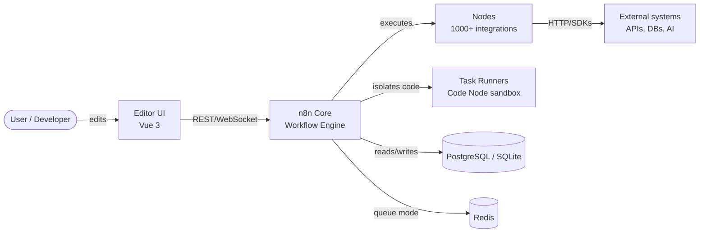
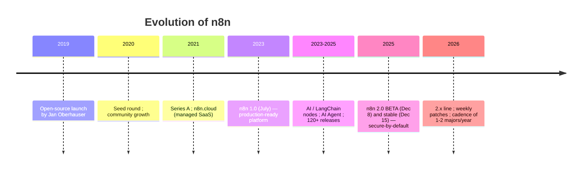
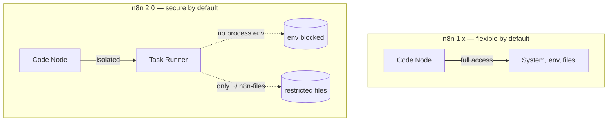
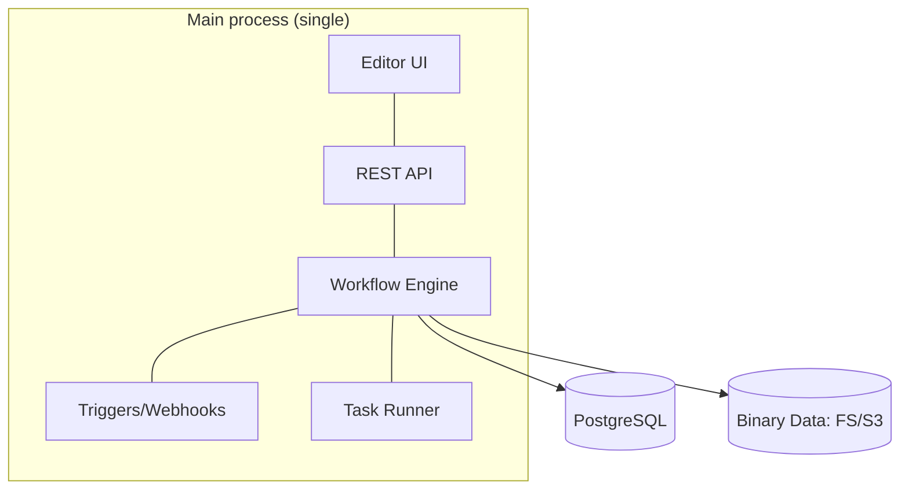
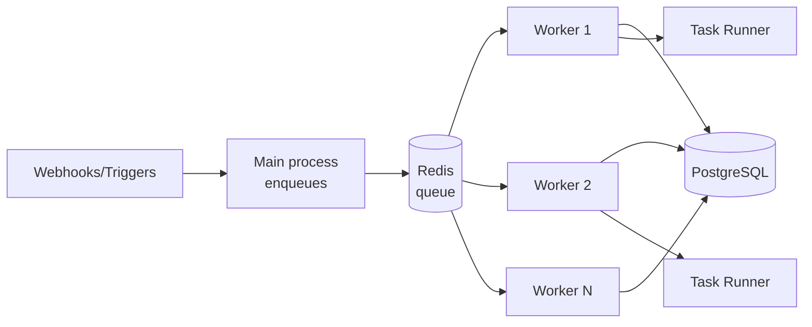
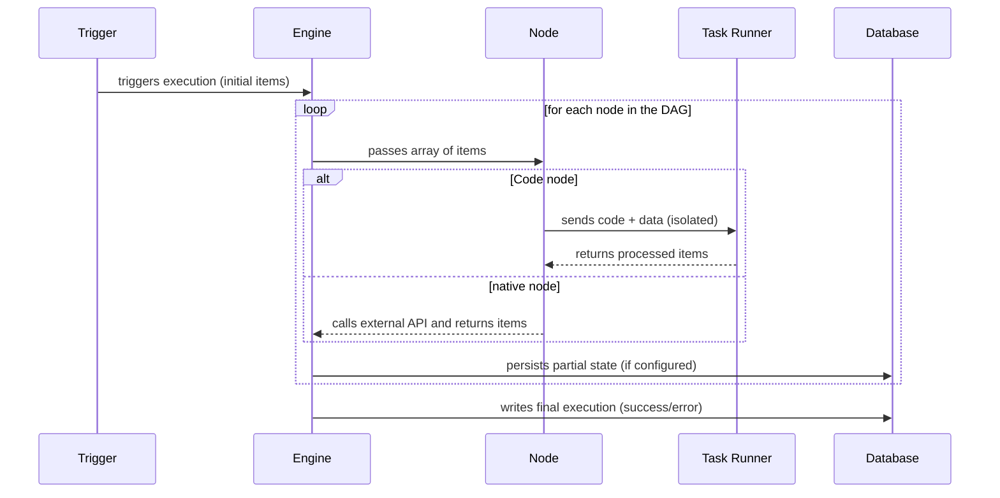
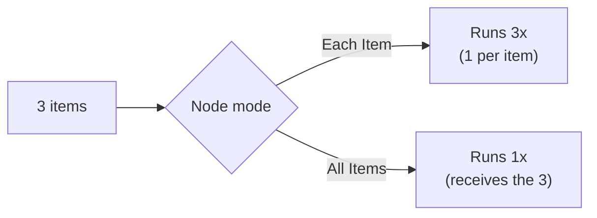
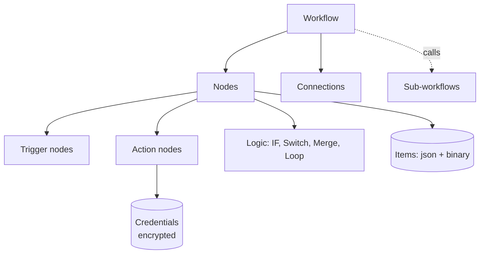
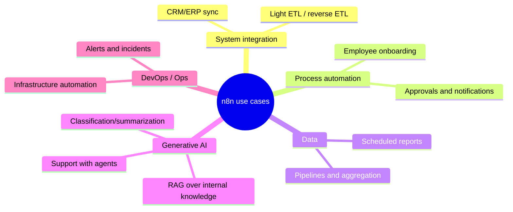
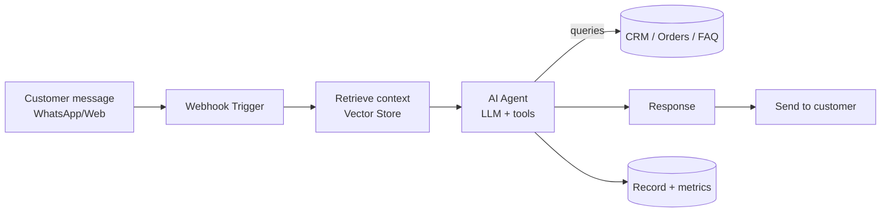

# n8n - Complete Professional Guide

> **Category:** 13_automation_and_integration · **Language:** English

---

# n8n — Complete Professional Guide
### Workflow Automation, Enterprise Integrations, and Generative AI in Production
**Edition updated for n8n 2.x (June 2026)**

> **Reference book (English).** A definitive guide for professionals, architects, and enterprises, covering everything from beginner to enterprise level. Based primarily on the official documentation (https://docs.n8n.io), the release notes (https://docs.n8n.io/release-notes/), and the official repository (https://github.com/n8n-io/n8n).
>
> **Version notice:** the content reflects the **2.x** line, whose milestone was n8n **2.0** (beta on 2025-12-08, stable on 2025-12-15), with near-weekly patches through June 2026. Relevant changes between versions appear in **"What's New in This Version"** sections.

---

## How to read this book

The book progresses through five maturity levels:

| Level | Profile | Parts |
|-------|---------|-------|
| 1 — Beginner | First contact with n8n | Part I |
| 2 — Intermediate | Building workflows and integrations | Parts II–IV |
| 3 — Advanced | Generative AI, agents, professional development | Parts V–VI |
| 4 — Specialist | Security, observability, scalability | Part VII |
| 5 — Enterprise | End-to-end real projects | Part VIII |

**Target audience:** Java and full-stack developers, data engineers, software engineers, solutions architects, AI engineers, DevOps professionals, tech leads, CTOs, and automation consultants.

**Structure of each chapter:** Introduction · Business context · Theoretical concepts · Architecture · Diagrams (Mermaid) · Real examples · Step by step · Complete code · Complete n8n workflows · Exercises · Challenges · Checklist · Best practices · Anti-patterns · Troubleshooting · Official references.

**Example format:** Scenario · Problem · Solution · Implementation · Result · Future improvements.

---

## Table of Contents

**Part I – n8n Fundamentals**
1. What is n8n
2. History and evolution
3. Internal architecture
4. Core concepts
5. Real-world use cases

**Part II – Installation and Environments**
6. Docker · 7. Docker Compose · 8. Kubernetes · 9. AWS · 10. Azure · 11. GCP · 12. Self-Hosted · 13. Cloud

**Part III – Building Workflows**
14. Nodes · 15. Triggers · 16. Expressions · 17. Variables · 18. Data Mapping · 19. Error Handling · 20. Debugging

**Part IV – Integrations**
21. REST APIs · 22. GraphQL · 23. Webhooks · 24. Databases · 25. Kafka · 26. RabbitMQ · 27. Redis · 28. AWS Services · 29. Google Services · 30. Microsoft Services

**Part V – Generative AI and Agents**
31. OpenAI · 32. Claude · 33. Gemini · 34. MCP · 35. RAG · 36. Vectors · 37. LangChain · 38. AI Agents · 39. Multi-Agents · 40. Enterprise AI Workflows

**Part VI – Professional Development**
41. Git · 42. Versioning · 43. Environments · 44. Testing · 45. CI/CD · 46. Deployment

**Part VII – Enterprise**
47. Security · 48. SSO · 49. Governance · 50. Observability · 51. Scalability · 52. High Availability · 53. Multi-Tenant

**Part VIII – Real Projects**
P1. Financial Automation · P2. AI-Powered Support · P3. Data Pipeline · P4. Intelligent CRM · P5. Automated SaaS Platform · P6. Corporate Agent

> **Status of this edition:** phased delivery (each part keeps the same depth standard). **Ready:** Part I (Ch. 1–5). **In progress:** Parts II–VIII.

---

# Part I – n8n Fundamentals

Part I establishes the conceptual foundation for everything that follows. Even seasoned integration professionals should read it, because n8n 2.x introduced mental-model shifts (secure-by-default execution, the Publish/Save paradigm, task runners) that invalidate part of the knowledge accumulated on the 1.x line.

---

## Chapter 1 — What is n8n

### 1.1 Introduction

n8n (pronounced "n-eight-n," from *nodemation* — *node* + *automation*) is an open-source **workflow automation** platform (fair-code license, under the Sustainable Use License) that lets you connect applications, APIs, databases, and AI models through a visual node-based editor, with the option to drop down to code whenever needed.

The phrase that best defines it is the project's own: **"technical automation without limits."** Unlike pure no-code tools, n8n is deliberately *low-code/pro-code*: the visual path covers 90% of cases, but the **Code** node (JavaScript or Python), expressions, and the ability to build custom nodes in TypeScript give developers the full control that tools like Zapier and Make do not offer.

For this book's audience — developers, engineers, and architects — the core value proposition is: **you don't trade power for speed.** You gain orchestration speed while keeping programming power.

### 1.2 Business context

Every modern company is, in practice, a set of systems that need to talk to each other: CRM, ERP, payment gateways, email, databases, message queues, AI providers. Historically, integrating these systems meant writing and maintaining dozens of "glue code" microservices — expensive to build, fragile, and invisible to the business.

n8n addresses three concrete enterprise pains:

- **Integration cost:** reduces weeks of glue-code development to hours of workflow assembly, with more than 1,000 ready-made integrations.
- **Data sovereignty and cost (self-hosting):** being self-hostable, it keeps sensitive data inside the company perimeter — a decisive factor for regulated industries (finance, healthcare, government) and for LGPD/GDPR compliance. This differentiates it from closed SaaS that require routing data through third-party servers.
- **Time-to-market for AI automations:** n8n positioned itself aggressively as an **AI automation** platform, natively integrating LangChain, agents, and RAG, which drastically shortens the prototype-to-production cycle for generative AI solutions.

> **Typical scenario:** a fintech needs every transaction above R$ 50k to trigger a fraud check (external API call), a database record, a notification to the risk team on Slack, and a CRM update. In traditional code, that's four integrations with error handling and retries. In n8n, it's a single versionable, observable, and auditable workflow.

### 1.3 Theoretical concepts

n8n materializes the **Pipes and Filters** architectural pattern combined with **Event-Driven Architecture**. A workflow is a **directed acyclic graph (DAG)** of nodes, where:

- **Node:** the unit of work. It can be a *trigger* (starts execution), an action (calls an API, writes to a database), a transformation (manipulates data), or logic (conditional, loop, merge).
- **Connection:** the edge that defines the data flow from one node to the next.
- **Item:** n8n processes **lists of items**, not single values. Each node receives an array of items and returns another array. This "data flows as items" model is the single most important concept for anyone coming from imperative programming: a node runs its logic **once for each input item** (unless configured to run only once).
- **Execution:** an instance of running the workflow, with its input data, output, and state, persisted for auditing and replay.

The difference from a traditional job scheduler (cron + scripts) is that n8n treats **data, control flow, credentials, retries, observability, and versioning as first-class citizens** — not as concerns the developer re-implements in every project.

### 1.4 Architecture (introductory view)

At the highest level, n8n has four major logical blocks: the **Editor (UI)**, the **Core/Workflow Engine**, the **Nodes**, and the **Persistence** layer. As of 2.0, code execution was isolated into **Task Runners**. Chapter 3 details each one; here is the panoramic view:



### 1.5 Real example

**Scenario.** An e-commerce business wants to send a personalized welcome email whenever a new order is created in its API.

**Problem.** The team doesn't want to maintain a dedicated microservice just to listen for orders and trigger emails; it needs something versionable and observable that the product team can adjust without a deployment.

**Solution.** An n8n workflow with a webhook trigger (receives the order), a transformation node (builds the content), and an email node.

**Implementation (step by step).**

1. Add a **Webhook** node (trigger), method `POST`, path `/new-order`.
2. Add an **Edit Fields (Set)** node to build `subject` and `body` from the order data using expressions.
3. Add a **Send Email** (SMTP) node connected to the Set output.
4. Publish the workflow (*Publish*) to activate it in production.

**Code (Set node expression, `body` field):**

```javascript
// n8n expression — interpolates data from the item received by the webhook
Hi {{ $json.body.customer.name }}, we received your order #{{ $json.body.order.id }}
for {{ $json.body.order.total.toLocaleString('en-US', { style: 'currency', currency: 'USD' }) }}.
Thank you for your business!
```

**Complete n8n workflow (importable JSON):**

```json
{
  "name": "Order Welcome",
  "nodes": [
    {
      "parameters": {
        "httpMethod": "POST",
        "path": "new-order",
        "responseMode": "onReceived"
      },
      "id": "f1a2b3c4-0001-0001-0001-000000000001",
      "name": "Webhook",
      "type": "n8n-nodes-base.webhook",
      "typeVersion": 2,
      "position": [260, 300]
    },
    {
      "parameters": {
        "assignments": {
          "assignments": [
            {
              "id": "a1",
              "name": "subject",
              "type": "string",
              "value": "=Order #{{ $json.body.order.id }} confirmed"
            },
            {
              "id": "a2",
              "name": "body",
              "type": "string",
              "value": "=Hi {{ $json.body.customer.name }}, we received your order #{{ $json.body.order.id }}."
            }
          ]
        }
      },
      "id": "f1a2b3c4-0002-0002-0002-000000000002",
      "name": "Edit Fields",
      "type": "n8n-nodes-base.set",
      "typeVersion": 3.4,
      "position": [480, 300]
    },
    {
      "parameters": {
        "fromEmail": "store@company.com",
        "toEmail": "={{ $json.body.customer.email }}",
        "subject": "={{ $json.subject }}",
        "text": "={{ $json.body }}"
      },
      "id": "f1a2b3c4-0003-0003-0003-000000000003",
      "name": "Send Email",
      "type": "n8n-nodes-base.emailSend",
      "typeVersion": 2.1,
      "position": [700, 300],
      "credentials": { "smtp": { "id": "1", "name": "Company SMTP" } }
    }
  ],
  "connections": {
    "Webhook": { "main": [[{ "node": "Edit Fields", "type": "main", "index": 0 }]] },
    "Edit Fields": { "main": [[{ "node": "Send Email", "type": "main", "index": 0 }]] }
  },
  "settings": { "executionOrder": "v1" }
}
```

**Result.** Each `POST` to `/webhook/new-order` triggers a personalized email, with the execution logged (input, output, duration) and visible in the *Executions* tab.

**Future improvements.** Add error handling (Chapter 19), validate the payload with an IF node, and move SMTP credentials to an environment variable. In production, protect the webhook with authentication (Chapter 47).

### 1.6 Exercises

1. Define, in your own words, the difference between *node*, *connection*, *item*, and *execution*.
2. List three scenarios at your company where glue code could be replaced by an n8n workflow.
3. Import the JSON above into a local instance and trigger it with `curl`.

### 1.7 Challenges

- **Challenge 1.** Adapt the workflow to also send a Slack message when the order is above $1,000, using an **IF** node.
- **Challenge 2.** Explain why processing "lists of items" changes how you think about logic compared to a traditional `for` loop in Java.

### 1.8 Checklist

- [ ] I understand n8n is low-code/pro-code, not pure no-code.
- [ ] I grasp the item-oriented data model.
- [ ] I can distinguish n8n from a traditional cron+script.
- [ ] I identified the self-hosting advantage for LGPD/compliance.
- [ ] I imported and ran my first workflow.

### 1.9 Best practices

- Treat workflows as **code**: name nodes descriptively, document with sticky notes, version them (Chapters 41–42).
- Prefer native nodes over raw `HTTP Request` when the integration exists — you get pagination, retries, and authentication handled for free.
- Separate **business logic** (transformations) from **side effects** (external writes) into distinct nodes, easing testing and debugging.

### 1.10 Anti-patterns

- **Monolithic workflow:** a single workflow with 80 nodes doing everything. Prefer sub-workflows (Chapter 4).
- **Hardcoded credentials** in Code nodes or URL fields. Use the credential vault.
- **Critical logic in the Code node when a native node solves it** — it increases bug surface and hinders team maintenance.
- **Ignoring the item model**, treating the array as a single value and breaking in production with multiple items.

### 1.11 Troubleshooting

| Symptom | Likely cause | Action |
|---------|--------------|--------|
| Webhook returns 404 | Workflow not published/active (v2.0: *Save* ≠ *Publish*) | Click **Publish** |
| Node runs N times unexpectedly | Input has N items | Set to "run once" or aggregate first |
| `process.env` undefined in Code node | v2.0 blocks env in Code | Use credentials or workflow static data |
| Email not sent | SMTP credential missing/wrong | Reconfigure the credential and test |

### 1.12 Official references

- Documentation: https://docs.n8n.io
- Node and data concepts: https://docs.n8n.io/data/
- Repository: https://github.com/n8n-io/n8n
- Release notes: https://docs.n8n.io/release-notes/

---

## Chapter 2 — History and evolution

### 2.1 Introduction

Understanding n8n's trajectory is not a historical exercise: it is the key to interpreting **why** the platform made certain architectural decisions and **what to expect** from upcoming versions. This chapter walks the timeline from 2019 to June 2026, focusing on the inflection points that directly affect architects and developers — culminating in the **1.x → 2.0** transition, the most impactful in the project's history.

### 2.2 Business context

n8n was born out of frustration with closed automation SaaS (Zapier, Make) that charged per execution and required trusting data to third parties. The bet on **fair-code + self-hosting** created a market: companies that need automation but cannot (for cost or compliance reasons) outsource their data flow. This proved especially valuable during the **generative AI** wave (2023–2026), when orchestrating LLM calls with proprietary data became a corporate necessity — and doing so within the perimeter became a security requirement.

### 2.3 Timeline (concepts and milestones)



Essential milestones:

- **2019** — Jan Oberhauser publishes n8n as open source. Name: *nodemation*.
- **July 2023 — n8n 1.0:** the platform declares itself *production-ready*. It stabilizes the node API and the execution model.
- **2023–2025** — explosion of AI automation: native **LangChain** and **AI Agent** nodes, integrations with OpenAI/Anthropic/Google, vector stores. n8n repositions itself from an "integration tool" to an **"AI automation platform."**
- **December 2025 — n8n 2.0:** the first major in ~2.5 years. It is not about new features, but about **hardening**: secure-by-default execution, reliability, and performance.
- **2026** — the **2.x** line with near-weekly patches; starting with 2.0, the project adopts a cadence of **1 to 2 major versions per year**.

### 2.4 Architecture: the philosophy shift

The 1.x → 2.0 transition represents a shift in **defaults philosophy**. In 1.x, n8n prioritized maximum flexibility: the Code node accessed the entire system, environment variables, and files freely. This was powerful and dangerous. In 2.0, the principle becomes **"secure by default, permissive by choice."**



### 2.5 What's New in This Version — n8n 2.0 (the leap every professional must understand)

This section is mandatory for anyone migrating from 1.x. Each item includes the **practical impact** for architects, developers, and enterprises.

**Security (secure-by-default)**

- **Task Runners enabled by default.** Every Code node runs in an isolated environment with limited access. *Impact:* workflows that relied on broad Code node access need explicit configuration; a huge gain in security posture and resource isolation.
- **`process.env` blocked in the Code node.** *Impact:* reading secrets via env in Code stops working — use the credential vault or static data. Prevents credential leakage.
- **File access restricted to `~/.n8n-files`.** *Impact:* workflows that read/wrote outside that directory will fail; review your file pipelines.
- **Arbitrary command-execution nodes disabled by default.** *Impact:* reduces attack surface; re-enable explicitly only if essential.
- **OAuth 2.0 Token Exchange (RFC 8693)** as a second authentication mechanism. *Impact:* enables iframe embedding and delegated API access securely.

**Reliability**

- **Sub-workflows with the Wait node** now correctly return data from the **end** of the sub-workflow (previously they returned the input to the Wait node, causing subtle bugs with timeouts > 65s and webhook calls). *Impact:* fixes silently incorrect results in complex orchestrations.
- **Removal of nodes for defunct services** and legacy options. *Impact:* fewer edge cases, more predictable behavior.
- **Start node removed** — specific triggers replace it. *Impact:* old workflows based on Start need adjustment.

**Performance**

- **New SQLite pooling driver** — up to **10x** faster in benchmarks. *Impact:* self-hosted SQLite instances gain throughput without switching databases.
- **Filesystem-based binary data handling** is more predictable under load.

**Database**

- **MySQL and MariaDB are no longer supported.** *Critical impact:* migrate to **PostgreSQL** (recommended for production) or **SQLite** **before** upgrading. This is often the biggest migration blocker in enterprise environments.

**Experience (UI/UX)**

- **Publish/Save paradigm.** In 1.x, saving an active workflow instantly updated production. In 2.0, **Save** preserves your edits without touching what is live; **Publish** is the explicit action to promote the version to production. *Impact:* no more accidental production changes; aligns the flow with controlled-release practices.
- **Autosave** (introduced Jan 2026), refined canvas, and reorganized sidebar navigation.

**Migration**

- **Migration Report** (Settings → Migration Report, available since 1.121.0 for global admins) and the **Migration Tool** scan the instance and classify issues by severity (workflow-level and instance-level). *Impact:* lets you plan the migration predictably.
- **1.x support for 3 months** after 2.0, with security and bug fixes only.

> **Architect's recommendation:** treat the move to 2.0 as a project, not a `docker pull`. Run the Migration Report, resolve *critical* items (MySQL/MariaDB database, Start node, env/file access in Code) in staging, and only then promote.

### 2.6 Real example

**Scenario.** A company runs n8n 1.118 self-hosted with MySQL and several workflows using `process.env` in the Code node to read API keys.

**Problem.** It wants to upgrade to 2.x for security and performance, but fears breaking production.

**Solution.** A phased migration process guided by the Migration Report.

**Implementation.**
1. Upgrade to the latest 1.x (≥ 1.121) to enable the Migration Report.
2. In staging, run the report and list *critical* items.
3. Migrate the MySQL database → PostgreSQL (dump + import + adjust `DB_TYPE`).
4. Refactor Code nodes: replace `process.env.X` with credentials.
5. Validate file access (move to `~/.n8n-files`).
6. Upgrade to 2.x in staging, test, then promote in production.

**Result.** A more secure 2.x instance, up to 10x faster (if SQLite) or robust (PostgreSQL), with no workflow loss.

**Future improvements.** Adopt the Publish/Save paradigm in the release process and integrate the migration check into CI (Chapter 45).

### 2.7 Exercises

1. List, from your current environment, which items would be *critical* in a migration to 2.0.
2. Explain, for a non-technical manager, why "secure-by-default" justifies a major version.

### 2.8 Challenges

- **Challenge.** Write a migration runbook for 1.x → 2.x for an instance with MySQL, 200 workflows, and heavy Code node usage.

### 2.9 Checklist

- [ ] I know the 6 change groups of 2.0 (security, reliability, performance, database, UX, migration).
- [ ] I know MySQL/MariaDB were removed.
- [ ] I understand the difference between Save and Publish.
- [ ] I know where the Migration Report is.

### 2.10 Best practices

- Follow the official release notes weekly; the cadence is high.
- Pin the Docker image version (avoid `latest` in production) and update in a controlled way.
- Always test major upgrades in staging with a copy of the data.

### 2.11 Anti-patterns

- Upgrading directly from 1.x to 2.x in production without the Migration Report.
- Keeping `latest` as the image tag in production.
- Ignoring the 3-month 1.x support window and postponing the migration indefinitely.

### 2.12 Troubleshooting

| Symptom after upgrade | Cause | Action |
|-----------------------|-------|--------|
| Instance won't start | MySQL/MariaDB database | Migrate to PostgreSQL/SQLite |
| Workflows with Start broken | Start node removed | Replace with a specific trigger |
| Code node fails reading env | `process.env` blocked | Migrate to credentials |
| Change doesn't appear in production | Missing *Publish* | Click Publish |

### 2.13 Official references

- Introducing n8n 2.0: https://blog.n8n.io/introducing-n8n-2-0/
- Breaking changes 2.0: https://docs.n8n.io/2-0-breaking-changes/
- Migration Tool: https://docs.n8n.io/migration-tool-v2/
- Release notes: https://docs.n8n.io/release-notes/

---

## Chapter 3 — Internal architecture

### 3.1 Introduction

To use n8n as a toy, just drag nodes. To use it in **enterprise production** — with high availability, horizontal scale, and security — it is mandatory to understand what happens "under the hood." This chapter dissects the internal components, execution modes, and the data path, focusing on the structural changes brought by the **task runners** in 2.0.

### 3.2 Business context

The difference between an instance processing 100 executions/day and one processing 1 million is not in the workflows — it is in the **deployment topology**. Internal architecture decisions determine infrastructure cost, latency, fault resilience, and the ability to meet SLAs. An architect who doesn't master queue mode, workers, and task runners will either over-provision (waste) or under-provision (incidents) the environment.

### 3.3 Theoretical concepts: the components

n8n is a **Node.js** application (TypeScript backend) with a **Vue 3** frontend. Its logical components:

- **Editor UI:** the SPA where workflows are built; communicates with the backend via REST and WebSocket (execution-progress push).
- **REST API / Public API:** the programmatic interface for workflows, executions, credentials, and users.
- **Core / Workflow Engine:** the heart. It resolves the node graph, orders execution, propagates items between nodes, evaluates expressions, and applies retries and error handling.
- **Nodes:** packages (`n8n-nodes-base` and AI nodes in `@n8n/n8n-nodes-langchain`) that implement each integration.
- **Task Runners (2.0):** isolated processes that execute **Code node** code outside the main process — security and resource isolation.
- **Persistence:** a relational database (**PostgreSQL** recommended; **SQLite** for single-node) stores workflows, credentials (encrypted), executions, and settings.
- **Queue (queue mode):** **Redis** as a broker to distribute executions across workers.
- **Binary Data:** binary data (files) can live on the filesystem or in external storage (S3), avoiding database bloat.

### 3.4 Architecture: deployment modes

**Single mode (default).** A single main process does everything: UI, API, triggers, execution. Simple, ideal for getting started and for small loads.



**Queue mode (horizontal scale).** The main process only receives triggers and enqueues; independent **workers** consume the queue and execute. High-volume webhooks can have dedicated processes. This is the topology for production at scale and high availability (Chapters 51–52).



### 3.5 The data path (execution)



Critical points for the architect:

- **Execution persistence** (`EXECUTIONS_DATA_SAVE_*`): saving all executions is great for auditing but bloats the database. Configure pruning (`EXECUTIONS_DATA_PRUNE`, `EXECUTIONS_DATA_MAX_AGE`).
- **Concurrency:** workers have configurable concurrency (`--concurrency`); size it according to CPU and the I/O-bound nature of your workflows.
- **Task runners** can be *internal* (same host) or *external* (separate process/container) — external ones give maximum isolation, recommended for multi-tenant (Chapter 53).

### 3.6 Real example

**Scenario.** A SaaS platform with peaks of 50k webhooks/hour coming from customer integrations.

**Problem.** In single mode, the main process saturates: webhooks compete with execution, latency rises, timeouts occur.

**Solution.** Migrate to queue mode with dedicated workers and a separate webhook process.

**Implementation (environment variables):**

```bash
# Main process and workers share the database and Redis
export EXECUTIONS_MODE=queue
export QUEUE_BULL_REDIS_HOST=redis.internal
export DB_TYPE=postgresdb
export DB_POSTGRESDB_HOST=pg.internal
# External task runners (isolation)
export N8N_RUNNERS_ENABLED=true
export N8N_RUNNERS_MODE=external
# Execution pruning
export EXECUTIONS_DATA_PRUNE=true
export EXECUTIONS_DATA_MAX_AGE=336   # hours (14 days)
```

Start a worker:

```bash
n8n worker --concurrency=10
```

**Result.** Webhooks are enqueued in milliseconds; workers scale horizontally; the main process never saturates. Predictable latency under peak.

**Future improvements.** Autoscale workers on Kubernetes via HPA using a queue-depth metric (Chapter 8/51).

### 3.7 Exercises

1. Draw your application's topology in queue mode, indicating where Redis, Postgres, and workers sit.
2. Explain why binary data in S3 is preferable to storing it in the database.

### 3.8 Challenges

- **Challenge.** Calculate how many workers (with `--concurrency=10`) are needed for 50k executions/hour if each execution takes an average of 2s of wall-clock time.

### 3.9 Checklist

- [ ] I can distinguish single mode from queue mode.
- [ ] I understand the role of Redis, PostgreSQL, and workers.
- [ ] I configured execution pruning.
- [ ] I understand internal vs external task runners.

### 3.10 Best practices

- In production, use **PostgreSQL** (not SQLite) and **queue mode** early if you anticipate growth.
- Externalize binary data (S3) to keep the database lean.
- Configure pruning from day 1 — accumulated executions are the #1 cause of a giant database.
- Use external task runners to isolate untrusted code in multi-tenant scenarios.

### 3.11 Anti-patterns

- Running production on single-node SQLite with thousands of executions/day.
- Saving all executions without pruning.
- A single giant worker instead of several smaller ones (worse resilience).
- Mixing high-volume webhooks with execution in the same process.

### 3.12 Troubleshooting

| Symptom | Cause | Action |
|---------|-------|--------|
| Executions "stuck" in waiting | No worker consuming the queue | Start workers; check Redis |
| Database growing endlessly | Pruning disabled | Enable `EXECUTIONS_DATA_PRUNE` |
| High latency at webhook peak | Single mode saturated | Migrate to queue + webhook process |
| Slow/unstable Code node | Task runner under-provisioned | Adjust runner resources/mode |

### 3.13 Official references

- Scaling and queue mode: https://docs.n8n.io/hosting/scaling/queue-mode/
- Task runners: https://docs.n8n.io/hosting/configuration/task-runners/
- Environment configuration: https://docs.n8n.io/hosting/configuration/environment-variables/
- Execution pruning: https://docs.n8n.io/hosting/scaling/execution-data/

---

## Chapter 4 — Core concepts

### 4.1 Introduction

This chapter consolidates n8n's **operational vocabulary**: items, nodes, connections, pinning, expressions, credentials, sub-workflows, and node execution modes. Mastering these concepts is what separates someone who "builds little flows" from someone who **designs robust automations**. It is the reference chapter you will reopen throughout the book.

### 4.2 Business context

Costly production errors almost always stem from conceptual misunderstandings: treating an array of items as a single value, not understanding when a node runs once vs. N times, or mixing execution data with credentials. Getting the fundamentals right reduces incidents and the maintenance cost of the automation estate.

### 4.3 Theoretical concepts

**The item and the data structure.** Everything that travels between nodes is a list of items. Each item has the shape:

```json
{
  "json": { "field": "value" },
  "binary": { "file": { "data": "<base64>", "mimeType": "application/pdf" } }
}
```

- `json`: the structured data (what you manipulate 99% of the time).
- `binary`: attachments/files, referenced by key.

**Node execution mode.** A node can run **once per item** (*Run Once for Each Item*) or **once for all** (*Run Once for All Items*). Understanding this is vital: an HTTP node in "each item" makes N calls; in "all items," it makes one.



**Expressions.** `{{ ... }}` syntax (JavaScript-based) to access data dynamically. Key variables:

- `$json` — the current item's data.
- `$node["Name"].json` — another node's output.
- `$items()` — all items from a node.
- `$now`, `$today` — date/time (using Luxon).
- `$workflow`, `$execution` — workflow/execution metadata.
- `$vars` — n8n environment variables (Enterprise) / `$env` for system environment variables (when allowed).

**Credentials.** Stored **encrypted** (`N8N_ENCRYPTION_KEY` key), separate from workflows. A workflow references a credential by ID; the secret never appears in the workflow JSON. This allows sharing/versioning workflows without leaking secrets.

**Sub-workflows.** Workflows called by others (via the **Execute Sub-workflow** node). They promote reuse and modularization — the equivalent of extracting a method. In 2.0, data passing from sub-workflows with Wait was fixed (Ch. 2).

**Data pinning.** Lets you "freeze" a node's output during development, to test downstream nodes without re-triggering external calls — it speeds up debugging (Ch. 20).

### 4.4 Conceptual architecture



### 4.5 Real example

**Scenario.** Process a list of 100 customers and, for each one, query a credit score from an API and classify it.

**Problem.** Ensure the API call happens per customer and that classification is per item, without mixing data.

**Solution.** Use "each item" mode on the HTTP node and per-item expressions.

**Implementation (IF node, classification condition):**

```javascript
// Expression in the IF node — compares the score returned by the API
{{ $json.score >= 700 }}
```

**Code (Code node "Run Once for Each Item") to enrich the item:**

```javascript
// n8n 2.0 — Code node in "each item" mode; no process.env (use credentials)
const score = $json.score;
let band;
if (score >= 800) band = 'A';
else if (score >= 700) band = 'B';
else if (score >= 600) band = 'C';
else band = 'D';

return { json: { ...$json, band } };
```

**Result.** Each customer comes out classified A–D, in independent items, ready for routing (e.g., approve A/B, review C, decline D).

**Future improvements.** Parallelize with controlled batching to respect the API's rate limit (Ch. 19/21).

### 4.6 Exercises

1. Given a node that receives 5 items, how many times does it run in "each item" and in "all items"?
2. Write an expression that returns today's date in `dd/MM/yyyy` format.
3. Explain why credentials live outside the workflow JSON.

### 4.7 Challenges

- **Challenge.** Build a workflow that receives a list of products, fetches each one's price from an API, and returns only those priced above the average — thinking carefully about when to aggregate (all items) and when to iterate (each item).

### 4.8 Checklist

- [ ] I understand the item's `json` + `binary` structure.
- [ ] I know the difference between "each item" and "all items."
- [ ] I know the main expression variables.
- [ ] I know credentials are encrypted and referenced by ID.
- [ ] I understand sub-workflows and pinning.

### 4.9 Best practices

- Name nodes semantically ("Fetch score," not "HTTP Request1").
- Use sub-workflows for reusable logic; keep workflows single-responsibility.
- Use pinning during development to avoid consuming real APIs on every test.
- Centralize complex expressions in a commented Code node instead of scattering them.

### 4.10 Anti-patterns

- Giant, unreadable expressions embedded in many fields.
- Confusing `$json` (current item) with `$node[...]` (another node) and reading the wrong data.
- Reusing the same credential across different environments (dev/prod).
- Ignoring the node execution mode and generating unintended N calls.

### 4.11 Troubleshooting

| Symptom | Cause | Action |
|---------|-------|--------|
| Expression returns `undefined` | Wrong `$json` path | Inspect the node's input data |
| Node makes too many calls | Improper "each item" mode | Switch to "all items" or aggregate |
| Credential error when migrating a workflow | Different `N8N_ENCRYPTION_KEY` | Use the same key across environments |
| Data disappearing after a sub-workflow | Misunderstood return | Review what the sub-workflow returns |

### 4.12 Official references

- Data structure: https://docs.n8n.io/data/data-structure/
- Expressions: https://docs.n8n.io/code/expressions/
- Credentials: https://docs.n8n.io/credentials/
- Sub-workflows: https://docs.n8n.io/flow-logic/subworkflows/

---

## Chapter 5 — Real-world use cases

### 5.1 Introduction

Concept without application is trivia. This chapter presents **categories of proven enterprise use cases**, each with the typical n8n architecture, so you recognize patterns and know when n8n is (and is not) the right tool. The six complete projects in Part VIII go deeper into some of these cases.

### 5.2 Business context

n8n delivers value where there is **integration between heterogeneous systems with business logic**, especially when the team wants autonomy to evolve the automation without traditional deployments. Recognizing the "fit" avoids two costly enterprise mistakes: using n8n as a replacement for a critical transactional backend (it isn't), or continuing to write glue code where a workflow would solve it.

### 5.3 Theoretical concepts: the major categories



**1. Integration and synchronization (iPaaS).** Keep CRM, ERP, marketing tools, and billing in sync. Pattern: trigger on change → transformation → upsert into the destination.

**2. Business process automation (BPA).** Onboarding, approvals, handoffs between teams. Pattern: form/event → conditional routing → actions + notifications + record.

**3. Data pipelines (light ETL/ELT).** Collect, transform, and load data between sources. Pattern: scheduled trigger → extract (API/DB) → transform → load (warehouse). For massive volumes, n8n orchestrates; the heavy processing stays in dedicated tools.

**4. Generative AI and agents.** Automated support, RAG over internal documents, classification and enrichment. Pattern: trigger → context retrieval (vectors) → LLM/agent → action. It is the fastest-growing category (Part V).

**5. DevOps and operations.** Orchestrate alerts, react to incidents, automate infrastructure tasks. Pattern: monitoring webhook → enrichment → decision → action (Slack/PagerDuty/cloud API).

### 5.4 Architecture of a typical case (AI support)



### 5.5 Real example

**Scenario.** A distributor receives orders by email as PDFs and wants to post them automatically into the ERP.

**Problem.** Manual entry is slow and error-prone; volume has grown to hundreds/day.

**Solution.** A workflow that monitors the inbox, extracts data from the PDF with AI, and posts to the ERP via API, with human review for low-confidence cases.

**Implementation (step by step).**
1. **Trigger:** IMAP/Email node reads new emails with a PDF attachment.
2. **Extraction:** AI node (OpenAI/Claude) with the PDF → structured JSON (items, quantities, values).
3. **Validation:** IF node checks `confidence >= 0.9`.
4. **High confidence:** HTTP node posts to the ERP.
5. **Low confidence:** Slack node notifies a human for review.
6. **Record:** writes the result to a database for auditing.

**Code (Code node — normalizes the AI output):**

```javascript
// Ensures the contract expected by the ERP, with safe defaults
const ai = $json.extraction ?? {};
return {
  json: {
    externalOrder: ai.number ?? null,
    items: (ai.items ?? []).map(i => ({
      sku: i.sku,
      qty: Number(i.quantity) || 0,
      price: Number(i.price) || 0
    })),
    confidence: Number(ai.confidence) || 0
  }
};
```

**Result.** ~90% of orders posted without intervention; 10% reviewed by a human; zero routine manual data entry; a complete audit trail.

**Future improvements.** Add fine-tuning/few-shot to raise confidence, and a feedback loop that reuses human corrections (Part V).

### 5.6 When NOT to use n8n

- **A latency-critical transactional backend** (e.g., a synchronous checkout engine with a millisecond SLA): use a dedicated service; n8n orchestrates around it, not in the critical path.
- **Big-data processing at TB scale**: orchestrate Spark/Flink with n8n, but don't process the volume inside it.
- **Core, complex domain logic** that deserves a testable, end-to-end typed codebase.

### 5.7 Exercises

1. Classify three automations at your company into the categories in section 5.3.
2. For the distributor example, list the risks and how to mitigate them.

### 5.8 Challenges

- **Challenge.** Design (as a Mermaid diagram) the architecture of a DevOps use case: react to a high-CPU alert by creating a ticket and scaling an instance in the cloud.

### 5.9 Checklist

- [ ] I can recognize the 5 major use-case categories.
- [ ] I identified the architectural pattern of each.
- [ ] I can articulate when n8n is NOT the right tool.
- [ ] I mapped at least one real case from my organization.

### 5.10 Best practices

- Start with a **high-value, low-risk** case to prove the platform.
- Always include an audit trail (execution/result logging) in enterprise cases.
- In AI cases, design the **human review** path for low confidence from the start.

### 5.11 Anti-patterns

- Placing n8n in the synchronous critical path of a financial transaction.
- Automating a broken process instead of fixing it first (automating chaos amplifies chaos).
- A use case with no business owner — orphaned automations rot.

### 5.12 Troubleshooting

| Symptom | Cause | Action |
|---------|-------|--------|
| Automation "no one trusts" | Lack of audit/observability | Add logs and metrics (Ch. 50) |
| Inconsistent AI results | No validation/review | Add a confidence IF + human |
| Workflow grew too large | Multiple cases in one | Split into sub-workflows per case |

### 5.13 Official references

- Use cases and templates: https://n8n.io/workflows/
- Use cases (DevOps, data): https://n8n.io/use-cases/
- AI documentation: https://docs.n8n.io/advanced-ai/

---

> **End of Part I.** The fundamentals are in place: what n8n is, its evolution up to the 2.x line, its internal architecture, the operational vocabulary, and the map of use cases. **Part II — Installation and Environments** (Chapters 6–13) starts getting hands-on with infrastructure: Docker, Docker Compose, Kubernetes, AWS, Azure, GCP, Self-Hosted, and Cloud.

<!--APPEND-PARTE-II-->
