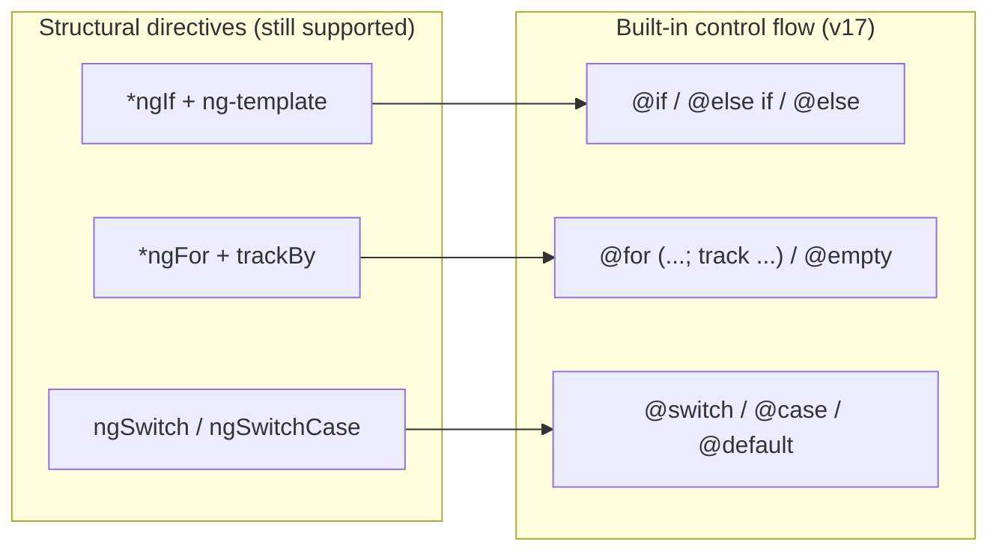
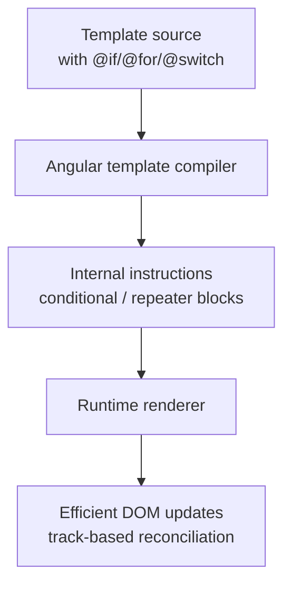
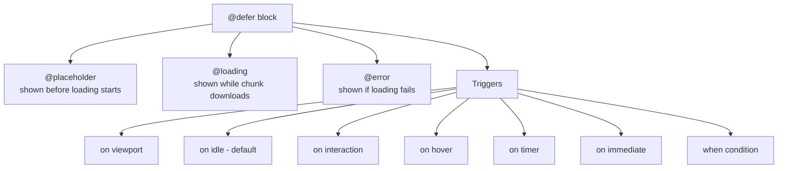
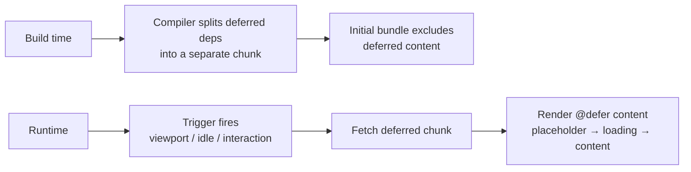

# Angular 17 - Complete Professional Guide

> **Category:** 14_frameworks · **Language:** English

---

### What's New in v17: Built-in Control Flow, Deferrable Views, New Build System, SSR & Hydration, Signals
**Edition for Angular v17.0 (released November 8, 2023)**

> **Reference book (English).** A professional, in-depth guide **focused on what's new in Angular 17**, for developers, architects, and teams already familiar with Angular. Based primarily on the official sources: angular.dev and the Angular v17 release (https://github.com/angular/angular/releases/tag/17.0.0).
>
> **Scope notice:** this is a **version-focused** book. Rather than teaching Angular from scratch, it concentrates on the APIs and tooling that arrived or stabilized in v17 — and the practical impact for production code and migrations. Each chapter follows the TO-BRAIN editorial standard (see `FILE_CONVENTIONS.md`).

---

## How to read this book

Progressive depth across five maturity levels, all centered on v17:

| Level | Profile | Parts |
|-------|---------|-------|
| 1 — Beginner (to v17) | Coming from older Angular | Part I |
| 2 — Intermediate | Control flow & deferrable views | Part II |
| 3 — Advanced | Reactivity: Signals, SSR & hydration | Parts III–V |
| 4 — Specialist | Build system, CLI, performance | Parts VI–VII |
| 5 — Enterprise | Adoption strategy & production | Part VIII |

**Target audience:** Java and full-stack developers, software architects, frontend engineers, tech leads, and CTOs adopting or migrating to Angular 17.

**Structure of each chapter:** Introduction · Business context · Theoretical concepts · Architecture · Diagrams (Mermaid) · Real examples · Step by step · Complete code · Exercises · Challenges · Checklist · Best practices · Anti-patterns · Troubleshooting · Official references.

**Example format:** Scenario · Problem · Solution · Implementation · Result · Future improvements.

> **Note on prerequisites.** This book assumes working knowledge of Angular components, templates, dependency injection, and RxJS basics. Familiarity with **standalone components** (stable since v15) helps, since v17 makes them the default. Where a v17 feature builds on a prior one, we link the lineage.

---

## Table of Contents

**Part I – Angular 17 Overview & Foundations**
1. What's new in Angular 17 — the big picture
2. Built-in control flow (`@if` / `@for` / `@switch`) and migrating from `*ngIf` / `*ngFor`
3. Deferrable views (`@defer`) — lazy loading inside the template

**Part II – Templates & Control Flow in Depth**
4. `@for` internals: `track`, `$index`, contextual variables, and `@empty`
5. Migrating structural directives at scale
6. Deferrable views: triggers, prefetching, and SSR

**Part III – Reactivity with Signals**
7. Signals fundamentals (`signal`, `computed`)
8. Effects (`effect`, developer preview) and signal-based patterns
9. Signals and change detection

**Part IV – The New Build System**
10. The esbuild/Vite application builder (`@angular-devkit/build-angular:application`)
11. Dev server, HMR, and build performance

**Part V – SSR & Hydration**
12. Server-side rendering with `ng new --ssr`
13. Full-app hydration (`provideClientHydration()`)
14. View Transitions API (`withViewTransitions()`)

**Part VI – Standalone & Project Structure**
15. Standalone APIs as the default
16. The new project layout and bootstrap

**Part VII – Tooling & Docs**
17. angular.dev, the rebrand, and the new learning experience
18. CLI changes and developer experience in v17

**Part VIII – Adoption & Production**
19. Adoption strategy for v17 features
20. Performance and production best practices for v17

> **Status of this edition:** phased delivery (each part keeps the same depth standard). **Ready:** Part I (Ch. 1–3). **In progress:** Parts II–VIII.

---

## Part I – Angular 17 Overview & Foundations

Part I gives you the strategic map of Angular 17. v17 is widely described as a **"renaissance" release**: it introduces a brand-new **declarative control flow** in templates (`@if`, `@for`, `@switch`), **deferrable views** (`@defer`) for in-template lazy loading, a **new esbuild/Vite build system** as the default for new projects, dramatically simpler **SSR and hydration**, **standalone** as the default, and the stabilization of **Signals**. Understanding these pillars — and how they fit together — is the difference between treating v17 as "just another version" and using it to modernize how you build Angular apps.

---

## Chapter 1 — What's new in Angular 17 — the big picture

### 1.1 Introduction

Angular **v17.0** was released on **November 8, 2023**. It is one of the most significant releases in the framework's history, shipping a new in-template **control flow** syntax (`@if`/`@for`/`@switch`), **deferrable views** (`@defer`) for lazy loading, a **new application build system** built on esbuild and Vite, a much simpler **server-side rendering and hydration** story, **standalone components by default**, and the move of **Signals** (`signal`, `computed`) to stable. It also launched the new **angular.dev** documentation site and a refreshed brand. This chapter is the executive overview — the mental map you'll use to navigate the rest of the book.

### 1.2 Business context

For engineering leaders, a major Angular release raises three questions: *what do we gain, what does it cost, and is it risky to adopt?* v17's answer is unusually favorable. The headline features — control flow, `@defer`, the new builder, and hydration — deliver **faster builds, smaller initial bundles, and better Core Web Vitals** with **low migration risk**, because the new syntax is **additive** (the old `*ngIf`/`*ngFor` keep working) and most changes are opt-in or backward-compatible. The strategic read: v17 lets teams improve performance and developer experience incrementally, without a big-bang rewrite.

### 1.3 Theoretical concepts: the pillars of v17

```mermaid
mindmap
  root((Angular 17))
    Templates
      Built-in control flow (@if/@for/@switch)
      Deferrable views (@defer)
    Reactivity
      Signals stable (signal/computed)
      effect (developer preview)
    Build & dev
      esbuild/Vite application builder (default)
      Faster builds + Vite dev server
    SSR & hydration
      ng new --ssr
      provideClientHydration()
      View Transitions API
    Defaults & docs
      Standalone by default
      angular.dev + rebrand
```

The unifying direction: **make the fast, modern path the default** — declarative control flow in templates, lazy loading without manual routing tricks, a faster build pipeline, and SSR you can enable with a single flag.

### 1.4 Architecture: where each change lives

```mermaid
flowchart TB
    app[Angular 17 App] --> tmpl[Templates<br/>@if / @for / @switch]
    app --> defer[Deferrable views<br/>@defer]
    app --> sig[Reactivity<br/>Signals]
    app --> build[Build system<br/>application builder esbuild/Vite]
    app --> ssr[SSR<br/>ng new --ssr]
    app --> hyd[Hydration<br/>provideClientHydration]
    app --> vt[Router<br/>withViewTransitions]
    app --> sa[Standalone by default]
```

### 1.5 Real example

**Scenario.** A team maintains a medium Angular 16 app and wants to understand, at a glance, what adopting v17 means in code.

**Problem.** The "what's new" list is long; the team needs a single before/after that captures the spirit of v17.

**Solution.** A compact comparison of the most visible changes.

**Implementation (before/after sketch):**

```typescript
// Angular 16 (typical template + bootstrap)
@Component({
  selector: 'app-users',
  standalone: true,
  imports: [NgIf, NgFor, AsyncPipe],
  template: `
    <div *ngIf="users().length; else empty">
      <p *ngFor="let u of users()">{{ u.name }}</p>
    </div>
    <ng-template #empty>No users</ng-template>
  `,
})
export class UsersComponent {
  users = signal<User[]>([]);
}
```

```typescript
// Angular 17 — built-in control flow, no NgIf/NgFor imports needed
@Component({
  selector: 'app-users',
  standalone: true,           // standalone is the default for new projects
  template: `
    @if (users().length) {
      @for (u of users(); track u.id) {
        <p>{{ u.name }}</p>
      }
    } @else {
      <p>No users</p>
    }
  `,
})
export class UsersComponent {
  protected readonly users = signal<User[]>([]);
}
```

**Result.** Less template ceremony (no structural-directive imports), clearer branching, and a `track` expression that the compiler enforces for better list performance — the same component, more modern.

**Future improvements.** Wrap heavy sub-views in `@defer` (Chapter 3) and enable SSR + hydration for faster first paint (Part V).

### 1.6 Exercises

1. List the pillars of v17 and state what each one improves.
2. Which two template features are brand-new in v17?
3. Which reactivity primitives became stable in v17, and which one shipped as developer preview?

### 1.7 Challenges

- **Challenge.** For your current app, classify each v17 pillar as "free win," "incremental adoption," or "needs planning," and justify.

### 1.8 Checklist

- [ ] I can name the pillars of v17.
- [ ] I know the new built-in control flow syntax (`@if`/`@for`/`@switch`).
- [ ] I know what `@defer` does and why it matters.
- [ ] I know that the new `application` builder and standalone-by-default are v17 defaults.
- [ ] I know Signals (`signal`/`computed`) became stable in v17.

### 1.9 Best practices

- Treat v17 as an **additive** modernization: adopt new syntax in new code first, migrate old code with the provided schematics.
- Prefer the built-in control flow and `@defer` for **new** components immediately.
- Enable SSR + hydration for content-heavy or SEO-sensitive routes early — the v17 setup is one flag.

### 1.10 Anti-patterns

- Refusing the new control flow because "the old directives still work" — you forfeit clarity and the `track` performance guarantees.
- Rewriting every template by hand instead of using the official migration schematic.
- Adopting SSR without measuring whether hydration actually improves your metrics.

### 1.11 Troubleshooting

| Symptom | Likely cause | Action |
|---------|--------------|--------|
| `@if`/`@for` not recognized | Project on a pre-v17 Angular | Upgrade to v17+; control flow is built into the compiler |
| `@for` build error about tracking | `track` expression missing | Add a `track` expression (e.g. `track item.id`) |
| New build slower than expected | Still using the old Webpack builder | Switch to `@angular-devkit/build-angular:application` |
| Hydration warnings in console | DOM mismatch between server and client | Avoid direct DOM manipulation; follow hydration constraints (Chapter 13) |

### 1.12 Official references

- Angular v17.0.0 release: https://github.com/angular/angular/releases/tag/17.0.0
- Angular documentation (new site): https://angular.dev
- Control flow guide: https://angular.dev/guide/templates/control-flow
- Deferrable views guide: https://angular.dev/guide/defer

---

## Chapter 2 — Built-in control flow (`@if` / `@for` / `@switch`)

### 2.1 Introduction

The most visible change in v17 is the **built-in, declarative control flow** in templates. Instead of structural directives (`*ngIf`, `*ngFor`, `*ngSwitch`), templates now use block syntax: `@if`/`@else`, `@for`/`@empty`, and `@switch`/`@case`/`@default`. This syntax is part of the **compiler**, so there is nothing to import. It is more readable, faster at runtime, and — for `@for` — requires an explicit `track` expression for efficient list reconciliation. This chapter covers the syntax, the migration from structural directives, and the practical differences.

### 2.2 Business context

Templates are where most Angular code lives and where most rendering performance is won or lost. The built-in control flow reduces boilerplate (no directive imports), eliminates a common class of bugs (forgetting `trackBy`), and the v17 implementation is **significantly faster** for list rendering. For teams, that means cleaner code reviews, fewer performance regressions, and an automatic migration path that keeps the upgrade cheap.

### 2.3 Theoretical concepts: blocks vs structural directives



Key differences:
- **No imports.** Control flow is built into the template compiler, so you don't import `NgIf`/`NgFor`/`NgSwitch`.
- **`track` is mandatory in `@for`.** This pushes you toward efficient diffing by default.
- **`@empty`** provides a first-class empty-state block for lists.
- **Cleaner `@else if` chains** replace nested `*ngIf`/`ng-template` patterns.

### 2.4 Architecture: how the compiler treats control flow



Because the blocks are compiled directly into rendering instructions (rather than going through a directive instance per branch), the runtime does less work and list updates use the `track` key to reuse DOM nodes.

### 2.5 Real example

**Scenario.** A dashboard renders a list of orders with a loading state, an empty state, and a status badge.

**Problem.** The old template mixes `*ngIf`, `*ngFor` with `trackBy`, and `*ngSwitch`, with several `ng-template` references that are hard to read.

**Solution.** Rewrite the template using `@if`/`@for`/`@switch`, removing the directive imports and the manual `trackBy` method.

**Implementation:**

```typescript
import { Component, signal } from '@angular/core';

interface Order { id: number; customer: string; status: 'new' | 'paid' | 'shipped'; }

@Component({
  selector: 'app-orders',
  standalone: true,
  template: `
    @if (loading()) {
      <p>Loading orders…</p>
    } @else {
      @for (order of orders(); track order.id) {
        <div class="row">
          <span>{{ order.customer }}</span>
          @switch (order.status) {
            @case ('new')     { <span class="badge new">New</span> }
            @case ('paid')    { <span class="badge paid">Paid</span> }
            @case ('shipped') { <span class="badge shipped">Shipped</span> }
            @default          { <span class="badge">Unknown</span> }
          }
        </div>
      } @empty {
        <p>No orders yet.</p>
      }
    }
  `,
})
export class OrdersComponent {
  protected readonly loading = signal(false);
  protected readonly orders = signal<Order[]>([
    { id: 1, customer: 'Ada', status: 'paid' },
    { id: 2, customer: 'Linus', status: 'shipped' },
  ]);
}
```

**Result.** The template is shorter and self-documenting: branching, iteration, the empty state, and per-item switching are all expressed inline, with no `NgIf`/`NgFor`/`NgSwitch` imports and no separate `trackBy` method.

**Future improvements.** Run the official migration schematic across the rest of the codebase (Chapter 5) and consider deferring heavy rows with `@defer` (Chapter 3).

### 2.6 Exercises

1. Convert a nested `*ngIf` / `ng-template` "if/else" into `@if`/`@else`.
2. Rewrite a `*ngFor` with `trackBy` as a `@for` block with `track`.
3. Add an `@empty` block to a list and describe when it renders.

### 2.7 Challenges

- **Challenge.** Take a real template from your app that uses all three structural directives and rewrite it with built-in control flow. Measure template line count before/after.

### 2.8 Checklist

- [ ] I can write `@if` / `@else if` / `@else`.
- [ ] I always provide a `track` expression in `@for`.
- [ ] I use `@empty` for empty-list states.
- [ ] I can write `@switch` / `@case` / `@default`.
- [ ] I removed unnecessary `NgIf`/`NgFor`/`NgSwitch` imports after migrating.

### 2.9 Best practices

- Choose a **stable, unique** `track` key (an id), not the loop index, when items can be reordered.
- Prefer `@else if` chains over deeply nested conditionals.
- Use the official migration schematic for bulk conversion rather than hand-editing.

### 2.10 Anti-patterns

- Using `track $index` for lists whose items move or get inserted/removed (defeats node reuse).
- Mixing the old structural directives and new control flow in the same template without a reason.
- Leaving `NgIf`/`NgFor` in `imports` after fully migrating a component's template.

### 2.11 Troubleshooting

| Symptom | Cause | Action |
|---------|-------|--------|
| Compile error: missing `track` | `@for` requires a track expression | Add `track item.id` (or another stable key) |
| List re-renders too much | `track` keyed on index for reordered data | Track by a stable unique id |
| `@else if` not parsing | Syntax typo (must be `@else if (...)`) | Fix the block syntax |
| Old directive still imported | Leftover `NgIf`/`NgFor` import | Remove unused imports after migration |

### 2.12 Official references

- Control flow guide: https://angular.dev/guide/templates/control-flow
- `@for` and tracking: https://angular.dev/guide/templates/control-flow#repeat-content-with-the-for-block
- Migrating to control flow (schematic): https://angular.dev/reference/migrations/control-flow
- Angular v17.0.0 release: https://github.com/angular/angular/releases/tag/17.0.0

---

## Chapter 3 — Deferrable views (`@defer`)

### 3.1 Introduction

**Deferrable views** are a brand-new v17 feature that lets you **lazy-load part of a template** declaratively, using the `@defer` block. Instead of wiring up lazy routes or manual dynamic imports to defer non-critical UI, you simply wrap it in `@defer` and choose a **trigger** (for example, when it enters the viewport, when the browser is idle, or on user interaction). `@defer` comes with companion blocks — `@placeholder`, `@loading`, and `@error` — to control what users see before, during, and after the deferred content loads. This is one of v17's most impactful tools for improving initial load performance.

### 3.2 Business context

Initial bundle size directly affects Core Web Vitals and conversion. Historically, deferring below-the-fold or rarely-used UI required route-level lazy loading or hand-written dynamic imports. `@defer` makes deferral a **template-level, declarative** decision, so any team member can offload a heavy chart, comments widget, or modal from the initial bundle without architectural changes. The result is **smaller initial JavaScript** and **faster time-to-interactive**, with built-in UX states.

### 3.3 Theoretical concepts: the `@defer` blocks and triggers



- **`@defer`** wraps the content whose dependencies (components, directives, pipes) should be split into a separate chunk and loaded lazily.
- **Triggers** decide *when* loading happens: `on idle` (the default), `on viewport`, `on interaction`, `on hover`, `on timer(...)`, `on immediate`, or a `when <condition>` expression.
- **`@placeholder`** renders eagerly as a lightweight stand-in; it can declare a `minimum` display time to avoid flicker.
- **`@loading`** renders while the chunk is downloading and can declare `minimum` and `after` durations.
- **`@error`** renders if loading fails.
- **Prefetching** can be configured separately, e.g. `prefetch on idle`, so content downloads before the main trigger fires.

### 3.4 Architecture: how `@defer` splits and loads



At build time the compiler statically detects the deferred dependencies and emits a separate chunk. At runtime, the chosen trigger causes that chunk to be fetched and the block to swap from placeholder/loading to the real content.

### 3.5 Real example

**Scenario.** A product page shows a heavy "related products" carousel and a comments section, both below the fold, which inflate the initial bundle.

**Problem.** Loading these widgets eagerly hurts time-to-interactive even though most users scroll before they need them.

**Solution.** Wrap each heavy section in `@defer`. Load the carousel when it scrolls into view (`on viewport`) and prefetch it while the browser is idle; load the comments only when the user interacts.

**Implementation:**

```typescript
import { Component } from '@angular/core';
import { RelatedProductsComponent } from './related-products.component';
import { CommentsComponent } from './comments.component';

@Component({
  selector: 'app-product-page',
  standalone: true,
  imports: [RelatedProductsComponent, CommentsComponent],
  template: `
    <h1>Product details</h1>

    <!-- Load when it scrolls into view; prefetch while idle -->
    @defer (on viewport; prefetch on idle) {
      <app-related-products />
    } @placeholder (minimum 200ms) {
      <div class="skeleton">Related products…</div>
    } @loading (after 100ms; minimum 300ms) {
      <div class="spinner">Loading related products…</div>
    } @error {
      <p>Couldn't load related products.</p>
    }

    <!-- Load only when the user clicks the trigger element -->
    <button #showComments>Show comments</button>
    @defer (on interaction(showComments)) {
      <app-comments />
    } @placeholder {
      <p>Comments hidden — click to load.</p>
    }
  `,
})
export class ProductPageComponent {}
```

**Result.** The carousel and comments are excluded from the initial bundle. The carousel downloads as the user scrolls (already prefetched during idle time, so it appears instantly), and comments load only on demand — improving initial load without sacrificing UX, thanks to the placeholder/loading/error states.

**Future improvements.** Add `@defer` to other below-the-fold widgets, tune `prefetch` triggers per widget, and combine with SSR + hydration (Part V) so deferred content participates correctly in server rendering.

### 3.6 Exercises

1. Wrap a heavy component in `@defer` with an `on viewport` trigger and a `@placeholder`.
2. Add a `@loading` block with `minimum` and `after` durations and explain what each does.
3. Configure `prefetch on idle` for a deferred block and describe the user-visible effect.

### 3.7 Challenges

- **Challenge.** Identify the three heaviest below-the-fold widgets in your app, defer them with appropriate triggers, and measure the change in initial bundle size and time-to-interactive.

### 3.8 Checklist

- [ ] I can wrap content in `@defer` and choose a trigger.
- [ ] I provide a `@placeholder` for graceful initial rendering.
- [ ] I use `@loading` and `@error` where appropriate.
- [ ] I understand the available triggers (viewport, idle, interaction, hover, timer, immediate, when).
- [ ] I know how to add `prefetch` to load ahead of the trigger.

### 3.9 Best practices

- Defer **non-critical, below-the-fold** content; keep critical above-the-fold UI eager.
- Provide a `@placeholder` that closely matches the final layout to avoid layout shift.
- Use `prefetch on idle` for content likely to be needed soon, so it appears instantly.

### 3.10 Anti-patterns

- Deferring above-the-fold or critical content (delays what users need immediately).
- Omitting a `@placeholder`, causing layout jumps when the deferred block appears.
- Using `on immediate` for everything — that defeats the purpose of deferring.

### 3.11 Troubleshooting

| Symptom | Cause | Action |
|---------|-------|--------|
| Deferred content never appears | Trigger condition never met | Verify the trigger (e.g., the viewport/interaction reference element) |
| No separate chunk produced | Deferred deps also used eagerly elsewhere | Ensure deferred components aren't imported eagerly in the same component |
| Layout shift when content loads | Missing/mismatched placeholder | Add a `@placeholder` sized like the final content |
| Flicker on fast networks | Loading state shown too briefly | Use `@loading (after ...; minimum ...)` to smooth transitions |

### 3.12 Official references

- Deferrable views guide: https://angular.dev/guide/defer
- Defer triggers: https://angular.dev/guide/defer#triggers
- Defer prefetching: https://angular.dev/guide/defer#prefetching-data-with-prefetch
- Angular v17.0.0 release: https://github.com/angular/angular/releases/tag/17.0.0

---

> **End of Part I.** You now have the strategic map of Angular 17 (the pillars and why they matter), a working command of the new built-in control flow (`@if`/`@for`/`@switch`) and how to migrate from structural directives, and a practical grasp of deferrable views (`@defer`) for template-level lazy loading. **Part II — Templates & Control Flow in Depth** (Chapters 4–6) dives deeper into `@for` internals (`track`, `$index`, contextual variables, `@empty`), migrating structural directives at scale, and advanced deferrable-view patterns including triggers, prefetching, and SSR.

<!--APPEND-PARTE-II-->
