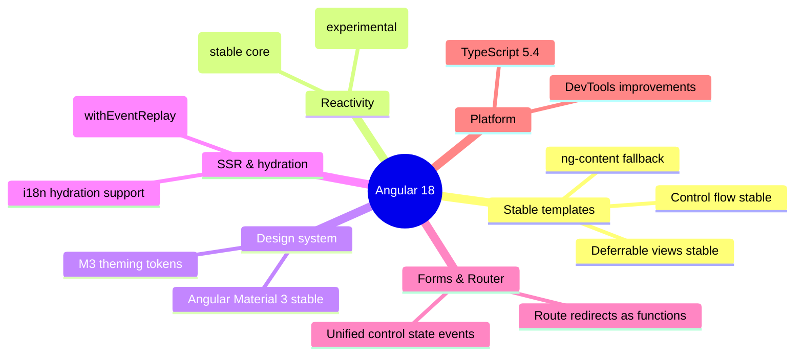
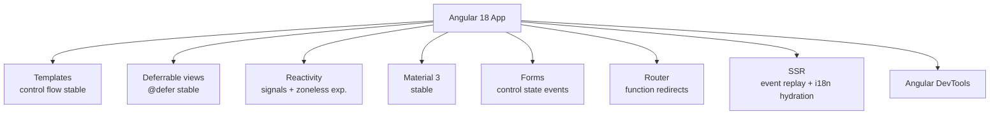
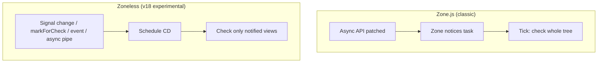
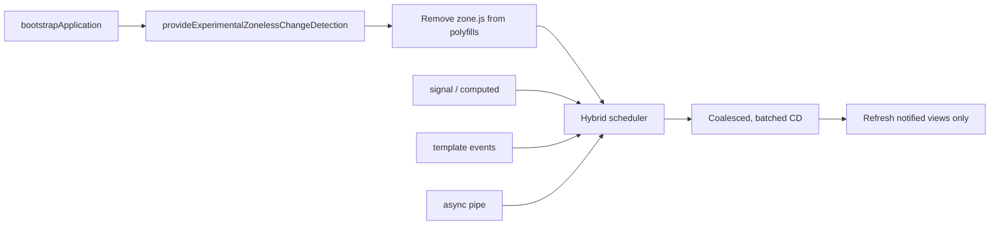
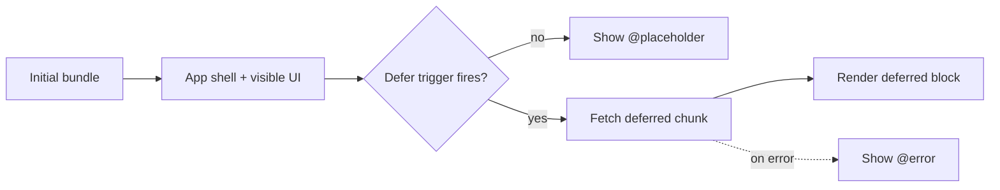

# Angular 18 - Complete Professional Guide

> **Category:** 14_frameworks · **Language:** English

---

### What's New in v18: Zoneless Change Detection (experimental), Material 3, Stable Deferrable Views & Control Flow, Event Replay, Unified Control State Events
**Edition for Angular v18.0 (released May 22, 2024)**

> **Reference book (English).** A professional, in-depth guide **focused on what's new in Angular 18**, for developers, architects, and teams already familiar with Angular. Based primarily on the official sources: the Angular release (https://github.com/angular/angular/releases/tag/18.0.0), angular.dev, and the v18 announcement on the Angular blog.
>
> **Scope notice:** this is a **version-focused** book. Rather than teaching Angular from scratch, it concentrates on the APIs that changed or stabilized in v18 — and the practical impact for production code and migrations. Each chapter follows the TO-BRAIN editorial standard (see `FILE_CONVENTIONS.md`).

---

## How to read this book

Progressive depth across five maturity levels, all centered on v18:

| Level | Profile | Parts |
|-------|---------|-------|
| 1 — Beginner (to v18) | Coming from older Angular | Part I |
| 2 — Intermediate | Reactivity: Signals, zoneless | Part II |
| 3 — Advanced | Control flow, deferrable views, Material 3 | Parts III–V |
| 4 — Specialist | Forms events, router, testing | Parts VI–VII |
| 5 — Enterprise | SSR, hydration, performance, production | Part VIII |

**Target audience:** Java and full-stack developers, software architects, frontend engineers, tech leads, and CTOs adopting or migrating to Angular 18.

**Structure of each chapter:** Introduction · Business context · Theoretical concepts · Architecture · Diagrams (Mermaid) · Real examples · Step by step · Complete code · Exercises · Challenges · Checklist · Best practices · Anti-patterns · Troubleshooting · Official references.

**Example format:** Scenario · Problem · Solution · Implementation · Result · Future improvements.

> **Note on prerequisites.** This book assumes working knowledge of standalone components, signals (`signal`, `computed`, `effect`), and the dependency-injection model introduced in earlier versions. Where a v18 feature builds on a prior one, we link the lineage.

---

## Table of Contents

**Part I – Angular 18 Overview & Foundations**
1. What's new in Angular 18 — the big picture
2. Zoneless change detection (experimental) — how it works with signals
3. Stable deferrable views & built-in control flow + Material 3

**Part II – Reactivity & Change Detection**
4. Signals deep dive in v18 (`signal`, `computed`, `effect`)
5. From Zone.js to zoneless — the migration path
6. Coalescing, hybrid scheduling, and performance

**Part III – Templates: Control Flow & Deferrable Views**
7. `@if` / `@for` / `@switch` in production
8. `@defer` triggers, prefetch, and placeholders
9. Default content projection (`ng-content` fallback)

**Part IV – Forms**
10. Unified control state change events (`events` observable)
11. Typed reactive forms patterns in v18
12. Custom controls and validation

**Part V – Material 3 & Components**
13. Migrating to Angular Material 3
14. Theming with the M3 design tokens

**Part VI – Router & Navigation**
15. Route redirects as functions
16. Router data, guards, and resolvers in v18

**Part VII – SSR, Hydration & Testing**
17. Event replay (`withEventReplay()`) and hydration
18. i18n hydration and testing strategies

**Part VIII – Enterprise & Production**
19. Performance and production best practices for v18
20. DevTools, debugging, and observability

> **Status of this edition:** phased delivery (each part keeps the same depth standard). **Ready:** Part I (Ch. 1–3). **In progress:** Parts II–VIII.

---

## Part I – Angular 18 Overview & Foundations

Part I gives you the strategic map of Angular 18. v18 is a **"stabilize-and-experiment"** release: features that were in developer preview for several versions (**deferrable views** and **built-in control flow**) become **stable**, **Angular Material 3** ships as stable, and the framework opens the door to its long-term reactivity goal with **experimental zoneless change detection**. Understanding which features are production-ready and which are still experimental is the difference between confidently adopting v18 and accidentally shipping a preview API.

---

## Chapter 1 — What's new in Angular 18 — the big picture

### 1.1 Introduction

Angular **v18.0.0** was released on **May 22, 2024**. It is a release defined by **graduation and experimentation**: the modern template syntax (`@if`, `@for`, `@switch`) and **deferrable views** (`@defer`) leave developer preview and become **stable**; **Angular Material 3** reaches stable; SSR gains **event replay** via `withEventReplay()` and improved hydration including **i18n block hydration support**; the Forms package adds a **unified control state change events** API; routing supports **redirects expressed as functions**; and — most strategically — Angular introduces **experimental zoneless change detection** via `provideExperimentalZonelessChangeDetection()`. This chapter is the executive overview — the mental map for the rest of the book.

### 1.2 Business context

For engineering leaders, a major Angular release raises three questions: *what do we gain, what is safe to adopt now, and what is still experimental?* v18 answers crisply. You gain **stable, first-class template control flow and lazy `@defer` blocks** (less ceremony, better performance, smaller bundles), a **stable Material 3** design system, and **faster, more reliable SSR** through event replay and hydration. The most forward-looking item — **zoneless change detection** — is **experimental**: a strategic signal of where Angular is heading (signals-first reactivity without Zone.js) that teams can prototype today but should not yet rely on in production. The strategic read: adopt the now-stable features broadly, and treat zoneless as an investment in future performance.

### 1.3 Theoretical concepts: the themes of v18



The unifying direction: **make the modern, signal-friendly path stable and ergonomic**, while opening an experimental door to a **zoneless future** built on signals.

### 1.4 Architecture: where each change lives



### 1.5 Real example

**Scenario.** A team maintains a medium Angular 17 app and wants to understand, at a glance, what adopting v18 means in code.

**Problem.** The "what's new" list is long; the team needs a single before/after that captures the spirit of v18.

**Solution.** A compact comparison of the most visible changes.

**Implementation (before/after sketch):**

```typescript
// Angular 17 (typical)
@Component({
  selector: 'app-users',
  standalone: true,
  // @if/@for were in developer preview; @defer in developer preview
  template: `
    @if (users().length) {
      @for (u of users(); track u.id) { <p>{{ u.name }}</p> }
    }
  `,
})
export class UsersComponent {
  readonly users = signal<User[]>([]);
}
```

```typescript
// Angular 18
@Component({
  selector: 'app-users',
  standalone: true,
  // @if/@for/@switch and @defer are now STABLE — production-ready
  template: `
    @if (users().length) {
      @for (u of users(); track u.id) { <p>{{ u.name }}</p> }
    } @else {
      <p>No users yet.</p>
    }

    @defer (on viewport) {
      <app-heavy-chart [data]="users()" />
    } @placeholder {
      <p>Scroll to load chart…</p>
    }
  `,
})
export class UsersComponent {
  readonly users = signal<User[]>([]);
}
```

```typescript
// Optional, experimental: opt into zoneless change detection
bootstrapApplication(AppComponent, {
  providers: [provideExperimentalZonelessChangeDetection()],
});
```

**Result.** The same app, now relying on stable control flow and lazy `@defer` blocks, with an experimental path toward zoneless reactivity available for prototyping.

**Future improvements.** Migrate to Material 3 (Part V), adopt event replay for SSR (Part VII), and prototype zoneless (Part II).

### 1.6 Exercises

1. List which two template feature families became *stable* in v18.
2. Name the function that enables experimental zoneless change detection.
3. Which design-system milestone shipped as stable in v18?

### 1.7 Challenges

- **Challenge.** For your current app, classify each v18 feature as "adopt now (stable)," "prototype only (experimental)," or "plan migration," and justify.

### 1.8 Checklist

- [ ] I can name the v18 stable template features (control flow, `@defer`).
- [ ] I know zoneless change detection is **experimental** in v18.
- [ ] I know Angular Material 3 is stable.
- [ ] I know SSR gained event replay and i18n hydration support.

### 1.9 Best practices

- Adopt the now-stable control flow and `@defer` broadly — they are production-ready and improve performance.
- Treat zoneless as a *prototype* in v18: validate your app and dependencies before considering it for production.
- Plan the Material 3 migration deliberately; it is a visual and theming change.

### 1.10 Anti-patterns

- Shipping `provideExperimentalZonelessChangeDetection()` to production without thorough validation — it is experimental.
- Avoiding the stable control flow because it "looks new" — it is the recommended, supported syntax.
- Treating Material 3 as a drop-in with no theming review.

### 1.11 Troubleshooting

| Symptom | Likely cause | Action |
|---------|--------------|--------|
| `@if`/`@for` not recognized | Old Angular/CLI version | Ensure v18 and rebuild |
| View doesn't update under zoneless | State not held in signals | Move mutable state into signals |
| Material components look different after upgrade | Material 3 theming defaults | Define an M3 theme explicitly |
| Hydration mismatch warnings | SSR markup differs from client | Audit non-deterministic rendering |

### 1.12 Official references

- Angular v18.0.0 release: https://github.com/angular/angular/releases/tag/18.0.0
- Angular blog — Angular v18 is now available: https://blog.angular.dev/angular-v18-is-now-available-e79d5ac0affe
- Zoneless guide: https://angular.dev/guide/experimental/zoneless
- Angular docs: https://angular.dev

---

## Chapter 2 — Zoneless change detection (experimental) — how it works with signals

### 2.1 Introduction

Angular 18 introduces **experimental zoneless change detection**, enabled with `provideExperimentalZonelessChangeDetection()`. Historically Angular relied on **Zone.js** to monkey-patch async APIs (timers, events, `Promise`, XHR) and notify the framework that "something might have changed," triggering change detection. Zoneless removes that dependency: instead of patching the world, Angular schedules change detection from **explicit notifications** — signal updates, `markForCheck`, bound events, async pipe emissions, and similar. This chapter explains the mechanism, why signals are central, and how to try it.

### 2.2 Business context

Zone.js carries a cost: bundle size, startup overhead, and subtle debugging difficulty (stack traces threading through patched async). Removing it promises **smaller bundles, faster startup, cleaner stack traces, better interoperability** with third-party libraries, and a more predictable performance model. For organizations, zoneless is a strategic direction; in v18 it is **experimental**, so the business value is in *evaluation and preparation* — measuring the benefit on your app and aligning your codebase (signal-driven state) so the eventual stable transition is cheap.

### 2.3 Theoretical concepts: notification-driven change detection

Under zoneless, change detection runs when the framework is **notified** of a potential change rather than because an async task completed. Sources of notification include:

- **Signal** reads/writes inside templates (a changed signal a template depends on schedules a refresh).
- `ChangeDetectorRef.markForCheck()`.
- Template **event bindings** firing.
- The **async pipe** emitting a new value.
- Setting a component **input** / certain host listener activity.



The mental shift: in zoneless, **your reactive primitives are the source of truth for "what changed."** Components built on signals and OnPush-friendly patterns work naturally; code that mutates fields outside the reactive system without notifying Angular may not refresh.

### 2.4 Architecture: enabling and structuring a zoneless app



### 2.5 Real example

**Scenario.** A team wants to prototype zoneless on a signal-based feature and verify it updates correctly.

**Problem.** They need to enable zoneless, remove Zone.js, and confirm a signal-driven component re-renders without Zone's "tick everything" behavior.

**Solution.** Provide the experimental zoneless provider, drop the Zone.js polyfill, and ensure state lives in signals.

**Implementation (step by step).**

```typescript
// main.ts — enable experimental zoneless change detection
import { bootstrapApplication } from '@angular/platform-browser';
import { provideExperimentalZonelessChangeDetection } from '@angular/core';
import { AppComponent } from './app/app.component';

bootstrapApplication(AppComponent, {
  providers: [
    provideExperimentalZonelessChangeDetection(),
  ],
});
```

```jsonc
// angular.json — remove the zone.js polyfill (zoneless does not need it)
// "polyfills": ["zone.js"]   ← delete this entry
"polyfills": []
```

```typescript
// counter.component.ts — signal-driven, refreshes under zoneless
import { Component, signal, computed } from '@angular/core';

@Component({
  selector: 'app-counter',
  standalone: true,
  template: `
    <button (click)="inc()">+1</button>
    <p>Count: {{ count() }} (doubled: {{ doubled() }})</p>
  `,
})
export class CounterComponent {
  protected readonly count = signal(0);
  protected readonly doubled = computed(() => this.count() * 2);
  protected inc() { this.count.update(c => c + 1); }
}
```

**Result.** The component updates on each click. Because the count is a **signal**, Angular is notified precisely when it changes and refreshes the view — without Zone.js patching the event. Stack traces are cleaner and the Zone.js polyfill is gone from the bundle.

**Future improvements.** Audit dependencies for Zone-reliant behavior (e.g., libraries assuming patched timers), and convert remaining mutable fields to signals before considering production.

### 2.6 Exercises

1. Name four sources that can notify Angular to run change detection under zoneless.
2. What polyfill should be removed when adopting zoneless?
3. Why are signals well-suited to a zoneless model?

### 2.7 Challenges

- **Challenge.** Take a small Zone-dependent component (state mutated in a `setTimeout`) and refactor it so it updates correctly under zoneless using signals.

### 2.8 Checklist

- [ ] Added `provideExperimentalZonelessChangeDetection()`.
- [ ] Removed `zone.js` from polyfills.
- [ ] Component state lives in signals (or uses `markForCheck`).
- [ ] Validated third-party libraries do not require Zone.js.

### 2.9 Best practices

- Keep component state in **signals** so notifications are precise and automatic.
- Use zoneless first in **new, isolated** features to measure impact before broad rollout.
- Measure bundle size and startup before/after to quantify the benefit.

### 2.10 Anti-patterns

- Mutating plain fields in async callbacks and expecting the view to refresh (no notification).
- Enabling zoneless in production in v18 (it is experimental).
- Mixing libraries that depend on patched Zone.js without testing.

### 2.11 Troubleshooting

| Symptom | Cause | Action |
|---------|-------|--------|
| View doesn't update after async work | No notification under zoneless | Use signals or call `markForCheck()` |
| Third-party widget stops updating | Library relied on Zone.js | Wrap state in signals or keep Zone for now |
| Tests behave differently | Test harness assumed Zone | Use zoneless-compatible test setup |
| No measurable benefit | App not signal-driven yet | Migrate state to signals first |

### 2.12 Official references

- Zoneless guide: https://angular.dev/guide/experimental/zoneless
- Angular blog — v18 (zoneless section): https://blog.angular.dev/angular-v18-is-now-available-e79d5ac0affe
- Signals guide: https://angular.dev/guide/signals

---

## Chapter 3 — Stable deferrable views & built-in control flow + Material 3

### 3.1 Introduction

Three template-and-design milestones reach **stable** in v18: the **built-in control flow** (`@if`, `@for`, `@switch`), **deferrable views** (`@defer`), and **Angular Material 3**. v18 also adds **fallback (default) content for `ng-content`**, so a projection slot can render default markup when nothing is projected. This chapter covers what "stable" means for each, the practical syntax, and how Material 3 changes theming.

### 3.2 Business context

Stability is what unblocks broad adoption: stable APIs come with the framework's backward-compatibility guarantees, so teams can build on them without fear of breaking changes between minors. Control flow and `@defer` directly improve **bundle size and perceived performance** (lazy-loading heavy UI on interaction or viewport). Material 3 brings the app's design system in line with Google's current design language and its **token-based theming**, improving consistency and customization. The business case: faster pages, modern UI, and supported APIs.

### 3.3 Theoretical concepts: the stable template toolkit

- **Built-in control flow.** `@if`/`@else`, `@for` (with mandatory `track`, plus `@empty`), and `@switch`/`@case`/`@default` — a compiler-level replacement for `*ngIf`/`*ngFor`/`*ngSwitch`, faster and ergonomic, now stable.
- **Deferrable views (`@defer`).** Lazily load a block and its dependencies on a **trigger** (`on idle`, `on viewport`, `on interaction`, `on hover`, `on timer`, `when <expr>`), with `@placeholder`, `@loading`, and `@error` sub-blocks and optional `prefetch`.
- **`ng-content` fallback.** A projection slot can declare **default content** that renders when the consumer projects nothing into that slot.

```mermaid
flowchart TB
    tmpl[Stable template syntax] --> cflow[Control flow @if/@for/@switch]
    tmpl --> deferb[@defer blocks]
    deferb --> trig[Triggers: idle/viewport/interaction/hover/timer/when]
    deferb --> subs[@placeholder / @loading / @error]
    deferb --> pre[prefetch]
    tmpl --> proj[ng-content default content]
```

### 3.4 Architecture: how @defer reduces the initial bundle



### 3.5 Real example

**Scenario.** A dashboard renders quickly but a heavy analytics widget and a card component slow the first paint.

**Problem.** The analytics widget should not be in the initial bundle, and the card needs a sensible default header when none is provided.

**Solution.** Wrap the widget in `@defer (on viewport)` with placeholders, and use `ng-content` fallback content in the card.

**Implementation.**

```typescript
// dashboard.component.ts
import { Component, signal } from '@angular/core';
import { AnalyticsWidgetComponent } from './analytics-widget.component';
import { CardComponent } from './card.component';

@Component({
  selector: 'app-dashboard',
  standalone: true,
  imports: [AnalyticsWidgetComponent, CardComponent],
  template: `
    @if (ready()) {
      <app-card>
        <!-- no header projected → fallback renders -->
        <p>Body content here.</p>
      </app-card>

      @defer (on viewport; prefetch on idle) {
        <app-analytics-widget />
      } @placeholder {
        <div class="skeleton">Loading analytics…</div>
      } @loading (after 100ms; minimum 500ms) {
        <div class="spinner">Fetching…</div>
      } @error {
        <p>Could not load analytics.</p>
      }
    } @else {
      <p>Preparing dashboard…</p>
    }
  `,
})
export class DashboardComponent {
  protected readonly ready = signal(true);
}
```

```typescript
// card.component.ts — ng-content fallback (default content projection)
import { Component } from '@angular/core';

@Component({
  selector: 'app-card',
  standalone: true,
  template: `
    <header>
      <!-- default content used if nothing is projected to [header] -->
      <ng-content select="[header]">Untitled card</ng-content>
    </header>
    <section>
      <ng-content></ng-content>
    </section>
  `,
})
export class CardComponent {}
```

**Result.** The analytics chunk loads only when the widget scrolls into view (prefetched during idle), shrinking the initial bundle and speeding first paint. The card shows "Untitled card" automatically when no header is projected.

**Future improvements.** Add more `@defer` triggers (e.g., `on interaction` for rarely used panels) and adopt Material 3 theming tokens across the dashboard.

### 3.6 Exercises

1. List the available `@defer` triggers in v18.
2. Which sub-block shows content while a deferred block is loading?
3. How do you provide default content for an `ng-content` slot?

### 3.7 Challenges

- **Challenge.** Convert a route's heaviest component to a `@defer` block with `prefetch on idle` and a skeleton placeholder, and measure the initial bundle difference.

### 3.8 Checklist

- [ ] Control flow (`@if`/`@for`/`@switch`) used in place of structural directives.
- [ ] `@for` blocks include a `track` expression.
- [ ] Heavy/optional UI wrapped in `@defer` with placeholders.
- [ ] `ng-content` slots provide fallback content where useful.
- [ ] Material 3 theme defined explicitly.

### 3.9 Best practices

- Always provide a meaningful `track` in `@for` to keep DOM updates efficient.
- Pair `@defer` triggers with prefetch to hide latency (e.g., `on viewport; prefetch on idle`).
- Use `@placeholder`/`@loading`/`@error` to keep the UI responsive during deferral.
- Adopt Material 3 with an explicit token-based theme rather than relying on defaults.

### 3.10 Anti-patterns

- Omitting `track` in `@for`, causing unnecessary DOM churn.
- Deferring critical, above-the-fold content (hurts perceived load).
- Treating Material 3 as a drop-in replacement without reviewing theming.

### 3.11 Troubleshooting

| Symptom | Cause | Action |
|---------|-------|--------|
| `@for` re-renders entire list | Missing/poor `track` | Track by a stable unique id |
| Deferred block never loads | Trigger condition never met | Verify trigger (`viewport`, `when`, etc.) |
| Flash of placeholder then content | No `minimum`/`after` on `@loading` | Tune `@loading (after; minimum)` |
| Material components unstyled | No M3 theme applied | Define and include an M3 theme |

### 3.12 Official references

- Built-in control flow: https://angular.dev/guide/templates/control-flow
- Deferrable views (`@defer`): https://angular.dev/guide/defer
- Content projection (`ng-content` fallback): https://angular.dev/guide/components/content-projection
- Angular Material: https://material.angular.io

---

> **End of Part I.** You now have the strategic map of Angular 18 (what's stable and what's experimental), a working understanding of **experimental zoneless change detection** and why signals are central to it, and a practical guide to the now-stable **control flow**, **deferrable views**, **`ng-content` fallback content**, and **Material 3**. **Part II — Reactivity & Change Detection** (Chapters 4–6) goes deeper into signals in v18, the Zone.js-to-zoneless migration path, and coalescing, hybrid scheduling, and performance.

<!--APPEND-PARTE-II-->
