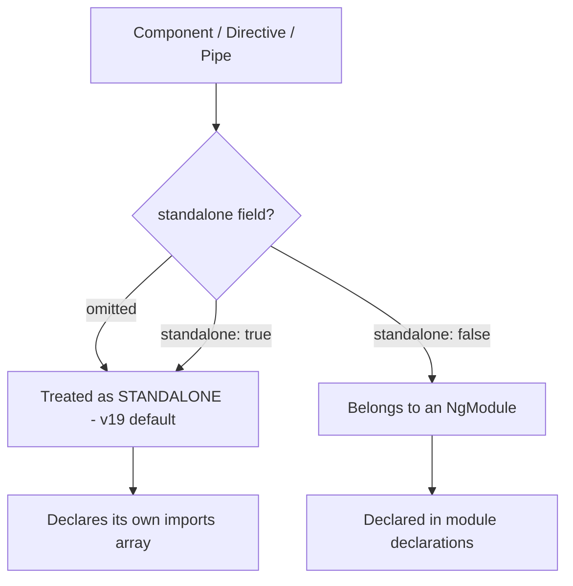
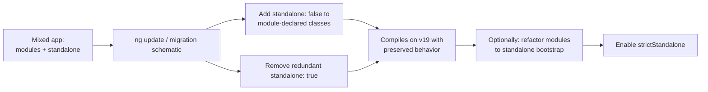
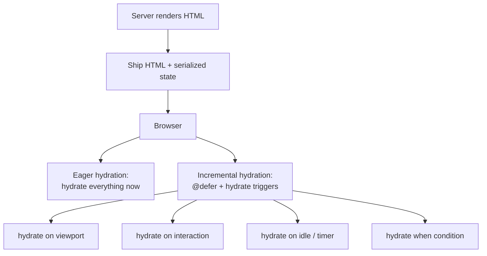

# Angular 19 - Complete Professional Guide

> **Category:** 14_frameworks · **Language:** English

---

### What's New in v19: Standalone by Default, Incremental Hydration, linkedSignal & resource(), @let, HMR, Event Replay by Default
**Edition for Angular v19.0 (released November 19, 2024)**

> **Reference book (English).** A professional, in-depth guide **focused on what's new in Angular 19**, for developers, architects, and teams already familiar with Angular. Based primarily on the official sources: angular.dev and the Angular v19 release (https://github.com/angular/angular/releases/tag/19.0.0).
>
> **Scope notice:** this is a **version-focused** book. Rather than teaching Angular from scratch, it concentrates on the APIs that changed or stabilized in v19 — and the practical impact for production code and migrations. Each chapter follows the TO-BRAIN editorial standard (see `FILE_CONVENTIONS.md`).

---

## How to read this book

Progressive depth across five maturity levels, all centered on v19:

| Level | Profile | Parts |
|-------|---------|-------|
| 1 — Beginner (to v19) | Coming from older Angular | Part I |
| 2 — Intermediate | Reactivity: signals, resources | Part II |
| 3 — Advanced | Templates, SSR, hydration | Parts III–V |
| 4 — Specialist | Routing, tooling, DX | Parts VI–VII |
| 5 — Enterprise | Performance, security, production | Part VIII |

**Target audience:** Java and full-stack developers, software architects, frontend engineers, tech leads, and CTOs adopting or migrating to Angular 19.

**Structure of each chapter:** Introduction · Business context · Theoretical concepts · Architecture · Diagrams (Mermaid) · Real examples · Step by step · Complete code · Exercises · Challenges · Checklist · Best practices · Anti-patterns · Troubleshooting · Official references.

**Example format:** Scenario · Problem · Solution · Implementation · Result · Future improvements.

> **Note on prerequisites.** This book assumes working knowledge of standalone components, signals (`signal`, `computed`, `effect`), and the modern Angular control flow (`@if`, `@for`, `@switch`, `@defer`) introduced in earlier versions. Where a v19 feature builds on a prior one, we link the lineage.

---

## Table of Contents

**Part I – Angular 19 Overview & Standalone Migration**
1. What's new in Angular 19 — the big picture
2. Standalone by default + the standalone migration
3. Incremental hydration & route-level render mode

**Part II – Reactivity: Signals Evolved**
4. `linkedSignal()` — writable derived state
5. `resource()` and `rxResource()` for async data
6. `effect()` stabilized and timing changes

**Part III – Templates & DX**
7. `@let` template variables
8. Hot Module Replacement (HMR) by default
9. Template & compiler refinements

**Part IV – Server-Side Rendering**
10. Incremental hydration in depth (`@defer` + `hydrate`)
11. Event replay by default (`withEventReplay()`)
12. Route-level render mode (server/client/prerender)

**Part V – Components & DI**
13. Standalone APIs and bootstrapping
14. Dependency injection refinements

**Part VI – Routing & Navigation**
15. Router updates and hybrid rendering routes
16. Lazy loading with standalone

**Part VII – Tooling, CLI & Testing**
17. CLI updates and `strictStandalone`
18. Testing standalone and signal-based code

**Part VIII – Enterprise & Production**
19. Security and SSR hardening
20. Performance and production best practices for v19

> **Status of this edition:** phased delivery (each part keeps the same depth standard). **Ready:** Part I (Ch. 1–3). **In progress:** Parts II–VIII.

---

# Part I – Angular 19 Overview & Standalone Migration

Part I gives you the strategic map of Angular 19 and a concrete migration path. v19 is a **"standalone-by-default"** release: standalone components — the recommended authoring model for several versions — become the **default**, and the compiler now treats every component, directive, and pipe as standalone unless you opt out. Alongside this, v19 ships **incremental hydration**, **route-level render mode**, new reactive primitives (`linkedSignal()`, `resource()`), the `@let` template syntax, **HMR by default**, and **event replay on by default** for SSR. Understanding which behaviors flipped — and how the automated migration helps — is the difference between a smooth upgrade and a confusing one.

---

## Chapter 1 — What's new in Angular 19 — the big picture

### 1.1 Introduction

Angular **v19.0** was released on **November 19, 2024**. It is the release where the framework's long modernization arc reaches a milestone: **standalone components become the default**. The compiler now treats components, directives, and pipes as standalone unless you explicitly set `standalone: false`, and an automatic migration plus a new `strictStandalone` flag help teams adopt and enforce the model. v19 also brings **incremental hydration** (developer preview), **route-level render mode** for hybrid SSR, the experimental **`linkedSignal()`** and **`resource()`/`rxResource()`** APIs, the **`@let`** template variable, **hot module replacement (HMR)** for templates and styles enabled by default, and **event replay** turned on by default for server-side rendering. This chapter is the executive overview — the mental map you'll use to navigate the rest of the book.

### 1.2 Business context

For engineering leaders, a major Angular release raises three questions: *what do we gain, what changes, and how much will the upgrade cost?* v19's theme answers them clearly: you gain a **simpler, less ceremonious authoring model** (no more `standalone: true` boilerplate, no more `NgModule` for new code), **faster perceived performance** (incremental hydration streams interactivity where users need it), and a **better developer experience** (HMR, `@let`). The cost is modest: a TypeScript 5.6 bump and a behavior flip around standalone that ships with an **automated migration**. Strategically, v19 lowers long-term maintenance cost by making the modern, recommended path the default path.

### 1.3 Theoretical concepts: the five themes of v19

```mermaid
mindmap
  root((Angular 19))
    Standalone by default
      No standalone: true needed
      standalone: false to opt out
      Auto migration
      strictStandalone flag
    Faster SSR
      Incremental hydration (preview)
      Event replay default
      Route-level render mode
    Reactivity evolves
      linkedSignal() (experimental)
      resource() / rxResource() (experimental)
      effect() stabilized
    Template & DX
      @let variables
      HMR by default
    Platform
      TypeScript 5.6
```

The unifying direction: **make the modern Angular the default Angular** — standalone authoring, signal-based reactivity, and streamed, interactive SSR — while keeping legacy paths working through opt-outs and a guided migration.

### 1.4 Architecture: where each change lives

```mermaid
flowchart TB
    app[Angular 19 App] --> sa[Authoring model<br/>standalone default]
    app --> react[Reactivity<br/>linkedSignal / resource]
    app --> tmpl[Templates<br/>@let]
    app --> dx[Dev experience<br/>HMR default]
    app --> ssr[SSR<br/>incremental hydration]
    app --> replay[SSR<br/>event replay default]
    app --> render[Routing<br/>route-level render mode]
    app --> ts[Platform<br/>TypeScript 5.6]
```

### 1.5 Real example

**Scenario.** A team maintains a medium Angular 18 app and wants to understand, at a glance, what adopting v19 means in code.

**Problem.** The "what's new" list is long; the team needs a single before/after that captures the spirit of v19.

**Solution.** A compact comparison of the most visible changes.

**Implementation (before/after sketch):**

```typescript
// Angular 18 (typical)
@Component({
  selector: 'app-users',
  standalone: true,            // had to opt in explicitly
  imports: [UserCardComponent],
  template: `
    @for (u of users(); track u.id) {
      <app-user-card [user]="u" />
    }
  `,
})
export class UsersComponent {
  protected readonly users = signal<User[]>([]);
}
```

```typescript
// Angular 19
@Component({
  selector: 'app-users',
  // standalone is the DEFAULT now — no flag needed
  imports: [UserCardComponent],
  template: `
    @let count = users().length;          {{/* new @let variable */}}
    <p>{{ count }} users</p>
    @for (u of users(); track u.id) {
      <app-user-card [user]="u" />
    }
  `,
})
export class UsersComponent {
  protected readonly users = signal<User[]>([]);
}
```

**Result.** Less ceremony (no `standalone: true`), a cleaner template thanks to `@let`, and — once SSR is enabled — incremental hydration and event replay improve perceived performance with no template rewrite.

**Future improvements.** Adopt `resource()` for async data (Part II) and turn on incremental hydration with `@defer ... hydrate` triggers (Part IV).

### 1.6 Exercises

1. List the five themes of v19 and state what each one improves.
2. Which two SSR features are turned on or available by default in v19?
3. Name the two experimental reactive APIs introduced in v19.

### 1.7 Challenges

- **Challenge.** For your current app, classify each v19 theme as "free win," "needs migration," or "experimental / evaluate," and justify.

### 1.8 Checklist

- [ ] I can name the five themes of v19.
- [ ] I know standalone is now the default authoring model.
- [ ] I know incremental hydration and route-level render mode exist.
- [ ] I know `linkedSignal()` and `resource()` are experimental.
- [ ] I know v19 requires TypeScript 5.6.

### 1.9 Best practices

- Read v19 as a *defaults & DX* release: the biggest wins come from dropping `standalone: true`, enabling HMR, and (for SSR apps) incremental hydration.
- Treat `linkedSignal()` and `resource()` as **experimental** — try them in non-critical paths first.
- Adopt `@let` to simplify templates that repeat the same expression.

### 1.10 Anti-patterns

- Keeping `standalone: true` everywhere after upgrading (now redundant noise) instead of running the migration.
- Shipping experimental APIs (`resource`, `linkedSignal`) into critical production paths without a fallback plan.
- Enabling incremental hydration without measuring whether your app benefits.

### 1.11 Troubleshooting

| Symptom | Likely cause | Action |
|---------|--------------|--------|
| Compiler errors about NgModule declarations | Component is now standalone by default | Set `standalone: false` or move it out of the module |
| `standalone: true` flagged as unnecessary | It's the default in v19 | Remove the flag (or run the migration) |
| Type errors after upgrade | v19 requires TypeScript 5.6 | Upgrade TypeScript to 5.6 |
| Hydration mismatch warnings | SSR markup differs from client render | Ensure deterministic rendering; see Part IV |

### 1.12 Official references

- Angular v19 release (Angular blog): https://blog.angular.dev/meet-angular-v19-7b29dfd05b84
- Angular v19.0.0 release notes: https://github.com/angular/angular/releases/tag/19.0.0
- Angular documentation: https://angular.dev
- Standalone components guide: https://angular.dev/guide/components/importing

---

## Chapter 2 — Standalone by default + the standalone migration

### 2.1 Introduction

The headline change in v19 is that **standalone is the default**. You no longer write `standalone: true` on components, directives, or pipes — the compiler assumes standalone unless you explicitly opt out with `standalone: false`. To make the transition smooth, Angular provides an **automatic schematic** (run via `ng update` / `ng generate`) and a new `strictStandalone` compiler flag that forbids non-standalone declarations. This chapter explains the behavior flip, how the migration rewrites your code, and how to enforce the new model going forward.

### 2.2 Business context

The standalone model removes `NgModule` boilerplate, makes dependencies explicit per component, and simplifies lazy loading and testing. Making it the default reduces onboarding friction for new hires (less framework-specific ceremony to learn) and shrinks the surface area for mistakes. Knowing exactly what the migration touches lets teams size the upgrade accurately and adopt `strictStandalone` to prevent regressions.

### 2.3 Theoretical concepts: the standalone default



Key points:

- **Default flip.** Omitting `standalone` now means *standalone*. In earlier versions, omitting it meant *not standalone* (module-declared).
- **Opt-out.** Components that still belong to an `NgModule` must set `standalone: false`. The migration adds this automatically where needed.
- **`strictStandalone`.** A compiler option (`angularCompilerOptions.strictStandalone`) that makes the compiler reject any declaration with `standalone: false`, enforcing a fully standalone codebase.

### 2.4 Architecture: how the migration transforms a codebase



### 2.5 Real example

**Scenario.** A team upgrades an Angular 18 app that mixes `NgModule`-declared components with newer standalone ones, and wants to land on v19 cleanly.

**Problem.** After the default flips, module-declared components would be (incorrectly) treated as standalone and fail to compile unless explicitly marked.

**Solution.** Run the automatic migration, which marks module-declared classes with `standalone: false` and strips redundant `standalone: true` from already-standalone ones.

**Implementation (before/after the migration):**

```typescript
// Angular 18 — declared inside a feature NgModule (no standalone field)
@Component({
  selector: 'app-legacy-widget',
  template: `<div>...</div>`,
})
export class LegacyWidgetComponent {}

@NgModule({
  declarations: [LegacyWidgetComponent],
  exports: [LegacyWidgetComponent],
})
export class WidgetModule {}
```

```typescript
// Angular 19 — migration adds standalone: false to preserve module membership
@Component({
  selector: 'app-legacy-widget',
  standalone: false,            // ← added by the migration
  template: `<div>...</div>`,
})
export class LegacyWidgetComponent {}

@NgModule({
  declarations: [LegacyWidgetComponent],
  exports: [LegacyWidgetComponent],
})
export class WidgetModule {}
```

```typescript
// A purely standalone component: redundant flag removed by the migration
@Component({
  selector: 'app-toolbar',
  // standalone: true            ← removed (it's the default now)
  imports: [MatButtonModule],
  template: `<button mat-button>Save</button>`,
})
export class ToolbarComponent {}
```

```jsonc
// tsconfig.json — enforce a fully standalone codebase going forward
{
  "angularCompilerOptions": {
    "strictStandalone": true
  }
}
```

**Result.** The app compiles on v19 with identical behavior: legacy module components keep working (now explicitly `standalone: false`), and new code is cleaner without the redundant flag. Teams that fully migrated their modules can flip `strictStandalone` on to lock in the standalone model.

**Future improvements.** Incrementally retire `NgModule`s by converting feature modules to standalone bootstrapping (`bootstrapApplication`) and route-level lazy imports, then enable `strictStandalone`.

### 2.6 Exercises

1. In v19, what does omitting the `standalone` field mean for a component?
2. What does the migration add to a component that was declared inside an `NgModule`?
3. What does `strictStandalone` enforce?

### 2.7 Challenges

- **Challenge.** Audit your app: count components that still set `standalone: false`, and draft a plan to convert their modules to standalone bootstrapping so you can enable `strictStandalone`.

### 2.8 Checklist

- [ ] Ran the standalone migration via `ng update` / the schematic.
- [ ] Module-declared classes are marked `standalone: false`.
- [ ] Redundant `standalone: true` flags removed.
- [ ] Decided whether to enable `strictStandalone`.
- [ ] App compiles and behaves as before on v19.

### 2.9 Best practices

- Let the migration do the mechanical work; review the diff to confirm intent.
- For new code, never write `standalone: true` — it's the default.
- Once your modules are gone, turn on `strictStandalone` to prevent backsliding.

### 2.10 Anti-patterns

- Hand-editing every component to add `standalone: false` instead of running the migration.
- Leaving `standalone: true` everywhere as dead noise after upgrading.
- Enabling `strictStandalone` before actually removing module-declared components (build breaks).

### 2.11 Troubleshooting

| Symptom | Cause | Action |
|---------|-------|--------|
| "Component is standalone but declared in NgModule" | Default flipped; class still in `declarations` | Add `standalone: false` (or run the migration) |
| `strictStandalone` build fails | A declaration still uses `standalone: false` | Convert it to standalone or postpone the flag |
| Unused import warnings after migration | Component no longer needs an `NgModule` import | Remove the obsolete module import |
| Pipe/directive not found in template | It's standalone now but not in `imports` | Add it to the component's `imports` array |

### 2.12 Official references

- Standalone components: https://angular.dev/guide/components/importing
- Migrate to standalone: https://angular.dev/reference/migrations/standalone
- Angular v19 release (Angular blog): https://blog.angular.dev/meet-angular-v19-7b29dfd05b84
- Angular CLI `ng update`: https://angular.dev/cli/update

---

## Chapter 3 — Incremental hydration & route-level render mode

### 3.1 Introduction

v19 advances Angular's server-side rendering story with two complementary features. **Incremental hydration** (developer preview) lets you defer hydrating parts of a server-rendered page until they're needed, using `@defer` blocks with `hydrate` triggers — so the browser does less work up front and interactivity arrives where users actually engage. **Route-level render mode** lets you choose, per route, whether to **server-render**, **client-render**, or **prerender** — enabling true hybrid rendering. Together they give fine-grained control over how each part of an app reaches the user. This chapter explains both, with the configuration and code to enable them.

### 3.2 Business context

SSR improves first paint and SEO, but full eager hydration can be wasteful — the client re-executes work for content the user may never interact with. Incremental hydration trims that cost, improving interaction readiness (TBT/INP) on content-heavy pages. Route-level render mode lets teams optimize per page: marketing pages can be prerendered for speed and SEO, dashboards server-rendered for fresh data, and highly dynamic tools client-rendered. The business payoff is better Core Web Vitals and lower server/client cost without an all-or-nothing rendering decision.

### 3.3 Theoretical concepts: hydration triggers and render modes



Key concepts:

- **`withIncrementalHydration()`** is added to the SSR providers (alongside `provideClientHydration()`) to enable the feature.
- **`@defer` with `hydrate` triggers.** Blocks annotated with `@defer (hydrate on viewport)` (or `interaction`, `idle`, `timer`, `when`, etc.) are server-rendered but only hydrated when the trigger fires.
- **Route-level render mode.** Server routing config assigns each route a `RenderMode` of `Server`, `Client`, or `Prerender`, producing a hybrid app.

### 3.4 Architecture: hybrid rendering pipeline

```mermaid
flowchart LR
    req[Request for route] --> route{Route render mode}
    route -->|Prerender| pre[Static HTML at build time]
    route -->|Server| srv[SSR per request]
    route -->|Client| cli[Empty shell + client render]
    pre --> hyd[Incremental hydration on client]
    srv --> hyd
    hyd --> defer[@defer hydrate triggers<br/>hydrate on demand]
```

### 3.5 Real example

**Scenario.** A content page server-renders a long article plus a heavy comments widget far below the fold; eager hydration of the comments slows interaction readiness.

**Problem.** The team wants the article instantly interactive while deferring the cost of hydrating the comments until the user scrolls to them.

**Solution.** Enable incremental hydration and wrap the comments in a `@defer` block with a `hydrate on viewport` trigger; set the route's render mode to `Server`.

**Implementation:**

```typescript
// app.config.server.ts — enable incremental hydration
import { mergeApplicationConfig, ApplicationConfig } from '@angular/core';
import {
  provideClientHydration,
  withIncrementalHydration,
  withEventReplay,
} from '@angular/platform-browser';

const serverConfig: ApplicationConfig = {
  providers: [
    provideClientHydration(
      withIncrementalHydration(),  // developer preview
      withEventReplay(),           // on by default in v19; shown for clarity
    ),
  ],
};
```

```typescript
// app.routes.server.ts — route-level render mode (hybrid SSR)
import { RenderMode, ServerRoute } from '@angular/ssr';

export const serverRoutes: ServerRoute[] = [
  { path: '', renderMode: RenderMode.Prerender },        // marketing home
  { path: 'article/:id', renderMode: RenderMode.Server }, // fresh, SSR
  { path: 'app/**', renderMode: RenderMode.Client },      // dynamic tool
];
```

```typescript
// article.component.ts — defer-hydrated comments
@Component({
  selector: 'app-article',
  imports: [CommentsComponent],
  template: `
    @let title = article().title;
    <h1>{{ title }}</h1>
    <article [innerHTML]="article().body"></article>

    @defer (hydrate on viewport) {
      <app-comments [articleId]="article().id" />
    } @placeholder {
      <p>Comments load when you scroll here…</p>
    }
  `,
})
export class ArticleComponent {
  protected readonly article = input.required<Article>();
}
```

**Result.** The article is interactive immediately; the comments widget is server-rendered for SEO and first paint but only hydrated when it scrolls into view, reducing the initial JavaScript work and improving interaction readiness. The home route is prerendered for maximum speed, and the dynamic app section is client-rendered.

**Future improvements.** Profile other below-the-fold widgets and apply `hydrate on interaction` or `hydrate on idle`; revisit each route's render mode as data-freshness needs evolve.

### 3.6 Exercises

1. Which provider enables incremental hydration, and where is it added?
2. List three `hydrate` triggers usable on a `@defer` block.
3. Name the three values of route-level `RenderMode`.

### 3.7 Challenges

- **Challenge.** For an existing SSR page, identify the most expensive below-the-fold component and convert it to a `@defer (hydrate on viewport)` block; measure the change in interaction readiness.

### 3.8 Checklist

- [ ] Added `withIncrementalHydration()` to the server hydration providers.
- [ ] Wrapped deferred regions in `@defer` with appropriate `hydrate` triggers.
- [ ] Assigned a `RenderMode` to each server route.
- [ ] Verified no hydration mismatch warnings.
- [ ] Measured interaction readiness before/after.

### 3.9 Best practices

- Start incremental hydration with clearly below-the-fold, heavy components.
- Choose the cheapest correct trigger (`viewport`/`idle`) over eager hydration.
- Match each route's render mode to its data-freshness and SEO needs.

### 3.10 Anti-patterns

- Wrapping everything in `@defer ... hydrate` indiscriminately — adds complexity with little gain.
- Using `RenderMode.Client` for SEO-critical pages.
- Introducing non-deterministic rendering that causes hydration mismatches.

### 3.11 Troubleshooting

| Symptom | Cause | Action |
|---------|-------|--------|
| Deferred block hydrates immediately | No / wrong `hydrate` trigger | Use an explicit trigger like `hydrate on viewport` |
| Hydration mismatch warnings | Server and client render differently | Make rendering deterministic; avoid `Date.now()`/random in markup |
| Route not prerendered as expected | Missing or wrong `RenderMode` | Set `RenderMode.Prerender` on that server route |
| Incremental hydration has no effect | Provider not registered | Add `withIncrementalHydration()` to `provideClientHydration()` |

### 3.12 Official references

- Incremental hydration: https://angular.dev/guide/incremental-hydration
- Hydration overview: https://angular.dev/guide/hydration
- Hybrid rendering & server routes: https://angular.dev/guide/hybrid-rendering
- Deferrable views (`@defer`): https://angular.dev/guide/templates/defer

---

> **End of Part I.** You now have the strategic map of Angular 19 (what's new and why), a deep look at the **standalone-by-default** flip and its automatic migration, and a practical guide to **incremental hydration** plus **route-level render mode** for hybrid SSR. **Part II — Reactivity: Signals Evolved** (Chapters 4–6) dives into the experimental `linkedSignal()` for writable derived state, the `resource()`/`rxResource()` APIs for async data, and the stabilized `effect()` with its updated timing.

<!--APPEND-PARTE-II-->
