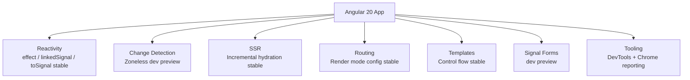
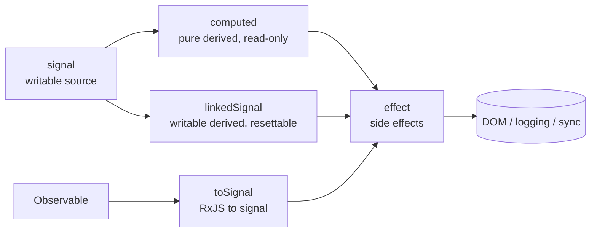
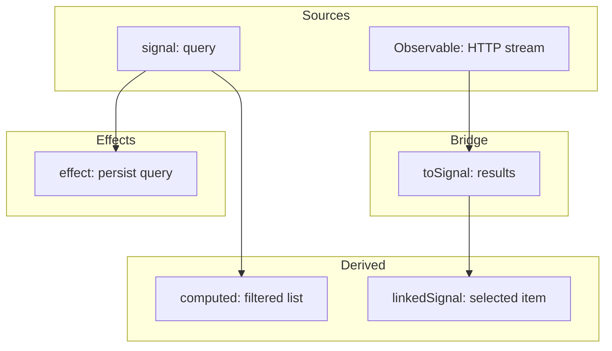
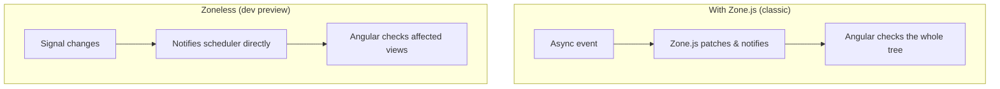
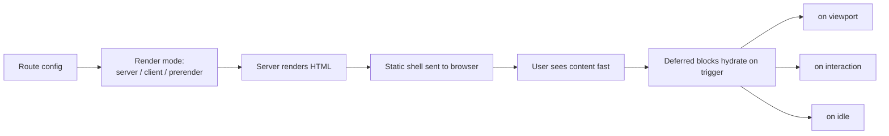

# Angular 20 - Complete Professional Guide

> **Category:** 14_frameworks · **Language:** English

---

### What's New in v20: Stable Signals (effect, linkedSignal, toSignal), Zoneless Developer Preview, Stable Incremental Hydration, Signal Forms Preview
**Edition for Angular v20.0 (released May 28, 2025)**

> **Reference book (English).** A professional, in-depth guide **focused on what's new in Angular 20**, for developers, architects, and teams already familiar with Angular. Based primarily on the official sources: the Angular team's release announcement (https://blog.angular.dev) and the framework documentation at angular.dev.
>
> **Scope notice:** this is a **version-focused** book. Rather than teaching Angular from scratch, it concentrates on the APIs that changed or stabilized in v20 — and the practical impact for production code and migrations. Each chapter follows the TO-BRAIN editorial standard (see `FILE_CONVENTIONS.md`).

---

## How to read this book

Progressive depth across five maturity levels, all centered on v20:

| Level | Profile | Parts |
|-------|---------|-------|
| 1 — Beginner (to v20) | Coming from older Angular | Part I |
| 2 — Intermediate | Reactivity: the stable Signals API | Part II |
| 3 — Advanced | Zoneless, hydration, render modes | Parts III–V |
| 4 — Specialist | Signal Forms preview, testing, DevTools | Parts VI–VII |
| 5 — Enterprise | Performance, SSR, production adoption | Part VIII |

**Target audience:** Java and full-stack developers, software architects, frontend engineers, tech leads, and CTOs adopting or migrating to Angular 20.

**Structure of each chapter:** Introduction · Business context · Theoretical concepts · Architecture · Diagrams (Mermaid) · Real examples · Step by step · Complete code · Exercises · Challenges · Checklist · Best practices · Anti-patterns · Troubleshooting · Official references.

**Example format:** Scenario · Problem · Solution · Implementation · Result · Future improvements.

> **Note on prerequisites.** This book assumes working knowledge of standalone components, basic signals (`signal`, `computed`), and the modern Angular control flow (`@if`, `@for`, `@switch`, `@defer`) introduced in earlier versions. Where a v20 feature builds on a prior one, we link the lineage.

---

## Table of Contents

**Part I – Angular 20 Overview & Reactivity Foundations**
1. What's new in Angular 20 — the big picture
2. The stable Signals API (`effect`, `linkedSignal`, `toSignal`)
3. Zoneless (developer preview) & stable incremental hydration

**Part II – Reactivity in Depth**
4. Effects, cleanup, and the reactive graph
5. Derived state with `computed` and `linkedSignal`
6. Bridging RxJS and signals with `toSignal` / `toObservable`

**Part III – Change Detection & Zoneless**
7. How zoneless change detection works
8. Migrating an app to `provideZonelessChangeDetection()`
9. Hybrid and incremental adoption strategies

**Part IV – SSR & Hydration**
10. Incremental hydration (stable)
11. Route-level render mode configuration
12. SSR performance and caching

**Part V – Templates & Control Flow**
13. Built-in control flow (fully stable)
14. Template ergonomics and compiler improvements
15. Defer, placeholders, and loading strategy

**Part VI – Signal Forms (developer preview)**
16. Signal Forms fundamentals
17. Validation and custom controls

**Part VII – Tooling, Testing & DevTools**
18. Angular DevTools & Chrome DevTools custom reporting
19. Testing signals and zoneless components

**Part VIII – Enterprise & Production**
20. Performance, bundles, and production adoption of v20

> **Status of this edition:** phased delivery (each part keeps the same depth standard). **Ready:** Part I (Ch. 1–3). **In progress:** Parts II–VIII.

---

## Part I – Angular 20 Overview & Reactivity Foundations

Part I gives you the strategic map of Angular 20 and the reactive foundations the rest of the book builds on. v20 is a **"reactivity matures"** release: the **Signals API stabilizes** (`effect`, `linkedSignal`, `toSignal` are production-ready), **zoneless change detection** advances to **developer preview**, **incremental hydration** and **route-level render modes** become **stable**, **built-in control flow** is fully stable, and **Signal Forms** arrives in **developer preview**. Understanding what graduated to stable — and what's still preview — is the difference between adopting confidently and adopting prematurely.

---

## Chapter 1 — What's new in Angular 20 — the big picture

### 1.1 Introduction

Angular **v20.0** was released on **May 28, 2025**, roughly **seven months after v19**. It is a consolidation release for the framework's signal-first direction: the **Signals API graduates to stable** (`effect`, `linkedSignal`, and `toSignal` are now production-ready), **zoneless change detection** lands in **developer preview** via `provideZonelessChangeDetection()`, **incremental hydration** and **route-level render mode configuration** become **stable**, the **built-in control flow** (`@if`, `@for`, `@switch`) is **fully stable**, and **Signal-based Forms** ships as a **developer preview**. The release also brings performance improvements (faster builds, smaller bundles, better SSR) and tooling upgrades, including Chrome DevTools custom Angular reporting. This chapter is the executive overview — the mental map you'll use to navigate the rest of the book.

### 1.2 Business context

For engineering leaders, a release like v20 answers a key question: *which experimental features are now safe to standardize on?* v20's value is **stability**: the reactive primitives teams have been piloting (`effect`, `linkedSignal`, `toSignal`) are now officially production-ready, so they can become the default building blocks for new code without the risk of breaking API changes. At the same time, the **developer-preview** features (zoneless, Signal Forms) let teams begin controlled experiments and provide feedback before they stabilize. The strategic read: v20 lets you **commit to signals as your reactive model today** while **previewing the zoneless future** at low risk.

### 1.3 Theoretical concepts: the themes of v20

```mermaid
mindmap
  root((Angular 20))
    Stable reactivity
      effect() stable
      linkedSignal() stable
      toSignal() stable
    Change detection
      Zoneless (developer preview)
      provideZonelessChangeDetection()
    SSR & hydration
      Incremental hydration stable
      Route-level render modes stable
    Templates
      Built-in control flow fully stable
    Forms
      Signal Forms (developer preview)
    Platform & tooling
      Faster builds, smaller bundles
      Better SSR performance
      Chrome DevTools custom reporting
```

The unifying direction: **signals as the production-ready reactive model**, with zoneless change detection and Signal Forms previewing the next step.

### 1.4 Architecture: where each change lives



### 1.5 Real example

**Scenario.** A team maintains an Angular 19 app and wants to understand, at a glance, what adopting v20 means in code.

**Problem.** The "what's new" list mixes *stable* and *preview* features; the team needs a single before/after that captures the spirit of v20.

**Solution.** A compact comparison of the most visible changes — what graduated to stable, and what is now available to preview.

**Implementation (before/after sketch):**

```typescript
// Angular 19 (typical)
@Component({
  selector: 'app-temp',
  template: `<p>{{ celsius() }}°C = {{ fahrenheit() }}°F</p>`
})
export class TempComponent {
  // effect / linkedSignal / toSignal were available but not yet stable
  protected readonly celsius = signal(20);
  protected readonly fahrenheit = computed(() => this.celsius() * 9 / 5 + 32);
}
```

```typescript
// Angular 20
@Component({
  selector: 'app-temp',
  template: `<p>{{ celsius() }}°C = {{ fahrenheit() }}°F</p>`
})
export class TempComponent {
  // effect(), linkedSignal(), toSignal() are now STABLE — production-ready
  protected readonly celsius = linkedSignal(() => 20); // resettable derived state
  protected readonly fahrenheit = computed(() => this.celsius() * 9 / 5 + 32);

  constructor() {
    effect(() => console.log('Temperature changed:', this.celsius()));
  }
}

// And, opt-in at bootstrap, the zoneless future is previewable:
bootstrapApplication(AppComponent, {
  providers: [provideZonelessChangeDetection()] // developer preview
});
```

**Result.** The same app, but built on **stable** reactive primitives, with the option to **preview** zoneless change detection at the application level.

**Future improvements.** Migrate async flows to `toSignal` (Part II), pilot zoneless (Part III), and experiment with Signal Forms (Part VI).

### 1.6 Exercises

1. List the three reactivity functions that became **stable** in v20.
2. Which two feature families shipped as **developer preview** in v20?
3. Name the provider function that enables zoneless change detection.

### 1.7 Challenges

- **Challenge.** For your current app, classify each v20 feature as "adopt now (stable)," "pilot (preview)," or "wait," and justify each decision.

### 1.8 Checklist

- [ ] I can name the stable reactivity APIs (`effect`, `linkedSignal`, `toSignal`).
- [ ] I know which features are developer preview (zoneless, Signal Forms).
- [ ] I know incremental hydration and route-level render modes are now stable.
- [ ] I know built-in control flow is fully stable.

### 1.9 Best practices

- Treat the now-stable Signals API as the default for **new** code immediately.
- Pilot developer-preview features (zoneless, Signal Forms) in isolated areas before standardizing.
- Adopt incremental hydration and render-mode configuration where they fit, since they are stable.

### 1.10 Anti-patterns

- Treating developer-preview features as production-ready and shipping them broadly without a fallback plan.
- Avoiding the stable Signals API out of habit, leaving new code on older reactive patterns.
- Conflating "stable" and "preview" features when planning the roadmap.

### 1.11 Troubleshooting

| Symptom | Likely cause | Action |
|---------|--------------|--------|
| `effect` warns about writing to signals | Writing to a signal inside an effect | Use `allowSignalWrites` deliberately or restructure with `computed`/`linkedSignal` |
| Derived value won't reset | Used `computed` where you need writable derived state | Switch to `linkedSignal` |
| Observable value undefined initially | `toSignal` has no initial value | Provide `initialValue` or `requireSync` |
| Zoneless app not updating | State changed outside a signal | Move state into signals; ensure notifications occur |

### 1.12 Official references

- Angular Blog — Angular v20 announcement: https://blog.angular.dev
- Angular documentation: https://angular.dev
- Signals guide: https://angular.dev/guide/signals
- Zoneless guide: https://angular.dev/guide/zoneless

---

## Chapter 2 — The stable Signals API (`effect`, `linkedSignal`, `toSignal`)

### 2.1 Introduction

The headline of Angular 20 is that the **Signals API is now stable**. Three functions that were previously experimental or in developer preview — **`effect`**, **`linkedSignal`**, and **`toSignal`** — are now **production-ready** with API stability guarantees. Together with the already-stable `signal` and `computed`, they complete the core reactive toolkit. This chapter explains what each one does, when to use it, and how they fit into the reactive graph.

### 2.2 Business context

API stability is what unlocks broad adoption. While a function is experimental, responsible teams hesitate to build core features on it, because a breaking change could ripple through the codebase. By stabilizing `effect`, `linkedSignal`, and `toSignal`, Angular 20 removes that risk and lets organizations standardize their reactivity patterns, write internal guidelines, and train teams — knowing the foundations won't shift underneath them.

### 2.3 Theoretical concepts: the reactive graph



- **`effect`** runs a side-effecting function whenever any signal it reads changes. It is for synchronizing reactive state with the outside world (logging, manual DOM, persisting to storage) — not for deriving values.
- **`linkedSignal`** creates **writable** state that is **derived** from a source: it recomputes from the source by default, but you can also write to it directly. Ideal for "default that the user can override," like a selected item that resets when the list changes.
- **`toSignal`** converts an `Observable` into a signal, subscribing automatically and unsubscribing when the injection context is destroyed — the idiomatic bridge from RxJS into the signal world.

### 2.4 Architecture: signals across a component



### 2.5 Real example

**Scenario.** A product list lets users type a search query, fetches matching products, and keeps a "selected" product that should reset whenever the results change.

**Problem.** The team needs writable derived state (the selection), a clean RxJS-to-signal bridge (the HTTP results), and a side effect (persisting the query) — all with stable APIs.

**Solution.** Use `signal` for the query, `toSignal` for the results, `linkedSignal` for the resettable selection, and `effect` for persistence.

**Implementation:**

```typescript
import { Component, signal, effect, linkedSignal, inject } from '@angular/core';
import { toSignal } from '@angular/core/rxjs-interop';
import { HttpClient } from '@angular/common/http';
import { debounceTime, switchMap } from 'rxjs/operators';
import { toObservable } from '@angular/core/rxjs-interop';

interface Product { id: number; name: string; }

@Component({
  selector: 'app-product-search',
  template: `
    <input [value]="query()" (input)="query.set($any($event.target).value)" />
    <ul>
      @for (p of results(); track p.id) {
        <li (click)="selected.set(p)" [class.active]="p === selected()">{{ p.name }}</li>
      }
    </ul>
    @if (selected(); as sel) { <p>Selected: {{ sel.name }}</p> }
  `
})
export class ProductSearchComponent {
  private readonly http = inject(HttpClient);

  // Writable source signal
  protected readonly query = signal('');

  // Bridge: RxJS pipeline -> stable signal
  protected readonly results = toSignal(
    toObservable(this.query).pipe(
      debounceTime(300),
      switchMap(q => this.http.get<Product[]>(`/api/products?q=${q}`))
    ),
    { initialValue: [] as Product[] }
  );

  // Writable derived state that RESETS when results change
  protected readonly selected = linkedSignal<Product[], Product | null>({
    source: this.results,
    computation: () => null
  });

  constructor() {
    // Side effect: persist the latest query
    effect(() => localStorage.setItem('lastQuery', this.query()));
  }
}
```

**Result.** A fully reactive search built entirely on stable v20 primitives: the selection automatically clears when new results arrive, the HTTP stream flows into a signal with automatic cleanup, and the query is persisted as a side effect.

**Future improvements.** Replace the manual `toObservable` + `switchMap` pipeline with a resource-style API as the project's data layer evolves, and migrate the form parts to Signal Forms (Part VI).

### 2.6 Exercises

1. Explain the difference between `computed` and `linkedSignal` in one sentence each.
2. Why does `toSignal` usually need an `initialValue` (or `requireSync`)?
3. Give one correct use of `effect` and one thing you should *not* do inside an effect.

### 2.7 Challenges

- **Challenge.** Refactor a component that currently uses an RxJS `BehaviorSubject` plus the `async` pipe to instead use `signal`, `toSignal`, and `linkedSignal`, and document the lines removed.

### 2.8 Checklist

- [ ] I know `effect`, `linkedSignal`, and `toSignal` are stable in v20.
- [ ] I use `computed` for pure derived state and `linkedSignal` for writable derived state.
- [ ] I use `toSignal` to bridge Observables, with an initial value or `requireSync`.
- [ ] I reserve `effect` for side effects, not for deriving values.

### 2.9 Best practices

- Prefer `computed` first; reach for `linkedSignal` only when you need to write to the derived value.
- Keep `effect` bodies small and side-effect-focused; clean up resources with the `onCleanup` callback.
- Convert Observables at the boundary with `toSignal` so the rest of the component reads signals.

### 2.10 Anti-patterns

- Using `effect` to compute and store derived state (use `computed`/`linkedSignal` instead).
- Writing to signals inside an `effect` without a clear, intentional reason.
- Subscribing to Observables manually in components when `toSignal` would handle subscription and cleanup.

### 2.11 Troubleshooting

| Symptom | Cause | Action |
|---------|-------|--------|
| Effect runs more often than expected | It reads more signals than intended | Read only the signals you depend on; split effects |
| `linkedSignal` always resets my edits | The source changes each cycle | Stabilize the source or use a plain `signal` |
| `toSignal` throws on `requireSync` | The source did not emit synchronously | Provide `initialValue` instead of `requireSync` |
| Memory leak from a subscription | Manual subscribe without cleanup | Use `toSignal`, which unsubscribes on destroy |

### 2.12 Official references

- Angular Signals guide: https://angular.dev/guide/signals
- `linkedSignal` API: https://angular.dev/guide/signals/linked-signal
- RxJS interop (`toSignal`/`toObservable`): https://angular.dev/ecosystem/rxjs-interop
- Angular Blog — Angular v20 announcement: https://blog.angular.dev

---

## Chapter 3 — Zoneless (developer preview) & stable incremental hydration

### 3.1 Introduction

Angular 20 advances two SSR- and performance-related stories. First, **zoneless change detection** moves to **developer preview**, enabled by `provideZonelessChangeDetection()`, letting apps run without Zone.js and rely on signals to trigger change detection. Second, **incremental hydration** becomes **stable**, and **route-level render mode configuration** is now stable as well. This chapter explains both: what zoneless changes about your runtime, and how stable incremental hydration improves the SSR experience.

### 3.2 Business context

Zone.js has long been Angular's mechanism for detecting changes, but it carries overhead and patches global APIs. Removing it (zoneless) promises smaller bundles, clearer debugging, and better interoperability — which is why teams want to pilot it. Meanwhile, incremental hydration directly improves perceived performance: the server-rendered HTML stays interactive sooner because the client hydrates pieces only as needed. For a business, that means **faster time-to-interactive** and **lower JavaScript cost**, both of which affect conversion and Core Web Vitals.

### 3.3 Theoretical concepts: zoneless vs Zone.js



In zoneless mode, change detection is driven by **signal notifications** (and a few explicit triggers) rather than by Zone.js monkey-patching async APIs. This is why a clean, signal-based architecture is the prerequisite for adopting zoneless: state that changes outside signals won't reliably schedule a check.

### 3.4 Architecture: incremental hydration with render modes



**Incremental hydration** lets `@defer` blocks hydrate independently when their trigger fires (viewport, interaction, idle), instead of hydrating the whole page at once. **Route-level render mode configuration** lets each route declare whether it is server-rendered, client-rendered, or prerendered — now a stable capability.

### 3.5 Real example

**Scenario.** A content-heavy marketing site is server-rendered. Below-the-fold sections (a comments widget, a related-articles carousel) inflate the hydration cost and delay interactivity.

**Problem.** Hydrating everything up front ships and executes JavaScript the user may never need, hurting time-to-interactive. The team wants to pilot zoneless and use incremental hydration for the heavy widgets.

**Solution.** Enable incremental hydration, wrap the heavy sections in `@defer` with hydration triggers, configure the route render mode, and (in a preview branch) enable zoneless change detection.

**Implementation:**

```typescript
// app.config.ts
import { ApplicationConfig, provideZonelessChangeDetection } from '@angular/core';
import {
  provideClientHydration,
  withIncrementalHydration
} from '@angular/platform-browser';

export const appConfig: ApplicationConfig = {
  providers: [
    // Stable in v20: incremental hydration
    provideClientHydration(withIncrementalHydration()),

    // Developer preview in v20: run without Zone.js
    provideZonelessChangeDetection()
  ]
};
```

```typescript
// article.routes.ts — route-level render mode (stable)
import { ServerRoute, RenderMode } from '@angular/ssr';

export const serverRoutes: ServerRoute[] = [
  { path: 'article/:id', renderMode: RenderMode.Server },
  { path: 'about', renderMode: RenderMode.Prerender },
  { path: 'dashboard', renderMode: RenderMode.Client }
];
```

```html
<!-- article.component.html — heavy sections hydrate incrementally -->
<article>{{ body() }}</article>

@defer (hydrate on viewport) {
  <app-related-articles [articleId]="id()" />
} @placeholder {
  <div class="skeleton">Loading related…</div>
}

@defer (hydrate on interaction) {
  <app-comments [articleId]="id()" />
} @placeholder {
  <button>Show comments</button>
}
```

**Result.** The article renders and is interactive quickly; the related-articles block hydrates only when scrolled into view, and comments hydrate only when the user interacts — reducing up-front JavaScript. In the preview branch, the app runs zoneless, relying on signals for change detection.

**Future improvements.** Once zoneless graduates from developer preview, remove Zone.js from the polyfills entirely; expand incremental hydration to more deferred blocks as they are converted to signals.

### 3.6 Exercises

1. What drives change detection in zoneless mode, and why is a signal-based architecture a prerequisite?
2. Name the provider that enables incremental hydration and the one that enables zoneless.
3. List the three render modes available at the route level.

### 3.7 Challenges

- **Challenge.** Take one server-rendered page, wrap its two heaviest below-the-fold widgets in `@defer (hydrate …)`, and measure the change in transferred/executed JavaScript before and after.

### 3.8 Checklist

- [ ] I know zoneless is a developer preview in v20, enabled via `provideZonelessChangeDetection()`.
- [ ] I know incremental hydration is stable in v20.
- [ ] I know route-level render mode configuration is stable.
- [ ] I understand that zoneless requires signal-driven state.

### 3.9 Best practices

- Make the app signal-clean *before* enabling zoneless, so change detection is reliable.
- Use incremental hydration for heavy, below-the-fold, or interaction-gated UI.
- Choose render modes per route based on content (prerender static pages, server-render dynamic ones).

### 3.10 Anti-patterns

- Shipping zoneless to production while it is still a developer preview without a tested fallback.
- Enabling zoneless on a codebase that mutates state outside signals (silent missed updates).
- Hydrating heavy widgets eagerly when they could be deferred with a hydration trigger.

### 3.11 Troubleshooting

| Symptom | Cause | Action |
|---------|-------|--------|
| View doesn't update in zoneless mode | State changed outside a signal | Move that state into a signal |
| Hydration mismatch warnings | Server and client render diverge | Ensure deterministic rendering; avoid browser-only APIs during render |
| Deferred block never hydrates | Trigger condition never met | Verify the `hydrate on …` trigger (viewport/interaction/idle) |
| Route renders client-side unexpectedly | Render mode misconfigured | Set the correct `RenderMode` for that route |

### 3.12 Official references

- Zoneless guide: https://angular.dev/guide/zoneless
- Incremental hydration guide: https://angular.dev/guide/incremental-hydration
- SSR & render modes: https://angular.dev/guide/ssr
- Angular Blog — Angular v20 announcement: https://blog.angular.dev

---

> **End of Part I.** You now have the strategic map of Angular 20 (what graduated to stable versus developer preview), a deep dive into the now-stable Signals API (`effect`, `linkedSignal`, `toSignal`), and the runtime story of zoneless change detection plus stable incremental hydration and render modes. **Part II — Reactivity in Depth** (Chapters 4–6) explores effects and cleanup, derived state with `computed`/`linkedSignal`, and bridging RxJS with `toSignal`/`toObservable`.

<!--APPEND-PARTE-II-->
