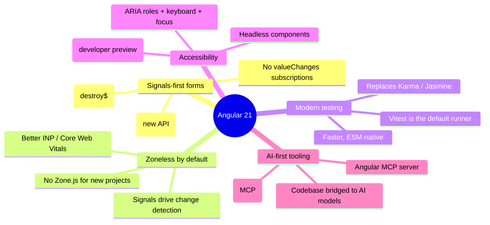
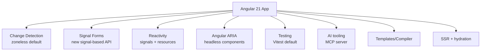
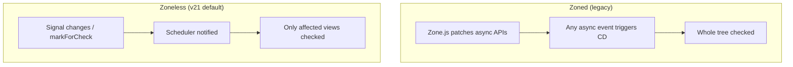

# Angular 21 - Complete Professional Guide

> **Category:** 14_frameworks · **Language:** English

---

### What's New in v21: Signal Forms, Zoneless by Default, Vitest as Default Test Runner, Angular ARIA, AI/MCP Tooling
**Edition for Angular v21.0 (released November 20, 2025)**

> **Reference book (English).** A professional, in-depth guide **focused on what's new in Angular 21**, for developers, architects, and teams already familiar with Angular. Based primarily on the official sources: the Angular announcement (https://blog.angular.dev), angular.dev, and the v21 launch event (https://angular.dev/events/v21).
>
> **Scope notice:** this is a **version-focused** book. Rather than teaching Angular from scratch, it concentrates on the APIs that changed or arrived in v21 — and the practical impact for production code. Each chapter follows the TO-BRAIN editorial standard (see `FILE_CONVENTIONS.md`).

---

## How to read this book

Progressive depth across five maturity levels, all centered on v21:

| Level | Profile | Parts |
|-------|---------|-------|
| 1 — Beginner (to v21) | Coming from older Angular | Part I |
| 2 — Intermediate | Reactivity & zoneless | Part II |
| 3 — Advanced | Signal Forms, DI, templates | Parts III–V |
| 4 — Specialist | AI/MCP, accessibility, testing | Parts VI–VII |
| 5 — Enterprise | Security, performance, production | Part VIII |

**Target audience:** Java and full-stack developers, software architects, frontend engineers, tech leads, and CTOs adopting or migrating to Angular 21.

**Structure of each chapter:** Introduction · Business context · Theoretical concepts · Architecture · Diagrams (Mermaid) · Real examples · Step by step · Complete code · Exercises · Challenges · Checklist · Best practices · Anti-patterns · Troubleshooting · Official references.

**Example format:** Scenario · Problem · Solution · Implementation · Result · Future improvements.

> **Note on prerequisites.** This book assumes working knowledge of standalone components, signals (`signal`, `computed`, `effect`), and the modern Angular control flow (`@if`, `@for`, `@switch`, `@defer`) introduced in earlier versions. Where a v21 feature builds on a prior one, we link the lineage.

---

## Table of Contents

**Part I – Angular 21 Overview & Signals-first Shift**
1. What's new in Angular 21 — the big picture
2. Signal Forms — the new signal-based forms API
3. Zoneless by default + Vitest as the default test runner

**Part II – Reactivity & Zoneless**
4. Signals deep dive in a zoneless world
5. The Resource APIs in v21 (`resource`, `httpResource`)
6. Change detection without Zone.js

**Part III – Signal Forms (in depth)**
7. Signal Forms fundamentals and field state
8. Validation with Signal Forms
9. Custom controls and ControlValueAccessor compatibility

**Part IV – Dependency Injection & Services**
10. Modern `inject()` patterns
11. Lazy services and providers

**Part V – Templates, Router & SSR**
12. Template & compiler changes in v21
13. Router changes
14. HttpClient and SSR (hydration)

**Part VI – AI & MCP Tooling**
15. The Angular MCP server and AI-assisted development
16. Angular ARIA — accessible headless components (developer preview)

**Part VII – Testing, CLI & Build**
17. Testing with Vitest (the new default)
18. CLI & build (Karma→Vitest, esbuild dev server)

**Part VIII – Enterprise & Production**
19. Security enhancements
20. Performance and production best practices for v21

> **Status of this edition:** phased delivery (each part keeps the same depth standard). **Ready:** Part I (Ch. 1–3). **In progress:** Parts II–VIII.

---

# Part I – Angular 21 Overview & Signals-first Shift

Part I gives you the strategic map of Angular 21 and the rationale behind its most aggressive **"signals-first"** shift yet. v21 is the release where reactivity stops being an opt-in experiment and becomes the framework's default mental model: **Signal Forms** introduce a brand-new signal-based forms API, **zoneless change detection becomes the default for new projects**, and **Vitest becomes the default test runner** for new apps. Understanding these three pillars — and the AI/accessibility tooling around them — is the difference between adopting v21 with intent and merely upgrading a version number.

---

## Chapter 1 — What's new in Angular 21 — the big picture

### 1.1 Introduction

Angular **v21.0** was released on **November 20, 2025**. It is the most decisively **signals-first** release in the framework's history. Three headline changes define it: the new **Signal Forms** API (form state managed entirely through signals, eliminating manual `valueChanges` subscriptions and `takeUntil(destroy$)` plumbing), **zoneless change detection becoming the default** for newly generated projects, and **Vitest becoming the default test runner** for new applications. Around those pillars, v21 ships **Angular ARIA** (a developer-preview accessibility package of headless components) and an **AI-first tooling** story built on the **Model Context Protocol (MCP)**. This chapter is the executive overview — the mental map for the rest of the book.

### 1.2 Business context

For engineering leaders, the question is always: *what do we gain, what changes, and what does it cost?* v21's answer is unusually clean. You gain **simpler, less error-prone reactive code** (Signal Forms remove an entire class of subscription/leak bugs), **measurably better runtime performance** (zoneless change detection improves INP and other Core Web Vitals by removing Zone.js overhead), and a **faster, more modern test stack** (Vitest replaces Karma/Jasmine for new apps). The cost is mostly conceptual: teams must internalize a signals-first model. Strategically, v21 lowers long-term maintenance cost by making the modern, performant, testable path the default path.

### 1.3 Theoretical concepts: the pillars of v21



The unifying direction is unmistakable: **signals become the default reactive substrate**, and every other change — zoneless detection, Signal Forms, Vitest, ARIA, MCP — radiates outward from that decision.

### 1.4 Architecture: where each change lives



### 1.5 Real example

**Scenario.** A team maintaining an Angular 20 app wants to understand, at a glance, what adopting v21 means in everyday code.

**Problem.** The "what's new" list is long; the team needs a single before/after that captures the spirit of v21.

**Solution.** A compact comparison of the most visible changes — forms, change detection, and testing.

**Implementation (before/after sketch):**

```typescript
// Angular 20 (typical reactive form)
@Component({ /* ... */ })
class ProfileComponent implements OnDestroy {
  private readonly destroy$ = new Subject<void>();
  readonly form = this.fb.group({ name: [''] });

  ngOnInit() {
    this.form.controls.name.valueChanges
      .pipe(takeUntil(this.destroy$))
      .subscribe(v => this.onNameChange(v)); // manual subscription
  }
  ngOnDestroy() { this.destroy$.next(); this.destroy$.complete(); }
}
// bootstrapApplication still wired Zone.js by default
```

```typescript
// Angular 21
import { form } from '@angular/forms/signals';

@Component({ /* ... */ })
class ProfileComponent {
  // Signal Forms: state is a signal tree — no subscriptions, no destroy$
  readonly model = signal({ name: '' });
  readonly profile = form(this.model);

  // React to changes with a normal effect, not valueChanges
  constructor() {
    effect(() => this.onNameChange(this.profile.name().value()));
  }
}
// new projects are zoneless by default; tests run on Vitest by default
```

**Result.** An entire category of subscription-management code disappears, the app runs without Zone.js, and the test suite uses a faster, ESM-native runner — the same feature, dramatically less ceremony.

**Future improvements.** Migrate remaining template-driven and reactive forms to Signal Forms (Part III) and adopt Angular ARIA for accessible widgets (Chapter 16).

### 1.6 Exercises

1. Name the three headline changes that define Angular 21.
2. Which v21 feature removes the need for `takeUntil(destroy$)` on form fields?
3. What does "zoneless by default" change for newly generated projects?

### 1.7 Challenges

- **Challenge.** For your current app, classify each v21 pillar as "free win," "needs adoption work," or "needs review," and justify each classification.

### 1.8 Checklist

- [ ] I can name the three pillars of v21 (Signal Forms, zoneless default, Vitest default).
- [ ] I understand Signal Forms manage state through signals, not subscriptions.
- [ ] I know zoneless is the default for new projects and why it helps INP.
- [ ] I know Vitest replaced Karma/Jasmine as the default test runner.
- [ ] I know Angular ARIA and the MCP server exist and what they are for.

### 1.9 Best practices

- Read v21 as a *signals-first* release: most value comes from leaning into signals, not resisting them.
- Prefer Signal Forms and zoneless for **new** code immediately; migrate existing code incrementally.
- Treat the AI tooling (MCP server) and Angular ARIA as first-class parts of the v21 developer experience.

### 1.10 Anti-patterns

- Re-introducing Zone.js into a new project "out of habit," forfeiting the performance win.
- Keeping `valueChanges` + `takeUntil(destroy$)` plumbing when Signal Forms would remove it.
- Treating Vitest as a drop-in for Karma without reviewing the new configuration.

### 1.11 Troubleshooting

| Symptom | Likely cause | Action |
|---------|--------------|--------|
| View not updating after an async callback | App is zoneless; state changed outside a signal | Move the state into a signal so it is tracked |
| Old `valueChanges` code no longer fits | Form migrated to Signal Forms | Use an `effect` reading the field signal instead |
| Tests fail to run after `ng new` | Expecting Karma; project uses Vitest | Run with the Vitest config generated by the CLI |
| Accessible widget missing roles | Hand-rolled instead of Angular ARIA | Adopt the headless ARIA primitive (Ch. 16) |

### 1.12 Official references

- Angular blog (v21 announcement): https://blog.angular.dev
- Angular v21 launch event: https://angular.dev/events/v21
- Angular documentation: https://angular.dev
- Signals guide: https://angular.dev/guide/signals

---

## Chapter 2 — Signal Forms — the new signal-based forms API

### 2.1 Introduction

The headline feature of Angular 21 is **Signal Forms**: a reimagined forms API where the entire form state — values, validity, touched/dirty status — is expressed and read through **signals**. Instead of subscribing to `valueChanges` observables and tearing them down with `takeUntil(destroy$)`, you derive everything reactively from a signal-backed model. This chapter introduces the API, the field model, and the reasoning behind it. (For lineage: in v21 Signal Forms arrive as the new signal-based forms API; they are further hardened and stabilized in v22, the sibling book.)

### 2.2 Business context

Forms are where most line-of-business Angular code lives — and where most subtle bugs hide: forgotten unsubscriptions, memory leaks, race conditions between `valueChanges` streams, and validation logic scattered across operators. Signal Forms collapse that complexity. State is a single reactive source of truth, validation is declarative, and there is nothing to unsubscribe. For teams, that means **fewer leak bugs, less boilerplate, and faster onboarding** — junior developers reason about a signal tree, not an RxJS pipeline.

### 2.3 Theoretical concepts: form as a signal tree

A Signal Form wraps a writable signal model and exposes a **field tree** whose nodes are themselves signal-backed. Reading a field's `value()`, `valid()`, or `touched()` is a reactive read; writing through the model updates everything downstream automatically.

```mermaid
flowchart TB
    model[(signal model)] --> f[form&#40;model&#41;]
    f --> root[Field tree root]
    root --> n1[field: name<br/>value() valid() touched()]
    root --> n2[field: email<br/>value() valid() touched()]
    root --> n3[group: address]
    n3 --> a1[field: city]
    n3 --> a2[field: zip]
    f -.read in template/effect.-> view[Template &#43; effects]
```

The key shift: there is **no separate observable layer**. The model signal *is* the source; the field tree is a reactive projection of it.

### 2.4 Architecture: how Signal Forms fit the component

```mermaid
flowchart LR
    comp[Component] --> sig[signal&#40;initialModel&#41;]
    sig --> formfn[form&#40;model, schema?&#41;]
    formfn --> fields[Field nodes]
    fields --> tmpl[Template bindings]
    fields --> eff[effects / computed]
    formfn --> val[Validators run reactively]
    val --> errors[field.errors&#40;&#41; signals]
```



The form function takes the model signal (and optionally a validation schema), returns a field tree, and runs validators reactively — no lifecycle hooks, no manual subscription teardown.

### 2.5 Real example

**Scenario.** A registration form with a name and an email, where the UI must reflect validity live and submit only when valid.

**Problem.** The classic reactive-forms version needs a `FormGroup`, `valueChanges` subscriptions for side effects, and `OnDestroy` teardown — boilerplate that is easy to get wrong.

**Solution.** Express the form as a signal model and read field state directly in the template and in effects.

**Implementation (real Angular 21 Signal Forms):**

```typescript
import { Component, signal, effect } from '@angular/core';
import { form, required, email } from '@angular/forms/signals';

interface RegistrationModel {
  name: string;
  email: string;
}

@Component({
  selector: 'app-register',
  template: `
    <form (submit)="submit($event)">
      <label>
        Name
        <input [field]="reg.name" />
      </label>
      @if (reg.name().touched() && !reg.name().valid()) {
        <small class="error">Name is required.</small>
      }

      <label>
        Email
        <input type="email" [field]="reg.email" />
      </label>
      @if (reg.email().touched() && !reg.email().valid()) {
        <small class="error">A valid email is required.</small>
      }

      <button type="submit" [disabled]="!reg().valid()">Create account</button>
    </form>
  `,
})
export class RegisterComponent {
  // The model is a plain writable signal.
  protected readonly model = signal<RegistrationModel>({ name: '', email: '' });

  // The form is a reactive projection of the model with a validation schema.
  protected readonly reg = form(this.model, (path) => {
    required(path.name, { message: 'Name is required.' });
    required(path.email, { message: 'Email is required.' });
    email(path.email, { message: 'Enter a valid email.' });
  });

  constructor() {
    // React to value changes with an effect — no valueChanges, no destroy$.
    effect(() => {
      const current = this.reg().value();
      console.debug('form changed', current);
    });
  }

  submit(event: Event): void {
    event.preventDefault();
    if (!this.reg().valid()) {
      return;
    }
    // model() is the source of truth; read it directly.
    this.save(this.model());
  }

  private save(data: RegistrationModel): void {
    // call a service / httpResource, etc.
  }
}
```

**Result.** No `FormBuilder`, no `valueChanges` subscription, no `OnDestroy`. Validity, touched state, and values are all reactive reads; the submit button enables itself reactively, and side effects live in a normal `effect`.

**Future improvements.** Add async/debounced validation and nested groups (Chapter 8), and wrap a custom widget as a Signal Forms control (Chapter 9).

### 2.6 Exercises

1. Rewrite a two-field reactive form as a Signal Form using `signal` + `form`.
2. Replace a `valueChanges.subscribe(...)` side effect with an `effect` reading a field signal.
3. Bind a submit button's `disabled` state to the form's `valid()` signal.

### 2.7 Challenges

- **Challenge.** Take an existing reactive form in your app that uses `takeUntil(destroy$)` and convert it to Signal Forms, removing all subscription and teardown code.

### 2.8 Checklist

- [ ] My form model is a writable signal.
- [ ] I create the field tree with `form(model, schema?)`.
- [ ] I read `value()`, `valid()`, `touched()`, and `errors()` as reactive signals.
- [ ] I use `effect`/`computed` instead of `valueChanges` for side effects.
- [ ] I have no `OnDestroy`/`takeUntil` plumbing left for this form.

### 2.9 Best practices

- Keep the model a single source of truth; derive everything else from it.
- Use the validation schema for declarative rules instead of imperative checks scattered in the component.
- Prefer `effect` for side effects and `computed` for derived view state.

### 2.10 Anti-patterns

- Mixing `FormGroup`/`valueChanges` and Signal Forms in the same form, doubling the state.
- Mutating the model object in place instead of using `signal.set`/`signal.update`.
- Reading field signals outside a reactive context and expecting them to update.

### 2.11 Troubleshooting

| Symptom | Likely cause | Action |
|---------|--------------|--------|
| Field value not updating the UI | Model mutated in place | Use `model.update(m => ({ ...m, ... }))` |
| Validation never fires | No schema passed to `form()` | Provide validators in the schema callback |
| Effect runs once and never again | Field signal read outside reactive read | Read `field().value()` inside the `effect` |
| Submit enabled while invalid | Bound to stale boolean | Bind to `reg().valid()` directly |

### 2.12 Official references

- Angular blog — Signal Forms announcement (v21): https://blog.angular.dev
- Signal Forms guide: https://angular.dev/guide/forms/signals
- Signals guide: https://angular.dev/guide/signals
- Angular v21 launch event: https://angular.dev/events/v21

---

## Chapter 3 — Zoneless by default + Vitest as the default test runner

### 3.1 Introduction

Two defaults flip in Angular 21, and both reinforce the signals-first direction. First, **zoneless change detection becomes the default for new projects**: Zone.js is no longer wired up automatically, and change detection is driven by signals and explicit notifications instead of monkey-patched async APIs. Second, **Vitest becomes the default test runner** for new applications, replacing the long-standing Karma/Jasmine setup with a faster, ESM-native experience. This chapter explains both, why they matter, and how to work with them.

### 3.2 Business context

Zone.js made Angular "just work" for years, but at a cost: it patched every async API and triggered broad change-detection passes, hurting **INP and other Core Web Vitals** on interaction-heavy pages. Going zoneless removes that overhead, improving real-user performance — a direct business metric for conversion and SEO. On the testing side, Karma's browser-launching model is slow and increasingly unmaintained; **Vitest** runs tests faster and natively understands modern ESM and TypeScript, shortening the feedback loop developers live in all day. Both defaults reduce cost: one at runtime, one at development time.

### 3.3 Theoretical concepts: change detection without Zone.js



In a zoneless app, the framework learns *what changed* from signals (and explicit `markForCheck`/event bindings) rather than guessing *that something might have changed* after every async callback.

### 3.4 Architecture: bootstrapping and testing in v21

```mermaid
flowchart LR
    boot[bootstrapApplication] --> zl[provideZonelessChangeDetection&#40;&#41;<br/>default for new apps]
    zl --> cd[Signals drive CD]
    proj[ng new] --> vit[Vitest config generated]
    vit --> tb[TestBed runs on Vitest]
    tb --> fast[Fast, ESM-native feedback]
```



### 3.5 Real example

**Scenario.** A new Angular 21 project that must perform well on interaction-heavy screens and have a fast test suite from day one.

**Problem.** The team is used to Zone.js "magic" and Karma, and needs to see how zoneless components and Vitest tests look in practice.

**Solution.** Use the zoneless default and write a signal-driven component plus a Vitest test for it.

**Implementation (zoneless component + Vitest test):**

```typescript
// counter.component.ts — works in a zoneless app because state is a signal
import { Component, signal, ChangeDetectionStrategy } from '@angular/core';

@Component({
  selector: 'app-counter',
  changeDetection: ChangeDetectionStrategy.OnPush,
  template: `
    <output>{{ count() }}</output>
    <button type="button" (click)="increment()">+1</button>
  `,
})
export class CounterComponent {
  protected readonly count = signal(0);
  increment(): void {
    // Signal write notifies the scheduler — no Zone.js needed.
    this.count.update((c) => c + 1);
  }
}
```

```typescript
// app.config.ts — new projects are zoneless by default
import { ApplicationConfig } from '@angular/core';
import { provideZonelessChangeDetection } from '@angular/core';

export const appConfig: ApplicationConfig = {
  providers: [
    provideZonelessChangeDetection(), // generated by ng new in v21
  ],
};
```

```typescript
// counter.component.spec.ts — runs on Vitest (the default runner)
import { describe, it, expect, beforeEach } from 'vitest';
import { TestBed } from '@angular/core/testing';
import { CounterComponent } from './counter.component';

describe('CounterComponent', () => {
  beforeEach(() => {
    TestBed.configureTestingModule({ imports: [CounterComponent] });
  });

  it('increments the count on click', async () => {
    const fixture = TestBed.createComponent(CounterComponent);
    await fixture.whenStable();

    const button = fixture.nativeElement.querySelector('button');
    button.click();
    await fixture.whenStable();

    const output = fixture.nativeElement.querySelector('output');
    expect(output.textContent).toContain('1');
  });
});
```

**Result.** The component updates correctly without Zone.js because its state lives in a signal, and the test runs on Vitest with the fast, ESM-native feedback loop the CLI sets up by default.

**Future improvements.** Adopt `httpResource`/`resource` for async data so that loading and error states are also signal-driven (Part II), and rely on `fixture.whenStable()` consistently in zoneless tests.

### 3.6 Exercises

1. Explain, in two sentences, how change detection knows what to update in a zoneless app.
2. Add `provideZonelessChangeDetection()` to an app config and verify a signal-driven component still updates.
3. Convert a single Karma spec into a Vitest spec using `describe`/`it`/`expect`.

### 3.7 Challenges

- **Challenge.** Identify one component in your app that relies on Zone.js to "notice" async state changes, and refactor it to be zoneless-safe by moving that state into signals.

### 3.8 Checklist

- [ ] New projects include `provideZonelessChangeDetection()` and no Zone.js.
- [ ] Component state that drives the view lives in signals.
- [ ] Tests use Vitest (`describe`/`it`/`expect`) and `await fixture.whenStable()`.
- [ ] I understand why zoneless helps INP / Core Web Vitals.
- [ ] I know Vitest replaced Karma/Jasmine as the default runner.

### 3.9 Best practices

- In zoneless apps, treat **signals as the way to notify the view**; reach for `markForCheck` only at integration boundaries.
- Use `await fixture.whenStable()` in tests instead of relying on Zone-based auto-detection.
- Keep async state (HTTP, timers) in signals or resources so the view stays reactive without Zone.js.

### 3.10 Anti-patterns

- Re-adding `provideZoneChangeDetection()`/`zone.js` to "make things update" instead of fixing non-signal state.
- Mutating component fields directly (not signals) and expecting the view to refresh.
- Porting Karma tests verbatim without using Vitest idioms and `whenStable()`.

### 3.11 Troubleshooting

| Symptom | Cause | Action |
|---------|-------|--------|
| View doesn't update after `setTimeout`/HTTP callback | State isn't a signal in a zoneless app | Move that state into a signal |
| Test passes locally, flakes in CI | Missing `await fixture.whenStable()` | Await stability before assertions |
| `ng test` can't find Karma | New project uses Vitest | Use the generated Vitest config |
| Third-party lib expects Zone.js | Lib not zoneless-ready | Provide a Zone fallback for that area or upgrade the lib |

### 3.12 Official references

- Angular blog — zoneless change detection: https://blog.angular.dev
- Zoneless guide: https://angular.dev/guide/zoneless
- Vitest with Angular (testing guide): https://angular.dev/guide/testing
- Angular v21 launch event: https://angular.dev/events/v21

---

> **End of Part I.** You now have the strategic map of Angular 21 (the signals-first shift and why it matters), a hands-on introduction to **Signal Forms** (the new signal-based forms API that retires `valueChanges` + `takeUntil(destroy$)`), and a working understanding of the two flipped defaults — **zoneless change detection** and **Vitest** as the default test runner. **Part II — Reactivity & Zoneless** (Chapters 4–6) goes deeper into signals in a zoneless world, the Resource APIs (`resource`, `httpResource`), and change detection without Zone.js.

<!--APPEND-PARTE-II-->
