# Angular 22 - Complete Professional Guide

> **Category:** 14_frameworks · **Language:** English

---

### What's New in v22: Signal Forms, Resources, OnPush by Default, Fetch, AI Tooling, and Migration
**Edition for Angular v22.0 (released June 3, 2026)**

> **Reference book (English).** A professional, in-depth guide **focused on what's new in Angular 22**, for developers, architects, and teams already familiar with Angular. Based primarily on the official sources: the Angular release (https://github.com/angular/angular/releases/tag/v22.0.0), angular.dev, and the detailed v22 release notes.
>
> **Scope notice:** this is a **version-focused** book. Rather than teaching Angular from scratch, it concentrates on the APIs that changed or stabilized in v22 — and the practical impact for production code and migrations. Each chapter follows the TO-BRAIN editorial standard (see `FILE_CONVENTIONS.md`).

---

## How to read this book

Progressive depth across five maturity levels, all centered on v22:

| Level | Profile | Parts |
|-------|---------|-------|
| 1 — Beginner (to v22) | Coming from older Angular | Part I |
| 2 — Intermediate | Reactivity: Signals, Resources | Part II |
| 3 — Advanced | Signal Forms, DI, templates | Parts III–V |
| 4 — Specialist | AI/WebMCP, testing, CLI/build | Parts VI–VII |
| 5 — Enterprise | Security, performance, production | Part VIII |

**Target audience:** Java and full-stack developers, software architects, frontend engineers, tech leads, and CTOs adopting or migrating to Angular 22.

**Structure of each chapter:** Introduction · Business context · Theoretical concepts · Architecture · Diagrams (Mermaid) · Real examples · Step by step · Complete code · Exercises · Challenges · Checklist · Best practices · Anti-patterns · Troubleshooting · Official references.

**Example format:** Scenario · Problem · Solution · Implementation · Result · Future improvements.

> **Note on prerequisites.** This book assumes working knowledge of standalone components, signals (`signal`, `computed`, `effect`), and the modern Angular control flow (`@if`, `@for`, `@switch`, `@defer`) introduced in earlier versions. Where a v22 feature builds on a prior one, we link the lineage.

---

## Table of Contents

**Part I – Angular 22 Overview & Migration**
1. What's new in Angular 22 — the big picture
2. Requirements and breaking changes (TypeScript 6, Node, OnPush, strictTemplates, Fetch)
3. Upgrading to Angular 22 — the migration playbook

**Part II – Reactivity: Resources & Debouncing**
4. The Resource API is stable (`resource`, `rxResource`, `httpResource`, `chain`, SSR cache)
5. `debounced()` and the three flavors of debouncing
6. OnPush by default and change detection

**Part III – Signal Forms (stable)**
7. Signal Forms fundamentals
8. Validation: `when`, `minDate`/`maxDate`, `getError`, async + debounce, `reloadValidation`
9. Custom controls: `FormValueControl` and `ControlValueAccessor` compatibility

**Part IV – Dependency Injection & Services**
10. The `@Service` decorator
11. `injectAsync()` and lazy-loaded services

**Part V – Templates, Router & SSR**
12. Template & compiler changes (strictTemplates, optional chaining, `@default never`, new errors)
13. Router changes (input binding options, `browserUrl`, `canMatch`, param inheritance)
14. HttpClient with Fetch, and SSR (incremental hydration by default)

**Part VI – AI & WebMCP**
15. Building and debugging Angular apps with AI (skills, MCP, DevTools)
16. WebMCP tools and Signal Forms integration

**Part VII – Testing, CLI & Build**
17. Testing (Vitest, `TestBed.getLastFixture`, Zone.js patch)
18. CLI & build (Karma→Vitest migration, dev server, chunk optimization, Rollup)

**Part VIII – Enterprise & Production**
19. Security enhancements (SSRF guards, stricter sanitization)
20. Performance and production best practices for v22

> **Status of this edition:** complete. All eight parts (Chapters 1–20) plus Appendix A are finished, each following the same editorial depth standard.

---

# Part I – Angular 22 Overview & Migration

Part I gives you the strategic map of Angular 22 and a concrete migration path. v22 is a **"modernization-by-default"** release: features that were experimental or opt-in for several versions (Signal Forms, Resources, Fetch, strict templates, OnPush) become **stable and/or the default**. Understanding which defaults flipped — and which changes are breaking — is the difference between a smooth upgrade and a broken build.

---

## Chapter 1 — What's new in Angular 22 — the big picture

### 1.1 Introduction

Angular **v22.0.0** was released on **June 3, 2026**. It continues the framework's signal-first modernization: **Signal Forms** and the **Resource APIs** graduate to stable, **OnPush** becomes the default change detection strategy, the **HttpClient uses Fetch** by default, a new **`@Service`** decorator and **`injectAsync()`** function arrive, and the AI tooling story expands significantly (skills, DevTools agents, WebMCP). This chapter is the executive overview — the mental map you'll use to navigate the rest of the book.

### 1.2 Business context

For engineering leaders, a major Angular release raises three questions: *what do we gain, what breaks, and how much will the upgrade cost?* v22's theme answers the first two crisply: you gain **production-ready reactive primitives** (less RxJS boilerplate, simpler async data) and **safer-by-default behavior** (OnPush, strict templates, Fetch, hardened SSR), at the cost of a **TypeScript 6 / Node bump** and a handful of breaking defaults that ship with **automated migrations**. The strategic read: v22 reduces long-term maintenance cost by making the modern, performant path the default path.

### 1.3 Theoretical concepts: the five themes of v22

```mermaid
mindmap
  root((Angular 22))
    Stable reactivity
      Resource API stable
      Signal Forms stable
      debounced() (experimental)
    New defaults
      OnPush by default
      strictTemplates by default
      HttpClient uses Fetch
      Incremental hydration default
    DI ergonomics
      @Service decorator
      injectAsync()
    AI & WebMCP
      Angular skills + MCP
      DevTools agent tools
      WebMCP tools from Signal Forms
    Platform & security
      TypeScript 6 required
      Node 20 dropped, Node 26 supported
      SSRF guards + stricter sanitization
```

The unifying direction: **signals as the default reactive model**, with the framework nudging every new app toward OnPush, stable resources, and Signal Forms — while keeping legacy paths working via opt-outs and migrations.

### 1.4 Architecture: where each change lives

```mermaid
flowchart TB
    app[Angular 22 App] --> cd[Change Detection<br/>OnPush default]
    app --> react[Reactivity<br/>Resources + debounced]
    app --> forms[Signal Forms<br/>stable]
    app --> di[DI<br/>@Service / injectAsync]
    app --> tmpl[Templates/Compiler<br/>strictTemplates]
    app --> http[HttpClient<br/>Fetch default]
    app --> ssr[SSR<br/>incremental hydration]
    app --> ai[AI/WebMCP]
    app --> sec[platform-server<br/>SSRF + sanitization]
```

### 1.5 Real example

**Scenario.** A team maintains a medium Angular 21 app and wants to understand, at a glance, what adopting v22 means in code.

**Problem.** The "what's new" list is long; the team needs a single before/after that captures the spirit of v22.

**Solution.** A compact comparison of the most visible changes.

**Implementation (before/after sketch):**

```typescript
// Angular 21 (typical)
@Injectable({ providedIn: 'root' })
class UserService { /* ... */ }

@Component({
  changeDetection: ChangeDetectionStrategy.OnPush, // had to opt in
  // ...
})
class UsersComponent {
  // async data via RxJS or experimental resource()
}
provideHttpClient(withFetch()); // had to opt in to Fetch
```

```typescript
// Angular 22
@Service()                       // new, concise; providedIn root by default
class UserService { /* ... */ }

@Component({
  // OnPush is now the DEFAULT — no need to specify it
  // ...
})
class UsersComponent {
  // resource()/httpResource() are STABLE — recommended for async data
  protected readonly users = httpResource(() => '/api/users');
}
provideHttpClient();             // Fetch is the default now
```

**Result.** Less ceremony, safer defaults, stable reactive primitives — the same app, more modern with fewer explicit opt-ins.

**Future improvements.** Migrate forms to Signal Forms (Part III) and async flows to Resources (Part II).

### 1.6 Exercises

1. List the four "new defaults" in v22 and state what each one replaced.
2. Which two reactive feature families became *stable* in v22?
3. Name the new decorator and the new injection function introduced in v22.

### 1.7 Challenges

- **Challenge.** For your current app, classify each v22 theme as "free win," "needs migration," or "needs code review," and justify.

### 1.8 Checklist

- [ ] I can name the five themes of v22.
- [ ] I know which APIs became stable (Signal Forms, Resources).
- [ ] I know which defaults flipped (OnPush, strictTemplates, Fetch, incremental hydration).
- [ ] I know v22 requires TypeScript 6 and bumps Node.

### 1.9 Best practices

- Read v22 as a *defaults* release: most value comes from adopting the new defaults, not fighting them.
- Prefer Resources and Signal Forms for **new** code immediately; migrate existing code incrementally.
- Treat the AI tooling (skills/MCP) as a first-class part of the v22 developer experience.

### 1.10 Anti-patterns

- Disabling every new default to "keep things as they were" — you forfeit the upgrade's benefits.
- Rewriting all forms/async to the new APIs in one big-bang change instead of incrementally.
- Upgrading without reading the breaking-change list (Chapter 2).

### 1.11 Troubleshooting

| Symptom | Likely cause | Action |
|---------|--------------|--------|
| Components stop updating after upgrade | OnPush now default; mutating state without signals | Use signals or set `Eager` via migration |
| Type errors in templates | strictTemplates now default | Fix types or temporarily set `strictTemplates: false` |
| Build fails on TypeScript | v22 requires TS 6 | Upgrade TypeScript to v6 |
| Upload progress missing | Fetch default lacks upload progress | Use `withXhr()` or `reportUploadProgress` |

### 1.12 Official references

- Angular v22.0.0 release: https://github.com/angular/angular/releases/tag/v22.0.0
- What's new in Angular 22 (Ninja Squad): https://blog.ninja-squad.com/2026/06/03/what-is-new-angular-22.0
- Angular v22 event: https://angular.dev/events/v22
- Angular docs: https://angular.dev

---

## Chapter 2 — Requirements and breaking changes

### 2.1 Introduction

Every major Angular release carries a small set of breaking changes; v22's are concentrated in **platform requirements** (TypeScript, Node) and **flipped defaults** (OnPush, strictTemplates, Fetch, hydration, router params). The good news: most ship with **automatic migrations** via `ng update`. This chapter is your pre-flight checklist — what will break, what auto-fixes, and what needs manual attention.

### 2.2 Business context

Underestimating breaking changes is how upgrades blow their timeline. Knowing in advance which changes are *transparent*, which are *auto-migrated*, and which require *manual review* lets you size the work accurately and avoid production surprises — especially the few changes that have **no migration**.

### 2.3 Theoretical concepts: platform requirements

- **TypeScript v6 required.** Older versions, including v5.9, are no longer supported. This is a hard requirement — the build fails otherwise.
- **Node.js bump.** Node v20 support is **dropped**; **Node v26** is supported. Plan your CI images and local environments accordingly (target a currently supported LTS that v22 accepts).

### 2.4 Architecture: the breaking-change map (auto vs manual)

```mermaid
flowchart TB
    subgraph auto["Auto-migrated by ng update"]
        a1[OnPush default → adds Eager where missing]
        a2[strictTemplates → adds strictTemplates:false]
        a3[Fetch default → adds withXhr() / removes withFetch()]
        a4[canMatch 3rd param currentSnapshot]
        a5[Incremental hydration default]
        a6[model+output name clash → input + linkedSignal]
        a7[optional chaining → $safeNavigationMigration wrapper]
    end
    subgraph manual["Needs manual attention (no/partial migration)"]
        m1[TypeScript 6 upgrade]
        m2[Node version bump]
        m3[paramsInheritanceStrategy now 'always']
        m4[Signal Forms touched model → touch output]
        m5[@Service: no auto migration]
    end
```

### 2.5 The flipped defaults, in detail

- **OnPush is the default change detection.** Previously the default was `Eager` (formerly named `Default`). A component without an explicit strategy now uses **OnPush**. The migration adds `changeDetection: ChangeDetectionStrategy.Eager` to components that didn't specify one, preserving behavior. *Manual risk:* code that mutated state outside signals/inputs may stop re-rendering if you adopt OnPush.
- **`strictTemplates` is the default.** Strict template type-checking no longer needs to be enabled in `tsconfig.json`. The migration adds `strictTemplates: false` to preserve old behavior; adopting strictness may surface real type errors to fix.
- **HttpClient uses Fetch.** `withFetch()` is now the default and is deprecated. The migration removes `withFetch()` or adds `withXhr()` to keep XHR. The only Fetch gap is **upload progress**; `reportProgress` is deprecated in favor of `reportUploadProgress`/`reportDownloadProgress`.
- **Incremental hydration is the default** for SSR. `withIncrementalHydration()` is deprecated; the migration adds `withNoIncrementalHydration()` if you weren't using it.
- **Router `paramsInheritanceStrategy: 'always'`** by default. Child routes inherit parent params. **No migration** — set `'emptyOnly'` manually to keep the old behavior.

### 2.6 Real example

**Scenario.** A team runs `ng update @angular/core @angular/cli` to go from 21 to 22 and wants to know what the migrations touched.

**Problem.** Reviewing a large auto-migration diff without a mental model is error-prone.

**Solution.** Map each diff hunk to the change it preserves.

**Implementation (expected migration outcomes):**

```text
✔ Added changeDetection: ChangeDetectionStrategy.Eager to 142 components
✔ Added strictTemplates: false to tsconfig.json
✔ Removed withFetch() from app.config.ts
✔ Added currentSnapshot param to 3 canMatch guards
✔ Wrapped 7 optional-chaining template expressions in $safeNavigationMigration()
⚠ paramsInheritanceStrategy: review manually (no migration)
⚠ @Service: not applied automatically
```

**Result.** A green build that behaves like v21, giving you a stable base from which to *opt into* the new defaults deliberately, file by file.

**Future improvements.** Remove `strictTemplates: false` and fix the surfaced type errors; drop `$safeNavigationMigration()` wrappers after reviewing each (Chapter 12).

### 2.7 Exercises

1. Split the v22 breaking changes into "auto-migrated" and "manual."
2. Which breaking change has **no** migration and how do you preserve the old behavior?
3. Why is `reportProgress` deprecated under Fetch?

### 2.8 Challenges

- **Challenge.** Write a one-page upgrade impact assessment for your app: platform bumps, expected auto-migrations, and the manual items (params inheritance, Signal Forms `touched`, `@Service`).

### 2.9 Checklist

- [ ] TypeScript upgraded to v6.
- [ ] CI/local Node updated to a v22-supported version (Node 20 dropped).
- [ ] Reviewed the auto-migration diff and understood each change.
- [ ] Decided on `paramsInheritanceStrategy` explicitly.
- [ ] Noted Fetch upload-progress implications.

### 2.10 Best practices

- Upgrade in a branch; let `ng update` run all migrations; review the diff before merging.
- Keep the migration-added opt-outs (`Eager`, `strictTemplates: false`, `withXhr`) at first, then remove them deliberately to adopt the new defaults.
- Pin Node and TypeScript versions in CI to match v22's requirements.

### 2.11 Anti-patterns

- Bumping `@angular/*` versions in `package.json` by hand instead of using `ng update` (you skip the migrations).
- Adopting every new default and the version bump in one PR — hard to bisect failures.
- Ignoring the no-migration items (`paramsInheritanceStrategy`, Signal Forms `touched`).

### 2.12 Troubleshooting

| Symptom | Cause | Action |
|---------|-------|--------|
| `ng update` refuses to run | Node/TS below requirements | Upgrade Node to a supported version and TS to 6 |
| Routes receive unexpected inherited params | `paramsInheritanceStrategy: 'always'` | Set `'emptyOnly'` explicitly |
| Custom form control can't "untouch" | `touched` model replaced | Use the `touched` input + `touch()` output |
| Template type errors after upgrade | strictTemplates default | Fix types or temporarily disable strictTemplates |

### 2.13 Official references

- What's new in Angular 22 (requirements & breaking changes): https://blog.ninja-squad.com/2026/06/03/what-is-new-angular-22.0
- Angular update guide: https://angular.dev/update-guide
- Angular v22.0.0 release notes: https://github.com/angular/angular/releases/tag/v22.0.0

---

## Chapter 3 — Upgrading to Angular 22 — the migration playbook

### 3.1 Introduction

This chapter turns the breaking-change knowledge from Chapter 2 into a **repeatable, low-risk upgrade procedure**. The goal is a green build that behaves like v21 on day one, followed by a *deliberate* adoption of the new defaults. We cover the command sequence, the order of operations, validation gates, and rollback.

### 3.2 Business context

A botched framework upgrade can freeze feature delivery for weeks. A disciplined playbook — staging first, automated migrations, validation gates, incremental adoption — keeps the upgrade predictable and reversible, which is exactly what stakeholders need to approve it.

### 3.3 Theoretical concepts: the two-phase upgrade

The professional approach separates **"upgrade"** from **"modernize."**

1. **Phase 1 — Upgrade (behavior-preserving).** Bump platform (Node, TS 6), run `ng update`, accept all auto-migrations and opt-outs, get a green build that behaves like before.
2. **Phase 2 — Modernize (opt-in, incremental).** Remove the opt-outs one area at a time (OnPush, strictTemplates, Fetch) and adopt the new stable APIs (Resources, Signal Forms), each behind its own PR and tests.

### 3.4 Architecture: the upgrade pipeline

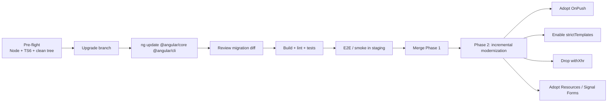

### 3.5 Real example

**Scenario.** Upgrade a production Angular 21 app to v22 with minimal risk.

**Problem.** The team can't afford a long feature freeze or a risky big-bang change.

**Solution.** Execute Phase 1 in a single short-lived branch; schedule Phase 2 as ongoing tech-debt work.

**Implementation (step by step).**

```bash
# 0) Pre-flight: ensure a clean git tree and supported toolchain
node -v            # must be a v22-supported version (Node 20 dropped)
npm i -D typescript@6

# 1) Create the upgrade branch
git checkout -b chore/angular-22

# 2) Run the official update (this runs the migrations)
ng update @angular/core @angular/cli

# 3) If you use other Angular packages, update them too
ng update @angular/material @angular/cdk   # example, if present

# 4) Validate
npm run build
npm run lint
npm test
```

**Code (validating change detection after the OnPush default flip):**

```typescript
// A component the migration marked Eager to preserve behavior.
// Phase 2: convert to OnPush by moving mutable state into signals.
@Component({
  selector: 'app-cart',
  // changeDetection: ChangeDetectionStrategy.Eager   // ← remove in Phase 2
  template: `<p>Total: {{ total() }}</p>`
})
export class CartComponent {
  private readonly items = signal<CartItem[]>([]);
  protected readonly total = computed(() =>
    this.items().reduce((s, i) => s + i.price * i.qty, 0)
  );
  add(item: CartItem) { this.items.update(list => [...list, item]); }
}
```

**Result.** Phase 1 merges as a behavior-preserving upgrade; the app runs on v22 with TS 6 and Fetch under the hood. Phase 2 then removes opt-outs area by area, each independently verifiable.

**Future improvements.** Track Phase 2 items as a checklist (OnPush per module, strictTemplates cleanup, Resources/Signal Forms adoption) and burn them down sprint by sprint.

### 3.6 Exercises

1. Why separate "upgrade" from "modernize"? Give two concrete benefits.
2. Write the exact command that runs the v22 migrations.
3. Which validation gates would you require before merging Phase 1?

### 3.7 Challenges

- **Challenge.** Draft a Phase 2 backlog for your app: list each opt-out to remove and each legacy API to replace, ordered by risk and value.

### 3.8 Checklist

- [ ] Clean git tree and supported Node/TS 6 before starting.
- [ ] Ran `ng update` (not a manual `package.json` bump).
- [ ] Reviewed and understood the migration diff.
- [ ] Build, lint, unit, and smoke tests pass in staging.
- [ ] Phase 2 modernization backlog created.

### 3.9 Best practices

- Keep Phase 1 small and behavior-preserving; never mix it with feature work.
- Use a staging environment with realistic data for smoke/E2E before merging.
- Adopt new defaults per-area with their own PRs and tests — easy to review and revert.

### 3.10 Anti-patterns

- Big-bang "upgrade + rewrite all forms/async" in one PR.
- Skipping `ng update` and editing versions by hand (loses migrations).
- Leaving `strictTemplates: false` and `$safeNavigationMigration()` wrappers forever (permanent debt).

### 3.11 Troubleshooting

| Symptom | Cause | Action |
|---------|-------|--------|
| `ng update` errors mid-run | Dirty git tree or unsupported toolchain | Commit/stash; fix Node/TS; rerun |
| Third-party lib incompatible with v22 | Lib not yet updated | Upgrade the lib or hold that package; check its v22 support |
| App behaves differently after upgrade | A no-migration change (router params, `touched`) | Apply the manual fix from Chapter 2 |
| Tests fail only in CI | Node version mismatch | Align CI Node image with v22 requirements |

### 3.12 Official references

- Angular Update Guide: https://angular.dev/update-guide
- What's new in Angular 22: https://blog.ninja-squad.com/2026/06/03/what-is-new-angular-22.0
- Angular CLI `ng update`: https://angular.dev/cli/update

---

> **End of Part I.** You now have the strategic map of Angular 22 (what's new and why), the full breaking-change inventory (auto-migrated vs manual), and a two-phase migration playbook. **Part II — Reactivity: Resources & Debouncing** (Chapters 4–6) dives into the now-stable Resource API (`resource`, `rxResource`, `httpResource`, `chain`, SSR caching), the new `debounced()` function, and OnPush-by-default change detection.

# Part II – Reactivity: Resources & Debouncing

Part II is where Angular 22's reactivity story becomes *production reality*. The `resource`, `rxResource`, and `httpResource` primitives that spent several versions in experimental status are now **stable** — and the framework officially recommends them as the default way to fetch asynchronous data. Alongside them, a new (experimental) `debounced()` function gives you a clean way to stabilize *any* signal, and **OnPush becomes the default change detection strategy**, completing the signal-first model. These three chapters teach you to think in terms of **declarative async state** rather than imperative subscriptions and manual change detection.

---

## Chapter 4 — The Resource API is stable (`resource`, `rxResource`, `httpResource`, `chain`, SSR cache)

### 4.1 Introduction

For years, fetching async data in Angular meant juggling RxJS operators, `async` pipes, manual loading flags, and `takeUntilDestroyed()` for cleanup. Angular 22 stabilizes the **Resource API** — `resource()`, `rxResource()`, and `httpResource()` — turning async data into a *reactive state machine* that you read like a signal. A resource exposes `value()`, `isLoading()`, `error()`, `status()`, and `hasValue()`; it reloads automatically when its request signal changes; and v22 adds two important capabilities: **`chain()`** for composing dependent resources and **SSR caching** via an `id` option. This chapter makes resources your default tool for async data.

### 4.2 Business context

Async data fetching is the single most common source of frontend bugs: race conditions, stale results, forgotten loading spinners, memory leaks from un-cancelled subscriptions, and duplicated server work after hydration. Each of these costs engineering hours and erodes user trust. Stable resources collapse that surface area into a declarative primitive: the framework handles cancellation, race-condition resolution (last request wins), and loading state for you. For a business, that means **fewer data-layer defects, faster feature delivery, and a hydration story that avoids re-fetching everything the server already rendered** — a direct win for both reliability and server cost.

### 4.3 Theoretical concepts

A **Resource** is a reactive wrapper around an asynchronous computation with an explicit, observable lifecycle.

- **`resource({ params, loader })`** — the most general form. `params` is a reactive function; whenever its value changes, the `loader` (an async function receiving an abort signal) re-runs.
- **`rxResource({ params, stream })`** — the same idea, but the producer returns an `Observable`, bridging RxJS into the resource world.
- **`httpResource(() => url)`** — a specialization that performs an HTTP GET (via `HttpClient`) and exposes the typed response as a resource. It is the most concise form for REST reads.
- **Resource status.** A resource is always in one of: `idle`, `loading`, `reloading`, `resolved`, or `error`. The convenience signals `isLoading()`, `hasValue()`, and `error()` are derived from `status()`.
- **`chain()`** (new in v22) — exposed inside the request function, it lets one resource depend on another's resolved value while propagating idle/loading/error states automatically (errors surface as a `ResourceDependencyError`).
- **SSR cache via `id`** (new in v22) — for `resource` and `rxResource`, providing an `id` lets the server-rendered value be cached and reused on the client, skipping a redundant loading state after hydration.

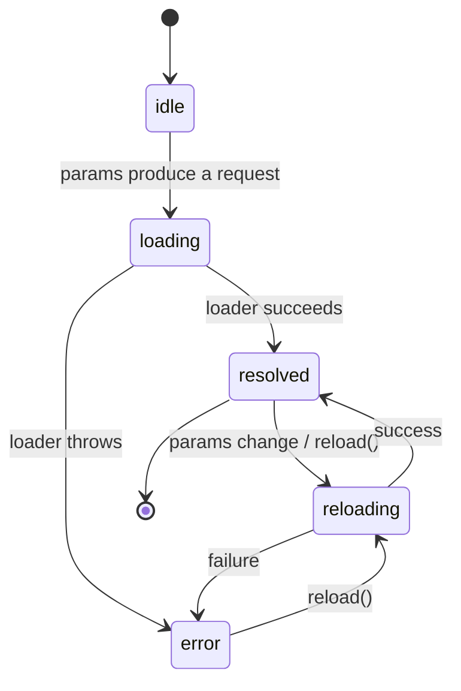

### 4.4 Architecture

In a v22 app, resources sit between your components and the HTTP layer, replacing hand-written subscription plumbing. Components read resource signals directly in templates; the resource owns the request lifecycle.

```mermaid
flowchart LR
    sig[Signal inputs<br/>id(), filters()] --> req[Request fn]
    req --> res[Resource<br/>value / isLoading / error]
    res --> tmpl[Template<br/>reads signals]
    req -.-> http[HttpClient / Fetch]
    http -.-> res
    chain[chain(otherResource)] --> req
    ssr[(SSR cache by id)] -.-> res
```

### 4.5 Real example

**Scenario.** A user-profile page must load a user by `id`, then load that user's posts. The `id` comes from a signal (e.g., a route input). The page is server-rendered, and the team wants to avoid re-fetching the user on the client after hydration.

**Problem.** With RxJS, this means a `switchMap` chain, manual loading flags for two requests, careful cancellation when `id` changes, and a transfer-state setup to avoid double-fetching on SSR — a lot of error-prone wiring.

**Solution.** Use `httpResource` for the user, a chained `httpResource` for the posts (via `chain()`), and an `id` on a cached resource for SSR reuse.

**Implementation.**

```typescript
import { Component, computed, input } from '@angular/core';
import { httpResource } from '@angular/common/http';

interface User { id: number; name: string; }
interface Post { id: number; title: string; }

@Component({
  selector: 'app-user-profile',
  template: `
    @if (user.isLoading()) {
      <p role="status">Loading user…</p>
    } @else if (user.error()) {
      <p role="alert">Could not load the user.</p>
    } @else if (user.hasValue()) {
      <h1>{{ user.value()!.name }}</h1>

      @if (posts.isLoading()) {
        <p role="status">Loading posts…</p>
      } @else if (posts.hasValue()) {
        <ul>
          @for (post of posts.value(); track post.id) {
            <li>{{ post.title }}</li>
          }
        </ul>
      }
    }
  `,
})
export class UserProfileComponent {
  // Bound from the router (input binding, see Chapter 13).
  readonly userId = input.required<number>();

  // A simple HTTP resource that reloads whenever userId() changes.
  protected readonly user = httpResource<User>(
    () => `/api/users/${this.userId()}`,
  );

  // A chained resource: posts depend on the resolved user.
  protected readonly posts = httpResource<Post[]>({
    params: ({ chain }) => {
      const u = chain(this.user); // waits for user; propagates loading/error
      return { authorId: u.id };
    },
    // httpResource builds the request from the params:
    request: ({ authorId }) => `/api/users/${authorId}/posts`,
  });
}
```

For a non-HTTP resource that should survive SSR hydration without re-running, give it an `id`:

```typescript
import { resource } from '@angular/core';

protected readonly settings = resource({
  params: () => ({ tenant: this.tenant() }),
  loader: ({ params }) => this.settingsApi.load(params.tenant),
  id: 'tenant-settings', // cached across server → client; no re-loading flash
});
```

**Result.** The component is declarative: no manual subscriptions, no `takeUntilDestroyed`, automatic cancellation when `userId` changes (last-write-wins), and a clean chained dependency. With the `id`, the SSR-rendered settings are reused on the client — no loading flash, no duplicate request.

**Future improvements.** Add a `debounced()` source (Chapter 5) for search-driven resources; expose a typed error model via a small wrapper; and migrate any remaining RxJS data services to `rxResource` so the whole data layer speaks the same reactive language.

### 4.6 Exercises

1. Convert an `HttpClient.get().subscribe()` call into an `httpResource`, exposing `value()`, `isLoading()`, and `error()` in the template.
2. Build a two-step chained resource (`A` → `B`) using `chain()` and describe what `B` does while `A` is loading, idle, or errored.
3. Add an `id` to a `resource()` and explain what changes during SSR hydration.

### 4.7 Challenges

- **Challenge.** Replace an entire RxJS-based data service in your app with `rxResource`/`httpResource`, keeping the public component API unchanged. Measure the reduction in lines of code and the elimination of manual cancellation logic.

### 4.8 Checklist

- [ ] I use `httpResource` for simple REST reads.
- [ ] I use `chain()` for dependent resources instead of nested subscriptions.
- [ ] I read `isLoading()`, `hasValue()`, and `error()` in templates.
- [ ] I add an `id` to resources I want cached across SSR hydration.
- [ ] I rely on automatic cancellation instead of manual unsubscription.

### 4.9 Best practices

- Prefer `httpResource` over manual `HttpClient` subscriptions for reads; reserve raw `HttpClient` for commands (POST/PUT/DELETE) and uploads.
- Drive resources from signals (route inputs, filters) so they reload reactively.
- Use `chain()` rather than reading `value()` of another resource imperatively — it propagates loading/error states correctly.
- Give cacheable SSR resources a stable `id` to avoid hydration re-fetches.

### 4.10 Anti-patterns

- Calling `.subscribe()` inside a component just to populate a field that a resource could own.
- Manually tracking `loading`/`error` booleans alongside a resource (the resource already exposes them).
- Reading one resource's `value()` inside another's loader without `chain()` — you lose state propagation and can read stale/undefined values.

### 4.11 Troubleshooting

| Symptom | Likely cause | Action |
|---------|--------------|--------|
| Resource never loads | `params` function never produces a value (returns `undefined`) | Ensure `params` returns a defined request; resources skip `undefined` requests |
| Stale data after input change | Reading a plain variable instead of a signal in `params` | Read signals inside `params` so the resource tracks them |
| Dependent resource shows errors as undefined | Reading the parent's `value()` directly | Use `chain(parent)` to propagate `ResourceDependencyError` |
| Loading flash on hydrated SSR page | Resource not cached | Add a stable `id` to the `resource`/`rxResource` |
| Race condition / out-of-order results | Manual subscription instead of resource | Migrate to a resource (last request wins automatically) |

### 4.12 Official references

- Resources are stable (What's new in Angular 22): https://blog.ninja-squad.com/2026/06/03/what-is-new-angular-22.0
- Angular Resource guide: https://angular.dev/guide/signals/resource
- `httpResource`: https://angular.dev/guide/http/http-resource

---

## Chapter 5 — `debounced()` and the three flavors of debouncing

### 5.1 Introduction

Debouncing — waiting for input to "settle" before acting — is everywhere: search boxes, autosave, async validators, expensive recomputations. Historically Angular developers reached for RxJS `debounceTime`. Angular 22 introduces a signal-native, experimental **`debounced()`** function and clarifies that there are now **three distinct flavors** of debouncing, each for a different layer. This chapter teaches when to use which, with `debounced()` as the general-purpose tool for stabilizing *any* signal.

### 5.2 Business context

Every un-debounced keystroke can trigger an HTTP call. At scale, that is wasted bandwidth, server CPU, and rate-limit pressure — and a janky UI. Correct debouncing reduces request volume dramatically (often 10x fewer calls for a search box) while keeping the interface responsive. The business value is concrete: lower infrastructure cost, fewer rate-limit incidents, and a smoother user experience. The risk to manage is *over-debouncing* (sluggish UI) or *debouncing at the wrong layer* (e.g., debouncing the field value when you only meant to debounce the validator).

### 5.3 Theoretical concepts: the three flavors

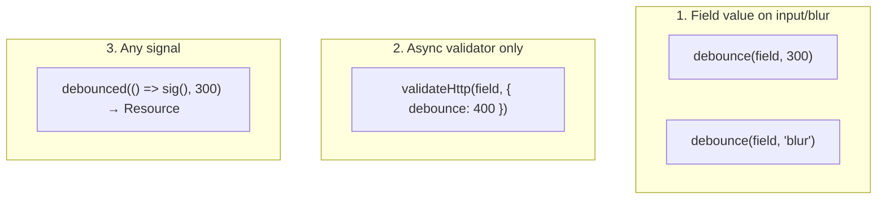

1. **Debounce a form field's value** — `debounce(field, delay)` delays propagation of the field's value changes by `delay` ms. v22 also accepts `'blur'` to publish the value only when the field loses focus. (Signal Forms; see Part III.)
2. **Debounce an async validator** — `validateHttp(field, { debounce })` (and `validateAsync`) debounces *only the validation request*, leaving the field value itself immediate. Use this when you want instant UI feedback but throttled server checks (e.g., "is this email taken?").
3. **Debounce any signal** — `debounced(signalFn, delay)` is the new general tool. Crucially, **it does not return a signal — it returns a `Resource`**, because a debounced value has *state*: settled, pending (waiting), or error (if the source throws). You read `.value()` and `.isLoading()`.

The key mental model for `debounced()`: `value()` initially returns the current source value. When the source changes, the resource enters a loading state but **keeps returning the previous settled value** until `delay` ms pass with no further change — then it resolves to the new value. This makes it ideal for driving *another* async operation from a stabilized input.

### 5.4 Architecture

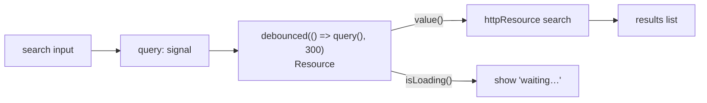

### 5.5 Real example

**Scenario.** A users page has a search box. Each keystroke should *not* hit the server; only the stabilized query should drive an HTTP search. The UI should indicate when the query has not yet settled.

**Problem.** Binding the raw query signal directly to an `httpResource` fires a request on every keystroke. RxJS `debounceTime` would work but reintroduces the subscription model the rest of the app has moved away from.

**Solution.** Wrap the query signal with `debounced()` and feed its `value` to an `httpResource`. Use the resource's `isLoading()` to show a "waiting for stable query" hint.

**Implementation.**

```typescript
import { Component, inject, signal } from '@angular/core';
import { debounced } from '@angular/core';
import { httpResource } from '@angular/common/http';
import { FormField, form } from '@angular/forms/signal';

interface User { id: number; name: string; }

@Component({
  selector: 'app-user-search',
  imports: [FormField],
  template: `
    <input type="search" placeholder="Filter users"
           [formField]="queryForm" />

    <p>Debounced query: {{ debouncedQuery.value() }}</p>
    @if (debouncedQuery.isLoading()) {
      <p role="status">Waiting for stable query…</p>
    }

    @if (filteredUsers.isLoading()) {
      <p role="status">Searching…</p>
    } @else if (filteredUsers.hasValue()) {
      <ul>
        @for (user of filteredUsers.value(); track user.id) {
          <li>{{ user.name }}</li>
        }
      </ul>
    }
  `,
})
export class UserSearchComponent {
  protected readonly query = signal('');
  protected readonly queryForm = form(this.query);

  // Flavor 3: debounce ANY signal → returns a Resource.
  protected readonly debouncedQuery = debounced(() => this.query(), 300);

  // The HTTP search reads the *stabilized* value.
  protected readonly filteredUsers = httpResource<User[]>(
    () => `/api/users?q=${encodeURIComponent(this.debouncedQuery.value())}`,
  );
}
```

If instead you only wanted to throttle a *validator* (flavor 2) while keeping the field value immediate:

```typescript
// Inside a form schema (Part III):
validateHttp(form.email, {
  request: (email) => `/api/users/check?email=${email.value()}`,
  debounce: 400, // only the validation request is debounced
});
```

And to debounce the field value itself only on blur (flavor 1):

```typescript
debounce(form.password, 'blur'); // value publishes when the field loses focus
```

**Result.** The server is hit only with stabilized queries; the UI shows a clear "waiting" indicator while the query settles, and the rest of the app keeps using signals/resources instead of bespoke RxJS. Request volume drops sharply with no perceived lag.

**Future improvements.** Promote the second `delay` argument to a *function* form of `debounced()` for adaptive timing (e.g., longer delay for short queries); add cancellation feedback; and combine with `chain()` (Chapter 4) so dependent resources also wait for the stabilized value.

### 5.6 Exercises

1. State which debouncing flavor to use for: (a) a search box, (b) an "email already used" async check, (c) publishing a password only when the user leaves the field.
2. Explain why `debounced()` returns a `Resource` and not a signal.
3. Replace an RxJS `debounceTime` pipeline driving an HTTP call with `debounced()` + `httpResource`.

### 5.7 Challenges

- **Challenge.** Build an autosave feature: debounce a form's serialized value with `debounced()`, and trigger a save resource only when the value settles, showing "saving…" and "saved" states from the resource's status.

### 5.8 Checklist

- [ ] I can name and place all three debouncing flavors.
- [ ] I use `debounced()` for non-form signals and read `.value()`/`.isLoading()`.
- [ ] I use `validateHttp(..., { debounce })` to throttle *only* validators.
- [ ] I use `debounce(field, 'blur')` when value should publish on blur.

### 5.9 Best practices

- Debounce at the *lowest correct layer*: validator-only when only the check is expensive; field value when the whole pipeline should wait.
- Feed `debounced().value` into resources to combine stabilization with declarative fetching.
- Surface `isLoading()` to users so the "waiting" state is visible, not mysterious.

### 5.10 Anti-patterns

- Treating `debounced()` like a signal and calling it as `debouncedQuery()` — it is a `Resource`; read `.value()`.
- Debouncing the field value when you only needed to debounce the validator (delays UI feedback unnecessarily).
- Stacking RxJS `debounceTime` *and* `debounced()` on the same flow (double delay, confusing behavior).

### 5.11 Troubleshooting

| Symptom | Likely cause | Action |
|---------|--------------|--------|
| `debouncedQuery is not a function` | Calling the resource directly | Read `.value()` / `.isLoading()` |
| Requests still fire per keystroke | HTTP resource reads the raw signal, not the debounced value | Point the resource at `debounced().value()` |
| Validator runs on every keystroke | Debounce applied to field value, not validator | Use `validateHttp(..., { debounce })` |
| Value never updates | Source signal not read inside the `debounced()` callback | Ensure the callback reads the signal: `() => sig()` |
| UI feels laggy | Delay too high | Lower the delay or use `'blur'` for the field |

### 5.12 Official references

- `debounced()` and the three flavors (What's new in Angular 22): https://blog.ninja-squad.com/2026/06/03/what-is-new-angular-22.0
- Signal Forms validation & debounce: https://angular.dev/guide/forms/signals
- Resource API: https://angular.dev/guide/signals/resource

---

## Chapter 6 — OnPush by default and change detection

### 6.1 Introduction

Angular has long offered two change detection strategies: `Eager` (formerly named `Default`) and `OnPush`. Until v21 the default was `Eager`; **since v22 the default is `OnPush`**. A component that does not explicitly declare a strategy now runs under `OnPush`, meaning it re-renders only when its inputs change (by reference), a bound event fires, an `async` pipe emits, or a **signal read in its template changes**. This chapter explains the new default, why signals make it the natural fit, and how to upgrade safely.

### 6.2 Business context

`Eager` change detection re-checks the entire component tree on virtually any async activity — a correctness-safe but performance-expensive default that scales poorly in large apps. `OnPush` checks far less, yielding measurably better runtime performance and battery life. By making `OnPush` the default, v22 nudges every new app toward the performant path. The business trade-off: apps that mutate state *outside* signals/inputs may silently stop updating under `OnPush`, so the upgrade ships with a migration that pins existing components to `Eager`, letting teams adopt `OnPush` deliberately and reap the performance gains over time.

### 6.3 Theoretical concepts

Under **`OnPush`**, Angular marks a component for check only when:

- an `@Input()`/signal `input()` reference changes,
- an event bound in the template fires,
- an `async` pipe (or other marker) emits,
- a **signal read in the template** notifies (the modern, recommended trigger), or
- `ChangeDetectorRef.markForCheck()` is called explicitly.

The crucial insight: **signals integrate natively with `OnPush`**. When a template reads a signal, Angular subscribes that view to the signal; any update marks the view for check automatically. So if your state lives in signals, `OnPush` "just works" — no `markForCheck()`, no surprises.

```mermaid
flowchart TB
    subgraph eager["Eager (formerly Default)"]
        e1[Any async activity] --> e2[Check whole subtree]
    end
    subgraph onpush["OnPush (v22 default)"]
        o1[Input ref change] --> o3[Mark for check]
        o2[Template event] --> o3
        o4[Signal read changes] --> o3
        o5[async pipe emits] --> o3
        o6[markForCheck()] --> o3
    end
```

### 6.4 Architecture

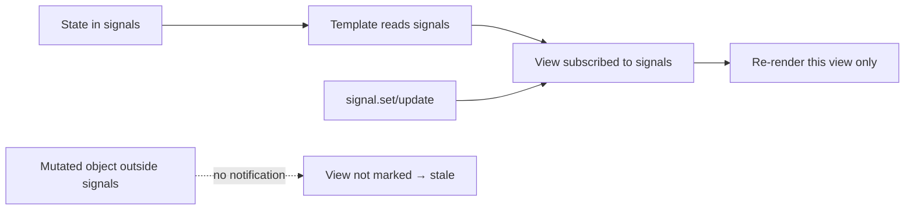

The architectural rule for v22: **keep mutable state in signals**, and `OnPush` becomes invisible and free. Legacy code that mutates plain objects/arrays in place is the failure mode the migration's `Eager` pinning protects.

### 6.5 Real example

**Scenario.** After upgrading to v22, a `CartComponent` that updated its total by mutating an array stops reflecting changes — because the migration left some components `Eager` but the team is now converting them to the `OnPush` default.

**Problem.** The component mutated `this.items.push(...)` and relied on `Eager` to re-check. Under `OnPush`, in-place mutation does not notify the view, so the total goes stale.

**Solution.** Move the state into a signal and derive the total with `computed()`. The template reads signals, so `OnPush` marks the view automatically — no `markForCheck()` needed.

**Implementation.**

```typescript
import { Component, computed, signal } from '@angular/core';

interface CartItem { id: number; price: number; qty: number; }

@Component({
  selector: 'app-cart',
  // No changeDetection specified → OnPush by default in v22.
  template: `
    <p>Items: {{ items().length }}</p>
    <p>Total: {{ total() | currency }}</p>
    <button (click)="add({ id: 1, price: 9.9, qty: 1 })">Add</button>
  `,
})
export class CartComponent {
  // State in a signal — OnPush-friendly.
  protected readonly items = signal<CartItem[]>([]);

  // Derived state recomputes and notifies the view automatically.
  protected readonly total = computed(() =>
    this.items().reduce((sum, i) => sum + i.price * i.qty, 0),
  );

  add(item: CartItem) {
    // Immutable update → notifies subscribers → view marked for check.
    this.items.update((list) => [...list, item]);
  }
}
```

For the rare case where you must integrate non-signal async state under `OnPush`, mark explicitly:

```typescript
import { ChangeDetectorRef, inject } from '@angular/core';

private readonly cdr = inject(ChangeDetectorRef);

someLegacyCallback(value: string) {
  this.legacyValue = value;     // not a signal
  this.cdr.markForCheck();      // tell OnPush to re-check this view
}
```

**Result.** The cart updates correctly under the `OnPush` default, with no manual change-detection calls. The component re-renders only when its signals change — fewer checks, better performance, and code that reads as plain state-in-signals.

**Future improvements.** Convert remaining `Eager`-pinned components to `OnPush` one at a time, removing the migration's `changeDetection: ChangeDetectionStrategy.Eager` lines as each component's state moves into signals; add lint rules to flag in-place mutation of component state.

### 6.6 Exercises

1. List the five triggers that mark an `OnPush` component for check.
2. Take an `Eager` component that mutates an array and convert it to `OnPush` using a signal + `computed`.
3. Explain why a template reading a signal does not need `markForCheck()`.

### 6.7 Challenges

- **Challenge.** Audit a feature module: remove `Eager` from every component, convert mutable fields to signals, and verify with tests that all views still update. Note any component that genuinely needs `markForCheck()` and why.

### 6.8 Checklist

- [ ] I understand `OnPush` is the v22 default.
- [ ] My component state lives in signals (or immutable inputs).
- [ ] I avoid in-place mutation of arrays/objects in component state.
- [ ] I use `markForCheck()` only for non-signal async integration.
- [ ] I remove migration-added `Eager` lines as I adopt `OnPush`.

### 6.9 Best practices

- Default to signals for all component state; this makes `OnPush` transparent.
- Update collections immutably (`update(list => [...list, x])`), never by mutation.
- Treat `markForCheck()` as an escape hatch for legacy/non-signal code, not a routine call.

### 6.10 Anti-patterns

- Pinning everything to `Eager` to avoid thinking about `OnPush` (forfeits performance and fights the framework).
- Sprinkling `markForCheck()` everywhere instead of moving state into signals.
- Mutating `this.items.push()` and expecting `OnPush` to notice (it will not).

### 6.11 Troubleshooting

| Symptom | Likely cause | Action |
|---------|--------------|--------|
| View doesn't update after data change | In-place mutation under `OnPush` | Use signals + immutable updates, or `markForCheck()` |
| Works in dev, stale in some views | Mixed `Eager`/`OnPush` components after migration | Standardize on signals + `OnPush` |
| Input change ignored | Mutating the input object instead of replacing the reference | Pass a new reference (immutable input) |
| `async` data not showing | Component lost its `async` pipe / signal binding | Bind via `async` pipe or a signal the template reads |
| Need a one-off refresh | Non-signal async callback | Call `markForCheck()` after updating state |

### 6.12 Official references

- OnPush by default (What's new in Angular 22): https://blog.ninja-squad.com/2026/06/03/what-is-new-angular-22.0
- Change detection & OnPush: https://angular.dev/best-practices/skipping-subtrees
- Signals: https://angular.dev/guide/signals

---

> **End of Part II.** Resources (`resource`/`rxResource`/`httpResource`) are now your default async primitive, with `chain()` for dependencies and SSR caching via `id`; `debounced()` stabilizes any signal as a `Resource`; and `OnPush` is the default change detection strategy that signals make effortless. **Part III — Signal Forms (stable)** (Chapters 7–9) covers the now-stable forms API: fundamentals, the new validation model (`when`, `minDate`/`maxDate`, `getError`, async + debounce, `reloadValidation`), and custom controls with `FormValueControl`.

# Part III – Signal Forms (stable)

Part III covers one of the headline changes of Angular 22: **Signal Forms graduate to stable**. After several versions in experimental status, the signal-native forms API is now recommended for production. It models a form as a tree of fields derived from a signal model, with validators, dynamic behaviors, and async checks expressed declaratively. These three chapters move from fundamentals (Chapter 7) through the refined validation model (Chapter 8) to custom controls and interop with legacy `ControlValueAccessor` components (Chapter 9). A few APIs changed right before stabilization — we call out every breaking detail.

---

## Chapter 7 — Signal Forms fundamentals

### 7.1 Introduction

Signal Forms build a reactive form directly from a **signal model**. You call `form(model, schema?)` to get a `Field` tree whose every node exposes signals: `value()`, `valid()`, `invalid()`, `touched()`, `dirty()`, `errors()`. Templates bind to fields with the `[formField]` directive. There is no `FormGroup`/`FormControl` ceremony, no `valueChanges` subscriptions — the form *is* signals. This chapter establishes the model, the field tree, template binding, and submission, which the next two chapters build on.

### 7.2 Business context

Forms are where most business logic and most user friction live. The legacy reactive-forms API was powerful but verbose and disconnected from the signal model the rest of v22 uses, forcing teams to bridge `valueChanges` Observables into signals. Signal Forms eliminate that impedance mismatch: a single source of truth (the model signal), less boilerplate, and validation that composes naturally with `computed`/`effect`. For organizations, that means faster form development, fewer state-sync bugs, and a consistent reactive mental model across the codebase — lowering onboarding cost and defect rates in the most logic-dense part of the UI.

### 7.3 Theoretical concepts

- **Model signal.** A `signal()` (or `WritableSignal`) holding the form's data shape. The form reads and writes this signal directly.
- **`form(model, schema?)`.** Produces a `Field<T>` tree mirroring the model's shape. Each property becomes a child field (e.g., `userForm.email`).
- **Calling a field.** `userForm.email()` returns the field's *state object* with signals like `value()`, `valid()`, `touched()`, `errors()`. The field object itself (`userForm.email`) is what you bind in templates.
- **`[formField]` directive.** Binds an input element to a field, wiring value and interaction state both ways.
- **Schema.** The second argument to `form()` is a function `(form) => { ... }` where you declare validators and dynamic behaviors against field paths (covered fully in Chapter 8).
- **`touched` (v22 change).** For custom controls, `touched` is now an **input** (read state) plus a **`touch()` output** (signal that the field was touched) — it is no longer a writable model. `markAsTouched()` on a field now cascades to descendants (override with `{ skipDescendants: true }`).

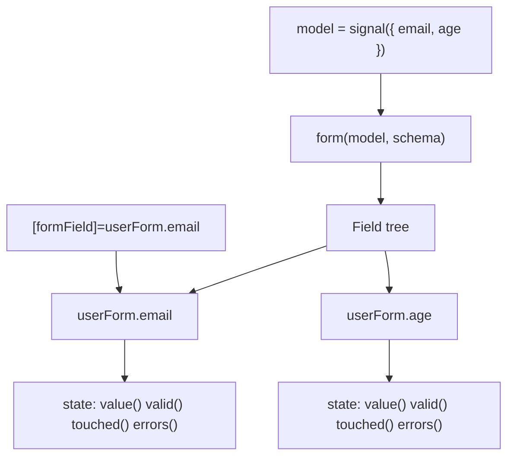

### 7.4 Architecture

```mermaid
flowchart LR
    sigmodel[(model signal)] <--> form[form() field tree]
    form --> fields[Fields w/ state signals]
    fields --> view[Template via formField]
    schema[Schema: validators + behaviors] --> form
    submit[submit()] --> handler[async submit handler]
    handler --> sigmodel
```

### 7.5 Real example

**Scenario.** A registration form collects `name`, `email`, and `age`, with basic required/format rules and a submit handler that calls an API.

**Problem.** Using legacy reactive forms means a `FormGroup`, typed controls, `Validators`, and bridging `valueChanges`/`statusChanges` into the signal-based UI — verbose and off-model.

**Solution.** Define a model signal, build the form with a schema, bind fields with `[formField]`, and submit via `submit()`.

**Implementation.**

```typescript
import { Component, inject, signal } from '@angular/core';
import {
  form, FormField, required, email, min, submit,
} from '@angular/forms/signal';

interface Registration { name: string; email: string; age: number; }

@Component({
  selector: 'app-register',
  imports: [FormField],
  template: `
    <form (submit)="onSubmit($event)">
      <label>
        Name
        <input [formField]="registration.name" />
      </label>
      @let name = registration.name();
      @if (name.touched() && name.invalid()) {
        <small role="alert">Name is required.</small>
      }

      <label>
        Email
        <input type="email" [formField]="registration.email" />
      </label>

      <label>
        Age
        <input type="number" [formField]="registration.age" />
      </label>

      <button type="submit" [disabled]="registration().invalid()">
        Register
      </button>
    </form>
  `,
})
export class RegisterComponent {
  private readonly api = inject(RegistrationApi);

  // 1) The model is a signal — the single source of truth.
  private readonly model = signal<Registration>({ name: '', email: '', age: 0 });

  // 2) The form derives a field tree from the model + a schema.
  protected readonly registration = form(this.model, (f) => {
    required(f.name);
    required(f.email);
    email(f.email);
    min(f.age, 18);
  });

  async onSubmit(event: Event) {
    event.preventDefault();
    // submit() runs validators, marks touched, and invokes the handler if valid.
    await submit(this.registration, async (value) => {
      await this.api.register(value);
    });
  }
}
```

**Result.** A fully reactive form with no `FormGroup` plumbing. The model signal is the single source of truth; the template reads field state signals directly; `submit()` orchestrates validation and the async handler. Adding fields means adding model properties and schema rules — nothing else.

**Future improvements.** Add async/debounced validation (Chapter 8), extract reusable schema fragments, and swap raw inputs for custom `FormValueControl` components (Chapter 9).

### 7.6 Exercises

1. Build a two-field signal form and display each field's `touched()`/`invalid()` state.
2. Explain the difference between `userForm.email` (the field) and `userForm.email()` (its state object).
3. Describe how `touched` changed in v22 for custom controls.

### 7.7 Challenges

- **Challenge.** Migrate one legacy reactive form to Signal Forms, keeping the same validation rules and submit behavior, and remove all `valueChanges` subscriptions.

### 7.8 Checklist

- [ ] My form model is a signal.
- [ ] I build the form with `form(model, schema)`.
- [ ] I bind inputs with `[formField]`.
- [ ] I read field state via `field().value()`, `field().touched()`, etc.
- [ ] I submit with `submit()` rather than manual validation.

### 7.9 Best practices

- Keep the model as a single signal of the form's shape; derive everything else.
- Put validation in the schema, not scattered across the template.
- Use `@let field = form.x();` in templates to read state once per render.

### 7.10 Anti-patterns

- Mixing legacy `FormGroup` and Signal Forms for the same form.
- Subscribing to anything — there are no `valueChanges` Observables to wire up.
- Writing `touched` as if it were a model in custom controls (it is now input + `touch()` output).

### 7.11 Troubleshooting

| Symptom | Likely cause | Action |
|---------|--------------|--------|
| Input not bound | Missing `FormField` import or wrong binding | Import `FormField`; use `[formField]="form.x"` |
| `field is not a function` | Reading state without calling the field | Use `form.x()` to get state, then `.value()` etc. |
| Validation never shows | Field never touched | Gate UI on `touched() && invalid()`; `submit()` marks touched |
| Custom control can't untouch | Tried to write `touched` model | Use `touched` input + `touch()` output |
| Descendants unexpectedly marked touched | `markAsTouched()` now cascades | Pass `{ skipDescendants: true }` to limit it |

### 7.12 Official references

- Signal Forms are stable (What's new in Angular 22): https://blog.ninja-squad.com/2026/06/03/what-is-new-angular-22.0
- Signal Forms guide: https://angular.dev/guide/forms/signals
- Signal Forms deep dive (Ninja Squad): https://blog.ninja-squad.com/2025/11/04/angular-signal-forms-part-1/

---

## Chapter 8 — Validation: `when`, `minDate`/`maxDate`, `getError`, async + debounce, `reloadValidation`

### 8.1 Introduction

Validation is where Signal Forms received the most refinement before stabilization. Angular 22 standardizes a **`when` option** across all validators and dynamic behaviors, adds **`minDate()`/`maxDate()`** validators, introduces **`getError('kind')`** for type-narrowed error access, gives async validators a **`debounce`** option, and adds **`reloadValidation()`** to re-run async checks on demand. This chapter is the complete v22 validation reference.

### 8.2 Business context

Validation rules encode business policy — eligibility, uniqueness, date ranges, regulatory limits. When validation is awkward to express, teams duplicate logic, leak it into components, or skip it, producing inconsistent enforcement and support tickets. The v22 validation model makes complex, *conditional* and *async* rules first-class and consistent (one `when` option everywhere; one `getError` accessor), so business rules live in one declarative place. The `debounce` option directly cuts server load from uniqueness checks, and `reloadValidation()` mirrors the legacy `updateValueAndValidity()` so re-validation after external changes is straightforward.

### 8.3 Theoretical concepts

- **Consistent `when`.** All validators and dynamic behaviors (`disabled`, `readonly`, `hidden`, etc.) now take a `{ when: (ctx) => boolean }` option instead of a positional reactive function. The old positional form still works but is deprecated.

  ```typescript
  // before (deprecated):
  disabled(form.age, ({ valueOf }) => valueOf(form.isAdmin));
  // v22:
  disabled(form.age, { when: ({ valueOf }) => valueOf(form.isAdmin) });
  ```

- **`minDate()` / `maxDate()`.** New date-range validators adding `minDate`/`maxDate` errors.
- **`getError('kind')`.** Returns the error of a specific kind (and narrows its type), replacing manual iteration over `errors()`.
- **Async validators with `debounce`.** `validateAsync()` and `validateHttp()` accept a `debounce` option so only the validation request is throttled.
- **`reloadValidation()`.** Re-runs a field's async validators (and descendants') by reloading the underlying resources — the Signal Forms equivalent of `updateValueAndValidity()`.

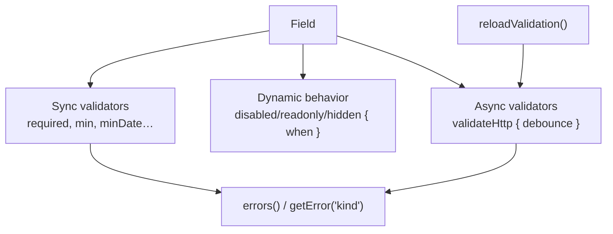

### 8.4 Architecture

```mermaid
flowchart LR
    model[(model signal)] --> form[form(model, schema)]
    schema[schema] --> when["{ when } conditions"]
    schema --> dates["minDate / maxDate"]
    schema --> http["validateHttp { debounce }"]
    http --> res[(httpResource per field)]
    res --> errs[field errors]
    reload[reloadValidation()] --> res
    tmpl["getError('kind')"] --> errs
```

### 8.5 Real example

**Scenario.** A profile form must: validate `birthDate` is between 1900-01-01 and today; require a `company` field only when `accountType` is `'business'`; and check email uniqueness against the server without firing on every keystroke. A "Re-check" button should re-run the uniqueness validation.

**Problem.** Legacy forms express conditional and async validation with custom validators, manual subscriptions, and `updateValueAndValidity()` calls — verbose and easy to get wrong.

**Solution.** Use `minDate`/`maxDate`, a `when`-gated `required`, `validateHttp` with `debounce`, `getError` in the template, and `reloadValidation()` for the re-check button.

**Implementation.**

```typescript
import { Component, signal } from '@angular/core';
import {
  form, FormField, required, email, minDate, maxDate, validateHttp,
} from '@angular/forms/signal';

interface Profile {
  accountType: 'personal' | 'business';
  company: string;
  email: string;
  birthDate: Date | null;
}

@Component({
  selector: 'app-profile-form',
  imports: [FormField],
  template: `
    <select [formField]="profile.accountType">
      <option value="personal">Personal</option>
      <option value="business">Business</option>
    </select>

    <input placeholder="Company" [formField]="profile.company" />
    @let company = profile.company();
    @if (company.touched() && company.getError('required')) {
      <small role="alert">Company is required for business accounts.</small>
    }

    <input type="date" [formField]="profile.birthDate" />
    @let birth = profile.birthDate();
    @if (birth.getError('minDate')) {
      <small role="alert">Date is too far in the past.</small>
    }
    @if (birth.getError('maxDate')) {
      <small role="alert">Date cannot be in the future.</small>
    }

    <input type="email" [formField]="profile.email" />
    @let mail = profile.email();
    @if (mail.getError('emailTaken'); as taken) {
      <small role="alert">Email already used.</small>
    }

    <button type="button" (click)="recheckEmail()">Re-check email</button>
  `,
})
export class ProfileFormComponent {
  private readonly model = signal<Profile>({
    accountType: 'personal', company: '', email: '', birthDate: null,
  });

  protected readonly profile = form(this.model, (f) => {
    // Conditional requirement via the consistent `when` option.
    required(f.company, {
      when: ({ valueOf }) => valueOf(f.accountType) === 'business',
    });

    email(f.email);

    // Async uniqueness check, debounced so it doesn't fire per keystroke.
    validateHttp(f.email, {
      request: (email) => `/api/users/check?email=${email.value()}`,
      debounce: 400,
      // Map the HTTP response to an error of kind 'emailTaken'.
      errors: (taken: boolean) => (taken ? { kind: 'emailTaken' } : null),
    });

    // New date-range validators.
    minDate(f.birthDate, new Date('1900-01-01'));
    maxDate(f.birthDate, new Date());
  });

  recheckEmail() {
    // Re-run the async validators of the email field (and descendants).
    this.profile.email().reloadValidation();
  }
}
```

**Result.** Conditional, date-range, and debounced async validation are all declared in one schema. The template reads errors precisely with `getError('kind')` (type-narrowed), the uniqueness check hits the server only after input settles for 400 ms, and the re-check button re-runs validation via `reloadValidation()` — no manual subscriptions anywhere.

**Future improvements.** Extract the email-uniqueness rule into a reusable schema function; add a cross-field validator (e.g., password confirmation) using `when` against sibling values; surface a unified error summary by iterating field errors at the form root.

### 8.6 Exercises

1. Rewrite a deprecated positional `disabled(field, fn)` into the `{ when }` form.
2. Add `minDate`/`maxDate` to a date field and show each error with `getError`.
3. Add `debounce` to an async `validateHttp` and explain what it throttles.

### 8.7 Challenges

- **Challenge.** Implement an async, debounced uniqueness check plus a conditional cross-field rule, and add a button that calls `reloadValidation()` to force re-validation after an external data change.

### 8.8 Checklist

- [ ] I use the `{ when }` option for conditional validators/behaviors.
- [ ] I use `minDate`/`maxDate` for date ranges.
- [ ] I read errors with `getError('kind')` instead of iterating `errors()`.
- [ ] I debounce async validators with the `debounce` option.
- [ ] I use `reloadValidation()` to re-run async checks.

### 8.9 Best practices

- Express every conditional rule with `{ when }` for consistency and readability.
- Always debounce server-backed validators to protect the backend.
- Prefer `getError('kind')` so the template reads exactly the error it handles, with correct typing.

### 8.10 Anti-patterns

- Using the deprecated positional reactive-function signature for new code.
- Running async uniqueness checks without `debounce` (hammers the server).
- Re-implementing date-range checks by hand instead of `minDate`/`maxDate`.
- Iterating `errors()` manually when `getError('kind')` exists.

### 8.11 Troubleshooting

| Symptom | Likely cause | Action |
|---------|--------------|--------|
| Conditional rule always on | Positional fn vs `when` confusion | Use `{ when: (ctx) => … }` |
| Async validator fires per keystroke | Missing `debounce` | Add `debounce: <ms>` to `validateHttp`/`validateAsync` |
| `getError` returns nothing | Wrong error kind string | Match the exact `kind` your validator emits |
| Validation stale after external change | Async result cached | Call `reloadValidation()` on the field |
| Date validator not firing | Value isn't a `Date` | Ensure the bound value is a `Date` (or parse it) |

### 8.12 Official references

- Validation changes (What's new in Angular 22): https://blog.ninja-squad.com/2026/06/03/what-is-new-angular-22.0
- Signal Forms validation: https://angular.dev/guide/forms/signals
- Signal Forms part 2 (Ninja Squad): https://blog.ninja-squad.com/2025/11/14/angular-signal-forms-part-2/

---

## Chapter 9 — Custom controls: `FormValueControl` and `ControlValueAccessor` compatibility

### 9.1 Introduction

Reusable form widgets (rating stars, color pickers, tag inputs) need to integrate with the forms system. Angular's classic mechanism was the `ControlValueAccessor` (CVA) interface. Signal Forms introduce a new, simpler, more powerful interface: **`FormValueControl`**. Angular 22 makes the two *interoperate*: legacy CVA components work with Signal Forms (and their `NG_VALIDATORS` errors now propagate), and `FormValueControl` components work with **both** legacy reactive and template-driven forms. It also adds a `reset` method to `FormValueControl`. This chapter shows how to build custom controls and migrate without breaking consumers.

### 9.2 Business context

Custom form controls are shared assets — a single rating component may be used in dozens of forms across teams. Anything that forces a synchronized rewrite of all consumers is expensive and risky. The v22 compatibility guarantees let organizations adopt `FormValueControl` *incrementally*: migrate the widget internally while every existing usage (`formControlName`, `[(ngModel)]`, Signal Forms) keeps working unchanged. That preserves shared component libraries, avoids coordinated big-bang migrations, and reduces the cost of moving the codebase toward signals.

### 9.3 Theoretical concepts

- **`FormValueControl<T>`.** The new interface for signal-native custom controls. It exposes a `value` model signal and integration points; it can also implement a `reset` method (new in v22) to define how the control resets.
- **CVA → Signal Forms compatibility.** Existing `ControlValueAccessor` components now bind to Signal Forms fields. Critically, validators a CVA registers via `NG_VALIDATORS` now propagate their errors into Signal Forms fields (previously a gap).
- **`FormValueControl` → legacy compatibility.** A control implementing `FormValueControl` works unchanged with legacy reactive (`formControlName`) and template-driven (`[(ngModel)]`) forms — so migrating the widget does not touch its consumers.
- **`touched` (recap).** For custom controls, `touched` is an input plus a `touch()` output (v22), not a writable model.

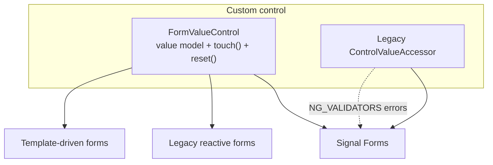

### 9.4 Architecture

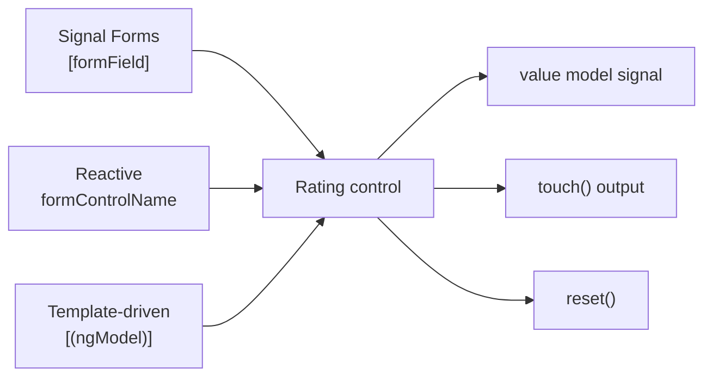

### 9.5 Real example

**Scenario.** A shared `Rating` star component is currently a `ControlValueAccessor` used across the app via `formControlName` and `[(ngModel)]`. The team wants to modernize it to `FormValueControl` for Signal Forms — without changing any existing usage.

**Problem.** A coordinated rewrite of every consuming form would be a large, risky change touching many teams.

**Solution.** Reimplement `Rating` as a `FormValueControl`. Because v22 makes `FormValueControl` compatible with legacy reactive and template-driven forms, all existing usages keep working untouched, while new Signal Forms can bind it with `[formField]`.

**Implementation.**

```typescript
import { Component, model, output } from '@angular/core';
import { FormValueControl } from '@angular/forms/signal';

@Component({
  selector: 'ns-rating',
  template: `
    <div role="radiogroup" aria-label="Rating">
      @for (star of stars; track star) {
        <button
          type="button"
          [attr.aria-pressed]="star <= value()"
          (click)="select(star)"
          (blur)="touch.emit()"
        >{{ star <= value() ? '★' : '☆' }}</button>
      }
    </div>
  `,
})
export class RatingComponent implements FormValueControl<number> {
  // The value is a model signal — the heart of FormValueControl.
  readonly value = model<number>(0);

  // touched is an output in v22 (not a writable model).
  readonly touch = output<void>();

  protected readonly stars = [1, 2, 3, 4, 5];

  select(star: number) {
    this.value.set(star);
  }

  // New in v22: define how the control resets.
  reset() {
    this.value.set(0);
  }
}
```

All of these consumers keep working after the migration — no changes required:

```html
<!-- Signal Forms (new) -->
<ns-rating [formField]="reviewForm.rating"></ns-rating>

<!-- Legacy reactive form (unchanged) -->
<ns-rating formControlName="rating"></ns-rating>

<!-- Legacy template-driven form (unchanged) -->
<ns-rating [(ngModel)]="rating"></ns-rating>
```

If you must keep a legacy CVA control for now, its `NG_VALIDATORS` errors will still surface in Signal Forms fields in v22:

```typescript
// A legacy CVA control providing a validator continues to work,
// and its validation errors now propagate into Signal Forms.
@Component({
  selector: 'ns-legacy-color',
  providers: [
    { provide: NG_VALUE_ACCESSOR, useExisting: LegacyColorComponent, multi: true },
    { provide: NG_VALIDATORS, useExisting: LegacyColorComponent, multi: true },
  ],
  // ...
})
export class LegacyColorComponent implements ControlValueAccessor, Validator {
  /* validate(): errors now propagate to Signal Forms fields in v22 */
}
```

**Result.** The `Rating` widget is modernized to `FormValueControl` with a `reset()` method, while every existing `formControlName` and `[(ngModel)]` usage continues to work. New forms adopt it via `[formField]`. Legacy CVA controls, where still present, integrate with Signal Forms including their validation errors — enabling a gradual, low-risk migration of the shared component library.

**Future improvements.** Add `disabled`/`readonly` handling driven by Signal Forms behaviors; provide keyboard navigation for accessibility; and migrate remaining CVA controls to `FormValueControl` one widget at a time, since consumers don't need to change.

### 9.6 Exercises

1. Implement a minimal `FormValueControl<string>` (e.g., a toggle) with a `value` model and a `touch()` output.
2. Add a `reset()` method and explain when Signal Forms calls it.
3. Explain why a `FormValueControl` can be consumed by `formControlName` and `[(ngModel)]` unchanged in v22.

### 9.7 Challenges

- **Challenge.** Migrate a real CVA control to `FormValueControl` and prove (with tests) that its existing reactive and template-driven usages still work, plus a new Signal Forms usage.

### 9.8 Checklist

- [ ] My custom control implements `FormValueControl<T>` with a `value` model.
- [ ] I emit `touch()` on blur instead of writing a `touched` model.
- [ ] I implement `reset()` where reset semantics matter.
- [ ] I verified legacy consumers still work after migration.
- [ ] I know CVA `NG_VALIDATORS` errors now propagate to Signal Forms.

### 9.9 Best practices

- Prefer `FormValueControl` for new custom controls; it is simpler and works with all three form systems.
- Emit `touch()` on the natural "left the control" event (usually blur).
- Implement `reset()` so form resets behave predictably for your widget.

### 9.10 Anti-patterns

- Forcing all consumers to migrate at once (the compatibility guarantees exist precisely to avoid this).
- Treating `touched` as a writable model in custom controls (v22: input + `touch()` output).
- Re-implementing CVA plumbing for a brand-new control when `FormValueControl` is available.

### 9.11 Troubleshooting

| Symptom | Likely cause | Action |
|---------|--------------|--------|
| Legacy usage breaks after migration | Control no longer exposes the expected value contract | Implement `FormValueControl` correctly; it's compatible with legacy forms |
| CVA validator errors don't appear in Signal Forms | Pre-v22 behavior assumption | Upgrade to v22 — `NG_VALIDATORS` errors now propagate |
| Field never marks touched | No `touch()` emitted | Emit `touch()` on blur |
| Reset doesn't clear the control | No `reset()` implemented | Implement `reset()` on the `FormValueControl` |
| Value not syncing | `value` not a model signal | Use `model<T>()` for `value` |

### 9.12 Official references

- FormValueControl & CVA compatibility (What's new in Angular 22): https://blog.ninja-squad.com/2026/06/03/what-is-new-angular-22.0
- Custom form controls: https://angular.dev/guide/forms/signals
- ControlValueAccessor: https://angular.dev/api/forms/ControlValueAccessor

---

> **End of Part III.** Signal Forms are stable: you can model forms from a signal, validate with a consistent `when` option plus `minDate`/`maxDate`/`getError`/debounced-async/`reloadValidation`, and build custom controls with `FormValueControl` that interoperate with legacy reactive and template-driven forms. **Part IV — Dependency Injection & Services** (Chapters 10–11) covers the new `@Service` decorator and `injectAsync()` for lazy-loaded services.

# Part IV – Dependency Injection & Services

Part IV covers two DI ergonomics additions in Angular 22. The new **`@Service`** decorator is a concise, intention-revealing way to declare root-provided services (with the one rule that they must use `inject()`), and **`injectAsync()`** lets you lazy-load a service on demand — creating the instance through Angular DI while keeping its bundle out of the initial download. Together they sharpen the service layer: clearer declarations and finer control over *when* heavy code loads.

---

## Chapter 10 — The `@Service` decorator

### 10.1 Introduction

For years, `@Injectable({ providedIn: 'root' })` was the canonical way to declare an app-wide service. Angular 22 introduces **`@Service()`** — a shorter, clearer decorator that means exactly the same thing, with one constraint: a `@Service`-decorated class must use the **`inject()`** function for its dependencies, not constructor injection. The CLI now generates services with `@Service` by default. This chapter explains the decorator, its `autoProvided: false` option, and when to keep `@Injectable`.

### 10.2 Business context

Service declarations are read far more often than they're written. `@Injectable({ providedIn: 'root' })` is boilerplate whose intent ("this is a root service") is buried in an options object. `@Service()` states intent in the name, reducing cognitive load across thousands of files and making code reviews faster. The constraint to use `inject()` also nudges the codebase toward the modern injection style that plays well with `injectAsync`, signals, and functional patterns. The cost is essentially zero (it is sugar over the existing behavior), and there is no forced migration — teams adopt it for new services and convert old ones at leisure.

### 10.3 Theoretical concepts

- **`@Service()` ≡ `@Injectable({ providedIn: 'root' })`** — same runtime semantics: a tree-shakable, root-provided singleton.
- **Constraint:** dependencies must be obtained via `inject()`; constructor injection is not supported on `@Service` classes.
- **`autoProvided: false`** — opt out of root provision when you want to provide the service elsewhere (e.g., a route's providers or a component). With this option you provide the class manually.
- **No automatic migration** — converting existing `@Injectable` services to `@Service` is manual (and optional).
- **CLI default** — `ng generate service` emits `@Service` in v22; use `ng generate service --injectable` to get `@Injectable` (for a non-root scope or extra options).

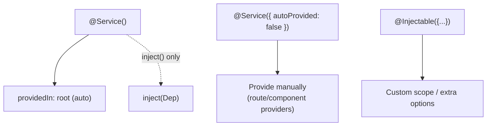

### 10.4 Architecture

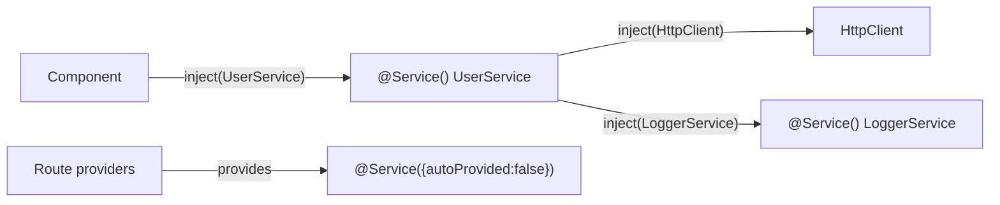

### 10.5 Real example

**Scenario.** A `UserService` and a `LoggerService` should be root singletons. A `FeatureConfigService` should be scoped to a specific lazy route, not global.

**Problem.** Writing `@Injectable({ providedIn: 'root' })` repeatedly obscures intent, and the team wants the scoped service to *not* leak into the root injector.

**Solution.** Use `@Service()` for the root singletons (with `inject()` for dependencies) and `@Service({ autoProvided: false })` for the route-scoped one, providing it in the route.

**Implementation.**

```typescript
import { inject } from '@angular/core';
import { Service } from '@angular/core';
import { HttpClient } from '@angular/common/http';

// Root singleton — concise and intention-revealing.
@Service()
export class LoggerService {
  log(message: string) {
    console.log(`[app] ${message}`);
  }
}

// Root singleton using inject() for its dependencies (required by @Service).
@Service()
export class UserService {
  private readonly http = inject(HttpClient);
  private readonly logger = inject(LoggerService);

  list() {
    this.logger.log('fetching users');
    return this.http.get<User[]>('/api/users');
  }
}

// Not root-provided: opt out, then provide it where it belongs.
@Service({ autoProvided: false })
export class FeatureConfigService {
  private readonly http = inject(HttpClient);
  load() {
    return this.http.get('/api/feature-config');
  }
}
```

Providing the opted-out service on a lazy route:

```typescript
import { Routes } from '@angular/router';
import { FeatureConfigService } from './feature-config.service';

export const featureRoutes: Routes = [
  {
    path: 'feature',
    providers: [FeatureConfigService], // scoped to this route subtree
    loadComponent: () => import('./feature.component').then((m) => m.FeatureComponent),
  },
];
```

**Result.** Root services read clearly as `@Service()` and use modern `inject()`. The scoped service stays out of the root injector via `autoProvided: false` and is provided exactly where needed. New services generated by the CLI follow this style automatically.

**Future improvements.** Adopt `@Service` for new services consistently; gradually convert legacy `@Injectable({ providedIn: 'root' })` classes (only where they already use `inject()` or can be refactored to); reserve `@Injectable` for non-root scopes and special provider options.

### 10.6 Exercises

1. Convert an `@Injectable({ providedIn: 'root' })` service that uses `inject()` into a `@Service()`.
2. Explain why constructor injection is not allowed on `@Service` classes.
3. Use `@Service({ autoProvided: false })` and provide the service on a route.

### 10.7 Challenges

- **Challenge.** Audit your services: list which can become `@Service()` as-is, which need an `inject()` refactor first, and which should stay `@Injectable` (and why).

### 10.8 Checklist

- [ ] New root services use `@Service()`.
- [ ] `@Service` classes use `inject()`, not constructor injection.
- [ ] I use `autoProvided: false` for non-root services.
- [ ] I keep `@Injectable` for custom scopes/options.
- [ ] I know there's no automatic migration for `@Service`.

### 10.9 Best practices

- Default to `@Service()` for root singletons; let the name document the intent.
- Always use `inject()` inside `@Service` classes (it's required and pairs with `injectAsync`).
- Use `autoProvided: false` + route/component providers to scope services intentionally.

### 10.10 Anti-patterns

- Trying to use a constructor with parameter injection on a `@Service` class (unsupported).
- Mass-converting every `@Injectable` to `@Service` in one commit (no migration; do it incrementally).
- Using `@Service()` for something that needs a non-root scope (use `@Injectable` or `autoProvided: false`).

### 10.11 Troubleshooting

| Symptom | Likely cause | Action |
|---------|--------------|--------|
| `@Service` dependencies are `undefined` | Used constructor injection | Switch to `inject()` |
| Service unexpectedly global | `autoProvided` defaults to root | Set `autoProvided: false` and provide manually |
| CLI generated `@Service` but you needed a scope | Default generator | Use `ng generate service --injectable` |
| Wanted to convert old service automatically | No migration exists | Convert manually |
| Circular DI with `@Service` | Eager mutual injection | Break the cycle or use `injectAsync` (Chapter 11) |

### 10.12 Official references

- The `@Service` decorator (What's new in Angular 22): https://blog.ninja-squad.com/2026/06/03/what-is-new-angular-22.0
- Dependency injection: https://angular.dev/guide/di
- `inject()`: https://angular.dev/api/core/inject

---

## Chapter 11 — `injectAsync()` and lazy-loaded services

### 11.1 Introduction

Some services are heavy and rarely needed — a PDF/report generator, a charting engine, an image processor. Eagerly importing them inflates the initial bundle even though most users never trigger them. Angular 22's **`injectAsync()`** lets you **lazy-load a service on demand**: you pass a dynamic `import()`, and Angular loads the chunk *and* instantiates the service through DI when you first call it. An optional `prefetch` (e.g., `onIdle`) can warm the bundle in the background. This chapter shows how to defer heavy services without losing DI.

### 11.2 Business context

Initial bundle size directly affects load time, bounce rate, and Core Web Vitals — which affect conversion and SEO. Heavy, seldom-used services are pure dead weight in that initial payload. `injectAsync()` removes them from the critical path: the code downloads only when (or just before) it's needed, while still being a proper DI-managed service. The result is a smaller initial bundle and faster startup for the common case, with the heavy feature paying its own loading cost only when used — a clean alignment of cost with usage.

### 11.3 Theoretical concepts

- **`injectAsync(loader, options?)`** — `loader` is a function returning a dynamic import promise that resolves to the service class. It returns a function you `await` to get the (lazily loaded, DI-created) instance.
- **Injection context** — like `inject()`, you must call `injectAsync()` from an injection context (e.g., a field initializer in a component or service).
- **Auto-provided requirement** — the target service must be auto-provided: `@Service()` or `@Injectable({ providedIn: 'root' })`.
- **Default exports** — if the service is a default export, you can skip the `.then(m => m.X)`: `injectAsync(() => import('./report.service'))`.
- **`prefetch: onIdle`** — start downloading the chunk when the browser is idle, so the instance is ready by the time the user acts, without blocking startup.

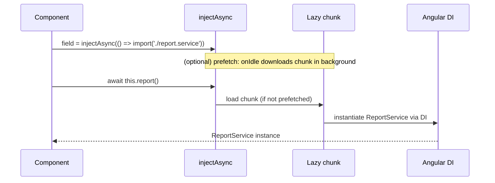

### 11.4 Architecture

```mermaid
flowchart LR
    initial[Initial bundle<br/>small] --> app[App starts fast]
    app -. user clicks Export .-> ia["injectAsync()"]
    ia --> chunk[(report.service chunk)]
    chunk --> di[DI creates ReportService]
    di --> use[exportPdf()]
    idle[onIdle prefetch] -. background .-> chunk
```

### 11.5 Real example

**Scenario.** An admin screen has an "Export PDF" button backed by a heavy `ReportService` (large PDF library). Most admins never click it, so it should not be in the initial bundle. When it *is* likely to be used, the team wants it prefetched on idle for instant response.

**Problem.** `inject(ReportService)` pulls the entire PDF library into the initial chunk, slowing startup for everyone.

**Solution.** Replace eager injection with `injectAsync()` and a dynamic import; optionally add `prefetch: onIdle` so the chunk warms in the background after startup.

**Implementation.**

```typescript
import { Component } from '@angular/core';
import { injectAsync, onIdle } from '@angular/core';

@Component({
  selector: 'app-admin',
  template: `<button (click)="exportPdf()">Export PDF</button>`,
})
export class AdminComponent {
  // Lazy: the report.service chunk is NOT in the initial bundle.
  private readonly reportService = injectAsync(() =>
    import('./report.service').then((m) => m.ReportService),
  );

  async exportPdf() {
    // The chunk loads here (if not prefetched) and DI creates the instance.
    const reportService = await this.reportService();
    await reportService.exportPdf();
  }
}
```

With idle prefetch, the bundle warms in the background so the click is instant:

```typescript
@Component({
  selector: 'app-admin-prefetch',
  template: `<button (click)="exportPdf()">Export PDF</button>`,
})
export class AdminWithPrefetchComponent {
  private readonly reportService = injectAsync(
    () => import('./report.service').then((m) => m.ReportService),
    { prefetch: onIdle }, // download in the background when the browser is idle
  );

  async exportPdf() {
    const reportService = await this.reportService();
    await reportService.exportPdf();
  }
}
```

The lazily loaded service is an ordinary auto-provided service:

```typescript
import { Service, inject } from '@angular/core';

@Service() // auto-provided — required for injectAsync
export class ReportService {
  private readonly http = inject(HttpClient);
  async exportPdf() {
    /* heavy PDF generation lives in this lazy chunk */
  }
}
```

**Result.** The heavy PDF library is excluded from the initial bundle, improving startup for all users. When an admin exports, the chunk loads (or is already warm via `onIdle`) and Angular DI constructs the service normally — full DI, zero initial cost.

**Future improvements.** Use `injectAsync` for other heavy, rarely used services (charting, image processing); tune prefetch strategy (idle vs. on hover/intent); and combine with route-level code-splitting so feature areas load their heavy services lazily by default.

### 11.6 Exercises

1. Convert an eager `inject(HeavyService)` to `injectAsync()` with a dynamic import.
2. Add `prefetch: onIdle` and explain what changes for the user.
3. Show the `injectAsync` form when the service is a default export.

### 11.7 Challenges

- **Challenge.** Measure the initial-bundle reduction after moving a heavy service to `injectAsync`, and verify the service is still fully DI-managed (its own `inject()` dependencies resolve).

### 11.8 Checklist

- [ ] Heavy, rarely-used services use `injectAsync()`.
- [ ] The lazy service is auto-provided (`@Service`/`providedIn: 'root'`).
- [ ] I call `injectAsync()` from an injection context.
- [ ] I `await` the returned function to get the instance.
- [ ] I consider `prefetch: onIdle` for likely-soon usage.

### 11.9 Best practices

- Reserve `injectAsync` for genuinely heavy or seldom-used services; eager `inject()` is simpler for everything else.
- Pair `injectAsync` with `@Service()` so the service is auto-provided and DI-managed.
- Use `prefetch: onIdle` to hide load latency for features users are likely to reach.

### 11.10 Anti-patterns

- Using `injectAsync` for small/always-used services (adds async complexity for no payoff).
- Forgetting the service must be auto-provided (non-auto-provided services can't be `injectAsync`'d).
- Calling `injectAsync` outside an injection context.

### 11.11 Troubleshooting

| Symptom | Likely cause | Action |
|---------|--------------|--------|
| `injectAsync` throws about injection context | Called outside a field initializer/context | Call it in a component/service field initializer |
| Service can't be created | Not auto-provided | Use `@Service()` or `providedIn: 'root'` |
| Chunk loads too late (visible delay) | No prefetch | Add `prefetch: onIdle` |
| `m.ReportService is undefined` | Wrong export mapping | Match the export name, or use default-export form |
| Heavy lib still in initial bundle | Eager import elsewhere | Ensure nothing else statically imports the service |

### 11.12 Official references

- `injectAsync()` (What's new in Angular 22): https://blog.ninja-squad.com/2026/06/03/what-is-new-angular-22.0
- Lazy loading: https://angular.dev/guide/ngmodules/lazy-loading
- Dependency injection: https://angular.dev/guide/di

---

> **End of Part IV.** The service layer is sharper: `@Service()` declares root singletons concisely (using `inject()`), and `injectAsync()` lazy-loads heavy services on demand — optionally prefetched on idle — while keeping full DI. **Part V — Templates, Router & SSR** (Chapters 12–14) covers the compiler/template changes (strictTemplates, optional chaining, `@default never`, new errors), router updates, and HttpClient-with-Fetch plus SSR incremental hydration.

# Part V – Templates, Router & SSR

Part V covers the changes closest to everyday code: the **template compiler** (now strict by default, with smarter optional chaining, exhaustive `@default never`, comments inside elements, and two new errors), the **router** (input-binding options, `browserUrl`, the `canMatch` third parameter, and `paramsInheritanceStrategy: 'always'`), and the **HTTP/SSR** stack (HttpClient on Fetch, incremental hydration by default, and `provideServerRendering` options). These are the changes most likely to touch a real migration diff.

---

## Chapter 12 — Template & compiler changes (strictTemplates, optional chaining, `@default never`, new errors)

### 12.1 Introduction

The Angular template compiler received several v22 changes that improve type safety and ergonomics: **`strictTemplates` is now the default**, **optional chaining (`?.`) aligns with TypeScript semantics** (returns `undefined`, and the compiler now understands `@if` guards), **`@default never(entity)`** enables exhaustive switches even on nested discriminants, **comments are allowed inside elements**, and two **new compiler errors** (NG8023, NG1054) catch problems at build time. This chapter walks each change and its migration impact.

### 12.2 Business context

Template bugs are uniquely costly: they often escape type checking and surface only at runtime, in production, in front of users. Strict templates by default shifts these failures left — caught at build time, in CI, before merge. The optional-chaining alignment removes a long-standing footgun where Angular and TypeScript disagreed on what `a?.b` returns. The new compile-time errors (duplicate inputs, multiple matching components) eliminate a class of subtle runtime ambiguities. The business effect is fewer production template defects and more trustworthy CI, at the price of fixing the type errors strictness surfaces — which migrations make manageable by temporarily preserving the old behavior.

### 12.3 Theoretical concepts

- **`strictTemplates` default.** Strict template type-checking is on without configuration. The migration writes `strictTemplates: false` to preserve old behavior; removing it surfaces real type errors to fix.
- **Optional chaining alignment.** `project?.author` now returns `undefined` (matching TS) instead of Angular's historical `null`. Also, the compiler now understands that `@if (project?.author) { {{ project.author }} }` is safe — the `?.` workaround inside the guard is no longer needed. Extended diagnostics `nullishCoalescingNotNullable`/`optionalChainNotNullable` may flag now-unnecessary workarounds. A migration wraps breaking expressions in **`$safeNavigationMigration()`** to preserve old semantics until you review them.
- **`@default never(entity)`.** Exhaustive `@switch` now works even when the discriminant is a nested property access, by naming the entity: `@default never(data)`. Simple-value discriminants still use bare `@default never`.
- **Comments inside elements.** `<div /* c */>` and `<div // c \n>` are now valid.
- **NG8023.** Compile-time error when multiple components match the same node (previously a runtime issue).
- **NG1054.** Compile-time error when a component exposes two inputs/outputs/models with the same name (e.g., via alias). The model+output name clash is auto-fixed by migration to an input + `linkedSignal`.

```mermaid
flowchart TB
    tmpl[Template compiler v22] --> strict[strictTemplates default]
    tmpl --> oc["?. aligns with TS<br/>@if guard understood<br/>$safeNavigationMigration"]
    tmpl --> sw["@default never(entity)<br/>nested discriminants"]
    tmpl --> com[comments inside elements]
    tmpl --> e1[NG8023 multiple components match]
    tmpl --> e2[NG1054 duplicate input/output name]
```

### 12.4 Architecture

```mermaid
flowchart LR
    src[Template source] --> compile[AOT compiler]
    compile -->|type errors| ci[CI fails early]
    compile -->|NG8023/NG1054| build[Build error]
    compile --> diag[Extended diagnostics]
    migration["ng update migrations"] -.-> safe["$safeNavigationMigration()"]
    migration -.-> strictoff["strictTemplates: false"]
    migration -.-> fix["model+output → input + linkedSignal"]
```

### 12.5 Real example

**Scenario.** After upgrading, a component's template uses a nested discriminated union in a `@switch`, has an optional-chaining expression the migration wrapped, and a component declares both a `model` and an `output` with the same name (triggering NG1054).

**Problem.** The team must (a) make the switch exhaustive on a nested discriminant, (b) decide whether to remove the `$safeNavigationMigration()` wrapper, and (c) resolve the duplicate-name error.

**Solution.** Use `@default never(data)` for the nested discriminant, simplify the optional chaining now that guards are understood, and replace the `model`+`output` clash with an `input` + `linkedSignal` (the migration does this automatically).

**Implementation.**

```typescript
import { Component, input, linkedSignal, output, signal } from '@angular/core';

type ChartData =
  | { type: 'line-chart'; points: number[] }
  | { type: 'bar-chart'; bars: number[] };

@Component({
  selector: 'app-chart-host',
  template: `
    @let data = chartData();
    @switch (data.type) {
      @case ('line-chart') {
        <line-chart [points]="data.points" />
      }
      @case ('bar-chart') {
        <bar-chart [bars]="data.bars" />
      }
      <!-- Nested/typed discriminant: name the entity so the compiler
           can enforce exhaustiveness. Adding a new variant now fails to compile. -->
      @default never(data);
    }

    <!-- Optional chaining: the @if guard is understood; no ?. workaround needed. -->
    @if (project()?.author) {
      <span>{{ project()!.author }}</span>
    }
  `,
})
export class ChartHostComponent {
  protected readonly chartData = signal<ChartData>({ type: 'line-chart', points: [] });
  protected readonly project = signal<{ author?: string } | null>(null);
}
```

The NG1054 fix the migration applies for a `model`+`output` name clash:

```typescript
// Before (NG1054: model and output both named "user"):
// readonly user = model('');
// readonly userChange = output<string>();

// After (auto-migrated): input + linkedSignal preserves two-way-like behavior.
readonly userInput = input('', { alias: 'user' });
readonly user = linkedSignal(this.userInput);
readonly userChange = output<string>();
```

If a node is matched by two components, NG8023 now fails the build, forcing you to disambiguate selectors:

```text
[ERROR] NG8023: Multiple components match node with tagname pr-menu: 'Menu', 'OtherMenu'.
```

**Result.** The switch is provably exhaustive (future variants break the build), the optional chaining is clean and TS-aligned, and the duplicate-name and multiple-match ambiguities are caught at compile time instead of production. With `strictTemplates` on, template type errors surface in CI.

**Future improvements.** Remove every `$safeNavigationMigration()` wrapper after confirming the `undefined` semantics are correct; remove `strictTemplates: false` and fix surfaced errors; re-enable the `optionalChainNotNullable`/`nullishCoalescingNotNullable` diagnostics to clean up leftover workarounds.

### 12.6 Exercises

1. Make a `@switch` over a nested discriminant exhaustive with `@default never(entity)`.
2. Identify an optional-chaining workaround that's now unnecessary and remove it.
3. Explain what NG8023 and NG1054 each catch and why at compile time is better.

### 12.7 Challenges

- **Challenge.** Turn off `strictTemplates: false` in one feature, fix all surfaced template type errors, and remove any `$safeNavigationMigration()` wrappers in that area — documenting each decision.

### 12.8 Checklist

- [ ] I know `strictTemplates` is the default.
- [ ] I use `@default never(entity)` for nested discriminants.
- [ ] I removed unnecessary `?.` workarounds inside guards.
- [ ] I reviewed/removed `$safeNavigationMigration()` wrappers.
- [ ] I resolved NG8023/NG1054 errors at the source.

### 12.9 Best practices

- Treat `strictTemplates` as a feature: fix the errors it finds rather than suppressing it.
- Use exhaustive `@switch` (`@default never`) so adding a variant fails the build until handled.
- Align template optional chaining with TS semantics; remove legacy `?.` workarounds.

### 12.10 Anti-patterns

- Leaving `strictTemplates: false` permanently (permanent type-safety debt).
- Keeping `$safeNavigationMigration()` wrappers indefinitely instead of reviewing them.
- Disambiguating an NG8023 clash by deleting one component blindly instead of fixing selectors.

### 12.11 Troubleshooting

| Symptom | Likely cause | Action |
|---------|--------------|--------|
| New template type errors after upgrade | `strictTemplates` default | Fix types, or temporarily keep `strictTemplates: false` |
| `@default never` rejects nested discriminant | Missing entity name | Use `@default never(entity)` |
| `?.` returns `undefined` now, breaking logic | TS-aligned semantics | Review; the migration's `$safeNavigationMigration()` preserves old behavior |
| Build error NG8023 | Two components match one node | Make selectors distinct |
| Build error NG1054 | Duplicate input/output/model name | Rename/alias uniquely; model+output → input + linkedSignal |

### 12.12 Official references

- Template/compiler changes (What's new in Angular 22): https://blog.ninja-squad.com/2026/06/03/what-is-new-angular-22.0
- Template type checking: https://angular.dev/tools/cli/template-typecheck
- Control flow (`@switch`): https://angular.dev/guide/templates/control-flow

---

## Chapter 13 — Router changes (input binding options, `browserUrl`, `canMatch`, param inheritance)

### 13.1 Introduction

The Angular 22 router gains several refinements. **`withComponentInputBinding()`** now accepts options (`queryParams`, `unmatchedInputBehavior`) to control how route data maps to component inputs. **`RouterLink` gains `browserUrl`** to display one URL while navigating to another. Two **breaking changes** land: **`canMatch` guards now receive a mandatory third parameter** (`currentSnapshot`, auto-migrated), and **`paramsInheritanceStrategy` defaults to `'always'`** (no migration — manual decision). This chapter covers each with practical guidance.

### 13.2 Business context

Routing is the backbone of navigation and deep-linking; subtle router behavior changes can break bookmarks, analytics, and access control. The input-binding options let teams precisely control which route data reaches components — avoiding accidental `undefined` overwrites that cause flicker or lost state. `browserUrl` enables clean, shareable URLs that hide internal route structure (useful for vanity profile URLs). The two breaking changes matter for correctness: `canMatch`'s new parameter improves guard decisions, and the params-inheritance default change can silently alter which params child routes see — a thing to decide consciously, since there is **no migration** for it.

### 13.3 Theoretical concepts

- **`withComponentInputBinding(options?)`**:
  - `queryParams` (boolean, default `true`) — whether query params bind as inputs.
  - `unmatchedInputBehavior` — what to bind when an input has no matching param: `'alwaysUndefined'` (default) always binds `undefined`; `'undefinedIfStale'` binds `undefined` only if the input was previously set by the router for the active route (avoids clobbering inputs the router never owned).
- **`RouterLink` `browserUrl`** — navigate to one route but show a different URL in the address bar: `[routerLink]="['/users', id]" browserUrl="/my-profile"`.
- **`canMatch` third parameter (breaking)** — guards now receive `(route, segments, currentSnapshot)`. Auto-migrated.
- **`paramsInheritanceStrategy: 'always'` (breaking, no migration)** — child routes inherit parent params by default. Set `'emptyOnly'` to restore the old behavior (inherit only when the child has no params of its own).

```mermaid
flowchart TB
    router[Router v22] --> bind["withComponentInputBinding(<br/>{ queryParams, unmatchedInputBehavior })"]
    router --> link["RouterLink browserUrl"]
    router --> cm["canMatch(route, segments, currentSnapshot)"]
    router --> inh["paramsInheritanceStrategy: 'always' (default)"]
```

### 13.4 Architecture

```mermaid
flowchart LR
    url[URL change] --> match[Route matching]
    match --> guard["canMatch(route, segments, currentSnapshot)"]
    guard -->|true| activate[Activate route]
    activate --> inputs["Bind params/query → component inputs<br/>(unmatchedInputBehavior)"]
    parent[Parent params] -->|always inherit| child[Child route params]
    activate --> address["Address bar (browserUrl override)"]
```

### 13.5 Real example

**Scenario.** A `UserProfileComponent` reads its `id` from the route as an input and a `tab` from query params. The team wants: query params bound as inputs, stale inputs left alone (not forced to `undefined`), a vanity URL `/my-profile` for the current user, a `canMatch` guard using the new snapshot, and explicit control over param inheritance.

**Problem.** Defaults may bind `undefined` over inputs the router never set, the `canMatch` guard needs updating for the new signature, and `paramsInheritanceStrategy: 'always'` could change which params the component sees.

**Solution.** Configure `withComponentInputBinding` options, set `browserUrl` on the link, update the guard, and choose the inheritance strategy explicitly.

**Implementation.**

```typescript
import { ApplicationConfig } from '@angular/core';
import {
  provideRouter, withComponentInputBinding, Routes,
  CanMatchFn, Route, UrlSegment,
} from '@angular/router';

// canMatch now receives a mandatory third parameter: currentSnapshot.
const adminGuard: CanMatchFn = (route, segments, currentSnapshot) => {
  // Use the current router state snapshot in the decision.
  const isAdmin = inject(AuthService).isAdmin();
  return isAdmin;
};

const routes: Routes = [
  {
    path: 'users/:id',
    canMatch: [adminGuard],
    loadComponent: () =>
      import('./user-profile.component').then((m) => m.UserProfileComponent),
  },
];

export const appConfig: ApplicationConfig = {
  providers: [
    provideRouter(
      routes,
      withComponentInputBinding({
        queryParams: true,                  // bind query params as inputs (default)
        unmatchedInputBehavior: 'undefinedIfStale', // don't clobber router-unowned inputs
      }),
    ),
    // Explicit choice — there is NO migration for this default change.
    // Keep legacy behavior by overriding the default 'always':
    // provideRouter(routes, withRouterConfig({ paramsInheritanceStrategy: 'emptyOnly' })),
  ],
};
```

The component reads route data as inputs:

```typescript
import { Component, input } from '@angular/core';

@Component({
  selector: 'app-user-profile',
  template: `<h1>User {{ id() }} — tab: {{ tab() }}</h1>`,
})
export class UserProfileComponent {
  readonly id = input.required<string>();         // from /users/:id
  readonly tab = input<string>('overview');       // from query param ?tab=
}
```

Vanity URL with `browserUrl`:

```html
<!-- Navigates to /users/:id but shows /my-profile in the address bar -->
<a [routerLink]="['/users', currentUserId()]" browserUrl="/my-profile">My profile</a>
```

**Result.** Inputs bind from path and query params; stale inputs the router never owned are left intact (`undefinedIfStale`); the address bar shows a clean `/my-profile` while routing to the real `/users/:id`; the guard compiles with the new signature; and param inheritance is a deliberate choice rather than a silent default.

**Future improvements.** Adopt `'undefinedIfStale'` app-wide to prevent input flicker; standardize vanity URLs via `browserUrl`; audit all `canMatch` guards to actually use `currentSnapshot` where it improves decisions.

### 13.6 Exercises

1. Configure `withComponentInputBinding` to disable query-param binding and explain the effect.
2. Add `browserUrl` to a link and describe what the user sees vs. where they navigate.
3. Update a `canMatch` guard to the v22 three-parameter signature.

### 13.7 Challenges

- **Challenge.** Decide and justify a `paramsInheritanceStrategy` for a nested route tree in your app, then verify which params each child component actually receives under your choice.

### 13.8 Checklist

- [ ] I set `withComponentInputBinding` options intentionally.
- [ ] I use `unmatchedInputBehavior: 'undefinedIfStale'` where appropriate.
- [ ] I use `browserUrl` for vanity/clean URLs.
- [ ] All `canMatch` guards use the three-parameter signature.
- [ ] I chose `paramsInheritanceStrategy` explicitly (no migration).

### 13.9 Best practices

- Prefer `'undefinedIfStale'` to avoid overwriting inputs the router never set.
- Use `browserUrl` to decouple shareable URLs from internal route structure.
- Make `paramsInheritanceStrategy` an explicit, documented decision per app.

### 13.10 Anti-patterns

- Relying on the new `'always'` inheritance default without verifying child params.
- Leaving query-param binding on when components don't expect those inputs.
- Ignoring `currentSnapshot` in `canMatch` when it would improve the guard.

### 13.11 Troubleshooting

| Symptom | Likely cause | Action |
|---------|--------------|--------|
| Component input becomes `undefined` unexpectedly | `'alwaysUndefined'` default | Use `'undefinedIfStale'` |
| Child route sees parent params it shouldn't | `'always'` inheritance default | Set `'emptyOnly'` |
| `canMatch` guard fails to compile | Missing third parameter | Add `currentSnapshot` parameter |
| Address bar shows internal route | No `browserUrl` | Add `browserUrl` to the link |
| Query params not bound | `queryParams: false` | Enable `queryParams` in options |

### 13.12 Official references

- Router changes (What's new in Angular 22): https://blog.ninja-squad.com/2026/06/03/what-is-new-angular-22.0
- Router guide: https://angular.dev/guide/routing
- Component input binding: https://angular.dev/guide/routing/router-reference

---

## Chapter 14 — HttpClient with Fetch, and SSR (incremental hydration by default)

### 14.1 Introduction

Angular 22 modernizes the HTTP and server-rendering stack. **`HttpClient` now uses the Fetch API** by default (`withFetch()` is deprecated; use `withXhr()` to keep XHR). The only Fetch gap is **upload progress**, so `reportProgress` is deprecated in favor of `reportUploadProgress`/`reportDownloadProgress`. For SSR, **incremental hydration is the default** (`withIncrementalHydration()` deprecated), and **`provideServerRendering()` accepts an options object** with `maxResponseBodySize`. This chapter covers the new HTTP defaults and the SSR changes.

### 14.2 Business context

The HTTP and SSR layers determine performance, server cost, and compatibility with edge/serverless runtimes. Fetch is the platform-standard, edge-compatible request API — moving to it by default improves SSR performance and runtime compatibility (Fetch works where XHR may not). Incremental hydration by default means the browser hydrates only the parts of the page the user interacts with, reducing main-thread work and time-to-interactive — a direct UX and Core Web Vitals win. The `maxResponseBodySize` guard protects servers from oversized responses. The one trade-off — no upload progress under Fetch — is explicit and opt-out-able via `withXhr()`.

### 14.3 Theoretical concepts

- **Fetch by default.** `provideHttpClient()` uses Fetch automatically. `withFetch()` is deprecated/no-op; `withXhr()` restores XHR. Migration removes `withFetch()` or adds `withXhr()` to preserve old behavior.
- **Progress reporting.** Fetch can't report upload progress. `reportProgress` is deprecated; use `reportUploadProgress` (XHR-only) and `reportDownloadProgress`.
- **Incremental hydration default (SSR).** Hydrates content lazily as needed. `withIncrementalHydration()` is deprecated; `withNoIncrementalHydration()` restores the old full-hydration behavior (added by migration if you weren't using incremental hydration).
- **`provideServerRendering(options?, ...features)`.** Accepts an options object first; `maxResponseBodySize` (bytes, default 1 MB) caps the SSR response body.

```mermaid
flowchart TB
    http["provideHttpClient()"] --> fetch[Fetch by default]
    fetch -. opt out .-> xhr["withXhr() for upload progress"]
    fetch --> prog["reportUploadProgress / reportDownloadProgress"]
    ssr["provideServerRendering({ maxResponseBodySize }, …)"] --> ih[Incremental hydration default]
    ih -. opt out .-> nih["withNoIncrementalHydration()"]
```

### 14.4 Architecture

```mermaid
flowchart LR
    comp[Component] --> hc[HttpClient]
    hc -->|Fetch default| net[(Network/edge)]
    hc -.->|withXhr for uploads| xhr[XHR]
    server[SSR server] --> psr["provideServerRendering({ maxResponseBodySize })"]
    psr --> html[Server HTML]
    html --> client[Client]
    client --> hyd[Incremental hydration]
```

### 14.5 Real example

**Scenario.** An app does normal REST calls (fine on Fetch), one large file upload that needs a progress bar, and is server-rendered. The team upgrades to v22 and wants Fetch by default, working upload progress, incremental hydration, and a 2 MB SSR response cap.

**Problem.** Fetch can't report upload progress, so the upload feature must opt into XHR; meanwhile the app should benefit from incremental hydration and guard its SSR response size.

**Solution.** Use Fetch by default for the app; keep XHR only where upload progress is needed (or restructure to use `reportDownloadProgress` where applicable); rely on incremental hydration; and pass `maxResponseBodySize` to `provideServerRendering`.

**Implementation.**

```typescript
// app.config.ts (client)
import { ApplicationConfig } from '@angular/core';
import { provideHttpClient } from '@angular/common/http';
import { provideClientHydration } from '@angular/platform-browser';

export const appConfig: ApplicationConfig = {
  providers: [
    // Fetch is the default now — no withFetch() needed.
    provideHttpClient(),
    // Incremental hydration is the default; no withIncrementalHydration() needed.
    provideClientHydration(),
  ],
};
```

```typescript
// app.config.server.ts (server)
import { mergeApplicationConfig } from '@angular/core';
import { provideServerRendering, withRoutes } from '@angular/ssr';
import { serverRoutes } from './app.routes.server';

const serverConfig = {
  providers: [
    provideServerRendering(
      { maxResponseBodySize: 2 * 1024 * 1024 }, // 2 MB cap
      withRoutes(serverRoutes),
    ),
  ],
};
```

Upload with progress requires XHR (Fetch can't report upload progress):

```typescript
import { inject } from '@angular/core';
import { HttpClient, HttpEventType, HttpRequest } from '@angular/common/http';

export class UploadService {
  private readonly http = inject(HttpClient);

  upload(file: File) {
    const req = new HttpRequest('POST', '/api/upload', file, {
      // reportUploadProgress (XHR-only) replaces the deprecated reportProgress.
      reportUploadProgress: true,
    });
    return this.http.request(req); // emits UploadProgress events under XHR
  }
}
```

To keep XHR for the parts that need upload progress, opt out at the provider level:

```typescript
import { provideHttpClient, withXhr } from '@angular/common/http';

// If your app relies on upload progress broadly, keep XHR:
provideHttpClient(withXhr());
```

**Result.** Standard requests run on Fetch with better SSR/edge compatibility; incremental hydration improves time-to-interactive automatically; the SSR response is capped at 2 MB; and the upload feature reports progress by using XHR (`reportUploadProgress`) where Fetch falls short.

**Future improvements.** Migrate uploads to a resumable/chunked protocol so download-progress events suffice and full XHR can be dropped; tune `maxResponseBodySize` per route; profile hydration to confirm interactive regions hydrate first.

### 14.6 Exercises

1. Remove `withFetch()` from a config and confirm Fetch is the default.
2. Convert a `reportProgress: true` upload to `reportUploadProgress` and note the XHR requirement.
3. Set `maxResponseBodySize` and explain what it protects against.

### 14.7 Challenges

- **Challenge.** Audit your HTTP calls: identify any that require upload progress, isolate them behind `withXhr()`/`reportUploadProgress`, and move everything else to Fetch defaults.

### 14.8 Checklist

- [ ] I removed `withFetch()` (Fetch is default).
- [ ] I use `withXhr()` only where upload progress is required.
- [ ] I replaced `reportProgress` with `reportUploadProgress`/`reportDownloadProgress`.
- [ ] Incremental hydration is enabled (default).
- [ ] I set `maxResponseBodySize` for SSR if needed.

### 14.9 Best practices

- Default to Fetch; reserve XHR for the narrow case of upload progress.
- Use `reportUploadProgress`/`reportDownloadProgress` for clarity over the deprecated `reportProgress`.
- Keep incremental hydration on; design components so interactive regions hydrate first.
- Set a sensible `maxResponseBodySize` to protect the SSR server.

### 14.10 Anti-patterns

- Forcing `withXhr()` app-wide just to keep one upload working (isolate it instead).
- Continuing to use `reportProgress` (deprecated, ambiguous under Fetch).
- Disabling incremental hydration without a measured reason.

### 14.11 Troubleshooting

| Symptom | Likely cause | Action |
|---------|--------------|--------|
| Upload progress events stopped | Fetch can't report upload progress | Use `withXhr()` + `reportUploadProgress` |
| `reportProgress` warnings | Deprecated under Fetch | Switch to `reportUploadProgress`/`reportDownloadProgress` |
| SSR responses truncated | `maxResponseBodySize` too low | Raise the limit in `provideServerRendering` |
| Hydration mismatch / flicker | Mixed hydration assumptions | Verify incremental hydration boundaries; or `withNoIncrementalHydration()` |
| Requests behave differently after upgrade | Fetch vs XHR semantics | Confirm intended transport; opt into `withXhr()` if needed |

### 14.12 Official references

- HTTP & SSR changes (What's new in Angular 22): https://blog.ninja-squad.com/2026/06/03/what-is-new-angular-22.0
- HttpClient: https://angular.dev/guide/http
- SSR & hydration: https://angular.dev/guide/hydration

---

> **End of Part V.** Templates are strict by default with TS-aligned optional chaining, exhaustive `@default never(entity)`, and new compile-time errors (NG8023/NG1054); the router gains input-binding options, `browserUrl`, the `canMatch` snapshot parameter, and `'always'` param inheritance; and the HTTP/SSR stack runs on Fetch with incremental hydration by default plus `provideServerRendering` options. **Part VI — AI & WebMCP** (Chapters 15–16) covers building and debugging Angular apps with AI (skills, MCP, DevTools) and WebMCP tools integrated with Signal Forms.

# Part VI – AI & WebMCP

Part VI covers the fastest-growing area of recent Angular releases: AI tooling. Chapter 15 is about **building and debugging Angular apps with AI** — the official Angular **skills** (`npx skills add https://github.com/angular/skills`), the CLI **MCP server**, and the new dev-mode **DevTools agent tools** (signal graph, DI graph). Chapter 16 covers **WebMCP**, a proposed standard that lets a web page expose Model Context Protocol tools directly — and how Angular 22 lets you declare those tools imperatively or generate them automatically from **Signal Forms**.

---

## Chapter 15 — Building and debugging Angular apps with AI (skills, MCP, DevTools)

### 15.1 Introduction

Angular 22 leans into AI-assisted development. The Angular team now ships **skills** — packaged guidance that teaches a coding agent how to write idiomatic, up-to-date Angular code — installable with `npx skills add https://github.com/angular/skills`. The CLI's **MCP server** (since v20.1) lets agents interact with your project, though with skills now driving code generation, the MCP dropped its `find_examples` and `modernize` tools. For debugging, a dev-mode Angular app now exposes the **signal graph** and **dependency-injection graph** as Chrome DevTools third-party tools, which an agent can call via `chrome-devtools-mcp`. This chapter explains how to set these up and use them.

### 15.2 Business context

AI coding assistants are now part of most teams' workflow, but their output quality depends entirely on context. A generic model often produces outdated Angular patterns (NgModules, constructor DI, old forms) that create tech debt. Official skills inject *current* best practices, so the agent generates v22-idiomatic code (signals, Signal Forms, resources, `@Service`) — raising baseline quality and reducing review churn. The DevTools agent tools let an assistant *inspect a running app's real state* when debugging, turning vague "it's broken" prompts into grounded diagnoses. The business value: faster, more correct AI-assisted development and debugging, with less drift from framework best practices.

### 15.3 Theoretical concepts

- **Skills.** Task- and context-specific guidance for a coding agent. The Angular set adds two: `angular-new-app` (creating projects) and `angular-developer` (generating code + architectural guidance, kept current with the framework). The agent loads the relevant skill when asked to write Angular code.
- **CLI MCP server.** A Model Context Protocol server (since v20.1) letting agents interact with the project. In v22, with skills leading code generation, it no longer offers `find_examples`/`modernize`.
- **DevTools agent tools (dev mode).** A running dev app exposes two tools mirroring Angular DevTools — the **signal graph** (reactive dependencies/state) and the **DI graph** (provider relationships) — registered as Chrome DevTools third-party tools.
- **`chrome-devtools-mcp`.** Connects an agent to Chrome DevTools so it can call those Angular tools (requires enabling third-party tools via MCP flags).

```mermaid
flowchart TB
    agent[Coding agent] --> skills["Angular skills<br/>angular-new-app / angular-developer"]
    agent --> mcp["Angular CLI MCP server<br/>(no find_examples/modernize in v22)"]
    agent --> cdmcp[chrome-devtools-mcp]
    cdmcp --> devtools[Chrome DevTools<br/>third-party tools]
    devtools --> sg[Signal graph]
    devtools --> dig[DI graph]
    devapp[Dev-mode Angular app] --> sg
    devapp --> dig
```

### 15.4 Architecture

```mermaid
flowchart LR
    dev[Developer] --> agent[AI agent]
    agent -- generate code --> skills[Angular skills]
    agent -- project ops --> mcp[CLI MCP]
    agent -- inspect state --> cdmcp[chrome-devtools-mcp]
    cdmcp --> app[(Running dev app)]
    app --> graphs[Signal + DI graphs]
    graphs --> agent
    agent --> fix[Proposed fix]
```

### 15.5 Real example

**Scenario.** A team wants their AI assistant to generate v22-idiomatic Angular code and to help debug a component whose signal isn't updating, by inspecting the running app's reactive state.

**Problem.** Without skills, the agent emits outdated patterns; without DevTools access, it can only guess at the cause of the reactivity bug.

**Solution.** Install the Angular skills so generation follows current best practices, and connect the agent to Chrome DevTools via `chrome-devtools-mcp` so it can read the signal graph of the running app.

**Implementation.**

```bash
# 1) Install the official Angular skills for your coding agent.
npx skills add https://github.com/angular/skills
# This adds: angular-new-app and angular-developer.

# 2) Run the app in dev mode so it exposes the signal/DI graphs.
ng serve

# 3) Connect the agent to Chrome DevTools (chrome-devtools-mcp),
#    enabling third-party tools so the Angular signal/DI graph tools are callable.
#    (Exact MCP flags depend on your agent/runner setup.)
```

A sample debugging interaction (conceptual) the agent can now perform:

```text
Agent: Reading the signal graph of the running app…
  - Found signal `count` with 0 dependent views.
  - The template reads `count` but the binding path shows no subscription.
Diagnosis: the template interpolates a captured value, not `count()`.
Fix: change {{ count }} to {{ count() }} so the view subscribes to the signal.
```

The generated code (driven by the `angular-developer` skill) is v22-idiomatic by default:

```typescript
import { Component, signal, computed } from '@angular/core';

@Component({
  selector: 'app-counter',
  // OnPush by default in v22 — signals make it transparent.
  template: `
    <button (click)="inc()">+</button>
    <span>{{ count() }}</span>          <!-- call the signal -->
    <span>doubled: {{ doubled() }}</span>
  `,
})
export class CounterComponent {
  protected readonly count = signal(0);
  protected readonly doubled = computed(() => this.count() * 2);
  inc() { this.count.update((n) => n + 1); }
}
```

**Result.** The assistant now generates current Angular (signals, OnPush-aware, no NgModules), and when debugging it inspects the *actual* signal graph of the running app to pinpoint why a view isn't updating — a grounded fix rather than a guess.

**Future improvements.** Add project-specific skills (your conventions, design system); wire the DI graph into the agent's debugging flow for provider issues; integrate the MCP server into CI-style code reviews.

### 15.6 Exercises

1. Install the Angular skills and identify which skill the agent loads when asked to scaffold a new app vs. generate a component.
2. Explain what the signal graph and DI graph each reveal during debugging.
3. Describe why the CLI MCP dropped `find_examples`/`modernize` in v22.

### 15.7 Challenges

- **Challenge.** Reproduce a reactivity bug, then use the DevTools signal graph (via `chrome-devtools-mcp`) to have an agent diagnose it. Document the graph evidence that led to the fix.

### 15.8 Checklist

- [ ] Angular skills installed (`npx skills add …`).
- [ ] Agent generates v22-idiomatic code (signals, no NgModules).
- [ ] App runs in dev mode (graphs exposed).
- [ ] `chrome-devtools-mcp` connected with third-party tools enabled.
- [ ] I can inspect the signal and DI graphs from the agent.

### 15.9 Best practices

- Keep the Angular skills installed and updated so generated code tracks the framework.
- Use the DevTools graphs for *grounded* debugging instead of speculative prompts.
- Layer project-specific skills on top of the official ones for your conventions.

### 15.10 Anti-patterns

- Accepting AI-generated legacy patterns (NgModules, constructor DI) without skills.
- Debugging reactivity by guessing instead of reading the signal graph.
- Expecting `find_examples`/`modernize` from the MCP (removed in v22 — skills handle generation).

### 15.11 Troubleshooting

| Symptom | Likely cause | Action |
|---------|--------------|--------|
| Agent emits outdated Angular | Skills not installed | Run `npx skills add https://github.com/angular/skills` |
| DevTools tools not callable | Third-party tools disabled | Enable third-party tools via `chrome-devtools-mcp` flags |
| No signal/DI graph | App not in dev mode | Run `ng serve` (graphs are dev-only) |
| MCP `find_examples` missing | Removed in v22 | Rely on the `angular-developer` skill |
| Agent can't see app state | `chrome-devtools-mcp` not connected | Connect the agent to Chrome DevTools |

### 15.12 Official references

- AI tooling, skills & DevTools (What's new in Angular 22): https://blog.ninja-squad.com/2026/06/03/what-is-new-angular-22.0
- Angular skills repository: https://github.com/angular/skills
- chrome-devtools-mcp: https://github.com/ChromeDevTools/chrome-devtools-mcp

---

## Chapter 16 — WebMCP tools and Signal Forms integration

### 16.1 Introduction

**WebMCP** is a proposed web standard letting a web page expose **Model Context Protocol** capabilities directly — so an AI agent can use a *website itself* as a tool. It has two parts: an **imperative API** (a page declares tools in code) and a **declarative API** (forms with special attributes become callable tools). Angular 22 (experimentally) supports both: **`declareExperimentalWebMcpTool()`** and **`provideExperimentalWebMcpTool()`** for imperative tools, and **`provideExperimentalWebMcpForms()`** to auto-register tools from **Signal Forms**. This chapter shows how to expose your app's capabilities to agents. (WebMCP is very early — it needs a flag in Chrome Beta today.)

### 16.2 Business context

As AI agents increasingly act on the web, the apps that expose clean, structured capabilities to them gain a distribution advantage: an agent can complete a task on your site without brittle DOM scraping. WebMCP turns your existing UI logic — list users, create a user — into agent-callable tools with typed schemas. For Angular shops, the Signal Forms integration is especially valuable: a form you already built becomes an agent tool *for free*, with its input schema generated from the fields and submission handled by the existing form logic. This is forward-looking (experimental, flag-gated), but positions the product for the agentic web with minimal extra code.

### 16.3 Theoretical concepts

- **`declareExperimentalWebMcpTool(config)`** (`@angular/core`) — declares a tool imperatively from within a component. Config: `name`, `description`, `inputSchema` (JSON Schema), and `execute`. You can call `inject()` inside `execute`. Angular destroys the tool when the component is destroyed.
- **`provideExperimentalWebMcpTool([...])`** — declares tools at the application or route provider level (for app-/route-scoped tools).
- **Declarative forms (raw HTML).** Adding `toolname`/`tooldescription` attributes to a `<form>` makes it a detectable tool.
- **`provideExperimentalWebMcpForms()`** (`@angular/forms/signal`) — opt-in provider that auto-registers a WebMCP tool for any Signal Form that declares an `experimentalWebMcpTool` key in its `form()` options. The input schema is generated from the form fields, and `execute` fills and submits the form.

```mermaid
flowchart TB
    agent[AI agent] --> page[Angular page exposing WebMCP tools]
    page --> imp["Imperative<br/>declareExperimentalWebMcpTool()<br/>provideExperimentalWebMcpTool()"]
    page --> decl["Declarative forms<br/>toolname/tooldescription"]
    decl --> sf["Signal Forms auto-tools<br/>provideExperimentalWebMcpForms()"]
    imp --> exec["execute() can use inject()"]
    sf --> schema[Schema generated from fields]
    sf --> submit[execute fills + submits form]
```

### 16.4 Architecture

```mermaid
flowchart LR
    config[App providers] --> p1["provideExperimentalWebMcpForms()"]
    config --> p2["provideExperimentalWebMcpTool([...])"]
    comp[Component ctor] --> d1["declareExperimentalWebMcpTool({...})"]
    form["form(model, schema, { experimentalWebMcpTool })"] --> reg[Auto-registered tool]
    reg --> agent[Agent calls tool]
    d1 --> agent
    p2 --> agent
```

### 16.5 Real example

**Scenario.** A user-management page should expose two agent-callable capabilities: a `list_users` tool (filter by status) and a `user_creation` tool driven by the existing Signal Form for creating a user.

**Problem.** Exposing these to an agent normally means a separate MCP server or fragile DOM automation, duplicating logic that already lives in the component.

**Solution.** Use `declareExperimentalWebMcpTool()` for `list_users`, and enable `provideExperimentalWebMcpForms()` so the existing creation form auto-registers as `user_creation`.

**Implementation.**

```typescript
// app.config.ts — opt into auto-registering tools from Signal Forms.
import { ApplicationConfig } from '@angular/core';
import { provideExperimentalWebMcpForms } from '@angular/forms/signal';

export const appConfig: ApplicationConfig = {
  providers: [
    provideExperimentalWebMcpForms(),
    // ...
  ],
};
```

```typescript
// users.component.ts — imperative tool declared in the component.
import { Component, inject } from '@angular/core';
import { declareExperimentalWebMcpTool } from '@angular/core';

@Component({ selector: 'app-users', template: `…` })
export class UsersComponent {
  constructor() {
    declareExperimentalWebMcpTool({
      name: 'list_users',
      description: 'List users with a specific status',
      inputSchema: {
        type: 'object',
        properties: {
          status: { type: 'string', enum: ['ADMINS', 'STUDENTS'] },
        },
        required: ['status'],
        additionalProperties: false,
      },
      // execute can use inject() and is tied to this component's lifetime.
      execute: ({ status }) => inject(UserService).list(status),
    });
  }
}
```

```typescript
// user-create.component.ts — the Signal Form auto-registers as a tool.
import { Component, signal } from '@angular/core';
import { form, FormField, required, email } from '@angular/forms/signal';

interface NewUser { name: string; email: string; }

@Component({
  selector: 'app-user-create',
  imports: [FormField],
  template: `
    <form>
      <input [formField]="userForm.name" placeholder="Name" />
      <input [formField]="userForm.email" placeholder="Email" />
    </form>
  `,
})
export class UserCreateComponent {
  private readonly model = signal<NewUser>({ name: '', email: '' });

  protected readonly userForm = form(
    this.model,
    (f) => {
      required(f.name);
      required(f.email);
      email(f.email);
    },
    {
      // With provideExperimentalWebMcpForms(), this metadata registers a tool.
      // Input schema is generated from fields; execute fills + submits the form.
      experimentalWebMcpTool: {
        name: 'user_creation',
        description: 'Form to create a new user',
      },
    },
  );
}
```

Alternatively, declare a tool at the provider level (app or route scope):

```typescript
import { provideExperimentalWebMcpTool } from '@angular/core';

export const appConfig: ApplicationConfig = {
  providers: [
    provideExperimentalWebMcpTool([
      {
        name: 'list_users',
        description: 'List users with a specific status',
        inputSchema: { /* … */ },
        execute: ({ status }) => inject(UserService).list(status),
      },
    ]),
  ],
};
```

**Result.** An agent connected via WebMCP can call `list_users` (typed status filter) and `user_creation` (schema auto-derived from the form fields; execution fills and submits the existing form). No duplicated logic, no DOM scraping — the app's real capabilities are exposed as structured tools.

**Future improvements.** Add tools for update/delete; gate sensitive tools behind auth; refine generated schemas with field descriptions; and track the WebMCP standard as it stabilizes beyond the current flag-gated experiment.

### 16.6 Exercises

1. Declare an imperative WebMCP tool in a component and use `inject()` in its `execute`.
2. Enable `provideExperimentalWebMcpForms()` and add `experimentalWebMcpTool` metadata to a `form()`.
3. Explain how the input schema for the form-derived tool is produced.

### 16.7 Challenges

- **Challenge.** Expose a complete CRUD surface (list/create/update/delete) as WebMCP tools — mixing imperative declarations and Signal-Forms-derived tools — and document the schema each exposes to an agent.

### 16.8 Checklist

- [ ] I know WebMCP has imperative and declarative (form) APIs.
- [ ] I use `declareExperimentalWebMcpTool()` for component-scoped tools.
- [ ] I use `provideExperimentalWebMcpTool()` for app/route-scoped tools.
- [ ] I enabled `provideExperimentalWebMcpForms()` to auto-register form tools.
- [ ] I added `experimentalWebMcpTool` metadata to relevant forms.

### 16.9 Best practices

- Give tools precise `name`/`description` and tight `inputSchema` (use `additionalProperties: false`).
- Reuse existing services/forms in `execute` rather than duplicating logic.
- Scope tools appropriately (component vs. app/route) and tie them to lifecycle.
- Treat WebMCP as experimental — guard sensitive operations and feature-flag it.

### 16.10 Anti-patterns

- Re-implementing business logic inside `execute` instead of calling existing services/forms.
- Loose schemas (missing `required`/`enum`) that let agents send invalid input.
- Exposing destructive tools without authorization or confirmation.
- Assuming WebMCP is production-ready (it's flag-gated/experimental today).

### 16.11 Troubleshooting

| Symptom | Likely cause | Action |
|---------|--------------|--------|
| Tool not visible to agent | WebMCP not enabled in browser | Enable the WebMCP flag (Chrome Beta) |
| Form not registered as a tool | Missing provider or metadata | Add `provideExperimentalWebMcpForms()` and `experimentalWebMcpTool` |
| `inject()` fails in `execute` | Outside injection context | Declare the tool from a component/provider context |
| Tool lingers after navigation | Declared at wrong scope | Use `declareExperimentalWebMcpTool` in a component (auto-destroyed) |
| Agent sends bad input | Loose `inputSchema` | Tighten the JSON Schema (`required`, `enum`, `additionalProperties:false`) |

### 16.12 Official references

- WebMCP in Angular (What's new in Angular 22): https://blog.ninja-squad.com/2026/06/03/what-is-new-angular-22.0
- WebMCP proposal: https://developer.chrome.com/docs/ai/webmcp
- Angular core API: https://angular.dev/api

---

> **End of Part VI.** Angular's AI story has two halves: building/debugging *with* AI (official skills, the CLI MCP, and dev-mode DevTools signal/DI graphs) and exposing your app *to* AI via WebMCP — imperatively or auto-generated from Signal Forms. **Part VII — Testing, CLI & Build** (Chapters 17–18) covers Vitest testing (`TestBed.getLastFixture`, Zone.js vitest-patch, `fakeAsync`) and the CLI/build changes (Karma→Vitest migration, dev server, chunk optimization, Rollup).

# Part VII – Testing, CLI & Build

Part VII covers the developer-experience layer. Chapter 17 focuses on **testing**: the shift toward **Vitest**, the new **`TestBed.getLastFixture()`**, and — importantly — that **Zone.js tests now work under Vitest** (`fakeAsync`, `flush`, `waitForAsync`) via a patch, easing migration. Chapter 18 covers the **CLI and build**: the **Karma→Vitest migration** (`migrate-karma-to-vitest`, `refactor-jasmine-vitest --fake-async`), the dev server **`PORT` env**, **chunk optimization on by default in prod**, and the optimizer back on **Rollup** (with Rolldown still experimental).

---

## Chapter 17 — Testing (Vitest, `TestBed.getLastFixture`, Zone.js patch)

### 17.1 Introduction

Angular 22 continues the move from Karma/Jasmine toward **Vitest** as the unit-test runner. Two changes stand out. First, **`TestBed.getLastFixture()`** retrieves the most recently created fixture without keeping a variable — handy when the fixture is created in `beforeEach`. Second, **Zone.js tests now run under Vitest**: by adding the `zone.js/plugins/vitest-patch` polyfill, the `fakeAsync`, `flush`, and `waitForAsync` utilities work with Vitest, so you can migrate to Vitest *without* immediately rewriting every Zone-based async test. This chapter covers both, with practical patterns.

### 17.2 Business context

Test suites are a long-lived asset and a migration risk: Karma is effectively end-of-life, but rewriting thousands of Zone-based async tests in one go is prohibitively expensive. The Vitest Zone.js patch is the pragmatic bridge — switch runners now, keep existing `fakeAsync` tests working, and rewrite them later at your own pace. `TestBed.getLastFixture()` is a small ergonomics win that reduces boilerplate across large suites. For organizations, this lowers the cost and risk of modernizing the test stack: faster runs (Vitest), no big-bang rewrite, and a clear incremental path off Zone.js.

### 17.3 Theoretical concepts

- **Vitest as runner.** Fast, modern, ESM-native test runner; the CLI's `unit-test` builder supports it (and a Browser Mode for components).
- **`TestBed.getLastFixture()`.** Returns the last fixture created by `TestBed.createComponent(...)`, useful when creation happens in `beforeEach`.
- **Zone.js + Vitest patch.** Adding `"zone.js/plugins/vitest-patch"` to the test target's polyfills enables `fakeAsync`, `flush`, and `waitForAsync` under Vitest. This lets Zone-based async tests run unmodified on Vitest.
- **The two-step migration.** Step 1: move to Vitest with the Zone patch (tests keep using `fakeAsync`). Step 2: later, rewrite tests to Vitest fake timers (`vi.useFakeTimers()`, etc.) to drop the Zone.js dependency (Chapter 18 covers the `--fake-async` migration flag).

```mermaid
flowchart TB
    karma[Karma/Jasmine suite] --> vitest[Vitest runner]
    vitest --> patch["zone.js/plugins/vitest-patch"]
    patch --> fa["fakeAsync / flush / waitForAsync work"]
    vitest --> glf["TestBed.getLastFixture()"]
    fa -. later .-> faketimers["Rewrite to vi.useFakeTimers()"]
```

### 17.4 Architecture

```mermaid
flowchart LR
    spec[Spec file] --> tb[TestBed]
    tb --> fixture[ComponentFixture]
    fixture --> glf["getLastFixture()"]
    spec --> zone["Zone-based fakeAsync"]
    zone --> vpatch[vitest-patch]
    vpatch --> runner[Vitest]
    runner --> report[Results]
```

### 17.5 Real example

**Scenario.** A team migrates a component's spec suite from Karma to Vitest. The component creates its fixture in `beforeEach`, and several tests use `fakeAsync`/`tick`. They want to switch to Vitest now without rewriting the async tests yet.

**Problem.** Naively moving to Vitest breaks `fakeAsync` tests (Zone utilities) and forces an immediate, large rewrite.

**Solution.** Enable the Zone.js Vitest patch in the test polyfills so `fakeAsync` keeps working, and use `TestBed.getLastFixture()` to avoid threading a fixture variable through the suite.

**Implementation.**

```jsonc
// angular.json — add the Zone.js Vitest patch to the test target polyfills.
{
  "projects": {
    "app": {
      "architect": {
        "test": {
          "options": {
            "polyfills": [
              "zone.js",
              "zone.js/testing",
              "zone.js/plugins/vitest-patch" // enables fakeAsync/flush/waitForAsync on Vitest
            ]
          }
        }
      }
    }
  }
}
```

```typescript
// counter.component.spec.ts
import { TestBed, fakeAsync, tick } from '@angular/core/testing';
import { CounterComponent } from './counter.component';

describe('CounterComponent', () => {
  beforeEach(() => {
    TestBed.configureTestingModule({ imports: [CounterComponent] });
    // Fixture created here — no variable needed thanks to getLastFixture().
    TestBed.createComponent(CounterComponent);
  });

  it('increments after a debounced action', fakeAsync(() => {
    // Retrieve the fixture created in beforeEach.
    const fixture = TestBed.getLastFixture<CounterComponent>();
    const el: HTMLElement = fixture.nativeElement;

    fixture.componentInstance.inc();
    tick(300);            // Zone fakeAsync still works under Vitest (vitest-patch)
    fixture.detectChanges();

    expect(el.querySelector('span')!.textContent).toContain('1');
  }));
});
```

**Result.** The suite runs on Vitest immediately, with `fakeAsync`/`tick` working via the Zone patch and `getLastFixture()` removing fixture-variable boilerplate. No async tests had to be rewritten to make the runner switch.

**Future improvements.** Later, convert the `fakeAsync` tests to Vitest fake timers using the `refactor-jasmine-vitest --fake-async` migration (Chapter 18) to remove the Zone.js dependency; adopt Vitest Browser Mode for component tests.

### 17.6 Exercises

1. Add `zone.js/plugins/vitest-patch` to a test target and run an existing `fakeAsync` test under Vitest.
2. Replace a manually-tracked fixture variable with `TestBed.getLastFixture()`.
3. Explain the two-step migration off Karma and why the Zone patch matters.

### 17.7 Challenges

- **Challenge.** Move one spec file from Karma to Vitest using the Zone patch (no rewrites), then convert its async tests to Vitest fake timers in a second commit — proving the incremental path.

### 17.8 Checklist

- [ ] Test target includes `zone.js/plugins/vitest-patch` if keeping `fakeAsync`.
- [ ] I use `TestBed.getLastFixture()` where the fixture is created in `beforeEach`.
- [ ] Existing Zone-based async tests pass under Vitest.
- [ ] I have a plan to later drop Zone.js via fake timers.

### 17.9 Best practices

- Migrate the runner first (Vitest + Zone patch), rewrite async tests second.
- Use `getLastFixture()` to keep specs clean when fixtures come from setup.
- Plan the eventual move to Vitest fake timers to shed Zone.js.

### 17.10 Anti-patterns

- Rewriting every `fakeAsync` test the moment you switch to Vitest (use the patch first).
- Mixing Zone `fakeAsync` and Vitest fake timers in the same test.
- Forgetting the `vitest-patch` polyfill and concluding `fakeAsync` "doesn't work" on Vitest.

### 17.11 Troubleshooting

| Symptom | Likely cause | Action |
|---------|--------------|--------|
| `fakeAsync` errors under Vitest | Missing Zone patch | Add `zone.js/plugins/vitest-patch` to polyfills |
| `getLastFixture()` returns undefined | No fixture created yet | Ensure `TestBed.createComponent` ran (e.g., in `beforeEach`) |
| Timers never advance | Mixed Zone/Vitest timer APIs | Use one model consistently per test |
| Tests pass locally, fail in CI | Polyfill config differs | Align `angular.json` test polyfills across environments |
| Async expectations flaky | Missing `tick`/`flush` | Advance virtual time explicitly |

### 17.12 Official references

- Testing changes (What's new in Angular 22): https://blog.ninja-squad.com/2026/06/03/what-is-new-angular-22.0
- Testing guide: https://angular.dev/guide/testing
- Vitest Browser Mode (Ninja Squad): https://blog.ninja-squad.com/2025/11/18/angular-tests-with-vitest-browser-mode

---

## Chapter 18 — CLI & build (Karma→Vitest migration, dev server, chunk optimization, Rollup)

### 18.1 Introduction

Angular 22's CLI and build pipeline get several improvements. A new **`migrate-karma-to-vitest`** schematic automates the runner switch, and the improved **`refactor-jasmine-vitest`** (with a **`--fake-async`** flag) converts Jasmine tests — including `fakeAsync` ones — to Vitest. The dev server can now take its port from **`process.env.PORT`**. In production, the **chunk-optimization** introduced in v18.1 is now **on by default** (tunable via `NG_BUILD_OPTIMIZE_CHUNKS`), and the optimizer is back on **Rollup** by default, with **Rolldown** available experimentally. This chapter covers each.

### 18.2 Business context

Build and test tooling sit on the critical path of every developer and every CI run; small improvements compound across a team. Automated test migration (`migrate-karma-to-vitest`, `refactor-jasmine-vitest --fake-async`) turns a months-long manual rewrite into largely mechanical work, de-risking the move off end-of-life Karma. The `PORT` env support smooths containerized/cloud dev workflows. Chunk optimization on by default reduces the number of lazy chunks — fewer HTTP requests, faster loads — for *all* production builds without opt-in. Defaulting back to Rollup favors stability while keeping the faster Rolldown available for teams who want to experiment. The net effect: lower migration cost, faster CI, smaller/faster production output.

### 18.3 Theoretical concepts

- **`migrate-karma-to-vitest`.** A migration that switches the test setup from Karma to Vitest (adds/removes deps and config). `istanbul-lib-instrument` (coverage) becomes an optional peer dependency.
- **`refactor-jasmine-vitest`.** Converts Jasmine specs to Vitest; substantially improved in v22. The **`--fake-async`** flag converts `fakeAsync` tests to Vitest fake timers (`vi.useFakeTimers()`, `vi.advanceTimersByTimeAsync(n)`). Flags like `--browser-mode`, `--add-imports`, and `--include <path>` allow file-by-file migration. Unconvertible bits get `TODO` markers.
- **Dev server `PORT`.** `PORT=4203 ng serve` sets the port; the env var takes precedence over `--port` and `angular.json`.
- **Chunk optimization (prod default).** The v18.1 optimization now runs by default in prod. `NG_BUILD_OPTIMIZE_CHUNKS=0` disables it; a number sets the threshold of lazy chunks to trigger it (default `3`, e.g., `=4` to require at least 4).
- **Rollup default / Rolldown experimental.** The optimizer is Rollup by default again; `NG_BUILD_CHUNKS_ROLLDOWN` enables the experimental Rust-based Rolldown. Also, `subresourceIntegrity` now generates an import map with integrity hashes for lazy chunks.

```mermaid
flowchart TB
    cli[Angular CLI v22] --> mig["migrate-karma-to-vitest"]
    cli --> refactor["refactor-jasmine-vitest --fake-async"]
    cli --> port["PORT=4203 ng serve"]
    cli --> chunks["Chunk optimization ON in prod<br/>NG_BUILD_OPTIMIZE_CHUNKS"]
    cli --> bundler["Rollup default<br/>NG_BUILD_CHUNKS_ROLLDOWN (experimental)"]
```

### 18.4 Architecture

```mermaid
flowchart LR
    karma[Karma setup] --> mkv[migrate-karma-to-vitest]
    mkv --> vitest[Vitest setup]
    jasmine[Jasmine specs] --> rjv["refactor-jasmine-vitest<br/>--fake-async --include …"]
    rjv --> vspecs[Vitest specs]
    build[ng build --prod] --> opt[Chunk optimization]
    opt --> rollup[Rollup]
    opt -. experimental .-> rolldown[Rolldown]
```

### 18.5 Real example

**Scenario.** A large app still on Karma/Jasmine wants to migrate to Vitest incrementally (dual setup), convert tests file-by-file including `fakeAsync` ones, run the dev server on a container-provided port, and ship optimized production chunks.

**Problem.** A big-bang test migration is risky; the team needs to migrate one file at a time while both runners coexist, and wants the build improvements without manual configuration.

**Solution.** Run `migrate-karma-to-vitest` to establish Vitest, keep Karma for not-yet-migrated tests (dual setup), and use `refactor-jasmine-vitest` per file with `--fake-async`. Use `PORT` for the dev server; rely on default prod chunk optimization (tune via env if needed).

**Implementation.**

```bash
# 1) Establish Vitest alongside Karma (dual setup during migration).
ng update   # adds istanbul-lib-instrument as an optional peer dep if still on Karma
ng g migrate-karma-to-vitest

# 2) Migrate one file at a time, converting fakeAsync to Vitest fake timers.
ng g refactor-jasmine-vitest \
  --browser-mode \
  --add-imports \
  --fake-async \
  --include src/app/user/user.ts

# 3) Run the dev server on a container/cloud-provided port.
PORT=4203 ng serve     # env var overrides --port and angular.json

# 4) Production build — chunk optimization is ON by default.
ng build                                  # optimized chunks via Rollup (default)
NG_BUILD_OPTIMIZE_CHUNKS=4 ng build        # only optimize if ≥4 lazy chunks
NG_BUILD_OPTIMIZE_CHUNKS=0 ng build        # disable chunk optimization
NG_BUILD_CHUNKS_ROLLDOWN=1 ng build        # try the experimental Rolldown optimizer
```

A `fakeAsync` test before/after the `--fake-async` conversion:

```typescript
// Before (Jasmine + Zone fakeAsync)
it('debounces', fakeAsync(() => {
  service.search('a');
  tick(300);
  expect(service.results().length).toBe(1);
}));

// After (Vitest fake timers, via refactor-jasmine-vitest --fake-async)
it('debounces', async () => {
  vi.useFakeTimers();
  service.search('a');
  await vi.advanceTimersByTimeAsync(300);
  expect(service.results().length).toBe(1);
});
```

**Result.** Vitest is established without abandoning Karma; tests migrate file-by-file (including `fakeAsync` → fake timers) with occasional `TODO` markers to finish by hand; the dev server honors the container's `PORT`; and production builds ship fewer, optimized lazy chunks via Rollup automatically.

**Future improvements.** Finish the per-file migration and remove Karma (and the optional coverage peer dep) once all specs are on Vitest; evaluate Rolldown for build-time gains; tune the chunk threshold to your route structure.

### 18.6 Exercises

1. Run `migrate-karma-to-vitest` on a sample project and list what it changed.
2. Convert one `fakeAsync` spec with `refactor-jasmine-vitest --fake-async` and inspect the output.
3. Disable and then re-enable chunk optimization via `NG_BUILD_OPTIMIZE_CHUNKS`.

### 18.7 Challenges

- **Challenge.** Set up a dual Karma/Vitest configuration, migrate three files (including one with `fakeAsync`), and document any `TODO` markers and how you resolved them.

### 18.8 Checklist

- [ ] I used `migrate-karma-to-vitest` to establish Vitest.
- [ ] I migrate specs file-by-file with `refactor-jasmine-vitest`.
- [ ] I use `--fake-async` to convert Zone `fakeAsync` tests.
- [ ] I know `PORT` overrides `--port`/`angular.json`.
- [ ] I rely on default prod chunk optimization (tunable via env).

### 18.9 Best practices

- Migrate tests incrementally with a dual setup; never big-bang a large suite.
- Use `--include` to scope conversions and review each diff.
- Leave chunk optimization on in prod; tune the threshold to your lazy-route count.
- Stay on Rollup by default; trial Rolldown in a branch before adopting.

### 18.10 Anti-patterns

- Converting the entire suite at once and merging an unreviewable diff.
- Ignoring `TODO` markers the migration leaves behind.
- Disabling chunk optimization without a measured reason.
- Switching to experimental Rolldown in production without validation.

### 18.11 Troubleshooting

| Symptom | Likely cause | Action |
|---------|--------------|--------|
| Coverage tooling missing after update | `istanbul-lib-instrument` now optional | Install it if you still use Karma coverage |
| `fakeAsync` tests not converted | Missing `--fake-async` | Re-run `refactor-jasmine-vitest --fake-async` |
| Dev server ignores `--port` | `PORT` env set | `PORT` takes precedence; unset it or align values |
| Too many lazy chunks in prod | Optimization disabled | Ensure `NG_BUILD_OPTIMIZE_CHUNKS` isn't `0`; tune threshold |
| Build differs from expectation | Wrong optimizer | Default is Rollup; `NG_BUILD_CHUNKS_ROLLDOWN` enables experimental Rolldown |

### 18.12 Official references

- CLI & build changes (What's new in Angular 22): https://blog.ninja-squad.com/2026/06/03/what-is-new-angular-22.0
- Angular CLI: https://angular.dev/cli
- Build configuration: https://angular.dev/tools/cli/build

---

> **End of Part VII.** Testing modernizes on Vitest with `TestBed.getLastFixture()` and a Zone.js patch that keeps `fakeAsync` working during migration; the CLI automates the Karma→Vitest move (`migrate-karma-to-vitest`, `refactor-jasmine-vitest --fake-async`), supports a `PORT` env, optimizes chunks by default in prod, and defaults the optimizer back to Rollup (Rolldown experimental). **Part VIII — Enterprise & Production** (Chapters 19–20) closes the book with v22 security enhancements and production/performance best practices.

# Part VIII – Enterprise & Production

The final part takes the v22 features into production. Chapter 19 covers **security enhancements** — `platform-server` **SSRF guards** and **stricter sanitization** on `href`/`xlink:href` — and how they affect SSR apps. Chapter 20 consolidates everything into **performance and production best practices for v22**: adopting OnPush + signals, resources, incremental hydration, Fetch, chunk optimization, lazy services, and strict templates as a coherent production posture.

---

## Chapter 19 — Security enhancements (SSRF guards, stricter sanitization)

### 19.1 Introduction

Server-side rendering expands the attack surface: code that runs on the server can be coaxed into making requests to internal services (**SSRF** — Server-Side Request Forgery), and rendered markup can carry malicious URLs. Angular 22 hardens both fronts: **`platform-server` adds SSRF guards** (alongside the SSR response-size cap from `provideServerRendering`'s `maxResponseBodySize`), and the sanitizer applies **stricter checks to `href` and `xlink:href`** attributes. This chapter explains the threats, what v22 changed, and how to stay safe.

### 19.2 Business context

For enterprises, a single SSRF or XSS vulnerability can mean a breach, regulatory penalties, and lasting reputational damage. SSR apps are particularly exposed because the server often sits inside a trusted network with access to internal metadata endpoints and services — exactly what SSRF abuses. Stricter `href`/`xlink:href` sanitization closes a common XSS vector (`javascript:` and other dangerous URLs, including in SVG). v22's hardening reduces this risk *by default*, lowering the burden on application teams and improving the security posture without bespoke work — valuable for audits, compliance, and customer trust.

### 19.3 Theoretical concepts

- **SSRF.** An attacker manipulates server-side request construction to reach internal resources (e.g., cloud metadata, internal APIs). v22's `platform-server` SSRF guards constrain/validate server-initiated requests during SSR to mitigate this.
- **Response-size cap.** `provideServerRendering({ maxResponseBodySize })` (Chapter 14) bounds SSR response bodies (default 1 MB), limiting a class of resource-exhaustion/abuse scenarios.
- **Stricter `href`/`xlink:href` sanitization.** The sanitizer applies tighter rules to these URL attributes (including SVG's `xlink:href`), blocking dangerous schemes and reducing XSS via injected links.
- **Defense in depth.** These framework defaults complement — not replace — your CSP, input validation, and output encoding.

```mermaid
flowchart TB
    ssr[SSR request] --> guard[platform-server SSRF guards]
    guard -->|validated| ext[Allowed outbound request]
    guard -->|blocked| stop[Reject internal/abusive target]
    render[Rendered markup] --> san[Sanitizer]
    san --> hrefs["Stricter href / xlink:href checks"]
    hrefs -->|safe| ok[Render link]
    hrefs -->|dangerous scheme| strip[Sanitize/strip]
```

### 19.4 Architecture

```mermaid
flowchart LR
    client[Client] --> ssrserver[SSR server]
    ssrserver --> guards[SSRF guards + maxResponseBodySize]
    guards --> internal[(Internal services)]:::danger
    ssrserver --> san[Sanitizer]
    san --> dom[Safe DOM]
    csp[CSP / headers] -.-> dom
    classDef danger stroke-dasharray: 4 4;
```

### 19.5 Real example

**Scenario.** An SSR app renders user-provided content that may contain links, and a server route builds an outbound request from a user-supplied identifier. The team upgrades to v22 and wants to leverage the new SSRF guards, cap the response size, and ensure links are safely sanitized.

**Problem.** Pre-hardening, a crafted `href="javascript:…"` could slip through, and a manipulated identifier could drive a server request toward an internal endpoint.

**Solution.** Rely on v22's stricter `href`/`xlink:href` sanitization for rendered links, set `maxResponseBodySize`, validate/allowlist outbound targets server-side (complementing the platform SSRF guards), and bind links through Angular so the sanitizer applies.

**Implementation.**

```typescript
// Server config: cap response body; SSRF guards are part of platform-server in v22.
import { provideServerRendering, withRoutes } from '@angular/ssr';
import { serverRoutes } from './app.routes.server';

export const serverConfig = {
  providers: [
    provideServerRendering(
      { maxResponseBodySize: 1 * 1024 * 1024 }, // 1 MB cap (default)
      withRoutes(serverRoutes),
    ),
  ],
};
```

```typescript
// Application-level defense in depth for outbound requests built from user input.
import { inject } from '@angular/core';
import { HttpClient } from '@angular/common/http';

const ALLOWED_HOSTS = new Set(['api.example.com', 'cdn.example.com']);

export class SafeFetchService {
  private readonly http = inject(HttpClient);

  fetchResource(userProvidedUrl: string) {
    const url = new URL(userProvidedUrl);
    // Allowlist external hosts; never let user input reach internal addresses.
    if (!ALLOWED_HOSTS.has(url.hostname)) {
      throw new Error('Blocked outbound target');
    }
    return this.http.get(url.toString());
  }
}
```

```typescript
// Rendering links: bind through Angular so the sanitizer applies stricter
// href / xlink:href checks. Dangerous schemes are sanitized automatically.
@Component({
  selector: 'app-user-link',
  template: `
    <!-- Sanitizer blocks javascript: and other dangerous schemes -->
    <a [href]="userLink()">Visit</a>

    <!-- SVG xlink:href is also subject to stricter sanitization in v22 -->
    <svg><use [attr.xlink:href]="iconRef()"></use></svg>
  `,
})
export class UserLinkComponent {
  readonly userLink = input<string>('');
  readonly iconRef = input<string>('');
}
```

**Result.** Rendered links and SVG references are sanitized more strictly by default; the SSR response is size-capped; and the combination of v22's platform-server SSRF guards plus an application-level host allowlist prevents user input from steering server requests to internal services. Security improves with minimal application code.

**Future improvements.** Add a strict Content-Security-Policy and Trusted Types; centralize outbound-request allowlisting; add automated tests asserting that dangerous `href` schemes are stripped and disallowed hosts are rejected.

### 19.6 Exercises

1. Explain SSRF and how an SSR server is particularly exposed to it.
2. Bind a user-provided URL to `[href]` and verify a `javascript:` scheme is sanitized.
3. Set `maxResponseBodySize` and describe the abuse it mitigates.

### 19.7 Challenges

- **Challenge.** Add an outbound-request allowlist plus tests proving internal targets are blocked, and tests proving dangerous `href`/`xlink:href` values are sanitized after the v22 upgrade.

### 19.8 Checklist

- [ ] SSR uses `provideServerRendering` with a sensible `maxResponseBodySize`.
- [ ] User-derived outbound requests are host-allowlisted server-side.
- [ ] URLs are bound through Angular so the sanitizer applies.
- [ ] I rely on stricter `href`/`xlink:href` sanitization (default in v22).
- [ ] CSP/Trusted Types complement the framework defaults.

### 19.9 Best practices

- Treat all user input as untrusted, especially in SSR outbound requests — allowlist destinations.
- Bind URLs via Angular bindings so sanitization runs; avoid bypassing it.
- Layer framework defaults with CSP, Trusted Types, and security headers (defense in depth).
- Keep `maxResponseBodySize` as low as your largest legitimate response allows.

### 19.10 Anti-patterns

- Building server requests directly from raw user input without validation.
- Using `bypassSecurityTrustUrl` on user-supplied URLs (defeats the sanitizer).
- Relying solely on framework defaults with no CSP or host allowlist.
- Setting `maxResponseBodySize` arbitrarily high "just in case."

### 19.11 Troubleshooting

| Symptom | Likely cause | Action |
|---------|--------------|--------|
| Link no longer works after upgrade | Stricter `href` sanitization stripped the scheme | Use a safe scheme; don't bypass the sanitizer |
| SVG icon broken | `xlink:href` sanitized | Use allowed references; bind safely |
| SSR responses truncated | `maxResponseBodySize` too low | Raise the limit to fit legitimate responses |
| Outbound request blocked | Host not allowlisted | Add the host to the allowlist (if legitimate) |
| Suspected SSRF still possible | App bypasses guards with raw input | Add server-side validation/allowlisting |

### 19.12 Official references

- Security & SSR hardening (What's new in Angular 22): https://blog.ninja-squad.com/2026/06/03/what-is-new-angular-22.0
- Angular security guide: https://angular.dev/best-practices/security
- SSR & hydration: https://angular.dev/guide/hydration

---

## Chapter 20 — Performance and production best practices for v22

### 20.1 Introduction

This closing chapter synthesizes the whole book into a coherent **production posture for Angular 22**. Individually, the v22 changes are improvements; adopted together, they form a high-performance, secure, maintainable baseline: **OnPush + signals**, **stable Resources**, **incremental hydration**, **Fetch**, **chunk optimization**, **lazy services via `injectAsync`**, **strict templates**, and the **security hardening** of Chapter 19. This chapter is the consolidated checklist and the recommended order of adoption.

### 20.2 Business context

Performance is a business metric: load time affects conversion, retention, SEO, and infrastructure cost. v22's defaults push apps toward performance *for free*, but realizing the full benefit requires deliberately removing the migration's opt-outs and adopting the stable APIs. A clear production playbook lets teams capture these gains predictably — turning a framework upgrade into measurable improvements in Core Web Vitals, server cost (better hydration and chunking), and long-term maintainability (signals everywhere, less boilerplate). This is the strategic payoff of the "modernization-by-default" theme that opened the book.

### 20.3 Theoretical concepts: the v22 production stack

```mermaid
mindmap
  root((v22 production posture))
    Rendering
      OnPush default
      Signals for all state
      Incremental hydration
    Data
      Resources (stable)
      chain() for dependencies
      SSR cache via id
      debounced() for inputs
    Loading
      injectAsync heavy services
      Chunk optimization (prod)
      @defer on idle(timeout)
    Network
      Fetch by default
      report*Progress where needed
    Quality
      strictTemplates
      Vitest tests
    Security
      SSRF guards
      Stricter sanitization
      maxResponseBodySize
```

The principle: **let the defaults work for you, then remove the opt-outs the migration added** (Chapter 2/3) — converting `Eager` to OnPush, dropping `strictTemplates: false`, removing `$safeNavigationMigration()` wrappers, and adopting Resources/Signal Forms area by area.

### 20.4 Architecture: a v22-optimized request lifecycle

```mermaid
flowchart LR
    req[Request] --> ssr[SSR + SSRF guards + maxBodySize]
    ssr --> html[Server HTML]
    html --> ih[Incremental hydration]
    ih --> interactive[Interactive regions first]
    interactive --> signals[Signals + OnPush re-render]
    signals --> res["Resources (Fetch) for data"]
    res --> debounce["debounced() inputs"]
    interactive --> lazy["injectAsync + @defer for heavy/rare code"]
    build[Prod build] --> chunks[Chunk optimization + Rollup]
```

### 20.5 Real example

**Scenario.** A team has completed the behavior-preserving v22 upgrade (Phase 1) and wants a prioritized plan to capture the performance and quality gains (Phase 2) across a real app.

**Problem.** Without a plan, "modernization" stalls and the opt-outs become permanent debt, leaving the app on v22 but still behaving like v21.

**Solution.** Apply a prioritized, measurable adoption sequence, each step independently verifiable, ending with a production-hardened configuration.

**Implementation (the consolidated production configuration).**

```typescript
// app.config.ts — a v22-optimized client configuration.
import { ApplicationConfig } from '@angular/core';
import { provideHttpClient } from '@angular/common/http';
import { provideClientHydration } from '@angular/platform-browser';
import { provideRouter, withComponentInputBinding } from '@angular/router';
import { routes } from './app.routes';

export const appConfig: ApplicationConfig = {
  providers: [
    provideHttpClient(),                 // Fetch by default
    provideClientHydration(),            // incremental hydration by default
    provideRouter(
      routes,
      withComponentInputBinding({ unmatchedInputBehavior: 'undefinedIfStale' }),
    ),
  ],
};
```

```typescript
// A representative production component: OnPush (default), signals, resource, defer.
import { Component, computed, input, signal } from '@angular/core';
import { httpResource } from '@angular/common/http';
import { debounced } from '@angular/core';

@Component({
  selector: 'app-dashboard',
  // No changeDetection → OnPush by default; signals make it transparent.
  template: `
    <input type="search" [value]="query()" (input)="query.set($any($event.target).value)" />

    @if (results.isLoading()) { <p role="status">Searching…</p> }
    @else if (results.hasValue()) {
      <ul>@for (r of results.value(); track r.id) { <li>{{ r.name }}</li> }</ul>
    }

    <!-- Heavy widget deferred until the browser is idle (with a timeout). -->
    @defer (on idle(500ms)) {
      <app-heavy-chart [data]="results.value()" />
    } @placeholder {
      <p>Chart will load when idle…</p>
    }
  `,
})
export class DashboardComponent {
  readonly tenant = input.required<string>();
  protected readonly query = signal('');

  // Stabilize the input before driving the search (Chapter 5).
  private readonly stableQuery = debounced(() => this.query(), 300);

  // Stable resource, reloads on stabilized query (Chapter 4).
  protected readonly results = httpResource<{ id: number; name: string }[]>(
    () => `/api/${this.tenant()}/search?q=${encodeURIComponent(this.stableQuery.value())}`,
  );
}
```

The prioritized Phase 2 adoption order:

```text
1. Move component state into signals; remove Eager → adopt OnPush.       (Ch 6)
2. Replace ad-hoc HTTP subscriptions with Resources; use chain()/id.     (Ch 4)
3. Add debounced() to search/autosave inputs.                           (Ch 5)
4. Migrate forms to Signal Forms; adopt new validation model.            (Ch 7–9)
5. Lazy-load heavy services with injectAsync; @defer heavy UI.           (Ch 11, 12)
6. Remove strictTemplates:false; fix type errors; drop $safeNav wrappers.(Ch 12)
7. Confirm Fetch + incremental hydration; set maxResponseBodySize.       (Ch 14, 19)
8. Migrate tests to Vitest; ensure chunk optimization in prod.           (Ch 17–18)
```

**Result.** The app runs a fully modern v22 stack: OnPush with signals, stable resources for data, debounced inputs, Signal Forms, lazy heavy code, strict templates, Fetch + incremental hydration, optimized prod chunks, and the security hardening of Chapter 19 — each adopted in a verifiable step rather than a big-bang rewrite.

**Future improvements.** Add performance budgets to CI; profile hydration and chunking with real traffic; track Core Web Vitals before/after each Phase 2 step; and watch for the announced `@boundary` block (template error boundaries) in a future release.

### 20.6 Exercises

1. List the eight Phase 2 adoption steps and the chapter each draws on.
2. Take one component and apply steps 1–3 (signals/OnPush, resource, debounced) end to end.
3. Identify which opt-outs the migration added in your app and the order in which you'd remove them.

### 20.7 Challenges

- **Challenge.** Pick a real feature area, execute the full Phase 2 sequence, and measure the change in initial bundle size, time-to-interactive, and request volume — documenting the before/after.

### 20.8 Checklist

- [ ] State lives in signals; components run under OnPush.
- [ ] Async data uses stable Resources (with `chain()`/`id` where useful).
- [ ] Inputs that drive async work are debounced.
- [ ] Forms use Signal Forms with the v22 validation model.
- [ ] Heavy/rare code is lazy via `injectAsync`/`@defer`.
- [ ] `strictTemplates` is on; `$safeNavigationMigration` wrappers removed.
- [ ] Fetch + incremental hydration confirmed; `maxResponseBodySize` set.
- [ ] Tests on Vitest; prod chunk optimization enabled.
- [ ] Security hardening (SSRF, sanitization) verified.

### 20.9 Best practices

- Adopt the v22 defaults deliberately and incrementally; each step should be measurable and revertible.
- Keep signals as the single source of truth so OnPush stays transparent.
- Treat performance budgets and Core Web Vitals as CI gates, not afterthoughts.
- Re-audit security defaults (Chapter 19) as part of the production checklist.

### 20.10 Anti-patterns

- Staying on v22 while keeping every migration opt-out (v21 behavior, no gains).
- Big-bang modernization instead of the prioritized, measurable sequence.
- Optimizing micro-details before adopting the high-impact defaults (OnPush, resources, hydration, chunking).
- Ignoring the security checklist in the rush to ship performance wins.

### 20.11 Troubleshooting

| Symptom | Likely cause | Action |
|---------|--------------|--------|
| No perceived perf gain after upgrade | Opt-outs still in place | Execute Phase 2 (OnPush, resources, hydration, chunks) |
| Views stale under OnPush | Non-signal mutable state | Move state into signals (Ch 6) |
| Large initial bundle | Heavy services imported eagerly | Use `injectAsync`/`@defer` (Ch 11–12) |
| Slow time-to-interactive | Full hydration or heavy upfront UI | Confirm incremental hydration; `@defer` heavy widgets |
| Regression after modernization | Multiple changes in one PR | Adopt one step at a time, each tested |

### 20.12 Official references

- What's new in Angular 22: https://blog.ninja-squad.com/2026/06/03/what-is-new-angular-22.0
- Performance best practices: https://angular.dev/best-practices
- Angular v22.0.0 release: https://github.com/angular/angular/releases/tag/v22.0.0
- Angular documentation: https://angular.dev

---

> **End of Part VIII — and of the book.** You now have the complete Angular 22 picture: the strategic overview and migration playbook (Part I); stable reactivity with Resources, `debounced()`, and OnPush (Part II); stable Signal Forms with the refined validation model and custom controls (Part III); the `@Service` decorator and `injectAsync()` (Part IV); template/compiler, router, and HTTP/SSR changes (Part V); AI tooling and WebMCP (Part VI); Vitest testing and the CLI/build pipeline (Part VII); and security hardening plus a consolidated production posture (Part VIII). Adopt the v22 defaults deliberately and incrementally, keep signals as your source of truth, and let "modernization by default" turn the upgrade into lasting gains in performance, safety, and maintainability.

---

## Appendix A — v22 quick reference

| Area | v22 change | Adopt with |
|------|-----------|-----------|
| Change detection | OnPush is the default | Signals for all state (Ch 6) |
| Async data | Resources stable; `chain()`; SSR `id` cache | `httpResource`/`resource`/`rxResource` (Ch 4) |
| Debouncing | `debounced()` (signal→Resource), `debounce(field)`, `validateHttp({debounce})` | Right flavor per layer (Ch 5) |
| Forms | Signal Forms stable; `when`, `minDate`/`maxDate`, `getError`, `reloadValidation` | `form()` + schema (Ch 7–8) |
| Custom controls | `FormValueControl`; CVA interop | Migrate widgets (Ch 9) |
| DI | `@Service()`, `injectAsync()` | Concise services + lazy loading (Ch 10–11) |
| Templates | strictTemplates default; TS-aligned `?.`; `@default never(entity)`; NG8023/NG1054 | Fix types; exhaustive switches (Ch 12) |
| Router | input-binding options; `browserUrl`; `canMatch` 3rd param; `'always'` inheritance | Configure intentionally (Ch 13) |
| HTTP/SSR | Fetch default; incremental hydration default; `maxResponseBodySize` | Drop `withFetch()` (Ch 14) |
| AI | Skills, CLI MCP, DevTools graphs; WebMCP + Signal Forms | `npx skills add …`; WebMCP tools (Ch 15–16) |
| Testing | Vitest; `getLastFixture`; Zone vitest-patch | Migrate incrementally (Ch 17) |
| Build/CLI | Karma→Vitest migration; `PORT`; chunk opt default; Rollup | Use schematics (Ch 18) |
| Security | SSRF guards; stricter `href`/`xlink:href` sanitization | Allowlist + bind safely (Ch 19) |
| Platform | TypeScript 6 required; Node 20 dropped, Node 26 supported | Bump toolchain (Ch 2) |


