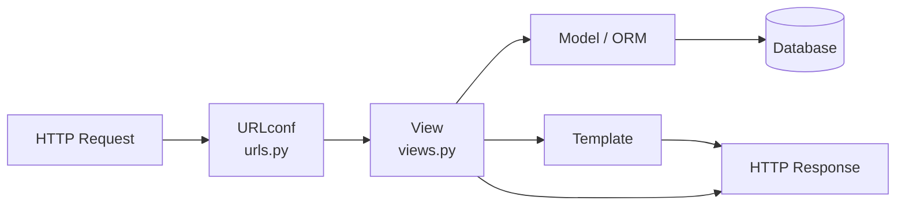
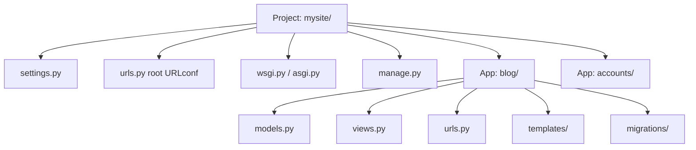
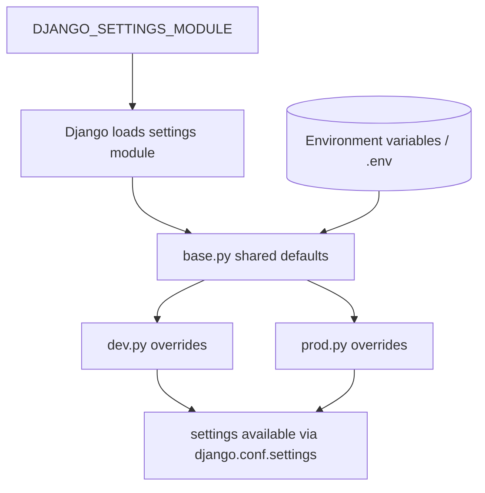
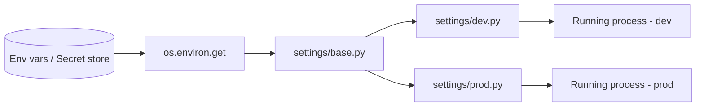
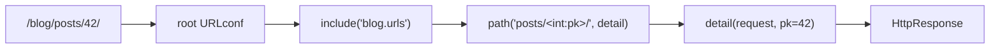
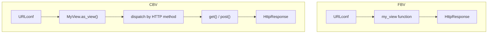

# Django 5 - Complete Professional Guide

> **Category:** 14_frameworks · **Language:** English

---

### MVT, the ORM, Forms, Admin, Auth, DRF, Async views
**Edition for Django 5.x (Python 3.12+)**

> **Reference book (English).** A professional, in-depth guide to building production web applications with Django 5, for developers, architects, and teams adopting Python's most batteries-included web framework. Based primarily on the official Django documentation (https://docs.djangoproject.com) and the Django REST Framework documentation (https://www.django-rest-framework.org).
>
> **Scope notice:** this book teaches the Django way of building software — the Model-View-Template architecture, the ORM, forms, the admin, authentication, REST APIs, and asynchronous request handling — with an eye toward production deployment. Each chapter follows the TO-BRAIN editorial standard (see `FILE_CONVENTIONS.md`).

---

## How to read this book

Progressive depth across five maturity levels:

| Level | Profile | Parts |
|-------|---------|-------|
| 1 — Beginner | New to Django | Part I |
| 2 — Intermediate | Routing, ORM, templates | Parts II–IV |
| 3 — Advanced | Forms, admin, auth | Parts V–VI |
| 4 — Specialist | REST, middleware, async | Parts VI–VII |
| 5 — Enterprise | Caching, testing, security, deploy | Part VIII |

**Target audience:** Python and full-stack developers, software architects, backend engineers, tech leads, and CTOs adopting or scaling Django 5.

**Structure of each chapter:** Introduction · Business context · Theoretical concepts · Architecture · Diagrams (Mermaid) · Real examples · Step by step · Complete code · Exercises · Challenges · Checklist · Best practices · Anti-patterns · Troubleshooting · Official references.

**Example format:** Scenario · Problem · Solution · Implementation · Result · Future improvements.

> **Note on prerequisites.** This book assumes working knowledge of Python 3.12+, virtual environments, the command line, and basic HTTP. Django 5 requires Python 3.10 or newer; examples target Python 3.12.

---

## Table of Contents

**Part I – Foundations: Project, Apps & Settings**
1. The Django philosophy and project anatomy
2. Settings, environments, and configuration
3. URLs and views — function-based and class-based

**Part II – The ORM**
4. Models and migrations
5. Querying: the QuerySet API
6. Relations: ForeignKey, ManyToMany, OneToOne

**Part III – Templates & Static Files**
7. The Django template language
8. Static and media files

**Part IV – Forms & Validation**
9. Forms, ModelForms, and validation
10. Formsets and file uploads

**Part V – The Admin & Authentication**
11. The Django admin site
12. Authentication, permissions, and authorization

**Part VI – APIs with Django REST Framework**
13. Serializers and ModelSerializers
14. Views, ViewSets, and routers
15. Authentication and permissions in DRF

**Part VII – Middleware, Signals & Async**
16. Middleware and signals
17. Async views and ASGI

**Part VIII – Production: Caching, Testing, Security & Deployment**
18. Caching strategies
19. Testing Django applications
20. Security hardening
21. Deployment (Gunicorn/ASGI, static files)

> **Status of this edition:** phased delivery (each part keeps the same depth standard). **Ready:** Part I (Ch. 1–3). **In progress:** Parts II–VIII.

---

## Part I – Foundations: Project, Apps & Settings

Part I gives you the structural map of a Django 5 project. Django is opinionated about *where things go* and *how a request flows*, and those conventions are the productivity engine behind the framework's "batteries included" promise. Before writing a single model or view, you need to understand the project/app distinction, how settings drive everything, and how the URL-to-view dispatch works. Master these three chapters and the rest of Django becomes a set of well-labeled drawers.

---

## Chapter 1 — The Django philosophy and project anatomy

### 1.1 Introduction

Django is a high-level Python web framework that encourages rapid development and clean, pragmatic design. It follows the **Model-View-Template (MVT)** pattern — Django's variant of MVC — and ships with an ORM, an automatic admin interface, a templating engine, a forms library, and a robust authentication system. This chapter establishes the vocabulary and the directory structure you will live inside for the rest of the book: the difference between a **project** and an **app**, what `manage.py` does, and how a request becomes a response.

### 1.2 Business context

Teams choose Django because it compresses time-to-market. The framework makes the common decisions for you — directory layout, ORM, admin, security defaults — so engineers spend their hours on business logic rather than plumbing. For a CTO, that translates into faster delivery and lower maintenance risk: a new hire who knows Django can navigate any Django codebase, because the conventions are shared. The "apps" model also enables reuse: a billing app, an auth app, or a notifications app can be packaged and dropped into multiple projects.

### 1.3 Theoretical concepts: MVT and the request lifecycle

In MVT, the **Model** describes your data (and is mapped to database tables by the ORM), the **View** contains the request-handling logic (in classic MVC terms it is closer to a controller), and the **Template** renders the HTML. Django itself acts as the controller that wires them together via the URL dispatcher.



The chain is deliberate and inspectable: a URL pattern resolves to a view; the view talks to models and renders a template; the rendered template becomes the response.

### 1.4 Architecture: project vs. app

A **project** is the whole web application — its settings, root URLconf, and WSGI/ASGI entry points. An **app** is a self-contained module of functionality (e.g., `blog`, `accounts`). One project contains many apps; a well-written app can be reused across projects.



### 1.5 Real example

**Scenario.** A startup needs the skeleton of a content platform — a project plus a `blog` app — running locally within minutes.

**Problem.** The team wants the canonical Django layout, not an ad-hoc folder structure that future hires won't recognize.

**Solution.** Use `django-admin` and `manage.py` to scaffold the project and the app, register the app, and run the development server.

**Implementation:**

```bash
python -m venv .venv
source .venv/bin/activate          # Windows: .venv\Scripts\activate
pip install "Django>=5,<6"

django-admin startproject mysite .
python manage.py startapp blog
```

```python
# mysite/settings.py — register the app
INSTALLED_APPS = [
    "django.contrib.admin",
    "django.contrib.auth",
    "django.contrib.contenttypes",
    "django.contrib.sessions",
    "django.contrib.messages",
    "django.contrib.staticfiles",
    "blog",  # our app
]
```

```python
# blog/views.py
from django.http import HttpResponse


def home(request):
    return HttpResponse("Hello from the blog app.")
```

```python
# mysite/urls.py
from django.contrib import admin
from django.urls import path
from blog.views import home

urlpatterns = [
    path("admin/", admin.site.urls),
    path("", home, name="home"),
]
```

```bash
python manage.py migrate
python manage.py runserver
```

**Result.** A running project at `http://127.0.0.1:8000/` with a working admin at `/admin/` and a `blog` app ready for models and views.

**Future improvements.** Add a custom user model before the first migration (Chapter 12), and split settings per environment (Chapter 2).

### 1.6 Exercises

1. Explain the difference between a Django *project* and a Django *app* in one sentence each.
2. Trace the path of an HTTP request through the MVT components.
3. Why must an app be listed in `INSTALLED_APPS` before its models are recognized?

### 1.7 Challenges

- **Challenge.** Scaffold a project with two apps (`catalog` and `orders`), wire a URL for each, and render a distinct response from each app's view without using templates yet.

### 1.8 Checklist

- [ ] I can scaffold a project with `startproject` and an app with `startapp`.
- [ ] I understand the MVT roles and the request lifecycle.
- [ ] I can register an app in `INSTALLED_APPS`.
- [ ] I can run migrations and the development server.

### 1.9 Best practices

- Keep apps small and focused on a single responsibility ("an app does one thing well").
- Decide on a custom user model on day one, before the first `migrate`.
- Use a virtual environment per project and pin Django in `requirements.txt`/`pyproject.toml`.

### 1.10 Anti-patterns

- Putting all code in one giant app — you lose reusability and clarity.
- Running the development server (`runserver`) in production; it is single-threaded and unaudited for security.
- Editing the database directly instead of going through models and migrations.

### 1.11 Troubleshooting

| Symptom | Likely cause | Action |
|---------|--------------|--------|
| `ModuleNotFoundError` for your app | App not on `PYTHONPATH` or wrong name | Verify the app label in `INSTALLED_APPS` |
| Admin returns 404 | `admin/` route not in root URLconf | Add `path("admin/", admin.site.urls)` |
| Models ignored by migrations | App missing from `INSTALLED_APPS` | Register the app, rerun `makemigrations` |
| `runserver` won't start | Port in use or syntax error in settings | Use `runserver 8001` or fix the traceback |

### 1.12 Official references

- Django overview: https://docs.djangoproject.com/en/5.0/intro/overview/
- Writing your first app (tutorial): https://docs.djangoproject.com/en/5.0/intro/tutorial01/
- Applications: https://docs.djangoproject.com/en/5.0/ref/applications/
- `django-admin` and `manage.py`: https://docs.djangoproject.com/en/5.0/ref/django-admin/

---

## Chapter 2 — Settings, environments, and configuration

### 2.1 Introduction

Every Django project is driven by a single `settings.py` module — a plain Python file that configures the database, installed apps, middleware, templates, static files, security, and more. Because settings are just Python, they are easy to compose and override per environment (development, staging, production). This chapter covers the settings you will touch most, how to keep secrets out of source control, and patterns for multi-environment configuration.

### 2.2 Business context

Configuration mistakes are a leading cause of production incidents and security breaches: a hard-coded `SECRET_KEY`, `DEBUG = True` in production, or an open `ALLOWED_HOSTS`. Treating configuration as a first-class concern — separating secrets from code and per-environment values from shared defaults — reduces operational risk and supports the Twelve-Factor App methodology that most cloud platforms expect.

### 2.3 Theoretical concepts: how settings load

When Django starts, `DJANGO_SETTINGS_MODULE` tells it which settings module to import. Everything Django and your apps need is read from that module via `django.conf.settings`. Because it is Python, you can read environment variables, compute paths from `BASE_DIR`, and import shared base settings into environment-specific files.



### 2.4 Architecture: split settings and secrets

A common production-grade pattern splits a single `settings.py` into a package: `settings/base.py` for shared values, `settings/dev.py` and `settings/prod.py` for overrides, with secrets injected from the environment.



### 2.5 Real example

**Scenario.** A team needs the same codebase to run safely both on a developer laptop and on a production server.

**Problem.** Secrets must never be committed, and `DEBUG`/`ALLOWED_HOSTS`/database settings must differ per environment without code edits.

**Solution.** Read configuration from environment variables, default to safe values, and fail loudly when a required secret is missing in production.

**Implementation:**

```python
# settings.py
import os
from pathlib import Path

BASE_DIR = Path(__file__).resolve().parent.parent

SECRET_KEY = os.environ["DJANGO_SECRET_KEY"]          # required; no insecure default
DEBUG = os.environ.get("DJANGO_DEBUG", "0") == "1"
ALLOWED_HOSTS = os.environ.get("DJANGO_ALLOWED_HOSTS", "").split(",")

DATABASES = {
    "default": {
        "ENGINE": "django.db.backends.postgresql",
        "NAME": os.environ.get("DB_NAME", "mysite"),
        "USER": os.environ.get("DB_USER", "postgres"),
        "PASSWORD": os.environ.get("DB_PASSWORD", ""),
        "HOST": os.environ.get("DB_HOST", "127.0.0.1"),
        "PORT": os.environ.get("DB_PORT", "5432"),
        "CONN_MAX_AGE": 60,  # persistent connections
    }
}

# Production-only security flags (enable when DEBUG is False)
if not DEBUG:
    SECURE_SSL_REDIRECT = True
    SESSION_COOKIE_SECURE = True
    CSRF_COOKIE_SECURE = True
    SECURE_HSTS_SECONDS = 31536000
```

```bash
# .env (never committed) — loaded by your process manager or python-dotenv
DJANGO_SECRET_KEY=change-me-to-a-long-random-string
DJANGO_DEBUG=1
DJANGO_ALLOWED_HOSTS=127.0.0.1,localhost
```

**Result.** The same code runs in any environment; secrets live outside the repository; production gets hardened defaults automatically.

**Future improvements.** Add `python manage.py check --deploy` to CI, and move secrets into a managed secret store.

### 2.6 Exercises

1. Why should `SECRET_KEY` have no insecure default in production?
2. What does `ALLOWED_HOSTS` protect against?
3. List three security settings that should differ between dev and prod.

### 2.7 Challenges

- **Challenge.** Refactor a single `settings.py` into a `settings/` package with `base`, `dev`, and `prod` modules, and switch environments using only `DJANGO_SETTINGS_MODULE`.

### 2.8 Checklist

- [ ] No secrets are hard-coded in source control.
- [ ] `DEBUG` is `False` in production.
- [ ] `ALLOWED_HOSTS` is explicit in production.
- [ ] `python manage.py check --deploy` passes before release.

### 2.9 Best practices

- Read configuration from the environment; keep a `.env.example` documenting required variables.
- Run `manage.py check --deploy` and act on every warning.
- Compute paths from `BASE_DIR` rather than hard-coding absolute paths.

### 2.10 Anti-patterns

- Committing `SECRET_KEY`, database passwords, or API keys to the repo.
- Shipping with `DEBUG = True` (it leaks tracebacks and settings).
- Using `ALLOWED_HOSTS = ["*"]` in production.

### 2.11 Troubleshooting

| Symptom | Likely cause | Action |
|---------|--------------|--------|
| `DisallowedHost` error | Host not in `ALLOWED_HOSTS` | Add the domain/IP to `ALLOWED_HOSTS` |
| `ImproperlyConfigured: SECRET_KEY` | Env var missing | Set `DJANGO_SECRET_KEY` |
| Static files 404 in prod | `collectstatic` not run / `DEBUG` off | Run `collectstatic`, serve via web server |
| CSRF failures over HTTPS | Cookie flags / `CSRF_TRUSTED_ORIGINS` | Set `CSRF_TRUSTED_ORIGINS` and secure cookies |

### 2.12 Official references

- Settings reference: https://docs.djangoproject.com/en/5.0/ref/settings/
- Settings how-to: https://docs.djangoproject.com/en/5.0/topics/settings/
- Deployment checklist: https://docs.djangoproject.com/en/5.0/howto/deployment/checklist/
- Security overview: https://docs.djangoproject.com/en/5.0/topics/security/

---

## Chapter 3 — URLs and views: function-based and class-based

### 3.1 Introduction

A **view** is a Python callable that takes an `HttpRequest` and returns an `HttpResponse`. The **URLconf** maps URL patterns to views. Django supports two styles: **function-based views (FBVs)** — plain functions, maximally explicit — and **class-based views (CBVs)** — classes that encapsulate common patterns (list, detail, create, update, delete) and promote reuse through mixins. This chapter shows how routing works, how to capture parameters, and when to reach for each view style.

### 3.2 Business context

Routing and views are where requirements become behavior. Clean URL design improves SEO, shareability, and API ergonomics; choosing the right view style affects how fast the team can ship CRUD features. CBVs and Django's generic views let teams implement standard create/read/update/delete flows with minimal code, while FBVs keep one-off or unusual logic readable. The pragmatic answer is to use both, deliberately.

### 3.3 Theoretical concepts: URL resolution and path converters

Django resolves a request by walking `urlpatterns` top to bottom until a pattern matches. The `path()` function uses **path converters** like `<int:pk>` or `<slug:slug>` to capture and type-coerce URL segments, passing them to the view as keyword arguments. `include()` lets each app own its URLconf, keeping routing modular.



### 3.4 Architecture: FBV vs. CBV dispatch

A function-based view is called directly. A class-based view is referenced via its `.as_view()` classmethod, which returns a callable; on each request the dispatcher routes to the method matching the HTTP verb (`get`, `post`, ...).



### 3.5 Real example

**Scenario.** A blog needs a list page and a detail page for posts, plus a contact form handled by a simple function.

**Problem.** The list/detail pages are standard CRUD reads (ideal for generic CBVs), but the contact handler is bespoke (ideal for an FBV). The team wants idiomatic code for each.

**Solution.** Use Django's generic `ListView` and `DetailView` for the read pages, and a function-based view for the contact endpoint.

**Implementation:**

```python
# blog/models.py
from django.db import models


class Post(models.Model):
    title = models.CharField(max_length=200)
    slug = models.SlugField(unique=True)
    body = models.TextField()
    published = models.BooleanField(default=False)
    created_at = models.DateTimeField(auto_now_add=True)

    def __str__(self):
        return self.title
```

```python
# blog/views.py
from django.http import HttpResponse, HttpResponseRedirect
from django.shortcuts import render
from django.views.generic import ListView, DetailView
from .models import Post


class PostListView(ListView):
    model = Post
    queryset = Post.objects.filter(published=True).order_by("-created_at")
    context_object_name = "posts"
    template_name = "blog/post_list.html"
    paginate_by = 10


class PostDetailView(DetailView):
    model = Post
    template_name = "blog/post_detail.html"


def contact(request):
    if request.method == "POST":
        # ... validate and send message ...
        return HttpResponseRedirect("/thanks/")
    return render(request, "blog/contact.html")
```

```python
# blog/urls.py
from django.urls import path
from . import views

app_name = "blog"

urlpatterns = [
    path("", views.PostListView.as_view(), name="post_list"),
    path("posts/<slug:slug>/", views.PostDetailView.as_view(), name="post_detail"),
    path("contact/", views.contact, name="contact"),
]
```

```python
# mysite/urls.py
from django.contrib import admin
from django.urls import include, path

urlpatterns = [
    path("admin/", admin.site.urls),
    path("blog/", include("blog.urls")),
]
```

**Result.** Paginated list and detail pages with almost no boilerplate, plus an explicit, readable contact handler — each view in its most natural style.

**Future improvements.** Add `get_queryset` filtering by author, and replace the manual contact handler with a Django `FormView` (Part IV).

### 3.6 Exercises

1. Write a `path()` that captures an integer `year` and passes it to a view.
2. Convert a function-based detail view into a `DetailView`.
3. Explain what `.as_view()` returns and why CBVs need it.

### 3.7 Challenges

- **Challenge.** Build a CBV that lists posts filtered by a `<slug:category>` captured from the URL, with pagination, using only `ListView` overrides.

### 3.8 Checklist

- [ ] I can map URLs with `path()` and path converters.
- [ ] I can split routing per app using `include()` and `app_name`.
- [ ] I can write both an FBV and a generic CBV.
- [ ] I can reverse URLs by name with `` / `reverse()`.

### 3.9 Best practices

- Always name your URL patterns and use `reverse()`/`` instead of hard-coding paths.
- Namespace app URLs with `app_name` to avoid name collisions.
- Use generic CBVs for standard CRUD; use FBVs when logic is unusual or one-off.

### 3.10 Anti-patterns

- Hard-coding URLs in templates or redirects instead of reversing by name.
- Putting all routes in the root URLconf instead of delegating with `include()`.
- Forcing a CBV where a three-line FBV would be clearer.

### 3.11 Troubleshooting

| Symptom | Likely cause | Action |
|---------|--------------|--------|
| `NoReverseMatch` | Wrong URL name or missing args | Check `app_name:name` and required kwargs |
| 404 for a valid-looking URL | Pattern order or missing trailing slash | Reorder patterns; check `APPEND_SLASH` |
| `TypeError` in view: unexpected kwarg | Converter name ≠ view parameter | Align `<int:pk>` with the `pk` parameter |
| CBV returns 405 | Method handler not defined | Implement `get`/`post` as needed |

### 3.12 Official references

- URL dispatcher: https://docs.djangoproject.com/en/5.0/topics/http/urls/
- Writing views: https://docs.djangoproject.com/en/5.0/topics/http/views/
- Class-based views: https://docs.djangoproject.com/en/5.0/topics/class-based-views/
- Built-in generic views: https://docs.djangoproject.com/en/5.0/ref/class-based-views/

---

> **End of Part I.** You now have the structural foundation of a Django 5 project: the MVT architecture and project/app layout (Ch. 1), environment-aware settings and secret management (Ch. 2), and URL routing with both function-based and class-based views (Ch. 3). Parts II–VIII build on this base — the ORM, templates, forms, admin, authentication, Django REST Framework, middleware and async, and finally caching, testing, security, and deployment.

<!--APPEND-PARTE-II-->
