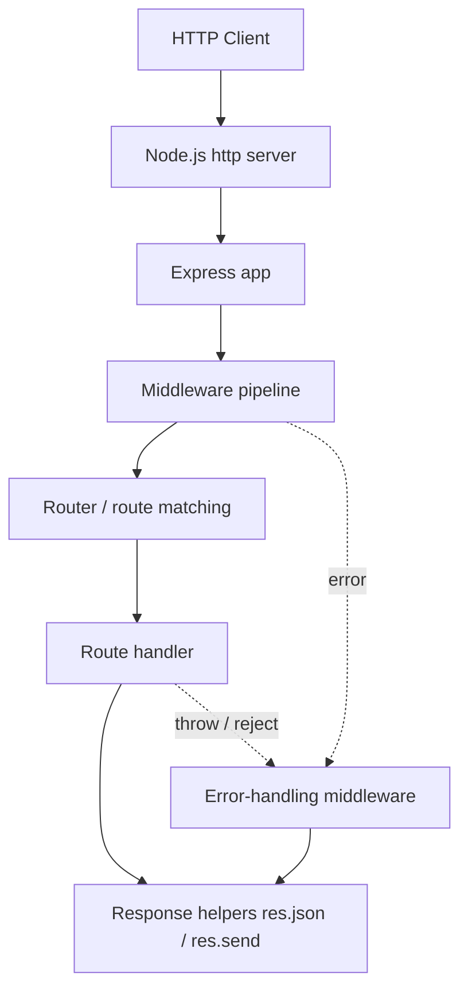
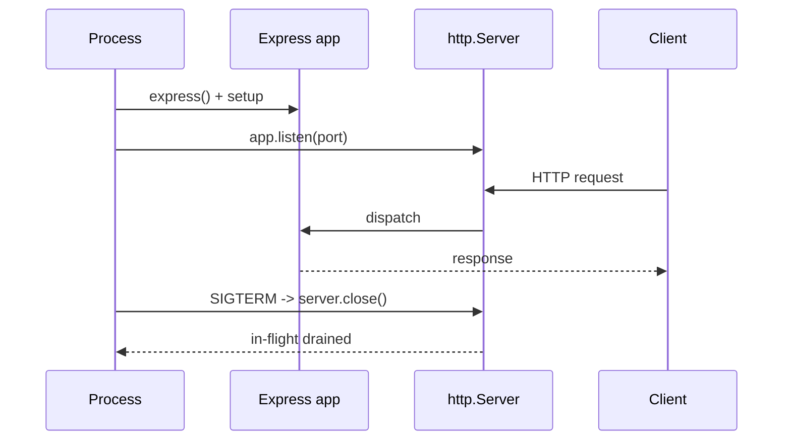
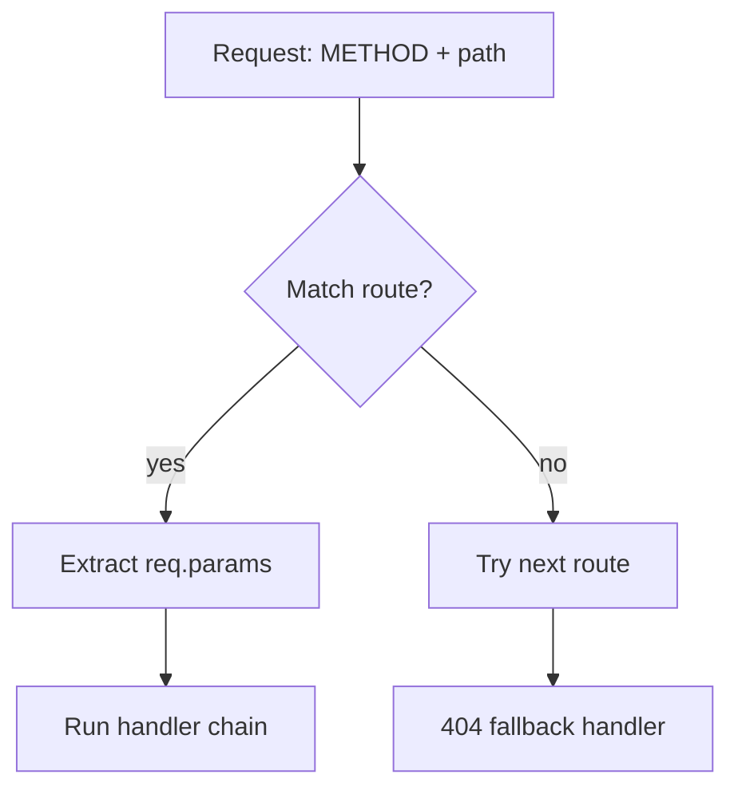
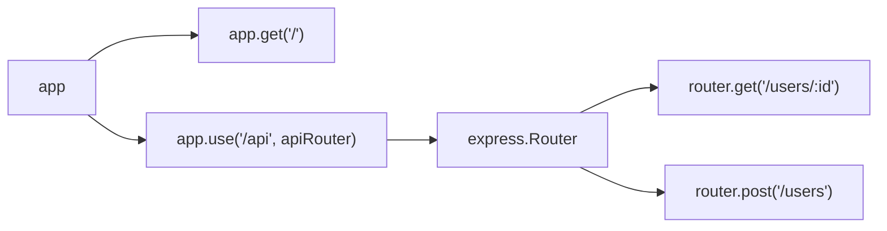

# Express 5 - Complete Professional Guide

> **Category:** 14_frameworks · **Language:** English

---

### Routing, Middleware, Requests/Responses, Error Handling, REST APIs, Security
**Edition for Express 5 (Node.js)**

> **Reference book (English).** A professional, in-depth guide to building production HTTP services with **Express 5** on Node.js. Based primarily on the official Express documentation (https://expressjs.com), including the routing, middleware, error-handling, and migration guides.
>
> **Scope notice:** this book teaches Express 5 as used in real backends — from a first server to secured, tested REST APIs. It calls out **Express 5 changes accurately** (Promise/async rejection handling, the `path-to-regexp` upgrade affecting route patterns, removed deprecated methods, and stricter parsing). Each chapter follows the TO-BRAIN editorial standard (see `FILE_CONVENTIONS.md`).

---

## How to read this book

Progressive depth across five maturity levels:

| Level | Profile | Parts |
|-------|---------|-------|
| 1 — Beginner | New to Express / Node backends | Part I |
| 2 — Intermediate | Routing, middleware, req/res | Parts II–III |
| 3 — Advanced | Static, templating, uploads, errors | Parts IV–V |
| 4 — Specialist | REST APIs, validation, auth | Parts VI–VII |
| 5 — Enterprise | Security, logging, testing, perf, deploy | Part VIII |

**Target audience:** backend and full-stack developers, software architects, API engineers, tech leads, and CTOs building or maintaining Node.js services with Express.

**Structure of each chapter:** Introduction · Business context · Theoretical concepts · Architecture · Diagrams (Mermaid) · Real examples · Step by step · Complete code · Exercises · Challenges · Checklist · Best practices · Anti-patterns · Troubleshooting · Official references.

**Example format:** Scenario · Problem · Solution · Implementation · Result · Future improvements.

> **Note on prerequisites.** This book assumes working knowledge of JavaScript (ES2020+), `async`/`await`, npm, and the basics of HTTP (methods, status codes, headers). Where an Express 5 behavior differs from Express 4, the difference is flagged explicitly.

---

## Table of Contents

**Part I – Foundations: App, Server & Routing Basics**
1. Express 5 in context — what it is, what changed
2. The application and server lifecycle (`express()`, `app.listen`, settings)
3. Routing fundamentals (methods, paths, params, query, `Router`)

**Part II – Routing in Depth**
4. Route parameters, the new `path-to-regexp` syntax, and named patterns
5. Modular routing with `express.Router` and route composition

**Part III – Middleware**
6. The middleware model (application, router, route, error)
7. Built-in and third-party middleware (`express.json`, `urlencoded`, `static`)
8. Writing custom middleware and middleware ordering

**Part IV – Request & Response, Static & Templating**
9. The request object (`req.params`, `req.query`, `req.body`, headers)
10. The response object (`res.json`, `res.status`, `res.redirect`, streaming)
11. Serving static files and view engines (templating)

**Part V – Body Parsing, Uploads & Error Handling**
12. Body parsing and file uploads (multipart, `multer`)
13. Error handling and Express 5 async error propagation

**Part VI – Building REST APIs**
14. REST API design and project structure (controllers, services, layers)
15. Request validation (schema validation, sanitization)

**Part VII – Authentication & Authorization**
16. Sessions and JWT authentication
17. Authorization, roles, and route protection

**Part VIII – Security, Observability, Testing, Performance & Deployment**
18. Security hardening (helmet, CORS, rate limiting)
19. Logging and observability
20. Testing (Jest + Supertest), performance and deployment

> **Status of this edition:** phased delivery (each part keeps the same depth standard). **Ready:** Part I (Ch. 1–3). **In progress:** Parts II–VIII.

---

## Part I – Foundations: App, Server & Routing Basics

Part I builds the mental model you'll use for the rest of the book: what Express 5 is, how an Express application starts and serves requests, and how routing maps incoming HTTP requests to your handlers. Express 5 keeps the minimalist philosophy of Express 4 but tightens several behaviors — most importantly, **rejected Promises from async handlers are now forwarded to error-handling middleware automatically**, and the **route path syntax changed** because of an upgraded `path-to-regexp`. Understanding these foundations prevents the most common production surprises.

---

## Chapter 1 — Express 5 in context — what it is, what changed

### 1.1 Introduction

**Express** is a minimal, unopinionated web framework for Node.js. It provides a thin, composable layer over Node's `http` module: a routing system, a middleware pipeline, and convenience helpers on the request and response objects. **Express 5** is the first major release in years; it modernizes the engine of the framework rather than reinventing its API. The headline changes are **automatic forwarding of async errors**, an **upgraded path-matching library**, **removal of long-deprecated methods**, and a **higher minimum Node.js version**. If you know Express 4, you already know 90% of Express 5 — this chapter focuses on the differences that matter.

### 1.2 Business context

For engineering leaders, Express remains the default choice for Node HTTP services because it is small, battle-tested, and surrounded by a vast middleware ecosystem. The business value of upgrading to Express 5 is **risk reduction and maintainability**: async error handling that used to require manual `try/catch` (or a wrapper library) now works out of the box, eliminating a whole class of "unhandled rejection crashes my server" incidents. The upgrade cost is modest and well-documented: bump Node, update a handful of route patterns, and replace removed methods. The strategic read is that Express 5 makes the *correct* path the *default* path, lowering long-term defect rates.

### 1.3 Theoretical concepts: what changed in Express 5

```mermaid
mindmap
  root((Express 5))
    Async errors
      Rejected Promises forwarded to error middleware
      Less manual try/catch
    Routing engine
      Upgraded path-to-regexp
      Named wildcards (*name)
      Optional segments use braces {}
      Regex via :param(...) restricted
    Removed / changed APIs
      app.del removed (use app.delete)
      res.json(status, obj) signature dropped
      req.param() removed
      app.param(fn) array form removed
    Platform
      Higher minimum Node.js
      Stricter query parser default
```

The unifying direction: **safer defaults and a cleaner API surface**. The framework removes ambiguous legacy signatures and makes asynchronous error propagation a first-class feature.

### 1.4 Architecture: where Express sits in the stack



Express is a layer *between* Node's raw server and your business logic. Every request flows through an ordered middleware pipeline; the router selects a handler; helpers shape the response. Errors — synchronous throws and, in Express 5, rejected Promises — short-circuit to error-handling middleware.

### 1.5 Real example

**Scenario.** A team upgrading from Express 4 wants to see, in one file, how Express 5 simplifies async error handling.

**Problem.** In Express 4, an `await` that rejects inside a handler does not reach error middleware unless you wrap it in `try/catch` (or use a helper). Forgetting the wrapper crashes the process with an unhandled rejection.

**Solution.** In Express 5, throwing (or rejecting) inside an `async` handler is forwarded automatically to your error middleware. No wrapper needed.

**Implementation.**

```javascript
import express from 'express';

const app = express();

// Simulated async data layer that may reject.
async function findUser(id) {
  if (id === '0') {
    const err = new Error('User not found');
    err.status = 404;
    throw err;
  }
  return { id, name: 'Ada Lovelace' };
}

// Express 5: a rejected Promise here is forwarded to the error handler below.
app.get('/users/:id', async (req, res) => {
  const user = await findUser(req.params.id); // may throw -> auto-forwarded
  res.json(user);
});

// Centralized error-handling middleware (4 arguments).
app.use((err, req, res, next) => {
  const status = err.status ?? 500;
  res.status(status).json({ error: err.message });
});

app.listen(3000, () => console.log('Listening on http://localhost:3000'));
```

**Result.** `GET /users/42` returns the user as JSON; `GET /users/0` returns `404 {"error":"User not found"}` instead of crashing the server. No `try/catch` boilerplate in the handler.

**Future improvements.** Extract `findUser` into a service layer (Part VI), add input validation (Part VII), and standardize the error response shape with a small error class hierarchy.

### 1.6 Exercises

1. Create a minimal Express 5 app with a single `GET /health` route returning `{ status: "ok" }`.
2. Add an async route that calls a function which sometimes rejects, and confirm the error reaches an error handler **without** a `try/catch`.
3. List three methods or signatures removed in Express 5 and write the modern replacement for each.

### 1.7 Challenges

- Take an existing Express 4 route that uses a manual `try/catch` + `next(err)` and rewrite it for Express 5, removing the wrapper while preserving behavior.
- Write a tiny "async wrapper" helper (the Express 4 pattern) and explain in a comment why Express 5 makes it unnecessary for rejection forwarding.

### 1.8 Checklist

- [ ] Node.js version meets Express 5's minimum.
- [ ] All `app.del(...)` calls replaced with `app.delete(...)`.
- [ ] No use of the removed `res.json(status, body)` two-argument form.
- [ ] Async handlers rely on automatic rejection forwarding (no redundant wrappers).
- [ ] A single error-handling middleware is registered **last**.

### 1.9 Best practices

- Keep handlers thin: validate, delegate to a service, shape the response.
- Always register error-handling middleware **after** all routes.
- Prefer `async/await` and let Express 5 forward rejections.
- Pin your Express version in `package.json` and read the migration guide before bumping majors.

### 1.10 Anti-patterns

- Swallowing errors with empty `catch {}` blocks instead of forwarding them.
- Relying on the removed two-argument `res.json(status, obj)` signature.
- Mixing `app.del` and `app.delete` across a codebase.
- Sending a response and then calling `next()` (double-handling the request).

### 1.11 Troubleshooting

| Symptom | Likely cause | Fix |
|---|---|---|
| `app.del is not a function` | `app.del` removed in v5 | Use `app.delete` |
| Async error crashes process | Error handler not registered, or registered before routes | Add a 4-arg error middleware **after** routes |
| Route pattern throws on boot | Old `path-to-regexp` syntax | Update pattern (see Ch. 4) |
| `res.json(404, obj)` ignored | Two-arg signature removed | Use `res.status(404).json(obj)` |
| `req.param('x')` undefined | `req.param()` removed | Use `req.params`, `req.query`, or `req.body` |

### 1.12 Official references

- Express homepage: https://expressjs.com/
- Migrating to Express 5: https://expressjs.com/en/guide/migrating-5.html
- Express API reference: https://expressjs.com/en/5x/api.html

---

## Chapter 2 — The application and server lifecycle

### 2.1 Introduction

An Express application is the object returned by calling `express()`. It is both a **request handler** (you can pass it to `http.createServer`) and a **configuration surface** (settings, middleware, routes). This chapter covers how an app is created, how it starts listening, how settings work, and the lifecycle from boot to graceful shutdown.

### 2.2 Business context

The application lifecycle is where reliability lives. Misconfigured listening, missing graceful shutdown, and unhealthy boot sequencing are common causes of failed deploys and dropped connections during restarts. Getting the lifecycle right means **zero-downtime deploys**, clean health checks for orchestrators (Kubernetes, load balancers), and predictable behavior under restart — all of which translate directly into uptime and on-call sanity.

### 2.3 Theoretical concepts: app, settings, and listen


Key settings include `app.set('env', ...)`, `app.set('view engine', ...)`, `app.set('trust proxy', ...)`, and `app.set('query parser', ...)`. `app.locals` holds application-wide values available to all views. `app.listen(port, cb)` is a thin convenience over `http.createServer(app).listen(...)`.

### 2.4 Architecture: from process to handler



### 2.5 Real example

**Scenario.** A service must expose a health endpoint and shut down gracefully when the orchestrator sends SIGTERM.

**Problem.** A naive `app.listen` keeps accepting connections during shutdown, causing 502s when the container is killed mid-request.

**Solution.** Capture the server handle, add a health route, and close the server on termination signals so in-flight requests finish.

**Implementation.**

```javascript
import express from 'express';

const app = express();
app.disable('x-powered-by');      // do not advertise the framework
app.set('trust proxy', 1);        // honor X-Forwarded-* behind one proxy

app.get('/health', (req, res) => {
  res.json({ status: 'ok', uptime: process.uptime() });
});

const server = app.listen(3000, () => {
  console.log('Listening on http://localhost:3000');
});

function shutdown(signal) {
  console.log(`${signal} received, shutting down...`);
  server.close((err) => {
    if (err) {
      console.error('Error during shutdown', err);
      process.exit(1);
    }
    console.log('Closed remaining connections. Bye.');
    process.exit(0);
  });
  // Safety net: force-exit if drain takes too long.
  setTimeout(() => process.exit(1), 10_000).unref();
}

process.on('SIGTERM', () => shutdown('SIGTERM'));
process.on('SIGINT', () => shutdown('SIGINT'));
```

**Result.** Orchestrators get a reliable `/health` signal, and rolling deploys finish in-flight requests instead of dropping them.

**Future improvements.** Add readiness vs. liveness separation, drain dependent resources (DB pool, message consumers) inside `shutdown`, and expose build metadata in the health payload.

### 2.6 Exercises

1. Create an app that disables `x-powered-by` and sets `trust proxy` to `1`.
2. Add `SIGINT`/`SIGTERM` handlers that call `server.close`.
3. Read `app.get('env')` and log whether the app is in development or production.

### 2.7 Challenges

- Implement separate `/livez` and `/readyz` endpoints where readiness flips to "not ready" as soon as shutdown begins.
- Add a configurable shutdown timeout via an environment variable and document the trade-off.

### 2.8 Checklist

- [ ] `x-powered-by` disabled in production.
- [ ] `trust proxy` configured to match your deployment topology.
- [ ] Health endpoint returns quickly and does no heavy work.
- [ ] SIGTERM/SIGINT trigger `server.close`.
- [ ] A force-exit timeout guards against hung drains.

### 2.9 Best practices

- Keep boot configuration (settings, middleware) before routes, and routes before the error handler.
- Read configuration from environment variables, never hard-code ports or secrets.
- Separate the app definition (`app.js`) from the server bootstrap (`server.js`) so tests can import the app without listening.

### 2.10 Anti-patterns

- Calling `app.listen` directly inside the module that defines routes (hurts testability).
- Doing expensive work inside the health check.
- Ignoring termination signals (causes dropped connections on deploy).

### 2.11 Troubleshooting

| Symptom | Likely cause | Fix |
|---|---|---|
| `EADDRINUSE` | Port already bound | Change port or kill the stale process |
| Wrong client IP / protocol | `trust proxy` misconfigured | Set `trust proxy` to match proxy hops |
| Deploys cause 502s | No graceful shutdown | Add `server.close` on SIGTERM |
| Tests hang | App calls `listen` on import | Split app and server bootstrap |

### 2.12 Official references

- Application API (`app`): https://expressjs.com/en/5x/api.html#app
- Settings (`app.set`): https://expressjs.com/en/5x/api.html#app.set
- Production best practices: https://expressjs.com/en/advanced/best-practice-performance.html

---

## Chapter 3 — Routing fundamentals

### 3.1 Introduction

**Routing** is how Express maps an incoming request — defined by an HTTP method and a URL path — to a handler function. Express provides method functions (`app.get`, `app.post`, `app.put`, `app.delete`, `app.patch`, `app.all`), path patterns with parameters, and the `express.Router` for modular grouping. Express 5 changed the path-matching syntax (via an upgraded `path-to-regexp`), so route patterns deserve careful attention.

### 3.2 Business context

Routing is the public contract of your service. A clear, consistent routing scheme makes an API easy to consume, document, and evolve; an inconsistent one breeds confusion and bugs. Because Express 5 altered pattern syntax, getting routing right *also* protects you during the upgrade — malformed patterns now fail fast at startup rather than silently mis-matching, which is better for reliability but requires deliberate migration.

### 3.3 Theoretical concepts: matching method + path



Path patterns:

- **Static:** `/about`
- **Named parameters:** `/users/:id` → `req.params.id`
- **Multiple params:** `/users/:userId/posts/:postId`
- **Optional segments (Express 5):** use braces, e.g. `/files/{:name}` makes `name` optional.
- **Named wildcards (Express 5):** use `*splat` (a *named* wildcard) instead of a bare `*`; the captured value appears in `req.params.splat`.

> **Express 5 note.** The bare `*`, optional `?`, and inline regex shortcuts of Express 4 changed. Optional parts now use `{}`; wildcards must be named (`*name`). Review every non-trivial pattern when migrating.

### 3.4 Architecture: app routes vs. Router



A `Router` is a mini-application: it has its own middleware and routes and is mounted on a path prefix. This is the backbone of modular routing (Part II).

### 3.5 Real example

**Scenario.** Build a small set of user routes with parameters, a query filter, and an Express 5 named wildcard for a catch-all.

**Problem.** The team needs idiomatic Express 5 patterns, including correct param extraction and a 404 fallback that works with the new syntax.

**Solution.** Use named parameters, read `req.query` for filtering, and add a `*splat` named wildcard fallback.

**Implementation.**

```javascript
import express from 'express';

const app = express();

const users = [
  { id: '1', name: 'Ada', role: 'admin' },
  { id: '2', name: 'Linus', role: 'user' },
];

// Named parameter -> req.params.id
app.get('/users/:id', (req, res) => {
  const user = users.find((u) => u.id === req.params.id);
  if (!user) return res.status(404).json({ error: 'Not found' });
  res.json(user);
});

// Query filtering: /users?role=admin
app.get('/users', (req, res) => {
  const { role } = req.query;
  const result = role ? users.filter((u) => u.role === role) : users;
  res.json(result);
});

// Express 5 named wildcard catch-all -> req.params.splat
app.all('/*splat', (req, res) => {
  res.status(404).json({ error: `No route for ${req.method} ${req.originalUrl}` });
});

app.listen(3000);
```

**Result.** `GET /users/1` returns Ada; `GET /users?role=admin` returns only admins; unknown paths return a structured 404 via the named wildcard.

**Future improvements.** Move these into an `express.Router` mounted at `/api/users` (Chapter 5), and replace the in-memory array with a data layer.

### 3.6 Exercises

1. Add a `POST /users` route that echoes `req.body` (enable `express.json()` first).
2. Write a route `/files/{:name}` where `name` is optional, and respond differently when it is missing.
3. Convert an Express 4 `*` wildcard to the Express 5 `*splat` form.

### 3.7 Challenges

- Implement `/search` that supports `?q=`, `?page=`, and `?limit=` query parameters with sensible defaults and bounds.
- Build a route that restricts `:id` to digits only using the Express 5 parameter pattern syntax, and return 404 for non-numeric IDs.

### 3.8 Checklist

- [ ] Parameters read from `req.params`, query from `req.query`.
- [ ] Wildcards are **named** (`*splat`), not bare `*`.
- [ ] Optional segments use `{}` syntax.
- [ ] A catch-all 404 handler exists.
- [ ] Methods use `app.delete` (not the removed `app.del`).

### 3.9 Best practices

- Order routes from most specific to least specific; place the catch-all last.
- Keep path patterns simple; push complex matching into validation logic.
- Use nouns and plurals for resource paths (`/users`, `/users/:id`).

### 3.10 Anti-patterns

- Using bare `*` wildcards (invalid in Express 5).
- Encoding business logic in regex-heavy route patterns.
- Defining the same path for the same method twice (only the first matches).

### 3.11 Troubleshooting

| Symptom | Likely cause | Fix |
|---|---|---|
| Server throws on boot at a route | Old wildcard/optional syntax | Use `*name` and `{}` (Express 5) |
| `req.params.splat` undefined | Wildcard not named | Use `/*splat` not `/*` |
| Route never matches | A broader route declared earlier | Reorder: specific before general |
| `req.query` values are strings | Query is always string-typed | Parse/validate types explicitly |

### 3.12 Official references

- Routing guide: https://expressjs.com/en/guide/routing.html
- `path-to-regexp` / route paths in Express 5: https://expressjs.com/en/5x/api.html#routing
- Migration notes on path matching: https://expressjs.com/en/guide/migrating-5.html

---

> **End of Part I.** You now have the foundations: what changed in Express 5, how an application starts and shuts down cleanly, and how routing maps requests to handlers with the new path syntax. Parts II–VIII build on this toward middleware, request/response mastery, REST APIs, authentication, security, testing, performance, and deployment — each at the same depth standard.

<!--APPEND-PARTE-II-->
