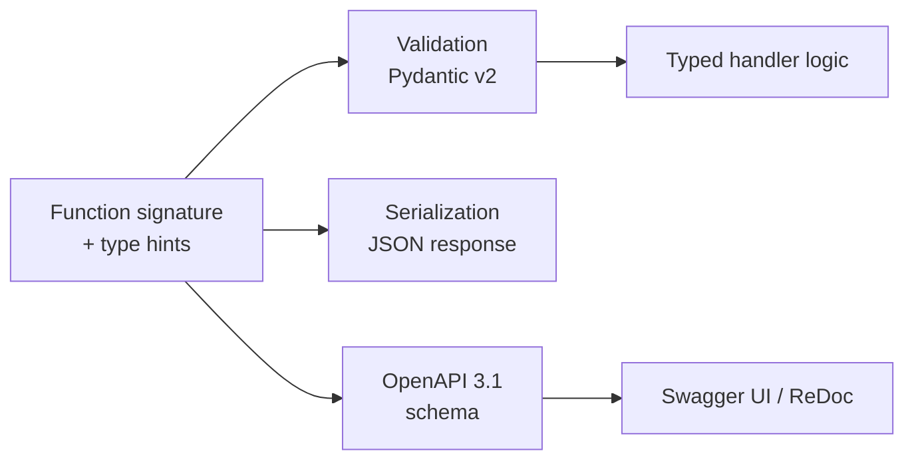
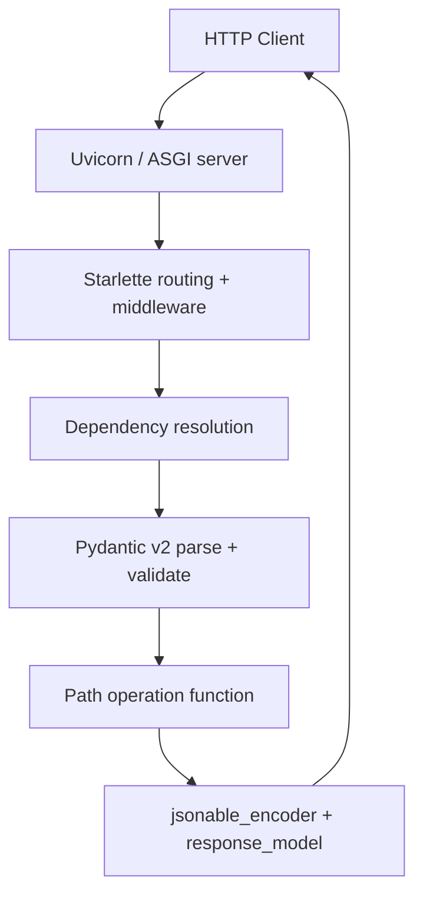
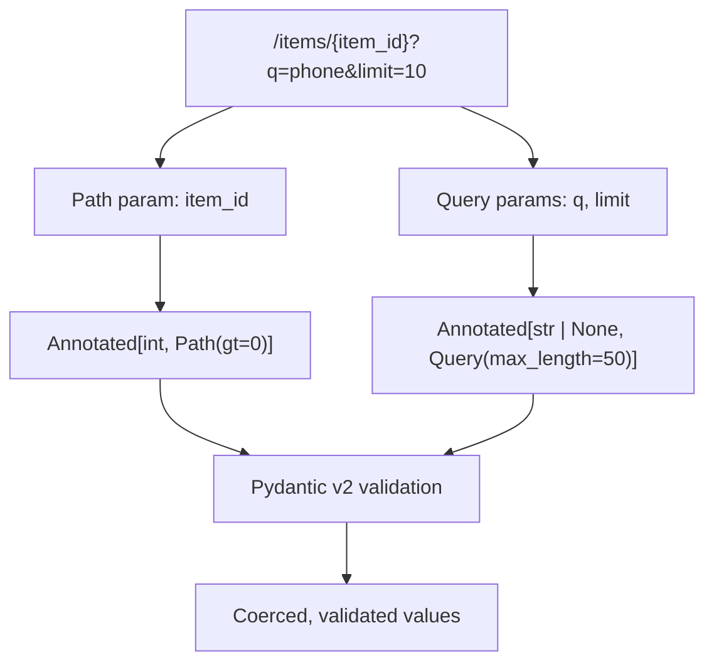
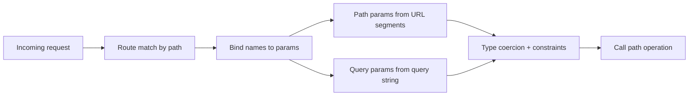
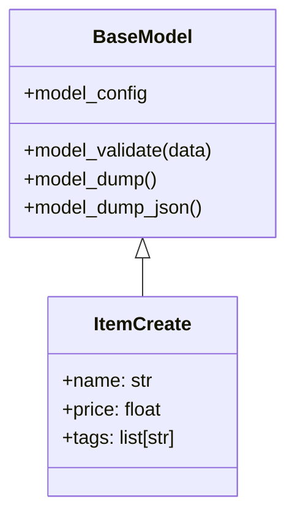
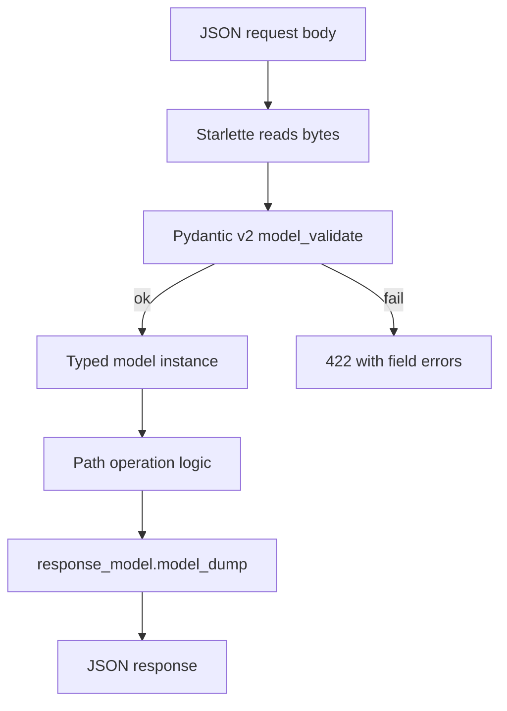

# FastAPI - Complete Professional Guide

> **Category:** 14_frameworks · **Language:** English

---

### Type-hint APIs, Pydantic v2, Async, Dependency Injection, OpenAPI, Auth
**Edition for FastAPI (Pydantic v2, Python 3.11+)**

> **Reference book (English).** A professional, in-depth guide to building production APIs with FastAPI, for backend developers, architects, and teams. Based on the official FastAPI documentation (https://fastapi.tiangolo.com) and the Pydantic v2 documentation (https://docs.pydantic.dev).
>
> **Scope notice:** this book teaches FastAPI as used in real systems — typed request/response handling, Pydantic v2 modeling, async I/O, dependency injection, persistence, security, and deployment. Each chapter follows the TO-BRAIN editorial standard (see `FILE_CONVENTIONS.md`).

---

## How to read this book

Progressive depth across five maturity levels:

| Level | Profile | Parts |
|-------|---------|-------|
| 1 — Beginner | First REST API in Python | Part I |
| 2 — Intermediate | Validation, responses, DI | Parts II–IV |
| 3 — Advanced | Async, routers, persistence | Parts V–VI |
| 4 — Specialist | Auth, real-time, testing | Part VII |
| 5 — Enterprise | OpenAPI, deployment, ops | Part VIII |

**Target audience:** Python developers, full-stack engineers, software architects, tech leads, and platform teams building or operating HTTP APIs and microservices with FastAPI.

**Structure of each chapter:** Introduction · Business context · Theoretical concepts · Architecture · Diagrams (Mermaid) · Real examples · Step by step · Complete code · Exercises · Challenges · Checklist · Best practices · Anti-patterns · Troubleshooting · Official references.

**Example format:** Scenario · Problem · Solution · Implementation · Result · Future improvements.

> **Note on prerequisites.** This book assumes working knowledge of Python 3.11+, type hints (`list[int]`, `str | None`), virtual environments, and basic HTTP (methods, status codes, JSON). Where a FastAPI feature builds on a Pydantic or Starlette concept, we link the lineage.

---

## Table of Contents

**Part I – Foundations & Request Handling**
1. What FastAPI is and the type-hint contract
2. Path and query parameters with `Annotated`
3. Request bodies and Pydantic v2 models

**Part II – Pydantic v2 Modeling & Validation**
4. Fields, constraints, and `model_config`
5. Validators, computed fields, and serialization
6. Nested models, enums, and recursive types

**Part III – Responses & Errors**
7. `response_model`, status codes, and `responses`
8. Exception handling and `HTTPException`
9. Custom encoders and streaming responses

**Part IV – Dependency Injection**
10. `Depends`, sub-dependencies, and caching
11. Class dependencies, `yield`, and lifespan resources
12. Application-wide dependencies and scopes

**Part V – Async & Concurrency**
13. `async def` vs `def`, the event loop, and threadpools
14. Concurrency patterns and blocking I/O pitfalls

**Part VI – Structure & Persistence**
15. `APIRouter`, project layout, and `include_router`
16. SQLAlchemy 2.0 and SQLModel integration
17. Migrations, sessions, and the repository pattern

**Part VII – Security, Real-time & Testing**
18. OAuth2 password flow and JWT
19. Middleware, CORS, and background tasks
20. WebSockets and Server-Sent Events
21. Testing with `TestClient`, `httpx`, and pytest

**Part VIII – OpenAPI & Deployment**
22. OpenAPI customization, tags, and docs
23. Uvicorn, Gunicorn, and worker models
24. Docker, environment config, and production checklist

> **Status of this edition:** phased delivery (each part keeps the same depth standard). **Ready:** Part I (Ch. 1–3). **In progress:** Parts II–VIII.

---

# Part I – Foundations & Request Handling

Part I builds the mental model behind FastAPI: a framework where **Python type hints are the source of truth**. From the function signature, FastAPI derives data parsing, validation, serialization, and the OpenAPI schema — at once. These three chapters take you from a first endpoint to fully typed, validated request handling.

---

## Chapter 1 — What FastAPI is and the type-hint contract

### 1.1 Introduction

FastAPI is a modern Python web framework for building HTTP APIs, built on **Starlette** (ASGI, routing, middleware) and **Pydantic v2** (data validation and serialization). Its defining idea is the *type-hint contract*: you declare parameters and models with standard Python type annotations, and FastAPI uses them to validate incoming data, convert types, generate JSON responses, and produce an OpenAPI 3.1 schema with interactive documentation — without a separate schema language.

### 1.2 Business context

For engineering teams, the cost of an API is rarely the happy path — it is the validation glue, the documentation drift, and the runtime bugs from untyped data. FastAPI collapses those costs: one declaration drives validation, docs, and editor autocompletion. The business effect is fewer integration defects, faster onboarding (the `/docs` page is always current), and high throughput thanks to its async-first, ASGI foundation. Teams ship typed contracts that frontend and partner teams can consume directly.

### 1.3 Theoretical concepts: the single source of truth



The core insight: a single annotated signature is interpreted three ways — as a parser, as a serializer, and as documentation. Get the types right and the rest follows.

### 1.4 Architecture: the request lifecycle



### 1.5 Real example

**Scenario.** A team needs a tiny health-and-greeting service as the first endpoint of a new microservice.

**Problem.** They want validation, types, and live docs from the start, without boilerplate.

**Solution.** Define an `app`, a typed path operation, and run it under Uvicorn.

**Implementation:**

```python
# main.py
from fastapi import FastAPI

app = FastAPI(title="Greeting Service", version="1.0.0")


@app.get("/health")
def health() -> dict[str, str]:
    return {"status": "ok"}


@app.get("/greet/{name}")
def greet(name: str, excited: bool = False) -> dict[str, str]:
    message = f"Hello, {name}!"
    if excited:
        message = message.upper()
    return {"message": message}
```

```bash
# Run with the development server
fastapi dev main.py
# or explicitly with uvicorn
uvicorn main:app --reload
```

**Result.** `GET /greet/Ana?excited=true` returns `{"message": "HELLO, ANA!"}`. Interactive docs are live at `/docs` (Swagger UI) and `/redoc`, generated from the type hints.

**Future improvements.** Replace `dict` returns with Pydantic response models (Chapter 3), and add dependency-injected configuration (Part IV).

### 1.6 Exercises

1. Add a `GET /version` endpoint returning the app version as JSON.
2. Make `greet` accept an optional `times: int = 1` query parameter and repeat the message.
3. Open `/openapi.json` and locate the schema generated for `greet`.

### 1.7 Challenges

- **Challenge.** Without changing handler logic, make FastAPI reject `times` values below 1 and above 5 using only the function signature. (Hint: Chapter 2.)

### 1.8 Checklist

- [ ] I understand FastAPI sits on Starlette (ASGI) and Pydantic v2.
- [ ] I can create an `app` and a typed path operation.
- [ ] I know the type hints drive validation, serialization, and docs.
- [ ] I can run the app with `fastapi dev` or `uvicorn`.
- [ ] I can reach `/docs` and `/openapi.json`.

### 1.9 Best practices

- Annotate every parameter and return type — let the framework do the work.
- Set `title`, `version`, and `summary` on `FastAPI(...)` for meaningful docs.
- Prefer `fastapi dev` locally; it enables reload and helpful output.
- Keep `main.py` thin; move logic into routers and services early.

### 1.10 Anti-patterns

- Reading `request.json()` manually instead of declaring typed parameters.
- Returning raw `dict`s everywhere instead of response models.
- Disabling docs in development "to keep it clean" — they are your contract.
- Mixing business logic into the ASGI entrypoint.

### 1.11 Troubleshooting

| Symptom | Likely cause | Action |
|---------|--------------|--------|
| `/docs` is empty | No path operations registered | Ensure decorators run before server start |
| 422 on a valid request | Type hint doesn't match payload | Align parameter types with the data |
| `--reload` ignored | Started without `fastapi dev`/`--reload` | Use `fastapi dev main.py` |
| `ModuleNotFoundError: uvicorn` | Standard extras missing | `pip install "fastapi[standard]"` |

### 1.12 Official references

- First steps: https://fastapi.tiangolo.com/tutorial/first-steps/
- FastAPI CLI: https://fastapi.tiangolo.com/fastapi-cli/
- Features: https://fastapi.tiangolo.com/features/
- Python types intro: https://fastapi.tiangolo.com/python-types/

---

## Chapter 2 — Path and query parameters with `Annotated`

### 2.1 Introduction

Path and query parameters are the simplest typed inputs in FastAPI. A function argument that matches a name in the route path becomes a **path parameter**; any other simple-typed argument becomes a **query parameter**. The modern, recommended way to attach metadata and validation rules to these is `typing.Annotated` combined with `Path` and `Query`, which keeps the type and its constraints in one place while remaining standard Python.

### 2.2 Business context

Most API defects at the edge come from unvalidated identifiers and filters: negative page numbers, oversized limits, malformed IDs. Declarative constraints on path and query parameters push validation to the framework boundary, returning a clear 422 before any handler code runs. This reduces defensive code, standardizes error responses for clients, and documents the accepted ranges automatically in OpenAPI.

### 2.3 Theoretical concepts: where parameters come from



`Annotated[Type, Path(...)]` and `Annotated[Type, Query(...)]` let you express the type and its constraints together. Defaults still go on the right-hand side of the parameter, keeping signatures readable.

### 2.4 Architecture: parameter resolution order



### 2.5 Real example

**Scenario.** A catalog service exposes a product lookup and a paginated search.

**Problem.** IDs must be positive integers; search must cap page size and validate the query string length to protect the backend.

**Solution.** Use `Annotated` with `Path` and `Query` constraints so invalid requests are rejected at the boundary.

**Implementation:**

```python
from typing import Annotated
from fastapi import FastAPI, Path, Query

app = FastAPI()


@app.get("/products/{product_id}")
def get_product(
    product_id: Annotated[int, Path(gt=0, description="Positive product ID")],
) -> dict[str, int]:
    return {"product_id": product_id}


@app.get("/products")
def search_products(
    q: Annotated[str | None, Query(min_length=2, max_length=50)] = None,
    skip: Annotated[int, Query(ge=0)] = 0,
    limit: Annotated[int, Query(ge=1, le=100)] = 20,
) -> dict[str, object]:
    return {"q": q, "skip": skip, "limit": limit}
```

**Result.** `GET /products/0` returns 422 (`product_id` must be > 0). `GET /products?limit=999` returns 422 (limit max is 100). Valid requests pass coerced, typed values into the handler, and the constraints appear in `/docs`.

**Future improvements.** Replace the loose `dict` results with a `ProductList` response model (Chapter 3) and extract pagination into a reusable dependency (Part IV).

### 2.6 Exercises

1. Add a `category: Annotated[str | None, Query(max_length=30)] = None` filter.
2. Constrain `product_id` to also be `lt=1_000_000`.
3. Add an `order: Literal["asc", "desc"] = "asc"` query parameter.

### 2.7 Challenges

- **Challenge.** Support repeated query values (`?tag=a&tag=b`) typed as `list[str]` with a maximum of five tags, validated declaratively.

### 2.8 Checklist

- [ ] I can distinguish path from query parameters by signature.
- [ ] I use `Annotated[Type, Path(...)]` / `Query(...)` for metadata.
- [ ] I apply numeric (`gt`, `ge`, `le`) and string (`min_length`, `max_length`) constraints.
- [ ] I provide sensible defaults for optional query params.
- [ ] I verify constraints render in `/docs`.

### 2.9 Best practices

- Prefer `Annotated` over default-value `Query(...)` style for clarity and reuse.
- Always cap `limit` to protect downstream systems.
- Use `Literal` or enums for fixed-choice parameters.
- Add `description` and `examples` for client-facing clarity.

### 2.10 Anti-patterns

- Validating ranges inside the handler with manual `if` checks.
- Using `str` for inherently numeric IDs and parsing by hand.
- Unbounded `limit` query parameters.
- Putting required parameters after defaulted ones (a Python syntax error waiting to happen).

### 2.11 Troubleshooting

| Symptom | Likely cause | Action |
|---------|--------------|--------|
| Parameter treated as query, not path | Name not present in route path | Match the `{name}` in the decorator |
| 422 "value is not a valid integer" | Client sent non-numeric value | Validate client input; check the type hint |
| Constraint ignored | Constraint on default instead of `Annotated` | Move it into `Annotated[..., Query(...)]` |
| `list` param not parsed | Missing `list[...]` annotation | Annotate as `list[str]` for repeated values |

### 2.12 Official references

- Path parameters: https://fastapi.tiangolo.com/tutorial/path-params/
- Query parameters: https://fastapi.tiangolo.com/tutorial/query-params/
- Query params and string validations: https://fastapi.tiangolo.com/tutorial/query-params-str-validations/
- Path params and numeric validations: https://fastapi.tiangolo.com/tutorial/path-params-numeric-validations/

---

## Chapter 3 — Request bodies and Pydantic v2 models

### 3.1 Introduction

When a client needs to send structured data (JSON), you declare a parameter whose type is a **Pydantic v2 model**. FastAPI reads the request body, validates it against the model, and hands your function a fully typed instance. The same models double as OpenAPI schemas and, when used as `response_model`, as the serialization contract for outgoing data. This chapter introduces `BaseModel`, `Field`, and `model_config` as the backbone of request handling.

### 3.2 Business context

Request bodies carry the most important and most error-prone data: the things clients create and update. A typed, validated model at the boundary prevents malformed records from ever reaching your domain logic or database. It also gives partners a precise, self-documenting contract and makes breaking changes visible in the schema. The result is fewer data-integrity incidents and a clear, versionable API surface.

### 3.3 Theoretical concepts: models as contracts



A Pydantic v2 `BaseModel` parses input with `model_validate`, serializes with `model_dump`, and exposes configuration via `model_config = ConfigDict(...)`. FastAPI calls these for you: body → `model_validate`, response → `model_dump`.

### 3.4 Architecture: body flow through the stack



### 3.5 Real example

**Scenario.** An inventory API needs an endpoint to create items with validation and a clean response shape.

**Problem.** The team must reject invalid prices and names, strip unknown fields, and avoid leaking internal fields in the response.

**Solution.** Define an input model (`ItemCreate`) with `Field` constraints and `model_config`, plus a separate output model (`ItemOut`) used as `response_model`.

**Implementation:**

```python
from typing import Annotated
from fastapi import FastAPI, Body, status
from pydantic import BaseModel, ConfigDict, Field

app = FastAPI()


class ItemCreate(BaseModel):
    model_config = ConfigDict(extra="forbid", str_strip_whitespace=True)

    name: Annotated[str, Field(min_length=1, max_length=120)]
    price: Annotated[float, Field(gt=0)]
    description: str | None = None
    tags: list[str] = Field(default_factory=list)


class ItemOut(BaseModel):
    id: int
    name: str
    price: float
    tags: list[str]


_next_id = 0
_db: dict[int, ItemOut] = {}


@app.post("/items", response_model=ItemOut, status_code=status.HTTP_201_CREATED)
def create_item(item: Annotated[ItemCreate, Body()]) -> ItemOut:
    global _next_id
    _next_id += 1
    created = ItemOut(id=_next_id, name=item.name, price=item.price, tags=item.tags)
    _db[_next_id] = created
    return created
```

**Result.** Posting `{"name": "Phone", "price": 999.0}` returns 201 with `ItemOut`. Posting an unknown field is rejected (`extra="forbid"`), and a non-positive price yields a 422 with a precise field error. The `description` field never appears in the response because `ItemOut` omits it.

**Future improvements.** Add update (`PUT`/`PATCH`) endpoints with a partial model, and move persistence to SQLAlchemy/SQLModel (Part VI).

### 3.6 Exercises

1. Add a `currency: Literal["USD", "EUR", "BRL"] = "USD"` field to `ItemCreate`.
2. Add a `GET /items/{item_id}` returning `ItemOut` or a 404.
3. Use `model_config = ConfigDict(json_schema_extra={...})` to add a request example.

### 3.7 Challenges

- **Challenge.** Implement `PATCH /items/{item_id}` using a model where every field is optional, applying only provided fields via `model_dump(exclude_unset=True)`.

### 3.8 Checklist

- [ ] I declare request bodies as Pydantic `BaseModel` parameters.
- [ ] I separate input models from output (`response_model`) models.
- [ ] I use `Field` constraints and `model_config`/`ConfigDict`.
- [ ] I set an explicit `status_code` for creation endpoints.
- [ ] I confirm 422 errors include field-level detail.

### 3.9 Best practices

- Keep request and response models distinct; never expose internal fields by accident.
- Use `extra="forbid"` to catch client typos early.
- Prefer `default_factory` for mutable defaults like lists.
- Validate at the model level so handlers stay focused on logic.

### 3.10 Anti-patterns

- Reusing one model for input, output, and database rows ("god model").
- Returning ORM objects directly without a response model.
- Disabling validation to "make it work" instead of fixing the schema.
- Mutable default values (`tags: list[str] = []`) shared across requests.

### 3.11 Troubleshooting

| Symptom | Likely cause | Action |
|---------|--------------|--------|
| Body parsed as query params | Model not used as the parameter type | Type the parameter as a `BaseModel` |
| Unknown fields silently dropped | `extra` not set to `forbid` | Set `model_config = ConfigDict(extra="forbid")` |
| Extra fields leak in response | No `response_model` set | Add `response_model=ItemOut` |
| 200 instead of 201 on create | Default status code | Set `status_code=status.HTTP_201_CREATED` |

### 3.12 Official references

- Request body: https://fastapi.tiangolo.com/tutorial/body/
- Body fields: https://fastapi.tiangolo.com/tutorial/body-fields/
- Response model: https://fastapi.tiangolo.com/tutorial/response-model/
- Pydantic models: https://docs.pydantic.dev/latest/concepts/models/

---

> **End of Part I.** You can now build typed FastAPI endpoints with validated path, query, and body inputs, separate input/output models, and live OpenAPI docs. Parts II–VIII extend this into deep Pydantic v2 modeling, responses and errors, dependency injection, async concurrency, persistence, security, real-time, testing, and deployment — each chapter at the same depth standard.

<!--APPEND-PARTE-II-->
