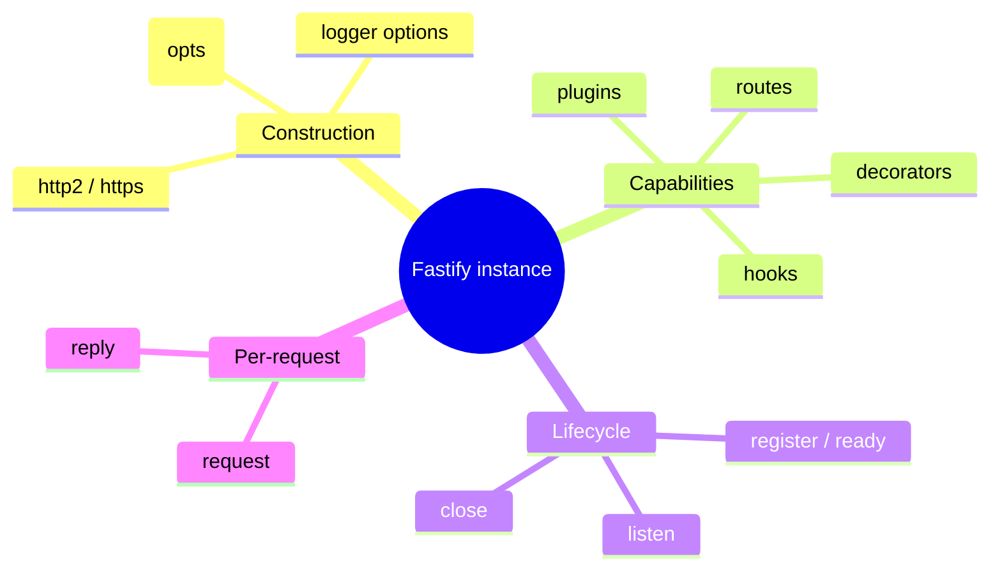
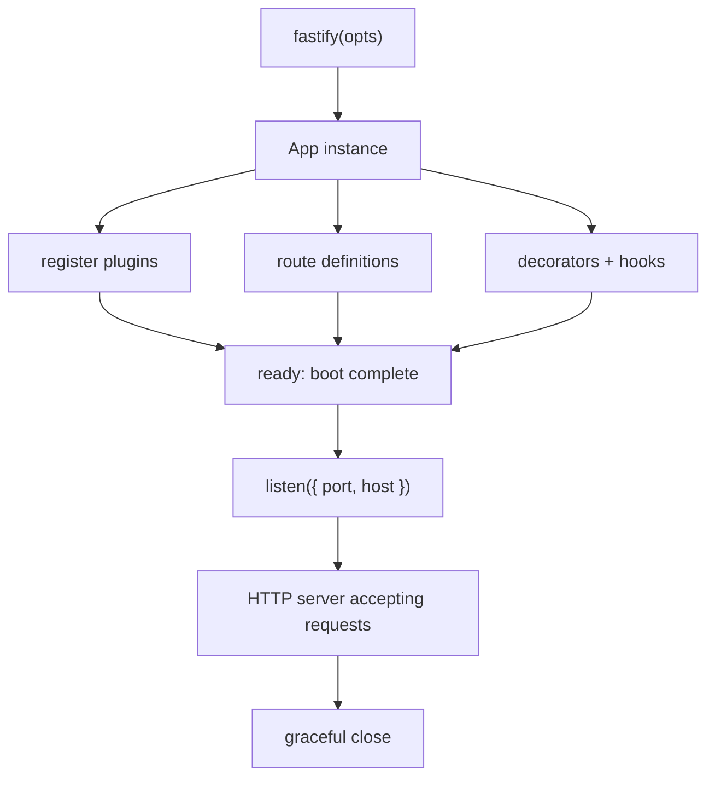
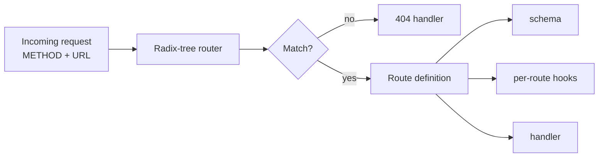
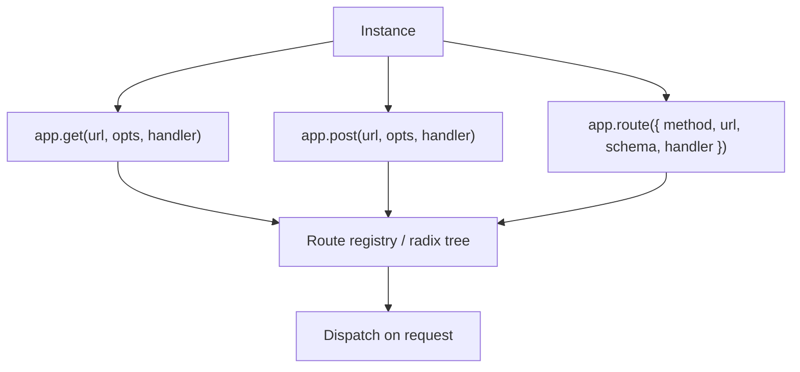
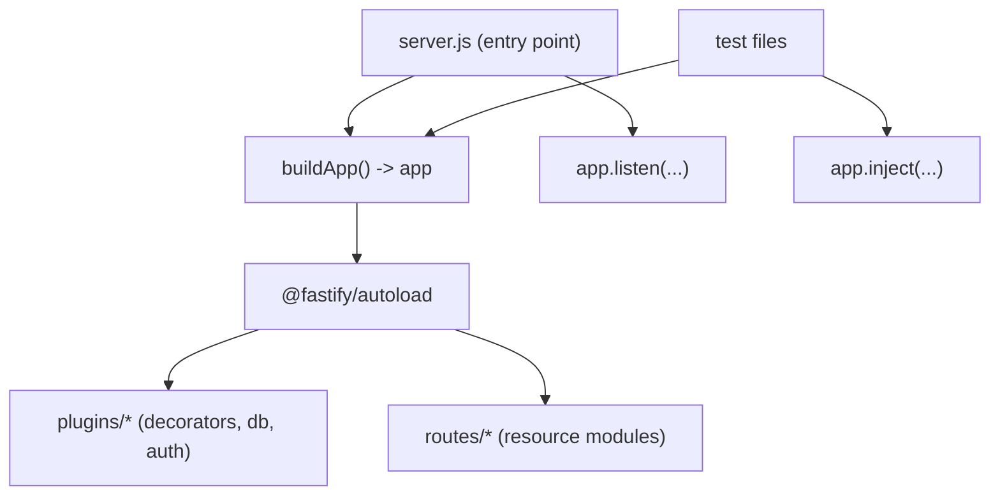
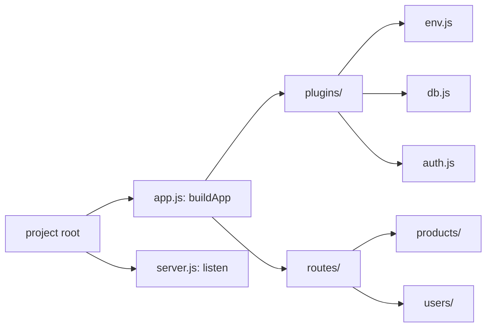

# Fastify 5 - Complete Professional Guide

> **Category:** 14_frameworks · **Language:** English

---

### Routes, Schemas & Validation, Plugins, Hooks, Decorators, Serialization, Performance
**Edition for Fastify 5 (Node.js)**

> **Reference book (English).** A professional, in-depth guide to building production HTTP services with **Fastify 5** on Node.js, for backend developers, architects, and teams. Based on the official Fastify documentation (https://fastify.dev) and its companion guides and reference pages.
>
> **Scope notice:** this book teaches Fastify 5 as a complete server framework — the application instance and routing, JSON Schema validation and serialization, the encapsulation-based plugin system, decorators, the request/reply lifecycle and hooks, error handling, logging, database and auth integration, TypeScript, testing, the plugin ecosystem, and performance. Each chapter follows the TO-BRAIN editorial standard (see `FILE_CONVENTIONS.md`).

---

## How to read this book

Progressive depth across five maturity levels:

| Level | Profile | Parts |
|-------|---------|-------|
| 1 — Beginner | New to Fastify | Part I |
| 2 — Intermediate | Validation & serialization | Part II |
| 3 — Advanced | Plugins, decorators, hooks | Parts III–V |
| 4 — Specialist | Errors, logging, data, auth | Parts VI–VII |
| 5 — Enterprise | TS, testing, ecosystem, perf, deploy | Part VIII |

**Target audience:** Node.js and full-stack developers, software architects, backend engineers, tech leads, and CTOs adopting Fastify 5 for new services or migrating from Express/Koa.

**Structure of each chapter:** Introduction · Business context · Theoretical concepts · Architecture · Diagrams (Mermaid) · Real examples · Step by step · Complete code · Exercises · Challenges · Checklist · Best practices · Anti-patterns · Troubleshooting · Official references.

**Example format:** Scenario · Problem · Solution · Implementation · Result · Future improvements.

> **Note on prerequisites.** This book assumes working knowledge of modern JavaScript (ES modules, `async`/`await`, Promises) and Node.js fundamentals (the HTTP module, `package.json`, npm). Where a Fastify concept builds on a prior one — for example hooks building on the request lifecycle — we link the lineage.

---

## Table of Contents

**Part I – Fastify 5 Fundamentals**
1. What is Fastify and how the instance works
2. Routing — methods, parameters, and route options
3. Project structure and the application bootstrap

**Part II – Schemas, Validation & Serialization**
4. JSON Schema validation of body, params, querystring, and headers
5. Response serialization and the `serializer` fast-path
6. Shared schemas, `$ref`, and schema compilers (Ajv, TypeBox)

**Part III – The Plugin System**
7. Plugins and encapsulation contexts
8. `fastify-plugin` and breaking encapsulation deliberately
9. Loading order, `await register`, and `ready`

**Part IV – Decorators**
10. Decorating the instance, request, and reply
11. Decoration patterns and `getDecorator`/dependencies

**Part V – Hooks & the Lifecycle**
12. The request/reply lifecycle in depth
13. Lifecycle hooks (`onRequest` → `onResponse`) and application hooks

**Part VI – Errors, Configuration & Logging**
14. Error handling, `setErrorHandler`, and `@fastify/error`
15. Configuration, environment, and logging with Pino

**Part VII – Data & Authentication**
16. Database integration (Postgres/Prisma) via plugins
17. Authentication and authorization with `@fastify/jwt`

**Part VIII – TypeScript, Testing, Ecosystem & Production**
18. TypeScript usage and type providers
19. Testing with `fastify.inject()`
20. Ecosystem plugins (cors, helmet, rate-limit, swagger)
21. Performance tuning and deployment

> **Status of this edition:** phased delivery (each part keeps the same depth standard). **Ready:** Part I (Ch. 1–3). **In progress:** Parts II–VIII.

---

## Part I – Fastify 5 Fundamentals

Part I gives you the mental model you need before anything else: what the Fastify **instance** is, how **routing** maps requests to handlers, and how to **bootstrap** a real project so it stays maintainable as it grows. Fastify's design philosophy is **low overhead and a great developer experience** — it achieves speed largely through compiling JSON Schemas into fast validators and serializers, and it achieves structure through an encapsulation-based plugin system. Understanding the instance and the route lifecycle first makes every later concept (plugins, hooks, decorators) fall into place.

---

## Chapter 1 — What is Fastify and how the instance works

### 1.1 Introduction

Fastify is a web framework for Node.js focused on **performance** and **developer experience**. You create an application by calling the factory function `fastify(opts)`, which returns an **instance**: an object that holds your routes, plugins, decorators, hooks, and configuration. Everything you build attaches to that instance. In Fastify 5, the instance is fully Promise-aware: handlers are `async` functions, `listen()` returns a Promise, and the recommended startup uses `await app.listen(...)` inside a `try/catch`. This chapter explains what the instance is, how it is constructed, and the contract between your code and the framework.

### 1.2 Business context

For an engineering organization, the choice of HTTP framework is a long-term bet on **throughput per server**, **maintainability**, and **ecosystem**. Fastify's value proposition is concrete: schema-driven validation and serialization deliver high requests-per-second while *also* documenting and hardening your API, and the plugin/encapsulation model keeps large codebases modular. The business read: fewer servers for the same load, fewer runtime bugs from unvalidated input, and a structure that lets teams own slices of the API without stepping on each other.

### 1.3 Theoretical concepts: the instance and its building blocks



The instance is the single source of truth. Calling `fastify()` builds the root context; `register()` adds plugins (each with its own child context); `ready()` finalizes the boot sequence after all plugins have loaded; and `listen()` starts accepting connections. Each incoming request produces a fresh `request`/`reply` pair scoped to the route that matched.

### 1.4 Architecture: from factory to live server



The boot sequence is asynchronous and ordered: Fastify resolves the plugin tree, runs application hooks, then begins listening. Nothing serves traffic until `ready` completes, which guarantees plugins (DB pools, auth, config) are fully initialized before the first request.

### 1.5 Real example

**Scenario.** A team needs a minimal but production-shaped HTTP service that starts cleanly, logs in JSON, and shuts down gracefully.

**Problem.** A naive `listen()` without error handling crashes silently on a bound port, and console logging is unstructured and slow under load.

**Solution.** Build the instance with the Pino logger enabled, register a route, and start with `await app.listen()` inside `try/catch`. Wire `SIGINT`/`SIGTERM` to `app.close()` for graceful shutdown.

**Implementation.**

```javascript
import Fastify from 'fastify'

const app = Fastify({
  logger: {
    level: 'info',
    transport: process.env.NODE_ENV === 'development'
      ? { target: 'pino-pretty' }
      : undefined
  }
})

app.get('/health', async (request, reply) => {
  return { status: 'ok', uptime: process.uptime() }
})

const start = async () => {
  try {
    await app.listen({ port: Number(process.env.PORT) || 3000, host: '0.0.0.0' })
  } catch (err) {
    app.log.error(err)
    process.exit(1)
  }
}

for (const signal of ['SIGINT', 'SIGTERM']) {
  process.on(signal, async () => {
    await app.close()
    process.exit(0)
  })
}

start()
```

**Result.** The server starts on the configured port, logs a structured "server listening" line, returns `{ status: "ok" }` from `/health`, and exits cleanly on Ctrl-C without dropping in-flight requests.

**Future improvements.** Move config to a validated environment schema (Chapter 15), and split routes/plugins into files registered via autoload (Chapter 3).

### 1.6 Exercises

1. Create an instance with the logger disabled, then enable it and observe the difference in startup output.
2. Add a second route `/version` that returns the value of `process.version`.
3. Change the listen host to `127.0.0.1` and explain why `0.0.0.0` matters inside a container.

### 1.7 Challenges

1. Add a `genReqId` function so every request gets a UUID instead of an incrementing integer, and confirm the id appears in logs.
2. Implement a `/slow` route that resolves after 5 seconds and verify `app.close()` waits for it (graceful shutdown) when `forceCloseConnections` is enabled.

### 1.8 Checklist

- [ ] The instance is created with `fastify(opts)` and a logger configured.
- [ ] Startup uses `await app.listen(...)` inside `try/catch`.
- [ ] `host` is set explicitly (`0.0.0.0` in containers).
- [ ] `SIGINT`/`SIGTERM` call `app.close()` for graceful shutdown.
- [ ] A `/health` route exists for orchestrators.

### 1.9 Best practices

- Enable the built-in **Pino** logger from day one; use `pino-pretty` only in development.
- Always handle the `listen()` rejection — do not let a port-in-use error pass silently.
- Keep the bootstrap file thin; put routes and concerns in plugins.
- Expose a lightweight health endpoint that does no heavy work.

### 1.10 Anti-patterns

- Calling `listen()` without awaiting or catching its result.
- Using `console.log` instead of `app.log`, losing request correlation and structured fields.
- Doing application setup (DB connect, schema add) *after* `listen()` instead of before `ready`.

### 1.11 Troubleshooting

| Symptom | Cause | Action |
|---------|-------|--------|
| `EADDRINUSE` on start | Port already bound | Change `PORT` or stop the other process; ensure `listen` errors are caught |
| Server unreachable from another host/container | Bound to `127.0.0.1` | Listen on `0.0.0.0` |
| No logs appear | `logger: false` or wrong level | Set `logger: { level: 'info' }` |
| Process hangs on Ctrl-C | Open connections not closed | Use `app.close()` and consider `forceCloseConnections: true` |

### 1.12 Official references

- Getting Started: https://fastify.dev/docs/latest/Guides/Getting-Started/
- Factory & server options: https://fastify.dev/docs/latest/Reference/Server/
- Logging: https://fastify.dev/docs/latest/Reference/Logging/

---

## Chapter 2 — Routing — methods, parameters, and route options

### 2.1 Introduction

Routing is how Fastify maps an incoming HTTP method and URL to your handler. You declare routes with shorthand methods (`app.get`, `app.post`, …) or with the full `app.route({ method, url, handler, ... })` form. Internally Fastify uses a **radix-tree router** (find-my-way) for fast matching, and a route is far more than a handler: it carries its **schema**, its per-route **hooks**, **config**, and a **handler**, all declared in one place. This chapter covers methods, path/query parameters, wildcards, and the full route options object.

### 2.2 Business context

Clear, predictable routing is the backbone of an API that other teams can consume. Co-locating the schema, hooks, and handler on each route makes the contract self-documenting and reviewable in a single diff — which lowers onboarding cost and reduces the class of bugs where validation, auth, and logic drift apart across files.

### 2.3 Theoretical concepts: anatomy of a route



A route definition groups everything a request needs: a `method` (string or array), a `url` (with named params `:id` and wildcards `*`), an optional `schema`, optional lifecycle hooks, a `config` object you can read later, and the `handler` itself. Parameters are exposed on `request.params`, the query on `request.querystring`/`request.query`, and the parsed body on `request.body`.

### 2.4 Architecture: the route registry



All shorthand methods funnel into the same internal `route()` registration. The registry is built during boot, so routes added after `ready` require care; the recommended pattern is to declare all routes inside plugins that load before `listen`.

### 2.5 Real example

**Scenario.** A products API needs `GET /products/:id`, a paginated `GET /products?limit=&page=`, and `POST /products`.

**Problem.** Mixing path params, typed query params, and a request body across ad-hoc handlers leads to inconsistent parsing and missing validation.

**Solution.** Use the full route options object with schemas so params and query are coerced and validated, and read pagination from `request.query`.

**Implementation.**

```javascript
async function productRoutes(app) {
  app.get('/products/:id', {
    schema: {
      params: {
        type: 'object',
        properties: { id: { type: 'integer' } },
        required: ['id']
      }
    }
  }, async (request) => {
    const { id } = request.params // id is coerced to a number
    return { id, name: `Product ${id}` }
  })

  app.get('/products', {
    schema: {
      querystring: {
        type: 'object',
        properties: {
          limit: { type: 'integer', minimum: 1, maximum: 100, default: 20 },
          page: { type: 'integer', minimum: 1, default: 1 }
        }
      }
    }
  }, async (request) => {
    const { limit, page } = request.query
    return { limit, page, items: [] }
  })

  app.post('/products', {
    schema: {
      body: {
        type: 'object',
        required: ['name'],
        properties: { name: { type: 'string', minLength: 1 } }
      }
    }
  }, async (request, reply) => {
    reply.code(201)
    return { id: 1, name: request.body.name }
  })
}

export default productRoutes
```

**Result.** Invalid ids return `400` automatically; missing query params default to `limit=20, page=1`; a body without `name` is rejected before the handler runs; a created product returns `201`.

**Future improvements.** Extract the shared `product` shape into a named schema with `$ref` (Chapter 6) and add a response schema for serialization (Chapter 5).

### 2.6 Exercises

1. Add a wildcard route `GET /files/*` and log the matched `request.params['*']`.
2. Register a route that accepts multiple methods (`['GET', 'HEAD']`) with one handler.
3. Use the `config` option to attach `{ rateLimit: false }` and read it from inside a hook.

### 2.7 Challenges

1. Implement a custom `setNotFoundHandler` that returns a JSON 404 with the attempted URL.
2. Add a route-level `onRequest` hook that rejects requests missing an `x-api-key` header before the handler runs.

### 2.8 Checklist

- [ ] Each route declares its `schema` for params, query, and/or body.
- [ ] Path parameters use `:name`; wildcards use `*` only when needed.
- [ ] Routes live inside plugins, registered before `listen`.
- [ ] Status codes are set explicitly where they differ from 200.
- [ ] A custom not-found handler returns structured JSON.

### 2.9 Best practices

- Prefer the full route-options object so schema, hooks, and handler stay together.
- Let schema **coercion** convert string params/query to the right types instead of parsing by hand.
- Group related routes in a dedicated plugin (a "route module").
- Set `default` values in the schema rather than inside the handler.

### 2.10 Anti-patterns

- Manually parsing `request.params.id` with `parseInt` instead of declaring an `integer` schema.
- Registering routes dynamically after `ready` without understanding boot ordering.
- Putting business logic, auth, and validation in unrelated files that drift apart.

### 2.11 Troubleshooting

| Symptom | Cause | Action |
|---------|-------|--------|
| `404` for a route you defined | Plugin not registered or prefix mismatch | Verify registration order and `prefix` |
| Params arrive as strings | No params schema | Add a `params` schema so values are coerced |
| `400` on valid-looking input | Schema stricter than expected | Inspect the validation error message; relax/adjust schema |
| Two routes collide | Same method + path | Make URLs unique or use distinct prefixes |

### 2.12 Official references

- Routes: https://fastify.dev/docs/latest/Reference/Routes/
- Validation and Serialization: https://fastify.dev/docs/latest/Reference/Validation-and-Serialization/
- Request: https://fastify.dev/docs/latest/Reference/Request/

---

## Chapter 3 — Project structure and the application bootstrap

### 3.1 Introduction

A small Fastify app fits in one file; a real one does not. Fastify's recommended structure separates the **application** (the assembled instance with all plugins and routes) from the **server entry point** (the file that imports the app and calls `listen`). This split makes the app importable in tests (where you use `inject` instead of a real socket) and keeps the entry point trivial. The official ecosystem provides `@fastify/autoload` to register every plugin and route in a directory automatically. This chapter establishes a layout that scales.

### 3.2 Business context

Codebase structure is an investment in **team velocity**. A consistent layout — plugins for cross-cutting concerns, route modules per resource, a single app builder — means new engineers find things fast, tests are easy to write, and the same instance runs identically in tests, CI, and production. The cost of getting this wrong shows up later as tangled startup code that is hard to test and risky to change.

### 3.3 Theoretical concepts: app builder vs server entry



The `buildApp()` function returns a fully assembled but **not-yet-listening** instance. The server entry imports it and listens; tests import it and call `inject`. Autoload walks `plugins/` first (shared concerns) and `routes/` second (the API surface), respecting encapsulation.

### 3.4 Architecture: a scalable directory layout



Plugins under `plugins/` use `fastify-plugin` so their decorators are visible app-wide; route modules under `routes/` stay encapsulated so each resource owns its own context. `buildApp` wires both via autoload.

### 3.5 Real example

**Scenario.** A growing service should run the same instance in production and in tests, with plugins and routes auto-registered.

**Problem.** Everything lives in one `index.js`; tests spin up a real server on a port, startup logic is duplicated, and adding a route means editing the bootstrap.

**Solution.** Introduce `app.js` exporting `buildApp()` that uses `@fastify/autoload`, and a thin `server.js` that only listens.

**Implementation.**

```javascript
// app.js
import Fastify from 'fastify'
import autoload from '@fastify/autoload'
import { fileURLToPath } from 'node:url'
import { dirname, join } from 'node:path'

const __dirname = dirname(fileURLToPath(import.meta.url))

export function buildApp(opts = {}) {
  const app = Fastify({ logger: true, ...opts })

  app.register(autoload, { dir: join(__dirname, 'plugins') })
  app.register(autoload, { dir: join(__dirname, 'routes') })

  return app
}

// server.js
import { buildApp } from './app.js'

const app = buildApp()

try {
  await app.listen({ port: Number(process.env.PORT) || 3000, host: '0.0.0.0' })
} catch (err) {
  app.log.error(err)
  process.exit(1)
}
```

**Result.** Adding a file under `routes/` registers a new route with no bootstrap edits. Tests call `buildApp()` and use `inject`, running the exact production instance without binding a port.

**Future improvements.** Add an `env` plugin that validates configuration before routes load (Chapter 15), and add per-environment options passed through `buildApp(opts)`.

### 3.6 Exercises

1. Move the `/health` route from Chapter 1 into `routes/health.js` and confirm autoload picks it up.
2. Create a `plugins/sensible.js` that registers `@fastify/sensible` and use `reply.notFound()` in a route.
3. Write a test file that imports `buildApp`, calls `inject({ method: 'GET', url: '/health' })`, and asserts a 200.

### 3.7 Challenges

1. Configure autoload to apply a `prefix` per route directory (e.g. `routes/v1` → `/v1`).
2. Add an option to `buildApp` that disables the logger in tests and asserts the instance behaves identically.

### 3.8 Checklist

- [ ] `buildApp()` returns the assembled instance without calling `listen`.
- [ ] `server.js` only imports `buildApp` and listens.
- [ ] Cross-cutting concerns live in `plugins/` (with `fastify-plugin`).
- [ ] Resource routes live in `routes/` and stay encapsulated.
- [ ] Tests import `buildApp` and use `inject`.

### 3.9 Best practices

- Keep the entry point dumb; all assembly happens in `buildApp`.
- Use `@fastify/autoload` to remove manual registration boilerplate.
- Load shared plugins before routes so decorators are available.
- Pass environment-specific options through `buildApp(opts)` for testability.

### 3.10 Anti-patterns

- Calling `listen` inside the same module that defines routes and plugins (untestable).
- Mixing `fastify-plugin`-wrapped and encapsulated plugins without intent.
- Hard-coding config in the bootstrap instead of a validated env plugin.

### 3.11 Troubleshooting

| Symptom | Cause | Action |
|---------|-------|--------|
| Autoload registers nothing | Wrong `dir` path under ESM | Resolve `__dirname` via `fileURLToPath(import.meta.url)` |
| Route loaded but 404 | Missing or mismatched prefix | Set `prefix` consistently in autoload options |
| Decorator missing in a route | Plugin not using `fastify-plugin` | Wrap shared plugins so decorations escape encapsulation |
| Tests bind a real port | Test calls `listen` | Use `inject` against `buildApp()` instead |

### 3.12 Official references

- Plugins Guide: https://fastify.dev/docs/latest/Guides/Plugins-Guide/
- `@fastify/autoload`: https://github.com/fastify/fastify-autoload
- Testing: https://fastify.dev/docs/latest/Guides/Testing/

---

> **End of Part I.** You now have the foundations of Fastify 5: the application **instance** and its boot/shutdown lifecycle, the **routing** model with parameters and route options, and a **project structure** that runs the same `buildApp()` instance in production and tests. **Part II — Schemas, Validation & Serialization** (Chapters 4–6) dives into JSON Schema validation of body/params/query/headers, the fast response serializer, and shared schemas with `$ref` and pluggable compilers (Ajv, TypeBox).

<!--APPEND-PARTE-II-->
