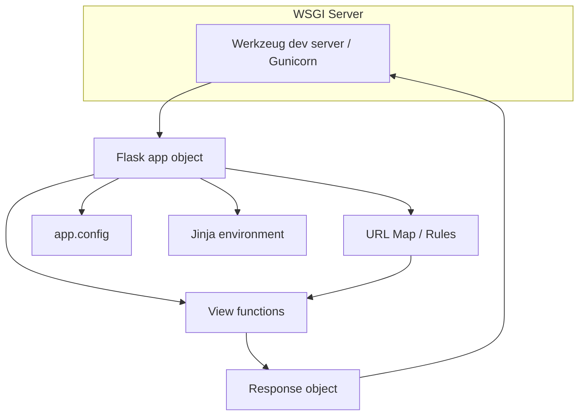
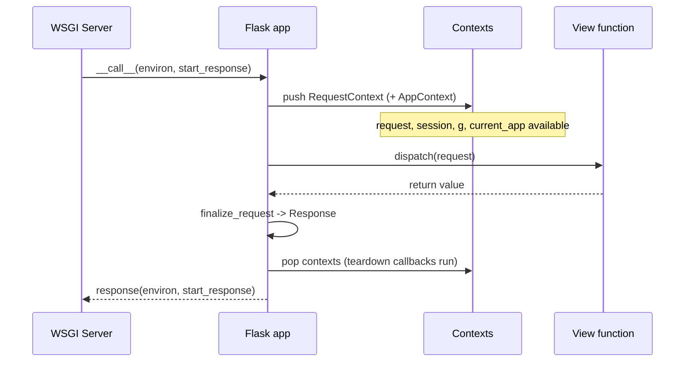
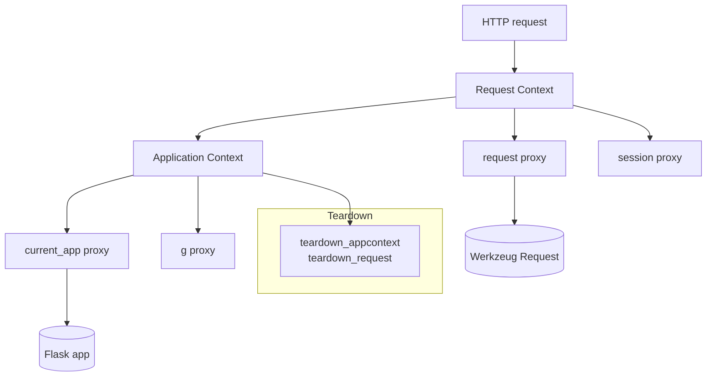
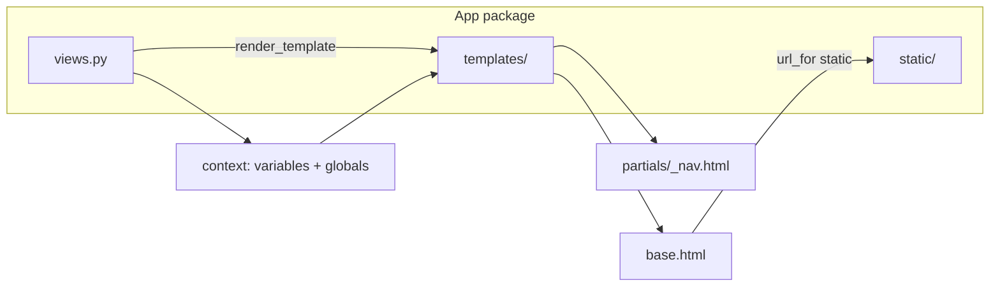

# Flask 3 - Complete Professional Guide

> **Category:** 14_frameworks · **Language:** English

---

### Routing, Templates, Blueprints, Application Factory, Extensions, REST APIs
**Edition for Flask 3.x (Python 3.11+)**

> **Reference book (English).** A professional, in-depth guide to building production web applications and APIs with Flask 3.x. Based primarily on the official Flask documentation (https://flask.palletsprojects.com) and the companion Pallets projects (Werkzeug, Jinja, Click, itsdangerous).
>
> **Scope notice:** this book teaches Flask 3 from first principles up to production-grade architecture. It targets developers who know Python and want to master Flask's request lifecycle, application structure, and extension ecosystem. Each chapter follows the TO-BRAIN editorial standard (see `FILE_CONVENTIONS.md`).

---

## How to read this book

Progressive depth across five maturity levels:

| Level | Profile | Parts |
|-------|---------|-------|
| 1 — Beginner | New to Flask | Part I |
| 2 — Intermediate | Templates, factory, blueprints | Parts II–III |
| 3 — Advanced | Forms, database, sessions, auth | Parts IV–V |
| 4 — Specialist | REST APIs, errors, testing | Parts VI–VII |
| 5 — Enterprise | Extensions, performance, deployment | Part VIII |

**Target audience:** Python developers, backend engineers, full-stack developers, software architects, tech leads, and CTOs adopting or scaling Flask 3.

**Structure of each chapter:** Introduction · Business context · Theoretical concepts · Architecture · Diagrams (Mermaid) · Real examples · Step by step · Complete code · Exercises · Challenges · Checklist · Best practices · Anti-patterns · Troubleshooting · Official references.

**Example format:** Scenario · Problem · Solution · Implementation · Result · Future improvements.

> **Note on prerequisites.** This book assumes working knowledge of Python 3.11+, virtual environments, `pip`, and basic HTTP concepts (methods, status codes, headers). Where a Flask feature relies on an underlying Pallets library (Werkzeug for WSGI, Jinja for templates), we name the lineage.

---

## Table of Contents

**Part I – Flask Fundamentals**
1. The Flask application and routing
2. The request/response cycle and application context
3. Templates with Jinja2

**Part II – Structuring Real Applications**
4. The application factory and blueprints
5. Configuration management
6. Static files, URL building, and project layout

**Part III – Forms & Data**
7. Forms with Flask-WTF and validation
8. Databases with Flask-SQLAlchemy
9. Sessions, cookies, and message flashing

**Part IV – Identity**
10. Authentication with Flask-Login
11. Authorization and access control

**Part V – Building REST APIs**
12. REST APIs with blueprints and marshmallow
13. Serialization, pagination, and content negotiation

**Part VI – Robustness**
14. Error handling and custom error pages
15. Logging and observability

**Part VII – Quality**
16. Testing with pytest and the test client
17. The Flask extensions ecosystem

**Part VIII – Production**
18. Performance and async views
19. Deployment with Gunicorn and WSGI servers
20. Security hardening for production

> **Status of this edition:** phased delivery (each part keeps the same depth standard). **Ready:** Part I (Ch. 1–3). **In progress:** Parts II–VIII.

---

## Part I – Flask Fundamentals

Part I establishes the core mental model of Flask: a thin, explicit microframework built on **Werkzeug** (WSGI and routing) and **Jinja2** (templating). You will learn how an application object dispatches requests, how the request and application contexts make data available without globals, and how to render dynamic HTML safely. Master these three chapters and every later topic — blueprints, databases, APIs — becomes a natural extension.

---

## Chapter 1 — The Flask application and routing

### 1.1 Introduction

Flask is a **WSGI microframework**: it gives you a minimal, well-documented core (routing, request/response objects, templating, a development server) and leaves larger decisions — database, forms, authentication — to extensions you choose. The heart of every Flask program is a single `Flask` application object. You register **view functions** against **URL rules**, and when a request arrives, Werkzeug's routing layer matches the URL to the right view and calls it. This chapter covers creating the app, the routing system, dynamic URL converters, and HTTP methods.

### 1.2 Business context

Flask's "small core, choose-your-own-stack" philosophy is a strategic asset. Teams can start with a single file and grow to a structured package without rewrites, and they are never forced into an ORM or template engine they dislike. For organizations, this means **low onboarding cost**, **predictable behavior** (Flask does little magic), and **freedom from lock-in**. The trade-off is that architectural discipline is the team's responsibility — Flask will not impose structure, so conventions must come from engineering standards rather than the framework.

### 1.3 Theoretical concepts: routing as URL-to-function mapping

A Flask route binds a **URL rule** (a path pattern) to a **view function**. The `@app.route()` decorator is sugar over `app.add_url_rule()`. Werkzeug compiles the rules into a map and, on each request, performs **URL matching** to select an endpoint, extracting any dynamic segments as keyword arguments.

```mermaid
flowchart LR
    A[Incoming request: GET /user/ada] --> B[Werkzeug URL Map]
    B --> C{Match rule\n/user/&lt;username&gt;}
    C -->|matched| D[Endpoint: show_user]
    D --> E[View function\nshow_user&#40;username='ada'&#41;]
    E --> F[Return value -> Response]
    C -->|no match| G[404 Not Found]
```



Each rule has an **endpoint** (a name, defaulting to the view function's name) used for reverse URL generation with `url_for()`. Dynamic segments use **converters** like `<int:id>`, `<string:name>`, `<path:subpath>`, and `<uuid:token>`, which both validate and coerce the value.

### 1.4 Architecture: the application object at the center



The `Flask` object is the registry and dispatcher: it owns the URL map, the config dictionary, the Jinja environment, error handlers, and the WSGI entry point (`app.wsgi_app`). Calling the app as a WSGI callable is how servers invoke it.

### 1.5 Real example

**Scenario.** A small marketing team needs a lightweight internal tool to look up product details by SKU and list a category index.

**Problem.** They want clean, shareable URLs (`/product/SKU123`), typed path parameters, and a single command to run locally — without pulling in a heavyweight framework.

**Solution.** Build a minimal Flask app with two routes: a category index and a product detail route using a string converter. Use `url_for()` so links never break when paths change.

**Implementation.**

```python
# app.py
from flask import Flask, url_for, abort

app = Flask(__name__)

PRODUCTS = {
    "SKU123": {"name": "Ergonomic Chair", "category": "office"},
    "SKU777": {"name": "Standing Desk", "category": "office"},
}


@app.route("/")
def index():
    links = [
        f'<li><a href="{url_for("product_detail", sku=sku)}">{p["name"]}</a></li>'
        for sku, p in PRODUCTS.items()
    ]
    return f"<h1>Catalog</h1><ul>{''.join(links)}</ul>"


@app.route("/product/<string:sku>")
def product_detail(sku):
    product = PRODUCTS.get(sku)
    if product is None:
        abort(404)
    return {"sku": sku, **product}  # dict return -> JSON response


@app.route("/category/<string:name>")
def category(name):
    items = [p for p in PRODUCTS.values() if p["category"] == name]
    return {"category": name, "count": len(items), "items": items}


if __name__ == "__main__":
    app.run(debug=True)
```

Run it with `flask --app app run --debug` (or `python app.py`).

**Result.** Visiting `/` lists products with auto-generated links; `/product/SKU123` returns JSON; an unknown SKU yields a clean 404. Returning a `dict` from a view automatically produces a JSON response in Flask 3.

**Future improvements.** Move data to a database (Chapter 8), render HTML via Jinja templates instead of f-strings (Chapter 3), and split routes into blueprints (Chapter 4).

### 1.6 Exercises

1. Add a route `/health` that returns `{"status": "ok"}` and verify the response `Content-Type` is `application/json`.
2. Add an `<int:year>` route `/archive/<int:year>` and confirm that `/archive/abc` returns 404 automatically.
3. Use `url_for("product_detail", sku="SKU777", _external=True)` and observe the absolute URL produced.
4. Register a route for both `GET` and `POST` using `methods=["GET", "POST"]` and branch on `request.method`.

### 1.7 Challenges

1. Implement a custom URL converter (subclass `werkzeug.routing.BaseConverter`) that only matches slugs like `my-product-name`.
2. Add a catch-all route using the `path` converter and explain why rule ordering does not matter (Werkzeug sorts by specificity).
3. Generate a sitemap by iterating `app.url_map.iter_rules()` and building URLs with `url_for()`.

### 1.8 Checklist

- [ ] The app is created with `Flask(__name__)`.
- [ ] Every dynamic segment uses an explicit converter (`<int:...>`, `<string:...>`).
- [ ] Links are built with `url_for()`, never hardcoded.
- [ ] `abort()` is used for error conditions instead of returning ad-hoc strings.
- [ ] The app runs with `flask --app <module> run --debug` in development.

### 1.9 Best practices

- Prefer `flask run` with the `--app` option over calling `app.run()` directly in production-adjacent code.
- Name endpoints implicitly via the view function name; keep them stable so `url_for()` references survive refactors.
- Return `dict` (or `tuple` of `(body, status, headers)`) for JSON instead of manually calling `jsonify` when convenient.
- Keep view functions thin: parse input, call a service, return a response.

### 1.10 Anti-patterns

- Hardcoding URLs in templates or redirects (`/product/SKU123`) instead of `url_for()`.
- Putting business logic and database queries directly inside view functions in large apps.
- Running with `debug=True` in production (it exposes the interactive debugger — a remote code execution risk).
- Catching all exceptions inside views instead of using error handlers.

### 1.11 Troubleshooting

| Symptom | Likely cause | Fix |
|---------|--------------|-----|
| `Could not build url for endpoint` | Wrong endpoint name or missing argument in `url_for()` | Match the view function name and provide all dynamic args |
| 404 on a URL you defined | Trailing-slash mismatch | A rule ending in `/` redirects; one without `/` 404s on a trailing slash |
| `Method Not Allowed` (405) | Route lacks the HTTP method | Add it to `methods=[...]` |
| App not found by CLI | `--app` not set | Use `flask --app app run` or set `FLASK_APP` |
| Interactive debugger shown to users | `debug=True` in production | Disable debug; use a WSGI server |

### 1.12 Official references

- Quickstart: https://flask.palletsprojects.com/en/stable/quickstart/
- URL Route Registrations: https://flask.palletsprojects.com/en/stable/api/#url-route-registrations
- Werkzeug routing & converters: https://werkzeug.palletsprojects.com/en/stable/routing/
- CLI (`flask` command): https://flask.palletsprojects.com/en/stable/cli/

---

## Chapter 2 — The request/response cycle and application context

### 2.1 Introduction

Flask exposes request data through **context-local proxies** — `request`, `session`, `g`, and `current_app` — that behave like global variables but are actually bound to the specific request being handled. This is how Flask avoids passing a request object through every function call. Understanding the two contexts (**application context** and **request context**) is essential to writing correct Flask code, especially in tests, background tasks, and extensions.

### 2.2 Business context

The context system is what lets teams write concise, readable views without threading state everywhere. But it is also the source of the most common production confusion: the dreaded `RuntimeError: Working outside of application context`. Engineers who understand contexts debug faster, write reliable CLI commands and tests, and integrate extensions safely. For an organization, this knowledge converts a frequent class of mysterious bugs into a five-minute fix.

### 2.3 Theoretical concepts: two contexts, four proxies

Flask pushes an **application context** and a **request context** when a request begins, and pops them when it ends. `current_app` and `g` live on the application context; `request` and `session` live on the request context (which itself pushes an app context if none is active).



The object `g` is a **per-request scratchpad** — use it to cache a value (like a database connection) for the duration of one request, never to share data between requests.

### 2.4 Architecture: proxies bound to context-locals



The proxies are thin lookups into the top of a context stack. When you see "working outside of context," it means the stack is empty — you must push a context manually (e.g., `with app.app_context():`).

### 2.5 Real example

**Scenario.** An API needs a single database connection per request, opened lazily on first use and closed reliably when the request ends — even if an error occurs.

**Problem.** Opening a connection per query is wasteful; leaving connections open leaks resources. The connection must be request-scoped and always closed.

**Solution.** Store the connection on `g`, create it lazily via a helper, and register a `teardown_appcontext` callback to close it. This pattern works in views, CLI commands, and tests alike.

**Implementation.**

```python
# db.py
import sqlite3
from flask import g, current_app


def get_db():
    if "db" not in g:
        g.db = sqlite3.connect(current_app.config["DATABASE"])
        g.db.row_factory = sqlite3.Row
    return g.db


def close_db(exc=None):
    db = g.pop("db", None)
    if db is not None:
        db.close()


def init_app(app):
    app.teardown_appcontext(close_db)
```

```python
# app.py
from flask import Flask, jsonify
import db

app = Flask(__name__)
app.config["DATABASE"] = "app.sqlite3"
db.init_app(app)


@app.route("/users")
def users():
    rows = db.get_db().execute("SELECT id, name FROM users").fetchall()
    return jsonify([dict(r) for r in rows])
```

To use the database outside a request (e.g., in a script), push a context explicitly:

```python
with app.app_context():
    conn = db.get_db()
    # ... work ...
# teardown runs here automatically, closing the connection
```

**Result.** Each request gets exactly one connection, reused across queries and closed automatically — no leaks, no boilerplate in views.

**Future improvements.** Replace raw `sqlite3` with Flask-SQLAlchemy (Chapter 8), which manages a scoped session and teardown for you.

### 2.6 Exercises

1. Trigger `RuntimeError: Working outside of application context` by calling `current_app.config` in a plain Python shell, then fix it with `app.app_context()`.
2. Store a request start timestamp on `g` in a `before_request` hook and log the duration in `after_request`.
3. Read a query-string value with `request.args.get("q", "")` and a JSON body with `request.get_json(silent=True)`.

### 2.7 Challenges

1. Write a `before_request` hook that rejects requests missing an `X-API-Key` header with a 401, and confirm it runs before every view.
2. Demonstrate that `g` is not shared between two concurrent requests by storing and reading a request-specific value.
3. Build a context-managed helper that times any block and pushes the metric to `g` for later logging.

### 2.8 Checklist

- [ ] Request-scoped resources are stored on `g`, not module globals.
- [ ] A `teardown_appcontext` callback releases every resource opened on `g`.
- [ ] Code that runs outside a request pushes `app.app_context()` explicitly.
- [ ] `before_request` / `after_request` hooks are used for cross-cutting concerns.
- [ ] JSON bodies are read with `request.get_json()` and validated.

### 2.9 Best practices

- Treat `g` as request-local cache only; never use it to pass data between requests.
- Always pair resource creation on `g` with a teardown callback.
- Use `current_app` instead of importing the app object directly to avoid circular imports.
- Prefer `request.get_json(silent=True)` and handle `None` explicitly rather than letting a 400 surprise you.

### 2.10 Anti-patterns

- Storing per-request state in module-level globals (data leaks across requests in multi-threaded servers).
- Importing the concrete `app` object across modules instead of using `current_app`.
- Forgetting teardown, causing connection/file-handle leaks under load.
- Doing heavy work in `before_request` that runs for every route, including static files.

### 2.11 Troubleshooting

| Symptom | Likely cause | Fix |
|---------|--------------|-----|
| `RuntimeError: Working outside of application context` | Using `current_app`/`g` with no active context | Wrap in `with app.app_context():` |
| `RuntimeError: Working outside of request context` | Using `request`/`session` outside a request | Use the test request context or restructure code |
| Connection leak under load | Missing teardown callback | Register `teardown_appcontext` to close resources |
| `request.get_json()` returns `None` | Missing/incorrect `Content-Type: application/json` | Send correct header or use `force=True` cautiously |
| Stale data across requests | State held in module globals | Move it to `g` or a request-scoped store |

### 2.12 Official references

- The Application Context: https://flask.palletsprojects.com/en/stable/appcontext/
- The Request Context: https://flask.palletsprojects.com/en/stable/reqcontext/
- Accessing request data: https://flask.palletsprojects.com/en/stable/quickstart/#accessing-request-data
- `g`, `current_app`, `request` API: https://flask.palletsprojects.com/en/stable/api/#application-globals

---

## Chapter 3 — Templates with Jinja2

### 3.1 Introduction

Flask renders dynamic HTML using **Jinja2**, a fast, expressive template engine that is autoescaped by default for `.html` files. You write templates with `{{ expressions }}`, ``, filters, template inheritance, and macros, then render them from views with `render_template()`. This chapter covers the template search path, inheritance with ``, autoescaping and safety, filters, and passing context.

### 3.2 Business context

Server-rendered templates remain the fastest path to a working, SEO-friendly, accessible web UI — no build step, no client framework. For internal tools, admin panels, and content-heavy sites, Jinja templates deliver maintainable HTML with minimal moving parts. The key risk they neutralize is **cross-site scripting (XSS)**: because Flask autoescapes by default, teams get a secure baseline without extra effort, lowering both delivery time and security exposure.

### 3.3 Theoretical concepts: inheritance and autoescaping

Jinja's defining features are **template inheritance** (a base layout defines `` placeholders that children override) and **autoescaping** (variables are HTML-escaped unless explicitly marked safe). Rendering happens against a **context** dictionary you pass to `render_template()`, plus globals Flask injects (`url_for`, `get_flashed_messages`, `config`, `request`).



Autoescaping means `{{ user.name }}` is safe even if the name contains `<script>`. To intentionally render trusted HTML, you opt out with the `|safe` filter — which should be rare and audited.

```mermaid
flowchart TD
    V[View: render_template&#40;'page.html', user=user&#41;] --> J[Jinja Environment]
    J --> L[Loader: templates/ folder]
    L --> BASE[base.html\nblocks: title, content]
    L --> CHILD[page.html\nextends base.html]
    CHILD --> BASE
    J --> ESC[Autoescape on .html]
    ESC --> OUT[Rendered HTML string]
    OUT --> RESP[Response 200 text/html]
```

### 3.4 Architecture: the template layer



Templates live in a `templates/` folder next to the app or blueprint; static assets in `static/`. Jinja resolves `` and `` against the loader's search path.

### 3.5 Real example

**Scenario.** A blog needs a consistent layout (header, nav, footer) shared across a list page and a post-detail page, with safe rendering of user-submitted comments.

**Problem.** Duplicating layout HTML per page is unmaintainable, and comments must never allow script injection.

**Solution.** Use a `base.html` with blocks, child templates that extend it, and rely on autoescaping for comments. Use a filter for date formatting.

**Implementation.**

```html
<!-- templates/base.html -->
<!doctype html>
<html lang="en">
<head>
  <meta charset="utf-8">
  <title>Blog</title>
  <link rel="stylesheet" href="{{ url_for('static', filename='style.css') }}">
</head>
<body>
  <nav><a href="{{ url_for('index') }}">Home</a></nav>
  <main></main>
  <footer>&copy; {{ now.year }}</footer>
</body>
</html>
```

```html
<!-- templates/post.html -->

{{ post.title }}

  <article>
    <h1>{{ post.title }}</h1>
    <p>{{ post.body }}</p>
  </article>
  <section class="comments">
    
      <p><strong>{{ c.author }}</strong>: {{ c.text }}</p>  {# autoescaped #}
    
      <p>No comments yet.</p>
    
  </section>

```

```python
# views.py
from datetime import datetime
from flask import render_template


@app.route("/post/<int:post_id>")
def post(post_id):
    post = get_post(post_id)            # your data access
    comments = get_comments(post_id)
    return render_template(
        "post.html", post=post, comments=comments, now=datetime.utcnow()
    )
```

**Result.** Both pages share one layout; a malicious comment containing `<script>` is rendered as inert text thanks to autoescaping; date and links use Flask globals.

**Future improvements.** Extract the nav into `partials/_nav.html` with ``, add a `|datetimeformat` custom filter, and inject `now` via a context processor so views don't repeat it.

### 3.6 Exercises

1. Add a custom filter with `@app.template_filter("shout")` that uppercases a string, and use it as `{{ "hi" | shout }}`.
2. Register a context processor that injects the current year into every template.
3. Create a `macro` for a reusable form field and call it from two templates.

### 3.7 Challenges

1. Build a base layout with three blocks (`title`, `head`, `content`) and a child that adds a page-specific stylesheet via `{{ super() }}...`.
2. Demonstrate the difference between `{{ value }}` and `{{ value | safe }}` with an input containing HTML, and explain when `|safe` is justified.
3. Use `` with `ignore missing` to render an optional banner partial only if it exists.

### 3.8 Checklist

- [ ] All pages extend a single `base.html`.
- [ ] Static assets are referenced via `url_for('static', filename=...)`.
- [ ] User-supplied content relies on autoescaping; `|safe` is used only on audited, trusted HTML.
- [ ] Repeated UI is extracted into macros or includes.
- [ ] Cross-cutting variables come from context processors, not copy-pasted view args.

### 3.9 Best practices

- Keep logic out of templates; compute values in the view and pass them in.
- Use template inheritance over copy-paste; one base layout per site section.
- Prefer context processors for globally needed values (current user, year, config flags).
- Name partials with a leading underscore (`_nav.html`) to signal they are not standalone pages.

### 3.10 Anti-patterns

- Disabling autoescaping globally or sprinkling `|safe` to "make HTML work."
- Building HTML strings in Python views instead of using templates.
- Hardcoding asset paths instead of `url_for('static', ...)`.
- Heavy computation or database queries inside templates.

### 3.11 Troubleshooting

| Symptom | Likely cause | Fix |
|---------|--------------|-----|
| `TemplateNotFound` | File not in `templates/` or wrong name | Check the folder and exact filename/case |
| HTML renders as visible text | Variable not marked safe but should be trusted HTML | Use `|safe` only on trusted content |
| `<script>` executes from user input | Autoescaping bypassed with `|safe` | Remove `|safe`; let Jinja escape |
| Static file 404 | Wrong filename or missing `static/` folder | Use `url_for('static', filename=...)` |
| `UndefinedError` in template | Variable not passed to `render_template` | Pass it, or guard with `` |

### 3.12 Official references

- Templates: https://flask.palletsprojects.com/en/stable/templating/
- Rendering templates (Quickstart): https://flask.palletsprojects.com/en/stable/quickstart/#rendering-templates
- Jinja template designer documentation: https://jinja.palletsprojects.com/en/stable/templates/
- Autoescaping & safety: https://flask.palletsprojects.com/en/stable/templating/#controlling-autoescaping

---

> **End of Part I.** You now hold the three load-bearing concepts of Flask 3: the application object and its routing, the request/application context system with `g` and the context-local proxies, and safe server-side rendering with Jinja2. Parts II–VIII build directly on this foundation — the application factory and blueprints, configuration, forms and databases, sessions and authentication, REST APIs, error handling, testing, the extensions ecosystem, performance, and production deployment.

<!--APPEND-PARTE-II-->
