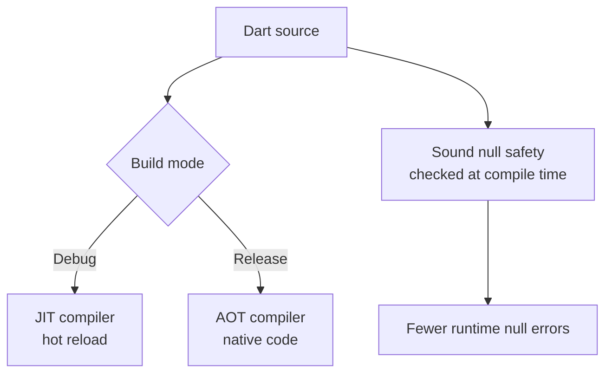
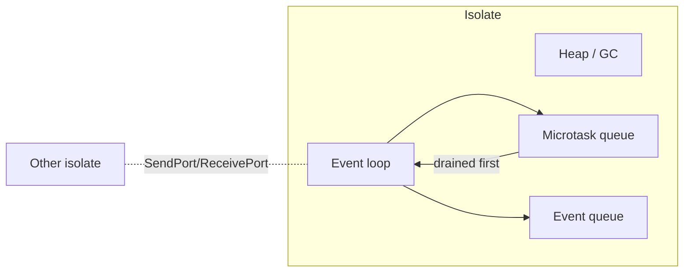
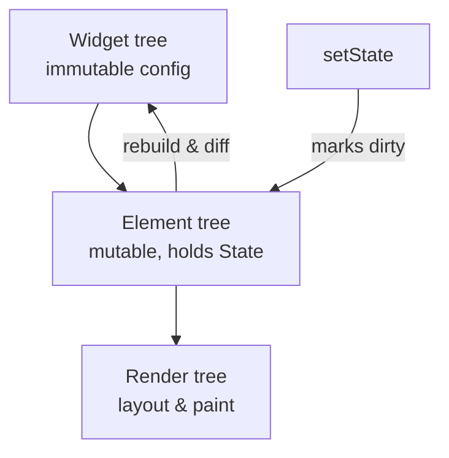
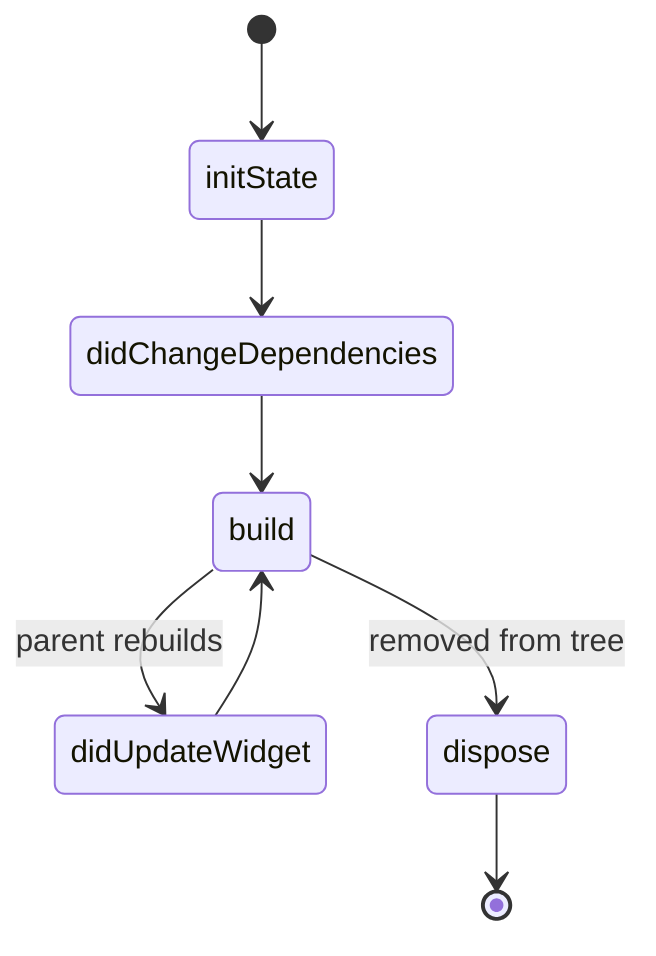
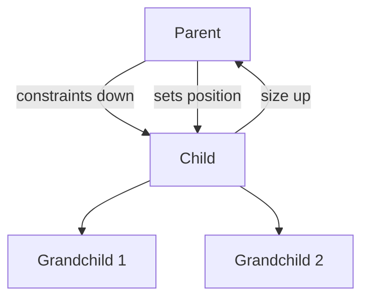
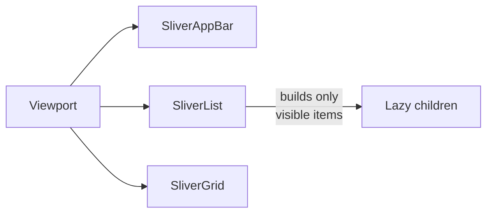

# Flutter 3 - Complete Professional Guide

> **Category:** 14_frameworks · **Language:** English

---

### Dart, Widgets, Layout, State Management, Navigation, Platform Integration
**Edition for Flutter 3.x (Dart 3.x)**

> **Reference book (English).** Based on the official Flutter & Dart documentation (docs.flutter.dev, dart.dev). All explanations, diagrams, and code samples are original and written for this guide. No copyrighted book text is reproduced.
>
> **Scope notice:** This guide targets Flutter 3.x with Dart 3.x (sound null safety, records, patterns, class modifiers). It covers the framework end to end: language fundamentals, the widget model, layout, theming, navigation, state management, networking, persistence, native integration, animation, testing, performance, and release. Each chapter follows the TO-BRAIN editorial standard.

---

## How to read this book

Flutter rewards a layered approach: master the language and the widget tree first, then composition, then app-wide concerns such as state and navigation. The maturity table below maps your current level to the Parts you should prioritize.

| Level | Profile | Focus | Parts |
|-------|---------|-------|-------|
| 1 — Beginner | New to Dart and declarative UI | Language, stateless/stateful widgets, basic layout | I |
| 2 — Builder | Can ship a screen | Composition, theming, input, navigation | II–III |
| 3 — Practitioner | Ships multi-screen apps | State management, networking, persistence | IV–V |
| 4 — Specialist | Owns a production app | Native integration, animation, testing | VI–VII |
| 5 — Architect | Leads a Flutter codebase | Performance, multi-platform build & release | VIII |

**Target audience:** developers and engineering teams adopting Flutter for production mobile, web, and desktop apps, from first-time Dart users to architects standardizing a cross-platform stack.

**Structure of each chapter:** Introduction · Business context · Theoretical concepts · Architecture · Diagrams (Mermaid) · Real examples · Step by step · Complete code · Exercises · Challenges · Checklist · Best practices · Anti-patterns · Troubleshooting · Official references.

**Example format:** Scenario · Problem · Solution · Implementation · Result · Future improvements.

---

## Table of Contents

**Part I — Foundations: Dart and the Widget Model**
1. Dart language essentials (null safety, async/futures/streams, records & patterns)
2. Widgets and the widget tree (stateless vs stateful, build, keys)
3. Layout and composition (Row, Column, Flex, constraints, slivers)

**Part II — Building the UI**
4. Styling, theming, and Material 3
5. Handling input, gestures, and forms
6. Navigation: Navigator 2.0 and go_router

**Part III — Application State**
7. setState and lifting state up
8. InheritedWidget and InheritedNotifier
9. Provider and Riverpod
10. Bloc and the event/state pattern (overview)

**Part IV — Data and the Outside World**
11. Networking with HTTP and JSON serialization
12. Local persistence (shared_preferences, sqlite, files)
13. Repositories and data-layer architecture

**Part V — Native and Platform Integration**
14. Platform channels (MethodChannel, EventChannel)
15. Plugins, federated plugins, and FFI

**Part VI — Motion**
16. Implicit and explicit animations
17. Hero transitions and custom painting

**Part VII — Quality**
18. Unit, widget, and integration testing
19. Debugging and the DevTools suite

**Part VIII — Performance and Release**
20. Performance profiling and best practices
21. Build and release for Android, iOS, web, and desktop

---

> **Status of this edition:** phased delivery. Content is published Part by Part to keep each chapter at full editorial depth. **Ready:** Part I (Ch. 1–3). **In progress:** Parts II–VIII.

---

# Part I – Foundations: Dart and the Widget Model

Flutter is a declarative UI toolkit written in Dart. You describe what the interface should look like for a given state, and the framework reconciles the on-screen result. To work effectively you need two foundations: the Dart language (with sound null safety and Dart 3 features) and the widget model that turns immutable configuration objects into pixels. Part I builds both, then teaches the layout system that governs how widgets size and position themselves. By the end you can read, reason about, and write idiomatic Flutter screens with confidence.

---

## Chapter 1 — Dart Language Essentials

### 1.1 Introduction

Dart is a statically typed, garbage-collected language designed for client-side development. It compiles ahead-of-time (AOT) to native machine code for release builds and uses a just-in-time (JIT) compiler during development to power stateful hot reload. Dart 3 made sound null safety mandatory and introduced records, pattern matching, and class modifiers. This chapter covers the language surface you use daily in Flutter: types and null safety, functions, asynchronous programming with `Future` and `Stream`, and the Dart 3 additions that make data modeling concise.

### 1.2 Business context

Language fluency is not academic. Null-safety bugs and untyped JSON were among the most common crash sources in pre-null-safety mobile apps. A team fluent in Dart's type system ships fewer null-dereference crashes, models API responses with fewer lines, and reasons about concurrency without callback pyramids. For a business, that means lower crash rates, faster onboarding of new engineers, and code reviews that focus on logic rather than ceremony.

### 1.3 Theoretical concepts

**Sound null safety.** Every type is non-nullable by default; `String` cannot hold `null`, while `String?` can. The compiler proves nullability statically, so the runtime never has to guard for unexpected nulls in sound code. Flow analysis promotes `String?` to `String` after a null check.

**Futures and async/await.** A `Future<T>` represents a value available later. `async`/`await` lets you write asynchronous code in a linear style. A `Stream<T>` is a sequence of asynchronous events consumed with `await for` or `listen`.

**Records and patterns.** Records are lightweight immutable aggregates: `(int, String)` or `({int id, String name})`. Patterns destructure values in `switch`, `if-case`, and variable declarations, enabling exhaustive matching.



### 1.4 Architecture

Dart programs run on the Dart runtime, which provides the event loop, isolates, and garbage collector. Each isolate has its own memory heap and a single thread; isolates communicate only by passing messages, which eliminates shared-memory data races. The event loop processes microtasks (completed futures) before the next event-queue task, which is why awaited continuations run promptly.



### 1.5 Real example

**Scenario.** A weather app fetches the current temperature for a city from a REST endpoint and must handle loading, success, and error states.

**Problem.** Naive code returns untyped maps, ignores null fields, and mixes parsing with networking, producing fragile crash-prone logic.

**Solution.** Model the response as an immutable class, parse defensively with null-aware operators, and expose an async function returning a typed `Result`-style record.

**Implementation.**

```dart
import 'dart:convert';
import 'package:http/http.dart' as http;

class Weather {
  final String city;
  final double temperatureC;

  const Weather({required this.city, required this.temperatureC});

  factory Weather.fromJson(Map<String, dynamic> json) {
    return Weather(
      city: json['name'] as String? ?? 'Unknown',
      temperatureC: (json['main']?['temp'] as num?)?.toDouble() ?? 0.0,
    );
  }
}

// Records make a tiny typed result without a wrapper class.
Future<({Weather? data, String? error})> fetchWeather(String city) async {
  final uri = Uri.https('api.example.com', '/weather', {'q': city});
  try {
    final response = await http.get(uri);
    if (response.statusCode != 200) {
      return (data: null, error: 'HTTP ${response.statusCode}');
    }
    final json = jsonDecode(response.body) as Map<String, dynamic>;
    return (data: Weather.fromJson(json), error: null);
  } catch (e) {
    return (data: null, error: e.toString());
  }
}

Future<void> main() async {
  final result = await fetchWeather('Lisbon');
  switch (result) {
    case (data: final Weather w, error: null):
      print('${w.city}: ${w.temperatureC} C');
    case (data: null, error: final String message):
      print('Failed: $message');
    case _:
      print('Unexpected state');
  }
}
```

**Result.** Parsing is null-safe, the return type documents both outcomes, and the call site exhaustively handles each case with pattern matching — no untyped maps leak past the boundary.

**Future improvements.** Replace the ad-hoc record with a sealed class hierarchy for richer error types, add a timeout to the HTTP call, and generate `fromJson` with a code generator to remove boilerplate.

### 1.6 Exercises

1. Write a function `String greet(String? name)` that returns `"Hello, Guest"` when `name` is null and `"Hello, <name>"` otherwise, using `??`.
2. Create a `Stream<int>` that emits 1 through 5 with a one-second delay using an `async*` generator, and consume it with `await for`.
3. Define a record type for a 2D point and write a function that returns the distance between two points.

### 1.7 Challenges

1. Implement a generic `Result<T, E>` as a sealed class with `Ok` and `Err` subclasses, then rewrite `fetchWeather` to use it with exhaustive `switch`.
2. Use `Isolate.run` to parse a large JSON payload off the UI thread and return a typed list.

### 1.8 Checklist

- [ ] I can explain non-nullable vs nullable types and flow promotion.
- [ ] I can write `async`/`await` code and handle errors with try/catch.
- [ ] I can consume a `Stream` with both `listen` and `await for`.
- [ ] I can destructure records and use patterns in `switch`.
- [ ] I understand isolates and why Dart has no shared-memory races.

### 1.9 Best practices

- Prefer `final` and `const` to express immutability; use `const` constructors wherever possible.
- Keep types non-nullable unless absence is a genuine domain state.
- Use named parameters with `required` for readable call sites.
- Parse external data at the boundary into typed models; never pass raw maps deep into the app.

### 1.10 Anti-patterns

- Sprinkling the null-assertion operator `!` to silence the analyzer instead of handling null.
- Using `dynamic` to avoid thinking about types.
- Blocking the event loop with synchronous heavy work instead of using isolates.
- Catching exceptions and swallowing them without logging or surfacing.

### 1.11 Troubleshooting

| Symptom | Likely cause | Fix |
|---------|-------------|-----|
| `Null check operator used on a null value` | `!` applied to a null | Replace with a null check or `??` default |
| `The non-nullable variable must be assigned` | Late init missing | Use `late`, a default, or make it nullable |
| UI freezes during parse | Heavy work on UI isolate | Move work to `Isolate.run` / `compute` |
| `await` has no effect | Function not `async` or value not a `Future` | Mark function `async`; await a real Future |

### 1.12 Official references

- Dart language tour: https://dart.dev/language
- Sound null safety: https://dart.dev/null-safety
- Asynchronous programming: https://dart.dev/libraries/async/async-await
- Records: https://dart.dev/language/records
- Patterns: https://dart.dev/language/patterns

---

## Chapter 2 — Widgets and the Widget Tree

### 2.1 Introduction

In Flutter, almost everything is a widget: structure, layout, styling, and even animation are expressed as widgets. A widget is an immutable description of part of the UI. This chapter explains the two core widget types — `StatelessWidget` and `StatefulWidget` — the `build` method, how Flutter rebuilds efficiently, and why keys matter when widgets move within a list.

### 2.2 Business context

The widget model is what makes Flutter productive: UI is declarative, testable, and composable. Teams that understand the element tree and rebuild semantics avoid wasteful rebuilds that drain battery and drop frames. Correct use of `const` widgets and keys directly affects perceived smoothness, which influences app store ratings and retention.

### 2.3 Theoretical concepts

Flutter maintains three parallel trees. The **widget tree** is your immutable configuration. The **element tree** holds the mutable instances that bind widgets to render objects and persist `State`. The **render tree** does layout and painting. When you call `setState`, Flutter rebuilds the widget subtree, diffs it against the elements, and updates only what changed.

A `StatelessWidget` has no mutable state and rebuilds purely from its constructor inputs. A `StatefulWidget` pairs a configuration with a long-lived `State` object that survives rebuilds and holds mutable fields.



### 2.4 Architecture

The `State` object has a defined lifecycle: `initState` (one-time setup), `didChangeDependencies`, `build` (called often), `didUpdateWidget` (when the parent supplies a new configuration), and `dispose` (cleanup). Controllers, subscriptions, and listeners are created in `initState` and released in `dispose` to prevent leaks.



### 2.5 Real example

**Scenario.** A screen shows a counter with an increment button and a label that reflects the current value.

**Problem.** Beginners often store mutable state in a `StatelessWidget`, where it is lost on rebuild, or forget to dispose controllers.

**Solution.** Use a `StatefulWidget`, hold the count in `State`, call `setState` to trigger a rebuild, and mark static subtrees `const` so they are not rebuilt.

**Implementation.**

```dart
import 'package:flutter/material.dart';

class CounterScreen extends StatefulWidget {
  const CounterScreen({super.key, required this.title});

  final String title;

  @override
  State<CounterScreen> createState() => _CounterScreenState();
}

class _CounterScreenState extends State<CounterScreen> {
  int _count = 0;

  void _increment() => setState(() => _count++);

  @override
  Widget build(BuildContext context) {
    return Scaffold(
      appBar: AppBar(title: Text(widget.title)),
      body: Center(
        child: Column(
          mainAxisAlignment: MainAxisAlignment.center,
          children: [
            const Text('You have pushed the button this many times:'),
            Text(
              '$_count',
              style: Theme.of(context).textTheme.headlineMedium,
            ),
          ],
        ),
      ),
      floatingActionButton: FloatingActionButton(
        onPressed: _increment,
        tooltip: 'Increment',
        child: const Icon(Icons.add),
      ),
    );
  }
}
```

**Result.** The count persists across rebuilds because it lives in `State`. The static label is `const`, so it is created once and skipped on subsequent rebuilds. `widget.title` reads configuration passed from the parent.

**Future improvements.** Extract the counter logic into a `ChangeNotifier` so the value can be tested without a widget, and move presentation-free logic out of `State` (see Part III).

### 2.6 Exercises

1. Convert a `StatelessWidget` greeting card into a `StatefulWidget` that toggles a favorite icon on tap.
2. Add a `TextEditingController` to a text field and dispose it correctly.
3. Add print statements in `initState`, `build`, and `dispose` to observe the lifecycle during navigation.

### 2.7 Challenges

1. Build a reorderable list of items and use `ValueKey` so the correct element state follows each item when reordered.
2. Implement a widget that fetches data in `initState`, shows a spinner while loading, and rebuilds when the data arrives.

### 2.8 Checklist

- [ ] I can choose between `StatelessWidget` and `StatefulWidget` correctly.
- [ ] I create controllers in `initState` and release them in `dispose`.
- [ ] I use `const` constructors for static subtrees.
- [ ] I understand when keys are required.
- [ ] I never mutate fields without `setState` in a `StatefulWidget`.

### 2.9 Best practices

- Keep `build` pure and fast; do no I/O inside it.
- Break large `build` methods into smaller widget classes rather than helper methods, so `const` and rebuild scoping apply.
- Always pass `super.key` through custom widget constructors.
- Prefer `const` widgets to let Flutter skip rebuilds.

### 2.10 Anti-patterns

- Doing network calls inside `build`.
- Storing mutable state in a `StatelessWidget`.
- Forgetting to call `dispose` on controllers and subscriptions.
- Calling `setState` after the widget is unmounted (guard with `mounted`).

### 2.11 Troubleshooting

| Symptom | Likely cause | Fix |
|---------|-------------|-----|
| `setState() called after dispose()` | Async callback after unmount | Check `if (!mounted) return;` first |
| State resets unexpectedly in a list | Missing or unstable keys | Add `ValueKey` tied to item identity |
| UI does not update | Mutated field without `setState` | Wrap the change in `setState` |
| Janky scrolling | Expensive non-`const` rebuilds | Add `const`, split widgets |

### 2.12 Official references

- Introduction to widgets: https://docs.flutter.dev/ui/widgets-intro
- StatefulWidget API: https://api.flutter.dev/flutter/widgets/StatefulWidget-class.html
- Using keys: https://docs.flutter.dev/ui/widgets-intro#keys
- Inside Flutter (trees): https://docs.flutter.dev/resources/inside-flutter

---

## Chapter 3 — Layout and Composition

### 3.1 Introduction

Flutter's layout model is built on a single rule: constraints go down, sizes go up, and the parent sets the position. This chapter teaches the core layout widgets — `Row`, `Column`, `Flex`, `Stack`, `Expanded`, and `Padding` — how the constraint system works, and how slivers power scrollable, lazily built content.

### 3.2 Business context

Layout is where most visual bugs and overflow errors live. Engineers who understand constraints fix "RenderFlex overflowed" in seconds instead of hours and build responsive screens that adapt across phones, tablets, foldables, and desktop windows — broadening the addressable market for a single codebase.

### 3.3 Theoretical concepts

Each widget receives **constraints** (min/max width and height) from its parent. It chooses a size within those constraints and reports it back. The parent then positions the child. `Row` and `Column` lay out children along a main axis; `Expanded` and `Flexible` distribute remaining space. `Stack` overlaps children, positioned by `Positioned`. Slivers are scrollable areas computed lazily as they scroll into view.



### 3.4 Architecture

`CustomScrollView` composes multiple slivers (`SliverAppBar`, `SliverList`, `SliverGrid`). Each sliver receives a `SliverConstraints` describing the visible viewport and produces a `SliverGeometry`. Only the visible portion is built, which keeps memory and frame cost flat regardless of list length.



### 3.5 Real example

**Scenario.** A product page needs a header image, a title and price row, and a scrollable description, adapting to any screen height without overflow.

**Problem.** A fixed `Column` overflows on small screens and leaves dead space on large ones; rows of unequal text overflow horizontally.

**Solution.** Use `CustomScrollView` with a `SliverAppBar` for the header and a `SliverList`; inside the row use `Expanded` so the title flexes while the price stays intrinsic.

**Implementation.**

```dart
import 'package:flutter/material.dart';

class ProductPage extends StatelessWidget {
  const ProductPage({super.key});

  @override
  Widget build(BuildContext context) {
    return Scaffold(
      body: CustomScrollView(
        slivers: [
          const SliverAppBar(
            expandedHeight: 220,
            pinned: true,
            flexibleSpace: FlexibleSpaceBar(title: Text('Wireless Headphones')),
          ),
          SliverToBoxAdapter(
            child: Padding(
              padding: const EdgeInsets.all(16),
              child: Row(
                children: [
                  Expanded(
                    child: Text(
                      'Studio-grade over-ear headphones',
                      style: Theme.of(context).textTheme.titleLarge,
                    ),
                  ),
                  const SizedBox(width: 12),
                  const Text('\$199'),
                ],
              ),
            ),
          ),
          SliverList.builder(
            itemCount: 30,
            itemBuilder: (context, i) => ListTile(
              leading: const Icon(Icons.check_circle_outline),
              title: Text('Feature ${i + 1}'),
            ),
          ),
        ],
      ),
    );
  }
}
```

**Result.** The header collapses as the user scrolls, the title flexes within the row without overflow, and the feature list builds lazily, so performance is independent of item count.

**Future improvements.** Add `LayoutBuilder` to switch to a two-column layout on wide screens, and extract the row into a reusable `PriceHeader` widget.

### 3.6 Exercises

1. Build a card with an icon, an `Expanded` title, and a trailing chevron that never overflows.
2. Reproduce a "RenderFlex overflowed" error intentionally, then fix it with `Expanded`.
3. Use `Stack` and `Positioned` to place a badge in the top-right corner of an avatar.

### 3.7 Challenges

1. Build a responsive grid that shows two columns on phones and four on tablets using `LayoutBuilder` and `SliverGrid`.
2. Implement a sticky section header within a `CustomScrollView` using `SliverPersistentHeader`.

### 3.8 Checklist

- [ ] I can state the "constraints down, sizes up" rule.
- [ ] I use `Expanded`/`Flexible` to distribute space.
- [ ] I know when to reach for `Stack` vs `Column`/`Row`.
- [ ] I use slivers for long or mixed scrollable content.
- [ ] I diagnose overflow errors from the constraint flow.

### 3.9 Best practices

- Prefer `ListView.builder`/`SliverList.builder` over building all children eagerly.
- Use `SizedBox` for spacing instead of empty `Padding` or `Container`.
- Reach for `LayoutBuilder` and `MediaQuery` for responsive behavior.
- Keep deeply nested layouts shallow by extracting widgets.

### 3.10 Anti-patterns

- Wrapping everything in `Container` "just in case".
- Hard-coding pixel sizes that break on other screens.
- Building thousands of children eagerly in a non-lazy `Column` inside a `SingleChildScrollView`.
- Using `Expanded` outside a `Flex` (Row/Column), which throws.

### 3.11 Troubleshooting

| Symptom | Likely cause | Fix |
|---------|-------------|-----|
| `RenderFlex overflowed by N pixels` | Children exceed main-axis space | Wrap flexible child in `Expanded`/`Flexible` |
| `Incorrect use of ParentDataWidget` | `Expanded` not direct child of Flex | Place it directly in Row/Column |
| `Vertical viewport was given unbounded height` | Scrollable inside unbounded parent | Give bounded height or use slivers |
| Layout ignores size | Unbounded constraints | Use `Expanded`, `SizedBox`, or `LayoutBuilder` |

### 3.12 Official references

- Layout overview: https://docs.flutter.dev/ui/layout
- Understanding constraints: https://docs.flutter.dev/ui/layout/constraints
- Slivers: https://docs.flutter.dev/ui/layout/scrolling/slivers
- Box constraints (RenderBox): https://api.flutter.dev/flutter/rendering/RenderBox-class.html

---

> **End of Part I.** You now command the foundations: the Dart language with sound null safety and Dart 3 features, the widget model and its lifecycle, and the constraint-based layout system. Parts II–VIII build on this base — styling and theming, input and navigation, state management, data, native integration, animation, testing, and release.

<!--APPEND-PARTE-II-->
