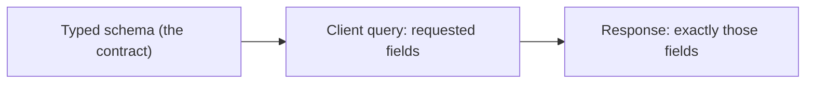
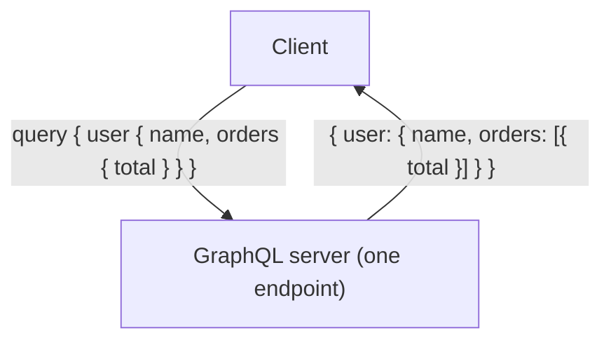
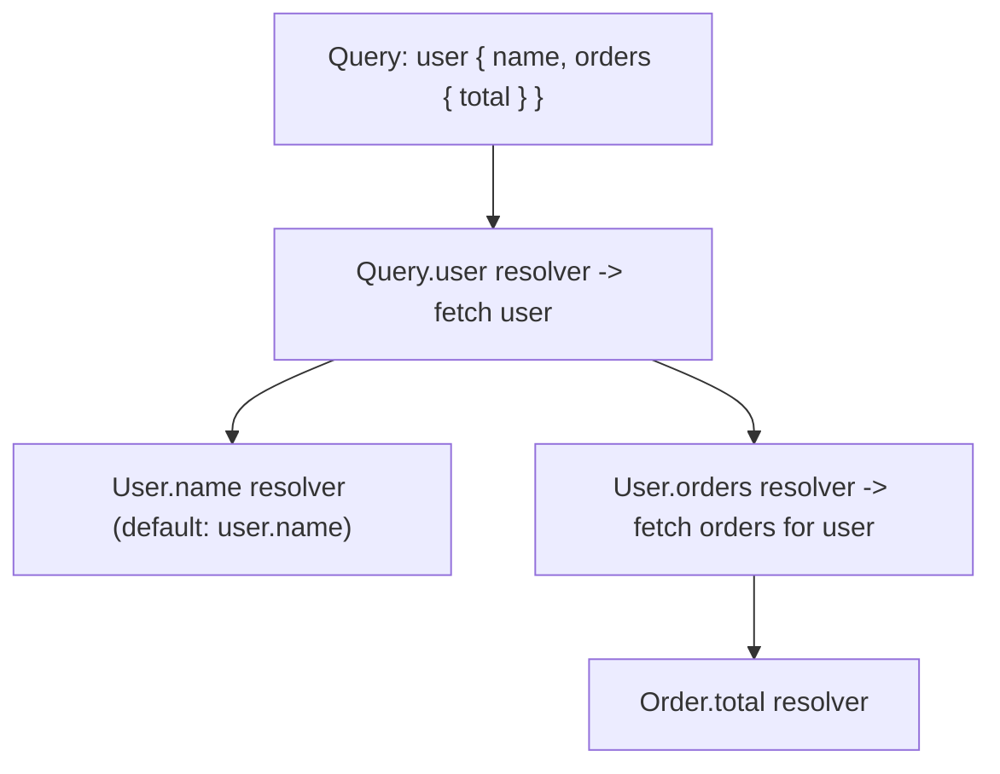
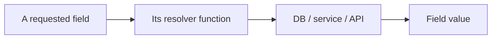

# GraphQL - Complete Professional Guide

> **Category:** 14_frameworks · **Language:** English

---

### Schema, queries, and resolvers for a typed API
**Original guide written from first principles, current to 2026**

> **Original reference book (English).** This is an **independent, originally written** guide. It is not an extract, summary, or paraphrase of any third-party book; it teaches GraphQL from first principles with original examples. Canonical books are listed under **References** as pointers only. Each chapter follows the TO-BRAIN editorial standard (see `FILE_CONVENTIONS.md`).
>
> **Scope notice:** GraphQL is a query language and runtime for APIs where the **client specifies exactly what data it needs** against a typed schema. This guide covers the schema, queries, and resolvers, current to 2026, including when GraphQL fits versus REST.

---

## How to read this guide

| Level | Profile | Parts |
|-------|---------|-------|
| 1 — Beginner | New to GraphQL | Part I |
| 2 — Intermediate | Building a server | Part II |

**Target audience:** backend and full-stack developers building or consuming APIs.

**Structure of each chapter:** Introduction · Business context · Theoretical concepts · Architecture · Diagrams (Mermaid) · Real examples · Step by step · Complete examples · Exercises · Challenges · Checklist · Best practices · Anti-patterns · Troubleshooting · References.

> **Note on prerequisites.** Assumes HTTP/JSON and the REST-API guide.

---

## Table of Contents

**Part I – The model**
1. The schema and client-specified queries
2. Resolvers: how the server fulfills a query

**Part II – Production**
3. The N+1 problem, performance, and when to use GraphQL

> **Status of this guide:** phased delivery. **Ready:** Part I (Ch. 1–2). **In progress:** Part II.

---

## Part I – The model

REST exposes fixed endpoints returning fixed shapes; clients often over-fetch (get more than they need) or under-fetch (need several round trips). **GraphQL** inverts this: the server publishes a **typed schema** of what's available, and the **client asks for exactly the fields it wants** in one request. Understanding the schema and resolver model is most of GraphQL.

---

## Chapter 1 — The schema and client-specified queries

### 1.1 Introduction

A GraphQL API is defined by a **schema**: a strongly-typed description of the data and operations available (types, fields, queries, mutations). Clients send **queries** that mirror the shape of the data they want, and the server returns **exactly that shape** — no more, no less. The schema is a contract that tools, clients, and the server all share.

### 1.2 Business context

Over-fetching and under-fetching are real costs: mobile clients waste bandwidth on unneeded fields, and chatty multi-endpoint flows are slow. GraphQL lets each client get precisely what it needs in one request, which improves performance (especially on mobile) and decouples client iteration from backend endpoint changes. The strongly-typed schema also enables excellent tooling (autocomplete, validation) and self-documentation — speeding development. The trade-off is added server complexity (Chapter 3).

### 1.3 Theoretical concepts: ask for exactly what you need



The schema declares **types** with fields, plus **Query** (reads), **Mutation** (writes), and optionally **Subscription** (real-time) root types. A query names the fields it wants, including nested relationships, and the response JSON mirrors the query's structure. One request can traverse relationships that would be several REST calls.

### 1.4 Architecture: one endpoint, shaped responses



### 1.5 Real example

**Scenario.** A mobile screen needs a user's name and the totals of their recent orders.

**Problem.** In REST, that's `GET /users/:id` then `GET /users/:id/orders` (under-fetching → two round trips), and each may return fields the screen doesn't use (over-fetching).

**Solution.** One GraphQL query requesting exactly those fields, including the nested orders.

**Implementation (schema + query).**

```graphql
# Schema (the contract)
type User  { id: ID!  name: String!  orders: [Order!]! }
type Order { id: ID!  total: Float! }
type Query { user(id: ID!): User }

# Client query: exactly the fields the screen needs, in one request
query {
  user(id: "42") {
    name
    orders { total }     # nested relationship, no extra round trip
  }
}
# Response mirrors the query:
# { "data": { "user": { "name": "Ana", "orders": [{ "total": 90.0 }] } } }
```

**Result.** One request returns precisely the name and order totals — no over-fetch, no extra round trips. The mobile screen gets a minimal, exactly-shaped payload.

**Future improvements.** Beware that resolving `orders` per user naively can cause the N+1 problem (Chapter 3) — use a batching dataloader.

### 1.6 Exercises

1. What is a GraphQL schema?
2. How does GraphQL avoid over- and under-fetching?
3. What are the three root operation types?

### 1.7 Challenges

- **Challenge.** Take a screen that needs data from two REST endpoints. Design a GraphQL schema and a single query that returns exactly its data.

### 1.8 Checklist

- [ ] The API is defined by a typed schema.
- [ ] Clients request exactly the fields they need.
- [ ] Responses mirror the query shape.
- [ ] Related data is fetched in one request.

### 1.9 Best practices

- Design the schema around client needs and domain types.
- Use the type system for validation and tooling.
- Keep the schema as the shared contract.

### 1.10 Anti-patterns

- Mirroring REST endpoints 1:1 as GraphQL fields (misses the point).
- A schema that leaks database structure instead of domain concepts.
- Ignoring the cost of deeply nested queries (Ch. 3).

### 1.11 Troubleshooting

| Symptom | Likely cause | Action |
|---------|--------------|--------|
| Clients over/under-fetch | REST-style fixed shapes | Let clients select fields via GraphQL |
| Many round trips for one screen | Under-fetching | Fetch related data in one query |
| Schema hard to use | Leaks DB structure | Model domain types in the schema |

### 1.12 References

- E. Porcello, A. Banks, *Learning GraphQL* (O'Reilly, 2018) — ISBN 978-1492030713.
- GraphQL specification & docs: https://graphql.org.

---

## Chapter 2 — Resolvers

### 2.1 Introduction

A **resolver** is a function that produces the value for a field. When a query arrives, the GraphQL engine walks the requested fields and calls each field's resolver, assembling the response. Resolvers are where GraphQL connects to your actual data (databases, services, other APIs). Understanding the resolver model — one function per field, called as the query is traversed — is key to building a server.

### 2.2 Business context

Resolvers are where performance and correctness live. A naive resolver design causes the **N+1 query problem** (Chapter 3) — one query triggering hundreds of database hits — a top GraphQL performance pitfall. Well-designed resolvers (with batching) keep GraphQL efficient. Resolvers also enforce authorization (each field can check access), making them central to both performance and security. Getting them right is what makes a GraphQL API production-viable.

### 2.3 Theoretical concepts: one resolver per field



Each field has a resolver; if you don't write one, a default returns the property of the same name. A resolver receives the **parent** value, the field **arguments**, and a **context** (auth, dataloaders). The engine calls them as it traverses the query tree, so nested fields trigger nested resolver calls — which is exactly where N+1 can arise.

### 2.4 Architecture: resolvers fetch real data



### 2.5 Real example

**Scenario.** Resolve a user and their orders.

**Problem.** A naive `User.orders` resolver queries the DB per user; in a list of users this is N+1 queries.

**Solution.** Write resolvers that fetch from the data source, using a **dataloader** to batch the per-user order lookups into one query.

**Implementation (resolvers + batching).**

```js
const resolvers = {
  Query: {
    user: (_parent, { id }, ctx) => ctx.db.users.findById(id),   // root resolver
  },
  User: {
    // batched via dataloader -> one query for all users' orders (avoids N+1)
    orders: (user, _args, ctx) => ctx.loaders.ordersByUser.load(user.id),
  },
};
```

**Result.** Each field is resolved from the real data source, and the dataloader batches order lookups so a list of users costs one orders query, not N. Correct and efficient.

**Future improvements.** Add per-field authorization in resolvers (check `ctx.user` can access the data) — GraphQL authorization is resolver-level.

### 2.6 Exercises

1. What is a resolver and what does it receive?
2. When does the default resolver suffice?
3. Why do nested resolvers risk N+1?

### 2.7 Challenges

- **Challenge.** Write resolvers for a small schema. Identify where N+1 could occur and add a dataloader to batch it.

### 2.8 Checklist

- [ ] Each field resolves from the real data source.
- [ ] Default resolvers are used where they suffice.
- [ ] Nested/list resolvers use batching (dataloaders).
- [ ] Authorization is enforced in resolvers.

### 2.9 Best practices

- Keep resolvers thin; delegate to a service/data layer.
- Use dataloaders to batch and cache per-request lookups.
- Enforce field-level authorization via context.

### 2.10 Anti-patterns

- Per-item DB queries in list resolvers (N+1).
- Business logic crammed into resolvers.
- No authorization checks in resolvers.

### 2.11 Troubleshooting

| Symptom | Likely cause | Action |
|---------|--------------|--------|
| Hundreds of DB queries per request | N+1 in resolvers | Batch with dataloaders |
| Slow nested queries | Unbatched relationships | Add per-request batching/caching |
| Unauthorized data returned | No resolver auth | Check access in resolvers |

### 2.12 References

- E. Porcello, A. Banks, *Learning GraphQL* (O'Reilly, 2018) — ISBN 978-1492030713.
- GraphQL docs, "Execution" & DataLoader: https://graphql.org/learn/execution/.

---

> **End of Part I.** You can now work with GraphQL's model: a typed **schema** as the contract where clients request **exactly** the fields they need in one request (eliminating over/under-fetching), fulfilled by **resolvers** — one function per field, called as the query tree is traversed — that fetch real data and must use batching (dataloaders) to avoid the N+1 problem. **Part II — Production** (Chapter 3) covers the N+1 problem in depth, query-cost/depth limiting for security, caching, and the decision of when GraphQL is the right choice versus REST.

<!--APPEND-PART-II-->
