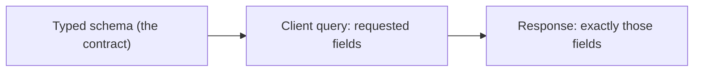
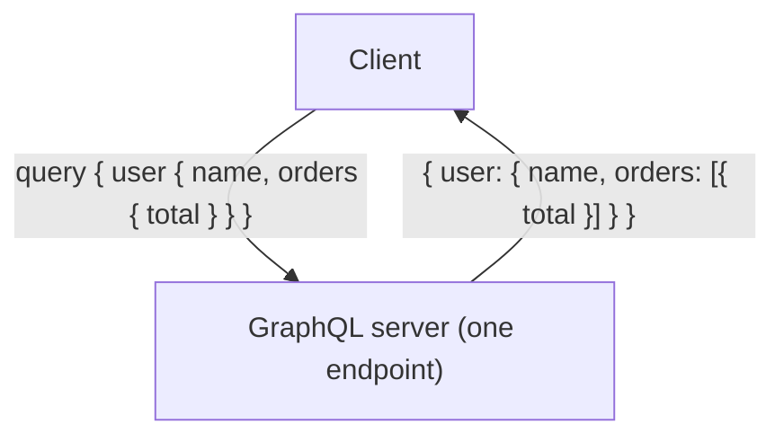
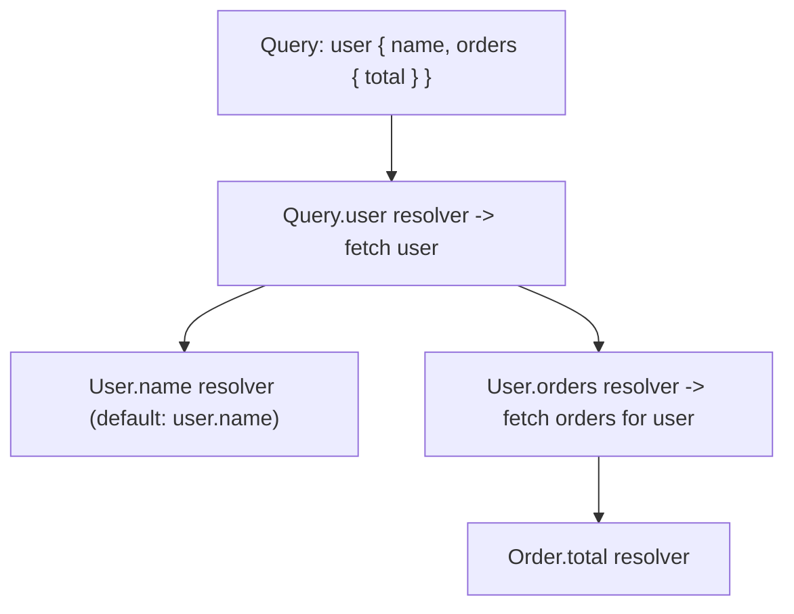
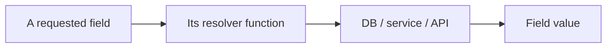
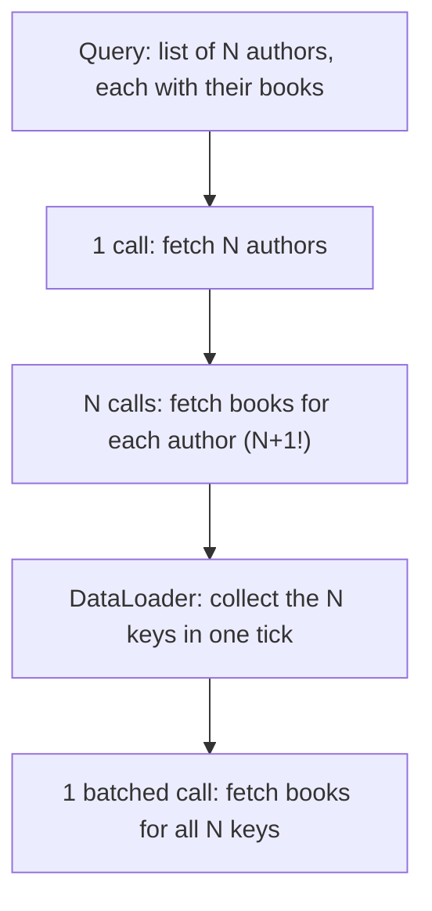
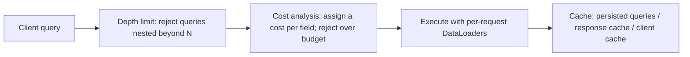

# GraphQL - Complete Professional Guide

> **Category:** 14_frameworks · **Language:** English

---

### Schema, queries, and resolvers for a typed API
**Original guide written from first principles, current to 2026**

> **Original reference book (English).** This is an **independent, originally written** guide. It is not an extract, summary, or paraphrase of any third-party book; it teaches GraphQL from first principles with original examples. Canonical books are listed under **References** as pointers only. Each chapter follows the TO-BRAIN editorial standard (see `FILE_CONVENTIONS.md`).
>
> **Scope notice:** GraphQL is a query language and runtime for APIs where the **client specifies exactly what data it needs** against a typed schema. This guide covers the schema, queries, and resolvers, current to 2026, including when GraphQL fits versus REST.

---

## How to read this guide

| Level | Profile | Parts |
|-------|---------|-------|
| 1 — Beginner | New to GraphQL | Part I |
| 2 — Intermediate | Building a server | Part II |

**Target audience:** backend and full-stack developers building or consuming APIs.

**Structure of each chapter:** Introduction · Business context · Theoretical concepts · Architecture · Diagrams (Mermaid) · Real examples · Step by step · Complete examples · Exercises · Challenges · Checklist · Best practices · Anti-patterns · Troubleshooting · References.

> **Note on prerequisites.** Assumes HTTP/JSON and the REST-API guide.

---

## Table of Contents

**Part I – The model**
1. The schema and client-specified queries
2. Resolvers: how the server fulfills a query

**Part II – Production**
3. The N+1 problem, performance, and when to use GraphQL

> **Status of this guide:** complete. **Ready:** Part I (Ch. 1–2) and Part II (Ch. 3).

---

## Part I – The model

REST exposes fixed endpoints returning fixed shapes; clients often over-fetch (get more than they need) or under-fetch (need several round trips). **GraphQL** inverts this: the server publishes a **typed schema** of what's available, and the **client asks for exactly the fields it wants** in one request. Understanding the schema and resolver model is most of GraphQL.

---

## Chapter 1 — The schema and client-specified queries

### 1.1 Introduction

A GraphQL API is defined by a **schema**: a strongly-typed description of the data and operations available (types, fields, queries, mutations). Clients send **queries** that mirror the shape of the data they want, and the server returns **exactly that shape** — no more, no less. The schema is a contract that tools, clients, and the server all share.

### 1.2 Business context

Over-fetching and under-fetching are real costs: mobile clients waste bandwidth on unneeded fields, and chatty multi-endpoint flows are slow. GraphQL lets each client get precisely what it needs in one request, which improves performance (especially on mobile) and decouples client iteration from backend endpoint changes. The strongly-typed schema also enables excellent tooling (autocomplete, validation) and self-documentation — speeding development. The trade-off is added server complexity (Chapter 3).

### 1.3 Theoretical concepts: ask for exactly what you need



The schema declares **types** with fields, plus **Query** (reads), **Mutation** (writes), and optionally **Subscription** (real-time) root types. A query names the fields it wants, including nested relationships, and the response JSON mirrors the query's structure. One request can traverse relationships that would be several REST calls.

### 1.4 Architecture: one endpoint, shaped responses



### 1.5 Real example

**Scenario.** A mobile screen needs a user's name and the totals of their recent orders.

**Problem.** In REST, that's `GET /users/:id` then `GET /users/:id/orders` (under-fetching → two round trips), and each may return fields the screen doesn't use (over-fetching).

**Solution.** One GraphQL query requesting exactly those fields, including the nested orders.

**Implementation (schema + query).**

```graphql
# Schema (the contract)
type User  { id: ID!  name: String!  orders: [Order!]! }
type Order { id: ID!  total: Float! }
type Query { user(id: ID!): User }

# Client query: exactly the fields the screen needs, in one request
query {
  user(id: "42") {
    name
    orders { total }     # nested relationship, no extra round trip
  }
}
# Response mirrors the query:
# { "data": { "user": { "name": "Ana", "orders": [{ "total": 90.0 }] } } }
```

**Result.** One request returns precisely the name and order totals — no over-fetch, no extra round trips. The mobile screen gets a minimal, exactly-shaped payload.

**Future improvements.** Beware that resolving `orders` per user naively can cause the N+1 problem (Chapter 3) — use a batching dataloader.

### 1.6 Exercises

1. What is a GraphQL schema?
2. How does GraphQL avoid over- and under-fetching?
3. What are the three root operation types?

### 1.7 Challenges

- **Challenge.** Take a screen that needs data from two REST endpoints. Design a GraphQL schema and a single query that returns exactly its data.

### 1.8 Checklist

- [ ] The API is defined by a typed schema.
- [ ] Clients request exactly the fields they need.
- [ ] Responses mirror the query shape.
- [ ] Related data is fetched in one request.

### 1.9 Best practices

- Design the schema around client needs and domain types.
- Use the type system for validation and tooling.
- Keep the schema as the shared contract.

### 1.10 Anti-patterns

- Mirroring REST endpoints 1:1 as GraphQL fields (misses the point).
- A schema that leaks database structure instead of domain concepts.
- Ignoring the cost of deeply nested queries (Ch. 3).

### 1.11 Troubleshooting

| Symptom | Likely cause | Action |
|---------|--------------|--------|
| Clients over/under-fetch | REST-style fixed shapes | Let clients select fields via GraphQL |
| Many round trips for one screen | Under-fetching | Fetch related data in one query |
| Schema hard to use | Leaks DB structure | Model domain types in the schema |

### 1.12 References

- E. Porcello, A. Banks, *Learning GraphQL* (O'Reilly, 2018) — ISBN 978-1492030713.
- GraphQL specification & docs: https://graphql.org.

---

## Chapter 2 — Resolvers

### 2.1 Introduction

A **resolver** is a function that produces the value for a field. When a query arrives, the GraphQL engine walks the requested fields and calls each field's resolver, assembling the response. Resolvers are where GraphQL connects to your actual data (databases, services, other APIs). Understanding the resolver model — one function per field, called as the query is traversed — is key to building a server.

### 2.2 Business context

Resolvers are where performance and correctness live. A naive resolver design causes the **N+1 query problem** (Chapter 3) — one query triggering hundreds of database hits — a top GraphQL performance pitfall. Well-designed resolvers (with batching) keep GraphQL efficient. Resolvers also enforce authorization (each field can check access), making them central to both performance and security. Getting them right is what makes a GraphQL API production-viable.

### 2.3 Theoretical concepts: one resolver per field



Each field has a resolver; if you don't write one, a default returns the property of the same name. A resolver receives the **parent** value, the field **arguments**, and a **context** (auth, dataloaders). The engine calls them as it traverses the query tree, so nested fields trigger nested resolver calls — which is exactly where N+1 can arise.

### 2.4 Architecture: resolvers fetch real data



### 2.5 Real example

**Scenario.** Resolve a user and their orders.

**Problem.** A naive `User.orders` resolver queries the DB per user; in a list of users this is N+1 queries.

**Solution.** Write resolvers that fetch from the data source, using a **dataloader** to batch the per-user order lookups into one query.

**Implementation (resolvers + batching).**

```js
const resolvers = {
  Query: {
    user: (_parent, { id }, ctx) => ctx.db.users.findById(id),   // root resolver
  },
  User: {
    // batched via dataloader -> one query for all users' orders (avoids N+1)
    orders: (user, _args, ctx) => ctx.loaders.ordersByUser.load(user.id),
  },
};
```

**Result.** Each field is resolved from the real data source, and the dataloader batches order lookups so a list of users costs one orders query, not N. Correct and efficient.

**Future improvements.** Add per-field authorization in resolvers (check `ctx.user` can access the data) — GraphQL authorization is resolver-level.

### 2.6 Exercises

1. What is a resolver and what does it receive?
2. When does the default resolver suffice?
3. Why do nested resolvers risk N+1?

### 2.7 Challenges

- **Challenge.** Write resolvers for a small schema. Identify where N+1 could occur and add a dataloader to batch it.

### 2.8 Checklist

- [ ] Each field resolves from the real data source.
- [ ] Default resolvers are used where they suffice.
- [ ] Nested/list resolvers use batching (dataloaders).
- [ ] Authorization is enforced in resolvers.

### 2.9 Best practices

- Keep resolvers thin; delegate to a service/data layer.
- Use dataloaders to batch and cache per-request lookups.
- Enforce field-level authorization via context.

### 2.10 Anti-patterns

- Per-item DB queries in list resolvers (N+1).
- Business logic crammed into resolvers.
- No authorization checks in resolvers.

### 2.11 Troubleshooting

| Symptom | Likely cause | Action |
|---------|--------------|--------|
| Hundreds of DB queries per request | N+1 in resolvers | Batch with dataloaders |
| Slow nested queries | Unbatched relationships | Add per-request batching/caching |
| Unauthorized data returned | No resolver auth | Check access in resolvers |

### 2.12 References

- E. Porcello, A. Banks, *Learning GraphQL* (O'Reilly, 2018) — ISBN 978-1492030713.
- GraphQL docs, "Execution" & DataLoader: https://graphql.org/learn/execution/.

---

> **End of Part I.** You can now work with GraphQL's model: a typed **schema** as the contract where clients request **exactly** the fields they need in one request (eliminating over/under-fetching), fulfilled by **resolvers** — one function per field, called as the query tree is traversed — that fetch real data and must use batching (dataloaders) to avoid the N+1 problem. **Part II — Production** (Chapter 3) covers the N+1 problem in depth, query-cost/depth limiting for security, caching, and the decision of when GraphQL is the right choice versus REST.

---

## Part II – Production

The model that makes GraphQL pleasant for clients — ask for any shape of data in one request — is exactly what makes it dangerous in production. The resolver-per-field design quietly turns one query into hundreds of database calls (the N+1 problem), and a single deeply nested query can become an accidental denial-of-service. GraphQL also gives up the simple, URL-based HTTP caching REST enjoys. Part II is the operational reality check: batch your data access, bound what clients can ask, cache deliberately, and know when GraphQL is the wrong tool.

---

## Chapter 3 — The N+1 problem, performance, and when to use GraphQL

### 3.1 Introduction

GraphQL's per-field resolver model is elegant and treacherous. Because each field is resolved independently as the server walks the query tree, fetching a list of N items and then a related field on each produces **1 + N** data-source calls — the **N+1 problem** — which silently destroys performance under load. And because a client can request arbitrarily deep, wide, or expensive queries, an unbounded endpoint is an open invitation to overload. This chapter covers the three production concerns: **batching** (DataLoader) to fix N+1, **query-cost and depth limiting** to keep the endpoint safe, **caching** to compensate for the loss of HTTP-level caching — and the honest **REST-vs-GraphQL** decision.

### 3.2 Business context

GraphQL is adopted to make clients fast and flexible — but a naive server delivers the opposite: dashboards that issue thousands of queries per request, p99 latency spikes, and database saturation that takes the whole API down. These failures appear only under realistic data volumes, so they slip past development and surface in production. The security dimension is just as material: a public GraphQL endpoint without depth/cost limits can be brought down by a single hand-crafted query — a real, documented attack class. Getting Part II right is what separates a GraphQL API that scales from one that becomes an incident. The flip side is the adoption decision itself: choosing GraphQL where REST would do adds a query layer, a caching problem, and an attack surface for no benefit.

### 3.3 Theoretical concepts: why N+1 happens and how batching fixes it



When a resolver for a list field runs, GraphQL invokes the child-field resolver **once per item**. Resolve `authors` (1 query), then `author.books` fires for each of the N authors (N queries). **DataLoader** breaks the cycle: instead of querying immediately, each `book` resolver registers the key it needs; DataLoader **coalesces** all keys requested in the same execution tick into **one batched query** (`WHERE author_id IN (…)`) and also **caches** within the request so repeated keys aren't re-fetched. The fix is a per-request DataLoader per data source, not ad hoc joins in each resolver.

### 3.4 Architecture: guarding the endpoint



A production GraphQL server is a pipeline of guards. **Depth limiting** rejects pathologically nested queries (`a { b { c { … } } }`). **Query-cost analysis** assigns each field a cost (lists cost more, multiplied by requested counts) and rejects queries over a budget — the real defense against expensive-but-shallow queries. **Persisted queries** (clients send a hash of a pre-approved query) both shrink payloads and let you allow-list exactly what may run. Because GraphQL POSTs to a single URL, you cannot rely on URL-based HTTP caching; you compensate with a **response cache** keyed by query+variables, **client-side normalized caches** (Apollo/Relay), and CDN support for persisted GETs.

### 3.5 Real example

**Scenario.** A `/graphql` endpoint backs a dashboard that lists 50 projects, each with its owner and recent tasks. It's powered by straightforward resolvers and an ORM.

**Problem.** Loading the dashboard fires 1 query for projects, then 50 for owners and 50 for task lists — ~101 database round trips per request. Under load the database saturates. Separately, a client sends a 30-level nested query and pins a CPU.

**Solution.** Per-request DataLoaders for the related entities, plus depth and cost limits.

**Implementation.**

```js
// Per-request DataLoader: N+1 -> 1 batched call
const ownerLoader = new DataLoader(async (ids) => {
  const rows = await db.user.findMany({ where: { id: { in: ids } } });   // one query for all ids
  const byId = new Map(rows.map((u) => [u.id, u]));
  return ids.map((id) => byId.get(id));                                   // return in key order
});

const resolvers = {
  Project: {
    owner: (project, _args, ctx) => ctx.loaders.owner.load(project.ownerId), // batched + cached
  },
};

// Build fresh loaders per request so the cache can't leak across users:
const context = () => ({ loaders: { owner: ownerLoader /* …one per entity */ } });

// Guard the schema: bound depth and cost
import depthLimit from 'graphql-depth-limit';
const server = new ApolloServer({
  schema,
  validationRules: [depthLimit(7)],          // reject queries nested deeper than 7
  // + a cost-analysis rule with a per-field cost budget
});
```

**Result.** The dashboard drops from ~101 queries to ~3 (projects + one batched owners + one batched tasks). The depth and cost limits reject the abusive query before execution. The endpoint scales and is no longer trivially DoS-able.

**Future improvements.** Add persisted queries to allow-list operations and enable CDN caching; add a normalized client cache to dedupe across components; monitor resolver-level tracing (Apollo traces) to catch new N+1s as the schema grows.

### 3.6 When to use GraphQL (vs REST)

- **Reach for GraphQL** when many clients need different shapes of related data, when round trips are expensive (mobile), or when you're aggregating several backends behind one graph — its single-request, field-precise fetching shines.
- **Prefer REST** for simple resource CRUD, when HTTP/CDN caching is a primary lever, for file up/downloads, or for public APIs where predictable, cacheable URLs and a low attack surface matter more than query flexibility.

Choose by client diversity and caching needs, not by novelty. (See the **RESTful API Design** guide in `06_web_and_frontend/` for the REST side of this trade-off.)

### 3.7 Exercises

1. Explain the N+1 problem in terms of GraphQL's resolver model.
2. What two things does DataLoader do, and why must it be per-request?
3. Why is depth-limiting alone insufficient, and what does cost analysis add?

### 3.8 Challenges

- **Challenge.** Take a schema with a list field whose items have a related entity. Confirm the N+1 by logging queries, add a per-request DataLoader to batch it, then add a depth limit and a per-field cost budget and verify an abusive query is rejected.

### 3.9 Checklist

- [ ] Related-entity resolvers use per-request DataLoaders (no N+1).
- [ ] The endpoint enforces depth limiting and query-cost budgets.
- [ ] Loaders are built per request so their cache can't leak across users.
- [ ] Caching strategy is explicit (persisted queries / response / client cache).
- [ ] The choice of GraphQL over REST is justified by client/data needs.

### 3.10 Best practices

- One DataLoader per data source, created fresh in the per-request context.
- Bound queries by both depth and cost; prefer persisted/allow-listed operations in production.
- Treat caching as a first-class design task — you don't get URL caching for free.
- Add resolver tracing to catch performance regressions early.

### 3.11 Anti-patterns

- Resolvers that query the database directly per item (textbook N+1).
- A public endpoint with no depth or cost limits (DoS-by-query).
- Sharing a DataLoader instance across requests (stale/leaked cache).
- Adopting GraphQL for simple CRUD where REST + caching is simpler and safer.

### 3.12 Troubleshooting

| Symptom | Likely cause | Action |
|---------|--------------|--------|
| Query count explodes with list size | N+1 in a child resolver | Add a per-request DataLoader to batch it |
| One query pins CPU / DB | Unbounded depth/cost | Enforce depth limit + cost analysis |
| Cache serves another user's data | Loader shared across requests | Build loaders per request in context |
| Can't CDN-cache responses | Single POST URL | Use persisted queries (GET) + response cache |

### 3.13 References

- E. Porcello & A. Banks, *Learning GraphQL* (O'Reilly, 2018) — Ch. 3 (The GraphQL Query Language), Ch. 5 (Creating a GraphQL API — resolvers), Ch. 7 (GraphQL in the Real World). ISBN 978-1492030713.
- GraphQL docs, "Execution" & DataLoader: https://graphql.org/learn/execution/ and https://github.com/graphql/dataloader.
- "Securing your GraphQL API" (depth/cost limiting, persisted queries): https://www.apollographql.com/docs/.

---

> **End of guide.** You can now take GraphQL from model to production: design a typed schema and resolvers where clients fetch exactly what they need (Part I), then make it scale and stay safe — batch with DataLoader to kill N+1, bound queries by depth and cost, cache deliberately, and choose GraphQL only where its flexibility beats REST's simplicity (Part II).
