# MapStruct 1.6 - Complete Professional Guide

> **Category:** 14_frameworks · **Language:** English

---

### Compile-time bean mapping for the JVM — `@Mapper`, type conversions, collections, enums, DI, builders, SPI
**Edition for MapStruct 1.6.x (Java 8+ baseline; first-class Java 17+ and the Java Module System)**

> **Reference book (English).** Based on the official MapStruct reference documentation (https://mapstruct.org/documentation/stable/reference/html/) for version **1.6.3** (released 2024-11-09), the official examples repository, and the project's API Javadoc. Written for Java developers, architects, and teams that move data between layers (entities, DTOs, API models) and want that mapping to be type-safe, fast, and verified at build time.
>
> **Scope notice:** this is a **production-focused** book. It teaches MapStruct as it is built today: a **JSR 269 annotation processor** that generates plain-Java, reflection-free mapper implementations at compile time; convention-over-configuration property matching; implicit type conversions; collection, map, stream and enum mapping; dependency-injection component models (`spring`, `cdi`, `jsr330`, `jakarta`, `jakarta-cdi`); builder and constructor support; the MapStruct SPI; and Lombok interoperability. Each chapter follows the TO-BRAIN editorial standard (see `FILE_CONVENTIONS.md`).

---

## What MapStruct is (and what it is not)

MapStruct is **not** a runtime library that maps objects with reflection. It is a **Java annotation processor**: you declare a mapper as an `interface` (or `abstract class`) annotated with `@Mapper`, and during `javac` compilation MapStruct generates a concrete implementation that copies fields with ordinary getter/setter (or constructor/builder) calls.

That single design choice drives every advantage:

- **Fast** — generated code is plain method invocation, no reflection, no runtime metadata scanning. It performs like hand-written code because it *is* hand-written-quality code.
- **Type-safe** — only properties of compatible types can be mapped; the compiler validates the result.
- **Fails at build time, not in production** — an unmapped target property, a missing conversion, or an ambiguous method is reported as a **compile error or warning**, not a `NullPointerException` discovered by a user.
- **Inspectable** — the generated `*Impl.java` lands in `target/generated-sources` and reads like code a careful developer would write, so it is debuggable and reviewable.

Compared with reflection-based mappers (e.g. ModelMapper, Dozer) and with hand-written mapping code, MapStruct keeps the safety and speed of hand-written code while removing the boilerplate.

---

## What changed across recent versions (1.5 → 1.6)

The headline additions in the 1.6 line — woven into the relevant chapters below — are:

- **Conditional mapping with `@Condition`.** A presence-check method annotated `@Condition` decides per-property whether a source value should be mapped at all (Chapter 10).
- **`@SubclassMapping`.** First-class polymorphic mapping: map a source hierarchy to a target hierarchy by declaring the subclass pairs, instead of hand-writing `instanceof` chains (Chapter 10).
- **Enum SPI hooks.** `CustomEnumNamingStrategy` and `CustomEnumTransformationStrategy` let you standardize enum name translation across a codebase (Chapter 14).
- **Conditional mapping for source parameters** and richer `@Condition` targeting (source-presence for whole parameters, not only properties).
- **Java records & constructors** are fully supported targets and sources — MapStruct maps through the canonical constructor when there is no no-args constructor (Chapter 7).
- **`mapstruct.unmappedSourcePolicy`** and other processor options to tighten or relax build-time strictness fleet-wide (Chapter 2).

If you are upgrading, read this edition alongside the official **release notes** for the exact patch you target; the API in this book is the **1.6.x** surface.

---

## How to read this book

Progressive depth across five maturity levels:

| Level | Profile | Parts |
|-------|---------|-------|
| 1 — Beginner | First mapper, first build | Part I |
| 2 — Intermediate | Conversions & nested beans | Part II |
| 3 — Advanced | Collections, maps, enums | Part III |
| 4 — Specialist | Expressions, null handling, polymorphism, reuse | Part IV |
| 5 — Enterprise | Decorators, SPI, Lombok, production governance | Part V |

**Target audience:** Java backend developers, software architects, platform/tooling engineers, and tech leads who maintain mapping layers between persistence entities, domain models, DTOs, and API contracts.

**Structure of each chapter:** Introduction · Business context · Theoretical concepts · Architecture · Diagrams (Mermaid) · Real examples · Step by step · Complete code · Exercises · Challenges · Checklist · Best practices · Anti-patterns · Troubleshooting · Official references.

**Example format:** Scenario · Problem · Solution · Implementation · Result · Future improvements.

> **Note on prerequisites.** This book assumes working knowledge of Java (generics, interfaces, enums; ideally records and the JavaBeans accessor convention), Maven or Gradle, and the basic idea of layered architecture (entity ↔ DTO). No prior code-generation experience is required.

---

## Table of Contents

**Part I – Foundations**
1. What is MapStruct — the annotation-processor model
2. Setting up the build (Maven, Gradle, Ant, options, JPMS, IDE)
3. Defining a mapper and basic property mapping
4. Retrieving a mapper — `Mappers` factory and dependency injection

**Part II – Mapping Mechanics**
5. Data type conversions — implicit conversions and formats
6. Object references, nested beans, and several source parameters
7. Update mappings, builders, constructors, and Map-to-Bean

**Part III – Collections, Maps & Enums**
8. Mapping collections, maps, and streams
9. Mapping values — enums and `@ValueMapping`

**Part IV – Advanced Mapping**
10. Advanced options — defaults, expressions, null handling, conditional & subclass mapping
11. Reusing configurations — inheritance, inverse, and shared config

**Part V – Customization & Production**
12. Customizing mappings — decorators, before/after methods, object factories, `@Context`
13. Exceptions and error handling
14. The MapStruct SPI and third-party integration (Lombok)

---

## Part I – Foundations

## Chapter 1 — What is MapStruct — the annotation-processor model

### 1.1 Introduction

MapStruct is **an annotation processor for the generation of type-safe bean mapping classes.** You write an interface that *describes* the mapping; MapStruct *writes the implementation* during compilation. The generated class uses plain getters and setters — no reflection, no runtime configuration. This chapter explains the mental model that makes everything else in the book make sense: where the code comes from, when it is produced, and why that matters.

### 1.2 Business context

Almost every non-trivial service has a mapping layer: JPA entities become DTOs, API requests become domain objects, external models become internal ones. Hand-written mapping is correct but tedious and easy to break silently — add a field to a DTO, forget to map it, and a `null` ships to a client. Reflection-based mappers remove the boilerplate but move the failure to **runtime** and cost CPU on every call.

MapStruct's value is **safety without boilerplate**: the mapping is generated, so there is nothing to forget; it is generated **at compile time**, so a forgotten field is a build failure on the developer's machine, not an incident; and it is **plain code**, so it is as fast and debuggable as the hand-written version. For a fleet of services this means fewer mapping bugs, predictable performance, and onboarding that doesn't require learning a runtime DSL.

### 1.3 Theoretical concepts: the building blocks

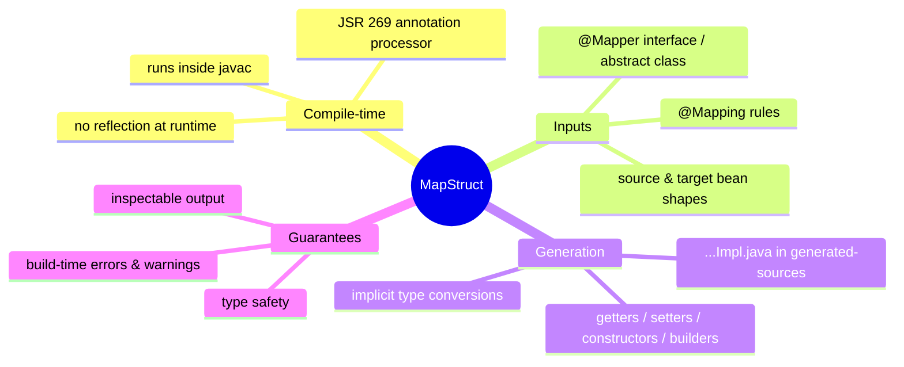

The processor reads three things: the **mapper contract** (`@Mapper` interface methods), the **mapping rules** (`@Mapping` and friends), and the **structure of the source and target types** (their accessors). From these it derives, property by property, how to move data — applying name matching, implicit conversions, and nested or custom mappings — and emits a concrete class.

### 1.4 Architecture: where the code comes from

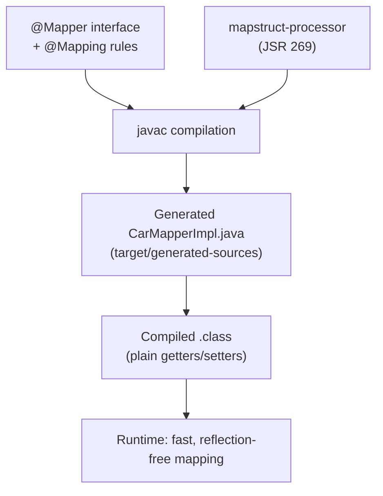

The processor jar (`mapstruct-processor`) is a **build-time** dependency placed on the annotation-processor path. The annotations jar (`mapstruct`) is a thin **compile/runtime** dependency holding `@Mapper`, `@Mapping`, etc. At runtime your application only needs the annotations jar (and the generated classes) — the processor is never loaded.

### 1.5 Real example

**Scenario.** A team maps a `Car` entity to a `CarDto` to return from an API.

**Problem.** They want zero hand-written copy code and a guarantee that a forgotten field fails the build.

**Solution.** Declare a one-method `@Mapper` interface. MapStruct generates the implementation.

**Implementation.**

```java
// Domain
public class Car {
    private String make;
    private int numberOfSeats;
    // getters & setters omitted
}

public class CarDto {
    private String make;
    private int seatCount;
    // getters & setters omitted
}

// Mapper contract
import org.mapstruct.Mapper;
import org.mapstruct.Mapping;

@Mapper
public interface CarMapper {

    @Mapping(target = "seatCount", source = "numberOfSeats")
    CarDto toDto(Car car);
}
```

MapStruct generates, roughly:

```java
// target/generated-sources/.../CarMapperImpl.java  (generated — do not edit)
public class CarMapperImpl implements CarMapper {
    @Override
    public CarDto toDto(Car car) {
        if (car == null) {
            return null;
        }
        CarDto carDto = new CarDto();
        carDto.setSeatCount(car.getNumberOfSeats());
        carDto.setMake(car.getMake());
        return carDto;
    }
}
```

**Result.** `make` is matched automatically by name; `seatCount` is mapped from `numberOfSeats` per the rule. The code is null-safe and reads like a developer wrote it. Add a field to `CarDto` and (with a strict policy) the build warns or fails.

**Future improvements.** Wire the mapper through Spring DI (Chapter 4), add a `List<Car> → List<CarDto>` method (Chapter 8), and tighten `unmappedTargetPolicy` to `ERROR` (Chapter 2).

### 1.6 Exercises

1. Explain why MapStruct does not use reflection and what that buys you.
2. Which jar is needed at runtime, and which only at build time?
3. Where on disk does the generated implementation appear?

### 1.7 Challenges

- **Challenge.** Create the `CarMapper` above, compile it, then open the generated `CarMapperImpl.java`. Add an unmapped field to `CarDto` and observe the compiler message.

### 1.8 Checklist

- [ ] I can explain MapStruct as a compile-time annotation processor.
- [ ] I know the difference between the `mapstruct` and `mapstruct-processor` artifacts.
- [ ] I understand that name-matched properties need no `@Mapping`.
- [ ] I can locate the generated implementation.

### 1.9 Best practices

- Treat generated `*Impl` files as build output — never edit them, never commit them.
- Keep mappers as `interface`s unless you need custom Java logic (then use an `abstract class`).
- Inspect the generated code at least once per mapper while learning — it removes all mystery.

### 1.10 Anti-patterns

- Reaching for a reflection-based mapper "because it needs no setup," trading compile-time safety for runtime surprises.
- Hand-writing copy code that MapStruct would generate, then letting it drift out of sync with the model.
- Committing `target/generated-sources` to version control.

### 1.11 Troubleshooting

| Symptom | Likely cause | Action |
|---------|--------------|--------|
| No `*Impl` class generated | Processor not on the annotation-processor path | Configure `mapstruct-processor` (Chapter 2) |
| `CarMapper` "cannot be instantiated" | You instantiated the interface, not the impl | Use `Mappers.getMapper(...)` or DI (Chapter 4) |
| Field silently not copied | Names differ; no `@Mapping` rule | Add `@Mapping`; enable a strict unmapped policy |

### 1.12 Official references

- Introduction: https://mapstruct.org/documentation/stable/reference/html/#introduction
- Project site: https://mapstruct.org/

---

## Chapter 2 — Setting up the build (Maven, Gradle, Ant, options, JPMS, IDE)

### 2.1 Introduction

MapStruct needs two things wired correctly: the **annotations** on the compile/runtime classpath and the **processor** on the annotation-processor path so `javac` runs it. This chapter shows the exact configuration for Maven and Gradle, the global processor options that govern strictness and output, Java Module System notes, and IDE integration.

### 2.2 Business context

Build setup is where MapStruct adoptions most often stumble: if the processor is not invoked, no implementation is generated and the app fails to wire at startup. Getting the processor path right once — and standardizing the **processor options** (strict unmapped policy, default component model) across the organization — turns MapStruct from "works on my machine" into a governed, fleet-wide standard.

### 2.3 Theoretical concepts: two artifacts, one processor path

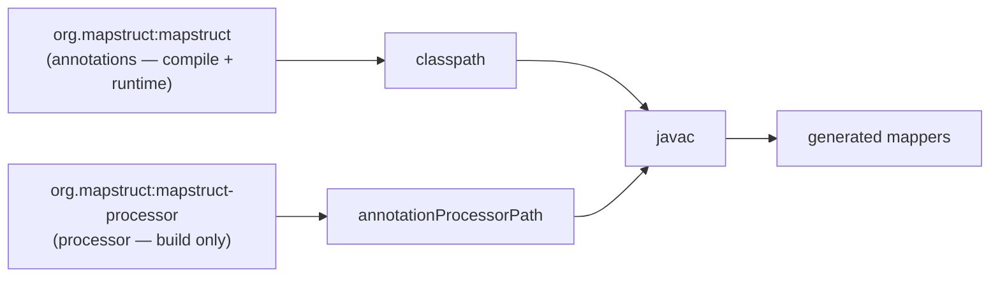

The annotations jar is small and stays in your dependency tree. The processor jar belongs on the **annotation processor path** — never as a normal `compile` dependency, or it would leak into your runtime artifact.

### 2.4 Maven setup

```xml
<properties>
    <org.mapstruct.version>1.6.3</org.mapstruct.version>
</properties>

<dependencies>
    <dependency>
        <groupId>org.mapstruct</groupId>
        <artifactId>mapstruct</artifactId>
        <version>${org.mapstruct.version}</version>
    </dependency>
</dependencies>

<build>
    <plugins>
        <plugin>
            <groupId>org.apache.maven.plugins</groupId>
            <artifactId>maven-compiler-plugin</artifactId>
            <version>3.13.0</version>
            <configuration>
                <annotationProcessorPaths>
                    <path>
                        <groupId>org.mapstruct</groupId>
                        <artifactId>mapstruct-processor</artifactId>
                        <version>${org.mapstruct.version}</version>
                    </path>
                </annotationProcessorPaths>
                <compilerArgs>
                    <arg>-Amapstruct.unmappedTargetPolicy=ERROR</arg>
                </compilerArgs>
            </configuration>
        </plugin>
    </plugins>
</build>
```

> If you also use **Lombok**, add `lombok` (and, for newer versions, `lombok-mapstruct-binding`) to the same `annotationProcessorPaths` — order matters; see Chapter 14.

### 2.5 Gradle setup

```groovy
dependencies {
    implementation 'org.mapstruct:mapstruct:1.6.3'
    annotationProcessor 'org.mapstruct:mapstruct-processor:1.6.3'
    // For Lombok interop, also:
    // compileOnly 'org.projectlombok:lombok:<version>'
    // annotationProcessor 'org.projectlombok:lombok:<version>'
    // annotationProcessor 'org.projectlombok:lombok-mapstruct-binding:0.2.0'
}

// Pass processor options:
tasks.withType(JavaCompile).configureEach {
    options.compilerArgs += [
        '-Amapstruct.unmappedTargetPolicy=ERROR',
        '-Amapstruct.defaultComponentModel=spring'
    ]
}
```

### 2.6 Processor options (the governance knobs)

| Option | Effect |
|--------|--------|
| `mapstruct.unmappedTargetPolicy` | `ERROR` / `WARN` / `IGNORE` for unmapped **target** properties |
| `mapstruct.unmappedSourcePolicy` | Same, for unmapped **source** properties |
| `mapstruct.defaultComponentModel` | Global component model (`default`, `spring`, `cdi`, `jsr330`, `jakarta`, …) |
| `mapstruct.defaultInjectionStrategy` | Global `field` or `constructor` injection |
| `mapstruct.disableBuilders` | Ignore builders globally, map via setters/constructors |
| `mapstruct.suppressGeneratorTimestamp` | Omit the timestamp in `@Generated` (reproducible builds) |
| `mapstruct.suppressGeneratorVersionInfoComment` | Omit the version/comment line |
| `mapstruct.verbose` | Log mapping decisions during compilation |

> **Recommendation.** Set `unmappedTargetPolicy=ERROR` early. A forgotten target field becoming a build failure is exactly the safety MapStruct exists to give you.

### 2.7 Java Module System and IDE

For a `module-info.java` project, MapStruct works without extra `requires` for the generated code, but add `requires org.mapstruct;` where you reference the annotations. IDEs need annotation processing **enabled**: IntelliJ IDEA → *Build, Execution, Deployment → Compiler → Annotation Processors → Enable*; Eclipse uses the m2e-apt connector or the `mapstruct-eclipse-plugin`. There is also an IntelliJ MapStruct plugin that adds autocomplete and navigation for property names inside `@Mapping`.

### 2.8 Real example: a reproducible, strict build

**Scenario.** A platform team wants every service to fail the build on unmapped fields and to produce byte-identical mappers across machines.

**Problem.** Default settings warn (not fail) and embed a timestamp, breaking build reproducibility.

**Solution.** Set `unmappedTargetPolicy=ERROR` and `suppressGeneratorTimestamp=true` as standard compiler args.

**Implementation.** Use the `compilerArgs` shown in 2.4 with both options.

**Result.** Mappers are deterministic; a missing mapping never ships.

**Future improvements.** Promote these options into a shared `@MapperConfig` (Chapter 11) and a parent POM so new services inherit them.

### 2.9 Exercises

1. Why must `mapstruct-processor` go on the annotation-processor path, not the compile classpath?
2. Which option makes an unmapped target property fail the build?
3. How do you make generated output reproducible?

### 2.10 Challenges

- **Challenge.** Configure a Gradle project with `defaultComponentModel=spring` and confirm the generated mapper is annotated `@Component` without any per-mapper setting.

### 2.11 Checklist

- [ ] Annotations on the classpath; processor on the processor path.
- [ ] `unmappedTargetPolicy` set deliberately (recommended `ERROR`).
- [ ] Annotation processing enabled in the IDE.
- [ ] Lombok ordering handled if Lombok is present.

### 2.12 Best practices

- Centralize processor options in the parent build so all services share strictness.
- Prefer `ERROR` over `WARN` for unmapped targets in new code.
- Keep MapStruct and processor versions identical via a single property.

### 2.13 Anti-patterns

- Declaring `mapstruct-processor` as a regular `implementation`/`compile` dependency.
- Leaving the unmapped policy at the lax default and discovering missing fields in production.
- Mixing different `mapstruct` and `mapstruct-processor` versions.

### 2.14 Troubleshooting

| Symptom | Cause | Action |
|---------|-------|--------|
| No mappers generated | Processor not invoked | Put it on the annotation-processor path; enable APT in IDE |
| Works in Maven, not IDE | IDE annotation processing off | Enable it in the IDE settings |
| Lombok fields not seen | Wrong processor order / missing binding | Add `lombok-mapstruct-binding`; order Lombok before MapStruct |
| Non-reproducible artifacts | Timestamp in `@Generated` | `suppressGeneratorTimestamp=true` |

### 2.15 Official references

- Set up: https://mapstruct.org/documentation/stable/reference/html/#setup
- Configuration options: https://mapstruct.org/documentation/stable/reference/html/#configuration-options
- Using the Java Module System: https://mapstruct.org/documentation/stable/reference/html/#using-mapstruct-jpms

---

## Chapter 3 — Defining a mapper and basic property mapping

### 3.1 Introduction

The heart of MapStruct is the `@Mapper`-annotated type and its mapping methods. This chapter covers how properties are matched by convention, how `@Mapping` overrides that convention, mapping **nested** properties with dot notation, and mapping from **several source parameters** into one target.

### 3.2 Business context

Most mapping is "the same data, slightly different shape." Convention-over-configuration means the common case — identical names — needs **no annotations at all**, so the code stays small. The override mechanism (`@Mapping`) handles the differences explicitly and visibly, which is exactly what reviewers and future maintainers want to see.

### 3.3 Theoretical concepts: matching and overriding

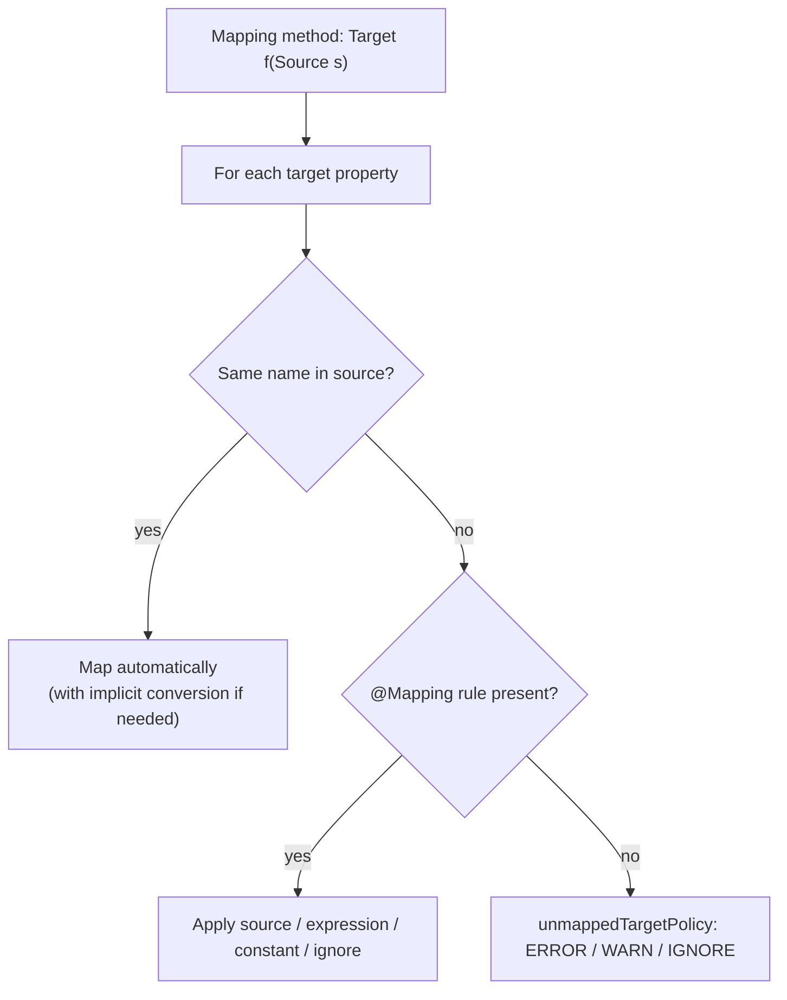

MapStruct iterates **target** properties. Each is filled from the same-named source property (converting types as needed), from an explicit `@Mapping`, or — if neither — handled per the unmapped policy.

### 3.4 The `@Mapping` annotation surface

Common attributes of `@Mapping`:

- `target` — the target property (required), supports dot notation for nested paths.
- `source` — the source property/path.
- `constant` — a fixed `String` value (type-converted to the target type).
- `expression` — inline Java: `expression = "java(...)"`.
- `defaultValue` / `defaultExpression` — used when the source is `null`.
- `ignore = true` — explicitly do not map this target (silences the unmapped policy).
- `dateFormat` / `numberFormat` — formats for `Date`/number ↔ `String` conversions.
- `qualifiedByName` / `qualifiedBy` — pick a specific custom mapping method (Chapter 5).
- `conditionExpression` / `conditionQualifiedByName` — conditional mapping (Chapter 10).

Use `@Mapping` repeatably (Java 8+ container is implicit); the older `@Mappings({ ... })` wrapper is still accepted.

### 3.5 Real example: renames, nesting, and multiple sources

**Scenario.** Build an `OrderSummaryDto` from an `Order` plus a separately fetched `Customer`.

**Problem.** Target field names differ, one value is nested, and two source objects feed one target.

**Solution.** A mapping method with two parameters and explicit `@Mapping` rules; use `source = "param.path"` for nested access.

**Implementation.**

```java
@Mapper
public interface OrderMapper {

    @Mapping(target = "orderId",     source = "order.id")
    @Mapping(target = "customerName", source = "customer.fullName")
    @Mapping(target = "city",        source = "customer.address.city")   // nested path
    @Mapping(target = "status",      constant = "NEW")
    OrderSummaryDto toSummary(Order order, Customer customer);
}
```

**Result.** MapStruct disambiguates by parameter name (`order`, `customer`), walks the nested `address.city` path with null-safety, and sets the constant `status`.

**Future improvements.** Move `status` logic into an expression or a `@Condition`; reuse the rule set with `@InheritConfiguration` for the inverse direction (Chapter 11).

### 3.6 Step by step

1. Declare an `interface` (or `abstract class`) and annotate it `@Mapper`.
2. Add a method whose return type is the target and whose parameter(s) are the source(s).
3. Let same-named properties map automatically.
4. Add `@Mapping` for each rename, nesting, constant, or ignore.
5. Compile and read the generated `*Impl` to confirm.

### 3.7 Complete code

```java
public record Order(Long id, BigDecimal total) {}
public record Address(String city) {}
public record Customer(String fullName, Address address) {}

public class OrderSummaryDto {
    private Long orderId;
    private String customerName;
    private String city;
    private String status;
    // getters & setters omitted
}
```

### 3.8 Exercises

1. When can you omit `@Mapping` entirely?
2. How does MapStruct know which parameter `fullName` comes from when there are two sources?
3. What does `@Mapping(target = "x", ignore = true)` accomplish?

### 3.9 Challenges

- **Challenge.** Map a target with a property the source does not have. With `unmappedTargetPolicy=ERROR`, make the build pass two different ways (ignore vs. constant) and explain the trade-off.

### 3.10 Checklist

- [ ] Same-named properties map without annotations.
- [ ] I can rename, nest (dot notation), and set constants with `@Mapping`.
- [ ] I can map from several source parameters.
- [ ] I know how `ignore`, `constant`, and `expression` differ.

### 3.11 Best practices

- Keep one mapper per cohesive group of related types; don't make a god-mapper.
- Prefer `source` paths over expressions when a plain path exists — they stay type-checked.
- Make every intentionally-unmapped target explicit with `ignore = true` so reviewers see intent.

### 3.12 Anti-patterns

- Disabling the unmapped policy to "make it compile" instead of adding rules.
- Burying business logic in `expression` strings that the compiler cannot check.
- Overloading one mapper method with conditionals better expressed as separate methods.

### 3.13 Troubleshooting

| Symptom | Cause | Action |
|---------|-------|--------|
| "Unmapped target property" | No rule and names differ | Add `@Mapping` or `ignore` |
| Wrong source parameter chosen | Ambiguous property across params | Qualify with `source = "param.path"` |
| Nested value is null | Intermediate object null | MapStruct null-guards paths; check the source data |

### 3.14 Official references

- Defining a mapper: https://mapstruct.org/documentation/stable/reference/html/#defining-mapper
- Several source parameters: https://mapstruct.org/documentation/stable/reference/html/#mapping-method-several-source-parameters
- Nested bean mappings: https://mapstruct.org/documentation/stable/reference/html/#mapping-nested-bean-properties-to-current-target

---

## Chapter 4 — Retrieving a mapper — `Mappers` factory and dependency injection

### 4.1 Introduction

A `@Mapper` interface needs an instance at runtime. MapStruct offers two routes: the **`Mappers` factory** (no framework) and **dependency injection** via a chosen `componentModel`. This chapter covers both and the injection strategy.

### 4.2 Business context

In a Spring or Jakarta application you want mappers to be ordinary managed beans — injectable, testable, and able to depend on other mappers. The `componentModel` setting makes MapStruct emit the right framework annotations so a mapper is just another bean. In a plain library with no container, the `Mappers` factory gives a zero-dependency singleton.

### 4.3 Theoretical concepts: component models

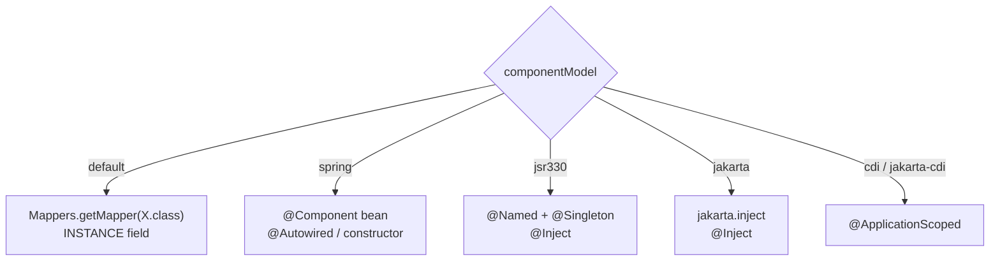

### 4.4 The `Mappers` factory (no DI)

```java
@Mapper
public interface CarMapper {
    CarMapper INSTANCE = Mappers.getMapper(CarMapper.class);
    CarDto toDto(Car car);
}

// usage
CarDto dto = CarMapper.INSTANCE.toDto(car);
```

### 4.5 Spring component model

```java
@Mapper(componentModel = "spring")
public interface CarMapper {
    CarDto toDto(Car car);
}
```

Generates a `@Component`-annotated implementation, so you inject it like any bean:

```java
@Service
class CarService {
    private final CarMapper carMapper;
    CarService(CarMapper carMapper) { this.carMapper = carMapper; }
}
```

Set it once globally with `-Amapstruct.defaultComponentModel=spring` instead of repeating it on every mapper.

### 4.6 Injection strategy and using other mappers

A mapper can use another mapper via `@Mapper(uses = { ... })`. With DI, control how dependencies are injected:

```java
@Mapper(componentModel = "spring",
        uses = { AddressMapper.class },
        injectionStrategy = InjectionStrategy.CONSTRUCTOR)
public interface CustomerMapper {
    CustomerDto toDto(Customer customer);   // delegates Address mapping to AddressMapper
}
```

`InjectionStrategy.CONSTRUCTOR` is preferred over field injection for the same reasons as in application code: explicit dependencies, `final` fields, easy testing.

### 4.7 Real example: composing mappers with constructor injection

**Scenario.** `CustomerMapper` needs `AddressMapper` to map a nested `Address`.

**Problem.** Default field injection hides the dependency and complicates unit tests.

**Solution.** `uses = AddressMapper.class` with `injectionStrategy = CONSTRUCTOR`.

**Implementation.** As in 4.6.

**Result.** Spring injects `AddressMapper` through the generated constructor; the customer mapper delegates address mapping automatically.

**Future improvements.** Set `defaultInjectionStrategy=constructor` globally so every mapper follows the rule.

### 4.8 Exercises

1. When is the `Mappers` factory the right choice over DI?
2. What does `uses = { ... }` enable?
3. Why prefer constructor injection for mappers?

### 4.9 Challenges

- **Challenge.** Convert a `Mappers.getMapper` mapper into a Spring bean using only a global processor option (no per-mapper change) and inject it into a service.

### 4.10 Checklist

- [ ] I can obtain a mapper via `Mappers` and via DI.
- [ ] I can set the component model globally.
- [ ] I can compose mappers with `uses`.
- [ ] I default to constructor injection.

### 4.11 Best practices

- In a container, always use the matching `componentModel`; never `new` a generated impl or use the factory inside managed code.
- Prefer constructor injection for testability.
- Set component model and injection strategy globally for consistency.

### 4.12 Anti-patterns

- Mixing the `Mappers` factory and DI in the same application.
- Field injection by default in large mappers.
- Forgetting `uses`, then re-implementing a nested mapping by hand.

### 4.13 Troubleshooting

| Symptom | Cause | Action |
|---------|-------|--------|
| Mapper bean not found | `componentModel` not `spring`/`jakarta`/… | Set the component model |
| Nested type not mapped | Helper mapper not in `uses` | Add it to `uses` |
| Two mapper beans of same type | Both factory `INSTANCE` and `@Component` | Pick one model |

### 4.14 Official references

- Retrieving a mapper: https://mapstruct.org/documentation/stable/reference/html/#retrieving-mapper
- Using dependency injection: https://mapstruct.org/documentation/stable/reference/html/#using-dependency-injection

---

## Part II – Mapping Mechanics

## Chapter 5 — Data type conversions — implicit conversions and formats

### 5.1 Introduction

When a source and target property have the **same name but different types**, MapStruct converts automatically where a conversion is well-defined. This chapter catalogs the implicit conversions, formatting for dates and numbers, and how MapStruct resolves and selects mapping methods (including qualifiers).

### 5.2 Business context

Type mismatches are the everyday friction of mapping: an `int` here, a `String` there; a `LocalDateTime` entity field, an ISO-8601 `String` API field. MapStruct removing this friction safely — and letting you specify a **format** declaratively — eliminates a whole class of parsing bugs and keeps formatting consistent across an API.

### 5.3 Theoretical concepts: the conversion catalog

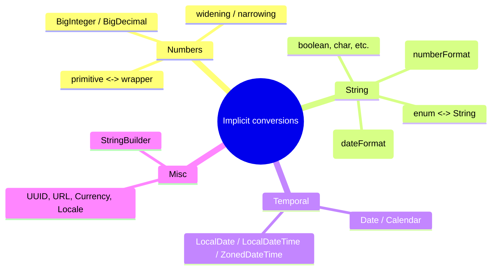

If both sides are mappable beans (not in the catalog), MapStruct generates or reuses a **mapping method** instead of an implicit conversion (Chapter 6).

### 5.4 Formats

```java
@Mapper
public interface EventMapper {

    @Mapping(target = "startsAt", source = "startTime", dateFormat = "yyyy-MM-dd HH:mm")
    @Mapping(target = "price",    source = "amount",    numberFormat = "#.00")
    EventDto toDto(Event event);   // LocalDateTime -> String, BigDecimal -> String
}
```

`dateFormat` follows `SimpleDateFormat`/`DateTimeFormatter` patterns; `numberFormat` follows `DecimalFormat`.

### 5.5 Mapping method resolution and qualifiers

When several candidate methods could map a type, MapStruct picks the **most specific** one. To force a choice, qualify it:

```java
@Mapper
public interface ViewMapper {

    @Mapping(target = "title", source = "rawTitle", qualifiedByName = "shout")
    ArticleView toView(Article article);

    @Named("shout")
    default String shout(String s) { return s == null ? null : s.toUpperCase(); }
}
```

For stronger typing than a string name, define a custom `@Qualifier` annotation and reference it with `qualifiedBy`.

### 5.6 Real example: ISO timestamps and money strings

**Scenario.** An API must emit timestamps as `yyyy-MM-dd'T'HH:mm:ss` and money as two-decimal strings.

**Problem.** Hand-formatting scattered through services drifts and produces inconsistent output.

**Solution.** Declare `dateFormat`/`numberFormat` on the mapping; MapStruct centralizes the conversion.

**Implementation.** As in 5.4 with the ISO pattern.

**Result.** Every mapped response formats identically; reverse mapping parses with the same pattern via `@InheritInverseConfiguration` (Chapter 11).

**Future improvements.** Replace ad-hoc formatting helpers across the codebase with mapper-driven conversion.

### 5.7 Exercises

1. Name five implicit conversions MapStruct performs.
2. Which attribute formats a `BigDecimal` into a `String`?
3. How do you force a specific custom method when several match?

### 5.8 Challenges

- **Challenge.** Map a `LocalDate` to `String` and back with a single `dateFormat`, reusing the pattern via inverse configuration.

### 5.9 Checklist

- [ ] I know which conversions are implicit.
- [ ] I can apply `dateFormat`/`numberFormat`.
- [ ] I can disambiguate methods with `@Named`/`qualifiedByName`.
- [ ] I understand most-specific method selection.

### 5.10 Best practices

- Prefer declarative `dateFormat`/`numberFormat` over custom parsing methods.
- Use `@Qualifier` (typed) over `@Named` (string) for refactor-safe disambiguation.
- Keep formatting patterns in shared constants if reused across mappers.

### 5.11 Anti-patterns

- Writing custom `String`↔number/date helpers MapStruct already provides.
- Relying on implicit narrowing conversions that can lose data silently.
- Disambiguating with brittle string names in large codebases.

### 5.12 Troubleshooting

| Symptom | Cause | Action |
|---------|-------|--------|
| "Can't map property" | No implicit conversion and no method | Add a mapping method or qualifier |
| Wrong date format | Pattern mismatch | Fix `dateFormat` pattern |
| Ambiguous mapping method | Multiple candidates | Qualify with `qualifiedByName`/`qualifiedBy` |

### 5.13 Official references

- Data type conversions: https://mapstruct.org/documentation/stable/reference/html/#datatype-conversions
- Method resolution: https://mapstruct.org/documentation/stable/reference/html/#selection-based-on-qualifiers

---

## Chapter 6 — Object references, nested beans, and several source parameters

### 6.1 Introduction

Real models nest: an `Order` has a `Customer`, which has an `Address`. MapStruct maps a referenced bean by **invoking another mapping method** for that type — one it finds in the same mapper, in a `uses` mapper, or generates on demand. This chapter covers object references, controlling nested mapping, and invoking custom or other mappers.

### 6.2 Business context

Reusing per-type mappers keeps mapping logic **DRY**: define `Address → AddressDto` once, and every aggregate that contains an address gets correct, consistent mapping for free. This is the difference between a maintainable mapping layer and a pile of copy-paste.

### 6.3 Theoretical concepts: method-driven nesting

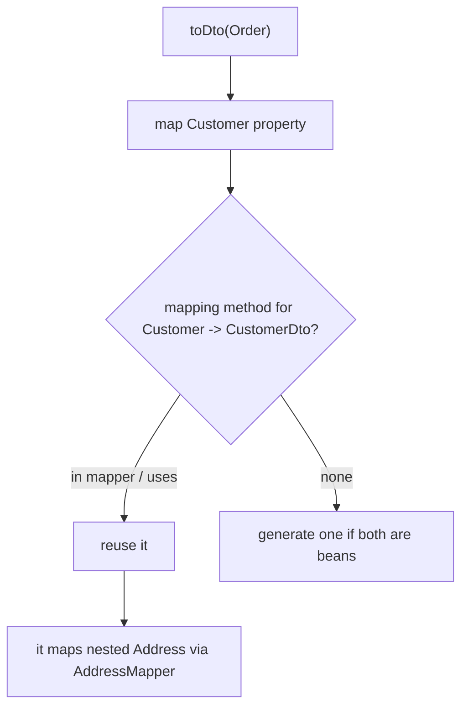

### 6.4 Invoking other mappers and custom methods

```java
@Mapper(uses = { AddressMapper.class })
public interface CustomerMapper {
    CustomerDto toDto(Customer customer);   // Address handled by AddressMapper
}

@Mapper
public interface AddressMapper {
    AddressDto toDto(Address address);
}
```

A **custom** mapping method (hand-written `default`/abstract) is selected the same way as a generated one — by source/target type and qualifiers.

### 6.5 Controlling nested mappings

Dot notation on `source`/`target` reaches into nested structures, and you can ignore deep paths:

```java
@Mapping(target = "shippingCity", source = "order.customer.address.city")
@Mapping(target = "customer.password", ignore = true)   // don't map a nested field
OrderDto toDto(Order order);
```

### 6.6 Real example

**Scenario.** Map `Order → OrderDto` where `Order` references `Customer` and `Address`.

**Problem.** Without reuse, address mapping is duplicated wherever an address appears.

**Solution.** A dedicated `AddressMapper`, referenced via `uses`.

**Implementation.** As in 6.4.

**Result.** One source of truth for address mapping; aggregates compose it automatically.

**Future improvements.** Pass a `@Context` object to share state (e.g. a cache) across nested calls (Chapter 12).

### 6.7 Exercises

1. How does MapStruct map a referenced bean property?
2. What does `uses` change about method resolution?
3. How do you ignore a nested target property?

### 6.8 Challenges

- **Challenge.** Introduce a second aggregate that also contains `Address` and confirm both reuse the single `AddressMapper`.

### 6.9 Checklist

- [ ] Referenced beans map via dedicated methods.
- [ ] I reuse per-type mappers with `uses`.
- [ ] I can reach and ignore nested paths.

### 6.10 Best practices

- One mapper per type; compose with `uses`.
- Avoid deep dot-notation chains when a dedicated nested mapper is clearer.
- Keep custom methods small and well-named so resolution is predictable.

### 6.11 Anti-patterns

- Re-implementing the same nested mapping in multiple aggregates.
- Mapping sensitive nested fields (passwords, secrets) by accident — ignore them explicitly.

### 6.12 Troubleshooting

| Symptom | Cause | Action |
|---------|-------|--------|
| Nested bean not mapped | No method and not in `uses` | Add the per-type mapper to `uses` |
| Ambiguous nested method | Several candidates | Qualify it |
| Secret field leaked into DTO | No ignore rule | `@Mapping(target="...", ignore=true)` |

### 6.13 Official references

- Mapping object references: https://mapstruct.org/documentation/stable/reference/html/#mapping-object-references
- Invoking other mappers: https://mapstruct.org/documentation/stable/reference/html/#invoking-other-mappers

---

## Chapter 7 — Update mappings, builders, constructors, and Map-to-Bean

### 7.1 Introduction

Not all mapping creates a new object. MapStruct can **update an existing instance** (`@MappingTarget`), map through **builders** and **constructors** (including Java records), use **direct field access** when there are no accessors, and build a bean from a **`Map`**. This chapter covers these target-construction modes.

### 7.2 Business context

Update mapping matters for persistence: applying an incoming DTO onto a managed JPA entity without replacing it preserves identity and dirty-checking. Builder/constructor support means MapStruct works with immutable objects, records, Lombok `@Builder`, AutoValue, and Immutables — the modern Java style — not just mutable JavaBeans.

### 7.3 Theoretical concepts: how the target is constructed

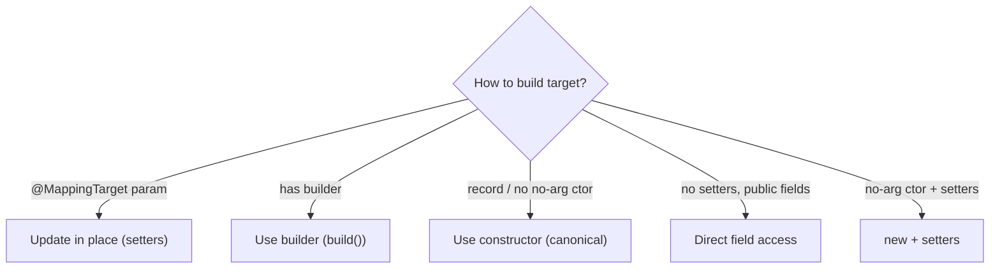

### 7.4 Update mappings

```java
@Mapper
public interface CustomerMapper {
    void update(CustomerDto dto, @MappingTarget Customer entity);   // mutate entity
}
```

By default `null` source values overwrite the target; control that with `nullValuePropertyMappingStrategy = IGNORE` to perform **patch-style** updates that skip nulls (Chapter 10).

### 7.5 Builders and constructors

If the target exposes a builder (Lombok `@Builder`, Immutables, AutoValue, FreeBuilder), MapStruct detects and uses it. For records and constructor-only types, it maps through the constructor, matching parameter names (compile with `-parameters` or annotate with `@ConstructorProperties` so names are available).

```java
public record CarDto(String make, int seatCount) {}   // mapped via canonical constructor
```

Disable builders globally with `mapstruct.disableBuilders=true`, or per mapper/method with `@BeanMapping(builder = @Builder(disableBuilder = true))`.

### 7.6 Map to Bean

```java
@Mapper
public interface SettingsMapper {
    @Mapping(target = "host", source = "hostname")
    ServerConfig fromMap(Map<String, String> values);
}
```

### 7.7 Real example: patch-update a JPA entity

**Scenario.** A `PATCH` endpoint applies only the non-null fields of a DTO to a managed entity.

**Problem.** A normal map would null out fields the client omitted.

**Solution.** An update method with `nullValuePropertyMappingStrategy = IGNORE`.

**Implementation.**

```java
@Mapper
public interface CustomerMapper {
    @BeanMapping(nullValuePropertyMappingStrategy = NullValuePropertyMappingStrategy.IGNORE)
    void patch(CustomerDto dto, @MappingTarget Customer entity);
}
```

**Result.** Only present fields are applied; omitted fields keep their stored value, and JPA dirty-checking persists exactly the changes.

**Future improvements.** Combine with `@Condition`/source-presence checks for finer control (Chapter 10).

### 7.8 Exercises

1. What does `@MappingTarget` change about a method?
2. How does MapStruct map a Java record?
3. How do you implement a patch (ignore-null) update?

### 7.9 Challenges

- **Challenge.** Map an immutable target built with Lombok `@Builder`, then disable the builder for one method and observe the difference in generated code.

### 7.10 Checklist

- [ ] I can update an existing instance with `@MappingTarget`.
- [ ] I can map records and builder-based immutables.
- [ ] I can implement ignore-null patch updates.
- [ ] I can map a `Map` to a bean.

### 7.11 Best practices

- Use update mappings for JPA entities to preserve identity and dirty-checking.
- Compile with `-parameters` so constructor/record parameter names are available.
- Prefer builders for immutable targets; let MapStruct detect them.

### 7.12 Anti-patterns

- Replacing managed entities wholesale instead of updating them.
- Patch endpoints that null out omitted fields because null-strategy was left at default.
- Relying on parameter names without `-parameters` or `@ConstructorProperties`.

### 7.13 Troubleshooting

| Symptom | Cause | Action |
|---------|-------|--------|
| Constructor params unmapped | Names not retained | Compile with `-parameters` |
| Builder ignored | Builder disabled globally | Check `disableBuilders` / `@BeanMapping` |
| Patch nulls fields | Default null strategy | Set `nullValuePropertyMappingStrategy=IGNORE` |

### 7.14 Official references

- Updating existing bean instances: https://mapstruct.org/documentation/stable/reference/html/#mapping-result-for-updates
- Using builders: https://mapstruct.org/documentation/stable/reference/html/#mapping-with-builders
- Using constructors: https://mapstruct.org/documentation/stable/reference/html/#mapping-with-constructors
- Mapping Map to bean: https://mapstruct.org/documentation/stable/reference/html/#mapping-map-to-bean

---

## Part III – Collections, Maps & Enums

## Chapter 8 — Mapping collections, maps, and streams

### 8.1 Introduction

MapStruct maps `List`, `Set`, other `Collection`s, `Map`s, and `Stream`s by mapping each element with the appropriate element/entry method. This chapter covers element conversion, the collection mapping **strategy** (adder vs setter), implementation type selection, and null/empty handling for collections.

### 8.2 Business context

Collections are everywhere in APIs (lists of items, sets of tags, maps of attributes). Correct element conversion, predictable empty-vs-null semantics, and the right concrete type (e.g. `ArrayList`, `HashSet`) prevent subtle bugs and serialization surprises at scale.

### 8.3 Theoretical concepts

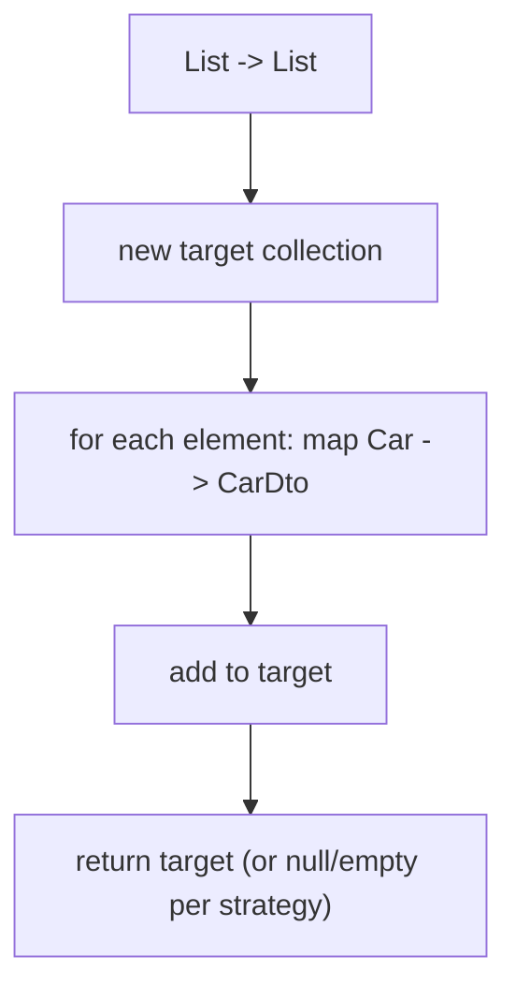

### 8.4 Collections and the element method

```java
@Mapper
public interface CarMapper {
    CarDto toDto(Car car);
    List<CarDto> toDtos(List<Car> cars);     // reuses toDto per element
    Set<CarDto> toDtoSet(Set<Car> cars);
}
```

### 8.5 Maps and streams

```java
Map<String, CarDto> toMap(Map<String, Car> cars);   // maps keys and values
List<CarDto> fromStream(Stream<Car> cars);          // Stream source supported
```

`@MapMapping` controls key/value conversion (e.g. `keyDateFormat`, `valueQualifiedByName`); `@IterableMapping` controls element conversion (e.g. `elementTargetType`, `qualifiedByName`).

### 8.6 Strategies and implementation types

- **`CollectionMappingStrategy`** — `ACCESSOR_ONLY` (default, uses setter), `SETTER_PREFERRED`, `ADDER_PREFERRED` (use `addX(...)` for child collections, important for JPA bidirectional relations), `TARGET_IMMUTABLE`.
- **Implementation types** — for an interface target type MapStruct picks a sensible concrete type (`List` → `ArrayList`, `Set` → `LinkedHashSet`/`HashSet`, `Map` → `LinkedHashMap`/`HashMap`).
- **Null/empty** — `nullValueIterableMappingStrategy` / `nullValueMapMappingStrategy` choose `RETURN_NULL` (default) or `RETURN_DEFAULT` (empty collection) for a null source.

### 8.7 Real example: JPA parent–child with adders

**Scenario.** Map `OrderDto.items` into a JPA `Order` that owns `OrderItem`s through `addItem(...)` to keep both sides of the relation consistent.

**Problem.** A plain setter replaces the collection and breaks the back-reference.

**Solution.** `collectionMappingStrategy = ADDER_PREFERRED`.

**Implementation.**

```java
@Mapper(collectionMappingStrategy = CollectionMappingStrategy.ADDER_PREFERRED)
public interface OrderMapper {
    Order toEntity(OrderDto dto);   // uses order.addItem(item) per element
}
```

**Result.** Each item is added through `addItem`, which sets the parent back-reference — the bidirectional relation stays consistent.

**Future improvements.** Standardize on `RETURN_DEFAULT` to always return empty collections and simplify downstream null checks.

### 8.8 Exercises

1. How does MapStruct map `List<A>` to `List<B>`?
2. When is `ADDER_PREFERRED` the right strategy?
3. What controls null-source collection results?

### 8.9 Challenges

- **Challenge.** Map a `Map<String, LocalDate>` to `Map<String, String>` using `@MapMapping` with a `valueDateFormat`.

### 8.10 Checklist

- [ ] Collections/maps/streams map element-by-element.
- [ ] I can choose a collection mapping strategy.
- [ ] I control null vs empty results.
- [ ] I can format map keys/values.

### 8.11 Best practices

- Use `ADDER_PREFERRED` for JPA-owned child collections.
- Decide null-vs-empty policy once, fleet-wide.
- Provide an element method; let collection methods reuse it.

### 8.12 Anti-patterns

- Mapping child collections with setters in bidirectional JPA models, breaking back-references.
- Inconsistent null/empty semantics across endpoints.
- Hand-looping collections that MapStruct would generate.

### 8.13 Troubleshooting

| Symptom | Cause | Action |
|---------|-------|--------|
| Element type not mapped | No element method | Add `B toB(A a)` |
| Broken JPA back-reference | Setter strategy | Use `ADDER_PREFERRED` |
| Null where empty expected | Default null strategy | `RETURN_DEFAULT` |

### 8.14 Official references

- Mapping collections: https://mapstruct.org/documentation/stable/reference/html/#mapping-collections
- Mapping maps: https://mapstruct.org/documentation/stable/reference/html/#mapping-maps
- Mapping streams: https://mapstruct.org/documentation/stable/reference/html/#mapping-streams

---

## Chapter 9 — Mapping values — enums and `@ValueMapping`

### 9.1 Introduction

MapStruct maps **enum to enum** (by constant name, by default), **enum to/from String**, and lets you remap individual constants and handle the "anything else" case with `@ValueMapping`. This chapter covers value mapping and `MappingConstants` for the wildcard cases.

### 9.2 Business context

Enums encode domain state, and external systems rarely use your exact names. Declarative value mapping — including a single rule for "any unrecognized value → `UNKNOWN`" — turns brittle `switch` statements into compile-checked tables and prevents an unmapped external value from throwing in production.

### 9.3 Theoretical concepts

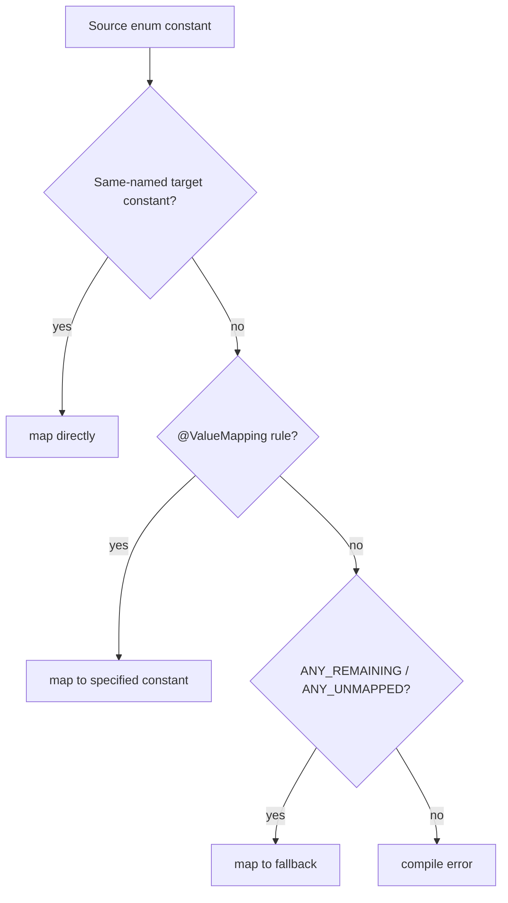

### 9.4 Enum-to-enum and remapping constants

```java
@Mapper
public interface OrderStatusMapper {

    @ValueMapping(source = "EXTRA",          target = "SPECIAL")
    @ValueMapping(source = "STANDARD",       target = "DEFAULT")
    @ValueMapping(source = MappingConstants.NULL,          target = "DEFAULT")
    @ValueMapping(source = MappingConstants.ANY_REMAINING, target = "UNKNOWN")
    TargetStatus map(SourceStatus status);
}
```

- `MappingConstants.NULL` — handle a `null` source.
- `MappingConstants.ANY_REMAINING` — map every not-yet-listed constant to one target.
- `MappingConstants.ANY_UNMAPPED` — like `ANY_REMAINING` but excludes implicitly name-matched ones.
- `MappingConstants.THROW_EXCEPTION` — as a target, throw for unmatched values.

### 9.5 Enum ↔ String

A method `TargetEnum toEnum(String s)` or `String toString(SourceEnum e)` uses name matching, with `@ValueMapping` overrides as above.

### 9.6 Real example: tolerant external-status mapping

**Scenario.** Map a partner's status enum to your internal one; unknown values must not break.

**Problem.** Partners add new statuses without notice.

**Solution.** Explicit rules for known values plus `ANY_REMAINING → UNKNOWN`.

**Implementation.** As in 9.4.

**Result.** Known statuses map precisely; anything new degrades gracefully to `UNKNOWN` instead of throwing.

**Future improvements.** Apply a `CustomEnumNamingStrategy` (Chapter 14) to auto-translate naming conventions across all enum mappers.

### 9.7 Exercises

1. How are enum constants matched by default?
2. What does `ANY_REMAINING` do, and how is it different from `ANY_UNMAPPED`?
3. How do you handle a `null` source enum?

### 9.8 Challenges

- **Challenge.** Map an external enum to an internal one where two external constants collapse to one internal constant, plus a fallback.

### 9.9 Checklist

- [ ] Enum constants match by name by default.
- [ ] I can remap individual constants with `@ValueMapping`.
- [ ] I can handle null and remaining/unmapped values.
- [ ] I can map enum ↔ String.

### 9.10 Best practices

- Always provide a fallback (`ANY_REMAINING`/`ANY_UNMAPPED`) for externally-sourced enums.
- Use `THROW_EXCEPTION` deliberately only when an unknown value truly is a bug.
- Prefer value mapping over hand-written `switch` for compile-time completeness.

### 9.11 Anti-patterns

- Mapping external enums without a catch-all, so a new value throws in production.
- Duplicating enum translation logic across services instead of an SPI strategy.

### 9.12 Troubleshooting

| Symptom | Cause | Action |
|---------|-------|--------|
| Compile error on enum mapping | Unmatched constant, no fallback | Add `@ValueMapping` or `ANY_REMAINING` |
| Unexpected `UNKNOWN` | Over-broad `ANY_REMAINING` | Add explicit rules for the missed constants |
| Null source throws | No `MappingConstants.NULL` rule | Add a null mapping |

### 9.13 Official references

- Mapping values: https://mapstruct.org/documentation/stable/reference/html/#mapping-values
- Enum-to-enum types: https://mapstruct.org/documentation/stable/reference/html/#enum-to-enum
- ValueMapping composition: https://mapstruct.org/documentation/stable/reference/html/#value-mapping-composition

---

## Part IV – Advanced Mapping

## Chapter 10 — Advanced options — defaults, expressions, null handling, conditional & subclass mapping

### 10.1 Introduction

This chapter collects the powerful options: default values and constants, inline **expressions** and **default expressions**, fine-grained **null handling**, **source presence checking**, **conditional mapping** (`@Condition`, new in the 1.6 line), and **`@SubclassMapping`** for polymorphism.

### 10.2 Business context

These options cover the cases convention can't: computed fields, fallbacks for missing data, patch semantics, "only map if present," and mapping a class hierarchy. Expressing them declaratively keeps logic centralized and reviewable rather than scattered across services.

### 10.3 Defaults, constants, and expressions

```java
@Mapper
public interface UserMapper {

    @Mapping(target = "displayName", source = "name", defaultValue = "Anonymous")
    @Mapping(target = "role",        constant = "USER")
    @Mapping(target = "createdAt",   expression = "java(java.time.Instant.now())")
    @Mapping(target = "id",          defaultExpression = "java(java.util.UUID.randomUUID())")
    UserDto toDto(UserEntity user);
}
```

- `defaultValue` — used when `source` is `null` (string, type-converted).
- `defaultExpression` — Java expression used when `source` is `null`.
- `expression` — Java expression that always supplies the value.
- `constant` — fixed value regardless of source.

### 10.4 Null handling

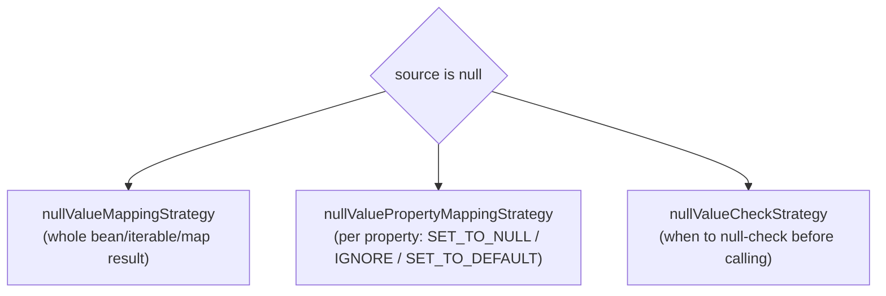

`nullValuePropertyMappingStrategy = IGNORE` gives patch updates (Chapter 7). `nullValueCheckStrategy = ALWAYS` adds defensive null checks before invoking conversions.

### 10.5 Source presence checking and conditional mapping

If the source bean has a presence method (e.g. `hasName()` or an `Optional`), MapStruct uses it. For custom logic, `@Condition` defines a method that decides whether a property (or source parameter) is mapped:

```java
@Mapper
public interface UserMapper {

    @Mapping(target = "email", source = "email")
    UserDto toDto(UserEntity user);

    @Condition
    default boolean isNotBlank(String value) {
        return value != null && !value.isBlank();
    }
}
```

Here `email` is mapped only when non-blank. Reference a specific condition with `conditionQualifiedByName` / `conditionExpression`.

### 10.6 Subclass mapping (polymorphism)

```java
@Mapper
public interface ShapeMapper {

    @SubclassMapping(source = Circle.class,  target = CircleDto.class)
    @SubclassMapping(source = Square.class,  target = SquareDto.class)
    ShapeDto toDto(Shape shape);   // dispatches by runtime subtype
}
```

MapStruct generates the `instanceof` dispatch and delegates to the per-subclass methods.

### 10.7 Real example: tolerant patch with conditions

**Scenario.** A patch endpoint maps only non-blank strings and present numbers onto an entity.

**Problem.** Blank strings from a form should be treated as "no change," not as empty values.

**Solution.** `nullValuePropertyMappingStrategy = IGNORE` plus a `@Condition` for blanks.

**Implementation.** Combine 7.7 with the `@Condition` from 10.5.

**Result.** Omitted and blank inputs leave stored values intact; present, meaningful inputs are applied.

**Future improvements.** Lift the condition into a shared `@MapperConfig` so every patch mapper uses it (Chapter 11).

### 10.8 Exercises

1. Difference between `defaultValue`, `defaultExpression`, `expression`, and `constant`?
2. What does `nullValuePropertyMappingStrategy = IGNORE` enable?
3. What problem does `@SubclassMapping` solve?

### 10.9 Challenges

- **Challenge.** Implement a `@Condition` that maps a collection property only when it is non-empty, and verify the generated guard.

### 10.10 Checklist

- [ ] I can supply defaults, constants, and expressions.
- [ ] I can control null handling at bean and property level.
- [ ] I can map conditionally with `@Condition`/presence checks.
- [ ] I can map polymorphic hierarchies with `@SubclassMapping`.

### 10.11 Best practices

- Prefer `source` + `defaultValue` over `expression` when a plain path exists.
- Keep expressions tiny; move real logic into qualified methods.
- Centralize null and condition policy in shared config.

### 10.12 Anti-patterns

- Large `expression = "java(...)"` blocks the compiler can't type-check.
- Patch endpoints without an ignore-null strategy.
- Hand-written `instanceof` ladders where `@SubclassMapping` fits.

### 10.13 Troubleshooting

| Symptom | Cause | Action |
|---------|-------|--------|
| Expression won't compile | Missing FQN/imports inside `java(...)` | Fully-qualify or add `imports` to `@Mapper` |
| Patch nulls fields | Default null property strategy | `IGNORE` |
| Subclass mapped as base | Missing `@SubclassMapping` entry | Add the subclass pair |

### 10.14 Official references

- Advanced mapping options: https://mapstruct.org/documentation/stable/reference/html/#advanced-mapping-options
- Expressions: https://mapstruct.org/documentation/stable/reference/html/#expressions
- Conditional Mapping: https://mapstruct.org/documentation/stable/reference/html/#conditional-mapping
- Subclass Mapping: https://mapstruct.org/documentation/stable/reference/html/#mappings-subclass

---

## Chapter 11 — Reusing configurations — inheritance, inverse, and shared config

### 11.1 Introduction

Mapping configuration repeats — the same renames apply forward and backward, and the same policies apply across mappers. MapStruct removes the duplication with `@InheritConfiguration`, `@InheritInverseConfiguration`, and `@MapperConfig` shared configuration. This chapter covers all three.

### 11.2 Business context

DRY mapping config means a rename is declared once and reused for the reverse direction and across an organization's mappers. That reduces drift (forward and reverse disagreeing), centralizes governance (one place sets strict policies), and shrinks each mapper to just its differences.

### 11.3 Theoretical concepts

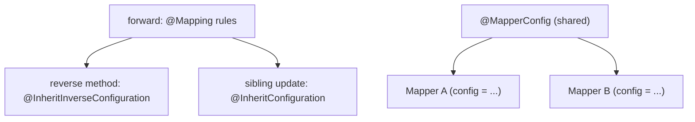

### 11.4 Inverse and inherited configuration

```java
@Mapper
public interface CarMapper {

    @Mapping(target = "seatCount", source = "numberOfSeats")
    CarDto toDto(Car car);

    @InheritInverseConfiguration            // reuses the rule, reversed
    Car toEntity(CarDto dto);

    @InheritConfiguration                    // reuses toDto rules for an update
    void update(Car car, @MappingTarget CarDto dto);
}
```

### 11.5 Shared configuration with `@MapperConfig`

```java
@MapperConfig(
    componentModel = "spring",
    unmappedTargetPolicy = ReportingPolicy.ERROR,
    injectionStrategy = InjectionStrategy.CONSTRUCTOR
)
public interface CentralMapperConfig {}

@Mapper(config = CentralMapperConfig.class)
public interface CarMapper {
    CarDto toDto(Car car);
}
```

A `@MapperConfig` interface can also carry prototype mapping methods whose `@Mapping` rules are inherited by mappers that reference it — organization-wide mapping conventions in one place.

### 11.6 Real example: one config, many mappers

**Scenario.** Every mapper in a service must be a Spring bean, fail on unmapped targets, and use constructor injection.

**Problem.** Repeating those settings on each `@Mapper` invites drift.

**Solution.** A single `@MapperConfig` referenced via `config = ...`.

**Implementation.** As in 11.5.

**Result.** New mappers inherit the policy by adding one attribute; changing the policy is a one-line edit.

**Future improvements.** Add shared prototype methods for common renames (e.g. `id ↔ uuid`) so they are declared once.

### 11.7 Exercises

1. What does `@InheritInverseConfiguration` reuse?
2. When use `@InheritConfiguration` vs the inverse variant?
3. What can a `@MapperConfig` centralize?

### 11.8 Challenges

- **Challenge.** Define forward, inverse, and update methods for a type using inheritance so the rename is declared exactly once.

### 11.9 Checklist

- [ ] I can derive a reverse mapper with `@InheritInverseConfiguration`.
- [ ] I can reuse rules across sibling methods with `@InheritConfiguration`.
- [ ] I can centralize policy with `@MapperConfig`.

### 11.10 Best practices

- Declare each rename once; derive the inverse.
- Put component model, injection, and policies in a shared `@MapperConfig`.
- Use prototype methods in the config for cross-cutting renames.

### 11.11 Anti-patterns

- Maintaining forward and reverse rule sets by hand (they drift).
- Repeating component model/policy on every mapper.

### 11.12 Troubleshooting

| Symptom | Cause | Action |
|---------|-------|--------|
| Inverse not derived | Ambiguous reverse method | Name the method or specify `name` |
| Shared config ignored | `config = ...` not set | Reference the `@MapperConfig` |
| Conflicting policies | Per-mapper overrides config | Decide precedence intentionally |

### 11.13 Official references

- Reusing mapping configurations: https://mapstruct.org/documentation/stable/reference/html/#reusing-mappings
- Inverse mappings: https://mapstruct.org/documentation/stable/reference/html/#inverse-mappings
- Shared configurations: https://mapstruct.org/documentation/stable/reference/html/#shared-configurations

---

## Part V – Customization & Production

## Chapter 12 — Customizing mappings — decorators, before/after methods, object factories, `@Context`

### 12.1 Introduction

Sometimes generated mapping needs a hand-written touch: post-process a result, choose how a target is instantiated, or thread state through a deep mapping. MapStruct provides **decorators**, **`@BeforeMapping`/`@AfterMapping`** hooks, **`@ObjectFactory`** methods, and **`@Context`** parameters. This chapter covers each.

### 12.2 Business context

These extension points let MapStruct integrate with reality — registries/caches that create entities, audit fields stamped after mapping, ID resolution that needs an `EntityManager` — without abandoning generated mapping for hand-written code. You keep the boilerplate generated and inject only the bespoke logic.

### 12.3 Theoretical concepts

```mermaid
flowchart TB
    call["mapping call"] --> before["@BeforeMapping hooks"]
    before --> factory["@ObjectFactory: create target"]
    factory --> body["generated property mapping"]
    body --> after["@AfterMapping hooks"]
    after --> result["result"]
    ctx["@Context object"] -.passed through.-> before & factory & after
    deco["Decorator"] -. wraps .-> call
```

### 12.4 Before/after mapping and object factories

```java
@Mapper
public abstract class OrderMapper {

    @ObjectFactory
    Order create(OrderDto dto) {
        return new Order(dto.reference());   // custom construction
    }

    @AfterMapping
    void stamp(@MappingTarget Order order) {
        order.setMappedAt(java.time.Instant.now());
    }

    public abstract Order toEntity(OrderDto dto);
}
```

`@BeforeMapping`/`@AfterMapping` methods may take the source, the `@MappingTarget`, `@TargetType`, and `@Context` parameters; MapStruct calls the applicable ones.

### 12.5 `@Context`

```java
TreeNodeDto toDto(TreeNode node, @Context CycleAvoidingMappingContext ctx);
```

A `@Context` parameter is passed down the whole call chain (including nested and lifecycle methods) — the standard way to share a cache or break object cycles.

### 12.6 Decorators

```java
@Mapper(componentModel = "spring")
@DecoratedWith(CarMapperDecorator.class)
public interface CarMapper {
    CarDto toDto(Car car);
}

public abstract class CarMapperDecorator implements CarMapper {
    @Autowired @Qualifier("delegate")
    private CarMapper delegate;

    @Override
    public CarDto toDto(Car car) {
        CarDto dto = delegate.toDto(car);
        dto.setLabel(car.getMake() + " (" + car.getNumberOfSeats() + " seats)");
        return dto;
    }
}
```

The decorator wraps the generated mapper, letting you augment specific methods while delegating the rest.

### 12.7 Real example: stamp audit fields after mapping

**Scenario.** Every mapped entity needs a `mappedAt` timestamp set after mapping.

**Problem.** Repeating the stamp in every method is error-prone.

**Solution.** A single `@AfterMapping` method targeting a common base type.

**Implementation.** As in 12.4.

**Result.** The stamp is applied uniformly to all matching targets, generated into every relevant method.

**Future improvements.** Pass a `@Context` clock for testable, deterministic timestamps.

### 12.8 Exercises

1. When do `@BeforeMapping`/`@AfterMapping` run relative to property mapping?
2. What is an `@ObjectFactory` for?
3. How does `@Context` differ from an ordinary parameter?

### 12.9 Challenges

- **Challenge.** Use `@Context` with a cache to map a self-referential tree without infinite recursion.

### 12.10 Checklist

- [ ] I can post-process with `@AfterMapping`.
- [ ] I can control instantiation with `@ObjectFactory`.
- [ ] I can thread state with `@Context`.
- [ ] I can wrap a mapper with a decorator.

### 12.11 Best practices

- Prefer lifecycle hooks over decorators for small touch-ups; decorators for cross-cutting wrapping.
- Use `@Context` for caches/cycle-breaking, not for business inputs that belong as parameters.
- Keep factories and hooks side-effect-light and well-named.

### 12.12 Anti-patterns

- Putting heavy business logic in `@AfterMapping` that belongs in the service.
- Using a decorator where a single `@AfterMapping` would do.
- Passing shared state via fields instead of `@Context`.

### 12.13 Troubleshooting

| Symptom | Cause | Action |
|---------|-------|--------|
| Hook not invoked | Signature doesn't match target | Align parameters/`@MappingTarget` |
| Factory ignored | Wrong return/parameter type | Match the target type |
| Context not propagated | Missing `@Context` on nested method | Add `@Context` consistently |

### 12.14 Official references

- Customizing mappings: https://mapstruct.org/documentation/stable/reference/html/#customizing-mappings
- Before/after mapping: https://mapstruct.org/documentation/stable/reference/html/#customizing-mappings-with-before-and-after
- Object factories: https://mapstruct.org/documentation/stable/reference/html/#object-factories
- Passing context: https://mapstruct.org/documentation/stable/reference/html/#passing-context

---

## Chapter 13 — Exceptions and error handling

### 13.1 Introduction

Mapping can fail: a custom conversion may throw, validation may reject input. MapStruct lets mapping methods **declare checked exceptions** and propagates them through generated code with correct `try`/`throws` handling. This chapter covers exception flow in mappers.

### 13.2 Business context

Errors that surface at the mapping boundary (e.g. an invalid external value) should be handled explicitly, not swallowed. Declaring exceptions on custom methods makes the failure part of the contract, and the compiler enforces that callers handle it — the same build-time discipline MapStruct applies everywhere.

### 13.3 Theoretical concepts

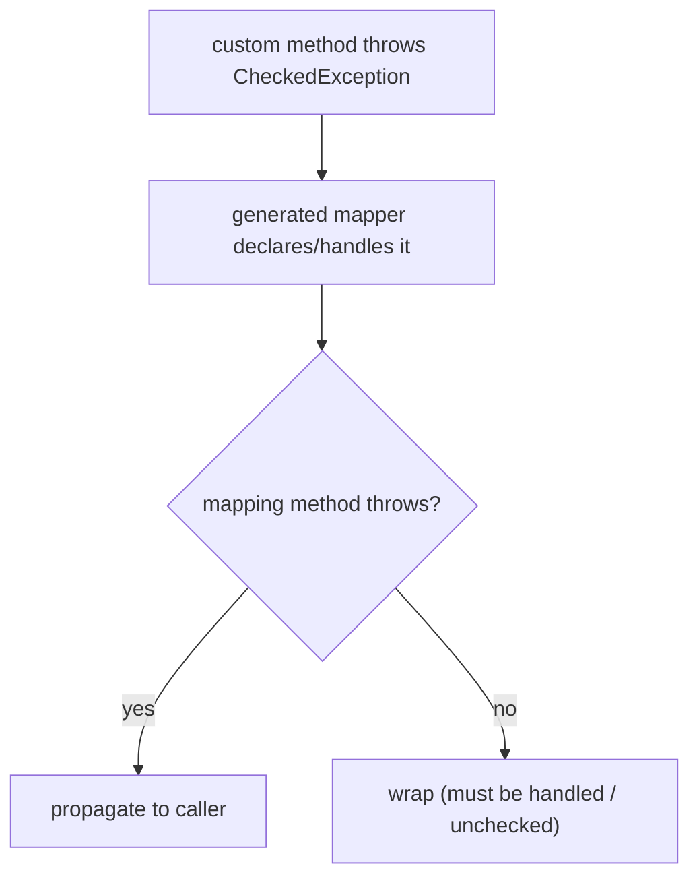

### 13.4 Declaring exceptions

```java
public class DateValidator {
    public LocalDate parse(String raw) throws ParseException { /* ... */ }
}

@Mapper(uses = DateValidator.class)
public interface EventMapper {
    EventDto toDto(Event event) throws ParseException;   // propagated from custom method
}
```

MapStruct generates a `try`/`catch` or `throws` so the checked exception flows correctly; the calling code must handle it.

### 13.5 Real example: validating during mapping

**Scenario.** A custom parser throws on malformed dates.

**Problem.** The mapper must not hide the failure.

**Solution.** Declare the checked exception on the mapping method.

**Implementation.** As in 13.4.

**Result.** Invalid input fails loudly at the mapping boundary; callers are forced to handle it.

**Future improvements.** Translate the checked exception into a domain error in an `@AfterMapping` or service layer.

### 13.6 Exercises

1. How does a checked exception from a custom method reach the caller?
2. Where should mapping-time validation errors be translated to domain errors?

### 13.7 Challenges

- **Challenge.** Add a validating custom method that throws, and confirm the generated mapper propagates the exception.

### 13.8 Checklist

- [ ] I can declare checked exceptions on mapping methods.
- [ ] I understand how MapStruct propagates them.

### 13.9 Best practices

- Declare exceptions explicitly rather than catching-and-ignoring in custom methods.
- Translate low-level exceptions to domain errors at a clear boundary.

### 13.10 Anti-patterns

- Swallowing exceptions inside custom mapping methods.
- Throwing unchecked exceptions to dodge declaring them, hiding failure modes.

### 13.11 Troubleshooting

| Symptom | Cause | Action |
|---------|-------|--------|
| "unreported exception" compile error | Checked exception not declared upstream | Declare it on the mapping method |
| Exception swallowed | Custom method catches silently | Rethrow or declare |

### 13.12 Official references

- Exceptions: https://mapstruct.org/documentation/stable/reference/html/#exception-handling

---

## Chapter 14 — The MapStruct SPI and third-party integration (Lombok)

### 14.1 Introduction

MapStruct is extensible through a **Service Provider Interface (SPI)** — pluggable strategies for accessor naming, builder detection, mapping exclusion, and enum naming/transformation — and integrates with code-generation tools, chiefly **Lombok**. This chapter covers the SPI and Lombok interop, then production guidance.

### 14.2 Business context

Large codebases have conventions (non-standard accessor names, custom builder shapes, enum naming rules). The SPI lets you teach MapStruct those conventions once, fleet-wide, instead of annotating every mapper. Lombok interop matters because Lombok-generated accessors and builders are exactly what MapStruct must see — getting the processor order right is essential.

### 14.3 Theoretical concepts: SPI hooks

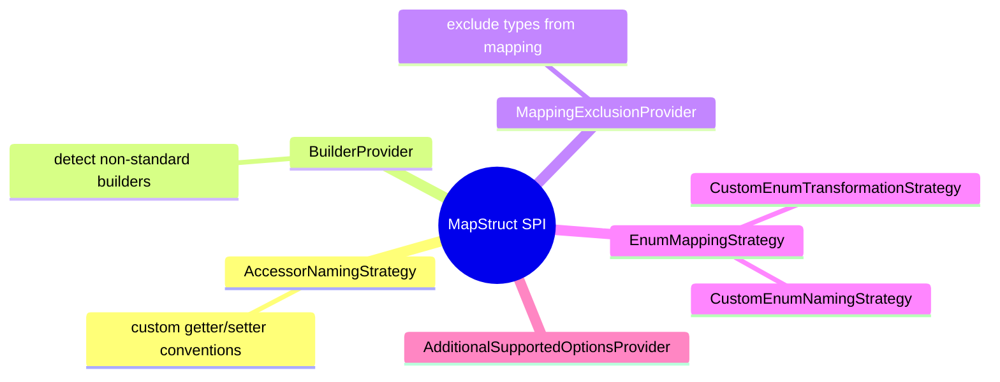

An SPI implementation is registered via `META-INF/services` and supplied on the annotation-processor path, so it influences generation globally.

### 14.4 Lombok integration

Lombok and MapStruct are both annotation processors; MapStruct must run **after** Lombok has generated accessors. Add `lombok-mapstruct-binding` and order the processors:

```xml
<annotationProcessorPaths>
    <path>
        <groupId>org.projectlombok</groupId>
        <artifactId>lombok</artifactId>
        <version>${lombok.version}</version>
    </path>
    <path>
        <groupId>org.projectlombok</groupId>
        <artifactId>lombok-mapstruct-binding</artifactId>
        <version>0.2.0</version>
    </path>
    <path>
        <groupId>org.mapstruct</groupId>
        <artifactId>mapstruct-processor</artifactId>
        <version>${org.mapstruct.version}</version>
    </path>
</annotationProcessorPaths>
```

`@AnnotateWith` lets generated mappers carry extra annotations; "non-shipped annotations" support (e.g. Spring/Jakarta `@Generated`-style) integrates with third-party APIs.

### 14.5 Real example: org-wide enum naming via SPI

**Scenario.** Internal enums are `UPPER_SNAKE`; a partner uses `lowerCamel`. Every enum mapper must translate.

**Problem.** Repeating `@ValueMapping` for naming across dozens of mappers is unmaintainable.

**Solution.** A `CustomEnumNamingStrategy`/`CustomEnumTransformationStrategy` registered via the SPI.

**Implementation.** Implement the strategy, register it in `META-INF/services`, add it to the processor path.

**Result.** All enum mappers translate names consistently with no per-mapper rules.

**Future improvements.** Add an `AccessorNamingStrategy` if the codebase uses non-JavaBean accessor names.

### 14.6 Production guidance (capstone)

- **Strictness:** `unmappedTargetPolicy=ERROR` everywhere; treat mapping completeness as a build invariant.
- **Reproducibility:** `suppressGeneratorTimestamp=true`; never commit generated sources.
- **Consistency:** one `@MapperConfig` for component model, injection, and policies; SPI strategies for conventions.
- **Testing:** unit-test mappers as plain beans (especially custom methods, conditions, value mappings, edge cases like null/empty and unknown enums).
- **Review:** read the generated `*Impl` for any non-trivial mapper during code review — it's the real behavior.
- **Performance:** mappers are stateless singletons; reuse them (DI or `Mappers` factory), don't recreate per call.

### 14.7 Exercises

1. Name three SPI strategies and what each customizes.
2. Why must Lombok run before MapStruct, and what binding helps?
3. What production option makes builds reproducible?

### 14.8 Challenges

- **Challenge.** Implement and register a `BuilderProvider` (or `AccessorNamingStrategy`) for a non-standard convention and confirm generation picks it up.

### 14.9 Checklist

- [ ] I know the main SPI extension points.
- [ ] I can configure Lombok + MapStruct ordering.
- [ ] I can add annotations to generated mappers.
- [ ] I apply the production checklist.

### 14.10 Best practices

- Encode conventions once via SPI rather than per-mapper annotations.
- Pin `lombok-mapstruct-binding` and keep processor order explicit.
- Test edge cases (null/empty/unknown-enum) — that's where mapping bugs hide.

### 14.11 Anti-patterns

- Fighting Lombok ordering with hacks instead of the binding.
- Re-implementing conventions in every mapper instead of an SPI strategy.
- Shipping mappers with no tests for their custom logic.

### 14.12 Troubleshooting

| Symptom | Cause | Action |
|---------|-------|--------|
| Lombok accessors not seen | Wrong processor order / missing binding | Order Lombok first; add `lombok-mapstruct-binding` |
| SPI not applied | Not registered/on processor path | Add `META-INF/services` entry and processor-path dependency |
| Extra annotation missing | `@AnnotateWith` not set | Add it to the mapper/method |

### 14.13 Official references

- Using the MapStruct SPI: https://mapstruct.org/documentation/stable/reference/html/#using-spi
- Custom Enum Naming Strategy: https://mapstruct.org/documentation/stable/reference/html/#custom-enum-naming-strategy
- Third-party API integration / Lombok: https://mapstruct.org/documentation/stable/reference/html/#lombok

---

> **End of book.** You now have the full MapStruct mental model: a **compile-time annotation processor** that generates reflection-free mappers (Part I); the **mechanics** of conversions, references, and target construction (Part II); **collections, maps, and enums** (Part III); the **advanced options** for defaults, null handling, conditions, polymorphism, and configuration reuse (Part IV); and **customization, error handling, and the SPI** for production-grade, fleet-wide mapping (Part V). The recurring theme is the same one that justifies MapStruct's existence: push every mapping decision to **build time**, where the compiler — not your users — finds the mistakes.
