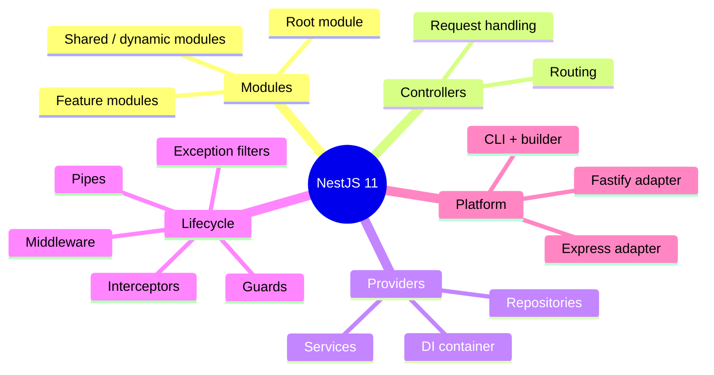
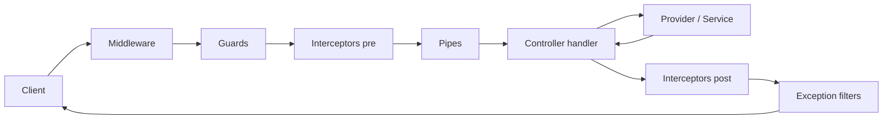
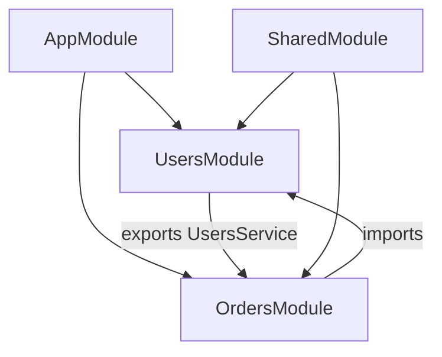
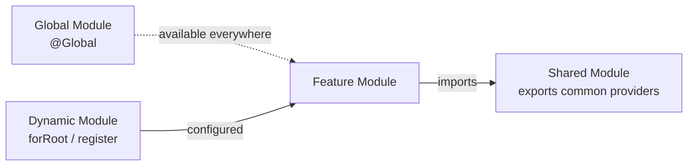
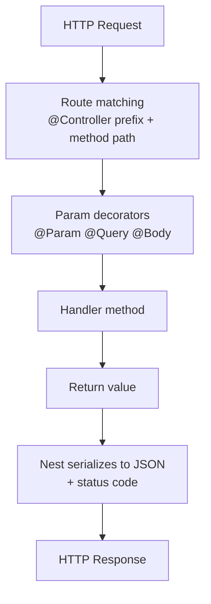
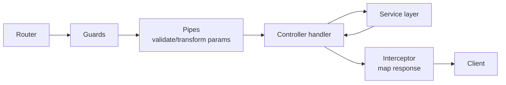

# NestJS 11 - Complete Professional Guide

> **Category:** 14_frameworks · **Language:** English

---

### Modules, Controllers, Providers, DI, Pipes/Guards/Interceptors, TypeORM/Prisma, Microservices
**Edition for NestJS 11 (TypeScript, Node.js)**

> **Reference book (English).** A professional, in-depth guide to building server-side applications with **NestJS 11**, for backend developers, architects, and teams adopting Nest for production APIs. Based primarily on the official NestJS documentation (https://docs.nestjs.com).
>
> **Scope notice:** this book teaches NestJS 11 as a complete platform — its modular architecture, dependency injection container, request lifecycle, data access, security, and distributed-systems primitives. It assumes working knowledge of TypeScript and Node.js. Each chapter follows the TO-BRAIN editorial standard (see `FILE_CONVENTIONS.md`).

---

## How to read this book

Progressive depth across five maturity levels:

| Level | Profile | Parts |
|-------|---------|-------|
| 1 — Beginner | New to Nest, knows TypeScript | Part I |
| 2 — Intermediate | Controllers, providers, validation | Parts II–III |
| 3 — Advanced | Lifecycle, persistence, auth | Parts IV–V |
| 4 — Specialist | OpenAPI, testing, GraphQL | Part VI |
| 5 — Enterprise | Microservices, WebSockets, performance, deployment | Parts VII–VIII |

**Target audience:** backend developers, full-stack engineers, software architects, tech leads, and CTOs building or scaling APIs with NestJS 11.

**Structure of each chapter:** Introduction · Business context · Theoretical concepts · Architecture · Diagrams (Mermaid) · Real examples · Step by step · Complete code · Exercises · Challenges · Checklist · Best practices · Anti-patterns · Troubleshooting · Official references.

**Example format:** Scenario · Problem · Solution · Implementation · Result · Future improvements.

> **Note on prerequisites.** This book assumes comfort with TypeScript (decorators, generics, async/await), the Node.js runtime, npm, and basic HTTP. Familiarity with Express or Fastify helps but is not required — Nest abstracts both.

---

## Table of Contents

**Part I – Foundations: Architecture & Building Blocks**
1. NestJS architecture, philosophy, and the CLI
2. Modules — organizing the application graph
3. Controllers and routing

**Part II – Providers & Dependency Injection**
4. Providers, services, and the DI container
5. Custom providers, scopes, and dynamic modules

**Part III – Validation & Request Shaping**
6. DTOs and validation (class-validator, class-transformer, ValidationPipe)
7. Pipes — transformation and validation
8. Configuration management (@nestjs/config)

**Part IV – Request Lifecycle: Cross-Cutting Concerns**
9. Guards and authorization context
10. Interceptors and the RxJS response stream
11. Exception filters and error handling
12. Middleware

**Part V – Persistence & Security**
13. Databases with TypeORM
14. Databases with Prisma
15. Authentication (Passport, JWT) and authorization (RBAC, CASL)

**Part VI – API Documentation, Testing & GraphQL**
16. OpenAPI / Swagger
17. Testing — unit and end-to-end
18. GraphQL (code-first and schema-first)

**Part VII – Distributed Systems**
19. Microservices and message patterns
20. WebSockets and gateways

**Part VIII – Performance & Production**
21. Caching and performance
22. Deployment and production hardening

> **Status of this edition:** phased delivery (each part keeps the same depth standard). **Ready:** Part I (Ch. 1–3). **In progress:** Parts II–VIII.

---

## Part I – Foundations: Architecture & Building Blocks

Part I gives you the mental model that makes everything else in NestJS click. Nest is an **opinionated, modular framework** built around dependency injection and a metadata-driven design. Once you understand how modules wire providers together, how controllers map HTTP to handlers, and how the CLI scaffolds it all, the rest of the framework reads as consistent variations on the same theme. This part establishes the architecture, the module system, and the controller layer.

---

## Chapter 1 — NestJS architecture, philosophy, and the CLI

### 1.1 Introduction

**NestJS** is a progressive Node.js framework for building efficient, scalable server-side applications. It is written in TypeScript, embraces and exposes the underlying HTTP platform (Express by default, Fastify optionally), and layers on a structured, Angular-inspired architecture: **modules**, **controllers**, and **providers** wired together by a built-in **dependency injection** container. NestJS 11 runs on modern Node.js and ships a powerful CLI that scaffolds and builds the project. This chapter establishes why Nest exists and how its pieces relate.

### 1.2 Business context

Teams reach for Nest when an Express codebase stops scaling — not in throughput, but in *maintainability*. Without structure, Node backends accumulate ad-hoc routers, manual wiring, and inconsistent error handling. Nest imposes a consistent architecture that lets a new engineer find any feature predictably, makes testing first-class through DI, and shares conventions across teams. The business payoff is **lower onboarding cost, fewer regressions, and a codebase that survives team turnover.**

### 1.3 Theoretical concepts: the building blocks

Nest's core abstractions are small in number but compose deeply.



- **Module** — a class annotated with `@Module()` that groups related controllers and providers.
- **Controller** — handles incoming requests and returns responses; maps routes to methods.
- **Provider** — anything injectable (services, repositories, factories) managed by the IoC container.
- **The IoC container** resolves dependencies declared in constructors automatically based on metadata.

### 1.4 Architecture: a request through Nest



The same lifecycle applies regardless of the HTTP platform — Nest's adapter abstraction keeps the programming model identical on Express and Fastify.

### 1.5 Real example

**Scenario.** A startup needs to stand up a new REST API and wants a clean, testable foundation from day one.

**Problem.** A bare Express app gives no structure; the team wants conventions, DI, and a build pipeline without assembling them by hand.

**Solution.** Scaffold with the Nest CLI and inspect the generated bootstrap and root module.

**Implementation:**

```bash
npm i -g @nestjs/cli
nest new billing-api
cd billing-api
nest generate module invoices
nest generate controller invoices
nest generate service invoices
npm run start:dev
```

```typescript
// src/main.ts
import { NestFactory } from '@nestjs/core';
import { AppModule } from './app.module';

async function bootstrap() {
  const app = await NestFactory.create(AppModule);
  app.setGlobalPrefix('api');
  await app.listen(process.env.PORT ?? 3000);
}
bootstrap();
```

```typescript
// src/app.module.ts
import { Module } from '@nestjs/common';
import { InvoicesModule } from './invoices/invoices.module';

@Module({
  imports: [InvoicesModule],
})
export class AppModule {}
```

**Result.** A running, hot-reloading API with a typed module graph, a global `/api` prefix, and CLI-generated feature scaffolding ready to fill in.

**Future improvements.** Add `@nestjs/config` for environment handling (Chapter 8) and a global `ValidationPipe` (Chapter 6).

### 1.6 Exercises

1. Scaffold a new project with `nest new` and list the files the CLI generates.
2. Explain the role of `NestFactory.create()` in `main.ts`.
3. Name the three core building blocks and one responsibility of each.

### 1.7 Challenges

- **Challenge.** Switch the application from the Express adapter to the Fastify adapter and confirm the controllers run unchanged.

### 1.8 Checklist

- [ ] I can scaffold a project with the Nest CLI.
- [ ] I understand the roles of module, controller, and provider.
- [ ] I can trace a request through the Nest lifecycle.
- [ ] I know Nest supports both Express and Fastify adapters.

### 1.9 Best practices

- Use the CLI generators — they keep file structure and naming consistent across the team.
- Keep `main.ts` thin; push configuration into modules and providers.
- Treat each feature as a module from the start, even if it is small.

### 1.10 Anti-patterns

- Bypassing DI by instantiating services with `new` inside controllers.
- Putting business logic directly in `main.ts` or in controllers.
- Mixing unrelated features into a single "god" module.

### 1.11 Troubleshooting

| Symptom | Likely cause | Action |
|---------|--------------|--------|
| `Cannot find module` on start | Build artifacts stale | Run `npm run build` or restart `start:dev` |
| Decorators not recognized | `experimentalDecorators` off | Enable it and `emitDecoratorMetadata` in tsconfig |
| Port already in use | Another process on the port | Change `PORT` or stop the conflicting process |
| Routes return 404 | Controller not declared in a module | Add the controller to its module's `controllers` array |

### 1.12 Official references

- Introduction: https://docs.nestjs.com/
- First steps: https://docs.nestjs.com/first-steps
- CLI overview: https://docs.nestjs.com/cli/overview
- Platform (Fastify): https://docs.nestjs.com/techniques/performance

---

## Chapter 2 — Modules: organizing the application graph

### 2.1 Introduction

A **module** is a class decorated with `@Module()` and is the fundamental unit of organization in Nest. Every application has at least one **root module**, and a well-structured app is a tree of **feature modules** that encapsulate a domain. Modules declare what they provide, what they expose to others, and what they consume. This chapter covers the module metadata, encapsulation rules, and how modules share providers.

### 2.2 Business context

Module boundaries are the architecture. They decide which parts of the system can depend on which, enforcing separation that keeps a growing codebase comprehensible. Clear module boundaries let teams own features independently, enable lazy-loading in microservice splits later, and make the "blast radius" of a change visible. Poorly drawn boundaries, by contrast, produce hidden coupling that surfaces only when something breaks.

### 2.3 Theoretical concepts: module metadata and encapsulation

The `@Module()` decorator accepts four properties:

- **`controllers`** — the controllers instantiated by this module.
- **`providers`** — providers available for injection within this module.
- **`imports`** — other modules whose exported providers this module needs.
- **`exports`** — the subset of this module's providers made visible to importers.

Nest modules are **encapsulated**: a provider is private to its module unless explicitly exported. To use `UsersService` elsewhere, `UsersModule` must export it and the consuming module must import `UsersModule`.



### 2.4 Architecture: shared, global, and dynamic modules



A **shared module** exports reusable providers. A **global module** (`@Global()`) registers providers once for the whole app. A **dynamic module** is configured at import time via static methods like `forRoot()` or `register()`, returning a module definition.

### 2.5 Real example

**Scenario.** Both `OrdersModule` and `InvoicesModule` need to read users.

**Problem.** `UsersService` lives in `UsersModule` and is private by default — importing it directly causes a "Nest can't resolve dependencies" error.

**Solution.** Export `UsersService` from `UsersModule` and import that module where needed.

**Implementation:**

```typescript
// src/users/users.module.ts
import { Module } from '@nestjs/common';
import { UsersService } from './users.service';

@Module({
  providers: [UsersService],
  exports: [UsersService], // make it visible to importers
})
export class UsersModule {}
```

```typescript
// src/orders/orders.module.ts
import { Module } from '@nestjs/common';
import { UsersModule } from '../users/users.module';
import { OrdersController } from './orders.controller';
import { OrdersService } from './orders.service';

@Module({
  imports: [UsersModule], // gain access to exported UsersService
  controllers: [OrdersController],
  providers: [OrdersService],
})
export class OrdersModule {}
```

```typescript
// src/orders/orders.service.ts
import { Injectable } from '@nestjs/common';
import { UsersService } from '../users/users.service';

@Injectable()
export class OrdersService {
  constructor(private readonly users: UsersService) {}
}
```

**Result.** `OrdersService` injects `UsersService` cleanly, while the dependency stays explicit at the module level.

**Future improvements.** Extract cross-cutting utilities (logging, config) into a `@Global()` core module to avoid repeating imports.

### 2.6 Exercises

1. Explain why a provider must be exported to be used in another module.
2. Describe the difference between a shared module and a global module.
3. What does a dynamic module's `forRoot()` method return?

### 2.7 Challenges

- **Challenge.** Convert a configuration module into a dynamic module that accepts options via `register(options)` and exposes them as an injectable token.

### 2.8 Checklist

- [ ] I can list the four `@Module()` properties.
- [ ] I understand module encapsulation and the role of `exports`.
- [ ] I can build a shared module of reusable providers.
- [ ] I know when to use `@Global()` and when to avoid it.

### 2.9 Best practices

- Draw module boundaries around domains, not technical layers.
- Export only what consumers genuinely need; keep the rest private.
- Reserve `@Global()` for truly cross-cutting concerns (config, logging).

### 2.10 Anti-patterns

- Marking many modules `@Global()` to "avoid imports" — it hides the dependency graph.
- Circular module imports created by careless cross-feature coupling.
- One giant module holding the entire application.

### 2.11 Troubleshooting

| Symptom | Likely cause | Action |
|---------|--------------|--------|
| "Nest can't resolve dependencies" | Provider not exported/imported | Export it and import the owning module |
| Circular dependency error | Two modules import each other | Use `forwardRef()` or refactor the boundary |
| Provider is undefined at runtime | Not listed in `providers` | Add it to the module's `providers` array |
| Duplicate instances | Provider declared in multiple modules | Declare once and export, or make it global |

### 2.12 Official references

- Modules: https://docs.nestjs.com/modules
- Dynamic modules: https://docs.nestjs.com/fundamentals/dynamic-modules
- Circular dependency: https://docs.nestjs.com/fundamentals/circular-dependency

---

## Chapter 3 — Controllers and routing

### 3.1 Introduction

**Controllers** are responsible for handling incoming requests and returning responses to the client. A controller is a class annotated with `@Controller()`; its methods become **route handlers** through HTTP-method decorators such as `@Get()`, `@Post()`, `@Put()`, `@Patch()`, and `@Delete()`. Nest also provides parameter decorators (`@Param()`, `@Query()`, `@Body()`, `@Headers()`) so handlers receive typed, framework-agnostic inputs. This chapter covers routing, parameters, status codes, and response shaping.

### 3.2 Business context

Controllers are the contract between your API and its consumers. Consistent routing conventions, predictable status codes, and clean separation between transport (HTTP) and domain logic make an API easy to document, version, and evolve. When controllers stay thin — delegating to providers — the business logic remains testable and reusable across HTTP, GraphQL, or microservice transports.

### 3.3 Theoretical concepts: routing and parameters

A route path combines the controller prefix with the method decorator's path. Parameter decorators extract data from the request without touching the raw `req`/`res` objects, keeping handlers platform-agnostic.



By default, Nest returns HTTP **200** (or **201** for `@Post()`) and serializes the handler's return value to JSON. `@HttpCode()` overrides the status; `@Header()` sets response headers.

### 3.4 Architecture: controller in the lifecycle



### 3.5 Real example

**Scenario.** Build a REST resource for tasks with list, fetch-by-id, and create endpoints.

**Problem.** The team wants typed parameters, a proper 201 on create, and no leakage of Express request objects into business code.

**Solution.** Use method and parameter decorators, delegate to a service, and let Nest handle serialization.

**Implementation:**

```typescript
// src/tasks/tasks.controller.ts
import {
  Controller, Get, Post, Body, Param, Query,
  ParseIntPipe, HttpCode,
} from '@nestjs/common';
import { TasksService } from './tasks.service';
import { CreateTaskDto } from './dto/create-task.dto';

@Controller('tasks')
export class TasksController {
  constructor(private readonly tasks: TasksService) {}

  @Get()
  findAll(@Query('status') status?: string) {
    return this.tasks.findAll(status);
  }

  @Get(':id')
  findOne(@Param('id', ParseIntPipe) id: number) {
    return this.tasks.findOne(id);
  }

  @Post()
  @HttpCode(201)
  create(@Body() dto: CreateTaskDto) {
    return this.tasks.create(dto);
  }
}
```

```typescript
// src/tasks/tasks.service.ts
import { Injectable, NotFoundException } from '@nestjs/common';
import { CreateTaskDto } from './dto/create-task.dto';

@Injectable()
export class TasksService {
  private tasks = [{ id: 1, title: 'Write docs', status: 'open' }];

  findAll(status?: string) {
    return status ? this.tasks.filter(t => t.status === status) : this.tasks;
  }

  findOne(id: number) {
    const task = this.tasks.find(t => t.id === id);
    if (!task) throw new NotFoundException(`Task ${id} not found`);
    return task;
  }

  create(dto: CreateTaskDto) {
    const task = { id: this.tasks.length + 1, status: 'open', ...dto };
    this.tasks.push(task);
    return task;
  }
}
```

**Result.** Clean REST endpoints with `id` parsed to a number, a 404 thrown via Nest's exception system, and a 201 on creation — all without touching `req`/`res`.

**Future improvements.** Add a `CreateTaskDto` with `class-validator` rules and a global `ValidationPipe` (Chapter 6).

### 3.6 Exercises

1. Write a controller with `@Get(':id')` that parses the id as a number.
2. Override the default status code for a creation endpoint to 202.
3. Extract a query parameter and use it to filter results.

### 3.7 Challenges

- **Challenge.** Add a `@Patch(':id')` endpoint and a `@Delete(':id')` endpoint that returns 204 No Content, keeping the controller thin.

### 3.8 Checklist

- [ ] I can map routes with HTTP-method decorators.
- [ ] I can extract params, query, and body with decorators.
- [ ] I can control status codes with `@HttpCode()`.
- [ ] I keep controllers thin and delegate to services.

### 3.9 Best practices

- Keep controllers free of business logic; they orchestrate, services decide.
- Use `ParseIntPipe` and friends to validate route params at the boundary.
- Return plain objects/entities and let Nest serialize them.

### 3.10 Anti-patterns

- Injecting `@Req()`/`@Res()` and writing to the raw response unnecessarily, which disables Nest's response handling.
- Embedding database queries directly in controllers.
- Inconsistent route naming that breaks REST conventions.

### 3.11 Troubleshooting

| Symptom | Likely cause | Action |
|---------|--------------|--------|
| Handler returns but client hangs | Used `@Res()` without sending a response | Send via `res` or remove `@Res()` |
| `:id` arrives as a string | No parsing pipe applied | Add `ParseIntPipe` to the `@Param()` |
| 404 for an existing route | Wrong controller prefix/path combo | Verify `@Controller()` prefix and method path |
| Body is empty | Missing body parser / wrong content type | Send JSON with `Content-Type: application/json` |

### 3.12 Official references

- Controllers: https://docs.nestjs.com/controllers
- Built-in pipes: https://docs.nestjs.com/pipes#built-in-pipes
- Exception handling: https://docs.nestjs.com/exception-filters

---

> **End of Part I.** You now have the architectural foundation of NestJS 11 — the CLI and request lifecycle, the module system that organizes the application graph, and the controller layer that maps HTTP to handlers. Parts II–VIII build on this base: providers and dependency injection, validation, the cross-cutting lifecycle (guards, interceptors, filters, middleware), persistence with TypeORM and Prisma, authentication and authorization, OpenAPI, testing, GraphQL, microservices, WebSockets, caching, and production deployment.

<!--APPEND-PARTE-II-->
