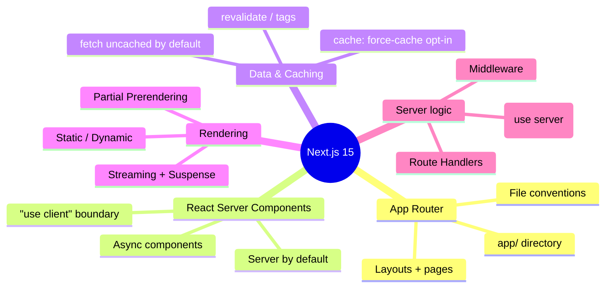
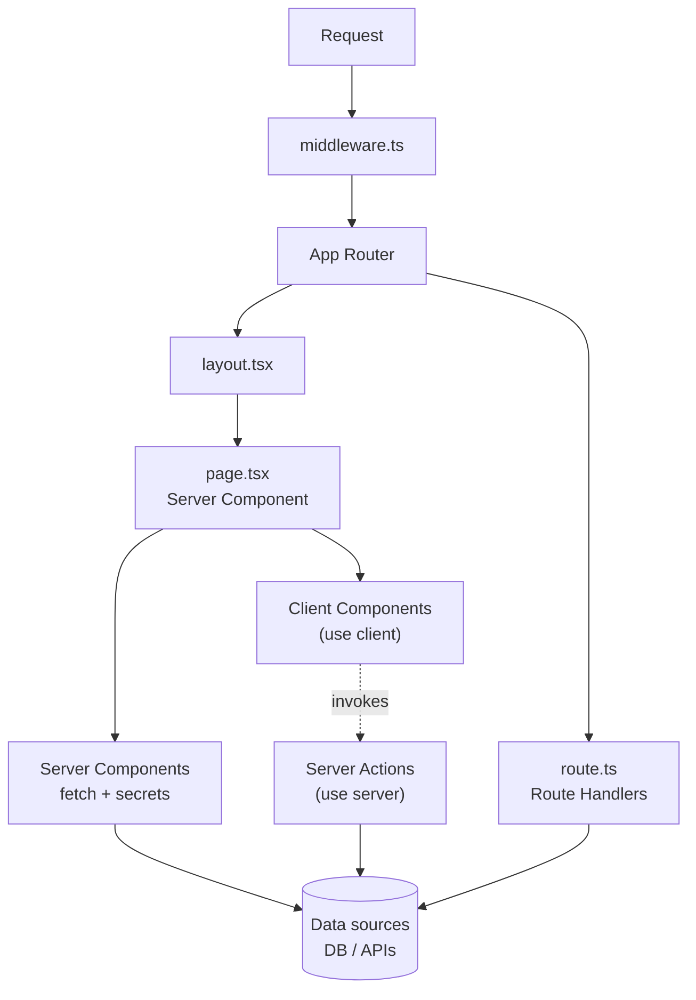
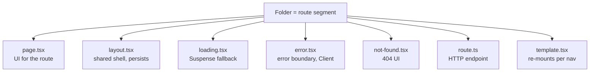
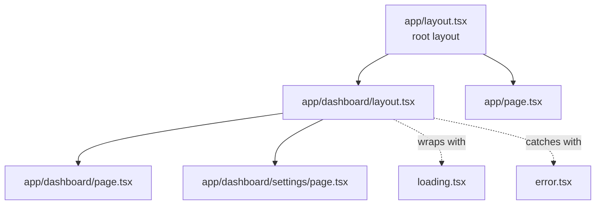
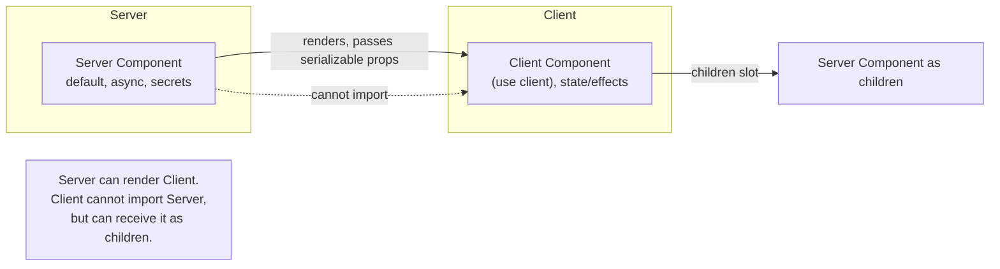
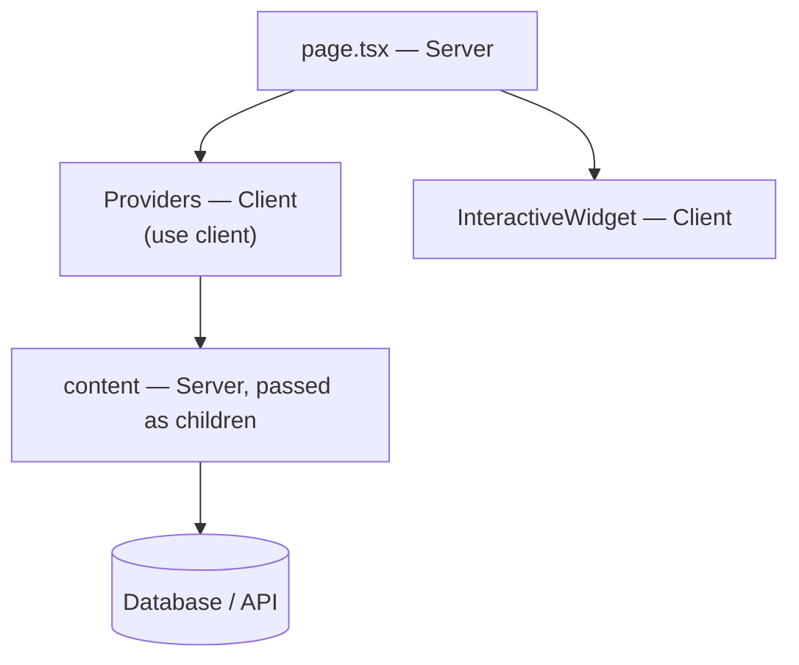

# Next.js 15 - Complete Professional Guide

> **Category:** 14_frameworks · **Language:** English

---

### App Router, React Server Components, Server Actions, Rendering & Caching, Routing, Deployment
**Edition for Next.js 15 (App Router, React 19)**

> **Reference book (English).** A professional, in-depth guide to building production applications with **Next.js 15** and the **App Router**, for full-stack developers, frontend engineers, architects, and teams. Based primarily on the official Next.js documentation (nextjs.org).
>
> **Scope notice:** this edition targets the **App Router** as the primary, recommended model (the `app/` directory), the **React Server Components** architecture, and the **caching changes introduced in Next.js 15** — most notably that `fetch` requests and `GET` Route Handlers are **no longer cached by default**. Each chapter follows the TO-BRAIN editorial standard (see `FILE_CONVENTIONS.md`).

---

## How to read this book

Progressive depth across five maturity levels:

| Level | Profile | Parts |
|-------|---------|-------|
| 1 — Beginner | New to the App Router | Part I |
| 2 — Intermediate | Components, data, caching | Parts II–III |
| 3 — Advanced | Mutations, rendering, streaming | Parts IV–V |
| 4 — Specialist | Routing internals, middleware, SEO | Parts VI–VII |
| 5 — Enterprise | Auth, testing, performance, deployment | Part VIII |

**Target audience:** full-stack and frontend developers, React engineers moving to the App Router, software architects, tech leads, and CTOs adopting or standardizing on Next.js 15.

**Structure of each chapter:** Introduction · Business context · Theoretical concepts · Architecture · Diagrams (Mermaid) · Real examples · Step by step · Complete code · Exercises · Challenges · Checklist · Best practices · Anti-patterns · Troubleshooting · Official references.

**Example format:** Scenario · Problem · Solution · Implementation · Result · Future improvements.

> **Note on prerequisites.** This book assumes working knowledge of modern JavaScript/TypeScript, React fundamentals (components, props, hooks), and basic HTTP. Where a Next.js 15 feature builds on a React 19 capability (Server Components, `async`/`await` in components, Actions, `useActionState`), we link the lineage.

---

## Table of Contents

**Part I – The App Router Foundations**
1. Next.js 15 and the App Router — the big picture
2. File conventions and the `app/` directory (layouts, pages, special files)
3. Server vs Client Components — the rendering model

**Part II – Routing & Navigation**
4. Pages, nested routes, and dynamic segments (`[id]`, `[...slug]`, route groups)
5. Linking, navigation, `useRouter`, and loading/error UI
6. Parallel and intercepting routes

**Part III – Data Fetching & Caching**
7. Fetching data in Server Components (`async`/`await`, `fetch`)
8. The Next.js 15 caching model (uncached defaults, `cache`, `revalidate`, `unstable_cache`)
9. Revalidation: time-based, on-demand (`revalidatePath`, `revalidateTag`)

**Part IV – Server Actions & Mutations**
10. Server Actions fundamentals (`"use server"`, forms, `useActionState`)
11. Mutations, optimistic UI (`useOptimistic`), and cache revalidation
12. Validation, security, and error handling for Actions

**Part V – Rendering Strategies**
13. Static, dynamic, and the `dynamic`/`revalidate` route segment config
14. Streaming with Suspense and `loading.tsx`
15. Partial Prerendering (PPR) and the rendering decision tree

**Part VI – Route Handlers & Middleware**
16. Route Handlers (`route.ts`, methods, caching, streaming)
17. Middleware (`middleware.ts`, matchers, redirects, rewrites)

**Part VII – Styling, Assets, Metadata & SEO**
18. Styling (CSS Modules, Tailwind, global styles)
19. Images and fonts (`next/image`, `next/font`)
20. Metadata, the Metadata API, sitemaps, and SEO

**Part VIII – Auth, Testing, Performance & Deployment**
21. Authentication and authorization patterns
22. Testing (unit, component, end-to-end)
23. Performance and production best practices
24. Deployment (Vercel, Node server, Docker, output modes)

> **Status of this edition:** phased delivery (each part keeps the same depth standard). **Ready:** Part I (Ch. 1–3). **In progress:** Parts II–VIII.

---

## Part I – The App Router Foundations

Part I gives you the mental model for Next.js 15. The App Router is a **server-first** framework built on **React Server Components**: components render on the server by default, you `await` data directly inside them, and you opt into client interactivity explicitly with `"use client"`. Equally important, Next.js 15 changed several **caching defaults** — `fetch` and `GET` Route Handlers are no longer cached unless you ask. Understanding the component boundary and the new caching defaults is the difference between a fast, correct app and one that ships stale data or leaks server code to the browser.

---

## Chapter 1 — Next.js 15 and the App Router — the big picture

### 1.1 Introduction

Next.js is a React framework for building full-stack web applications. **Version 15** consolidates the **App Router** (the `app/` directory) as the recommended architecture and aligns with **React 19**. The defining idea is that your UI is composed of **Server Components by default** — they run on the server, can be `async`, and can read data, files, and secrets directly — with **Client Components** (marked `"use client"`) reserved for interactivity. Next.js 15 also made a deliberate shift to **uncached-by-default** behavior for `fetch` and `GET` Route Handlers, putting correctness ahead of implicit caching. This chapter is the executive overview — the map you'll use for the rest of the book.

### 1.2 Business context

For engineering leaders, adopting Next.js 15 answers three questions: *how fast can we ship, how fast will the product feel, and what does it cost to operate?* The server-first model reduces client JavaScript (faster loads, better Core Web Vitals), lets teams co-locate data fetching with UI (less API glue), and supports incremental rendering so users see content sooner. The caching change in v15 trades a small amount of explicit configuration for **predictable freshness** — fewer "why is production showing old data?" incidents. The strategic read: Next.js 15 lowers the cost of building fast, SEO-friendly, full-stack React apps while making data freshness an explicit, reviewable decision.

### 1.3 Theoretical concepts: the pillars of Next.js 15



The unifying direction: **render on the server, fetch where you render, and make caching and interactivity explicit**. Everything else in the book is an elaboration of these pillars.

### 1.4 Architecture: where each concern lives



The App Router orchestrates layouts and pages; Server Components own data access; Client Components own interactivity and call back into the server via Server Actions; Route Handlers expose HTTP endpoints; Middleware runs at the edge of every matched request.

### 1.5 Real example

**Scenario.** A team is starting a new marketing + dashboard product and wants a minimal but idiomatic Next.js 15 App Router skeleton: a root layout, a server-rendered home page that fetches data, and one interactive widget.

**Problem.** They are coming from the Pages Router and a SPA mindset, so they tend to make everything a Client Component and fetch data in `useEffect`, shipping too much JavaScript and losing SEO.

**Solution.** Keep the page a Server Component, `await` data directly, and isolate only the interactive piece behind `"use client"`.

**Implementation.**

```tsx
// app/layout.tsx — Server Component (root layout, required)
import type { ReactNode } from "react";

export const metadata = {
  title: "Acme",
  description: "Acme product site",
};

export default function RootLayout({ children }: { children: ReactNode }) {
  return (
    <html lang="en">
      <body>{children}</body>
    </html>
  );
}
```

```tsx
// app/page.tsx — Server Component, async, fetches on the server
import { Counter } from "./counter";

type Stats = { users: number };

export default async function HomePage() {
  // In Next.js 15 this fetch is NOT cached by default.
  const res = await fetch("https://api.example.com/stats", {
    // Opt into caching explicitly when the data is stable:
    cache: "force-cache",
    next: { revalidate: 3600 }, // and refresh hourly
  });
  const stats: Stats = await res.json();

  return (
    <main>
      <h1>Acme</h1>
      <p>{stats.users} happy users</p>
      <Counter />
    </main>
  );
}
```

```tsx
// app/counter.tsx — the only Client Component
"use client";

import { useState } from "react";

export function Counter() {
  const [n, setN] = useState(0);
  return <button onClick={() => setN((v) => v + 1)}>Clicked {n}×</button>;
}
```

**Result.** The page is server-rendered with data already present (great for SEO and first paint). Only the tiny `Counter` ships as client JavaScript. The freshness policy is explicit and visible in code review.

**Future improvements.** Move the API call behind a typed data-access function, add `loading.tsx` for streaming, and replace the public API with a Server Action when writes are introduced.

### 1.6 Exercises

1. Name the three pillars of Next.js 15 covered in 1.3 and give one example API for each.
2. In the example, which file ships JavaScript to the browser, and why only that one?
3. State the Next.js 15 default caching behavior for a bare `fetch()` in a Server Component.

### 1.7 Challenges

- **Challenge.** Take an existing SPA page that fetches in `useEffect` and redesign it as a Server Component page with an isolated Client Component. Quantify the reduction in client JavaScript.

### 1.8 Checklist

- [ ] I can explain why Server Components are the default in the App Router.
- [ ] I know that `fetch` is uncached by default in Next.js 15.
- [ ] I can identify which file in a feature should carry `"use client"`.
- [ ] I understand how layouts, pages, Actions, and Route Handlers relate.

### 1.9 Best practices

- Default to Server Components; reach for `"use client"` only where you need state, effects, or browser APIs.
- Fetch data where you render it (in the Server Component) instead of in client effects.
- Make caching an explicit, reviewed decision rather than relying on implicit behavior.

### 1.10 Anti-patterns

- Marking the top of every file `"use client"` and rebuilding a SPA inside the App Router.
- Fetching data in `useEffect` when a Server Component could `await` it.
- Assuming `fetch` is cached "like Next 14" — in v15 it is not, unless you opt in.

### 1.11 Troubleshooting

| Symptom | Likely cause | Action |
|---------|--------------|--------|
| `useState`/`useEffect` throws "only works in Client Component" | Hook used in a Server Component | Add `"use client"` to that component file |
| Data looks stale | `fetch` was given `cache: "force-cache"` without revalidation | Add `next: { revalidate }` or use `revalidateTag` |
| Data refetches on every request unexpectedly | v15 uncached default | Opt into caching with `cache`/`revalidate` if appropriate |
| Server secret appears in the browser bundle | Secret read inside a Client Component | Move the read into a Server Component or Server Action |

### 1.12 Official references

- Next.js Documentation: https://nextjs.org/docs
- App Router introduction: https://nextjs.org/docs/app
- Server and Client Components: https://nextjs.org/docs/app/building-your-application/rendering/server-components
- Caching in Next.js: https://nextjs.org/docs/app/building-your-application/caching

---

## Chapter 2 — File conventions and the `app/` directory

### 2.1 Introduction

The App Router is **file-system based**: folders define URL segments, and a set of **special files** (`layout`, `page`, `loading`, `error`, `not-found`, `route`, `template`, `default`) define the UI and behavior for each segment. This convention is the backbone of routing, nested layouts, and streaming. This chapter maps every special file to what it does and when it runs.

### 2.2 Business context

Conventions reduce decision cost. When every team member knows that `page.tsx` is the route's UI, `layout.tsx` is the shared shell, `loading.tsx` is the streaming fallback, and `error.tsx` is the recovery boundary, onboarding is faster and code reviews are more consistent. For organizations, the file convention is effectively a **shared architecture**, encoded by the framework — fewer bespoke routing libraries, fewer ways to get it wrong.

### 2.3 Theoretical concepts: the special files



Key rules: a route is publicly accessible only when the segment has a `page` or `route`. Layouts **nest** and **persist** across navigation (their state is preserved); templates create a fresh instance on each navigation. `error.tsx` must be a Client Component because it uses React error boundaries.

### 2.4 Architecture: nested layouts and segment composition



The rendered tree composes outer layouts around inner segments: the root layout wraps the dashboard layout, which wraps the dashboard page. Each level can contribute its own `loading` and `error` boundaries.

### 2.5 Real example

**Scenario.** A SaaS app needs a dashboard area with a persistent sidebar, a default dashboard page, a nested settings page, plus streaming and error handling for the section.

**Problem.** The sidebar should not re-render or lose scroll position when navigating between dashboard sub-pages, and a failing data call in one sub-page should not blank the whole app.

**Solution.** Use a section `layout.tsx` for the persistent sidebar, `loading.tsx` for streaming, and a scoped `error.tsx` so failures are contained to the dashboard.

**Implementation.**

```tsx
// app/dashboard/layout.tsx — persists across dashboard navigations
import Link from "next/link";
import type { ReactNode } from "react";

export default function DashboardLayout({ children }: { children: ReactNode }) {
  return (
    <div className="dashboard">
      <aside>
        <nav>
          <Link href="/dashboard">Overview</Link>
          <Link href="/dashboard/settings">Settings</Link>
        </nav>
      </aside>
      <section>{children}</section>
    </div>
  );
}
```

```tsx
// app/dashboard/loading.tsx — instant streaming fallback
export default function Loading() {
  return <p>Loading dashboard…</p>;
}
```

```tsx
// app/dashboard/error.tsx — scoped recovery (must be a Client Component)
"use client";

export default function Error({
  error,
  reset,
}: {
  error: Error & { digest?: string };
  reset: () => void;
}) {
  return (
    <div role="alert">
      <p>Could not load the dashboard.</p>
      <button onClick={reset}>Try again</button>
    </div>
  );
}
```

```tsx
// app/dashboard/settings/page.tsx — nested page
export default function SettingsPage() {
  return <h2>Settings</h2>;
}
```

**Result.** The sidebar stays mounted while navigating, sub-pages stream with a fallback, and a failure in settings is contained by the dashboard `error.tsx` instead of crashing the whole app.

**Future improvements.** Add a `not-found.tsx` for invalid dashboard sub-routes, and a `template.tsx` if a per-navigation enter animation is required.

### 2.6 Exercises

1. Which special file makes a segment publicly routable as a page versus as an HTTP endpoint?
2. Why must `error.tsx` be a Client Component?
3. What is the behavioral difference between `layout.tsx` and `template.tsx` across navigation?

### 2.7 Challenges

- **Challenge.** Design the `app/` tree for a blog with a public area and an authenticated admin area that share branding but have different layouts and different error boundaries.

### 2.8 Checklist

- [ ] I can list the App Router special files and their roles.
- [ ] I know layouts persist and templates remount.
- [ ] I know a segment needs `page` or `route` to be reachable.
- [ ] I can place `loading.tsx` and `error.tsx` to scope streaming and recovery.

### 2.9 Best practices

- Put truly shared UI (nav, providers) in the nearest appropriate `layout.tsx`, not in every page.
- Add `loading.tsx` where data fetching makes a segment slow, so users get instant feedback.
- Scope `error.tsx` close to the risk so failures stay contained.

### 2.10 Anti-patterns

- Duplicating the same header/sidebar across pages instead of using a layout.
- Putting a global `error.tsx` only at the root, so any sub-page failure blanks the app.
- Using a `template.tsx` everywhere and losing the state-preservation benefit of layouts.

### 2.11 Troubleshooting

| Symptom | Likely cause | Action |
|---------|--------------|--------|
| URL returns 404 although the folder exists | No `page.tsx`/`route.ts` in the segment | Add a `page` or `route` file |
| Layout state resets on navigation | Used `template.tsx` instead of `layout.tsx` | Switch to a layout if persistence is desired |
| `error.tsx` build error | Missing `"use client"` directive | Add `"use client"` at the top |
| Loading fallback never shows | No async work to suspend on | Ensure the page actually awaits data |

### 2.12 Official references

- Project structure and file conventions: https://nextjs.org/docs/app/getting-started/project-structure
- Layouts and pages: https://nextjs.org/docs/app/building-your-application/routing/layouts-and-templates
- `loading.js`: https://nextjs.org/docs/app/api-reference/file-conventions/loading
- `error.js`: https://nextjs.org/docs/app/api-reference/file-conventions/error

---

## Chapter 3 — Server vs Client Components — the rendering model

### 3.1 Introduction

The single most important concept in the App Router is the **boundary between Server and Client Components**. Server Components (the default) render on the server, never ship their code to the browser, and can directly access data, the filesystem, and secrets. Client Components, marked with the `"use client"` directive, run in the browser and can use state, effects, event handlers, and browser APIs. This chapter explains how the boundary works and how to compose across it.

### 3.2 Business context

The boundary is a performance and security lever. Keeping logic on the server shrinks the client bundle (faster, cheaper, better Core Web Vitals) and keeps secrets and heavy dependencies off the wire. Misplacing the boundary is one of the most common causes of bloated bundles and accidental secret exposure. For teams, understanding the boundary is the highest-leverage skill in Next.js 15 — it directly affects both the bill (bandwidth, compute) and the risk (data leakage).

### 3.3 Theoretical concepts: the boundary



The crucial rules: a Server Component can render a Client Component and pass **serializable** props to it. A Client Component cannot *import* a Server Component, but it **can render one passed as `children`** — this "Server Component as a slot" pattern keeps server work on the server while wrapping it in client interactivity.

### 3.4 Architecture: composition across the boundary



A common pattern: a thin Client Component (e.g., a theme/query provider) wraps server-rendered `children`. The provider is interactive; the children remain Server Components that still touch the database — the boundary stays optimal.

### 3.5 Real example

**Scenario.** A product page must read product data from the database (server-only) and also offer an interactive "add to cart" button that updates local UI state.

**Problem.** Putting the whole page behind `"use client"` would pull the database client into the browser bundle (a leak and a bloat). Putting everything on the server loses interactivity.

**Solution.** Keep the page and data access as Server Components; isolate the interactive button as a Client Component receiving only serializable props.

**Implementation.**

```tsx
// lib/products.ts — server-only data access
import "server-only"; // build error if imported into client code

export async function getProduct(id: string) {
  // Imagine a DB call here, using server secrets.
  return { id, name: "Widget", price: 29.0 };
}
```

```tsx
// app/product/[id]/page.tsx — Server Component
import { getProduct } from "@/lib/products";
import { AddToCart } from "./add-to-cart";

export default async function ProductPage({
  params,
}: {
  params: Promise<{ id: string }>;
}) {
  const { id } = await params; // params is async in Next.js 15
  const product = await getProduct(id);

  return (
    <article>
      <h1>{product.name}</h1>
      <p>${product.price.toFixed(2)}</p>
      {/* Pass only serializable props across the boundary */}
      <AddToCart productId={product.id} />
    </article>
  );
}
```

```tsx
// app/product/[id]/add-to-cart.tsx — Client Component
"use client";

import { useState } from "react";

export function AddToCart({ productId }: { productId: string }) {
  const [added, setAdded] = useState(false);
  return (
    <button onClick={() => setAdded(true)}>
      {added ? "Added ✓" : `Add ${productId} to cart`}
    </button>
  );
}
```

**Result.** The database client never reaches the browser (enforced by `server-only`), the page is server-rendered for SEO and speed, and only the small button ships as client JavaScript. Note `params` is awaited — a Next.js 15 change where dynamic params and `searchParams` are async.

**Future improvements.** Replace the local-only button with a Server Action that persists the cart and revalidates the cart badge (Part IV).

### 3.6 Exercises

1. Can a Client Component import and render a Server Component directly? What is the supported alternative?
2. What kind of props can cross from a Server Component to a Client Component?
3. What does the `server-only` package protect against, and how?

### 3.7 Challenges

- **Challenge.** Refactor a fully client-side page so that data access and rendering happen on the server, leaving only genuinely interactive leaves as Client Components. Measure the bundle delta.

### 3.8 Checklist

- [ ] I know Server Components are the default and Client Components need `"use client"`.
- [ ] I can pass server-rendered `children` into a Client Component wrapper.
- [ ] I only pass serializable props across the boundary.
- [ ] I `await` `params` and `searchParams` (async in Next.js 15).

### 3.9 Best practices

- Push the `"use client"` boundary as far down the tree as possible (interactive leaves only).
- Use `server-only` / `client-only` packages to make the boundary explicit and enforced.
- Use the "Server Component as children" pattern to wrap server content in client providers.

### 3.10 Anti-patterns

- Adding `"use client"` to a layout or page just to use one small interactive child.
- Passing non-serializable values (functions, class instances) as props to Client Components.
- Importing database/server modules into Client Components.

### 3.11 Troubleshooting

| Symptom | Cause | Action |
|---------|-------|--------|
| "You're importing a component that needs `useState`…" | Hook in a Server Component | Move it into a `"use client"` component |
| "Functions cannot be passed directly to Client Components" | Non-serializable prop | Pass data instead, or wire via a Server Action |
| `params is a Promise` / type errors on params | v15 async params | `await params` / `await searchParams` |
| Server secret bundled to client | Server module imported in client | Add `import "server-only"` and relocate the import |

### 3.12 Official references

- Server Components: https://nextjs.org/docs/app/building-your-application/rendering/server-components
- Client Components: https://nextjs.org/docs/app/building-your-application/rendering/client-components
- Composition patterns: https://nextjs.org/docs/app/building-your-application/rendering/composition-patterns
- Next.js 15 (async params): https://nextjs.org/blog/next-15

---

> **End of Part I.** You now have the strategic map of Next.js 15 (server-first, App Router, explicit caching), a complete tour of the `app/` directory file conventions (layouts, pages, loading, error, route), and a precise model of the Server/Client Component boundary. **Part II — Routing & Navigation** (Chapters 4–6) covers nested and dynamic routes, navigation and loading/error UI, and the advanced parallel and intercepting route patterns.

<!--APPEND-PARTE-II-->
