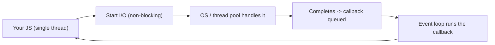
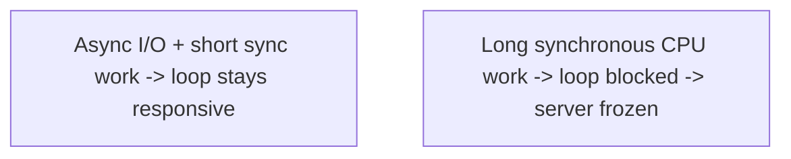
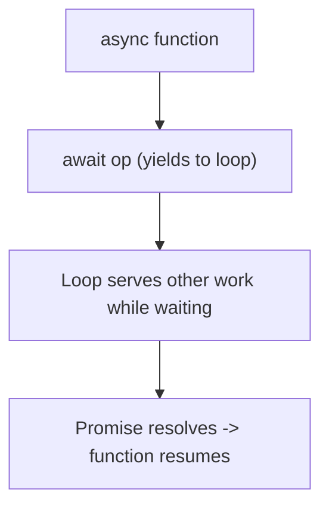

# Node.js 24 - Complete Professional Guide

> **Category:** 14_frameworks · **Language:** English

---

### The event loop, async I/O, and the module system
**Original guide written from first principles, current to 2026 (Node.js 24 LTS)**

> **Original reference book (English).** This is an **independent, originally written** guide. It is not an extract, summary, or paraphrase of any third-party book; it teaches Node.js from first principles with original examples. Canonical books are listed under **References** as pointers only. Each chapter follows the TO-BRAIN editorial standard (see `FILE_CONVENTIONS.md`).
>
> **Scope notice:** Node.js runs JavaScript on the server with a single-threaded, non-blocking, event-driven model. This guide covers the event loop, asynchronous I/O, and modules — the core mental model — current to 2026 (Node 24 LTS, ESM, built-in test runner, fetch).

---

## How to read this guide

| Level | Profile | Parts |
|-------|---------|-------|
| 1 — Beginner | New to Node | Part I |
| 2 — Intermediate | Building services | Part II |

**Target audience:** JavaScript developers moving to server-side Node.js.

**Structure of each chapter:** Introduction · Business context · Theoretical concepts · Architecture · Diagrams (Mermaid) · Real examples · Step by step · Complete examples · Exercises · Challenges · Checklist · Best practices · Anti-patterns · Troubleshooting · References.

> **Note on prerequisites.** Assumes JavaScript fundamentals (functions, promises, async/await).

---

## Table of Contents

**Part I – The model**
1. The event loop and non-blocking I/O
2. Asynchronous patterns: callbacks, promises, async/await

**Part II – Building**
3. Modules (ESM), packages, and the standard library

> **Status of this guide:** phased delivery. **Ready:** Part I (Ch. 1–2). **In progress:** Part II.

---

## Part I – The model

Node.js confuses developers from threaded backgrounds because it does a lot with **one thread**. The trick is the **event loop**: instead of blocking a thread per request, Node starts I/O operations and continues, handling results via callbacks when they're ready. Understanding this single-threaded, non-blocking model explains Node's strengths (high concurrency for I/O) and its pitfalls (don't block the loop).

---

## Chapter 1 — The event loop and non-blocking I/O

### 1.1 Introduction

Node.js runs your JavaScript on a **single thread** with an **event loop**. When you start an I/O operation (read a file, query a DB, call an API), Node hands it off (to the OS / a thread pool) and **doesn't wait** — it continues executing other code. When the I/O completes, its callback is queued and run by the event loop. This **non-blocking** model lets one thread handle thousands of concurrent connections.

### 1.2 Business context

Web workloads are mostly **I/O-bound** (waiting on databases, APIs, disk), not CPU-bound. Node's non-blocking model handles huge numbers of concurrent I/O operations efficiently with minimal memory (no thread-per-request), making it cost-effective for APIs, real-time apps, and microservices. Understanding the model is essential to use this strength — and to avoid the cardinal sin of **blocking the event loop**, which freezes the whole server.

### 1.3 Theoretical concepts: one loop, offloaded I/O



The event loop processes queued callbacks one at a time. Because I/O is offloaded, the single thread stays free to start more work. The danger: **CPU-heavy synchronous code** (a tight loop, big synchronous JSON parse) **blocks** the loop — no other callback runs until it finishes, stalling every connection. Keep work on the main thread short and non-blocking.

### 1.4 Architecture: don't block the loop



### 1.5 Real example

**Scenario.** An endpoint reads a file and returns its contents.

**Problem.** Using the **synchronous** file read blocks the event loop — while reading, the server can't handle any other request.

**Solution.** Use the **asynchronous** API so the loop stays free during the read.

**Implementation.**

```js
import { readFile } from 'node:fs/promises';

// BLOCKING: readFileSync would freeze the loop for every other request
// NON-BLOCKING: await yields; the loop serves other requests during the read
app.get('/file', async (req, res) => {
  const data = await readFile('./big.txt', 'utf8');   // async I/O, loop stays free
  res.type('text/plain').send(data);
});
```

**Result.** The server handles many concurrent requests because the read doesn't block the single thread; the loop serves others while I/O is in flight. Throughput stays high.

**Future improvements.** For genuine CPU-heavy work, offload to a **worker thread** so it doesn't block the loop.

### 1.6 Exercises

1. How does Node handle concurrency with one thread?
2. What does "non-blocking I/O" mean?
3. What happens if you run long synchronous CPU code?

### 1.7 Challenges

- **Challenge.** Write an endpoint two ways (sync vs async file read). Under concurrent load, observe how the sync version stalls all requests.

### 1.8 Checklist

- [ ] I understand the single-threaded event loop.
- [ ] I use non-blocking (async) I/O.
- [ ] I never run long synchronous CPU work on the main thread.
- [ ] I offload CPU-heavy work to worker threads.

### 1.9 Best practices

- Prefer async I/O APIs; avoid `*Sync` in request paths.
- Keep main-thread work short.
- Offload CPU-bound tasks to worker threads.

### 1.10 Anti-patterns

- Synchronous file/crypto/JSON work in request handlers.
- Tight CPU loops on the main thread.
- Assuming Node parallelizes synchronous code.

### 1.11 Troubleshooting

| Symptom | Likely cause | Action |
|---------|--------------|--------|
| Server freezes under load | Event loop blocked | Remove sync/CPU work; use async/workers |
| One slow request stalls all | Blocking call | Use non-blocking I/O |
| High latency on CPU tasks | CPU work on main thread | Offload to worker threads |

### 1.12 References

- Node.js docs, "The event loop": https://nodejs.org/en/learn/asynchronous-work/event-loop-timers-and-nexttick.
- Node.js 24 release notes: https://nodejs.org/en/blog/.

---

## Chapter 2 — Asynchronous patterns

### 2.1 Introduction

Because I/O is non-blocking, Node code is **asynchronous** — results arrive later. Three styles evolved: **callbacks** (the original), **promises**, and **async/await** (the modern default, built on promises). Async/await lets you write asynchronous code that reads like synchronous code, while still not blocking the loop. Mastering it (and error handling within it) is essential.

### 2.2 Business context

Poor async handling is the top source of Node bugs: unhandled promise rejections crash processes, "callback hell" makes code unmaintainable, and missing `await` causes race conditions. Using async/await with proper error handling produces readable, correct async code — directly affecting reliability and developer velocity. As of 2026, async/await is the standard; legacy callback patterns are a maintenance liability.

### 2.3 Theoretical concepts: from callbacks to async/await


`await` pauses the **async function** (not the event loop) until a promise resolves, then continues. Errors are handled with normal `try/catch`. Run independent async operations concurrently with `Promise.all`. The key insight: `await` yields control back to the loop, so awaiting doesn't block other work.

### 2.4 Architecture: await yields, doesn't block



### 2.5 Real example

**Scenario.** An endpoint needs data from two independent APIs.

**Problem.** Awaiting them one after another is needlessly slow (serial); forgetting error handling crashes the process on failure.

**Solution.** Run them concurrently with `Promise.all` and handle errors with `try/catch`.

**Implementation.**

```js
app.get('/dashboard', async (req, res, next) => {
  try {
    // concurrent (not serial) — both requests in flight at once
    const [user, orders] = await Promise.all([
      fetch(`/api/users/${req.params.id}`).then(r => r.json()),
      fetch(`/api/orders?user=${req.params.id}`).then(r => r.json()),
    ]);
    res.json({ user, orders });
  } catch (err) {
    next(err);   // proper error handling -> no unhandled rejection / crash
  }
});
```

**Result.** Both API calls run concurrently (faster than serial awaits), and any failure is caught and handled instead of crashing the process. Readable, correct, non-blocking.

**Future improvements.** Add timeouts/`AbortController` to the fetches so a hung upstream can't stall the request (ties to the stability-patterns guide).

### 2.6 Exercises

1. What does `await` pause — the loop or the function?
2. How do you run two async operations concurrently?
3. How do you handle errors in async/await?

### 2.7 Challenges

- **Challenge.** Take serial `await`s for independent operations and parallelize them with `Promise.all`. Measure the latency difference.

### 2.8 Checklist

- [ ] I use async/await as the default.
- [ ] I handle errors with try/catch.
- [ ] I parallelize independent ops with `Promise.all`.
- [ ] No unhandled promise rejections.

### 2.9 Best practices

- Prefer async/await over raw callbacks/chains.
- Always handle rejections (try/catch or error middleware).
- Parallelize independent awaits.

### 2.10 Anti-patterns

- Callback hell / deeply nested callbacks.
- Serial awaits for independent operations.
- Unhandled promise rejections.

### 2.11 Troubleshooting

| Symptom | Likely cause | Action |
|---------|--------------|--------|
| Process crashes on async error | Unhandled rejection | Wrap in try/catch; add error handling |
| Endpoint slow | Serial awaits | Use `Promise.all` for independent ops |
| Race conditions | Missing `await` | Await all dependent async calls |

### 2.12 References

- MDN, "Asynchronous JavaScript": https://developer.mozilla.org/en-US/docs/Learn/JavaScript/Asynchronous.
- Node.js docs, "Asynchronous flow control": https://nodejs.org/en/learn/.

---

> **End of Part I.** You can now reason about Node.js via its core model: a single-threaded **event loop** with **non-blocking I/O** that handles high concurrency (never block the loop with synchronous CPU work — offload to workers), and the modern **async/await** pattern that reads like synchronous code while yielding to the loop, with proper error handling and `Promise.all` for concurrency. **Part II — Building** (Chapter 3) covers the ES module system (ESM), the npm package ecosystem, and Node 24's built-in standard library (test runner, fetch, etc.) for building real services.

<!--APPEND-PART-II-->
