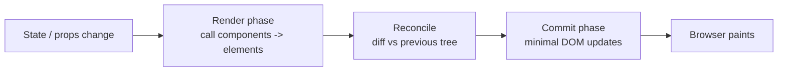
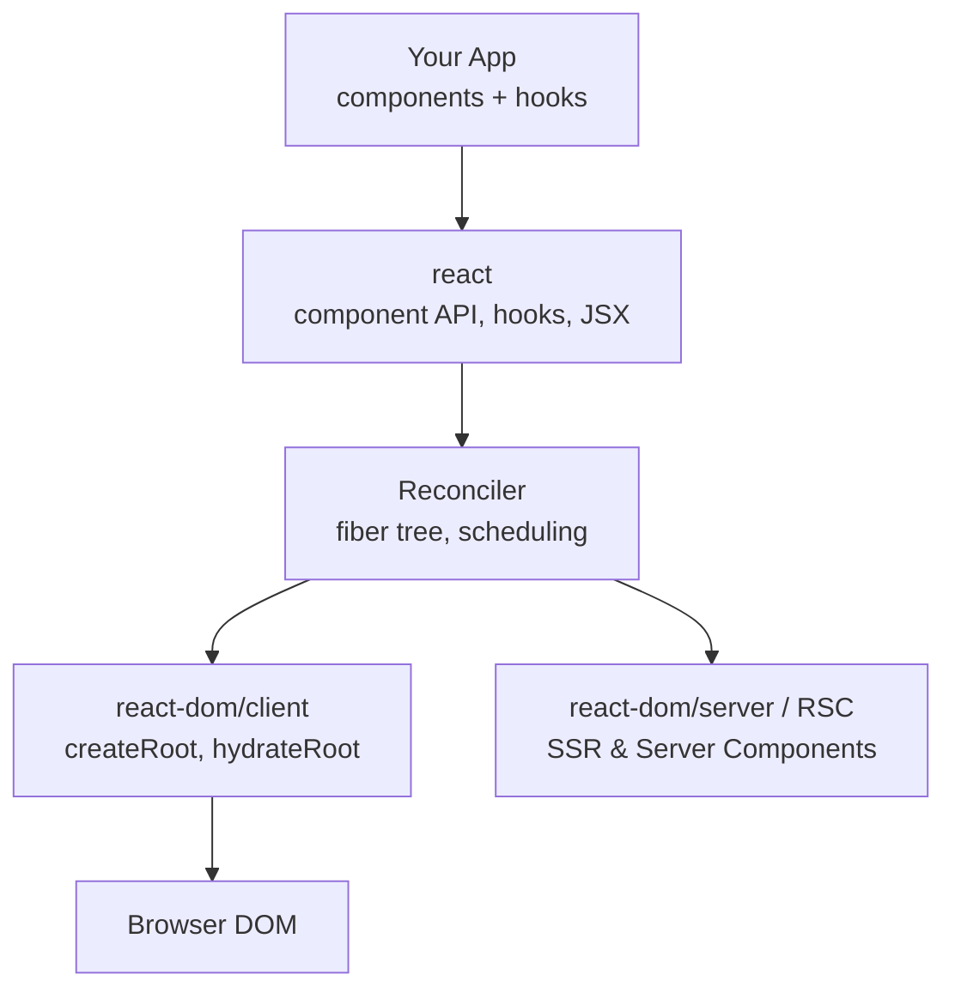
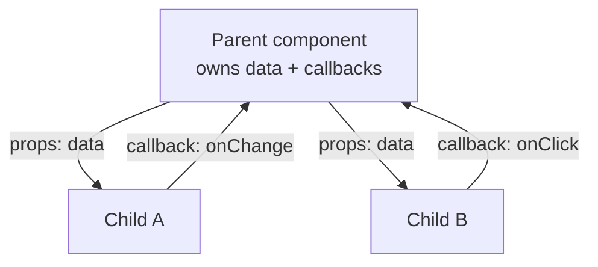
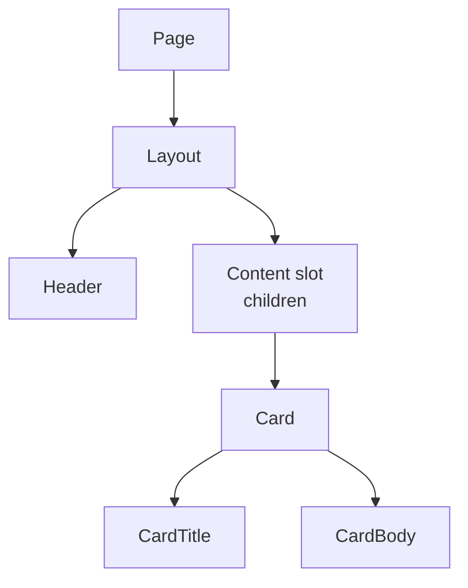
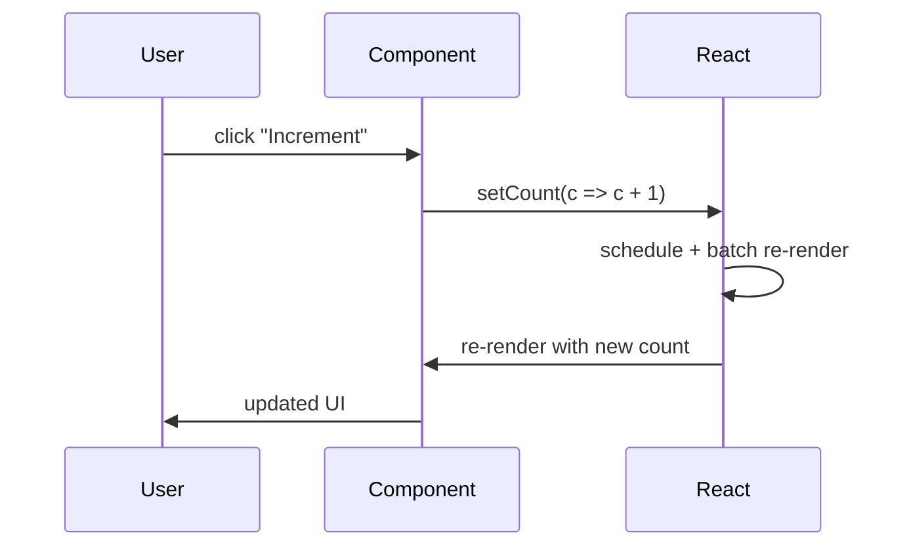
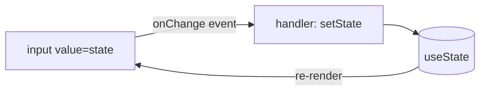

# React 19 - Complete Professional Guide

> **Category:** 14_frameworks · **Language:** English

---

### Components, Hooks, Server Components, Actions, the `use` API, Suspense, and Concurrent rendering
**Edition for React 19 (stable)**

> **Reference book (English).** A professional, in-depth guide based on the official React documentation (https://react.dev). It covers React from its fundamentals (JSX, components, props, state) through the reactive hooks model, and into the React 19 feature set: Actions, the new form hooks (`useActionState`, `useFormStatus`, `useOptimistic`), the `use` API, Server Components and Server Functions, Suspense, and concurrent rendering.
>
> **Scope notice:** this is an **original** reference written from public, official sources; it reproduces no copyrighted book text. Each chapter follows the TO-BRAIN editorial standard (see `FILE_CONVENTIONS.md`).

---

## How to read this book

Progressive depth across five maturity levels:

| Level | Profile | Parts |
|-------|---------|-------|
| 1 — Beginner | New to React / JSX | Part I |
| 2 — Intermediate | State & effects with hooks | Parts II–III |
| 3 — Advanced | React 19 hooks, Actions & forms | Parts IV–V |
| 4 — Specialist | Server Components, Suspense, concurrency | Parts VI–VII |
| 5 — Enterprise | Performance, testing, ecosystem, production | Part VIII |

**Target audience:** front-end developers, full-stack and Java/TypeScript engineers, software architects, tech leads, and CTOs adopting or deepening React 19.

**Structure of each chapter:** Introduction · Business context · Theoretical concepts · Architecture · Diagrams (Mermaid) · Real examples · Step by step · Complete code · Exercises · Challenges · Checklist · Best practices · Anti-patterns · Troubleshooting · Official references.

**Example format:** Scenario · Problem · Solution · Implementation · Result · Future improvements.

> **Note on prerequisites.** This book assumes working knowledge of modern JavaScript (ES2020+), the DOM, and basic TypeScript. React 19 code is written exclusively with **function components and hooks** — class components are mentioned only for historical context.

---

## Table of Contents

**Part I – Fundamentals**
1. React and the component model (JSX, rendering, the virtual DOM)
2. Components and props (composition, children, conditional & list rendering)
3. State and events (`useState`, event handling, controlled inputs)

**Part II – Core Hooks**
4. Side effects with `useEffect` and refs with `useRef`
5. Sharing state: `useContext` and `useReducer`
6. Memoization: `useMemo`, `useCallback`, and `React.memo`

**Part III – Patterns & Reuse**
7. Custom hooks and composition patterns
8. Lifting state, derived state, and data flow

**Part IV – React 19 Hooks & Actions**
9. Actions and form submission with `useActionState`
10. `useFormStatus` and `useOptimistic`
11. The `use` API (reading promises and context)

**Part V – Forms & Data Mutations**
12. Forms in React 19 (`<form action>`, Server Functions, progressive enhancement)

**Part VI – Server Components**
13. React Server Components and Server Functions
14. Streaming, `'use client'`, and `'use server'` boundaries

**Part VII – Suspense & Concurrency**
15. Suspense for data fetching and code splitting
16. Concurrent features (`useTransition`, `useDeferredValue`, document metadata)

**Part VIII – Performance, Testing & Production**
17. Performance: profiling, memoization strategy, the React Compiler
18. Testing (React Testing Library, user-event, Suspense/Actions)
19. Ecosystem: routing and data fetching (frameworks, React Router, TanStack Query)
20. Production: builds, error boundaries, monitoring, accessibility

> **Status of this edition:** phased delivery (each part keeps the same depth standard). **Ready:** Part I (Ch. 1–3). **In progress:** Parts II–VIII.

---

# Part I – Fundamentals

Part I builds the mental model every React developer needs: React describes UI as a function of state, renders it through a reconciler, and lets you compose small components into screens. We start with JSX and rendering (Chapter 1), move to components and props (Chapter 2), and finish with interactive state and events (Chapter 3). Everything is written in React 19 idioms — function components, hooks, and the modern `createRoot` API — so the foundation you learn here carries straight into the advanced parts.

---

## Chapter 1 — React and the component model

### 1.1 Introduction

React is a JavaScript library for building user interfaces from **components**: independent, reusable pieces of UI. Its central idea is **declarative rendering** — you describe *what* the UI should look like for a given state, and React figures out *how* to update the DOM efficiently. React 19 keeps this model intact while adding Actions, Server Components, and a richer concurrent runtime. This chapter introduces JSX, the render cycle, and the reconciliation that makes declarative UI fast.

### 1.2 Business context

For an engineering organization, React's value is **predictable, composable UI at scale**. Because a component is a pure function of its props and state, large teams can divide a screen into independently owned, independently testable units. The vast ecosystem (routing, data fetching, design systems) and the deep hiring pool reduce delivery risk. React 19's additions — Actions and Server Components — push more work to the server and cut client boilerplate, lowering both bundle size and long-term maintenance cost.

### 1.3 Theoretical concepts: render → reconcile → commit

A React render is a three-phase pipeline. During **render**, React calls your components to produce a tree of elements (the description of the UI). During **reconciliation**, it diffs the new tree against the previous one. During **commit**, it applies the minimal set of DOM mutations.



Key consequences: components must be **pure** during render (no side effects, no DOM access), and React may render more than once before committing. JSX such as `<h1 className="title">{name}</h1>` compiles to `React.createElement` (or the automatic JSX runtime), which produces plain element objects — not DOM nodes.

### 1.4 Architecture: where React sits



`react` defines the component model and hooks; the **reconciler** schedules and diffs work; a **renderer** (`react-dom/client` for the browser) commits the result. The same component code can run through different renderers, which is how SSR and React Native reuse your components.

### 1.5 Real example

**Scenario.** A team is bootstrapping a new single-page app and needs the canonical React 19 entry point.

**Problem.** Older tutorials use `ReactDOM.render`, which was removed; the team needs the current root API plus a first component.

**Solution.** Use `createRoot` from `react-dom/client` and render a function component written in TSX.

**Implementation:**

```tsx
// main.tsx
import { StrictMode } from 'react';
import { createRoot } from 'react-dom/client';
import App from './App';

const container = document.getElementById('root');
if (!container) throw new Error('Root element #root not found');

createRoot(container).render(
  <StrictMode>
    <App />
  </StrictMode>
);
```

```tsx
// App.tsx
type GreetingProps = { name: string };

function Greeting({ name }: GreetingProps) {
  return <h1 className="greeting">Hello, {name}!</h1>;
}

export default function App() {
  const user = 'Ada';
  return (
    <main>
      <Greeting name={user} />
      <p>Welcome to React 19.</p>
    </main>
  );
}
```

**Result.** A working app mounted at `#root`, with `StrictMode` enabled so React surfaces side-effect and purity issues during development.

**Future improvements.** Add a router (Part VII/VIII), enable the React Compiler for automatic memoization (Chapter 17), and adopt a framework with Server Components support (Part VI).

### 1.6 Exercises

1. Explain, in your own words, the difference between the render phase and the commit phase.
2. What does JSX compile to, and why is that an object rather than a DOM node?
3. Why must components be pure during rendering?

### 1.7 Challenges

- **Challenge.** Render a list of three `Greeting` components from an array of names using `.map`, giving each a stable `key`, and explain why keys matter to reconciliation.

### 1.8 Checklist

- [ ] I can describe the render → reconcile → commit pipeline.
- [ ] I use `createRoot` (not the removed `ReactDOM.render`).
- [ ] I wrap the tree in `StrictMode` during development.
- [ ] I understand JSX produces element objects, not DOM nodes.

### 1.9 Best practices

- Keep components pure: no fetching, subscriptions, or DOM mutation during render.
- Always provide stable `key` props when rendering lists.
- Enable `StrictMode` in development to catch impure effects early.

### 1.10 Anti-patterns

- Mutating props or state objects directly instead of producing new values.
- Performing side effects (logging to a server, writing to `document`) in the render body.
- Using array indexes as keys for lists that reorder or change length.

### 1.11 Troubleshooting

| Symptom | Likely cause | Action |
|---------|--------------|--------|
| `ReactDOM.render is not a function` | Using removed API | Switch to `createRoot` from `react-dom/client` |
| "Each child in a list should have a unique key" | Missing/duplicate `key` | Give each item a stable, unique key |
| Effects run twice in dev | `StrictMode` double-invokes to surface bugs | Make effects idempotent and clean up properly |
| Blank screen, no errors | Root element not found / not mounted | Verify `#root` exists before `createRoot` |

### 1.12 Official references

- Describing the UI: https://react.dev/learn/describing-the-ui
- Writing markup with JSX: https://react.dev/learn/writing-markup-with-jsx
- `createRoot`: https://react.dev/reference/react-dom/client/createRoot
- Render and commit: https://react.dev/learn/render-and-commit

---

## Chapter 2 — Components and props

### 2.1 Introduction

Components are the units of reuse in React, and **props** are how data flows into them. Props are read-only inputs passed from parent to child; a component never mutates its own props. This chapter covers composition (components rendering other components), the special `children` prop, and the two most common rendering patterns — conditional rendering and list rendering.

### 2.2 Business context

Composition is what lets product teams move fast without stepping on each other. A well-factored component library — buttons, cards, layouts — turns new features into assembly rather than reinvention. Clear prop contracts (ideally typed with TypeScript) act as living documentation and catch integration bugs at compile time, reducing QA cost and onboarding time for new engineers.

### 2.3 Theoretical concepts: unidirectional data flow

Data in React flows **down** the tree via props; events flow **up** via callbacks. A child cannot change a parent's data directly — it calls a function the parent passed down. This one-way flow makes UIs predictable: to understand why something renders, you trace props from the owner.



The `children` prop enables **slot-style composition**: a layout or card component renders `{children}` without knowing what it contains, so any markup can be nested inside it.

### 2.4 Architecture: ownership and the component tree



Each node owns the props of its direct children. Ownership (who renders a component) is distinct from DOM nesting; understanding ownership is the key to predicting where state should live (Chapter 8).

### 2.5 Real example

**Scenario.** A dashboard needs a reusable `Card` that wraps arbitrary content, plus a `UserList` that renders users with conditional empty-state handling.

**Problem.** The team keeps copy-pasting card markup and ad-hoc empty checks, causing inconsistency.

**Solution.** Build a `Card` that uses `children` for slot composition and a `UserList` that demonstrates conditional + list rendering with stable keys.

**Implementation:**

```tsx
import type { ReactNode } from 'react';

type CardProps = { title: string; children: ReactNode };

function Card({ title, children }: CardProps) {
  return (
    <section className="card">
      <h2 className="card__title">{title}</h2>
      <div className="card__body">{children}</div>
    </section>
  );
}

type User = { id: string; name: string; active: boolean };

function UserList({ users }: { users: User[] }) {
  if (users.length === 0) {
    return <p>No users yet.</p>;
  }
  return (
    <ul>
      {users.map((user) => (
        <li key={user.id}>
          {user.name} {user.active && <span aria-label="active">●</span>}
        </li>
      ))}
    </ul>
  );
}

export function Dashboard({ users }: { users: User[] }) {
  return (
    <Card title="Team">
      <UserList users={users} />
    </Card>
  );
}
```

**Result.** One `Card` consumed everywhere via `children`, consistent empty-state handling, and a typed prop contract that fails the build if misused.

**Future improvements.** Extract a generic `<List>` with a render prop, and add Storybook stories for each component variant.

### 2.6 Exercises

1. Add an optional `footer?: ReactNode` prop to `Card` and render it only when provided.
2. Rewrite the active indicator to use a ternary instead of `&&`. When does `&&` render an unwanted `0`?
3. Explain why `key` belongs on the outermost element returned inside `.map`.

### 2.7 Challenges

- **Challenge.** Build a `<Tabs>` component using composition (`<Tabs>`, `<Tab>`) so the parent controls the active tab while children declare their labels — without prop-drilling the active index into every tab.

### 2.8 Checklist

- [ ] My components treat props as read-only.
- [ ] I use the `children` prop for slot-style composition.
- [ ] Conditional rendering avoids accidental falsy output (`0`, `''`).
- [ ] Lists use stable, unique keys derived from data, not indexes.

### 2.9 Best practices

- Type every component's props (interface/type) to make contracts explicit.
- Prefer composition (`children`, slots) over deep prop drilling.
- Keep components small and single-purpose; extract when they grow.

### 2.10 Anti-patterns

- Mutating a prop or pushing into a prop array.
- Using `&&` with a numeric left operand (`count && <X/>` renders `0`).
- Passing huge "god objects" as props instead of the specific fields needed.

### 2.11 Troubleshooting

| Symptom | Cause | Action |
|---------|-------|--------|
| A literal `0` appears in the UI | `count && <X/>` with `count === 0` | Use `count > 0 && <X/>` or a ternary |
| Child can't update parent data | Trying to mutate props | Pass a callback from parent; lift state up |
| List items lose input/focus on reorder | Index keys | Use stable IDs as keys |
| TypeScript error on `children` | Missing `ReactNode` type | Type `children` as `ReactNode` |

### 2.12 Official references

- Passing props to a component: https://react.dev/learn/passing-props-to-a-component
- Conditional rendering: https://react.dev/learn/conditional-rendering
- Rendering lists: https://react.dev/learn/rendering-lists
- Passing JSX as children: https://react.dev/learn/passing-props-to-a-component#passing-jsx-as-children

---

## Chapter 3 — State and events

### 3.1 Introduction

State is data a component remembers between renders. In React 19 you declare it with the **`useState`** hook, and you change it by calling the setter — never by mutating the variable. Combined with event handlers (`onClick`, `onChange`, `onSubmit`), state turns static markup into an interactive UI. This chapter covers `useState`, event handling, controlled inputs, and the crucial idea that **state updates trigger re-renders**.

### 3.2 Business context

Interactivity is where most product value and most bugs live. A disciplined state model — minimal state, derived values computed rather than stored, immutable updates — directly reduces defect rates in forms, carts, and editors, which are the highest-traffic surfaces in most applications. Getting `useState` right is the foundation every later React 19 feature (Actions, optimistic UI) builds on.

### 3.3 Theoretical concepts: state as a snapshot

Each render sees a **snapshot** of state. Calling a setter does not change the current render's variable; it asks React to re-render with a new value. For updates that depend on the previous value, pass an **updater function** so React applies them correctly even when batched.



React **batches** multiple state updates triggered in the same event into a single re-render. State updates are also **asynchronous from the handler's perspective**: reading the state variable right after calling the setter still shows the old value.

### 3.4 Architecture: controlled inputs and event flow



A **controlled input** derives its `value` from state and updates state on every `onChange`, making React the single source of truth. This pattern generalizes to every form field and is the basis for validation and the Action-based forms in Part V.

### 3.5 Real example

**Scenario.** A signup screen needs a counter (demonstrating updater functions) and a controlled email field with inline validation.

**Problem.** A naive `setCount(count + 1)` called twice in one handler only increments once, and an uncontrolled input makes validation impossible.

**Solution.** Use the functional updater for the counter and a controlled input for email, computing validity as **derived state** rather than storing it.

**Implementation:**

```tsx
import { useState } from 'react';

export function SignupForm() {
  const [count, setCount] = useState(0);
  const [email, setEmail] = useState('');

  // Derived state: compute, don't store.
  const isValidEmail = /^[^@\s]+@[^@\s]+\.[^@\s]+$/.test(email);

  function addTwice() {
    // Functional updater applies both increments correctly.
    setCount((c) => c + 1);
    setCount((c) => c + 1);
  }

  return (
    <form>
      <button type="button" onClick={addTwice}>
        Clicked {count} times
      </button>

      <label>
        Email
        <input
          type="email"
          value={email}
          onChange={(e) => setEmail(e.target.value)}
          aria-invalid={email !== '' && !isValidEmail}
        />
      </label>

      {email !== '' && !isValidEmail && (
        <p role="alert">Please enter a valid email.</p>
      )}

      <button type="submit" disabled={!isValidEmail}>
        Sign up
      </button>
    </form>
  );
}
```

**Result.** The counter increments by two per click thanks to functional updates, and the email field validates live without storing redundant `isValid` state.

**Future improvements.** Replace manual submission with a React 19 **Action** and `useActionState` (Chapter 9), and add pending UI with `useFormStatus` (Chapter 10).

### 3.6 Exercises

1. Change `addTwice` to `setCount(count + 1); setCount(count + 1);` (no updater). Explain why it only adds one.
2. Add a "password" field and disable submit until both fields are valid.
3. Convert `isValidEmail` to stored state and explain why that's worse.

### 3.7 Challenges

- **Challenge.** Build a multi-field form whose object state is updated immutably (`setForm(f => ({ ...f, name: value }))`) and add a "reset" button that restores the initial object.

### 3.8 Checklist

- [ ] I update state with setters, never by mutation.
- [ ] I use functional updaters when the next value depends on the previous.
- [ ] I compute derived values during render instead of storing them.
- [ ] My form inputs are controlled (value from state, onChange updates state).

### 3.9 Best practices

- Keep state minimal; derive everything you can during render.
- Use functional updaters for counters, toggles, and batched updates.
- Update objects/arrays immutably with spreads or `structuredClone`.

### 3.10 Anti-patterns

- Storing values you can compute (e.g., `fullName` from `first` + `last`).
- Reading state immediately after `setState` and expecting the new value.
- Mutating arrays/objects in state (`arr.push(x)`) then calling the setter with the same reference.

### 3.11 Troubleshooting

| Symptom | Cause | Action |
|---------|-------|--------|
| Counter only increments by 1 | `setX(x+1)` twice with stale snapshot | Use `setX(x => x + 1)` |
| Input is read-only / won't type | `value` set without `onChange` | Add an `onChange` that updates state |
| UI doesn't update after change | Mutated state in place | Create a new array/object reference |
| Logged state is "one behind" | State is a per-render snapshot | Read the new value in the next render or from the updater |

### 3.12 Official references

- State: a component's memory: https://react.dev/learn/state-a-components-memory
- `useState`: https://react.dev/reference/react/useState
- Responding to events: https://react.dev/learn/responding-to-events
- Updating objects in state: https://react.dev/learn/updating-objects-in-state

---

> **End of Part I.** You now have the React 19 foundation: the render → reconcile → commit model and JSX (Chapter 1), components and unidirectional props with composition (Chapter 2), and interactive state and events with `useState` (Chapter 3). **Part II — Core Hooks** (Chapters 4–6) goes deeper into the hook system: side effects and refs (`useEffect`, `useRef`), shared state (`useContext`, `useReducer`), and memoization (`useMemo`, `useCallback`, `React.memo`) — the groundwork for the React 19 Actions and Server Components covered in later parts.

<!--APPEND-PARTE-II-->
