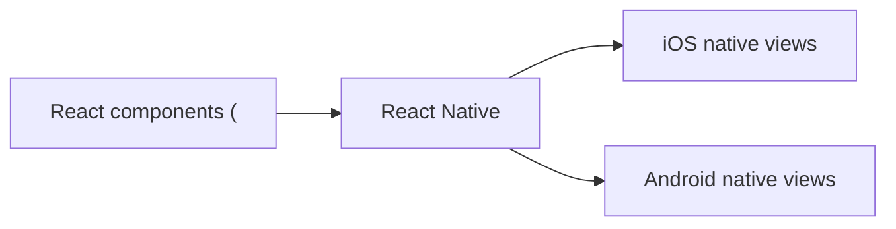
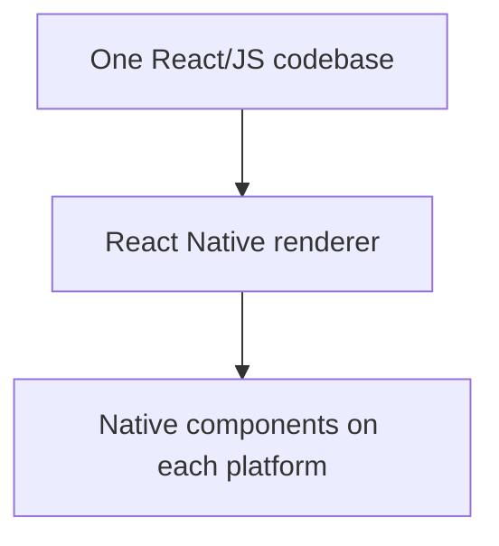
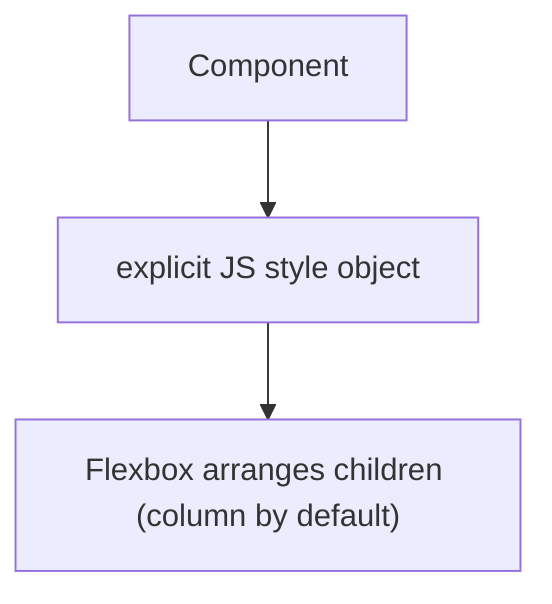

# React Native - Complete Professional Guide

> **Category:** 14_frameworks · **Language:** English

---

### Native mobile apps from React components
**Original guide written from first principles, current to 2026**

> **Original reference book (English).** This is an **independent, originally written** guide. It is not an extract, summary, or paraphrase of any third-party book; it teaches React Native from first principles with original examples. Canonical books are listed under **References** as pointers only. Each chapter follows the TO-BRAIN editorial standard (see `FILE_CONVENTIONS.md`).
>
> **Scope notice:** React Native builds **real native** mobile apps for iOS and Android from one React/JavaScript codebase. This guide covers its model — components rendering to native views — and core mobile concerns, current to 2026 (New Architecture, Fabric).

---

## How to read this guide

| Level | Profile | Parts |
|-------|---------|-------|
| 1 — Beginner | New to RN | Part I |
| 2 — Intermediate | Building apps | Part II |

**Target audience:** React/JavaScript developers building cross-platform mobile apps.

**Structure of each chapter:** Introduction · Business context · Theoretical concepts · Architecture · Diagrams (Mermaid) · Real examples · Step by step · Complete examples · Exercises · Challenges · Checklist · Best practices · Anti-patterns · Troubleshooting · References.

> **Note on prerequisites.** Assumes React (components, hooks, JSX) and JavaScript.

---

## Table of Contents

**Part I – The model**
1. Native views from React components
2. Styling and layout with Flexbox

**Part II – Mobile concerns**
3. Navigation, platform differences, and performance

> **Status of this guide:** phased delivery. **Ready:** Part I (Ch. 1–2). **In progress:** Part II.

---

## Part I – The model

React Native lets you write mobile apps in React, but — crucially — it renders to **actual native UI components**, not a web view. A `<View>` becomes a real `UIView` (iOS) or `android.view` (Android). You get native look, feel, and performance from one JavaScript codebase. Understanding "components map to native views" is the key mental model.

---

## Chapter 1 — Native views from React components

### 1.1 Introduction

In React Native you build UI from **components** — but instead of HTML elements, you use RN's core components (`<View>`, `<Text>`, `<Image>`, `<ScrollView>`) that map to **native platform views**. Your React/JavaScript runs and describes the UI; RN renders it using real native widgets. This is why RN apps feel native, unlike web-in-a-shell approaches.

### 1.2 Business context

A single React Native codebase produces genuinely native iOS and Android apps, roughly halving the cost of building and maintaining two separate native apps while keeping native performance and feel. For companies, this means faster delivery and a smaller team than fully native development requires, without the UX compromises of pure web wrappers. Understanding that RN renders native (not web) views is key to leveraging this and knowing its limits.

### 1.3 Theoretical concepts: JS describes, native renders



You use **core components** (not HTML): `<View>` (container, like a div but native), `<Text>` (all text must be in `<Text>`), `<Image>`, `<ScrollView>`, `<FlatList>` (efficient lists). Your JS describes the component tree; RN's renderer (Fabric, in the New Architecture) creates and updates the corresponding native views. Logic runs in JavaScript; the UI is native.

### 1.4 Architecture: one codebase, native UI per platform



### 1.5 Real example

**Scenario.** A simple screen with a title and a button.

**Problem.** A React web developer reaches for `<div>`, `<h1>`, `<button>` — which don't exist in RN.

**Solution.** Use RN core components, which render to native views.

**Implementation.**

```jsx
import { View, Text, Pressable } from 'react-native';

function Screen({ onPress }) {
  return (
    <View style={{ padding: 16 }}>          {/* native container, not a div */}
      <Text style={{ fontSize: 20 }}>Welcome</Text>   {/* text must be in <Text> */}
      <Pressable onPress={onPress}>          {/* native-feeling touchable */}
        <Text>Continue</Text>
      </Pressable>
    </View>
  );
}
```

**Result.** The screen renders with real native views — native scrolling, touch feedback, and look — from familiar React code. No HTML, no web view; the UI is platform-native.

**Future improvements.** Use `<FlatList>` for long lists (it recycles native rows), and platform-specific components where the UX should differ.

### 1.6 Exercises

1. What does a `<View>` render to on iOS/Android?
2. Why can't you use `<div>`/`<h1>` in React Native?
3. Where does your logic run vs the UI?

### 1.7 Challenges

- **Challenge.** Build a small RN screen using `<View>`, `<Text>`, and a touchable. Note which web habits (HTML tags) don't transfer.

### 1.8 Checklist

- [ ] I use RN core components, not HTML.
- [ ] All text is inside `<Text>`.
- [ ] I understand components render to native views.
- [ ] I use `<FlatList>` for long lists.

### 1.9 Best practices

- Use core/native components for native feel.
- Use `<FlatList>`/`<SectionList>` for performant lists.
- Keep logic in JS; let RN render native UI.

### 1.10 Anti-patterns

- Trying to use HTML elements.
- Rendering long lists with `map` in a `<ScrollView>` (no recycling).
- Treating RN like a web app (it's native UI).

### 1.11 Troubleshooting

| Symptom | Likely cause | Action |
|---------|--------------|--------|
| "div is not a component" | Using HTML elements | Use RN core components |
| Text not rendering | Text outside `<Text>` | Wrap all text in `<Text>` |
| Janky long lists | ScrollView + map | Use `<FlatList>` (recycles rows) |

### 1.12 References

- B. Eisenman, *Learning React Native*, 2nd ed. (O'Reilly, 2017) — ISBN 978-1491989142.
- React Native docs: https://reactnative.dev.

---

## Chapter 2 — Styling and layout with Flexbox

### 2.1 Introduction

React Native styles components with JavaScript objects (not CSS files), using a subset of CSS properties, and lays out with **Flexbox** — the same model as on the web (see the CSS-layout guide), but it's the **default and primary** layout system in RN. Understanding Flexbox is essential because nearly all RN layout is done with it.

### 2.2 Business context

RN's styling is close enough to web CSS that web developers transfer quickly, but the differences (JS style objects, no cascade, Flexbox-by-default, density-independent units) trip people up. Knowing them avoids layout bugs and wasted time. Because layout directly affects whether an app looks polished and works across the many device sizes in the market, Flexbox fluency is core to shipping a quality mobile UI efficiently.

### 2.3 Theoretical concepts: JS styles + Flexbox default

```mermaid
flowchart LR
    style["style={{ ... }} (JS object, subset of CSS)"] --> flex["Flexbox layout (default; column by default)"]
    flex --> responsive["Adapts across device sizes"]
```

Styles are JS objects (`style={{ padding: 16 }}`), often grouped with `StyleSheet.create`. There's **no cascade/inheritance** like web CSS — styles are explicit per component. Flexbox works as on the web but RN's **default `flexDirection` is `column`** (web default is `row`). Sizes are unitless **density-independent pixels**. `justifyContent`/`alignItems` work as in the CSS guide (main vs cross axis).

### 2.4 Architecture: explicit styles, flex layout



### 2.5 Real example

**Scenario.** A row with an avatar on the left and text on the right, vertically centered.

**Problem.** A web dev expects `flexDirection: row` by default — but RN defaults to `column`, so it stacks.

**Solution.** Set `flexDirection: 'row'` and use Flexbox alignment.

**Implementation.**

```jsx
import { View, Text, Image, StyleSheet } from 'react-native';

const styles = StyleSheet.create({
  row: { flexDirection: 'row', alignItems: 'center', gap: 12 },  // RN defaults to column!
});

<View style={styles.row}>
  <Image source={{ uri }} style={{ width: 40, height: 40, borderRadius: 20 }} />
  <Text>Ana Souza</Text>
</View>
```

**Result.** The avatar and text sit in a centered row — correct once `flexDirection: 'row'` is set (overriding RN's column default) and Flexbox alignment is applied. Layout matches the web Flexbox mental model with RN's defaults in mind.

**Future improvements.** Use `StyleSheet.create` for all styles; handle different screen sizes with flex and percentage/auto dimensions rather than fixed pixels.

### 2.6 Exercises

1. How are styles written in RN vs web CSS?
2. What's RN's default `flexDirection`, and why does it matter?
3. Does RN have CSS cascade/inheritance?

### 2.7 Challenges

- **Challenge.** Build a centered row layout in RN. If it stacks vertically, what default must you override? Fix it with Flexbox.

### 2.8 Checklist

- [ ] I style with JS objects (`StyleSheet.create`).
- [ ] I remember `flexDirection` defaults to column.
- [ ] I use Flexbox (justify/align) for layout.
- [ ] I don't assume web CSS cascade.

### 2.9 Best practices

- Group styles with `StyleSheet.create`.
- Use Flexbox for responsive layout; avoid fixed pixel layouts.
- Account for RN defaults (column direction).

### 2.10 Anti-patterns

- Assuming web CSS defaults/cascade in RN.
- Hard-coded pixel layouts that break on other devices.
- Inline ad-hoc styles everywhere (use StyleSheet).

### 2.11 Troubleshooting

| Symptom | Likely cause | Action |
|---------|--------------|--------|
| Items stack unexpectedly | Default `flexDirection: column` | Set `flexDirection: 'row'` |
| Styles "don't inherit" | RN has no cascade | Apply styles explicitly |
| Layout breaks on some devices | Fixed pixel sizes | Use flex/relative sizing |

### 2.12 References

- B. Eisenman, *Learning React Native*, 2nd ed. (O'Reilly, 2017) — ISBN 978-1491989142.
- React Native docs, "Flexbox" & "Style": https://reactnative.dev/docs/flexbox.

---

> **End of Part I.** You can now build with React Native's model: React **components that render to real native views** (`<View>`, `<Text>`, `<FlatList>` — not HTML) for one codebase producing native iOS and Android apps, styled with **JS style objects and Flexbox** (the default layout, remembering RN's column-by-default direction and lack of CSS cascade). **Part II — Mobile concerns** (Chapter 3) covers navigation between screens, handling platform differences (iOS vs Android), and performance (keeping the JS thread free, optimizing lists) for production-quality apps.

<!--APPEND-PART-II-->
