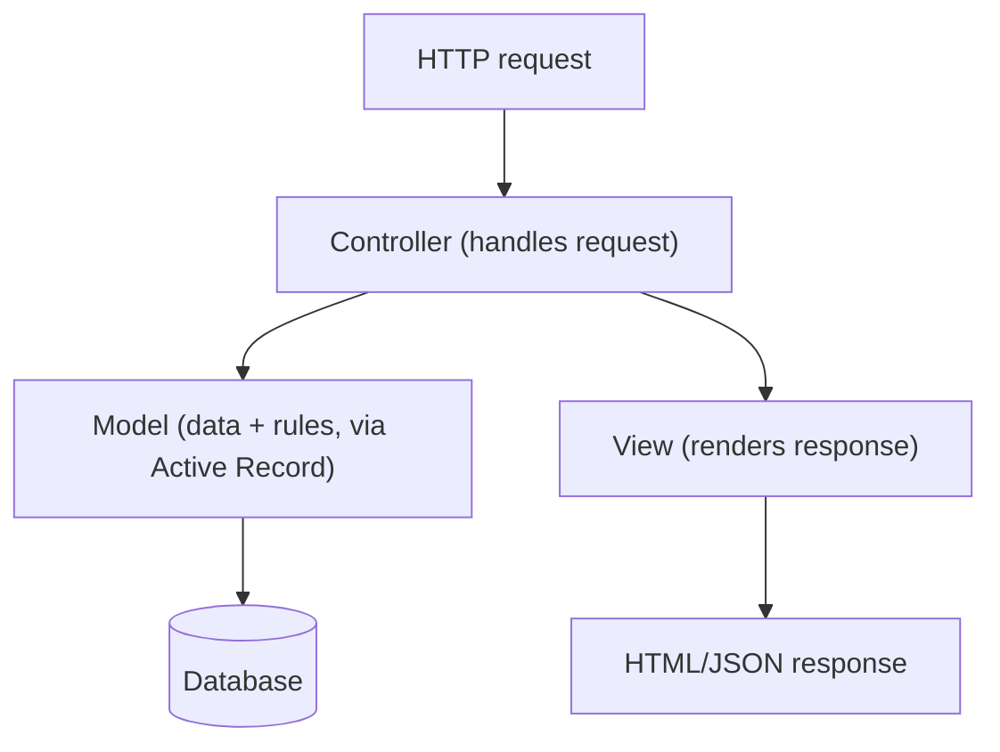
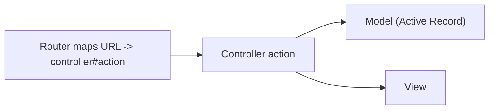
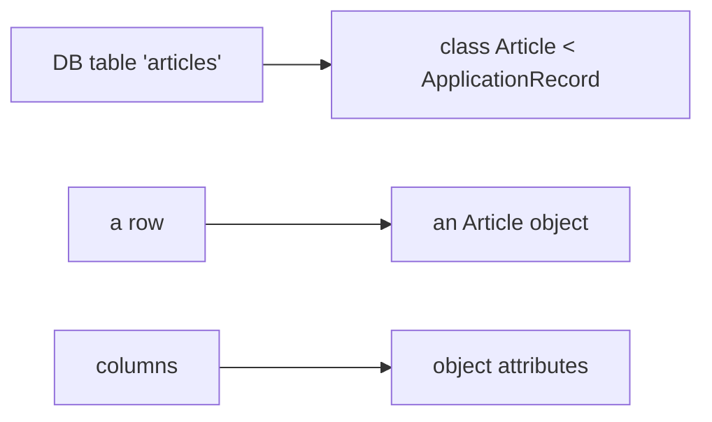
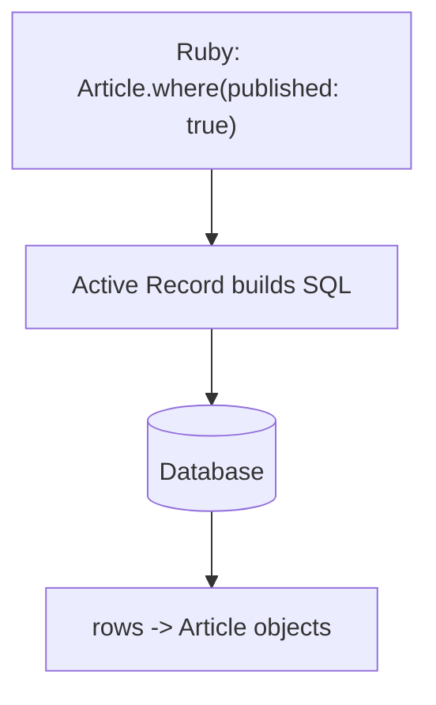

# Ruby on Rails 8 - Complete Professional Guide

> **Category:** 14_frameworks · **Language:** English

---

### MVC, convention over configuration, and Active Record
**Original guide written from first principles, current to 2026 (Rails 8)**

> **Original reference book (English).** This is an **independent, originally written** guide. It is not an extract, summary, or paraphrase of any third-party book; it teaches Ruby on Rails from first principles with original examples. Canonical books are listed under **References** as pointers only. Each chapter follows the TO-BRAIN editorial standard (see `FILE_CONVENTIONS.md`).
>
> **Scope notice:** Rails is a full-stack web framework that maximizes developer productivity through strong conventions. This guide covers its MVC architecture, convention-over-configuration philosophy, and Active Record ORM, current to 2026 (Rails 8).

---

## How to read this guide

| Level | Profile | Parts |
|-------|---------|-------|
| 1 — Beginner | New to Rails | Part I |
| 2 — Intermediate | Building apps | Part II |

**Target audience:** Ruby developers building web applications with Rails.

**Structure of each chapter:** Introduction · Business context · Theoretical concepts · Architecture · Diagrams (Mermaid) · Real examples · Step by step · Complete examples · Exercises · Challenges · Checklist · Best practices · Anti-patterns · Troubleshooting · References.

> **Note on prerequisites.** Assumes Ruby basics (the Ruby guide) and HTTP/SQL fundamentals.

---

## Table of Contents

**Part I – The Rails way**
1. Convention over configuration and MVC
2. Active Record: models and the database

**Part II – Building**
3. Routing, controllers, and views

> **Status of this guide:** phased delivery. **Ready:** Part I (Ch. 1–2). **In progress:** Part II.

---

## Part I – The Rails way

Rails's productivity comes from a strong philosophy: **convention over configuration** (sensible defaults so you write almost no boilerplate) and **don't repeat yourself**. Follow the conventions and Rails wires everything together for you. The architecture is **MVC** (Model-View-Controller), and the star is **Active Record**, the ORM that maps database tables to Ruby objects.

---

## Chapter 1 — Convention over configuration and MVC

### 1.1 Introduction

**Convention over configuration (CoC)** means Rails assumes sensible defaults based on naming and structure, so you rarely write configuration. Name a model `Article` and Rails expects a table `articles`; it all connects automatically. The architecture is **MVC**: **Models** (data + business rules), **Views** (presentation), **Controllers** (handle requests, coordinate). Following the conventions, a lot happens with very little code.

### 1.2 Business context

CoC dramatically speeds development: teams build features fast because the framework handles the wiring, and any Rails developer can navigate any Rails app because they all follow the same conventions. This consistency lowers onboarding cost and maintenance burden. The trade-off — you must learn and follow "the Rails way" — pays off in productivity, which is why Rails is favored for rapid product development and startups. Fighting the conventions, conversely, loses all that benefit.

### 1.3 Theoretical concepts: defaults + MVC layers



CoC: naming conventions (singular model `Article` ↔ plural table `articles` ↔ controller `ArticlesController`) let Rails connect components without config. MVC separates concerns: the controller receives the request, asks the model for data, and renders a view. Each layer has one job, and Rails generates much of the skeleton.

### 1.4 Architecture: request through MVC



### 1.5 Real example

**Scenario.** Add a blog "articles" resource (list, show, create).

**Problem.** From scratch this is a lot of wiring (routes, controller, DB access, templates).

**Solution.** Follow Rails conventions; a generator + a routes line wires the whole MVC stack.

**Implementation (conventions do the wiring).**

```ruby
# config/routes.rb — one line gives RESTful routes for articles
resources :articles      # GET /articles, GET /articles/:id, POST /articles, ...

# app/controllers/articles_controller.rb — conventional names connect automatically
class ArticlesController < ApplicationController
  def index   = (@articles = Article.all)        # Model: Article <-> table 'articles'
  def show    = (@article  = Article.find(params[:id]))
end
# Views in app/views/articles/index.html.erb, show.html.erb are found by convention
```

**Result.** A working MVC resource with minimal code: the router, controller, model, and views connect automatically because names follow conventions. Rails generated and wired the boilerplate.

**Future improvements.** Use scaffolding to generate the full CRUD set, then customize — but understand each piece (don't cargo-cult).

### 1.6 Exercises

1. What does convention over configuration mean?
2. Name the three MVC layers and their jobs.
3. How does naming connect a model, table, and controller?

### 1.7 Challenges

- **Challenge.** Sketch the MVC pieces (route, controller, model, view) for a simple resource. Note what Rails provides by convention vs what you write.

### 1.8 Checklist

- [ ] I follow Rails naming conventions.
- [ ] I separate concerns into M, V, and C.
- [ ] I let conventions wire components.
- [ ] I understand the request flow through MVC.

### 1.9 Best practices

- Follow the conventions; don't fight the framework.
- Keep controllers thin, models for business logic.
- Use RESTful routes (`resources`).

### 1.10 Anti-patterns

- Fighting conventions with custom configuration.
- Fat controllers / logic in views.
- Non-conventional naming that breaks auto-wiring.

### 1.11 Troubleshooting

| Symptom | Likely cause | Action |
|---------|--------------|--------|
| Components don't auto-connect | Non-conventional names | Follow naming conventions |
| Bloated controllers | Logic in the wrong layer | Move business logic to models |
| Lots of config boilerplate | Fighting CoC | Embrace defaults |

### 1.12 References

- M. Hartl, *Ruby on Rails Tutorial*, 7th ed. (Pearson, 2022/updates) — ISBN 978-0138001063; https://www.railstutorial.org.
- Rails Guides: https://guides.rubyonrails.org.

---

## Chapter 2 — Active Record

### 2.1 Introduction

**Active Record** is Rails's ORM (Object-Relational Mapper): each database table maps to a model **class**, each row to an **object**, and columns to **attributes**. You query and manipulate data with Ruby methods (`Article.where(...)`, `article.save`) instead of SQL. It implements the Active Record pattern — domain objects that know how to persist themselves.

### 2.2 Business context

Active Record removes most hand-written SQL and database plumbing, letting developers work with data as Ruby objects — a huge productivity gain and a major reason for Rails's speed of development. It also centralizes data logic and validations in the model. The trade-off is that naive use can cause performance problems (notably N+1 queries), so developers must understand what Active Record does underneath. Used well, it's powerful; used blindly, it's a performance trap.

### 2.3 Theoretical concepts: objects that persist themselves



A model inherits from `ApplicationRecord` and automatically gains attributes from the table and methods to query/save. **Associations** (`has_many`, `belongs_to`) model relationships; **validations** (`validates`) enforce rules before saving; **migrations** evolve the schema in versioned Ruby. The watch-out: loading associated records in a loop causes **N+1 queries** — use eager loading (`includes`).

### 2.4 Architecture: model maps to table



### 2.5 Real example

**Scenario.** Show articles with their authors.

**Problem.** Looping over articles and accessing `article.author` triggers one query per article — the N+1 problem.

**Solution.** Eager-load the association with `includes` so it's one extra query, not N.

**Implementation.**

```ruby
class Article < ApplicationRecord
  belongs_to :author
  validates :title, presence: true     # rule enforced before save
end

# N+1 (bad): one query for articles + one per article for its author
Article.all.each { |a| puts a.author.name }

# Eager load (good): 2 queries total regardless of count
Article.includes(:author).each { |a| puts a.author.name }
```

**Result.** Data is worked with as Ruby objects (no hand-written SQL), and eager loading turns N+1 queries into two — correct and efficient. Active Record's power is used with awareness of its query behavior.

**Future improvements.** Add indexes for filtered/joined columns (see the SQL-performance guide); use `bullet`-style detection to catch N+1 in development.

### 2.6 Exercises

1. What does Active Record map between?
2. What is the N+1 query problem and how do you fix it?
3. Where do validations belong?

### 2.7 Challenges

- **Challenge.** Write two models with a `has_many`/`belongs_to` association. Write a loop that causes N+1, then fix it with `includes`. Inspect the query count.

### 2.8 Checklist

- [ ] Models map to tables via Active Record.
- [ ] I use associations and validations.
- [ ] I avoid N+1 with eager loading (`includes`).
- [ ] I understand the SQL Active Record generates.

### 2.9 Best practices

- Put data rules/validations in models.
- Eager-load associations to avoid N+1.
- Use migrations for schema changes; index appropriately.

### 2.10 Anti-patterns

- N+1 queries from lazy association loading in loops.
- Business logic in controllers instead of models.
- Ignoring the SQL Active Record runs.

### 2.11 Troubleshooting

| Symptom | Likely cause | Action |
|---------|--------------|--------|
| Many repeated queries | N+1 | Use `includes` to eager-load |
| Slow queries | Missing indexes | Add DB indexes for filters/joins |
| Invalid data saved | No validations | Add `validates` in the model |

### 2.12 References

- M. Hartl, *Ruby on Rails Tutorial* (Pearson) — ISBN 978-0138001063; https://www.railstutorial.org.
- Rails Guides, "Active Record Basics": https://guides.rubyonrails.org/active_record_basics.html.

---

> **End of Part I.** You can now build with Rails's core: **convention over configuration** and **MVC**, where following naming conventions auto-wires routes, controllers, models, and views with minimal code, and **Active Record**, the ORM that maps tables to model objects so you work with data in Ruby — using associations and validations, and avoiding the N+1 query trap with eager loading. **Part II — Building** (Chapter 3) covers routing (RESTful resources), controller actions and parameters, and views with templates to assemble complete request handling.

<!--APPEND-PART-II-->
