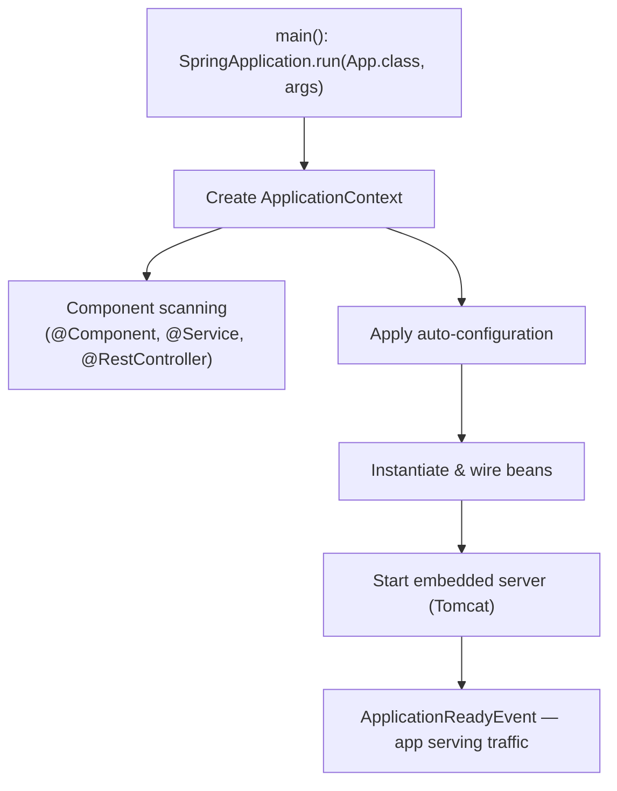
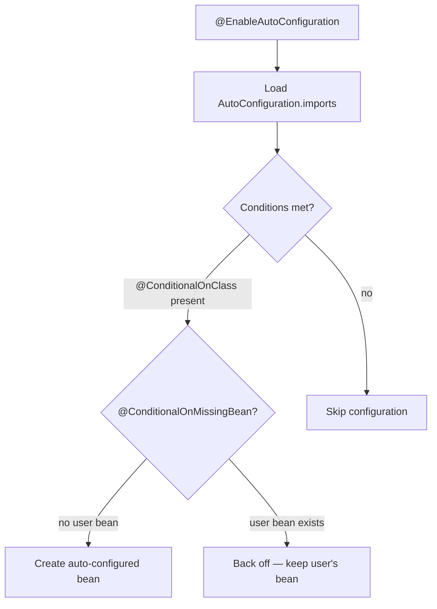
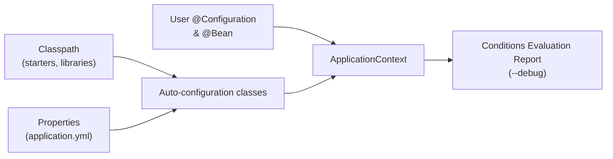
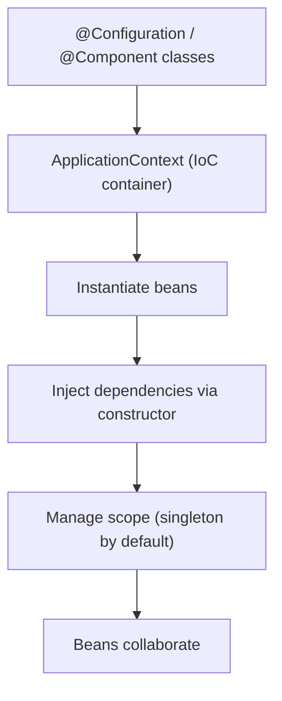
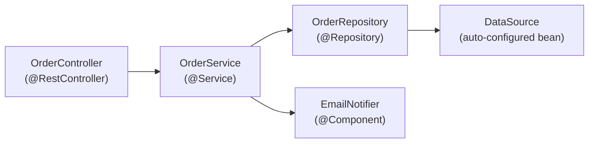
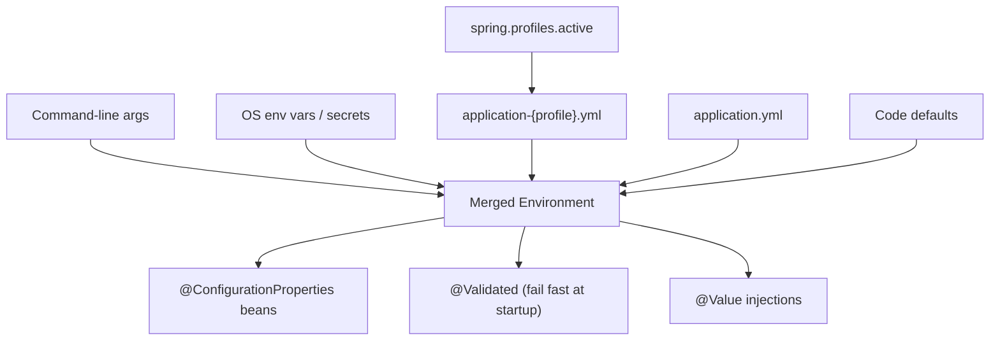
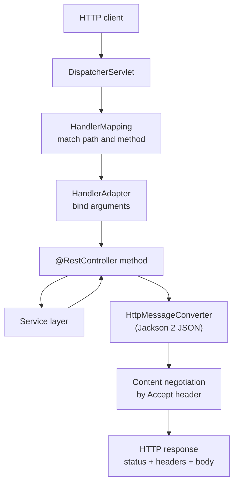
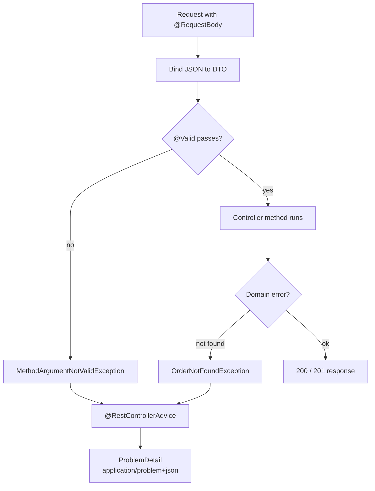
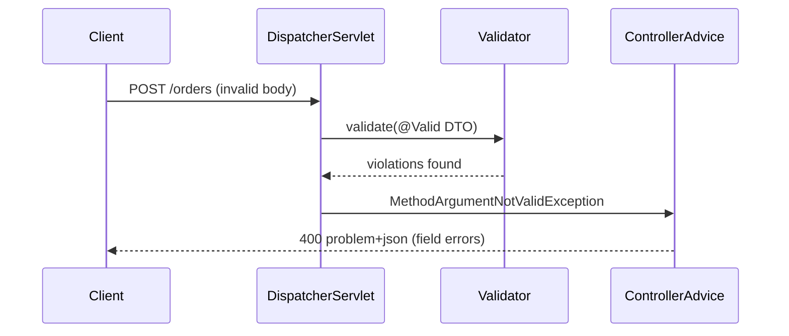

# Spring Boot 3 - Complete Professional Guide

> **Category:** 14_frameworks · **Language:** English

---

### Auto-configuration, Spring MVC & WebFlux, Data JPA, Security, Actuator, Testing, Native/AOT
**Edition for Spring Boot 3.x (Spring Framework 6, Java 17+)**

> **Reference book (English).** Based on the official Spring Boot reference documentation (https://docs.spring.io), the Spring Framework reference, and the Spring Boot release notes. Written for developers, architects, and teams building production services on the JVM.
>
> **Scope notice:** this is a **production-focused** book. It teaches Spring Boot 3 as it is built today: Jakarta EE 9+ namespaces (`jakarta.*`), Java 17+ baseline, GraalVM native images, observability with Micrometer, and the modern auto-configuration model. Each chapter follows the TO-BRAIN editorial standard (see `FILE_CONVENTIONS.md`).

---

## How to read this book

Progressive depth across five maturity levels:

| Level | Profile | Parts |
|-------|---------|-------|
| 1 — Beginner | New to Spring Boot | Part I |
| 2 — Intermediate | REST APIs & persistence | Parts II–III |
| 3 — Advanced | Security & reactive | Parts IV–V |
| 4 — Specialist | Testing & observability | Parts VI–VII |
| 5 — Enterprise | Packaging, native, production | Part VIII |

**Target audience:** Java and backend developers, software architects, platform engineers, tech leads, and CTOs adopting or scaling Spring Boot 3 services.

**Structure of each chapter:** Introduction · Business context · Theoretical concepts · Architecture · Diagrams (Mermaid) · Real examples · Step by step · Complete code · Exercises · Challenges · Checklist · Best practices · Anti-patterns · Troubleshooting · Official references.

**Example format:** Scenario · Problem · Solution · Implementation · Result · Future improvements.

> **Note on prerequisites.** This book assumes working knowledge of Java 17+ (records, sealed types, `var`), Maven or Gradle, and basic HTTP. Where a Spring Boot feature builds on plain Spring Framework, the lineage is made explicit.

---

## Table of Contents

**Part I – Foundations**
1. What is Spring Boot 3 — starters and the project model
2. Auto-configuration and the Spring Boot lifecycle
3. The IoC container, beans, and dependency injection

**Part II – Configuration & Web APIs**
4. Externalized configuration, profiles, and `@ConfigurationProperties`
5. Building REST APIs with Spring MVC (`@RestController`, content negotiation)
6. Bean Validation and error handling (`@Valid`, `ProblemDetail`, `@ControllerAdvice`)

**Part III – Data & Transactions**
7. Spring Data JPA fundamentals (entities, repositories, queries)
8. Transaction management with `@Transactional`
9. Database migrations and connection pooling (Flyway/Liquibase, HikariCP)

**Part IV – Security**
10. Spring Security architecture and the `SecurityFilterChain`
11. Stateless authentication with JWT
12. OAuth2 / OIDC resource server and client

**Part V – Reactive**
13. Reactive programming with Project Reactor
14. Spring WebFlux and the functional/annotated models
15. Reactive data access (R2DBC)

**Part VI – Testing**
16. Unit and slice tests (`@WebMvcTest`, `@DataJpaTest`)
17. Integration tests with `@SpringBootTest` and Testcontainers

**Part VII – Observability**
18. Spring Boot Actuator (health, metrics, info)
19. Observability with Micrometer (metrics, tracing, logs)

**Part VIII – Packaging & Production**
20. Executable jars, layered images, and Docker (Buildpacks)
21. GraalVM native images and AOT processing
22. Production hardening and the twelve-factor checklist

> **Status of this edition:** phased delivery (each part keeps the same depth standard). **Ready:** Part I (Ch. 1–3). **In progress:** Parts II–VIII.

---

## Part I – Foundations

Part I builds the mental model you need for everything else. Spring Boot is not a new framework on top of Spring — it is an **opinionated, convention-over-configuration** layer that wires Spring Framework for you. Understanding three things — **starters**, **auto-configuration**, and the **IoC container** — explains 80% of what Spring Boot does at runtime, and demystifies the "magic" that newcomers often distrust.

---

## Chapter 1 — What is Spring Boot 3 — starters and the project model

### 1.1 Introduction

Spring Boot 3 (built on **Spring Framework 6**, requiring **Java 17+** and the **`jakarta.*`** namespace) lets you create stand-alone, production-grade Spring applications that "just run." Instead of assembling dozens of libraries and XML files, you declare a small set of **starters** — curated dependency descriptors — and Spring Boot supplies sensible defaults, an embedded server, and a single executable artifact. This chapter explains the project model: starters, the parent BOM, the embedded server, and the `@SpringBootApplication` entry point.

### 1.2 Business context

For engineering organizations, Spring Boot's value is **time-to-first-endpoint** and **operational consistency**. A new service can be live in minutes, every service shares the same dependency versions (via the managed BOM), and the same `java -jar` command runs locally, in CI, and in production. This standardization lowers onboarding cost, reduces "works on my machine" drift, and makes a fleet of microservices governable. The trade-off — accepting Spring's opinions — is usually a net win because the defaults reflect community-wide best practice.

### 1.3 Theoretical concepts: the building blocks

```mermaid
mindmap
  root((Spring Boot 3))
    Starters
      spring-boot-starter-web
      spring-boot-starter-data-jpa
      spring-boot-starter-security
      spring-boot-starter-test
    Dependency management
      spring-boot-starter-parent (BOM)
      consistent versions
    Embedded server
      Tomcat (default)
      Jetty / Undertow
    Entry point
      @SpringBootApplication
      SpringApplication.run()
    Platform baseline
      Java 17+
      jakarta.* namespace
      Spring Framework 6
```

A **starter** is a dependency that transitively pulls a coherent set of libraries (for example, `spring-boot-starter-web` brings Spring MVC, Jackson, validation, and embedded Tomcat). The **starter parent** (or the dependency-management BOM in Gradle) pins compatible versions so you rarely specify version numbers yourself. The result is a reproducible, version-aligned dependency tree.

### 1.4 Architecture: from main() to a running server



`@SpringBootApplication` is a meta-annotation combining `@SpringBootConfiguration`, `@EnableAutoConfiguration`, and `@ComponentScan`. Running `SpringApplication.run(...)` bootstraps the context, applies auto-configuration, starts the embedded server, and publishes lifecycle events.

### 1.5 Real example

**Scenario.** A team needs a minimal HTTP service exposing a health-style greeting endpoint, runnable as a single jar.

**Problem.** They want zero boilerplate and no servlet-container installation.

**Solution.** Use `spring-boot-starter-web` and a single `@RestController`. The embedded Tomcat ships inside the jar.

**Implementation.**

```java
// build: spring-boot-starter-parent + spring-boot-starter-web
package com.example.greeting;

import org.springframework.boot.SpringApplication;
import org.springframework.boot.autoconfigure.SpringBootApplication;
import org.springframework.web.bind.annotation.GetMapping;
import org.springframework.web.bind.annotation.RequestParam;
import org.springframework.web.bind.annotation.RestController;

@SpringBootApplication
public class GreetingApplication {
    public static void main(String[] args) {
        SpringApplication.run(GreetingApplication.class, args);
    }
}

@RestController
class GreetingController {

    public record Greeting(String message) {}

    @GetMapping("/greeting")
    Greeting greet(@RequestParam(defaultValue = "World") String name) {
        return new Greeting("Hello, " + name + "!");
    }
}
```

```bash
# Build and run a single executable jar
./mvnw clean package
java -jar target/greeting-0.0.1-SNAPSHOT.jar
# GET http://localhost:8080/greeting?name=Spring  ->  {"message":"Hello, Spring!"}
```

**Result.** A self-contained jar with embedded Tomcat serves JSON on port 8080 — no external server, no XML, one command.

**Future improvements.** Add `@ConfigurationProperties` for the greeting text (Chapter 4) and Actuator for health/metrics (Chapter 18).

### 1.6 Exercises

1. List three starters and the libraries each pulls in transitively.
2. What three annotations does `@SpringBootApplication` combine?
3. How would you switch the embedded server from Tomcat to Undertow?

### 1.7 Challenges

- **Challenge.** Generate a project with Spring Initializr (start.spring.io), add `web` and `actuator`, run it, and confirm the embedded server version printed in the startup log matches the BOM.

### 1.8 Checklist

- [ ] I understand what a starter is and why versions are managed for me.
- [ ] I can explain the role of `@SpringBootApplication`.
- [ ] I know Spring Boot 3 requires Java 17+ and the `jakarta.*` namespace.
- [ ] I can package and run an app as a single executable jar.

### 1.9 Best practices

- Prefer starters over hand-picking individual libraries — you inherit tested version alignment.
- Keep the main application class in the **root package** so component scanning covers all sub-packages.
- Let the BOM manage versions; only override a version when you have a concrete reason.

### 1.10 Anti-patterns

- Pinning library versions manually and fighting the managed BOM, causing classpath conflicts.
- Placing `@SpringBootApplication` in a deep package so component scanning misses your beans.
- Mixing `javax.*` and `jakarta.*` imports (the former is unsupported in Spring Boot 3).

### 1.11 Troubleshooting

| Symptom | Likely cause | Action |
|---------|--------------|--------|
| Beans/controllers not discovered | Main class outside root package | Move it up so `@ComponentScan` covers them |
| `ClassNotFoundException: javax.servlet...` | Legacy `javax.*` dependency | Use Jakarta-based libraries; Boot 3 is `jakarta.*` |
| Port 8080 already in use | Another process bound to the port | Set `server.port` or free the port |
| Wrong/duplicate dependency versions | Bypassing the BOM | Remove explicit versions; rely on starter parent |

### 1.12 Official references

- Spring Boot reference — Getting Started: https://docs.spring.io/spring-boot/reference/using/index.html
- Spring Boot starters: https://docs.spring.io/spring-boot/reference/using/build-systems.html#using.build-systems.starters
- Spring Initializr: https://start.spring.io
- Spring Boot 3 release notes: https://github.com/spring-projects/spring-boot/wiki/Spring-Boot-3.0-Release-Notes

---

## Chapter 2 — Auto-configuration and the Spring Boot lifecycle

### 2.1 Introduction

Auto-configuration is the mechanism that makes Spring Boot feel magical: based on what is on the classpath, what beans already exist, and what properties are set, Spring Boot **conditionally** configures beans for you (a `DataSource`, a `Jackson` mapper, an MVC stack, and so on). This chapter explains how auto-configuration is discovered and applied, how conditions decide what gets created, and how you override or disable it.

### 2.2 Business context

Auto-configuration is what turns "weeks of plumbing" into "minutes of coding." For a business, that means faster delivery and fewer configuration defects. But teams must understand it well enough to **debug** it — when a bean unexpectedly exists (or doesn't), the difference between a one-line fix and a multi-day investigation is knowing how conditions and ordering work. Treating auto-configuration as an unknowable black box is an operational risk.

### 2.3 Theoretical concepts: conditional beans

Auto-configuration classes are listed in `META-INF/spring/org.springframework.boot.autoconfigure.AutoConfiguration.imports`. Each is gated by `@Conditional` annotations such as `@ConditionalOnClass`, `@ConditionalOnMissingBean`, and `@ConditionalOnProperty`. The crucial rule: **your beans win** — `@ConditionalOnMissingBean` means an auto-configured bean is created only if you didn't already define one.



### 2.4 Architecture: where auto-configuration sits



Auto-configuration runs **after** your own configuration so your beans are seen first; this is why user-defined beans cause the matching auto-config to "back off."

### 2.5 Real example

**Scenario.** A team wants a custom JSON `ObjectMapper` (snake_case, ignore unknown fields) but keep all other web auto-configuration intact.

**Problem.** They worry that defining their own mapper will break Spring Boot's Jackson setup.

**Solution.** Define a single `@Bean ObjectMapper`. Because the Jackson auto-configuration uses `@ConditionalOnMissingBean`, it backs off for the mapper while keeping everything else.

**Implementation.**

```java
package com.example.config;

import com.fasterxml.jackson.databind.DeserializationFeature;
import com.fasterxml.jackson.databind.ObjectMapper;
import com.fasterxml.jackson.databind.PropertyNamingStrategies;
import org.springframework.context.annotation.Bean;
import org.springframework.context.annotation.Configuration;

@Configuration
public class JacksonConfig {

    @Bean
    ObjectMapper objectMapper() {
        return new ObjectMapper()
            .setPropertyNamingStrategy(PropertyNamingStrategies.SNAKE_CASE)
            .configure(DeserializationFeature.FAIL_ON_UNKNOWN_PROPERTIES, false);
    }
}
```

```bash
# See exactly which auto-configurations matched and why
java -jar app.jar --debug
# ...prints the "Conditions Evaluation Report":
# Positive matches / Negative matches / Exclusions
```

**Result.** The application uses your `ObjectMapper`; Spring Boot's Jackson auto-config backs off for that bean but still wires the rest of the web stack.

**Future improvements.** Prefer customizing via `Jackson2ObjectMapperBuilderCustomizer` so Boot's other defaults (modules, date handling) are preserved; reserve a full `ObjectMapper` bean for cases that truly need total control.

### 2.6 Exercises

1. What file declares auto-configuration classes in Spring Boot 3?
2. Explain what `@ConditionalOnMissingBean` does and why it matters.
3. How do you exclude a specific auto-configuration class?

### 2.7 Challenges

- **Challenge.** Run your app with `--debug`, open the Conditions Evaluation Report, and explain why one positive match and one negative match appear.

### 2.8 Checklist

- [ ] I can describe how auto-configuration is discovered.
- [ ] I know the common `@Conditional` annotations and the "back off" rule.
- [ ] I can read the Conditions Evaluation Report.
- [ ] I know how to exclude an auto-configuration via `exclude` or properties.

### 2.9 Best practices

- Override behavior by **adding your own bean** and letting auto-config back off, rather than fighting it.
- Use `Customizer` beans (e.g. `WebMvcConfigurer`, `Jackson2ObjectMapperBuilderCustomizer`) to tweak defaults without replacing them wholesale.
- Use the `--debug` report when a bean unexpectedly exists or is missing.

### 2.10 Anti-patterns

- Disabling broad swaths of auto-configuration "to be safe," then re-implementing the plumbing by hand.
- Defining a full replacement bean when a customizer would suffice, losing useful defaults.
- Assuming a bean exists without checking the conditions report.

### 2.11 Troubleshooting

| Symptom | Cause | Action |
|---------|-------|--------|
| Expected bean is missing | A condition wasn't met | Check `--debug` negative matches |
| Two conflicting beans of a type | Auto-config didn't back off | Ensure your bean type matches the `@ConditionalOnMissingBean` target |
| Auto-config you don't want is active | Class is on the classpath | Use `@SpringBootApplication(exclude = ...)` or `spring.autoconfigure.exclude` |
| Customization ignored | Replaced bean instead of customizing | Use the matching `Customizer`/`Configurer` |

### 2.12 Official references

- Auto-configuration: https://docs.spring.io/spring-boot/reference/using/auto-configuration.html
- Creating your own auto-configuration: https://docs.spring.io/spring-boot/reference/features/developing-auto-configuration.html
- Condition annotations: https://docs.spring.io/spring-boot/reference/features/developing-auto-configuration.html#features.developing-auto-configuration.condition-annotations
- Spring Boot reference (full): https://docs.spring.io/spring-boot/index.html

---

## Chapter 3 — The IoC container, beans, and dependency injection

### 3.1 Introduction

Underneath every Spring Boot app is the Spring Framework **Inversion of Control (IoC) container**: it creates objects (**beans**), resolves their dependencies, and manages their lifecycle. Spring Boot adds auto-configuration and conventions, but the container is the engine. This chapter covers beans, the stereotype annotations, **constructor injection** (the modern default), scopes, and how the `ApplicationContext` ties it together.

### 3.2 Business context

Dependency injection is not academic — it directly shapes **testability and change cost**. Code that receives its collaborators (rather than constructing them) can be unit-tested with fakes, swapped per environment, and refactored without ripple effects. Teams that internalize DI ship code that is cheaper to test and safer to evolve; teams that don't end up with tangled singletons and brittle tests.

### 3.3 Theoretical concepts: beans and injection

A **bean** is an object managed by the container. You declare beans either with **stereotype annotations** (`@Component`, `@Service`, `@Repository`, `@Controller`) that are component-scanned, or with `@Bean` methods inside a `@Configuration` class. Dependencies are supplied by the container — preferably through the **constructor**, which yields immutable, fully-initialized, easily-testable objects.



### 3.4 Architecture: a layered bean graph



Each arrow is a constructor dependency the container resolves. Because beans are singletons by default, this graph is built once at startup and reused for every request.

### 3.5 Real example

**Scenario.** An order service must persist orders and send a confirmation, with both collaborators injectable for testing.

**Problem.** Field injection (`@Autowired` on fields) makes the class hard to unit-test and hides required dependencies.

**Solution.** Use **constructor injection**. With a single constructor, Spring injects automatically — no `@Autowired` needed — and the dependencies become `final`.

**Implementation.**

```java
package com.example.orders;

import org.springframework.stereotype.Service;

public interface Notifier { void confirm(String orderId); }

@Service
class OrderService {

    private final OrderRepository repository;
    private final Notifier notifier;

    // Single constructor: Spring injects these automatically.
    OrderService(OrderRepository repository, Notifier notifier) {
        this.repository = repository;
        this.notifier = notifier;
    }

    public String place(Order order) {
        Order saved = repository.save(order);
        notifier.confirm(saved.id());
        return saved.id();
    }
}
```

```java
// Unit test without Spring: just pass fakes to the constructor.
class OrderServiceTest {
    @org.junit.jupiter.api.Test
    void placesAndConfirms() {
        var repo = new InMemoryOrderRepository();          // fake
        var notifier = new RecordingNotifier();            // fake
        var service = new OrderService(repo, notifier);

        String id = service.place(new Order("ABC", 2));

        org.junit.jupiter.api.Assertions.assertNotNull(id);
        org.junit.jupiter.api.Assertions.assertTrue(notifier.wasCalledFor(id));
    }
}
```

**Result.** The service is immutable, its dependencies are explicit, and it is unit-testable with zero Spring infrastructure — tests run in milliseconds.

**Future improvements.** Promote `Order` to a record; if multiple `Notifier` implementations exist, disambiguate with `@Primary` or `@Qualifier` (Chapter 4 covers profile-based selection).

### 3.6 Exercises

1. Name the four stereotype annotations and the semantic each conveys.
2. Why is constructor injection preferred over field injection?
3. What is the default bean scope, and name one alternative scope.

### 3.7 Challenges

- **Challenge.** Introduce a second `Notifier` implementation and make the container choose the right one per profile using `@Profile`, without changing `OrderService`.

### 3.8 Checklist

- [ ] I can declare beans with stereotypes and with `@Bean` methods.
- [ ] I use constructor injection with `final` fields.
- [ ] I understand singleton vs other scopes.
- [ ] I can disambiguate multiple candidates with `@Qualifier`/`@Primary`.

### 3.9 Best practices

- Prefer constructor injection; let a single constructor be injected implicitly.
- Make injected fields `final` to express immutability and catch missing wiring at compile time.
- Keep beans focused (single responsibility); inject interfaces, not concrete classes, where it aids testing.

### 3.10 Anti-patterns

- Field injection (`@Autowired` on private fields) — hides dependencies and hurts testability.
- Calling `applicationContext.getBean(...)` from business code (service locator) instead of injecting.
- God-beans that depend on a dozen collaborators — a sign the class does too much.

### 3.11 Troubleshooting

| Symptom | Cause | Action |
|---------|-------|--------|
| `NoSuchBeanDefinitionException` | Bean not scanned or not declared | Add a stereotype/`@Bean`; verify package scanning |
| `NoUniqueBeanDefinitionException` | Multiple candidates for a type | Add `@Primary` or `@Qualifier` |
| Circular dependency error at startup | Two beans require each other via constructor | Break the cycle; reconsider design or use `@Lazy` |
| `null` dependency at runtime | Object created with `new` instead of injected | Make it a managed bean and inject it |

### 3.12 Official references

- The IoC container: https://docs.spring.io/spring-framework/reference/core/beans.html
- Dependency injection: https://docs.spring.io/spring-framework/reference/core/beans/dependencies/factory-collaborators.html
- Bean scopes: https://docs.spring.io/spring-framework/reference/core/beans/factory-scopes.html
- Spring Boot — Spring Beans and dependency injection: https://docs.spring.io/spring-boot/reference/using/spring-beans-and-dependency-injection.html

---

> **End of Part I.** You now have the foundational mental model of Spring Boot 3: the **project model** (starters, BOM, embedded server, `@SpringBootApplication`), the **auto-configuration** mechanism (conditional beans and the "back off" rule), and the **IoC container** with constructor-based dependency injection. **Part II — Configuration & Web APIs** (Chapters 4–6) builds on this to cover externalized configuration and profiles, REST APIs with Spring MVC, and validation with RFC 7807 `ProblemDetail` error handling.


---

## Part II – Configuration & Web APIs

Part I explained how Spring Boot wires itself together. Part II turns that container into a configurable, network-facing service. A real application reads its settings from the outside world, exposes HTTP endpoints, and rejects bad input gracefully. These three chapters cover externalized configuration and profiles (so one artifact runs everywhere), REST API construction with Spring MVC (so clients can talk to it), and Bean Validation with structured error handling (so failures are safe and predictable). Throughout, the platform baseline is Spring Boot 3.x on Spring Framework 6, Java 17+, and the `jakarta.*` namespace.

---

## Chapter 4 — Externalized configuration, profiles, and `@ConfigurationProperties`

### 4.1 Introduction

A single deployable artifact must behave differently in development, staging, and production: different database URLs, pool sizes, feature flags, and secrets. Spring Boot's **externalized configuration** makes this possible by reading settings from many sources — property and YAML files, OS environment variables, command-line arguments, and imported config — and merging them in a defined precedence order. **Profiles** let you activate environment-specific properties and beans, and **`@ConfigurationProperties`** binds a whole tree of settings to a type-safe, validated object. This chapter covers the property model, profiles, type-safe binding, and where secrets belong.

### 4.2 Business context

Hardcoded configuration is a reliability and security liability. A database URL compiled into a jar is correct in exactly one environment and wrong everywhere else; a password committed to source control is a breach waiting to be discovered. Externalized configuration enables the 12-factor ideal: one immutable artifact is promoted unchanged from dev to prod, with behavior varying only by external inputs. For an organization this lowers deployment risk, enables centralized secret management, and produces an auditable separation between code and environment. It also makes a fleet of services governable — operators tune behavior without rebuilding, and the same artifact that passed CI is the one that runs in production.

### 4.3 Theoretical concepts: the property model

Spring Boot assembles a single `Environment` from many **property sources**, each with a priority. When the same key appears in more than one source, the higher-priority source wins. A simplified precedence (highest first):

- Command-line arguments (`--server.port=9000`)
- OS environment variables and `SPRING_APPLICATION_JSON`
- Profile-specific files (`application-{profile}.yml`)
- The base file (`application.yml` / `application.properties`)
- Defaults declared in code (`@Value(":default")`, property defaults)

```mermaid
mindmap
  root((Externalized config))
    Property sources
      Command-line args
      Environment variables
      application-{profile}.yml
      application.yml
      Code defaults
    Profiles
      spring.profiles.active
      @Profile beans
      profile-specific YAML
    Type-safe binding
      @ConfigurationProperties
      @Validated
      records and relaxed binding
    Secrets
      from env or vault
      never in source control
      spring.config.import
```

Two ways to consume config exist: `@Value("${key}")` injects a single property into a field or parameter, while **`@ConfigurationProperties`** binds a prefixed subtree into a structured object. The latter is preferred because it groups related settings, supports **relaxed binding** (`max-size`, `maxSize`, `MAX_SIZE` all map to the same property), and integrates with Jakarta Bean Validation for fail-fast startup checks.

### 4.4 Architecture: how configuration resolves



The `Environment` is built early in the bootstrap sequence, before most beans are created. `spring.profiles.active` decides which profile-specific files participate in the merge. Binding into `@ConfigurationProperties` objects happens during context refresh, and when those objects are annotated `@Validated`, any constraint violation aborts startup — a misconfigured service fails loudly at launch rather than silently at the first request.

### 4.5 Real example

**Scenario.** A checkout service must run with different connection-pool sizes and feature flags per environment, and its database password must come from a secret store rather than any file.

**Problem.** Settings are scattered across a dozen `@Value` annotations, there is no validation, and the password risks being committed inside `application.yml`.

**Solution.** Consolidate settings into a validated `@ConfigurationProperties` record, place environment differences in profile-specific YAML, and inject the password from an environment variable so it never touches source control.

**Implementation.**

```yaml
# application.yml (defaults shared by every environment)
app:
  features:
    new-checkout: false
  pool:
    max-size: 10
---
# application-prod.yml (production overrides)
spring:
  config:
    activate:
      on-profile: prod
app:
  features:
    new-checkout: true
  pool:
    max-size: 50
spring:
  datasource:
    url: jdbc:postgresql://db.prod.internal:5432/app
    username: app
    password: ${DB_PASSWORD}   # resolved from the environment / secret store
```

```java
package com.example.checkout.config;

import jakarta.validation.Valid;
import jakarta.validation.constraints.Max;
import jakarta.validation.constraints.Min;
import org.springframework.boot.context.properties.ConfigurationProperties;
import org.springframework.validation.annotation.Validated;

@ConfigurationProperties(prefix = "app")
@Validated
public record AppProperties(
        Features features,
        @Valid Pool pool
) {
    public record Features(boolean newCheckout) {}

    public record Pool(@Min(1) @Max(200) int maxSize) {}
}
```

```java
package com.example.checkout;

import com.example.checkout.config.AppProperties;
import org.springframework.boot.SpringApplication;
import org.springframework.boot.autoconfigure.SpringBootApplication;
import org.springframework.boot.context.properties.EnableConfigurationProperties;
import org.springframework.stereotype.Service;

@SpringBootApplication
@EnableConfigurationProperties(AppProperties.class)
public class CheckoutApplication {
    public static void main(String[] args) {
        SpringApplication.run(CheckoutApplication.class, args);
    }
}

@Service
class CheckoutService {

    private final AppProperties props;

    CheckoutService(AppProperties props) {
        this.props = props;
    }

    boolean newCheckoutEnabled() {
        return props.features().newCheckout();
    }
}
```

```java
package com.example.checkout;

import static org.assertj.core.api.Assertions.assertThat;

import com.example.checkout.config.AppProperties;
import org.junit.jupiter.api.Test;
import org.springframework.beans.factory.annotation.Autowired;
import org.springframework.boot.test.context.SpringBootTest;
import org.springframework.test.context.ActiveProfiles;

@SpringBootTest
@ActiveProfiles("prod")
class ProdConfigTest {

    @Autowired
    AppProperties props;

    @Test
    void prodOverridesApplied() {
        assertThat(props.features().newCheckout()).isTrue();
        assertThat(props.pool().maxSize()).isEqualTo(50);
    }
}
```

```bash
# Activate the prod profile and supply the secret at run time.
DB_PASSWORD=s3cr3t java -jar app.jar --spring.profiles.active=prod
```

**Result.** One artifact behaves correctly in every environment. The password lives only in the deployment environment, never in a file. Invalid configuration — say, `max-size: 0` — fails fast at startup with a clear validation message instead of surfacing as a runtime defect.

**Future improvements.** Source the password from a managed store via `spring.config.import=vault://` or a Kubernetes secret, add `@ConfigurationProperties` metadata (annotation processor) so the IDE autocompletes keys, and expose non-secret feature flags through a refreshable mechanism.

### 4.6 Exercises

1. Order these property sources by precedence (highest first): `application.yml`, an OS environment variable, a command-line argument.
2. Convert three related `@Value` injections into a single validated `@ConfigurationProperties` record.
3. Show two different ways to activate the `prod` profile at run time.

### 4.7 Challenges

- **Challenge.** Take a service whose configuration is spread across `@Value` strings, externalize every setting into base plus profile-specific YAML, bind it with a validated `@ConfigurationProperties` record, and inject exactly one secret from an environment variable. Prove the prod overrides with a `@SpringBootTest` using `@ActiveProfiles("prod")`.

### 4.8 Checklist

- [ ] No secrets appear in source code or committed property files.
- [ ] Environment differences live in `application-{profile}.yml`, not in code.
- [ ] Configuration is bound via type-safe, `@Validated` `@ConfigurationProperties`.
- [ ] The active profile is set explicitly per environment.
- [ ] Invalid configuration fails fast at startup, not at first request.

### 4.9 Best practices

- Prefer `@ConfigurationProperties` (grouped, type-safe, validated) over scattered `@Value` strings.
- Ship one immutable artifact and vary behavior only through externalized configuration.
- Inject secrets from environment variables or a vault; never commit them.
- Add `@Validated` and Jakarta constraints so misconfiguration aborts startup.
- Use relaxed binding intentionally and keep property names kebab-case in YAML.

### 4.10 Anti-patterns

- Passwords or API keys in `application.yml` checked into git.
- Building a separate artifact per environment instead of one promoted everywhere.
- Dozens of unvalidated `@Value` injections with no central structure.
- Overriding properties in profiles that should be code defaults, fragmenting the source of truth.

### 4.11 Troubleshooting

| Symptom | Likely cause | Action |
|---------|--------------|--------|
| Wrong value at runtime | Misunderstood precedence order | Inspect the property-source order; a higher source is overriding you |
| Profile properties ignored | Profile not active | Set `spring.profiles.active` for that environment |
| Binding fails at startup | Type or constraint mismatch | Fix the property value or the validation constraint |
| `${DB_PASSWORD}` is literal | Env var not set | Export the variable in the deployment environment |
| Property not bound to record | Prefix or relaxed-binding mismatch | Verify the `prefix` and the kebab-case key |

### 4.12 Official references

- Externalized configuration: https://docs.spring.io/spring-boot/reference/features/external-config.html
- Profiles: https://docs.spring.io/spring-boot/reference/features/profiles.html
- Type-safe `@ConfigurationProperties`: https://docs.spring.io/spring-boot/reference/features/external-config.html#features.external-config.typesafe-configuration-properties
- Importing additional config (`spring.config.import`): https://docs.spring.io/spring-boot/reference/features/external-config.html#features.external-config.files.importing

---

## Chapter 5 — Building REST APIs with Spring MVC

### 5.1 Introduction

**Spring MVC** is Spring Boot's servlet-based web stack. A front controller — the `DispatcherServlet` — routes each HTTP request to a handler method on a controller, binds path variables, query parameters, and request bodies, invokes your code, and serializes the return value back to the client. With `@RestController` the return value is written directly to the response body (typically as JSON via Jackson 2), so building a REST endpoint is mostly a matter of mapping URLs to methods and modeling request and response payloads. This chapter covers controllers, request mapping, content negotiation, status codes, and `ResponseEntity`.

> **Boot 3 note.** Spring Boot 3 has no built-in `@RequestMapping(version=...)` API-versioning attribute — that arrived later in the Spring Framework 7 / Boot 4 generation. In Boot 3 you version APIs by convention: distinct URI paths (`/v1/...`, `/v2/...`), a custom header read in the controller, or a custom request-condition resolver.

### 5.2 Business context

The HTTP API is the contract between a service and everyone who depends on it — front-ends, mobile apps, partner systems, and other services. A clean, predictable API lowers integration cost and reduces support load: clients can rely on consistent status codes, content types, and payload shapes. Spring MVC's conventions make the common case trivial and the uncommon case possible, so teams spend their effort on the domain rather than on plumbing request parsing and response writing. Getting the basics right — correct status codes, proper content negotiation, thin controllers — pays off every time a new consumer integrates.

### 5.3 Theoretical concepts

- **`DispatcherServlet`.** The front controller; it owns the request lifecycle and delegates to handler mappings and message converters.
- **Controllers.** `@RestController` (= `@Controller` + `@ResponseBody`) returns serialized bodies. `@RequestMapping` and its shortcuts `@GetMapping`, `@PostMapping`, `@PutMapping`, `@PatchMapping`, `@DeleteMapping` bind URLs and HTTP methods to methods.
- **Argument binding.** `@PathVariable`, `@RequestParam`, `@RequestBody`, and `@RequestHeader` populate handler parameters from the request.
- **Content negotiation.** Spring chooses a representation based on the `Accept` header (and configurable defaults) and uses an `HttpMessageConverter` — `MappingJackson2HttpMessageConverter` for JSON — to serialize.
- **Response control.** Return a value (serialized with `200 OK`), annotate with `@ResponseStatus`, or return a `ResponseEntity<T>` to set status, headers, and body explicitly.

### 5.4 Architecture: the request-handling pipeline



The pipeline is symmetrical: converters turn the inbound `@RequestBody` JSON into a Java object on the way in, and turn the returned object back into JSON on the way out. Because the controller deals in plain objects, it stays free of HTTP serialization concerns, and the service layer below it stays free of HTTP entirely.

### 5.5 Real example

**Scenario.** A team must expose a small orders API: create an order, fetch one by id, and list orders with optional paging. Responses are JSON; creation must return `201 Created` with a `Location` header.

**Problem.** Without deliberate design, controllers tend to return everything as `200 OK`, leak entity classes into the API, and put business logic inside the web layer.

**Solution.** Use `@RestController` with explicit mappings, dedicated request/response records (DTOs) separate from the domain, and `ResponseEntity` to set the proper status and headers. Keep the controller thin and delegate to a service.

**Implementation.**

```java
package com.example.orders.api;

import java.math.BigDecimal;

// Request and response payloads are records, decoupled from the domain entity.
public record CreateOrderRequest(String item, int quantity, BigDecimal unitPrice) {}

public record OrderResponse(String id, String item, int quantity, BigDecimal total) {}
```

```java
package com.example.orders.api;

import java.net.URI;
import org.springframework.http.MediaType;
import org.springframework.http.ResponseEntity;
import org.springframework.web.bind.annotation.GetMapping;
import org.springframework.web.bind.annotation.PathVariable;
import org.springframework.web.bind.annotation.PostMapping;
import org.springframework.web.bind.annotation.RequestBody;
import org.springframework.web.bind.annotation.RequestMapping;
import org.springframework.web.bind.annotation.RequestParam;
import org.springframework.web.bind.annotation.RestController;
import org.springframework.web.util.UriComponentsBuilder;

@RestController
@RequestMapping(path = "/orders", produces = MediaType.APPLICATION_JSON_VALUE)
public class OrderController {

    private final OrderService service;

    public OrderController(OrderService service) {
        this.service = service;
    }

    @PostMapping(consumes = MediaType.APPLICATION_JSON_VALUE)
    public ResponseEntity<OrderResponse> create(@RequestBody CreateOrderRequest request,
                                                UriComponentsBuilder uriBuilder) {
        OrderResponse created = service.create(request);
        URI location = uriBuilder.path("/orders/{id}").build(created.id());
        return ResponseEntity.created(location).body(created);
    }

    @GetMapping("/{id}")
    public OrderResponse byId(@PathVariable String id) {
        return service.find(id); // returned object is serialized with 200 OK
    }

    @GetMapping
    public java.util.List<OrderResponse> list(
            @RequestParam(defaultValue = "0") int page,
            @RequestParam(defaultValue = "20") int size) {
        return service.list(page, size);
    }
}
```

```java
package com.example.orders.api;

import static org.springframework.test.web.servlet.request.MockMvcRequestBuilders.get;
import static org.springframework.test.web.servlet.request.MockMvcRequestBuilders.post;
import static org.springframework.test.web.servlet.result.MockMvcResultMatchers.header;
import static org.springframework.test.web.servlet.result.MockMvcResultMatchers.jsonPath;
import static org.springframework.test.web.servlet.result.MockMvcResultMatchers.status;
import static org.mockito.Mockito.when;

import java.math.BigDecimal;
import org.junit.jupiter.api.Test;
import org.springframework.beans.factory.annotation.Autowired;
import org.springframework.boot.test.autoconfigure.web.servlet.WebMvcTest;
import org.springframework.boot.test.mock.mockito.MockBean;
import org.springframework.http.MediaType;
import org.springframework.test.web.servlet.MockMvc;

@WebMvcTest(OrderController.class)
class OrderControllerTest {

    @Autowired
    MockMvc mockMvc;

    // Boot 3 uses @MockBean for slice tests (not @MockitoBean, which is Boot 4 / SF7).
    @MockBean
    OrderService service;

    @Test
    void createReturns201WithLocation() throws Exception {
        when(service.create(org.mockito.ArgumentMatchers.any()))
                .thenReturn(new OrderResponse("42", "widget", 2, new BigDecimal("19.98")));

        mockMvc.perform(post("/orders")
                        .contentType(MediaType.APPLICATION_JSON)
                        .content("""
                                {"item":"widget","quantity":2,"unitPrice":9.99}
                                """))
                .andExpect(status().isCreated())
                .andExpect(header().string("Location", "http://localhost/orders/42"))
                .andExpect(jsonPath("$.total").value(19.98));
    }

    @Test
    void fetchByIdReturnsJson() throws Exception {
        when(service.find("42"))
                .thenReturn(new OrderResponse("42", "widget", 2, new BigDecimal("19.98")));

        mockMvc.perform(get("/orders/42").accept(MediaType.APPLICATION_JSON))
                .andExpect(status().isOk())
                .andExpect(jsonPath("$.id").value("42"));
    }
}
```

**Result.** The API returns correct status codes (`201 Created` with a `Location` header on creation, `200 OK` on reads), negotiates JSON cleanly, and keeps the controller thin — it parses, delegates, and serializes, with no business logic. Request and response shapes are records independent of the persistence model, so the domain can evolve without breaking the contract.

**Future improvements.** Add Bean Validation to the request DTO and structured error responses (Chapter 6), introduce paging metadata, document the endpoints with springdoc/OpenAPI, and, when a breaking change is needed, version by URI path or a custom header (Boot 3 has no built-in `version` mapping attribute).

### 5.6 Exercises

1. What does `@RestController` add on top of `@Controller`, and why does it matter for REST?
2. Name the annotations that bind a path segment, a query parameter, and a JSON body to handler parameters.
3. When would you return a `ResponseEntity<T>` instead of the plain object?

### 5.7 Challenges

- **Challenge.** Build a three-endpoint resource (create, read-by-id, list) that returns `201 Created` with a `Location` header on creation, negotiates JSON, and keeps all business logic in a service. Cover every endpoint with `@WebMvcTest` slice tests using `MockMvc` and `@MockBean`.

### 5.8 Checklist

- [ ] Controllers are thin: they bind, delegate, and serialize — no business logic.
- [ ] Request and response payloads are DTOs/records, not persistence entities.
- [ ] Creation returns `201 Created` with a `Location` header.
- [ ] Status codes and content types are set deliberately.
- [ ] Endpoints are covered by `@WebMvcTest` + `MockMvc` slice tests.

### 5.9 Best practices

- Use the method-specific mapping annotations (`@GetMapping`, `@PostMapping`, …) over a bare `@RequestMapping`.
- Separate API DTOs from domain/persistence types so the contract evolves independently.
- Return `ResponseEntity` when you need to control status, headers, or both (e.g., `Location` on create).
- Push all logic into the service layer; keep HTTP concerns in the controller.
- Be explicit about `consumes`/`produces` to make content types part of the contract.

### 5.10 Anti-patterns

- Returning `200 OK` for everything, including creations and errors.
- Exposing JPA entities directly as request/response bodies, coupling the API to the schema.
- Fat controllers that contain business rules or talk to the database directly.
- Ignoring content negotiation and assuming every client wants JSON regardless of `Accept`.

### 5.11 Troubleshooting

| Symptom | Likely cause | Action |
|---------|--------------|--------|
| `406 Not Acceptable` | `Accept` header has no matching converter | Align `produces` with what the client accepts |
| `415 Unsupported Media Type` | Request `Content-Type` not handled | Set `consumes` and send the matching `Content-Type` |
| `@RequestBody` is null | Missing/empty body or wrong `Content-Type` | Send a JSON body with `Content-Type: application/json` |
| `404` for an existing route | Path or method mismatch | Verify the mapping path and HTTP verb |
| Returned object not serialized | Used `@Controller` without `@ResponseBody` | Use `@RestController` or add `@ResponseBody` |

### 5.12 Official references

- Spring MVC overview: https://docs.spring.io/spring-framework/reference/web/webmvc.html
- Annotated controllers and request mapping: https://docs.spring.io/spring-framework/reference/web/webmvc/mvc-controller/ann-requestmapping.html
- Content negotiation: https://docs.spring.io/spring-framework/reference/web/webmvc/mvc-config/content-negotiation.html
- Spring Boot — developing web applications: https://docs.spring.io/spring-boot/reference/web/servlet.html

---

## Chapter 6 — Bean Validation and error handling

### 6.1 Introduction

A robust API never trusts its input and never leaks stack traces. **Jakarta Bean Validation** (`@Valid` plus constraint annotations such as `@NotBlank`, `@Min`, `@Email`) declares the rules a request payload must satisfy, and Spring MVC enforces them before your handler runs. When something does go wrong — a validation failure, a missing resource, an unexpected exception — a centralized **`@ControllerAdvice`** translates it into a consistent, machine-readable response. Spring Framework 6 standardizes that response shape with **`ProblemDetail`**, the RFC 9457 (formerly RFC 7807) "problem+json" media type. This chapter covers declarative validation and global error handling.

### 6.2 Business context

How an API fails is part of its contract. Inconsistent or leaky error responses cost clients hours of guesswork, expose internal details to attackers, and generate support tickets. Centralized validation and a uniform error format turn failures into something clients can program against: a stable status code, a typed problem category, and a clear message. For the organization this means fewer integration defects, a smaller attack surface (no stack traces in responses), and error payloads that monitoring and client SDKs can parse uniformly. Validating at the edge also keeps invalid data out of the domain and the database entirely.

### 6.3 Theoretical concepts

- **Constraint annotations.** Jakarta Bean Validation provides `@NotNull`, `@NotBlank`, `@Size`, `@Min`/`@Max`, `@Email`, `@Pattern`, and more, declared directly on DTO fields or record components.
- **`@Valid` / `@Validated`.** Placing `@Valid` on a `@RequestBody` parameter triggers validation; a failure raises `MethodArgumentNotValidException` before the handler body executes.
- **`ProblemDetail`.** An SF6 type representing an RFC 9457 problem response (`type`, `title`, `status`, `detail`, `instance`, plus custom properties), serialized as `application/problem+json`.
- **`@ControllerAdvice` / `@ExceptionHandler`.** A class annotated `@ControllerAdvice` (or `@RestControllerAdvice`) holds `@ExceptionHandler` methods that catch exceptions across all controllers and produce the error response.
- **`ResponseEntityExceptionHandler`.** A base class you can extend to customize how Spring's built-in MVC exceptions (validation, unsupported media type, etc.) map to `ProblemDetail`.

### 6.4 Architecture: validation and the error-handling path





Validation runs as part of argument binding, so a bad payload never reaches your business logic. Any exception — framework or domain — funnels into the advice, which is the single place that decides the HTTP status and the `ProblemDetail` body. This keeps controllers free of try/catch noise and guarantees one error shape across the whole API.

### 6.5 Real example

**Scenario.** The orders API from Chapter 5 must reject malformed creation requests with field-level detail and return a clean `404` when an order id does not exist — both as RFC 9457 problem responses.

**Problem.** Today invalid input produces an opaque `400` with no field information, and a missing order throws an exception that surfaces as a `500` with a stack trace in the body.

**Solution.** Annotate the request DTO with Jakarta constraints, add `@Valid` to the handler parameter, define a domain `OrderNotFoundException`, and centralize translation in a `@RestControllerAdvice` that emits `ProblemDetail`.

**Implementation.**

```java
package com.example.orders.api;

import jakarta.validation.constraints.DecimalMin;
import jakarta.validation.constraints.Min;
import jakarta.validation.constraints.NotBlank;
import java.math.BigDecimal;

public record CreateOrderRequest(
        @NotBlank(message = "item must not be blank") String item,
        @Min(value = 1, message = "quantity must be at least 1") int quantity,
        @DecimalMin(value = "0.01", message = "unitPrice must be positive") BigDecimal unitPrice
) {}
```

```java
package com.example.orders.api;

import jakarta.validation.Valid;
import org.springframework.web.bind.annotation.PostMapping;
import org.springframework.web.bind.annotation.RequestBody;
// ... other imports as in Chapter 5

// Controller method now validates the body before running.
@PostMapping(consumes = "application/json")
public org.springframework.http.ResponseEntity<OrderResponse> create(
        @Valid @RequestBody CreateOrderRequest request,
        org.springframework.web.util.UriComponentsBuilder uriBuilder) {
    OrderResponse created = service.create(request);
    var location = uriBuilder.path("/orders/{id}").build(created.id());
    return org.springframework.http.ResponseEntity.created(location).body(created);
}
```

```java
package com.example.orders.api;

// Domain exception raised by the service when an id is unknown.
public class OrderNotFoundException extends RuntimeException {
    public OrderNotFoundException(String id) {
        super("Order not found: " + id);
    }
}
```

```java
package com.example.orders.api;

import java.net.URI;
import org.springframework.http.HttpHeaders;
import org.springframework.http.HttpStatus;
import org.springframework.http.HttpStatusCode;
import org.springframework.http.ProblemDetail;
import org.springframework.http.ResponseEntity;
import org.springframework.web.bind.MethodArgumentNotValidException;
import org.springframework.web.bind.annotation.ExceptionHandler;
import org.springframework.web.bind.annotation.RestControllerAdvice;
import org.springframework.web.context.request.WebRequest;
import org.springframework.web.servlet.mvc.method.annotation.ResponseEntityExceptionHandler;

@RestControllerAdvice
public class ApiExceptionHandler extends ResponseEntityExceptionHandler {

    // Map the domain "not found" to a 404 problem+json response.
    @ExceptionHandler(OrderNotFoundException.class)
    public ProblemDetail handleNotFound(OrderNotFoundException ex) {
        ProblemDetail pd = ProblemDetail.forStatusAndDetail(HttpStatus.NOT_FOUND, ex.getMessage());
        pd.setTitle("Order not found");
        pd.setType(URI.create("https://api.example.com/problems/order-not-found"));
        return pd;
    }

    // Customize the built-in validation failure to include per-field errors.
    @Override
    protected ResponseEntity<Object> handleMethodArgumentNotValid(
            MethodArgumentNotValidException ex,
            HttpHeaders headers,
            HttpStatusCode status,
            WebRequest request) {

        ProblemDetail pd = ProblemDetail.forStatusAndDetail(
                HttpStatus.BAD_REQUEST, "Request validation failed");
        pd.setTitle("Invalid request");
        pd.setType(URI.create("https://api.example.com/problems/validation-error"));

        var fieldErrors = ex.getBindingResult().getFieldErrors().stream()
                .collect(java.util.stream.Collectors.toMap(
                        fe -> fe.getField(),
                        fe -> fe.getDefaultMessage() == null ? "invalid" : fe.getDefaultMessage(),
                        (a, b) -> a));
        pd.setProperty("errors", fieldErrors);

        return ResponseEntity.status(status).headers(headers).body(pd);
    }
}
```

```java
package com.example.orders.api;

import static org.mockito.Mockito.when;
import static org.springframework.test.web.servlet.request.MockMvcRequestBuilders.get;
import static org.springframework.test.web.servlet.request.MockMvcRequestBuilders.post;
import static org.springframework.test.web.servlet.result.MockMvcResultMatchers.content;
import static org.springframework.test.web.servlet.result.MockMvcResultMatchers.jsonPath;
import static org.springframework.test.web.servlet.result.MockMvcResultMatchers.status;

import org.junit.jupiter.api.Test;
import org.springframework.beans.factory.annotation.Autowired;
import org.springframework.boot.test.autoconfigure.web.servlet.WebMvcTest;
import org.springframework.boot.test.mock.mockito.MockBean;
import org.springframework.http.MediaType;
import org.springframework.test.web.servlet.MockMvc;

@WebMvcTest(OrderController.class)
class OrderErrorHandlingTest {

    @Autowired
    MockMvc mockMvc;

    @MockBean
    OrderService service;

    @Test
    void invalidBodyReturns400ProblemDetail() throws Exception {
        // quantity 0 and blank item violate the constraints.
        mockMvc.perform(post("/orders")
                        .contentType(MediaType.APPLICATION_JSON)
                        .content("""
                                {"item":"","quantity":0,"unitPrice":9.99}
                                """))
                .andExpect(status().isBadRequest())
                .andExpect(content().contentTypeCompatibleWith("application/problem+json"))
                .andExpect(jsonPath("$.title").value("Invalid request"))
                .andExpect(jsonPath("$.errors.item").exists())
                .andExpect(jsonPath("$.errors.quantity").exists());
    }

    @Test
    void unknownIdReturns404ProblemDetail() throws Exception {
        when(service.find("999")).thenThrow(new OrderNotFoundException("999"));

        mockMvc.perform(get("/orders/999"))
                .andExpect(status().isNotFound())
                .andExpect(content().contentTypeCompatibleWith("application/problem+json"))
                .andExpect(jsonPath("$.title").value("Order not found"));
    }
}
```

**Result.** Malformed requests get a `400` with `application/problem+json` listing exactly which fields failed and why; an unknown id gets a `404` with a typed problem category and no stack trace. Every error in the API now shares one shape, so clients, SDKs, and monitoring can parse failures uniformly.

**Future improvements.** Add a catch-all `@ExceptionHandler(Exception.class)` that returns a generic `500` problem (logging the cause server-side but never exposing it), enrich `ProblemDetail` with a correlation/trace id, and add validation groups for create-versus-update payloads.

### 6.6 Exercises

1. What exception does Spring raise when `@Valid` on a `@RequestBody` fails, and what status should it map to?
2. List the standard fields of an RFC 9457 `ProblemDetail` body.
3. Why centralize error handling in `@ControllerAdvice` instead of try/catch in each controller?

### 6.7 Challenges

- **Challenge.** Add Jakarta constraints to a request DTO, wire a `@RestControllerAdvice` extending `ResponseEntityExceptionHandler` that returns `ProblemDetail`, and prove with `MockMvc` that an invalid body yields a `400` with per-field errors and an unknown id yields a `404` — both as `application/problem+json`.

### 6.8 Checklist

- [ ] Request DTOs carry Jakarta constraint annotations.
- [ ] Handler parameters are annotated `@Valid`.
- [ ] A `@ControllerAdvice` centralizes error translation.
- [ ] Error responses use `ProblemDetail` (`application/problem+json`).
- [ ] No stack traces or internal details leak in any error body.

### 6.9 Best practices

- Validate at the edge so invalid data never reaches the domain or database.
- Return RFC 9457 `ProblemDetail` for every error and keep the shape consistent.
- Map domain exceptions to specific statuses (`404`, `409`) in one advice class.
- Extend `ResponseEntityExceptionHandler` to customize Spring's built-in MVC exceptions.
- Log the cause server-side; expose only a safe message and a typed problem category.

### 6.10 Anti-patterns

- Manual `if`-based validation scattered through controllers instead of declarative constraints.
- Returning raw exception messages or stack traces in the response body.
- A different error shape per endpoint, forcing clients to special-case each one.
- Catching exceptions inside controllers and swallowing or mistranslating them.

### 6.11 Troubleshooting

| Symptom | Likely cause | Action |
|---------|--------------|--------|
| Validation never triggers | `@Valid` missing on the parameter | Add `@Valid` to the `@RequestBody` parameter |
| `400` has no field details | Default handler used | Override `handleMethodArgumentNotValid` to add `errors` |
| Error body is HTML/whitelabel | No `@ControllerAdvice` matched | Add an `@ExceptionHandler` for that exception type |
| Wrong content type on errors | Not using `ProblemDetail` | Return `ProblemDetail` so `application/problem+json` is set |
| Constraints ignored on nested object | Missing `@Valid` on the field | Annotate the nested field with `@Valid` |

### 6.12 Official references

- Jakarta Bean Validation in Spring MVC: https://docs.spring.io/spring-framework/reference/web/webmvc/mvc-controller/ann-validation.html
- Error responses and `ProblemDetail` (RFC 9457): https://docs.spring.io/spring-framework/reference/web/webmvc/mvc-ann-rest-exceptions.html
- `@ControllerAdvice` and `@ExceptionHandler`: https://docs.spring.io/spring-framework/reference/web/webmvc/mvc-controller/ann-exceptionhandler.html
- Spring Boot — handling errors: https://docs.spring.io/spring-boot/reference/web/servlet.html#web.servlet.spring-mvc.error-handling

---

> **End of Part II.** You can now externalize configuration across environments, expose clean REST endpoints with Spring MVC, and reject bad input with validated, RFC 9457-compliant error responses. **Part III — Data & Transactions** (Chapters 7–9) goes beneath the web layer: persistence with Spring Data JPA and repositories, declarative transaction management with `@Transactional`, and database migrations and testing strategies that keep your data layer correct under change.

<!--APPEND-PARTE-II-->
