# Spring Boot 3 - Complete Professional Guide

> **Category:** 14_frameworks · **Language:** English

---

### Auto-configuration, Spring MVC & WebFlux, Data JPA, Security, Actuator, Testing, Native/AOT
**Edition for Spring Boot 3.x (Spring Framework 6, Java 17+)**

> **Reference book (English).** Based on the official Spring Boot reference documentation (https://docs.spring.io), the Spring Framework reference, and the Spring Boot release notes. Written for developers, architects, and teams building production services on the JVM.
>
> **Scope notice:** this is a **production-focused** book. It teaches Spring Boot 3 as it is built today: Jakarta EE 9+ namespaces (`jakarta.*`), Java 17+ baseline, GraalVM native images, observability with Micrometer, and the modern auto-configuration model. Each chapter follows the TO-BRAIN editorial standard (see `FILE_CONVENTIONS.md`).

---

## How to read this book

Progressive depth across five maturity levels:

| Level | Profile | Parts |
|-------|---------|-------|
| 1 — Beginner | New to Spring Boot | Part I |
| 2 — Intermediate | REST APIs & persistence | Parts II–III |
| 3 — Advanced | Security & reactive | Parts IV–V |
| 4 — Specialist | Testing & observability | Parts VI–VII |
| 5 — Enterprise | Packaging, native, production | Part VIII |

**Target audience:** Java and backend developers, software architects, platform engineers, tech leads, and CTOs adopting or scaling Spring Boot 3 services.

**Structure of each chapter:** Introduction · Business context · Theoretical concepts · Architecture · Diagrams (Mermaid) · Real examples · Step by step · Complete code · Exercises · Challenges · Checklist · Best practices · Anti-patterns · Troubleshooting · Official references.

**Example format:** Scenario · Problem · Solution · Implementation · Result · Future improvements.

> **Note on prerequisites.** This book assumes working knowledge of Java 17+ (records, sealed types, `var`), Maven or Gradle, and basic HTTP. Where a Spring Boot feature builds on plain Spring Framework, the lineage is made explicit.

---

## Table of Contents

**Part I – Foundations**
1. What is Spring Boot 3 — starters and the project model
2. Auto-configuration and the Spring Boot lifecycle
3. The IoC container, beans, and dependency injection

**Part II – Configuration & Web APIs**
4. Externalized configuration, profiles, and `@ConfigurationProperties`
5. Building REST APIs with Spring MVC (`@RestController`, content negotiation)
6. Bean Validation and error handling (`@Valid`, `ProblemDetail`, `@ControllerAdvice`)

**Part III – Data & Transactions**
7. Spring Data JPA fundamentals (entities, repositories, queries)
8. Transaction management with `@Transactional`
9. Database migrations and connection pooling (Flyway/Liquibase, HikariCP)

**Part IV – Security**
10. Spring Security architecture and the `SecurityFilterChain`
11. Stateless authentication with JWT
12. OAuth2 / OIDC resource server and client

**Part V – Reactive**
13. Reactive programming with Project Reactor
14. Spring WebFlux and the functional/annotated models
15. Reactive data access (R2DBC)

**Part VI – Testing**
16. Unit and slice tests (`@WebMvcTest`, `@DataJpaTest`)
17. Integration tests with `@SpringBootTest` and Testcontainers

**Part VII – Observability**
18. Spring Boot Actuator (health, metrics, info)
19. Observability with Micrometer (metrics, tracing, logs)

**Part VIII – Packaging & Production**
20. Executable jars, layered images, and Docker (Buildpacks)
21. GraalVM native images and AOT processing
22. Production hardening and the twelve-factor checklist

> **Status of this edition:** phased delivery (each part keeps the same depth standard). **Ready:** Part I (Ch. 1–3). **In progress:** Parts II–VIII.

---

## Part I – Foundations

Part I builds the mental model you need for everything else. Spring Boot is not a new framework on top of Spring — it is an **opinionated, convention-over-configuration** layer that wires Spring Framework for you. Understanding three things — **starters**, **auto-configuration**, and the **IoC container** — explains 80% of what Spring Boot does at runtime, and demystifies the "magic" that newcomers often distrust.

---

## Chapter 1 — What is Spring Boot 3 — starters and the project model

### 1.1 Introduction

Spring Boot 3 (built on **Spring Framework 6**, requiring **Java 17+** and the **`jakarta.*`** namespace) lets you create stand-alone, production-grade Spring applications that "just run." Instead of assembling dozens of libraries and XML files, you declare a small set of **starters** — curated dependency descriptors — and Spring Boot supplies sensible defaults, an embedded server, and a single executable artifact. This chapter explains the project model: starters, the parent BOM, the embedded server, and the `@SpringBootApplication` entry point.

### 1.2 Business context

For engineering organizations, Spring Boot's value is **time-to-first-endpoint** and **operational consistency**. A new service can be live in minutes, every service shares the same dependency versions (via the managed BOM), and the same `java -jar` command runs locally, in CI, and in production. This standardization lowers onboarding cost, reduces "works on my machine" drift, and makes a fleet of microservices governable. The trade-off — accepting Spring's opinions — is usually a net win because the defaults reflect community-wide best practice.

### 1.3 Theoretical concepts: the building blocks

```mermaid
mindmap
  root((Spring Boot 3))
    Starters
      spring-boot-starter-web
      spring-boot-starter-data-jpa
      spring-boot-starter-security
      spring-boot-starter-test
    Dependency management
      spring-boot-starter-parent (BOM)
      consistent versions
    Embedded server
      Tomcat (default)
      Jetty / Undertow
    Entry point
      @SpringBootApplication
      SpringApplication.run()
    Platform baseline
      Java 17+
      jakarta.* namespace
      Spring Framework 6
```

A **starter** is a dependency that transitively pulls a coherent set of libraries (for example, `spring-boot-starter-web` brings Spring MVC, Jackson, validation, and embedded Tomcat). The **starter parent** (or the dependency-management BOM in Gradle) pins compatible versions so you rarely specify version numbers yourself. The result is a reproducible, version-aligned dependency tree.

### 1.4 Architecture: from main() to a running server

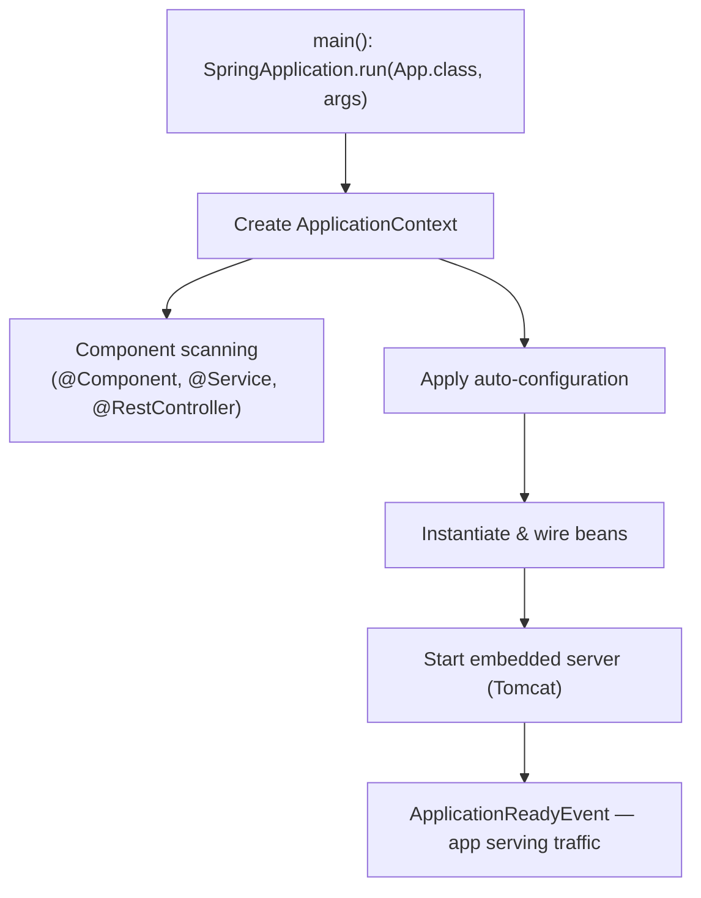

`@SpringBootApplication` is a meta-annotation combining `@SpringBootConfiguration`, `@EnableAutoConfiguration`, and `@ComponentScan`. Running `SpringApplication.run(...)` bootstraps the context, applies auto-configuration, starts the embedded server, and publishes lifecycle events.

### 1.5 Real example

**Scenario.** A team needs a minimal HTTP service exposing a health-style greeting endpoint, runnable as a single jar.

**Problem.** They want zero boilerplate and no servlet-container installation.

**Solution.** Use `spring-boot-starter-web` and a single `@RestController`. The embedded Tomcat ships inside the jar.

**Implementation.**

```java
// build: spring-boot-starter-parent + spring-boot-starter-web
package com.example.greeting;

import org.springframework.boot.SpringApplication;
import org.springframework.boot.autoconfigure.SpringBootApplication;
import org.springframework.web.bind.annotation.GetMapping;
import org.springframework.web.bind.annotation.RequestParam;
import org.springframework.web.bind.annotation.RestController;

@SpringBootApplication
public class GreetingApplication {
    public static void main(String[] args) {
        SpringApplication.run(GreetingApplication.class, args);
    }
}

@RestController
class GreetingController {

    public record Greeting(String message) {}

    @GetMapping("/greeting")
    Greeting greet(@RequestParam(defaultValue = "World") String name) {
        return new Greeting("Hello, " + name + "!");
    }
}
```

```bash
# Build and run a single executable jar
./mvnw clean package
java -jar target/greeting-0.0.1-SNAPSHOT.jar
# GET http://localhost:8080/greeting?name=Spring  ->  {"message":"Hello, Spring!"}
```

**Result.** A self-contained jar with embedded Tomcat serves JSON on port 8080 — no external server, no XML, one command.

**Future improvements.** Add `@ConfigurationProperties` for the greeting text (Chapter 4) and Actuator for health/metrics (Chapter 18).

### 1.6 Exercises

1. List three starters and the libraries each pulls in transitively.
2. What three annotations does `@SpringBootApplication` combine?
3. How would you switch the embedded server from Tomcat to Undertow?

### 1.7 Challenges

- **Challenge.** Generate a project with Spring Initializr (start.spring.io), add `web` and `actuator`, run it, and confirm the embedded server version printed in the startup log matches the BOM.

### 1.8 Checklist

- [ ] I understand what a starter is and why versions are managed for me.
- [ ] I can explain the role of `@SpringBootApplication`.
- [ ] I know Spring Boot 3 requires Java 17+ and the `jakarta.*` namespace.
- [ ] I can package and run an app as a single executable jar.

### 1.9 Best practices

- Prefer starters over hand-picking individual libraries — you inherit tested version alignment.
- Keep the main application class in the **root package** so component scanning covers all sub-packages.
- Let the BOM manage versions; only override a version when you have a concrete reason.

### 1.10 Anti-patterns

- Pinning library versions manually and fighting the managed BOM, causing classpath conflicts.
- Placing `@SpringBootApplication` in a deep package so component scanning misses your beans.
- Mixing `javax.*` and `jakarta.*` imports (the former is unsupported in Spring Boot 3).

### 1.11 Troubleshooting

| Symptom | Likely cause | Action |
|---------|--------------|--------|
| Beans/controllers not discovered | Main class outside root package | Move it up so `@ComponentScan` covers them |
| `ClassNotFoundException: javax.servlet...` | Legacy `javax.*` dependency | Use Jakarta-based libraries; Boot 3 is `jakarta.*` |
| Port 8080 already in use | Another process bound to the port | Set `server.port` or free the port |
| Wrong/duplicate dependency versions | Bypassing the BOM | Remove explicit versions; rely on starter parent |

### 1.12 Official references

- Spring Boot reference — Getting Started: https://docs.spring.io/spring-boot/reference/using/index.html
- Spring Boot starters: https://docs.spring.io/spring-boot/reference/using/build-systems.html#using.build-systems.starters
- Spring Initializr: https://start.spring.io
- Spring Boot 3 release notes: https://github.com/spring-projects/spring-boot/wiki/Spring-Boot-3.0-Release-Notes

---

## Chapter 2 — Auto-configuration and the Spring Boot lifecycle

### 2.1 Introduction

Auto-configuration is the mechanism that makes Spring Boot feel magical: based on what is on the classpath, what beans already exist, and what properties are set, Spring Boot **conditionally** configures beans for you (a `DataSource`, a `Jackson` mapper, an MVC stack, and so on). This chapter explains how auto-configuration is discovered and applied, how conditions decide what gets created, and how you override or disable it.

### 2.2 Business context

Auto-configuration is what turns "weeks of plumbing" into "minutes of coding." For a business, that means faster delivery and fewer configuration defects. But teams must understand it well enough to **debug** it — when a bean unexpectedly exists (or doesn't), the difference between a one-line fix and a multi-day investigation is knowing how conditions and ordering work. Treating auto-configuration as an unknowable black box is an operational risk.

### 2.3 Theoretical concepts: conditional beans

Auto-configuration classes are listed in `META-INF/spring/org.springframework.boot.autoconfigure.AutoConfiguration.imports`. Each is gated by `@Conditional` annotations such as `@ConditionalOnClass`, `@ConditionalOnMissingBean`, and `@ConditionalOnProperty`. The crucial rule: **your beans win** — `@ConditionalOnMissingBean` means an auto-configured bean is created only if you didn't already define one.

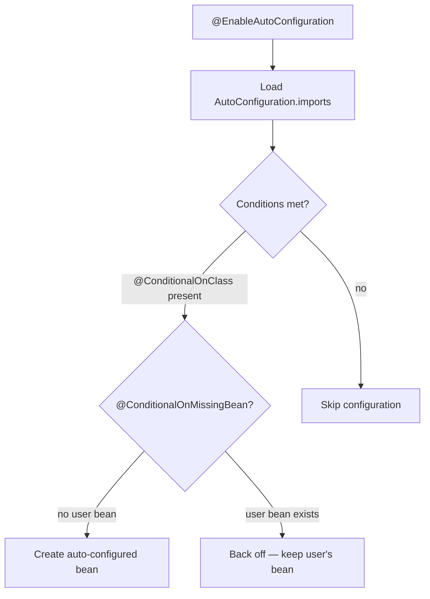

### 2.4 Architecture: where auto-configuration sits

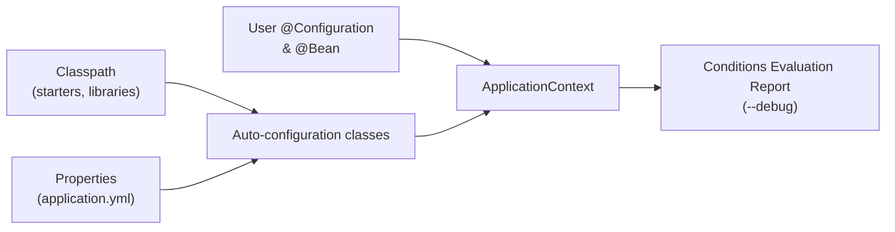

Auto-configuration runs **after** your own configuration so your beans are seen first; this is why user-defined beans cause the matching auto-config to "back off."

### 2.5 Real example

**Scenario.** A team wants a custom JSON `ObjectMapper` (snake_case, ignore unknown fields) but keep all other web auto-configuration intact.

**Problem.** They worry that defining their own mapper will break Spring Boot's Jackson setup.

**Solution.** Define a single `@Bean ObjectMapper`. Because the Jackson auto-configuration uses `@ConditionalOnMissingBean`, it backs off for the mapper while keeping everything else.

**Implementation.**

```java
package com.example.config;

import com.fasterxml.jackson.databind.DeserializationFeature;
import com.fasterxml.jackson.databind.ObjectMapper;
import com.fasterxml.jackson.databind.PropertyNamingStrategies;
import org.springframework.context.annotation.Bean;
import org.springframework.context.annotation.Configuration;

@Configuration
public class JacksonConfig {

    @Bean
    ObjectMapper objectMapper() {
        return new ObjectMapper()
            .setPropertyNamingStrategy(PropertyNamingStrategies.SNAKE_CASE)
            .configure(DeserializationFeature.FAIL_ON_UNKNOWN_PROPERTIES, false);
    }
}
```

```bash
# See exactly which auto-configurations matched and why
java -jar app.jar --debug
# ...prints the "Conditions Evaluation Report":
# Positive matches / Negative matches / Exclusions
```

**Result.** The application uses your `ObjectMapper`; Spring Boot's Jackson auto-config backs off for that bean but still wires the rest of the web stack.

**Future improvements.** Prefer customizing via `Jackson2ObjectMapperBuilderCustomizer` so Boot's other defaults (modules, date handling) are preserved; reserve a full `ObjectMapper` bean for cases that truly need total control.

### 2.6 Exercises

1. What file declares auto-configuration classes in Spring Boot 3?
2. Explain what `@ConditionalOnMissingBean` does and why it matters.
3. How do you exclude a specific auto-configuration class?

### 2.7 Challenges

- **Challenge.** Run your app with `--debug`, open the Conditions Evaluation Report, and explain why one positive match and one negative match appear.

### 2.8 Checklist

- [ ] I can describe how auto-configuration is discovered.
- [ ] I know the common `@Conditional` annotations and the "back off" rule.
- [ ] I can read the Conditions Evaluation Report.
- [ ] I know how to exclude an auto-configuration via `exclude` or properties.

### 2.9 Best practices

- Override behavior by **adding your own bean** and letting auto-config back off, rather than fighting it.
- Use `Customizer` beans (e.g. `WebMvcConfigurer`, `Jackson2ObjectMapperBuilderCustomizer`) to tweak defaults without replacing them wholesale.
- Use the `--debug` report when a bean unexpectedly exists or is missing.

### 2.10 Anti-patterns

- Disabling broad swaths of auto-configuration "to be safe," then re-implementing the plumbing by hand.
- Defining a full replacement bean when a customizer would suffice, losing useful defaults.
- Assuming a bean exists without checking the conditions report.

### 2.11 Troubleshooting

| Symptom | Cause | Action |
|---------|-------|--------|
| Expected bean is missing | A condition wasn't met | Check `--debug` negative matches |
| Two conflicting beans of a type | Auto-config didn't back off | Ensure your bean type matches the `@ConditionalOnMissingBean` target |
| Auto-config you don't want is active | Class is on the classpath | Use `@SpringBootApplication(exclude = ...)` or `spring.autoconfigure.exclude` |
| Customization ignored | Replaced bean instead of customizing | Use the matching `Customizer`/`Configurer` |

### 2.12 Official references

- Auto-configuration: https://docs.spring.io/spring-boot/reference/using/auto-configuration.html
- Creating your own auto-configuration: https://docs.spring.io/spring-boot/reference/features/developing-auto-configuration.html
- Condition annotations: https://docs.spring.io/spring-boot/reference/features/developing-auto-configuration.html#features.developing-auto-configuration.condition-annotations
- Spring Boot reference (full): https://docs.spring.io/spring-boot/index.html

---

## Chapter 3 — The IoC container, beans, and dependency injection

### 3.1 Introduction

Underneath every Spring Boot app is the Spring Framework **Inversion of Control (IoC) container**: it creates objects (**beans**), resolves their dependencies, and manages their lifecycle. Spring Boot adds auto-configuration and conventions, but the container is the engine. This chapter covers beans, the stereotype annotations, **constructor injection** (the modern default), scopes, and how the `ApplicationContext` ties it together.

### 3.2 Business context

Dependency injection is not academic — it directly shapes **testability and change cost**. Code that receives its collaborators (rather than constructing them) can be unit-tested with fakes, swapped per environment, and refactored without ripple effects. Teams that internalize DI ship code that is cheaper to test and safer to evolve; teams that don't end up with tangled singletons and brittle tests.

### 3.3 Theoretical concepts: beans and injection

A **bean** is an object managed by the container. You declare beans either with **stereotype annotations** (`@Component`, `@Service`, `@Repository`, `@Controller`) that are component-scanned, or with `@Bean` methods inside a `@Configuration` class. Dependencies are supplied by the container — preferably through the **constructor**, which yields immutable, fully-initialized, easily-testable objects.

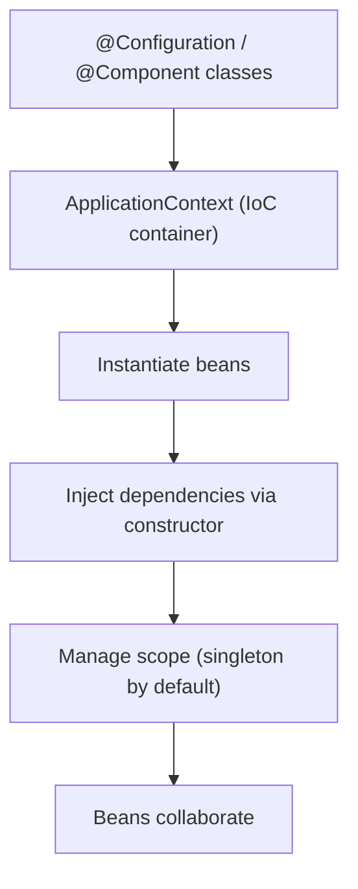

### 3.4 Architecture: a layered bean graph

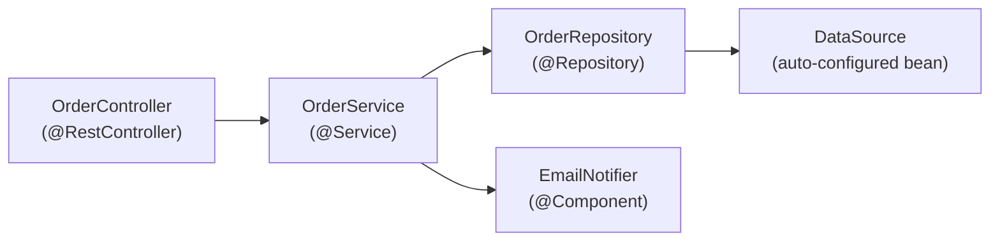

Each arrow is a constructor dependency the container resolves. Because beans are singletons by default, this graph is built once at startup and reused for every request.

### 3.5 Real example

**Scenario.** An order service must persist orders and send a confirmation, with both collaborators injectable for testing.

**Problem.** Field injection (`@Autowired` on fields) makes the class hard to unit-test and hides required dependencies.

**Solution.** Use **constructor injection**. With a single constructor, Spring injects automatically — no `@Autowired` needed — and the dependencies become `final`.

**Implementation.**

```java
package com.example.orders;

import org.springframework.stereotype.Service;

public interface Notifier { void confirm(String orderId); }

@Service
class OrderService {

    private final OrderRepository repository;
    private final Notifier notifier;

    // Single constructor: Spring injects these automatically.
    OrderService(OrderRepository repository, Notifier notifier) {
        this.repository = repository;
        this.notifier = notifier;
    }

    public String place(Order order) {
        Order saved = repository.save(order);
        notifier.confirm(saved.id());
        return saved.id();
    }
}
```

```java
// Unit test without Spring: just pass fakes to the constructor.
class OrderServiceTest {
    @org.junit.jupiter.api.Test
    void placesAndConfirms() {
        var repo = new InMemoryOrderRepository();          // fake
        var notifier = new RecordingNotifier();            // fake
        var service = new OrderService(repo, notifier);

        String id = service.place(new Order("ABC", 2));

        org.junit.jupiter.api.Assertions.assertNotNull(id);
        org.junit.jupiter.api.Assertions.assertTrue(notifier.wasCalledFor(id));
    }
}
```

**Result.** The service is immutable, its dependencies are explicit, and it is unit-testable with zero Spring infrastructure — tests run in milliseconds.

**Future improvements.** Promote `Order` to a record; if multiple `Notifier` implementations exist, disambiguate with `@Primary` or `@Qualifier` (Chapter 4 covers profile-based selection).

### 3.6 Exercises

1. Name the four stereotype annotations and the semantic each conveys.
2. Why is constructor injection preferred over field injection?
3. What is the default bean scope, and name one alternative scope.

### 3.7 Challenges

- **Challenge.** Introduce a second `Notifier` implementation and make the container choose the right one per profile using `@Profile`, without changing `OrderService`.

### 3.8 Checklist

- [ ] I can declare beans with stereotypes and with `@Bean` methods.
- [ ] I use constructor injection with `final` fields.
- [ ] I understand singleton vs other scopes.
- [ ] I can disambiguate multiple candidates with `@Qualifier`/`@Primary`.

### 3.9 Best practices

- Prefer constructor injection; let a single constructor be injected implicitly.
- Make injected fields `final` to express immutability and catch missing wiring at compile time.
- Keep beans focused (single responsibility); inject interfaces, not concrete classes, where it aids testing.

### 3.10 Anti-patterns

- Field injection (`@Autowired` on private fields) — hides dependencies and hurts testability.
- Calling `applicationContext.getBean(...)` from business code (service locator) instead of injecting.
- God-beans that depend on a dozen collaborators — a sign the class does too much.

### 3.11 Troubleshooting

| Symptom | Cause | Action |
|---------|-------|--------|
| `NoSuchBeanDefinitionException` | Bean not scanned or not declared | Add a stereotype/`@Bean`; verify package scanning |
| `NoUniqueBeanDefinitionException` | Multiple candidates for a type | Add `@Primary` or `@Qualifier` |
| Circular dependency error at startup | Two beans require each other via constructor | Break the cycle; reconsider design or use `@Lazy` |
| `null` dependency at runtime | Object created with `new` instead of injected | Make it a managed bean and inject it |

### 3.12 Official references

- The IoC container: https://docs.spring.io/spring-framework/reference/core/beans.html
- Dependency injection: https://docs.spring.io/spring-framework/reference/core/beans/dependencies/factory-collaborators.html
- Bean scopes: https://docs.spring.io/spring-framework/reference/core/beans/factory-scopes.html
- Spring Boot — Spring Beans and dependency injection: https://docs.spring.io/spring-boot/reference/using/spring-beans-and-dependency-injection.html

---

> **End of Part I.** You now have the foundational mental model of Spring Boot 3: the **project model** (starters, BOM, embedded server, `@SpringBootApplication`), the **auto-configuration** mechanism (conditional beans and the "back off" rule), and the **IoC container** with constructor-based dependency injection. **Part II — Configuration & Web APIs** (Chapters 4–6) builds on this to cover externalized configuration and profiles, REST APIs with Spring MVC, and validation with RFC 7807 `ProblemDetail` error handling.


---

## Part II – Configuration & Web APIs

Part I explained how Spring Boot wires itself together. Part II turns that container into a configurable, network-facing service. A real application reads its settings from the outside world, exposes HTTP endpoints, and rejects bad input gracefully. These three chapters cover externalized configuration and profiles (so one artifact runs everywhere), REST API construction with Spring MVC (so clients can talk to it), and Bean Validation with structured error handling (so failures are safe and predictable). Throughout, the platform baseline is Spring Boot 3.x on Spring Framework 6, Java 17+, and the `jakarta.*` namespace.

---

## Chapter 4 — Externalized configuration, profiles, and `@ConfigurationProperties`

### 4.1 Introduction

A single deployable artifact must behave differently in development, staging, and production: different database URLs, pool sizes, feature flags, and secrets. Spring Boot's **externalized configuration** makes this possible by reading settings from many sources — property and YAML files, OS environment variables, command-line arguments, and imported config — and merging them in a defined precedence order. **Profiles** let you activate environment-specific properties and beans, and **`@ConfigurationProperties`** binds a whole tree of settings to a type-safe, validated object. This chapter covers the property model, profiles, type-safe binding, and where secrets belong.

### 4.2 Business context

Hardcoded configuration is a reliability and security liability. A database URL compiled into a jar is correct in exactly one environment and wrong everywhere else; a password committed to source control is a breach waiting to be discovered. Externalized configuration enables the 12-factor ideal: one immutable artifact is promoted unchanged from dev to prod, with behavior varying only by external inputs. For an organization this lowers deployment risk, enables centralized secret management, and produces an auditable separation between code and environment. It also makes a fleet of services governable — operators tune behavior without rebuilding, and the same artifact that passed CI is the one that runs in production.

### 4.3 Theoretical concepts: the property model

Spring Boot assembles a single `Environment` from many **property sources**, each with a priority. When the same key appears in more than one source, the higher-priority source wins. A simplified precedence (highest first):

- Command-line arguments (`--server.port=9000`)
- OS environment variables and `SPRING_APPLICATION_JSON`
- Profile-specific files (`application-{profile}.yml`)
- The base file (`application.yml` / `application.properties`)
- Defaults declared in code (`@Value(":default")`, property defaults)

```mermaid
mindmap
  root((Externalized config))
    Property sources
      Command-line args
      Environment variables
      application-{profile}.yml
      application.yml
      Code defaults
    Profiles
      spring.profiles.active
      @Profile beans
      profile-specific YAML
    Type-safe binding
      @ConfigurationProperties
      @Validated
      records and relaxed binding
    Secrets
      from env or vault
      never in source control
      spring.config.import
```

Two ways to consume config exist: `@Value("${key}")` injects a single property into a field or parameter, while **`@ConfigurationProperties`** binds a prefixed subtree into a structured object. The latter is preferred because it groups related settings, supports **relaxed binding** (`max-size`, `maxSize`, `MAX_SIZE` all map to the same property), and integrates with Jakarta Bean Validation for fail-fast startup checks.

### 4.4 Architecture: how configuration resolves

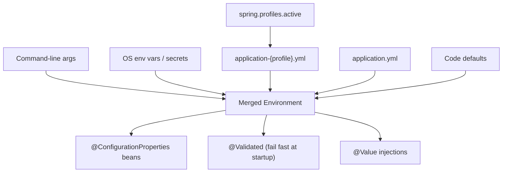

The `Environment` is built early in the bootstrap sequence, before most beans are created. `spring.profiles.active` decides which profile-specific files participate in the merge. Binding into `@ConfigurationProperties` objects happens during context refresh, and when those objects are annotated `@Validated`, any constraint violation aborts startup — a misconfigured service fails loudly at launch rather than silently at the first request.

### 4.5 Real example

**Scenario.** A checkout service must run with different connection-pool sizes and feature flags per environment, and its database password must come from a secret store rather than any file.

**Problem.** Settings are scattered across a dozen `@Value` annotations, there is no validation, and the password risks being committed inside `application.yml`.

**Solution.** Consolidate settings into a validated `@ConfigurationProperties` record, place environment differences in profile-specific YAML, and inject the password from an environment variable so it never touches source control.

**Implementation.**

```yaml
# application.yml (defaults shared by every environment)
app:
  features:
    new-checkout: false
  pool:
    max-size: 10
---
# application-prod.yml (production overrides)
spring:
  config:
    activate:
      on-profile: prod
app:
  features:
    new-checkout: true
  pool:
    max-size: 50
spring:
  datasource:
    url: jdbc:postgresql://db.prod.internal:5432/app
    username: app
    password: ${DB_PASSWORD}   # resolved from the environment / secret store
```

```java
package com.example.checkout.config;

import jakarta.validation.Valid;
import jakarta.validation.constraints.Max;
import jakarta.validation.constraints.Min;
import org.springframework.boot.context.properties.ConfigurationProperties;
import org.springframework.validation.annotation.Validated;

@ConfigurationProperties(prefix = "app")
@Validated
public record AppProperties(
        Features features,
        @Valid Pool pool
) {
    public record Features(boolean newCheckout) {}

    public record Pool(@Min(1) @Max(200) int maxSize) {}
}
```

```java
package com.example.checkout;

import com.example.checkout.config.AppProperties;
import org.springframework.boot.SpringApplication;
import org.springframework.boot.autoconfigure.SpringBootApplication;
import org.springframework.boot.context.properties.EnableConfigurationProperties;
import org.springframework.stereotype.Service;

@SpringBootApplication
@EnableConfigurationProperties(AppProperties.class)
public class CheckoutApplication {
    public static void main(String[] args) {
        SpringApplication.run(CheckoutApplication.class, args);
    }
}

@Service
class CheckoutService {

    private final AppProperties props;

    CheckoutService(AppProperties props) {
        this.props = props;
    }

    boolean newCheckoutEnabled() {
        return props.features().newCheckout();
    }
}
```

```java
package com.example.checkout;

import static org.assertj.core.api.Assertions.assertThat;

import com.example.checkout.config.AppProperties;
import org.junit.jupiter.api.Test;
import org.springframework.beans.factory.annotation.Autowired;
import org.springframework.boot.test.context.SpringBootTest;
import org.springframework.test.context.ActiveProfiles;

@SpringBootTest
@ActiveProfiles("prod")
class ProdConfigTest {

    @Autowired
    AppProperties props;

    @Test
    void prodOverridesApplied() {
        assertThat(props.features().newCheckout()).isTrue();
        assertThat(props.pool().maxSize()).isEqualTo(50);
    }
}
```

```bash
# Activate the prod profile and supply the secret at run time.
DB_PASSWORD=s3cr3t java -jar app.jar --spring.profiles.active=prod
```

**Result.** One artifact behaves correctly in every environment. The password lives only in the deployment environment, never in a file. Invalid configuration — say, `max-size: 0` — fails fast at startup with a clear validation message instead of surfacing as a runtime defect.

**Future improvements.** Source the password from a managed store via `spring.config.import=vault://` or a Kubernetes secret, add `@ConfigurationProperties` metadata (annotation processor) so the IDE autocompletes keys, and expose non-secret feature flags through a refreshable mechanism.

### 4.6 Exercises

1. Order these property sources by precedence (highest first): `application.yml`, an OS environment variable, a command-line argument.
2. Convert three related `@Value` injections into a single validated `@ConfigurationProperties` record.
3. Show two different ways to activate the `prod` profile at run time.

### 4.7 Challenges

- **Challenge.** Take a service whose configuration is spread across `@Value` strings, externalize every setting into base plus profile-specific YAML, bind it with a validated `@ConfigurationProperties` record, and inject exactly one secret from an environment variable. Prove the prod overrides with a `@SpringBootTest` using `@ActiveProfiles("prod")`.

### 4.8 Checklist

- [ ] No secrets appear in source code or committed property files.
- [ ] Environment differences live in `application-{profile}.yml`, not in code.
- [ ] Configuration is bound via type-safe, `@Validated` `@ConfigurationProperties`.
- [ ] The active profile is set explicitly per environment.
- [ ] Invalid configuration fails fast at startup, not at first request.

### 4.9 Best practices

- Prefer `@ConfigurationProperties` (grouped, type-safe, validated) over scattered `@Value` strings.
- Ship one immutable artifact and vary behavior only through externalized configuration.
- Inject secrets from environment variables or a vault; never commit them.
- Add `@Validated` and Jakarta constraints so misconfiguration aborts startup.
- Use relaxed binding intentionally and keep property names kebab-case in YAML.

### 4.10 Anti-patterns

- Passwords or API keys in `application.yml` checked into git.
- Building a separate artifact per environment instead of one promoted everywhere.
- Dozens of unvalidated `@Value` injections with no central structure.
- Overriding properties in profiles that should be code defaults, fragmenting the source of truth.

### 4.11 Troubleshooting

| Symptom | Likely cause | Action |
|---------|--------------|--------|
| Wrong value at runtime | Misunderstood precedence order | Inspect the property-source order; a higher source is overriding you |
| Profile properties ignored | Profile not active | Set `spring.profiles.active` for that environment |
| Binding fails at startup | Type or constraint mismatch | Fix the property value or the validation constraint |
| `${DB_PASSWORD}` is literal | Env var not set | Export the variable in the deployment environment |
| Property not bound to record | Prefix or relaxed-binding mismatch | Verify the `prefix` and the kebab-case key |

### 4.12 Official references

- Externalized configuration: https://docs.spring.io/spring-boot/reference/features/external-config.html
- Profiles: https://docs.spring.io/spring-boot/reference/features/profiles.html
- Type-safe `@ConfigurationProperties`: https://docs.spring.io/spring-boot/reference/features/external-config.html#features.external-config.typesafe-configuration-properties
- Importing additional config (`spring.config.import`): https://docs.spring.io/spring-boot/reference/features/external-config.html#features.external-config.files.importing

---

## Chapter 5 — Building REST APIs with Spring MVC

### 5.1 Introduction

**Spring MVC** is Spring Boot's servlet-based web stack. A front controller — the `DispatcherServlet` — routes each HTTP request to a handler method on a controller, binds path variables, query parameters, and request bodies, invokes your code, and serializes the return value back to the client. With `@RestController` the return value is written directly to the response body (typically as JSON via Jackson 2), so building a REST endpoint is mostly a matter of mapping URLs to methods and modeling request and response payloads. This chapter covers controllers, request mapping, content negotiation, status codes, and `ResponseEntity`.

> **Boot 3 note.** Spring Boot 3 has no built-in `@RequestMapping(version=...)` API-versioning attribute — that arrived later in the Spring Framework 7 / Boot 4 generation. In Boot 3 you version APIs by convention: distinct URI paths (`/v1/...`, `/v2/...`), a custom header read in the controller, or a custom request-condition resolver.

### 5.2 Business context

The HTTP API is the contract between a service and everyone who depends on it — front-ends, mobile apps, partner systems, and other services. A clean, predictable API lowers integration cost and reduces support load: clients can rely on consistent status codes, content types, and payload shapes. Spring MVC's conventions make the common case trivial and the uncommon case possible, so teams spend their effort on the domain rather than on plumbing request parsing and response writing. Getting the basics right — correct status codes, proper content negotiation, thin controllers — pays off every time a new consumer integrates.

### 5.3 Theoretical concepts

- **`DispatcherServlet`.** The front controller; it owns the request lifecycle and delegates to handler mappings and message converters.
- **Controllers.** `@RestController` (= `@Controller` + `@ResponseBody`) returns serialized bodies. `@RequestMapping` and its shortcuts `@GetMapping`, `@PostMapping`, `@PutMapping`, `@PatchMapping`, `@DeleteMapping` bind URLs and HTTP methods to methods.
- **Argument binding.** `@PathVariable`, `@RequestParam`, `@RequestBody`, and `@RequestHeader` populate handler parameters from the request.
- **Content negotiation.** Spring chooses a representation based on the `Accept` header (and configurable defaults) and uses an `HttpMessageConverter` — `MappingJackson2HttpMessageConverter` for JSON — to serialize.
- **Response control.** Return a value (serialized with `200 OK`), annotate with `@ResponseStatus`, or return a `ResponseEntity<T>` to set status, headers, and body explicitly.

### 5.4 Architecture: the request-handling pipeline

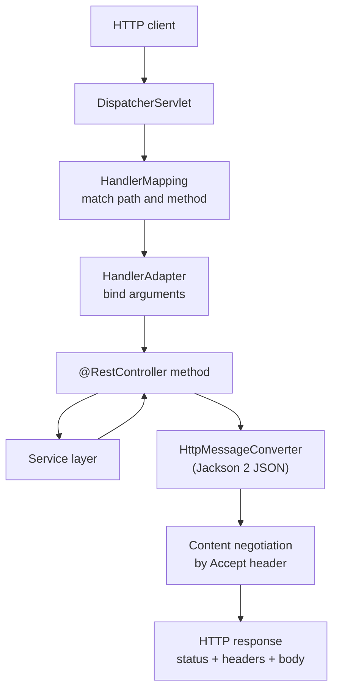

The pipeline is symmetrical: converters turn the inbound `@RequestBody` JSON into a Java object on the way in, and turn the returned object back into JSON on the way out. Because the controller deals in plain objects, it stays free of HTTP serialization concerns, and the service layer below it stays free of HTTP entirely.

### 5.5 Real example

**Scenario.** A team must expose a small orders API: create an order, fetch one by id, and list orders with optional paging. Responses are JSON; creation must return `201 Created` with a `Location` header.

**Problem.** Without deliberate design, controllers tend to return everything as `200 OK`, leak entity classes into the API, and put business logic inside the web layer.

**Solution.** Use `@RestController` with explicit mappings, dedicated request/response records (DTOs) separate from the domain, and `ResponseEntity` to set the proper status and headers. Keep the controller thin and delegate to a service.

**Implementation.**

```java
package com.example.orders.api;

import java.math.BigDecimal;

// Request and response payloads are records, decoupled from the domain entity.
public record CreateOrderRequest(String item, int quantity, BigDecimal unitPrice) {}

public record OrderResponse(String id, String item, int quantity, BigDecimal total) {}
```

```java
package com.example.orders.api;

import java.net.URI;
import org.springframework.http.MediaType;
import org.springframework.http.ResponseEntity;
import org.springframework.web.bind.annotation.GetMapping;
import org.springframework.web.bind.annotation.PathVariable;
import org.springframework.web.bind.annotation.PostMapping;
import org.springframework.web.bind.annotation.RequestBody;
import org.springframework.web.bind.annotation.RequestMapping;
import org.springframework.web.bind.annotation.RequestParam;
import org.springframework.web.bind.annotation.RestController;
import org.springframework.web.util.UriComponentsBuilder;

@RestController
@RequestMapping(path = "/orders", produces = MediaType.APPLICATION_JSON_VALUE)
public class OrderController {

    private final OrderService service;

    public OrderController(OrderService service) {
        this.service = service;
    }

    @PostMapping(consumes = MediaType.APPLICATION_JSON_VALUE)
    public ResponseEntity<OrderResponse> create(@RequestBody CreateOrderRequest request,
                                                UriComponentsBuilder uriBuilder) {
        OrderResponse created = service.create(request);
        URI location = uriBuilder.path("/orders/{id}").build(created.id());
        return ResponseEntity.created(location).body(created);
    }

    @GetMapping("/{id}")
    public OrderResponse byId(@PathVariable String id) {
        return service.find(id); // returned object is serialized with 200 OK
    }

    @GetMapping
    public java.util.List<OrderResponse> list(
            @RequestParam(defaultValue = "0") int page,
            @RequestParam(defaultValue = "20") int size) {
        return service.list(page, size);
    }
}
```

```java
package com.example.orders.api;

import static org.springframework.test.web.servlet.request.MockMvcRequestBuilders.get;
import static org.springframework.test.web.servlet.request.MockMvcRequestBuilders.post;
import static org.springframework.test.web.servlet.result.MockMvcResultMatchers.header;
import static org.springframework.test.web.servlet.result.MockMvcResultMatchers.jsonPath;
import static org.springframework.test.web.servlet.result.MockMvcResultMatchers.status;
import static org.mockito.Mockito.when;

import java.math.BigDecimal;
import org.junit.jupiter.api.Test;
import org.springframework.beans.factory.annotation.Autowired;
import org.springframework.boot.test.autoconfigure.web.servlet.WebMvcTest;
import org.springframework.boot.test.mock.mockito.MockBean;
import org.springframework.http.MediaType;
import org.springframework.test.web.servlet.MockMvc;

@WebMvcTest(OrderController.class)
class OrderControllerTest {

    @Autowired
    MockMvc mockMvc;

    // Boot 3 uses @MockBean for slice tests (not @MockitoBean, which is Boot 4 / SF7).
    @MockBean
    OrderService service;

    @Test
    void createReturns201WithLocation() throws Exception {
        when(service.create(org.mockito.ArgumentMatchers.any()))
                .thenReturn(new OrderResponse("42", "widget", 2, new BigDecimal("19.98")));

        mockMvc.perform(post("/orders")
                        .contentType(MediaType.APPLICATION_JSON)
                        .content("""
                                {"item":"widget","quantity":2,"unitPrice":9.99}
                                """))
                .andExpect(status().isCreated())
                .andExpect(header().string("Location", "http://localhost/orders/42"))
                .andExpect(jsonPath("$.total").value(19.98));
    }

    @Test
    void fetchByIdReturnsJson() throws Exception {
        when(service.find("42"))
                .thenReturn(new OrderResponse("42", "widget", 2, new BigDecimal("19.98")));

        mockMvc.perform(get("/orders/42").accept(MediaType.APPLICATION_JSON))
                .andExpect(status().isOk())
                .andExpect(jsonPath("$.id").value("42"));
    }
}
```

**Result.** The API returns correct status codes (`201 Created` with a `Location` header on creation, `200 OK` on reads), negotiates JSON cleanly, and keeps the controller thin — it parses, delegates, and serializes, with no business logic. Request and response shapes are records independent of the persistence model, so the domain can evolve without breaking the contract.

**Future improvements.** Add Bean Validation to the request DTO and structured error responses (Chapter 6), introduce paging metadata, document the endpoints with springdoc/OpenAPI, and, when a breaking change is needed, version by URI path or a custom header (Boot 3 has no built-in `version` mapping attribute).

### 5.6 Exercises

1. What does `@RestController` add on top of `@Controller`, and why does it matter for REST?
2. Name the annotations that bind a path segment, a query parameter, and a JSON body to handler parameters.
3. When would you return a `ResponseEntity<T>` instead of the plain object?

### 5.7 Challenges

- **Challenge.** Build a three-endpoint resource (create, read-by-id, list) that returns `201 Created` with a `Location` header on creation, negotiates JSON, and keeps all business logic in a service. Cover every endpoint with `@WebMvcTest` slice tests using `MockMvc` and `@MockBean`.

### 5.8 Checklist

- [ ] Controllers are thin: they bind, delegate, and serialize — no business logic.
- [ ] Request and response payloads are DTOs/records, not persistence entities.
- [ ] Creation returns `201 Created` with a `Location` header.
- [ ] Status codes and content types are set deliberately.
- [ ] Endpoints are covered by `@WebMvcTest` + `MockMvc` slice tests.

### 5.9 Best practices

- Use the method-specific mapping annotations (`@GetMapping`, `@PostMapping`, …) over a bare `@RequestMapping`.
- Separate API DTOs from domain/persistence types so the contract evolves independently.
- Return `ResponseEntity` when you need to control status, headers, or both (e.g., `Location` on create).
- Push all logic into the service layer; keep HTTP concerns in the controller.
- Be explicit about `consumes`/`produces` to make content types part of the contract.

### 5.10 Anti-patterns

- Returning `200 OK` for everything, including creations and errors.
- Exposing JPA entities directly as request/response bodies, coupling the API to the schema.
- Fat controllers that contain business rules or talk to the database directly.
- Ignoring content negotiation and assuming every client wants JSON regardless of `Accept`.

### 5.11 Troubleshooting

| Symptom | Likely cause | Action |
|---------|--------------|--------|
| `406 Not Acceptable` | `Accept` header has no matching converter | Align `produces` with what the client accepts |
| `415 Unsupported Media Type` | Request `Content-Type` not handled | Set `consumes` and send the matching `Content-Type` |
| `@RequestBody` is null | Missing/empty body or wrong `Content-Type` | Send a JSON body with `Content-Type: application/json` |
| `404` for an existing route | Path or method mismatch | Verify the mapping path and HTTP verb |
| Returned object not serialized | Used `@Controller` without `@ResponseBody` | Use `@RestController` or add `@ResponseBody` |

### 5.12 Official references

- Spring MVC overview: https://docs.spring.io/spring-framework/reference/web/webmvc.html
- Annotated controllers and request mapping: https://docs.spring.io/spring-framework/reference/web/webmvc/mvc-controller/ann-requestmapping.html
- Content negotiation: https://docs.spring.io/spring-framework/reference/web/webmvc/mvc-config/content-negotiation.html
- Spring Boot — developing web applications: https://docs.spring.io/spring-boot/reference/web/servlet.html

---

## Chapter 6 — Bean Validation and error handling

### 6.1 Introduction

A robust API never trusts its input and never leaks stack traces. **Jakarta Bean Validation** (`@Valid` plus constraint annotations such as `@NotBlank`, `@Min`, `@Email`) declares the rules a request payload must satisfy, and Spring MVC enforces them before your handler runs. When something does go wrong — a validation failure, a missing resource, an unexpected exception — a centralized **`@ControllerAdvice`** translates it into a consistent, machine-readable response. Spring Framework 6 standardizes that response shape with **`ProblemDetail`**, the RFC 9457 (formerly RFC 7807) "problem+json" media type. This chapter covers declarative validation and global error handling.

### 6.2 Business context

How an API fails is part of its contract. Inconsistent or leaky error responses cost clients hours of guesswork, expose internal details to attackers, and generate support tickets. Centralized validation and a uniform error format turn failures into something clients can program against: a stable status code, a typed problem category, and a clear message. For the organization this means fewer integration defects, a smaller attack surface (no stack traces in responses), and error payloads that monitoring and client SDKs can parse uniformly. Validating at the edge also keeps invalid data out of the domain and the database entirely.

### 6.3 Theoretical concepts

- **Constraint annotations.** Jakarta Bean Validation provides `@NotNull`, `@NotBlank`, `@Size`, `@Min`/`@Max`, `@Email`, `@Pattern`, and more, declared directly on DTO fields or record components.
- **`@Valid` / `@Validated`.** Placing `@Valid` on a `@RequestBody` parameter triggers validation; a failure raises `MethodArgumentNotValidException` before the handler body executes.
- **`ProblemDetail`.** An SF6 type representing an RFC 9457 problem response (`type`, `title`, `status`, `detail`, `instance`, plus custom properties), serialized as `application/problem+json`.
- **`@ControllerAdvice` / `@ExceptionHandler`.** A class annotated `@ControllerAdvice` (or `@RestControllerAdvice`) holds `@ExceptionHandler` methods that catch exceptions across all controllers and produce the error response.
- **`ResponseEntityExceptionHandler`.** A base class you can extend to customize how Spring's built-in MVC exceptions (validation, unsupported media type, etc.) map to `ProblemDetail`.

### 6.4 Architecture: validation and the error-handling path

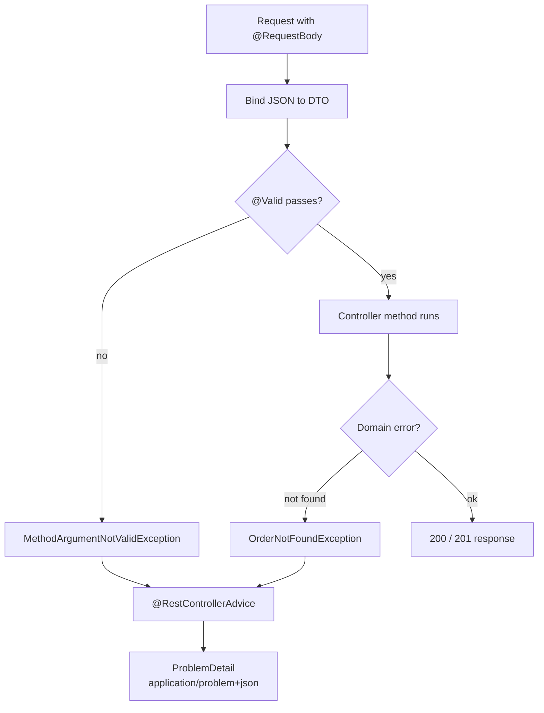

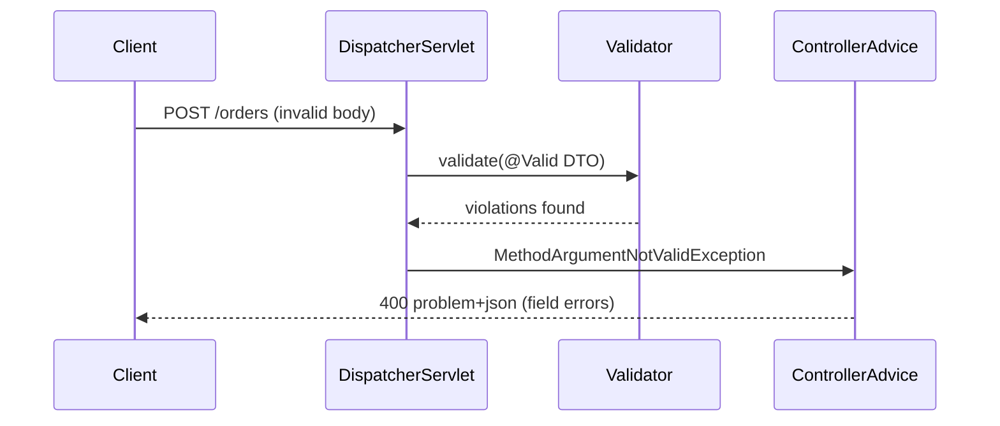

Validation runs as part of argument binding, so a bad payload never reaches your business logic. Any exception — framework or domain — funnels into the advice, which is the single place that decides the HTTP status and the `ProblemDetail` body. This keeps controllers free of try/catch noise and guarantees one error shape across the whole API.

### 6.5 Real example

**Scenario.** The orders API from Chapter 5 must reject malformed creation requests with field-level detail and return a clean `404` when an order id does not exist — both as RFC 9457 problem responses.

**Problem.** Today invalid input produces an opaque `400` with no field information, and a missing order throws an exception that surfaces as a `500` with a stack trace in the body.

**Solution.** Annotate the request DTO with Jakarta constraints, add `@Valid` to the handler parameter, define a domain `OrderNotFoundException`, and centralize translation in a `@RestControllerAdvice` that emits `ProblemDetail`.

**Implementation.**

```java
package com.example.orders.api;

import jakarta.validation.constraints.DecimalMin;
import jakarta.validation.constraints.Min;
import jakarta.validation.constraints.NotBlank;
import java.math.BigDecimal;

public record CreateOrderRequest(
        @NotBlank(message = "item must not be blank") String item,
        @Min(value = 1, message = "quantity must be at least 1") int quantity,
        @DecimalMin(value = "0.01", message = "unitPrice must be positive") BigDecimal unitPrice
) {}
```

```java
package com.example.orders.api;

import jakarta.validation.Valid;
import org.springframework.web.bind.annotation.PostMapping;
import org.springframework.web.bind.annotation.RequestBody;
// ... other imports as in Chapter 5

// Controller method now validates the body before running.
@PostMapping(consumes = "application/json")
public org.springframework.http.ResponseEntity<OrderResponse> create(
        @Valid @RequestBody CreateOrderRequest request,
        org.springframework.web.util.UriComponentsBuilder uriBuilder) {
    OrderResponse created = service.create(request);
    var location = uriBuilder.path("/orders/{id}").build(created.id());
    return org.springframework.http.ResponseEntity.created(location).body(created);
}
```

```java
package com.example.orders.api;

// Domain exception raised by the service when an id is unknown.
public class OrderNotFoundException extends RuntimeException {
    public OrderNotFoundException(String id) {
        super("Order not found: " + id);
    }
}
```

```java
package com.example.orders.api;

import java.net.URI;
import org.springframework.http.HttpHeaders;
import org.springframework.http.HttpStatus;
import org.springframework.http.HttpStatusCode;
import org.springframework.http.ProblemDetail;
import org.springframework.http.ResponseEntity;
import org.springframework.web.bind.MethodArgumentNotValidException;
import org.springframework.web.bind.annotation.ExceptionHandler;
import org.springframework.web.bind.annotation.RestControllerAdvice;
import org.springframework.web.context.request.WebRequest;
import org.springframework.web.servlet.mvc.method.annotation.ResponseEntityExceptionHandler;

@RestControllerAdvice
public class ApiExceptionHandler extends ResponseEntityExceptionHandler {

    // Map the domain "not found" to a 404 problem+json response.
    @ExceptionHandler(OrderNotFoundException.class)
    public ProblemDetail handleNotFound(OrderNotFoundException ex) {
        ProblemDetail pd = ProblemDetail.forStatusAndDetail(HttpStatus.NOT_FOUND, ex.getMessage());
        pd.setTitle("Order not found");
        pd.setType(URI.create("https://api.example.com/problems/order-not-found"));
        return pd;
    }

    // Customize the built-in validation failure to include per-field errors.
    @Override
    protected ResponseEntity<Object> handleMethodArgumentNotValid(
            MethodArgumentNotValidException ex,
            HttpHeaders headers,
            HttpStatusCode status,
            WebRequest request) {

        ProblemDetail pd = ProblemDetail.forStatusAndDetail(
                HttpStatus.BAD_REQUEST, "Request validation failed");
        pd.setTitle("Invalid request");
        pd.setType(URI.create("https://api.example.com/problems/validation-error"));

        var fieldErrors = ex.getBindingResult().getFieldErrors().stream()
                .collect(java.util.stream.Collectors.toMap(
                        fe -> fe.getField(),
                        fe -> fe.getDefaultMessage() == null ? "invalid" : fe.getDefaultMessage(),
                        (a, b) -> a));
        pd.setProperty("errors", fieldErrors);

        return ResponseEntity.status(status).headers(headers).body(pd);
    }
}
```

```java
package com.example.orders.api;

import static org.mockito.Mockito.when;
import static org.springframework.test.web.servlet.request.MockMvcRequestBuilders.get;
import static org.springframework.test.web.servlet.request.MockMvcRequestBuilders.post;
import static org.springframework.test.web.servlet.result.MockMvcResultMatchers.content;
import static org.springframework.test.web.servlet.result.MockMvcResultMatchers.jsonPath;
import static org.springframework.test.web.servlet.result.MockMvcResultMatchers.status;

import org.junit.jupiter.api.Test;
import org.springframework.beans.factory.annotation.Autowired;
import org.springframework.boot.test.autoconfigure.web.servlet.WebMvcTest;
import org.springframework.boot.test.mock.mockito.MockBean;
import org.springframework.http.MediaType;
import org.springframework.test.web.servlet.MockMvc;

@WebMvcTest(OrderController.class)
class OrderErrorHandlingTest {

    @Autowired
    MockMvc mockMvc;

    @MockBean
    OrderService service;

    @Test
    void invalidBodyReturns400ProblemDetail() throws Exception {
        // quantity 0 and blank item violate the constraints.
        mockMvc.perform(post("/orders")
                        .contentType(MediaType.APPLICATION_JSON)
                        .content("""
                                {"item":"","quantity":0,"unitPrice":9.99}
                                """))
                .andExpect(status().isBadRequest())
                .andExpect(content().contentTypeCompatibleWith("application/problem+json"))
                .andExpect(jsonPath("$.title").value("Invalid request"))
                .andExpect(jsonPath("$.errors.item").exists())
                .andExpect(jsonPath("$.errors.quantity").exists());
    }

    @Test
    void unknownIdReturns404ProblemDetail() throws Exception {
        when(service.find("999")).thenThrow(new OrderNotFoundException("999"));

        mockMvc.perform(get("/orders/999"))
                .andExpect(status().isNotFound())
                .andExpect(content().contentTypeCompatibleWith("application/problem+json"))
                .andExpect(jsonPath("$.title").value("Order not found"));
    }
}
```

**Result.** Malformed requests get a `400` with `application/problem+json` listing exactly which fields failed and why; an unknown id gets a `404` with a typed problem category and no stack trace. Every error in the API now shares one shape, so clients, SDKs, and monitoring can parse failures uniformly.

**Future improvements.** Add a catch-all `@ExceptionHandler(Exception.class)` that returns a generic `500` problem (logging the cause server-side but never exposing it), enrich `ProblemDetail` with a correlation/trace id, and add validation groups for create-versus-update payloads.

### 6.6 Exercises

1. What exception does Spring raise when `@Valid` on a `@RequestBody` fails, and what status should it map to?
2. List the standard fields of an RFC 9457 `ProblemDetail` body.
3. Why centralize error handling in `@ControllerAdvice` instead of try/catch in each controller?

### 6.7 Challenges

- **Challenge.** Add Jakarta constraints to a request DTO, wire a `@RestControllerAdvice` extending `ResponseEntityExceptionHandler` that returns `ProblemDetail`, and prove with `MockMvc` that an invalid body yields a `400` with per-field errors and an unknown id yields a `404` — both as `application/problem+json`.

### 6.8 Checklist

- [ ] Request DTOs carry Jakarta constraint annotations.
- [ ] Handler parameters are annotated `@Valid`.
- [ ] A `@ControllerAdvice` centralizes error translation.
- [ ] Error responses use `ProblemDetail` (`application/problem+json`).
- [ ] No stack traces or internal details leak in any error body.

### 6.9 Best practices

- Validate at the edge so invalid data never reaches the domain or database.
- Return RFC 9457 `ProblemDetail` for every error and keep the shape consistent.
- Map domain exceptions to specific statuses (`404`, `409`) in one advice class.
- Extend `ResponseEntityExceptionHandler` to customize Spring's built-in MVC exceptions.
- Log the cause server-side; expose only a safe message and a typed problem category.

### 6.10 Anti-patterns

- Manual `if`-based validation scattered through controllers instead of declarative constraints.
- Returning raw exception messages or stack traces in the response body.
- A different error shape per endpoint, forcing clients to special-case each one.
- Catching exceptions inside controllers and swallowing or mistranslating them.

### 6.11 Troubleshooting

| Symptom | Likely cause | Action |
|---------|--------------|--------|
| Validation never triggers | `@Valid` missing on the parameter | Add `@Valid` to the `@RequestBody` parameter |
| `400` has no field details | Default handler used | Override `handleMethodArgumentNotValid` to add `errors` |
| Error body is HTML/whitelabel | No `@ControllerAdvice` matched | Add an `@ExceptionHandler` for that exception type |
| Wrong content type on errors | Not using `ProblemDetail` | Return `ProblemDetail` so `application/problem+json` is set |
| Constraints ignored on nested object | Missing `@Valid` on the field | Annotate the nested field with `@Valid` |

### 6.12 Official references

- Jakarta Bean Validation in Spring MVC: https://docs.spring.io/spring-framework/reference/web/webmvc/mvc-controller/ann-validation.html
- Error responses and `ProblemDetail` (RFC 9457): https://docs.spring.io/spring-framework/reference/web/webmvc/mvc-ann-rest-exceptions.html
- `@ControllerAdvice` and `@ExceptionHandler`: https://docs.spring.io/spring-framework/reference/web/webmvc/mvc-controller/ann-exceptionhandler.html
- Spring Boot — handling errors: https://docs.spring.io/spring-boot/reference/web/servlet.html#web.servlet.spring-mvc.error-handling

---

> **End of Part II.** You can now externalize configuration across environments, expose clean REST endpoints with Spring MVC, and reject bad input with validated, RFC 9457-compliant error responses. **Part III — Data & Transactions** (Chapters 7–9) goes beneath the web layer: persistence with Spring Data JPA and repositories, declarative transaction management with `@Transactional`, and database migrations and testing strategies that keep your data layer correct under change.


---

## Part III – Data & Transactions

Part III is where Spring Boot stops being a web framework and becomes a system of record. Almost every business application persists state, and the moment you do, two hard problems appear: how to map objects to relational rows without drowning in boilerplate, and how to guarantee that a sequence of writes either all happens or none of it does. Spring Boot 3 answers the first with **Spring Data JPA** (repository abstractions over JPA 3.1 / Hibernate on the `jakarta.persistence.*` namespace) and the second with the declarative **`@Transactional`** model. A third concern — keeping the database schema and the connection layer healthy in production — is handled by **Flyway/Liquibase** migrations and the **HikariCP** pool that Spring Boot wires by default. These three chapters take you from a first entity to a production-ready data layer.

---

## Chapter 7 — Spring Data JPA fundamentals: entities, repositories, queries

### 7.1 Introduction

Spring Data JPA removes the repetitive plumbing of data access. You declare an **entity** (a class mapped to a table via `jakarta.persistence.*` annotations) and a **repository interface** that extends `JpaRepository`, and Spring Data generates the implementation at runtime — finders, paging, sorting, and CRUD all included. On top of that you get **derived query methods** (queries inferred from method names), **`@Query`** for explicit JPQL or native SQL, **`Pageable`/`Page`** for paginated reads, and **record-based DTO projections** that fetch only the columns you need. This chapter covers the building blocks you will use in every Spring Boot 3 service that touches a relational database.

### 7.2 Business context

For an engineering organization, the data layer is where most defects and most latency hide. Hand-written DAO code is verbose, error-prone, and inconsistent from team to team; every developer reinvents pagination and every code review re-litigates how to map a foreign key. Spring Data JPA standardizes this surface: repositories look the same across services, paging is uniform, and projections make it natural to fetch *only what the screen needs* — which keeps both database load and payload size down. The business payoff is faster delivery, fewer data bugs, and a persistence layer that new hires recognize on day one.

### 7.3 Theoretical concepts

- **Entity.** A POJO annotated with `@Entity` and `@Id`; each instance maps to a row. The `jakarta.persistence.*` annotations (`@Table`, `@Column`, `@GeneratedValue`, `@ManyToOne`, etc.) define the mapping. JPA 3.1 is the spec; Hibernate is Boot 3's default provider.
- **Repository.** An interface extending `JpaRepository<T, ID>`. Spring Data supplies the implementation: `save`, `findById`, `findAll`, `delete`, plus paging and sorting.
- **Derived queries.** Method names like `findByStatusAndTotalGreaterThan` are parsed into queries — no body required.
- **`@Query`.** When a name would be unwieldy, write JPQL (`@Query("select o from Order o where ...")`) or native SQL (`nativeQuery = true`).
- **`Pageable` / `Page`.** Pass a `Pageable` (page number, size, sort) and receive a `Page<T>` carrying content plus total-count metadata. `Slice<T>` skips the count when you only need "is there more?".
- **DTO projections.** A Java **record** (`record OrderSummary(Long id, BigDecimal total)`) used as the query return type fetches only those columns — lighter than loading full entities.
- **Fetch types.** `@ManyToOne`/`@OneToOne` are `EAGER` by default; `@OneToMany`/`@ManyToMany` are `LAZY`. Mismatched fetching is the root of the infamous N+1 problem.

### 7.4 Architecture: how a repository call reaches the database

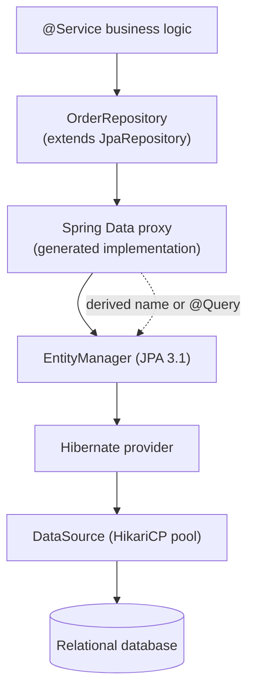

The service depends only on the interface; the proxy translates method calls into JPQL or SQL, the `EntityManager` and Hibernate execute them, and HikariCP hands out the pooled connection.

### 7.5 Real example

**Scenario.** An e-commerce service needs to list a customer's orders with pagination, find high-value pending orders for a fraud check, and return a lightweight summary for the order-history screen.

**Problem.** Loading every full `Order` (with its line items) for a list view is wasteful — it triggers extra queries and ships columns the screen never displays. The team also wants paging without hand-writing `LIMIT`/`OFFSET` and count queries.

**Solution.** Model the entity with explicit fetch types, expose a `JpaRepository` with one derived method, one `@Query`, and a **record projection**, and use `Pageable`/`Page` for the list view.

**Implementation.**

```java
package com.example.orders;

import jakarta.persistence.*;
import java.math.BigDecimal;
import java.time.Instant;

@Entity
@Table(name = "orders")
public class Order {

    @Id
    @GeneratedValue(strategy = GenerationType.IDENTITY)
    private Long id;

    @Column(nullable = false)
    private Long customerId;

    @Enumerated(EnumType.STRING)
    @Column(nullable = false, length = 20)
    private OrderStatus status;

    @Column(nullable = false)
    private BigDecimal total;

    @Column(nullable = false)
    private Instant createdAt;

    protected Order() { }  // JPA requires a no-arg constructor

    // getters/setters omitted for brevity
    public Long getId() { return id; }
    public OrderStatus getStatus() { return status; }
    public BigDecimal getTotal() { return total; }
}

enum OrderStatus { PENDING, PAID, SHIPPED, CANCELLED }
```

```java
package com.example.orders;

import java.math.BigDecimal;
import java.util.List;
import org.springframework.data.domain.Page;
import org.springframework.data.domain.Pageable;
import org.springframework.data.jpa.repository.JpaRepository;
import org.springframework.data.jpa.repository.Query;
import org.springframework.data.repository.query.Param;

// A record projection: only the columns the history screen needs.
record OrderSummary(Long id, OrderStatus status, BigDecimal total) { }

public interface OrderRepository extends JpaRepository<Order, Long> {

    // 1) Derived query + paging: name parsed into a query, Page carries total count.
    Page<Order> findByCustomerId(Long customerId, Pageable pageable);

    // 2) Explicit JPQL for a non-trivial predicate.
    @Query("select o from Order o where o.status = :status and o.total >= :min")
    List<Order> findPendingAbove(@Param("status") OrderStatus status,
                                 @Param("min") BigDecimal min);

    // 3) Constructor-expression projection into a record: fetches 3 columns, not the whole row.
    @Query("""
           select new com.example.orders.OrderSummary(o.id, o.status, o.total)
           from Order o where o.customerId = :customerId
           """)
    List<OrderSummary> summariesFor(@Param("customerId") Long customerId);
}
```

```java
package com.example.orders;

import org.springframework.data.domain.Page;
import org.springframework.data.domain.PageRequest;
import org.springframework.data.domain.Sort;
import org.springframework.stereotype.Service;
import java.math.BigDecimal;
import java.util.List;

@Service
public class OrderQueryService {

    private final OrderRepository repository;

    public OrderQueryService(OrderRepository repository) {
        this.repository = repository;
    }

    public Page<Order> ordersForCustomer(Long customerId, int page, int size) {
        var pageable = PageRequest.of(page, size, Sort.by("createdAt").descending());
        return repository.findByCustomerId(customerId, pageable);
    }

    public List<Order> fraudCandidates() {
        return repository.findPendingAbove(OrderStatus.PENDING, new BigDecimal("5000"));
    }

    public List<OrderSummary> history(Long customerId) {
        return repository.summariesFor(customerId);  // lightweight DTOs
    }
}
```

**Result.** The list view is paginated with one method call and a single count query; the fraud check uses a readable JPQL predicate; the history screen ships only three columns per row instead of full entities. No DAO boilerplate, no hand-written SQL pagination.

**Future improvements.** Add a `@EntityGraph` to the customer-orders finder if line items are needed (avoiding N+1), introduce keyset (cursor) pagination for very large result sets where `OFFSET` becomes slow, and add Spring Data's `@QueryHints` for read-only fetches.

### 7.6 Exercises

1. Write a derived query method that finds orders by status, sorted by total descending, returning a `List<Order>`.
2. Convert a method that returns `List<Order>` for a paged screen into one returning `Page<Order>` with a `Pageable` parameter.
3. Write a record projection that returns only `id` and `total`, and the matching `@Query` constructor expression.

### 7.7 Challenges

- **Challenge.** Given an `Order` with a `@OneToMany List<LineItem>` and a list view that triggers N+1 queries, fix it two ways: once with `@EntityGraph(attributePaths = "lineItems")` and once with a `join fetch` in `@Query`. Use SQL logging to prove the query count dropped.

### 7.8 Checklist

- [ ] My entities use `jakarta.persistence.*` annotations and have a no-arg constructor.
- [ ] My repositories extend `JpaRepository<T, ID>`.
- [ ] I use derived queries for simple cases and `@Query` for complex ones.
- [ ] List endpoints accept `Pageable` and return `Page`/`Slice`.
- [ ] Read-heavy endpoints use record projections, not full entities.

### 7.9 Best practices

- Prefer constructor-injected repositories at the service layer; keep entities free of business logic.
- Use record DTO projections for reads so you fetch only needed columns.
- Make collection associations `LAZY` and fetch them explicitly with `@EntityGraph`/`join fetch` when needed.
- Always paginate unbounded list queries; never return `findAll()` to a UI without limits.
- Enable `spring.jpa.show-sql` (or a SQL logger) in development to watch the generated queries.

### 7.10 Anti-patterns

- Returning entities directly from controllers, leaking the persistence model and causing lazy-loading errors after the session closes.
- Eagerly fetching collections (`@OneToMany(fetch = EAGER)`), which silently loads huge graphs.
- The N+1 query problem: iterating a list and triggering one query per element.
- Putting `@Transactional` and query logic in the same monster method instead of separating reads from writes.

### 7.11 Troubleshooting

| Symptom | Cause | Action |
|---------|-------|--------|
| `LazyInitializationException` | Lazy association accessed after the persistence context closed | Fetch with `@EntityGraph`/`join fetch`, or use a projection |
| Hundreds of small SELECTs for one list | N+1 from lazy associations in a loop | Use `join fetch` or `@EntityGraph` |
| `PropertyReferenceException` at startup | Derived method name doesn't match a field | Fix the property name in the method or use `@Query` |
| `Page` total count looks wrong with joins | Distinct rows vs. join multiplication | Use `countQuery` in `@Query` or `Slice` if count isn't needed |
| `InvalidDataAccessApiUsageException` on a write query | `@Modifying` missing on an update/delete `@Query` | Add `@Modifying` (and a transaction) |

### 7.12 Official references

- Spring Data JPA reference: https://docs.spring.io/spring-data/jpa/reference/jpa.html
- Defining query methods: https://docs.spring.io/spring-data/jpa/reference/repositories/query-methods-details.html
- Projections (DTO/interface): https://docs.spring.io/spring-data/jpa/reference/repositories/projections.html
- Paging and sorting: https://docs.spring.io/spring-data/jpa/reference/repositories/query-methods-details.html#repositories.special-parameters
- Spring Boot — working with SQL databases: https://docs.spring.io/spring-boot/reference/data/sql.html

---

## Chapter 8 — Transaction management with `@Transactional`

### 8.1 Introduction

A transaction is a unit of work that must be **atomic**: every write inside it commits together, or the whole thing rolls back. Spring's declarative model lets you mark a method `@Transactional` and the framework starts, commits, or rolls back a transaction around it via a proxy — no hand-written `begin`/`commit`/`rollback`. This chapter covers where to place `@Transactional`, the **propagation** rules that decide whether a new transaction starts or an existing one is joined, **rollback** semantics (and the runtime-vs-checked surprise), `readOnly` optimization, and the proxy pitfalls (self-invocation) that silently disable transactions.

### 8.2 Business context

Data correctness is existential. A half-committed transaction can double-charge a customer, ship an unpaid order, or lose money in a transfer. Declarative transactions give every team the same correctness guarantee without bespoke commit/rollback code in each service — which means fewer money-losing bugs and faster, safer reviews. The flip side is that transactions are easy to get subtly wrong: a swallowed exception that silently commits, or a `@Transactional` on a self-invoked method that does nothing, are the kind of defects that pass every test and fail in production. Understanding the model is a direct risk-reduction investment.

### 8.3 Theoretical concepts

- **`@Transactional`.** Declarative demarcation. A proxy wraps the bean; the transaction begins before the method and commits after it returns (or rolls back on a triggering exception).
- **Propagation.** What happens when a transactional method calls another:
  - `REQUIRED` (default) — join the current transaction, or start one if none exists.
  - `REQUIRES_NEW` — suspend the current transaction and run in a brand-new, independent one (commits/rolls back on its own).
  - `NESTED`, `SUPPORTS`, `MANDATORY`, `NEVER`, `NOT_SUPPORTED` — finer-grained variants.
- **Rollback rules.** By default Spring rolls back on **unchecked** exceptions (`RuntimeException`, `Error`) but **commits** on checked exceptions. Use `rollbackFor = Exception.class` to roll back on checked exceptions too.
- **`readOnly = true`.** A hint that lets the provider skip dirty-checking and lets the driver optimize; use it on query-only methods.
- **Isolation.** `READ_COMMITTED`, `REPEATABLE_READ`, etc. — controls visibility of concurrent changes; defaults to the database's setting.
- **Proxy boundary.** `@Transactional` works only when the call enters through the proxy. **Self-invocation** (a method in the same class calling another `@Transactional` method directly) bypasses the proxy and the annotation is ignored. The method must also be `public`.

### 8.4 Architecture: the transactional proxy

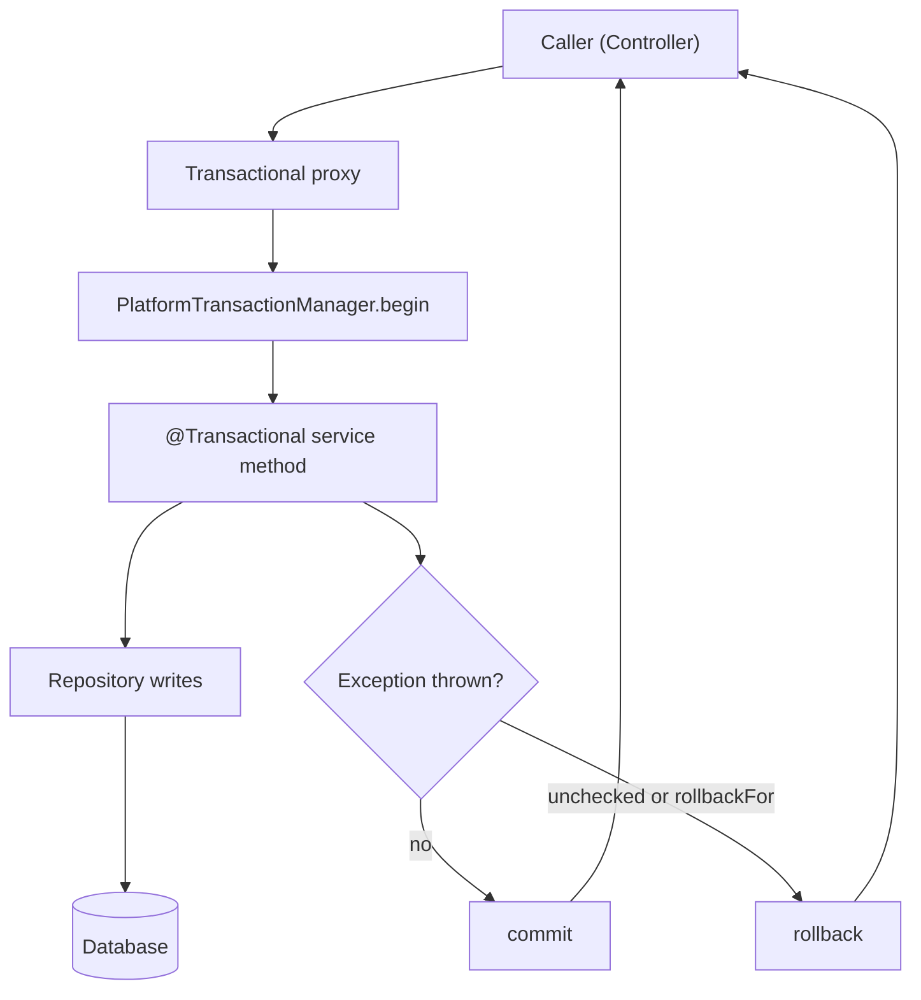

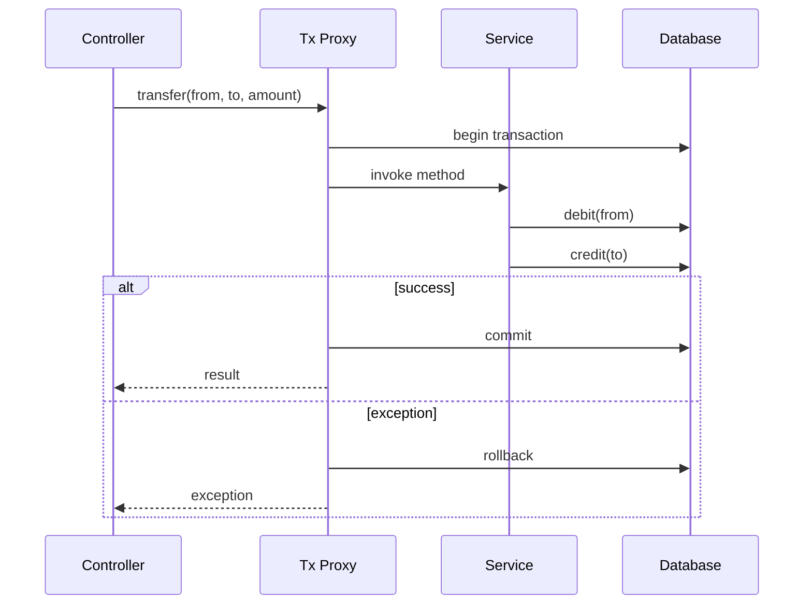

### 8.5 Real example

**Scenario.** A banking service must transfer money between two accounts: debit one, credit the other. The two writes must be atomic. Separately, every transfer must record an **audit entry** that persists *even if the transfer itself rolls back*.

**Problem.** If the credit fails after the debit succeeds, money vanishes — the writes must commit together. But the audit log has the opposite requirement: it must survive a failed transfer, so it cannot share the transfer's rollback fate.

**Solution.** Wrap the debit+credit in a single `REQUIRED` transaction. Write the audit entry through a separate bean annotated `REQUIRES_NEW`, so it commits in its own independent transaction. Throw a `RuntimeException` on insufficient funds so the transfer rolls back automatically.

**Implementation.**

```java
package com.example.bank;

import org.springframework.stereotype.Service;
import org.springframework.transaction.annotation.Propagation;
import org.springframework.transaction.annotation.Transactional;
import java.math.BigDecimal;

@Service
public class TransferService {

    private final AccountRepository accounts;
    private final AuditService audit;   // separate bean → goes through the proxy

    public TransferService(AccountRepository accounts, AuditService audit) {
        this.accounts = accounts;
        this.audit = audit;
    }

    @Transactional  // REQUIRED by default: debit + credit are one atomic unit
    public void transfer(Long fromId, Long toId, BigDecimal amount) {
        // Independent transaction: the audit entry survives even if we roll back below.
        audit.record(fromId, toId, amount);

        Account from = accounts.findById(fromId).orElseThrow();
        Account to   = accounts.findById(toId).orElseThrow();

        if (from.getBalance().compareTo(amount) < 0) {
            // Unchecked exception → automatic rollback of the transfer.
            throw new InsufficientFundsException(fromId);
        }
        from.debit(amount);
        to.credit(amount);
        // accounts are managed entities; dirty-checking flushes on commit
    }
}
```

```java
package com.example.bank;

import org.springframework.stereotype.Service;
import org.springframework.transaction.annotation.Propagation;
import org.springframework.transaction.annotation.Transactional;
import java.math.BigDecimal;

@Service
public class AuditService {

    private final AuditRepository auditRepository;

    public AuditService(AuditRepository auditRepository) {
        this.auditRepository = auditRepository;
    }

    // New, independent transaction: commits on its own, regardless of the caller's outcome.
    @Transactional(propagation = Propagation.REQUIRES_NEW)
    public void record(Long fromId, Long toId, BigDecimal amount) {
        auditRepository.save(new AuditEntry(fromId, toId, amount));
    }
}
```

```java
// Read-only optimization for a pure query path.
@Transactional(readOnly = true)
public Account view(Long id) {
    return accounts.findById(id).orElseThrow();
}
```

**Result.** Debit and credit commit or roll back together. On insufficient funds the transfer rolls back, but the audit entry — written in its own `REQUIRES_NEW` transaction through a separate bean — is still persisted, giving a complete trail of attempted transfers.

**Future improvements.** For cross-service atomicity (e.g., the transfer plus an external notification), adopt the transactional outbox pattern rather than relying on a single local transaction. Add optimistic locking (`@Version`) on `Account` to handle concurrent transfers, and consider `isolation = SERIALIZABLE` only where contention truly demands it.

### 8.6 Exercises

1. What is the difference between `Propagation.REQUIRED` and `Propagation.REQUIRES_NEW`?
2. A method throws a checked `IOException` but the transaction commits anyway. Why, and how do you make it roll back?
3. Why does annotating a `private` method with `@Transactional` have no effect?

### 8.7 Challenges

- **Challenge.** Reproduce the self-invocation bug: put two `@Transactional` methods in one class where one calls the other directly, and prove (via logging) that the inner transaction settings are ignored. Then fix it by moving the inner method to a separate bean.

### 8.8 Checklist

- [ ] I demarcate transactions with `@Transactional` at the service layer, not the repository or controller.
- [ ] I understand `REQUIRED` vs `REQUIRES_NEW` and when to use each.
- [ ] I know Spring rolls back on unchecked exceptions and commits on checked ones by default.
- [ ] I mark query-only methods `readOnly = true`.
- [ ] I never rely on `@Transactional` on self-invoked or non-public methods.

### 8.9 Best practices

- Keep transactions short; do no slow I/O (HTTP calls, large file reads) inside a transactional boundary.
- Place `@Transactional` on service methods; let repositories run within the service's transaction.
- Use `rollbackFor` explicitly when a checked exception must roll back.
- Use `readOnly = true` for reads to enable provider/driver optimizations.
- Let exceptions propagate; do not catch-and-swallow inside a transactional method.

### 8.10 Anti-patterns

- `@Transactional` on private or self-invoked methods — the proxy is bypassed, so it does nothing.
- Catching and swallowing an exception inside a transactional method, causing a silent commit of partial work.
- Putting `@Transactional` on the controller, holding a connection open for the whole request including view rendering.
- Assuming a single local transaction spans the database *and* an external system (broker, REST call) atomically.
- Long transactions that hold locks and exhaust the connection pool.

### 8.11 Troubleshooting

| Symptom | Cause | Action |
|---------|-------|--------|
| No rollback on a checked exception | Default rolls back only on unchecked | Add `rollbackFor = Exception.class` or throw a runtime exception |
| `@Transactional` seems ignored | Self-invocation or non-public method | Call through the proxy; move the method to another bean; make it `public` |
| `Connection pool exhausted` / timeouts | Long-running transactions holding connections | Shorten transactions; move slow I/O outside the boundary |
| Partial data committed after an error | Exception caught and swallowed inside the method | Let it propagate, or rethrow as a runtime exception |
| `REQUIRES_NEW` not creating a new transaction | Called via self-invocation, not the proxy | Put the `REQUIRES_NEW` method in a separate bean |

### 8.12 Official references

- Spring transaction management: https://docs.spring.io/spring-framework/reference/data-access/transaction.html
- Declarative transactions (`@Transactional`): https://docs.spring.io/spring-framework/reference/data-access/transaction/declarative.html
- `@Transactional` attribute settings: https://docs.spring.io/spring-framework/reference/data-access/transaction/declarative/annotations.html
- Spring Boot transaction support: https://docs.spring.io/spring-boot/reference/data/sql.html#data.sql.jdbc-template

---

## Chapter 9 — Database migrations and connection pooling: Flyway/Liquibase and HikariCP

### 9.1 Introduction

Two production concerns sit beneath every JPA application: the schema must evolve in a controlled, versioned way, and the application must talk to the database through an efficient, bounded pool of connections. Spring Boot 3 handles both with sensible auto-configuration. **Flyway** and **Liquibase** are migration tools that run versioned schema scripts automatically on startup, so the database structure is reproducible across every environment. **HikariCP** is the **default** connection pool — fast, lightweight, and wired automatically whenever a `DataSource` is on the classpath. This chapter shows how migrations run, how to write them, and how to size and tune the pool.

### 9.2 Business context

Schema drift is a silent killer: a column added by hand in staging but forgotten in production causes an outage at the worst time. Versioned migrations turn schema changes into reviewable, ordered, auditable code that runs identically everywhere — eliminating "it worked in test" failures and enabling safe, repeatable deployments. Connection pooling is equally load-bearing: opening a database connection is expensive, and an unbounded or mis-sized pool either starves the application (timeouts under load) or overwhelms the database (too many connections). Getting both right is the difference between a deployment that is boring and one that pages the on-call engineer.

### 9.3 Theoretical concepts

- **Migration tool.** Flyway (SQL-first, `V<version>__<description>.sql`) or Liquibase (changelog-based, XML/YAML/SQL). Spring Boot **auto-runs** pending migrations on startup when the dependency is on the classpath.
- **Flyway versioning.** Files like `V1__create_orders.sql`, `V2__add_status_column.sql` run in order; Flyway records applied versions in a `flyway_schema_history` table and never re-runs an applied script.
- **Repeatable migrations.** Flyway `R__<description>.sql` re-run whenever their checksum changes (useful for views).
- **Liquibase changelog.** A master changelog references changesets, each with a unique id/author; Liquibase tracks them in `DATABASECHANGELOG`.
- **JPA vs migrations.** In production, set `spring.jpa.hibernate.ddl-auto=validate` (or `none`) and let the migration tool own the schema — never `update` or `create` in production.
- **HikariCP.** The default pool. Key properties under `spring.datasource.hikari.*`: `maximum-pool-size`, `minimum-idle`, `connection-timeout`, `idle-timeout`, `max-lifetime`.
- **Pool sizing.** Bigger is not better. A small, well-sized pool (often far fewer connections than threads) usually maximizes throughput; the right number depends on database cores and workload.

### 9.4 Architecture: startup sequence and the pool

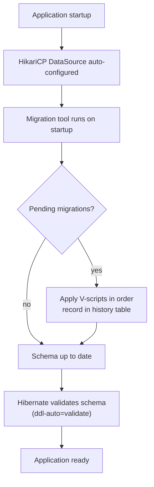

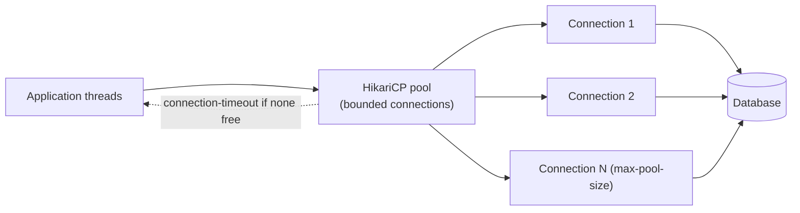

### 9.5 Real example

**Scenario.** A team is moving from a hand-managed schema to versioned migrations and must also tune the pool because the service times out under peak load.

**Problem.** Schema changes are applied manually and inconsistently across environments, and the default pool settings cause `connection-timeout` errors during traffic spikes while the database CPU is barely used — a sign the pool is mis-sized and transactions hold connections too long.

**Solution.** Adopt Flyway with versioned scripts, switch Hibernate to `validate` so JPA never mutates the schema, and explicitly size HikariCP for the workload.

**Implementation.**

```sql
-- src/main/resources/db/migration/V1__create_orders.sql
CREATE TABLE orders (
    id          BIGINT GENERATED ALWAYS AS IDENTITY PRIMARY KEY,
    customer_id BIGINT        NOT NULL,
    status      VARCHAR(20)   NOT NULL,
    total       NUMERIC(12,2) NOT NULL,
    created_at  TIMESTAMP     NOT NULL
);

CREATE INDEX idx_orders_customer ON orders (customer_id);
```

```sql
-- src/main/resources/db/migration/V2__add_orders_status_index.sql
CREATE INDEX idx_orders_status ON orders (status);
```

```yaml
# src/main/resources/application.yml
spring:
  flyway:
    enabled: true
    locations: classpath:db/migration
    baseline-on-migrate: true        # adopt an existing non-empty schema
  jpa:
    hibernate:
      ddl-auto: validate             # migrations own the schema; JPA only validates
    properties:
      hibernate.jdbc.time_zone: UTC
  datasource:
    url: jdbc:postgresql://localhost:5432/shop
    username: shop
    password: ${DB_PASSWORD}
    hikari:
      maximum-pool-size: 10          # sized to DB cores + workload, not "as big as possible"
      minimum-idle: 10
      connection-timeout: 3000       # ms to wait for a free connection before failing fast
      idle-timeout: 600000           # 10 min
      max-lifetime: 1800000          # 30 min — under the DB's connection lifetime
      pool-name: shop-pool
```

```java
// A health/diagnostic endpoint to observe the pool (relies on Actuator + Micrometer metrics).
// Metrics like hikaricp.connections.active / .pending are exported automatically.
package com.example.config;

import com.zaxxer.hikari.HikariDataSource;
import org.springframework.boot.CommandLineRunner;
import org.springframework.context.annotation.Bean;
import org.springframework.context.annotation.Configuration;
import javax.sql.DataSource;

@Configuration
public class PoolDiagnostics {

    @Bean
    CommandLineRunner logPool(DataSource dataSource) {
        return args -> {
            if (dataSource instanceof HikariDataSource hikari) {
                System.out.println("Pool: " + hikari.getPoolName()
                    + " max=" + hikari.getMaximumPoolSize());
            }
        };
    }
}
```

**Result.** On startup Flyway applies `V1` and `V2` in order, records them in `flyway_schema_history`, and Hibernate validates the resulting schema. The schema is now identical across all environments and reviewable in version control. With the pool explicitly sized and `connection-timeout` set to fail fast, the service stops queueing indefinitely under load; shortened transactions free connections sooner, and the timeout errors disappear.

**Future improvements.** Add Flyway repeatable migrations (`R__`) for database views, gate migrations behind a CI check that runs them against an ephemeral database, expose HikariCP metrics on a dashboard with alerts on `hikaricp.connections.pending`, and consider a separate read-only `DataSource`/pool for reporting queries.

### 9.6 Exercises

1. Name the Flyway file-naming convention for a versioned migration and explain what the double underscore separates.
2. Why should `spring.jpa.hibernate.ddl-auto` be `validate` or `none` in production rather than `update`?
3. Which HikariCP property controls how long a thread waits for a connection before failing, and what happens when it elapses?

### 9.7 Challenges

- **Challenge.** Stand up a PostgreSQL Testcontainer, run your Flyway migrations against it in an integration test, and assert that the `orders` table and its indexes exist. Then deliberately introduce a migration whose checksum changes after being applied and observe Flyway's validation failure.

### 9.8 Checklist

- [ ] Migrations live in version control and run automatically on startup.
- [ ] Flyway scripts follow `V<n>__<description>.sql` and are never edited after being applied.
- [ ] `ddl-auto` is `validate` or `none` in production; JPA does not mutate the schema.
- [ ] HikariCP is explicitly sized (`maximum-pool-size`, `connection-timeout`) for the workload.
- [ ] `max-lifetime` is below the database's connection lifetime to avoid stale connections.

### 9.9 Best practices

- Treat migrations as immutable once merged; fix mistakes with a new migration, never by editing an applied one.
- Keep each migration small and focused; one logical schema change per file.
- Let the migration tool own the schema and Hibernate only `validate` it.
- Size the pool from measurement, not guesswork; start small and increase only if metrics show waiting threads while the database has headroom.
- Set `max-lifetime` shorter than any database- or infrastructure-imposed connection timeout.

### 9.10 Anti-patterns

- Using `ddl-auto=update`/`create` in production, letting Hibernate silently and unpredictably alter the schema.
- Editing a migration after it has been applied somewhere, breaking checksum validation.
- Setting `maximum-pool-size` to a huge number "for safety," overwhelming the database with connections.
- Holding connections open across slow I/O inside a transaction, starving the pool.
- Mixing manual schema changes with a migration tool, defeating the purpose of versioning.

### 9.11 Troubleshooting

| Symptom | Cause | Action |
|---------|-------|--------|
| Startup fails: migration checksum mismatch | An applied migration was edited | Restore the original file; make changes via a new migration (or `flyway repair` deliberately) |
| `HikariPool - Connection is not available, request timed out` | Pool exhausted / transactions too long | Shorten transactions; right-size `maximum-pool-size`; raise `connection-timeout` only if justified |
| Hibernate `SchemaManagementException` at startup | `ddl-auto=validate` and schema doesn't match entities | Add a migration to align the schema, or fix the mapping |
| Stale/broken connections after DB restart | `max-lifetime` longer than DB timeout | Lower `max-lifetime` below the DB's idle/connection timeout |
| Flyway doesn't run | Dependency missing or `spring.flyway.enabled=false` | Add the Flyway starter and ensure scripts are under `classpath:db/migration` |

### 9.12 Official references

- Spring Boot — database initialization and migrations: https://docs.spring.io/spring-boot/reference/howto/data-initialization.html
- Flyway documentation: https://documentation.red-gate.com/flyway
- Liquibase documentation: https://docs.liquibase.com/
- Spring Boot — connection pooling / DataSource: https://docs.spring.io/spring-boot/reference/data/sql.html#data.sql.datasource.connection-pool
- HikariCP: https://github.com/brettwooldridge/HikariCP

---

> **End of Part III.** You now have a production-ready data layer: **Spring Data JPA** (entities, `JpaRepository`, derived and `@Query` queries, `Pageable`/`Page`, and record projections), declarative **transaction management** with `@Transactional` (propagation, rollback rules, `readOnly`, and the proxy pitfalls to avoid), and the operational foundation of **versioned migrations** (Flyway/Liquibase) over the default **HikariCP** pool. **Part IV — Security** (Chapters 10–12) builds on this to cover Spring Security fundamentals and the filter chain, authentication with JWT and OAuth2, and method-level authorization — protecting the data and endpoints you have just learned to build.


---

## Part IV – Security

Security is the layer where a correct application becomes a *trustworthy* one. In Spring Boot 3, security is delivered by **Spring Security 6** — rebuilt around Java 17+, the `jakarta.*` namespace, and a fully lambda-based configuration DSL. The pre-6 `WebSecurityConfigurerAdapter` base class is **gone**; you now publish a `@Bean SecurityFilterChain` and compose authorization rules with `http.authorizeHttpRequests(...)`. This part builds your mental model from the ground up: first the **filter chain** and how a request is authenticated and authorized (Chapter 10), then **stateless JWT authentication** for self-issued tokens (Chapter 11), and finally standards-based **OAuth2 / OIDC** as a resource server and as a client (Chapter 12). The throughline is *deny by default, validate strictly, stay stateless* — the posture that survives audits and production.

---

## Chapter 10 — Spring Security architecture and the `SecurityFilterChain`

### 10.1 Introduction

Spring Security is a chain of **servlet filters** inserted ahead of your application. Every HTTP request passes through this chain, where it is authenticated (who is calling?) and authorized (are they allowed to do this?) before any controller method runs. In Spring Security 6 — the version bundled with Spring Boot 3 — you configure this chain by declaring a `SecurityFilterChain` bean using the lambda DSL, rather than extending the now-removed `WebSecurityConfigurerAdapter`. This chapter explains the moving parts: the `DelegatingFilterProxy`, the `FilterChainProxy`, the `SecurityContext`, and the authorization rules that decide each request's fate.

### 10.2 Business context

Authentication and authorization are the controls auditors examine first and attackers probe hardest. Hand-rolled security is a notorious source of breaches — off-by-one authorization checks, forgotten endpoints, weak password hashing. Spring Security exists so teams stop reinventing these primitives and instead lean on battle-tested, peer-reviewed code. For an organization, standardizing on one filter chain model means every service enforces the same **deny-by-default** posture, password hashing is consistent (BCrypt, never plain MD5), and a security review can reason about the whole fleet uniformly. The cost of getting this layer wrong — data loss, regulatory penalties, reputational damage — makes it non-negotiable.

### 10.3 Theoretical concepts

- **`DelegatingFilterProxy`.** A standard servlet filter registered with the container that delegates to a Spring-managed bean — the bridge between the servlet world and the Spring context.
- **`FilterChainProxy`.** The single Spring filter that holds one or more `SecurityFilterChain`s and routes each request to the first chain whose matcher applies.
- **`SecurityFilterChain`.** An ordered list of security filters (e.g. `BearerTokenAuthenticationFilter`, `AuthorizationFilter`) plus the request matcher that selects it. In Boot 3 you publish it as a `@Bean`.
- **`AuthenticationManager` / `AuthenticationProvider`.** Establish identity from credentials, producing an `Authentication` on success.
- **`SecurityContextHolder`.** Holds the current `Authentication` for the duration of the request (thread-bound by default).
- **Authorization.** `authorizeHttpRequests(...)` (URL-based) and `@PreAuthorize`/`@PostAuthorize` (method-based) decide access. The golden rule is `anyRequest().authenticated()` — **deny by default**.
- **`DelegatingPasswordEncoder`.** The default `PasswordEncoder` (via `PasswordEncoderFactories.createDelegatingPasswordEncoder()`), storing a `{bcrypt}` prefix so algorithms can be upgraded over time.

### 10.4 Architecture: how a request flows through the chain

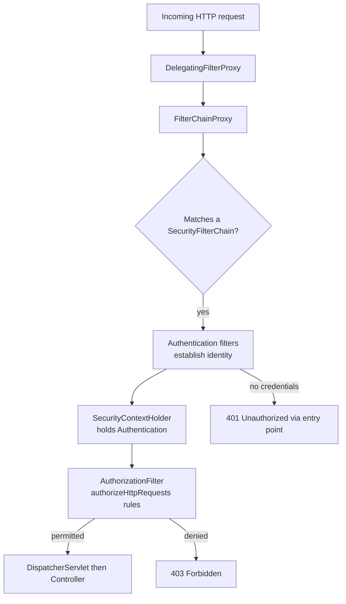

The `FilterChainProxy` picks the **first** matching chain, so chain ordering and matcher specificity matter. Within a chain, filters run in a fixed order; the `AuthorizationFilter` near the end consults your `authorizeHttpRequests` rules.

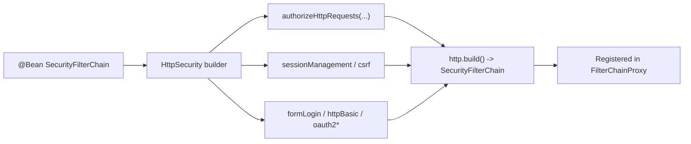

### 10.5 Real example

**Scenario.** A team is splitting one app into a public marketing site and an internal admin console served from the same Spring Boot 3 application. Public pages must be open; `/admin/**` must require an authenticated user with the `ADMIN` role; everything else must require authentication.

**Problem.** With the removal of `WebSecurityConfigurerAdapter`, the team's old config no longer compiles, and they are unsure how to express role-based rules and a secure password store in the new DSL.

**Solution.** Publish a single `SecurityFilterChain` bean using `authorizeHttpRequests`, enable form login for the browser flow, and supply an in-memory user store backed by a `DelegatingPasswordEncoder` (BCrypt).

**Implementation.**

```java
package com.example.security;

import org.springframework.context.annotation.Bean;
import org.springframework.context.annotation.Configuration;
import org.springframework.security.config.annotation.web.builders.HttpSecurity;
import org.springframework.security.core.userdetails.User;
import org.springframework.security.core.userdetails.UserDetails;
import org.springframework.security.crypto.factory.PasswordEncoderFactories;
import org.springframework.security.crypto.password.PasswordEncoder;
import org.springframework.security.provisioning.InMemoryUserDetailsManager;
import org.springframework.security.web.SecurityFilterChain;

@Configuration
public class WebSecurityConfig {

    @Bean
    SecurityFilterChain filterChain(HttpSecurity http) throws Exception {
        http
            .authorizeHttpRequests(auth -> auth
                .requestMatchers("/", "/public/**", "/css/**").permitAll()
                .requestMatchers("/admin/**").hasRole("ADMIN")   // ROLE_ADMIN
                .anyRequest().authenticated())                   // deny by default
            .formLogin(form -> form.permitAll())
            .logout(logout -> logout.permitAll());
        return http.build();
    }

    @Bean
    PasswordEncoder passwordEncoder() {
        // {bcrypt}-prefixed; upgradeable algorithm storage
        return PasswordEncoderFactories.createDelegatingPasswordEncoder();
    }

    @Bean
    InMemoryUserDetailsManager users(PasswordEncoder encoder) {
        UserDetails admin = User.withUsername("admin")
            .password(encoder.encode("s3cret"))
            .roles("ADMIN")
            .build();
        UserDetails staff = User.withUsername("staff")
            .password(encoder.encode("p4ss"))
            .roles("USER")
            .build();
        return new InMemoryUserDetailsManager(admin, staff);
    }
}
```

```java
// Slice test: anonymous is redirected/denied, ADMIN passes, USER is forbidden.
@WebMvcTest(AdminController.class)
@Import(WebSecurityConfig.class)
class AdminSecurityTest {

    @Autowired MockMvc mvc;

    @Test
    void anonymousCannotReachAdmin() throws Exception {
        mvc.perform(get("/admin/dashboard"))
           .andExpect(status().is3xxRedirection()); // sent to login
    }

    @Test
    @WithMockUser(roles = "ADMIN")
    void adminCanReachAdmin() throws Exception {
        mvc.perform(get("/admin/dashboard")).andExpect(status().isOk());
    }

    @Test
    @WithMockUser(roles = "USER")
    void userIsForbiddenFromAdmin() throws Exception {
        mvc.perform(get("/admin/dashboard")).andExpect(status().isForbidden());
    }
}
```

**Result.** Public paths are open, `/admin/**` is restricted to `ROLE_ADMIN`, every other path requires authentication, and passwords are stored as `{bcrypt}` hashes. The config compiles cleanly under Spring Security 6 with no adapter base class.

**Future improvements.** Replace the in-memory store with a JDBC/`UserDetailsService` backed by the database; add `@EnableMethodSecurity` for fine-grained `@PreAuthorize` rules; externalize role-to-URL mappings; and add a second `SecurityFilterChain` (with a higher-priority matcher) for an API segment.

### 10.6 Exercises

1. Name the filter that bridges the servlet container to the Spring-managed security filters.
2. Why does the order of multiple `SecurityFilterChain` beans matter?
3. What does `anyRequest().authenticated()` express, and where should it appear in the rule list?
4. What does the `{bcrypt}` prefix produced by `DelegatingPasswordEncoder` enable?

### 10.7 Challenges

- **Challenge.** Add a second `SecurityFilterChain` with `@Order(1)` that matches `/api/**` and uses HTTP Basic, while the existing chain (default order) handles the browser flow. Verify each chain is selected for the right paths.

### 10.8 Checklist

- [ ] Security is configured via a `@Bean SecurityFilterChain` (no `WebSecurityConfigurerAdapter`).
- [ ] Rules end with `anyRequest().authenticated()` — deny by default.
- [ ] Passwords use `DelegatingPasswordEncoder` (BCrypt), never plain text.
- [ ] Role checks use `hasRole` / `hasAuthority` with the correct `ROLE_` semantics.
- [ ] Public paths are explicitly and minimally enumerated.

### 10.9 Best practices

- Keep the public allow-list short and explicit; deny everything else.
- Prefer multiple focused `SecurityFilterChain` beans (API vs browser) over one overloaded chain.
- Use the `DelegatingPasswordEncoder` so the stored hash format can evolve.
- Reserve method security (`@PreAuthorize`) for fine-grained rules that URL matching cannot express.

### 10.10 Anti-patterns

- Re-introducing `WebSecurityConfigurerAdapter` patterns copied from Spring Security 5.
- Opening endpoints with `permitAll()` "temporarily" and forgetting to lock them.
- Encoding passwords with weak or no hashing (MD5, plain text).
- Placing a broad `requestMatchers("/**").permitAll()` above narrower rules, defeating them.

### 10.11 Troubleshooting

| Symptom | Cause | Action |
|---------|-------|--------|
| Every endpoint requires login unexpectedly | Default chain secures all requests | Add explicit `permitAll()` for public paths |
| `hasRole("ADMIN")` never matches | Authority stored without `ROLE_` prefix | Use `hasAuthority("ROLE_ADMIN")` or grant via `roles("ADMIN")` |
| Config does not compile after upgrade | `WebSecurityConfigurerAdapter` removed | Migrate to a `@Bean SecurityFilterChain` |
| Password comparison always fails | Raw password stored, no encoder | Define a `PasswordEncoder` bean and encode on save |
| Wrong chain handles a request | Matcher too broad / wrong order | Make matchers specific; order chains with `@Order` |

### 10.12 Official references

- Spring Security architecture: https://docs.spring.io/spring-security/reference/servlet/architecture.html
- `HttpSecurity` and the filter chain: https://docs.spring.io/spring-security/reference/servlet/configuration/java.html
- Authorize HTTP requests: https://docs.spring.io/spring-security/reference/servlet/authorization/authorize-http-requests.html
- Password storage: https://docs.spring.io/spring-security/reference/features/authentication/password-storage.html

---

## Chapter 11 — Stateless authentication with JWT

### 11.1 Introduction

A **JSON Web Token (JWT)** is a signed, self-contained credential a client presents on every request — typically in an `Authorization: Bearer <token>` header. Because the token carries the user's identity and authorities and is verifiable by signature, the server keeps **no session**: each request is authenticated from scratch, and the API scales horizontally without sticky sessions. This chapter shows how to validate JWTs in Spring Security 6 using the **resource-server** support, configure a **stateless** filter chain (`SessionCreationPolicy.STATELESS`), and map token claims to Spring authorities. We use Spring Security's resource-server machinery rather than parsing tokens by hand, because it validates signature, expiry, and issuer correctly and consistently.

### 11.2 Business context

Stateless JWT authentication is the default for modern REST APIs and microservices. It removes server-side session storage (no Redis-backed session cluster to operate), lets any instance serve any request, and integrates cleanly with API gateways. For the business this means cheaper horizontal scaling, simpler failover, and a uniform way to propagate identity between services. The trade-off is that tokens cannot be trivially revoked before expiry — so teams keep token lifetimes short and pair them with refresh flows or a denylist when immediate revocation is required.

### 11.3 Theoretical concepts

- **JWT structure.** Three Base64URL parts — header, payload (claims), signature — joined by dots. Claims include `iss` (issuer), `sub` (subject), `exp` (expiry), and custom claims like `scope` or `roles`.
- **Signature.** Either symmetric (HMAC, shared secret) or asymmetric (RSA/EC, private key signs, public key verifies). Asymmetric is preferred when an external issuer signs tokens.
- **Bearer token.** The token is presented as `Authorization: Bearer <jwt>`; the `BearerTokenAuthenticationFilter` extracts it.
- **Resource server.** `oauth2ResourceServer(o -> o.jwt(...))` configures Spring to validate incoming JWTs via a `JwtDecoder`.
- **Validation.** The decoder checks signature, `exp` (not expired), and — when configured — `iss`. Custom validators add audience or claim checks.
- **Stateless policy.** `SessionCreationPolicy.STATELESS` tells Spring never to create or use an `HttpSession`; the `SecurityContext` lives only for the request.
- **Authority mapping.** A `JwtAuthenticationConverter` turns claims (e.g. a `roles` array) into `GrantedAuthority` instances used by `authorizeHttpRequests` and `@PreAuthorize`.

### 11.4 Architecture: validating a bearer token on each request

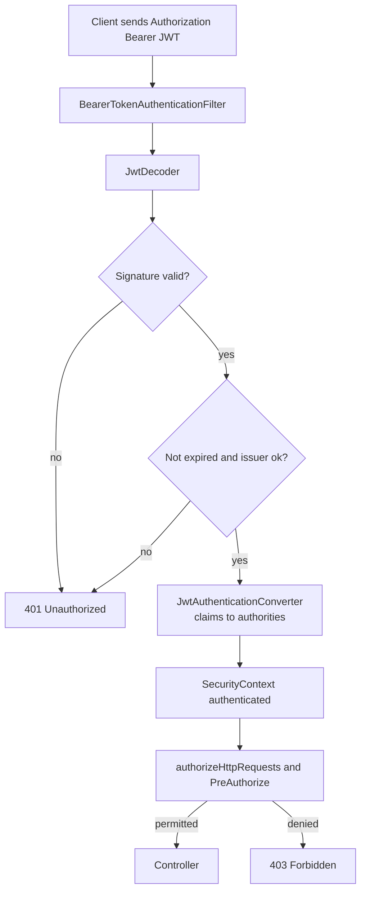

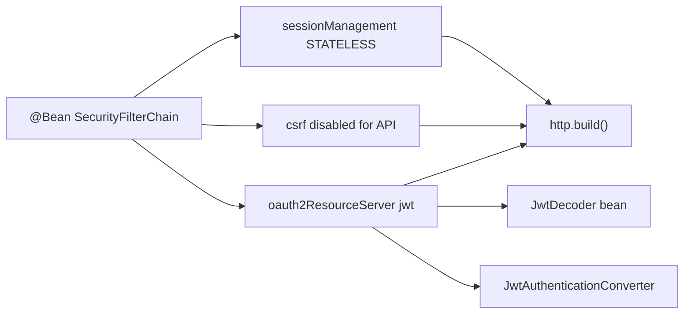

### 11.5 Real example

**Scenario.** A standalone REST API issues its own JWTs at `/auth/login` (symmetric HMAC signing with a configured secret) and must accept those tokens on all other endpoints, restricting `/api/admin/**` to tokens carrying an `admin` role claim — with **no session** created.

**Problem.** The team initially parsed the token manually in a custom filter, duplicating signature and expiry checks and getting the authority mapping wrong, so `@PreAuthorize` never matched.

**Solution.** Configure the app as a resource server with an HMAC `JwtDecoder`, set the chain to `STATELESS`, disable CSRF (no browser session), and map the `roles` claim to authorities with a `JwtAuthenticationConverter`.

**Implementation.**

```yaml
# application.yml
app:
  jwt:
    secret: ${JWT_SECRET}   # 256-bit Base64 secret, injected from the environment
```

```java
package com.example.api.security;

import com.nimbusds.jose.jwk.source.ImmutableSecret;
import org.springframework.beans.factory.annotation.Value;
import org.springframework.context.annotation.Bean;
import org.springframework.context.annotation.Configuration;
import org.springframework.security.config.annotation.method.configuration.EnableMethodSecurity;
import org.springframework.security.config.annotation.web.builders.HttpSecurity;
import org.springframework.security.config.http.SessionCreationPolicy;
import org.springframework.security.oauth2.core.OAuth2TokenValidator;
import org.springframework.security.oauth2.jwt.Jwt;
import org.springframework.security.oauth2.jwt.JwtDecoder;
import org.springframework.security.oauth2.jwt.JwtValidators;
import org.springframework.security.oauth2.jwt.NimbusJwtDecoder;
import org.springframework.security.oauth2.jwt.NimbusJwtEncoder;
import org.springframework.security.oauth2.jwt.JwtEncoder;
import org.springframework.security.oauth2.server.resource.authentication.JwtAuthenticationConverter;
import org.springframework.security.oauth2.server.resource.authentication.JwtGrantedAuthoritiesConverter;
import org.springframework.security.web.SecurityFilterChain;

import javax.crypto.spec.SecretKeySpec;
import java.util.Base64;

@Configuration
@EnableMethodSecurity   // enables @PreAuthorize
public class JwtSecurityConfig {

    @Value("${app.jwt.secret}")
    private String secret;

    private SecretKeySpec key() {
        byte[] bytes = Base64.getDecoder().decode(secret);
        return new SecretKeySpec(bytes, "HmacSHA256");
    }

    @Bean
    SecurityFilterChain filterChain(HttpSecurity http) throws Exception {
        http
            .authorizeHttpRequests(auth -> auth
                .requestMatchers("/auth/login", "/actuator/health/**").permitAll()
                .requestMatchers("/api/admin/**").hasAuthority("ROLE_admin")
                .anyRequest().authenticated())
            .sessionManagement(sm -> sm.sessionCreationPolicy(SessionCreationPolicy.STATELESS))
            .csrf(csrf -> csrf.disable())                  // stateless API, no cookies
            .oauth2ResourceServer(oauth2 -> oauth2
                .jwt(jwt -> jwt.jwtAuthenticationConverter(authoritiesConverter())));
        return http.build();
    }

    @Bean
    JwtDecoder jwtDecoder() {
        NimbusJwtDecoder decoder = NimbusJwtDecoder.withSecretKey(key()).build();
        // Validate expiry by default; add issuer/audience validators as needed.
        OAuth2TokenValidator<Jwt> validators = JwtValidators.createDefault();
        decoder.setJwtValidator(validators);
        return decoder;
    }

    @Bean
    JwtEncoder jwtEncoder() {
        // Used by the /auth/login endpoint to mint tokens with the same key.
        return new NimbusJwtEncoder(new ImmutableSecret<>(key()));
    }

    private JwtAuthenticationConverter authoritiesConverter() {
        JwtGrantedAuthoritiesConverter authorities = new JwtGrantedAuthoritiesConverter();
        authorities.setAuthoritiesClaimName("roles"); // read the "roles" claim
        authorities.setAuthorityPrefix("ROLE_");      // -> ROLE_admin, ROLE_user
        JwtAuthenticationConverter converter = new JwtAuthenticationConverter();
        converter.setJwtGrantedAuthoritiesConverter(authorities);
        return converter;
    }
}
```

```java
package com.example.api.auth;

import org.springframework.security.oauth2.jwt.JwtClaimsSet;
import org.springframework.security.oauth2.jwt.JwsHeader;
import org.springframework.security.oauth2.jwt.JwtEncoder;
import org.springframework.security.oauth2.jwt.JwtEncoderParameters;
import org.springframework.web.bind.annotation.*;

import java.time.Duration;
import java.time.Instant;
import java.util.List;

@RestController
@RequestMapping("/auth")
class AuthController {

    private final JwtEncoder encoder;

    AuthController(JwtEncoder encoder) { this.encoder = encoder; }

    public record LoginRequest(String username, String password) {}
    public record TokenResponse(String accessToken) {}

    @PostMapping("/login")
    TokenResponse login(@RequestBody LoginRequest req) {
        // ... authenticate the credentials against your user store first ...
        Instant now = Instant.now();
        JwtClaimsSet claims = JwtClaimsSet.builder()
            .issuer("https://api.example.com")
            .issuedAt(now)
            .expiresAt(now.plus(Duration.ofMinutes(15)))   // short-lived
            .subject(req.username())
            .claim("roles", List.of("admin"))               // mapped to ROLE_admin
            .build();
        JwsHeader header = JwsHeader.with(() -> "HS256").build();
        String token = encoder.encode(JwtEncoderParameters.from(header, claims)).getTokenValue();
        return new TokenResponse(token);
    }
}
```

```java
// Token-driven slice test: no session, authorities mapped from the claim.
@WebMvcTest(AdminController.class)
@Import(JwtSecurityConfig.class)
class JwtSecurityTest {

    @Autowired MockMvc mvc;

    @Test
    void rejectsRequestWithoutToken() throws Exception {
        mvc.perform(get("/api/admin/stats")).andExpect(status().isUnauthorized());
    }

    @Test
    void allowsAdminClaim() throws Exception {
        mvc.perform(get("/api/admin/stats")
              .with(jwt().authorities(new SimpleGrantedAuthority("ROLE_admin"))))
           .andExpect(status().isOk());
    }

    @Test
    void forbidsNonAdminClaim() throws Exception {
        mvc.perform(get("/api/admin/stats")
              .with(jwt().authorities(new SimpleGrantedAuthority("ROLE_user"))))
           .andExpect(status().isForbidden());
    }
}
```

**Result.** The API accepts only validly signed, unexpired tokens; the `roles` claim is mapped to `ROLE_` authorities so `hasAuthority("ROLE_admin")` and `@PreAuthorize` work; no `HttpSession` is ever created. Any instance can serve any request.

**Future improvements.** Switch from a shared HMAC secret to asymmetric RSA/EC signing (so verifiers never hold the signing key), add a refresh-token endpoint with rotation, introduce a short denylist (by `jti`) for emergency revocation, and add an audience validator alongside the default expiry check.

### 11.6 Exercises

1. What three parts make up a JWT, and which one is verified on the server?
2. Why disable CSRF on a stateless JWT API but keep it on a session-based browser app?
3. What does `SessionCreationPolicy.STATELESS` change about the `SecurityContext` lifetime?
4. How does a `JwtAuthenticationConverter` make `@PreAuthorize("hasRole('admin')")` work?

### 11.7 Challenges

- **Challenge.** Replace the HMAC `JwtDecoder` with an asymmetric one: sign tokens with an RSA private key in the issuer and verify with the public key via `NimbusJwtDecoder.withPublicKey(...)`. Confirm the verifier no longer needs the signing key.

### 11.8 Checklist

- [ ] The chain uses `SessionCreationPolicy.STATELESS`.
- [ ] CSRF is disabled for the API chain (no cookies/session).
- [ ] Tokens are validated for signature, expiry, and (where applicable) issuer/audience.
- [ ] Claims are mapped to authorities via a `JwtAuthenticationConverter`.
- [ ] Token lifetimes are short; a revocation strategy exists for emergencies.

### 11.9 Best practices

- Keep access tokens short-lived; pair with refresh tokens rather than long expiries.
- Prefer asymmetric signing so resource servers hold only the public key.
- Validate issuer and audience, not just expiry, to reject tokens minted for other services.
- Never log full tokens; treat the signing secret/key as a high-sensitivity credential.

### 11.10 Anti-patterns

- Parsing and validating JWTs by hand in a custom filter instead of using the resource server.
- Storing the signing secret in source control or a plain config file.
- Allowing `none` algorithm or skipping signature verification.
- Putting sensitive data in the (readable) payload and treating the token as confidential.

### 11.11 Troubleshooting

| Symptom | Cause | Action |
|---------|-------|--------|
| 401 on a freshly issued token | Decoder key differs from signing key | Ensure encoder and `JwtDecoder` share the same key |
| 401 after a while | Token expired | Shorten client refresh interval; check `exp` |
| `@PreAuthorize` never matches | Claim not mapped to authorities | Configure `JwtAuthenticationConverter` claim name/prefix |
| Session cookie still appears | Policy not `STATELESS` | Set `SessionCreationPolicy.STATELESS` |
| CSRF 403 on POST to API | CSRF enabled on stateless chain | Disable CSRF for the API filter chain |
| `InvalidBearerTokenException` | Malformed/altered token | Verify the `Authorization: Bearer` header and signature |

### 11.12 Official references

- OAuth2 resource server (JWT): https://docs.spring.io/spring-security/reference/servlet/oauth2/resource-server/jwt.html
- `JwtAuthenticationConverter`: https://docs.spring.io/spring-security/reference/servlet/oauth2/resource-server/jwt.html#oauth2resourceserver-jwt-authorization-extraction
- Session management: https://docs.spring.io/spring-security/reference/servlet/authentication/session-management.html
- Testing OAuth2 (`jwt()` request post-processor): https://docs.spring.io/spring-security/reference/servlet/test/method.html

---

## Chapter 12 — OAuth2 / OIDC resource server and client

### 12.1 Introduction

Rather than minting your own tokens, most enterprises delegate identity to an **authorization server** (Keycloak, Okta, Microsoft Entra ID, Auth0, Google) and speak the **OAuth2** and **OpenID Connect (OIDC)** standards. Spring Security 6 supports both ends of this relationship: as a **resource server** it validates access tokens issued by a trusted authorization server (discovered via `issuer-uri` and verified against the issuer's JWKS), and as a **client** (`oauth2Login` / `oauth2Client`) it performs the authorization-code login flow on behalf of users and obtains tokens for calling downstream APIs. This chapter covers both roles and how they fit together.

### 12.2 Business context

Centralizing identity in an OIDC provider is what lets an organization enforce single sign-on, multi-factor authentication, and consistent least-privilege scopes across dozens of services — without each team re-implementing login. Auditors prefer it because identity, token issuance, and revocation live in one governed place. For developers, the win is concrete: point a service at an `issuer-uri` and it validates tokens correctly, including signature, expiry, issuer, and JWKS key rotation, with no custom crypto. The result is a fleet where adding a new secured service is configuration, not code.

### 12.3 Theoretical concepts

- **Authorization server.** Issues tokens after authenticating the user (the IdP / OIDC provider).
- **Resource server.** An API that accepts and validates access tokens; it never sees credentials.
- **Client.** An application that obtains tokens — for login (OIDC) or to call APIs on a user's behalf.
- **`issuer-uri` and JWKS.** From the issuer URL, Spring fetches the OIDC discovery document and the **JWKS** (JSON Web Key Set) of public keys, validating token signatures and handling key rotation automatically.
- **Scopes and authorities.** OAuth2 scopes arrive as `SCOPE_<name>` authorities by default; OIDC adds an `ID Token` describing the user.
- **Authorization Code + PKCE.** The standard browser login flow; the client redirects to the IdP, receives a code, and exchanges it for tokens.
- **`oauth2Login` vs `oauth2Client`.** `oauth2Login` logs users in (you get an authenticated session/principal); `oauth2Client` obtains and stores tokens so your app can call other APIs as the user (or as itself, client-credentials).

### 12.4 Architecture: resource server and client together

```mermaid
flowchart TB
    user[Browser user] --> webapp[Spring app as OAuth2 client]
    webapp -- redirect to login --> idp[(Authorization Server / OIDC)]
    idp -- authorization code --> webapp
    webapp -- exchange code for tokens --> idp
    webapp -- call API with access token --> api[Spring app as resource server]
    api --> validate[Validate JWT via issuer-uri and JWKS]
    validate -- valid --> data[Return protected data]
    validate -- invalid --> reject[401 Unauthorized]
    idp -. publishes JWKS .-> validate
```

```mermaid
flowchart LR
    cfg["spring.security.oauth2"] --> rscfg["resourceserver.jwt.issuer-uri"]
    cfg --> clcfg["client.registration / provider"]
    rscfg --> dec["JwtDecoder from issuer JWKS"]
    clcfg --> reg["ClientRegistration"]
    dec --> rschain["Resource-server SecurityFilterChain"]
    reg --> clchain["Client SecurityFilterChain (oauth2Login)"]
```

### 12.5 Real example

**Scenario.** A company runs Keycloak as its OIDC provider. A back-office **web app** must log users in via Keycloak (authorization-code flow) and then call a separate **orders API**. The orders API must accept only Keycloak-issued access tokens and restrict `/api/orders/refund` to the `orders:refund` scope.

**Problem.** The team was validating tokens with a hard-coded public key that broke whenever Keycloak rotated its signing key, and the web app rolled its own login redirect handling.

**Solution.** Configure the API as a resource server pointed at Keycloak's `issuer-uri` (so JWKS and rotation are automatic), and configure the web app with `oauth2Login` using a `ClientRegistration` so Spring drives the standard authorization-code flow.

**Implementation — resource server (orders API).**

```yaml
# orders-api: application.yml
spring:
  security:
    oauth2:
      resourceserver:
        jwt:
          # discovery + JWKS fetched from here; issuer + signature validated
          issuer-uri: https://keycloak.example.com/realms/corp
```

```java
package com.example.orders;

import org.springframework.context.annotation.Bean;
import org.springframework.context.annotation.Configuration;
import org.springframework.security.config.annotation.method.configuration.EnableMethodSecurity;
import org.springframework.security.config.annotation.web.builders.HttpSecurity;
import org.springframework.security.config.http.SessionCreationPolicy;
import org.springframework.security.config.Customizer;
import org.springframework.security.web.SecurityFilterChain;

@Configuration
@EnableMethodSecurity
public class ResourceServerConfig {

    @Bean
    SecurityFilterChain filterChain(HttpSecurity http) throws Exception {
        http
            .authorizeHttpRequests(auth -> auth
                .requestMatchers("/actuator/health/**").permitAll()
                .requestMatchers("/api/orders/refund").hasAuthority("SCOPE_orders:refund")
                .requestMatchers("/api/orders/**").authenticated()
                .anyRequest().authenticated())
            .sessionManagement(sm -> sm.sessionCreationPolicy(SessionCreationPolicy.STATELESS))
            .csrf(csrf -> csrf.disable())
            // issuer-uri drives the JwtDecoder; defaults validate issuer + signature + expiry
            .oauth2ResourceServer(oauth2 -> oauth2.jwt(Customizer.withDefaults()));
        return http.build();
    }
}
```

**Implementation — OAuth2 client (web app).**

```yaml
# webapp: application.yml
spring:
  security:
    oauth2:
      client:
        registration:
          keycloak:
            client-id: backoffice
            client-secret: ${KEYCLOAK_CLIENT_SECRET}
            authorization-grant-type: authorization_code
            scope: openid, profile, orders:read, orders:refund
            redirect-uri: "{baseUrl}/login/oauth2/code/keycloak"
        provider:
          keycloak:
            issuer-uri: https://keycloak.example.com/realms/corp
```

```java
package com.example.backoffice;

import org.springframework.context.annotation.Bean;
import org.springframework.context.annotation.Configuration;
import org.springframework.security.config.Customizer;
import org.springframework.security.config.annotation.web.builders.HttpSecurity;
import org.springframework.security.web.SecurityFilterChain;

@Configuration
public class ClientSecurityConfig {

    @Bean
    SecurityFilterChain filterChain(HttpSecurity http) throws Exception {
        http
            .authorizeHttpRequests(auth -> auth
                .requestMatchers("/", "/error", "/css/**").permitAll()
                .anyRequest().authenticated())
            // authorization-code login against Keycloak; session-based browser flow
            .oauth2Login(Customizer.withDefaults());
        return http.build();
    }
}
```

```java
package com.example.backoffice;

import org.springframework.security.oauth2.client.OAuth2AuthorizedClient;
import org.springframework.security.oauth2.client.annotation.RegisteredOAuth2AuthorizedClient;
import org.springframework.web.bind.annotation.GetMapping;
import org.springframework.web.bind.annotation.RestController;
import org.springframework.web.reactive.function.client.WebClient;

@RestController
class OrdersProxyController {

    private final WebClient webClient = WebClient.create("https://orders.example.com");

    // Spring injects the authorized client; we forward its access token to the API.
    @GetMapping("/my-orders")
    String myOrders(@RegisteredOAuth2AuthorizedClient("keycloak") OAuth2AuthorizedClient client) {
        return webClient.get()
            .uri("/api/orders")
            .headers(h -> h.setBearerAuth(client.getAccessToken().getTokenValue()))
            .retrieve()
            .bodyToMono(String.class)
            .block();
    }
}
```

```java
// Resource-server test: scope-based access enforced from the token.
@WebMvcTest(OrdersController.class)
@Import(ResourceServerConfig.class)
class ResourceServerScopeTest {

    @Autowired MockMvc mvc;

    @Test
    void refundRequiresScope() throws Exception {
        mvc.perform(post("/api/orders/refund")
              .with(jwt().authorities(new SimpleGrantedAuthority("SCOPE_orders:read"))))
           .andExpect(status().isForbidden());
    }

    @Test
    void refundAllowedWithScope() throws Exception {
        mvc.perform(post("/api/orders/refund")
              .with(jwt().authorities(new SimpleGrantedAuthority("SCOPE_orders:refund"))))
           .andExpect(status().isOk());
    }
}
```

**Result.** The orders API validates every token against Keycloak's published JWKS — key rotation is handled automatically and the brittle hard-coded key is gone. The web app logs users in through the standard authorization-code flow and forwards their access token to the API. The `orders:refund` scope gates the refund endpoint.

**Future improvements.** Add a custom `JwtAuthenticationConverter` to also map Keycloak realm/client roles (not just scopes), enable PKCE explicitly for public clients, add client-credentials registrations for service-to-service calls, and centralize the `issuer-uri` in a config server so all services share one trusted issuer.

### 12.6 Exercises

1. What does Spring fetch from the `issuer-uri`, and why does that make key rotation transparent?
2. How does an OAuth2 scope appear as a Spring authority by default?
3. When would you use `oauth2Login` versus `oauth2Client`?
4. Why should a resource server never see the user's credentials?

### 12.7 Challenges

- **Challenge.** Add a `JwtAuthenticationConverter` to the orders API that maps Keycloak's `realm_access.roles` claim into `ROLE_` authorities, then guard an endpoint with `@PreAuthorize("hasRole('manager')")` and test it with the `jwt()` post-processor.

### 12.8 Checklist

- [ ] The resource server uses `issuer-uri` (not a hard-coded key) so JWKS rotation is automatic.
- [ ] Token validation includes issuer, signature, and expiry by default.
- [ ] Scopes/roles are mapped to authorities and enforced (`SCOPE_*` / `ROLE_*`).
- [ ] The client uses the authorization-code flow via `oauth2Login`/`ClientRegistration`.
- [ ] Client secrets and issuer URLs come from the environment/config, not source.

### 12.9 Best practices

- Trust a single, well-known issuer per environment; validate `iss` strictly.
- Let `issuer-uri` discovery handle JWKS and rotation instead of pinning keys.
- Map both scopes and roles when your IdP carries authorization in role claims.
- Use PKCE for public clients and the authorization-code flow rather than implicit.
- Keep the resource server stateless; keep the browser client's login session minimal.

### 12.10 Anti-patterns

- Hard-coding a signing public key, breaking on rotation.
- Accepting tokens without validating the issuer (any IdP's token would pass).
- Building a custom OAuth2 login redirect instead of using `oauth2Login`.
- Sharing one bearer token across services with mismatched audiences.
- Putting client secrets in `application.yml` committed to git.

### 12.11 Troubleshooting

| Symptom | Cause | Action |
|---------|-------|--------|
| 401 for all tokens | Wrong `issuer-uri` | Match it exactly to the token's `iss` claim |
| 401 after IdP key rotation | Pinned key instead of JWKS | Use `issuer-uri`; let Spring fetch JWKS |
| 403 despite valid login | Scope/role not mapped to authority | Add a `JwtAuthenticationConverter` for roles |
| Login loops/redirect mismatch | `redirect-uri` not registered in IdP | Register `{baseUrl}/login/oauth2/code/{registrationId}` |
| `invalid_token` audience error | Token minted for another resource | Validate/align the `aud` claim |
| Startup fails fetching discovery | IdP unreachable at boot | Verify network/issuer URL; consider lazy decoder init |

### 12.12 Official references

- OAuth2 resource server (issuer-uri / JWKS): https://docs.spring.io/spring-security/reference/servlet/oauth2/resource-server/jwt.html
- OAuth2 login: https://docs.spring.io/spring-security/reference/servlet/oauth2/login/index.html
- OAuth2 client: https://docs.spring.io/spring-security/reference/servlet/oauth2/client/index.html
- OIDC and OAuth2 overview: https://docs.spring.io/spring-security/reference/servlet/oauth2/index.html

---

> **End of Part IV.** You now command Spring Security 6 on Spring Boot 3: the **filter-chain architecture** and the lambda `SecurityFilterChain` DSL (Chapter 10), **stateless JWT authentication** with resource-server validation and `SessionCreationPolicy.STATELESS` (Chapter 11), and standards-based **OAuth2 / OIDC** as both resource server (`issuer-uri` + JWKS) and client (`oauth2Login` / `oauth2Client`) (Chapter 12) — all under a deny-by-default, validate-strictly posture. **Part V — Reactive** (Chapters 13–15) shifts from blocking servlets to the non-blocking stack: **Project Reactor** (`Mono`/`Flux` and backpressure), **Spring WebFlux** (functional and annotated reactive endpoints), and **R2DBC** (reactive relational data access).


---

## Part V – Reactive

Part V leaves the familiar thread-per-request world behind and enters the **reactive stack**: a non-blocking, backpressure-aware way to build I/O-bound services that scale to tens of thousands of concurrent connections on a handful of threads. The foundation is **Project Reactor** (`Mono` and `Flux`), the web layer is **Spring WebFlux** (both an annotated `@RestController` model and a functional `RouterFunction` model), and persistence is **R2DBC** (reactive SQL). Reactive is powerful but not free: it asks you to think in streams, to never block the event loop, and to test with `StepVerifier`. This part also draws the honest line between reactive and **virtual threads** (Boot 3.2+), which let ordinary blocking code scale — so you reach for WebFlux deliberately, where streaming, backpressure, or very high fan-out genuinely demand it.

---

## Chapter 13 — Reactive programming with Project Reactor

### 13.1 Introduction

Project Reactor is the reactive-streams library that powers the entire Spring WebFlux stack. It models asynchronous results as two publisher types — **`Mono<T>`** (zero or one element) and **`Flux<T>`** (zero to many) — and gives you a rich operator vocabulary (`map`, `flatMap`, `filter`, `zip`, `retry`, `timeout`) to compose pipelines without ever blocking a thread. Crucially, a Reactor pipeline is **lazy**: nothing happens until something subscribes, and data flows under **backpressure**, so a slow consumer can signal a fast producer to ease off. This chapter builds the mental model — publishers, subscribers, operators, schedulers, and backpressure — that the next two chapters assume.

### 13.2 Business context

The business case for reactive is **resource efficiency under high concurrency**. A blocking thread-per-request server dedicates an OS thread to each in-flight request; with thousands of slow downstream calls, you exhaust the pool and either queue or fail. Reactor lets a few event-loop threads multiplex many thousands of connections, which translates directly into **fewer machines for the same load** and graceful behavior under spikes. The cost is a steeper learning curve and a different debugging style. For a streaming API, a gateway aggregating dozens of services, or a system pushing server-sent events to many clients, that trade-off pays off; for plain CRUD it usually does not.

### 13.3 Theoretical concepts: publishers, operators, and backpressure

- **`Mono<T>`** — a publisher of at most one item; the reactive analog of `Optional<T>`/`CompletableFuture<T>`. Used for single-result calls (find by id, save one entity).
- **`Flux<T>`** — a publisher of zero to many items; the reactive analog of a `Stream<T>` that arrives over time. Used for collections, streams, and server-sent events.
- **Lazy subscription.** Operators only *describe* work. Execution starts when a subscriber subscribes (in WebFlux, the framework subscribes for you). Forgetting to subscribe means nothing runs.
- **Operators.** `map` (1:1 transform), `flatMap` (1:N async transform, flattens inner publishers), `filter`, `zip`/`zipWith` (combine in lockstep), `merge`/`concat`, `onErrorResume` (fallback), `retry`, `timeout`, `defaultIfEmpty`.
- **Backpressure.** The subscriber requests `n` items; the publisher must not overwhelm it. Strategies include buffering, dropping, and the built-in `onBackpressureBuffer`/`onBackpressureDrop`.
- **Schedulers.** `subscribeOn`/`publishOn` move work onto a `Scheduler` (e.g. `boundedElastic` for wrapping blocking calls). The golden rule: **never block the event loop** — offload truly blocking work to `boundedElastic`.

```mermaid
flowchart LR
    pub["Publisher<br/>Mono / Flux"] --> op1["map / filter"]
    op1 --> op2["flatMap<br/>async transform"]
    op2 --> op3["onErrorResume<br/>retry / timeout"]
    op3 --> sub["Subscriber<br/>requests N, applies backpressure"]
    sub -. "request(n) demand" .-> pub
```

### 13.4 Architecture: a Reactor pipeline end to end

```mermaid
flowchart TB
    src["Source: WebClient call / R2DBC query"] --> assemble["Assembly time<br/>operators describe the pipeline"]
    assemble --> subscribe["Subscription<br/>framework subscribes"]
    subscribe --> signals["Signals flow:<br/>onNext, onComplete, onError"]
    signals --> sched{"Blocking work?"}
    sched -- "yes" --> elastic["publishOn boundedElastic<br/>offload, keep event loop free"]
    sched -- "no" --> loop["Stay on event-loop thread"]
    elastic --> consumer["Consumer / HTTP response"]
    loop --> consumer
```

A Reactor flow has two phases: **assembly** (you chain operators, building a blueprint) and **execution** (a subscriber triggers the data flow). Keeping these distinct explains most surprises — side effects placed outside operators run at assembly time, not per subscription.

### 13.5 Real example

**Scenario.** A pricing service must enrich a product with its live price and current stock, calling two downstream services, and return a combined result with a sensible fallback if pricing is briefly unavailable.

**Problem.** Calling the two services sequentially doubles latency; a blocking implementation caps concurrency; and a pricing outage must not take the whole endpoint down.

**Solution.** Model each downstream call as a `Mono`, combine them with `zip` so they run **concurrently**, and attach `timeout` + `onErrorResume` so a slow or failing pricing call degrades to a cached price instead of failing the request.

**Implementation.**

```java
package com.example.pricing;

import reactor.core.publisher.Mono;
import java.time.Duration;

record Product(String id, String name) {}
record Price(String productId, double amount) {}
record Stock(String productId, int available) {}
record EnrichedProduct(String id, String name, double price, int available) {}

class ProductEnricher {

    private final PriceClient priceClient;     // returns Mono<Price>
    private final StockClient stockClient;     // returns Mono<Stock>
    private final PriceCache priceCache;       // returns Price (last known)

    ProductEnricher(PriceClient priceClient, StockClient stockClient, PriceCache priceCache) {
        this.priceClient = priceClient;
        this.stockClient = stockClient;
        this.priceCache = priceCache;
    }

    Mono<EnrichedProduct> enrich(Product product) {
        Mono<Price> price = priceClient.priceFor(product.id())
            .timeout(Duration.ofMillis(300))                      // bound the slow path
            .onErrorResume(ex -> Mono.just(priceCache.last(product.id()))); // degrade gracefully

        Mono<Stock> stock = stockClient.stockFor(product.id())
            .defaultIfEmpty(new Stock(product.id(), 0));

        // zip runs both Monos concurrently and combines when both complete
        return Mono.zip(price, stock)
            .map(tuple -> new EnrichedProduct(
                product.id(),
                product.name(),
                tuple.getT1().amount(),
                tuple.getT2().available()));
    }
}
```

**Tests.** Reactor ships `StepVerifier`, which subscribes, drives the pipeline, and asserts on the emitted signals.

```java
import reactor.core.publisher.Mono;
import reactor.test.StepVerifier;
import org.junit.jupiter.api.Test;

class ProductEnricherTest {

    @Test
    void enrichesWithLivePriceAndStock() {
        var enricher = new ProductEnricher(
            id -> Mono.just(new Price(id, 19.90)),
            id -> Mono.just(new Stock(id, 7)),
            id -> new Price(id, 0.0));

        Mono<EnrichedProduct> result = enricher.enrich(new Product("p1", "Mug"));

        StepVerifier.create(result)
            .expectNextMatches(p -> p.price() == 19.90 && p.available() == 7)
            .verifyComplete();
    }

    @Test
    void fallsBackToCachedPriceWhenPricingFails() {
        var enricher = new ProductEnricher(
            id -> Mono.error(new RuntimeException("pricing down")),
            id -> Mono.just(new Stock(id, 3)),
            id -> new Price(id, 9.99));

        StepVerifier.create(enricher.enrich(new Product("p1", "Mug")))
            .expectNextMatches(p -> p.price() == 9.99)
            .verifyComplete();
    }
}
```

**Result.** The two calls run concurrently (latency ≈ the slower call, not the sum), a pricing outage degrades to the last known price, and the whole pipeline is non-blocking and unit-tested without a running server.

**Future improvements.** Add `retryWhen` with exponential backoff (via Reactor's `Retry.backoff`) on transient pricing errors; cache enriched results with a TTL; and add metrics via `Micrometer` `tap` operators (Chapter 18).

### 13.6 Exercises

1. Explain the difference between `map` and `flatMap`, and give a case where only `flatMap` is correct.
2. Why does nothing run until you subscribe? What subscribes in a WebFlux app?
3. When must you move work onto `boundedElastic`, and why is blocking on the event loop dangerous?

### 13.7 Challenges

- **Challenge.** Take a sequential two-call enrichment method, convert it to `Mono.zip`, add a 300 ms `timeout` with an `onErrorResume` fallback, and prove with `StepVerifier` (and `StepVerifier.withVirtualTime`) that the timeout path fires.

### 13.8 Checklist

- [ ] I can choose `Mono` vs `Flux` for a given result shape.
- [ ] I understand lazy subscription and the assembly-vs-execution distinction.
- [ ] I know the core operators (`map`, `flatMap`, `zip`, `onErrorResume`, `retry`, `timeout`).
- [ ] I never block the event loop and offload blocking work to `boundedElastic`.
- [ ] I test pipelines with `StepVerifier`.

### 13.9 Best practices

- Keep pipelines **non-blocking end to end**; one blocking call on the event loop can stall many requests.
- Prefer `flatMap` for async composition and `zip` for concurrent combination; reserve `concatMap` for ordered async work.
- Always bound external calls with `timeout` and provide a fallback with `onErrorResume`.
- Use `StepVerifier.withVirtualTime` to test time-based operators without real delays.

### 13.10 Anti-patterns

- Calling `.block()` inside a reactive pipeline (defeats the entire model and can deadlock).
- Doing blocking I/O (JDBC, `RestTemplate`) on an event-loop thread without offloading.
- Forgetting to subscribe (or returning an un-subscribed publisher), so nothing executes.
- Nesting `map` where `flatMap` is needed, ending up with `Mono<Mono<T>>`.

### 13.11 Troubleshooting

| Symptom | Cause | Action |
|---------|-------|--------|
| Pipeline never executes | No subscription | Return the publisher to the framework, or `.subscribe()` |
| `Mono<Mono<T>>` / nested publisher | Used `map` instead of `flatMap` | Switch to `flatMap` to flatten |
| Event loop stalls under load | Blocking call on event-loop thread | Offload to `boundedElastic` via `publishOn`/`subscribeOn` |
| `IllegalStateException: block()/blockFirst()` | Blocking inside reactive context | Remove `.block()`; compose with operators |
| Slow test suite | Real delays in time-based operators | Use `StepVerifier.withVirtualTime` |

### 13.12 Official references

- Project Reactor reference: https://projectreactor.io/docs/core/release/reference/
- Reactor `Mono`/`Flux` Javadoc: https://projectreactor.io/docs/core/release/api/
- Reactive Streams specification: https://www.reactive-streams.org/
- Testing with `StepVerifier`: https://projectreactor.io/docs/core/release/reference/#testing

---

## Chapter 14 — Spring WebFlux and the functional/annotated models

### 14.1 Introduction

Spring WebFlux is the **non-blocking web stack** introduced alongside Spring MVC. It runs on a reactive runtime (Reactor Netty by default) and exposes endpoints in **two programming models**: the familiar **annotated** model (`@RestController` with handler methods returning `Mono`/`Flux`) and the **functional** model (`RouterFunction` + `HandlerFunction`, routes assembled as code). On the client side, WebFlux provides **`WebClient`**, the non-blocking replacement for `RestTemplate`. This chapter shows both server models, the reactive client, streaming responses, and where **virtual threads** (Boot 3.2+) fit relative to WebFlux.

### 14.2 Business context

WebFlux is the right tool when an endpoint is **I/O-bound and high-concurrency**: API gateways, aggregators fanning out to many services, and streaming endpoints (server-sent events, long-lived feeds). Its non-blocking nature lets a small thread pool serve many thousands of concurrent connections, lowering infrastructure cost. The trade-off is complexity and an all-reactive call chain (a single blocking JDBC call undermines it). For ordinary blocking workloads, **virtual threads on Spring MVC** (`spring.threads.virtual.enabled=true`) deliver much of the scalability with simpler code — so the architectural decision is "reactive vs virtual threads," not "reactive vs nothing."

### 14.3 Theoretical concepts: two models, one runtime

- **Annotated model.** `@RestController` methods return `Mono<T>` / `Flux<T>`; Spring subscribes and writes the response reactively. Closest to MVC, easiest to adopt.
- **Functional model.** `RouterFunction<ServerResponse>` maps requests to `HandlerFunction`s. Routes are values you compose, test, and conditionally assemble — useful for fine-grained, programmatic routing.
- **`WebClient`.** Fully non-blocking HTTP client built on Reactor; `retrieve()` returns `Mono`/`Flux`. Replaces `RestTemplate` in reactive apps.
- **Streaming.** Returning `Flux<T>` with `MediaType.TEXT_EVENT_STREAM_VALUE` produces server-sent events; the connection stays open and elements stream as they arrive.
- **Virtual threads vs WebFlux.** Virtual threads (Boot 3.2+) make blocking MVC code scale; WebFlux is for genuine streaming/backpressure/very-high-fan-out. They are alternative answers to the same scalability question.
- **Resilience (external in Boot 3).** Boot 3 has no built-in `@Retryable`/`@ConcurrencyLimit`; use the **Spring Retry** library or **Resilience4j** (with its reactive operators) for retries, circuit breakers, and rate limiting.

```mermaid
flowchart TB
    req["HTTP request"] --> netty["Reactor Netty<br/>event loop"]
    netty --> model{"Programming model"}
    model -- "annotated" --> rc["@RestController<br/>returns Mono / Flux"]
    model -- "functional" --> rf["RouterFunction<br/>HandlerFunction"]
    rc --> handler["Handler logic"]
    rf --> handler
    handler --> wc["WebClient<br/>non-blocking downstream calls"]
    wc --> resp["ServerResponse<br/>Mono / Flux / SSE stream"]
```

### 14.4 Architecture: annotated and functional side by side

```mermaid
flowchart LR
    subgraph annotated["Annotated model"]
        a1["@RestController"] --> a2["@GetMapping methods<br/>return Mono / Flux"]
    end
    subgraph functional["Functional model"]
        f1["@Bean RouterFunction"] --> f2["route(GET, handler)"]
        f2 --> f3["Handler class<br/>ServerRequest to Mono ServerResponse"]
    end
    runtime["Reactor Netty runtime"] --> annotated
    runtime --> functional
```

Both models share the same reactive runtime and the same `Mono`/`Flux` return types. Teams often start annotated (lower friction) and adopt functional routing where they need programmatic, testable route composition.

### 14.5 Real example

**Scenario.** A catalog service must expose product lookups and a live "new arrivals" feed. It calls a downstream inventory API and streams updates to clients.

**Problem.** The lookups are I/O-bound and high-concurrency; the feed must stream items as they appear without holding a thread per client; downstream calls must be non-blocking.

**Solution.** Implement the lookups with an annotated reactive `@RestController` using `WebClient`, and add a functional route for the streaming feed returning a `Flux` as server-sent events.

**Implementation.**

```java
package com.example.catalog;

import org.springframework.http.MediaType;
import org.springframework.web.bind.annotation.*;
import org.springframework.web.reactive.function.client.WebClient;
import reactor.core.publisher.Flux;
import reactor.core.publisher.Mono;
import java.time.Duration;

record Product(String id, String name, double price) {}

@RestController
@RequestMapping("/products")
class ProductController {

    private final WebClient inventory;

    ProductController(WebClient.Builder builder) {
        this.inventory = builder.baseUrl("https://inventory.internal").build();
    }

    // Single result -> Mono
    @GetMapping("/{id}")
    Mono<Product> byId(@PathVariable String id) {
        return inventory.get()
            .uri("/items/{id}", id)
            .retrieve()
            .bodyToMono(Product.class)
            .timeout(Duration.ofSeconds(1))
            .onErrorResume(ex -> Mono.empty());
    }

    // Many results -> Flux
    @GetMapping
    Flux<Product> all() {
        return inventory.get()
            .uri("/items")
            .retrieve()
            .bodyToFlux(Product.class);
    }
}
```

```java
package com.example.catalog;

import org.springframework.context.annotation.Bean;
import org.springframework.context.annotation.Configuration;
import org.springframework.http.MediaType;
import org.springframework.web.reactive.function.server.*;
import reactor.core.publisher.Flux;
import java.time.Duration;

import static org.springframework.web.reactive.function.server.RequestPredicates.GET;
import static org.springframework.web.reactive.function.server.RouterFunctions.route;

@Configuration
class FeedRoutes {

    // Functional model: route assembled as code
    @Bean
    RouterFunction<ServerResponse> arrivalsRoutes(ArrivalsHandler handler) {
        return route(GET("/products/arrivals"), handler::stream);
    }
}

@org.springframework.stereotype.Component
class ArrivalsHandler {

    // Server-sent events: stream items as they arrive, one thread serves many clients
    Mono<ServerResponse> stream(ServerRequest request) {
        Flux<Product> arrivals = Flux.interval(Duration.ofSeconds(2))
            .map(i -> new Product("p" + i, "Arrival " + i, 10.0 + i));

        return ServerResponse.ok()
            .contentType(MediaType.TEXT_EVENT_STREAM)
            .body(arrivals, Product.class);
    }
}
```

```java
// Brief Spring Retry note (resilience is EXTERNAL in Boot 3):
// add org.springframework.retry:spring-retry + spring-aspects, then @EnableRetry,
// and annotate a blocking call with @Retryable(maxAttempts = 3). For reactive
// pipelines prefer Reactor's retryWhen(Retry.backoff(...)) or Resilience4j's reactive operators.
```

**Tests.** `WebTestClient` exercises WebFlux endpoints without a running server.

```java
import org.springframework.beans.factory.annotation.Autowired;
import org.springframework.boot.test.context.SpringBootTest;
import org.springframework.test.web.reactive.server.WebTestClient;
import org.junit.jupiter.api.Test;

@SpringBootTest(webEnvironment = SpringBootTest.WebEnvironment.RANDOM_PORT)
class ProductControllerTest {

    @Autowired WebTestClient client;

    @Test
    void returnsProductById() {
        client.get().uri("/products/p1")
            .exchange()
            .expectStatus().isOk()
            .expectBody()
            .jsonPath("$.id").isEqualTo("p1");
    }
}
```

**Result.** Lookups serve high concurrency on a small event-loop pool; the arrivals feed streams server-sent events without a thread per client; downstream calls are non-blocking and bounded by `timeout`.

**Future improvements.** Wrap the downstream client with a **Resilience4j** circuit breaker and bulkhead; add backpressure-aware buffering on the feed; and benchmark the same lookups on **MVC + virtual threads** to confirm WebFlux is justified.

### 14.6 Exercises

1. When should a handler return `Mono<T>` versus `Flux<T>`?
2. Contrast the annotated and functional models — what does the functional model make easier?
3. Why is `WebClient` required (rather than `RestTemplate`) inside a reactive handler?

### 14.7 Challenges

- **Challenge.** Implement the same "new arrivals" endpoint twice — once annotated returning `Flux` with `TEXT_EVENT_STREAM`, once functional with `RouterFunction` — and verify both with `WebTestClient`. Then add a Resilience4j circuit breaker to the downstream call.

### 14.8 Checklist

- [ ] I can write reactive endpoints in both the annotated and functional models.
- [ ] I use `WebClient` (never `RestTemplate`) for downstream calls in WebFlux.
- [ ] I can stream a `Flux` as server-sent events.
- [ ] I know when virtual threads on MVC are the better choice than WebFlux.
- [ ] I add resilience via Spring Retry / Resilience4j (external in Boot 3).

### 14.9 Best practices

- Keep the **whole chain reactive** — one blocking call undermines WebFlux's benefits.
- Choose **virtual threads on MVC** for blocking workloads; reserve WebFlux for streaming/backpressure/high fan-out.
- Bound every `WebClient` call with `timeout` and a fallback; add circuit breakers via Resilience4j.
- Test with `WebTestClient`; it works against both server models without binding a real port if desired.

### 14.10 Anti-patterns

- Mixing blocking JDBC/`RestTemplate` into a WebFlux handler and stalling the event loop.
- Adopting WebFlux for simple CRUD "for scalability" when virtual threads would be simpler.
- Returning `Flux` for a single resource (use `Mono`) or `Mono<List<T>>` where `Flux` streams better.
- Assuming Boot 3 has built-in `@Retryable` resilience — it does not; add Spring Retry/Resilience4j.

### 14.11 Troubleshooting

| Symptom | Cause | Action |
|---------|-------|--------|
| Throughput collapses under load | Blocking call on event loop | Make the chain reactive or offload to `boundedElastic` |
| SSE stream not received as events | Wrong content type | Return `Flux` with `MediaType.TEXT_EVENT_STREAM` |
| `RestTemplate` calls block handlers | Blocking client in reactive app | Replace with `WebClient` |
| `@Retryable` annotation ignored | Spring Retry not on classpath / `@EnableRetry` missing | Add `spring-retry` + `@EnableRetry`, or use Reactor `retryWhen` |
| WebFlux not active | `spring-boot-starter-web` present | Use `spring-boot-starter-webflux` (MVC starter forces servlet stack) |

### 14.12 Official references

- Spring WebFlux reference: https://docs.spring.io/spring-framework/reference/web/webflux.html
- Functional endpoints: https://docs.spring.io/spring-framework/reference/web/webflux-functional.html
- `WebClient`: https://docs.spring.io/spring-framework/reference/web/webflux-webclient.html
- Spring Retry: https://github.com/spring-projects/spring-retry
- Resilience4j (reactive): https://resilience4j.readme.io/docs/getting-started-3

---

## Chapter 15 — Reactive data access (R2DBC)

### 15.1 Introduction

Reactive web endpoints are only fully non-blocking if data access is non-blocking too — and **JDBC is inherently blocking**. **R2DBC** (Reactive Relational Database Connectivity) is the SPI that brings reactive, backpressure-aware access to relational databases. Spring Data R2DBC layers a familiar repository abstraction on top: **`ReactiveCrudRepository`** for CRUD returning `Mono`/`Flux`, and **`DatabaseClient`** for fluent custom SQL. This chapter covers the R2DBC model, repositories, the lower-level `DatabaseClient`, reactive transactions, and testing — closing the loop on an end-to-end non-blocking stack.

### 15.2 Business context

A reactive web layer over a blocking JDBC database is a contradiction: each query parks an event-loop thread, defeating WebFlux's scalability and risking thread starvation. R2DBC removes that bottleneck, letting database calls participate in the same non-blocking, backpressure-aware flow as the web and client layers. For high-concurrency, I/O-bound services backed by Postgres, MySQL, or MSSQL, R2DBC is what makes the WebFlux investment actually pay off. The caveat: R2DBC is **not** a full JPA/Hibernate replacement — there is no lazy loading, no entity graph, no L1 cache — so complex domain mapping may still favor blocking JPA on virtual threads.

### 15.3 Theoretical concepts: reactive SQL

- **R2DBC SPI.** A reactive driver contract (`io.r2dbc:r2dbc-spi`) with per-database drivers (`r2dbc-postgresql`, `r2dbc-mysql`, `r2dbc-mssql`).
- **`ReactiveCrudRepository<T, ID>`.** Spring Data repository whose methods return `Mono`/`Flux` (`save`, `findById`, `findAll`, `deleteById`). Derived query methods work as in Spring Data JPA but return reactive types.
- **`DatabaseClient`.** Fluent API for custom SQL: `sql("...").bind(...).map(row -> ...).all()`. Use for joins, projections, and queries the repository can't derive.
- **No ORM features.** R2DBC maps rows to simple objects; it has **no lazy loading, no dirty checking, no cascade**. Relationships are loaded explicitly (extra queries composed with `flatMap`).
- **Reactive transactions.** Use `@Transactional` (reactive variant) or `TransactionalOperator` — transactions are bound to the **reactive context**, not a thread-local.
- **Schema.** R2DBC does not generate DDL like JPA's `ddl-auto`; initialize schema with `schema.sql` or a migration tool (Flyway/Liquibase run separately over JDBC).

```mermaid
flowchart TB
    repo["ReactiveCrudRepository<br/>Mono / Flux"] --> spi["R2DBC SPI"]
    dbc["DatabaseClient<br/>fluent custom SQL"] --> spi
    spi --> driver["Reactive driver<br/>r2dbc-postgresql"]
    driver --> pool["Connection pool<br/>r2dbc-pool"]
    pool --> db["Relational DB<br/>Postgres / MySQL / MSSQL"]
```

### 15.4 Architecture: the end-to-end non-blocking stack

```mermaid
flowchart LR
    client["HTTP client"] --> wf["WebFlux handler<br/>Mono / Flux"]
    wf --> svc["Service<br/>reactive composition"]
    svc --> r2["Spring Data R2DBC<br/>repository / DatabaseClient"]
    r2 --> drv["R2DBC driver + pool"]
    drv --> db["Database"]
    db -. "rows stream back with backpressure" .-> r2
```

With R2DBC the entire request path — web, service, data — stays on the reactive runtime, so a small thread pool handles high concurrency and backpressure propagates from the database all the way to the client.

### 15.5 Real example

**Scenario.** An orders service must store orders, look them up by customer, and stream a customer's orders to a reactive endpoint — all non-blocking, over Postgres.

**Problem.** A JDBC repository would block event-loop threads under load; the team needs reactive persistence that composes with the WebFlux layer and supports a custom aggregate query.

**Solution.** Use a `ReactiveCrudRepository` for CRUD and derived lookups, a `DatabaseClient` for a custom total-spend query, and reactive `@Transactional` for a multi-write operation.

**Implementation.**

```yaml
# application.yml — R2DBC connection (note: r2dbc URL, not jdbc)
spring:
  r2dbc:
    url: r2dbc:postgresql://localhost:5432/shop
    username: shop
    password: secret
  sql:
    init:
      mode: always        # run schema.sql at startup (R2DBC has no ddl-auto)
```

```java
package com.example.orders;

import org.springframework.data.annotation.Id;
import org.springframework.data.repository.reactive.ReactiveCrudRepository;
import reactor.core.publisher.Flux;
import reactor.core.publisher.Mono;

record Order(@Id Long id, String customerId, double amount) {}

interface OrderRepository extends ReactiveCrudRepository<Order, Long> {
    // Derived query method returns a reactive type
    Flux<Order> findByCustomerId(String customerId);
}
```

```java
package com.example.orders;

import org.springframework.r2dbc.core.DatabaseClient;
import org.springframework.stereotype.Service;
import org.springframework.transaction.annotation.Transactional;
import reactor.core.publisher.Flux;
import reactor.core.publisher.Mono;

@Service
class OrderService {

    private final OrderRepository repository;
    private final DatabaseClient databaseClient;

    OrderService(OrderRepository repository, DatabaseClient databaseClient) {
        this.repository = repository;
        this.databaseClient = databaseClient;
    }

    Flux<Order> ordersOf(String customerId) {
        return repository.findByCustomerId(customerId);
    }

    // Reactive transaction: bound to the reactive context, not a thread-local
    @Transactional
    Mono<Order> place(Order order) {
        return repository.save(order);
    }

    // Custom SQL via DatabaseClient
    Mono<Double> totalSpend(String customerId) {
        return databaseClient.sql(
                "SELECT COALESCE(SUM(amount), 0) AS total FROM orders WHERE customer_id = :cid")
            .bind("cid", customerId)
            .map(row -> row.get("total", Double.class))
            .one();
    }
}
```

```java
package com.example.orders;

import org.springframework.http.MediaType;
import org.springframework.web.bind.annotation.*;
import reactor.core.publisher.Flux;
import reactor.core.publisher.Mono;

@RestController
@RequestMapping("/customers/{customerId}/orders")
class OrderController {

    private final OrderService service;

    OrderController(OrderService service) { this.service = service; }

    @GetMapping(produces = MediaType.APPLICATION_NDJSON_VALUE)
    Flux<Order> list(@PathVariable String customerId) {
        return service.ordersOf(customerId);   // streams rows with backpressure
    }

    @PostMapping
    Mono<Order> create(@PathVariable String customerId, @RequestBody Order order) {
        return service.place(new Order(null, customerId, order.amount()));
    }
}
```

**Tests.** `StepVerifier` drives reactive repository calls; an in-memory H2 in R2DBC mode (or Testcontainers Postgres) backs the test.

```java
import org.springframework.beans.factory.annotation.Autowired;
import org.springframework.boot.test.autoconfigure.data.r2dbc.DataR2dbcTest;
import reactor.test.StepVerifier;
import org.junit.jupiter.api.Test;

@DataR2dbcTest
class OrderRepositoryTest {

    @Autowired OrderRepository repository;

    @Test
    void savesAndFindsByCustomer() {
        Mono<Void> flow = repository.save(new Order(null, "c1", 49.90))
            .thenMany(repository.findByCustomerId("c1"))
            .next()
            .doOnNext(o -> { /* assertions */ })
            .then();

        StepVerifier.create(
                repository.save(new Order(null, "c1", 49.90))
                    .thenMany(repository.findByCustomerId("c1")))
            .expectNextMatches(o -> o.customerId().equals("c1") && o.amount() == 49.90)
            .verifyComplete();
    }
}
```

**Result.** Orders persist and stream back over a fully reactive path; the custom total-spend query uses `DatabaseClient`; and the multi-write `place` runs in a reactive transaction — no event-loop thread ever blocks on the database.

**Future improvements.** Add `r2dbc-pool` tuning for connection limits; introduce optimistic locking with a `@Version` column; run Flyway migrations (over JDBC) in CI; and benchmark against **JPA on virtual threads** to confirm R2DBC is the right fit for this domain.

### 15.6 Exercises

1. Why can't you use a JDBC `DataSource` in a fully reactive WebFlux app?
2. When do you reach for `DatabaseClient` instead of a derived repository method?
3. Name two JPA features R2DBC does **not** provide, and how you work around each.

### 15.7 Challenges

- **Challenge.** Build a reactive orders API end to end (WebFlux + R2DBC), add a `DatabaseClient` aggregate query, wrap a two-write operation in a reactive `@Transactional`, and prove rollback on failure with `StepVerifier` against Testcontainers Postgres.

### 15.8 Checklist

- [ ] I use an `r2dbc:` URL and a reactive driver (not `jdbc:`).
- [ ] I return `Mono`/`Flux` from repositories and never block the chain.
- [ ] I use `DatabaseClient` for custom SQL the repository can't derive.
- [ ] I know R2DBC lacks ORM features and load relationships explicitly.
- [ ] I initialize schema via `schema.sql`/migrations (no `ddl-auto`).

### 15.9 Best practices

- Keep persistence reactive end to end; mixing JDBC into a WebFlux path reintroduces blocking.
- Use derived repository methods for simple queries; `DatabaseClient` for joins/projections/aggregates.
- Manage transactions with the **reactive** `@Transactional`/`TransactionalOperator` (context-bound, not thread-bound).
- Tune `r2dbc-pool`; reactive does not mean infinite connections.
- For rich domain mapping, weigh **JPA on virtual threads** — R2DBC is for non-blocking access, not ORM convenience.

### 15.10 Anti-patterns

- Putting a blocking JDBC call (or `.block()`) inside a reactive R2DBC service.
- Expecting JPA behaviors (lazy loading, cascade, dirty checking) from R2DBC.
- Relying on `ddl-auto` to create schema — R2DBC has no such feature.
- Using the standard (thread-bound) transaction manager instead of the reactive one.

### 15.11 Troubleshooting

| Symptom | Cause | Action |
|---------|-------|--------|
| `No R2DBC driver found` | Missing/incorrect driver dependency | Add `r2dbc-postgresql` (etc.) and an `r2dbc:` URL |
| Table does not exist at startup | No schema generation in R2DBC | Provide `schema.sql` or run Flyway/Liquibase |
| Transaction not rolling back | Thread-bound transaction manager used | Use reactive `@Transactional` / `TransactionalOperator` |
| Event loop blocked on queries | JDBC mixed into reactive path | Replace JDBC with R2DBC throughout |
| `LazyInitializationException` expectations | Assuming JPA relationships | Load related rows explicitly and compose with `flatMap` |

### 15.12 Official references

- Spring Data R2DBC reference: https://docs.spring.io/spring-data/relational/reference/r2dbc.html
- R2DBC specification and drivers: https://r2dbc.io/
- `DatabaseClient`: https://docs.spring.io/spring-framework/reference/data-access/r2dbc.html
- Reactive transactions: https://docs.spring.io/spring-framework/reference/data-access/transaction/programmatic.html#tx-prog-operator
- Spring Boot — R2DBC: https://docs.spring.io/spring-boot/reference/data/sql.html#data.sql.r2dbc

---

> **End of Part V.** You now command the full **reactive stack**: **Project Reactor** (`Mono`/`Flux`, operators, backpressure, schedulers, `StepVerifier`), **Spring WebFlux** in both the **annotated** and **functional** models with `WebClient` and server-sent events, and **R2DBC** for non-blocking relational access via `ReactiveCrudRepository` and `DatabaseClient` — plus the honest framing of **virtual threads** (Boot 3.2+) and external resilience (**Spring Retry**/**Resilience4j**) as the pragmatic alternatives to going fully reactive. **Part VI — Testing** (Chapters 16–17) shifts to verifying all of this: the Spring Boot test slices and the test pyramid, then integration testing with `@SpringBootTest`, `WebTestClient`, MockMvc, and Testcontainers.


---

## Part VI – Testing

Part VI is about confidence. A Spring Boot 3 application is only as shippable as its test suite is fast and trustworthy, and Boot gives you a layered toolkit to make that suite both. At the base sit plain JUnit 5 unit tests; above them sit **test slices** (`@WebMvcTest`, `@DataJpaTest`) that boot only the part of the context a test needs; and at the top sit full **`@SpringBootTest`** integration tests that — thanks to the Boot 3.1 **Testcontainers** integration and **`@ServiceConnection`** — run against the real database your production runs against. The two chapters that follow walk the pyramid from bottom to top: Chapter 16 covers unit and slice tests, Chapter 17 covers full integration tests with Testcontainers.

---

## Chapter 16 — Unit and slice tests (`@WebMvcTest`, `@DataJpaTest`)

### 16.1 Introduction

Not every test needs the whole application. A controller test should not start a database; a repository test should not start the web server. Spring Boot 3's **test slices** encode exactly this idea: each slice auto-configures only the layer under test and nothing else. `@WebMvcTest` boots the Spring MVC infrastructure and your controllers — but no services, no JPA, no `DataSource`. `@DataJpaTest` boots JPA, Hibernate, and a `DataSource` — but no controllers. Combined with plain JUnit 5 unit tests for pure business logic and Mockito's `@MockBean` for replacing collaborators, slices give you a suite that runs in seconds instead of minutes. This chapter covers the unit/slice layers of the pyramid and the `spring-boot-starter-test` toolbox (JUnit 5, AssertJ, Mockito, `MockMvc`) that powers them.

### 16.2 Business context

Test speed is a delivery constraint, not a developer nicety. A suite that takes ten minutes runs a handful of times a day; a suite that takes thirty seconds runs on every save. The difference compounds: fast feedback catches a regression while the change is still in working memory, before it reaches review, long before it reaches production. Slices are the lever that keeps the suite fast as the application grows — because each test boots a fraction of the context, total CI time scales with the layers you exercise rather than with the size of the whole application. For an engineering organization this is the difference between a team that refactors freely (the tests will catch it) and one that fears every change because validating it means a slow, all-or-nothing integration run. Cheap, fast tests lower the cost of change, and the cost of change is what governs how quickly a product can evolve.

### 16.3 Theoretical concepts

- **Unit test.** Plain JUnit 5 (`org.junit.jupiter`), no Spring context. You construct the class under test with fakes or Mockito mocks and assert on behavior. The fastest, most numerous tests in the suite.
- **Test slice.** A composed annotation that auto-configures *one* layer. `@WebMvcTest` (MVC + controllers + JSON, `MockMvc` provided), `@DataJpaTest` (JPA + `DataSource` + `TestEntityManager`, transactional and rolled back per test), plus `@JsonTest`, `@RestClientTest`, `@WebFluxTest`, and more.
- **`@MockBean` / `@SpyBean`.** Boot 3's annotations for replacing (or wrapping) a bean in the test context with a Mockito mock/spy. `@MockBean` swaps the real bean entirely; `@SpyBean` wraps the real one so you can stub selectively and verify calls. (These begin deprecation in 3.4 in favor of `@MockitoBean`/`@MockitoSpyBean`, but they are present and idiomatic through most of 3.x.)
- **`MockMvc`.** Drives controllers through the full Spring MVC dispatch (mapping, argument resolution, validation, JSON serialization, exception handling) *without* a running HTTP server or socket — fast and deterministic.
- **`spring-boot-starter-test`.** The umbrella test starter: JUnit 5, AssertJ, Mockito, Hamcrest, JSONassert, and Spring's test support, version-aligned by the BOM.

### 16.4 Architecture: the test pyramid and what each slice loads

```mermaid
flowchart TB
    unit["Unit tests<br/>plain JUnit 5 + Mockito — no Spring context"] --> slice["Slice tests<br/>@WebMvcTest · @DataJpaTest"]
    slice --> integ["Integration tests<br/>@SpringBootTest + Testcontainers"]
    integ --> e2e["End-to-end<br/>full app + real backends"]
    note["Many fast tests at the base,<br/>few slow tests at the top"]
```

```mermaid
flowchart LR
    webmvc["@WebMvcTest"] --> mvcparts["Controllers · MVC infra<br/>Jackson · validation · MockMvc"]
    webmvc -.->|"not loaded"| nojpa["Services · @Repository · DataSource"]
    datajpa["@DataJpaTest"] --> jpaparts["JPA · Hibernate · DataSource<br/>TestEntityManager · rollback per test"]
    datajpa -.->|"not loaded"| noweb["Controllers · web MVC infra"]
```

### 16.5 Theoretical concepts in practice: choosing the layer

The decision is mechanical once you name what you are verifying. Pure logic with no Spring collaborators (a price calculator, a validator) is a **unit test** — no context, no slice. Request mapping, status codes, JSON shape, validation responses, and exception-to-`ProblemDetail` translation are the controller's job and belong in a **`@WebMvcTest`** with the service `@MockBean`-ed. Query correctness — derived query methods, `@Query` JPQL, mapping, constraints — is the repository's job and belongs in a **`@DataJpaTest`**. Only wiring across all layers (does the whole graph come up and talk to a real DB?) needs the full `@SpringBootTest` of Chapter 17. Reaching for the full context when a slice would do is the single most common cause of a slow suite.

### 16.6 Real example

**Scenario.** A catalog service exposes a `ProductController` (web layer) backed by a `ProductService`, which in turn uses a `ProductRepository` (JPA). The team wants fast, focused coverage of the web layer and the persistence layer independently.

**Problem.** Booting the whole application for a controller test pulls in JPA, the `DataSource`, security, and every service — slow, and it couples a controller test to unrelated wiring. Testing the repository against an in-memory H2 hides PostgreSQL-specific SQL behavior, but at the *slice* level the team first wants to verify query methods quickly; database fidelity is escalated to integration tests in Chapter 17.

**Solution.** Use `@WebMvcTest(ProductController.class)` with `MockMvc` and a `@MockBean ProductService` to test the controller in isolation, and `@DataJpaTest` to test the repository's query methods against the slice's auto-configured database. Keep pure logic (e.g., a discount rule) in a plain JUnit 5 unit test with no context at all.

**Implementation.**

```java
// build: spring-boot-starter-web, spring-boot-starter-data-jpa, spring-boot-starter-test

// ---- Web slice: only MVC + the controller; the service is mocked. ----
package com.example.catalog.web;

import com.example.catalog.ProductService;
import com.example.catalog.Product;
import org.junit.jupiter.api.Test;
import org.springframework.beans.factory.annotation.Autowired;
import org.springframework.boot.test.autoconfigure.web.servlet.WebMvcTest;
import org.springframework.boot.test.mock.mockito.MockBean;
import org.springframework.test.web.servlet.MockMvc;

import static org.mockito.Mockito.when;
import static org.springframework.test.web.servlet.request.MockMvcRequestBuilders.get;
import static org.springframework.test.web.servlet.result.MockMvcResultMatchers.*;

@WebMvcTest(ProductController.class)
class ProductControllerTest {

    @Autowired MockMvc mvc;
    @MockBean ProductService service; // Boot 3 mock annotation

    @Test
    void returnsProductAsJson() throws Exception {
        when(service.findBySku("sku-1")).thenReturn(new Product("sku-1", "Widget"));

        mvc.perform(get("/products/sku-1"))
           .andExpect(status().isOk())
           .andExpect(jsonPath("$.sku").value("sku-1"))
           .andExpect(jsonPath("$.name").value("Widget"));
    }

    @Test
    void returns404WhenMissing() throws Exception {
        when(service.findBySku("nope")).thenThrow(new ProductNotFoundException("nope"));

        mvc.perform(get("/products/nope"))
           .andExpect(status().isNotFound());
    }
}
```

```java
// ---- Data slice: JPA + DataSource only; transactional, rolled back per test. ----
package com.example.catalog;

import org.junit.jupiter.api.Test;
import org.springframework.beans.factory.annotation.Autowired;
import org.springframework.boot.test.autoconfigure.orm.jpa.DataJpaTest;
import org.springframework.boot.test.autoconfigure.orm.jpa.TestEntityManager;

import static org.assertj.core.api.Assertions.assertThat;

@DataJpaTest
class ProductRepositoryTest {

    @Autowired TestEntityManager em;
    @Autowired ProductRepository repository;

    @Test
    void findsByNameUsingDerivedQuery() {
        em.persist(new Product("sku-2", "Gadget"));
        em.flush();

        assertThat(repository.findByName("Gadget")).isPresent();
        assertThat(repository.findByName("Absent")).isEmpty();
    }
}
```

```java
// ---- Unit test: pure logic, no Spring context at all. ----
package com.example.catalog;

import org.junit.jupiter.api.Test;
import java.math.BigDecimal;
import static org.assertj.core.api.Assertions.assertThat;

class DiscountRuleTest {

    @Test
    void appliesTenPercentAboveThreshold() {
        var rule = new DiscountRule(new BigDecimal("100"), new BigDecimal("0.10"));
        assertThat(rule.apply(new BigDecimal("150")))
            .isEqualByComparingTo("135.00");
    }
}
```

**Tests.** The three classes above *are* the tests. Run them with `./mvnw test`; each slice boots only its layer, and the unit test boots nothing.

**Result.** The controller is verified for mapping, JSON shape, and error translation without a database; the repository is verified for query correctness without the web stack; the discount rule runs in microseconds. CI stays fast because the overwhelming majority of tests are slices and units, not full-context runs.

**Future improvements.** Add `@RestClientTest` for any outbound `RestClient`/HTTP Service Client, and `@JsonTest` to pin serialization contracts. Escalate the repository to a real PostgreSQL via Testcontainers (Chapter 17) once query-method correctness is established, to also catch dialect-specific SQL behavior.

### 16.7 Exercises

1. You need to verify that `POST /products` returns `400` with an RFC 7807 `ProblemDetail` when the body fails validation. Which slice do you use, and why not `@SpringBootTest`?
2. What does `@DataJpaTest` provide that a plain JUnit test does not, and why is each test rolled back by default?
3. Rewrite a controller test that currently uses `@SpringBootTest` so it uses `@WebMvcTest` and `@MockBean` instead.
4. When is a plain JUnit 5 unit test (no Spring) the right choice over any slice?

### 16.8 Challenges

- **Challenge.** Take one feature with a controller, a service, and a repository. Write its tests twice — once with everything as `@SpringBootTest`, once split into a unit test, a `@WebMvcTest`, and a `@DataJpaTest`. Measure total wall-clock time for each suite on a cold and a warm JVM, and explain the gap in terms of how much context each approach boots.

### 16.9 Checklist

- [ ] Pure logic is covered by plain JUnit 5 tests with no Spring context.
- [ ] Controllers are tested with `@WebMvcTest` + `MockMvc`, services replaced by `@MockBean`.
- [ ] Repositories are tested with `@DataJpaTest`.
- [ ] No slice pulls in layers it does not exercise.
- [ ] Assertions use AssertJ (`assertThat(...)`) for readable failures.

### 16.10 Best practices

- Push tests to the lowest layer that can verify the behavior: unit over slice, slice over full context.
- Keep `@WebMvcTest` classes pointed at one controller (`@WebMvcTest(XController.class)`) so the slice stays minimal.
- Use `@MockBean` only for collaborators *outside* the layer under test; do not mock the thing you are testing.
- Prefer `@SpyBean` when you need most of a bean's real behavior but want to stub or verify one method.
- Assert on observable behavior (status, body, persisted state), not on internal call sequences, so tests survive refactoring.

### 16.11 Anti-patterns

- Using `@SpringBootTest` for a test that only exercises one controller or one repository (needless slowness).
- Mocking the repository inside a `@DataJpaTest` — the slice exists precisely to run real queries.
- Over-mocking in `@WebMvcTest` to the point that the test asserts only that mocks were called, verifying nothing real.
- Leaving query correctness entirely to in-memory databases when production SQL differs (escalate to Testcontainers).
- Field injection of `MockMvc`/collaborators in ways that hide what the slice actually wires.

### 16.12 Troubleshooting

| Symptom | Cause | Action |
|---------|-------|--------|
| `@Autowired MockMvc` is `null` | Test not annotated with `@WebMvcTest` (or used `@SpringBootTest` without `@AutoConfigureMockMvc`) | Use `@WebMvcTest`, which provides `MockMvc` |
| `NoSuchBeanDefinitionException` for a service in `@WebMvcTest` | The slice does not load services | Add `@MockBean` for the collaborator |
| `@DataJpaTest` cannot find the entity/repository | Entity outside the scanned package or repository not a Spring Data interface | Place under the app root package; extend `JpaRepository` |
| Repository test data leaks between tests | Expecting committed data | Remember `@DataJpaTest` rolls back each test; assert within the same test |
| Controller returns `200` but body assertion fails | JSON path or field name mismatch | Verify `jsonPath` expressions against the actual response |
| Slice still slow | Extra auto-configuration imported via `@Import` or component scan | Trim imports; keep the slice to one layer |

### 16.13 Official references

- Spring Boot — Testing: https://docs.spring.io/spring-boot/reference/testing/index.html
- Auto-configured tests (test slices): https://docs.spring.io/spring-boot/reference/testing/spring-boot-applications.html#testing.spring-boot-applications.autoconfigured-tests
- `@WebMvcTest`: https://docs.spring.io/spring-boot/reference/testing/spring-boot-applications.html#testing.spring-boot-applications.spring-mvc-tests
- `@DataJpaTest`: https://docs.spring.io/spring-boot/reference/testing/spring-boot-applications.html#testing.spring-boot-applications.autoconfigured-spring-data-jpa
- Mocking beans (`@MockBean`/`@SpyBean`): https://docs.spring.io/spring-boot/reference/testing/spring-boot-applications.html#testing.spring-boot-applications.mocking-beans
- `MockMvc`: https://docs.spring.io/spring-framework/reference/testing/spring-mvc-test-framework.html

---

## Chapter 17 — Integration tests with `@SpringBootTest` and Testcontainers

### 17.1 Introduction

Slices verify layers in isolation; **integration tests** verify that the layers, wired together by the real application context, behave correctly against the real infrastructure. `@SpringBootTest` boots the full context, and with `webEnvironment = RANDOM_PORT` it starts the embedded server on a free port so a `TestRestTemplate` or `WebTestClient` can drive it over real HTTP. The fidelity question — *which* database — is answered by **Testcontainers**: throwaway Docker containers running the exact engine and version you run in production. Boot 3.1 made this nearly frictionless with **`@ServiceConnection`**, which reads a container's host, port, and credentials and binds them into the context automatically, replacing the brittle `@DynamicPropertySource` plumbing teams used to write by hand. This chapter covers full-context integration tests and the Testcontainers/`@ServiceConnection` wiring introduced in the Boot 3.x line.

### 17.2 Business context

The most expensive bugs are the ones that only appear against real infrastructure: a query that works on H2 but not on PostgreSQL, a migration that fails on the production engine, a transaction boundary that behaves differently under a real driver. In-memory substitutes trade fidelity for speed, and that trade routinely leaks defects into production. Testcontainers buys back the fidelity — every integration run exercises the same database engine and version as production — while keeping the test hermetic and disposable: the container starts, the test runs, the container is destroyed, leaving no shared state to corrupt the next run. Before Boot 3.1, wiring a container into the context took error-prone boilerplate; `@ServiceConnection` removed it, which is what turned Testcontainers from a specialist tool into the default way Boot teams write integration tests. The payoff is concrete: fewer "works in test, fails in prod" incidents, and the confidence to ship a schema or query change after a green build.

### 17.3 Theoretical concepts

- **`@SpringBootTest`.** Boots the full application context. With `webEnvironment = RANDOM_PORT` it also starts the embedded server on a random free port (avoiding port clashes in CI) and exposes the port via `@LocalServerPort`.
- **`TestRestTemplate` / `WebTestClient`.** Clients for driving the running server over real HTTP. `TestRestTemplate` is the blocking, lenient client; `WebTestClient` offers a fluent, assertion-rich API and works against both reactive and servlet stacks.
- **Testcontainers (`@Testcontainers` / `@Container`).** A JUnit 5 extension that manages container lifecycle. `@Testcontainers` activates it; `@Container` marks a container field — a `static` field shares one container across all tests in the class, an instance field gives one per test.
- **`@ServiceConnection` (Boot 3.1).** Placed on a supported container (`PostgreSQLContainer`, `KafkaContainer`, `RedisContainer`, …), it auto-detects the connection details and registers them as a `ConnectionDetails` bean, so `spring.datasource.*` is filled in for you — no `@DynamicPropertySource`.
- **`@DynamicPropertySource`.** The pre-3.1 fallback: a `static` method that registers properties (JDBC URL, user, password) pulled from the container. Still useful for containers without `@ServiceConnection` support.
- **Integration vs. slice.** An integration test answers "does the whole thing work together against real backends?" — necessarily slower, so the pyramid keeps these few.

### 17.4 Architecture: full-context integration and `@ServiceConnection` wiring

```mermaid
flowchart TB
    test["@SpringBootTest(webEnvironment = RANDOM_PORT)"] --> ctx["Full ApplicationContext + embedded server on random port"]
    client["TestRestTemplate / WebTestClient"] --> ctx
    ctx --> repo["Repositories · services · controllers"]
    repo --> ds["DataSource"]
    ds --> realdb[("Real PostgreSQL in a container")]
```

```mermaid
flowchart LR
    container["@Container static PostgreSQLContainer"] --> sc["@ServiceConnection"]
    sc --> details["JdbcConnectionDetails bean<br/>host · port · database · user · password"]
    details --> autoconf["DataSource auto-configuration"]
    autoconf --> ds["DataSource bound to the container"]
```

### 17.5 Theoretical concepts in practice: making integration tests fast enough

Integration tests are slower than slices by nature, but a few habits keep them from dominating CI. Share one container per test class with a **`static` `@Container`** field so the database starts once, not per test. Keep the number of full-context tests small — they verify wiring and real-backend behavior, not every branch (those belong in slices). Reuse the application context across test classes by keeping configuration identical, so Spring's context cache avoids re-bootstrapping. And let `webEnvironment = RANDOM_PORT` pick the port so parallel CI jobs never collide. The goal is a handful of high-value integration tests that each prove something a slice cannot: that the assembled application, talking to the real engine, does the right thing end to end.

### 17.6 Real example

**Scenario.** The catalog service must persist products to PostgreSQL and expose them over HTTP. The team needs one integration test proving the full path — HTTP request, controller, service, repository, real PostgreSQL — works end to end.

**Problem.** Slice tests proved each layer in isolation, but nothing has verified that the assembled application actually persists to and reads from PostgreSQL over a real HTTP call. An H2-backed test would not catch PostgreSQL-specific SQL or migration issues, and hand-wiring the container's JDBC details into the context is exactly the boilerplate Boot 3.1 set out to remove.

**Solution.** Use `@SpringBootTest(webEnvironment = RANDOM_PORT)` to boot the full app and embedded server, a `static` `@Container PostgreSQLContainer` annotated with `@ServiceConnection` so Boot binds the real database into the context automatically, and a `TestRestTemplate` to exercise the running endpoint over HTTP.

**Implementation.**

```java
// build: spring-boot-starter-web, spring-boot-starter-data-jpa, spring-boot-starter-test,
//        org.testcontainers:junit-jupiter, org.testcontainers:postgresql
package com.example.catalog;

import org.junit.jupiter.api.Test;
import org.springframework.beans.factory.annotation.Autowired;
import org.springframework.boot.test.context.SpringBootTest;
import org.springframework.boot.test.web.client.TestRestTemplate;
import org.springframework.boot.testcontainers.service.connection.ServiceConnection;
import org.springframework.http.HttpStatus;
import org.springframework.http.ResponseEntity;
import org.testcontainers.containers.PostgreSQLContainer;
import org.testcontainers.junit.jupiter.Container;
import org.testcontainers.junit.jupiter.Testcontainers;

import static org.assertj.core.api.Assertions.assertThat;

@SpringBootTest(webEnvironment = SpringBootTest.WebEnvironment.RANDOM_PORT)
@Testcontainers
class ProductIntegrationTest {

    // One container shared across the class; Boot binds it via @ServiceConnection.
    @Container
    @ServiceConnection
    static PostgreSQLContainer<?> postgres =
        new PostgreSQLContainer<>("postgres:16-alpine");

    @Autowired TestRestTemplate rest;
    @Autowired ProductRepository repository;

    @Test
    void persistsViaHttpAndReadsBackFromRealPostgres() {
        // Drive the running server over real HTTP.
        ResponseEntity<Product> created = rest.postForEntity(
            "/products", new Product("sku-9", "Sprocket"), Product.class);

        assertThat(created.getStatusCode()).isEqualTo(HttpStatus.CREATED);

        // The row really landed in PostgreSQL.
        assertThat(repository.findByName("Sprocket")).isPresent();

        // And it is readable back through the API.
        ResponseEntity<Product> fetched =
            rest.getForEntity("/products/sku-9", Product.class);
        assertThat(fetched.getStatusCode()).isEqualTo(HttpStatus.OK);
        assertThat(fetched.getBody().name()).isEqualTo("Sprocket");
    }
}
```

```java
// Pre-3.1 / unsupported-container fallback: bind connection details manually.
// Shown for contrast — prefer @ServiceConnection when the container supports it.
package com.example.catalog;

import org.springframework.test.context.DynamicPropertyRegistry;
import org.springframework.test.context.DynamicPropertySource;
import org.testcontainers.containers.PostgreSQLContainer;

class LegacyWiringExample {

    static PostgreSQLContainer<?> postgres =
        new PostgreSQLContainer<>("postgres:16-alpine");

    @DynamicPropertySource
    static void datasourceProps(DynamicPropertyRegistry registry) {
        registry.add("spring.datasource.url", postgres::getJdbcUrl);
        registry.add("spring.datasource.username", postgres::getUsername);
        registry.add("spring.datasource.password", postgres::getPassword);
    }
}
```

**Tests.** The `ProductIntegrationTest` above *is* the test. Run it with `./mvnw verify` (the integration phase). A Docker daemon must be available to the build; Testcontainers starts and stops the PostgreSQL container automatically.

**Result.** A single integration test proves the assembled application persists to and reads from real PostgreSQL over real HTTP. Connection wiring is one annotation (`@ServiceConnection`), not a block of `@DynamicPropertySource` boilerplate. The container is created at class load and destroyed afterward, so the test is hermetic and leaves nothing behind.

**Future improvements.** Add a second `@Container` (e.g., Kafka or Redis) with its own `@ServiceConnection` to cover messaging or caching paths. Wire Testcontainers into the local dev loop via a `@TestConfiguration` `main` class so `./mvnw spring-boot:test-run` starts the same containers for manual testing. For schema-managed apps, let Flyway/Liquibase run against the container so migrations are validated on the real engine too.

### 17.7 Exercises

1. Why does `webEnvironment = RANDOM_PORT` matter in CI, and how does a test obtain the chosen port?
2. What does `@ServiceConnection` replace, and what does it bind into the context?
3. Why is the `@Container PostgreSQLContainer` field `static` in the example? What changes if it is an instance field?
4. Name one situation where you would still use `@DynamicPropertySource` instead of `@ServiceConnection`.

### 17.8 Challenges

- **Challenge.** Add a Testcontainers-backed integration test to an existing app that currently tests against H2. Run the same repository assertions against H2 and against real PostgreSQL, and find at least one behavioral difference (e.g., case sensitivity, a function, a constraint, or a type mapping) that the in-memory database masks.

### 17.9 Checklist

- [ ] Integration tests use `@SpringBootTest`; HTTP tests use `RANDOM_PORT` + `TestRestTemplate`/`WebTestClient`.
- [ ] Real backends run in Testcontainers (`@Testcontainers` + `@Container`), matching production engine and version.
- [ ] Connection details are bound with `@ServiceConnection` where supported.
- [ ] Containers are `static` (one per class) to keep the suite fast.
- [ ] CI has a Docker daemon (or Testcontainers Cloud) available.
- [ ] The integration suite stays small and high-value — the top of the pyramid.

### 17.10 Best practices

- Match the container image to production exactly (same engine, same major/minor version).
- Prefer `@ServiceConnection` over `@DynamicPropertySource`; reserve the latter for containers without support.
- Share a `static` container per class and keep configuration identical across classes to exploit Spring's context cache.
- Use `WebTestClient` for fluent, assertion-rich HTTP verification; `TestRestTemplate` for simple blocking calls.
- Let migrations (Flyway/Liquibase) run against the container so schema changes are validated on the real engine.
- Keep integration tests few and meaningful — verify wiring and real-backend behavior, not every branch.

### 17.11 Anti-patterns

- Integration-testing against H2 when production is PostgreSQL (the defects you most want to catch live in the gap).
- A non-`static` `@Container` that restarts the database for every test method, ballooning suite time.
- Hand-wiring `@DynamicPropertySource` when `@ServiceConnection` would do it in one line.
- Hardcoding a fixed `server.port` (or `8080`) instead of `RANDOM_PORT`, causing CI port clashes.
- Turning every test into a full `@SpringBootTest` + Testcontainers run, inverting the pyramid and crushing CI time.
- Leaving containers or test data shared/mutable across tests, so order-dependent failures appear.

### 17.12 Troubleshooting

| Symptom | Cause | Action |
|---------|-------|--------|
| `Could not find a valid Docker environment` | No Docker daemon reachable | Start Docker; in CI provide Docker or Testcontainers Cloud |
| Test connects to H2/embedded DB, not the container | `@ServiceConnection` missing or unsupported container | Add `@ServiceConnection`, or bind via `@DynamicPropertySource` |
| Database restarts every test (slow) | Instance-level `@Container` | Make the container field `static` to share one per class |
| `Connection refused` to the app | Wrong base URL/port | Use `TestRestTemplate` (auto-targets the random port) or inject `@LocalServerPort` |
| Container pull times out in CI | Image not cached / registry slow | Pin and pre-pull the image; use a CI image cache |
| Context fails to start with the container | Schema not created | Let JPA `ddl-auto` or Flyway/Liquibase run against the container |
| Flaky waits on startup | Asserting before the container is ready | Rely on Testcontainers' built-in wait strategies; do not add manual sleeps |

### 17.13 Official references

- Spring Boot — Testcontainers: https://docs.spring.io/spring-boot/reference/testing/testcontainers.html
- `@ServiceConnection` and connection details: https://docs.spring.io/spring-boot/reference/features/dev-services.html#features.dev-services.testcontainers
- `@SpringBootTest`: https://docs.spring.io/spring-boot/reference/testing/spring-boot-applications.html#testing.spring-boot-applications
- Testing with a running server (`TestRestTemplate`/`WebTestClient`): https://docs.spring.io/spring-boot/reference/testing/spring-boot-applications.html#testing.spring-boot-applications.with-running-server
- Testcontainers (project): https://java.testcontainers.org/
- Spring Boot 3.1 release notes — Testcontainers support: https://github.com/spring-projects/spring-boot/wiki/Spring-Boot-3.1-Release-Notes

---

> **End of Part VI.** You can now place every test on the pyramid and pick the cheapest tool that proves what you need: **unit tests** for pure logic, **`@WebMvcTest`** and **`@DataJpaTest`** slices for the web and persistence layers in isolation, and **`@SpringBootTest`** with **Testcontainers** + **`@ServiceConnection`** for full-context, real-backend integration. A fast base of slices and a small, high-fidelity top of integration tests is what lets a Boot 3 team refactor and ship with confidence. **Part VII — Observability** (Chapters 18–19) builds on a well-tested application to make it operable in production: Actuator endpoints, health and metrics with Micrometer, and distributed tracing.

<!--APPEND-PARTE-II-->
