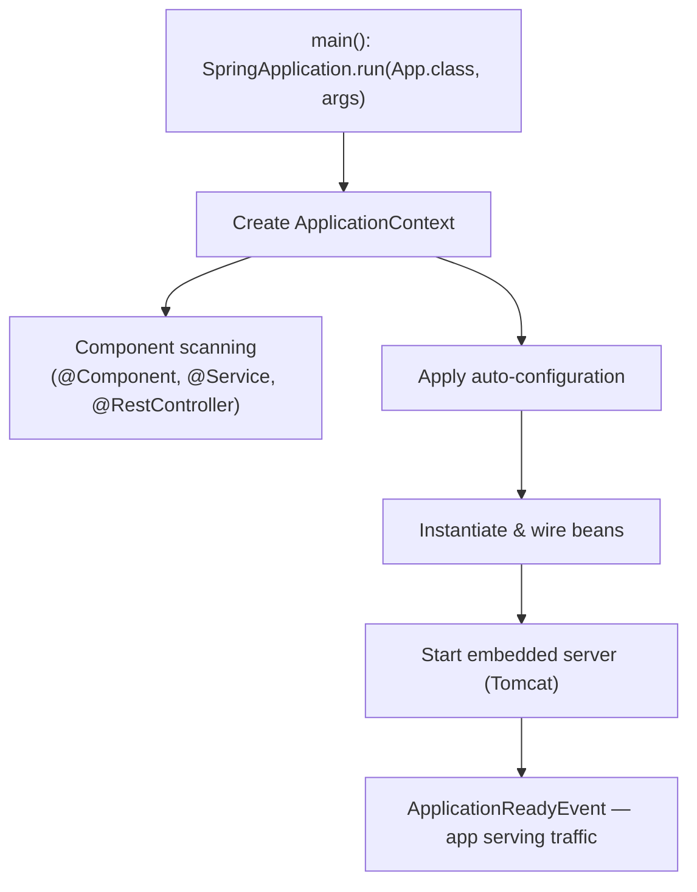
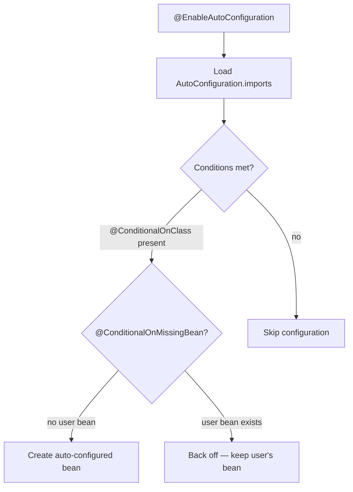
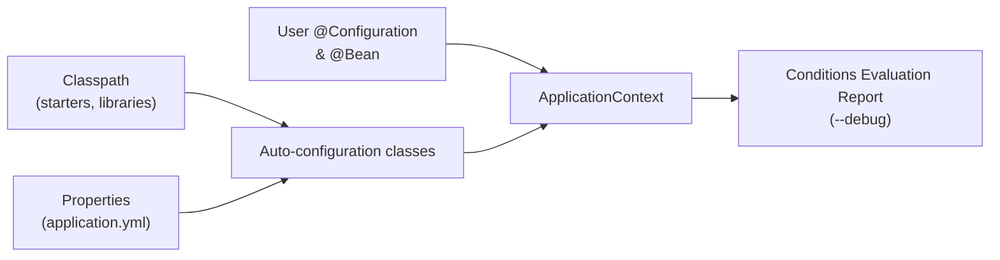
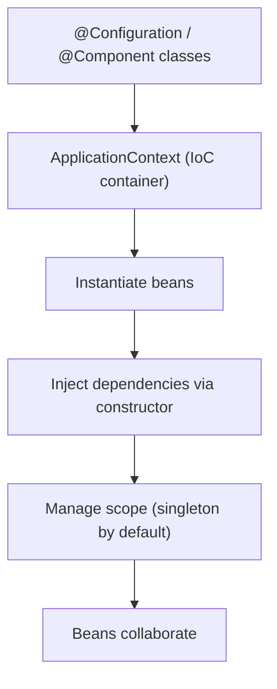
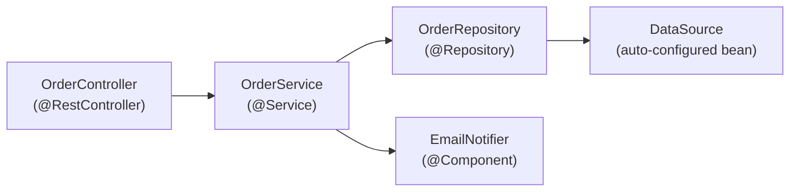

# Spring Boot 3 - Complete Professional Guide

> **Category:** 14_frameworks · **Language:** English

---

### Auto-configuration, Spring MVC & WebFlux, Data JPA, Security, Actuator, Testing, Native/AOT
**Edition for Spring Boot 3.x (Spring Framework 6, Java 17+)**

> **Reference book (English).** Based on the official Spring Boot reference documentation (https://docs.spring.io), the Spring Framework reference, and the Spring Boot release notes. Written for developers, architects, and teams building production services on the JVM.
>
> **Scope notice:** this is a **production-focused** book. It teaches Spring Boot 3 as it is built today: Jakarta EE 9+ namespaces (`jakarta.*`), Java 17+ baseline, GraalVM native images, observability with Micrometer, and the modern auto-configuration model. Each chapter follows the TO-BRAIN editorial standard (see `FILE_CONVENTIONS.md`).

---

## How to read this book

Progressive depth across five maturity levels:

| Level | Profile | Parts |
|-------|---------|-------|
| 1 — Beginner | New to Spring Boot | Part I |
| 2 — Intermediate | REST APIs & persistence | Parts II–III |
| 3 — Advanced | Security & reactive | Parts IV–V |
| 4 — Specialist | Testing & observability | Parts VI–VII |
| 5 — Enterprise | Packaging, native, production | Part VIII |

**Target audience:** Java and backend developers, software architects, platform engineers, tech leads, and CTOs adopting or scaling Spring Boot 3 services.

**Structure of each chapter:** Introduction · Business context · Theoretical concepts · Architecture · Diagrams (Mermaid) · Real examples · Step by step · Complete code · Exercises · Challenges · Checklist · Best practices · Anti-patterns · Troubleshooting · Official references.

**Example format:** Scenario · Problem · Solution · Implementation · Result · Future improvements.

> **Note on prerequisites.** This book assumes working knowledge of Java 17+ (records, sealed types, `var`), Maven or Gradle, and basic HTTP. Where a Spring Boot feature builds on plain Spring Framework, the lineage is made explicit.

---

## Table of Contents

**Part I – Foundations**
1. What is Spring Boot 3 — starters and the project model
2. Auto-configuration and the Spring Boot lifecycle
3. The IoC container, beans, and dependency injection

**Part II – Configuration & Web APIs**
4. Externalized configuration, profiles, and `@ConfigurationProperties`
5. Building REST APIs with Spring MVC (`@RestController`, content negotiation)
6. Bean Validation and error handling (`@Valid`, `ProblemDetail`, `@ControllerAdvice`)

**Part III – Data & Transactions**
7. Spring Data JPA fundamentals (entities, repositories, queries)
8. Transaction management with `@Transactional`
9. Database migrations and connection pooling (Flyway/Liquibase, HikariCP)

**Part IV – Security**
10. Spring Security architecture and the `SecurityFilterChain`
11. Stateless authentication with JWT
12. OAuth2 / OIDC resource server and client

**Part V – Reactive**
13. Reactive programming with Project Reactor
14. Spring WebFlux and the functional/annotated models
15. Reactive data access (R2DBC)

**Part VI – Testing**
16. Unit and slice tests (`@WebMvcTest`, `@DataJpaTest`)
17. Integration tests with `@SpringBootTest` and Testcontainers

**Part VII – Observability**
18. Spring Boot Actuator (health, metrics, info)
19. Observability with Micrometer (metrics, tracing, logs)

**Part VIII – Packaging & Production**
20. Executable jars, layered images, and Docker (Buildpacks)
21. GraalVM native images and AOT processing
22. Production hardening and the twelve-factor checklist

> **Status of this edition:** phased delivery (each part keeps the same depth standard). **Ready:** Part I (Ch. 1–3). **In progress:** Parts II–VIII.

---

## Part I – Foundations

Part I builds the mental model you need for everything else. Spring Boot is not a new framework on top of Spring — it is an **opinionated, convention-over-configuration** layer that wires Spring Framework for you. Understanding three things — **starters**, **auto-configuration**, and the **IoC container** — explains 80% of what Spring Boot does at runtime, and demystifies the "magic" that newcomers often distrust.

---

## Chapter 1 — What is Spring Boot 3 — starters and the project model

### 1.1 Introduction

Spring Boot 3 (built on **Spring Framework 6**, requiring **Java 17+** and the **`jakarta.*`** namespace) lets you create stand-alone, production-grade Spring applications that "just run." Instead of assembling dozens of libraries and XML files, you declare a small set of **starters** — curated dependency descriptors — and Spring Boot supplies sensible defaults, an embedded server, and a single executable artifact. This chapter explains the project model: starters, the parent BOM, the embedded server, and the `@SpringBootApplication` entry point.

### 1.2 Business context

For engineering organizations, Spring Boot's value is **time-to-first-endpoint** and **operational consistency**. A new service can be live in minutes, every service shares the same dependency versions (via the managed BOM), and the same `java -jar` command runs locally, in CI, and in production. This standardization lowers onboarding cost, reduces "works on my machine" drift, and makes a fleet of microservices governable. The trade-off — accepting Spring's opinions — is usually a net win because the defaults reflect community-wide best practice.

### 1.3 Theoretical concepts: the building blocks

```mermaid
mindmap
  root((Spring Boot 3))
    Starters
      spring-boot-starter-web
      spring-boot-starter-data-jpa
      spring-boot-starter-security
      spring-boot-starter-test
    Dependency management
      spring-boot-starter-parent (BOM)
      consistent versions
    Embedded server
      Tomcat (default)
      Jetty / Undertow
    Entry point
      @SpringBootApplication
      SpringApplication.run()
    Platform baseline
      Java 17+
      jakarta.* namespace
      Spring Framework 6
```

A **starter** is a dependency that transitively pulls a coherent set of libraries (for example, `spring-boot-starter-web` brings Spring MVC, Jackson, validation, and embedded Tomcat). The **starter parent** (or the dependency-management BOM in Gradle) pins compatible versions so you rarely specify version numbers yourself. The result is a reproducible, version-aligned dependency tree.

### 1.4 Architecture: from main() to a running server



`@SpringBootApplication` is a meta-annotation combining `@SpringBootConfiguration`, `@EnableAutoConfiguration`, and `@ComponentScan`. Running `SpringApplication.run(...)` bootstraps the context, applies auto-configuration, starts the embedded server, and publishes lifecycle events.

### 1.5 Real example

**Scenario.** A team needs a minimal HTTP service exposing a health-style greeting endpoint, runnable as a single jar.

**Problem.** They want zero boilerplate and no servlet-container installation.

**Solution.** Use `spring-boot-starter-web` and a single `@RestController`. The embedded Tomcat ships inside the jar.

**Implementation.**

```java
// build: spring-boot-starter-parent + spring-boot-starter-web
package com.example.greeting;

import org.springframework.boot.SpringApplication;
import org.springframework.boot.autoconfigure.SpringBootApplication;
import org.springframework.web.bind.annotation.GetMapping;
import org.springframework.web.bind.annotation.RequestParam;
import org.springframework.web.bind.annotation.RestController;

@SpringBootApplication
public class GreetingApplication {
    public static void main(String[] args) {
        SpringApplication.run(GreetingApplication.class, args);
    }
}

@RestController
class GreetingController {

    public record Greeting(String message) {}

    @GetMapping("/greeting")
    Greeting greet(@RequestParam(defaultValue = "World") String name) {
        return new Greeting("Hello, " + name + "!");
    }
}
```

```bash
# Build and run a single executable jar
./mvnw clean package
java -jar target/greeting-0.0.1-SNAPSHOT.jar
# GET http://localhost:8080/greeting?name=Spring  ->  {"message":"Hello, Spring!"}
```

**Result.** A self-contained jar with embedded Tomcat serves JSON on port 8080 — no external server, no XML, one command.

**Future improvements.** Add `@ConfigurationProperties` for the greeting text (Chapter 4) and Actuator for health/metrics (Chapter 18).

### 1.6 Exercises

1. List three starters and the libraries each pulls in transitively.
2. What three annotations does `@SpringBootApplication` combine?
3. How would you switch the embedded server from Tomcat to Undertow?

### 1.7 Challenges

- **Challenge.** Generate a project with Spring Initializr (start.spring.io), add `web` and `actuator`, run it, and confirm the embedded server version printed in the startup log matches the BOM.

### 1.8 Checklist

- [ ] I understand what a starter is and why versions are managed for me.
- [ ] I can explain the role of `@SpringBootApplication`.
- [ ] I know Spring Boot 3 requires Java 17+ and the `jakarta.*` namespace.
- [ ] I can package and run an app as a single executable jar.

### 1.9 Best practices

- Prefer starters over hand-picking individual libraries — you inherit tested version alignment.
- Keep the main application class in the **root package** so component scanning covers all sub-packages.
- Let the BOM manage versions; only override a version when you have a concrete reason.

### 1.10 Anti-patterns

- Pinning library versions manually and fighting the managed BOM, causing classpath conflicts.
- Placing `@SpringBootApplication` in a deep package so component scanning misses your beans.
- Mixing `javax.*` and `jakarta.*` imports (the former is unsupported in Spring Boot 3).

### 1.11 Troubleshooting

| Symptom | Likely cause | Action |
|---------|--------------|--------|
| Beans/controllers not discovered | Main class outside root package | Move it up so `@ComponentScan` covers them |
| `ClassNotFoundException: javax.servlet...` | Legacy `javax.*` dependency | Use Jakarta-based libraries; Boot 3 is `jakarta.*` |
| Port 8080 already in use | Another process bound to the port | Set `server.port` or free the port |
| Wrong/duplicate dependency versions | Bypassing the BOM | Remove explicit versions; rely on starter parent |

### 1.12 Official references

- Spring Boot reference — Getting Started: https://docs.spring.io/spring-boot/reference/using/index.html
- Spring Boot starters: https://docs.spring.io/spring-boot/reference/using/build-systems.html#using.build-systems.starters
- Spring Initializr: https://start.spring.io
- Spring Boot 3 release notes: https://github.com/spring-projects/spring-boot/wiki/Spring-Boot-3.0-Release-Notes

---

## Chapter 2 — Auto-configuration and the Spring Boot lifecycle

### 2.1 Introduction

Auto-configuration is the mechanism that makes Spring Boot feel magical: based on what is on the classpath, what beans already exist, and what properties are set, Spring Boot **conditionally** configures beans for you (a `DataSource`, a `Jackson` mapper, an MVC stack, and so on). This chapter explains how auto-configuration is discovered and applied, how conditions decide what gets created, and how you override or disable it.

### 2.2 Business context

Auto-configuration is what turns "weeks of plumbing" into "minutes of coding." For a business, that means faster delivery and fewer configuration defects. But teams must understand it well enough to **debug** it — when a bean unexpectedly exists (or doesn't), the difference between a one-line fix and a multi-day investigation is knowing how conditions and ordering work. Treating auto-configuration as an unknowable black box is an operational risk.

### 2.3 Theoretical concepts: conditional beans

Auto-configuration classes are listed in `META-INF/spring/org.springframework.boot.autoconfigure.AutoConfiguration.imports`. Each is gated by `@Conditional` annotations such as `@ConditionalOnClass`, `@ConditionalOnMissingBean`, and `@ConditionalOnProperty`. The crucial rule: **your beans win** — `@ConditionalOnMissingBean` means an auto-configured bean is created only if you didn't already define one.



### 2.4 Architecture: where auto-configuration sits



Auto-configuration runs **after** your own configuration so your beans are seen first; this is why user-defined beans cause the matching auto-config to "back off."

### 2.5 Real example

**Scenario.** A team wants a custom JSON `ObjectMapper` (snake_case, ignore unknown fields) but keep all other web auto-configuration intact.

**Problem.** They worry that defining their own mapper will break Spring Boot's Jackson setup.

**Solution.** Define a single `@Bean ObjectMapper`. Because the Jackson auto-configuration uses `@ConditionalOnMissingBean`, it backs off for the mapper while keeping everything else.

**Implementation.**

```java
package com.example.config;

import com.fasterxml.jackson.databind.DeserializationFeature;
import com.fasterxml.jackson.databind.ObjectMapper;
import com.fasterxml.jackson.databind.PropertyNamingStrategies;
import org.springframework.context.annotation.Bean;
import org.springframework.context.annotation.Configuration;

@Configuration
public class JacksonConfig {

    @Bean
    ObjectMapper objectMapper() {
        return new ObjectMapper()
            .setPropertyNamingStrategy(PropertyNamingStrategies.SNAKE_CASE)
            .configure(DeserializationFeature.FAIL_ON_UNKNOWN_PROPERTIES, false);
    }
}
```

```bash
# See exactly which auto-configurations matched and why
java -jar app.jar --debug
# ...prints the "Conditions Evaluation Report":
# Positive matches / Negative matches / Exclusions
```

**Result.** The application uses your `ObjectMapper`; Spring Boot's Jackson auto-config backs off for that bean but still wires the rest of the web stack.

**Future improvements.** Prefer customizing via `Jackson2ObjectMapperBuilderCustomizer` so Boot's other defaults (modules, date handling) are preserved; reserve a full `ObjectMapper` bean for cases that truly need total control.

### 2.6 Exercises

1. What file declares auto-configuration classes in Spring Boot 3?
2. Explain what `@ConditionalOnMissingBean` does and why it matters.
3. How do you exclude a specific auto-configuration class?

### 2.7 Challenges

- **Challenge.** Run your app with `--debug`, open the Conditions Evaluation Report, and explain why one positive match and one negative match appear.

### 2.8 Checklist

- [ ] I can describe how auto-configuration is discovered.
- [ ] I know the common `@Conditional` annotations and the "back off" rule.
- [ ] I can read the Conditions Evaluation Report.
- [ ] I know how to exclude an auto-configuration via `exclude` or properties.

### 2.9 Best practices

- Override behavior by **adding your own bean** and letting auto-config back off, rather than fighting it.
- Use `Customizer` beans (e.g. `WebMvcConfigurer`, `Jackson2ObjectMapperBuilderCustomizer`) to tweak defaults without replacing them wholesale.
- Use the `--debug` report when a bean unexpectedly exists or is missing.

### 2.10 Anti-patterns

- Disabling broad swaths of auto-configuration "to be safe," then re-implementing the plumbing by hand.
- Defining a full replacement bean when a customizer would suffice, losing useful defaults.
- Assuming a bean exists without checking the conditions report.

### 2.11 Troubleshooting

| Symptom | Cause | Action |
|---------|-------|--------|
| Expected bean is missing | A condition wasn't met | Check `--debug` negative matches |
| Two conflicting beans of a type | Auto-config didn't back off | Ensure your bean type matches the `@ConditionalOnMissingBean` target |
| Auto-config you don't want is active | Class is on the classpath | Use `@SpringBootApplication(exclude = ...)` or `spring.autoconfigure.exclude` |
| Customization ignored | Replaced bean instead of customizing | Use the matching `Customizer`/`Configurer` |

### 2.12 Official references

- Auto-configuration: https://docs.spring.io/spring-boot/reference/using/auto-configuration.html
- Creating your own auto-configuration: https://docs.spring.io/spring-boot/reference/features/developing-auto-configuration.html
- Condition annotations: https://docs.spring.io/spring-boot/reference/features/developing-auto-configuration.html#features.developing-auto-configuration.condition-annotations
- Spring Boot reference (full): https://docs.spring.io/spring-boot/index.html

---

## Chapter 3 — The IoC container, beans, and dependency injection

### 3.1 Introduction

Underneath every Spring Boot app is the Spring Framework **Inversion of Control (IoC) container**: it creates objects (**beans**), resolves their dependencies, and manages their lifecycle. Spring Boot adds auto-configuration and conventions, but the container is the engine. This chapter covers beans, the stereotype annotations, **constructor injection** (the modern default), scopes, and how the `ApplicationContext` ties it together.

### 3.2 Business context

Dependency injection is not academic — it directly shapes **testability and change cost**. Code that receives its collaborators (rather than constructing them) can be unit-tested with fakes, swapped per environment, and refactored without ripple effects. Teams that internalize DI ship code that is cheaper to test and safer to evolve; teams that don't end up with tangled singletons and brittle tests.

### 3.3 Theoretical concepts: beans and injection

A **bean** is an object managed by the container. You declare beans either with **stereotype annotations** (`@Component`, `@Service`, `@Repository`, `@Controller`) that are component-scanned, or with `@Bean` methods inside a `@Configuration` class. Dependencies are supplied by the container — preferably through the **constructor**, which yields immutable, fully-initialized, easily-testable objects.



### 3.4 Architecture: a layered bean graph



Each arrow is a constructor dependency the container resolves. Because beans are singletons by default, this graph is built once at startup and reused for every request.

### 3.5 Real example

**Scenario.** An order service must persist orders and send a confirmation, with both collaborators injectable for testing.

**Problem.** Field injection (`@Autowired` on fields) makes the class hard to unit-test and hides required dependencies.

**Solution.** Use **constructor injection**. With a single constructor, Spring injects automatically — no `@Autowired` needed — and the dependencies become `final`.

**Implementation.**

```java
package com.example.orders;

import org.springframework.stereotype.Service;

public interface Notifier { void confirm(String orderId); }

@Service
class OrderService {

    private final OrderRepository repository;
    private final Notifier notifier;

    // Single constructor: Spring injects these automatically.
    OrderService(OrderRepository repository, Notifier notifier) {
        this.repository = repository;
        this.notifier = notifier;
    }

    public String place(Order order) {
        Order saved = repository.save(order);
        notifier.confirm(saved.id());
        return saved.id();
    }
}
```

```java
// Unit test without Spring: just pass fakes to the constructor.
class OrderServiceTest {
    @org.junit.jupiter.api.Test
    void placesAndConfirms() {
        var repo = new InMemoryOrderRepository();          // fake
        var notifier = new RecordingNotifier();            // fake
        var service = new OrderService(repo, notifier);

        String id = service.place(new Order("ABC", 2));

        org.junit.jupiter.api.Assertions.assertNotNull(id);
        org.junit.jupiter.api.Assertions.assertTrue(notifier.wasCalledFor(id));
    }
}
```

**Result.** The service is immutable, its dependencies are explicit, and it is unit-testable with zero Spring infrastructure — tests run in milliseconds.

**Future improvements.** Promote `Order` to a record; if multiple `Notifier` implementations exist, disambiguate with `@Primary` or `@Qualifier` (Chapter 4 covers profile-based selection).

### 3.6 Exercises

1. Name the four stereotype annotations and the semantic each conveys.
2. Why is constructor injection preferred over field injection?
3. What is the default bean scope, and name one alternative scope.

### 3.7 Challenges

- **Challenge.** Introduce a second `Notifier` implementation and make the container choose the right one per profile using `@Profile`, without changing `OrderService`.

### 3.8 Checklist

- [ ] I can declare beans with stereotypes and with `@Bean` methods.
- [ ] I use constructor injection with `final` fields.
- [ ] I understand singleton vs other scopes.
- [ ] I can disambiguate multiple candidates with `@Qualifier`/`@Primary`.

### 3.9 Best practices

- Prefer constructor injection; let a single constructor be injected implicitly.
- Make injected fields `final` to express immutability and catch missing wiring at compile time.
- Keep beans focused (single responsibility); inject interfaces, not concrete classes, where it aids testing.

### 3.10 Anti-patterns

- Field injection (`@Autowired` on private fields) — hides dependencies and hurts testability.
- Calling `applicationContext.getBean(...)` from business code (service locator) instead of injecting.
- God-beans that depend on a dozen collaborators — a sign the class does too much.

### 3.11 Troubleshooting

| Symptom | Cause | Action |
|---------|-------|--------|
| `NoSuchBeanDefinitionException` | Bean not scanned or not declared | Add a stereotype/`@Bean`; verify package scanning |
| `NoUniqueBeanDefinitionException` | Multiple candidates for a type | Add `@Primary` or `@Qualifier` |
| Circular dependency error at startup | Two beans require each other via constructor | Break the cycle; reconsider design or use `@Lazy` |
| `null` dependency at runtime | Object created with `new` instead of injected | Make it a managed bean and inject it |

### 3.12 Official references

- The IoC container: https://docs.spring.io/spring-framework/reference/core/beans.html
- Dependency injection: https://docs.spring.io/spring-framework/reference/core/beans/dependencies/factory-collaborators.html
- Bean scopes: https://docs.spring.io/spring-framework/reference/core/beans/factory-scopes.html
- Spring Boot — Spring Beans and dependency injection: https://docs.spring.io/spring-boot/reference/using/spring-beans-and-dependency-injection.html

---

> **End of Part I.** You now have the foundational mental model of Spring Boot 3: the **project model** (starters, BOM, embedded server, `@SpringBootApplication`), the **auto-configuration** mechanism (conditional beans and the "back off" rule), and the **IoC container** with constructor-based dependency injection. **Part II — Configuration & Web APIs** (Chapters 4–6) builds on this to cover externalized configuration and profiles, REST APIs with Spring MVC, and validation with RFC 7807 `ProblemDetail` error handling.

<!--APPEND-PARTE-II-->
