# Spring Boot 4 - Complete Professional Guide

> **Category:** 14_frameworks · **Language:** English

---

### Auto-configuration, Spring MVC & WebFlux, Data JPA, Security, Actuator, Testing, Native/AOT
**Edition for Spring Boot 4.x (Spring Framework 7, Java 17+ with first-class Java 25)**

> **Reference book (English).** Based on the official Spring Boot reference documentation (https://docs.spring.io), the Spring Framework 7 reference, and the Spring Boot 4.0 release notes. Written for developers, architects, and teams building production services on the JVM.
>
> **Scope notice:** this is a **production-focused** book. It teaches Spring Boot 4 as it is built today: Jakarta EE 11 (`jakarta.*`, Servlet 6.1, JPA 3.2, Bean Validation 3.1), a Java 17 baseline with first-class Java 25 support, JSpecify null-safety, Jackson 3, built-in REST API versioning, core resilience (`@Retryable`, `@ConcurrencyLimit`), a modularized auto-configuration model, and GraalVM native images. Each chapter follows the TO-BRAIN editorial standard (see `FILE_CONVENTIONS.md`).

---

## What changed since Spring Boot 3

Spring Boot 4 is built on **Spring Framework 7** and starts a new generation of the platform. The headline changes — woven into the relevant chapters below — are:

- **Java baseline & toolchain.** Java **17** remains the minimum, but 4.0 ships **first-class support for Java 25** (the recommended LTS). Kotlin **2.2+** and, for native images, **GraalVM 25+** are required.
- **Jakarta EE 11.** Servlet 6.1, JPA 3.2, Bean Validation 3.1. Still `jakarta.*`; a Servlet 6.1-compatible container is required.
- **JSpecify null-safety.** The portfolio standardizes on **JSpecify** annotations (`@Nullable`, `@NonNull`, `@NullMarked`) for tool-checkable nullness, replacing Spring's own annotations.
- **Jackson 3.** JSON processing moves to **Jackson 3** (new `tools.jackson.*` packages); Jackson 2 is still bridgeable during migration.
- **Built-in REST API versioning.** First-class API versioning across MVC and WebFlux (`@RequestMapping(version = ...)`) — no custom resolver plumbing.
- **Core resilience.** `@Retryable` and `@ConcurrencyLimit` are now first-class in the framework (Spring Retry folded into core).
- **Modularized auto-configuration.** The monolithic `spring-boot-autoconfigure` jar is split into focused modules, shrinking footprint and clarifying dependencies.
- **Declarative HTTP clients.** `@HttpServiceClient` interfaces are promoted to a fully supported, auto-detected programming model.

If you are migrating, read this edition alongside the official **Spring Boot 4.0 Migration Guide** and the **OpenRewrite** recipes that automate most of the mechanical changes.

---

## How to read this book

Progressive depth across five maturity levels:

| Level | Profile | Parts |
|-------|---------|-------|
| 1 — Beginner | New to Spring Boot | Part I |
| 2 — Intermediate | REST APIs & persistence | Parts II–III |
| 3 — Advanced | Security & reactive | Parts IV–V |
| 4 — Specialist | Testing & observability | Parts VI–VII |
| 5 — Enterprise | Packaging, native, production | Part VIII |

**Target audience:** Java and backend developers, software architects, platform engineers, tech leads, and CTOs adopting or scaling Spring Boot 4 services.

**Structure of each chapter:** Introduction · Business context · Theoretical concepts · Architecture · Diagrams (Mermaid) · Real examples · Step by step · Complete code · Exercises · Challenges · Checklist · Best practices · Anti-patterns · Troubleshooting · Official references.

**Example format:** Scenario · Problem · Solution · Implementation · Result · Future improvements.

> **Note on prerequisites.** This book assumes working knowledge of Java 17+ (records, sealed types, `var`; ideally pattern matching and virtual threads from later releases), Maven or Gradle, and basic HTTP. Where a Spring Boot feature builds on plain Spring Framework, the lineage is made explicit.

---

## Table of Contents

**Part I – Foundations**
1. What is Spring Boot 4 — starters and the project model
2. Auto-configuration and the Spring Boot lifecycle
3. The IoC container, beans, and dependency injection

**Part II – Configuration & Web APIs**
4. Externalized configuration, profiles, and `@ConfigurationProperties`
5. Building REST APIs with Spring MVC (`@RestController`, content negotiation, API versioning)
6. Bean Validation and error handling (`@Valid`, `ProblemDetail`, `@ControllerAdvice`)

**Part III – Data & Transactions**
7. Spring Data JPA fundamentals (entities, repositories, queries)
8. Transaction management with `@Transactional`
9. Database migrations and connection pooling (Flyway/Liquibase, HikariCP)

**Part IV – Security**
10. Spring Security architecture and the `SecurityFilterChain`
11. Stateless authentication with JWT
12. OAuth2 / OIDC resource server and client

**Part V – Reactive & Resilience**
13. Reactive programming with Project Reactor
14. Spring WebFlux and the functional/annotated models
15. Reactive data access (R2DBC) and core resilience (`@Retryable`, `@ConcurrencyLimit`)

**Part VI – Testing**
16. Unit and slice tests (`@WebMvcTest`, `@DataJpaTest`)
17. Integration tests with `@SpringBootTest` and Testcontainers

**Part VII – Observability**
18. Spring Boot Actuator (health, metrics, info)
19. Observability with Micrometer (metrics, tracing, logs)

**Part VIII – Packaging & Production**
20. Executable jars, layered images, and Docker (Buildpacks)
21. GraalVM native images and AOT processing
22. Production hardening and the twelve-factor checklist

> **Status of this edition:** phased delivery (each part keeps the same depth standard). **Ready:** Part I (Ch. 1–3). **In progress:** Parts II–VIII.

---

## Part I – Foundations

Part I builds the mental model you need for everything else. Spring Boot is not a new framework on top of Spring — it is an **opinionated, convention-over-configuration** layer that wires Spring Framework for you. Understanding three things — **starters**, **auto-configuration**, and the **IoC container** — explains 80% of what Spring Boot does at runtime, and demystifies the "magic" that newcomers often distrust.

---

## Chapter 1 — What is Spring Boot 4 — starters and the project model

### 1.1 Introduction

Spring Boot 4 (built on **Spring Framework 7**, requiring **Java 17+** with **first-class Java 25** support and the **`jakarta.*`** namespace at the **Jakarta EE 11** level) lets you create stand-alone, production-grade Spring applications that "just run." Instead of assembling dozens of libraries and XML files, you declare a small set of **starters** — curated dependency descriptors — and Spring Boot supplies sensible defaults, an embedded server, and a single executable artifact. This chapter explains the project model: starters, the parent BOM, the embedded server, and the `@SpringBootApplication` entry point.

### 1.2 Business context

For engineering organizations, Spring Boot's value is **time-to-first-endpoint** and **operational consistency**. A new service can be live in minutes, every service shares the same dependency versions (via the managed BOM), and the same `java -jar` command runs locally, in CI, and in production. Spring Boot 4 sharpens this with a **modularized** dependency model (smaller, clearer auto-configuration modules) and a JSpecify-checked, null-safe codebase — standardization that lowers onboarding cost, reduces "works on my machine" drift, and makes a fleet of microservices governable. The trade-off — accepting Spring's opinions — is usually a net win because the defaults reflect community-wide best practice.

### 1.3 Theoretical concepts: the building blocks

```mermaid
mindmap
  root((Spring Boot 4))
    Starters
      spring-boot-starter-web
      spring-boot-starter-data-jpa
      spring-boot-starter-security
      spring-boot-starter-test
    Dependency management
      spring-boot-starter-parent (BOM)
      consistent versions
      modularized auto-config
    Embedded server
      Tomcat (default)
      Jetty / Undertow
    Entry point
      @SpringBootApplication
      SpringApplication.run()
    Platform baseline
      Java 17+ (first-class Java 25)
      jakarta.* (Jakarta EE 11)
      Spring Framework 7
      JSpecify null-safety
```

A **starter** is a dependency that transitively pulls a coherent set of libraries (for example, `spring-boot-starter-web` brings Spring MVC, Jackson 3, validation, and embedded Tomcat). The **starter parent** (or the dependency-management BOM in Gradle) pins compatible versions so you rarely specify version numbers yourself. In Spring Boot 4 the auto-configuration that backs these starters is **split into focused modules** rather than one monolithic jar, so an app pulls in only what it uses. The result is a reproducible, version-aligned, leaner dependency tree.

### 1.4 Architecture: from main() to a running server

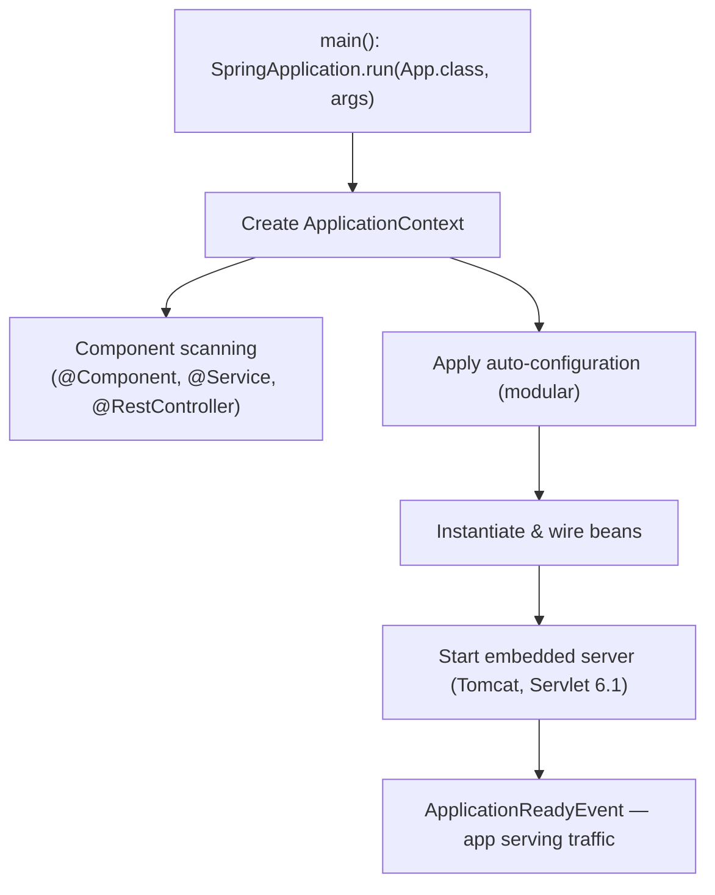

`@SpringBootApplication` is a meta-annotation combining `@SpringBootConfiguration`, `@EnableAutoConfiguration`, and `@ComponentScan`. Running `SpringApplication.run(...)` bootstraps the context, applies auto-configuration, starts the embedded server, and publishes lifecycle events.

### 1.5 Real example

**Scenario.** A team needs a minimal HTTP service exposing a health-style greeting endpoint, runnable as a single jar.

**Problem.** They want zero boilerplate and no servlet-container installation.

**Solution.** Use `spring-boot-starter-web` and a single `@RestController`. The embedded Tomcat ships inside the jar.

**Implementation.**

```java
// build: spring-boot-starter-parent (4.x) + spring-boot-starter-web
package com.example.greeting;

import org.springframework.boot.SpringApplication;
import org.springframework.boot.autoconfigure.SpringBootApplication;
import org.springframework.web.bind.annotation.GetMapping;
import org.springframework.web.bind.annotation.RequestParam;
import org.springframework.web.bind.annotation.RestController;

@SpringBootApplication
public class GreetingApplication {
    public static void main(String[] args) {
        SpringApplication.run(GreetingApplication.class, args);
    }
}

@RestController
class GreetingController {

    public record Greeting(String message) {}

    @GetMapping("/greeting")
    Greeting greet(@RequestParam(defaultValue = "World") String name) {
        return new Greeting("Hello, " + name + "!");
    }
}
```

```bash
# Build and run a single executable jar
./mvnw clean package
java -jar target/greeting-0.0.1-SNAPSHOT.jar
# GET http://localhost:8080/greeting?name=Spring  ->  {"message":"Hello, Spring!"}
```

**Result.** A self-contained jar with embedded Tomcat serves JSON on port 8080 — no external server, no XML, one command.

**Future improvements.** Add `@ConfigurationProperties` for the greeting text (Chapter 4), version the endpoint with built-in API versioning (Chapter 5), and add Actuator for health/metrics (Chapter 18).

### 1.6 Exercises

1. List three starters and the libraries each pulls in transitively.
2. What three annotations does `@SpringBootApplication` combine?
3. How would you switch the embedded server from Tomcat to Undertow?

### 1.7 Challenges

- **Challenge.** Generate a project with Spring Initializr (start.spring.io) selecting Spring Boot 4.x, add `web` and `actuator`, run it on Java 25, and confirm the embedded server version printed in the startup log matches the BOM.

### 1.8 Checklist

- [ ] I understand what a starter is and why versions are managed for me.
- [ ] I can explain the role of `@SpringBootApplication`.
- [ ] I know Spring Boot 4 requires Java 17+ (first-class Java 25) and Jakarta EE 11 (`jakarta.*`).
- [ ] I can package and run an app as a single executable jar.

### 1.9 Best practices

- Prefer starters over hand-picking individual libraries — you inherit tested version alignment.
- Keep the main application class in the **root package** so component scanning covers all sub-packages.
- Let the BOM manage versions; only override a version when you have a concrete reason.
- Target the latest LTS (Java 25) for new Boot 4 services unless a constraint pins you to 17.

### 1.10 Anti-patterns

- Pinning library versions manually and fighting the managed BOM, causing classpath conflicts.
- Placing `@SpringBootApplication` in a deep package so component scanning misses your beans.
- Carrying over `javax.*` or Jakarta EE 10 / Servlet 6.0 assumptions — Boot 4 is Jakarta EE 11 (Servlet 6.1).

### 1.11 Troubleshooting

| Symptom | Likely cause | Action |
|---------|--------------|--------|
| Beans/controllers not discovered | Main class outside root package | Move it up so `@ComponentScan` covers them |
| `ClassNotFoundException: javax.servlet...` | Legacy `javax.*` dependency | Use Jakarta EE 11 libraries; Boot 4 is `jakarta.*` |
| Container fails to start on old server | Servlet < 6.1 container | Use a Servlet 6.1-compatible container |
| Port 8080 already in use | Another process bound to the port | Set `server.port` or free the port |
| Wrong/duplicate dependency versions | Bypassing the BOM | Remove explicit versions; rely on starter parent |

### 1.12 Official references

- Spring Boot reference — Getting Started: https://docs.spring.io/spring-boot/reference/using/index.html
- Spring Boot starters: https://docs.spring.io/spring-boot/reference/using/build-systems.html#using.build-systems.starters
- Spring Initializr: https://start.spring.io
- Spring Boot 4.0 release notes: https://github.com/spring-projects/spring-boot/wiki/Spring-Boot-4.0-Release-Notes
- Spring Framework 7.0 GA announcement: https://spring.io/blog/2025/11/13/spring-framework-7-0-general-availability/

---

## Chapter 2 — Auto-configuration and the Spring Boot lifecycle

### 2.1 Introduction

Auto-configuration is the mechanism that makes Spring Boot feel magical: based on what is on the classpath, what beans already exist, and what properties are set, Spring Boot **conditionally** configures beans for you (a `DataSource`, a JSON mapper, an MVC stack, and so on). This chapter explains how auto-configuration is discovered and applied, how conditions decide what gets created, and how you override or disable it. In Spring Boot 4 the auto-configuration is delivered as **focused modules** rather than one jar, but the discovery and conditional model is unchanged.

### 2.2 Business context

Auto-configuration is what turns "weeks of plumbing" into "minutes of coding." For a business, that means faster delivery and fewer configuration defects. But teams must understand it well enough to **debug** it — when a bean unexpectedly exists (or doesn't), the difference between a one-line fix and a multi-day investigation is knowing how conditions and ordering work. Treating auto-configuration as an unknowable black box is an operational risk. The Boot 4 modularization makes this easier: smaller modules mean fewer surprising conditions on the classpath.

### 2.3 Theoretical concepts: conditional beans

Auto-configuration classes are listed in `META-INF/spring/org.springframework.boot.autoconfigure.AutoConfiguration.imports` (now within each auto-configuration module). Each is gated by `@Conditional` annotations such as `@ConditionalOnClass`, `@ConditionalOnMissingBean`, and `@ConditionalOnProperty`. The crucial rule: **your beans win** — `@ConditionalOnMissingBean` means an auto-configured bean is created only if you didn't already define one.

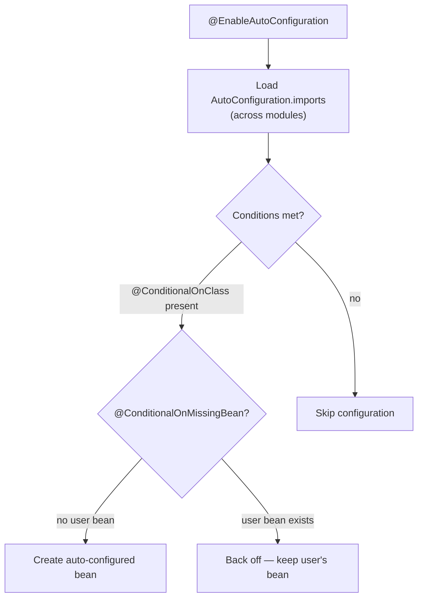

### 2.4 Architecture: where auto-configuration sits

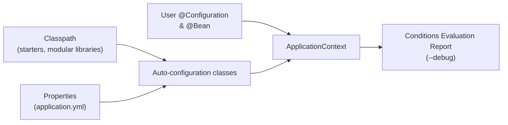

Auto-configuration runs **after** your own configuration so your beans are seen first; this is why user-defined beans cause the matching auto-config to "back off."

### 2.5 Real example

**Scenario.** A team wants a custom JSON `ObjectMapper` (snake_case, ignore unknown fields) but keep all other web auto-configuration intact.

**Problem.** They worry that defining their own mapper will break Spring Boot's Jackson setup, and they are now on **Jackson 3**.

**Solution.** Prefer a `Jackson2ObjectMapperBuilderCustomizer`-style customizer (now backed by Jackson 3) so Boot's other defaults are preserved. If full control is genuinely required, define a single mapper bean and let the Jackson auto-configuration back off via `@ConditionalOnMissingBean`.

**Implementation.**

```java
package com.example.config;

// Spring Boot 4 uses Jackson 3 (tools.jackson.* packages).
import tools.jackson.databind.DeserializationFeature;
import tools.jackson.databind.ObjectMapper;
import tools.jackson.databind.PropertyNamingStrategies;
import org.springframework.context.annotation.Bean;
import org.springframework.context.annotation.Configuration;

@Configuration
public class JacksonConfig {

    @Bean
    ObjectMapper objectMapper() {
        return ObjectMapper.builder()
            .propertyNamingStrategy(PropertyNamingStrategies.SNAKE_CASE)
            .configure(DeserializationFeature.FAIL_ON_UNKNOWN_PROPERTIES, false)
            .build();
    }
}
```

```bash
# See exactly which auto-configurations matched and why
java -jar app.jar --debug
# ...prints the "Conditions Evaluation Report":
# Positive matches / Negative matches / Exclusions
```

**Result.** The application uses your `ObjectMapper`; Spring Boot's Jackson auto-config backs off for that bean but still wires the rest of the web stack.

**Future improvements.** Prefer a builder customizer so Boot's other defaults (modules, date handling) are preserved; reserve a full `ObjectMapper` bean for cases that truly need total control.

### 2.6 Exercises

1. What file declares auto-configuration classes in Spring Boot 4, and how does modularization change where it lives?
2. Explain what `@ConditionalOnMissingBean` does and why it matters.
3. How do you exclude a specific auto-configuration class?

### 2.7 Challenges

- **Challenge.** Run your app with `--debug`, open the Conditions Evaluation Report, and explain why one positive match and one negative match appear.

### 2.8 Checklist

- [ ] I can describe how auto-configuration is discovered (and that it is now modular).
- [ ] I know the common `@Conditional` annotations and the "back off" rule.
- [ ] I can read the Conditions Evaluation Report.
- [ ] I know how to exclude an auto-configuration via `exclude` or properties.

### 2.9 Best practices

- Override behavior by **adding your own bean** and letting auto-config back off, rather than fighting it.
- Use `Customizer` beans (e.g. `WebMvcConfigurer`, a Jackson builder customizer) to tweak defaults without replacing them wholesale.
- Use the `--debug` report when a bean unexpectedly exists or is missing.

### 2.10 Anti-patterns

- Disabling broad swaths of auto-configuration "to be safe," then re-implementing the plumbing by hand.
- Defining a full replacement bean when a customizer would suffice, losing useful defaults.
- Assuming a bean exists without checking the conditions report.

### 2.11 Troubleshooting

| Symptom | Cause | Action |
|---------|-------|--------|
| Expected bean is missing | A condition wasn't met | Check `--debug` negative matches |
| Two conflicting beans of a type | Auto-config didn't back off | Ensure your bean type matches the `@ConditionalOnMissingBean` target |
| Auto-config you don't want is active | Class is on the classpath | Use `@SpringBootApplication(exclude = ...)` or `spring.autoconfigure.exclude` |
| Jackson customization ignored | Mixed Jackson 2 and 3 types | Use the Jackson 3 (`tools.jackson.*`) types and the matching customizer |

### 2.12 Official references

- Auto-configuration: https://docs.spring.io/spring-boot/reference/using/auto-configuration.html
- Creating your own auto-configuration: https://docs.spring.io/spring-boot/reference/features/developing-auto-configuration.html
- Condition annotations: https://docs.spring.io/spring-boot/reference/features/developing-auto-configuration.html#features.developing-auto-configuration.condition-annotations
- Spring Boot reference (full): https://docs.spring.io/spring-boot/index.html

---

## Chapter 3 — The IoC container, beans, and dependency injection

### 3.1 Introduction

Underneath every Spring Boot app is the Spring Framework **Inversion of Control (IoC) container**: it creates objects (**beans**), resolves their dependencies, and manages their lifecycle. Spring Boot adds auto-configuration and conventions, but the container is the engine. This chapter covers beans, the stereotype annotations, **constructor injection** (the modern default), scopes, and how the `ApplicationContext` ties it together. In Spring Framework 7 the container is also **JSpecify-annotated**, so nullness is tool-checkable across injection points.

### 3.2 Business context

Dependency injection is not academic — it directly shapes **testability and change cost**. Code that receives its collaborators (rather than constructing them) can be unit-tested with fakes, swapped per environment, and refactored without ripple effects. Teams that internalize DI ship code that is cheaper to test and safer to evolve; teams that don't end up with tangled singletons and brittle tests. Boot 4's JSpecify null-safety adds a second payoff: nullness bugs surface in the IDE and build, not in production.

### 3.3 Theoretical concepts: beans and injection

A **bean** is an object managed by the container. You declare beans either with **stereotype annotations** (`@Component`, `@Service`, `@Repository`, `@Controller`) that are component-scanned, or with `@Bean` methods inside a `@Configuration` class. Dependencies are supplied by the container — preferably through the **constructor**, which yields immutable, fully-initialized, easily-testable objects.

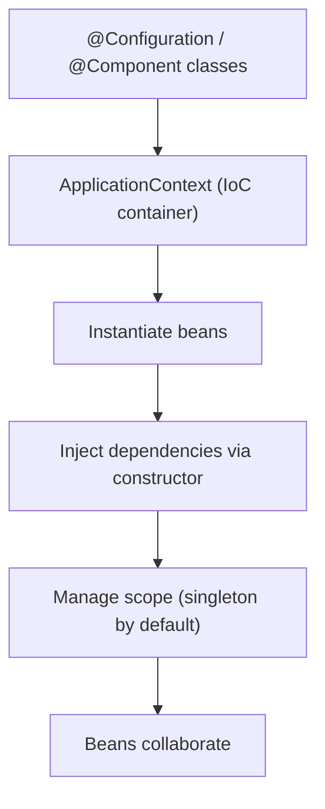

### 3.4 Architecture: a layered bean graph

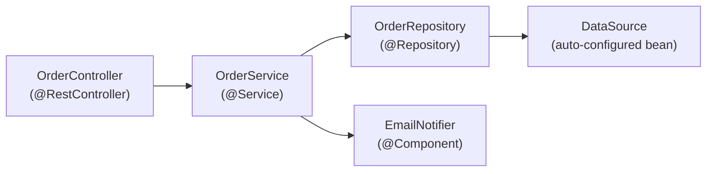

Each arrow is a constructor dependency the container resolves. Because beans are singletons by default, this graph is built once at startup and reused for every request.

### 3.5 Real example

**Scenario.** An order service must persist orders and send a confirmation, with both collaborators injectable for testing.

**Problem.** Field injection (`@Autowired` on fields) makes the class hard to unit-test and hides required dependencies.

**Solution.** Use **constructor injection**. With a single constructor, Spring injects automatically — no `@Autowired` needed — and the dependencies become `final`. Mark the package `@NullMarked` (JSpecify) so non-null is the default and nullable points are explicit.

**Implementation.**

```java
package com.example.orders;

import org.springframework.stereotype.Service;

public interface Notifier { void confirm(String orderId); }

@Service
class OrderService {

    private final OrderRepository repository;
    private final Notifier notifier;

    // Single constructor: Spring injects these automatically.
    OrderService(OrderRepository repository, Notifier notifier) {
        this.repository = repository;
        this.notifier = notifier;
    }

    public String place(Order order) {
        Order saved = repository.save(order);
        notifier.confirm(saved.id());
        return saved.id();
    }
}
```

```java
// Unit test without Spring: just pass fakes to the constructor.
class OrderServiceTest {
    @org.junit.jupiter.api.Test
    void placesAndConfirms() {
        var repo = new InMemoryOrderRepository();          // fake
        var notifier = new RecordingNotifier();            // fake
        var service = new OrderService(repo, notifier);

        String id = service.place(new Order("ABC", 2));

        org.junit.jupiter.api.Assertions.assertNotNull(id);
        org.junit.jupiter.api.Assertions.assertTrue(notifier.wasCalledFor(id));
    }
}
```

**Result.** The service is immutable, its dependencies are explicit, and it is unit-testable with zero Spring infrastructure — tests run in milliseconds.

**Future improvements.** Promote `Order` to a record; if multiple `Notifier` implementations exist, disambiguate with `@Primary` or `@Qualifier` (Chapter 4 covers profile-based selection).

### 3.6 Exercises

1. Name the four stereotype annotations and the semantic each conveys.
2. Why is constructor injection preferred over field injection?
3. What is the default bean scope, and name one alternative scope.

### 3.7 Challenges

- **Challenge.** Introduce a second `Notifier` implementation and make the container choose the right one per profile using `@Profile`, without changing `OrderService`.

### 3.8 Checklist

- [ ] I can declare beans with stereotypes and with `@Bean` methods.
- [ ] I use constructor injection with `final` fields.
- [ ] I understand singleton vs other scopes.
- [ ] I can disambiguate multiple candidates with `@Qualifier`/`@Primary`.
- [ ] I use JSpecify (`@NullMarked`, `@Nullable`) to make nullness explicit.

### 3.9 Best practices

- Prefer constructor injection; let a single constructor be injected implicitly.
- Make injected fields `final` to express immutability and catch missing wiring at compile time.
- Keep beans focused (single responsibility); inject interfaces, not concrete classes, where it aids testing.
- Adopt JSpecify null-safety package-wide so the build catches nullness mistakes.

### 3.10 Anti-patterns

- Field injection (`@Autowired` on private fields) — hides dependencies and hurts testability.
- Calling `applicationContext.getBean(...)` from business code (service locator) instead of injecting.
- God-beans that depend on a dozen collaborators — a sign the class does too much.

### 3.11 Troubleshooting

| Symptom | Cause | Action |
|---------|-------|--------|
| `NoSuchBeanDefinitionException` | Bean not scanned or not declared | Add a stereotype/`@Bean`; verify package scanning |
| `NoUniqueBeanDefinitionException` | Multiple candidates for a type | Add `@Primary` or `@Qualifier` |
| Circular dependency error at startup | Two beans require each other via constructor | Break the cycle; reconsider design or use `@Lazy` |
| `null` dependency at runtime | Object created with `new` instead of injected | Make it a managed bean and inject it |

### 3.12 Official references

- The IoC container: https://docs.spring.io/spring-framework/reference/core/beans.html
- Dependency injection: https://docs.spring.io/spring-framework/reference/core/beans/dependencies/factory-collaborators.html
- Bean scopes: https://docs.spring.io/spring-framework/reference/core/beans/factory-scopes.html
- Null-safety (JSpecify): https://docs.spring.io/spring-framework/reference/core/null-safety.html
- Spring Boot — Spring Beans and dependency injection: https://docs.spring.io/spring-boot/reference/using/spring-beans-and-dependency-injection.html

---

> **End of Part I.** You now have the foundational mental model of Spring Boot 4: the **project model** (starters, BOM, modularized auto-config, embedded server, `@SpringBootApplication`), the **auto-configuration** mechanism (conditional beans and the "back off" rule), and the **IoC container** with constructor-based, JSpecify-null-safe dependency injection. **Part II — Configuration & Web APIs** (Chapters 4–6) builds on this to cover externalized configuration and profiles, REST APIs with Spring MVC including **built-in API versioning**, and validation with RFC 7807 `ProblemDetail` error handling.


---

# Part II – Configuration & Web APIs

Part II turns the foundational mental model from Part I into a service that is *configurable* and *exposed*. A real application must run unchanged across environments (the 12-factor ideal), so we start with **externalized configuration, profiles, and type-safe `@ConfigurationProperties`**. We then build the HTTP surface with **Spring MVC** — `@RestController`, content negotiation, and Spring Boot 4's **first-class API versioning** — and finally make that surface robust with **Bean Validation** and **RFC 9457 `ProblemDetail`** error handling. Together these three chapters take you from "an app that runs" to "an app that talks to the world correctly across every environment."

---

## Chapter 4 — Externalized configuration, profiles, and `@ConfigurationProperties`

### 4.1 Introduction

A Spring Boot 4 application is built once and deployed many times — locally, in CI, in staging, in production — and each deployment needs different settings: a database URL, a connection-pool size, a feature flag. **Externalized configuration** is the mechanism that lets a single immutable jar absorb those differences at startup rather than at build time. Configuration values arrive from many **property sources** (files, environment variables, command-line arguments, imported config), are layered in a defined **precedence order**, and are exposed to your code either through loosely-typed `@Value` injections or, preferably, through **type-safe `@ConfigurationProperties`** beans. **Profiles** then let you switch whole sets of beans and properties on or off per environment. This chapter covers the property model, profiles, binding, and how to keep secrets out of your artifact.

### 4.2 Business context

Hardcoded configuration is one of the most common causes of production incidents and security breaches. A database URL compiled into a jar is correct in exactly one environment and wrong everywhere else; a password committed to a properties file is a leak that survives in git history forever. Externalized configuration directly serves three business concerns: **reliability** (the same tested artifact promotes from dev to prod, eliminating "rebuilt for prod" drift), **security** (secrets live in a vault or environment, never in source), and **auditability** (configuration changes are traceable and reviewable separately from code). For a fleet of microservices, a consistent, validated configuration model is the difference between governable infrastructure and a sprawl of bespoke setups. Spring Boot 4 keeps this model stable across the 3.x→4.0 upgrade, so the investment carries forward cleanly.

### 4.3 Theoretical concepts: property sources, profiles, and binding

```mermaid
mindmap
  root((Externalized config))
    Property sources
      Command-line args
      OS env vars / secrets
      application-{profile}.yml
      application.yml
      Code defaults
    Profiles
      spring.profiles.active
      @Profile on beans
      profile-specific YAML
    Binding
      @Value (loose)
      @ConfigurationProperties (type-safe)
      @Validated constraints
    Imports and secrets
      spring.config.import
      Vault / Kubernetes
      env-injected passwords
```

Three ideas do most of the work. First, **precedence**: when the same key is defined in several sources, the higher-priority source wins. The simplified order, from strongest to weakest, is command-line arguments, then OS environment variables and secrets, then `application-{profile}.yml`, then `application.yml`, then code defaults (the full, exhaustive order is in the reference docs). Second, **profiles**: `spring.profiles.active=prod` activates the `prod` profile, which both registers `@Profile("prod")` beans and pulls in `application-prod.yml`. Third, **binding**: `@ConfigurationProperties(prefix = "app")` maps a whole properties subtree onto a record or class, and `@Validated` runs Jakarta Bean Validation on it at startup so misconfiguration **fails fast** rather than surfacing as a runtime surprise.

### 4.4 Architecture: how a value is resolved

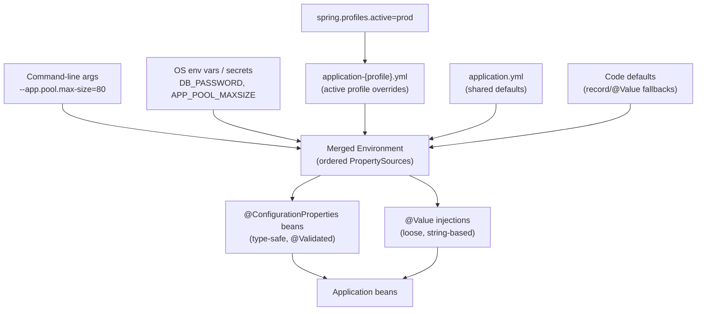

The `Environment` abstraction holds an ordered list of `PropertySource` objects; resolving a key walks that list and returns the first match. Because binding happens at startup, a validated `@ConfigurationProperties` record that fails its constraints aborts the boot with a clear message — you never ship a service that is silently misconfigured. Relaxed binding means `app.pool.max-size`, `APP_POOL_MAXSIZE`, and `app.poolMaxSize` all map to the same property, which is what makes environment-variable overrides ergonomic in containers.

### 4.5 Real example

**Scenario.** A checkout service must run with different connection-pool sizes and feature flags per environment, and the production database password must come from a secret store — never from a file in the artifact.

**Problem.** Today the settings are scattered across a dozen `@Value` annotations with no validation, and the password is one careless commit away from ending up in `application.yml` and leaking into git history.

**Solution.** Consolidate the settings into a single validated `@ConfigurationProperties` record, put environment differences in profile-specific YAML, and inject the password from an environment variable that the platform populates from the secret store.

**Implementation.**

```yaml
# application.yml — shared defaults (committed, no secrets)
app:
  features:
    new-checkout: false
  pool:
    max-size: 10
spring:
  config:
    activate:
      on-profile: "default"
---
# application-prod.yml — production overrides
spring:
  config:
    activate:
      on-profile: prod
  datasource:
    url: jdbc:postgresql://db.prod.internal:5432/checkout
    username: checkout
    password: ${DB_PASSWORD}     # injected from the secret store at deploy time
app:
  features:
    new-checkout: true
  pool:
    max-size: 50
```

```java
package com.example.checkout.config;

import jakarta.validation.Valid;
import jakarta.validation.constraints.Max;
import jakarta.validation.constraints.Min;
import org.springframework.boot.context.properties.ConfigurationProperties;
import org.springframework.validation.annotation.Validated;

// Type-safe, validated configuration bound from the "app.*" subtree.
@ConfigurationProperties(prefix = "app")
@Validated
public record AppProperties(
    Features features,
    @Valid Pool pool
) {
    public record Features(boolean newCheckout) {}

    public record Pool(@Min(1) @Max(200) int maxSize) {}
}
```

```java
package com.example.checkout;

import com.example.checkout.config.AppProperties;
import org.springframework.boot.SpringApplication;
import org.springframework.boot.autoconfigure.SpringBootApplication;
import org.springframework.boot.context.properties.EnableConfigurationProperties;
import org.springframework.stereotype.Service;

@SpringBootApplication
@EnableConfigurationProperties(AppProperties.class)
public class CheckoutApplication {
    public static void main(String[] args) {
        SpringApplication.run(CheckoutApplication.class, args);
    }
}

@Service
class CheckoutFeature {

    private final AppProperties props;

    CheckoutFeature(AppProperties props) {   // constructor injection (Chapter 3)
        this.props = props;
    }

    boolean isNewCheckoutEnabled() {
        return props.features().newCheckout();
    }
}
```

```java
package com.example.checkout;

import com.example.checkout.config.AppProperties;
import org.junit.jupiter.api.Test;
import org.springframework.beans.factory.annotation.Autowired;
import org.springframework.boot.test.context.SpringBootTest;
import org.springframework.test.context.ActiveProfiles;

import static org.assertj.core.api.Assertions.assertThat;

@SpringBootTest
@ActiveProfiles("prod")
class ProdConfigTest {

    @Autowired
    AppProperties props;

    @Test
    void productionOverridesAreApplied() {
        assertThat(props.features().newCheckout()).isTrue();
        assertThat(props.pool().maxSize()).isEqualTo(50);
    }
}
```

**Result.** One artifact behaves correctly in every environment: dev uses the defaults, prod picks up the overrides via `spring.profiles.active=prod`, and the password is supplied by `DB_PASSWORD` at deploy time so it never lives in a file. An invalid value such as `app.pool.max-size: 0` aborts startup with a validation error instead of failing mysteriously under load.

**Future improvements.** Source the password from Vault using `spring.config.import=vault://`, group related flags behind a feature-flag service, and surface the bound properties through Actuator's `/configprops` endpoint (Chapter 18) for operational visibility.

### 4.6 Exercises

1. Order these property sources from strongest to weakest precedence: `application.yml`, a command-line argument, an OS environment variable.
2. Convert three related `@Value("${app.pool.*}")` injections into one `@ConfigurationProperties` record with validation.
3. Name two ways to activate the `prod` profile at runtime.

### 4.7 Challenges

- **Challenge.** Externalize *all* configuration of a small service into `default` and `prod` profiles, bind it through a single `@Validated @ConfigurationProperties` record, inject one secret from an environment variable, and write a `@SpringBootTest` with `@ActiveProfiles("prod")` proving the overrides apply and that an out-of-range value fails startup.

### 4.8 Checklist

- [ ] No secrets live in source or in committed properties files.
- [ ] Environment differences live in profile-specific YAML, not in code branches.
- [ ] Configuration is bound through validated `@ConfigurationProperties`, not scattered `@Value`.
- [ ] The active profile is set explicitly per environment.
- [ ] Invalid configuration fails fast at startup.

### 4.9 Best practices

- Prefer `@ConfigurationProperties` (type-safe, validated, discoverable) over scattered `@Value` strings.
- Build one immutable artifact and vary behavior only through externalized configuration.
- Inject secrets from environment variables or Vault; never commit them.
- Use `@Validated` with Bean Validation constraints so misconfiguration aborts the boot.
- Lean on relaxed binding so the same key can be overridden by an environment variable in a container.

### 4.10 Anti-patterns

- Passwords or API keys in `application.yml` committed to git.
- Building a separate artifact per environment instead of externalizing config.
- Deeply scattered `@Value` strings with no central type or validation.
- Reading `spring.profiles.active` in business logic to branch behavior instead of using `@Profile` beans.

### 4.11 Troubleshooting

| Symptom | Likely cause | Action |
|---------|--------------|--------|
| Wrong value at runtime | Precedence misunderstanding | Inspect the ordered property sources; remember CLI args beat env vars beat files |
| Profile properties ignored | Profile not active | Set `spring.profiles.active` for that environment |
| Binding fails at startup | Type or validation constraint mismatch | Fix the property value or the constraint; read the failure message |
| Env-var override not picked up | Relaxed-binding name mismatch | Use the `APP_POOL_MAXSIZE` form for `app.pool.max-size` |
| Secret found in a file | Password placed in YAML | Move to env var / Vault and rotate the credential |

### 4.12 Official references

- Externalized configuration: https://docs.spring.io/spring-boot/reference/features/external-config.html
- Profiles: https://docs.spring.io/spring-boot/reference/features/profiles.html
- Type-safe `@ConfigurationProperties`: https://docs.spring.io/spring-boot/reference/features/external-config.html#features.external-config.typesafe-configuration-properties
- Importing additional config with `spring.config.import`: https://docs.spring.io/spring-boot/reference/features/external-config.html#features.external-config.files.importing

---

## Chapter 5 — Building REST APIs with Spring MVC

### 5.1 Introduction

**Spring MVC** is Spring Boot 4's servlet-based web stack, running on Servlet 6.1 inside the embedded container. At its center is the `DispatcherServlet`, a front controller that routes each request to a handler method on a controller, applies argument resolution and validation, invokes your code, and serializes the result. For JSON and other machine-to-machine APIs you use `@RestController`, where every handler's return value becomes the response body (via Jackson 3 by default). This chapter covers the essentials — controllers, request mapping, content negotiation — and then Spring Boot 4's headline web feature: **first-class API versioning** through a `version` attribute on `@RequestMapping` and an `ApiVersionStrategy` that resolves the requested version from a header, query parameter, media-type parameter, or path segment.

### 5.2 Business context

An API is a contract, and contracts evolve. The moment a second team or an external partner depends on your endpoint, a careless field rename becomes a breaking change that ripples across consumers and forces coordinated, risky deployments. Historically teams hand-rolled versioning — parsing custom headers or inventing `/v2/` path conventions inconsistently across services — which made API evolution expensive and error-prone. Spring Boot 4 makes versioning a **framework concern**: a service can serve `v1` and `v2` of the same logical endpoint side by side, signal deprecation cleanly, and protect existing consumers while shipping breaking changes. The business payoff is faster, safer API evolution and far less bespoke routing code to maintain across a fleet of services.

### 5.3 Theoretical concepts: the request lifecycle and versioning

- **`DispatcherServlet`.** The front controller that receives every request and dispatches it to the matching handler method.
- **Controllers and mappings.** `@RestController` serializes return values directly; `@GetMapping`, `@PostMapping`, and the general `@RequestMapping` bind HTTP methods and paths to handler methods; `@PathVariable`, `@RequestParam`, and `@RequestBody` resolve method arguments.
- **Content negotiation.** Spring selects a representation based on the `Accept` header and `produces`/`consumes` attributes; JSON via Jackson 3 is the default.
- **API versioning.** The `version` attribute on mapping annotations declares which version a handler serves; an `ApiVersionStrategy` (configured through `ApiVersionConfigurer`) resolves the incoming version from a **header**, **query parameter**, **media-type parameter**, or **path**. The same versioning is supported on the client side (`RestClient`, HTTP interface clients) and in tests (`MockMvc`, `WebTestClient`).

### 5.4 Architecture: request flow with content negotiation and versioning

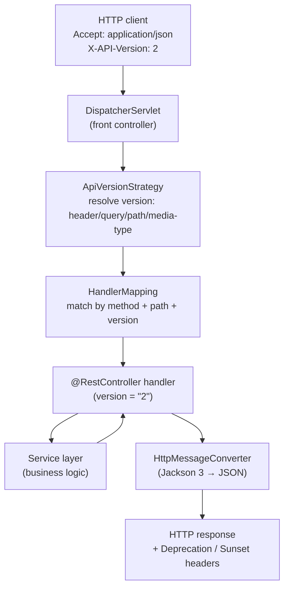

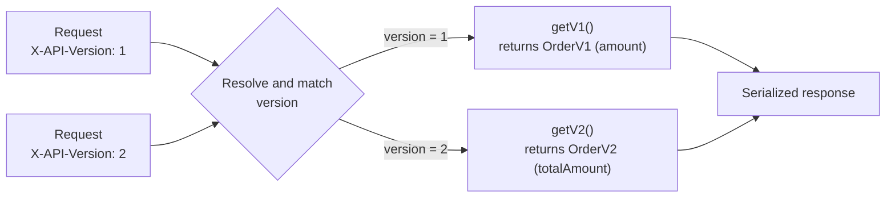

Versioning is layered *on top of* ordinary path matching: the resolver extracts the requested version, then handler mapping selects the controller method whose path **and** declared `version` both match. Because each version is its own method returning its own DTO, the two contracts never share serialization logic and cannot accidentally drift into each other.

### 5.5 Real example

**Scenario.** An orders API must introduce a breaking change — renaming the JSON field `amount` to `totalAmount` — while keeping every existing `v1` consumer working untouched.

**Problem.** A naive rename of the field on a single DTO breaks all current clients at once, forcing a coordinated big-bang migration across every consumer.

**Solution.** Configure header-based versioning once, then expose two handlers for the same path: `version = "1"` returning the original DTO and `version = "2"` returning the renamed one. Existing clients keep sending (or defaulting to) `v1`; new clients opt into `v2`.

**Implementation.**

```java
package com.example.orders.web;

import org.springframework.context.annotation.Configuration;
import org.springframework.web.servlet.config.annotation.ApiVersionConfigurer;
import org.springframework.web.servlet.config.annotation.WebMvcConfigurer;

// Configure a single version-resolution strategy for the whole API.
@Configuration
public class WebConfig implements WebMvcConfigurer {

    @Override
    public void configureApiVersioning(ApiVersionConfigurer configurer) {
        configurer
            .useRequestHeader("X-API-Version")   // resolve the version from a header
            .setDefaultVersion("1");             // clients that omit it get v1
    }
}
```

```java
package com.example.orders.web;

// Distinct DTOs per version — no shared serialization between contracts.
public record OrderV1(String id, String item, long amount) {}

public record OrderV2(String id, String item, long totalAmount) {}
```

```java
package com.example.orders.web;

import com.example.orders.OrderService;
import org.springframework.web.bind.annotation.GetMapping;
import org.springframework.web.bind.annotation.PathVariable;
import org.springframework.web.bind.annotation.RequestMapping;
import org.springframework.web.bind.annotation.RestController;

@RestController
@RequestMapping("/orders")
public class OrderController {

    private final OrderService service;

    public OrderController(OrderService service) {   // constructor injection
        this.service = service;
    }

    // v1 — original contract, field "amount"
    @GetMapping(path = "/{id}", version = "1")
    public OrderV1 getV1(@PathVariable String id) {
        var order = service.find(id);
        return new OrderV1(order.id(), order.item(), order.amount());
    }

    // v2 — breaking change, field renamed to "totalAmount"
    @GetMapping(path = "/{id}", version = "2")
    public OrderV2 getV2(@PathVariable String id) {
        var order = service.find(id);
        return new OrderV2(order.id(), order.item(), order.amount());
    }
}
```

```java
package com.example.orders.web;

import com.example.orders.Order;
import com.example.orders.OrderService;
import org.junit.jupiter.api.Test;
import org.springframework.beans.factory.annotation.Autowired;
import org.springframework.boot.test.autoconfigure.web.servlet.WebMvcTest;
import org.springframework.test.context.bean.override.mockito.MockitoBean;
import org.springframework.test.web.servlet.MockMvc;

import static org.mockito.Mockito.when;
import static org.springframework.test.web.servlet.request.MockMvcRequestBuilders.get;
import static org.springframework.test.web.servlet.result.MockMvcResultMatchers.*;

@WebMvcTest(OrderController.class)
class OrderControllerVersionTest {

    @Autowired
    MockMvc mockMvc;

    @MockitoBean
    OrderService service;

    @Test
    void servesV1ContractByHeader() throws Exception {
        when(service.find("42")).thenReturn(new Order("42", "book", 1500));

        mockMvc.perform(get("/orders/42").header("X-API-Version", "1"))
            .andExpect(status().isOk())
            .andExpect(jsonPath("$.amount").value(1500))
            .andExpect(jsonPath("$.totalAmount").doesNotExist());
    }

    @Test
    void servesV2ContractByHeader() throws Exception {
        when(service.find("42")).thenReturn(new Order("42", "book", 1500));

        mockMvc.perform(get("/orders/42").header("X-API-Version", "2"))
            .andExpect(status().isOk())
            .andExpect(jsonPath("$.totalAmount").value(1500))
            .andExpect(jsonPath("$.amount").doesNotExist());
    }
}
```

**Result.** Existing `v1` consumers continue to receive `amount` with no change at all; new consumers opt into `v2` by sending `X-API-Version: 2` and receive `totalAmount`. The two contracts are independent DTOs, so neither can corrupt the other, and both are proven by `MockMvc` tests.

**Future improvements.** Emit `Deprecation` and `Sunset` headers on the `v1` handler to signal its retirement timeline, generate a separate OpenAPI document per version, and call any external services through declarative HTTP interface clients to keep outbound integration code typed and boilerplate-free.

### 5.6 Exercises

1. List the four built-in API-version resolution strategies Spring Boot 4 supports.
2. Explain how content negotiation chooses between JSON and another representation for the same handler.
3. Why should each API version return its own DTO rather than a shared, evolving one?

### 5.7 Challenges

- **Challenge.** Take an existing endpoint, add a `v2` with a breaking change, serve both versions through one strategy, emit a `Deprecation` header on `v1`, and prove both contracts with `MockMvc` (including that the renamed field is absent on the other version).

### 5.8 Checklist

- [ ] I chose a single version-resolution strategy and applied it consistently across the API.
- [ ] Each version has its own DTO; versions do not share a mutable contract.
- [ ] Controllers stay thin and delegate to a service layer.
- [ ] Versioned endpoints are covered by `MockMvc` tests asserting both the present and the absent fields.
- [ ] A default version is configured for clients that omit the version.

### 5.9 Best practices

- Pick one versioning strategy per API — a header is common for internal services, a path segment for public ones — and apply it everywhere.
- Keep controllers thin: resolve, validate, delegate to a service, return a DTO.
- Use distinct DTOs per version so serialization contracts stay isolated.
- Signal deprecation with `Deprecation`/`Sunset` headers well before removing a version.
- Let Jackson 3 handle JSON; customize through a builder customizer rather than replacing the mapper wholesale (Chapter 2).

### 5.10 Anti-patterns

- Mixing multiple version-resolution strategies within one API.
- Shipping a breaking change without a version bump, silently breaking consumers.
- Sharing one DTO across versions and mutating it, causing cross-version drift.
- Fat controllers that embed business logic instead of delegating to services.

### 5.11 Troubleshooting

| Symptom | Likely cause | Action |
|---------|--------------|--------|
| Version never resolved | `ApiVersionConfigurer` not configured | Configure a strategy in a `WebMvcConfigurer` |
| 404 for a versioned route | Request omits/mismatches the version | Send the configured header/param/path, or set a default version |
| Wrong representation returned | Content-negotiation mismatch | Check the `Accept` header and `produces` attribute |
| `406 Not Acceptable` | No converter for requested media type | Add the converter or correct the `Accept` header |
| Both versions return the same fields | One shared DTO across handlers | Use a distinct DTO per version |

### 5.12 Official references

- Spring MVC (web on Servlet stack): https://docs.spring.io/spring-framework/reference/web/webmvc.html
- API versioning (MVC): https://docs.spring.io/spring-framework/reference/web/webmvc-versioning.html
- Content negotiation: https://docs.spring.io/spring-framework/reference/web/webmvc/mvc-servlet/content-negotiation.html
- API versioning (blog): https://spring.io/blog/2025/09/16/api-versioning-in-spring/
- Spring Boot — developing web applications: https://docs.spring.io/spring-boot/reference/web/servlet.html

---

## Chapter 6 — Bean Validation and error handling

### 6.1 Introduction

A REST API must reject bad input clearly and report failures in a predictable, machine-readable shape. Spring Boot 4 gives you two complementary tools. **Jakarta Bean Validation** (`@Valid` with constraints like `@NotBlank`, `@Email`, `@Min`) declaratively checks request bodies and parameters before your handler runs, turning validation into annotations rather than imperative `if` checks. **`ProblemDetail`** — Spring's implementation of the **RFC 9457** "Problem Details for HTTP APIs" standard (the successor to RFC 7807) — gives every error a consistent JSON body with `type`, `title`, `status`, `detail`, and `instance` fields. Combined with a centralized `@ControllerAdvice` exception handler, you get one place that translates validation failures and domain exceptions into well-formed problem responses across the whole API.

### 6.2 Business context

Inconsistent error handling is a silent tax on every API consumer. When one endpoint returns a stack trace, another a plain string, and a third a bespoke JSON shape, every client must write custom parsing for each — and a leaked stack trace is both a poor experience and a security disclosure. Standardizing on `ProblemDetail` means consumers parse **one** error format everywhere, support teams diagnose issues from a stable `instance`/`detail` pair, and security reviewers can confirm internal details never escape. Declarative validation reinforces this: invalid input is rejected at the edge with a precise, field-level explanation instead of propagating into the domain and corrupting state. The result is an API that is cheaper to integrate against, easier to operate, and safer by default.

### 6.3 Theoretical concepts: constraints, ProblemDetail, and advice

- **Constraints.** Jakarta Bean Validation annotations (`@NotNull`, `@NotBlank`, `@Size`, `@Email`, `@Min`, `@Max`, `@Pattern`) declare the rules; `@Valid` on a `@RequestBody` parameter triggers validation, and a failure raises `MethodArgumentNotValidException` before the handler body executes.
- **`ProblemDetail`.** The RFC 9457 model carrying `type` (a URI identifying the error kind), `title`, `status`, `detail`, `instance`, plus arbitrary extension properties. Spring can produce it automatically and lets you enrich it.
- **`@ControllerAdvice` / `@ExceptionHandler`.** A cross-cutting component whose `@ExceptionHandler` methods catch exceptions thrown by any controller and translate them into `ProblemDetail` responses. Extending `ResponseEntityExceptionHandler` gives you Spring's built-in handling of framework exceptions (including validation) which you can then customize.

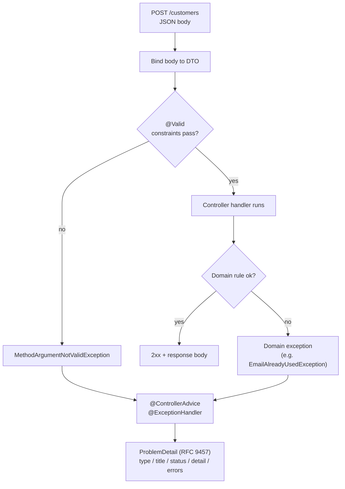

### 6.4 Architecture: centralized error translation

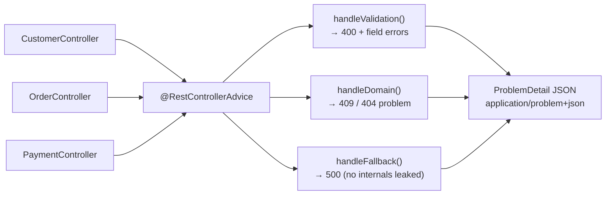

Every controller funnels its exceptions into a single advice component, so error formatting lives in exactly one place. The advice maps each exception category to an HTTP status and a `ProblemDetail` body served as `application/problem+json`. A catch-all handler guarantees that even unexpected exceptions become a clean `500` problem response with no stack trace or internal detail leaking to the client.

### 6.5 Real example

**Scenario.** A customer-registration endpoint must reject malformed input (blank name, invalid email) with precise field-level messages, and reject a duplicate email as a business-rule conflict — all in a single consistent error format.

**Problem.** The current handler does manual `if` checks scattered through the method, returns ad-hoc error strings with inconsistent status codes, and occasionally lets an unexpected exception surface as a stack trace.

**Solution.** Declare constraints on the request record, trigger them with `@Valid`, throw a domain exception for the duplicate-email rule, and centralize all translation in a `@RestControllerAdvice` that emits `ProblemDetail`.

**Implementation.**

```java
package com.example.customers.web;

import jakarta.validation.constraints.Email;
import jakarta.validation.constraints.NotBlank;
import jakarta.validation.constraints.Size;

// Constraints declared once, on the request DTO.
public record CreateCustomerRequest(
    @NotBlank @Size(max = 100) String name,
    @NotBlank @Email String email
) {}
```

```java
package com.example.customers.web;

import com.example.customers.CustomerService;
import com.example.customers.EmailAlreadyUsedException;
import jakarta.validation.Valid;
import org.springframework.http.HttpStatus;
import org.springframework.web.bind.annotation.*;

@RestController
@RequestMapping("/customers")
public class CustomerController {

    private final CustomerService service;

    public CustomerController(CustomerService service) {
        this.service = service;
    }

    // @Valid triggers Bean Validation before the body runs.
    @PostMapping
    @ResponseStatus(HttpStatus.CREATED)
    public CustomerView create(@Valid @RequestBody CreateCustomerRequest request) {
        var id = service.register(request.name(), request.email());  // may throw EmailAlreadyUsedException
        return new CustomerView(id, request.name(), request.email());
    }

    public record CustomerView(String id, String name, String email) {}
}
```

```java
package com.example.customers.web;

import com.example.customers.EmailAlreadyUsedException;
import org.springframework.http.HttpStatus;
import org.springframework.http.ProblemDetail;
import org.springframework.web.bind.MethodArgumentNotValidException;
import org.springframework.web.bind.annotation.ExceptionHandler;
import org.springframework.web.bind.annotation.RestControllerAdvice;

import java.net.URI;
import java.util.LinkedHashMap;
import java.util.Map;

// One place that translates every exception into RFC 9457 ProblemDetail.
@RestControllerAdvice
public class ApiExceptionHandler {

    // 400 — Bean Validation failures, with per-field messages.
    @ExceptionHandler(MethodArgumentNotValidException.class)
    public ProblemDetail handleValidation(MethodArgumentNotValidException ex) {
        var problem = ProblemDetail.forStatusAndDetail(
            HttpStatus.BAD_REQUEST, "One or more fields are invalid.");
        problem.setTitle("Validation failed");
        problem.setType(URI.create("https://errors.example.com/validation"));

        Map<String, String> errors = new LinkedHashMap<>();
        ex.getBindingResult().getFieldErrors()
            .forEach(fe -> errors.put(fe.getField(), fe.getDefaultMessage()));
        problem.setProperty("errors", errors);   // RFC 9457 extension member
        return problem;
    }

    // 409 — domain conflict (duplicate email).
    @ExceptionHandler(EmailAlreadyUsedException.class)
    public ProblemDetail handleDuplicateEmail(EmailAlreadyUsedException ex) {
        var problem = ProblemDetail.forStatusAndDetail(
            HttpStatus.CONFLICT, ex.getMessage());
        problem.setTitle("Email already registered");
        problem.setType(URI.create("https://errors.example.com/email-in-use"));
        return problem;
    }

    // 500 — catch-all: never leak internals.
    @ExceptionHandler(Exception.class)
    public ProblemDetail handleUnexpected(Exception ex) {
        var problem = ProblemDetail.forStatusAndDetail(
            HttpStatus.INTERNAL_SERVER_ERROR, "An unexpected error occurred.");
        problem.setTitle("Internal error");
        return problem;
    }
}
```

```java
package com.example.customers.web;

import com.example.customers.CustomerService;
import com.example.customers.EmailAlreadyUsedException;
import org.junit.jupiter.api.Test;
import org.springframework.beans.factory.annotation.Autowired;
import org.springframework.boot.test.autoconfigure.web.servlet.WebMvcTest;
import org.springframework.http.MediaType;
import org.springframework.test.context.bean.override.mockito.MockitoBean;
import org.springframework.test.web.servlet.MockMvc;

import static org.mockito.Mockito.*;
import static org.springframework.test.web.servlet.request.MockMvcRequestBuilders.post;
import static org.springframework.test.web.servlet.result.MockMvcResultMatchers.*;

@WebMvcTest(CustomerController.class)
class CustomerControllerTest {

    @Autowired
    MockMvc mockMvc;

    @MockitoBean
    CustomerService service;

    @Test
    void rejectsInvalidBodyWithProblemDetail() throws Exception {
        var body = "{\"name\":\"\",\"email\":\"not-an-email\"}";

        mockMvc.perform(post("/customers")
                .contentType(MediaType.APPLICATION_JSON).content(body))
            .andExpect(status().isBadRequest())
            .andExpect(content().contentType(MediaType.APPLICATION_PROBLEM_JSON))
            .andExpect(jsonPath("$.title").value("Validation failed"))
            .andExpect(jsonPath("$.errors.email").exists())
            .andExpect(jsonPath("$.errors.name").exists());
    }

    @Test
    void mapsDomainConflictTo409() throws Exception {
        when(service.register(anyString(), anyString()))
            .thenThrow(new EmailAlreadyUsedException("ada@example.com is already registered"));
        var body = "{\"name\":\"Ada\",\"email\":\"ada@example.com\"}";

        mockMvc.perform(post("/customers")
                .contentType(MediaType.APPLICATION_JSON).content(body))
            .andExpect(status().isConflict())
            .andExpect(content().contentType(MediaType.APPLICATION_PROBLEM_JSON))
            .andExpect(jsonPath("$.title").value("Email already registered"));
    }
}
```

**Result.** Malformed input returns `400` with `application/problem+json` and a per-field `errors` map; a duplicate email returns a `409` problem; anything unexpected becomes a `500` problem with no internals exposed. Every consumer parses one stable error shape across the whole API, and the controller stays free of validation and error-formatting noise.

**Future improvements.** Add an `instance` URI and a correlation/trace id as a `ProblemDetail` extension for support diagnostics, externalize constraint messages for internationalization, and introduce custom class-level constraints for cross-field rules (for example, "end date after start date").

### 6.6 Exercises

1. Which exception does a failed `@Valid` on a `@RequestBody` raise, and at what point in the request lifecycle?
2. Name the five standard RFC 9457 `ProblemDetail` members and what each conveys.
3. Why is a catch-all `@ExceptionHandler(Exception.class)` important for security?

### 6.7 Challenges

- **Challenge.** Build an endpoint that validates a request record, throws a domain exception for one business rule, and centralizes all responses through a `@RestControllerAdvice` emitting `ProblemDetail`. Then write `MockMvc` tests asserting the `400` field-error map, the domain `409`, and that the content type is `application/problem+json`.

### 6.8 Checklist

- [ ] Request DTOs carry Bean Validation constraints triggered by `@Valid`.
- [ ] All errors are returned as RFC 9457 `ProblemDetail` (`application/problem+json`).
- [ ] A single `@RestControllerAdvice` centralizes exception translation.
- [ ] A catch-all handler guarantees no stack trace or internal detail leaks.
- [ ] Validation and conflict responses are covered by `MockMvc` tests.

### 6.9 Best practices

- Validate at the edge with declarative constraints; keep the domain free of redundant input checks.
- Standardize on `ProblemDetail` for every error so consumers parse one format.
- Centralize translation in one advice component; map each exception category to a precise status.
- Always include a catch-all handler that hides internals behind a generic `500` problem.
- Use stable, documented `type` URIs so clients can branch on the error kind, not on the message text.

### 6.10 Anti-patterns

- Returning ad-hoc error strings or bespoke JSON shapes that differ per endpoint.
- Letting stack traces or exception messages with internal detail reach the client.
- Scattering manual `if`-based validation through handlers instead of using constraints.
- Catching exceptions inside each controller, duplicating error-formatting logic everywhere.

### 6.11 Troubleshooting

| Symptom | Likely cause | Action |
|---------|--------------|--------|
| Validation not triggered | `@Valid` missing on the parameter | Add `@Valid` to the `@RequestBody`/parameter |
| Error body is not `problem+json` | Returning a plain object/string | Return `ProblemDetail` (or `ResponseEntity<ProblemDetail>`) |
| `500` instead of a `400` for bad input | Advice doesn't handle `MethodArgumentNotValidException` | Add an `@ExceptionHandler` for it |
| Domain exception returns `500` | No specific handler mapped | Add an `@ExceptionHandler` mapping it to the right status |
| Stack trace leaks to client | No catch-all handler | Add `@ExceptionHandler(Exception.class)` returning a generic problem |
| Field messages are generic | Default constraint messages | Set custom `message` on constraints or externalize them |

### 6.12 Official references

- Validation: https://docs.spring.io/spring-framework/reference/core/validation/beanvalidation.html
- Error handling and `ProblemDetail`: https://docs.spring.io/spring-framework/reference/web/webmvc/mvc-ann-rest-exceptions.html
- `@ControllerAdvice` / `@ExceptionHandler`: https://docs.spring.io/spring-framework/reference/web/webmvc/mvc-controller/ann-advice.html
- Spring Boot — error handling: https://docs.spring.io/spring-boot/reference/web/servlet.html#web.servlet.spring-mvc.error-handling
- RFC 9457 — Problem Details for HTTP APIs: https://www.rfc-editor.org/rfc/rfc9457

---

> **End of Part II.** You can now take a Spring Boot 4 service from "runs" to "production-ready at the edge": **externalized configuration** with profiles and validated `@ConfigurationProperties` so one immutable artifact behaves correctly everywhere; **Spring MVC REST APIs** with content negotiation and Spring Boot 4's **first-class API versioning** for safe, side-by-side contract evolution; and **Bean Validation** with centralized **RFC 9457 `ProblemDetail`** error handling so every failure is rejected cleanly and reported in one consistent, secure shape. **Part III — Data & Transactions** (Chapters 7–9) goes a layer deeper, persisting and protecting that data: **Spring Data JPA** repositories and entity mapping, **`@Transactional`** boundaries and propagation, and operational concerns like schema **migrations** (Flyway/Liquibase) and connection **pooling**.


---

# Part III – Data & Transactions

Part III is where a Spring Boot application stops being a stateless request handler and becomes a system of record. Almost every business application persists data, and the moment data is shared and mutated, three concerns dominate: **how you map objects to rows** (Spring Data JPA), **how you guarantee correctness across multiple writes** (declarative transactions), and **how you evolve the schema and serve connections under load** (migrations and pooling). Spring Boot 4 — on **Spring Framework 7**, **Java 17+** (first-class Java 25), and **Jakarta EE 11** (JPA 3.2, `jakarta.persistence.*`) — auto-configures most of this for you: a `DataSource` backed by HikariCP, an `EntityManagerFactory`, a `PlatformTransactionManager`, and Flyway/Liquibase if either is on the classpath. This part teaches you the model underneath the magic so you can use it deliberately, not superstitiously.

---

## Chapter 7 — Spring Data JPA fundamentals (entities, repositories, queries)

### 7.1 Introduction

Spring Data JPA sits on top of JPA 3.2 (Jakarta EE 11) and Hibernate as the default provider. It removes the most repetitive part of data access: writing DAOs. You declare an **entity** (a class mapped to a table), then declare a **repository interface**, and Spring Data generates the implementation at runtime — `save`, `findById`, `delete`, paging, sorting, and an entire family of **derived query methods** parsed straight from method names. For anything the method-name DSL cannot express, you drop to `@Query` (JPQL or native SQL), and for fine-grained control you can still reach the lower-level `JdbcClient`. This chapter covers entity mapping, repository abstractions, derived and `@Query` methods, projections with Java records, and paging — the core you will use in every persistent Spring Boot 4 service.

### 7.2 Business context

For a business, the data layer is where correctness and velocity collide. Hand-written DAOs are a tax: every entity needs near-identical CRUD code, every change touches several files, and subtle bugs (a missing `WHERE`, an unbounded `findAll`) leak into production. Spring Data JPA collapses that boilerplate into declarations, so teams ship features instead of plumbing, and reviewers read intent (`findByStatusAndCreatedAtAfter`) instead of SQL string concatenation. The trade-off is that JPA hides the database behind an object model — and a team that does not understand lazy loading, the N+1 problem, or transaction boundaries will trade boilerplate bugs for performance bugs. The business value is real velocity, but only when the abstraction is understood rather than trusted blindly.

### 7.3 Theoretical concepts

- **Entity.** A class annotated `@Entity` mapped to a table, with an `@Id` (often `@GeneratedValue`). Fields map to columns; associations map with `@ManyToOne`, `@OneToMany`, `@ManyToMany`.
- **Persistence context.** The first-level cache and unit of work managed by the `EntityManager`. Within a transaction, managed entities are tracked and changes are flushed automatically (**dirty checking**) — no explicit `update` call needed.
- **Repository.** An interface extending `JpaRepository<T, ID>` (or `CrudRepository`, `PagingAndSortingRepository`). Spring Data implements it at runtime.
- **Derived queries.** Methods whose names follow a DSL (`findBy…`, `existsBy…`, `countBy…`, `deleteBy…`) parsed into queries — for example `findByStatusOrderByCreatedAtDesc`.
- **`@Query`.** Explicit JPQL or native SQL when the DSL is insufficient; supports named/positional parameters and `@Modifying` for writes.
- **Projections.** Returning a subset of fields. Spring Data supports **interface** and **class/record** (DTO) projections — a Java `record` constructor maps cleanly to selected columns.
- **Paging & sorting.** `Pageable`/`Sort` parameters return a `Page<T>` (content + total count) or `Slice<T>` (content + has-next, no count).
- **`fetch` strategy.** `@ManyToOne` defaults to EAGER, `@OneToMany` to LAZY; the **N+1 problem** arises when iterating a collection triggers one query per element. `JOIN FETCH` or an entity graph fixes it.

### 7.4 Architecture: from repository call to SQL

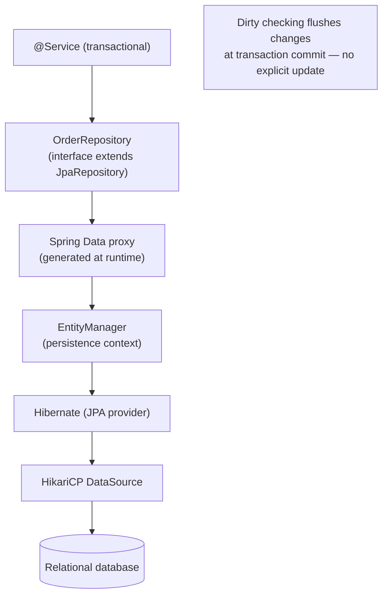

The repository interface has no implementation you write. At startup Spring Data scans for interfaces extending its base types, builds a proxy for each, and parses every method name or `@Query`. At call time the proxy translates the method into JPQL/SQL, runs it through the `EntityManager`, and maps rows back to entities or projections.

### 7.5 Real example

**Scenario.** An e-commerce service needs to list a customer's recent orders by status, paginated for an admin screen, and to read a lightweight summary (id, total, status) without loading the full order graph.

**Problem.** A naive `findAll()` loads every order and every line item, producing N+1 queries and transferring data the screen never shows. The team also wants type-safe results, not `Object[]` rows.

**Solution.** Define a focused entity, a repository with a derived paged query and a record projection via `@Query`, and mark read paths `readOnly`. Use a Java `record` as the projection DTO so the constructor maps directly to selected columns.

**Implementation.**

```java
package com.example.orders;

import jakarta.persistence.*;
import java.math.BigDecimal;
import java.time.Instant;

@Entity
@Table(name = "orders")
public class Order {

    @Id
    @GeneratedValue(strategy = GenerationType.IDENTITY)
    private Long id;

    @Column(nullable = false)
    private String customerId;

    @Enumerated(EnumType.STRING)
    @Column(nullable = false)
    private OrderStatus status;

    @Column(nullable = false)
    private BigDecimal total;

    @Column(nullable = false)
    private Instant createdAt;

    protected Order() { } // JPA requires a no-arg constructor

    // getters omitted for brevity
    public Long getId() { return id; }
    public OrderStatus getStatus() { return status; }
}

enum OrderStatus { PENDING, PAID, SHIPPED, CANCELLED }
```

```java
package com.example.orders;

import org.springframework.data.domain.Page;
import org.springframework.data.domain.Pageable;
import org.springframework.data.jpa.repository.JpaRepository;
import org.springframework.data.jpa.repository.Query;
import org.springframework.data.repository.query.Param;

// A record DTO projection: Spring Data maps selected columns to the constructor.
public record OrderSummary(Long id, java.math.BigDecimal total, OrderStatus status) { }

public interface OrderRepository extends JpaRepository<Order, Long> {

    // Derived query: parsed from the method name, paginated.
    Page<Order> findByCustomerIdAndStatusOrderByCreatedAtDesc(
            String customerId, OrderStatus status, Pageable pageable);

    // Explicit JPQL constructor expression -> record projection (no full entity load).
    @Query("""
           select new com.example.orders.OrderSummary(o.id, o.total, o.status)
           from Order o
           where o.customerId = :customerId
           order by o.createdAt desc
           """)
    Page<OrderSummary> findSummaries(@Param("customerId") String customerId, Pageable pageable);
}
```

```java
package com.example.orders;

import org.springframework.data.domain.Page;
import org.springframework.data.domain.PageRequest;
import org.springframework.stereotype.Service;
import org.springframework.transaction.annotation.Transactional;

@Service
public class OrderQueryService {

    private final OrderRepository repository;

    public OrderQueryService(OrderRepository repository) {
        this.repository = repository;
    }

    // Read path: readOnly lets the provider skip dirty-checking and flush.
    @Transactional(readOnly = true)
    public Page<OrderSummary> recentSummaries(String customerId, int page, int size) {
        return repository.findSummaries(customerId, PageRequest.of(page, size));
    }
}
```

**Result.** The admin screen receives a `Page<OrderSummary>` containing exactly three columns plus total count for pagination, in a single query. There is no N+1 explosion because no entity collection is traversed, and the `readOnly` hint avoids unnecessary dirty-checking overhead.

**Future improvements.** Replace the offset `Pageable` with **keyset (seek) pagination** for stable, index-friendly deep paging; add a `@EntityGraph` for the cases that do need the full order-with-items graph; introduce **Specifications** or Query by Example for dynamic admin filters.

### 7.6 Exercises

1. Write a derived query method that returns the count of `PAID` orders for a customer created after a given `Instant`.
2. Convert an interface projection to a Java `record` (DTO) projection and explain when each is preferable.
3. Explain the difference between `Page<T>` and `Slice<T>` and when the extra count query of `Page` is worth it.

### 7.7 Challenges

- **Challenge.** Reproduce the N+1 problem with a `@OneToMany` order-items association by iterating items in a loop, confirm it in the SQL log (`spring.jpa.show-sql=true` / Hibernate statistics), then fix it two ways — once with `JOIN FETCH` in a `@Query`, once with a `@EntityGraph` — and compare the generated SQL.

### 7.8 Checklist

- [ ] My entities have a no-arg constructor and a deliberate `@Id`/`@GeneratedValue` strategy.
- [ ] I use derived queries for simple cases and `@Query` for the rest.
- [ ] I return record projections instead of full entities when the caller needs a subset.
- [ ] I paginate list endpoints with `Pageable` and avoid unbounded `findAll()`.
- [ ] I mark read paths `@Transactional(readOnly = true)`.
- [ ] I know the default fetch types and how to avoid N+1.

### 7.9 Best practices

- Keep entities focused on persistence; do not leak them as API response bodies — map to DTO records at the boundary.
- Prefer derived query methods for readability; switch to `@Query` once a name would become unreadable.
- Default associations to LAZY and fetch eagerly only where a query needs it (`JOIN FETCH` / `@EntityGraph`).
- Always paginate collections that can grow; never expose `findAll()` to the outside world.
- Let dirty checking persist changes inside a transaction instead of calling `save()` on an already-managed entity.

### 7.10 Anti-patterns

- Exposing JPA entities directly in controllers — couples your API to the schema and risks lazy-loading exceptions during serialization.
- `EAGER` everywhere "to be safe," loading huge object graphs on every read.
- Iterating a lazy collection outside the transaction and getting `LazyInitializationException`.
- Calling `findAll()` then filtering in Java instead of pushing the predicate into the query.

### 7.11 Troubleshooting

| Symptom | Likely cause | Action |
|---------|--------------|--------|
| `LazyInitializationException` | Lazy association accessed after the session closed | Fetch within the transaction (`JOIN FETCH`/`@EntityGraph`) or map to a DTO |
| Many small SELECTs in the log (N+1) | Iterating a lazy collection | Use `JOIN FETCH` or an entity graph |
| `Page` query runs a slow `count(*)` | Large table with offset paging | Use `Slice`, keyset pagination, or a tuned count query |
| Derived method throws at startup | Property name doesn't match the entity | Fix the method name or switch to `@Query` |
| Entity changes not persisted | Modified a detached entity outside a transaction | Mutate inside a `@Transactional` method (dirty checking) |

### 7.12 Official references

- Spring Data JPA reference: https://docs.spring.io/spring-data/jpa/reference/jpa.html
- Defining query methods: https://docs.spring.io/spring-data/jpa/reference/repositories/query-methods-details.html
- Projections: https://docs.spring.io/spring-data/jpa/reference/repositories/projections.html
- Spring Boot — working with SQL databases: https://docs.spring.io/spring-boot/reference/data/sql.html
- Jakarta Persistence (JPA) specification: https://jakarta.ee/specifications/persistence/3.2/

---

## Chapter 8 — Transaction management with `@Transactional`

### 8.1 Introduction

A transaction is a unit of work that either fully happens or fully does not — the **A** in ACID. Spring's killer feature here is **declarative** transaction management: you annotate a method `@Transactional`, and a proxy begins a transaction before the method runs and commits (or rolls back) after it returns (or throws). You write business logic; Spring writes the `begin`/`commit`/`rollback`. This chapter covers how the proxy works, the attributes that control it (`propagation`, `isolation`, `readOnly`, `rollbackFor`, `timeout`), the rollback rules that surprise newcomers, and the proxy limitations (self-invocation) that cause the most "why didn't it roll back?" incidents.

### 8.2 Business context

Transaction correctness is not a nicety — it is the difference between a ledger that balances and one that double-charges. Consider transferring money, decrementing inventory while creating an order, or awarding loyalty points on payment: each is multiple writes that must succeed or fail together. Declarative transactions give every team the same correctness guarantee without hand-written, error-prone commit/rollback code, and they make the boundary visible in review (the `@Transactional` annotation on the service method). The cost of getting this wrong is silent data corruption discovered weeks later in a reconciliation report; the cost of getting it right is one annotation and an understanding of where the boundary belongs.

### 8.3 Theoretical concepts

- **Declarative demarcation.** `@Transactional` on a (public) bean method; an AOP proxy wraps it with begin/commit/rollback.
- **Propagation.** How a method joins or starts a transaction. `REQUIRED` (default) joins an existing one or starts a new one; `REQUIRES_NEW` suspends the caller's transaction and runs in its own; `NESTED`, `SUPPORTS`, `MANDATORY`, `NEVER` cover the rest.
- **Isolation.** How concurrent transactions see each other's data: `READ_COMMITTED`, `REPEATABLE_READ`, `SERIALIZABLE`, etc. `DEFAULT` uses the database's setting.
- **Rollback rules.** By default Spring rolls back on **unchecked** exceptions (`RuntimeException`, `Error`) and **commits** on checked exceptions. Use `rollbackFor`/`noRollbackFor` to change this.
- **`readOnly`.** A hint that lets the provider skip dirty-checking/flush and the driver optimize — use it on query paths.
- **`timeout`.** Aborts a transaction that runs longer than N seconds.
- **Self-invocation limitation.** Because the proxy intercepts external calls, a `this.method()` call to another `@Transactional` method in the same bean **bypasses** the proxy — the annotation is ignored.

### 8.4 Architecture: the transactional proxy

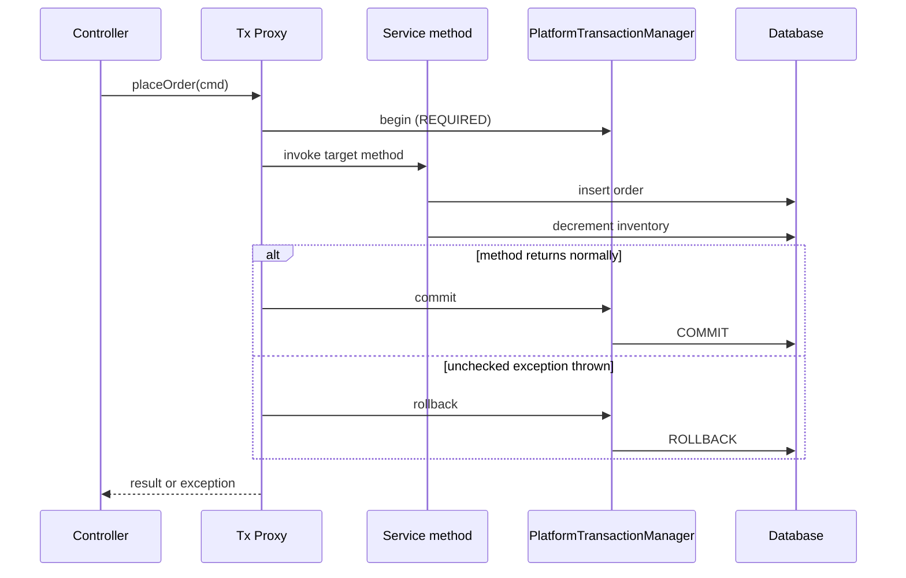

The proxy is the whole story: it is why `@Transactional` must be on a bean reached **through** the container, why self-invocation silently does nothing, and why the boundary lives at the service layer rather than the repository.

### 8.5 Real example

**Scenario.** Placing an order must persist the order and decrement stock atomically. If stock is insufficient, nothing should be written. A separate audit record must be written **even when the order fails**.

**Problem.** A single transaction cannot both roll back the failed order and keep the audit row — they have opposite fates. And a checked exception thrown by stock validation would, by default, **commit** rather than roll back.

**Solution.** Wrap the order + inventory writes in one `REQUIRED` transaction with `rollbackFor` set for the checked exception. Write the audit row in a `REQUIRES_NEW` transaction so it commits independently of the outer rollback. Keep the boundary at the service layer and call the audit method through an injected bean (not `this`) so the proxy actually applies.

**Implementation.**

```java
package com.example.orders;

import org.springframework.stereotype.Service;
import org.springframework.transaction.annotation.Propagation;
import org.springframework.transaction.annotation.Transactional;

public class InsufficientStockException extends Exception {
    public InsufficientStockException(String msg) { super(msg); }
}

@Service
public class OrderPlacementService {

    private final OrderRepository orders;
    private final InventoryRepository inventory;
    private final AuditService audit; // separate bean -> calls go through the proxy

    public OrderPlacementService(OrderRepository orders,
                                 InventoryRepository inventory,
                                 AuditService audit) {
        this.orders = orders;
        this.inventory = inventory;
        this.audit = audit;
    }

    // Roll back even on the checked exception; default would COMMIT.
    @Transactional(rollbackFor = InsufficientStockException.class)
    public Long placeOrder(NewOrder command) throws InsufficientStockException {
        // Audit must survive even if the order rolls back -> independent transaction.
        audit.record("ORDER_ATTEMPT", command.customerId());

        int remaining = inventory.decrement(command.sku(), command.quantity());
        if (remaining < 0) {
            throw new InsufficientStockException("Out of stock: " + command.sku());
        }
        Order saved = orders.save(Order.from(command));
        return saved.getId();
    }
}

@Service
class AuditService {

    private final AuditRepository repository;

    AuditService(AuditRepository repository) { this.repository = repository; }

    // New, independent transaction: commits regardless of the caller's outcome.
    @Transactional(propagation = Propagation.REQUIRES_NEW)
    public void record(String action, String customerId) {
        repository.save(new AuditEntry(action, customerId));
    }
}
```

```java
@SpringBootTest
class OrderPlacementServiceTest {

    @Autowired OrderPlacementService service;
    @Autowired OrderRepository orders;
    @Autowired AuditRepository audits;

    @Test
    void rollsBackOrderButKeepsAudit() {
        long before = orders.count();

        assertThatThrownBy(() ->
            service.placeOrder(new NewOrder("cust-1", "sold-out-sku", 5)))
            .isInstanceOf(InsufficientStockException.class);

        assertThat(orders.count()).isEqualTo(before);      // order rolled back
        assertThat(audits.count()).isGreaterThan(0);       // audit survived (REQUIRES_NEW)
    }
}
```

**Result.** A failed placement leaves no order and no stock change, yet the audit row persists — because the audit runs in its own committed transaction. The checked exception correctly triggers rollback because `rollbackFor` overrides the default commit-on-checked behavior.

**Future improvements.** For cross-service atomicity (e.g., the inventory lives in another microservice), a local transaction is not enough — adopt the **transactional outbox** pattern or a saga with compensating actions. Consider `@Transactional(timeout = …)` to bound long writes, and verify the chosen `isolation` level against the contention you actually observe.

### 8.6 Exercises

1. What is the default rollback behavior for a checked exception, and how do you change it?
2. Explain the difference between `REQUIRED` and `REQUIRES_NEW` with a concrete example.
3. Why does calling a `@Transactional` method via `this.otherMethod()` not start a transaction?

### 8.7 Challenges

- **Challenge.** Demonstrate the self-invocation pitfall: put two `@Transactional` methods in one bean where method A (no propagation surprise) calls `this.b()` expecting `REQUIRES_NEW`, prove with logging that `b()` runs in A's transaction, then fix it by extracting `b()` into a separate injected bean and show the new transaction appearing in the logs.

### 8.8 Checklist

- [ ] I place `@Transactional` at the service layer, on public methods reached through the container.
- [ ] I understand the default rollback-on-unchecked / commit-on-checked rule and use `rollbackFor` when needed.
- [ ] I use `readOnly = true` on query methods.
- [ ] I choose propagation deliberately (`REQUIRED` vs `REQUIRES_NEW`).
- [ ] I never rely on self-invocation to start a transaction.
- [ ] I know a local transaction does not span multiple services or resources atomically.

### 8.9 Best practices

- Keep transactions **short** and scoped to the business operation; do not hold them open across remote calls.
- Put the boundary at the **service** layer, not the controller or repository.
- Mark read paths `readOnly = true` to enable provider/driver optimizations.
- Prefer unchecked exceptions for failures that should roll back; set `rollbackFor` explicitly when using checked exceptions.
- Set a `timeout` on transactions that could run long under load.

### 8.10 Anti-patterns

- `@Transactional` on private or self-invoked methods — the proxy is bypassed and the annotation does nothing.
- Catching and swallowing an exception inside a transactional method, causing a silent commit of partial work.
- Wrapping an entire controller request (including remote HTTP calls) in one long transaction, holding a DB connection idle.
- Assuming a DB write plus an external call (message broker, another service) is atomic — it is not.

### 8.11 Troubleshooting

| Symptom | Cause | Action |
|---------|-------|--------|
| No rollback on a checked exception | Default commits on checked | Add `rollbackFor` or throw a `RuntimeException` |
| `@Transactional` ignored | Self-invocation or non-public method | Call through an injected bean; make the method public |
| Connection pool exhausted under load | Transactions held open too long | Shorten the boundary; move remote calls outside it |
| `TransactionTimedOutException` | Work exceeded the configured timeout | Optimize the query or raise `timeout` deliberately |
| Inner work committed despite outer rollback | Inner method used `REQUIRES_NEW` | Confirm the propagation is intentional |
| Partial commit across two resources | No distributed transaction | Use an outbox/saga; do not assume atomicity |

### 8.12 Official references

- Spring transaction management: https://docs.spring.io/spring-framework/reference/data-access/transaction.html
- Declarative transactions (`@Transactional`): https://docs.spring.io/spring-framework/reference/data-access/transaction/declarative.html
- Transaction propagation: https://docs.spring.io/spring-framework/reference/data-access/transaction/declarative/tx-propagation.html
- Spring Boot — transactions: https://docs.spring.io/spring-boot/reference/data/sql.html#data.sql.jdbc-template

---

## Chapter 9 — Database migrations and connection pooling (Flyway/Liquibase, HikariCP)

### 9.1 Introduction

Two operational concerns turn a working data layer into a production-ready one: **how the schema changes over time** and **how database connections are managed under concurrency**. For schema evolution, Spring Boot 4 auto-configures **Flyway** or **Liquibase** the moment either is on the classpath, running versioned migrations on startup so every environment converges to the same schema. For connections, Spring Boot's default `DataSource` is **HikariCP** — a small, fast pool that is auto-configured from your `spring.datasource.*` properties. This chapter explains migration tooling (and why `ddl-auto` is not a migration strategy), HikariCP sizing and the most important pool properties, and how the two fit together at startup.

### 9.2 Business context

Schema changes are among the riskiest deployments a team performs: an un-versioned `ALTER TABLE` run by hand on production is how outages and data loss happen. Versioned migrations make schema change **auditable, repeatable, and reviewable** — the same SQL that ran in CI runs in production, in order, exactly once, recorded in a history table. Connection pooling is the other half of production readiness: a database accepts a finite number of connections, and an oversized or undersized pool is a common, invisible cause of latency spikes and `connection timeout` errors under load. Getting both right means deployments are boring and the system stays responsive when traffic climbs — the two properties operations teams value most.

### 9.3 Theoretical concepts

- **Versioned migration.** A numbered, immutable script (`V1__init.sql`, `V2__add_status.sql`) applied in order exactly once; the tool records applied versions in a history table (`flyway_schema_history` / `DATABASECHANGELOG`).
- **Flyway.** SQL-first migrations by default; conventionally placed in `db/migration`. Simple and explicit.
- **Liquibase.** Changelog-driven (XML/YAML/JSON/SQL) with database-agnostic change types and built-in rollback support; placed via `db/changelog`.
- **`spring.jpa.hibernate.ddl-auto`.** Hibernate's schema generation (`none`, `validate`, `update`, `create`, `create-drop`). Useful in tests; **not** a production migration tool. With Flyway/Liquibase, set it to `validate` (or `none`).
- **Connection pool.** A bounded set of reusable physical connections. Acquiring a pooled connection is far cheaper than opening a new one per request.
- **HikariCP.** Spring Boot's default pool. Key properties: `maximum-pool-size`, `minimum-idle`, `connection-timeout`, `idle-timeout`, `max-lifetime`.
- **Pool sizing.** Bigger is not better. Throughput is bounded by the database's capacity; a common starting point is a small pool (often `cores * 2` plus effective disk count) tuned by measurement, kept below the database's `max_connections`.

### 9.4 Architecture: migrations and pooling at startup

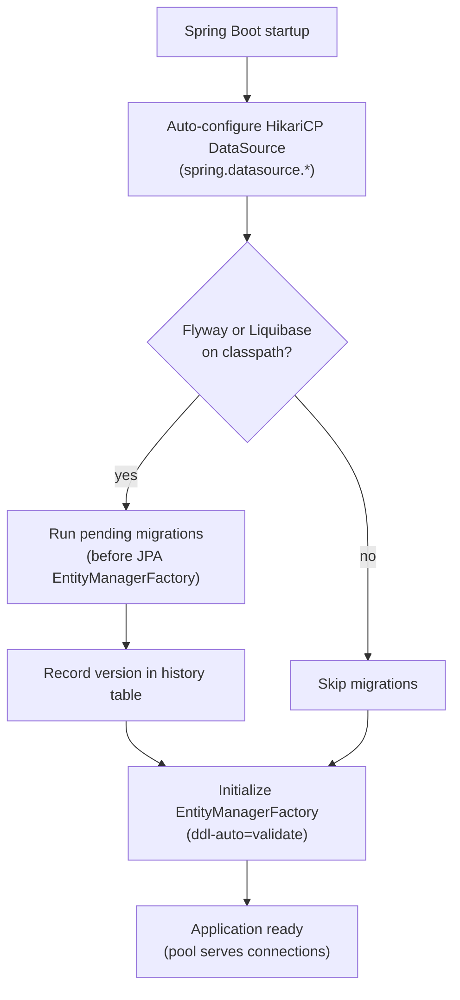

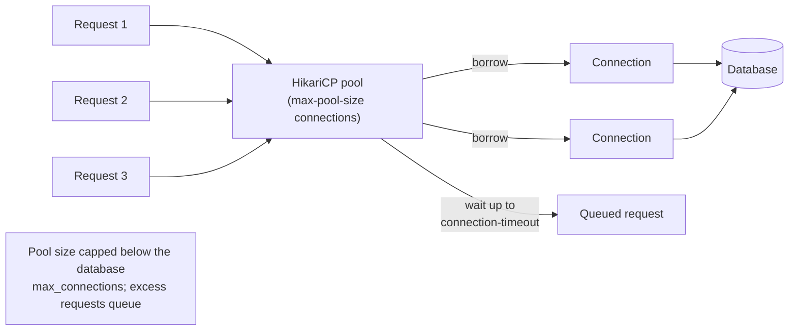

Migrations run **before** the JPA `EntityManagerFactory` initializes, so when Hibernate validates the schema (`ddl-auto=validate`) the migrations have already created it. The pool is configured first because the migration tool itself borrows a connection from it.

### 9.5 Real example

**Scenario.** A service must add a `status` column to an existing `orders` table across dev, staging, and production without manual SQL, and it must stay responsive at ~200 concurrent requests against a Postgres instance with `max_connections = 100`.

**Problem.** The team currently relies on `ddl-auto=update`, which drifts between environments and cannot express data backfills or be reviewed safely. The pool is left at defaults, and under load they see intermittent `connection is not available` timeouts.

**Solution.** Adopt Flyway with versioned scripts, switch Hibernate to `validate` so it only checks (never mutates) the schema, and size HikariCP deliberately below the database limit with an explicit `connection-timeout`.

**Implementation.**

```sql
-- src/main/resources/db/migration/V1__create_orders.sql
CREATE TABLE orders (
    id          BIGINT GENERATED ALWAYS AS IDENTITY PRIMARY KEY,
    customer_id VARCHAR(64)    NOT NULL,
    total       NUMERIC(12,2)  NOT NULL,
    created_at  TIMESTAMPTZ    NOT NULL DEFAULT now()
);
```

```sql
-- src/main/resources/db/migration/V2__add_status.sql
ALTER TABLE orders ADD COLUMN status VARCHAR(16) NOT NULL DEFAULT 'PENDING';
CREATE INDEX idx_orders_customer_status ON orders (customer_id, status);
-- Backfill existing rows explicitly (reviewable, repeatable).
UPDATE orders SET status = 'PAID' WHERE status = 'PENDING' AND total > 0;
```

```yaml
# src/main/resources/application.yml
spring:
  datasource:
    url: jdbc:postgresql://db:5432/shop
    username: shop
    password: ${DB_PASSWORD}
    hikari:
      maximum-pool-size: 20        # kept well below Postgres max_connections (100)
      minimum-idle: 5
      connection-timeout: 3000     # ms to wait for a connection before failing fast
      idle-timeout: 600000         # 10 min
      max-lifetime: 1800000        # 30 min, below DB/proxy idle cutoffs
  jpa:
    hibernate:
      ddl-auto: validate           # Flyway owns the schema; Hibernate only validates
  flyway:
    enabled: true                  # auto-detected on classpath; explicit for clarity
    locations: classpath:db/migration
```

```java
// Optional: a smoke check that the schema Flyway produced matches the entities.
@SpringBootTest
@Testcontainers
class SchemaMigrationTest {

    @Container
    static PostgreSQLContainer<?> postgres =
        new PostgreSQLContainer<>("postgres:16-alpine");

    @DynamicPropertySource
    static void datasource(DynamicPropertyRegistry registry) {
        registry.add("spring.datasource.url", postgres::getJdbcUrl);
        registry.add("spring.datasource.username", postgres::getUsername);
        registry.add("spring.datasource.password", postgres::getPassword);
    }

    @Autowired OrderRepository repository;

    @Test
    void contextStartsWithMigratedSchema() {
        // Flyway ran V1+V2 on startup; ddl-auto=validate confirmed the mapping.
        assertThat(repository.count()).isGreaterThanOrEqualTo(0);
    }
}
```

**Result.** Every environment converges to the identical, version-controlled schema on deploy; the `status` change and its backfill are reviewable SQL recorded in `flyway_schema_history`. With a 20-connection pool and a 3-second `connection-timeout`, the service stays within Postgres's limits and fails fast (rather than hanging) if the pool is momentarily saturated — which surfaces real capacity problems instead of hiding them.

**Future improvements.** Add Flyway's `validate`/`info` to the CI pipeline so drift is caught before deploy; gate destructive migrations behind review and run them as separate, reversible steps (expand/contract). Expose HikariCP metrics through Actuator/Micrometer to size the pool from real `pool.usage` and `pending` data rather than guesswork, and consider a read replica with a second pool for heavy read traffic.

### 9.6 Exercises

1. Why is `ddl-auto=update` unsuitable for production schema management, and what should it be set to when Flyway/Liquibase owns the schema?
2. Name three HikariCP properties and what each controls.
3. Where does Flyway place its history table, and what does it record?

### 9.7 Challenges

- **Challenge.** Stand up Postgres in a Testcontainer with `max_connections` set low (e.g., 10). Drive the service with a concurrency higher than `maximum-pool-size`, observe `connection-timeout` failures, then tune `maximum-pool-size` and `connection-timeout` and measure how p99 latency and error rate change — produce a short before/after table justifying your chosen pool size.

### 9.8 Checklist

- [ ] My schema changes are versioned migrations, not manual SQL or `ddl-auto=update`.
- [ ] `spring.jpa.hibernate.ddl-auto` is `validate` (or `none`) in non-test environments.
- [ ] Migrations are immutable once merged; new changes are new versions.
- [ ] HikariCP `maximum-pool-size` is set below the database's `max_connections`.
- [ ] `connection-timeout` is set so the app fails fast instead of hanging.
- [ ] I monitor pool usage and migration status (Actuator) rather than guessing.

### 9.9 Best practices

- Let Flyway/Liquibase own the schema; reserve `ddl-auto` (`create-drop`) for throwaway test contexts only.
- Treat merged migration scripts as immutable — never edit an applied version; add a new one.
- Make data backfills explicit migration steps so they are reviewed and repeatable.
- Size the pool from measurement; start small and below the DB limit, and prefer a short `connection-timeout` to fail fast.
- Keep `max-lifetime` under any database or proxy idle-connection cutoff to avoid stale connections.
- Run `flyway validate`/`info` (or Liquibase status) in CI to catch drift before deploy.

### 9.10 Anti-patterns

- Using `ddl-auto=update` as a migration strategy — it drifts, cannot express backfills, and is unreviewable.
- Editing an already-applied migration script, breaking the checksum and history on other environments.
- Setting an enormous `maximum-pool-size` "for performance," exhausting the database's connection limit.
- Running ad-hoc `ALTER TABLE` by hand on production, outside version control.
- Leaving `connection-timeout` at a high value so saturated apps hang instead of surfacing the problem.

### 9.11 Troubleshooting

| Symptom | Cause | Action |
|---------|-------|--------|
| `Connection is not available, request timed out` | Pool saturated or connections leaked | Lower transaction duration; check for leaks; tune pool size |
| App fails startup: schema validation error | `ddl-auto=validate` mismatch vs. migrations | Align the entity mapping with the migrated schema |
| Flyway: `Migration checksum mismatch` | An applied script was edited | Restore the script or `flyway repair`; add a new version instead |
| `Too many connections` from the database | Pool size above `max_connections` | Reduce `maximum-pool-size`; account for all app instances |
| Migrations not running on startup | Tool not on classpath or disabled | Add the starter; check `spring.flyway.enabled` / locations |
| Stale/dropped connections after idle | `max-lifetime` above DB/proxy cutoff | Set `max-lifetime` below the cutoff |

### 9.12 Official references

- Spring Boot — database initialization & migrations: https://docs.spring.io/spring-boot/how-to/data-initialization.html
- Spring Boot — configuring a DataSource (HikariCP): https://docs.spring.io/spring-boot/reference/data/sql.html#data.sql.datasource
- Flyway documentation: https://documentation.red-gate.com/flyway
- Liquibase documentation: https://docs.liquibase.com/
- HikariCP project & configuration: https://github.com/brettwooldridge/HikariCP

---

> **End of Part III.** You now have the data layer end to end: **Spring Data JPA** (entities, repositories, derived and `@Query` methods, record projections, and paging), **declarative transactions** with `@Transactional` (propagation, rollback rules, `readOnly`, and the self-invocation pitfall), and the **operational foundation** of versioned migrations (Flyway/Liquibase) plus HikariCP connection pooling. **Part IV — Security** (Chapters 10–12) builds on this to protect what you persist: the Spring Security architecture and the `SecurityFilterChain`, stateless authentication with JWT, and delegated authorization with OAuth2/OIDC.


---

# Part IV – Security

Part IV turns a working Spring Boot 4 application into one that can be exposed safely. Security in the Spring Framework 7 / Boot 4 generation is built around **Spring Security 6.x / 7-generation**: a chain of servlet filters configured through the **lambda DSL**, authentication and authorization decided per request, and identity standardized on **OAuth2 / OIDC** with **JWT** access tokens. These three chapters move from the mechanics — the `SecurityFilterChain` and how a request is authenticated and authorized — to stateless JWT validation, and finally to a full OAuth2/OIDC story where the application is both a resource server protecting an API and a client logging users in and calling downstream services. Throughout we favor *secure by default* and *deny by default*: you open the few public paths explicitly and let everything else require authentication.

---

## Chapter 10 — Spring Security architecture and the `SecurityFilterChain`

### 10.1 Introduction

Spring Security is the authentication and authorization layer of the Spring ecosystem. It does not bolt security onto your controllers — it intercepts every request **before** it reaches your code, through an ordered chain of servlet filters. In Boot 4, that chain is expressed as a `SecurityFilterChain` `@Bean` configured with the **lambda DSL** (`http.authorizeHttpRequests(...)`), the modern, type-safe replacement for the old `WebSecurityConfigurerAdapter`. This chapter builds the mental model you need for the rest of Part IV: what the filter chain is, where authentication and authorization happen inside it, how the `SecurityContext` carries the authenticated principal, and how to configure all of it cleanly. Get this right and JWT (Chapter 11) and OAuth2/OIDC (Chapter 12) become small, well-understood additions rather than mysteries.

### 10.2 Business context

Security defects are the most expensive class of bug an organization can ship: a single broken-authentication or broken-authorization flaw can mean leaked customer data, regulatory fines, and lasting reputational harm. The economic argument for Spring Security is that you **do not hand-roll** any of it. Authentication, session handling, CSRF protection, password storage, and authorization checks are notoriously easy to get subtly wrong, and each mistake is a breach waiting to happen. By standardizing on Spring Security's filter chain, an engineering organization gets battle-tested primitives, a single consistent place to reason about access, and a configuration that auditors can read. The lambda DSL further lowers cost: security rules become declarative, reviewable code that lives next to the rest of the application and evolves with it.

### 10.3 Theoretical concepts: the filter chain and the security context

- **Servlet filter chain.** Spring Security installs a single `DelegatingFilterProxy` (`springSecurityFilterChain`) into the servlet container. It delegates to a `FilterChainProxy`, which selects the first matching `SecurityFilterChain` and runs its ordered list of filters.
- **`SecurityFilterChain`.** A bean pairing a request matcher with the filters that apply. An application can have several, each matched in order — for example one for an API and one for a login UI.
- **Authentication.** The process of establishing *who* the caller is. The result is an `Authentication` object stored in the `SecurityContext` (held, by default, in a `ThreadLocal` via `SecurityContextHolder`).
- **Authorization.** The decision about *what* an authenticated caller may do, enforced by the `AuthorizationFilter` against the rules you declared in `authorizeHttpRequests(...)` and, optionally, by method security (`@PreAuthorize`).
- **`GrantedAuthority`.** The unit of permission attached to a principal — a role (`ROLE_ADMIN`) or a scope (`SCOPE_orders:read`).
- **`DelegatingPasswordEncoder`.** The default `PasswordEncoder`, which encodes new passwords with BCrypt and can verify hashes written by any supported algorithm via an `{id}` prefix — so credential storage can be upgraded without a flag day.

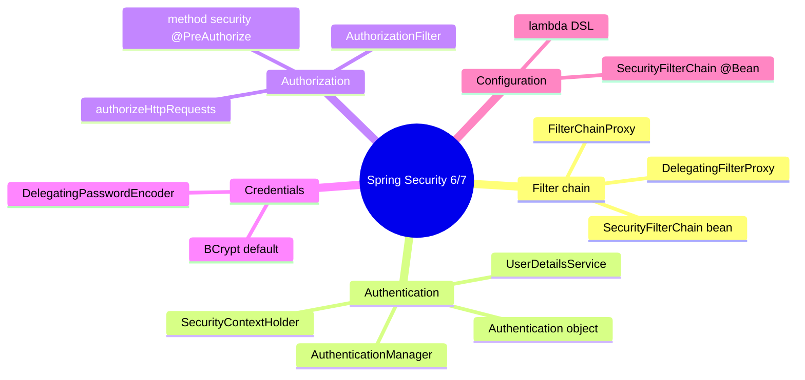

### 10.4 Architecture: a request through the filter chain

A request does not reach your controller until it has passed every filter. Authentication filters populate the `SecurityContext`; the `AuthorizationFilter` near the end of the chain consults the context and your rules; only then is the request dispatched.

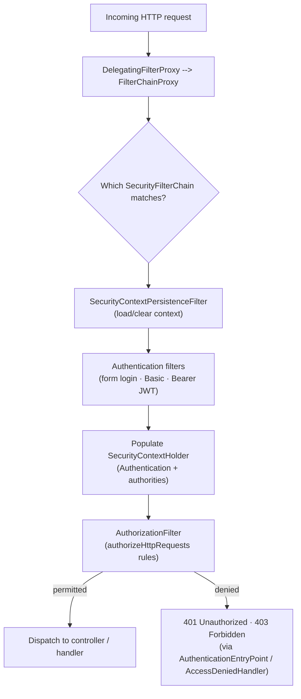

The filters run in a fixed, documented order. You rarely write a filter yourself; instead you *configure* the standard ones through the DSL and let Spring Security place them correctly.

### 10.5 Real example

**Scenario.** A team is building an internal back-office application. It serves a small HTML admin console (form login, session-based) and, on the same deployment, a JSON API consumed by another service that authenticates with HTTP Basic. They need both to be secured correctly, with the right CSRF and session behavior for each.

**Problem.** A single, one-size-fits-all security configuration forces a bad compromise: disabling CSRF globally would weaken the browser console, while keeping CSRF and sessions on the API would break the service-to-service caller. They need two distinct policies in one application.

**Solution.** Declare **two `SecurityFilterChain` beans**, ordered with `@Order`. The first matches `/api/**` and is stateless with CSRF disabled and HTTP Basic; the second matches everything else and uses form login with sessions and CSRF enabled. Store admin credentials with the `DelegatingPasswordEncoder` (BCrypt). Because filter chains are matched in order, the narrowest matcher must come first.

**Implementation.**

```java
package com.example.security;

import org.springframework.context.annotation.Bean;
import org.springframework.context.annotation.Configuration;
import org.springframework.core.annotation.Order;
import org.springframework.security.config.Customizer;
import org.springframework.security.config.annotation.web.builders.HttpSecurity;
import org.springframework.security.config.http.SessionCreationPolicy;
import org.springframework.security.core.userdetails.User;
import org.springframework.security.core.userdetails.UserDetailsService;
import org.springframework.security.crypto.factory.PasswordEncoderFactories;
import org.springframework.security.crypto.password.PasswordEncoder;
import org.springframework.security.provisioning.InMemoryUserDetailsManager;
import org.springframework.security.web.SecurityFilterChain;

@Configuration
public class SecurityConfig {

    // Chain 1: the JSON API — stateless, HTTP Basic, no CSRF.
    @Bean
    @Order(1)
    SecurityFilterChain apiChain(HttpSecurity http) throws Exception {
        http
            .securityMatcher("/api/**")                          // this chain only
            .authorizeHttpRequests(auth -> auth
                .anyRequest().authenticated())                   // deny by default
            .httpBasic(Customizer.withDefaults())
            .sessionManagement(s -> s.sessionCreationPolicy(SessionCreationPolicy.STATELESS))
            .csrf(csrf -> csrf.disable());                       // safe: stateless, no cookies
        return http.build();
    }

    // Chain 2: the browser admin console — form login, sessions, CSRF on.
    @Bean
    @Order(2)
    SecurityFilterChain consoleChain(HttpSecurity http) throws Exception {
        http
            .authorizeHttpRequests(auth -> auth
                .requestMatchers("/css/**", "/js/**", "/login").permitAll()
                .requestMatchers("/admin/**").hasRole("ADMIN")
                .anyRequest().authenticated())
            .formLogin(form -> form.loginPage("/login").permitAll())
            .logout(Customizer.withDefaults());                  // CSRF stays enabled
        return http.build();
    }

    @Bean
    PasswordEncoder passwordEncoder() {
        // DelegatingPasswordEncoder: BCrypt for new hashes, verifies any {id}-prefixed hash.
        return PasswordEncoderFactories.createDelegatingPasswordEncoder();
    }

    @Bean
    UserDetailsService users(PasswordEncoder encoder) {
        var admin = User.withUsername("admin")
            .password(encoder.encode("change-me"))               // stored as {bcrypt}...
            .roles("ADMIN")
            .build();
        return new InMemoryUserDetailsManager(admin);
    }
}
```

**Tests.**

```java
@WebMvcTest
@Import(SecurityConfig.class)
class SecurityConfigTest {

    @Autowired MockMvc mvc;

    @Test
    void apiRequiresAuthentication() throws Exception {
        mvc.perform(get("/api/orders")).andExpect(status().isUnauthorized());
    }

    @Test
    void apiAcceptsBasicAuth() throws Exception {
        mvc.perform(get("/api/orders").with(httpBasic("admin", "change-me")))
           .andExpect(status().isOk());
    }

    @Test
    @WithMockUser(roles = "ADMIN")
    void consoleAllowsAdmin() throws Exception {
        mvc.perform(get("/admin/dashboard")).andExpect(status().isOk());
    }

    @Test
    @WithMockUser(roles = "USER")
    void consoleForbidsNonAdmin() throws Exception {
        mvc.perform(get("/admin/dashboard")).andExpect(status().isForbidden());
    }
}
```

**Result.** The same application serves a CSRF-protected, session-based admin console and a stateless, CSRF-free Basic-auth API, each with the policy appropriate to its threat model. Passwords are stored as `{bcrypt}` hashes and can be re-encoded to a stronger algorithm later without migrating users.

**Future improvements.** Replace HTTP Basic on the API with JWT bearer tokens (Chapter 11); move the admin console to OIDC login (Chapter 12); externalize users into a database-backed `UserDetailsService`; and add method security (`@EnableMethodSecurity`) so service methods carry their own `@PreAuthorize` guards independent of URL rules.

### 10.6 Exercises

1. Explain the difference between authentication and authorization, and name the filter responsible for each in the chain.
2. Why must the `/api/**` `SecurityFilterChain` be ordered before the catch-all chain?
3. What does `DelegatingPasswordEncoder` store as a prefix on each hash, and why does that prefix matter for upgrades?

### 10.7 Challenges

- **Challenge.** Take an application with a single filter chain and split it into two: a stateless `/api/**` chain and a session-based UI chain. Verify with tests that CSRF is enforced on the UI and absent on the API, and that an unauthenticated API call returns 401 while an unauthenticated UI navigation redirects to the login page.

### 10.8 Checklist

- [ ] Every chain ends with `anyRequest().authenticated()` (deny by default).
- [ ] Stateless chains use `SessionCreationPolicy.STATELESS` and disable CSRF; session chains keep CSRF on.
- [ ] Passwords are stored via `DelegatingPasswordEncoder` (BCrypt), never in plain text.
- [ ] Multiple `SecurityFilterChain` beans are ordered with `@Order`, narrowest matcher first.
- [ ] Public paths (login page, static assets, health) are permitted explicitly.

### 10.9 Best practices

- Configure security exclusively through the lambda DSL and `SecurityFilterChain` beans; the `WebSecurityConfigurerAdapter` era is over.
- Keep the number of public endpoints minimal and enumerate them; let everything else require authentication.
- Use one filter chain per security policy (API vs. UI) instead of branching logic inside a single chain.
- Always go through a `PasswordEncoder` bean; never compare raw passwords.

### 10.10 Anti-patterns

- Re-implementing authentication, session handling, or password hashing by hand instead of using the framework.
- Disabling CSRF globally "to make things work," weakening the browser-facing parts of the app.
- A catch-all `permitAll()` left in place from prototyping, silently exposing endpoints.
- Storing roles and rules only in controllers, so the actual access policy is scattered and unauditable.

### 10.11 Troubleshooting

| Symptom | Likely cause | Action |
|---------|--------------|--------|
| All requests return 403 with CSRF token errors | CSRF enabled on a stateless API | Disable CSRF on the API filter chain only |
| API chain never matches; UI rules apply | Catch-all chain ordered before `/api/**` | Add `@Order(1)` to the narrower API chain |
| Login always fails with correct password | Raw password compared, no encoder | Inject `PasswordEncoder`; store `{bcrypt}` hashes |
| `403` for a valid admin | Authority/role name mismatch (`ROLE_` prefix) | Use `hasRole("ADMIN")` with authority `ROLE_ADMIN` |
| Endpoint open unexpectedly | Missing `anyRequest().authenticated()` | Add the deny-by-default terminal rule |

### 10.12 Official references

- Spring Security reference (servlet): https://docs.spring.io/spring-security/reference/servlet/index.html
- The security filter chain: https://docs.spring.io/spring-security/reference/servlet/architecture.html
- Authorize HTTP requests: https://docs.spring.io/spring-security/reference/servlet/authorization/authorize-http-requests.html
- Password storage / DelegatingPasswordEncoder: https://docs.spring.io/spring-security/reference/features/authentication/password-storage.html
- Spring Boot security: https://docs.spring.io/spring-boot/reference/web/spring-security.html

---

## Chapter 11 — Stateless authentication with JWT

### 11.1 Introduction

A REST API that scales horizontally cannot rely on server-side sessions: any instance must be able to handle any request without sticky load balancing or a shared session store. **JSON Web Tokens (JWTs)** solve this by carrying the authenticated identity *in the request itself*. The client presents a signed token in the `Authorization: Bearer ...` header; the server validates the signature, issuer, audience, and expiry, extracts the principal and authorities from the claims, and serves the request — storing nothing. In Spring Security this is configured with `oauth2ResourceServer(oauth2 -> oauth2.jwt(...))`. This chapter shows how to turn a Boot 4 application into a stateless JWT **resource server**, how the token-validation flow works, and how to map claims to Spring authorities.

### 11.2 Business context

Stateless authentication is what makes a microservice fleet operationally sane. With JWTs, there is no session replication, no sticky sessions, and no single point of failure in a session store — each service validates tokens independently against the identity provider's public keys. For the business this means cheaper horizontal scaling, simpler deployments, and clean service-to-service security: a token issued once can be forwarded across a call graph. The trade-off is that tokens are **bearer credentials** — whoever holds one can use it until it expires — so they must be short-lived, transmitted only over TLS, and validated strictly. Getting validation right (issuer, signature, expiry, audience, scopes) is the entire security boundary, which is exactly why you delegate it to Spring Security rather than parsing tokens yourself.

### 11.3 Theoretical concepts: anatomy and validation of a JWT

- **Structure.** A JWT is three Base64URL parts separated by dots: a **header** (algorithm, key id `kid`), a **payload** of **claims**, and a **signature**. It is signed, not encrypted — claims are readable, so never put secrets in them.
- **Standard claims.** `iss` (issuer), `sub` (subject/principal), `aud` (audience), `exp` (expiry), `iat` (issued-at), `nbf` (not-before), plus custom claims like `scope` or `roles`.
- **Signature verification.** Asymmetric signing (RS256/ES256) is the norm: the identity provider signs with a private key; the resource server verifies with the matching **public key**, fetched from the provider's **JWKS** endpoint and cached. The `kid` in the header selects the key, enabling key rotation.
- **`JwtDecoder`.** The Spring component that decodes and validates a token. With `issuer-uri` configured, Boot auto-configures one that discovers the JWKS URI via OIDC metadata and applies default validators (signature, `exp`, and issuer).
- **`JwtAuthenticationConverter`.** Maps validated claims to a Spring `Authentication`: by default it turns `scope`/`scp` into `SCOPE_*` authorities. Customize it to read roles from a custom claim.

### 11.4 Architecture: the bearer-token validation flow

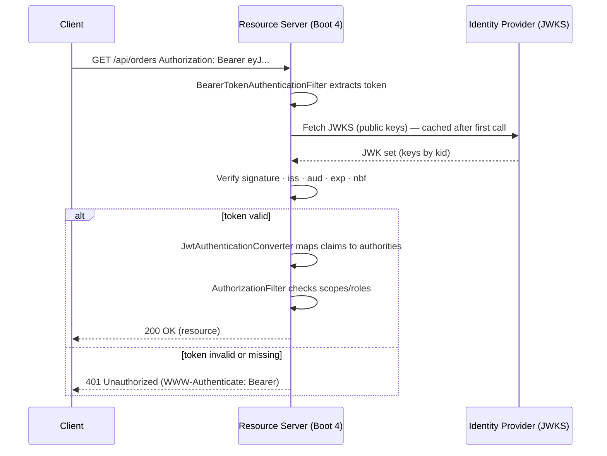

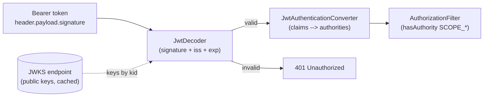

### 11.5 Real example

**Scenario.** An `orders-api` must accept only valid JWT access tokens issued by the company identity provider. Reading orders requires the `orders:read` scope; cancelling an order requires the `orders:write` scope and an `admin` role carried in a custom `roles` claim.

**Problem.** Without enforced validation any caller could reach the endpoints, and the provider emits roles in a non-standard `roles` claim that Spring will not map to authorities by default. The team also needs a strict check that the token's audience is `orders-api`, so tokens minted for other services cannot be replayed here.

**Solution.** Configure the app as an OAuth2 **resource server** with `issuer-uri` so the `JwtDecoder` and JWKS are auto-wired. Add an **audience validator** alongside the default validators. Provide a custom `JwtAuthenticationConverter` that keeps the default `SCOPE_*` mapping and additionally maps the `roles` claim to `ROLE_*` authorities. Enforce scope rules at the URL level and the role at the method level.

**Implementation.**

```yaml
# application.yml — Boot auto-configures the JwtDecoder from the issuer's OIDC metadata.
spring:
  security:
    oauth2:
      resourceserver:
        jwt:
          issuer-uri: https://idp.example.com/realms/company
          audiences: orders-api          # part of the default audience validation
```

```java
package com.example.orders.security;

import java.util.*;
import java.util.stream.*;
import org.springframework.context.annotation.Bean;
import org.springframework.context.annotation.Configuration;
import org.springframework.security.config.Customizer;
import org.springframework.security.config.annotation.method.configuration.EnableMethodSecurity;
import org.springframework.security.config.annotation.web.builders.HttpSecurity;
import org.springframework.security.config.http.SessionCreationPolicy;
import org.springframework.security.core.GrantedAuthority;
import org.springframework.security.core.authority.SimpleGrantedAuthority;
import org.springframework.security.oauth2.jwt.Jwt;
import org.springframework.security.oauth2.server.resource.authentication.*;
import org.springframework.security.web.SecurityFilterChain;

@Configuration
@EnableMethodSecurity                       // enables @PreAuthorize on methods
public class ResourceServerConfig {

    @Bean
    SecurityFilterChain api(HttpSecurity http, JwtAuthenticationConverter converter) throws Exception {
        http
            .authorizeHttpRequests(auth -> auth
                .requestMatchers("/actuator/health/**").permitAll()
                .requestMatchers(org.springframework.http.HttpMethod.GET, "/api/orders/**")
                    .hasAuthority("SCOPE_orders:read")
                .requestMatchers("/api/orders/**").hasAuthority("SCOPE_orders:write")
                .anyRequest().authenticated())                  // deny by default
            .sessionManagement(s -> s.sessionCreationPolicy(SessionCreationPolicy.STATELESS))
            .csrf(csrf -> csrf.disable())                       // stateless bearer API
            .oauth2ResourceServer(oauth2 -> oauth2
                .jwt(jwt -> jwt.jwtAuthenticationConverter(converter)));
        return http.build();
    }

    // Keep default SCOPE_* mapping AND map a custom "roles" claim to ROLE_* authorities.
    @Bean
    JwtAuthenticationConverter jwtAuthenticationConverter() {
        var scopes = new JwtGrantedAuthoritiesConverter();      // -> SCOPE_orders:read, ...
        var converter = new JwtAuthenticationConverter();
        converter.setJwtGrantedAuthoritiesConverter(jwt -> {
            Collection<GrantedAuthority> authorities = new ArrayList<>(scopes.convert(jwt));
            List<String> roles = jwt.getClaimAsStringList("roles");
            if (roles != null) {
                roles.stream()
                     .map(r -> new SimpleGrantedAuthority("ROLE_" + r))
                     .forEach(authorities::add);
            }
            return authorities;
        });
        return converter;
    }
}
```

```java
@RestController
@RequestMapping("/api/orders")
class OrderController {

    @GetMapping
    List<OrderView> list() { /* requires SCOPE_orders:read */ return ...; }

    @PreAuthorize("hasRole('ADMIN')")               // method-level guard on the custom role
    @DeleteMapping("/{id}")
    void cancel(@PathVariable String id,
                @AuthenticationPrincipal Jwt jwt) {  // injected validated token
        log.info("Order {} cancelled by {}", id, jwt.getSubject());
    }
}
```

For a local or unit test you often want a token without a real IdP. Spring's test support mints a JWT-backed `Authentication` directly:

```java
@WebMvcTest(OrderController.class)
@Import(ResourceServerConfig.class)
class OrderControllerTest {

    @Autowired MockMvc mvc;

    @Test
    void missingTokenIsUnauthorized() throws Exception {
        mvc.perform(get("/api/orders")).andExpect(status().isUnauthorized());
    }

    @Test
    void readScopeCanList() throws Exception {
        mvc.perform(get("/api/orders").with(jwt()
                .jwt(j -> j.claim("scope", "orders:read"))))
           .andExpect(status().isOk());
    }

    @Test
    void writeScopeWithoutAdminCannotCancel() throws Exception {
        mvc.perform(delete("/api/orders/42").with(jwt()
                .jwt(j -> j.claim("scope", "orders:write"))))   // no roles claim
           .andExpect(status().isForbidden());
    }

    @Test
    void adminCanCancel() throws Exception {
        mvc.perform(delete("/api/orders/42").with(jwt()
                .jwt(j -> j.claim("scope", "orders:write").claim("roles", List.of("ADMIN")))))
           .andExpect(status().isOk());
    }
}
```

**Result.** The API is fully stateless: every instance validates tokens independently against the cached JWKS, with no session store. Tokens are rejected unless their signature, issuer, audience, and expiry all check out; scopes gate the URLs and the custom role gates the destructive operation — enforced at both the filter chain and the method.

**Future improvements.** Add a custom `OAuth2TokenValidator` for finer audience/tenant checks; surface token-validation failures as RFC 7807 `ProblemDetail` bodies; cache JWKS with an explicit refresh policy for key rotation; and propagate the bearer token to downstream services (Chapter 12 covers the client side and client-credentials flow).

### 11.6 Exercises

1. List the parts of a JWT and explain why claims must never contain secrets.
2. What does the resource server fetch from the JWKS endpoint, and how does the `kid` header field support key rotation?
3. Why is an explicit **audience** check important even when the signature and issuer are valid?

### 11.7 Challenges

- **Challenge.** Convert an existing Basic-auth API into a JWT resource server. Map a custom `roles` claim to `ROLE_*` authorities, protect one endpoint with a scope and another with a role, and write tests for the missing-token, wrong-scope, and authorized cases using `jwt()` post-processors.

### 11.8 Checklist

- [ ] `issuer-uri` is set so the `JwtDecoder` and JWKS are auto-configured.
- [ ] Audience is validated; tokens for other services are rejected.
- [ ] The chain is `STATELESS` with CSRF disabled.
- [ ] A `JwtAuthenticationConverter` maps scopes and any custom role claim to authorities.
- [ ] Tokens travel only over TLS and are short-lived.
- [ ] Tests cover missing token, insufficient scope/role, and the happy path.

### 11.9 Best practices

- Validate strictly: signature, issuer, audience, and expiry are all required — never skip one.
- Keep access tokens short-lived; use refresh tokens (held by the client/IdP) for longevity, never long-lived access tokens.
- Map claims to authorities in one place (`JwtAuthenticationConverter`) so authorization rules read naturally.
- Treat the token as a bearer credential: TLS only, never log it, never store it in a place reachable by other tenants.

### 11.10 Anti-patterns

- Parsing or "verifying" JWTs by hand instead of using `JwtDecoder` — almost always insecure.
- Trusting claims without checking the signature, or accepting `alg: none`.
- Skipping the audience check, allowing tokens minted for another service to be replayed.
- Putting sensitive data in claims (the payload is readable by anyone holding the token).

### 11.11 Troubleshooting

| Symptom | Cause | Action |
|---------|-------|--------|
| 401 on a token that looks valid | Wrong `issuer-uri` / JWKS mismatch | Align `issuer-uri` with the token's `iss`; confirm JWKS reachable |
| 401 `invalid_token: audience` | Audience validator rejects token | Mint tokens with the correct `aud`, or fix `audiences` |
| Roles ignored, only scopes work | Default converter doesn't read custom claim | Provide a `JwtAuthenticationConverter` that maps the `roles` claim |
| `403` despite a valid token | Missing required scope/role authority | Grant the scope/role; verify `SCOPE_`/`ROLE_` prefixes |
| Intermittent 401 after key rotation | Stale cached JWKS | Allow the decoder to refresh keys on unknown `kid` |

### 11.12 Official references

- OAuth2 resource server (JWT): https://docs.spring.io/spring-security/reference/servlet/oauth2/resource-server/jwt.html
- Resource server overview: https://docs.spring.io/spring-security/reference/servlet/oauth2/resource-server/index.html
- Spring Boot OAuth2 resource server: https://docs.spring.io/spring-boot/reference/web/spring-security.html#web.security.oauth2.server
- Testing OAuth2 (`jwt()` support): https://docs.spring.io/spring-security/reference/servlet/test/mockmvc/oauth2.html
- JSON Web Token (RFC 7519): https://datatracker.ietf.org/doc/html/rfc7519

---

## Chapter 12 — OAuth2 / OIDC resource server and client

### 12.1 Introduction

Chapter 11 secured an API as a resource server — the server side of OAuth2. This chapter completes the picture with the **client** side: logging human users in with **OpenID Connect (OIDC)** via `oauth2Login`, and calling protected downstream APIs with `oauth2Client`, including the **client-credentials** grant for machine-to-machine calls where there is no user at all. Together, resource server and client are the two halves of a modern identity architecture: a user authenticates once at the identity provider, the application receives an ID token (who they are) and an access token (what they may do), and that access token flows to downstream resource servers that validate it exactly as in Chapter 11. We will configure OIDC login, wire an authorized `RestClient` that attaches tokens automatically, and set up a background client-credentials flow.

### 12.2 Business context

Centralizing identity on OAuth2/OIDC is what lets an organization offer single sign-on, enforce multi-factor authentication in one place, and onboard or offboard people through the identity provider rather than touching every application. Applications stop storing passwords entirely; they delegate authentication to a trusted provider and receive standardized tokens. For service-to-service traffic, the client-credentials grant gives each service its own identity and least-privilege scopes, replacing shared API keys that are hard to rotate and easy to leak. The payoff is consistent, auditable access across a fleet, lower credential-handling risk, and a much smaller attack surface — at the cost of one more moving part, the identity provider, which must itself be highly available.

### 12.3 Theoretical concepts: OIDC login and the OAuth2 grants

- **OpenID Connect (OIDC).** An identity layer on top of OAuth2. The **authorization-code flow with PKCE** redirects the user to the provider, who returns an authorization code that the application exchanges for an **ID token** (a JWT describing the user) and an **access token**.
- **`oauth2Login`.** Configures the application as an OIDC **client** for interactive login: it manages the redirect, the code exchange, and the resulting `OidcUser` principal in the session.
- **`ClientRegistration` / `ClientRegistrationRepository`.** The configured providers (issuer URI, client id/secret, scopes, grant type). Boot reads these from `spring.security.oauth2.client.*`.
- **`OAuth2AuthorizedClient` / manager.** Holds and refreshes access tokens for a registration. An `OAuth2AuthorizedClientManager` obtains tokens, refreshing or re-requesting as needed.
- **Client-credentials grant.** No user is involved: the application authenticates *as itself* with its client id/secret to obtain an access token for machine-to-machine calls.
- **Token propagation.** A `RestClient` (or `WebClient`) configured with an OAuth2 interceptor attaches the right bearer token to outbound calls automatically.

### 12.4 Architecture: login flow and downstream call

```mermaid
sequenceDiagram
    participant U as Browser (user)
    participant App as Boot 4 App (OAuth2 client)
    participant IdP as Identity Provider (OIDC)
    participant API as Downstream Resource Server
    U->>App: GET /dashboard (no session)
    App-->>U: 302 redirect to IdP /authorize (PKCE)
    U->>IdP: Authenticate (login + MFA)
    IdP-->>U: 302 back to App with authorization code
    U->>App: GET /login/oauth2/code/idp?code=...
    App->>IdP: Exchange code for ID token + access token
    IdP-->>App: id_token (OidcUser) + access_token
    App->>API: GET /api/orders  Authorization: Bearer access_token
    API-->>App: 200 OK (validates token as in Ch.11)
    App-->>U: Rendered dashboard
```

```mermaid
flowchart TB
    subgraph Login["Interactive: oauth2Login (authorization code + PKCE)"]
        user[User] --> code["Authorization code flow"]
        code --> tokens["ID token (OidcUser) + access token"]
    end
    subgraph Machine["Background: client-credentials"]
        job["Scheduled job / no user"] --> cc["Client authenticates as itself"]
        cc --> at["Access token (service identity)"]
    end
    tokens --> rc["Authorized RestClient<br/>attaches Bearer token"]
    at --> rc
    rc --> ds["Downstream resource server"]
```

### 12.5 Real example

**Scenario.** A customer portal lets users sign in through the corporate OIDC provider and, once logged in, view their orders by calling the `orders-api` resource server from Chapter 11 with the user's access token. Separately, a nightly reconciliation job must call the same API with no user present, using a service identity scoped to `orders:read`.

**Problem.** The portal must not store passwords; it needs SSO and must forward the **user's** token to the downstream API so the API can enforce per-user scopes. The reconciliation job has no user session, so it cannot reuse the login flow — it needs a **client-credentials** token, obtained and refreshed automatically, attached to its outbound calls.

**Solution.** Register two clients: `idp` (authorization-code, for `oauth2Login`) and `orders-svc` (client-credentials, for the job). Enable `oauth2Login` and `oauth2Client` in the filter chain. Build two `RestClient`s — one that propagates the logged-in user's token, one that uses the client-credentials registration via an `OAuth2AuthorizedClientManager`.

**Implementation.**

```yaml
# application.yml — two registrations sharing one provider.
spring:
  security:
    oauth2:
      client:
        provider:
          idp:
            issuer-uri: https://idp.example.com/realms/company
        registration:
          idp:                                  # interactive OIDC login
            provider: idp
            client-id: portal-web
            client-secret: ${PORTAL_SECRET}
            authorization-grant-type: authorization_code
            scope: openid, profile, orders:read
          orders-svc:                           # machine-to-machine
            provider: idp
            client-id: portal-batch
            client-secret: ${BATCH_SECRET}
            authorization-grant-type: client_credentials
            scope: orders:read
```

```java
package com.example.portal.security;

import org.springframework.context.annotation.*;
import org.springframework.security.config.Customizer;
import org.springframework.security.config.annotation.web.builders.HttpSecurity;
import org.springframework.security.oauth2.client.*;
import org.springframework.security.oauth2.client.registration.ClientRegistrationRepository;
import org.springframework.security.oauth2.client.web.*;
import org.springframework.security.web.SecurityFilterChain;
import org.springframework.web.client.RestClient;

@Configuration
public class ClientSecurityConfig {

    @Bean
    SecurityFilterChain web(HttpSecurity http) throws Exception {
        http
            .authorizeHttpRequests(auth -> auth
                .requestMatchers("/", "/error", "/css/**").permitAll()
                .anyRequest().authenticated())
            .oauth2Login(Customizer.withDefaults())     // OIDC interactive login
            .oauth2Client(Customizer.withDefaults())    // enables authorized-client support
            .logout(Customizer.withDefaults());
        return http.build();
    }

    // Manager that can mint/refresh client-credentials (and other) tokens.
    @Bean
    OAuth2AuthorizedClientManager authorizedClientManager(
            ClientRegistrationRepository registrations,
            OAuth2AuthorizedClientRepository authorizedClients) {
        var provider = OAuth2AuthorizedClientProviderBuilder.builder()
                .authorizationCode()
                .refreshToken()
                .clientCredentials()                    // for the batch job
                .build();
        var manager = new DefaultOAuth2AuthorizedClientManager(registrations, authorizedClients);
        manager.setAuthorizedClientProvider(provider);
        return manager;
    }

    // RestClient that forwards the logged-in user's access token downstream.
    @Bean
    RestClient ordersAsUser(OAuth2AuthorizedClientManager manager) {
        var interceptor =
            new org.springframework.security.oauth2.client.web.client
                .OAuth2ClientHttpRequestInterceptor(manager);
        interceptor.setClientRegistrationIdResolver(req -> "idp");   // use the login client
        return RestClient.builder()
                .baseUrl("https://orders-api.example.com")
                .requestInterceptor(interceptor)
                .build();
    }

    // RestClient for the no-user batch job, using client-credentials.
    @Bean
    RestClient ordersAsService(OAuth2AuthorizedClientManager manager) {
        var interceptor =
            new org.springframework.security.oauth2.client.web.client
                .OAuth2ClientHttpRequestInterceptor(manager);
        interceptor.setClientRegistrationIdResolver(req -> "orders-svc");
        return RestClient.builder()
                .baseUrl("https://orders-api.example.com")
                .requestInterceptor(interceptor)
                .build();
    }
}
```

```java
@Controller
class DashboardController {

    private final RestClient ordersAsUser;
    DashboardController(@Qualifier("ordersAsUser") RestClient ordersAsUser) {
        this.ordersAsUser = ordersAsUser;
    }

    @GetMapping("/dashboard")
    String dashboard(@AuthenticationPrincipal OidcUser user, Model model) {
        // The interceptor attaches the user's bearer token automatically.
        var orders = ordersAsUser.get().uri("/api/orders")
                .retrieve().body(OrderView[].class);
        model.addAttribute("name", user.getFullName());
        model.addAttribute("orders", orders);
        return "dashboard";
    }
}

@Component
class ReconciliationJob {

    private final RestClient ordersAsService;
    ReconciliationJob(@Qualifier("ordersAsService") RestClient ordersAsService) {
        this.ordersAsService = ordersAsService;
    }

    @Scheduled(cron = "0 0 2 * * *")                 // 02:00 daily, no user present
    void reconcile() {
        var orders = ordersAsService.get().uri("/api/orders")
                .retrieve().body(OrderView[].class);  // client-credentials token attached
        // ... reconcile ...
    }
}
```

**Result.** Users sign in once through the corporate provider — no passwords stored in the portal — and their token flows to `orders-api`, which enforces per-user scopes exactly as in Chapter 11. The nightly job authenticates as a distinct service identity with only `orders:read`, its token obtained and refreshed automatically by the authorized-client manager. The portal is simultaneously an OAuth2 client and, where it exposes APIs, can be a resource server too.

**Future improvements.** Add an `OidcUserService` to map provider groups to application roles; configure RP-initiated logout so signing out of the portal ends the IdP session; restrict the batch service to its own narrow scopes; and add resilience (timeouts and retries — Part V) around the downstream calls so a slow IdP or API degrades gracefully.

### 12.6 Exercises

1. Distinguish the **ID token** from the **access token** in OIDC: what is each for, and which one travels to the downstream resource server?
2. When is the **client-credentials** grant appropriate, and why can it not be used for interactive user login?
3. Why is **PKCE** used with the authorization-code flow even for confidential server-side clients?

### 12.7 Challenges

- **Challenge.** Build an OIDC-login app that calls a protected downstream API with the logged-in user's token, then add a scheduled job that calls the same API using a client-credentials registration. Confirm with logs that the user call carries the user's `sub` and the job call carries the service identity.

### 12.8 Checklist

- [ ] `oauth2Login` is configured with an OIDC `issuer-uri`; no passwords are stored locally.
- [ ] Authorization-code flow uses PKCE.
- [ ] Downstream calls go through an authorized `RestClient`/`WebClient` that attaches tokens automatically.
- [ ] Machine-to-machine calls use a dedicated client-credentials registration with least-privilege scopes.
- [ ] Client secrets come from the environment/secret store, never the repository.
- [ ] Logout ends the local session (and, ideally, the IdP session via RP-initiated logout).

### 12.9 Best practices

- Delegate all human authentication to the OIDC provider; let the application be a client, not an identity store.
- Use separate client registrations for interactive login and machine-to-machine traffic, each scoped minimally.
- Never attach bearer tokens by hand — let the OAuth2 interceptor and `OAuth2AuthorizedClientManager` manage acquisition and refresh.
- Keep client secrets in a secret manager; rotate them; prefer short-lived tokens with refresh.

### 12.10 Anti-patterns

- Treating the **ID token** as an API access token (or vice versa) — they have different audiences and purposes.
- Sharing one client registration and one set of scopes across both user login and background jobs.
- Hardcoding client secrets or long-lived tokens in configuration committed to source control.
- Manually building `Authorization` headers and re-implementing token refresh instead of using the authorized-client support.

### 12.11 Troubleshooting

| Symptom | Cause | Action |
|---------|-------|--------|
| Redirect loop on login | Redirect URI mismatch at the IdP | Register `/login/oauth2/code/{registrationId}` exactly |
| `invalid_grant` on code exchange | Clock skew or reused/expired code | Sync clocks (NTP); ensure the code is exchanged once |
| Downstream call returns 401 | Token not attached or wrong audience | Verify the interceptor and the registration id resolver |
| Client-credentials job gets 403 | Service client lacks the scope | Grant the scope to the `orders-svc` registration |
| Token never refreshes | Refresh-token provider not enabled | Add `.refreshToken()` to the authorized-client provider |
| Secret leaked in logs/repo | Secret hardcoded in `application.yml` | Move to env var / secret manager; rotate the secret |

### 12.12 Official references

- OAuth2 client (servlet): https://docs.spring.io/spring-security/reference/servlet/oauth2/client/index.html
- OIDC login (`oauth2Login`): https://docs.spring.io/spring-security/reference/servlet/oauth2/login/index.html
- Client-credentials grant: https://docs.spring.io/spring-security/reference/servlet/oauth2/client/authorization-grants.html#oauth2-client-client-credentials
- Spring Boot OAuth2 client: https://docs.spring.io/spring-boot/reference/web/spring-security.html#web.security.oauth2.client
- OpenID Connect Core: https://openid.net/specs/openid-connect-core-1_0.html
- The OAuth 2.0 Authorization Framework (RFC 6749): https://datatracker.ietf.org/doc/html/rfc6749

---

> **End of Part IV.** You can now reason about security across the whole request lifecycle: the **`SecurityFilterChain`** and the lambda DSL that decide authentication and authorization (Chapter 10), **stateless JWT** resource servers that validate bearer tokens against a provider's JWKS and map claims to authorities (Chapter 11), and the **OAuth2 / OIDC** client side — interactive login plus client-credentials and automatic token propagation to downstream APIs (Chapter 12). **Part V — Reactive & Resilience** (Chapters 13–15) shifts from securing requests to handling them at scale and under failure: **Project Reactor** (`Mono`/`Flux` and backpressure), **Spring WebFlux** with **R2DBC** for fully non-blocking persistence, and core resilience patterns including declarative retries with `@Retryable` and concurrency control with `@ConcurrencyLimit`.

<!--APPEND-PARTE-II-->
