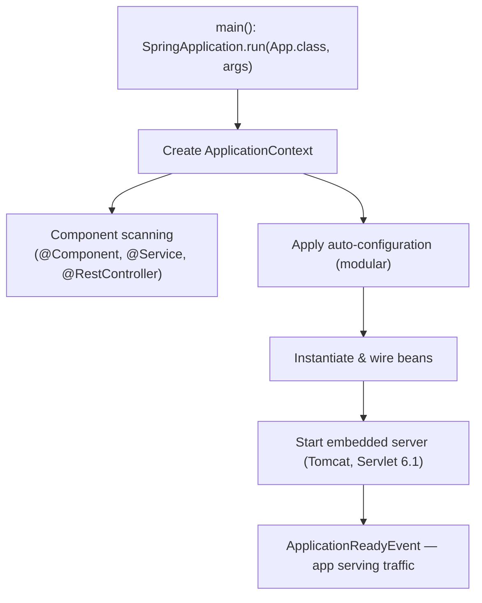
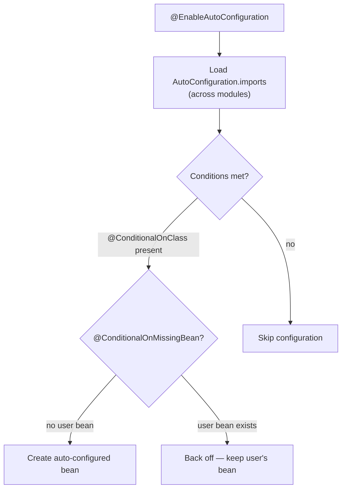
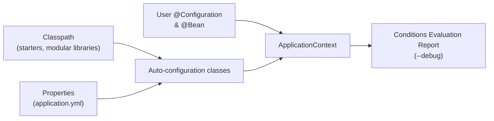
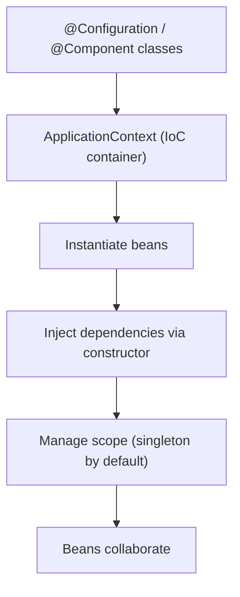
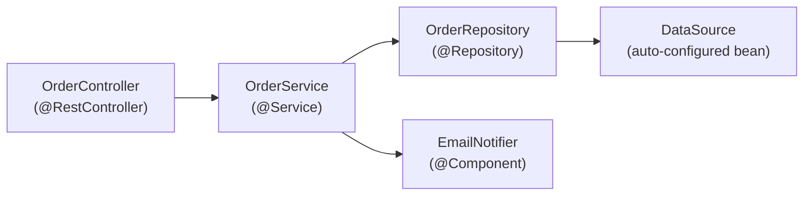
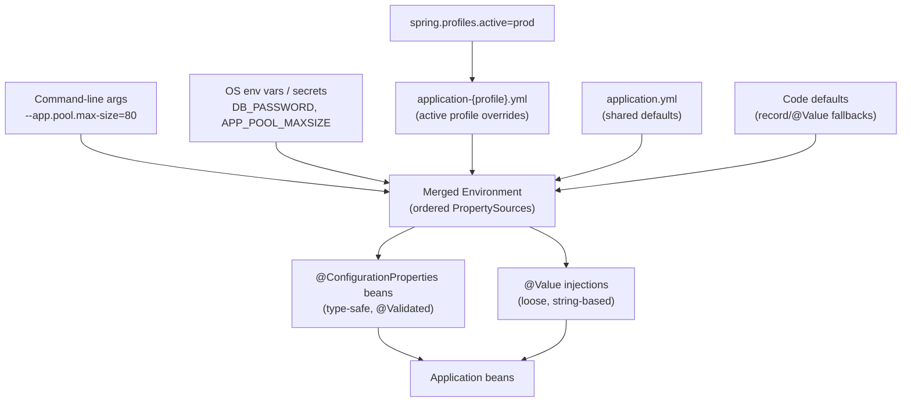
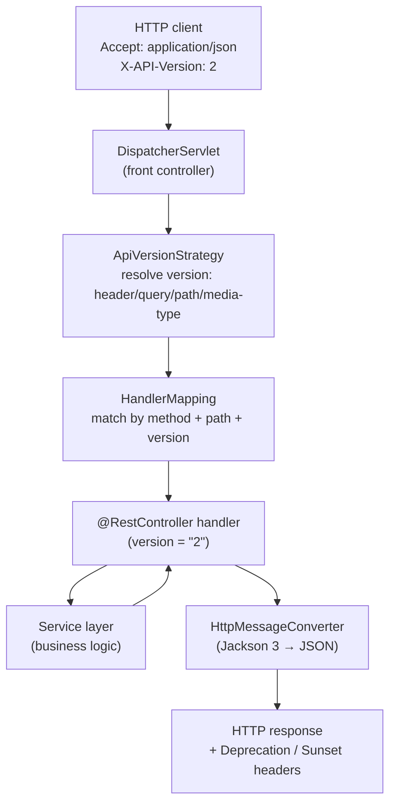
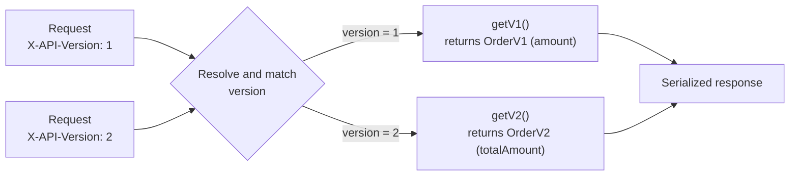
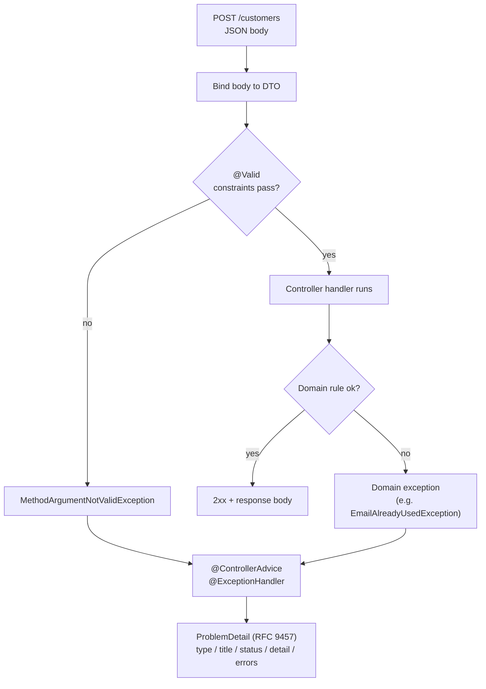
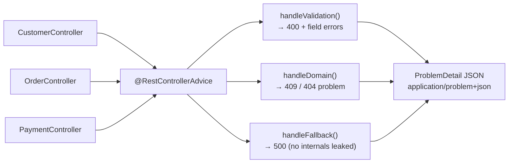

# Spring Boot 4 - Complete Professional Guide

> **Category:** 14_frameworks · **Language:** English

---

### Auto-configuration, Spring MVC & WebFlux, Data JPA, Security, Actuator, Testing, Native/AOT
**Edition for Spring Boot 4.x (Spring Framework 7, Java 17+ with first-class Java 25)**

> **Reference book (English).** Based on the official Spring Boot reference documentation (https://docs.spring.io), the Spring Framework 7 reference, and the Spring Boot 4.0 release notes. Written for developers, architects, and teams building production services on the JVM.
>
> **Scope notice:** this is a **production-focused** book. It teaches Spring Boot 4 as it is built today: Jakarta EE 11 (`jakarta.*`, Servlet 6.1, JPA 3.2, Bean Validation 3.1), a Java 17 baseline with first-class Java 25 support, JSpecify null-safety, Jackson 3, built-in REST API versioning, core resilience (`@Retryable`, `@ConcurrencyLimit`), a modularized auto-configuration model, and GraalVM native images. Each chapter follows the TO-BRAIN editorial standard (see `FILE_CONVENTIONS.md`).

---

## What changed since Spring Boot 3

Spring Boot 4 is built on **Spring Framework 7** and starts a new generation of the platform. The headline changes — woven into the relevant chapters below — are:

- **Java baseline & toolchain.** Java **17** remains the minimum, but 4.0 ships **first-class support for Java 25** (the recommended LTS). Kotlin **2.2+** and, for native images, **GraalVM 25+** are required.
- **Jakarta EE 11.** Servlet 6.1, JPA 3.2, Bean Validation 3.1. Still `jakarta.*`; a Servlet 6.1-compatible container is required.
- **JSpecify null-safety.** The portfolio standardizes on **JSpecify** annotations (`@Nullable`, `@NonNull`, `@NullMarked`) for tool-checkable nullness, replacing Spring's own annotations.
- **Jackson 3.** JSON processing moves to **Jackson 3** (new `tools.jackson.*` packages); Jackson 2 is still bridgeable during migration.
- **Built-in REST API versioning.** First-class API versioning across MVC and WebFlux (`@RequestMapping(version = ...)`) — no custom resolver plumbing.
- **Core resilience.** `@Retryable` and `@ConcurrencyLimit` are now first-class in the framework (Spring Retry folded into core).
- **Modularized auto-configuration.** The monolithic `spring-boot-autoconfigure` jar is split into focused modules, shrinking footprint and clarifying dependencies.
- **Declarative HTTP clients.** `@HttpServiceClient` interfaces are promoted to a fully supported, auto-detected programming model.

If you are migrating, read this edition alongside the official **Spring Boot 4.0 Migration Guide** and the **OpenRewrite** recipes that automate most of the mechanical changes.

---

## How to read this book

Progressive depth across five maturity levels:

| Level | Profile | Parts |
|-------|---------|-------|
| 1 — Beginner | New to Spring Boot | Part I |
| 2 — Intermediate | REST APIs & persistence | Parts II–III |
| 3 — Advanced | Security & reactive | Parts IV–V |
| 4 — Specialist | Testing & observability | Parts VI–VII |
| 5 — Enterprise | Packaging, native, production | Part VIII |

**Target audience:** Java and backend developers, software architects, platform engineers, tech leads, and CTOs adopting or scaling Spring Boot 4 services.

**Structure of each chapter:** Introduction · Business context · Theoretical concepts · Architecture · Diagrams (Mermaid) · Real examples · Step by step · Complete code · Exercises · Challenges · Checklist · Best practices · Anti-patterns · Troubleshooting · Official references.

**Example format:** Scenario · Problem · Solution · Implementation · Result · Future improvements.

> **Note on prerequisites.** This book assumes working knowledge of Java 17+ (records, sealed types, `var`; ideally pattern matching and virtual threads from later releases), Maven or Gradle, and basic HTTP. Where a Spring Boot feature builds on plain Spring Framework, the lineage is made explicit.

---

## Table of Contents

**Part I – Foundations**
1. What is Spring Boot 4 — starters and the project model
2. Auto-configuration and the Spring Boot lifecycle
3. The IoC container, beans, and dependency injection

**Part II – Configuration & Web APIs**
4. Externalized configuration, profiles, and `@ConfigurationProperties`
5. Building REST APIs with Spring MVC (`@RestController`, content negotiation, API versioning)
6. Bean Validation and error handling (`@Valid`, `ProblemDetail`, `@ControllerAdvice`)

**Part III – Data & Transactions**
7. Spring Data JPA fundamentals (entities, repositories, queries)
8. Transaction management with `@Transactional`
9. Database migrations and connection pooling (Flyway/Liquibase, HikariCP)

**Part IV – Security**
10. Spring Security architecture and the `SecurityFilterChain`
11. Stateless authentication with JWT
12. OAuth2 / OIDC resource server and client

**Part V – Reactive & Resilience**
13. Reactive programming with Project Reactor
14. Spring WebFlux and the functional/annotated models
15. Reactive data access (R2DBC) and core resilience (`@Retryable`, `@ConcurrencyLimit`)

**Part VI – Testing**
16. Unit and slice tests (`@WebMvcTest`, `@DataJpaTest`)
17. Integration tests with `@SpringBootTest` and Testcontainers

**Part VII – Observability**
18. Spring Boot Actuator (health, metrics, info)
19. Observability with Micrometer (metrics, tracing, logs)

**Part VIII – Packaging & Production**
20. Executable jars, layered images, and Docker (Buildpacks)
21. GraalVM native images and AOT processing
22. Production hardening and the twelve-factor checklist

> **Status of this edition:** phased delivery (each part keeps the same depth standard). **Ready:** Part I (Ch. 1–3). **In progress:** Parts II–VIII.

---

## Part I – Foundations

Part I builds the mental model you need for everything else. Spring Boot is not a new framework on top of Spring — it is an **opinionated, convention-over-configuration** layer that wires Spring Framework for you. Understanding three things — **starters**, **auto-configuration**, and the **IoC container** — explains 80% of what Spring Boot does at runtime, and demystifies the "magic" that newcomers often distrust.

---

## Chapter 1 — What is Spring Boot 4 — starters and the project model

### 1.1 Introduction

Spring Boot 4 (built on **Spring Framework 7**, requiring **Java 17+** with **first-class Java 25** support and the **`jakarta.*`** namespace at the **Jakarta EE 11** level) lets you create stand-alone, production-grade Spring applications that "just run." Instead of assembling dozens of libraries and XML files, you declare a small set of **starters** — curated dependency descriptors — and Spring Boot supplies sensible defaults, an embedded server, and a single executable artifact. This chapter explains the project model: starters, the parent BOM, the embedded server, and the `@SpringBootApplication` entry point.

### 1.2 Business context

For engineering organizations, Spring Boot's value is **time-to-first-endpoint** and **operational consistency**. A new service can be live in minutes, every service shares the same dependency versions (via the managed BOM), and the same `java -jar` command runs locally, in CI, and in production. Spring Boot 4 sharpens this with a **modularized** dependency model (smaller, clearer auto-configuration modules) and a JSpecify-checked, null-safe codebase — standardization that lowers onboarding cost, reduces "works on my machine" drift, and makes a fleet of microservices governable. The trade-off — accepting Spring's opinions — is usually a net win because the defaults reflect community-wide best practice.

### 1.3 Theoretical concepts: the building blocks

```mermaid
mindmap
  root((Spring Boot 4))
    Starters
      spring-boot-starter-web
      spring-boot-starter-data-jpa
      spring-boot-starter-security
      spring-boot-starter-test
    Dependency management
      spring-boot-starter-parent (BOM)
      consistent versions
      modularized auto-config
    Embedded server
      Tomcat (default)
      Jetty / Undertow
    Entry point
      @SpringBootApplication
      SpringApplication.run()
    Platform baseline
      Java 17+ (first-class Java 25)
      jakarta.* (Jakarta EE 11)
      Spring Framework 7
      JSpecify null-safety
```

A **starter** is a dependency that transitively pulls a coherent set of libraries (for example, `spring-boot-starter-web` brings Spring MVC, Jackson 3, validation, and embedded Tomcat). The **starter parent** (or the dependency-management BOM in Gradle) pins compatible versions so you rarely specify version numbers yourself. In Spring Boot 4 the auto-configuration that backs these starters is **split into focused modules** rather than one monolithic jar, so an app pulls in only what it uses. The result is a reproducible, version-aligned, leaner dependency tree.

### 1.4 Architecture: from main() to a running server



`@SpringBootApplication` is a meta-annotation combining `@SpringBootConfiguration`, `@EnableAutoConfiguration`, and `@ComponentScan`. Running `SpringApplication.run(...)` bootstraps the context, applies auto-configuration, starts the embedded server, and publishes lifecycle events.

### 1.5 Real example

**Scenario.** A team needs a minimal HTTP service exposing a health-style greeting endpoint, runnable as a single jar.

**Problem.** They want zero boilerplate and no servlet-container installation.

**Solution.** Use `spring-boot-starter-web` and a single `@RestController`. The embedded Tomcat ships inside the jar.

**Implementation.**

```java
// build: spring-boot-starter-parent (4.x) + spring-boot-starter-web
package com.example.greeting;

import org.springframework.boot.SpringApplication;
import org.springframework.boot.autoconfigure.SpringBootApplication;
import org.springframework.web.bind.annotation.GetMapping;
import org.springframework.web.bind.annotation.RequestParam;
import org.springframework.web.bind.annotation.RestController;

@SpringBootApplication
public class GreetingApplication {
    public static void main(String[] args) {
        SpringApplication.run(GreetingApplication.class, args);
    }
}

@RestController
class GreetingController {

    public record Greeting(String message) {}

    @GetMapping("/greeting")
    Greeting greet(@RequestParam(defaultValue = "World") String name) {
        return new Greeting("Hello, " + name + "!");
    }
}
```

```bash
# Build and run a single executable jar
./mvnw clean package
java -jar target/greeting-0.0.1-SNAPSHOT.jar
# GET http://localhost:8080/greeting?name=Spring  ->  {"message":"Hello, Spring!"}
```

**Result.** A self-contained jar with embedded Tomcat serves JSON on port 8080 — no external server, no XML, one command.

**Future improvements.** Add `@ConfigurationProperties` for the greeting text (Chapter 4), version the endpoint with built-in API versioning (Chapter 5), and add Actuator for health/metrics (Chapter 18).

### 1.6 Exercises

1. List three starters and the libraries each pulls in transitively.
2. What three annotations does `@SpringBootApplication` combine?
3. How would you switch the embedded server from Tomcat to Undertow?

### 1.7 Challenges

- **Challenge.** Generate a project with Spring Initializr (start.spring.io) selecting Spring Boot 4.x, add `web` and `actuator`, run it on Java 25, and confirm the embedded server version printed in the startup log matches the BOM.

### 1.8 Checklist

- [ ] I understand what a starter is and why versions are managed for me.
- [ ] I can explain the role of `@SpringBootApplication`.
- [ ] I know Spring Boot 4 requires Java 17+ (first-class Java 25) and Jakarta EE 11 (`jakarta.*`).
- [ ] I can package and run an app as a single executable jar.

### 1.9 Best practices

- Prefer starters over hand-picking individual libraries — you inherit tested version alignment.
- Keep the main application class in the **root package** so component scanning covers all sub-packages.
- Let the BOM manage versions; only override a version when you have a concrete reason.
- Target the latest LTS (Java 25) for new Boot 4 services unless a constraint pins you to 17.

### 1.10 Anti-patterns

- Pinning library versions manually and fighting the managed BOM, causing classpath conflicts.
- Placing `@SpringBootApplication` in a deep package so component scanning misses your beans.
- Carrying over `javax.*` or Jakarta EE 10 / Servlet 6.0 assumptions — Boot 4 is Jakarta EE 11 (Servlet 6.1).

### 1.11 Troubleshooting

| Symptom | Likely cause | Action |
|---------|--------------|--------|
| Beans/controllers not discovered | Main class outside root package | Move it up so `@ComponentScan` covers them |
| `ClassNotFoundException: javax.servlet...` | Legacy `javax.*` dependency | Use Jakarta EE 11 libraries; Boot 4 is `jakarta.*` |
| Container fails to start on old server | Servlet < 6.1 container | Use a Servlet 6.1-compatible container |
| Port 8080 already in use | Another process bound to the port | Set `server.port` or free the port |
| Wrong/duplicate dependency versions | Bypassing the BOM | Remove explicit versions; rely on starter parent |

### 1.12 Official references

- Spring Boot reference — Getting Started: https://docs.spring.io/spring-boot/reference/using/index.html
- Spring Boot starters: https://docs.spring.io/spring-boot/reference/using/build-systems.html#using.build-systems.starters
- Spring Initializr: https://start.spring.io
- Spring Boot 4.0 release notes: https://github.com/spring-projects/spring-boot/wiki/Spring-Boot-4.0-Release-Notes
- Spring Framework 7.0 GA announcement: https://spring.io/blog/2025/11/13/spring-framework-7-0-general-availability/

---

## Chapter 2 — Auto-configuration and the Spring Boot lifecycle

### 2.1 Introduction

Auto-configuration is the mechanism that makes Spring Boot feel magical: based on what is on the classpath, what beans already exist, and what properties are set, Spring Boot **conditionally** configures beans for you (a `DataSource`, a JSON mapper, an MVC stack, and so on). This chapter explains how auto-configuration is discovered and applied, how conditions decide what gets created, and how you override or disable it. In Spring Boot 4 the auto-configuration is delivered as **focused modules** rather than one jar, but the discovery and conditional model is unchanged.

### 2.2 Business context

Auto-configuration is what turns "weeks of plumbing" into "minutes of coding." For a business, that means faster delivery and fewer configuration defects. But teams must understand it well enough to **debug** it — when a bean unexpectedly exists (or doesn't), the difference between a one-line fix and a multi-day investigation is knowing how conditions and ordering work. Treating auto-configuration as an unknowable black box is an operational risk. The Boot 4 modularization makes this easier: smaller modules mean fewer surprising conditions on the classpath.

### 2.3 Theoretical concepts: conditional beans

Auto-configuration classes are listed in `META-INF/spring/org.springframework.boot.autoconfigure.AutoConfiguration.imports` (now within each auto-configuration module). Each is gated by `@Conditional` annotations such as `@ConditionalOnClass`, `@ConditionalOnMissingBean`, and `@ConditionalOnProperty`. The crucial rule: **your beans win** — `@ConditionalOnMissingBean` means an auto-configured bean is created only if you didn't already define one.



### 2.4 Architecture: where auto-configuration sits



Auto-configuration runs **after** your own configuration so your beans are seen first; this is why user-defined beans cause the matching auto-config to "back off."

### 2.5 Real example

**Scenario.** A team wants a custom JSON `ObjectMapper` (snake_case, ignore unknown fields) but keep all other web auto-configuration intact.

**Problem.** They worry that defining their own mapper will break Spring Boot's Jackson setup, and they are now on **Jackson 3**.

**Solution.** Prefer a `Jackson2ObjectMapperBuilderCustomizer`-style customizer (now backed by Jackson 3) so Boot's other defaults are preserved. If full control is genuinely required, define a single mapper bean and let the Jackson auto-configuration back off via `@ConditionalOnMissingBean`.

**Implementation.**

```java
package com.example.config;

// Spring Boot 4 uses Jackson 3 (tools.jackson.* packages).
import tools.jackson.databind.DeserializationFeature;
import tools.jackson.databind.ObjectMapper;
import tools.jackson.databind.PropertyNamingStrategies;
import org.springframework.context.annotation.Bean;
import org.springframework.context.annotation.Configuration;

@Configuration
public class JacksonConfig {

    @Bean
    ObjectMapper objectMapper() {
        return ObjectMapper.builder()
            .propertyNamingStrategy(PropertyNamingStrategies.SNAKE_CASE)
            .configure(DeserializationFeature.FAIL_ON_UNKNOWN_PROPERTIES, false)
            .build();
    }
}
```

```bash
# See exactly which auto-configurations matched and why
java -jar app.jar --debug
# ...prints the "Conditions Evaluation Report":
# Positive matches / Negative matches / Exclusions
```

**Result.** The application uses your `ObjectMapper`; Spring Boot's Jackson auto-config backs off for that bean but still wires the rest of the web stack.

**Future improvements.** Prefer a builder customizer so Boot's other defaults (modules, date handling) are preserved; reserve a full `ObjectMapper` bean for cases that truly need total control.

### 2.6 Exercises

1. What file declares auto-configuration classes in Spring Boot 4, and how does modularization change where it lives?
2. Explain what `@ConditionalOnMissingBean` does and why it matters.
3. How do you exclude a specific auto-configuration class?

### 2.7 Challenges

- **Challenge.** Run your app with `--debug`, open the Conditions Evaluation Report, and explain why one positive match and one negative match appear.

### 2.8 Checklist

- [ ] I can describe how auto-configuration is discovered (and that it is now modular).
- [ ] I know the common `@Conditional` annotations and the "back off" rule.
- [ ] I can read the Conditions Evaluation Report.
- [ ] I know how to exclude an auto-configuration via `exclude` or properties.

### 2.9 Best practices

- Override behavior by **adding your own bean** and letting auto-config back off, rather than fighting it.
- Use `Customizer` beans (e.g. `WebMvcConfigurer`, a Jackson builder customizer) to tweak defaults without replacing them wholesale.
- Use the `--debug` report when a bean unexpectedly exists or is missing.

### 2.10 Anti-patterns

- Disabling broad swaths of auto-configuration "to be safe," then re-implementing the plumbing by hand.
- Defining a full replacement bean when a customizer would suffice, losing useful defaults.
- Assuming a bean exists without checking the conditions report.

### 2.11 Troubleshooting

| Symptom | Cause | Action |
|---------|-------|--------|
| Expected bean is missing | A condition wasn't met | Check `--debug` negative matches |
| Two conflicting beans of a type | Auto-config didn't back off | Ensure your bean type matches the `@ConditionalOnMissingBean` target |
| Auto-config you don't want is active | Class is on the classpath | Use `@SpringBootApplication(exclude = ...)` or `spring.autoconfigure.exclude` |
| Jackson customization ignored | Mixed Jackson 2 and 3 types | Use the Jackson 3 (`tools.jackson.*`) types and the matching customizer |

### 2.12 Official references

- Auto-configuration: https://docs.spring.io/spring-boot/reference/using/auto-configuration.html
- Creating your own auto-configuration: https://docs.spring.io/spring-boot/reference/features/developing-auto-configuration.html
- Condition annotations: https://docs.spring.io/spring-boot/reference/features/developing-auto-configuration.html#features.developing-auto-configuration.condition-annotations
- Spring Boot reference (full): https://docs.spring.io/spring-boot/index.html

---

## Chapter 3 — The IoC container, beans, and dependency injection

### 3.1 Introduction

Underneath every Spring Boot app is the Spring Framework **Inversion of Control (IoC) container**: it creates objects (**beans**), resolves their dependencies, and manages their lifecycle. Spring Boot adds auto-configuration and conventions, but the container is the engine. This chapter covers beans, the stereotype annotations, **constructor injection** (the modern default), scopes, and how the `ApplicationContext` ties it together. In Spring Framework 7 the container is also **JSpecify-annotated**, so nullness is tool-checkable across injection points.

### 3.2 Business context

Dependency injection is not academic — it directly shapes **testability and change cost**. Code that receives its collaborators (rather than constructing them) can be unit-tested with fakes, swapped per environment, and refactored without ripple effects. Teams that internalize DI ship code that is cheaper to test and safer to evolve; teams that don't end up with tangled singletons and brittle tests. Boot 4's JSpecify null-safety adds a second payoff: nullness bugs surface in the IDE and build, not in production.

### 3.3 Theoretical concepts: beans and injection

A **bean** is an object managed by the container. You declare beans either with **stereotype annotations** (`@Component`, `@Service`, `@Repository`, `@Controller`) that are component-scanned, or with `@Bean` methods inside a `@Configuration` class. Dependencies are supplied by the container — preferably through the **constructor**, which yields immutable, fully-initialized, easily-testable objects.



### 3.4 Architecture: a layered bean graph



Each arrow is a constructor dependency the container resolves. Because beans are singletons by default, this graph is built once at startup and reused for every request.

### 3.5 Real example

**Scenario.** An order service must persist orders and send a confirmation, with both collaborators injectable for testing.

**Problem.** Field injection (`@Autowired` on fields) makes the class hard to unit-test and hides required dependencies.

**Solution.** Use **constructor injection**. With a single constructor, Spring injects automatically — no `@Autowired` needed — and the dependencies become `final`. Mark the package `@NullMarked` (JSpecify) so non-null is the default and nullable points are explicit.

**Implementation.**

```java
package com.example.orders;

import org.springframework.stereotype.Service;

public interface Notifier { void confirm(String orderId); }

@Service
class OrderService {

    private final OrderRepository repository;
    private final Notifier notifier;

    // Single constructor: Spring injects these automatically.
    OrderService(OrderRepository repository, Notifier notifier) {
        this.repository = repository;
        this.notifier = notifier;
    }

    public String place(Order order) {
        Order saved = repository.save(order);
        notifier.confirm(saved.id());
        return saved.id();
    }
}
```

```java
// Unit test without Spring: just pass fakes to the constructor.
class OrderServiceTest {
    @org.junit.jupiter.api.Test
    void placesAndConfirms() {
        var repo = new InMemoryOrderRepository();          // fake
        var notifier = new RecordingNotifier();            // fake
        var service = new OrderService(repo, notifier);

        String id = service.place(new Order("ABC", 2));

        org.junit.jupiter.api.Assertions.assertNotNull(id);
        org.junit.jupiter.api.Assertions.assertTrue(notifier.wasCalledFor(id));
    }
}
```

**Result.** The service is immutable, its dependencies are explicit, and it is unit-testable with zero Spring infrastructure — tests run in milliseconds.

**Future improvements.** Promote `Order` to a record; if multiple `Notifier` implementations exist, disambiguate with `@Primary` or `@Qualifier` (Chapter 4 covers profile-based selection).

### 3.6 Exercises

1. Name the four stereotype annotations and the semantic each conveys.
2. Why is constructor injection preferred over field injection?
3. What is the default bean scope, and name one alternative scope.

### 3.7 Challenges

- **Challenge.** Introduce a second `Notifier` implementation and make the container choose the right one per profile using `@Profile`, without changing `OrderService`.

### 3.8 Checklist

- [ ] I can declare beans with stereotypes and with `@Bean` methods.
- [ ] I use constructor injection with `final` fields.
- [ ] I understand singleton vs other scopes.
- [ ] I can disambiguate multiple candidates with `@Qualifier`/`@Primary`.
- [ ] I use JSpecify (`@NullMarked`, `@Nullable`) to make nullness explicit.

### 3.9 Best practices

- Prefer constructor injection; let a single constructor be injected implicitly.
- Make injected fields `final` to express immutability and catch missing wiring at compile time.
- Keep beans focused (single responsibility); inject interfaces, not concrete classes, where it aids testing.
- Adopt JSpecify null-safety package-wide so the build catches nullness mistakes.

### 3.10 Anti-patterns

- Field injection (`@Autowired` on private fields) — hides dependencies and hurts testability.
- Calling `applicationContext.getBean(...)` from business code (service locator) instead of injecting.
- God-beans that depend on a dozen collaborators — a sign the class does too much.

### 3.11 Troubleshooting

| Symptom | Cause | Action |
|---------|-------|--------|
| `NoSuchBeanDefinitionException` | Bean not scanned or not declared | Add a stereotype/`@Bean`; verify package scanning |
| `NoUniqueBeanDefinitionException` | Multiple candidates for a type | Add `@Primary` or `@Qualifier` |
| Circular dependency error at startup | Two beans require each other via constructor | Break the cycle; reconsider design or use `@Lazy` |
| `null` dependency at runtime | Object created with `new` instead of injected | Make it a managed bean and inject it |

### 3.12 Official references

- The IoC container: https://docs.spring.io/spring-framework/reference/core/beans.html
- Dependency injection: https://docs.spring.io/spring-framework/reference/core/beans/dependencies/factory-collaborators.html
- Bean scopes: https://docs.spring.io/spring-framework/reference/core/beans/factory-scopes.html
- Null-safety (JSpecify): https://docs.spring.io/spring-framework/reference/core/null-safety.html
- Spring Boot — Spring Beans and dependency injection: https://docs.spring.io/spring-boot/reference/using/spring-beans-and-dependency-injection.html

---

> **End of Part I.** You now have the foundational mental model of Spring Boot 4: the **project model** (starters, BOM, modularized auto-config, embedded server, `@SpringBootApplication`), the **auto-configuration** mechanism (conditional beans and the "back off" rule), and the **IoC container** with constructor-based, JSpecify-null-safe dependency injection. **Part II — Configuration & Web APIs** (Chapters 4–6) builds on this to cover externalized configuration and profiles, REST APIs with Spring MVC including **built-in API versioning**, and validation with RFC 7807 `ProblemDetail` error handling.


---

# Part II – Configuration & Web APIs

Part II turns the foundational mental model from Part I into a service that is *configurable* and *exposed*. A real application must run unchanged across environments (the 12-factor ideal), so we start with **externalized configuration, profiles, and type-safe `@ConfigurationProperties`**. We then build the HTTP surface with **Spring MVC** — `@RestController`, content negotiation, and Spring Boot 4's **first-class API versioning** — and finally make that surface robust with **Bean Validation** and **RFC 9457 `ProblemDetail`** error handling. Together these three chapters take you from "an app that runs" to "an app that talks to the world correctly across every environment."

---

## Chapter 4 — Externalized configuration, profiles, and `@ConfigurationProperties`

### 4.1 Introduction

A Spring Boot 4 application is built once and deployed many times — locally, in CI, in staging, in production — and each deployment needs different settings: a database URL, a connection-pool size, a feature flag. **Externalized configuration** is the mechanism that lets a single immutable jar absorb those differences at startup rather than at build time. Configuration values arrive from many **property sources** (files, environment variables, command-line arguments, imported config), are layered in a defined **precedence order**, and are exposed to your code either through loosely-typed `@Value` injections or, preferably, through **type-safe `@ConfigurationProperties`** beans. **Profiles** then let you switch whole sets of beans and properties on or off per environment. This chapter covers the property model, profiles, binding, and how to keep secrets out of your artifact.

### 4.2 Business context

Hardcoded configuration is one of the most common causes of production incidents and security breaches. A database URL compiled into a jar is correct in exactly one environment and wrong everywhere else; a password committed to a properties file is a leak that survives in git history forever. Externalized configuration directly serves three business concerns: **reliability** (the same tested artifact promotes from dev to prod, eliminating "rebuilt for prod" drift), **security** (secrets live in a vault or environment, never in source), and **auditability** (configuration changes are traceable and reviewable separately from code). For a fleet of microservices, a consistent, validated configuration model is the difference between governable infrastructure and a sprawl of bespoke setups. Spring Boot 4 keeps this model stable across the 3.x→4.0 upgrade, so the investment carries forward cleanly.

### 4.3 Theoretical concepts: property sources, profiles, and binding

```mermaid
mindmap
  root((Externalized config))
    Property sources
      Command-line args
      OS env vars / secrets
      application-{profile}.yml
      application.yml
      Code defaults
    Profiles
      spring.profiles.active
      @Profile on beans
      profile-specific YAML
    Binding
      @Value (loose)
      @ConfigurationProperties (type-safe)
      @Validated constraints
    Imports and secrets
      spring.config.import
      Vault / Kubernetes
      env-injected passwords
```

Three ideas do most of the work. First, **precedence**: when the same key is defined in several sources, the higher-priority source wins. The simplified order, from strongest to weakest, is command-line arguments, then OS environment variables and secrets, then `application-{profile}.yml`, then `application.yml`, then code defaults (the full, exhaustive order is in the reference docs). Second, **profiles**: `spring.profiles.active=prod` activates the `prod` profile, which both registers `@Profile("prod")` beans and pulls in `application-prod.yml`. Third, **binding**: `@ConfigurationProperties(prefix = "app")` maps a whole properties subtree onto a record or class, and `@Validated` runs Jakarta Bean Validation on it at startup so misconfiguration **fails fast** rather than surfacing as a runtime surprise.

### 4.4 Architecture: how a value is resolved



The `Environment` abstraction holds an ordered list of `PropertySource` objects; resolving a key walks that list and returns the first match. Because binding happens at startup, a validated `@ConfigurationProperties` record that fails its constraints aborts the boot with a clear message — you never ship a service that is silently misconfigured. Relaxed binding means `app.pool.max-size`, `APP_POOL_MAXSIZE`, and `app.poolMaxSize` all map to the same property, which is what makes environment-variable overrides ergonomic in containers.

### 4.5 Real example

**Scenario.** A checkout service must run with different connection-pool sizes and feature flags per environment, and the production database password must come from a secret store — never from a file in the artifact.

**Problem.** Today the settings are scattered across a dozen `@Value` annotations with no validation, and the password is one careless commit away from ending up in `application.yml` and leaking into git history.

**Solution.** Consolidate the settings into a single validated `@ConfigurationProperties` record, put environment differences in profile-specific YAML, and inject the password from an environment variable that the platform populates from the secret store.

**Implementation.**

```yaml
# application.yml — shared defaults (committed, no secrets)
app:
  features:
    new-checkout: false
  pool:
    max-size: 10
spring:
  config:
    activate:
      on-profile: "default"
---
# application-prod.yml — production overrides
spring:
  config:
    activate:
      on-profile: prod
  datasource:
    url: jdbc:postgresql://db.prod.internal:5432/checkout
    username: checkout
    password: ${DB_PASSWORD}     # injected from the secret store at deploy time
app:
  features:
    new-checkout: true
  pool:
    max-size: 50
```

```java
package com.example.checkout.config;

import jakarta.validation.Valid;
import jakarta.validation.constraints.Max;
import jakarta.validation.constraints.Min;
import org.springframework.boot.context.properties.ConfigurationProperties;
import org.springframework.validation.annotation.Validated;

// Type-safe, validated configuration bound from the "app.*" subtree.
@ConfigurationProperties(prefix = "app")
@Validated
public record AppProperties(
    Features features,
    @Valid Pool pool
) {
    public record Features(boolean newCheckout) {}

    public record Pool(@Min(1) @Max(200) int maxSize) {}
}
```

```java
package com.example.checkout;

import com.example.checkout.config.AppProperties;
import org.springframework.boot.SpringApplication;
import org.springframework.boot.autoconfigure.SpringBootApplication;
import org.springframework.boot.context.properties.EnableConfigurationProperties;
import org.springframework.stereotype.Service;

@SpringBootApplication
@EnableConfigurationProperties(AppProperties.class)
public class CheckoutApplication {
    public static void main(String[] args) {
        SpringApplication.run(CheckoutApplication.class, args);
    }
}

@Service
class CheckoutFeature {

    private final AppProperties props;

    CheckoutFeature(AppProperties props) {   // constructor injection (Chapter 3)
        this.props = props;
    }

    boolean isNewCheckoutEnabled() {
        return props.features().newCheckout();
    }
}
```

```java
package com.example.checkout;

import com.example.checkout.config.AppProperties;
import org.junit.jupiter.api.Test;
import org.springframework.beans.factory.annotation.Autowired;
import org.springframework.boot.test.context.SpringBootTest;
import org.springframework.test.context.ActiveProfiles;

import static org.assertj.core.api.Assertions.assertThat;

@SpringBootTest
@ActiveProfiles("prod")
class ProdConfigTest {

    @Autowired
    AppProperties props;

    @Test
    void productionOverridesAreApplied() {
        assertThat(props.features().newCheckout()).isTrue();
        assertThat(props.pool().maxSize()).isEqualTo(50);
    }
}
```

**Result.** One artifact behaves correctly in every environment: dev uses the defaults, prod picks up the overrides via `spring.profiles.active=prod`, and the password is supplied by `DB_PASSWORD` at deploy time so it never lives in a file. An invalid value such as `app.pool.max-size: 0` aborts startup with a validation error instead of failing mysteriously under load.

**Future improvements.** Source the password from Vault using `spring.config.import=vault://`, group related flags behind a feature-flag service, and surface the bound properties through Actuator's `/configprops` endpoint (Chapter 18) for operational visibility.

### 4.6 Exercises

1. Order these property sources from strongest to weakest precedence: `application.yml`, a command-line argument, an OS environment variable.
2. Convert three related `@Value("${app.pool.*}")` injections into one `@ConfigurationProperties` record with validation.
3. Name two ways to activate the `prod` profile at runtime.

### 4.7 Challenges

- **Challenge.** Externalize *all* configuration of a small service into `default` and `prod` profiles, bind it through a single `@Validated @ConfigurationProperties` record, inject one secret from an environment variable, and write a `@SpringBootTest` with `@ActiveProfiles("prod")` proving the overrides apply and that an out-of-range value fails startup.

### 4.8 Checklist

- [ ] No secrets live in source or in committed properties files.
- [ ] Environment differences live in profile-specific YAML, not in code branches.
- [ ] Configuration is bound through validated `@ConfigurationProperties`, not scattered `@Value`.
- [ ] The active profile is set explicitly per environment.
- [ ] Invalid configuration fails fast at startup.

### 4.9 Best practices

- Prefer `@ConfigurationProperties` (type-safe, validated, discoverable) over scattered `@Value` strings.
- Build one immutable artifact and vary behavior only through externalized configuration.
- Inject secrets from environment variables or Vault; never commit them.
- Use `@Validated` with Bean Validation constraints so misconfiguration aborts the boot.
- Lean on relaxed binding so the same key can be overridden by an environment variable in a container.

### 4.10 Anti-patterns

- Passwords or API keys in `application.yml` committed to git.
- Building a separate artifact per environment instead of externalizing config.
- Deeply scattered `@Value` strings with no central type or validation.
- Reading `spring.profiles.active` in business logic to branch behavior instead of using `@Profile` beans.

### 4.11 Troubleshooting

| Symptom | Likely cause | Action |
|---------|--------------|--------|
| Wrong value at runtime | Precedence misunderstanding | Inspect the ordered property sources; remember CLI args beat env vars beat files |
| Profile properties ignored | Profile not active | Set `spring.profiles.active` for that environment |
| Binding fails at startup | Type or validation constraint mismatch | Fix the property value or the constraint; read the failure message |
| Env-var override not picked up | Relaxed-binding name mismatch | Use the `APP_POOL_MAXSIZE` form for `app.pool.max-size` |
| Secret found in a file | Password placed in YAML | Move to env var / Vault and rotate the credential |

### 4.12 Official references

- Externalized configuration: https://docs.spring.io/spring-boot/reference/features/external-config.html
- Profiles: https://docs.spring.io/spring-boot/reference/features/profiles.html
- Type-safe `@ConfigurationProperties`: https://docs.spring.io/spring-boot/reference/features/external-config.html#features.external-config.typesafe-configuration-properties
- Importing additional config with `spring.config.import`: https://docs.spring.io/spring-boot/reference/features/external-config.html#features.external-config.files.importing

---

## Chapter 5 — Building REST APIs with Spring MVC

### 5.1 Introduction

**Spring MVC** is Spring Boot 4's servlet-based web stack, running on Servlet 6.1 inside the embedded container. At its center is the `DispatcherServlet`, a front controller that routes each request to a handler method on a controller, applies argument resolution and validation, invokes your code, and serializes the result. For JSON and other machine-to-machine APIs you use `@RestController`, where every handler's return value becomes the response body (via Jackson 3 by default). This chapter covers the essentials — controllers, request mapping, content negotiation — and then Spring Boot 4's headline web feature: **first-class API versioning** through a `version` attribute on `@RequestMapping` and an `ApiVersionStrategy` that resolves the requested version from a header, query parameter, media-type parameter, or path segment.

### 5.2 Business context

An API is a contract, and contracts evolve. The moment a second team or an external partner depends on your endpoint, a careless field rename becomes a breaking change that ripples across consumers and forces coordinated, risky deployments. Historically teams hand-rolled versioning — parsing custom headers or inventing `/v2/` path conventions inconsistently across services — which made API evolution expensive and error-prone. Spring Boot 4 makes versioning a **framework concern**: a service can serve `v1` and `v2` of the same logical endpoint side by side, signal deprecation cleanly, and protect existing consumers while shipping breaking changes. The business payoff is faster, safer API evolution and far less bespoke routing code to maintain across a fleet of services.

### 5.3 Theoretical concepts: the request lifecycle and versioning

- **`DispatcherServlet`.** The front controller that receives every request and dispatches it to the matching handler method.
- **Controllers and mappings.** `@RestController` serializes return values directly; `@GetMapping`, `@PostMapping`, and the general `@RequestMapping` bind HTTP methods and paths to handler methods; `@PathVariable`, `@RequestParam`, and `@RequestBody` resolve method arguments.
- **Content negotiation.** Spring selects a representation based on the `Accept` header and `produces`/`consumes` attributes; JSON via Jackson 3 is the default.
- **API versioning.** The `version` attribute on mapping annotations declares which version a handler serves; an `ApiVersionStrategy` (configured through `ApiVersionConfigurer`) resolves the incoming version from a **header**, **query parameter**, **media-type parameter**, or **path**. The same versioning is supported on the client side (`RestClient`, HTTP interface clients) and in tests (`MockMvc`, `WebTestClient`).

### 5.4 Architecture: request flow with content negotiation and versioning





Versioning is layered *on top of* ordinary path matching: the resolver extracts the requested version, then handler mapping selects the controller method whose path **and** declared `version` both match. Because each version is its own method returning its own DTO, the two contracts never share serialization logic and cannot accidentally drift into each other.

### 5.5 Real example

**Scenario.** An orders API must introduce a breaking change — renaming the JSON field `amount` to `totalAmount` — while keeping every existing `v1` consumer working untouched.

**Problem.** A naive rename of the field on a single DTO breaks all current clients at once, forcing a coordinated big-bang migration across every consumer.

**Solution.** Configure header-based versioning once, then expose two handlers for the same path: `version = "1"` returning the original DTO and `version = "2"` returning the renamed one. Existing clients keep sending (or defaulting to) `v1`; new clients opt into `v2`.

**Implementation.**

```java
package com.example.orders.web;

import org.springframework.context.annotation.Configuration;
import org.springframework.web.servlet.config.annotation.ApiVersionConfigurer;
import org.springframework.web.servlet.config.annotation.WebMvcConfigurer;

// Configure a single version-resolution strategy for the whole API.
@Configuration
public class WebConfig implements WebMvcConfigurer {

    @Override
    public void configureApiVersioning(ApiVersionConfigurer configurer) {
        configurer
            .useRequestHeader("X-API-Version")   // resolve the version from a header
            .setDefaultVersion("1");             // clients that omit it get v1
    }
}
```

```java
package com.example.orders.web;

// Distinct DTOs per version — no shared serialization between contracts.
public record OrderV1(String id, String item, long amount) {}

public record OrderV2(String id, String item, long totalAmount) {}
```

```java
package com.example.orders.web;

import com.example.orders.OrderService;
import org.springframework.web.bind.annotation.GetMapping;
import org.springframework.web.bind.annotation.PathVariable;
import org.springframework.web.bind.annotation.RequestMapping;
import org.springframework.web.bind.annotation.RestController;

@RestController
@RequestMapping("/orders")
public class OrderController {

    private final OrderService service;

    public OrderController(OrderService service) {   // constructor injection
        this.service = service;
    }

    // v1 — original contract, field "amount"
    @GetMapping(path = "/{id}", version = "1")
    public OrderV1 getV1(@PathVariable String id) {
        var order = service.find(id);
        return new OrderV1(order.id(), order.item(), order.amount());
    }

    // v2 — breaking change, field renamed to "totalAmount"
    @GetMapping(path = "/{id}", version = "2")
    public OrderV2 getV2(@PathVariable String id) {
        var order = service.find(id);
        return new OrderV2(order.id(), order.item(), order.amount());
    }
}
```

```java
package com.example.orders.web;

import com.example.orders.Order;
import com.example.orders.OrderService;
import org.junit.jupiter.api.Test;
import org.springframework.beans.factory.annotation.Autowired;
import org.springframework.boot.test.autoconfigure.web.servlet.WebMvcTest;
import org.springframework.test.context.bean.override.mockito.MockitoBean;
import org.springframework.test.web.servlet.MockMvc;

import static org.mockito.Mockito.when;
import static org.springframework.test.web.servlet.request.MockMvcRequestBuilders.get;
import static org.springframework.test.web.servlet.result.MockMvcResultMatchers.*;

@WebMvcTest(OrderController.class)
class OrderControllerVersionTest {

    @Autowired
    MockMvc mockMvc;

    @MockitoBean
    OrderService service;

    @Test
    void servesV1ContractByHeader() throws Exception {
        when(service.find("42")).thenReturn(new Order("42", "book", 1500));

        mockMvc.perform(get("/orders/42").header("X-API-Version", "1"))
            .andExpect(status().isOk())
            .andExpect(jsonPath("$.amount").value(1500))
            .andExpect(jsonPath("$.totalAmount").doesNotExist());
    }

    @Test
    void servesV2ContractByHeader() throws Exception {
        when(service.find("42")).thenReturn(new Order("42", "book", 1500));

        mockMvc.perform(get("/orders/42").header("X-API-Version", "2"))
            .andExpect(status().isOk())
            .andExpect(jsonPath("$.totalAmount").value(1500))
            .andExpect(jsonPath("$.amount").doesNotExist());
    }
}
```

**Result.** Existing `v1` consumers continue to receive `amount` with no change at all; new consumers opt into `v2` by sending `X-API-Version: 2` and receive `totalAmount`. The two contracts are independent DTOs, so neither can corrupt the other, and both are proven by `MockMvc` tests.

**Future improvements.** Emit `Deprecation` and `Sunset` headers on the `v1` handler to signal its retirement timeline, generate a separate OpenAPI document per version, and call any external services through declarative HTTP interface clients to keep outbound integration code typed and boilerplate-free.

### 5.6 Exercises

1. List the four built-in API-version resolution strategies Spring Boot 4 supports.
2. Explain how content negotiation chooses between JSON and another representation for the same handler.
3. Why should each API version return its own DTO rather than a shared, evolving one?

### 5.7 Challenges

- **Challenge.** Take an existing endpoint, add a `v2` with a breaking change, serve both versions through one strategy, emit a `Deprecation` header on `v1`, and prove both contracts with `MockMvc` (including that the renamed field is absent on the other version).

### 5.8 Checklist

- [ ] I chose a single version-resolution strategy and applied it consistently across the API.
- [ ] Each version has its own DTO; versions do not share a mutable contract.
- [ ] Controllers stay thin and delegate to a service layer.
- [ ] Versioned endpoints are covered by `MockMvc` tests asserting both the present and the absent fields.
- [ ] A default version is configured for clients that omit the version.

### 5.9 Best practices

- Pick one versioning strategy per API — a header is common for internal services, a path segment for public ones — and apply it everywhere.
- Keep controllers thin: resolve, validate, delegate to a service, return a DTO.
- Use distinct DTOs per version so serialization contracts stay isolated.
- Signal deprecation with `Deprecation`/`Sunset` headers well before removing a version.
- Let Jackson 3 handle JSON; customize through a builder customizer rather than replacing the mapper wholesale (Chapter 2).

### 5.10 Anti-patterns

- Mixing multiple version-resolution strategies within one API.
- Shipping a breaking change without a version bump, silently breaking consumers.
- Sharing one DTO across versions and mutating it, causing cross-version drift.
- Fat controllers that embed business logic instead of delegating to services.

### 5.11 Troubleshooting

| Symptom | Likely cause | Action |
|---------|--------------|--------|
| Version never resolved | `ApiVersionConfigurer` not configured | Configure a strategy in a `WebMvcConfigurer` |
| 404 for a versioned route | Request omits/mismatches the version | Send the configured header/param/path, or set a default version |
| Wrong representation returned | Content-negotiation mismatch | Check the `Accept` header and `produces` attribute |
| `406 Not Acceptable` | No converter for requested media type | Add the converter or correct the `Accept` header |
| Both versions return the same fields | One shared DTO across handlers | Use a distinct DTO per version |

### 5.12 Official references

- Spring MVC (web on Servlet stack): https://docs.spring.io/spring-framework/reference/web/webmvc.html
- API versioning (MVC): https://docs.spring.io/spring-framework/reference/web/webmvc-versioning.html
- Content negotiation: https://docs.spring.io/spring-framework/reference/web/webmvc/mvc-servlet/content-negotiation.html
- API versioning (blog): https://spring.io/blog/2025/09/16/api-versioning-in-spring/
- Spring Boot — developing web applications: https://docs.spring.io/spring-boot/reference/web/servlet.html

---

## Chapter 6 — Bean Validation and error handling

### 6.1 Introduction

A REST API must reject bad input clearly and report failures in a predictable, machine-readable shape. Spring Boot 4 gives you two complementary tools. **Jakarta Bean Validation** (`@Valid` with constraints like `@NotBlank`, `@Email`, `@Min`) declaratively checks request bodies and parameters before your handler runs, turning validation into annotations rather than imperative `if` checks. **`ProblemDetail`** — Spring's implementation of the **RFC 9457** "Problem Details for HTTP APIs" standard (the successor to RFC 7807) — gives every error a consistent JSON body with `type`, `title`, `status`, `detail`, and `instance` fields. Combined with a centralized `@ControllerAdvice` exception handler, you get one place that translates validation failures and domain exceptions into well-formed problem responses across the whole API.

### 6.2 Business context

Inconsistent error handling is a silent tax on every API consumer. When one endpoint returns a stack trace, another a plain string, and a third a bespoke JSON shape, every client must write custom parsing for each — and a leaked stack trace is both a poor experience and a security disclosure. Standardizing on `ProblemDetail` means consumers parse **one** error format everywhere, support teams diagnose issues from a stable `instance`/`detail` pair, and security reviewers can confirm internal details never escape. Declarative validation reinforces this: invalid input is rejected at the edge with a precise, field-level explanation instead of propagating into the domain and corrupting state. The result is an API that is cheaper to integrate against, easier to operate, and safer by default.

### 6.3 Theoretical concepts: constraints, ProblemDetail, and advice

- **Constraints.** Jakarta Bean Validation annotations (`@NotNull`, `@NotBlank`, `@Size`, `@Email`, `@Min`, `@Max`, `@Pattern`) declare the rules; `@Valid` on a `@RequestBody` parameter triggers validation, and a failure raises `MethodArgumentNotValidException` before the handler body executes.
- **`ProblemDetail`.** The RFC 9457 model carrying `type` (a URI identifying the error kind), `title`, `status`, `detail`, `instance`, plus arbitrary extension properties. Spring can produce it automatically and lets you enrich it.
- **`@ControllerAdvice` / `@ExceptionHandler`.** A cross-cutting component whose `@ExceptionHandler` methods catch exceptions thrown by any controller and translate them into `ProblemDetail` responses. Extending `ResponseEntityExceptionHandler` gives you Spring's built-in handling of framework exceptions (including validation) which you can then customize.



### 6.4 Architecture: centralized error translation



Every controller funnels its exceptions into a single advice component, so error formatting lives in exactly one place. The advice maps each exception category to an HTTP status and a `ProblemDetail` body served as `application/problem+json`. A catch-all handler guarantees that even unexpected exceptions become a clean `500` problem response with no stack trace or internal detail leaking to the client.

### 6.5 Real example

**Scenario.** A customer-registration endpoint must reject malformed input (blank name, invalid email) with precise field-level messages, and reject a duplicate email as a business-rule conflict — all in a single consistent error format.

**Problem.** The current handler does manual `if` checks scattered through the method, returns ad-hoc error strings with inconsistent status codes, and occasionally lets an unexpected exception surface as a stack trace.

**Solution.** Declare constraints on the request record, trigger them with `@Valid`, throw a domain exception for the duplicate-email rule, and centralize all translation in a `@RestControllerAdvice` that emits `ProblemDetail`.

**Implementation.**

```java
package com.example.customers.web;

import jakarta.validation.constraints.Email;
import jakarta.validation.constraints.NotBlank;
import jakarta.validation.constraints.Size;

// Constraints declared once, on the request DTO.
public record CreateCustomerRequest(
    @NotBlank @Size(max = 100) String name,
    @NotBlank @Email String email
) {}
```

```java
package com.example.customers.web;

import com.example.customers.CustomerService;
import com.example.customers.EmailAlreadyUsedException;
import jakarta.validation.Valid;
import org.springframework.http.HttpStatus;
import org.springframework.web.bind.annotation.*;

@RestController
@RequestMapping("/customers")
public class CustomerController {

    private final CustomerService service;

    public CustomerController(CustomerService service) {
        this.service = service;
    }

    // @Valid triggers Bean Validation before the body runs.
    @PostMapping
    @ResponseStatus(HttpStatus.CREATED)
    public CustomerView create(@Valid @RequestBody CreateCustomerRequest request) {
        var id = service.register(request.name(), request.email());  // may throw EmailAlreadyUsedException
        return new CustomerView(id, request.name(), request.email());
    }

    public record CustomerView(String id, String name, String email) {}
}
```

```java
package com.example.customers.web;

import com.example.customers.EmailAlreadyUsedException;
import org.springframework.http.HttpStatus;
import org.springframework.http.ProblemDetail;
import org.springframework.web.bind.MethodArgumentNotValidException;
import org.springframework.web.bind.annotation.ExceptionHandler;
import org.springframework.web.bind.annotation.RestControllerAdvice;

import java.net.URI;
import java.util.LinkedHashMap;
import java.util.Map;

// One place that translates every exception into RFC 9457 ProblemDetail.
@RestControllerAdvice
public class ApiExceptionHandler {

    // 400 — Bean Validation failures, with per-field messages.
    @ExceptionHandler(MethodArgumentNotValidException.class)
    public ProblemDetail handleValidation(MethodArgumentNotValidException ex) {
        var problem = ProblemDetail.forStatusAndDetail(
            HttpStatus.BAD_REQUEST, "One or more fields are invalid.");
        problem.setTitle("Validation failed");
        problem.setType(URI.create("https://errors.example.com/validation"));

        Map<String, String> errors = new LinkedHashMap<>();
        ex.getBindingResult().getFieldErrors()
            .forEach(fe -> errors.put(fe.getField(), fe.getDefaultMessage()));
        problem.setProperty("errors", errors);   // RFC 9457 extension member
        return problem;
    }

    // 409 — domain conflict (duplicate email).
    @ExceptionHandler(EmailAlreadyUsedException.class)
    public ProblemDetail handleDuplicateEmail(EmailAlreadyUsedException ex) {
        var problem = ProblemDetail.forStatusAndDetail(
            HttpStatus.CONFLICT, ex.getMessage());
        problem.setTitle("Email already registered");
        problem.setType(URI.create("https://errors.example.com/email-in-use"));
        return problem;
    }

    // 500 — catch-all: never leak internals.
    @ExceptionHandler(Exception.class)
    public ProblemDetail handleUnexpected(Exception ex) {
        var problem = ProblemDetail.forStatusAndDetail(
            HttpStatus.INTERNAL_SERVER_ERROR, "An unexpected error occurred.");
        problem.setTitle("Internal error");
        return problem;
    }
}
```

```java
package com.example.customers.web;

import com.example.customers.CustomerService;
import com.example.customers.EmailAlreadyUsedException;
import org.junit.jupiter.api.Test;
import org.springframework.beans.factory.annotation.Autowired;
import org.springframework.boot.test.autoconfigure.web.servlet.WebMvcTest;
import org.springframework.http.MediaType;
import org.springframework.test.context.bean.override.mockito.MockitoBean;
import org.springframework.test.web.servlet.MockMvc;

import static org.mockito.Mockito.*;
import static org.springframework.test.web.servlet.request.MockMvcRequestBuilders.post;
import static org.springframework.test.web.servlet.result.MockMvcResultMatchers.*;

@WebMvcTest(CustomerController.class)
class CustomerControllerTest {

    @Autowired
    MockMvc mockMvc;

    @MockitoBean
    CustomerService service;

    @Test
    void rejectsInvalidBodyWithProblemDetail() throws Exception {
        var body = "{\"name\":\"\",\"email\":\"not-an-email\"}";

        mockMvc.perform(post("/customers")
                .contentType(MediaType.APPLICATION_JSON).content(body))
            .andExpect(status().isBadRequest())
            .andExpect(content().contentType(MediaType.APPLICATION_PROBLEM_JSON))
            .andExpect(jsonPath("$.title").value("Validation failed"))
            .andExpect(jsonPath("$.errors.email").exists())
            .andExpect(jsonPath("$.errors.name").exists());
    }

    @Test
    void mapsDomainConflictTo409() throws Exception {
        when(service.register(anyString(), anyString()))
            .thenThrow(new EmailAlreadyUsedException("ada@example.com is already registered"));
        var body = "{\"name\":\"Ada\",\"email\":\"ada@example.com\"}";

        mockMvc.perform(post("/customers")
                .contentType(MediaType.APPLICATION_JSON).content(body))
            .andExpect(status().isConflict())
            .andExpect(content().contentType(MediaType.APPLICATION_PROBLEM_JSON))
            .andExpect(jsonPath("$.title").value("Email already registered"));
    }
}
```

**Result.** Malformed input returns `400` with `application/problem+json` and a per-field `errors` map; a duplicate email returns a `409` problem; anything unexpected becomes a `500` problem with no internals exposed. Every consumer parses one stable error shape across the whole API, and the controller stays free of validation and error-formatting noise.

**Future improvements.** Add an `instance` URI and a correlation/trace id as a `ProblemDetail` extension for support diagnostics, externalize constraint messages for internationalization, and introduce custom class-level constraints for cross-field rules (for example, "end date after start date").

### 6.6 Exercises

1. Which exception does a failed `@Valid` on a `@RequestBody` raise, and at what point in the request lifecycle?
2. Name the five standard RFC 9457 `ProblemDetail` members and what each conveys.
3. Why is a catch-all `@ExceptionHandler(Exception.class)` important for security?

### 6.7 Challenges

- **Challenge.** Build an endpoint that validates a request record, throws a domain exception for one business rule, and centralizes all responses through a `@RestControllerAdvice` emitting `ProblemDetail`. Then write `MockMvc` tests asserting the `400` field-error map, the domain `409`, and that the content type is `application/problem+json`.

### 6.8 Checklist

- [ ] Request DTOs carry Bean Validation constraints triggered by `@Valid`.
- [ ] All errors are returned as RFC 9457 `ProblemDetail` (`application/problem+json`).
- [ ] A single `@RestControllerAdvice` centralizes exception translation.
- [ ] A catch-all handler guarantees no stack trace or internal detail leaks.
- [ ] Validation and conflict responses are covered by `MockMvc` tests.

### 6.9 Best practices

- Validate at the edge with declarative constraints; keep the domain free of redundant input checks.
- Standardize on `ProblemDetail` for every error so consumers parse one format.
- Centralize translation in one advice component; map each exception category to a precise status.
- Always include a catch-all handler that hides internals behind a generic `500` problem.
- Use stable, documented `type` URIs so clients can branch on the error kind, not on the message text.

### 6.10 Anti-patterns

- Returning ad-hoc error strings or bespoke JSON shapes that differ per endpoint.
- Letting stack traces or exception messages with internal detail reach the client.
- Scattering manual `if`-based validation through handlers instead of using constraints.
- Catching exceptions inside each controller, duplicating error-formatting logic everywhere.

### 6.11 Troubleshooting

| Symptom | Likely cause | Action |
|---------|--------------|--------|
| Validation not triggered | `@Valid` missing on the parameter | Add `@Valid` to the `@RequestBody`/parameter |
| Error body is not `problem+json` | Returning a plain object/string | Return `ProblemDetail` (or `ResponseEntity<ProblemDetail>`) |
| `500` instead of a `400` for bad input | Advice doesn't handle `MethodArgumentNotValidException` | Add an `@ExceptionHandler` for it |
| Domain exception returns `500` | No specific handler mapped | Add an `@ExceptionHandler` mapping it to the right status |
| Stack trace leaks to client | No catch-all handler | Add `@ExceptionHandler(Exception.class)` returning a generic problem |
| Field messages are generic | Default constraint messages | Set custom `message` on constraints or externalize them |

### 6.12 Official references

- Validation: https://docs.spring.io/spring-framework/reference/core/validation/beanvalidation.html
- Error handling and `ProblemDetail`: https://docs.spring.io/spring-framework/reference/web/webmvc/mvc-ann-rest-exceptions.html
- `@ControllerAdvice` / `@ExceptionHandler`: https://docs.spring.io/spring-framework/reference/web/webmvc/mvc-controller/ann-advice.html
- Spring Boot — error handling: https://docs.spring.io/spring-boot/reference/web/servlet.html#web.servlet.spring-mvc.error-handling
- RFC 9457 — Problem Details for HTTP APIs: https://www.rfc-editor.org/rfc/rfc9457

---

> **End of Part II.** You can now take a Spring Boot 4 service from "runs" to "production-ready at the edge": **externalized configuration** with profiles and validated `@ConfigurationProperties` so one immutable artifact behaves correctly everywhere; **Spring MVC REST APIs** with content negotiation and Spring Boot 4's **first-class API versioning** for safe, side-by-side contract evolution; and **Bean Validation** with centralized **RFC 9457 `ProblemDetail`** error handling so every failure is rejected cleanly and reported in one consistent, secure shape. **Part III — Data & Transactions** (Chapters 7–9) goes a layer deeper, persisting and protecting that data: **Spring Data JPA** repositories and entity mapping, **`@Transactional`** boundaries and propagation, and operational concerns like schema **migrations** (Flyway/Liquibase) and connection **pooling**.

<!--APPEND-PARTE-II-->
