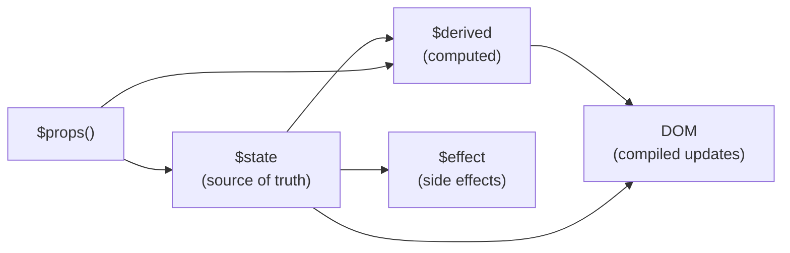
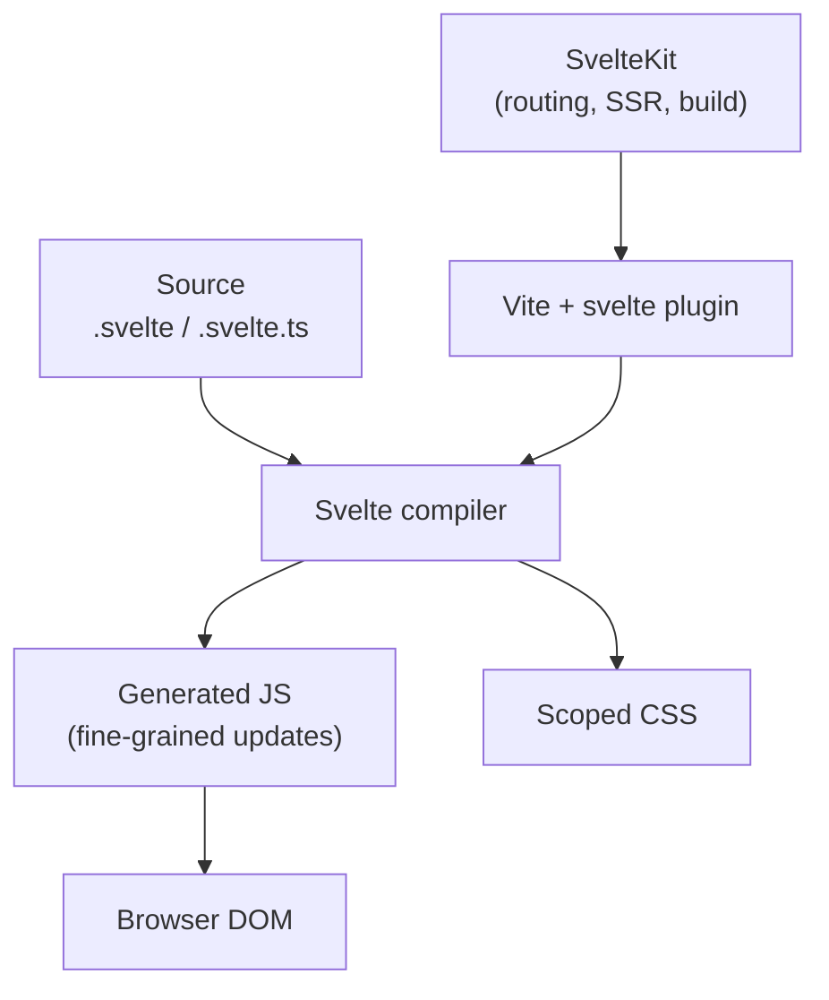
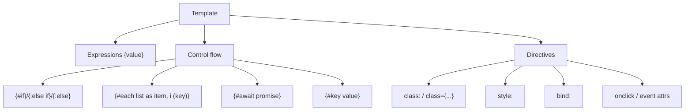
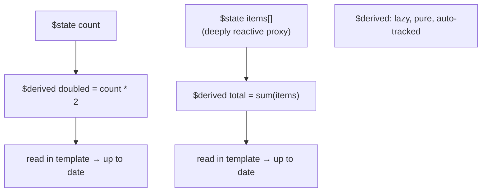
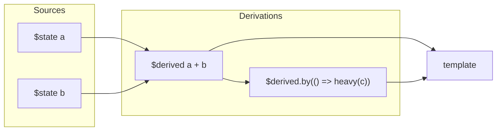

# Svelte 5 - Complete Professional Guide

> **Category:** 14_frameworks · **Language:** English

---

### Runes ($state/$derived/$effect), Components, Snippets, Stores, SvelteKit
**Edition for Svelte 5 (Runes)**

> **Reference book (English).** A professional, in-depth guide to **Svelte 5** and its runes-based reactivity model, for developers, architects, and teams building modern web applications. Based primarily on the official Svelte documentation (https://svelte.dev) and the SvelteKit documentation (https://kit.svelte.dev).
>
> **Scope notice:** this book teaches Svelte 5 the way it is meant to be written today — with **runes** (`$state`, `$derived`, `$effect`, `$props`, `$bindable`), **snippets** instead of slots, and **SvelteKit** as the application framework. It assumes working knowledge of HTML, CSS, and modern JavaScript/TypeScript. Each chapter follows the TO-BRAIN editorial standard (see `FILE_CONVENTIONS.md`).

---

## How to read this book

Progressive depth across five maturity levels, all centered on Svelte 5:

| Level | Profile | Parts |
|-------|---------|-------|
| 1 — Beginner | New to Svelte / coming from Svelte 4 | Part I |
| 2 — Intermediate | Reactivity with runes | Part II |
| 3 — Advanced | Snippets, composition, context, stores | Parts III–IV |
| 4 — Specialist | Transitions, actions, forms, TypeScript | Parts V–VI |
| 5 — Enterprise | SvelteKit, testing, performance, deployment | Parts VII–VIII |

**Target audience:** JavaScript and full-stack developers, software architects, frontend engineers, tech leads, and CTOs adopting Svelte 5 and SvelteKit.

**Structure of each chapter:** Introduction · Business context · Theoretical concepts · Architecture · Diagrams (Mermaid) · Real examples · Step by step · Complete code · Exercises · Challenges · Checklist · Best practices · Anti-patterns · Troubleshooting · Official references.

**Example format:** Scenario · Problem · Solution · Implementation · Result · Future improvements.

> **Note on prerequisites.** This book uses **idiomatic Svelte 5** throughout: `$props()` instead of `export let`, `$state`/`$derived` instead of top-level `let` + `$:`, and `{#snippet}`/`{@render}` instead of `<slot>`. Where a Svelte 5 feature replaces a Svelte 4 idiom, we name the lineage explicitly.

---

## Table of Contents

**Part I – Svelte 5 Foundations**
1. What is Svelte 5 — compiler, components, and the runes model
2. Component & template syntax (markup, control flow, attributes, classes, styles)
3. Reactivity with runes — `$state` and `$derived`

**Part II – Reactivity in Depth**
4. Effects with `$effect` (and when not to use them)
5. Props and bindings — `$props`, `$bindable`, two-way binding
6. Reactive collections, `$state.raw`, `$state.snapshot`, and `$derived.by`

**Part III – Composition & Templating**
7. Snippets and render tags (`{#snippet}`, `{@render}`) — replacing slots
8. Component composition and `<svelte:component>` / dynamic components
9. Context API (`setContext`/`getContext`) and component lifecycle

**Part IV – State Management**
10. Stores (`writable`, `readable`, `derived`, the `$` prefix)
11. Runes vs stores — choosing a state strategy; shareable rune modules

**Part V – DOM, Motion & Interaction**
12. Events and DOM (`onclick`, event delegation, event modifiers)
13. Transitions and animations (`transition:`, `in:`/`out:`, `animate:`, `crossfade`)
14. Actions (`use:`), forms and input bindings

**Part VI – TypeScript & Tooling**
15. TypeScript in Svelte 5 (typed props, generics, `Snippet` type)
16. Project tooling (Vite, `svelte-check`, the language server)

**Part VII – SvelteKit**
17. Routing and layouts (file-based routing, `+page`, `+layout`)
18. `load` functions, form actions, and SSR/CSR
19. Hooks, endpoints, and data flow

**Part VIII – Quality & Production**
20. Testing (Vitest unit/component tests, Playwright E2E)
21. Performance and deployment (adapters, prerendering, bundle size)

> **Status of this edition:** phased delivery (each part keeps the same depth standard). **Ready:** Part I (Ch. 1–3). **In progress:** Parts II–VIII.

---

## Part I – Svelte 5 Foundations

Part I gives you the mental model for Svelte 5. Svelte is a **compiler**: it turns components into small, efficient JavaScript that updates the DOM directly, with no virtual DOM. Svelte 5's defining change is **runes** — compiler-recognized symbols like `$state` and `$derived` that make reactivity explicit, granular, and usable outside `.svelte` files. By the end of Part I you can write components, use control flow in markup, and build reactive state and derived values the modern way.

---

## Chapter 1 — What is Svelte 5 — compiler, components, and the runes model

### 1.1 Introduction

Svelte is a UI framework that shifts work from the browser to a **compile step**. Instead of shipping a runtime that diffs a virtual DOM at runtime, Svelte analyzes your components at build time and generates imperative code that surgically updates the DOM. **Svelte 5** keeps that philosophy and rebuilds reactivity around **runes**: special functions such as `$state`, `$derived`, `$effect`, and `$props` that the compiler recognizes. The result is reactivity that is explicit, fine-grained, and no longer limited to the top level of a component.

### 1.2 Business context

For engineering leaders, Svelte's appeal is **small bundles, fast runtime, and low maintenance cost**. Because there is no virtual DOM and the framework compiles away, applications tend to ship less JavaScript and update efficiently. Svelte 5's runes also reduce a long-standing source of confusion (the Svelte 4 `$:` label and implicit reactivity), making code easier to read, review, and onboard new hires onto. The strategic read: Svelte 5 lowers the cost of building and maintaining interactive UIs while keeping performance high.

### 1.3 Theoretical concepts: the runes model

A **rune** is a compiler symbol — it looks like a function call prefixed with `$`, but it is not imported and is recognized syntactically. The core runes are:

- `$state(value)` — declares reactive state.
- `$derived(expression)` — declares a value computed from state; recomputes lazily.
- `$effect(fn)` — runs a side effect when its dependencies change.
- `$props()` — reads component inputs.
- `$bindable(value)` — marks a prop as two-way bindable.



Because runes are compiler-driven (not closures over a component instance), they work in `.svelte.js`/`.svelte.ts` modules too — so you can extract reusable reactive logic outside components.

### 1.4 Architecture: where Svelte 5 fits



Svelte the language compiles components; **Vite** (with `@sveltejs/vite-plugin-svelte`) is the build tool; **SvelteKit** is the application framework layered on top (Part VII).

### 1.5 Real example

**Scenario.** A team wants a tiny, self-contained counter to demonstrate Svelte 5's reactivity model to stakeholders.

**Problem.** They need to show that state, derived values, and DOM updates are explicit and minimal — no boilerplate, no virtual DOM.

**Solution.** A single component using `$state` and `$derived`.

**Implementation:**

```svelte
<script>
  let count = $state(0);
  let doubled = $derived(count * 2);

  function increment() {
    count += 1;
  }
</script>

<button onclick={increment}>
  Clicked {count} {count === 1 ? 'time' : 'times'}
</button>

<p>Doubled: {doubled}</p>
```

**Result.** Clicking the button mutates `count`; `doubled` recomputes automatically; only the affected text nodes update. The compiler generated the wiring — no manual subscriptions.

**Future improvements.** Extract the counter into a reusable rune module (Chapter 11) and add tests (Chapter 20).

### 1.6 Exercises

1. In one sentence, explain why Svelte is called a "compiler" rather than a "runtime framework."
2. Name the five core runes and what each one does.
3. Why can runes be used in `.svelte.ts` files but Svelte 4's `$:` could not?

### 1.7 Challenges

- **Challenge.** Take a small Svelte 4 component you know (using `export let` and `$:`) and rewrite it conceptually with `$props`, `$state`, and `$derived`. List every line that changed and why.

### 1.8 Checklist

- [ ] I can explain what the Svelte compiler produces.
- [ ] I can name the core runes and their purpose.
- [ ] I understand that runes are syntactic, not imported.
- [ ] I know the difference between Svelte the language and SvelteKit the framework.

### 1.9 Best practices

- Treat `$state` as your single source of truth and derive everything else.
- Prefer expression-based `$derived` over manual recomputation.
- Keep components small; let the compiler optimize updates for you.

### 1.10 Anti-patterns

- Reaching for `$effect` to compute a value that `$derived` should own.
- Carrying Svelte 4 habits (`export let`, top-level `$:`) into new Svelte 5 code.
- Manually syncing two pieces of state that could be one source plus a derivation.

### 1.11 Troubleshooting

| Symptom | Likely cause | Action |
|---------|--------------|--------|
| `$state is not defined` error | Trying to import runes | Don't import them; they're compiler keywords |
| State change doesn't update UI | Value declared with plain `let`, not `$state` | Declare it with `$state` |
| Derived value never updates | Used a plain variable instead of `$derived` | Wrap the expression in `$derived(...)` |
| Runes used in a `.js` file | File extension not rune-enabled | Rename to `.svelte.js` / `.svelte.ts` |

### 1.12 Official references

- Svelte overview: https://svelte.dev/docs/svelte/overview
- What are runes: https://svelte.dev/docs/svelte/what-are-runes
- `$state`: https://svelte.dev/docs/svelte/$state

---

## Chapter 2 — Component & template syntax

### 2.1 Introduction

A Svelte component lives in a single `.svelte` file with three optional sections: `<script>` for logic, markup for the template, and `<style>` for **scoped** CSS. The template is HTML augmented with **expressions** (`{value}`), **control-flow blocks** (`{#if}`, `{#each}`, `{#await}`, `{#key}`), and **directives** for attributes, classes, and styles. This chapter covers the markup language you write every day.

### 2.2 Business context

Template syntax is where most of a frontend team's time is spent. A clear, HTML-first template language with built-in control flow reduces cognitive load and review friction: there are no JSX quirks, no separate templating engine, and CSS is scoped by default — so teams ship features faster and break each other's styles less often.

### 2.3 Theoretical concepts: blocks and directives



Key points: `{#each}` supports a destructured item, an index, and a **keyed** expression `(item.id)` for stable identity; `{#await}` has `{:then}` and `{:catch}` branches; `{#key expr}` destroys and recreates its contents when `expr` changes.

### 2.4 Architecture: how a component composes its three sections

```mermaid
flowchart LR
    script["<script>\nstate + logic"] --> markup["markup\nexpressions + blocks"]
    markup --> style["<style>\nscoped CSS"]
    markup --> output["Component instance"]
    style --> output
    script --> output
```

The compiler scopes every selector in `<style>` to the component (via a generated class), so styles never leak.

### 2.5 Real example

**Scenario.** A dashboard must render a list of tasks, show a loading state while fetching, and visually mark completed items.

**Problem.** The view needs keyed iteration, an async branch, and conditional styling — all in one component, readable at a glance.

**Solution.** Use `{#await}` for the fetch, `{#each}` with a key for the list, and `class:` plus `style:` directives for state.

**Implementation:**

```svelte
<script>
  let { tasksPromise } = $props();
</script>

{#await tasksPromise}
  <p>Loading tasks…</p>
{:then tasks}
  <ul>
    {#each tasks as task (task.id)}
      <li class:done={task.completed} style:opacity={task.completed ? 0.6 : 1}>
        {task.title}
      </li>
    {:else}
      <li>No tasks yet.</li>
    {/each}
  </ul>
{:catch error}
  <p role="alert">Failed to load: {error.message}</p>
{/await}

<style>
  .done {
    text-decoration: line-through;
  }
</style>
```

**Result.** One component handles loading, empty, error, and success states with keyed, stable list rendering and scoped styles.

**Future improvements.** Move the fetch into a SvelteKit `load` function (Chapter 18) so the data arrives as a prop already resolved.

### 2.6 Exercises

1. Write an `{#each}` block that iterates `users` keyed by `user.id`, showing the index.
2. Add a `{:else}` branch to an `{#each}` and explain when it renders.
3. Convert a `class={isActive ? 'active' : ''}` attribute into a `class:active` directive.

### 2.7 Challenges

- **Challenge.** Build a component that renders a promise with `{#await}`, supports retry on error, and shows a skeleton placeholder while pending — using only template blocks and directives.

### 2.8 Checklist

- [ ] I can use `{#if}`, `{#each}`, `{#await}`, and `{#key}`.
- [ ] I always provide a key in `{#each}` for dynamic lists.
- [ ] I use `class:` and `style:` directives for conditional presentation.
- [ ] I understand that `<style>` is scoped by default.

### 2.9 Best practices

- Always key `{#each}` over dynamic data to preserve component state and DOM identity.
- Prefer `class:name` and `style:prop` directives over string concatenation.
- Use `{#await}` to express async UI states declaratively instead of manual flags.

### 2.10 Anti-patterns

- Unkeyed `{#each}` over lists that reorder or get items removed (causes state bugs).
- Inlining huge logic in template expressions instead of computing a `$derived`.
- Using global CSS to style component internals, defeating scoping.

### 2.11 Troubleshooting

| Symptom | Likely cause | Action |
|---------|--------------|--------|
| List items keep wrong state after reorder | Missing/incorrect `{#each}` key | Add a stable `(item.id)` key |
| Styles not applying | Selector references a child component's element | Use `:global(...)` deliberately, or style in the child |
| `{:catch}` never runs | The awaited value isn't a promise | Ensure the expression returns a promise |
| Block content not recreated on change | Need to force remount | Wrap it in `{#key expr}` |

### 2.12 Official references

- Basic markup: https://svelte.dev/docs/svelte/basic-markup
- `{#each}`: https://svelte.dev/docs/svelte/each
- `{#await}`: https://svelte.dev/docs/svelte/await
- Scoped styles: https://svelte.dev/docs/svelte/scoped-styles

---

## Chapter 3 — Reactivity with runes — `$state` and `$derived`

### 3.1 Introduction

Reactivity is the heart of any UI framework: when data changes, the view should update. In Svelte 5, you declare reactive data with **`$state`** and computed values with **`$derived`**. The compiler tracks which parts of the DOM depend on which state and updates only those. This chapter is the practical core of Svelte 5 — get these two runes right and most of your reactivity is correct by construction.

### 3.2 Business context

Reactive bugs — stale values, missed updates, infinite loops — are a major source of frontend defects and review churn. Svelte 5's `$state`/`$derived` model makes the dependency graph explicit and the recomputation rules predictable, which means fewer "why didn't this update?" tickets and faster, more confident code reviews.

### 3.3 Theoretical concepts: state, derivations, and deep reactivity

`$state` creates a reactive value. For objects and arrays, Svelte 5 makes them **deeply reactive** by wrapping them in a proxy — so mutating a nested property or pushing to an array triggers updates. `$derived(expr)` declares a value computed from other reactive values; it is **lazy** (recomputes only when read after a dependency changed) and must be free of side effects. For multi-statement logic, use `$derived.by(() => { ... })`.



A key rule: never write to a `$derived` value as if it were state — it is computed. If you need both a default-from-prop and local override, use the appropriate pattern (e.g., `$derived` for pure computation, or local `$state` initialized from a value).

### 3.4 Architecture: the reactive dependency graph



Svelte builds this graph at compile time and propagates changes from sources through derivations to the DOM, recomputing only what is actually read.

### 3.5 Real example

**Scenario.** A shopping cart must keep a list of line items and show a live subtotal, item count, and a free-shipping indicator.

**Problem.** Several values depend on the same array; mutating the array (add/remove/update quantity) must update everything consistently without manual bookkeeping.

**Solution.** Hold the array in `$state` (deeply reactive) and express subtotal, count, and the shipping flag as `$derived` values.

**Implementation:**

```svelte
<script>
  let items = $state([
    { id: 1, name: 'Keyboard', price: 80, qty: 1 },
    { id: 2, name: 'Mouse', price: 30, qty: 2 }
  ]);

  let subtotal = $derived(
    items.reduce((sum, i) => sum + i.price * i.qty, 0)
  );
  let count = $derived(items.reduce((n, i) => n + i.qty, 0));
  let freeShipping = $derived(subtotal >= 100);

  function addQty(id, delta) {
    const item = items.find((i) => i.id === id);
    if (item) item.qty = Math.max(0, item.qty + delta);
  }
</script>

<ul>
  {#each items as item (item.id)}
    <li>
      {item.name} — ${item.price} × {item.qty}
      <button onclick={() => addQty(item.id, 1)}>+</button>
      <button onclick={() => addQty(item.id, -1)}>−</button>
    </li>
  {/each}
</ul>

<p>Items: {count}</p>
<p>Subtotal: ${subtotal}</p>
<p>{freeShipping ? 'You qualify for free shipping!' : `Add $${100 - subtotal} for free shipping`}</p>
```

**Result.** Mutating `item.qty` directly updates the subtotal, count, and shipping message automatically — the proxy makes the nested mutation reactive, and all three derivations recompute.

**Future improvements.** Extract cart logic into a `.svelte.ts` rune module (Chapter 11) so it is reusable and testable independently of the component.

### 3.6 Exercises

1. Declare `$state` for a `temperatureC` and a `$derived` `temperatureF`.
2. Explain why `$derived` must be free of side effects.
3. Show how pushing to a `$state` array triggers a UI update without reassignment.

### 3.7 Challenges

- **Challenge.** Build a "todo stats" panel: a `$state` array of todos and three `$derived` values (total, completed, percent complete) that all stay correct as you toggle items. Then convert the percent calculation to `$derived.by` and explain when that form is preferable.

### 3.8 Checklist

- [ ] I declare reactive values with `$state`.
- [ ] I compute values with `$derived` (or `$derived.by` for multi-statement logic).
- [ ] I never write to a `$derived` value.
- [ ] I rely on deep reactivity for object/array mutation instead of reassigning unnecessarily.

### 3.9 Best practices

- Make `$state` the single source of truth; derive everything else.
- Keep `$derived` expressions pure and cheap; move heavy work into `$derived.by`.
- Mutate deeply reactive objects/arrays directly — Svelte tracks the change.

### 3.10 Anti-patterns

- Duplicating derived data into separate `$state` and syncing it by hand.
- Putting side effects (logging, fetching, DOM writes) inside `$derived`.
- Reassigning whole objects just to "trigger" reactivity that proxies already handle.

### 3.11 Troubleshooting

| Symptom | Likely cause | Action |
|---------|--------------|--------|
| Nested mutation not reactive | Value not created with `$state` | Declare the parent object/array with `$state` |
| `$derived` value seems stale | Treating it as writable state | Make it computed-only; move mutable parts to `$state` |
| Infinite update loop | Side effect inside `$derived` writing back to state | Move the side effect to `$effect` |
| Need a non-reactive snapshot | Passing proxy to external code | Use `$state.snapshot(value)` |

### 3.12 Official references

- `$state`: https://svelte.dev/docs/svelte/$state
- `$derived`: https://svelte.dev/docs/svelte/$derived
- `$state.snapshot`: https://svelte.dev/docs/svelte/$state#$state.snapshot
- Reactivity fundamentals: https://svelte.dev/docs/svelte/what-are-runes

---

> **End of Part I.** You now have the Svelte 5 mental model (compiler + runes), the template language (expressions, control-flow blocks, and directives), and the reactive core (`$state` and `$derived`). **Part II — Reactivity in Depth** (Chapters 4–6) covers `$effect` and when to avoid it, props and two-way binding with `$props`/`$bindable`, and advanced reactivity (`$state.raw`, `$state.snapshot`, `$derived.by`, reactive collections).

<!--APPEND-PARTE-II-->
