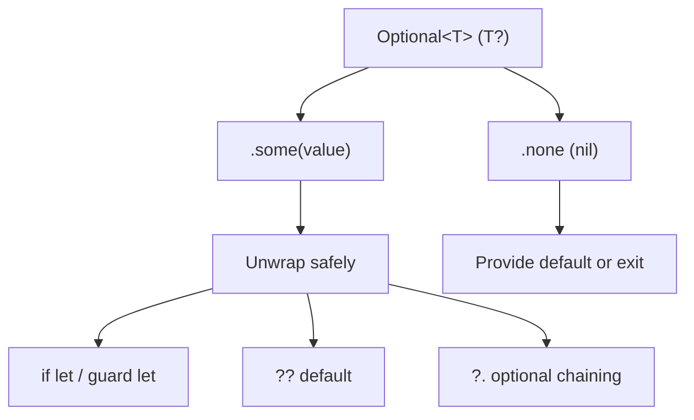
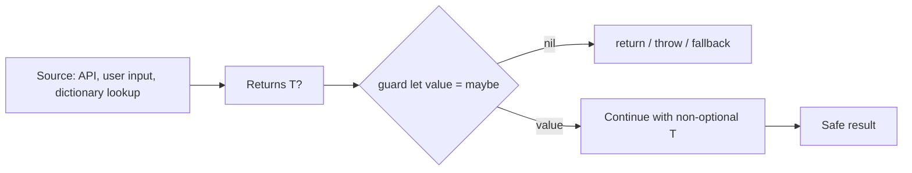
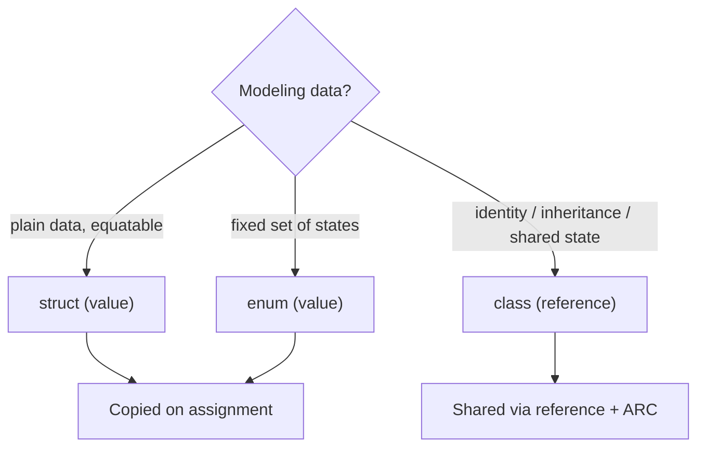
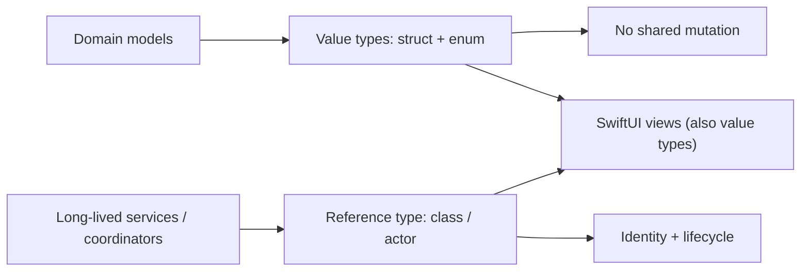
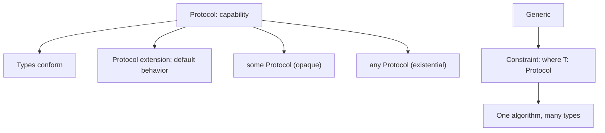
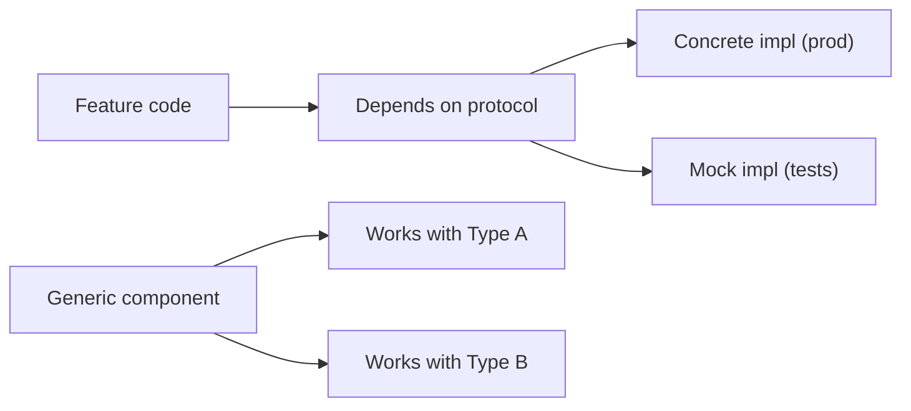

# Swift 6 and SwiftUI - Complete Professional Guide

> **Category:** 14_frameworks · **Language:** English

---

### Swift language, Optionals, Protocols, Concurrency (async/await, actors), SwiftUI, iOS app architecture
**Edition for Swift 6 + SwiftUI (Xcode, iOS)**

> **Reference book (English).** Based on the official Apple documentation (developer.apple.com, *The Swift Programming Language*). It teaches the modern Swift 6 language and the SwiftUI framework as a coherent stack for building iOS, iPadOS, and macOS applications, with emphasis on safety, value semantics, and the strict-concurrency model introduced in Swift 6.
>
> **Scope notice:** this book covers the Swift language and SwiftUI together as a production stack. It assumes general programming experience but teaches Swift-specific idioms from first principles. Each chapter follows the TO-BRAIN editorial standard (see `FILE_CONVENTIONS.md`).

---

## How to read this book

Progressive depth across five maturity levels:

| Level | Profile | Parts |
|-------|---------|-------|
| 1 — Beginner | New to Swift / iOS | Part I |
| 2 — Intermediate | Types, errors, closures | Parts II–III |
| 3 — Advanced | Concurrency, actors, Sendable | Part IV |
| 4 — Specialist | SwiftUI views, state, navigation | Parts V–VI |
| 5 — Enterprise | Data, testing, performance, release | Parts VII–VIII |

**Target audience:** mobile developers, full-stack engineers moving to iOS, software architects, tech leads, and CTOs adopting Swift 6 and SwiftUI for Apple-platform apps.

**Structure of each chapter:** Introduction · Business context · Theoretical concepts · Architecture · Diagrams (Mermaid) · Real examples · Step by step · Complete code · Exercises · Challenges · Checklist · Best practices · Anti-patterns · Troubleshooting · Official references.

**Example format:** Scenario · Problem · Solution · Implementation · Result · Future improvements.

> **Note on prerequisites.** You should be comfortable with general programming concepts (variables, functions, control flow). Swift's distinctive ideas — optionals, value vs reference types, protocols, and strict concurrency — are taught here from the ground up.

---

## Table of Contents

**Part I – Swift Language Foundations**
1. Swift basics, variables, and optionals
2. Types and value semantics (structs, classes, enums)
3. Protocols and generics

**Part II – Errors & Functional Swift**
4. Error handling (`throws`, `Result`, `try`/`catch`)
5. Closures and functional patterns (map/filter/reduce, escaping, capture)

**Part III – Modern Language Features**
6. Property wrappers, key paths, and result builders

**Part IV – Swift Concurrency**
7. `async`/`await` and structured concurrency
8. Actors, `Sendable`, and strict concurrency in Swift 6

**Part V – SwiftUI Fundamentals**
9. The `View` protocol, layout, and modifiers
10. Lists, navigation, and `NavigationStack`

**Part VI – State Management**
11. `@State`, `@Binding`, and `@Environment`
12. The Observation framework (`@Observable`) and data flow

**Part VII – Data & Persistence**
13. Networking with `URLSession` and `Codable`
14. Persistence with SwiftData

**Part VIII – Quality & Delivery**
15. Testing with Swift Testing and XCTest
16. Performance, app lifecycle, and distribution

> **Status of this edition:** phased delivery (each part keeps the same depth standard). **Ready:** Part I (Ch. 1–3). **In progress:** Parts II–VIII.

---

# Part I – Swift Language Foundations

Part I builds the bedrock of everything that follows: how Swift models values, how it eliminates whole classes of bugs with **optionals**, how **value semantics** differ from reference semantics, and how **protocols and generics** let you write reusable, type-safe code. Master these three chapters and the rest of the stack — concurrency and SwiftUI — will feel like natural extensions rather than new languages.

---

## Chapter 1 — Swift basics, variables, and optionals

### 1.1 Introduction

Swift is a modern, statically typed, compiled language designed for safety and clarity. Its single most distinctive safety feature is the **optional**: a type that explicitly models the presence or absence of a value, replacing the unchecked `null` of older languages. This chapter covers the core syntax — `let`/`var`, type inference, fundamental types — and then dives deep into optionals, because understanding them is the gateway to writing idiomatic Swift.

### 1.2 Business context

Crashes from null/nil dereferences are among the most common production failures in mobile apps, and each one damages user trust and store ratings. Swift's optional system pushes the cost of handling "no value" to **compile time** instead of runtime: the compiler forces you to acknowledge that a value might be absent before you use it. For an engineering organization this means fewer null-related crashes shipped, more predictable code review, and onboarding that is faster because the type signature documents intent.

### 1.3 Theoretical concepts

Swift declares constants with `let` and variables with `var`. Prefer `let` — immutability is the default mindset. Types are usually **inferred**, but can be annotated. Fundamental types include `Int`, `Double`, `Bool`, `String`, and collections like `Array`, `Dictionary`, and `Set`.

An **optional** of type `T` is written `T?` and is really an enum with two cases: `.some(T)` or `.none` (`nil`). You unwrap optionals safely with **optional binding** (`if let`, `guard let`), the **nil-coalescing** operator (`??`), **optional chaining** (`?.`), and — only when you can prove non-nil — **force unwrapping** (`!`).



The mental model: an optional is a **box** that may or may not contain a value. You cannot use the contents until you open the box and confirm something is inside.

### 1.4 Architecture



The recommended architecture is to **narrow optionality early** at the boundary of a function (with `guard let`) so the rest of the body works with plain, non-optional values.

### 1.5 Real example

**Scenario.** A profile screen receives a raw dictionary parsed from a configuration file and must build a display name.

**Problem.** Several fields may be missing; naive force-unwrapping (`dict["name"]!`) would crash whenever a key is absent.

**Solution.** Use `guard let`, optional chaining, and nil-coalescing to handle absence explicitly and produce a safe fallback.

**Implementation:**

```swift
struct UserProfile {
    let displayName: String
    let city: String
}

func makeProfile(from raw: [String: String]) -> UserProfile? {
    // Narrow optionality at the boundary.
    guard let name = raw["firstName"], !name.isEmpty else {
        return nil
    }

    // Optional chaining + nil-coalescing for non-critical fields.
    let lastInitial = raw["lastName"]?.first.map { String($0) + "." } ?? ""
    let city = raw["city"] ?? "Unknown"

    let full = lastInitial.isEmpty ? name : "\(name) \(lastInitial)"
    return UserProfile(displayName: full, city: city)
}

let p = makeProfile(from: ["firstName": "Ada", "lastName": "Lovelace"])
print(p?.displayName ?? "no profile")  // "Ada L."
```

**Result.** No possible crash: a missing first name yields `nil` (the caller decides what to do), and missing optional fields degrade gracefully.

**Future improvements.** Replace the stringly-typed dictionary with a `Codable` model (Chapter 13) so parsing and validation happen in one typed step.

### 1.6 Exercises

1. Rewrite a forced unwrap `array.first!` using `guard let` so the function returns early when the array is empty.
2. Given `let score: Int? = nil`, use `??` to print `score` or `0`.
3. Explain why `let` is preferred over `var` and give one case where `var` is necessary.

### 1.7 Challenges

- **Challenge.** Build a function `firstValidEmail(_ candidates: [String?]) -> String?` that returns the first non-nil, non-empty, `@`-containing string, using `compactMap` and `first(where:)`.

### 1.8 Checklist

- [ ] I can declare constants and variables and rely on type inference.
- [ ] I understand that `T?` is an enum with `.some`/`.none`.
- [ ] I can unwrap with `if let`, `guard let`, `??`, and `?.`.
- [ ] I avoid force unwrap (`!`) except when non-nil is provable.

### 1.9 Best practices

- Default to `let`; reach for `var` only when mutation is required.
- Use `guard let` to unwrap and exit early, keeping the happy path unindented.
- Prefer `??` for sensible defaults over branching on `nil`.
- Let type inference reduce noise, but annotate public API for clarity.

### 1.10 Anti-patterns

- Force-unwrapping (`!`) values from external input (network, files, user).
- Nesting many `if let` pyramids instead of using `guard` or comma-separated bindings.
- Using empty-string or `-1` sentinels where an optional models absence more honestly.

### 1.11 Troubleshooting

| Symptom | Likely cause | Action |
|---------|--------------|--------|
| `Unexpectedly found nil while unwrapping an Optional` | Force unwrap of a `nil` value | Replace `!` with `guard let`/`if let` |
| "Value of optional type must be unwrapped" | Using `T?` where `T` is expected | Unwrap or supply `??` default |
| Comparison always false | Comparing `Optional` to a literal without unwrapping | Unwrap first, or use pattern matching |
| Stringly-typed lookups feel fragile | Dictionary of `String` instead of a model | Move to a `Codable` struct |

### 1.12 Official references

- The Basics: https://docs.swift.org/swift-book/documentation/the-swift-programming-language/thebasics/
- Optional Chaining: https://docs.swift.org/swift-book/documentation/the-swift-programming-language/optionalchaining/
- Swift Standard Library — Optional: https://developer.apple.com/documentation/swift/optional

---

## Chapter 2 — Types and value semantics (structs, classes, enums)

### 2.1 Introduction

Swift offers three primary ways to model data: **structs**, **classes**, and **enums**. The defining distinction is **value semantics** (structs and enums are copied on assignment) versus **reference semantics** (classes share a single instance). Choosing correctly is one of the highest-leverage decisions in a Swift codebase, and Swift — and SwiftUI especially — is biased strongly toward value types.

### 2.2 Business context

Shared mutable state is the source of an enormous share of concurrency bugs and "spooky action at a distance" defects. Value semantics make state changes **local and predictable**: when you pass a struct, the receiver gets an independent copy, so it cannot mutate yours by accident. For teams, this means easier reasoning during code review, fewer aliasing bugs, and code that fits naturally with Swift's strict-concurrency model (Part IV) where copyable value types are far easier to make safe to send across threads.

### 2.3 Theoretical concepts

- **Struct** — a value type. Copied on assignment/passing. Gets a free memberwise initializer. Cannot inherit. Ideal for data models.
- **Class** — a reference type. Assignment shares the instance; supports inheritance and identity (`===`). Needs explicit deinit/ARC awareness.
- **Enum** — a value type that models a fixed set of cases, optionally with **associated values**; extremely powerful for state machines and modeling alternatives. Swift enums can have methods and computed properties.

Swift uses **Automatic Reference Counting (ARC)** for classes; **value types do not participate in ARC** the same way and avoid retain cycles by construction.



### 2.4 Architecture



The idiomatic architecture: model your **domain as value types**, and reserve **classes (or actors)** for objects that genuinely need identity, inheritance, or long-lived shared state.

### 2.5 Real example

**Scenario.** A shopping cart needs line items and a computed total, plus a typed status for the checkout flow.

**Problem.** A class-based cart was accidentally mutated from two places, producing inconsistent totals.

**Solution.** Model the cart and items as value types and the checkout state as an enum with associated values, so copies are independent and invalid states are unrepresentable.

**Implementation:**

```swift
struct LineItem: Identifiable, Equatable {
    let id = UUID()
    let name: String
    let price: Decimal
    var quantity: Int

    var subtotal: Decimal { price * Decimal(quantity) }
}

struct Cart: Equatable {
    private(set) var items: [LineItem] = []

    var total: Decimal { items.reduce(0) { $0 + $1.subtotal } }

    mutating func add(_ item: LineItem) {
        if let i = items.firstIndex(where: { $0.name == item.name }) {
            items[i].quantity += item.quantity
        } else {
            items.append(item)
        }
    }
}

enum CheckoutState: Equatable {
    case idle
    case processing
    case success(orderID: String)
    case failure(reason: String)
}

var cart = Cart()
cart.add(LineItem(name: "Pencil", price: 1.50, quantity: 3))
let snapshot = cart           // independent copy
cart.add(LineItem(name: "Pencil", price: 1.50, quantity: 1))
print(snapshot.total)         // 4.50 — snapshot unaffected
print(cart.total)             // 6.00
```

**Result.** Mutations stay local; `snapshot` is unaffected by later changes. The `CheckoutState` enum makes illegal combinations (e.g., "success but with an error reason") impossible to express.

**Future improvements.** Conform `Cart` and `LineItem` to `Codable` for persistence (Chapter 14) and to `Sendable` for safe use across concurrency domains (Chapter 8).

### 2.6 Exercises

1. Convert a class `Point { var x; var y }` to a struct and explain how copy behavior changes.
2. Add a computed property `isEmpty` to `Cart`.
3. Model a traffic light as an enum and write a method `next()` that cycles its cases.

### 2.7 Challenges

- **Challenge.** Implement a generic `Stack<Element>` as a struct with `push`, `pop`, and `peek`, conforming to `Equatable` where `Element: Equatable`.

### 2.8 Checklist

- [ ] I can explain value vs reference semantics with a copy example.
- [ ] I default to `struct` for data models.
- [ ] I use `enum` with associated values to model exclusive states.
- [ ] I know when a `class` (identity, inheritance) is actually required.

### 2.9 Best practices

- Prefer structs and enums; use classes only for identity or shared lifecycle.
- Mark struct methods that change state with `mutating`, and keep mutation explicit.
- Use enums with associated values to make invalid states unrepresentable.
- Conform models to `Equatable`/`Hashable` to play well with SwiftUI diffing.

### 2.10 Anti-patterns

- Reaching for `class` by habit, creating accidental shared mutable state.
- Using booleans/flags where an enum would model the states precisely.
- Giving structs reference-type "managers" inside, defeating value semantics.

### 2.11 Troubleshooting

| Symptom | Likely cause | Action |
|---------|--------------|--------|
| Changes "leak" between two variables | Using a `class` (shared reference) | Switch to `struct` for value semantics |
| "Cannot assign to property: 'self' is immutable" | Mutating struct from non-`mutating` method | Mark the method `mutating` |
| Retain cycle / memory growth | Strong reference cycle between classes | Use `weak`/`unowned`, or value types |
| SwiftUI not redrawing on change | Model not `Equatable`/diffing fails | Conform model to `Equatable` |

### 2.12 Official references

- Structures and Classes: https://docs.swift.org/swift-book/documentation/the-swift-programming-language/classesandstructures/
- Enumerations: https://docs.swift.org/swift-book/documentation/the-swift-programming-language/enumerations/
- Automatic Reference Counting: https://docs.swift.org/swift-book/documentation/the-swift-programming-language/automaticreferencecounting/

---

## Chapter 3 — Protocols and generics

### 3.1 Introduction

Protocols define **what a type can do** without prescribing **what it is**, and generics let you write code that works across many types while staying fully type-safe. Together they enable Swift's signature style — **protocol-oriented programming** — where behavior is composed from small capabilities rather than inherited from a class hierarchy. SwiftUI itself is built on this foundation: a `View` is anything conforming to the `View` protocol.

### 3.2 Business context

Class inheritance hierarchies become brittle as systems grow; a deep hierarchy couples unrelated features and resists change. Protocols and generics let teams build **composable, testable** components: dependencies are expressed as protocols (easy to mock in tests), and algorithms are written once generically (less duplicated code to maintain). The payoff is lower coupling, higher test coverage, and faster, safer refactoring.

### 3.3 Theoretical concepts

A **protocol** declares requirements (properties, methods). Types **conform** to protocols. **Protocol extensions** provide default implementations, enabling composition without inheritance. **Generics** parameterize types and functions (`func f<T>(...)`), and **constraints** (`where T: Comparable`) restrict them. Swift also offers **opaque types** (`some Protocol`) for hidden but concrete return types, and **existentials** (`any Protocol`) for type-erased values.



### 3.4 Architecture



The recommended architecture: **program to protocols** for dependencies (enabling test doubles) and use **generics** to avoid duplicating logic across concrete types.

### 3.5 Real example

**Scenario.** A feed screen must load items, and the team wants to test it without hitting the real network.

**Problem.** The view model called `URLSession` directly, so tests were slow, flaky, and required connectivity.

**Solution.** Express the dependency as a protocol with an associated generic method; provide a real and a mock implementation, and write the generic logic once.

**Implementation:**

```swift
protocol Repository {
    associatedtype Item
    func fetchAll() async throws -> [Item]
}

struct Article: Identifiable, Equatable {
    let id: Int
    let title: String
}

// Production conformance.
struct RemoteArticleRepository: Repository {
    let load: () async throws -> [Article]
    func fetchAll() async throws -> [Article] { try await load() }
}

// Test double.
struct StubArticleRepository: Repository {
    let items: [Article]
    func fetchAll() async throws -> [Article] { items }
}

// Generic, reusable logic with a constraint.
func sortedTitles<R: Repository>(from repo: R) async throws -> [String]
where R.Item == Article {
    let items = try await repo.fetchAll()
    return items.map(\.title).sorted()
}

// Usage in a test:
let stub = StubArticleRepository(items: [
    Article(id: 1, title: "Beta"),
    Article(id: 2, title: "Alpha"),
])
let titles = try await sortedTitles(from: stub)  // ["Alpha", "Beta"]
```

**Result.** Tests run instantly and deterministically against `StubArticleRepository`; production uses `RemoteArticleRepository`. The `sortedTitles` algorithm is written once and constrained to the right item type.

**Future improvements.** Replace the associated type with `any Repository<Article>` (primary associated types) where the call site needs heterogeneous storage, and inject the repository through SwiftUI's `@Environment` (Chapter 11).

### 3.6 Exercises

1. Define a protocol `Named { var name: String { get } }` and provide a default `greeting` via a protocol extension.
2. Write a generic `func maxItem<T: Comparable>(_ items: [T]) -> T?`.
3. Explain the difference between `some View` and `any View` in one sentence each.

### 3.7 Challenges

- **Challenge.** Design a `Cache` protocol with associated `Key: Hashable` and `Value`, then provide an in-memory generic implementation and a no-op test stub.

### 3.8 Checklist

- [ ] I can declare a protocol and conform a type to it.
- [ ] I can add default behavior with a protocol extension.
- [ ] I can write a generic function with a `where` constraint.
- [ ] I understand `some` (opaque) vs `any` (existential).

### 3.9 Best practices

- Compose behavior from small protocols rather than deep class inheritance.
- Use protocol extensions for shared default implementations.
- Express dependencies as protocols to enable test doubles.
- Prefer `some` for return types; use `any` only when type erasure is required.

### 3.10 Anti-patterns

- "God protocols" with dozens of requirements that every type must stub.
- Overusing `any` existentials where generics would be faster and clearer.
- Putting concrete types in public APIs where a protocol would decouple callers.

### 3.11 Troubleshooting

| Symptom | Likely cause | Action |
|---------|--------------|--------|
| "Protocol can only be used as a generic constraint" | Protocol with associated type used as a bare type | Use generics or `any` with primary associated type |
| "Type does not conform to protocol" | Missing required member | Implement the requirement or add it via extension |
| Opaque return type mismatch | Returning different concrete types from `some` | Return one concrete type, or use `any` |
| Generic call won't compile | Missing constraint | Add `where T: ...` to satisfy the operation |

### 3.12 Official references

- Protocols: https://docs.swift.org/swift-book/documentation/the-swift-programming-language/protocols/
- Generics: https://docs.swift.org/swift-book/documentation/the-swift-programming-language/generics/
- Opaque and Boxed Protocol Types: https://docs.swift.org/swift-book/documentation/the-swift-programming-language/opaquetypes/

---

> **End of Part I.** You now have Swift's safety foundations: variables and **optionals** that move "no value" handling to compile time, **value vs reference semantics** with the struct/enum bias that makes state predictable, and **protocols and generics** for composable, testable, type-safe design. **Part II — Errors & Functional Swift** (Chapters 4–5) builds on these with `throws`/`Result` error handling and closure-based functional patterns, setting the stage for Swift's concurrency model in Part IV.

<!--APPEND-PARTE-II-->
