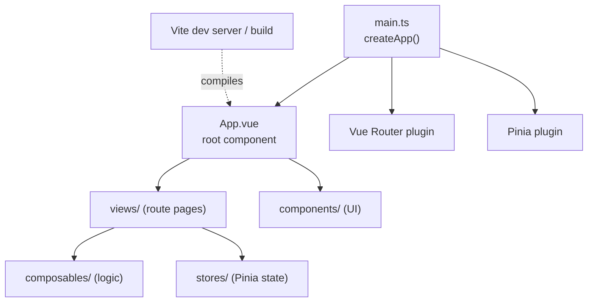
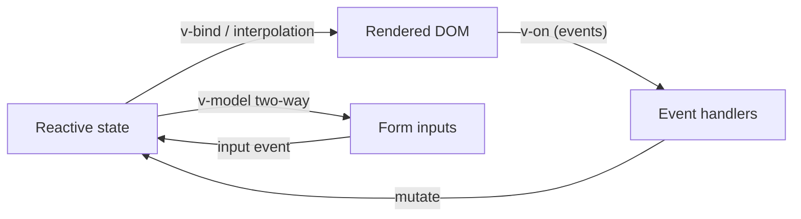
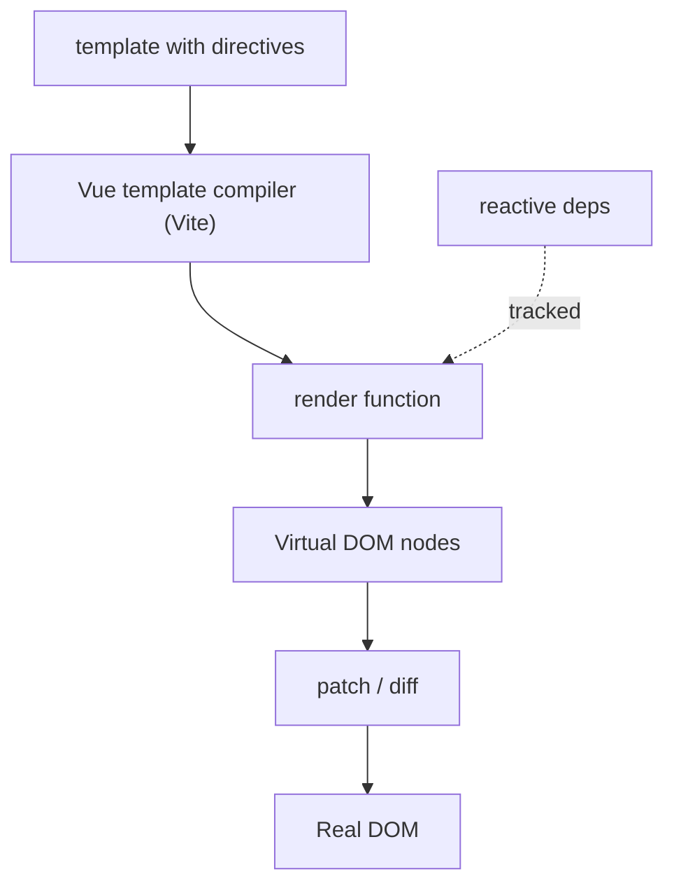
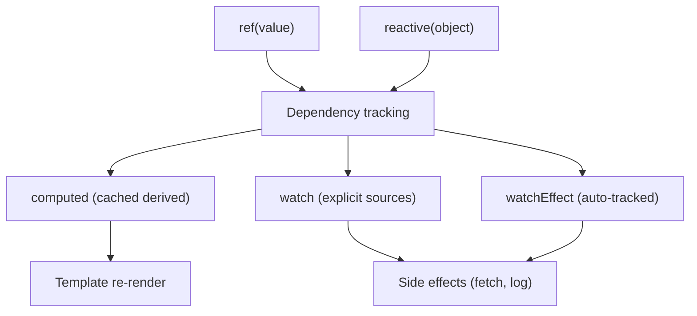
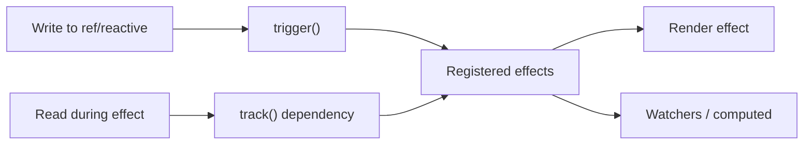

# Vue 3 - Complete Professional Guide

> **Category:** 14_frameworks · **Language:** English

---

### Composition API, Reactivity, Single-File Components, Pinia, Vue Router, Vite
**Edition for Vue 3.x (Composition API, `<script setup>`)**

> **Reference book (English).** Based on the official Vue documentation (https://vuejs.org), the Vue Router docs (https://router.vuejs.org), the Pinia docs (https://pinia.vuejs.org), and the Vite docs (https://vitejs.dev). It targets developers, architects, and teams building production applications with Vue 3 and the modern, signal-like reactivity system.
>
> **Scope notice:** this is a **modern-Vue** book. It teaches Vue 3 the way it is written today — Single-File Components with `<script setup>`, the Composition API, and a Vite-based toolchain — rather than the legacy Options API or Vue 2 patterns. Where a concept has an Options API equivalent, the lineage is noted, but every example is idiomatic Vue 3. Each chapter follows the TO-BRAIN editorial standard (see `FILE_CONVENTIONS.md`).

---

## How to read this book

Progressive depth across five maturity levels, all centered on Vue 3:

| Level | Profile | Parts |
|-------|---------|-------|
| 1 — Beginner | New to Vue or coming from Vue 2 | Part I |
| 2 — Intermediate | Reactivity & component model | Parts II–III |
| 3 — Advanced | Routing, state, forms, composables | Parts IV–V |
| 4 — Specialist | Async, testing, performance | Parts VI–VII |
| 5 — Enterprise | SSR, production, architecture | Part VIII |

**Target audience:** Java and full-stack developers, software architects, frontend engineers, tech leads, and CTOs adopting or scaling Vue 3.

**Structure of each chapter:** Introduction · Business context · Theoretical concepts · Architecture · Diagrams (Mermaid) · Real examples · Step by step · Complete code · Exercises · Challenges · Checklist · Best practices · Anti-patterns · Troubleshooting · Official references.

**Example format:** Scenario · Problem · Solution · Implementation · Result · Future improvements.

> **Note on prerequisites.** This book assumes working knowledge of modern JavaScript (ES2020+), basic TypeScript, and HTML/CSS. No Vue 2 experience is required, but readers migrating from Vue 2 will find lineage notes where the Composition API replaces the Options API.

---

## Table of Contents

**Part I – Foundations of Vue 3**
1. Vue 3 overview, mental model, and the Vite toolchain
2. Template syntax and directives (`v-bind`, `v-on`, `v-if`, `v-for`, `v-model`)
3. Reactivity fundamentals (`ref`, `reactive`, `computed`, `watch`, `watchEffect`)

**Part II – The Composition API**
4. `<script setup>` in depth
5. Composables: extracting and reusing stateful logic
6. Provide / inject and dependency flow

**Part III – Components**
7. Props, emits, and component contracts
8. Slots: default, named, and scoped
9. The component lifecycle and template refs

**Part IV – Routing & State**
10. Vue Router: routes, navigation, and guards
11. Pinia: stores, getters, and actions
12. Forms and `v-model` patterns

**Part V – Patterns & Reuse**
13. Custom directives and plugins
14. Async components and dynamic imports
15. Suspense and async data loading

**Part VI – Testing**
16. Unit testing with Vitest and Vue Test Utils
17. Component and end-to-end testing strategy

**Part VII – Performance**
18. Rendering performance and reactivity costs
19. Bundle optimization and lazy loading

**Part VIII – SSR & Production**
20. SSR and Nuxt overview
21. Production build, deployment, and architecture

> **Status of this edition:** phased delivery (each part keeps the same depth standard). **Ready:** Part I (Ch. 1–3). **In progress:** Parts II–VIII.

---

## Part I – Foundations of Vue 3

Part I builds the mental model you need before writing serious Vue. Vue 3 is a **reactive, component-oriented** framework: you describe UI declaratively in Single-File Components, and a fine-grained reactivity system keeps the DOM in sync with your state. The three pillars covered here — the toolchain and mental model, template syntax, and reactivity — are the foundation every later chapter builds on. Master these and the Composition API, routing, and state management become natural extensions rather than new concepts.

---

## Chapter 1 — Vue 3 overview, mental model, and the Vite toolchain

### 1.1 Introduction

Vue 3 is a progressive JavaScript framework for building user interfaces. "Progressive" means you can adopt it incrementally — from a single `<script>` tag on a static page up to a full single-page application with routing, state management, and server-side rendering. The modern way to write Vue 3 is the **Composition API** inside **Single-File Components (SFCs)**, compiled by **Vite**. This chapter establishes the mental model and gets you oriented in the toolchain so the rest of the book has a stable base.

### 1.2 Business context

For engineering leaders, Vue's appeal is a low adoption curve with a high performance ceiling. Teams can ship value quickly because SFCs colocate template, logic, and styles in one readable file, and Vite gives near-instant dev feedback. The reactivity system reduces a whole class of "stale UI" bugs without manual DOM manipulation. The strategic read: Vue 3 lowers onboarding cost for new hires while remaining suitable for large, long-lived applications when paired with Pinia and Vue Router.

### 1.3 Theoretical concepts

A Vue application is a tree of **components**. Each component owns reactive **state**, exposes it to a **template**, and the framework re-renders the relevant DOM when state changes. The core building block is the **Single-File Component** (`.vue`), which has three blocks: `<template>`, `<script setup>`, and `<style>`.

```mermaid
flowchart TB
    sfc[".vue Single-File Component"] --> tmpl["template<br/>declarative HTML"]
    sfc --> script["script setup<br/>reactive state + logic"]
    sfc --> style["style<br/>scoped CSS"]
    script -->|exposes state| tmpl
    tmpl -->|emits events| script
    script -->|state change| reactivity["Reactivity system"]
    reactivity -->|re-render| dom["Real DOM"]
```

The unifying idea: **state is the source of truth**, and the template is a pure projection of that state. You never imperatively touch the DOM; you change state and let Vue reconcile.

### 1.4 Architecture

A typical Vue 3 project is organized around an entry point that creates the app instance and mounts it, with features split into components, composables, stores, and routes.



### 1.5 Real example

**Scenario.** A team needs a minimal but real "hello, reactive" app to validate the toolchain before building features.

**Problem.** They want to confirm the SFC structure, reactivity, and event handling all work end to end.

**Solution.** A single counter SFC created in a Vite-scaffolded project (`npm create vue@latest`).

**Implementation:**

```vue
<script setup lang="ts">
import { ref, computed } from 'vue'

const count = ref(0)
const doubled = computed(() => count.value * 2)

function increment() {
  count.value++
}
</script>

<template>
  <section class="counter">
    <p>Count: {{ count }} (doubled: {{ doubled }})</p>
    <button type="button" @click="increment">Increment</button>
  </section>
</template>

<style scoped>
.counter {
  font-family: system-ui, sans-serif;
}
</style>
```

**Result.** Clicking the button increments `count`; `doubled` and both interpolations update automatically. No DOM code was written.

**Future improvements.** Extract the counter into a reusable composable (Chapter 5) and add a test (Chapter 16).

### 1.6 Exercises

1. Scaffold a project with `npm create vue@latest` and identify the role of `main.ts`, `App.vue`, and `index.html`.
2. Add a second computed property that shows whether `count` is even or odd.
3. Explain in one sentence why no `document.querySelector` is needed.

### 1.7 Challenges

- **Challenge.** Without looking it up, sketch the data flow from a button click to a DOM update, naming each stage (event handler → state change → reactivity → re-render).

### 1.8 Checklist

- [ ] I can scaffold a Vue 3 + Vite project.
- [ ] I understand the three blocks of an SFC.
- [ ] I can explain "state is the source of truth."
- [ ] I know what `<script setup>` is for.

### 1.9 Best practices

- Use `npm create vue@latest` for new projects to get the official, Vite-based setup.
- Prefer `<script setup>` and the Composition API for all new code.
- Keep components small and focused; colocate logic with the template it serves.

### 1.10 Anti-patterns

- Manipulating the DOM directly instead of changing state.
- Mixing Options API and `<script setup>` in the same component without reason.
- Treating Vue 3 like Vue 2 (e.g., reaching for `this` inside `<script setup>`).

### 1.11 Troubleshooting

| Symptom | Likely cause | Action |
|---------|--------------|--------|
| `count` doesn't update in template | Used a plain variable, not a `ref` | Wrap state in `ref()` |
| Blank page, no errors | App not mounted | Confirm `createApp(App).mount('#app')` |
| Styles leak to other components | `<style>` without `scoped` | Add `scoped` attribute |
| `.value` errors at runtime | Accessing a ref in template with `.value` | In templates, refs auto-unwrap; drop `.value` |

### 1.12 Official references

- Introduction: https://vuejs.org/guide/introduction.html
- Quick start: https://vuejs.org/guide/quick-start.html
- SFC syntax spec: https://vuejs.org/api/sfc-spec.html
- Vite: https://vitejs.dev/guide/

---

## Chapter 2 — Template syntax and directives

### 2.1 Introduction

Vue templates are valid HTML enhanced with **directives** and **interpolation**. Directives are special attributes prefixed with `v-` that apply reactive behavior to the rendered DOM. This chapter covers the core directives — `v-bind`, `v-on`, `v-if`/`v-else`, `v-for`, and `v-model` — plus interpolation and the shorthand syntax you will use in every component.

### 2.2 Business context

Templates are where most of a team's day-to-day code lives, so their readability directly affects velocity and defect rate. Vue's declarative directives make intent obvious: a reader sees *what* the UI should be for a given state, not *how* to mutate it. This lowers code-review cost and makes UI behavior auditable, which matters in regulated or high-churn codebases.

### 2.3 Theoretical concepts

Interpolation (`{{ expression }}`) renders text. **`v-bind`** (shorthand `:`) binds an attribute or prop to an expression. **`v-on`** (shorthand `@`) attaches event listeners. **`v-if`/`v-else-if`/`v-else`** conditionally render. **`v-for`** renders lists and requires a `:key`. **`v-model`** creates two-way binding on form inputs.



Directives can take **arguments** (`v-bind:href`), **modifiers** (`@click.prevent`, `v-model.trim`), and **dynamic arguments** (`v-bind:[attr]`).

### 2.4 Architecture

The compiler turns templates into render functions. Directives become calls into the runtime, and interpolations become reactive bindings tracked by the reactivity system.



### 2.5 Real example

**Scenario.** A product page must show a filterable task list with add and toggle actions.

**Problem.** The team needs conditional rendering, list rendering with keys, two-way input binding, and event handling working together.

**Solution.** One SFC combining `v-model`, `v-for`, `v-if`, and `v-on`.

**Implementation:**

```vue
<script setup lang="ts">
import { ref, computed } from 'vue'

interface Task { id: number; title: string; done: boolean }

const tasks = ref<Task[]>([])
const draft = ref('')
const showDoneOnly = ref(false)
let nextId = 1

const visibleTasks = computed(() =>
  showDoneOnly.value ? tasks.value.filter(t => t.done) : tasks.value
)

function addTask() {
  const title = draft.value.trim()
  if (!title) return
  tasks.value.push({ id: nextId++, title, done: false })
  draft.value = ''
}
</script>

<template>
  <form @submit.prevent="addTask">
    <input v-model.trim="draft" placeholder="New task" />
    <button type="submit">Add</button>
  </form>

  <label>
    <input type="checkbox" v-model="showDoneOnly" /> Show done only
  </label>

  <p v-if="visibleTasks.length === 0">No tasks to show.</p>
  <ul v-else>
    <li v-for="task in visibleTasks" :key="task.id">
      <input type="checkbox" v-model="task.done" />
      <span :class="{ done: task.done }">{{ task.title }}</span>
    </li>
  </ul>
</template>

<style scoped>
.done { text-decoration: line-through; opacity: 0.6; }
</style>
```

**Result.** Typing and submitting adds tasks; checkboxes toggle state; the filter and empty-state message react instantly.

**Future improvements.** Persist tasks to a Pinia store (Chapter 11) and add validation messages.

### 2.6 Exercises

1. Add a "Clear completed" button using `@click` and an array filter.
2. Replace the empty-state `v-if`/`v-else` with a single computed `message`.
3. Add a `.lazy` modifier to a text input and describe the behavior change.

### 2.7 Challenges

- **Challenge.** Refactor the list so the `:key` uses a stable id and explain what breaks if you use the array index instead during reordering.

### 2.8 Checklist

- [ ] I know the shorthands `:` and `@`.
- [ ] I always provide a `:key` with `v-for`.
- [ ] I can use modifiers like `.prevent`, `.trim`, `.lazy`.
- [ ] I understand `v-if` vs `v-show` trade-offs.

### 2.9 Best practices

- Always bind a unique, stable `:key` in `v-for`.
- Use `v-if` for rarely-toggled content and `v-show` for frequently-toggled content.
- Keep template expressions simple; move complex logic into `computed`.

### 2.10 Anti-patterns

- Using the array index as `:key` for lists that reorder or filter.
- Putting `v-if` and `v-for` on the same element (ambiguous precedence).
- Embedding heavy logic or side effects in template expressions.

### 2.11 Troubleshooting

| Symptom | Likely cause | Action |
|---------|--------------|--------|
| List items reuse wrong state after sort | Index used as `:key` | Use a stable unique id |
| Form reloads page on submit | Missing `.prevent` | Use `@submit.prevent` |
| Whitespace kept in input | No `.trim` modifier | Use `v-model.trim` |
| Element toggles slowly | `v-if` recreates DOM each toggle | Switch to `v-show` |

### 2.12 Official references

- Template syntax: https://vuejs.org/guide/essentials/template-syntax.html
- List rendering: https://vuejs.org/guide/essentials/list.html
- Conditional rendering: https://vuejs.org/guide/essentials/conditional.html
- Event handling: https://vuejs.org/guide/essentials/event-handling.html

---

## Chapter 3 — Reactivity fundamentals

### 3.1 Introduction

Reactivity is the heart of Vue 3. The framework tracks which state a render depends on and re-runs only what is affected when that state changes. This chapter covers the core reactive primitives: **`ref`** and **`reactive`** for state, **`computed`** for derived state, and **`watch`** / **`watchEffect`** for side effects. Understanding when to reach for each is the single highest-leverage skill in Vue 3.

### 3.2 Business context

Most subtle UI bugs come from state and view drifting apart. Vue's reactivity eliminates that drift mechanically, but only if you use the primitives correctly. Teams that internalize `ref` vs `reactive` and `computed` vs `watch` write fewer bugs and avoid expensive over-rendering. For leadership, this translates into lower defect rates and predictable performance as the app grows.

### 3.3 Theoretical concepts

A **`ref`** wraps a single value; you read and write it via `.value` in script (auto-unwrapped in templates). **`reactive`** makes an object deeply reactive without `.value`, but cannot be reassigned wholesale. **`computed`** derives a cached value that recomputes only when its dependencies change. **`watch`** runs a callback when specified sources change; **`watchEffect`** runs immediately and re-runs whenever any reactive value it reads changes.



Rule of thumb: **`computed`** for values you display, **`watch`/`watchEffect`** for side effects (network calls, logging, manual DOM).

### 3.4 Architecture

Reactivity is built on JavaScript Proxies. Reading a reactive value during a render or effect registers a dependency; writing it triggers the registered effects to re-run.



### 3.5 Real example

**Scenario.** A search box should fetch results from an API, but only after the user stops typing, and show a derived result count.

**Problem.** The team needs derived state (`computed`) and a debounced side effect (`watch`) without over-fetching.

**Solution.** Combine `ref` for input, `computed` for the count, and a `watch` with a debounce timer for the fetch.

**Implementation:**

```vue
<script setup lang="ts">
import { ref, computed, watch } from 'vue'

const query = ref('')
const results = ref<string[]>([])
const loading = ref(false)

const resultCount = computed(() => results.value.length)

let timer: ReturnType<typeof setTimeout> | undefined

watch(query, (value) => {
  clearTimeout(timer)
  const term = value.trim()
  if (!term) {
    results.value = []
    return
  }
  timer = setTimeout(async () => {
    loading.value = true
    try {
      const res = await fetch(`/api/search?q=${encodeURIComponent(term)}`)
      results.value = (await res.json()) as string[]
    } finally {
      loading.value = false
    }
  }, 300)
})
</script>

<template>
  <input v-model="query" placeholder="Search..." />
  <p v-if="loading">Searching...</p>
  <p v-else>{{ resultCount }} result(s)</p>
  <ul>
    <li v-for="(item, i) in results" :key="i">{{ item }}</li>
  </ul>
</template>
```

**Result.** Typing waits 300ms before fetching; the count updates reactively from the results array; loading state is shown during requests.

**Future improvements.** Extract the debounced search into a `useSearch` composable (Chapter 5) and cancel in-flight requests with `AbortController`.

### 3.6 Exercises

1. Rewrite `resultCount` as a `watchEffect` that logs the count, and explain why `computed` is still better for display.
2. Convert the `query`/`results`/`loading` trio into a single `reactive` object and note what changes at call sites.
3. Add `{ immediate: true }` to a `watch` and describe the effect.

### 3.7 Challenges

- **Challenge.** Replace the manual `setTimeout` debounce with `AbortController` cancellation so only the latest request can update `results`, and justify why this prevents race conditions.

### 3.8 Checklist

- [ ] I know when to use `ref` vs `reactive`.
- [ ] I use `computed` for derived display values.
- [ ] I use `watch`/`watchEffect` for side effects only.
- [ ] I understand `.value` in script vs auto-unwrap in templates.

### 3.9 Best practices

- Default to `ref`; reach for `reactive` only for grouped object state.
- Keep `computed` pure (no side effects) and let it cache.
- Prefer `watch` when you need the old value or explicit sources; use `watchEffect` for simple auto-tracked effects.

### 3.10 Anti-patterns

- Performing side effects inside `computed`.
- Reassigning a `reactive` object (`state = {...}`), which breaks reactivity.
- Using `watch` to derive values that should be a `computed`.

### 3.11 Troubleshooting

| Symptom | Likely cause | Action |
|---------|--------------|--------|
| `computed` never updates | Side effect or non-reactive dependency inside | Make it pure; depend only on reactive sources |
| `reactive` object stops reacting | Reassigned the whole object | Mutate properties or use a `ref` |
| Watcher fires too often | Watching an object deeply by default | Watch a specific property or getter |
| `watch` doesn't run on load | Missing `immediate` | Pass `{ immediate: true }` |

### 3.12 Official references

- Reactivity fundamentals: https://vuejs.org/guide/essentials/reactivity-fundamentals.html
- Computed properties: https://vuejs.org/guide/essentials/computed.html
- Watchers: https://vuejs.org/guide/essentials/watchers.html
- Reactivity in depth: https://vuejs.org/guide/extras/reactivity-in-depth.html

---

> **End of Part I.** You now have the foundational mental model (Chapter 1), command of template syntax and directives (Chapter 2), and a working grasp of the reactivity system (Chapter 3). These three pillars underpin everything that follows. Parts II–VIII build upward: the Composition API and composables, the component contract (props, emits, slots, lifecycle), routing and state with Vue Router and Pinia, forms, async patterns with Suspense, testing with Vitest, performance, and finally SSR and production architecture — each chapter holding the same depth standard used here.

<!--APPEND-PARTE-II-->
